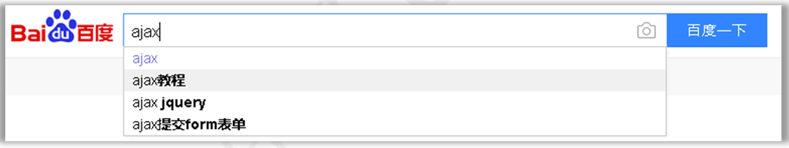

# AJAX&JSON

## 一. AJAX的概述

### 1.1 什么是ajax


<figure class="thumbnails">
    
</figure>

​	**异步JavaScript和XML (Asynchronous Javascript And XML)**

> 前端用于发起异步请求的技术: 基于js和xml诞生的,xml被淘汰换成json

1. 异步的访问方式

2. 使用到的技术：JavaScript和XML

   a. JavaScript：用于后台请求的发送和响应数据的接收，(以前提交表单或在浏览器上输入地址)。

   b. XML：用于封装服务器发送的大量的数据，因为XML无关的数据太多，而且解析比较麻烦。所以目前几乎不再使用了，使用JSON格式来代替。

   ```xml
   <contactList>
      <contact> 
         <id>1</id>
         <name>潘金莲</name>
         <sex>女</sex>
         <address>烧饼店</address>
      </contact>
      <contact> 
         <id>2</id>
         <name>武大</name>
         <sex>男</sex>
         <address>烧饼连锁店</address>
       </contact>
   </contactList>
   ```


### 1.2 同步和异步的区别

同步方式：浏览器与服务器是串行的操作，浏览器发工作的时候，服务器没有处理数据的。服务器在工作的时候，浏览器只能等待。以前使用JSP开发的方式都是同步的方式。

缺点：执行效率低，用户体验差。

异步方式：以后逐渐会使用异步的开发，浏览器与服务器是并行工作的。

优点：执行效率高，用户体验更好。

很大企业开发中，是同步和异步并存的方式。	


<figure class="thumbnails">
    
</figure>

​	AJAX使用异步的提交方式，浏览器与服务器可以并行操作，即浏览器后台发送数据给服务器。用户在前台还是可以继续工作。用户感觉不到浏览器已经将数据发送给了服务器，并且服务器也已经返回了数据。


<figure class="thumbnails">
    
</figure>

### 1.3 AJAX的应用场景

#### 1.3.1 检查用户名是否已被注册

​	很多站点的注册页面都具备自动检测用户名是否存在的友好提示，该功能整体页面并没有刷新，但仍然可以异步与服务器端进行数据交换，查询用户的输入的用户名是否在数据库中已经存在。   

                                                    

<figure class="thumbnails">
    
</figure>

####  1.3.2 内容自动补全

百度的搜索补全功能：


<figure class="thumbnails">
    
</figure>

京东的搜索补全功能：


<figure class="thumbnails">
    
</figure>

## 二. 原生ajax的访问流程[了解]

### 1.1 AJAX的执行流程


<figure class="thumbnails">
    
</figure>

流程说明：

1. 用户访问的时候，由JavaScript后台创建一个请求对象：XMLHttpRequest对象。
2. 请求对象创建一个回调函数，回调函数用于处理服务器返回的响应
3. 请求对象用于发送请求给服务器
4. 服务器接收到浏览器发过来的请求，并且对数据进行处理。
5. 将数据以XML的格式发送回浏览器，由XMLHttpRequest请求对象的回调函数接收数据
6. 使用HTML和CSS更新网页最新结果


### 1.2 XMLHttpRequest对象

​	学习XMLHttpRequest对象有哪些事件，方法和属性

| **创建XMLHttpRequest对象** | **说明**             |
| -------------------------- | -------------------- |
| **new XMLHttpRequest()**   | 构造方法直接创建对象 |

| **XMLHttpRequest对象的事件** | **说明**                                                     |
| ---------------------------- | ------------------------------------------------------------ |
| **on ready state change**    | 准备状态改变事件，这个事件是在以下情况激活：<br />1. 浏览器开始发送数据给服务器的时候<br />2. 浏览器数据发送完毕的时候<br />3. 服务器开始发送数据给浏览器的时候<br />4. 服务器数据发送完毕的时候 |

| **XMLHttpRequest对象的属性** | **说明**                                              |
| ---------------------------- | ----------------------------------------------------- |
| **readyState**               | 准备状态的值，当它等于4的时候，表示服务器数据接收完毕 |
| **status**                   | 服务器的状态码。等于200的时候，服务器正确响应         |
| **responseText**             | 接收服务器返回的字符串数据                            |

| **XMLHttpRequest对象的方法** | **说明**                                                     |
| ---------------------------- | ------------------------------------------------------------ |
| **open("GET","URL",true)**   | 打开服务器的连接<br />1. GET或POST表示请求的方式<br />2. URL访问服务器的地址<br />3. true/false 表示异步，false表示同步。<br />同步是指要等待服务器响应回来以后，才继续向后执行。 |
| **send()**                   | 发送请求，如果是GET方法send()不需要参数。<br />如果是POST，send()需要传递浏览器端的数据 |


### 1.3 案例：使用原生的AJAX

文档查询：

​	1.// xml--->xml--->XMLHttpRequest(示例代码)

​	2.// xml--->XML DOM --->XDOM - XMLHttpRequest (方法api)

```java
package com.itheima.web.servlet;

import java.io.IOException;

/**
 * <p></p>
 *
 * @Description:
 */
@javax.servlet.annotation.WebServlet("/HelloServlet")
public class HelloServlet extends javax.servlet.http.HttpServlet {
    protected void doPost(javax.servlet.http.HttpServletRequest request, javax.servlet.http.HttpServletResponse response) throws javax.servlet.ServletException, IOException {

        request.setCharacterEncoding("utf-8");

        String name = request.getParameter("name");
        System.out.println(name);

        response.getWriter().println("hello");

    }

    protected void doGet(javax.servlet.http.HttpServletRequest request, javax.servlet.http.HttpServletResponse response) throws javax.servlet.ServletException, IOException {
        doPost(request, response);
    }
}
```


```html
<!DOCTYPE html>
<html lang="zh-CN">
<head>
    <meta charset="UTF-8">
    <title>Title</title>
</head>
<body>
        <input type="button" value="js原生的ajax请求(get)" id="btn1"> <br>
        <input type="button" value="js原生的ajax请求(post)" id="btn2"> <br>
</body>

<script>
    var btn1 = document.getElementById("btn1");
        //按钮被点击,发起一个异步请求
    btn1.onclick = function () {
        //1. 创建一个XMLHttpRequest对象 (ajax引擎)
        var xhr = new XMLHttpRequest();

        //4. 设置状态改变监听
            /*
            *  当ajax状态改变的时候就会触发: 总共5种状态(0~4),改变4次
            *       只有最后一种状态对我们来说,有意义 -> 表示响应已就绪
            *
            * */
        xhr.onreadystatechange = function(){
            // console.log("哈")
            if(xhr.readyState == 4){
                if(xhr.status == 200){
                        //请求成功
                    alert(xhr.responseText) //获得字符串形式的响应数据。
                }else{
                        //请求失败
                    // document.write(xhr.responseText) // 显示网页上
                    alert("o(╥﹏╥)o 找不到网页")
                }


            }
        }

        //2. 设置参数
            /*
            *   open(method,url,async)
            *
            *       method：请求的类型；GET 或 POST
                    url：请求地址
                    async：true（异步）或 false（同步）
            * */
        xhr.open("get","MyServlet?name=zs",true)

        //3. 发起请求
            /*
            *   send(string)
            *       string：仅用于 POST 请求

            * */
        xhr.send()
    }
</script>

<script>
    var btn2 = document.getElementById("btn2");
    //按钮被点击,发起一个异步请求
    btn2.onclick = function () {
        var xhr = new XMLHttpRequest();


        xhr.onreadystatechange = function(){
            if(xhr.readyState == 4){

                if(xhr.status == 200){

                    alert(xhr.responseText) //获得字符串形式的响应数据。
                }else{
                    alert("o(╥﹏╥)o 找不到网页")
                }


            }
        }

        xhr.open("post","MyServlet",true)

        //3. 发起请求
            //指定请求体MIME类型 ,不然无法服务器无法解析请求体中的参数
        xhr.setRequestHeader("content-type","application/x-www-form-urlencoded")
        xhr.send("name=ww")
    }
</script>

<!--<form action="" enctype="application/x-www-form-urlencoded"></form>-->
</html>
```


## 三. JQuery的Ajax封装【会用】

​	jquery作为一个优秀的js框架, 自然也会对ajax的复杂的api进行封装:


<figure class="thumbnails">
    
</figure>

### 3.3.1 get/post 函数

```markdown
* 1. get请求方式
	$.get(url, [data], [callback], [type])
		1. url : 请求的服务器端url地址
		2. data : 发送给服务器端的请求参数，格式可以是key=value，也可以是json对象
		3. callback: 当请求成功后的回掉函数，可以在函数体中编写我们的逻辑代码
		4. type : 预期的返回数据的类型，取值可以是 xml, html, script, json, text					(主要text和json两种)
		
* 2. post请求方式 :
	$.post(url, [data], [callback], [type])
		只需要将get函数换成post即可(参数含义同上)

```

```html
<!DOCTYPE html>
<html lang="zh">
<head>
  <meta charset="UTF-8">
  <title>jquery方式</title>
</head>
<body>

  <input type="button" value="ajax的get请求" id="gbtn">
  <input type="button" value="ajax的post请求"  id="pbtn"/>


  <script src="js/jquery-3.3.1.js"></script>

  <script !src="">

    $("#gbtn").click(function () {

      // jquery的ajax中get请求
      /*
      * 1. get请求方式
      $.get(url, [data], [callback], [type])
          1. url : 请求的服务器端url地址
          2. data : 发送给服务器端的请求参数，格式可以是key=value，也可以是json对象
          3. callback: 当请求成功后的回掉函数，可以在函数体中编写我们的逻辑代码
          4. type : 预期的返回数据的类型，取值可以是 xml, html, script, json,  text(默认)
       */
      $.get("AjaxServlet","name=xiaobiaodi",function (result) {
        alert(result);
      })
    })


    $("#pbtn").click(function () {

      // jquery的ajax中get请求
      /*
      * 2. post请求方式 :
	    $.post(url, [data], [callback], [type])
          1. url : 请求的服务器端url地址
          2. data : 发送给服务器端的请求参数，格式可以是key=value，也可以是json对象
          3. callback: 当请求成功后的回掉函数，可以在函数体中编写我们的逻辑代码
          4. type : 预期的返回数据的类型，取值可以是 xml, html, script, json, text(默认)
       */
      /*
        result：响应数据--服务器给的数据
                result参数是jq库在底层中调用服务端的地址获得数据，并将响应的内容传入到result中
        function：回调函数
                jq在进行与服务端进行交互完毕，回来调用开发人员传入的回调方法，然后将响应的结果传入参数中，并执行回调方法。
       */
      $.post("AjaxServlet","name=xiaobiaodi",function (result) {
          // alert(result);

        console.log(result);
        console.log("id:"+result.id);
        console.log("name:"+result.name);

      },"json")
    })
  </script>


</body>
</html>
```


### 3.3.2 ajax函数(了解)

```markdown
* 语法：
		$.ajax({name:value,name:value})
	
* 参数：
	1. url	: 请求的服务器端url地址
	2. async : (默认: true) 默认设置下，所有请求均为异步请求。如果需要发送同步请求,设置false
	3. data : 发送到服务器的数据，可以是键值对形式，也可以是js对象形式
	4. type : (默认: "GET") 请求方式 ("POST" 或 "GET")
	5. dataType : 预期的返回数据的类型(默认text,常用json)
	6. success	: 请求成功后的回调函数
	7. error	: 请求失败时调用此函数
	这些参数,是可以选择性的写
	
* 总结: 在实际使用中, 比get/post请求多考虑了失败的情况
```


```html
<!DOCTYPE html>
<html lang="zh">
<head>
  <meta charset="UTF-8">
  <title>完整版</title>
</head>
<body>

  <script src="js/jquery-3.3.1.js"></script>


  <script !src="">

    /*
    1. url	: 请求的服务器端url地址
    2. async : (默认: true) 默认设置下，所有请求均为异步请求。如果需要发送同步请求,设置false
    3. data : 发送到服务器的数据，可以是键值对形式，也可以是js对象形式
    4. type : (默认: "GET") 请求方式 ("POST" 或 "GET")
    5. dataType : 预期的返回数据的类型(默认text,常用json)
    6. success	: 请求成功后的回调函数
    7. error	: 请求失败时调用此函数
    这些参数,是可以选择性的写
     */


    // let setting={
    //   url:"AjaxServlet",
    //   async:true,
    //   data:"name=xiaobiaodi",
    //   type:"get",
    //   dataType: "json",
    //   success:function (result) {
    //     console.log(result.id);
    //   },
    //   error:function () {
    //     console.log("请求失败")
    //   }
    // }
    //
    // $.ajax(setting);


    $.ajax({
      url:"AjaxServlet1",
      async:true,
      data:"name=xiaobiaodi",
      type:"get",
      dataType: "json",
      success:function (result) {
        console.log(result.id);
      },
      error:function () {
        console.log("请求失败")
      }
    });

  </script>

</body>
</html>
```

### 3.3.3 检查用户名是否已被注册

```markdown
#需求: 
	   a. 有一个注册的表单, 有注册用户名和密码,一个提交按钮
	   b. 用户名输完之后,检测这个用户名是否可用
#分析:
	1. 用户名输入框注册一个失去焦点事件(onblur)
	2. 向服务器发送 异步 请求
	3. 服务器响应之后, 提示信息 局部更新到页面上
```


```html
<!DOCTYPE html>
<html lang="zh-CN">
<head>
    <meta charset="UTF-8">
    <title>Title</title>
</head>
<body>
        <h1>注册页面</h1>
        <form action="" method="get">
            <input type="text" name="username" placeholder="请输入用户名" id="username">
            <span id="usernameSpan"></span>
            <br>
            <input type="password" name="password" placeholder="请输入密码" id="password"> <br>
            <input type="submit">
        </form>
</body>

<!--  1.导入jquery库-->
  <script src="js/jquery-3.3.1.js"></script>


<!--  2.编写前端代码-->

  <script !src="">

    // a.给input 的name=username来绑定事件
    $("#username").blur(function () {

      // b.获得用户数据的内容
      let user_input = $("#username").val();

      // c.发送ajax请求
      $.get("ExistsNameServlet",`uname=${user_input}`,function (result) {

        // d.判断服务器结果
        // console.log(result);

        // 清空id="usernameSpan"内容
        $("#usernameSpan").empty();
        // $("#usernameSpan").html("")

        if (result.flag) {
          $("#usernameSpan").text("用户名已经存在，请更改");
        }else{
          $("#usernameSpan").text("用户名可以使用");
        }
      },"json")

    })
  </script>


</html>
```


```java
package com.itheima.web.servlet;

import javax.servlet.ServletException;
import javax.servlet.annotation.WebServlet;
import javax.servlet.http.HttpServlet;
import javax.servlet.http.HttpServletRequest;
import javax.servlet.http.HttpServletResponse;
import java.io.IOException;

/**
 * <p></p>
 *
 * @Description:
 */
@WebServlet("/ExistsNameServlet")
public class ExistsNameServlet extends HttpServlet {
    protected void doPost(HttpServletRequest request, HttpServletResponse response) throws ServletException, IOException {

        // 1.获得用户转来的数据(get)
        String uname = request.getParameter("uname");


        String jsonstr = "";
        // 2.调用service获得用户数据（伪数据）
        if ("jack".equalsIgnoreCase(uname)) {

            // 用户存在
             jsonstr = "{\"flag\":true}";


        } else {
            // 用户不存在
             jsonstr = "{\"flag\":false}";
        }

        // 3.设置响应类型
        response.setContentType("application/json;charset=utf-8");

        // 4.响应内容
        response.getWriter().println(jsonstr);
    }

    protected void doGet(HttpServletRequest request, HttpServletResponse response) throws ServletException, IOException {
        doPost(request, response);
    }
}
```


## 四.  JSON

### 4.1 JSON概述

JavaScript对象表示形式（JavaScript Object Notation : js对象简谱）

> json是一种js对象文本表示形式
>
> json是目前前后端数据交互的主要格式之一

```markdown
* java对象表示形式
		User user = new User();
			user.setUsername("后羿");
			user.setAge(23);
			user.setSex("男");
			...
			
		Product product = new Product();
			product.setName("小米10");
			product.setDesc("1亿像素的手机小王子");
			
* javaScript对象表示形式
		let user ={username:'xiaoming',age:18}
		let product = {name:"小米10",desc:"1亿像素的手机小王子"}
```


json可以取代XML笨重的数据结构，和xml相比：更小、更快，更易解析

> json、xml作用：作为数据的载体，在网络中传输


<figure class="thumbnails">
    
</figure>

```HTML
<!DOCTYPE html>
<html lang="zh">
<head>
  <meta charset="UTF-8">
  <title>json对象</title>
</head>
<body>

  <script !src="">

    // 1.js对象
    // 方式一：先定义对象，后定义属性
    let jsObj1 = {};
    jsObj1.name = "xiaoming";

    // console.log(typeof jsObj1);
    // console.log(jsObj1.name);

    // 方式二：定义对象时定义属性
    let jsObj2 = {
        name:"xiaohong",
        age:18
    }
    // console.log(typeof jsObj2);
    // console.log(jsObj2.name+"---"+jsObj2.age);

    // 2.json对象--实质是js对象
    // 特点：json对象的属性名为：string，属性值：js的5个基本类型（string，number，boolean，null，undefined）
    let jsonObj = {
      "name":"xiaojindou",
      "age":"666",
      "gender":true
    }
    console.log(typeof jsonObj);
    console.log(jsonObj.name+"---"+jsonObj.age);

  </script>


</body>
</html>
```


### 4.2 JSON基础语法

```markdown
#json的语法主要有两种:
        1. 对象 { }
        2. 数组 [ ]
        
1. 对象类型
		{name:value,name:value}
		
2. 数组类型
		[
            {name:value,name:value},
            {name:value,name:value},
            {name:value,name:value}
		]
		
3. 复杂对象
		{
            name:value,
            wives:[{name:value},{},{}],
            son:{name:value}
		}
#注意: 
	1. 其中name必须是string类型
	2. value必须是以下数据类型之一：
		字符串
		数字
		对象（JSON 对象）
		数组
		布尔
		Null
	3. JSON 中的字符串必须用双引号包围。(单引号不行!)	
```


```html
<!DOCTYPE html>
<html lang="zh">
<head>
  <meta charset="UTF-8">
  <title>json语法</title>
</head>
<body>
  <script !src="">

   

    /* json解析 */
    // ES5后 js中有一个对象 JSON
    // 1.解析json格式的字符串
    let jsonStr = '{"name":"xiaoming","age":18}';
    // console.log(typeof jsonStr);
    // console.log(jsonStr.name);

    // JSON.parse()--将json的字符串形式内容解析为json对象
    let parse = JSON.parse(jsonStr);
    // console.log(parse.name);
    // console.log(typeof  parse);


    // JSON.stringify()--将json对象转为json格式的字符串
    let stringify = JSON.stringify(parse);
    console.log(typeof  stringify);
    console.log(stringify.name);


  </script>
</body>
</html>
```


### 4.3 JSON格式转换

```markdown
* JSON对象与字符串转换的相关函数
	语法：
    	1. JSON.stringify(object) 把json对象转为字符串
    
    	2. JSON.parse(string) 把字符串转为json对象
```

```html
<!DOCTYPE html>
<html lang="zh">
<head>
  <meta charset="UTF-8">
  <title>json语法</title>
</head>
<body>
  <script !src="">

 

    /* json解析 */
    // ES5后 js中有一个对象 JSON
    // 1.解析json格式的字符串
    let jsonStr = '{"name":"xiaoming","age":18}';
    // console.log(typeof jsonStr);
    // console.log(jsonStr.name);

    // JSON.parse()--将json的字符串形式内容解析为json对象
    let parse = JSON.parse(jsonStr);
    // console.log(parse.name);
    // console.log(typeof  parse);


    // JSON.stringify()--将json对象转为json格式的字符串
    let stringify = JSON.stringify(parse);
    console.log(typeof  stringify);
    console.log(stringify.name);


  </script>
</body>
</html>
```


### 4.4 将Java对象转成JSON字符串

**需求**

​	在服务器端有如下User代码，要转成符合JSON格式的字符串响应给浏览器，首先自己采用字符串拼接的方式输出。

```java
public class User {

    private String name;
    private Integer age;
    private boolean married;

    public User() {
    }

    public User(String name, Integer age, boolean married) {
        this.name = name;
        this.age = age;
        this.married = married;
    }

      @Override
    public String toString() {
        return "User{" +
                "name='" + name + '\'' +
                ", age=" + age +
                ", married=" + married +
                '}';
    }

    public String getName() {
        return name;
    }

    public void setName(String name) {
        this.name = name;
    }

    public Integer getAge() {
        return age;
    }

    public void setAge(Integer age) {
        this.age = age;
    }

    public boolean isMarried() {
        return married;
    }

    public void setMarried(boolean married) {
        this.married = married;
    }
}

```

#### 4.4.1 json转换工具的概述

​	json的转换工具是通过java封装好的一些jar工具包，直接将java对象或集合转换成json格式的字符串。

**常见的json转换工具**


<figure class="thumbnails">
    
</figure>

#### **4.4.2 使用步骤**

1. 导包fastjson的jar包 和jackson包

```XML
<!-- FastJson 依赖包 -->
<dependency>
     <groupId>com.alibaba</groupId>
     <artifactId>fastjson</artifactId>
     <version>1.2.47</version>
 </dependency>


<!-- JackSon 依赖包 -->
<dependency>
    <groupId>com.fasterxml.jackson.core</groupId>
    <artifactId>jackson-core</artifactId>
    <version>2.11.2</version>
</dependency>
<dependency>
    <groupId>com.fasterxml.jackson.core</groupId>
    <artifactId>jackson-annotations</artifactId>
    <version>2.11.2</version>
</dependency>
<dependency>
    <groupId>com.fasterxml.jackson.core</groupId>
    <artifactId>jackson-databind</artifactId>
    <version>2.11.2</version>
</dependency>
```


   2.在测试类中使用json工具类：JSON

   3.调用类中的方法(对象或集合)

| **fastjson对象中的方法** | **说明**                       |
| ------------------------ | ------------------------------ |
| **toJSONString**         | 将一个对象转成JSON格式的字符串 |

| jackson对象中的方法**  | **说明**                       |
| ---------------------- | ------------------------------ |
| **writeValueAsString** | 将一个对象转成JSON格式的字符串 |


```java
package com.itheima.test;

import com.alibaba.fastjson.JSON;
import com.fasterxml.jackson.core.JsonProcessingException;
import com.fasterxml.jackson.databind.ObjectMapper;
import com.itheima.domain.User;
import org.junit.Test;

import java.util.ArrayList;
import java.util.Collections;
import java.util.HashMap;

/**
 * <p></p>
 *
 * @Description:
 */
public class JsonTest {


    @Test
    /*
    将对象转为json
     */
    public void test01() {

        User user = new User("xiaoming", 18, "male");

        // 使用fastjson来转换
        String jsonString = JSON.toJSONString(user);
        // 最早前没有工具，一般是拼接
        // String jsonStr = "{\"age\":18,\"gender\":\"male\",\"name\":\"xiaoming\"}";


        System.out.println(jsonString);

    }

    @Test
    public void test011() throws JsonProcessingException {

        User user = new User("xiaoming", 18, "male");

        // 使用jackson来转换
        ObjectMapper objectMapper = new ObjectMapper();
        String jsonString = objectMapper.writeValueAsString(user);


        System.out.println(jsonString);

    }


    /*
    * 将数组内容转为json
    * */
    @Test
    public void test02() {

        User user1 = new User("xiaoming", 18, "male");
        User user2 = new User("xiaohong", 18, "male");
        User user3 = new User("xiaoqiang", 18, "male");

        ArrayList<User> users = new ArrayList<User>();
        Collections.addAll(users, user1, user2, user3);


        // 使用fastjson来转换
        String jsonString = JSON.toJSONString(users);


        System.out.println(jsonString);

    }


    /*
     * 将数组内容转为json
     * */
    @Test
    public void test022() throws JsonProcessingException {

        User user1 = new User("xiaoming", 18, "male");
        User user2 = new User("xiaohong", 18, "male");
        User user3 = new User("xiaoqiang", 18, "male");

        ArrayList<User> users = new ArrayList<User>();
        Collections.addAll(users, user1, user2, user3);


        // 使用jackson来转换
        String jsonString = new ObjectMapper().writeValueAsString(users);


        System.out.println(jsonString);

    }


    /*
     * 将复杂内容转为json
     * */
    @Test
    public void test03() throws JsonProcessingException {

        User user1 = new User("xiaoming", 18, "male");
        User user2 = new User("xiaohong", 18, "male");
        User user3 = new User("xiaoqiang", 18, "male");

        ArrayList<User> users = new ArrayList<User>();
        Collections.addAll(users, user1, user2, user3);

        HashMap<String, Object> map = new HashMap<String, Object>();

        map.put("name", "xiaobao");
        map.put("wifves", users);
        map.put("age", 18);
        map.put("user1",user1);


        // 使用jackson来转换
        String jsonString = new ObjectMapper().writeValueAsString(map);


        System.out.println(jsonString);

    }


    /*
     * 将复杂内容转为json
     * */
    @Test
    public void test033() {

        User user1 = new User("xiaoming", 18, "male");
        User user2 = new User("xiaohong", 18, "male");
        User user3 = new User("xiaoqiang", 18, "male");

        ArrayList<User> users = new ArrayList<User>();
        Collections.addAll(users, user1, user2, user3);

        HashMap<String, Object> map = new HashMap<String, Object>();

        map.put("name", "xiaobao");
        map.put("wifves", users);
        map.put("age", 18);
        map.put("user1",user1);


        // 使用jackson来转换
        String jsonString = JSON.toJSONString(map);


        System.out.println(jsonString);

    }

}
```


### 4.5 ajax和json综合练习


<figure class="thumbnails">
    
</figure>

```html
<!DOCTYPE html>
<html lang="zh">
<head>
  <meta charset="UTF-8">
  <title>案例：ajax和json</title>
</head>
<body>

  <input type="button" value="get的ajax请求" id="getBtn"> <br>
  <input type="button" value="post的ajax请求" id="postBtn"> <br>


  <!--  引入jquery库 -->
  <script src="js/jquery-3.3.1.js"></script>

  <script !src="">

    $("#getBtn").click(function () {

      // 方式一：name=value
      let param = `name=jindou&age=18`;

      $.get("AjaxServlet",param,function (resp) {
        console.log(resp);
        console.log(resp.name);
        console.log(resp.age);
      },"json")


    })

    $("#postBtn").click(function () {

      // 方式二：{"name":"value"}--json
      let param ={"name":"xiaoming","age":"18"};

      $.post("AjaxServlet",param,function (resp) {
        console.log(resp);
        console.log(resp.name);
        console.log(resp.age);
      },"json")


    })


  </script>

</body>
</html>
```


```java
package com.itheima.web.servlet;

import com.alibaba.fastjson.JSON;
import com.itheima.domain.User;

import java.io.IOException;

/**
 * <p></p>
 *
 * @Description:
 */
@javax.servlet.annotation.WebServlet("/AjaxServlet")
public class AjaxServlet extends javax.servlet.http.HttpServlet {
    protected void doPost(javax.servlet.http.HttpServletRequest request, javax.servlet.http.HttpServletResponse response) throws javax.servlet.ServletException, IOException {

        //1.获得请求参数
        request.setCharacterEncoding("utf-8");
        String name = request.getParameter("name");
        String age = request.getParameter("age");
        System.out.println(name + ":" + age);

        // 2.响应数据给客户端（json数据）
        User user = new User("xiaoming", 18, "female");
        String jsonString = JSON.toJSONString(user);

        // 3.设置响应类型和响应内容
        response.setContentType("application/json;charset=utf-8");
        response.getWriter().println(jsonString);

    }

    protected void doGet(javax.servlet.http.HttpServletRequest request, javax.servlet.http.HttpServletResponse response) throws javax.servlet.ServletException, IOException {
        doPost(request, response);
    }
}
```


## 五.综合案例

### 自动补全项目搭建

**需求**

在输入框输入关键字，下拉框中异步显示与该关键字相关的用户名称

**分析**

1. 查询以输入的关键字开头的用户
2. 文本框使用keyup事件，得到文本框中的值，去掉前后空格。如果文本框的内容为空则不提交给服务器。
3. 查询成功的回调函数中如果返回的用户数大于0才进行div的拼接，拼接以后显示在div中。
4. 否则要隐藏div。
5. 给大div中的子div绑定鼠标点击事件，点击某个名字则将div的文本内容显示在文本框中，并隐藏div


<figure class="thumbnails">
    
</figure>

**效果**


<figure class="thumbnails">
    
</figure>


**导入数据库脚本**

```mysql
CREATE TABLE `user` (
  `id` int(11) NOT NULL AUTO_INCREMENT,
  `name` varchar(32) DEFAULT NULL,
  `password` varchar(32) DEFAULT NULL,
  PRIMARY KEY (`id`)
);

INSERT INTO `user` VALUES (1, '张三', '123');
INSERT INTO `user` VALUES (2, '李四', '123');
INSERT INTO `user` VALUES (3, '王五', '123');
INSERT INTO `user` VALUES (4, '赵六', '123');
INSERT INTO `user` VALUES (5, '田七', '123');
INSERT INTO `user` VALUES (6, '孙八', '123');
INSERT INTO `user` VALUES (7, '张三丰', '123');
INSERT INTO `user` VALUES (8, '张无忌', '123');
INSERT INTO `user` VALUES (9, '李寻欢', '123');
INSERT INTO `user` VALUES (10, '王维', '123');
INSERT INTO `user` VALUES (11, '李白', '123');
INSERT INTO `user` VALUES (12, '杜甫', '123');
INSERT INTO `user` VALUES (13, '李贺', '123');
INSERT INTO `user` VALUES (14, '李逵', '123');
INSERT INTO `user` VALUES (15, '宋江', '123');
INSERT INTO `user` VALUES (16, '王英', '123');
INSERT INTO `user` VALUES (17, '鲁智深', '123');
INSERT INTO `user` VALUES (18, '武松', '123');
INSERT INTO `user` VALUES (19, '张薇', '123');
INSERT INTO `user` VALUES (20, '张浩', '123');
INSERT INTO `user` VALUES (21, '刘小轩', '123');
INSERT INTO `user` VALUES (22, '刘浩宇', '123');
INSERT INTO `user` VALUES (23, '刘六', '123');
```

**编写实体类**

```java

public class User3 {
    private Integer id;
    private String name;
    private String password;

    @Override
    public String toString() {
        return "User3{" +
                "id=" + id +
                ", name='" + name + '\'' +
                ", password='" + password + '\'' +
                '}';
    }

    public Integer getId() {
        return id;
    }

    public void setId(Integer id) {
        this.id = id;
    }

    public String getName() {
        return name;
    }

    public void setName(String name) {
        this.name = name;
    }

    public String getPassword() {
        return password;
    }

    public void setPassword(String password) {
        this.password = password;
    }
}

```

**代码**

```html
<!DOCTYPE html>
<html lang="zh-CN">
<head>
    <meta charset="UTF-8">
    <title>自动完成</title>
    <style type="text/css">
        .content {
            width: 400px;
            margin: 30px auto;
            text-align: center;
        }

        input[type='text'] {
            box-sizing: border-box;
            width: 280px;
            height: 30px;
            font-size: 14px;
            border: 1px solid #38f;
        }

        input[type='button'] {
            width: 100px;
            height: 30px;
            background: #38f;
            border: 0;
            color: #fff;
            font-size: 15px;
        }

        #show {
            box-sizing: border-box;
            position: relative;
            left: 7px;
            font-size: 14px;
            width: 280px;
            border: 1px solid dodgerblue;
            text-align: left;
            border-top: 0;
            /*一开始是隐藏不可见*/
            display: none;
        }

        #show div {
            padding: 4px;
            background-color: white;
        }

        #show div:hover {
            /*鼠标移上去背景变色*/
            background-color: #3388ff;
            color: white;
        }
    </style>
    <script type="text/javascript" src="js/jquery-3.3.1.js"></script>
</head>
<body>
<div class="content">
    <br/><br/>
    <input type="text" name="word" id="word">
    <input type="button" value="搜索一下">
    <div id="show">
    </div>
</div>

<script type="text/javascript">
    /*用户输入触发事件*/
    // 1.绑定事件--keyup
    $("#word").keyup(function () {
        // this代表input-id：word

        // $(this).val();
        // 2.获得用户的输入内容
        let word = this.value;

        // 判断word释放为空
        if (word) {
            // 3.发送ajax请求
            $.get("UserServlet", {"word": word}, function (resp) {

                // 4.接收服务端数据--json的array
                // console.log(resp);
                $("#show").css("display", "block");

                // 5.遍历数据
                if (resp) {
                    // 清空div的id为show里面的内容
                    $("#show").empty();

                    for (let e of resp) {
                        // 获得服务端的内容
                        $("#show").append(`<div>${e.name}</div>`)
                    }
                }

            }, "json");
        } else {
            // 2.清空div中的内容
            $("#show").empty();
            // 1.隐藏div
            $("#show").css("display", "none");
        }


    })

</script>
</body>
</html>
```


```java
package com.itheima.web.servlet;

import com.itheima.service.UserService;

import javax.servlet.ServletException;
import javax.servlet.annotation.WebServlet;
import javax.servlet.http.HttpServlet;
import javax.servlet.http.HttpServletRequest;
import javax.servlet.http.HttpServletResponse;
import java.io.IOException;

/**
 * <p></p>
 *
 * @Description:
 */
@WebServlet("/UserServlet")
public class UserServlet extends HttpServlet {
    protected void doPost(HttpServletRequest request, HttpServletResponse response) throws ServletException, IOException {

        // 1.获得用户数据
        String word = request.getParameter("word");

        // 2.调用service获得用户数据的json格式内容
        UserService service = new UserService();
        String json = service.findUsersByName2Json(word);

        // 3.设置响应体和内容
        response.setContentType("application/json;charset=utf-8");
        response.getWriter().println(json);

        
    }

    protected void doGet(HttpServletRequest request, HttpServletResponse response) throws ServletException, IOException {
        doPost(request, response);
    }
}

```


```JAVA
package com.itheima.service;

import com.alibaba.fastjson.JSON;
import com.itheima.dao.UserMapper;
import com.itheima.domain.User;
import com.itheima.utils.SqlSessionUtil;
import org.apache.ibatis.session.SqlSession;

import java.util.List;

/**
 * <p></p>
 *
 * @Description:
 */
public class UserService {


    /**
     * 根据name查询用户数据（json数据）
     * @param name
     * @return
     */
    public String findUsersByName2Json(String name) {

        // 1.获得sqlsession
        SqlSession session = SqlSessionUtil.getSession();

        UserMapper mapper = session.getMapper(UserMapper.class);

        List<User> users = mapper.selectByName(name);

        // 2.将数据转为json
        String jsonListStr = "";

        if (users != null&& users.size() > 0) {

            jsonListStr = JSON.toJSONString(users);

        }

        // 3.释放资源
        session.close();

        return jsonListStr;

    }
}

```


```JAVA
package com.itheima.dao;

import com.itheima.domain.User;
import org.apache.ibatis.annotations.Select;

import java.util.List;

/**
 * <p></p>
 *
 * @Description:
 */
public interface UserMapper {

    @Select("select name from user where name like concat(#{value},'%')")
    // @Select("select name from user where name like '${value}%'")
    List<User> selectByName(String name);

}
```

