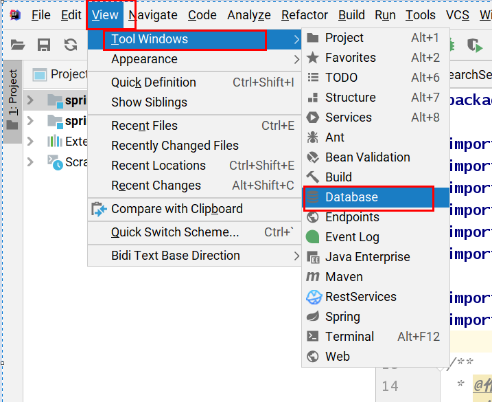
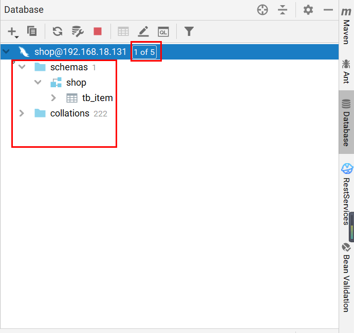

# EasyCode插件安装、配置及使用

## 安装

点击File --> Plugins 进入插件管理目录

搜索EasyCode插件 点击install安装

安装完毕后重启idea即可

## 配置

安装完毕后 点击File --> Other Settings中 发现已经有了关于EasyCode选项， 可以将作者名字更改自己的名字

在Type Mapper中是数据库中的字段对应实体类中的字段，不用改

1. Template Setting是我们重点要修改的

2. EasyCode支持配置多个分组的模板

   ​	比如：	SSM的配置一套

   ​          		 JPA的配置一套

   ​	   		....

3. 具体的模板名称 及 右侧的模板内容

     插件刚下载完自带模板，

     课件中是老师根据自己的命名习惯修改过后的模板。

     可以自行根据需要替换

     如果想替换： 可以按减号删除原有模板 

   ​                          在把课件中的模板 按 + 号一个一个添加回来

   ​			  点击模板名称，可以在右侧编辑模板内容

模板编辑完就可以愉快的使用啦，非常非常方便

## 使用

EasyCode需要结合idea中的Database管理插件一起来使用

点击idea右侧侧边栏  -->  database 按钮  

如果没找到该按钮 ，可能是隐藏了 点击顶部菜单 view --> tool windows --> 选择 database

在database页面创建一个根据数据库的连接需要创建连接

点击mysql 弹出连接配置页面

1. Driver后面是需要的mysql驱动 

   ​	注意： 如果连接5.7及以下版本 选择MySQL for 5.1的那个驱动

   ​                     如果连接8.0 版本 选择MySQL 驱动

   ​                     首次连接时驱动需要下载

2. 选择好驱动后，添加好数据库其他参数

     可以点击Test Connection测试连接

     点击apply创建连接

点击连接后，显示数据库的相关信息

​    schemas 下是数据库列表，数据库下是 table 列表

​        点击 1of 5 可以选择显示其他的数据库 

选择要生成代码的表（可选多个），

显示为选择蓝色后

右键点击GenerateCode --> EasyCode 生成代码 

生成配置

1. 如果多个项目 要生成在哪个项目中
2. 生成代码所处的包 包名
3. 生成代码的路径
4. 生成哪些模板代码，点击all全部即可
5. 点击OK即可生成代码

如： 代码会被生成到com.itcast.shop包中

结果：

实体类、mapper接口、mapper.xml、service层

controller层的基本CRUD代码全部生成完毕啦~ 快吧

