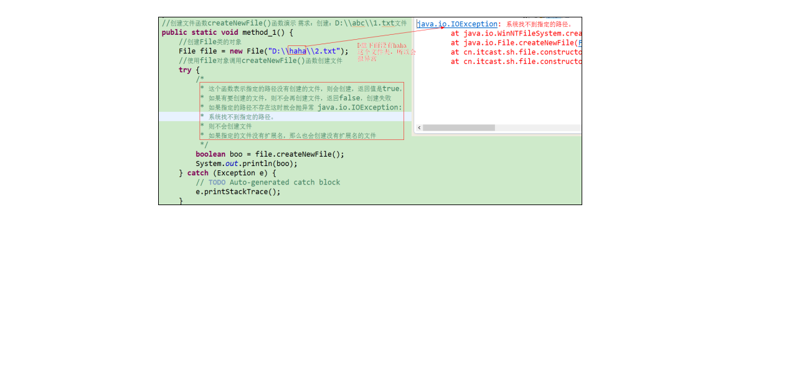
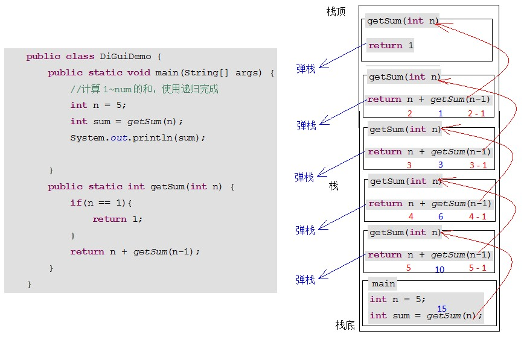
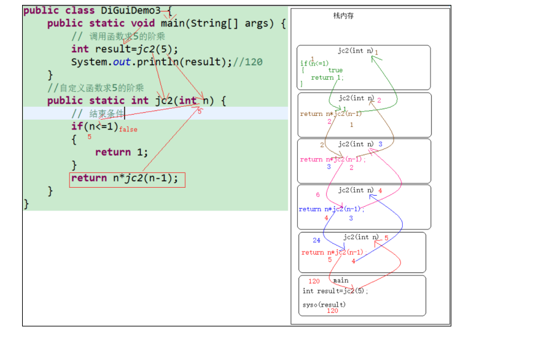
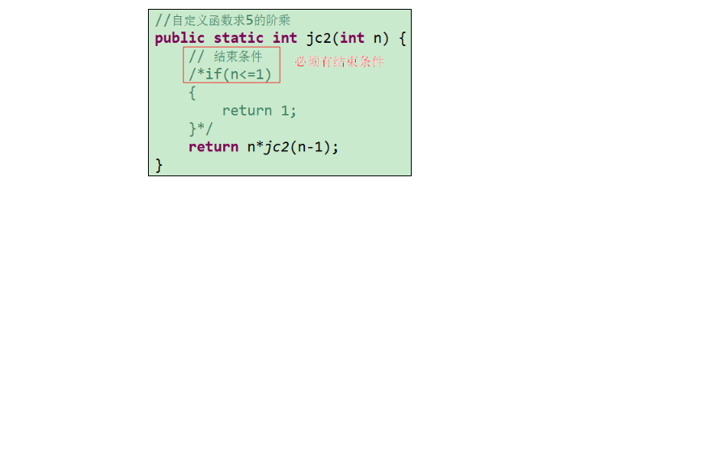
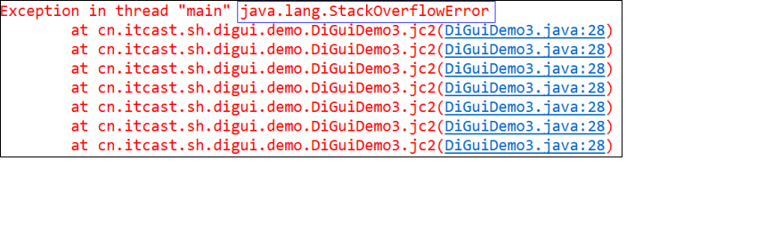
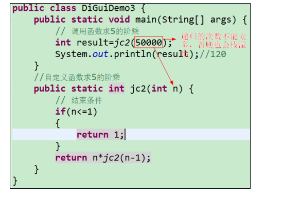
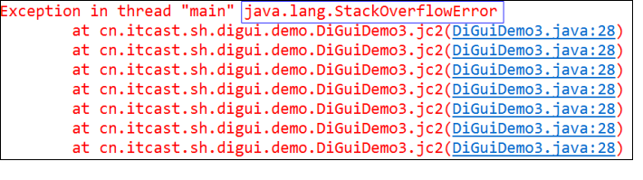
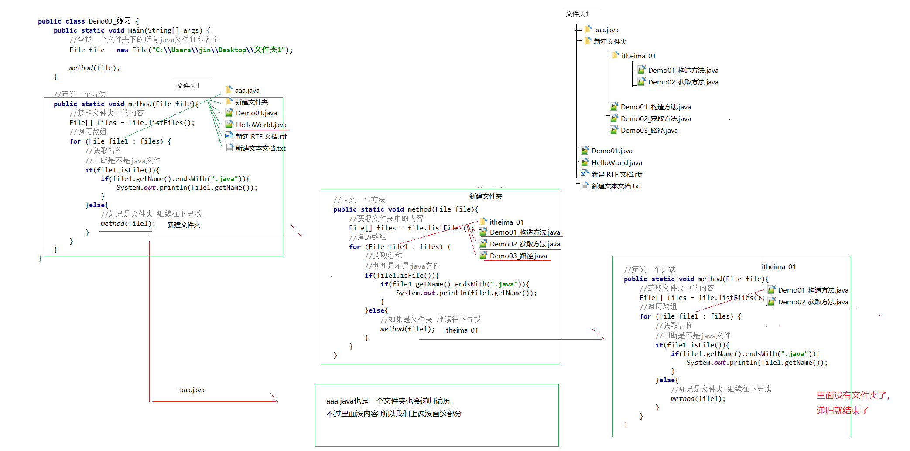
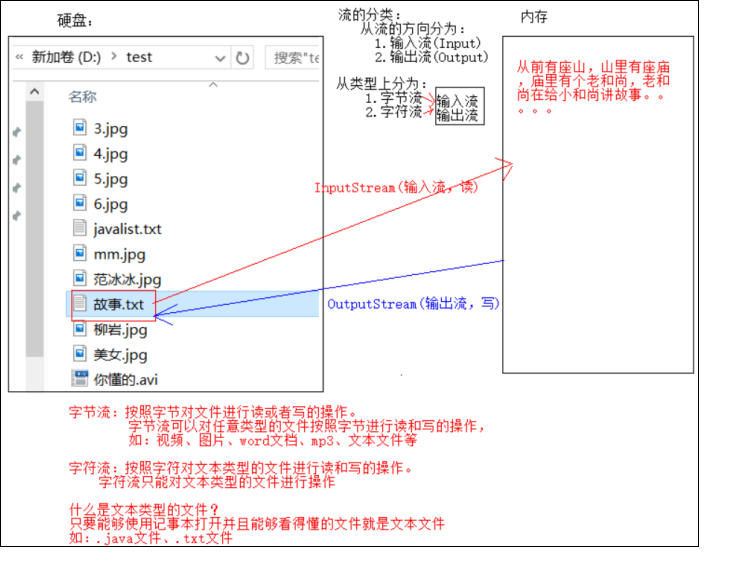
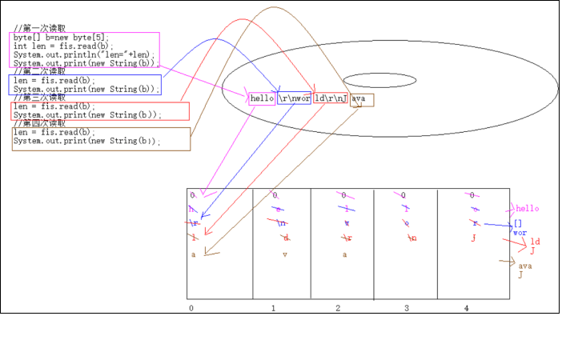

# 第一章 File类

## 1.1 概述

据最终保存在硬盘上，在硬盘上是以1和0 保存的。而给我们展示出来的并不是二进制数据，而是一个一个的文件，换句话说数据最终都保存在这些文件中。而这些文件又被文件夹管理。

  	通过上述描述我们发现在计算机硬盘中就存在两种事物：文件和文件夹事物。而在Java中使用class类来描述生活中存在的事物，那么Java中是如何描述文件和文件夹这两类事物呢？

使用File类来描述文件和文件夹事物。

`java.io.File` 类是文件和目录路径名的抽象表示，主要用于文件和目录的创建、查找和删除等操作。

说明：

​	 	1）Java中的定义的io技术的类基本都在java.io包下；

         2）使用File类来描述文件和文件夹事物的；

 	    3）File类它主要是对持久设备上的文件和文件夹进行操作。它不能去操作文件中的数据。将来我们只要需要操作持久设备上的文件或文件夹直接找File类完成，如果要操作文件中的数据只能使用IO流技术搞定；


**结论：File类就是描述文件或文件夹的，只要我们在Java中要操作文件或文件夹，就找File类。**


## 1.2 构造方法

* `public File(String pathname) ` ：

  表示根据文件或文件夹的路径名创建一个File对象。

  使用File类的构造函数可以把指定的字符串封装成File类的对象，但是这个字符串表示的路径或者文件到底是否存在，File类是不进行判断的。

  **注意：File类表示文件和目录路径名的抽象表示形式。那么该路径代表的文件或文件夹不一定存在。**

* `public File(String parent, String child) ` ：从**父路径名字符串和子路径名字符串**创建新的 File实例。

* `public File(File parent, String child)` ：从**父抽象路径名和子路径名字符串**创建新的 File实例。  


* 构造举例，代码如下：

```java
// 文件路径名
String pathname = "D:\\aaa.txt";
File file1 = new File(pathname); 

// 文件路径名
String pathname2 = "D:\\aaa\\bbb.txt";
File file2 = new File(pathname2); 

// 通过父路径和子路径字符串
 String parent = "D:\\aaa";
 String child = "bbb.txt";
 File file3 = new File(parent, child);

// 通过父级File对象和子路径字符串
File parentDir = new File("D:\\aaa");
String child = "bbb.txt";
File file4 = new File(parentDir, child);
```

> 小贴士：
>
> 1. 一个File对象代表硬盘中实际存在的一个文件或者目录。
> 2. 无论该路径下是否存在文件或者目录，都不影响File对象的创建。

## 1.3 常用方法

File类是描述文件和文件夹的。使用File类的对象就可以获取当前File类描述的那个文件或文件夹的信息(信息包括文件或者文件夹的名称、大小、类型、日期等)。

### 获取功能的方法

* `public String getAbsolutePath() ` ：获取的当前调用这个方法的File对象的全路径（绝对路径或者真实路径） **返回的是路径的字符串；**

  ​	说明：在操作文件时，需要指定文件的路径，而路径在程序中有两种表现形式：

  ​		1、 绝对路径（真实路径）：是从盘符开始的路径，带有根目录的路

  ​		  径 例：  D:\abc\test\Demo.java     D就是根目录。

  ​		2、 相对路径：是从当前路径开始的路径，或者可以理解不带根目录的路径   

  例：  当前路径为D:\abc，要描述相对路径，只需输入test\Demo.java

* ` public String getPath() ` ：获取到当前File类的对象中封装的内容。 

* `public String getName()`  ：获取的是File类的对象中封装的文件或目录的最后一级名称。  

* `public long length()`  ：获取文件大小long size = file.length();

  

  方法演示，代码如下：

  ```java
  /*
   * File类中的获取方法演示
   * 绝对路径：带根路径
   * 相对路径：不带根路径 test\\haha表示相对路径，这里表示相对于项目day19a来说
   */
  public class FileGetFunctionDemo {
  	public static void main(String[] args) {
  		// 创建File类的对象
  		File file=new File("D:\\test\\123.txt");
  		//getAbsolutePath()获取绝对路径演示 返回的是路径的字符串 D:\test\123.txt
  		String absolutePath = file.getAbsolutePath();
  		System.out.println("absolutePath="+absolutePath);
  		
  		//getName()函数  获取的是封装在File类中的文件或者文件夹的最后一级名称 123.txt
  		System.out.println("getName()="+file.getName());
  		
  		//getPath()表示获得File类中封装的所有内容 D:\test\123.txt
  		System.out.println("getPath()="+file.getPath());
  	    //获取文件大小
  		long size = file.length();
           System.out.println("size="+size);
  	}
  }
  ```

> API中说明：length()，表示文件的长度。但是File对象表示目录，则返回值未指定。

### 绝对路径和相对路径

* **绝对路径**：从盘符开始的路径，这是一个完整的路径。
* **相对路径**：相对于项目目录的路径，这是一个便捷的路径，开发中经常使用。

```java
public class FilePath {
    public static void main(String[] args) {
      	// D盘下的bbb.java文件
        File f = new File("D:\\bbb.java");
        System.out.println(f.getAbsolutePath());
      	
		// 项目下的bbb.java文件
        File f2 = new File("bbb.java");
        System.out.println(f2.getAbsolutePath());
    }
}
输出结果：
D:\bbb.java
D:\idea_project_test4\bbb.java
```

### 判断功能的方法

- `public boolean exists()` ：是否存在 如果File类对象中的文件或者文件夹在硬盘上存在 返回 true  ，否则返回false；
- `public boolean isDirectory()` ：是否是文件夹 如果是文件夹 返回 true  否则返回false；
- `public boolean isFile()` ：是否是文件 如果是文件 返回 true ， 否则返回false;


方法演示，代码如下：

```java
public class FileIs {
    public static void main(String[] args) {
        File f = new File("D:\\aaa\\bbb.java");
        File f2 = new File("D:\\aaa");
      	// 判断是否存在
        System.out.println("D:\\aaa\\bbb.java 是否存在:"+f.exists());
        System.out.println("D:\\aaa 是否存在:"+f2.exists());
      	// 判断是文件还是目录
        System.out.println("D:\\aaa 文件?:"+f2.isFile());
        System.out.println("D:\\aaa 目录?:"+f2.isDirectory());
    }
}
输出结果：
d:\aaa\bbb.java 是否存在:true
d:\aaa 是否存在:true
d:\aaa 文件?:false
d:\aaa 目录?:true
```

### 创建删除功能的方法

- `public boolean createNewFile()` ：当且仅当具有该名称的文件尚不存在时，创建一个新的空文件。 

  ​	A:true ：表示创建文件成功；  false ：表示创建文件失败,失败原因基本是因为当前的目录有了相同的文件；

  ​	B:如果指定的路径不存在，这时就会抛异常 Java.io.IOException:系统找不到指定的路径。这时是不会去创建文件的；

  需求：创建：D:\\abc\\1.txt文件。在D盘的abc文件夹下新创建一个1.txt文件。

  分析和步骤：

  1）创建File类的对象file，指定目录和文件名；

  2）使用file对象调用createNewFile()函数创建文件，并打印返回值；

  

- `public boolean delete()` ：删除由此File表示的文件或目录。  

- `public boolean mkdir()` ：创建由此File表示的目录。

- `public boolean mkdirs()` ：创建由此File表示的目录，包括任何必需但不存在的父目录。

方法演示，代码如下：

```java
public class FileCreateDelete {
    public static void main(String[] args) throws IOException {
     	// 目录的创建
      	File f2= new File("D:\\aaa");	
        System.out.println("是否存在:"+f2.exists());// false
        System.out.println("是否创建:"+f2.mkdir());	// true
        System.out.println("是否存在:"+f2.exists());// true

		// 创建多级目录
      	File f3= new File("D:\\aaa\\bbb\\ccc");
        System.out.println(f3.mkdir());// false
        File f4= new File("D:\\aaa\\bbb\\ccc");
        System.out.println(f4.mkdirs());// true
      
      	// 目录的删除
        System.out.println(f2.delete());// true
        System.out.println(f4.delete());// false
    }
}
```

> API中说明：
>
> 1)delete方法，如果此File表示目录，则目录必须为空才能删除。
>
> 2)函数的删除不走回收站。谨慎使用。

## 1.4 列举方法

* `public String[] list()` ：返回一个String数组，表示该File目录中的所有子文件或目录。


* `public File[] listFiles()` ：返回一个File数组，表示该File目录中的所有的子文件或目录。  

```java
public class FileFor {
    public static void main(String[] args) {
        File dir = new File("D:\\test");
      
      	//获取当前目录下的文件以及文件夹的名称。
		String[] names = dir.list();
		for(String name : names){
			System.out.println(name);
		}
        //获取当前目录下的文件以及文件夹对象，只要拿到了文件对象，那么就可以获取更多信息
        File[] files = dir.listFiles();
        for (File file : files) {
            System.out.println(file);
        }
    }
}
```

> 小贴士：
>
> 1)调用listFiles方法的File对象，表示的必须是实际存在的目录，否则返回null，无法进行遍历。

- 练习

  - 统计文件夹下java文件的个数

    ```java
    public class Demo08_练习 {
    
        public static void main(String[] args) {
            //判断里面有几个java文件
    
            //创建对象
            File f = new File("D:\\test");
    
            //获取所有子内容的文件名
            File[] strs = f.listFiles();
            //定义计数器
            int count = 0;
    
            //遍历数组
            for (File file : strs) {
                //如果是以.java结尾就是java文件
                //调用获取名称
                String name = file.getName();
                if(name.endsWith(".java") && file.isFile()){
                    System.out.println(name);
                    count++;
                }
            }
    
            System.out.println("一共有几个：" + count);
        }
    }
    ```


# 第二章 递归

## 2.1 概述

需求：扫描D:\\test所有子文件夹及子子文件夹下的.jpg文件。

我们如果用循环来做这件事，我们不知道循环的结束条件，也不知道到底有多少层，所以比较麻烦。

我们可以用一种新的思想：递归。

递归举例：

​	从前有一座山，山里有座庙，庙里有个老和尚，老和尚在给小和尚讲故事：

​		从前有一座山，山里有座庙，庙里有个老和尚，老和尚在给小和尚讲故事：

​			从前有一座山，山里有座庙，庙里有个老和尚，老和尚在给小和尚讲故事：

。。。。。。。

故事如何才能结束：小和尚还俗了。庙塌了。山崩了。

Java中的递归：

​	在方法的函数体中又调用了方法自己本身。

**递归调用的细节：必须要求递归中有可以让函数调用的结束条件。否则函数一直调用，就会导致内存溢出。**

## 2.2 递归累和  

### 计算1 ~ 5的和

练习1：需求：计算1~5的和值，不许使用循环。

**实现代码**：

```java
public class DiGuiDemo {
	public static void main(String[] args) {
		//计算1~5的和，使用递归完成
		int n = 5;
      	// 调用求和的方法
		int sum = getSum(n);
      	// 输出结果
		System.out.println(sum);
		
	}
  	/*
  	  通过递归算法实现.
  	  参数列表:int 
  	  返回值类型: int 
  	*/
	public static int getSum(int n) {
      	/* 
      	   n为1时,方法返回1,
      	   相当于是方法的出口,n总有是1的情况
      	*/
		if(n == 1){
			return 1;
		}
      	/*
          n不为1时,方法返回 n +(n-1)的累和
          递归调用getSum方法
        */
		return n + getSum(n-1);
	}
}
```

### 代码执行图解



> 小贴士：递归一定要有条件限定，保证递归能够停止下来，次数不要太多，否则会发生栈内存溢出。

## 2.3 递归求阶乘

练习2：需求：求5的阶乘！！

分析：

普及一下数学知识：

使用递归思想来完成

5! = 5 * 4!

  				   4! = 4 * 3!

  						      3! = 3 * 2!

  								         2! = 2 * 1!

  										            1! = 1*0!

找规律：n! = n * (n-1)!

补充：0!等于1

结束条件：if(n <= 1) return 1;

 递归方式：

代码如下所示：

步骤：

1）定义一个DiGuiDemo3测试类；

2）在这个类中的main函数中调用自定义函数jc2()，5作为函数的参数，使用一个变量result来接收返回的阶乘的值，并输出结果result；

3）自定义jc2()函数接收传递的参数5；

4）在自定义函数中书写if语句判断n是否小于等于1，如果小于等于1，则使用return返回1;

5）否则n>1时，使用return返回n * jc2(n - 1);

```java
package cn.itcast.sh.digui.demo;
/*
 * 方式2：使用递归思想来解决5的阶乘
 *方式一： 5!=5*4*3*2*1;
 *方式二：5!=5*4!
 *			  4!=4*3!
 *				    3!=3*2!
 *						  2!=2*1!
 *								1!=1*0!
 *找规律：n!=n*(n-1)!
 *找结束条件:
 *	if(n<=1) return 1;
 */
public class DiGuiDemo3 {
	public static void main(String[] args) {
		// 调用函数求5的阶乘
		int result=jc2(5);
		System.out.println(result);//120
	}
	//自定义函数求5的阶乘
	public static int jc2(int n) {
		// 结束条件
		if(n<=1)
		{
			return 1;
		}
		return n*jc2(n-1);
	}
}
```

上述代码内存图解如下所示：



## 2.4 递归注意事项

1）递归必须有结束条件，否则栈内存会溢出，称为死递归！栈炸了。



栈内存溢出报的异常如下所示：



2）递归次数不能太多，否则栈溢出。炸了



栈内存溢出报的异常如下所示：



**总结：递归容器容易导致内存溢出。即使递归调用中有结束条件，但是如果递归的次数太多，也会发生内存溢出。**

**所以在开发中使用函数的递归调用时需谨慎。**

## 2.5 递归打印所有子目录中的文件路径

需求：扫描D:\\test所有子文件夹及子子文件夹下的.jpg文件，输出其绝对路径。

  分析：

  	首先我们可以拿到D:\\test下的所有儿子，我们判断儿子是不是文件夹，如果是，再次扫描儿子的文件夹，然后获取儿子下面的所有子文件和子文件夹，即就是D:\\test的孙子，然后我们再判断孙子是不是文件夹等等，以此类推，最后我们输出其绝对路径；

  思路：

  	A：封装父目录的File对象；

  	B：获取父目录下的所有儿子的File数组；

  	C：循环遍历，获取每个儿子；

  	D：判断是否是文件夹  

  		是：回到步骤B 继续获取孙子

  		否：判断是否是.jpg  结束递归的条件

  			是：打印

  			否：不管

  	我们发现：B到D的过程是不断重复。我们可以封装成递归的函数。

步骤：

1）创建测试类FileTest1；

2）在FileTest1类的main函数中封装父目录D:\\test的对象parent；

3）调用递归扫描的函数scanFolders(parent);

4）自定义函数scanFolders()，使用父目录对象parent调用listFiles()函数获得父目录下所有儿子的File数组files;

5）循环遍历，获取每个儿子对象file；

6）使用file对象调用isDirectory()函数判断是否是文件夹；

7）如果是文件夹，则递归调用scanFolders(file)函数;

8）如果不是文件夹，肯定是文件，使用file对象调用getName()函数获得文件的全名，调用endsWith()函数判断后缀名是否是.jpg,如果是输出文件所属的绝对路径；

```java
package cn.itcast.sh.file.test;
import java.io.File;
/*
 * 需求：扫描D:\\test所有子文件及子子文件下的.jpg文件，输出其绝对路径。
 * 思路：
 * A:创建父目录
 * B:调用函数查找文件或者文件夹
 * C:通过父目录对象调用函数获取所有儿子的File数组
 * D:循环遍历所有的儿子,dir表示父目录D:\\test的每一个儿子
 * 		a:判断获取的儿子dir是否是文件夹 如果是 执行步骤B
 * 		b:不是，判断后缀名是否是.jpg,是，输出绝对路径
 * 
 * 我们发现：B到D的过程是不断重复。我们可以封装成递归的函数。
 */
public class FileTest1 {
	public static void main(String[] args) {
		//封装父目录的对象
		File parent = new File("D:\\test");
		//调用函数查找文件或者文件夹
		scanFolderAndFile(parent);
	}
	//自定义函数扫描文件或者文件夹
	public static void scanFolderAndFile(File parent) {
		//通过父目录对象调用函数获取所有儿子的File数组
		File[] dirs = parent.listFiles();
		//循环遍历所有的儿子,dir表示父目录D:\\test的每一个儿子
		for (File dir : dirs) {
			/*
			 * 判断获取的儿子dir是否是文件夹
			 * 如果是文件夹，那么继续扫描或者查找儿子下面的所有文件或者文件夹
			 * 以此类推
			 * 如果不是文件夹，那么肯定是文件，判断后缀名是否是.jpg
			 * 		如果是.jpg 则输出其绝对路径
			 */
			if(dir.isDirectory())
			{
				//说明是文件夹  继续找儿子下面的文件或者文件夹 执行扫描函数
				scanFolderAndFile(dir);
			}else
			{
				/*
				 * 说明不是文件夹，是文件,我们判断是否是.jpg
				 * dir.getName()表示获取文件的名字  mm.jpg
				 */
				if(dir.getName().endsWith(".jpg"))
				{
					//说明文件的后缀名是.jpg 输出其绝对路径
					System.out.println(dir.getAbsolutePath());
				}
			}
		}
	}
}
```



# 第三章 IO概述

## 3.1 什么是IO

简单回顾之前所学的知识：

字符串String：操作文本数据的；

字符串缓冲区：容器，可以存储很多的任意类型的数据，最后都变成字符串；

基本数据类型包装类：解决了字符串和基本数据类型之间的转换，同时给基本数据类型提供更多的操作；

集合框架：对象多了，便于存储后操作；

Date ，DateFormat，SimpleDateFormat、Calendar：解决日期和时间的问题；

在前期的学习上述知识点的过程中，我们书写的任何程序，它运行的时候都会有数据的产生，比如时间数据，而这些数据最终都保存在内存中。程序运行结束之后，数据就没有了。当程序下次启动的时候，如果还需要使用上次的结果，这时程序中是没有的。

而在开发中，在我们真正书写的程序中，往往有一些数据是需要长久保存起来的，当程序中需要这些长久保存起来的数据的时候，再从其他的地方读取到程序中。

也就是说我们以前学习的数据都是存储到内存中，而内存中只能暂时存储数据，当电脑关闭之后，数据就不见了。如果在开发中需要大量数据被长久保存，下次开电脑这些数据仍然还在，那么我们肯定不能保存到内存中，我们需要保存在能够保存持久数据的地方或者叫持久设备。

那么问题来了：什么是持久设备呢？

### 什么是持久设备

持久设备：可以持久保存数据的设备。硬盘、U盘、光盘、网盘、软盘等。这些设备都可以长久的保存数据。

那么还有一个问题：如何把程序中的数据保存到持久设备中？

​	Java提供了一个技术，专门来实现数据与持久设备间的交互：IO技术。

通过IO技术就可以达到程序和其他设备之间的数据交互。

### 什么是IO技术

IO技术：它主要的功能就是把我们程序中的数据可以保存到程序以外的其他持久设备中(如：我们电脑的硬盘)，或者从其他持久设备中(如：我们电脑的硬盘)进行读取数据，把数据读取到我们的Java程序中。

IO：

​	I：Input：输入或者读取，从持久设备(硬盘)的数据放到内存中；

​	O：Output：输出或者写出，从内存中的数据放到持久设备(硬盘)上；

也可以按照如下理解：

把从持久设备(硬盘)上读取（输入）到内存中的动作，称为读操作。 I：input。

把内存中的数据输出（写出）到持久设备(硬盘)的动作，称为写操作。O：output。

## 3.2 IO的分类

1）按流向分：

- 输入流：读取数据，把持久设备的数据读取到内存中。
- 输出流：写出数据，把内存的数据写出到持久设备。

2）按数据类型分：

​	计算机中一切数据都是：字节数据。

​	字符数据：底层还是字节数据，但是可以根据某些规则，把字节变成人们认识的文字、符号等等。

- 字节流：数据在持久设备上都是以二进制形式保存的。二进制就是字节数据。Java就给出了字节流可以直接操作字节数据。

  ​	字节输入流：InputStream 

  ​			儿子：XxxInputStream 

  ​	字节输出流：OutputStream 

  ​			儿子：XxxOutputStream 

- 字符流：读取字符数据。数据在设备上是以二进制形式表示，但是有些二进制合并在一起可以表示一些字符数据。

  ​	字符输入流：Reader

  ​			儿子：XxxReader

  ​	字符输出流：Writer

  ​			儿子：XxxWriter

## 3.3 IO的流向说明图解



说明：

1）字节流可以对任意类型的文件按照字节进行读和写的操作；

例如：图片、视频、文本文件、word文档、mp3等。

2）字符流只能对文本类型的文件进行操作；

​	问题1：文本类型的文件是什么文件？

只要可以使用记事本打开并看得懂的文件就是文本文件。

例如：.java文件、.txt等文件。

而字符流只能操作文本类型的文件，也就是说如果一个文件可以使用记事本打开并能够看懂，那么这个文件就可以使用字符流来操作，否则其他的文件都得使用字节流进行操作。

注意：字节流也可以操作文本文件。


## 3.4 顶级父类们

|            |         **输入流**          |            输出流            |
| :--------: | :-------------------------: | :--------------------------: |
| **字节流** | 字节输入流：**InputStream** | 字节输出流：**OutputStream** |
| **字符流** |   字符输入流：**Reader**    |    字符输出流：**Writer**    |

# 第四章 字节流

## 4.1 一切皆为字节

一切文件数据(文本、图片、视频等)在存储时，都是以二进制数字的形式保存，都是一个一个的字节，那么传输时一样如此。所以，字节流可以传输任意文件数据。在操作流的时候，我们要时刻明确，无论使用什么样的流对象，底层传输的始终为二进制数据。

## 4.2 字节输出流【OutputStream】

`java.io.OutputStream `抽象类是表示字节输出流的所有类的超类，将指定的字节信息写出到目的地。它定义了字节输出流的基本共性功能方法。

- `public void close()` ：关闭此输出流并释放与此流相关联的任何系统资源。  
- `public void write(byte[] b)`：把这个b字节数组中的所有数据写到关联的设备中(设备包括文件、网络或者其他任何地方)。 
- `public void write(byte[] b, int off, int len)` ：把b字节中的数据从下标off位置开始往出写，共计写len个。
- `public abstract void write(int b)` ： 把这个b数据写到关联的设备中。

> 小贴士：
>
> close方法，当完成流的操作时，必须调用此方法，释放系统资源。

## 4.3 FileOutputStream类

`OutputStream`有很多子类，我们从最简单的一个子类开始。

`java.io.FileOutputStream `类是文件输出流，用于将数据写出到文件。

### 构造方法

- `public FileOutputStream(File file)`：创建文件输出流以写入由指定的 File对象表示的文件。 
- `public FileOutputStream(String name)`： 创建文件输出流以指定的名称写入文件。  

当你创建一个流对象时，必须传入一个文件路径。该路径下，如果没有这个文件，会创建该文件。如果有这个文件，会清空这个文件的数据。

- 构造举例，代码如下：

```java
public class FileOutputStreamConstructor throws IOException {
    public static void main(String[] args) {
   	 	// 使用File对象创建流对象
        File file = new File("day10\\a.txt");//day10表示项目名
        FileOutputStream fos = new FileOutputStream(file);
      
        // 使用文件名称创建流对象
        FileOutputStream fos = new FileOutputStream("day10\\b.txt");
    }
}
```

### 写出字节数据

1. **写出字节**：`write(int b)` 方法，每次可以写出一个字节数据，代码使用演示：

```java
public class FOSWrite {
    public static void main(String[] args) throws IOException {
        // 使用文件名称创建流对象
        FileOutputStream fos = new FileOutputStream("day10\\fos.txt");     
      	// 写出数据
      	fos.write(97); // 写出第1个字节
      	fos.write(98); // 写出第2个字节
      	fos.write(99); // 写出第3个字节
      	// 关闭资源
        fos.close();
    }
}
输出结果：
abc
```

> 小贴士：
>
> 1. 流操作完毕后，必须释放系统资源，调用close方法，千万记得。
>
> 2.  虽然参数为int类型四个字节，但是只会保留一个字节的信息写出。
>
>    ```
>    fos.write(353);//97+ 256--->写到文件中的是字符a
>    ```

1. **写出字节数组**：`write(byte[] b)`，每次可以写出数组中的数据，代码使用演示：

```java
public class FOSWrite {
    public static void main(String[] args) throws IOException {
        // 使用文件名称创建流对象
        FileOutputStream fos = new FileOutputStream("day10\\fos.txt");     
      	// 字符串转换为字节数组
      	byte[] b = "黑马程序员".getBytes();
      	// 写出字节数组数据
      	fos.write(b);
      	// 关闭资源
        fos.close();
    }
}
输出结果：
黑马程序员
```

1. **写出指定长度字节数组**：`write(byte[] b, int off, int len)` ,每次写出从off索引开始，len个字节，代码使用演示：

```java
public class FOSWrite {
    public static void main(String[] args) throws IOException {
        // 使用文件名称创建流对象
        FileOutputStream fos = new FileOutputStream("day10\\fos.txt");     
      	// 字符串转换为字节数组
      	byte[] b = "abcde".getBytes();
		// 写出从索引2开始，2个字节。索引2是c，两个字节，也就是cd。
        fos.write(b,2,2);
      	// 关闭资源
        fos.close();
    }
}
输出结果：
cd
```

### 数据追加续写

经过以上的演示，每次程序运行，创建输出流对象，都会清空目标文件中的数据。如何保留目标文件中数据，还能继续添加新数据呢？

- `public FileOutputStream(File file, boolean append)`： 创建文件输出流以写入由指定的 File对象表示的文件。  
- `public FileOutputStream(String name, boolean append)`： 创建文件输出流以指定的名称写入文件。  

这两个构造方法，参数中都需要传入一个boolean类型的值，`true` 表示追加数据，`false` 表示清空原有数据。这样创建的输出流对象，就可以指定是否追加续写了，代码使用演示：

需求：使用字节输出流把字符串数据”你好吗”写到硬盘上，要求不能覆盖文件中原有的数据；

分析和步骤：

1）使用new关键字调用FileOutputStream类的构造函数创建输出流对象fos；

2）使用对象fos调用write函数向指定的文件添加数据；

3）关闭资源；

```java
//演示向文件末尾追加数据 
	//需求：使用字节输出流把字符串数据”你好吗”写到硬盘上，要求不能覆盖文件中原有的数据；
	public static void method_1() throws IOException {
		//创建输出流对象 
		FileOutputStream fos = new FileOutputStream("D:\\test1\\4.txt", true);
		/*
		 * 对于以上构造函数进行说明：
		 * 如果第二个参数为true，那么就会在已经存在的文件中的末尾处追加数据，如果这个文件4.txt不存在
		 * 那么就会创建这个文件
		 * 如果第二个参数为false，那么向文件添加数据的时候就会覆盖原来的数据
		 */
		//向文件中添加数据
		fos.write("你好吗".getBytes());
		fos.write("我叫黑旋风".getBytes());
		//关闭资源
		fos.close();
	}
```

### 写出换行

数据换行问题：

  	我们如果想换行，可以在数据的末尾加：\r\n

  	但是：\r\n是windows系统识别的换行符。不同的操作系统，换行符可能会不相同的。

Windows系统里，换行符号是`\r\n` 。linux:\n     mac:\r

代码使用演示：

```java
	public static void method_2() throws IOException {
		//创建输出流对象
		FileOutputStream fos = new FileOutputStream("D:\\test1\\5.txt", true);
		//向文件中写入数据
		//fos.write("hello 上海传智\r\n".getBytes());
        //System.lineSeparator()表示获取当前系统的行分隔符，可以实现跨平台
         String s = System.lineSeparator();
         //向文件中写入数据
         fos.write(("hello 上海传智"+s).getBytes());
		//关闭资源
		fos.close();
	}
```

说明：为了实现换行的跨平台，就是获取不同操作系统行分隔符。在jdk1.7之后，System类中添加了一个方法,可以实现在任何操作系统中获取不同系统的行分隔符：

```java
public static String lineSeparator()
```

之前学习的是输出流对象，是用来从内存中向文件(硬盘)中写入数据。如果想要从文件(硬盘)中向内存中读取数据，需要使用输入流对象：InputStream。


## 4.5 字节输入流【InputStream】

`java.io.InputStream `抽象类是表示字节输入流的所有类的超类，可以读取字节信息到内存中。它定义了字节输入流的基本共性功能方法。

- `public void close()` ：关闭此输入流并释放与此流相关联的任何系统资源。    

- `public abstract int read()`： 调用一次read，就可以从关联的文件中读取一个字节数据，并返回这个字节数据。

  方法可以从关联的文件中读取数据。所有read方法如果读取到文件的末尾，都会返回-1。遇到-1就代表文件中的数据已经被读取完毕。

- `public int read(byte[] b)`： 调用一次，读取多个字节数据，把读到的字节数据保存在传递的b字节数组中。返回字节数组中读取的字节个数。注意啦：这个返回值不是数组长度。

  

  由于InputStream类是抽象类，不能创建这个类的对象，但是如果想使用这个类中的函数，那必须得创建这个类的对象，如果想要创建对象，那么只能创建InputStream类的子类。

  由于我们这里是操作文件的，所以我们需要创建FileInputStream类的对象。

> 小贴士：
>
> close方法，当完成流的操作时，必须调用此方法，释放系统资源。

## 4.6 FileInputStream类

`java.io.FileInputStream `类是文件输入流，从文件中读取字节。

### 构造方法

- `FileInputStream(File file)`： 通过打开与实际文件的连接来创建一个 FileInputStream ，该文件由文件系统中的 File对象 file命名。 
- `FileInputStream(String name)`： 通过打开与实际文件的连接来创建一个 FileInputStream ，该文件由文件系统中的路径名 name命名。  

**注意：**

  	**1）字节输入流，构造函数执行时，如果源文件不存在，那么抛出异常！！;**

   	 **2）由于输入流读取的是文件中的字节数据，所以要求输入流指定的一定是文件，不能是文件夹，否则会报异常；**

- 构造举例，代码如下：

```java
public class FileInputStreamConstructor throws IOException{
    public static void main(String[] args) {
   	 	// 使用File对象创建流对象
        File file = new File("E:\\a.txt");
        FileInputStream fos = new FileInputStream(file);
      
        // 使用文件名称创建流对象
        FileInputStream fos = new FileInputStream("E:\\b.txt");
    }
}
```

### 读取字节数据

1. **读取字节**：先使用输入流对象，从文件中读取数据，每调用一次read()方法，可以从硬盘文件中读取一个字节数据，把这个字节数据保存在一个int类型的变量中。然后判断读取到的这个数据也就是这个int类型的变量是否是-1，如果不是-1，说明当前没有读取到文件的末尾。如果是-1，说明当前已经读取到文件的末尾。

   int类型的变量中就保存着当前读取到的那个字节数据，后续步骤可以对这个数据进行相关处理。

   输入流的使用步骤：

     	A：创建输入流，关联源文件；

     	B：读取数据；

     	C：释放资源；

   分析和步骤：

   1）使用new关键字调用FileInputStream类的构造函数创建指定路径D:\\test1\\1.txt的输入流对象in；

   2）使用输入流对象in调用read()函数开始读取文件，返回一个int类型的整数，并输出最后返回值；

   3）多次调用read()函数引起代码重复，我们可以考虑使用循环来实现；

   4）循环条件是返回值是-1；

   代码使用演示：

```java
/*
 * 演示：字节输入流读取数据，一次读一个字节。
 * 注意：由于输入流读取的是文件中的字节数据，所以要求输入流指定的一定是文件，否则会报异常
 * FileNotFoundException
 * 读取功能：
 * int read():表示读取下一个字节并返回
 * 输入流的使用步骤：
 * 1）创建输入流；
 * 2）读取数据；
 * 3）关闭输入流；
 */
public class FileInputStreamDemo {
	public static void main(String[] args) throws IOException {
		// 创建输入流的对象 java.io.FileNotFoundException: D:\test1 (拒绝访问。) 系统找不到指定的文件
		FileInputStream fis = new FileInputStream("D:\\test1\\1.txt");
		//使用输入流对象调用read()函数一次读一个字节数据
		//第一次读取
		int i = fis.read();//i表示读取的字节数据，如果是-1说明文件的结尾
		//输出读取的字节数据
		System.out.println((char)i);
		//第二次读取
		int i2 = fis.read();
		System.out.println((char)i2);
		//第三次读取
		int i3 = fis.read();
		System.out.println((char)i3);
		//第四次读取
		int i4 = fis.read();
		System.out.println((char)i4);
		//第五次读取
		int i5 = fis.read();
		System.out.println(i5);//-1
		//第六次读取
		int i6 = fis.read();
		System.out.println(i6);//-1
		//关闭资源
		fis.close();
	}
}
```

通过书写代码发现上述代码重复太多，我们可以考虑使用循环来解决上述代码重复性的问题

问题来了：循环的结束条件是什么？

读取到文件结尾，即-1则结束，所以可以让读取的结果是-1结束读取文件。

改良上述代码，简化代码开发，使用循环。

循环改进读取方式，代码使用演示：

```java
 		/*
		 * 通过书写代码发现上述代码重复太多，我们可以考虑使用循环来解决上述代码重复性的问题
		 * 问题：循环的循环条件是什么？
		 * 读取到文件结尾，即-1则结束，所以可以让读取的结果是-1结束读取文件
		 */
		//读取数据
		int i = fis.read();
		//循环控制读取文件数据的次数
		while(i!=-1)
		{
			//说明文件中还有数据，可以继续读取,输出读取的数据
			System.out.println((char)i);
			//修改循环条件 可以理解为一个光标，读取一次，i的值改变一次
			i=fis.read();
          }
```

通过上述代码发现，在使用输入流对象fis调用read()函数的时候，出现多次调用的情况，这样也会导致代码重复，在开发中尽量简化代码的书写，所以对上述代码还得进一步优化：

终极版代码单个读取数据的代码模板如下所示：

```java
	//上述的代码读取的时候调用多次，代码也重复，我们仍然可以简化代码
		//定义一个变量接收读取的数据
		int b=0;
		//fis.read()表示使用输入流对象读取字节数据保存到变量b中，
		//如果b等于-1说明已经读取到文件末尾，否则文件中还有数据
		while((b=fis.read())!=-1)
		{
			//输出字节数据
			System.out.println((char)b);
		}
		//关闭资源
		fis.close();
```

> 小贴士：
>
> 1. 虽然读取了一个字节，但是会自动提升为int类型。
> 2. 流操作完毕后，必须释放系统资源，调用close方法，千万记得。

1. **使用字节数组读取**：`read(byte[] b)`， 读取数据到数组：buf中，返回的是读取到的字节的个数len.

   定义的字节数组是用来存储从底层文件中读取到的多个字节数据;

   在把读取的字节个数保存在len中。len中保存的是真正给字节数组中读取的字节个数，如果读取到文件末尾，也会返回-1；

    一般这个数组的长度都会定义成1024的整数倍。

    使用循环重复的从文件中读取数据，每次最多可以从文件中读取1024个字节数据

   

   

   需求：在当前项目下新创键一个文件1.txt，然后在该文件中书写几个字符串，如下所示：

   ```
   	hello
   	world
   	Java
   ```

   字样，然后使用字节输入流一次读一个字节数组来读取上述路径中的1.txt文件中的数据，将每次读取的数据输出打印到控制台。

   分析和步骤：

   1）创建一个输入流对象，和D:\\test\\1.txt文件进行关联；

   2）定义的字节byte数组b,这个字节数组的长度是5，主要是用来存储从底层文件中读取到的多个字节数据；

   3）用来记录当前给byte数组中读取的字节个数的变量，int len = 0;

   4）先执行fis.read()函数从底层读取数据，然后会把数据保存在我们传递的参数b数组中。返回值定义一个int类型的变量len记录着读取到字节数组中的字节数；

   5）输出记录的读取到字节数len和将字节数组转换后的字符串数据，将字节转换为字符串可以使用Arrays.toString(b)或者String类的构造函数；

    6）由于字节数组长度是5，所以需要多次读取，按照上述操作多次读取1.txt文件中剩余的数据，将结果输出到控制台上面；

```java
   /*
    * 演示：字节输入流，一次读一个字节数组。
    * int read(byte[] b) 表示定义一个byte数组，每次读取的字节都存储到这个数组中
    */
   public class FileInputStreamDemo1 {
   	public static void main(String[] args) throws IOException {
   		// 创建输入流对象，关联源文件
   		FileInputStream fis = new FileInputStream("D:\\test\\1.txt");
   		//第一次读取
   		//定义一个数组保存字节数据
   		byte[] b=new byte[5];
   		//读取数据 将数据保存到字节数组中
   		int len = fis.read(b);
   		//输出len
   		System.out.println("len="+len);
   		//输出字节数组中的内容
   //		System.out.println(Arrays.toString(b));
   		System.out.println(new String(b));//hello
            //第一次读取结果:
               /* 
                 len=5
   			hello
               */
             //第二次读取
   		 len = fis.read(b);
   		//输出len
   		System.out.println("len="+len);
   		//输出字节数组中的内容
   		System.out.println(new String(b));
            //第二次读取结果：
   		/*
   			len=5
   			\r\n
   			wor
   		 */

   		//第三次读取
   		len = fis.read(b);
   		//输出len
   		System.out.println("len="+len);
   		//输出字节数组中的内容
   		System.out.println(new String(b));
            //第三次读取结果：
   		/*
   		 *  len=5
   			ld\r\n
   			J
   		 */
   		//第四次读取
   		len = fis.read(b);
   		//输出len
   		System.out.println("len="+len);
   		//输出字节数组中的内容
   		System.out.println(new String(b));
            //第四次读取结果：
   	    /*
            在1.txt文件中，如果最后的数据Java有回车换行，那么会输出如下所示数据：
   		    len=5
   		    ava\r\n
            在1.txt文件中，如果最后的数据Java没有回车换行，那么会输出如下所示数据：
                len=3
   		    ava
   		    J 
   		 */
   	}
   }
```

   说明：

   1）通过上述代码发现返回值len表示读取到的字节数，而不是字节数组的长度。如果读取为5个字节数，那么返回5，即，len等于5。如果读取到的字节数是3，那么返回3，即len等于3。如果文件中没有要读取的数据，则返回-1。

   2）上述代码中当第四次读取的时候有问题，如果文件中最后一个数据后面没有回车换行，那么应该只打印ava，为什么会打印:

   ava

   J

   呢？

   原因如下图所示：

   

   为了解决上述代码出现的问题，我们更希望看到当我们读取几个字节数据，我们就输出几个字节数据，所以这里我们不能在使用new String(b)构造函数，我们应该使用new String(b，int offset,int length)构造函数，这样做就不会出现上述问题。

   说明：new String(b,0,len)：

   ​			  创建一个字符串对象，把b数组中的数据转成字符串，从0位置开始，共计转len个。

   ​			  从0位置开始，因为每次调用输入流的read方法的时候，把数据给byte数组中保存

   ​			  这时真正是从byte数组的0位置开始存储读取的每个字节数据。

   ​			  len是byte数组中的保存的真正的读取的字节个数。

   这样做就可以做到我们读取几个字节数据，我们就输出几个字节数据的目的。

    

   代码如下所示：

```java
   public class FileInputStreamDemo1 {
   	public static void main(String[] args) throws IOException {
   		// 创建输入流对象，关联源文件
   		FileInputStream fis = new FileInputStream("D:\\test\\1.txt");
   		//第一次读取
   		//定义一个数组保存字节数据
   		byte[] b=new byte[5];
   		//读取数据 将数据保存到字节数组中
   		int len = fis.read(b);
   //		System.out.println(new String(b,0,len));//hello
   		System.out.print(new String(b,0,len));//hello
   		//第二次读取
   		 len = fis.read(b);
   		//输出len
   //		System.out.println("len="+len);
   		//输出字节数组中的内容
   //		System.out.println(new String(b,0,len));
   		System.out.print(new String(b,0,len));
   		//第三次读取
   		len = fis.read(b);
   		//输出len
   //		System.out.println("len="+len);
   		//输出字节数组中的内容
   //		System.out.println(new String(b,0,len));
   		System.out.print(new String(b,0,len));
   		//第四次读取
   		len = fis.read(b);
   		//输出len
   //		System.out.println("len="+len);
   		//输出字节数组中的内容
   //		System.out.println(new String(b,0,len));
   		System.out.print(new String(b,0,len));
            //关闭资源
   		fis.close();
   }
   }
```

​	上面的代码重复太多了，考虑用循环。

​	问题来了 ：循环的接收条件是什么呢？

​		结束条件：末尾返回-1

​		终极版代码如下所示：

```java
		//定义一个数组
//		byte[] b=new byte[5];
		//终极版代码模板
		byte[] b=new byte[1024];//数组长度一般是1024的整数倍
		//定义一个变量保存读取字节的个数
		int len=0;
		//fis.read(b)表示读取的数据都存放到byte数组中了，len表示读取字节数
		while((len=fis.read(b))!=-1)//一定要传递参数数组b
		{
			System.out.print(new String(b,0,len));
		}
         //关闭资源
		fis.close();
```

> 小贴士：
>
> 使用数组读取，每次读取多个字节，减少了系统间的IO操作次数，从而提高了读写的效率，建议开发中使用。

## 4.7 字节流练习：文件复制

### 复制原理图解


### 案例实现

需求：

演示复制文件：把D盘下的1.mp3 拷贝到F盘下。

分析和步骤： 每次读字节数组来完成复制

1）步骤和上述步骤大致相同，只是需要定义一个整数变量len来记录当前给byte数组中读取的字节个数的；

2）定义的字节数组buf是用来存储从底层文件中读取到的多个字节数据；

3）使用read(buf)函数读取文件的时候需要传入一个数组参数buf；

4）每读取一次使用输出流对象调用write()函数向文件中写数据；

复制图片文件，代码使用演示：

```java
//演示一次读取一个字节数组
	public static void method_2() throws IOException {
		// 创建输入流对象 关联源文件
		FileInputStream fis = new FileInputStream("D:\\1.mp3");
		//创建输出流对象 关联目标文件
		FileOutputStream fos = new FileOutputStream("F:\\1.mp3");
		//获取开始复制的时间
		long start = System.currentTimeMillis();
		//定义数组  读数据
//		byte[] b=new byte[8192];
		byte[] b=new byte[1024];
		int len=0;
		while((len=fis.read(b))!=-1)
		{
			//写数据
			fos.write(b, 0, len);
		}
		//获取结束复制的时间
		long end = System.currentTimeMillis();
		System.out.println("复制时间是："+(end-start));//复制时间是：15
		//关闭资源
		fis.close();
		fos.close();
		
	}
```


