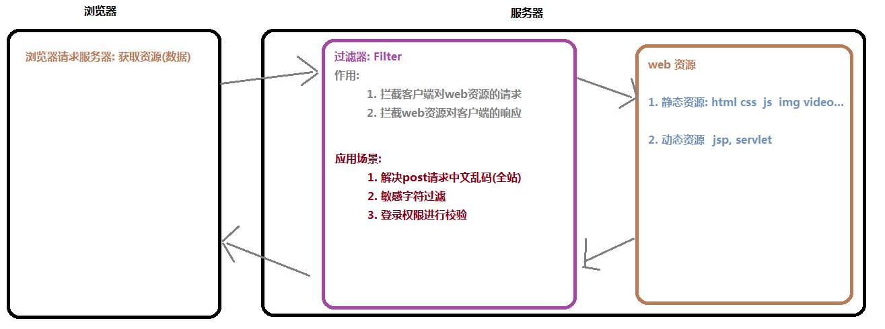
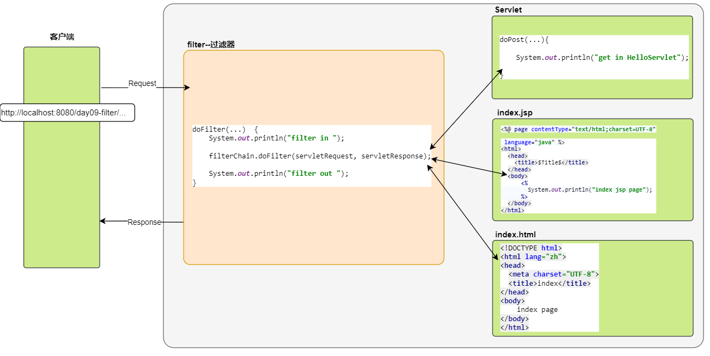
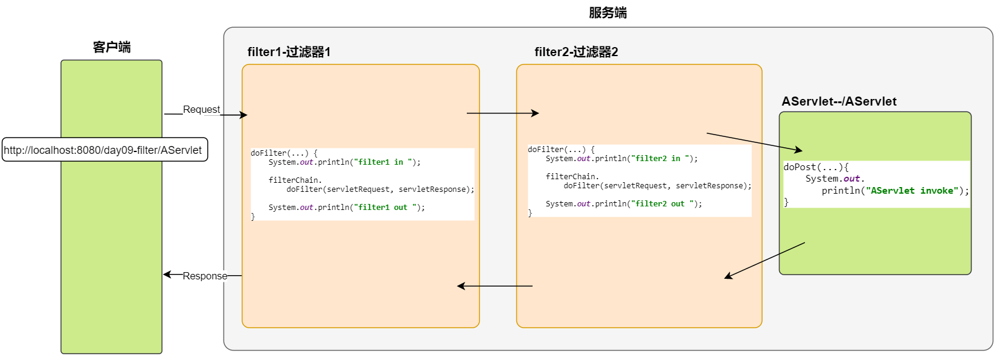
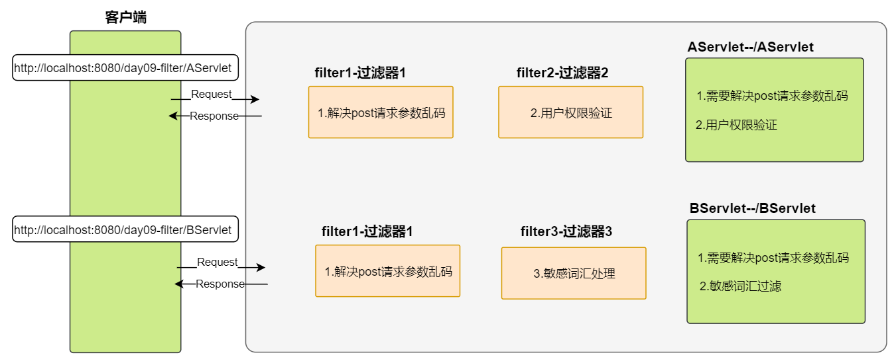
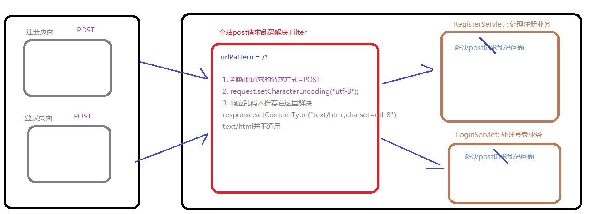
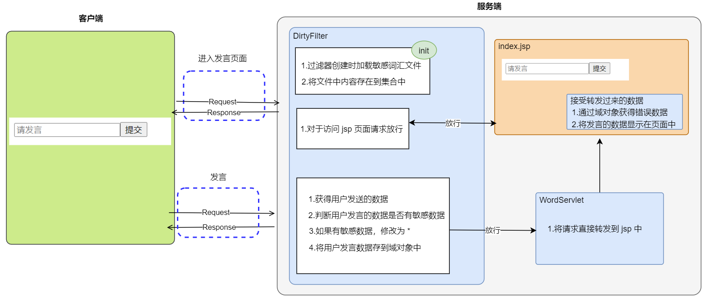
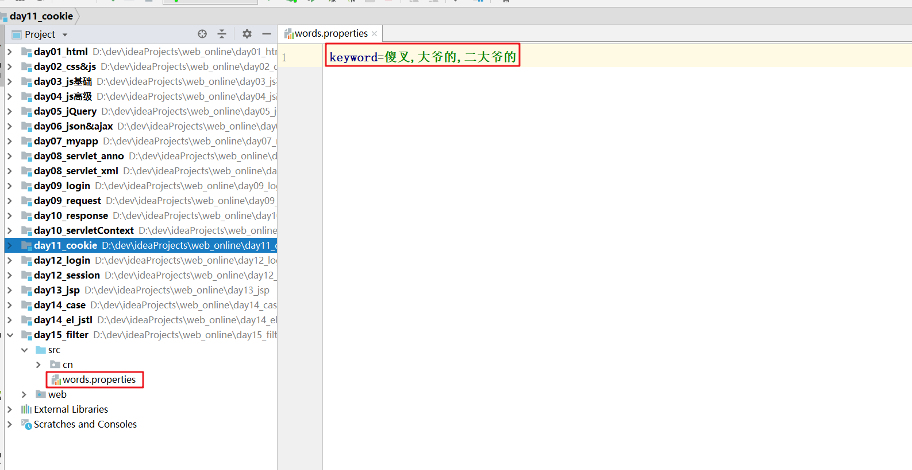
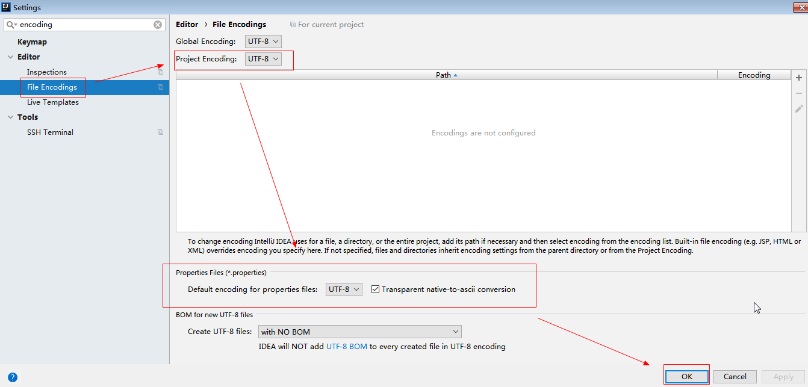

# web/Filter&Listener

**今日目标**

```markdown
1. filter（过滤器）
2. listener（监听器）
```

##  JavaWeb的三大组件

Servlet规范中的三大组件：

| **组件**     | **作用**                                                     | **实现接口**                                  |
| ------------ | ------------------------------------------------------------ | --------------------------------------------- |
| **Servlet**  | 小应用程序，在JavaWeb中主要做为控制器来使用  可以处理用户的请求并且做出响应 | javax.servlet.Servlet                         |
| **web/Filter**   | 过滤器，对用户发送的请求或响应进行集中处理，实现请求的拦截   | javax.servlet.web/Filter                          |
| **Listener** | 监听器，在某些框架中会使用到监听器(比如spring)，在Web执行过程中，引发一些事件，对相应事件进行处理 | javax.servlet.XxxListener  每个事件有一个接口 |


# 一 概述

**生活中的过滤器**

净水器、空气净化器、地铁安检

**web中的过滤器**

当用户访问服务器资源时，过滤器将请求拦截下来，完成一些通用的操作

**应用场景**

如：登录验证、统一编码处理、敏感字符过滤


 <figure class="thumbnails">
    
</figure>


# 二 快速入门

- 
  Servlet示例代码


```java
@WebServlet("/HelloServlet")
public class HelloServlet extends HttpServlet {
    protected void doPost(HttpServletRequest request, HttpServletResponse response) throws ServletException, IOException {
        System.out.println("HelloServlet invoke");
    }

    protected void doGet(HttpServletRequest request, HttpServletResponse response) throws ServletException, IOException {
        doPost(request, response);
    }
}

```


## 2.1 xml配置

#### ① 编写java类，实现filter接口

```java
package com.itheima.filter;

import javax.servlet.*;
import javax.servlet.annotation.WebFilter;
import java.io.IOException;

/**
    1.实现Servlet规范中的Filter接口
    2.在filter中的doFilter方法中进行过滤操作
 */
public class FirstFilter implements web/Filter {
    @Override
    public void init(FilterConfig filterConfig) throws ServletException {

    }

    @Override
    public void doFilter(ServletRequest servletRequest, ServletResponse servletResponse, FilterChain filterChain) throws IOException, ServletException {

        System.out.println("FirstFilter in");

        //放行用户的请求资源
        filterChain.doFilter(servletRequest, servletResponse);

        System.out.println("FirstFilter out");
    }

    @Override
    public void destroy() {

    }
}

```


#### ② 配置web.xml

```xml
<?xml version="1.0" encoding="UTF-8"?>
<web-app xmlns="http://xmlns.jcp.org/xml/ns/javaee"
         xmlns:xsi="http://www.w3.org/2001/XMLSchema-instance"
         xsi:schemaLocation="http://xmlns.jcp.org/xml/ns/javaee http://xmlns.jcp.org/xml/ns/javaee/web-app_3_1.xsd"
         version="3.1">

    <!--
        filter的web.xml配置
        1. filter和filter-mapping的子标签filter-name必须一致(可以自定义,通常与类名相同)
        2. url-pattern : 当前filter要拦截的虚拟路径
    -->
    <!--声明过滤器-->
    <filter>
        <filter-name>FirstFilter</filter-name>
        <filter-class>com.itheima.filter.FirstFilter</filter-class>
    </filter>

    <!--配合过滤器的拦截路径-->
    <filter-mapping>
        <filter-name>FirstFilter</filter-name>
        <url-pattern>/HelloServlet</url-pattern>
    </filter-mapping>
</web-app>
```


## 2.2 注解配置

#### ① 编写java类，实现filter接口

```java
// 注解配置
@WebFilter("/HelloServlet"}
public class FirstFilter implements web/Filter {
    @Override
    public void init(FilterConfig filterConfig) throws ServletException {

    }

    @Override
    public void doFilter(ServletRequest servletRequest, ServletResponse servletResponse, FilterChain filterChain) throws IOException, ServletException {

        System.out.println("FirstFilter in");

        //放行用户的请求资源
        filterChain.doFilter(servletRequest, servletResponse);

        System.out.println("FirstFilter out");
    }

    @Override
    public void destroy() {

    }
}
```


## 2.3 Filter模板设置

 

```java
#if (${PACKAGE_NAME} && ${PACKAGE_NAME} != "")package ${PACKAGE_NAME};#end
#parse("File Header.java")
@javax.servlet.annotation.WebFilter(urlPatterns = "/")
public class ${Class_Name} implements javax.servlet.web/Filter {
   
    public void init(javax.servlet.FilterConfig config) throws javax.servlet.ServletException {
    }
    public void doFilter(javax.servlet.ServletRequest req, javax.servlet.ServletResponse resp, javax.servlet.FilterChain chain) throws javax.servlet.ServletException, java.io.IOException {
        chain.doFilter(req, resp);
    }
    public void destroy() {
    }
}
```


# 三 工作原理

 ```markdown
1. 用户发送请求，请求Web资源(包括html,jsp,servlet等)
2. 如果Web资源的地址，匹配filter的地址，请求将先经过filter,并执行doFilter()
3. doFilter()方法中如果调用chain.doFilter()，则放行执行下一个Web资源。
4. 访问Web资源，响应回来会再次经过filter,执行过滤器中的代码，到达浏览器端。
 ```


 <figure class="thumbnails">
    
</figure>


# 四 使用细节

## 4.1 生命周期

生命周期：指的是一个对象从生（创建）到死（销毁）的一个过程

```java
// 初始化方法
public void init(FilterConfig config);

// 执行拦截方法
public void doFilter(ServletRequest request, ServletResponse response,FilterChain chain);

// 销毁方法
public void destroy();
```


```markdown
* 创建
		服务器启动项目加载，创建filter对象，执行init方法（只执行一次）
		
* 运行（过滤拦截）
		用户访问被拦截目标资源时，执行doFilter方法

* 销毁
		服务器关闭或项目卸载时，销毁filter对象，执行destroy方法（只执行一次）
		
* 补充：
	过滤器一定是优先于servlet创建的,后于Servlet销毁
```


```java
package com.itheima02.life;

import javax.servlet.*;
import javax.servlet.annotation.WebFilter;
import java.io.IOException;
/*
    #Filter的生命周期
        0. 先于Servlet创建,后于Servlet销毁
        1. init方法
            filter 自动启动加载的,执行一次
            (先于Servlet的init方法执行)
        2. doFilter 方法
            (先于Servlet的service方法执行)
            浏览器每访问一次,就会执行一次

            chain.doFilter(req, resp); // 放行

       3.  destroy 方法
            (后于Servlet的destroy方法执行)
            tomcat关闭,会随之销毁, 只执行一次
 */
@WebFilter(urlPatterns={"/HelloServlet"})
public class FirstFilter implements web/Filter {
    @Override
    public void init(FilterConfig filterConfig) throws ServletException {
        System.out.println("FirstFilter init");
    }

    @Override
    public void doFilter(ServletRequest servletRequest, ServletResponse servletResponse, FilterChain filterChain) throws IOException, ServletException {

        System.out.println("FirstFilter in");

        //放行用户的请求资源
        filterChain.doFilter(servletRequest, servletResponse);

        System.out.println("FirstFilter out");
    }

    @Override
    public void destroy() {
        System.out.println("FirstFilter destroy");
    }
}

```


```java
package com.itheima02.life;

import javax.servlet.*;
import javax.servlet.annotation.WebServlet;
import javax.servlet.http.HttpServlet;
import javax.servlet.http.HttpServletRequest;
import javax.servlet.http.HttpServletResponse;
import java.io.IOException;

@WebServlet(value= "/HelloServlet",loadOnStartup = 6)
public class HelloServlet extends HttpServlet {

    @Override
    public void init() throws ServletException {
        System.out.println("HelloServlet init");
    }

    protected void doPost(HttpServletRequest request, HttpServletResponse response) throws ServletException, IOException {
        System.out.println("HelloServlet invoke");
    }

    protected void doGet(HttpServletRequest request, HttpServletResponse response) throws ServletException, IOException {
        doPost(request, response);
    }

    @Override
    public void destroy() {
        System.out.println("HelloServlet destroy");
    }
}

```


## 4.2 拦截路径

​	在开发时，我们可以指定过滤器的拦截路径来定义拦截目标资源的范围

```markdown
* 精准匹配
		用户访问指定目标资源（/show.jsp）时，过滤器进行拦截
		
* 目录匹配
		用户访问指定目录下（/user/*）所有资源时，过滤器进行拦截

* 后缀匹配
		用户访问指定后缀名（*.html）的资源时，过滤器进行拦截

* 匹配所有
		用户访问该网站所有资源（/*）时，过滤器进行拦截
```


```java
package com.itheima.filter02;

import javax.servlet.*;
import javax.servlet.annotation.WebFilter;
import java.io.IOException;

/**
 * 1.精确路径
 *    /精确路径
 * 2.目录路径
 *    /aa/*
 * 3.后缀路径
 *    *.后缀名：*.do(Structs)
 * 4.所有路径
 *   /*(拦截所有资源：动态资源和静态资源)
 */
@WebFilter(urlPatterns = "/*")
public class UrlFilter implements web/Filter {

    public void init(FilterConfig config) throws ServletException {
    }

    public void doFilter(ServletRequest req, ServletResponse resp, FilterChain chain) throws ServletException, IOException {
        System.out.println("UrlFilter in");
        chain.doFilter(req, resp);
        System.out.println("UrlFilter out");
    }

    public void destroy() {
    }
}
```


## 4.3 拦截方式

​	在开发时，我们可以指定过滤器的拦截方式来处理不同的应用场景，比如：只拦截从浏览器直接发送过来的请求，或者拦截内部转发的请求

```markdown
总共有五种不同的拦截方式,我们这里学习常见的两种

1. request（默认拦截方式）
		浏览器直接发送请求时，拦截
2. forward
		请求转发的时候，拦截
		比如: 资源A转发到资源B时
		
我们可以配置 二个同时存在...
```


#### ① xml版本

```java
public class MethodFilter implements web/Filter {

    public void init(FilterConfig config) throws ServletException {
    }

    public void doFilter(ServletRequest req, ServletResponse resp, FilterChain chain) throws ServletException, IOException {
        System.out.println("MethodFilter in");
        chain.doFilter(req, resp);
        System.out.println("MethodFilter out");
    }

    public void destroy() {
    }
}
```


```xml
    <filter>
        <filter-name>MethodFilter</filter-name>
        <filter-class>com.itheima.filter03.MethodFilter</filter-class>
    </filter>
    <filter-mapping>
        <filter-name>MethodFilter</filter-name>
        <url-pattern>/*</url-pattern>
        <dispatcher>REQUEST</dispatcher>
        <dispatcher>FORWARD</dispatcher>
    </filter-mapping>
```


#### ② 注解版本

```java
/**
 * 过滤器拦截方式
 *  request:浏览器的请求（默认配置）
 *  forward:请求转发
 */
@WebFilter(urlPatterns = "/*",dispatcherTypes =
        {DispatcherType.REQUEST,DispatcherType.FORWARD})
public class MethodFilter implements web/Filter {

    public void init(FilterConfig config) throws ServletException {
    }

    public void doFilter(ServletRequest req, ServletResponse resp, FilterChain chain) throws ServletException, IOException {
        System.out.println("MethodFilter in");
        chain.doFilter(req, resp);
        System.out.println("MethodFilter out");
    }

    public void destroy() {
    }
}
```


## 4.4 过滤器链

### 4.4.1 过滤连的介绍

在一次请求中,若我们请求匹配到了多个filter,通过请求就相当于把这些filter串起来了，形成了过滤器链。


 <figure class="thumbnails">
    
</figure>


```markdown
* 需求
	用户访问目标资源 AServlet时，经过 Filter1  Filter2
	
* 过滤器链执行顺序 （先进后出）
	1.用户发送请求
	2.Filter1拦截，放行
	3.Filter2拦截，放行
	4.执行目标资源 AServlet
	5.Filter2增强响应
	6.Filter1增强响应
	7.封装响应消息格式，返回到浏览器
	
* 过滤器链中执行的先后问题....
	配置文件
		谁先声明，谁先执行
			<filter-mapping>
	注解【不推荐】
		根据过滤器类名进行排序，值小的先执行
			FilterA  FilterB  进行比较， FilterA先执行...   
```


- 示例代码

```java
package com.itheima.fitler04;

import javax.servlet.*;
import java.io.IOException;

/**
 * <p></p>
 *  过滤链：拦截顺序
 *      注解版：
 *          过滤器的类名称比较
 *      xml配置：
 *          按照filter-mapping在xml中的配置顺序来进行拦截
 */
// @WebFilter(urlPatterns = "/ChainServlet")
public class ChainFilter01 implements web/Filter {

    public void init(FilterConfig config) throws ServletException {
    }

    public void doFilter(ServletRequest req, ServletResponse resp, FilterChain chain) throws ServletException, IOException {
        System.out.println("ChainFilter01 in");
        chain.doFilter(req, resp);
        System.out.println("ChainFilter01 out");
    }

    public void destroy() {
    }
}
```


```java
package com.itheima.fitler04;

import javax.servlet.*;
import java.io.IOException;

/**
 * <p></p>
 *
 * @Description:
 */
// @WebFilter(urlPatterns = "/ChainServlet")
public class ChainFilter02 implements web/Filter {

    public void init(FilterConfig config) throws ServletException {
    }

    public void doFilter(ServletRequest req, ServletResponse resp, FilterChain chain) throws ServletException, IOException {
        System.out.println("ChainFilter02 in");
        chain.doFilter(req, resp);
        System.out.println("ChainFilter02 out");
    }

    public void destroy() {
    }
}
```

```xml
 <filter>
        <filter-name>FilterB</filter-name>
        <filter-class>com.itheima05.chain.FilterB</filter-class>
    </filter>

    <filter-mapping>
        <filter-name>FilterB</filter-name>
        <url-pattern>/ServletA</url-pattern>
    </filter-mapping>

    <filter>
        <filter-name>FilterA</filter-name>
        <filter-class>com.itheima05.chain.FilterA</filter-class>
    </filter>

    <filter-mapping>
        <filter-name>FilterA</filter-name>
        <url-pattern>/ServletA</url-pattern>
    </filter-mapping>
```


### 4.4.2 过滤连作用的介绍（了解）

将项目中的功能性进行独立化，提高项目代码的复用性。


 <figure class="thumbnails">
    
</figure>


# 五 Filter案例

## 5.1 统一网站编码

**需求**

tomcat8.5版本中已经将get请求的中文乱码解决了,但是post请求还存在中文乱码

浏览器发出的任何请求，通过过滤器统一处理中文乱码 


### 5.1.1 需求分析


 <figure class="thumbnails">
    
</figure>


### 5.1.2 代码实现

- 真实场景中，过滤器不会统一响应mime类型

```java
package com.itheima06.post;

import javax.servlet.*;
import javax.servlet.annotation.WebFilter;
import javax.servlet.http.HttpServletRequest;
import java.io.IOException;

@WebFilter(urlPatterns = "/*")
public class PostFilter implements web/Filter {

    public void init(FilterConfig config) throws ServletException {
    }

    public void doFilter(ServletRequest req, ServletResponse resp, FilterChain chain) throws ServletException, IOException {
       //拦截访问本站的所有请求,如果请求方式=post,就修改request编码
        HttpServletRequest request = (HttpServletRequest) req;
        String method = request.getMethod();
        if("POST".equalsIgnoreCase(method)){
            request.setCharacterEncoding("utf-8");
        }

        System.out.println("req:" + req);
        System.out.println("request:" + request);
        chain.doFilter(req, resp);
    }

    public void destroy() {
    }
}
```


## 5.2 非法字符拦截

**需求**

当用户发出非法言论的时候，提示用户言论非法警告信息


### 5.2.1 需求分析


  <figure class="thumbnails">
    
</figure>


### 5.2.2 代码实现

#### ① 非法词库


 <figure class="thumbnails">
    
</figure>


> 注意: properties文件编码问题

 <figure class="thumbnails">
    
</figure>


#### ② 代码实现

```html
<%@ page contentType="text/html;charset=UTF-8" language="java" %>
<%@ taglib prefix="c" uri="http://java.sun.com/jsp/jstl/core" %>
<html>
  <head>
    <title>index</title>
  </head>
  <body>
    <form action="ShowWordServlet" method="get">
        <input type="text" name="word" placeholder="请发言" ><input type="submit" value="提交">
    </form>

    <c:if test="${not empty word}">
      您输入的内容是：${word}
    </c:if>
  </body>
</html>
```


```java
package com.itheima.web.filter03;

import javax.servlet.*;
import javax.servlet.annotation.WebFilter;
import javax.servlet.http.HttpServletRequest;
import java.io.IOException;
import java.io.InputStream;
import java.util.Arrays;
import java.util.List;
import java.util.Properties;

/**
 * <p></p>
 *
 * @Description:
 */
@WebFilter("/*")
public class DirtyFilter implements web/Filter {

    private List<String> words = null;

    public void destroy() {
    }

    public void doFilter(ServletRequest req, ServletResponse resp, FilterChain chain) throws ServletException, IOException {

        HttpServletRequest request = (HttpServletRequest) req;

        String word = request.getParameter("word");

        if (word != null) {
            request.setAttribute("word",word);

            for (String s : words) {
                if (word.contains(s)) {
                    String replaceWord = word.replaceAll(s, "*");
                    request.setAttribute("word",replaceWord);
                }
            }
        }


        chain.doFilter(req, resp);
    }

    public void init(FilterConfig config) throws ServletException {

        try {
            //获得项目运行目录下的资源文件
            String path = this.getClass().getResource("/").getPath();

            InputStream input = this.getClass().getResourceAsStream("/dirty.properties");

            Properties properties = new Properties();

            properties.load(input);

            String dirtywords = properties.getProperty("dirtywords");

            String[] split = dirtywords.split(",");

            words = Arrays.asList(split);

        } catch (IOException e) {
            e.printStackTrace();
        }

    }

}
```


```java
package com.itheima.web.filter03;

import javax.servlet.ServletException;
import javax.servlet.annotation.WebServlet;
import javax.servlet.http.HttpServlet;
import javax.servlet.http.HttpServletRequest;
import javax.servlet.http.HttpServletResponse;
import java.io.IOException;

/**
 * <p></p>
 *
 * @Description:
 */
@WebServlet("/ShowWordServlet")
public class ShowWordServlet extends HttpServlet {
    protected void doPost(HttpServletRequest request, HttpServletResponse response) throws ServletException, IOException {
        request.getRequestDispatcher("index.jsp").forward(request,response);
    }

    protected void doGet(HttpServletRequest request, HttpServletResponse response) throws ServletException, IOException {
        doPost(request, response);
    }
}
```


# 六 Listener

## 1.1 概述

**生活中的监听器**

我们很多商场有摄像头，监视着客户的一举一动。如果客户有违法行为，商场可以采取相应的措施。


**javaweb中的监听器**

在我们的java程序中，有时也需要监视某些事情，一旦被监视的对象发生相应的变化，我们应该采取相应的操作。

监听web三大域对象：HttpServletRequest、HttpSession、ServletContext  （创建和销毁）

**场景**

历史访问次数、统计在线人数、系统启动时初始化配置信息


 **监听器的接口分类**

| **事件源**             | **监听器接口**                  | **时机**                 |
| ---------------------- | ------------------------------- | ------------------------ |
| **ServletContext**     | ServletContextListener          | 上下文域创建和销毁       |
| **ServletContext**     | ServletContextAttributeListener | 上下文域属性增删改的操作 |
| **HttpSession **       | HttpSessionListener             | 会话域创建和销毁         |
| **HttpSession **       | HttpSessionAttributeListener    | 会话域属性增删改的操作   |
| **HttpServletRequest** | ServletRequestListener          | 请求域创建和销毁         |
| **HttpServletRequest** | ServletRequestAttributeListener | 请求域属性增删改的操作   |


## 1.2 快速入门

​	监听器在web开发中使用的比较少,见的机会就更少了,今天我们使用**ServletContextListenner**来带领大家学习下监听器,因为这个监听器是监听器中使用率最高的一个,且监听器的使用方式都差不多。

我们使用这个监听器可以在项目启动和销毁的时候做一些事情,例如,在项目启动的时候加载配置文件。


**步骤分析**

```markdown
1. 创建一个普通类，实现ServletContextListenner

2. 重写抽象方法
	监听ServletContext创建
	监听ServletContext销毁
	
3. 配置
	web.xml
	注解
```


#### ① xml版本

```java
package com.itheima.listener01;

import javax.servlet.ServletContext;
import javax.servlet.ServletContextEvent;
import javax.servlet.ServletContextListener;

/**
 * 1.实现 Servlet中的对应 Listener
 *
 *   ServletContextListener：
 *      contextInitialized：ServletContext对象创建时，会执行的方法
 *      contextDestroyed：ServletContext对象销毁时，会执行的方法
 * 2.Servlet组件的运行顺序
 *  启动：
 *      1.Listener
 *      2.web/Filter
 *      3.Servlet
 *  销毁：
 *      1.Serlvet
 *      2.web/Filter
 *      3.Listener
 */

public class MyServletContextListener implements ServletContextListener {

    @Override
    public void contextInitialized(ServletContextEvent servletContextEvent) {

        /*
            事件驱动开发：
                事件：ServletContext对象创建--ServletContextEvent
                事件源： ServletContext 对象--ServletContextEvent.getServletContext
             事件对象可以获得事件源
         */

        ServletContext servletContext = servletContextEvent.getServletContext();

        System.out.println("ServletContext 创建："+servletContext);

    }

    @Override
    public void contextDestroyed(ServletContextEvent servletContextEvent) {

        ServletContext servletContext = servletContextEvent.getServletContext();

        System.out.println("ServletContext 创建："+servletContext);

    }
}

```


```xml
<!--在项目服务中添加了一个listener-->
<!--不需要配置映射路径-->
<listener>
    <listener-class>com.itheima.listener01.MyServletContextListener</listener-class>
</listener>
```


#### ② 注解版本

```java
package com.itheima.listener01;

import javax.servlet.ServletContextAttributeEvent;
import javax.servlet.ServletContextAttributeListener;
import javax.servlet.annotation.WebListener;

/**
 */
@WebListener
public class MyServletContextAttriListener implements ServletContextAttributeListener {
    /**
     * attributeAdded:向ServletContext域中添加数据时会调用方法
     * @param servletContextAttributeEvent
     */
    @Override
    public void attributeAdded(ServletContextAttributeEvent servletContextAttributeEvent) {

        System.out.println("ServletContext 域数据添加："
                +servletContextAttributeEvent.getName()+"--"+servletContextAttributeEvent.getValue());

    }

    /**
     * attributeRemoved:ServletContext域中删除数据时会调用方法
     * @param servletContextAttributeEvent
     */
    @Override
    public void attributeRemoved(ServletContextAttributeEvent servletContextAttributeEvent) {
        System.out.println("ServletContext 域数据删除："
                +servletContextAttributeEvent.getName()+"--"+servletContextAttributeEvent.getValue());
    }

    /**
     * attributeReplaced:ServletContext域中数据修改时会调用方法
     * @param servletContextAttributeEvent
     */
    @Override
    public void attributeReplaced(ServletContextAttributeEvent servletContextAttributeEvent) {
        System.out.println("ServletContext 域数据被修改："
                +servletContextAttributeEvent.getName()+"--"+servletContextAttributeEvent.getValue());
    }
}
```


**监听属性增删改的监听器**

```java
package com.itheima08.listener;

import javax.servlet.ServletContextAttributeEvent;
import javax.servlet.ServletContextAttributeListener;
import javax.servlet.annotation.WebListener;

/*
*   监听: ServletContext的属性变化
* */
@WebListener
public class MyServletContextAttributeListener implements ServletContextAttributeListener {
    @Override
    public void attributeAdded(ServletContextAttributeEvent servletContextAttributeEvent) {
        System.out.println("ServletContext 属性增加了");
    }

    @Override
    public void attributeRemoved(ServletContextAttributeEvent servletContextAttributeEvent) {
        System.out.println("ServletContext 属性被移除了");
    }

    @Override
    public void attributeReplaced(ServletContextAttributeEvent servletContextAttributeEvent) {
        System.out.println("ServletContext 属性替换了");
    }
}
```


- **监听器的声明周期**

```markdown
 1. 创建
     tomcat启动时,创建
     (早于相应的域对象 ServletContext)
 2. 运行
     (监听对应的域对象 ServletContext)
     ServletContext创建的时候, 这个监听器contextInitialized就会执行
     ServletContext销毁的时候, 这个监听器contextDestroyed就会执行
 
 3. 销毁
     tomcat关闭时,销毁
     (后于相应的域对象 ServletContext)
```


## 1.3 案例：模拟spring加载文件

- 可以在项目启动时读取配置文件

```xml
<?xml version="1.0" encoding="UTF-8"?>
<web-app xmlns="http://xmlns.jcp.org/xml/ns/javaee"
         xmlns:xsi="http://www.w3.org/2001/XMLSchema-instance"
         xsi:schemaLocation="http://xmlns.jcp.org/xml/ns/javaee http://xmlns.jcp.org/xml/ns/javaee/web-app_3_1.xsd"
         version="3.1">
    

    <!--全局配置参数-->
    <context-param>
        <param-name>configLocation</param-name>
        <param-value>dirty.properties</param-value>
    </context-param>
    
</web-app>
```


```java
package com.itheima.web.listerner;

import javax.servlet.ServletContext;
import javax.servlet.ServletContextEvent;
import javax.servlet.ServletContextListener;
import javax.servlet.annotation.WebListener;
import java.io.IOException;
import java.io.InputStream;
import java.util.Properties;

/**
 * <p></p>
 *
 * @Description:
 */
@WebListener
public class SpringServletContextListerner implements ServletContextListener {


    @Override
    public void contextInitialized(ServletContextEvent servletContextEvent) {

        try {

            ServletContext servletContext = servletContextEvent.getServletContext();

            String configPath = servletContext.getInitParameter("configContext");

            InputStream input = this.getClass().getResourceAsStream(configPath);

            Properties properties = new Properties();

            properties.load(input);

            String dirtywords = properties.getProperty("dirtywords");

            servletContext.setAttribute("dirty",dirtywords);

        } catch (IOException e) {
            e.printStackTrace();
        }

    }

    @Override
    public void contextDestroyed(ServletContextEvent servletContextEvent) {
    }
}
```


## 1.4 案例:统计在线人数

**需求**

有用户使用网站,在线人数就+1;用户退出网站,在线人数就-1

```markdown
# 分析:
1. 怎么判定用户在线还是离线?
	a. 在线: 一个用户访问,应该给他生成一个session
		假设第一个访问页面: index.jsp
			(jsp底层: 默认获取session)
		如果有其他页面: html之类的
			(Filter进行拦截: request.getSession();)
	b. 离线: 用户点击退出 , 把对应的session销毁  -> LogoutServlet
			(如果用户直接X掉网页, 服务器默认等待30分钟,才会销毁session -> 时间太长了)
			(长连接: 心跳包, 每隔30秒发一个请求 空包)
2. 监听session的创建和销毁
	- > HttpSessionListener
		1. 监听到创建  number + 1
		2. 监听到销毁  number - 1
		
3. number 存在哪里?		
	 -> ServletContext 域对象 (全局)
	 
4. 何时初始化number? 
	 -> ServletContextListener
	 1. 监听到创建 : 初始化number,然后存进ServletContext
```


### 1.4.1 技术分析

使用 ServletContext域对象 存储在线总人数

使用 ServletContextListener监听器，在项目启动时，初始化总人数为0

使用 HttpSessionListener监听器，用户访问，人数+1，用户退出，人数-1

使用 LogoutServlet控制器，对当前会话的session销毁


### 1.4.2 需求分析

```markdown
#分析：
1. 用户和服务端连接后--Session
2. 在项目中统计Session数据
3. Session创建时，统计Session个数的数据
4. 使用Listener来统计Session个数的数据

#数据：
1. 统计数据上面什么初始化--ServletContext创建时
2. 在人数在项目域中都要访问到，统计数据需要放到ServletContext

#Session创建时机：
1. 第一次使用request.getSession()
2. 访问所有jsp页面
```


 

 <figure class="thumbnails">
    
</figure>


### 1.4.3 代码实现

#### ① CountServletContextListener

```java
package com.itheima.web.listerner;

import javax.servlet.ServletContext;
import javax.servlet.ServletContextEvent;
import javax.servlet.ServletContextListener;
import javax.servlet.annotation.WebListener;

/**
 * <p></p>
 *
 * @Description:
 */
@WebListener
public class CountServletContextListener implements ServletContextListener {
    @Override
    public void contextInitialized(ServletContextEvent servletContextEvent) {

        int num = 0;

        ServletContext servletContext = servletContextEvent.getServletContext();
        servletContext.setAttribute("count", num);
    }

    @Override
    public void contextDestroyed(ServletContextEvent servletContextEvent) {

    }
}
```


#### ② CountSessionListener

```java
package com.itheima.web.listerner;

import javax.servlet.ServletContext;
import javax.servlet.annotation.WebListener;
import javax.servlet.http.HttpSession;
import javax.servlet.http.HttpSessionEvent;
import javax.servlet.http.HttpSessionListener;

/**
 * <p></p>
 *
 * @Description:
 */
@WebListener
public class CountHttpSessionListener implements HttpSessionListener {

    @Override
    public void sessionCreated(HttpSessionEvent httpSessionEvent) {

        HttpSession session = httpSessionEvent.getSession();

        ServletContext servletContext = session.getServletContext();

        int count = (int) servletContext.getAttribute("count");

        count = count + 1;

        servletContext.setAttribute("count", count);

    }

    @Override
    public void sessionDestroyed(HttpSessionEvent httpSessionEvent) {

        HttpSession session = httpSessionEvent.getSession();

        ServletContext servletContext = session.getServletContext();

        int count = (int) servletContext.getAttribute("count");

        count = count - 1;

        if (count < 0) {
            count = 0;
        }
        servletContext.setAttribute("count", count);
    }
}
```


#### ③count.jsp

```jsp
<%--
  Created by IntelliJ IDEA.
  User: Simple
  Date: 2020/8/31
  Time: 21:43
  To change this template use File | Settings | File Templates.
--%>
<%@ page contentType="text/html;charset=UTF-8" language="java" %>
<html>
  <head>
    <title>count</title>
  </head>
  <body>

    在线总人数： ${applicationScope.count}
    <br>
    <a href="LogoutServlet">用户下线</a>


  </body>
</html>
```


#### ④ LogoutServlet

```java
package com.itheima.web.servlet01;

import javax.servlet.ServletException;
import javax.servlet.annotation.WebServlet;
import javax.servlet.http.HttpServlet;
import javax.servlet.http.HttpServletRequest;
import javax.servlet.http.HttpServletResponse;
import java.io.IOException;

/**
 * <p></p>
 *
 * @Description:
 */
@WebServlet("/LogoutServlet")
public class LogoutServlet extends HttpServlet {
    protected void doPost(HttpServletRequest request, HttpServletResponse response) throws ServletException, IOException {
        request.getSession().invalidate();
        request.getRequestDispatcher("02count.jsp").forward(request,response);
    }

    protected void doGet(HttpServletRequest request, HttpServletResponse response) throws ServletException, IOException {
        doPost(request, response);
    }
}
```


