## 目录

[TOC]

## 学习目标

```html
1、了解软件开发流程
2、掌握需求分析
3、掌握概要设计
4、掌握详细设计
```

## 阶段介绍

```java
maven: 专家,内行
  	项目管理方面的专家,可以在项目开发过程中对项目进行统一管理.
  	作用:
				一键构建项目:
							mvn clean
              mvn compile
              mvn test
              mvn package
              mvn install 将项目打包安装到本地仓库
              mvn deploy 将项目打包安装到私服
        jar包依赖管理:
							maven将项目所需要依赖的jar包进行了统一的管理.
         			jar包的作用范围
              jar包的依赖传递
```

```java
SSM练习:
		串一下前面所学的知识
    在工作中如何开发的
Git(SVN): 在项目开发过程中对项目进行版本控制
		
SSM练习: 黑马旅游
  	1: 概念较多(需求文档,概要设计文档,详细设计文档(接口文档))
    2: 搭建架构,实现业务
    3: 项目涉及的相关问题解决(缓存的穿透,缓存的击穿,缓存雪崩...)
    4: 编写前端代码
    5: Linux
		6: Linux&nginx
dubbo:
```

## 第一章 Git简介及安装【掌握】

```java
协同开发: 多人共同开发
  	项目代码统一管理: SVN Git
    项目开发时涉及的相关问题:
			问题1: 代码备份
        		为了保证代码的安全,避免未知的问题发生,我们需要对代码进行备份
			问题2: 版本控制
        		开发第一个版本: 增删改查
            开发第二个版本: 在原来的基础上对代码进行修改,
													如果第二个版本没有达到预期的要求,
													我们可以使用git中的回退,返回上一个版本
      问题3: 代码冲突
        	两个程序员在自己的电脑上对同一个代码的同一个位置,进行了不同功能的实现.
        	这样的问题叫做----代码冲突
        	A程序员
        			Demo.java
        					1
        					2
        					3 1111111111111111
        					4
        	B程序员
        			Demo.java
        					1
        					2
        					3 22222222222222222
        					4
					将自己的代码提交给git管理前,先将git仓库中的代码拉取到本地,
					保证本地的代码与git仓库代码一致,再执行提交
          拉取服务器上代码时,如果遇到代码冲突,git会发出警告与提示,需要在本地解决冲突
          解决冲突:
							找到冲突代码提交的关系人,进行协商解决问题,
							解决完毕后,再次将代码提交给git管理
			问题4: 问题代码追溯
        	追溯问题代码的编写人(每一行代码提交给git管理时,都标注有代码的提交人)
```

### 1、Git的简介

#### 【1】什么是Git

​		Git是目前世界上最先进的==分布式==文件版本控制系统（没有之一）。对于我们java程序员而言，管理的就是代码文件版本。

#### 【2】Git和GitHub

​		确切的说 GitHub 是一家公司，位于旧金山，由 Chris Wanstrath, PJ Hyett 与 Tom Preston-Werner 三位开发者在2008年4月创办,2008年4月10日，GitHub正式成立，主要提供基于git的版本托管服务。

一经上线，它的发展速度惊为天人，截止目前，GitHub 已经发展成全球最大的开源社区。 

所以 **Git 只是 GitHub 上用来管理项目的一个工具**而已，但是GitHub 的功能可远不止于此！


 <figure class="thumbnails">
    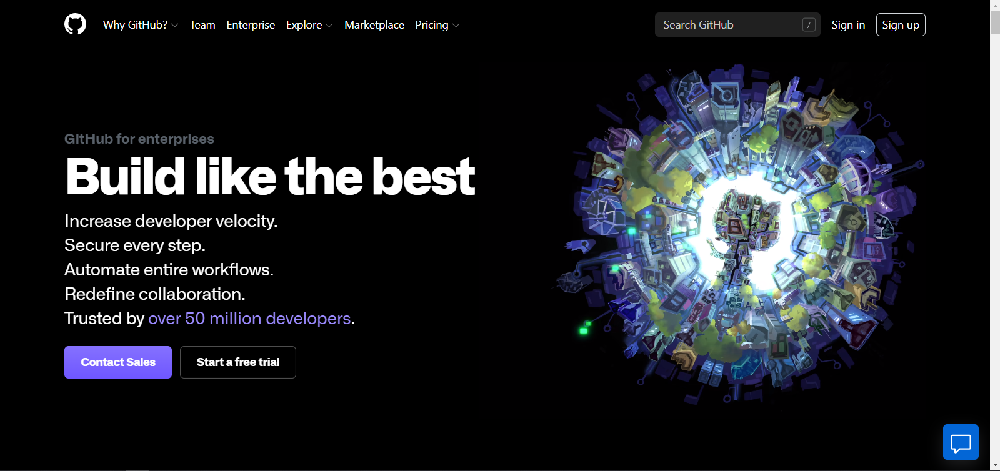
</figure>

#### 【3】Svn和Git

​		SVN和Git都是用于代码的版本管理的，二者不同的地方在于SVN是集中式代码(中心化管理)管理，而Git是分布式代码管理

##### 【3.1】集中式代码管理-SVN

​		 SVN版本控制系统是集中式的数据管理，存在一个中央版本库，所有开发人员本地开发所使用的代码都是来自于这个版本库，提交代码也必须提交到这个中央版本库。

 <figure class="thumbnails">
    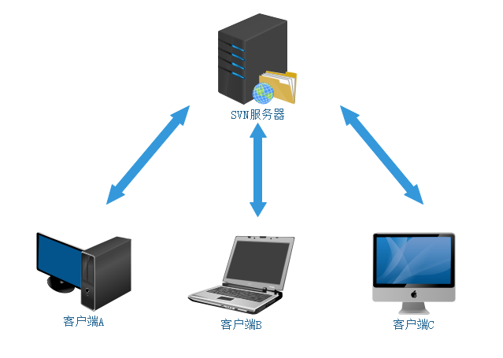
</figure>


SVN版本控制系统工作流程如下：

```
1.在中央版本库上创建一个主干,或创建分支

2.从中央版本库上check out 下这个分支的代码。

3.进入自己的分支，进行开发工作。每隔一段时间提交一次代码。

4.在快下班的时候commit代码，假设有人在刚刚的分支上面提交了代码，你就会被提示代码过期，你得先update你的本地代码然后在更新提交。update时如果出现冲突，需要解决好冲突后（代码合并）后在进行提交，把自己的分支代码提交到主干。
```

SVN的缺点：

```
1.无网的情况下
	无法提交代码，无法查看代码的历史版本、无法同步代码

2.代码要定期做备份（所有的代码数据及版本变更记录）

3.分支切换缓慢

4.由于每次提交都会保留一个原始副本，因此SVN的数据库容量会暴增。尤其是在开发人员非常多的情况下。
```

##### 【3.2】分布式代码管理-Git

​		git没有中央版本库，但是为了方便开发小组的成员们进行代码共享，我们通常会搭建一个远程的git仓库。和svn不同的是开发者本地也包含一个完成的git仓库，从某种程度上来说本地的仓库和远程的仓库在身份上是等价的，没有主从。

 <figure class="thumbnails">
    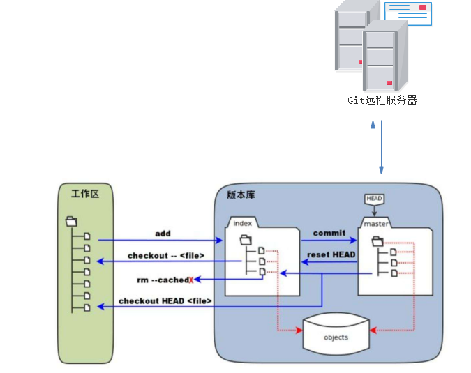
</figure>

Git的版本工作流程如下：

```
1.你在本地创建一个git仓库，并将其add到远程的git仓库中

2.你在本地增删改文件，然后commit，这里的commit是提交到本地的git仓库中了（其实就是提交到，本地的git目录下的object目录中）

3. 将本地的git仓库的分支push到远程git的仓库的分支，如果这个时候远程git仓库中已经有别人push过，那么远程的git仓库是不愿徐你push的，这个时候你要先pull，如果有冲突，处理好冲突，commit到本地git仓库后，在push到远程的git库。
```

Git的优点

```
1.比svn方便和快捷的切换分支

2.书写的代码可以随时提交

3.丰富的命令行操作和组合

4.可以一人一个仓库，仓库可以有多个分支
```

#### 【4】远程仓库

```java
代码托管平台,可以将编写好的项目提交给这些平台进行管理或共享.
GitHub: 
		服务器在国外,提交或拉取时速度比较慢.
gitee: 码云(服务器在国内,效率高)
	远程仓库
```

#### 小结

```java
SVN与Git区别
  	svn中心化版本控制软件,需要在有网的环境下进行版本控制
  	git分布式版本控制软件,可以在自己本地进行代码版本控制,如果需要多人同步代码,则可以借助GitHub或码云.
远程仓库:
		GitHub
    码云: gitee
```

### 2、Git的安装

#### 【1】官网下载

下载地址：https://git-scm.com/download


 <figure class="thumbnails">
    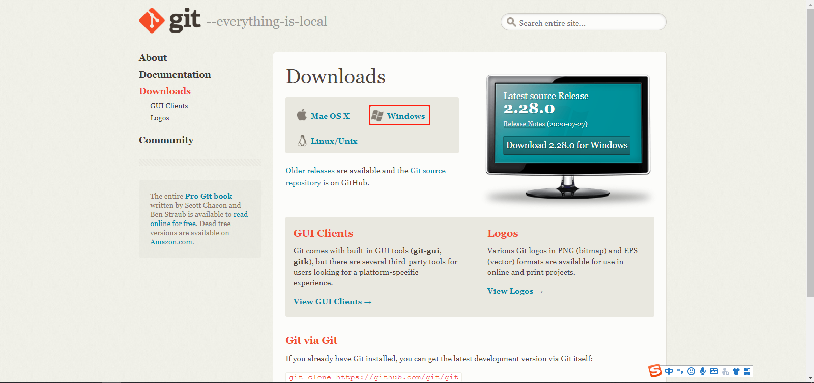
</figure>

或者直接使用今天资料中安装文件：Git-2.15.0-64-bit.exe


 <figure class="thumbnails">
    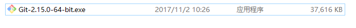
</figure>

#### 【2】安装步骤

双击直接安装【版本为64位系统的】


 <figure class="thumbnails">
    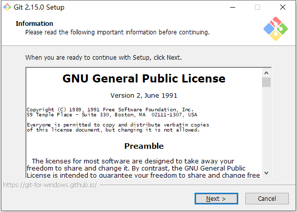
</figure>

点击Next,==更改git的安装路径(不要存放在有中文和空格的目录中)==


 <figure class="thumbnails">
    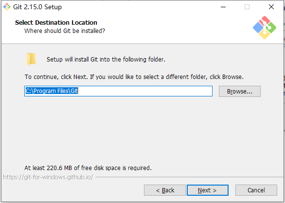
</figure>

点击Next


 <figure class="thumbnails">
    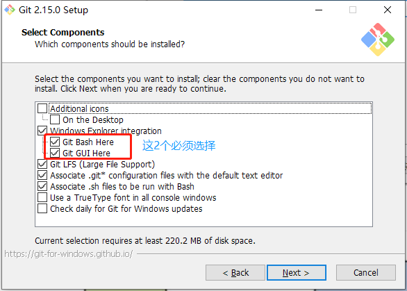
</figure>

点击Next


 <figure class="thumbnails">
    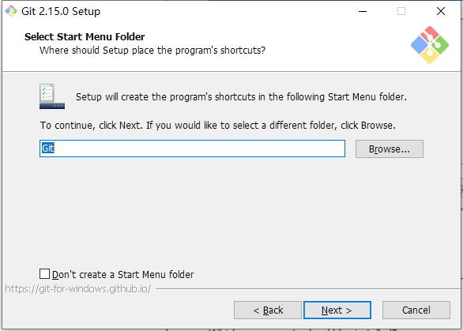
</figure>

点击Next


 <figure class="thumbnails">
    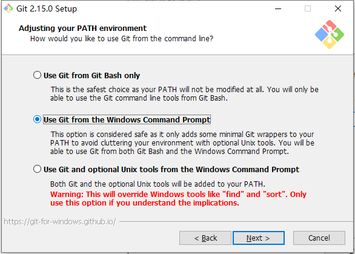
</figure>


点击Next


 <figure class="thumbnails">
    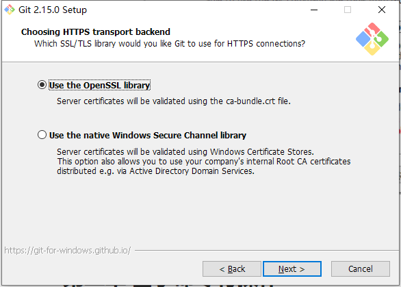
</figure>

后面步骤直接都是Next

 <figure class="thumbnails">
    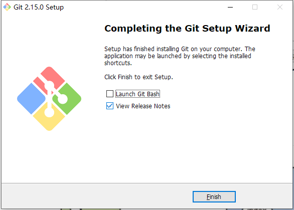
</figure>

点击Finish完成安装，验证安装，找一个桌面空白处，右键出现下列窗口


 <figure class="thumbnails">
    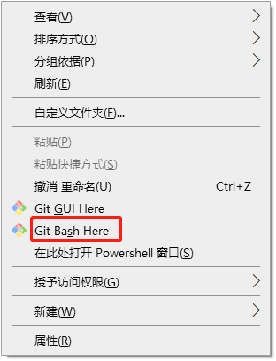
</figure>

点击后，出现Git的控制台，在控制台输入git，可以看到相关的帮助信息：


 <figure class="thumbnails">
    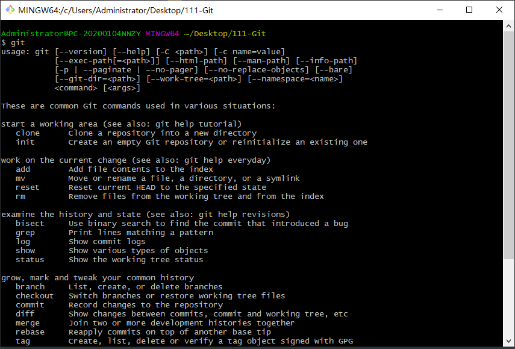
</figure>

到这来就说明你的git安装完成

## 第二章 基于命令行操作【理解】


 <figure class="thumbnails">
    
</figure>

### 1、Git工作区域

#### 【1】工作区


 <figure class="thumbnails">
    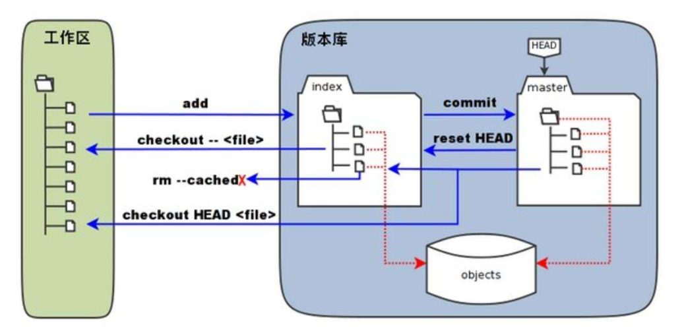
</figure>

工作区：就是你在电脑里能看到的目录。比如我们刚刚创建的learn-Git目录，

初始化工作区：右键文件夹中的空白处会出现Git的控制台

```properties
命令:git init 初始化工作区
	初始化完毕后,就可以将工作区的文件交给git管理了
	git在管理提交的java代码时,将这些提交的内容存放在当前工作区的.git隐藏文件夹中
```


 <figure class="thumbnails">
    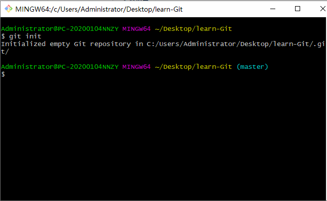
</figure>

在文件夹中机会出现一个隐藏文件.git如图


 <figure class="thumbnails">
    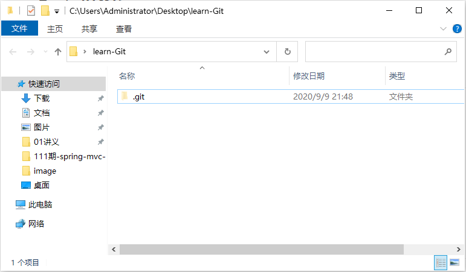
</figure>

当我们在learn-Git文件夹中添加文件的时候，那么这个文件就会被Git所管理

#### 【2】版本区


 <figure class="thumbnails">
    
</figure>

​	Git的版本库里存了很多东西，这些东西是git管理资源时使用的相关规则与配置(==不要动==)

```
index（或stage）: 暂存区，临时存放文件,最终从暂存区会提交给版本库,进行版本管理
```

其中最重要的就是称谓，还有Git为我们自动创建的第一个分支**master**，以及指向**master**的一个指针叫**HEAD**。

### 2、基本操作

#### 【1】工作区提交暂存区

##### 【1.1】图例


 <figure class="thumbnails">
    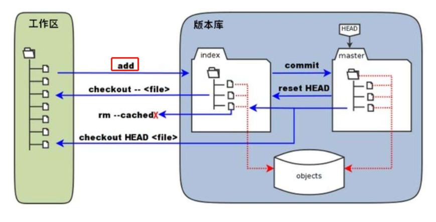
</figure>

##### 【1.2】操作步骤

###### 【1.2.1】创建文件

在learn-Git文件夹中新建文件：readme.txt


 <figure class="thumbnails">
    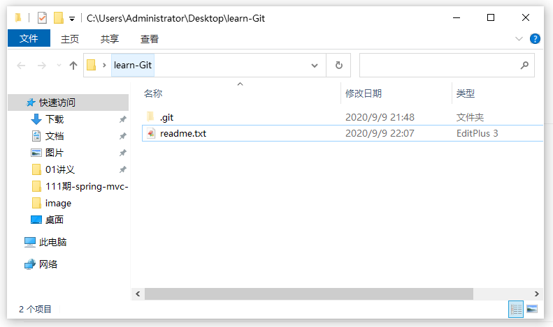
</figure>

###### 【1.2.2】编辑readme文件

在git控制台中使用  命令:

```properties
打开文件
命令:vi readme.txt
```


 <figure class="thumbnails">
    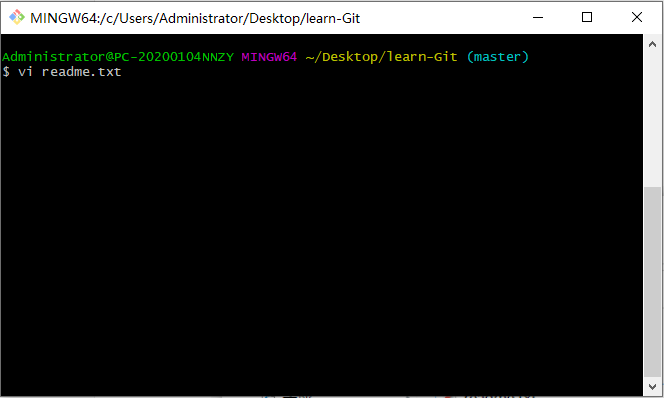
</figure>

敲击回车键


 <figure class="thumbnails">
    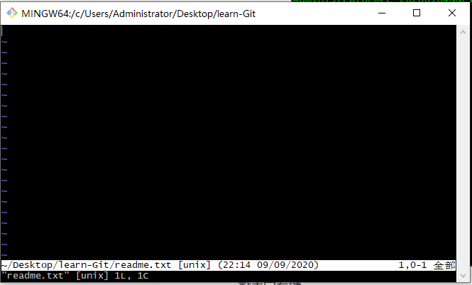
</figure>


需要注意的是此时，文本是没有进入编辑状态，需要输入i,进入编辑状态【左下角有插入字段】：

```properties
进入编辑模式,对文件进行编辑
命令: i
```


 <figure class="thumbnails">
    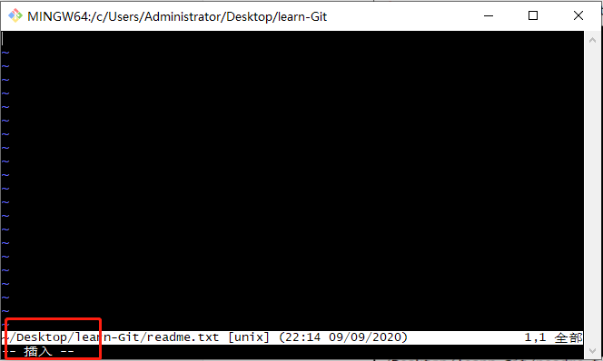
</figure>

输入一行汉字：


 <figure class="thumbnails">
    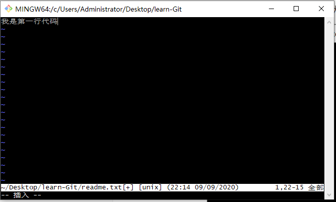
</figure>

然后按Esc，左下角的插入消失

```java
退出编辑模式
按: ESC
```


 <figure class="thumbnails">
    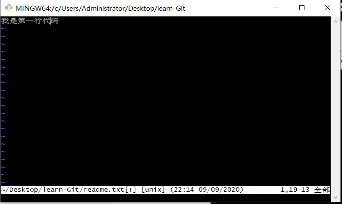
</figure>

然后按shift+:  这个时候右下出现：

```java
进入低行模式,将光标锁定到最底下那一行
按: shift :
```


 <figure class="thumbnails">
    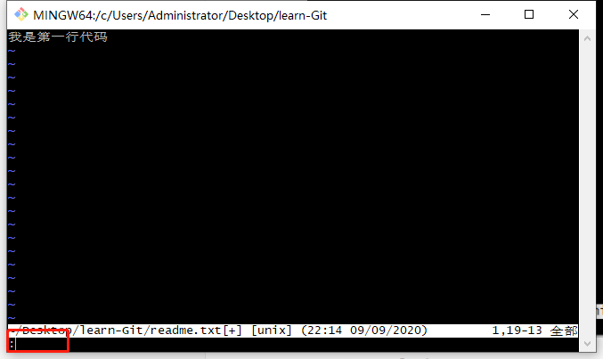
</figure>

输入wq然后回车退出：

```properties
写入并退出
命令:wq
```

 <figure class="thumbnails">
    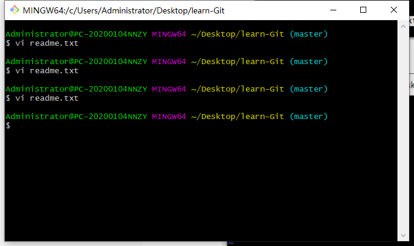
</figure>

###### 【1.2.3】提交缓存区

```properties
命令:git add readme.txt 
	解释: 将readme.txt存放到暂存区
```


 <figure class="thumbnails">
    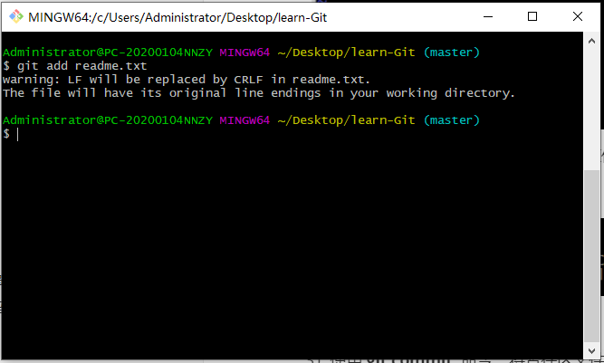
</figure>

这个时候就完成从工作区提交版本区

##### 【1.3】命令小结

```properties
命令: vi readme.txt  打开文件
命令: i 对文件进行插入(进入编辑模式,可以对文件进行编辑了)
命令: 按 : 进入低行模式,将光标定位到最底下的哪一行
命令: wq 退出保存文件(write quit,写入并退出编辑)
    q! 强制退出,不保存
命令: git add <文件名> 提交文件从工作区到缓存区 
```

#### 【2】缓存区提交本地仓库

##### 设置提交人与邮箱账号

==如果第一次提交需要填写如下内容：==

```properties
命令:git config --global user.email 'xiaozhi@qq.com'
	说明: 全局指定邮箱,只要邮箱格式正确即可
命令:git config --global user.name '小智'
	说明:指定操作者
```


 <figure class="thumbnails">
    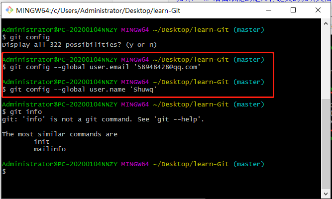
</figure>

##### 【2.1】图例


 <figure class="thumbnails">
    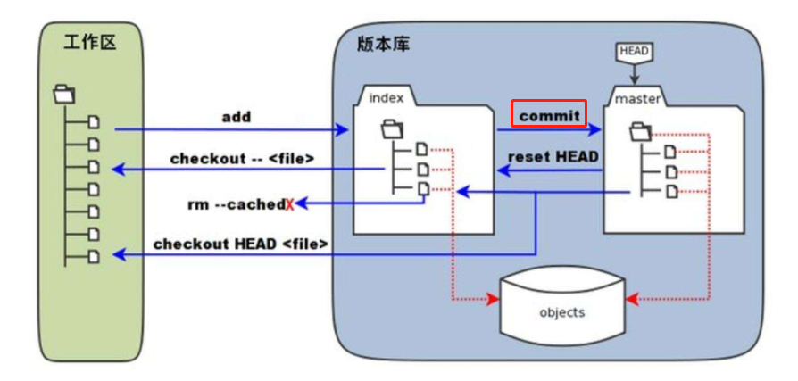
</figure>

##### 【2.2】操作步骤

```properties
命令: git commit -m '第一次提交' 
说明: -m 后面跟随的是为你提交的备注
```


 <figure class="thumbnails">
    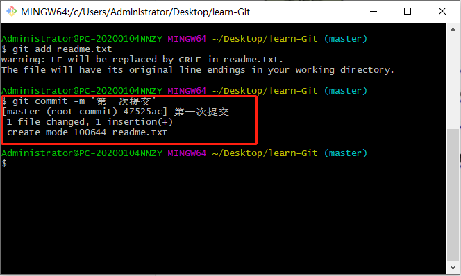
</figure>

##### 【2.3】命令小结

```properties
命令:git commit -m '备注' 
	说明:-m 后面跟随的是为你提交的备注
	
命令:git config --global user.email 'xiaozhi@qq.com'
	说明:指定邮箱
命令:git config --global user.name '小智'
	说明:指定操作者
```

#### 【3】差异比较

##### 【3.1】编辑文件

使用vi命令，对readme.txt文件进行编辑，添加我是第二行代码，使用wq退出【如果不了解的见工作区提交缓存区的操作】


 <figure class="thumbnails">
    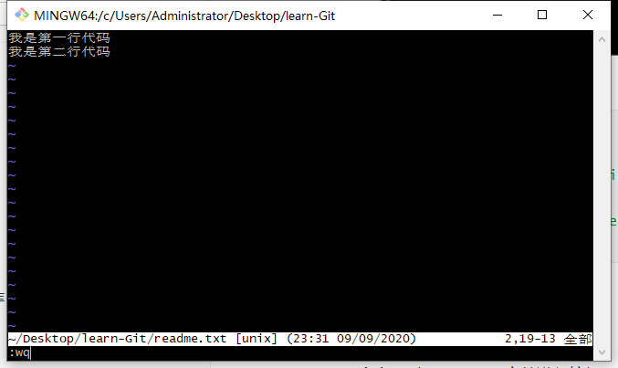
</figure>

##### 【3.2】工作区与暂存区比较

```properties
命令:git diff readme.txt
```


 <figure class="thumbnails">
    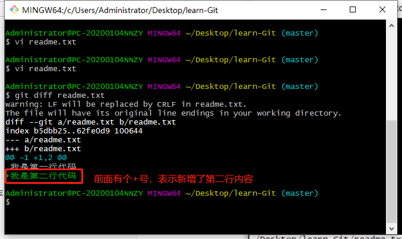
</figure>

##### 【3.2】工作区与本地版本库比较

```properties
命令:git diff HEAD readme.txt
```


 <figure class="thumbnails">
    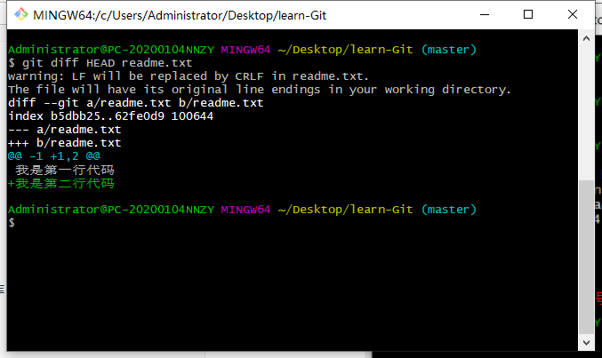
</figure>

##### 【3.2】暂存区与本地库比较

```properties
命令:git diff --cached readme.txt
```

这里缓存区和本地库没有不同所以没有内容


 <figure class="thumbnails">
    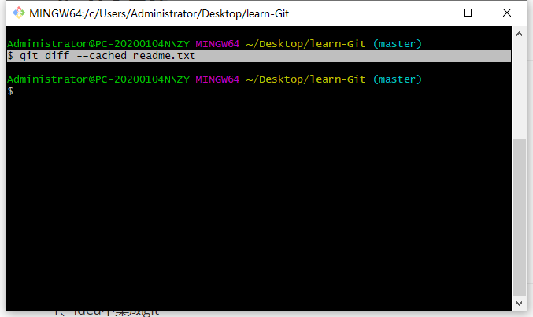
</figure>

##### 【3.3】命令小结

```properties
命令:git diff readme.txt 	 		工作区与暂存区比较
命令:git diff HEAD readme.txt 		工作区与本地库比较
命令:git diff --cached readme.txt 	暂存区和本地库比较
```

#### 【4】状态查看及提示

​	我们如果不确定自己的哪些文件被修改了，需要怎么操作呢？

##### 【4.1】状态查看

```properties
命令:git status
```


 <figure class="thumbnails">
    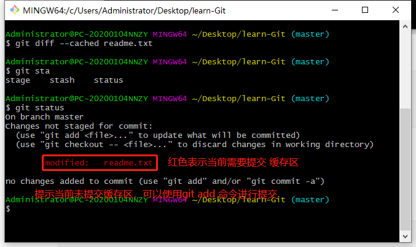
</figure>

提交缓存区后输入git status


 <figure class="thumbnails">
    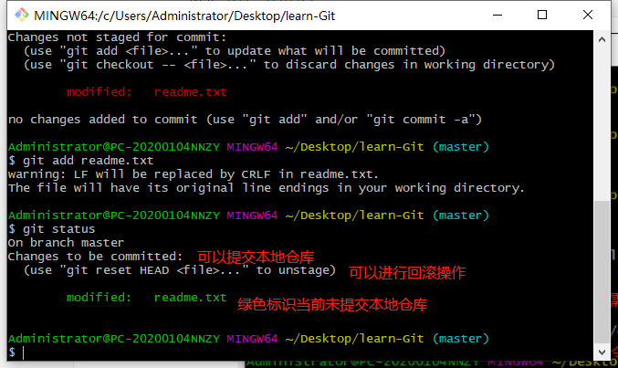
</figure>

提交本地仓库后输入git status,提示：工作区很干净，没有任何需要提交，这个时候就完成所有操作


 <figure class="thumbnails">
    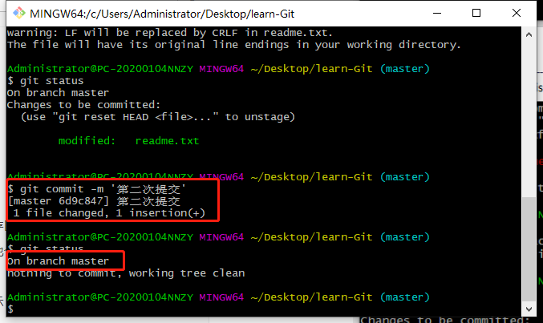
</figure>

##### 【4.2】命令小结

```properties
命令:git status 查看当前文件上传状态
	提示接下来可选的命令
```

#### 【5】版本回退

##### 【5.1】图例

 <figure class="thumbnails">
    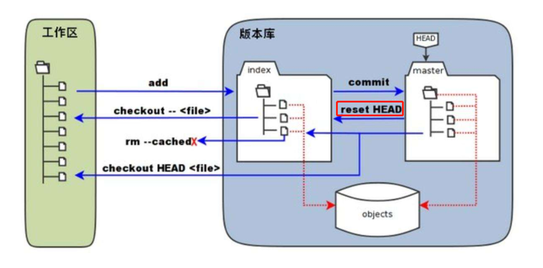
</figure>

当我们从暂存区提交到本地仓库时，发现当前的提交的版本有问题，希望回退到指定版本如何操作呢？

##### 【5.2】操作步骤

###### 【5.2.1】制造问题版本

使用vi命令编辑readme.txt,添加“我是第三行代码”


 <figure class="thumbnails">
    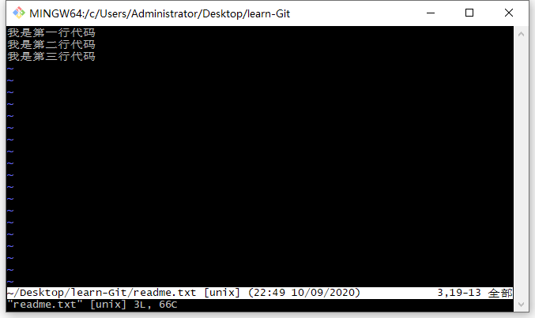
</figure>

```properties
命令:git add readme.txt 提交到暂存区
```


 <figure class="thumbnails">
    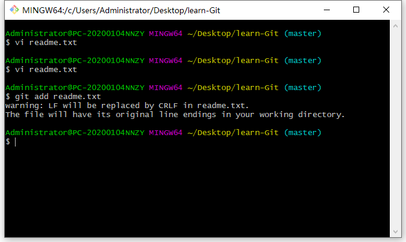
</figure>

```properties
命令:git commit -m '第三次提交' 提交到本地仓库
```


 <figure class="thumbnails">
    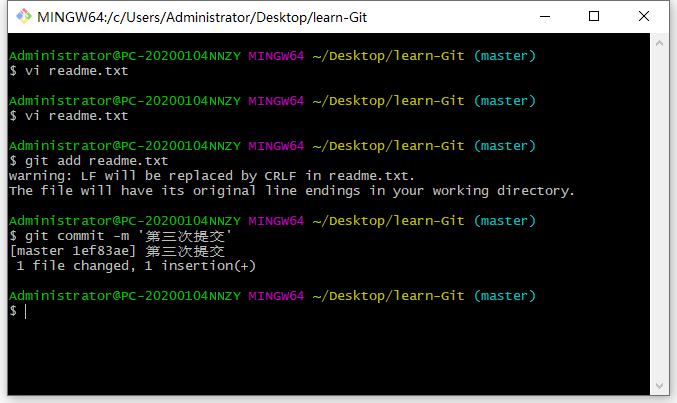
</figure>

###### 【5.2.2】查看日志

```properties
命令:git log  查看当前提交日志
```


 <figure class="thumbnails">
    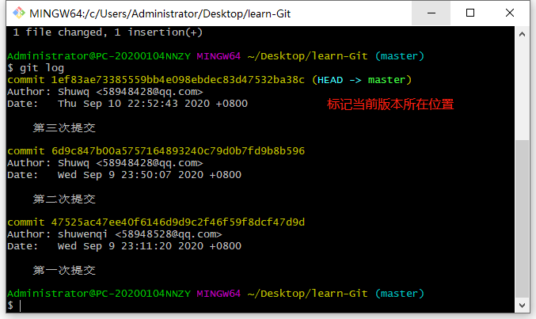
</figure>

可以发现，目前为止，我们已经在本地仓库中提交了3次，也就是说有3个不同版本。其中，最近的这个版本有一个标示：HEAD-> master 这就是标记当前分支的当前版本所在位置,如果没有显示当前所在位置可以使用下面命令查看：

```properties
命令:git log --decorate  查看当前提交日志，且显示当前分支的当前版本所在位置
```

在log中，每一个版本的前面，**都有一长串随即数字**：1ef83ae73385559bb4e098ebdec83d47532ba38c  ，这是每次提交的**commit id** ，这是通过SHA1算法得到的值，Git通过这个唯一的id来区分每次提交

###### 【5.2.3】回退之前版本

```properties
命令:
 	git reset --hard HEAD^
  		hard:硬,回退本地版本库,暂存区,工作区(这三个区中的内容是一致的,都做了回退)
 	git reset --soft HEAD^
 			soft:软,只回退本地版本库,暂存区与工作区的最新内容不做回退

回归到上一个版本,Git通过HEAD来判断当前所在的版本位置。那么上一个版本，就用HEAD^标示，上上一个版本就是HEAD^^，当然往上100个版本写100个^比较容易数不过来，所以写成HEAD~100。 
```


 <figure class="thumbnails">
    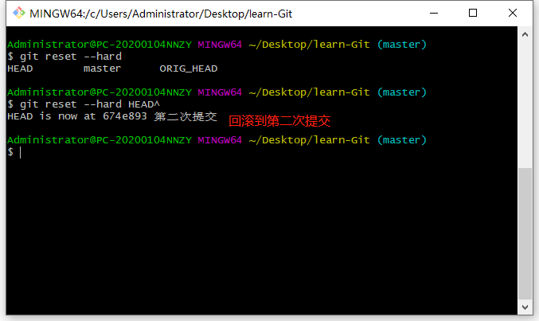
</figure>

```properties
命令:git log --decorate  查看当前提交日志，且显示当前分支的当前版本所在位置
```


 <figure class="thumbnails">
    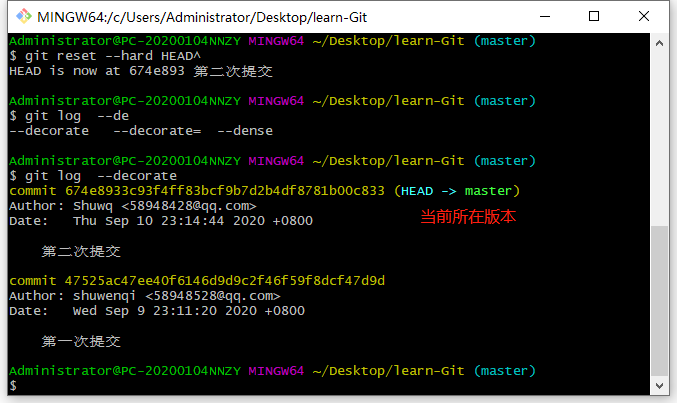
</figure>

```properties
命令: cat reader.txt 查看当前reader文件的信息
```


 <figure class="thumbnails">
    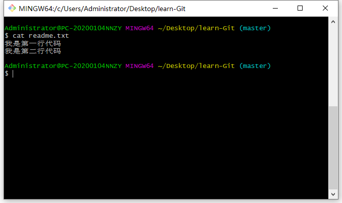
</figure>

###### 【5.2.4】回退指定版本

首先找到整个的操作记录

```properties
命令: git reflog 查看所有操作
```


 <figure class="thumbnails">
    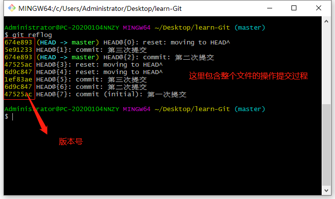
</figure>

找到之后可以使用如下命令进行回退

```properties
命令:git reset --hard <版本号> 回退到指定版本
```


 <figure class="thumbnails">
    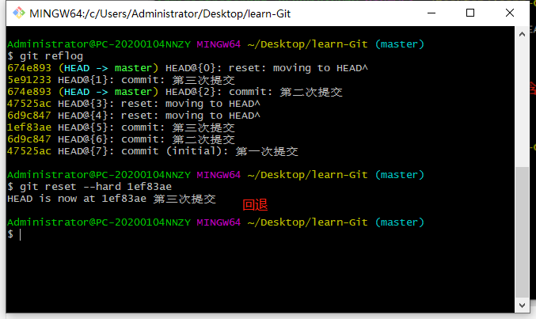
</figure>

使用cat命令查看readme.txt,发现之前的信息又回来了


 <figure class="thumbnails">
    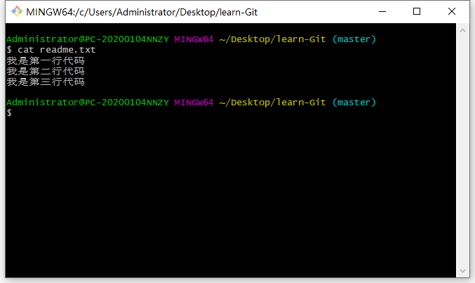
</figure>

##### 【5.3】命令小结

```properties
命令:git reset --hard HEAD^ (回退,本地版本库,暂存区,工作区)
    git reset --soft HEAD^ (只回退本地版本库)

回归到上一个版本,Git通过HEAD来判断当前所在的版本位置。那么上一个版本，就用HEAD^标示，上上一个版本就是HEAD^^，当然往上100个版本写100个^比较容易数不过来，所以写成HEAD~100。

命令:git log  查看当前提交日志

命令:git reflog 查看所有操作
	在这个日志文件中记录有对本地版本库的所有操作

命令:git reset --hard <版本号> 回退到指定版本

```

#### 【6】修改撤销

##### 【6.1】工作区撤销修改

此处撤销:撤销的是尚未提交到缓存区中或工作区中的内容

###### 【6.1.1】图例


 <figure class="thumbnails">
    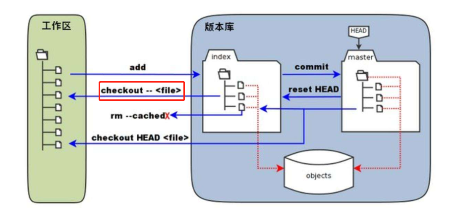
</figure>

###### 【6.1.2】操作步骤

使用 vi 命令 编辑readme.txt添加“我是第四行代码”


 <figure class="thumbnails">
    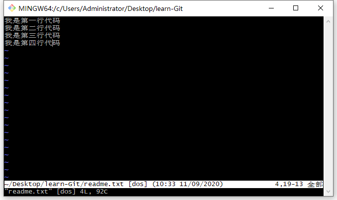
</figure>

在你提交缓存区前，你突然发现这个修改是有问题的，你打算恢复到原来的样子。怎么办？

使用git status 命令查看当前状态


 <figure class="thumbnails">
    
</figure>

```properties
命令:git checkout -- <文件名称> 撤销工作区修改
```


 <figure class="thumbnails">
    
</figure>


 <figure class="thumbnails">
    
</figure>

##### 【6.2】缓存区撤销修改

###### 【6.2.1】图例


 <figure class="thumbnails">
    
</figure>

###### 【6.2.1】操作步骤

使用 vi 命令 编辑readme.txt添加“我是第五行代码”


 <figure class="thumbnails">
    
</figure>

提交工作区提交到缓存区

```properties
命令:git add readme.txt 
```

 <figure class="thumbnails">
    
</figure>

撤销到工作区

```properties
命令:git reset HEAD readme.txt 撤销到工作区
```


 <figure class="thumbnails">
    
</figure>

此时就可以在工作区撤销修改


 <figure class="thumbnails">
    
</figure>

查看readme.txt文件内容


 <figure class="thumbnails">
    
</figure>

##### 【6.3】命令小结

```properties
命令:git checkout -- <文件名称> 撤销工作区修改
	当修改的内容,没有提交到暂存区前,撤销
命令:git reset HEAD readme.txt 撤销暂存区的内容到工作区
	修改的内容,到达了暂存区,但是没有到达本地版本库,进行撤销
注意: 一旦内容提交到了版本库,就需要使用回退进行数据的恢复.
```

### 3、远程仓库

​	到目前为止，我们已经学会了如何在本机利用git进行文件版本管理，但是如果要想进行多人协作，我们就必须使用远程仓库。将本地仓库的数据同步到远程仓库，实现多人协作开发。

​	目前比较热门的代码托管社区：GitHub，网址：<https://github.com>  ,提供了免费的远程git仓库功能。不过网速不是特别流畅,因为服务器在国外。 在国内，有很多的公司使用oschina提供的git服务：码云, <https://gitee.com> 

#### 【1】码云仓库

##### 【1.1】注册登录

访问地址：https://gitee.com/


 <figure class="thumbnails">
    
</figure>

请自定完成注册和登录。

##### 【1.2】创建仓库


 <figure class="thumbnails">
    
</figure>

填写项目相关的信息


 <figure class="thumbnails">
    
</figure>


 <figure class="thumbnails">
    
</figure>

仓库创建完毕，可以看到，如果我们要与远程仓库同步，这里支持多种通信协议，当我们选中一种协议后，后面会出现对应的**远程仓库地址**。


 <figure class="thumbnails">
    
</figure>

#### 【2】关联远程仓库

现在readme.txt已经推送到我们自己的本地仓库，在推送到码云仓库前，我们需要先建立与远程仓库的关系

```properties
命令:git remote add origin https://gitee.com/xs1115/learn_git.git
关联远程仓库
```


 <figure class="thumbnails">
    
</figure>

==注意: 向码云上推拉代码时需要身份的认证. 我们可以将我们的账号配置到windows系统中.==

```java
登录的网站地址: git:https://gitee.com/
账户: 码云的用户名
密码: 码云账户的密码
```


 <figure class="thumbnails">
    
</figure>


 <figure class="thumbnails">
    
</figure>

#### 【3】拉取代码

【注意】在推送代码前必须先拉取代码，否则无法推送本地仓库代码到仓库

```properties
命令:git pull origin master --allow-unrelated-histories
	首次拉取需要添加:--allow-unrelated-histories
命令:git pull 后续拉取
```


 <figure class="thumbnails">
    
</figure>

#### 【4】推送代码

```properties
命令: git push -u origin master 首次推送
命令: git push 后续推送
```


 <figure class="thumbnails">
    
</figure>

码云仓库有推送的信息


 <figure class="thumbnails">
    
</figure>

#### 【5】克隆远程仓库

如果我们新加入一个团队，这个时候就需要我们把代码从远程仓库克隆过来，那么咱们操作呢？

新建文件夹learn-Git-B，新建的文件中右键


 <figure class="thumbnails">
    
</figure>


点击 Git bash Here 

```properties
命令: git clone https://gitee.com/shuwq/itheima-learn-git.git
```


 <figure class="thumbnails">
    
</figure>

这时候就拉取出远程仓库的内容

 <figure class="thumbnails">
    
</figure>

#### 【6】命令小结

```properties
命令:git remote add origin https://gitee.com/shuwq/itheima-learn-git.git
	关联远程仓库

命令:git pull origin master --allow-unrelated-histories
	首次拉取需要添加:--allow-unrelated-histories
命令:git pull 后续拉取

命令: git push -u origin master 首次推送
命令: git push 后续推送

命令: git clone https://gitee.com/shuwq/itheima-learn-git.git
```

### 4、本地分支

#### 【1】什么是分支？

​		分支在实际中有什么用呢？假设你准备开发一个新功能，但是需要两周才能完成，第一周你写了50%的代码，如果立刻提交，由于代码还没写完，不完整的代码库会导致别人不能干活了。如果等代码全部写完再一次提交，又存在丢失每天进度的巨大风险。

文件提交示意图：

 <figure class="thumbnails">
    
</figure>

```properties
创建分支,并切换到新建的分支上
命令: git checkout -b dev 创建且切换到dev
```

#### 【2】创建dev分支

分支创建示意图：

 <figure class="thumbnails">
    
</figure>

```properties
命令: git branch 分支名称   创建dev分支
		git branch dev   创建dev分支
```


 <figure class="thumbnails">
    
</figure>

#### 【3】切换dev分支

```properties
命令: git checkout dev   切换dev分支
```


 <figure class="thumbnails">
    
</figure>

编辑readme.txt,添加“我是dev提交的代码”


 <figure class="thumbnails">
    
</figure>

从工作区提交到缓存区执行:git add readme.txt
执行:git commit -m 'dev分支提交'


 <figure class="thumbnails">
    
</figure>


查看readme.txt可以看见


 <figure class="thumbnails">
    
</figure>

执行 git checkout master 切换master分支，查看readme.txt可以看见


 <figure class="thumbnails">
    
</figure>

#### 【4】分支合并


 <figure class="thumbnails">
    
</figure>


==需要注意的是,合并分支需要在master分支中进行==

```properties
命令: git merge dev   合并dev分支
```


 <figure class="thumbnails">
    
</figure>

#### 【5】分支删除

##### 【5.1】图例


 <figure class="thumbnails">
    
</figure>

【5.2】操作步骤

合并完分支之后，如果不再使用dev分支，则可以删除此分支,先查看当前分支：

```properties
命令:git branch 查看分支情况
```


 <figure class="thumbnails">
    
</figure>

可以看见当前在dev分支上，我们切换到master分支

```properties
命令:git checkout master
```


 <figure class="thumbnails">
    
</figure>


 <figure class="thumbnails">
    
</figure>

删除dev分支

```properties
命令:git branch -d dev
```


 <figure class="thumbnails">
    
</figure>

#### 【6】命令小结

```properties
命令: git checkout -b dev 创建且切换到dev
命令: git branch dev   创建dev分支
命令: git checkout dev|master   切换dev分支
命令: git merge dev   合并dev分支(需要在主分支中进行)
命令: git branch 查看分支情况
命令: git branch -d dev
```

### 5、命令大全

```properties
命令:git init 初始化控制台

命令:vi readme.txt  编辑文件

命令:i 对文件进行插入

命令:wq 退出保存文件

命令:git add <文件名> 提交文件从工作区到缓存区 

命令:git commit -m '备注' 
说明:-m 后面跟随的是为你提交的备注

命令:git config --global user.email '58948428@qq.com'
说明:指定邮箱

命令:git config --global user.name 'Shuwq'
说明:指定操作者

命令:git diff readme.txt 	 		工作区与暂存区比较

命令:git diff HEAD readme.txt 		工作区与本地库比较

命令:git diff --cached readme.txt 	暂存区和本地库比较

命令:git status 查看当前文件上传状态

命令:git reset --hard HEAD^ 
回归到上一个版本,Git通过HEAD来判断当前所在的版本位置。那么上一个版本，就用HEAD^标示，上上一个版本就是HEAD^^，当然往上100个版本写100个^比较容易数不过来，所以写成HEAD~100。

命令:git log  查看当前提交日志

命令:git log --decorate  查看当前提交日志，且显示当前分支的当前版本所在位置

命令:git reflog 查看所有操作

命令:git reset --hard <版本号> 回退到指定版本

命令:git checkout -- <文件名称> 撤销工作区修改

命令:git reset HEAD readme.txt 撤销到工作区

命令:git remote add origin https://gitee.com/shuwq/itheima-learn-git.git 关联远程仓库

命令:git pull origin master --allow-unrelated-histories
首次拉取需要添加:--allow-unrelated-histories

命令:git pull 后续拉取

命令:git push -u origin master 首次推送

命令:git push 后续推送

命令:git clone https://gitee.com/shuwq/itheima-learn-git.git

命令:git branch dev   创建dev分支

命令:git checkout dev   切换dev分支

命令:git checkout -b dev 创建且切换到dev

命令:git merge dev   合并dev分支

命令: git branch 查看分支情况

命令:git branch -d dev
```

## 第三章 idea中使用Git【重点】

### 1、idea集成Git

在idea中的file菜单中选中settings


 <figure class="thumbnails">
    
</figure>

弹出settings后在搜索中输入"git",选择Git,指定你的安装的git.exe目录


 <figure class="thumbnails">
    
</figure>

校验git是否集成完成,点击test,弹出校验窗口，点击git ececuted successed 成功则表示集成完成


 <figure class="thumbnails">
    
</figure>

### 2、基本操作

使用maven创建一个git-project项目,结构如下：


 <figure class="thumbnails">
    
</figure>

#### 【1】初始化工作区

点击VCS  -->  Import into Version Control --> Create Git Repository


 <figure class="thumbnails">
    
</figure>

选择管理的文件夹，这里我现在的为git-project-sk文件夹：


 <figure class="thumbnails">
    
</figure>

点击左下角，Version control菜单，此时git-project-sk下所有的文件都变成棕色,说明我们的本地仓库添加的完成了


 <figure class="thumbnails">
    
</figure>

#### 【2】忽略文件类型

从version control中我们可以看到有一部分文件，我们是不需要提交到本地仓库中去的：


 <figure class="thumbnails">
    
</figure>

那我们怎么做呢？可以拷贝"Git课件\02-课程资料"中.gitignore文件，到git-project-sk的根目录：


 <figure class="thumbnails">
    
</figure>

这个时候你会发现，多余的不需要提交的文件类型被忽略了。如果有新的要忽视的文件类型，你可以在.gitignore中添加


 <figure class="thumbnails">
    
</figure>

#### 【3】工作区提交缓存区

选中git-project项目,右键


 <figure class="thumbnails">
    
</figure>

可以看到Version control中的文件颜色由棕色变成的绿色


 <figure class="thumbnails">
    
</figure>

#### 【4】缓存区提交本地仓库

点击右下角Version control面板中，选中你要提交的文件，这里我都需要提交，使用全部选中


 <figure class="thumbnails">
    
</figure>

点击鼠标右键

 <figure class="thumbnails">
    
</figure>

选中commit：


 <figure class="thumbnails">
    
</figure>

点击Commit


 <figure class="thumbnails">
    
</figure>

再次确定，点击Commit


 <figure class="thumbnails">
    
</figure>

#### 【5】差异化比较

##### 【5.1】工作区与缓存区比较

格式化com.itheima.git.App.java类：


 <figure class="thumbnails">
    
</figure>

在Version Control中选中App.java右键：


 <figure class="thumbnails">
    
</figure>

你就可以看见工作区与缓存区的区别


 <figure class="thumbnails">
    
</figure>

##### 【5.2】工作区与本地仓库比较

在Version Control中选中App.java右键：

 <figure class="thumbnails">
    
</figure>


 <figure class="thumbnails">
    
</figure>


 <figure class="thumbnails">
    
</figure>

【6】查看日志

点击左下角Version Control--->log,就可以查看提交记录


 <figure class="thumbnails">
    
</figure>

#### 【6】版本回退及撤销

##### 【6.1】 制造问题版本

选择App.java,提交刚刚的修改到本地仓库中：


 <figure class="thumbnails">
    
</figure>

填写备注，然后点击commit：


 <figure class="thumbnails">
    
</figure>

在左下角Version Control中查看log


 <figure class="thumbnails">
    
</figure>

在App.java中添加


 <figure class="thumbnails">
    
</figure>

提交到本地仓库


 <figure class="thumbnails">
    
</figure>

在左下角version Control中查看log


 <figure class="thumbnails">
    
</figure>

可以看出此时：我们一共提交3次，下面我们来进行版本的回退

##### 【6.2】本地仓库回退撤销

在右下方Version Control点击log，此时我们可以看到3个提交的版本， 


 <figure class="thumbnails">
    
</figure>

现在我们在本地仓库中回退到第二次提交,选择第二次提交的标记，右键


 <figure class="thumbnails">
    
</figure>

选择Hard


 <figure class="thumbnails">
    
</figure>


 <figure class="thumbnails">
    
</figure>

##### 【6.3】工作区撤销

当我们在工作区编辑代码时候，希望撤销未提交本地仓库的代码时候


 <figure class="thumbnails">
    
</figure>

在Version Control中右键


 <figure class="thumbnails">
    
</figure>

弹出如下窗口：


 <figure class="thumbnails">
    
</figure>

点击revert,代码则撤销:


 <figure class="thumbnails">
    
</figure>

### 3、远程仓库

#### 【1】创建仓库


 <figure class="thumbnails">
    
</figure>

新建：git-project-sk


 <figure class="thumbnails">
    
</figure>


 <figure class="thumbnails">
    
</figure>

#### 【2】关联远程仓库

VCS-->Git--->Remotes


 <figure class="thumbnails">
    
</figure>

点击之后弹出窗口，点击+


 <figure class="thumbnails">
    
</figure>

复制git-project-sk 的https地址


 <figure class="thumbnails">
    
</figure>


 <figure class="thumbnails">
    
</figure>
#### 【3】拉取代码

选择git-project-sk根目录,右键


 <figure class="thumbnails">
    
</figure>

弹出如下窗口，点击刷新


 <figure class="thumbnails">
    
</figure>


 <figure class="thumbnails">
    
</figure>

因为是首次拉取代码会报如下错误


 <figure class="thumbnails">
    
</figure>


 <figure class="thumbnails">
    
</figure>

之所以拉取不成功，是因为我们忽略文件与远程仓库的中的忽略文件冲突，这边我们选择合并


 <figure class="thumbnails">
    
</figure>


 <figure class="thumbnails">
    
</figure>


 <figure class="thumbnails">
    
</figure>

重新拉取代码：


 <figure class="thumbnails">
    
</figure>


 <figure class="thumbnails">
    
</figure>

拉取完成后我们可以看见远程仓库中的文件已经来到本地仓库

 <figure class="thumbnails">
    
</figure>

#### 【4】推送代码


 <figure class="thumbnails">
    
</figure>


 <figure class="thumbnails">
    
</figure>

推送成功提示


 <figure class="thumbnails">
    
</figure>

这时候什么去码云上查看：


 <figure class="thumbnails">
    
</figure>

我们的本地代码就推送到了远程仓库

#### 【5】克隆远程仓库

复制码云上仓库地址


 <figure class="thumbnails">
    
</figure>

在git-project-sk从远处git上克隆项目：


 <figure class="thumbnails">
    
</figure>


 <figure class="thumbnails">
    
</figure>


 <figure class="thumbnails">
    
</figure>

在新的空间中打开


 <figure class="thumbnails">
    
</figure>


 <figure class="thumbnails">
    
</figure>


 <figure class="thumbnails">
    
</figure>

### 4、本地分支

#### 【1】创建dev分支


 <figure class="thumbnails">
    
</figure>

创建的同时切换分支：


 <figure class="thumbnails">
    
</figure>

查看当前所在分支：


 <figure class="thumbnails">
    
</figure>

#### 【2】分支合并

编辑App.java,需要注意右下角当前分支为dev

 <figure class="thumbnails">
    
</figure>

提交缓存区代码到dev分支


 <figure class="thumbnails">
    
</figure>

查看version control中的log,发现当前在dev环境上


 <figure class="thumbnails">
    
</figure>

切换回本地master分支


 <figure class="thumbnails">
    
</figure>

切换完成：


 <figure class="thumbnails">
    
</figure>


合并dev提交到master分支


 <figure class="thumbnails">
    
</figure>

#### 【3】分支删除


 <figure class="thumbnails">
    
</figure>

本地分支中就不会有dev分支了：

 <figure class="thumbnails">
    
</figure>

#### 【4】冲突解决

##### 【4.1】制造冲突


 <figure class="thumbnails">
    
</figure>

在码云中对App.java 做如下编辑


 <figure class="thumbnails">
    
</figure>


 <figure class="thumbnails">
    
</figure>

在IDEA中拉取代码


 <figure class="thumbnails">
    
</figure>

这时候App的类变红色，且弹出窗口，需要手动进行合并


 <figure class="thumbnails">
    
</figure>

解决冲突


 <figure class="thumbnails">
    
</figure>

选择主干：

 <figure class="thumbnails">
    
</figure>


 <figure class="thumbnails">
    
</figure>


 <figure class="thumbnails">
    
</figure>

 <figure class="thumbnails">
    
</figure>

提交远程仓库


 <figure class="thumbnails">
    
</figure>

##### 【4.2】特殊错误

点击最上面的时候进行代码拉取的时候


 <figure class="thumbnails">
    
</figure>

==IDEA git 拉取项目时报 No tracked branch configured for branch master or the branch doesn't exist的提示==

选择本地工作空间右键


 <figure class="thumbnails">
    
</figure>


 <figure class="thumbnails">
    
</figure>

打开git的Git bash here


 <figure class="thumbnails">
    
</figure>

输入：

```properties
命令: git branch --set-upstream-to=origin/master
```


 <figure class="thumbnails">
    
</figure>

IDEA中再次拉取


 <figure class="thumbnails">
    
</figure>

## 第四章  TortoiseGit客户端【了解-自学】

### 1、TortoiseGit的安装

详情请参考资料\TortoiseGit资料中的：


 <figure class="thumbnails">
    
</figure>

### 2、基本操作

#### 【1】初始化工作区

添加文件夹，在文件夹中添加wugui.txt，然后空白处右键：


 <figure class="thumbnails">
    
</figure>

 <figure class="thumbnails">
    
</figure>


 <figure class="thumbnails">
    
</figure>


 <figure class="thumbnails">
    
</figure>

#### 【2】工作区提交缓存区

编辑wugui.txt


 <figure class="thumbnails">
    
</figure>

右键-->TortoiseGit-->添加，提示：这一步等同于我们的 **git add wugui.txt**


 <figure class="thumbnails">
    
</figure>


 <figure class="thumbnails">
    
</figure>

 此时直接点击提交，即可完成：git commit 操作：


 <figure class="thumbnails">
    
</figure>

 <figure class="thumbnails">
    
</figure>


​	提示：


 <figure class="thumbnails">
    
</figure>

#### 【3】差异化比较

修改wugui.txt


 <figure class="thumbnails">
    
</figure>

右键


 <figure class="thumbnails">
    
</figure>


 <figure class="thumbnails">
    
</figure>

#### 【4】缓存提交本地仓库

直接在文件上选择右键，提交即可：


 <figure class="thumbnails">
    
</figure>

提示：


 <figure class="thumbnails">
    
</figure>

#### 【5】版本回退及撤销

##### 【5.1】版本回退

编辑wugui.txt文件，保存


 <figure class="thumbnails">
    
</figure>

选择wugui.txt文件，右键显示日志


 <figure class="thumbnails">
    
</figure>


 <figure class="thumbnails">
    
</figure>

选择需要回退的版本


 <figure class="thumbnails">
    
</figure>

 <figure class="thumbnails">
    
</figure>

提示：


 <figure class="thumbnails">
    
</figure>

查看wugui.txt

 <figure class="thumbnails">
    
</figure>

##### 【5.2】修改撤销

编辑wugui.txt


 <figure class="thumbnails">
    
</figure>

现在后悔了，想要还原到修改以前。 

我们可以选中文件，右键。然后选中菜单：还原。


 <figure class="thumbnails">
    
</figure>


 <figure class="thumbnails">
    
</figure>


 <figure class="thumbnails">
    
</figure>


 <figure class="thumbnails">
    
</figure>

### 3、远程仓库

#### 【1】创建仓库


 <figure class="thumbnails">
    
</figure>


 <figure class="thumbnails">
    
</figure>

#### 【2】关联远程仓库

新建文件夹learn-Git-wugui-B，在文件夹中右键,创建本地工作区


 <figure class="thumbnails">
    
</figure>

 <figure class="thumbnails">
    
</figure>


在文件夹中右键，进行远程仓库设置


 <figure class="thumbnails">
    
</figure>


选择远端，添加origin，填入https://gitee.com/shuwq/itheima-learn-git-wugui.git


 <figure class="thumbnails">
    
</figure>


 <figure class="thumbnails">
    
</figure>

提示


 <figure class="thumbnails">
    
</figure>

#### 【3】拉取代码


 <figure class="thumbnails">
    
</figure>


 <figure class="thumbnails">
    
</figure>


 <figure class="thumbnails">
    
</figure>

查看这个时候就会看见从远程下载下来

 <figure class="thumbnails">
    
</figure>

#### 【4】推送代码

在learn-Git-wugui-B新建文件wugui.txt，添加到本地仓库


 <figure class="thumbnails">
    
</figure>


文件夹空白处右键


 <figure class="thumbnails">
    
</figure>


 <figure class="thumbnails">
    
</figure>

提示


 <figure class="thumbnails">
    
</figure>

查看码云：

 <figure class="thumbnails">
    
</figure>

### 4、分支管理

#### 【1】创建dev分支


 <figure class="thumbnails">
    
</figure>


 <figure class="thumbnails">
    
</figure>


 <figure class="thumbnails">
    
</figure>

#### 【2】分支合并

##### 【2.1】切换dev分支


 <figure class="thumbnails">
    
</figure>


 <figure class="thumbnails">
    
</figure>


 <figure class="thumbnails">
    
</figure>


 <figure class="thumbnails">
    
</figure>

##### 【2.2】合并dev分支

编辑wugui.txt


 <figure class="thumbnails">
    
</figure>

选择文件，点击右键


 <figure class="thumbnails">
    
</figure>

提交dev


 <figure class="thumbnails">
    
</figure>

提示：


 <figure class="thumbnails">
    
</figure>

切换回master分支


 <figure class="thumbnails">
    
</figure>

 <figure class="thumbnails">
    
</figure>

查看wugui.txt,在master分支上，我们没有看见dev分支提交的内容


 <figure class="thumbnails">
    
</figure>

空白处，右击


 <figure class="thumbnails">
    
</figure>

我们进行分支的合并：


 <figure class="thumbnails">
    
</figure>

提示


 <figure class="thumbnails">
    
</figure>

查看wugui.txt,这时出现了dev分支的内容


 <figure class="thumbnails">
    
</figure>

#### 【3】分支删除


 <figure class="thumbnails">
    
</figure>


 <figure class="thumbnails">
    
</figure>


 <figure class="thumbnails">
    
</figure>


 <figure class="thumbnails">
    
</figure>


 <figure class="thumbnails">
    
</figure>


 <figure class="thumbnails">
    
</figure>


 <figure class="thumbnails">
    
</figure>

# 总结

```java
Git: 分布式版本控制软件
  	作用: 在开发中管理代码的各个版本
    组成:
				工作区: 本地的文件夹(本地工作空间)
        暂存区: 临时存放将要被Git管理的文件
        本地版本库: 统一管理代码版本的位置
    相关命令:
				注: 在将文件提交到本地版本库时,必须设置提交时使用的邮箱以及用户名(格式正确)
				将工作区的文件提交到暂存区:
						git add 文件名
        将暂存区的文件提交到版本库:
						git commit 文件名 -m '描述'
        差异化比较:
						工作区与暂存区: git diff 文件名
            工作区与版本库: git diff HEAD 文件名
        		暂存区与版本库: git diff --cached HEAD 文件名
        状态查看与命令提示:
						git status
        版本回退:
						回退到上一个版本:
								git reset --hard HEAD^
            回退到更早的版本:
								git reset --hard HEAD~10
            回退到指定的版本:
								git reset -hard 版本号(唯一标识)
            查询日志:
								git log
                git reflog
        修改撤销: 
						注: 修改后的内容并没有提交到版本库
            工作区撤销:
								git checkout -- 文件名
						暂存区撤销:
								git reset HEAD^ 文件名
    


```

