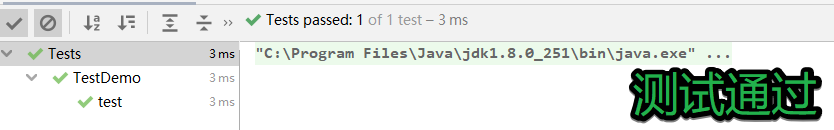
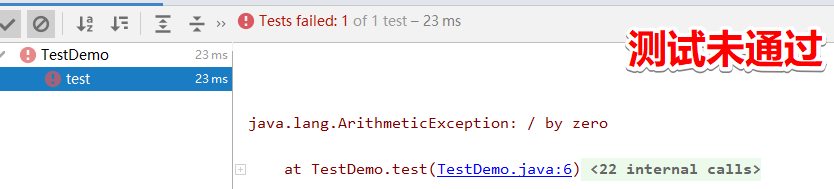
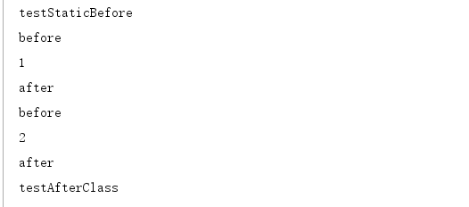
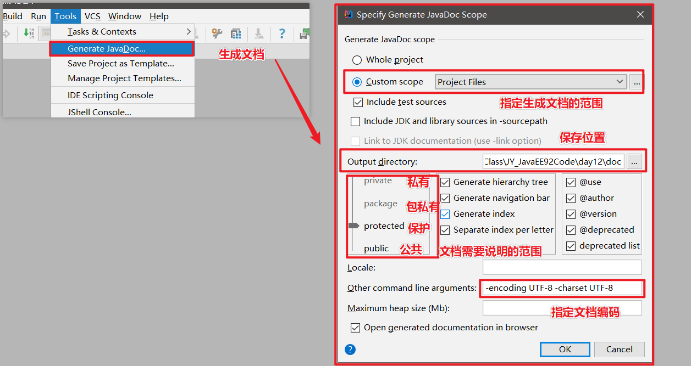
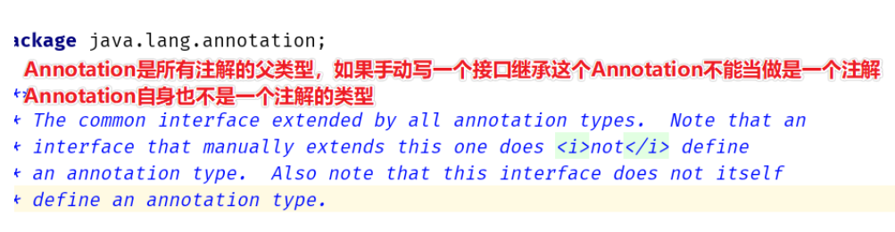
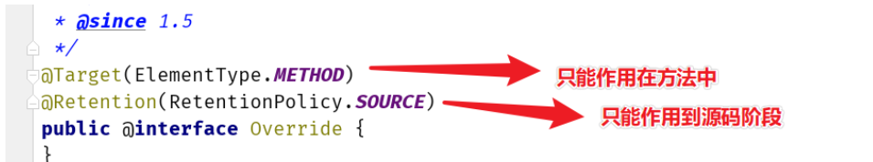
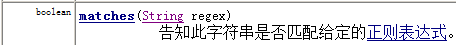
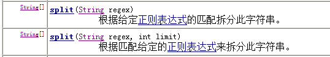

# 第一章 Junit单元测试

## 1 单元测试概述

1. **Junit是什么？**

   Junit是Java语言编写的第三方单元测试框架(工具类)，如果加载到我们自己的工程或者模块，可以直接使用这些框架中定义好的类型。

2. **单元测试概念**

   单元：单元就是人为规定的最小的被测功能模块，在Java中，一个类就是一个单元。

   单元测试：对某个类中的定义的方法进行功能测试或业务逻辑测试。

   

3. **Junit单元测试框架的作用**
   用来对类中的方法功能进行有目的的测试，以保证程序的正确性和稳定性。能够让方法独立运行起来。在工作中完成代码开发后就可以进行单元测试，以达到使程序稳定，健壮的效果。


## 2 Junit使用步骤

1. 编写业务类，在业务类中编写业务方法。比如增删改查的方法【被测试的代码】

2. 编写测试类，在测试类中编写测试方法，在测试方法中编写测试代码来测试。【测试操作代码】

   **测试类**

   - 命名规范：以Test开头，以业务类类名结尾，使用驼峰命名法每一个单词首字母大写。

     ```java
     比如业务类类名：ProductDao，那么测试类类名就应该叫：TestProductDao
     ```

     

   **测试方法**

   - 命名规范：以test开头，以业务方法名结尾

     ```java
     比如业务方法名为：save，那么测试方法名就应该叫：testSave
     ```

   - 方法格式

     - 必须是public修饰的，没有返回值，没有参数

     - 必须使注解@Test修饰

     【固定格式】

     ```java
     @Test
     public void testXxx(){}
     ```

     初次使用时，需要将将Junit导入工程==【Alt+Enter快捷键】==，会有两个版本一个Junit4和Junit5。我们常用使用Junit4版本进行测试，选择Junit4版本。

     

3. **如何运行测试方法**
       选中方法名 --> 右键 --> Run '测试方法名'  运行选中的测试方法
       选中测试类类名 --> 右键 --> Run '测试类类名'  运行测试类中所有测试方法
       选中模块名 --> 右键 --> Run 'All Tests'  运行模块中的所有测试类的所有测试方法

   

4. **如何查看测试结果**
   绿色：表示测试通过
   红色：表示测试失败，有问题

   如图显示：

    

    


【代码实践】

写一个Calculator类，实现加减乘除的功能。然后使用测试类对功能进行测试。

```java
public class TestCalculator {
    //写测试方法：
    //无参无返回值的公共方法，需要@Test进行注解

    //测试add方法
    @Test
    public void testAdd() {
        Calculator cal = new Calculator();
        int add = cal.add(100, 200);
        System.out.println("add = " + add);
    }

}

```

```java
public class Calculator {//计算器

    public int add(int a, int b) {
        return a + b;
    }

    public int sub(int a, int b) {
        return a - b;
    }

    public int multiply(int a, int b) {
        return a * b;
    }

    public int divider(int a, int b) {
        return a / b;
    }

}

```


## 3 Junit中其他注解使用

```
Junit4常用注解(Junit4.xxxx版本)
	@Before：用来修饰方法，该方法会在每一个测试方法执行之前执行一次。
	@After：用来修饰方法，该方法会在每一个测试方法执行之后执行一次。
	@BeforeClass：用来静态修饰方法，该方法会在所有测试方法之前执行一次。
	@AfterClass：用来静态修饰方法，该方法会在所有测试方法之后执行一次。

Junit5常用注解(Junit5.xxxx版本)
 	@BeforeEach：用来修饰方法，该方法会在每一个测试方法执行之前执行一次。
 	@AfterEach：用来修饰方法，该方法会在每一个测试方法执行之后执行一次。
 	@BeforeAll：用来静态修饰方法，该方法会在所有测试方法之前执行一次。
 	@AfterAll：用来静态修饰方法，该方法会在所有测试方法之后执行一次。
```


【示例代码】

```java
public class TestAnnotation {
    @BeforeClass
    public static void testStaticBefore() {
        System.out.println("testStaticBefore");
    }


    @Before
    public void testBefore() {
        System.out.println("before");
    }

    @Test
    public void test1() {
        System.out.println("1");
    }
    @Test
    public void test2() {
        System.out.println("2");
    }

    @After
    public void testAfter() {
        System.out.println("after");
    }


    @AfterClass
    public static void testAfterClass() {
        System.out.println("testAfterClass");
    }
}

```

 


## 4 断言

**断言作用**

预先判断某个条件一定成立，如果条件不成立，则直接报错。 


**断言代码**

~~~java
//第一个参数args1表示期望值
//第二个参数args2表示实际值
//如果args1和args2相同，说明结果正确就测试通过,如果不相同，说明结果是错误的,就会报错
Assert.assertEquals(args1, args2);
~~~

**代码实践**

```java
public class Test01 {
    @Test
    public void addTest() {
        //测试
        int sum = add(3, 6);

        //断言判断结果
        //第一个参数表示期望值
        //第二个参数表示实际值
        //如果结果正确的就测试通过,如果结果错误的,就会报错
        Assert.assertEquals(9, sum);
        System.out.println("sum = " + sum);
    }

    //加法
    //这个代码的语法没问题，也没有异常。他是逻辑错误，系统不知道你要算的是加法
    public int add(int a, int b) {
//        int sum = a + b;
        //这里是*，不是+，而实际上我们希望是+，所以使用断言技术可以进行测试判断，满足就通过，不满足预期值就报异常
        int sum = a * b;
        return sum;
    }
}
```


# 第二章 注解

## 1 注解的概述

### 1.1 注解的概念

注解(Annotation)相当于一种标记，在程序中加入注解就等于为程序打上某种标记，以后，javac编译器、开发工具和其他程序可以通过反射来了解你的类及各种元素上有无何种标记，看你的程序有什么标记，就去干相应的事，标记可以加在包、类，属性、方法，方法的参数以及局部变量上。


引用数据类型：类，接口，数组，枚举，注解

### 1.2 注解的作用

以下几个常用操作中都使用到了注解：

1. **生成帮助文档**：**@author和@version**

   - **@author**：用来标识作者姓名。

   - **@version**：用于标识对象的版本号，适用范围：文件、类、方法。

     - 使用**@author和@version**注解就是告诉**Javadoc工具**在生成帮助文档时把作者姓名和版本号也标记在文档中。如下图：

       

       IDEA中生成文档的方式：

       

       

2. **编译检查**：**@Override**

   - **@Override**：用来修饰方法声明。

     - 用来告诉**编译器**该方法是重写父类中的方法，如果父类不存在该方法，则编译失败。如下图

     

3. **框架的配置( 框架 = 代码 + 配置 ) **

   - 具体使用请关注框架课程的内容的学习。

   

### 1.3 常见注解

1. **@author**：用来标识作者名

2. **@version**：用于标识对象的版本号，适用范围：文件、类、方法。

3. **@Override** ：用来修饰方法声明，告诉编译器该方法是重写父类中的方法，如果父类不存在该方法，则编译失败。

4. **@FunctionnalInterface**：修饰接口，表示该接口为函数式接口

5. **@Test**：Junit测试注解

   


## 2 自定义注解

### 2.1 定义格式

**关键字：@interface**

```java
public @interface 注解名{

}
```

注解本质上就是一个接口。所有注解都会继承一个接口：Annotation

 


### 2.2 注解的属性

1. **属性的格式**

   - **格式1：数据类型 属性名();**
   - **格式2：数据类型 属性名() default 默认值;**

2. **属性定义示例**

   ```java
   // 姓名
   String name();
   // 年龄
   int age() default 18;
   // 爱好
   String[] hobby();
   ```

3. **属性适用的数据类型**

   ```java
   1.八种数据数据类型(int，short，long，double，byte，char，boolean，float)
   2.String，Class，注解类型，枚举类
   3.以上类型的数组形式
   ```


## 3 使用自定义注解

### 3.1 定义和注解

1. **定义一个注解：Book**
   - 包含属性：String value()   书名
   - 包含属性：double price()  价格，默认值为 100
   - 包含属性：String[] authors() 多位作者    
2. 代码实现

```java
public @interface Book {
    String value();
    double price() default 100;
    String[] authros();
}
```

### 3.2 使用注解

1. **定义类在成员方法上使用Book注解**

   ```java
   public class AnnotationDemo01 {
       @Book(value = "JavaEE开发详解",authros = {"黑马程序员","传智学院"})
       public void show(){
           
       }
   }
   ```

   

2. 使用注意事项

   - 如果属性有默认值，则使用注解的时候，这个属性可以不用赋值。
   - 如果属性没有默认值，那么在使用注解时一定要给属性赋值。 

   

### 3.3 特殊属性value

如果注解中只有一个属性且名字叫value，则在使用该注解时可以直接给该属性赋值，而不需要给出属性名。
如果注解中除了value属性之外还有其他属性且只要有一个属性没有默认值，则在给属性赋值时value属性名也不能省略了。

因此，如果注解中只有一个属性时，一般都会将该属性名命名为value

```java
public class Demo01 {

    @C("ccc")//如果有其他的属性，并且都含有default，都使用默认值的情况下，只给value赋值的情况下也可以省略value=
    @B(value = "bb", age = 18)//如果出了value还有其他的属性而且没有default数据，不能省略value=
    @A("aa") //如果只有value属性，赋值时，可以省略 value=
    public void test1() {

    }

}

@interface A {
    String value();
}

@interface B {
    String value();

    int age();
}

@interface C {
    String value();

    int age() default 18;
}
```


## 4 注解之元注解

### 4.1元注解概述

​     Java官方提供的注解      用来定义注解的注解      任何官方提供的非元注解的定义都使用到了元注解。

元注解的作用：用来限定其他注解的生命周期，限定可以使用的地方。

### 4.2 常用的元注解

#### @Target

作用：用来标识注解使用的位置，如果没有使用该注解标识，则自定义的注解可以使用在任意位置。

```
可使用的值定义在ElementType枚举类中，常用值如下
  TYPE，类，接口
  FIELD, 成员变量
  METHOD, 成员方法
  PARAMETER, 方法参数
  CONSTRUCTOR, 构造方法
  LOCAL_VARIABLE, 局部变量
```

#### @Retention

作用：用来标识注解的生命周期(有效范围)

```
可使用的值定义在RetentionPolicy枚举类中，常用值如下
  SOURCE：注解只作用在源码阶段，生成的字节码文件中不存在
  CLASS：注解作用在源码阶段，字节码文件阶段，运行阶段不存在，【默认值】
  RUNTIME：注解作用在源码阶段，字节码文件阶段，运行阶段
```

【代码示例】

示例中为JDK定义的@override注解




## 5 注解解析

什么是注解解析？ 使用Java技术获得注解上数据的过程则称为注解解析。

#### 与注解解析相关的接口

**1.【Annotation】**

注解类的父类型，该类是所有注解的父接口。根据多态，该类型可以接收所有注解实例。


**2.【AnnotatedElement】**

该接口定义了与注解解析相关的方法

```java
1. boolean isAnnotationPresent(Class<Annotation> annotationClass)   
   判断当前对象是否使用了指定的注解，如果使用了则返回true，否则false
  
2. T getAnnotation(Class<T> annotationClass) 
   根据注解类型获得对应注解对象
 
3. Annotation[]	getAnnotations()
   获得当前对象上使用的所有注解，返回注解数组，包含父类继承的
 
4. Annotation[]	getDeclaredAnnotations()
   得当前对象上使用的所有注解，返回注解数组,只包含本类的
```


####  获取注解数据的原理

==Field,Method,Constructor，Class等类都是实现了AnnotatedElement接口==

    注解作用在哪个成员上就会得该成员对应的对象来获得注解
      比如注解作用成员方法，则要获得该成员方法对应的Method对象
      比如注解作用在类上，则要该类的Class对象
      比如注解作用在成员变量上，则要获得该成员变量对应的Field对象。

#### 案例实践

需求如下：

1. 定义注解Book，要求如下：
   - 包含属性：String value()   书名
   - 包含属性：double price()  价格，默认值为 100
   - 包含属性：String[] authors() 多位作者  
   - 限制注解使用的位置：类和成员方法上
   - 指定注解的有效范围：RUNTIME
2. 定义BookStore类，在类和成员方法上使用Book注解
3. 定义TestAnnotation测试类获取Book注解上的数据


**代码实现**

**注解Book**

```java
@Target({ElementType.METHOD,ElementType.TYPE})
@Retention(RetentionPolicy.RUNTIME)
public @interface Book {
    String value();
    double price() default 100;
    String[] authros();
}
```

```java
public class Demo01 {
    public static void main(String[] args) throws NoSuchMethodException {
        //将BookShelf中的注解信息进行解析并打印
        //1.要获取类型上面的注解
        //1.1  先获取Class对象
        Class<BookShelf> cls = BookShelf.class;
        //1.2 直接进行解析Class上面的注解
        if (cls.isAnnotationPresent(Book.class)) {
            Book book = cls.getAnnotation(Book.class);
            System.out.println("book.value() = " + book.value());
            System.out.println("book.price() = " + book.price());
            System.out.println("author="+ Arrays.toString(book.authors()));
        }
        System.out.println("==================");
        //解析方法上的注解信息
        //1.通过Class对象获取指定方法对象
        Method showMethod = cls.getMethod("show");
        //2.开始解析注解
        if (showMethod.isAnnotationPresent(Book.class)) {
            Book book = showMethod.getAnnotation(Book.class);
            System.out.println("book.value() = " + book.value());
            System.out.println("book.price() = " + book.price());
            System.out.println("author="+ Arrays.toString(book.authors()));
        }


    }
}

@Book(value = "java从入门到精通", price = 9.9, authors = {"张孝详"})
class BookShelf {
    @Book(value = "红楼梦", authors = {"曹雪芹", "高鹗"})
    public void show() {

    }
}


@Target({ElementType.TYPE, ElementType.METHOD})//作用在类型和方法上面
@Retention(RetentionPolicy.RUNTIME)
@interface Book {
    //- 包含属性：String value()   书名
    String value();

    //- 包含属性：double price()  价格，默认值为 100
    double price() default 100;

    //- 包含属性：String[] authors() 多位作者
    String[] authors();
}

```


## 6 注解综合案例

### 6.1 案例说明

- 模拟Junit测试的@Test

### 6.2 案例分析

1. 模拟Junit测试的注释@Test，首先需要编写自定义注解@MyTest，并添加元注解，保证自定义注解只能修饰方法，且在运行时可以获得。
2. 然后编写目标类（测试类），然后给目标方法（测试方法）使用 @MyTest注解，编写三个方法，其中两个加上@MyTest注解。
3. 最后编写调用类，使用main方法调用目标类，模拟Junit的运行，只要有@MyTest注释的方法都会运行。

### 6.3 案例代码

MyTest注解

```java
@Retention(RetentionPolicy.RUNTIME)
@Target(ElementType.METHOD)
public @interface MyTest {

}
```

TestMyTest类，使用注解

```java
public class TestMyTest {

    @MyTest
    public void tests01(){
        System.out.println("test01");
    }


    public void tests02(){
        System.out.println("test02");
    }

    @MyTest
    public void tests03(){
        System.out.println("test03");
    }
}
```

测试

```java
public class AnnotationDemo05 {
    public static void main(String[] args) throws Exception {
        // 获得Class对象
        Class c = TestMyTest.class;
        Object obj = c.newInstance();
        // 获得所有成员方法
        Method[] methods = c.getMethods();
        for(Method m:methods){
            // 判断m方法是否使用了MyTest注解
            if(m.isAnnotationPresent(MyTest.class)){
                // 调用方法
                m.invoke(obj);
            }
        }
    }
}
```


# 第3章 **正则表达式**

## 1 概述


在开发中，通常很多数据都会使用String类存储。原因：操作字符串的功能比较多，比较方便。

在操作String类对象时，会经常遇到对字符串进行验证的功能，而按照我们之前学习的String类，我们使用String类中的诸多函数是可以完成对字符串校验功能的，但是代码相对来说比较麻烦，所以在Java中引入正则表达式的概念来解决上述问题，即简化代码。

正则表达式是专门用于操作字符串的技术，并且可以简化代码，用于对字符串的复杂验证操作，功能特别强大，但也存在一定弊端，其表达式可读性比较差。

正则表达式在前端开发中对于表单数据的验证会用得多些。今天不做详细讲解，后续前端学习的过程中还会进一步学习。

## 2 **字符的校验**

正则表达式可用于对字符串合法性的校验。

### 案例一：QQ号验证

验证QQ号码是否合法。

分析QQ号特点：

1. 都是数字组成

2. 首位数字不能是零；

3. 数字个数在5到12之间（包含）；


**说明：**

1. String类中提供一个matches()函数，可以判断字符串对象是否匹配正则表达式。

    

   如果匹配，则返回true；

   如果不匹配，则返回false；

2. 如何写一个正则表达式来校验QQ号码呢？

   需要解决两个问题：

   1. 如何表示一个数字

      ```java
      中括号表示在正则表达式中可以表示一个字符，例如：
      [1]：表示这个字符是 1
      [123]：表示这个字符可以是 1,2,3 中的其中一个
      [1-9]：表示这个字符可以是 1 到 9 之前的任何一个
      [0-9]：表示这个字符可以是 0 到 9 之前的任何一个
      [\d]：和[0-9]表达的意思一样
      ```

   2. 如何表示这个数字出现了多少次

      ```java
      X? : 字符X可以出现 0 次或 1 次
      X* : 字符X可以出现 0次到多次
      X+ : 字符X可以出现 1次或多次
      X{n} :字符X可以出现  恰好n次
      X{n,} :字符X可以出现 至少n次
      X{n,m}:字符X可以出现 n到m次(n和m都是包含的)
      ```

   按照QQ号的特点，可以写出正则表达式： `[1-9][0-9]{4,11}`

   首位数字：

   ```java
   [1-9] 表示字符串中第一位能够出现1~9任何一个数字；
   ```

   后面的4到11位：

   ```java
   [0-9]{4,11}：表示字符串中从第2位开始后面的数字只能出现0~9之间的数字，并且最少出现4次，最多出现11次；
   ```

   

【代码实现】

完成QQ号码的校验

~~~java
public class RegexDemo {
	public static void main(String[] args) {
		method_1();
	}
	// 使用正则表达式完成QQ号码的验证
	private static void method_1() {
		// 定义一个字符串变量
		String QQ = "12345";
		boolean flag = QQ.matches("[1-9][0-9]{4,11}");//对QQ号使用正则表达式进行校验
		System.out.println(flag);
	}
}
~~~

**注意：正则表达式只能使用在字符串上**。


### 案例二：手机号验证

分析手机号码的规则：

1. 长度必须是11位；

2. 第一位只能是数字1；

3. 第二位可以是3 4 5 7 8其中一位；

4. 第三位开始剩余9位数字可以是0-9的其中一位

根据手机号码的特点，可以使用正则表达式如下：

 


步骤：

1）定义一个RegexDemo1类，在这个类中定义一个主函数main;

2）在main函数中定义一个String类型的变量tel,并赋值为15066668888；

3）定义一个手机号码的正则规则regex=”1\[34578][0-9]{9}”;

4）使用字符串变量tel调用String类中的matches()函数，regex正则规则作为参数进行传递，打印结果；

~~~java
public class RegexDemo1 {
	public static void main(String[] args) {
		// 定义一个字符串
		String tel = "15066668888";
		// 定义一个手机号的正则
		String regex = "1[34578][0-9]{9}";
		// 使用字符串对象tel调用String类中的matches函数，判断字符串是否匹配正则表达式
		System.out.println(tel.matches(regex));
	}
}
~~~


## **3** **字符串切割**

我们之前所学习字符串切割中传入的参数其实就是正则表达式，如下：

 


### 案例演示

需求：使用String类中的split函数根据正则表达式规则，以数字对已知的字符串进行切割。

1）定义RegexDemo2 类；

2）在这个类中定义一个字符串str，并赋值为”sfajs12321dbfj234d23sjfk454sdjf565sdhd757hf”;

3）定义一个正则表达式规则：`"[0-9]+"`; 也可以表示为 `"\d+"`

4）使用定义好的字符串str调用split()函数按照正则表达式进行切割；

5）遍历切割后的数组；

~~~java
public class RegexDemo2 {
	public static void main(String[] args) {
		// 定义一个字符串
		String str = "sfajs12321dbfj234d23sjfk454sdjf565sdhd757hf";
		// 定义一个正则表达式，以数字对上述字符串进行切割{"sfajs","dbfj","d","sjfk"}
		String regex = "\\d+";
		String[] strs = str.split(regex);
		// 遍历数组
		for (int i = 0; i < strs.length; i++) {
			// 打印数组中的数据
			System.out.println(strs[i]);
		}
	}
}
~~~


