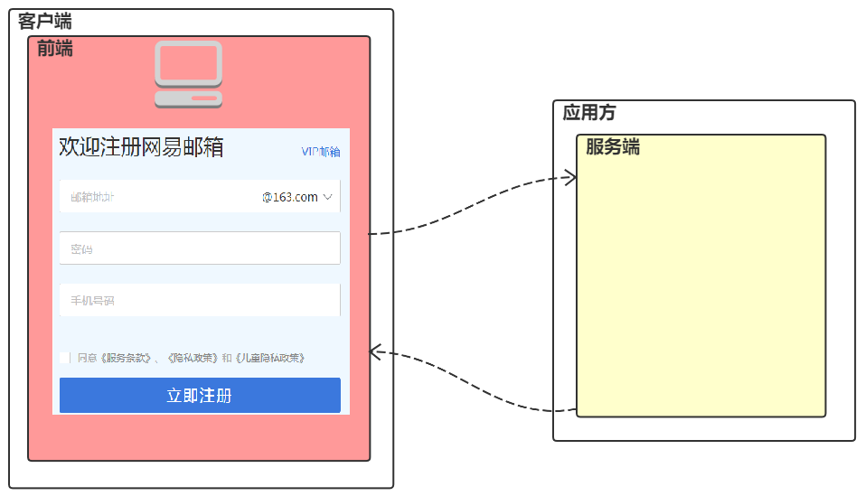
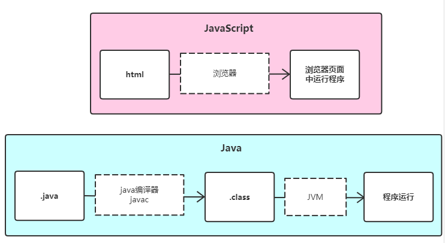
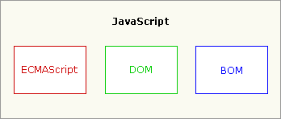
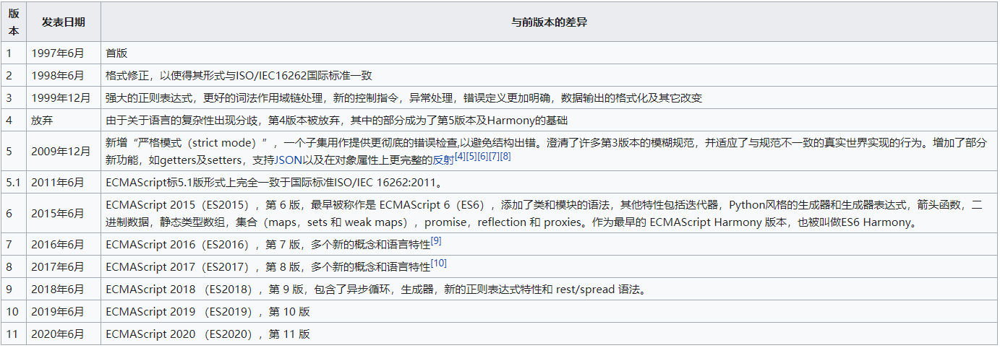
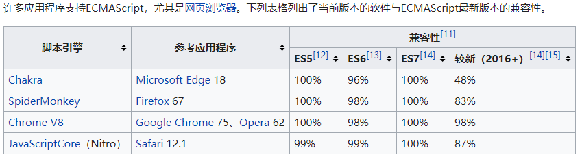
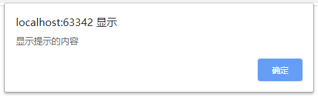
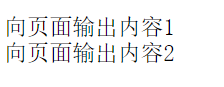
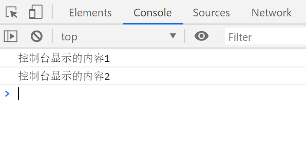
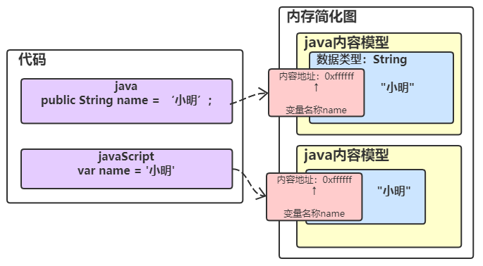
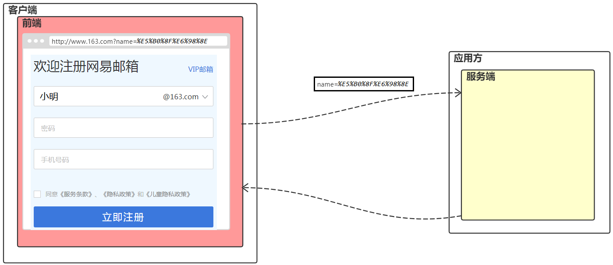

# 1. JavaScript 概念

​	JavaScript 是一门脚本编程语言。其主要功能用来增强用户和html页面的交互过程，可以来控制html元素，让页面有一些动态的效果，增强用户的体验。

​			

## 1.1 JavaScript的历史

- **起源：**1992年，Nombase公司，开发出第一门客户端脚本语言，专门用于表单的校验。命名为 ： C--。后来更名为：ScriptEase。


 <figure class="thumbnails">
    
</figure>

- **发展：**1995年，Netscape(网景)公司，开发了一门客户端脚本语言：LiveScript。后来，请来SUN公司的专家，修改LiveScript，命名为JavaScript。

- **竞争：**1996年，微软参考JavaScript开发出JScript语言。
- **标准：**ECMA(欧洲计算机制造商协会)，制定出客户端脚本语言的标准：ECMAScript，就是统一了所有客户端脚本语言的编码方式。


## 1.2 JavaScript 语言特点

相对于 Java语言来说，JavaScript 具有以下两个特点。

**1.不需要编写的代码进行编译，JS可以在浏览器中直接可以运行。**


<figure class="thumbnails">
    
</figure>


**2.JavaScript 属于弱类型语言，其声明的内容不需要指定类型。**

```markdown
java:
	public String name = "小明";
javaScript:
	var name = '小明'；
	name = 123；
```


## 1.3  JavaScript 组成(熟知)

根据 JavaScript的发展历程，JavaScript有三部分来构成：


<figure class="thumbnails">
    
</figure>


| **组成部分**    | **作用**                                                     |
| --------------- | ------------------------------------------------------------ |
| **ECMA Script** | 构成了JS核心的语法基础                                       |
| **BOM**         | Browser Object Model 浏览器对象模型，用来操作浏览器上的对象  |
| **DOM**         | Document Object Model 文档对象模型，用来操作网页中的元素（标签） |

ECMA发展的版本:

<figure class="thumbnails">
    
</figure>

主流浏览器对ECMA版本语言的支持：


<figure class="thumbnails">
    
</figure>


## 1.4 JavaScript入门（掌握）

通过 JavaScript 来控制浏览器的中的内容，如下：

```html
<!DOCTYPE html>
<html lang="zh">
<head>
  <meta charset="UTF-8">
  <title>入门体验</title>
</head>
<body>
  <h1>你看到我，请你来电我，点我让你嘿嘿嘿</h1>
  <input type="button" value="戳我下" onclick="clickButton()">
</body>
</html>
  <script >
    function clickButton() {
      var result = confirm("你确定你满18岁了吗？")
      if (result) {
        alert("你整天想什么呢?哼~");
        location.href = "http://www.baidu.com";
      } else {
        alert("我的天那~你居然能经得起我的诱惑")
      }
    }
  </script>
```


# 2. JavaScript的基础学习

## 2.1 JavaScript的引入

对于JavaScript的引入有两种方式：

​	1.内部引入

​	2.外部引入


**1.内部引入**

方式：在head标签中来声明 script 标签，在其中编写 JavaScript代码。

作用范围：当前页面生效

```html
<head>
  <meta charset="UTF-8">
  <title>入门体验</title>
  <script >
    var num = 1;
    alert(1)
  </script>
</head>
```


**2.外部引入**

方式：在head标签中来声明 script 标签，在其中编写 JavaScript代码。

作用范围：被引入的html文件都会生效


外部文件内容：outside.js（外部文件的后缀为：js）

```javascript
var num = 1;
alert(1)
```


HTML页面内容：

```html
<script src="js/importSample.js"></script>
```

PS：JavaScript 的内部样式和外部样式编写位置是没有限制的，但是按照规范一般编写在head标签中。


**3.JavaScript 引入特点**

1.一个JavaScript标签只能使用内部或外部其中一种的引入方式来使用。

​	script 标签如果使用了外部引入，即使在 script标签中编写代码也是不生效的。

```HTML
<!-- 由于script标签引入了外部的js文件，所以标签中的代码是不生效的 -->
<script src="js/importSample.js">
  var num2 = 2;
  alert(num2);
</script>
```


2.一个页面中可以有多个 script 标签。

```html
<script src="js/importSample.js"></script>
<script>
  var num2 = 2;
  alert(num2);
</script>
```


## 2.2 JavaScript输出方式

在JavaScript中，可以通过三种方式来输出内容。

1.浏览器弹框输出

```javascript
alert() //警示提示窗口，其他的后面再学习
```


<figure class="thumbnails">
    
</figure>

2.向页面内容中输出

```html
<script>
  document.writeln("向页面输出内容1");
  document.writeln("向页面输出内容2");
</script>
```


<figure class="thumbnails">
    
</figure>

3.向浏览器控制台中输出

```html
<script !src="">
  console.info("控制台显示的内容1")
  console.info("控制台显示的内容2")
</script>
```

<figure class="thumbnails">
    
</figure>

## 2.3 JavaScript注释

在 JavaScript 中存在两种注释方式。

**1.单行注释**

```html
<script>
	// 我是一个单行注释
    var num = 1;
</script>
```


**2.多行注释**

```html
<script>
	/*
		我是一个多行注释
	*/
    var num = 1;
</script>
```


## 2.4 JavaScript数据类型

在 JavaScript 中，存在两大类数据类型：

**1.原始数据类型**

​	1.number 数字类型--整数、小数、NaN(not a number)

​	2.string 字符串类型

​	3.boolean 布尔类型（true/false）

​	4.null 内容为空的占位符

​	5.undefined 未定义。对一个声明的变量但没有初始值，那么默认情况下会被赋值为 undefined。

**2.引用数据类型**

​	对象（object）


## 2.5 JavaScript 变量声明

变量的内容简化图：


<figure class="thumbnails">
    
</figure>

**1.变量的解释**

​	变量就是在内存中存储数据的空间。

**2.弱类型语言的声明特点**

​	弱类型：在开辟变量存储空间时，不定义空间将来的存储数据类型，可以存放任意类型的数据。

​	强类型：在开辟变量存储空间时，定义了空间将来存储的数据的数据类型。只能存储固定类型的数据

**3.声明语法**

```javascript
var 变量名称 = 变量的值
```

**4.声明各种类型**

```javascript
// 数字类型的变量声明
var num = 10;
document.writeln(num)
num = 3.1415
document.writeln(num)
num = NaN;
document.writeln(num)

// 2.字符串声明
var str = 'Hello world';
document.writeln(str);
str = "again Hello world"
document.writeln(str);

// 3.boolean
var boo = true;
document.writeln(boo);
boo = false;
document.writeln(boo);


// 4. null undefined 定义
var obj = null;
document.writeln(obj);
var obj2;
document.writeln(obj2);
obj2 = undefined;
document.writeln(obj2);   
```


**5.判断声明变量类型**

在 JavaScript中可以通过 typeof 来判断一个变量的类型。

```javascript
 // 数字类型的变量声明
 var num = 10;
 document.writeln(num+"---"+ (typeof num))  //10---number

 // 2.字符串声明
 var str = 'Hello world';
 document.writeln(str+"---"+ (typeof str));  //Hello world---string

 // 3.boolean
 var boo = true;
 document.writeln(boo+"---"+ (typeof boo));  //true---boolean

 // 4. null undefined 定义
 var obj = null;
 document.writeln(obj+"---"+ (typeof obj)); //null---object
 var obj2;
 document.writeln(obj2+"---"+ (typeof obj2)); //undefined---undefined
```

PS:为什么 typeof 运算符对于 null 值会返回 "Object"。这实际上是 JavaScript 最初实现中的一个错误，然后被  ECMAScript 沿用了。现在，null 被认为是对象的占位符，从而解释了这一矛盾，但从技术上来说，它仍然是原始值。


**5.扩展变量声明**

ECMA随着版本的更新，对变量的声明也有一些变化。

​	ECMA 5 之前：var

​	ECMA 6 以后：let

在 ECMA 版本的更新中，出现了一下问题：

```javascript
for (var i = 0; i < 100; i++) {
  var num = i;
}
document.writeln(num);  //页面正常显示 99
```

num 变量在 for循环中进行声明，它的作用域只是在 for 循环体中生效，但是出了 for 循环，我们依旧能访问到 num 的数据，好尴尬呀~


通过上面的问题，在 ECMA6 中解决了此问题，使用 let 来代替 var，代码如下：

```javascript
for (var i = 0; i < 100; i++) {
  let num = i;
}
document.writeln(num);  //页面无内容显示
```

从上面的代码中我们可以看出：

​	1.let声明的变量更具有块级作用域。

​	2.let声明的变量只是局部变量声明。


## 2.6 JavaScript运算符

JavaScript 中存在的运算符有一下几类：

```markdown
1. 算数运算符
		+ - * / % ++ --
2. 赋值运算符
		= += -= *= /= %=
		eg. a+=1 -> a= a+1 
3. 比较运算符
		>   <  >= <=  ==(===恒等于) 	!=(!==不恒等于)
4. 逻辑运算符
		&& ||  !(非)
5. 三元（目）运算符
		条件表达式？为真:为假
```


### 2.6.1 算数运算符

*数值类型的算数运算

```javascript
let num1 = 2;
let num2 = 3;
document.writeln(num1+num2);
document.writeln(num1-num2);
document.writeln(num1*num2);
document.writeln(num1/num2);
document.writeln(num1%num2);
```

*其他类型和数值的算数运算

```javascript
let num1 = 2;
// string 类型   任何数 + String = String
document.writeln(num1 + "123abc")
// true = 1 false = 0
document.writeln(num1 + true); //3
document.writeln(num1 + false);//2
// null类型  null = 0
document.writeln("null 和数值相加：" + (num1 + null)); //2
// undefined
document.writeln("undefined 和数值相加：" + (num1 + undefined)); //NaN
```

对于其他类型和数值的运算：

​	1.数值 + String = String

​	2.数值 + boolean = 数值（true=1 false=0）

​	3.数值 + null = 数值（null = 0）

​	4.数值 + undefined = NaN


### 2.6.2 赋值运算

```javascript
let num = 3;
document.writeln(num += 1); //4
document.writeln(num -= 1); //3
document.writeln(num *= 1); //3
document.writeln(num /= 1); //3
document.writeln(num %= 1); //0
```


### 2.6.3 比较运算符

JavaScript 比较运算一般比较的类型如下：

​	1.数值间的大小比较/相等比较

​	2.数值和字符串的大小比较/相等比较

​	3.字符串间的大小比较/比较

```javascript
// 数值间的比较/相等
let num = 3;
let num2 = 4;
document.writeln(num == num2); //false
document.writeln(num > num2); //false

//数值和字符串的比较
document.writeln(num == "3");  // true
document.writeln(num === "3"); // false
document.writeln(num === 3);   // true

//字符串间的比较
let str1 = "adc";
let str2 = "abcd";
document.writeln(str1 > str2);  // true
```

通过上面的代码可以得出下面的结论：

- 数值和字符串的比较

   1.== 进行比较的时候，如果有字符串，会先将字符串转为数字。

   2.=== 进行比较时候，会先来判断比较内容的类型，在去判断数值。

   

- 字符串间比较

   1.字符串的大小比较时，会按照字典中的文字先后顺序来比较，且会进行逐位进行比较。 


### 2.6.4 逻辑运算符

JavaScript 逻辑运算包括两类

​	1.boolean 的逻辑运算

​	2.number 的逻辑运算

​	3.string 的逻辑运算

​	4.null 的逻辑运算

​	5.undefined 的逻辑运算

```javascript
 // 1.number 的逻辑运算
    let num1 = 3;
    let num11 = -3;
    let num2 = 0;
    let num3 = NaN;


    document.writeln(!!num1);  //true
    document.writeln(!!num11); //true
    document.writeln(!!num2);  //false
    document.writeln(!!num3);  //false

    document.writeln("--------------------------");

    // while (1) {
    //
    // }

    // 2.String 的逻辑运算
    let str1 = "abc";           
    let str2= "";
    let str3= " ";
    document.writeln(!!str1); //true
    document.writeln(!!str2); //false
    document.writeln(!!str3); //true

    // if (str1 != null && str1.length > 0) {
    //
    // }
    //
    //
    // if (str1) {
    //
    // }


    // 3.null undefined 逻辑运算

    document.writeln("--------------------------");

    var obj1 = null;
    var obj2;
  
    document.writeln(!!obj1);  //false
    document.writeln(!!obj2);  //false

    // if (obj) {
    //
    // }
```

通过上面的的代码可以得知

​	1.number 
   		逻辑运算数值为 true， 0 或 NaN 为 false；
	2.string 
     		逻辑运算值为 true，空串为false
	3.boolean 布尔类型（true/false）
	4.null 
   		逻辑运算值为 false
	5.undefined 
   		逻辑运算值为 false


### 2.6.5 三元运算符

语法：  

```yacas
 逻辑判断结果 ? 值1:值2；
```

判断表达式的值，如果是true则取值1，如果是false则取值2，代码如下：

```javascript
let a = 3;
let b = 4;
let c = a > b ? 1:0;
document.writeln(c) // 0
```


## 2.7 JavaScript流程控制

JavaScript流程控制常用的有：

​	1.条件判断

​		1.if...else 

 		2.switch

​	2.循环判断

​		1.while

​		2.do....while

​		3.for

### 2.7.1 条件流程语句

```JavaScript
1. if判断
		if (条件表达式) {
            代码块;
        } else if(条件表达式) {
            代码块;
        } else {
            代码块;
        }
		
2. switch判断	
		switch(条件表达式){
            case 满足条件1 :
            	代码块 
            	break;
            case 满足条件2 :
            	代码块
                break;
            default:
            	默认代码块;
		}
```

PS：在switch的条件表达式中可以接收任意的原始类型数据。

```javascript
var val = NaN;
switch (val) {
  case 5:
    alert("数字");
    break;
  case 'abc':
    alert("字符串");
    break;
  case true:
    alert("布尔");
    break;
  case null:
    alert("null");
    break;
  case undefined:
    alert("undefined");
    break;
  default:
    alert("NaN")
}
```


### 2.7.2 循环判断

```JavaScript
1. 普通for循环
		for(let i= 0; i<10; i++){
    		需要执行的代码;
		}

2. 增强for循环
		for(let element of array){
            需要执行的代码;
		}
		
3. 索引for循环
		for(let index in array){
            需要执行的代码;
		}

4. while循环
		while (条件表达式) {
			需要执行的代码;
		}
		
5. do..while循环
		do{
            需要执行的代码;
		}while(条件表达式);
		
6. break和continue
		break: 跳出整个循环
		continue：跳出本次循环
```


## 2.8 JavaScript 基础对象

JavaScript 的基础对象有下列内容：

1.Function 对象

​	 方法在 JS 中也会视为对象，其类型为 Function。

2.String 对象

​	对 js 的原始类型 string 的封装类型。

3.Date 对象

​	js 中的日期对象。

4.Array 对象

​	js 中的数组的类型，数组在 js中也视为对象。

5.Math 对象

​	js 和数学相关内容的封装类型。

6.Global 对象

​	全局函数在 js 中可以直接来使用其中的方法。


### 2.8.1 Function 对象

- **1.方法的声明**

1.普通方法声明

​		语法：

```javascript
function 函数名(参数列表){
    函数体;
    [return 返回值;] // 中括号意思表示内容可以省略....
}
```

​		定义：

```javascript
// 普通方法声明
function sum(a,b) {
  alert(a + b);
}
```


2.匿名方法声明

​		语法：

```javascript
function (参数列表){
    函数体;
    [return 返回值;] // 中括号意思表示内容可以省略....
}
```

​		定义：

```javascript
// 匿名方法声明
var fun1 = function(a,b){
  alert(a + b);
}
```


- **2.方法的特性**

**1.传入参数列表**
  传入参数声明时，不需要指定类型
  调用方法和传入参数无关

```javascript
// 方法声明
function sum(a,b) {
  alert(a + b);
}
// 方法的调用
sum(2,3); //5
sum(2,3,4); //5
sum(); // NaN
```


**2.方法的返回参数**
  定义方法的时候不需要指定返回类型
  调用方法和返回参数无关

```javascript
// 方法声明
var fun2 = function (a, b, c) {
  alert("进入方法 fun2")
  var sum = a+b+c;
  return sum;
};s

// 方法的调用
let result = fun2(2,3,4);
fun2(2,3,4,5);
```


**3.方法隐藏对象 arguments**

对于 js 的方法中存在一个隐藏对象 arguments ，通过当前对象可以获得方法的传入参数。

```javascript
//方法声明
function method() {
  var sum = 0;
  for (var i = 0; i < arguments.length; i++) {
    sum += arguments[i];
  }
  return sum;
}

//方法调用
let result = method(2,3,4,5);
document.writeln(result);
```


### 2.8.2 String 对象

- **1.String的声明**

1.字符串创建方式

```javascript
 // 1.字符串创建方式
 let str1 = "str1"; //双引号
 let str2 = 'str2'; //单引号
 let str3 = `str3`; //反引号
 document.writeln(str1);
 document.writeln(str2);
 document.writeln(str3);
```


2.创建对象的方式

```javascript
 // 2.通过创建对象的方式来创建
 let str4 = new String("111");
 document.writeln(str4);
```


- **2.String的常用方法**


substring(startIndex,endIndex) 提取字符串中两个指定的索引号之间的字符， 包头不包尾。
toLowerCase() 把字符串转换为小写。
toUpperCase() 把字符串转换为大写。
split() 把字符串分割为字符串数组。
trim() 去掉首尾空格。

```javascript
 let str1 = " sTr  a ";
 document.writeln(str1.toLocaleUpperCase()); // STR   A
 document.writeln(str1.toLocaleLowerCase()); // str   a
 document.writeln(str1.trim());              //str   a
 document.writeln(str1.split(""));  // ,s,t,r, , ,a,
 document.writeln(str1.substring(1)); //tr   a
```


### 2.8.3 Array 对象

- **Array的声明**

```java
方式一：
let array = new Array('a','b','c')

方式二：
let array = ['a','b','c']  -> 中括号 (常用)
```


- **Array的常用方法**

		1.push() 向数组的末尾添加一个或更多元素，并返回新的长度。

```javascript
let arr = [2, 3, 4, 5];
arr.push(10); //2,3,4,5,10
```


​	2.join() 把数组的所有元素放入一个字符串。元素通过指定的分隔符进行分隔。

```javascript
let arr = [2, 3, 4, 5];
var arrStr = arr.join("-"); //2-3-4-5
```


- **Array的特点**

1.JS中的数组它的长度是可变的

```javascript
let arr = [2, 3, 4, 5];
arr.push(10); //2,3,4,5,10
```

2.JS 中的数组中存放的数据类型是没有限制的

```javascript
let arr = [2, 3, 4, 5,'abc',true,null];
```


### 2.8.4 Date对象

- **创建对象**

```javascript
let date = new Date(); 获取当前时间时间
```


- **常用方法**

   1.toLocaleString()      转换为本地日期格式的字符串

   2.getFullYear()      转换为本地日期格式的字符串

   3.getMonth()   获取日期中的month ,取值范围 ：0-11

   4.getDate()    获取日期中的 号

   5.getTime()   获取时间毫秒值(时间原点: 1970年1月1号0时分秒)

   

### 2.8.5 Math对象

- **创建对象**

  对象无需创建，通过 Math. 方法来使用它的方法和属性。

```javascript
//直接调用属性
Math.PI
//直接调用方法
Math.random(); 
```


- **常用方法**

  1. 四舍五入 round()
  2. 向下取整 floor() 地板
  3. 向上取整 ceil()  天花板
  4. 产生随机数 random() ：返回 [0,1) 之间的随机数。
         [0,1) 左闭右开区间,包含0不包含1


### 2.8.6 全局函数

在 JavaScript 中有全局函数的声明，在编写代码的时候可以直接使用全局函数（方法）。

- **1.操作文本内容**

   parseInt()  将字符串的数字内容转为数字类型

   parsetFloat() 将字符串的浮点类型转为浮点类型

   isNaN()   判断是否是NaN

- **2.对字符串编码**

   encodeURI() 将内容进行编码，其内容使用 16 进制的 % ECxxxx 来标识。

   decodeURI() 将内容进行解码，将16 进制的 % ECxxxx 内容转为原来的文字。

   

- **3.把字符串内容转为 js 代码并执行**

  eval() 可以解析 javascript 代码字符串形式，并进行运行。

  

```html
<script !src="">
  /*
    1.parseInt() 将字符串的数字内容转为数字类型
       特点：逐位解析字符内容，遇到不能转为数字的内容，将停止转换

    2.parseFloat() 将字符串的浮点类型转为浮点类型
       特点：逐位解析字符内容，遇到不能转为数字的内容，将停止转换

    3.isNaN() 判断是否是NaN
        NaN 六亲不认 就连自己也不认。

     4.
      encodeURI() 将内容进行编码，其内容使用 16 进制的 % ECxxxx 来标识。

      decodeURI() 将内容进行解码，将16 进制的 % ECxxxx 内容转为原来的文字。

   */

  let str = '123abc';
  var result = parseInt(str);
  document.writeln(result+"----------"+ typeof result); // 123-------numer

  let str2 = "123.456abc";
  var result = parseFloat(str2);
  document.writeln(result+"----------"+ typeof result);  // 123.456-------numer
 

  let val = NaN;
  document.writeln(val === NaN);
  document.writeln(isNaN(val));

  // %E5%B0%8F%E6%98%8E
  document.writeln("---------------------------------");
  var encodeStr = encodeURI("小明");
  document.writeln(encodeStr);  // %E5%B0%8F%E6%98%8E

  var decodeStr = decodeURI("%E5%B0%8F%E6%98%8E");
  document.writeln(decodeStr); //小明

  document.writeln("---------------------------------");


  var jsStr = "alert(1111)";
  eval(jsStr);

  // document.writeln(jsStr);
</script>
```


<figure class="thumbnails">
    
</figure>

# 3.JavaScript中的事件

事件(event)：JS可以监听用户的行为,并调用函数来完成用户交互功能.

* 功能： 某些组件被执行了某些操作后，触发某些代码的执行。
  * 造句：  xxx被xxx,我就xxx
    * 我方水晶被摧毁后，我就会说猪队友。
    * 敌方水晶被摧毁后，我就会说还行吧。


如何绑定事件
	1. 直接在html标签上，指定事件的属性(操作)，属性值就是js代码

​		事件：onclick--- 单击事件

​	2.通过js获取元素对象，指定事件属性，设置一个函数


## 3.1 常用事件

```markdown
1. 点击事件：
        1. onclick：单击事件（重要）
        2. ondblclick：双击事件 (double: 时间间隔很短两次单击)
        
2. 焦点事件
        1. onblur：失去焦点（重要）
        2. onfocus:元素获得焦点。

3. 加载事件：
        1. onload：页面加载完成后立即发生。（了解）

4. 鼠标事件：
        1. onmousedown	鼠标按钮被按下。
        2. onmouseup	鼠标按键被松开。
        3. onmousemove	鼠标被移动。
        4. onmouseover	鼠标移到某元素之上。（重要）
        5. onmouseout	鼠标从某元素移开。（重要）
        
5. 键盘事件：
		1. onkeydown	某个键盘按键被按下。	
		2. onkeyup		某个键盘按键被松开。
		3. onkeypress	某个键盘按键被按下并松开。

6. 改变事件
        1. onchange	域的内容被改变。（重要）

7. 表单事件：
        1. onsubmit	提交按钮被点击。（重要）
```


实例代码：

```html
<!DOCTYPE html>
<html lang="zh">
<head>
  <meta charset="UTF-8">
  <title>常用事件</title>

  <style>

    #div1 {
      border: 1px solid black;
      width: 200px;
      height: 100px;
    }


  </style>

</head>
<body onload="bodyLoad()">

    <form id="myForm" action="#" method="get" onsubmit="formSubmit()" >
<!--     账号： <input name="account" onblur="inputBlur()" > <br>-->
     账号： <input name="account" onchange="inputChange()"> <br>
      密码：<input name="password"> <br>
        省份：<select name="province" onchange="inputChange()">
              <option value="bj">北京</option>
              <option value="sh">上海</option>
              <option value="heib">河北</option>
            </select><br>
      <input type="submit" value="提交"  />
    </form>

<!--  <div id="div1" onmouseover="divOver()" onmouseout="divOut()">div</div>-->


  <script !src="">


      function bodyLoad() {
          alert("body load");
      }


    /*
    * 表单提交事件要在 form 标签中定义
    *
    *        onsubmit="formSubmit()" 无法阻止表单提交
    * */
    function formSubmit() {

        /*
        表单提交事件方法中，需要来声明返回值
        返回值可以影响表单提交
        true   --会提交当前表数据

        false  --会阻止表单提交
         */
        return false;

    }


    /*
      事件的必要元素：
        1.触发的方法
        2.触发的元素
        3.元素中的触发事件
    */


    /*失去焦点   onblur*/
    function inputBlur() {
      alert("失去焦点")
    }

    /*鼠标事件*/
    function divOver() {
      alert("我在你上面");
    }


    function divOut() {
      alert("我离你而去");
    }

    /*改变内容事件
    *
    * input type
    *     onchange事件：失去焦点后会和之前的input内容做比较
    * select
    *     onchange事件：内容一改变就会触发
    *
    * */
    function inputChange() {
      alert("内容改变");
    }

  </script>


</body>
</html>
```


## 3.2 事件的特征

在JavaScript中，回调函数具体的定义为：函数A作为参数(函数引用)传递到另一个函数B中，并且这个函数B执行函数A。我们就说函数A叫做回调函数。

实例代码：

```html
<!DOCTYPE html>
<html lang="zh">
<head>
  <meta charset="UTF-8">
  <title>回调函数</title>
</head>
<body>

  <script !src="">

    /*
    回调函数：将方法A传入到方法B中，方法B被执行时会调用方法A,方法A为回调函数
     */
    function a_fun1(a, b) {
      return a + b;
    }

    function b_fun2(func,num1,num2) {
      let result = func(num1, num2);
      return result;
    }

    let sum = b_fun2(a_fun1, 1, 10);
    alert(sum);

  </script>


</body>
</html>
```


```html
<!DOCTYPE html>
<html lang="zh">
<head>
  <meta charset="UTF-8">
  <title>入门体验</title>
</head>
<body>
  <h1>你看到我，请你来电我，点我让你嘿嘿嘿</h1>
  <input type="button" value="戳我下" onclick="clickButton()">
</body>
</html>
  <script >
    //js中的事件会调用开发人员的代码，下面的方法称为回调函数
    function clickButton() {
      var result = confirm("你确定你满18岁了吗？")
      if (result) {
        alert("你整天想什么呢?哼~");
        location.href = "http://www.baidu.com";
      } else {
        alert("我的天那~你居然能经得起我的诱惑")
      }
    }
  </script>
```

