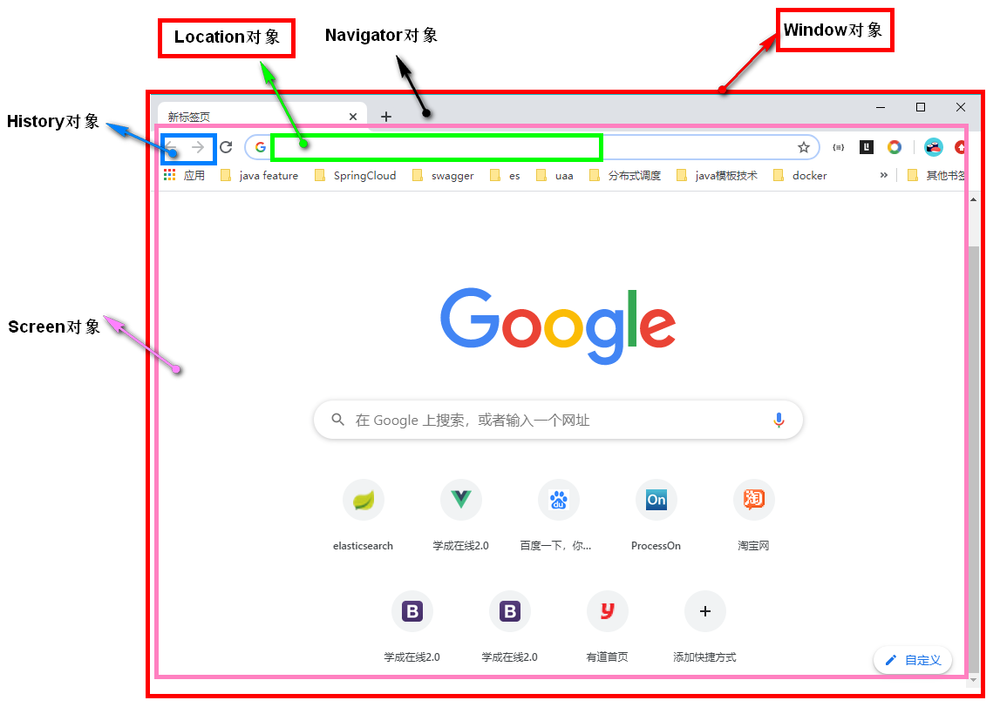
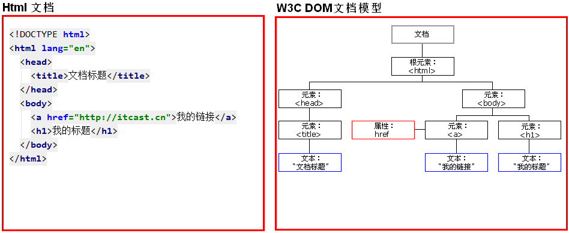
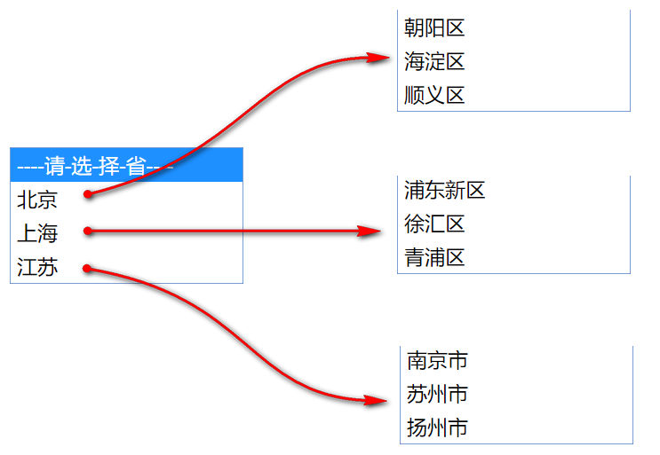

# 1.BOM 对象

## 1.1 BOM 对象的简介

浏览器对象模型（Browser Object Model ）

作用：把浏览器抽象成为一个对象模型,我们可以使用js模拟浏览器的一些功能。


整个BOM 对象中，包含五大对象

- Window  对象表示浏览器中打开的窗口。 （重要）
- Navigator  对象包含有关浏览器的信息。 
- Screen 对象包含有关客户端显示屏幕的信息。 
- History  对象包含用户（在浏览器窗口中）访问过的 URL。 
- Location 对象包含有关当前 URL 的信息。 （重要）


 <figure class="thumbnails">
    
</figure>


## 1.1 Window 对象

window Window 对象表示一个浏览器窗口 ，它对象中包含了其他的 BOM 对象。Window 对象是全局对象，无需创建window对象。其中的方法和属性可以直接来使用，并不需通过 window 对象类引出。 

### 1.1.1 Window  方法

**1.与弹出框有关的方法：**

- alert()	显示带有一段消息和一个确认按钮的警告框。
- confirm() 显示带有一段消息以及确认按钮和取消按钮的对话框 。
  - 如果用户点击确定按钮，则方法返回true
  - 如果用户点击取消按钮，则方法返回false


- prompt()	显示可提示用户输入的对话框。
- 返回值：获取用户输入的值


**2.与定时器有关的方式**

- setTimeout()	在指定的毫秒数后调用函数或计算表达式。
  - 参数：
    - js代码或者方法对象
    - 毫秒值

  - 返回值：唯一标识，用于取消定时器


- clearTimeout()	取消由 setTimeout() 方法设置的 timeout。
- setInterval()	按照指定的周期（以毫秒计）来调用函数或计算表达式。
- clearInterval()	取消由 setInterval() 设置的 timeout。


代码：

```html
<!DOCTYPE html>
<html lang="en">
<head>
  <meta charset="UTF-8">
  <title>window对象</title>
</head>
<body>

  <button onclick="cancel2()">取消任务执行</button>


<script>

  /*
    1.与弹出框有关的方法：

  - alert()	显示带有一段消息和一个确认按钮的警告框。
  - confirm() 显示带有一段消息以及确认按钮和取消按钮的对话框。
    - 如果用户点击确定按钮，则方法返回true
    - 如果用户点击取消按钮，则方法返回false
  - prompt()	显示可提示用户输入的对话框。
    - 返回值：获取用户输入的值
    - 如果用户点击确定可以获得用户输入的数据
    - 如果用户点击取消不可以获得用户输入的数据

  2.与定时器有关的方式

  - setTimeout()	在指定的毫秒数后调用函数或计算表达式。
    - 参数：
      - js代码或者方法对象
      - 毫秒值
    - 返回值：唯一标识，用于取消定时器

  - clearTimeout()	取消由 setTimeout() 方法设置的 timeout。

  - setInterval()	按照指定的周期（以毫秒计）来调用函数或计算表达式。

  - clearInterval()	取消由 setInterval() 设置的 timeout。

   */

  // 1.alert
  // alert("警告");
  // alert(1111);

  // 2.confirm
  // var result = confirm("你确定要进入吗？");
  // alert(result);

  // 3.prompt
  // var result = prompt("请输入你的年龄");
  // alert(result);

  // 2.setTimeout参数
  /*
      参数：
          1.方法对象或者js的代码段
          2.毫秒值
      只会被执行一次
   */
  var timer1 = setTimeout("fun()", 3000);
  // setTimeout(fun, 3000);

  function fun() {
    alert(111)
  }
  
  function cancel() {
    clearTimeout(timer1);
  }


  // 3.setInterval()
  /*
      参数：
        1.方法对象或者js的代码段
        2.毫秒值
      周期性执行任务，永不停止
   */
  // setInterval("fun()", 1000);
  var timer2 = setInterval(fun, 3000);

  function cancel2() {
    clearInterval(timer2);
  }


</script>


</body>
</html>
```


## 1.2 location 对象

1. 创建(获取)：
  1. window.location
  2. location  （常用）

2. 方法：
  * reload()	重新加载当前文档。刷新
3. 属性
  * href	设置或返回完整的 URL。


代码：

```HTML
<!DOCTYPE html>
<html lang="en">
<head>
  <meta charset="UTF-8">
  <title>location对象</title>
</head>
<body>

  <button onclick="reloadFun()">点击刷新页面</button>
  <button onclick="getURL()">点击获取页面地址信息</button>
  <button onclick="modifyURL()">点击修改页面地址信息</button>

  <script !src="">

    /*
    1. 创建(获取)：
       1. window.location
       2. location  （常用）
    2. 方法：
       - reload()	重新加载当前文档。刷新
    3. 属性
       - href	设置或返回完整的 URL。

     */

    // 1.location 对象获取
    //   window.location 方式一
    // location  方式二 （常用）

    // 2.方法： reload()

    function reloadFun() {
      location.reload();
    }

    // 3.属性：href
    function getURL() {
      var url_str = location.href;
      alert(url_str);
    }

    function modifyURL() {
      location.href = "http://www.itcast.cn";
    }


  </script>


</body>
</html>
```


# 2. DOM 对象

## 1.1 DOM简介

文档对象模型（Document Object Model）

作用：把所有页面标签抽象成为一个Document对象，我们可以使用js动态修改标签及属性内容。


<figure class="thumbnails">
    
</figure>


* （了解）W3C DOM 标准被分为 3 个不同的部分：

  * 核心 DOM - 针对任何结构化文档的标准模型
    * Document：文档对象（需要学习）
    * Element：元素对象（需要学习）
    * Attribute：属性对象
    * Text：文本对象
    * Comment:注释对象

    * Node：节点对象，其他5个的父对象
  * XML DOM - 针对 XML 文档的标准模型
  * HTML DOM - 针对 HTML 文档的标准模型


## 1.2 DOM 获得元素

* **第一种：es6之前获取方式**
  1）获取一个
  	document.getElementById(id属性值)  -> 推荐
  2）获取多个（了解）
  	document.getElementsByTagName(标签名)	根据标签名获取，返回数组对象
  	document.getElementsByClassName(class属性值)	根据class属性获取，返回数组对象
  	document.getElementsByName(name属性值)  根据name属性获取，返回数组对象

* **第二种：es6可根据CSS选择器获取**
  1）获取一个
  	document.querySelector(id选择器)
  2）获取多个
  	document.querySelectorAll(css选择器)   
        	标签
        	class
        	属性
        	后代
        	并集
        	父子
        	....

代码：

```html
<!DOCTYPE html>
<html lang="en">
<head>
  <meta charset="UTF-8">
  <title>document获得元素方法</title>

  <style>
    #username {

    }
  </style>

</head>
<body>

  <form action="#" method="get">
    姓名 <input type="text" name="username" id="username" placeholder="德玛西亚"/> <br/>
    密码 <input type="password" name="password"> <br/>
    生日 <input type="date" name="birthday"><br/>
    性别
    <input type="radio" name="gender" value="male" class="radio">男&emsp;
    <input type="radio" name="gender" value="female" class="radio"/>女<br/>
    爱好
    <input type="checkbox" name="hobby" value="smoke">抽烟
    <input type="checkbox" name="hobby" value="drink">喝酒
    <input type="checkbox" name="hobby" value="perm">烫头<br/>
    头像 <input type="file" name="pic"><br/>
    学历
    <select name="edu">
        <option value="0">请选择</option>
        <option value="1">入门</option>
        <option value="2">精通</option>
        <option value="3">放弃</option>

    </select><br/>
    简介
    <textarea name="userIntro" cols="30" rows="10">默认值</textarea><br/>
    <input type="reset" value="清空按钮"/>
    <input type="submit" value="提交按钮"/><br/>

  </form>


  <script !src="">

    /*
    第一种：es6之前获取方式

    1）获取一个

        document.getElementById(id属性值)  -> 推荐

    2）获取多个（了解）

        document.getElementsByTagName(标签名)	根据标签名获取，返回数组对象

        document.getElementsByClassName(class属性值)	根据class属性获取，返回数组对象

        document.getElementsByName(name属性值)  根据name属性获取，返回数组对象


    第二种：es6可根据CSS选择器获取

    1）获取一个

        document.querySelector(id选择器)

    2）获取多个

        document.querySelectorAll(css选择器)

            标签

            class

            属性

            后代

            并集

            父子


     */

    // 1.获得一个元素
    // window.document
         /*
        querySelector：
            如果元素在页面唯一，获得单个元素
            如果元素在页面中是多个，元素组中的第一个
     */
    var uname_e = document.getElementById("username");
    uname_e = document.querySelector("#username");

    // alert(uname_e);

    // 2.获得多个元素
    // console.info(uname_e);
    var inputs_e = document.getElementsByTagName("input");
    inputs_e = document.querySelectorAll("input");

    // alert(inputs_e);
    // console.info(inputs_e);

    var radios_e = document.getElementsByClassName("radio");
    radios_e = document.querySelectorAll(".radio");

    // alert(radios_e);
    // console.info(radios_e);

    var names_e = document.getElementsByName("hobby");
    names_e = document.querySelectorAll("input[name='hobby']")
    options_e = document.querySelectorAll("form select option");

    alert(options_e);
    console.info(options_e);


  </script>


</body>
</html>
```


## 1.3 DOM 操作内容

**1.获取或者修改元素（标签）的纯文本内容**
语法：
	js对象.innerText; 

**2.获取或者修改元素的html超文本内容**
语法：
	js对象.innerHTML; 

**3.获取或者修改包含自身的html内容（了解）**
语法：
	js对象.outerHTML; 


代码：

```html
<!DOCTYPE html>
<html lang="en">
<head>
  <meta charset="UTF-8">
  <title>DOM操作内容</title>

  <style>

    div {
      border: 1px solid black;
      width: 500px;
      height: 200px;

    }


  </style>


</head>
<body>

  <div id="div1">

    div元素内容

  </div>


  <div id="div2">
    <div>
      inner div元素内容
    </div>
  </div>


  <script !src="">

    /*
        innerText:获得标签中的文本内容（不包括标签），修改元素中的内容（当成文本处理）
        innerHTML：获得元素中的所有后代内容（包括标签），修改元素中的内容（如果内容中存在标签，将其中的进行浏览器的解析）
        outerHTML:获得元素内容（包括本身）
     */

    // 1.获取或者修改元素（标签）的纯文本内容
    var div1 = document.querySelector("#div1");

    // alert(div1.innerText);
    // console.info(div1.innerText);

    // div1.innerText = "修改后的内容" + div1.innerText;
    // div1.innerText += "修改后的内容";

    // 2.获取或者修改元素的html超文本内容
    var div2 = document.querySelector("#div2");


    //获得标签内容所有内容，包括资料标签和内容
    // alert(div2.innerHTML);
    // console.info(div2.innerHTML);

    //获得标签中文本内容
    // alert(div2.innerText);
    // console.info(div2.innerText);

    // innerHTML 修改的内容中如果存在 HTML 的元素，会被浏览器解析并显示
    // div2.innerHTML ="<a href='http://www.itcast.cn'>访问传智播客</a>";

    // innerText 修改的内容中如果存在 HTML 的元素，不会被浏览器解析，会当成纯文本显示
    // div2.innerText ="<a href='http://www.itcast.cn'>访问传智播客</a>";

    // 3.获取或者修改包含自身的html内容（了解）
    var div2 = document.querySelector("#div2");


    // alert(div2.outerHTML);
    // console.info(div2.outerHTML);

    // div2.outerHTML = "<p>div被修改为p标签</p>";


  </script>

</body>
</html>
```


**PS：innerHTML 和 innerText 区别**

​	1.获得内容

​		innerText ：只会获得标签的文本内容。

​		innerHTML ：获得标签中的所有内容，包括标签中的后代标签。

​	2.修改内容

​		innerText ：innerText 修改的内容中如果存在 HTML 的元素，不会被浏览器解析，会当成纯文本显示。

​		innerHtml：innerHTML 修改的内容中如果存在 HTML 的元素，会被浏览器解析并显示。


## 1.4 DOM操作属性

对于 DOM 中获得一个元素的属性值，可以通过下面两种方式来操作：

1.Element方法（ECMA的核心 DOM ）

​	js对象.getAttribute(属性名称);                     获得属性的值

​	js对象.setAttribute(属性名称,属性值);         设置属性的值

2.DHtml属性（Html中的DHtml语法） 

​	js对象.属性;                     获得属性的值。

​	js对象.属性 = 属性值;      设置属性的值。


代码：

```html
<!DOCTYPE html>
<html lang="en">
<head>
  <meta charset="UTF-8">
  <title>DOM属性操作</title>
</head>
<body>

  <form action="#" method="get">
    姓名 <input type="text" name="username" id="username" placeholder="德玛西亚"/> <br/>
    密码 <input type="password" name="password"> <br/>
    生日 <input type="date" name="birthday"><br/>
    性别
    <input type="radio" name="gender" value="male" class="radio">男&emsp;
    <input type="radio" name="gender" value="female" class="radio"/>女<br/>
    爱好
    <input type="checkbox" name="hobby" value="smoke">抽烟
    <input type="checkbox" name="hobby" value="drink">喝酒
    <input type="checkbox" name="hobby" value="perm">烫头<br/>
    头像 <input type="file" name="pic"><br/>
    学历
    <select name="edu">
        <option value="0">请选择</option>
        <option value="1">入门</option>
        <option value="2">精通</option>
        <option value="3">放弃</option>

    </select><br/>
    简介
    <textarea name="userIntro" cols="30" rows="10">默认值</textarea><br/>
    <input type="reset" value="清空按钮"/>
    <input type="submit" value="提交按钮"/><br/>

  </form>


  <script !src="">

    /*
    1.Element方法（ECMA的核心 DOM ）

        js对象.getAttribute(属性名称);                     获得属性的值

        js对象.setAttribute(属性名称,属性值);         设置属性的值

    2.DHtml属性（Html中的DHtml语法）

        js对象.属性;                     获得属性的值。

        js对象.属性 = 属性值;      设置属性的值。

     */

    // 1.设置 text 类型的 input
    var username_e = document.querySelector("#username");

    // var val = username_e.getAttribute("value");
    // var value = username_e.value;
    // alert(value);

    // username_e.setAttribute("value", "李四");
    // username_e.value = "李四";


    // username_e.setAttribute("name", "account");
    // username_e.name = "account";

    // 2.设置 checked 类型的 input
    var hobby_e = document.querySelector("input[name='hobby']");
    // console.info(hobby_e);
    // hobby_e.setAttribute("checked", "checked");
    // hobby_e.setAttribute("checked", "true");

    hobby_e.checked = true;
    // hobby_e.checked = "checked";


    // 3.设置 select 类型的 input数据
    var edus_e = document.querySelector("select[name='edu']");
    // var value = edus_e.value;
    // console.info(value)
    edus_e.value = 1;
    // provice_e.setAttribute("value", 3);
  </script>

</body>
</html>
```


## 1.5 DOM操作样式

1. 设置一个css样式【会用】
  语法: 
  	js对象.style.样式名='样式值'
  		特点：样式名按照驼峰式命名
  			css格式：font-size
  			js格式：fontSize

2. 批量设置css样式（了解）
  语法: 
  	js对象.style.cssText='css样式字符串'
  		缺点：让开发者痛苦，有耦合性

3. 通过class设置样式【重点】
  语法: 
  	js对象.className='class选择器名'
  		特点：解耦


```html
<!DOCTYPE html>
<html lang="en">
<head>
  <meta charset="UTF-8">
  <title>DOM控制样式</title>

      <style>
        #p1{ background-color: red;}
        .mp {
          color: green;
          font-size: 30px;
        }

        .mpp {
          background-color: lightgray;
        }
    </style>


</head>
<body>


  <p id="p1">1. 设置一个css样式</p>
  <p id="p2" >2. 批量设置css样式</p>
  <p id="p3" >3. 通过class设置样式</p>

  <script !src="">

    // 1.通过 js对象.style.样式属性 来设置一个样式
    var p1_e = document.querySelector("#p1");

    p1_e.style.backgroundColor = 'green';

    p1_e.style.fontSize = "50px" ;

    // 2.通过 js对象.style.cssText 来批量设置css样式
    var p2_e = document.querySelector("#p2");

    p2_e.style.cssText = "font-size: 50px;border:1px solid black;";

    // 3.通过 js对象.className 来设置样式 --推荐
    var p3_e = document.querySelector("#p3");
    p3_e.className = "mp mpp";


  </script>

</body>
</html>
```


# 3.正则表达式（了解）

RegExp：正则表达式对象:

**1.正则对象创建：**

1. var reg = new RegExp("正则表达式");
2. var reg = /正则表达式/;
  

**2.正则表达式：定义字符串的组成规则。**

- **单个字符:[]**

   如： [a][ab] [a-zA-Z0-9_]
   * 特殊符号代表特殊含义的单个字符:
   	\d:单个数字字符 [0-9]
   	\w:单个单词字符[a-zA-Z0-9_]

- **量词符号：**

  *：表示出现0次或多次
  +：出现1次或多次

  ?：表示出现0次或1次
  {m,n}:表示 m<= 数量 <= n
  	* n如果缺省：{m,} 最少m次

- **开始结束符号**

  ^:开始

  $:结束

  

  **3.验证方法**

   test(参数):验证指定的字符串是否符合正则定义的规范	

  	符合正则规则就返回true，否则false


PS：在线正则表达式
    	https://tool.oschina.net/regex/


代码：

```html
<!DOCTYPE html>
<html lang="en">
<head>
  <meta charset="UTF-8">
  <title>正则表达式</title>
</head>
<body>

  用户名：<input type="text" name="username" id="username"/>
          <button onclick="checkUserName()" >校验</button><br>

  手机号：<input type="text" name="username" id="phone"/>
          <button onclick="checkphone()" >校验</button><br>

  <script !src="">

    /*
    1.正则对象创建：

      1. var reg = new RegExp("正则表达式");
      2. var reg = /正则表达式/;


    2.正则表达式：定义字符串的组成规则。

    - 单个字符:[]

        如： a [a-zA-Z0-9]

        * 特殊符号代表特殊含义的单个字符:

            \d:单个数字字符 [0-9]

            \w:单个单词字符[a-zA-Z0-9]

    - 量词符号：
      *：表示出现0次或多次
      +：出现1次或多次
      ?：表示出现0次或1次
      {m,n}:表示 m<= 数量 <= n

    - 开始结束符号
      ^:开始
      $:结束


    3.验证方法

    . test(参数):验证指定的字符串是否符合正则定义的规范

     */
    // 1.正则的创建

    // var regExp = new RegExp("abc");

    // 1.要求用户输出的内容必须包含英文和数字
    // regExp = /^\w{5}$/;

    // regExp = /^\d{5,8}$/;

    var regExp = /^1[35789]\d{9}$/;


    function checkUserName() {
      var input_username = document.querySelector("#username");

      var value = input_username.value;

      var result = regExp.test(value);

      alert(result);
    }

    function checkphone() {
      var input_phone = document.querySelector("#phone");

      var value = input_phone.value;

      var result = regExp.test(value);

      alert(result);
    }


  </script>
</body>
</html>
```


# 4. 综合案例【作业】

## 4.1 表单校验

表单校验要求：
    1. 两次密码输入一致
    2. 邮箱格式正确
    3. 手机号格式正确
    4. 提交表单时校验表单项是否合法.

两个事件:
    b. onblur : 失去焦点的时候触发
    c. onsubmit : 表单的提交按钮被点击的时候触发


```html
<!DOCTYPE html>
<html>
<head>
    <meta charset="utf-8"/>
    <title>案例-表单校验</title>
    <style type="text/css">
        .regist_bg {
          width: 100%;
          height: 600px;
          padding-top: 40px;
        }

        .regist {
          border: 7px inset #ccc;
          width: 700px;
          padding: 40px 0;
          padding-left: 80px;
          background-color: #fff;
          margin-left: 25%;
          border-radius: 10px;
        }

        input[type="submit"] {
          background-color: aliceblue;
          width: 100px;
          height: 35px;
          color: red;
          cursor: pointer;
          border-radius: 5px;
        }

        .warn {
          color: red;
          font-size: 12px;
          display: none;
        }
    </style>
  <!--
  表单校验
      1. 两次密码输入一致
      2. 邮箱格式正确
      3. 手机号格式正确
      4. 提交表单时校验表单项是否合法.

  介绍两个事件:
       onclick : 点击事件
      a. onblur : 失去焦点的时候触发
      b. onsubmit : 表单的提交按钮被点击的时候触发
  -->
</head>
<body>
<div class="regist_bg">
    <div class="regist">
        <form action="#" id="myForm">
            <table width="700px" height="350px">
                <tr>
                    <td colspan="3">
                        <font color="#3164af">会员注册</font> USER REGISTER
                    </td>
                </tr>
                <tr>
                    <td align="right">用户名</td>
                    <td colspan="2"><input id="loginnameId" type="text" name="loginname" size="50"/><span
                            id="loginnamewarn" class="warn">用户名不能为空</span></td>
                </tr>
                <tr>
                    <td align="right">密码</td>
                    <td colspan="2"><input id="pwd1" type="password" name="pwd1" size="50"/></td>
                </tr>
                <tr>
                    <td align="right">确认密码</td>
                    <td colspan="2"><input id="pwd2" type="password" name="pwd2" size="50"/><span
                            id="pwdwarn" class="warn">密码不一致</span></td>
                </tr>
                <tr>
                    <td align="right">Email</td>
                    <td colspan="2"><input id="email" type="text" name="email" size="50"/> <span id="emailwarn"
                                                                                                 class="warn">邮箱格式有误</span>
                    </td>
                </tr>
                <tr>
                    <td align="right">姓名</td>
                    <td colspan="2"><input name="text" name="username" size="50"/></td>
                </tr>
                <tr>
                    <td align="right">性别</td>
                    <td colspan="2">
                        <input type="radio" name="gender" value="男" checked="checked"/>男
                        <input type="radio" name="gender" value="女"/>女
                    </td>
                </tr>
                <tr>
                    <td align="right">电话号码</td>
                    <td colspan="2"><input id="phone" type="text" name="phone" size="50"/> <span id="phonewarn"
                                                                                                 class="warn">手机格式有误</span>
                    </td>
                </tr>
                <tr>
                    <td align="right">所在地</td>
                    <td colspan="3">
                        <select id="provinceId" onchange="selectCity(this.value)" style="width:150px">
                            <option value="">----请-选-择-省----</option>
                            <option value="0">北京</option>
                            <option value="1">辽宁</option>
                            <option value="2">江苏</option>
                        </select>
                        <select id="cityId" style="width:150px">
                            <option>----请-选-择-市----</option>
                        </select>
                    </td>
                </tr>
                <tr>
                    <td width="80" align="right"> 验证码 </td>
                    <td width="100"><input type="text" name="verifyCode"></td>
                    <td></td>
                </tr>
                <tr>
                    <td></td>
                    <td colspan="2">
                        <input id="rebtn" type="submit" value="注册"/>
                  </td>
                </tr>
            </table>
        </form>
    </div>
</div>


  <script>
    /*
    表单校验要求：

      1. 两次密码输入一致

      2. 邮箱格式正确

      3. 手机号格式正确

      4. 提交表单时校验表单项是否合法.

     */

    // 1.获得密码的元素
    let psw1 = document.querySelector("#pwd1");
    let psw2 = document.querySelector("#pwd2");

    let email = document.querySelector("#email");

    let myForm = document.querySelector("#myForm");


    let pwdwarn = document.querySelector("#pwdwarn");
    let emailwarn = document.querySelector("#emailwarn");


    // 2.使用匿名函数绑定事件
    // 两次密码输入一致
    // psw2.onblur = function () {
    //   // 3.编写业务逻辑
    //   let psw1_val = psw1.value;
    //   let psw2_val = psw2.value;
    //
    //   if (psw1_val == psw2_val) {
    //     pwdwarn.style.display = 'none';
    //   }else{
    //     pwdwarn.style.display = 'inline';
    //   }
    // }

    function checkPsw() {
      // 3.编写业务逻辑
      let psw1_val = psw1.value;
      let psw2_val = psw2.value;

       let equal_result =  psw1_val == psw2_val

        if (equal_result) {
        pwdwarn.style.display = 'none';
      }else{
        pwdwarn.style.display = 'inline';
      }
        return equal_result;
    }

    psw2.onblur = checkPsw;

   //  邮箱格式正确
   //  email.onblur=function () {
   //  //  liuyan@itcast.cn
   //    let reg = /^\w+@\w+.[a-z]{2,3}$/;
   //  //   let phone = /^1[3456789]\d{9}$/;
   //      // let reg = /^[\w!#$%&'*+/=?^_`{|}~-]+(?:\.[\w!#$%&'*+/=?^_`{|}~-]+)*@(?:[\w](?:[\w-]*[\w])?\.)+[\w](?:[\w-]*[\w])?$/
   //      let email_val = email.value;
   //
   //      if (reg.test(email_val)) {
   //          emailwarn.style.display = "none";
   //      } else {
   //          emailwarn.style.display = "inline";
   //      }
   //  }
    function checkEmail() {
    //  liuyan@itcast.cn
      let reg = /^\w+@\w+.[a-z]{2,3}$/;
    //   let phone = /^1[3456789]\d{9}$/;
        // let reg = /^[\w!#$%&'*+/=?^_`{|}~-]+(?:\.[\w!#$%&'*+/=?^_`{|}~-]+)*@(?:[\w](?:[\w-]*[\w])?\.)+[\w](?:[\w-]*[\w])?$/
        let email_val = email.value;

        let reg_equals = reg.test(email_val)

        if (reg_equals) {
            emailwarn.style.display = "none";
        } else {
            emailwarn.style.display = "inline";
        }
        return reg_equals;
    }

    email.onblur = checkEmail;


    // 手机号格式正确(略)

    // 提交表单时校验表单项是否合法.
    // 给表单元素添加事件（提交事件） DHtml来去阻止form表单提交
    myForm.onsubmit =function () {

        let psw_result = checkPsw();

        //校验邮箱
        let email_result = checkEmail();

        if (psw_result && email_result) {
            return true;
        }else{
            alert("表单数据有错误");
            return false;
        }

    }


  </script>


</body>
</html>

```


## 4.2 商品全选

```html
<!DOCTYPE html>
<html lang="zh">
<head>
    <meta charset="UTF-8">
    <title>案例-商品全选</title>
</head>
<body>
<!--
商品全选
    1. 全选 点击全选按钮,所有复选框都被选中
    2. 反选 点击反选按钮,所有复选框状态取反
-->
<button id="btn1">1. 全选</button>
<button id="btn2">2. 反选</button>
<br/>
<input type="checkbox">电脑
<input type="checkbox">手机
<input type="checkbox">汽车
<input type="checkbox">别墅
<input type="checkbox">笔记本
<script >

    // 获取所有的商品复选框
    let boxs = document.querySelectorAll('input[type="checkbox"]');
    // 1. 全选
    document.getElementById('btn1').onclick=function () {
        for (let b of boxs) {
            b.checked=true;
        }
    }
    // 2. 反选
    document.getElementById('btn2').onclick=function () {
        for (let b of boxs) {
            b.checked=!b.checked;
        }
    }

</script>
</body>
</html>
```


## 4.3 省市联动

```html
<!DOCTYPE html>
<html>
<head>
    <meta charset="utf-8"/>
    <title>案例-省市二级联动</title>
    <style type="text/css">
        .regist_bg {
            width: 100%;
            height: 600px;
            padding-top: 40px;
        }

        .regist {
            border: 7px inset #ccc;
            width: 700px;
            padding: 40px 0;
            padding-left: 80px;
            background-color: #fff;
            margin-left: 25%;
            border-radius: 10px;
        }

        input[type="submit"] {
            background-color: aliceblue;
            width: 100px;
            height: 35px;
            color: red;
            cursor: pointer;
            border-radius: 5px;
        }

        .warn {
            color: red;
            font-size: 12px;
            display: none;
        }
    </style>
    <!--
    表单校验
        1. 两次密码输入一致
        2. 邮箱格式正确
        3. 手机号格式正确
        4. 提交表单时校验表单项是否合法.

    介绍两个事件:
         onclick : 点击事件
        a. onblur : 失去焦点的时候触发
        b. onsubmit : 表单的提交按钮被点击的时候触发
    -->
</head>
<body>
<div class="regist_bg">
    <div class="regist">
        <form action="http://www.baidu.com" id="myForm">
            <table height="350px" width="700px">
                <tr>
                    <td colspan="3">
                        <font color="#3164af">会员注册</font> USER REGISTER
                    </td>
                </tr>
                <tr>
                    <td align="right">用户名</td>
                    <td colspan="2"><input id="loginnameId" name="loginname" size="50" type="text"/><span
                            class="warn" id="loginnamewarn">用户名不能为空</span></td>
                </tr>
                <tr>
                    <td align="right">密码</td>
                    <td colspan="2"><input id="pwd1" name="pwd1" size="50" type="password"/></td>
                </tr>
                <tr>
                    <td align="right">确认密码</td>
                    <td colspan="2"><input id="pwd2" name="pwd2" size="50" type="password"/><span
                            class="warn" id="pwdwarn">密码不一致</span></td>
                </tr>
                <tr>
                    <td align="right">Email</td>
                    <td colspan="2"><input id="email" name="email" size="50" type="text"/> <span class="warn"
                                                                                                 id="emailwarn">邮箱格式有误</span>
                    </td>
                </tr>
                <tr>
                    <td align="right">姓名</td>
                    <td colspan="2"><input name="text" name="username" size="50"/></td>
                </tr>
                <tr>
                    <td align="right">性别</td>
                    <td colspan="2">
                        <input checked="checked" name="gender" type="radio" value="男"/>男
                        <input name="gender" type="radio" value="女"/>女
                    </td>
                </tr>
                <tr>
                    <td align="right">电话号码</td>
                    <td colspan="2"><input id="phone" name="phone" size="50" type="text"/> <span class="warn"
                                                                                                 id="phonewarn">手机格式有误</span>
                    </td>
                </tr>
                <tr>
                    <td align="right">所在地</td>
                    <td colspan="3">
                        <select id="provinceId" onchange="selectCity(this.value)" style="width:150px">
                            <option value="">----请-选-择-省----</option>
                            <option value="0">北京</option>
                            <option value="1">上海</option>
                            <option value="2">江苏</option>
                        </select>
                        <select id="cityId" style="width:150px">
                            <option>----请-选-择-市----</option>
                        </select>
                    </td>
                </tr>
                <tr>
                    <td align="right" width="80">验证码</td>
                    <td width="100"><input name="verifyCode" type="text"/></td>
                    <td></td>
                </tr>
                <tr>
                    <td></td>
                    <td colspan="2">
                        <input id="rebtn" type="submit" value="注册"/>
                    </td>
                </tr>
            </table>
        </form>
    </div>
</div>


    <script !src="">

        // 1.获得省的元素对象
        var select_province_e = document.querySelector("#provinceId");
        var select_city_e = document.querySelector("#cityId");

        // 声明市的数据
        let bj = ['顺义区', '昌平区', '朝阳区'];
        let sh = ["浦东新区","徐汇","青浦"];
        let js = ["南京","苏州","扬州"];

        let citys = [bj, sh, js];

        // 2.给省元素对象添加事件
        select_province_e.onchange = function () {

            // 1.获得省的下表值
            var select_val = select_province_e.value;

            // 2.根据下标获得市的数据
            var city = null;

            city = citys[select_val];

            // 3.初始化市的元素标签内容
            select_city_e.innerHTML = '<option>----请-选-择-市----</option>';

            for (let i in city) {
                // select_city_e.innerHTML += "<option value='"+i+"'>"+city[i]+"</option>"
                //使用es6中的模板字符串
                select_city_e.innerHTML += `<option value="${i}">${city[i]}</option>`;
            }

        }
    </script>

</body>
</html>
```


省市二级联动示意图：


<figure class="thumbnails">
    
</figure>


## 4.4 隔行换色 (课后作业)

```html
<!DOCTYPE html>
<html>
<head>
    <meta charset="utf-8"/>
    <title>案例-隔行变色</title>
</head>
<body>
<table id="tab1" border="1" width="800" align="center">
    <tr>
        <th width="100px"><input type="checkbox">全/<input type="checkbox">反选</th>
        <th>分类ID</th>
        <th>分类名称</th>
        <th>分类描述</th>
        <th>操作</th>
    </tr>
    <tr>
        <td><input type="checkbox" class="checkbox"></td>
        <td>1</td>
        <td>手机数码</td>
        <td>手机数码类商品</td>
        <td><a href="">修改</a>|<a href="">删除</a></td>
    </tr>
    <tr>
        <td><input type="checkbox" class="checkbox"></td>
        <td>2</td>
        <td>电脑办公</td>
        <td>电脑办公类商品</td>
        <td><a href="">修改</a>|<a href="">删除</a></td>
    </tr>
    <tr>
        <td><input type="checkbox" class="checkbox"></td>
        <td>3</td>
        <td>鞋靴箱包</td>
        <td>鞋靴箱包类商品</td>
        <td><a href="">修改</a>|<a href="">删除</a></td>
    </tr>
    <tr>
        <td><input type="checkbox" class="checkbox"></td>
        <td>4</td>
        <td>家居饰品</td>
        <td>家居饰品类商品</td>
        <td><a href="">修改</a>|<a href="">删除</a></td>
    </tr>
    <tr>
        <td><input type="checkbox" class="checkbox"></td>
        <td>5</td>
        <td>牛奶制品</td>
        <td>牛奶制品类商品</td>
        <td><a href="">修改</a>|<a href="">删除</a></td>
    </tr>
    <tr>
        <td><input type="checkbox" class="checkbox"></td>
        <td>6</td>
        <td>大豆制品</td>
        <td>大豆制品类商品</td>
        <td><a href="">修改</a>|<a href="">删除</a></td>
    </tr>
    <tr>
        <td><input type="checkbox" class="checkbox"></td>
        <td>7</td>
        <td>海参制品</td>
        <td>海参制品类商品</td>
        <td><a href="">修改</a>|<a href="">删除</a></td>
    </tr>
    <tr>
        <td><input type="checkbox" class="checkbox"></td>
        <td>8</td>
        <td>羊绒制品</td>
        <td>羊绒制品类商品</td>
        <td><a href="">修改</a>|<a href="">删除</a></td>
    </tr>
    <tr>
        <td><input type="checkbox" class="checkbox"></td>
        <td>9</td>
        <td>海洋产品</td>
        <td>海洋产品类商品</td>
        <td><a href="">修改</a>|<a href="">删除</a></td>
    </tr>
    <tr>
        <td><input type="checkbox" class="checkbox"></td>
        <td>10</td>
        <td>奢侈用品</td>
        <td >奢侈用品类商品</td>
        <td><a href="">修改</a>|<a href="">删除</a></td>
    </tr>
    <tr>
        <td><input type="checkbox" class="checkbox"></td>
        <td>11</td>
        <td >家居饰品</td>
        <td>家居饰品类商品</td>
        <td><a href="">修改</a>|<a href="">删除</a></td>
    </tr>
</table>
  <!--
  隔行变色
      1. 表格奇偶行颜色不同
      2. 鼠标移入颜色高亮
  -->
<script>

  // 1.获得表格的行数
  var trs = document.querySelectorAll("#tab1 tr");

  // 2.for循环各行换色
  for (let i in trs) {

    // 表头不换色
    if (i != 0 ) {

      if (i % 2 == 0 ) {
        trs[i].style.backgroundColor = 'greenyellow';
      } else {
        trs[i].style.backgroundColor = 'bisque';
      }

      let c = null;

      // 给tr绑定事件
      trs[i].onmouseover = function () {
        c = trs[i].style.backgroundColor;
        trs[i].style.backgroundColor = 'cornflowerblue';
      }

      trs[i].onmouseout = function () {
        trs[i].style.backgroundColor = c;
      }
    }
  }
</script>

</body>
</html>
```

