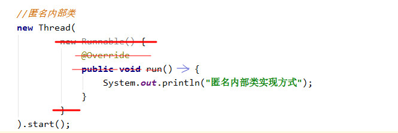
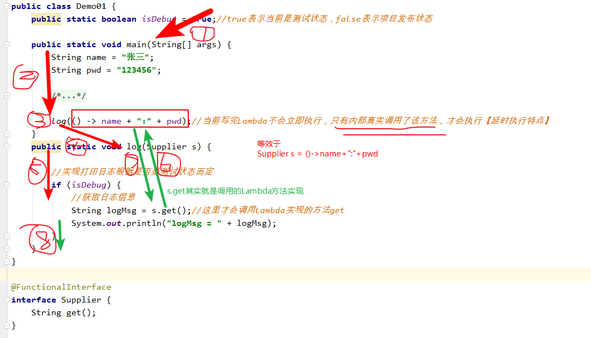
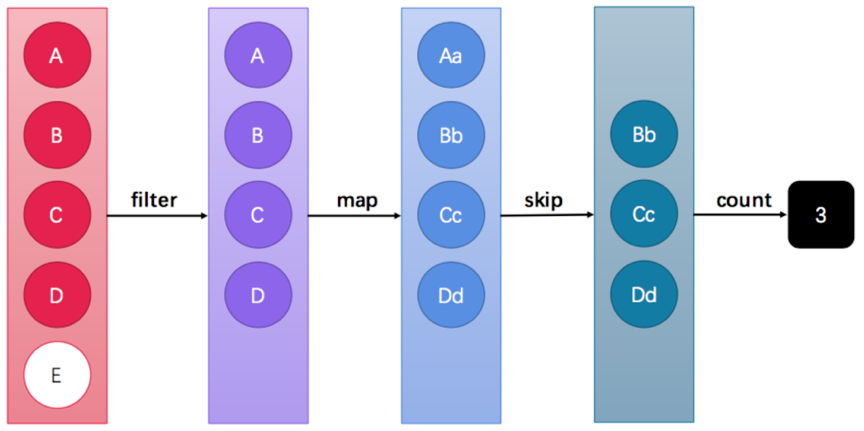
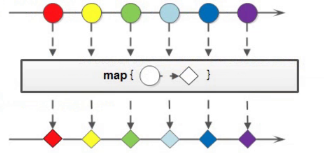
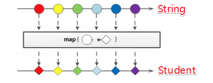

# 第一章 1.8JDK特性_ Lambda表达式

## 1 函数式编程思想概述

### 学习目标

- 理解什么是函数式编程


​             	  

函数式编程是种编程方式，它将电脑运算视为函数的计算。将业务逻辑细化，封装成一个个功能函数（方法），并借助语言自带的高阶函数，将整个业务流程转化为函数之间的相互调用，这就是函数式编程。 


**函数式编程在代码中体现形式是怎样的呢？**

接下来我们根据例子说明一下：**==查找集合中最大的数字。==**

我们以前的编程方式更偏向于**命令式编程（指令式编程）**，要解决集合求最大值的这个问题，会思考第一步先定义变量用存储最大值，第二步建立循环遍历集合，第三步在循环中完成值的比较，第四步循环结束后获取最大值。我们在获取这个最大值的过程中，代码一直在体现的是 **”要怎样“** 才能得到结果。

而函数式编程解决这个找最大数值的问题体现的是，将一些功能封装到一些函数（方法）中通过调用函数得到想要的结果。体现的是，先要获取什么，再要获取什么的过程，体现的是高层级函数，调用低层级函数而获得想要的结果。

我们来看下这种命令式编程和函数式编程在代码中具体体现：

```java
public static void main(String[] args) {

		List<Integer> list = new ArrayList<>();
		list.add(1111);
		list.add(2222);
		list.add(9999);
		list.add(6666);
		list.add(4444);

//使用命令式编程方式实现  
		Integer max1 = list.get(0);
		for (int i = 0; i < list.size(); i++) {
			Integer s = list.get(i);
			if (s > max1) {
				max1 = s;
			}
		}
		System.out.println("max1 = " + max1);

  
//使用函数式编程方式实现
		Integer max2 = list.stream().max((s1, s2) -> s1-s2).get();
		System.out.println("max2 = " + max2);

	}
```


输出结果：

```java
max1 = 9999
max2 = 9999
```


### 知识小结

函数式编程就是，将业务功能封装成一个个功能函数（方法），借助语言自带的高阶函数api，将整个业务流程转化为函数之间的相互调用，这就是函数式编程。 


==Lambda学习是学习函数式编程的第一步==


## 2 Lambda表达式的认识

### 学习目标

- 知道书写Lambda表达式的前提条件
- 知道Lambda表达式的语法格式

### 2.1 Lambda表达式的前提

Lambda表达式是接口的匿名内部类替代品，但要求接口必须只有一个抽象方法要实现。我们写接口匿名内部类时其目的也抽象方法法进行实现，Lambda表达式也是一样的，体现的就是抽象方法实现。其格式就是一个没有名字的函数（方法），因此也叫做匿名函数（方法）。

因此，需要写Lambda表达式就需要有一个接口，而且这个接口只能存在一个需要实现的抽象方法，可以含有其他非抽象方法。这种符合定义Lambda表达式的接口，我们称之为**函数式接口**。

例如：Runnable接口就满足条件，是一个纯正的函数式接口。

```java
public interface Runnable{
    public abstract void run();
}
```

Callable

```java
@FunctionalInterface//[表示函数式接口的注解]
public interface Callable<V> {
    V call() throws Exception;
}
```


函数式接口只对抽象方法有约束，只能有一个需要实现。而对于其他的非抽象方法，没有约束


我们今天的内容就要学会，如何写函数式接口，如何借助函数式接口写出所对应的Lambda表达式，如何使用Lambda表达式。


### 2.2 语法格式

Lambda表达式的书写就是对接口中抽象方法的实现，它省去面向对象的条条框框，==就是函数式接口其匿名内部类的简写方式==，简写到只保留一个方法的实现，甚至修饰符，返回值类型，异常的声明都可以省略,方法名都可以省略，具体格式有三部分组成。

格式由**3个部分**组成：

1. 参数		【就是参数列表】
2. 箭头		【语法格式】  ->
3. 代码		【就是方法体】

**【标准格式】**

```
(参数类型 参数名称) -> { 代码语句 }
```

**【格式说明】**

1. 小括号内的语法与传统方法参数列表一致：无参数则留空；多个参数则用逗号分隔。
2. `->`是新引入的语法格式。
3. 大括号内的语法与传统方法体要求基本一致。


**【代码实例】**

我们启动一个线程去执行一个Runnable任务，分别使用匿名内部方式和Lambda方式实现

1）匿名内部类代码如下：

```java
  //匿名内部类
  new Thread(
          new Runnable() {
              @Override
              public void run()    {
                  System.out.println("匿名内部类实现方式");
              }
          }
  ).start();
```


2）Lambda表达式代码实现

 

```java
 new Thread(
         ()->{  //表示的就是run方法
             System.out.println("这是Lambda方式的实现");
         }
 ).start();
```


### 知识小结

- 书写Lambda表达式的前提条件？

  必须要有函数式接口

- 函数式接口有什么要求？

  必须只有一个抽象方法需要实现。

- Lambda表达式的语法格式？

  参数列表 -> {方法体}
  
  参数列表：就是我们需要实现的抽象方法其参数列表
  
  方法体：就是我们需要实现的逻辑
  
  箭头：语法体现
  
  

1. 使用有什么条件？

2. 使用格式？

3. 作用？

   简化代码


## 3 Lambda格式巩固

### 学习目标

- 知道Lambda含有参数和返回值的书写方式
- 知道Lambda省略规则


### 3.1 Lambda含有参数和返回值

以`java.util.Comparator<T>`接口的使用场景为例，来研究下若接口中的抽象方法含有参数和返回值，该如何使用Lambda表达式来实现

Comparator接口源码

```java
public interface Comparator<T>{
	public abstract int compare(T o1, T o2);
  //其他代码省略
}
```

Comparator接口也是只有一个抽象方法需要实现的，满足函数式接口要求。


**【代码实践】**

定义一个Person类含有`String name`和`int age`两个成员变量，创建三个对象放到数组中，进行按照年龄升序排序。


**Arrays工具类中排序的方法**

```java
public static <T> void sort(T[] a, Comparator<? super T> c) 
  使用指定比较规则对数组进行排序
```

**代码实现**

1. 先定义一个Person类含有name,age
2. 定义一个测试类，在main方法中定义一个Person数组，初始化三个对象
3. 使用Arrays的sort方法进行安装年龄升序排序

```java

public class Demo01 {
    public static void main(String[] args) {
//2. 定义一个测试类，在main方法中定义一个Person数组，初始化三个对象
        Person[] people = new Person[3];
        people[0] = new Person("迪丽热巴", 18);
        people[1] = new Person("古力娜扎", 16);
        people[2] = new Person("马尔扎哈", 50);
//3. 使用Arrays的sort方法进行安装年龄升序排序

      /*  Arrays.sort(people,
                new Comparator<Person>() {
                    @Override
                    public int compare(Person o1, Person o2) {
                        //年龄升序排序
                        return o1.age - o2.age;
                    }
                }
        );
*/


        Arrays.sort(people,
                (Person p1, Person p2) -> {
                    return p1.age - p2.age;
                }
                //当前Lambda其实就是为了实现抽象compare。该方法就是Comparator的compare方法
        );

        System.out.println(Arrays.toString(people));

    }


}


//1. 先定义一个Person类含有name,age


//如果要定义多个类在一个java文件中，会有一个主类是public的而且要与java文件名相同
//其他类型不能是public的

class Person {//package-private 包私有：限定本类只能在当前包下访问使用
    String name;
    int age;

    public Person(String name, int age) {
        this.name = name;
        this.age = age;
    }

    @Override
    public String toString() {
        return "Person{" +
                "name='" + name + '\'' +
                ", age=" + age +
                '}';
    }
}
```


 思考：函数式接口中抽象方法是否存在参数是否有返回值会对Lambda表达式的格式造成较大的变化么？

```java
不会有太大的变化，也是只有三个部分组成： (参数列表) -> {方法体，如果有返回值就return }
```


### 3.2 Lambda的省略规则

Lambda表达式是函数式接口匿名内部类的简化写法，简化到只有抽象方法的实现，而且方法中的修饰符，返回值类型，方法名也得到简化。其实Lambda表达式还可以进一步对参数列表和方法体进一步简化。


**1【参数列表的省略规则】**

- 小括号内参数的类型可以省略；

  ```java
  有方法的参数列表如下，按规则简化：
  (Person o1,Person o2 ) 简化后为 (o1,o2)      
  (int a) 简化后为  (a)
  ```

- 如果小括号内**有且仅有一个参**，则小括号和参数类型可以一并省略，如果是无参方法，不能把小括号删除； 

  ```java
  有方法的参数列表如下，按规则简化：
  (int a) 简化后为  a
  ```

  

**2【方法体的省略规则】**

- 如果大括号内==**有且仅有一个语句**==，则无论是否有返回值，都可以省略大括号、return关键字及语句分号。


【练习】

**1. 根据Comparator的Lambda标准根据规则写出省略格式：**

```java
//标准格式
 Arrays.sort(arr, (Person o1, Person o2) -> {
     return o1.age - o2.age;
 });

 //省略格式
Arrays.sort(people, (p1, p2) -> p1.age - p2.age);
```

**2. 根据Runnable的Lambda标准根据规则写出省略格式：**

```java
//标准格式
new Thread(() -> {
    System.out.println("这是匿名内部类创建的线程");
}
).start();
 //省略格式 
 new Thread(() -> System.out.println("这是Lambda方式的实现")).start();

```


### 知识小结


Lambda表达式的省略规则：

参数省略规则？

1. 参数列表中的类型可以省略
2. 如果只有一个参数，类型和括号都可以省略
3. 如果没有参数，小括号不能省

方法体省略规则？

1. 如果**==方法体中只存在一个语句==**，不管有没有return， 大括号，分号，如有return都可以省略,一省全省。


## 4.函数式接口定义

### 学习目标

- 能够自定义函数式接口

### 4.1 函数式接口特点介绍

函数式接口我们在本章第二小节中提到过，函数式接口就是只有一个抽象方法需要实现的接口。例如我们所学过的Runnable接口，Comparator接口 及在包 `java.util.function`  中定义的很多接口，都是函数式接口。

他们都有一个特点：**只有一个抽象方法需要实现。**

例如熟悉的Runnable接口，源码如下：

```java
@FunctionalInterface
public interface Runnable {
    public abstract void run();
}
```


### 4.2语法格式

含有一个抽象方法需要强制实现的接口，就是函数式接口，就是能够使用Lambda表达式去实现的。

```java
@FunctionnalInterface//建议加上，以示与普通接口的区别
public interface 接口名{
   public abstract 返回值类型 方法名(参数列表); //抽象方法的定义
 
  //可以有其他的静态方法，默认方法....
}
```

说明：

**FunctionalInterface注解**

@FunctionnalInterface 注解，作用于@Override类似，目的就是做语法限定的。如果存在多个抽象方法就会报错。建议自定义函数式接口时，加上此注解。


**【代码实践】**

定义一个函数式接口，含有一个方法，该方法期望通过两个整数的计算获取计算结果。

```java
public class Demo01 {
    public static void main(String[] args) {

        Calculate c = ((a, b) -> a + b);//多态

        int cal = c.cal(100, 200);
        System.out.println("cal = " + cal);//300

        Calculate c2 = (a, b) -> a * b;
        int result = c2.cal(100, 100);
        System.out.println("result = " + result);


    }
}

@FunctionalInterface  //目的就是限定函数式接口只能有一个抽象方法
interface Calculate {
    int cal(int a, int b);

//    void test2();

    public static void test() {
        System.out.println("这个是函数式接口的静态方法");
    }
}
```


### 知识小结

函数式接口特点，只有一个抽象方法需要实现。


## 5.Lambda表达式的执行流程及特点

Lambda表达式使用的时候，一般当做实参传入方法中。要特别注意的是，当定义Lambda表示完成后，这个方法时不会立刻执行的。只有Lambda所表示的方法，在内部被调用了才会执行，这体现了一种延时执行的特点。

【代码实践】

需求：开发中时常需要记录日志信息，我们需要控制，当Debug状态的时候，打开日志显示。当发布后就不需要显示日志信息。

实现步骤如下：

1. 已知函数式接口Supplier用来提供日志所需字符串数据，如下：

   ```java
   interface Supplier{
   	String get();
   }
   ```

2. 创建一个测试类，定义一个静态方法专门用来显示日志，日志信息由Supplier提供

   静态方法声明如下：

   ```java
   public static void log(Supplier s)
   ```

   在测试类中定义一个静态变量isDebug用来记录是否是Debug状态：

   ```java
   public static boolean isDebug =true;
   赋值为true则是一种测试状态，如果为false就是正式运行状态。
   ```

   

3. 在main方法中模拟用户名和密码的输入，调用log方法进行测试。

【完整代码实现】

```java
public class Demo01 {
    public static boolean isDebug = true;//true表示当前是测试状态，false表示项目发布状态

    public static void main(String[] args) {
        String name = "张三";
        String pwd = "123456";

        /*log(new Supplier() {
            @Override
            public String get() {
                return name+":"+pwd;
            }
        });*/

        log(() -> name + ":" + pwd);//当前写完Lambda不会立即执行，只有内部真实调用了该方法，才会执行【延时执行特点】
    }
    public static void log(Supplier s) {

        //实现打印日志根据是否是测试状态而定
        if (isDebug) {
            //获取日志信息
            String logMsg = s.get();//这里才会调用Lambda实现的方法get
            System.out.println("logMsg = " + logMsg);
        }
    }
}

@FunctionalInterface
interface Supplier {
    String get();
}
```




Lambda表达式的执行特点：延时执行，只有Lambda的方法被调用才会执行。


# 第二章 函数式接口

JDK提供了大量常用的函数式接口以丰富Lambda的典型使用场景，它们主要在`java.util.function`包中被提供。下面是两个常用的函数式接口及使用示例。

### 1 Supplier接口

提供者

```java
@FunctionalInterface
public interface Supplier<T> {
    T get();
}

```

`java.util.function.Supplier<T>`接口仅包含一个无参的方法：`T get()`，用来获取一个泛型参数指定类型的对象数据。

Supplier 接口是一个**供给型**的接口，可以用来专供指定类型的数据，获取数据的逻辑可以写在在具体实现get方法上。


【使用场景】		

​	数据提供


【代码实践】

使用Supplier专门提供[0,100]的随机数。

```java

public class Demo01Supplier {
    public static void main(String[] args) {
        //这个Lambda表达式就是get方法的实现
        Supplier<Integer> supplier = () -> {
            //随机生成一个[0,100]之间的数，并返回
            Random rd = new Random();
            //随机产生的数据
            int num = rd.nextInt(101);
            return num;
        };

        printRandomNum(supplier);
        printRandomNum(supplier);
        printRandomNum(supplier);
        printRandomNum(supplier);


    }


    //写一个方法专门打印[0,100]之间的随机数
    public static void printRandomNum(Supplier<Integer> s) {
        //获取提供者提供的数据

        Integer num = s.get();
        System.out.println("num = " + num);
    }
}

```

 


### 2 Consumer接口

消费者

```java
@FunctionalInterface
public interface Consumer<T> {
    void accept(T t);
    //省略其他方法
    
}

```

`java.util.function.Consumer<T>`接口是一个消费型的接口， 实现抽象方法accept时，对传入的数据 t 进行处理。


在JDK1.8之后，Iterable集合接口新增了一个默认方法：

Iterable是Collection的父接口，表示可迭代，里面定义了一个方法：`迭代器 =   集合.iterator();`

```java
default void forEach(Consumer<? super T> action)  指定方式遍历集合
```

Iterable是Collection父接口，因此不论是List集合还是Set集合都有这个方法。这个方法是一个新式的遍历元素的方法。

源码如下：

```java
default void forEach(Consumer<? super T> action) {
    Objects.requireNonNull(action);
    for (T t : this) {
        action.accept(t);
    }
}
```

【使用场景】

​	消费处理数据


【练习】

List集合中存在电影名，使用forEach方法遍历集合打名字。打印时用书名号把电影名称括起来。

``` java
ArrayList<String> list = new ArrayList<>();
Collections.addAll(list,"这个杀手不太冷","肖申克的救赎","阿甘正传","流浪地球");
```

要求打印结果：《这个杀手不太冷》《肖申克的救赎》《阿甘正传》《流浪地球》

【代码实现】

可以借助foreach方法实现

因为ArrayList会继承Collection中的方法，Collection又会继承Iterable的foreach方法。

```java
public class Demo02Consumer {
    public static void main(String[] args) {
        ArrayList<String> list = new ArrayList<>();
        Collections.addAll(list, "这个杀手不太冷", "肖申克的救赎", "阿甘正传", "流浪地球");

        //遍历集合：有索引可以使用普通循环，也可使用迭代器，增强for循环

      /*  list.forEach(new Consumer<String>() {
            @Override
            public void accept(String s) {
                System.out.println(s);
            }
        });*/

        //遍历打印数据，并在字符串前后使用书名号括起来
        list.forEach((s) -> System.out.println("《" + s + "》"));//这个Lambda表达式的方法就是accept

    }
}

```


### 3 Predicate接口

断言家

```java
package java.util.function;

@FunctionalInterface
public interface Predicate<T> {
    boolean test(T t);
    //省略其他方法
}
```

`java.util.function.Predicate<T>`接口可以实现对某种类型的数据进行判断，从而得到一个true或者false的值结果。具体判断逻辑由抽象方法test的实现逻辑指定。

【使用场景】

​	数据合法性判断


【练习】

已知Demo测试类中存在两个集合odd,even分别存储奇数和偶数。在main方法中随机生成10个 [0,100]之间的数。判断数据的奇偶性并放到指定集合中去。

```java
public class Demo{
    static ArrayList<Integer> odd = new ArrayList<>();//奇数
    static ArrayList<Integer> even = new ArrayList<>();//偶数

    public static void main(String[] args) {
        //随机生成10个【0~100】之间的数据，将生成的数据传入analyze方法，并指定奇偶判断逻辑
		//------完成代码----

    }
	/**
     * 该方法实现对传入的num数据进行使用numPredicate判断， 
	 * 若num是奇数放到odd集合，是偶数放到even集合
	 */
    public static void analyze(int num, Predicate<Integer> numPredicate) {
       //------完成代码----

    }
}

```


【代码实践】

```java

public class DemoPredicate {
    static ArrayList<Integer> odd = new ArrayList<>();//奇数
    static ArrayList<Integer> even = new ArrayList<>();//偶数

    public static void main(String[] args) {
        //随机生成10个【0~100】之间的数据，将生成的数据传入analyze方法，并指定奇偶判断逻辑
        //------完成代码----
        Random rd = new Random();
        for (int i = 0; i < 10; i++) {
            //随机生成一个数据
            int num = rd.nextInt(101);
            analyze(num, n -> n % 2 == 0);
            // (n)->n%2==0  该Lambda表达式就是对  test方法的实现
        }

        System.out.println("奇数 = " + odd);
        System.out.println("偶数 = " + even);

    }

    /**
     * 该方法实现对传入的num数据进行使用numPredicate判断，
     * 若num是奇数放到odd集合，是偶数放到even集合
     */
    public static void analyze(int num, Predicate<Integer> numPredicate) {
        //------完成代码----
        //调用断言家的test方法返回true，是偶数，放到even集合中
        if (numPredicate.test(num)) {
            even.add(num);
        } else {
            //否则就放到奇数odd集合中
            odd.add(num);

        }
    }
}

```


### 4 Function接口

魔术师


```java
@FunctionalInterface
public interface Function<T, R> {
    R apply(T t);
    //省略其他方法
}
```

`java.util.function.Function<T,R>`  功能型接口，作用是将 T 类型的数据转换为 R 类型的数据。具体的转换逻辑在实现`apply`方法的时候指定。


【使用场景】

​	数据类型转换

​	比如指定T为String，R为Integer，就是将字符串转换为整数。


【练习】

已知集合中存在字符串，将字符串数据转换为学生对象，如下补充代码

```java
public class Demo02 {
    public static void main(String[] args) {
        //集合中存有字符串，格式：名字:年龄
        ArrayList<String> list = new ArrayList<>();
        Collections.addAll(list, "小红:18", "小明:20", "小花:30");

        //遍历集合中的字符串，根据字符串中的姓名和年龄转换为Student学生对象


    }
    /*
        该方法实现将字符串转换为学生对象
     */
    public static void map(String data, Function<String, Student> fun) {
        //实现转换

    }
}

class Student {//学生类
    int age;
    String name;

    public Student(int age, String name) {
        this.age = age;
        this.name = name;
    }

    @Override
    public String toString() {
        return "Student{" +
                "age=" + age +
                ", name='" + name + '\'' +
                '}';
    }
}

```


【代码完成】

```java
public class Demo04Function {
    public static void main(String[] args) {
        //集合中存有字符串，格式：名字:年龄
        ArrayList<String> list = new ArrayList<>();
        Collections.addAll(list, "小红:18", "小明:20", "小花:30");

        //遍历集合中的字符串，根据字符串中的姓名和年龄转换为Student学生对象
        for (String msg : list) {
           /* map(msg, new Function<String, Student>() {
                @Override
                public Student apply(String data) {
                    String[] stuMsg = data.split(":");
                    Student s = new Student(Integer.parseInt(stuMsg[1]),stuMsg[0]);
                    return s;
                }
            });*/


           map(msg,data->{
               String[] stuMsg = data.split(":");//对字符串进行切割得到两部
               int age = Integer.parseInt(stuMsg[1]);//将字符串中的年龄转换为int数据
               Student s = new Student(age,stuMsg[0]);
               return s;
           });

        }


    }
    /*
        该方法实现将字符串转换为学生对象
     */
    public static void map(String data, Function<String, Student> fun) {
        //实现转换
        Student stu = fun.apply(data);
        System.out.println("stu = " + stu);

    }
}

class Student {//学生类
    int age;
    String name;

    public Student(int age, String name) {
        this.age = age;
        this.name = name;
    }

    @Override
    public String toString() {
        return "Student{" +
                "age=" + age +
                ", name='" + name + '\'' +
                '}';
    }
}

```


# 第三章 Stream(必须掌握)

在Java 8中，得益于Lambda所带来的函数式编程，引入了一个**全新的Stream概念**，用于解决已有集合类库既有的弊端。


## 3.1 引言

**传统集合的多步遍历代码**

几乎所有的集合（如`Collection`接口或`Map`接口等）都支持直接或间接的遍历操作。而当我们需要对集合中的元素进行操作的时候，除了必需的添加、删除、获取外，最典型的就是集合遍历。例如：

```java
public class Demo10ForEach {
    public static void main(String[] args) {
        List<String> list = new ArrayList<>();
        list.add("张无忌");
        list.add("周芷若");
        list.add("赵敏");
        list.add("张强");
        list.add("张三丰");
        for (String name : list) {
          	System.out.println(name);
        }
    }  
}
```

这是一段非常简单的集合遍历操作：对集合中的每一个字符串都进行打印输出操作。

**循环遍历的弊端**

Java 8的Lambda让我们可以更加专注于**做什么**（What），而不是**怎么做**（How），这点此前已经结合内部类进行了对比说明。现在，我们仔细体会一下上例代码，可以发现：

- for循环的语法就是“**怎么做**”
- for循环的循环体才是“**做什么**”

为什么使用循环？因为要进行遍历。但循环是遍历的唯一方式吗？遍历是指每一个元素逐一进行处理，**而并不是从第一个到最后一个顺次处理的循环**。前者是目的，后者是方式。

试想一下，如果希望对集合中的元素进行筛选过滤：

1. 将集合A根据条件一过滤为**子集B**；
2. 然后再根据条件二过滤为**子集C**。

那怎么办？在Java 8之前的做法可能为：

这段代码中含有三个循环，每一个作用不同：

1. 首先筛选所有姓张的人；
2. 然后筛选名字有三个字的人；
3. 最后进行对结果进行打印输出。

```java
public class Demo11NormalFilter {
  	public static void main(String[] args) {
      	List<String> list = new ArrayList<>();
        list.add("张无忌");
        list.add("周芷若");
        list.add("赵敏");
        list.add("张强");
        list.add("张三丰");

        List<String> zhangList = new ArrayList<>();
        for (String name : list) {
            if (name.startsWith("张")) {
              	zhangList.add(name);
            }
        }

        List<String> shortList = new ArrayList<>();
        for (String name : zhangList) {
            if (name.length() == 3) {
              	shortList.add(name);
            }
        }

        for (String name : shortList) {
          	System.out.println(name);
        }
    }
}
```

每当我们需要对集合中的元素进行操作的时候，总是需要进行循环、循环、再循环。这是理所当然的么？**不是。**循环是做事情的方式，而不是目的。另一方面，使用线性循环就意味着只能遍历一次。如果希望再次遍历，只能再使用另一个循环从头开始。

那，Lambda的衍生物Stream能给我们带来怎样更加优雅的写法呢？


**Stream的更优写法**

下面来看一下借助Java 8的Stream API，什么才叫优雅：

```java
public class Demo12StreamFilter {
    public static void main(String[] args) {
        List<String> list = new ArrayList<>();
        list.add("张无忌");
        list.add("周芷若");
        list.add("赵敏");
        list.add("张强");
        list.add("张三丰");

        list.stream()
          	.filter(s -> s.startsWith("张"))
            .filter(s -> s.length() == 3)
            .forEach(s -> System.out.println(s));
    }
}
```

直接阅读代码的字面意思即可完美展示无关逻辑方式的语义：**获取流、过滤姓张、过滤长度为3、逐一打印**。代码中并没有体现使用线性循环或是其他任何算法进行遍历，我们真正要做的事情内容被更好地体现在代码中。


## 3.2 流式思想概述

**注意：这里和传统IO流没有任何关系！**

整体来看，流式思想类似于工厂车间的“**生产流水线**”。


当需要对多个元素进行操作（特别是多步操作）的时候，考虑到性能及便利性，我们应该首先拼好一个“模型”步骤方案，然后再按照方案去执行它。



这张图中展示了过滤、映射、跳过、计数等多步操作，这是一种集合元素的处理方案，而方案就是一种“函数模型”。图中的每一个方框都是一个“流”，调用指定的方法，可以从一个流模型转换为另一个流模型。而最右侧的数字3是最终结果。

这里的`filter`、`map`、`skip`都是在对函数模型进行操作，集合元素并没有真正被处理。只有当终结方法`count`执行的时候，整个模型才会按照指定策略执行操作。而这得益于Lambda的延迟执行特性。

> 备注：“Stream流”其实是一个集合元素的函数模型，它并不是集合，也不是数据结构，其本身并不存储任何元素（或其地址值）。


## 3.3 获取流方式

`java.util.stream.Stream<T>`是Java 8新加入的最常用的流接口。（这并不是一个函数式接口。）

获取一个流非常简单，有以下几种常用的方式：

- 所有的`Collection`集合都可以通过`stream`默认方法获取流；
- `Stream`接口的静态方法`of`可以获取数组对应的流。


**方式1 : 根据Collection获取流**

首先，`java.util.Collection`接口中加入了default方法`stream`用来获取流，所以其所有实现类均可获取流。

ArrayList, HashSet 最终都要实现Collection接口，也会继承接口中的各种方法，存在stream方法用来获取流。

只要是Collection的子孙后台，都可以调用stream方法

```java
public class Demo01 {
    public static void main(String[] args) {
        //Collection获取流
        Set<String> set = new HashSet<>();
        Stream<String> s1 = set.stream();

        List<String> list = new ArrayList<>();
        Stream<String> s2 = list.stream();

        //以上List和Set集合调用的stream方法均来自 Collection中

        //注意：Map接口就没有这个默认方法了
        //如果要获取Map集合的Stream流对象，必须先转换为Collection集合
        Map<String, String> map = new HashMap<>();
        Set<Map.Entry<String, String>> entries = map.entrySet();
        Stream<Map.Entry<String, String>> s3 = entries.stream();
        
    }
}

```


**方式2: 根据数组获取流**

如果使用的不是集合或映射而是数组，由于数组对象不可能添加默认方法，所以`Stream`接口中提供了静态方法`of`，使用很简单：

```
public static Stream<T> of(T... t) :参数是可变参数，可以接收T类型的数组。
特别注意：因为泛型必须制定引用数据类型，所以传入的数组也必须是引用数据类型的数组。
```

Stream.of(数组); 

```java
public class Demo02 {
    public static void main(String[] args) {

        String[] arr = {"AA", "BV"};
        //数组转换为流
        Stream<String> s1 = Stream.of(arr);
    }
}

```

> 备注：`of`方法的参数其实是一个可变参数，所以支持数组。


## 3.4 常用方法

流模型的操作很丰富，这里介绍一些常用的API。这些方法可以被分成两种：

- **终结方法**：返回值类型不再是`Stream`接口自身类型的方法，因此不再支持类似`StringBuilder`那样的链式调用。本小节中，终结方法包括`count`和`forEach`方法。
- **非终结方法**：返回值类型仍然是`Stream`接口自身类型的方法，因此支持链式调用。（除了终结方法外，其余方法均为非终结方法。）

> 备注：本小节之外的更多方法，请自行参考API文档。

| 方法名  | 方法作用   | 方法种类 | 是否支持链式调用 |
| ------- | ---------- | -------- | ---------------- |
| count   | 统计个数   | 终结     | 否               |
| forEach | 逐一处理   | 终结     | 否               |
| filter  | 过滤       | 函数拼接 | 是               |
| limit   | 取用前几个 | 函数拼接 | 是               |
| skip    | 跳过前几个 | 函数拼接 | 是               |
| map     | 映射       | 函数拼接 | 是               |
| concat  | 组合       | 函数拼接 | 是               |


### forEach : 逐一处理

虽然方法名字叫`forEach`，但是与for循环中的“for-each”昵称不同，该方法**并不保证元素的逐一消费动作在流中是被有序执行的**。

```java
void forEach(Consumer<? super T> action);
```


Consumer是一个JDK定义的函数式接口：

```java
public interface Consumer<T>{
    void accept(T t);
}
```


该方法接收一个`Consumer`接口函数，会将每一个流元素交给该函数进行处理。例如：

【练习】

集合中存在若干数据，使用Stream来遍历集合。

```java
 List<String> list = new ArrayList<>();
        list.add("张无忌");
        list.add("周芷若");
        list.add("赵敏");
        list.add("张强");
        list.add("张三丰");
```

【代码】

```java
public class Demo01ForEach {
    public static void main(String[] args) {
        List<String> list = new ArrayList<>();
        list.add("张无忌");
        list.add("周芷若");
        list.add("赵敏");
        list.add("张强");
        list.add("张三丰");
        //集合中存在若干数据，使用Stream来遍历集合。
        //1.获取流
        //2.调用foreach方法，出入Consumer的处理逻辑（Lambda）
        list.stream().forEach(new Consumer<String>() {
            @Override
            public void accept(String s) {
                System.out.println(s);
            }
        });
        System.out.println("=======================");
        //forEach可以用来遍历流中的数据
        list.stream().forEach(s-> System.out.println(s));
    }
}

```


### filter：过滤

可以通过`filter`方法将一个流转换成另一个子集流。方法声明：

```java
Stream<T> filter(Predicate<? super T> predicate);
```

该接口接收一个`Predicate`函数式接口参数（可以是一个Lambda）作为筛选条件。

```java
@FunctionalInterface
public interface Predicate<T> {
	boolean test(T t);//判断传入的t数据是否合法
}
```


【练习】

已知集合中存在数据如下，筛选三个字的姓名并打印结果

```java
 List<String> list = new ArrayList<>();
        list.add("张无忌");
        list.add("周芷若");
        list.add("赵敏");
        list.add("张强");
        list.add("张三丰");
```

【代码】

```java
public class Demo02Filter {
    public static void main(String[] args) {
        List<String> list = new ArrayList<>();
        list.add("张无忌");
        list.add("周芷若");
        list.add("赵敏");
        list.add("张强强");
        list.add("张三丰");
        //已知集合中存在数据如下，筛选三个字的姓名并打印结果
        //1.先把集合对应的流拿到
        //2.过滤只有三个字符的字符串：filter
        //3.forEach进行对流打印遍历
        list.stream()
                .filter(name -> name.length() == 3)//过滤，提供一个低阶函数，test的实现
                .forEach(name -> System.out.println(name));
    }
}

```


### count：统计个数

正如旧集合`Collection`当中的`size`方法一样，流提供`count`方法来数一数其中的元素个数：

```java
long count();
```

该方法返回一个long值代表元素个数（不再像旧集合那样是int值）。


【练习】

已知集合中存在名字数据如下，统计姓张的名字有多少

```java
 List<String> list = new ArrayList<>();
        list.add("张无忌");
        list.add("周芷若");
        list.add("赵敏");
        list.add("张强");
        list.add("张三丰");
```

【代码】

```java
public class Demo02Count {
    public static void main(String[] args) {
        List<String> list = new ArrayList<>();
        list.add("张无忌");
        list.add("周芷若");
        list.add("赵敏");
        list.add("张强强");
        list.add("张三丰");
        //已知集合中存在名字数据如下，统计姓张的名字有多少
        //1.先把集合对应的流拿到
        //2.过滤只有三个字符的字符串：filter 过滤姓张的
        //3.调用count方法计数
        long count = list.stream()
                .filter(name -> name.startsWith("张"))
                .count();//count就是一个终结方法，后续不能继续调用了

        System.out.println("count = " + count);

    }
}

```


### limit：取用前几个

`limit`方法可以对流进行截取，只取用前n个。方法签名：

```java
Stream<T> limit(long maxSize):获取Stream流对象中的前n个元素,返回一个新的Stream流对象
```

参数是一个long型，如果流水线当前长度大于参数则进行截取；否则不进行操作。


【练习】

已知集合中存在名字数据如下，打印前3个名字

```java
 List<String> list = new ArrayList<>();
        list.add("张无忌");
        list.add("周芷若");
        list.add("赵敏");
        list.add("张强");
        list.add("张三丰");
```

【代码】

```java
public class Demo04Limit {
    public static void main(String[] args) {
        List<String> list = new ArrayList<>();
        list.add("张无忌");
        list.add("周芷若");
        list.add("赵敏");
        list.add("张强强");
        list.add("张三丰");
        //已知集合中存在名字数据如下，打印前3个名字
        //1.先把集合对应的流拿到
        //2.使用limit获取前三个
        //3.forEach进行对流打印遍历

        list.stream()
                .limit(3)
                .forEach(name-> System.out.println(name));

    }
}

```


### skip：跳过前几个

如果希望跳过前几个元素，可以使用`skip`方法获取一个截取之后的新流：

```java
Stream<T> skip(long n): 跳过Stream流对象中的前n个元素,返回一个新的Stream流对象
```

如果流的当前长度大于n，则跳过前n个；否则将会得到一个长度为0的空流。


【练习】

已知集合中存在名字数据如下，忽略前3个名字打印剩余的名字

```java
 List<String> list = new ArrayList<>();
        list.add("张无忌");
        list.add("周芷若");
        list.add("赵敏");
        list.add("张强");
        list.add("张三丰");
```

【代码】

```java
public class Demo05Skip {
    public static void main(String[] args) {
        List<String> list = new ArrayList<>();
        list.add("张无忌");
        list.add("周芷若");
        list.add("赵敏");
        list.add("张强强");
        list.add("张三丰");
        //已知集合中存在名字数据如下，忽略前3个名字打印剩余的名字
        //1.先把集合对应的流拿到
        //2.使用skip跳过前三个
        //3.forEach进行对流打印遍历

        list.stream()
                .skip(3)
                .forEach(name-> System.out.println(name));

    }
}

```


### 映射：map

如果需要将流中的元素映射到另一个流中，可以使用`map`方法。方法说明：

```java
<R> Stream<R> map(Function<? super T, ? extends R> mapper);
属于延迟方法
```

该接口需要一个`Function`函数式接口参数，可以将当前流中的T类型数据转换为另一种R类型的流。



【练习】

已知集合中存在名字数据如下，定义学生类将名字数据转换为学生对象数据

 

```java
 List<String> list = new ArrayList<>();
        list.add("张无忌");
        list.add("周芷若");
        list.add("赵敏");
        list.add("张强");
        list.add("张三丰");
```

【代码】

```java
public class Demo06Map {
    public static void main(String[] args) {
        List<String> list = new ArrayList<>();
        list.add("张无忌");
        list.add("周芷若");
        list.add("赵敏");
        list.add("张强强");
        list.add("张三丰");
        //已知集合中存在名字数据如下，定义学生类将名字数据转换为学生对象数据
        //1.先把集合对应的流拿到
        //2.使用map方法传入Function的apply实现【转换逻辑】
        //3.forEach进行对流打印遍历

        list.stream()
                .map(name->new Student(name))
                .forEach(student -> System.out.println(student));

    }
}

class Student{
    String name;

    public Student(String name) {
        this.name = name;
    }

    @Override
    public String toString() {
        return "Student{" +
                "name='" + name + '\'' +
                '}';
    }
}
```


### concat：组合

如果有两个流，希望合并成为一个流，那么可以使用`Stream`接口的静态方法`concat`：

```java
static <T> Stream<T> concat(Stream<? extends T> a, Stream<? extends T> b): 把参数列表中的两个Stream流对象a和b,合并成一个新的Stream流对象
```

> 备注：这是一个静态方法，与`java.lang.String`当中的`concat`方法是不同的。


【练习】

已知存在两个集合数据，将两个集合中的数据整合在一起并遍历输出。

```java
  List<String> one = new ArrayList<>();
        one.add("迪丽热巴");
        one.add("宋远桥");
        one.add("苏星河");
  List<String> two = new ArrayList<>();
        two.add("古力娜扎");
        two.add("张无忌");
        two.add("张三丰");
```

【代码】

```java
public class Demo06Concat {
    public static void main(String[] args) {
        List<String> one = new ArrayList<>();
        one.add("迪丽热巴");
        one.add("宋远桥");
        one.add("宋远桥");
        one.add("宋远桥");
        one.add("宋远桥");
        one.add("宋远桥");
        one.add("苏星河");
        List<String> two = new ArrayList<>();
        two.add("古力娜扎");
        two.add("张无忌");
        two.add("张无忌");
        two.add("张无忌");
        two.add("张无忌");
        two.add("张无忌");
        two.add("张三丰");

        //1.将两个集合转换为两个流
        //2.通过Stream的concat方法进行拼接流

        Stream<String> s1 = one.stream();
        Stream<String> s2 = two.stream();
        Stream.concat(s1,s2)
                .forEach(name-> System.out.println(name));
    }
}

```


## 3.5 Stream综合案例

现在有两个`ArrayList`集合存储队伍当中的多个成员姓名，要求使用Stream**依次**进行以下若干操作步骤：

1. 第一个队伍只要名字为3个字的成员姓名；
2. 第一个队伍筛选之后只要前3个人；
3. 第二个队伍只要姓张的成员姓名；
4. 第二个队伍筛选之后不要前2个人；
5. 将两个队伍合并为一个队伍；
6. 根据姓名创建`Person`对象；
7. 打印整个队伍的Person对象信息。

两个队伍（集合）的代码如下：

```java
public class DemoArrayListNames {
    public static void main(String[] args) {
        List<String> one = new ArrayList<>();
        one.add("迪丽热巴");
        one.add("宋远桥");
        one.add("苏星河");
        one.add("老子");
        one.add("庄子");
        one.add("孙子");
        one.add("洪七公");

        List<String> two = new ArrayList<>();
        two.add("古力娜扎");
        two.add("张无忌");
        two.add("张三丰");
        two.add("赵丽颖");
        two.add("张二狗");
        two.add("张天爱");
        two.add("张三");
		// ....
    }
}
```

而`Person`类的代码为：

```java
public class Person {
    
    private String name;

    public Person() {}

    public Person(String name) {
        this.name = name;
    }

    @Override
    public String toString() {
        return "Person{name='" + name + "'}";
    }

    public String getName() {
        return name;
    }

    public void setName(String name) {
        this.name = name;
    }
}
```

**Stream方式** 

Stream流式处理代码为：

```java

public class Demo01 {
    public static void main(String[] args) {
        List<String> one = new ArrayList<>();
        one.add("迪丽热巴");
        one.add("宋远桥");
        one.add("苏星河");
        one.add("老子");
        one.add("庄子");
        one.add("孙子");
        one.add("洪七公");

        List<String> two = new ArrayList<>();
        two.add("古力娜扎");
        two.add("张无忌");
        two.add("张三丰");
        two.add("赵丽颖");
        two.add("张二狗");
        two.add("张天爱");
        two.add("张三");


        //1. 第一个队伍只要名字为3个字的成员姓名；
        //2. 第一个队伍筛选之后只要前3个人；
        Stream<String> s1 = one.stream().filter(name -> name.length() == 3).limit(3);

        //3. 第二个队伍只要姓张的成员姓名；
        //4. 第二个队伍筛选之后不要前2个人；
        Stream<String> s2 = two.stream().filter(name -> name.startsWith("张")).skip(2);
        //5. 将两个队伍合并为一个队伍；
        //6. 根据姓名创建Person对象；
        //7. 打印整个队伍的Person对象信息。
        Stream.concat(s1,s2)
                .map(name->new Person(name))
                .forEach(person -> System.out.println(person));
    }
}

class Person{
    String name;

    public Person(String name) {
        this.name = name;
    }

    @Override
    public String toString() {
        return "Person{" +
                "name='" + name + '\'' +
                '}';
    }
}
```


运行效果：

```
Person{name='宋远桥'}
Person{name='苏星河'}
Person{name='洪七公'}
Person{name='张二狗'}
Person{name='张天爱'}
Person{name='张三'}
```


## 3.6 收集Stream结果

对流操作完成之后，如果需要将其结果进行收集，例如获取对应的集合、数组等，如何操作？

### 收集到集合中

Stream流提供`collect`方法，

其参数需要一个`java.util.stream.Collector<T,A, R>`接口对象来指定收集到哪种集合中。

幸运的是，`java.util.stream.Collectors`类提供一些方法，可以作为`Collector`接口的实例：

- `public static <T> Collector<T, ?, List<T>> toList()`：转换为`List`集合。
- `public static <T> Collector<T, ?, Set<T>> toSet()`：转换为`Set`集合。

【练习】

下面是这两个方法的基本使用代码：

```java
public class Demo15StreamCollect {
    public static void main(String[] args) {
        Stream<String> stream = Stream.of("10", "20", "30", "40", "50");
        List<String> list = stream.collect(Collectors.toList());
        Set<String> set = stream.collect(Collectors.toSet());
    }
}
```

### 收集到数组中

Stream提供`toArray`方法来将结果放到一个数组中，返回值类型是Object[]的：

```java
Object[] toArray();
```

其使用场景如：

```java
public class Demo16StreamArray {
    public static void main(String[] args) {
        Stream<String> stream = Stream.of("10", "20", "30", "40", "50");
        Object[] objArray = stream.toArray();
    }
}
```


【代码实践】

```
public class Demo01 {
    public static void main(String[] args) {
        Stream<String> s1 = Stream.of("A", "B");
        //List
        List<String> list = s1.collect(Collectors.toList());
        
        
        Stream<String> s2 = Stream.of("A", "B");
        //Set
        Set<String> set = s2.collect(Collectors.toSet());
        
        
        Stream<String> s3 = Stream.of("A", "B");
        //数组
        Object[] arr = s3.toArray();
    }
}
```