# 回顾

```java
软件开发流程
	需求分析: 需求文档
  概要设计: 概要设计文档
  详细设计: 详细设计文档
  编码: 
  测试
  交付
  维护
------------------------------------
缓存处理:面试点 ★ 
		缓存穿透
    缓存击穿
    缓存雪崩
dao模块:
		generator代码生成器,生成单表的增删改查
    mybatisPlus
service: 业务层
  	.....
web:
		网关 路由
------------------------------------

代码封装的规则:
		重复的代码可以被封装
    封装逻辑相同的代码
框架底层的相关技术:
		反射 动态代理 泛型 ThreadLocal
```

# 学习目标

```
能够独立搭建Linux环境
能够使用客户端连接Linux
能够使用目录操作的命令
能够使用文件操作的命令
能够使用文件压缩和解压的命令
能够使用对目录文件设置权限的命令
能够使用其它常用的Linux命令
```

# 第一章 Linux的简介

```java
windows: 操作系统
  	硬件 ---> 安装操作系统 ---> 安装软件
  	正版windows收费
常见的操作系统:
		windows xp mac Linux
```

## 1、为什么学习Linux

```java
Linux: 操作系统,直接运行在硬件之上
	Linux是一款开源免费,相当安全与稳定的操作系统
    安全: 在Linux系统中默认只开放了一个端口 22
    稳定: 7 * 24小时可用
因为Linux相当的安全稳定,所以成为了我们代码运行的最佳环境
-----------------------
将来我们的项目开发完毕后,需要将项目部署到Linux服务器上,所以我们需要学习Linux
我们需要对Linux了解.
```

## 2、Linux的概述

​			Linux是基于Unix的开源免费的操作系统，由于系统的稳定性和安全性几乎成为程序代码运行的最佳系统环境。Linux是由Linus Torvalds（林纳斯·托瓦兹）起初开发的，由于源代码的开放性，现在已经衍生出了成千上万种不同的Linux系统。

​		Linux系统的应用非常广泛，不仅可以长时间的运行我们编写的程序代码，还可以安装在各种计算机硬件设备中，比如手机、平板电脑、路由器等。尤其在这里提及一下，我们熟知是Android程序最底层就是运行在linux系统上的。

==Linux是一个开元免费的基于Unix的计算机系统,应用广泛,稳定性高.我们主要使用其部署我们的项目==


 <figure class="thumbnails">
    
</figure>

## 3、Linux的分类

### 【1】市场分类

​		图形化界面版：注重用户体验，类似window操作系统，但目前成熟度不够

​		服务器版：没有好看的界面，是以在控制台窗口中输入命令操作系统的，类似于DOS，是我们架设服务器的最佳选择

==我们主要使用Linux服务器版,部署我们的web项目==

### 【2】原生程度分类

1）内核版本：在Linus（林纳斯·托瓦兹）领导下的内核小组开发维护的系统内核的版本号

2）发行版本：一些组织或公司在内核版基础上进行二次开发而重新发行的版本

### 【3】发行版本分类


 <figure class="thumbnails">
    
</figure>

```java
Linux分类:
	根据使用者不同:
		图形化界面版
		服务器版
	根据原生程度不同:
		内核版本
		发行版本,我们用的都是发行版
Centos7
```

# 第二章 Linux的安装

## 1.虚拟机的安装(软件)

因为Linux也是一个系统，本质上跟我们电脑的Window没有区别，所以我们要学习Linux就首先将我们电脑的Window系统换成Linux系统，或者在我们电脑上安装双系统，听上去是不是很可怕。其实我们可以在我们电脑上安装一个软件，这个软甲可以模拟一台或多台虚拟的电脑机器，这就是虚拟机

```java
什么是虚拟机:
	虚拟机是windows系统上的一款软件,这款软件可以向windows系统索要固定的一块空间.
    要完的空间就好比我们新买了一个小电脑
    作用: 虚拟出一台新的电脑
```

==参考安装文档:资料\VMware虚拟机\VMware15安装流程.md==

## 2.CentOS的安装

CentOS是一个Linux的发行版本，是目前企业中用来做应用服务器系统的主要版本，CentOS的安装，其实是将该系统安装到VMware虚拟机软件中，让VMware虚拟机软件模拟出一台Linux系统的电脑。

==参考安装文档：资料\Centos7系统\centos7安装流程.md==

# 第三章 Linux的基本命令

​		服务器版的Linux安装完毕，我们通过控制台去操作系统，我们就要使用类似DOS命令的Linux命令去操作系统，那么下面我们就进行Linux的命令的学习。Linux命令成百上千，课程不能一 一涉及，也没有必要一 一涉及，根据我们程序员在日常工作中的需求，总结出如下几种供学习。

## 1、系统目录结构


 <figure class="thumbnails">
    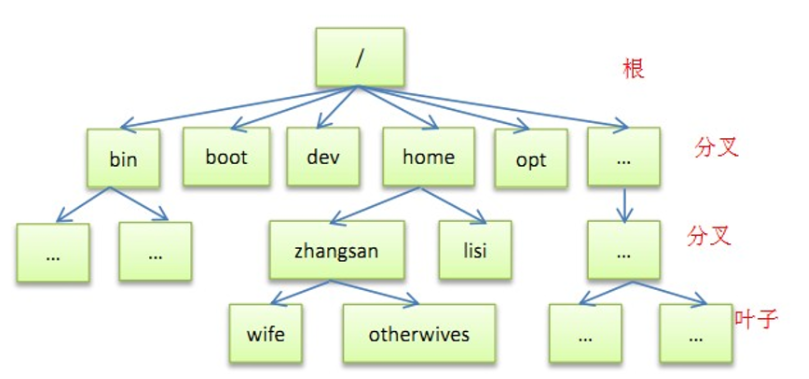
</figure>


 <figure class="thumbnails">
    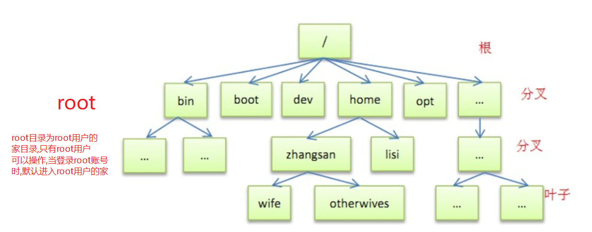
</figure>

| 常用目录                      | 说明                                                         |
| ----------------------------- | ------------------------------------------------------------ |
| /                             | 系统的根,是Linux最顶级的目录                                 |
| root                          | 管理员工作目录，管理员登录后就自动进入这个目录               |
| home                          | 普通用户登录以后进入的目录，每个普通用户在这个目录下都会有自己的目录 |
| bin                           | 今天要学习的命令所在的目录                                   |
| etc ★★★                       | 系统或软件配置文件所有在目录                                 |
| usr(Unix System Resource) ★★★ | 多用户共享的目录(安装软件的目录)                             |

Linux下文件不同颜色表示的含义

| 颜色                                 | 说明                      |
| ------------------------------------ | ------------------------- |
| **白色**                             | 普通文件                  |
| <font color="blue">**深蓝色**</font> | 目录(文件夹)              |
| <font color="red">**红色**</font>    | 压缩文件                  |
| <font color="00b7ee">**青色**</font> | 链接，类似windows快捷方式 |
| <font color="orange">**橙色**</font> | 设备文件                  |
| <font color='green'>**绿色**</font>  | 可执行文件                |

命令提示符说明


 <figure class="thumbnails">
    
</figure>

==在Linux中没有文件夹的概念,一切资源都叫文件.==为了方便我们的学习,我们还管文件夹叫文件夹,压缩包叫压缩包

## 2、目录操作

### 命令的格式

```java
命令 -[参数]
```

### 【1】切换目录

```properties
命令： cd
		.  :当前目录，运行可执行文件的时候需要
		.. :上一级目录
		~  :可以省略，切换到用户主目录 
					如果是管理员：切换到root目录，
					如果是普通用户：切换到home/用户名
		-  :切换到上一个目录，相当于后退
------------------
cd 目录  相对于当前所在的目录,在当前目录下找子目录
cd /目录 绝对定位,直接从根目录下找对应的目录
```


 <figure class="thumbnails">
    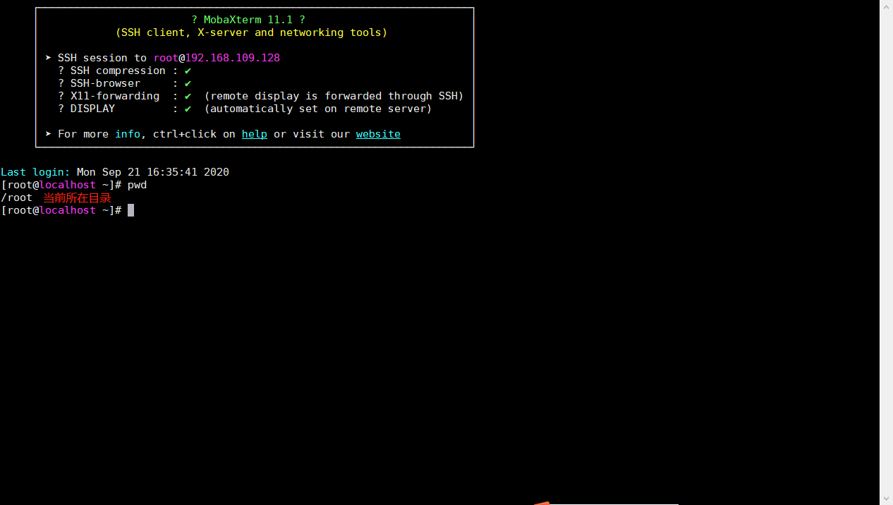
</figure>

切换user目录


 <figure class="thumbnails">
    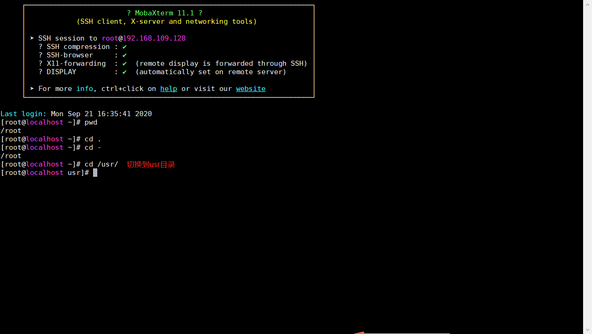
</figure>

回到根目录：


 <figure class="thumbnails">
    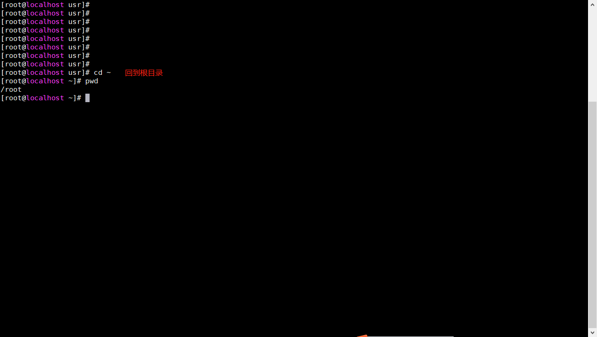
</figure>

回到上一个目录

 <figure class="thumbnails">
    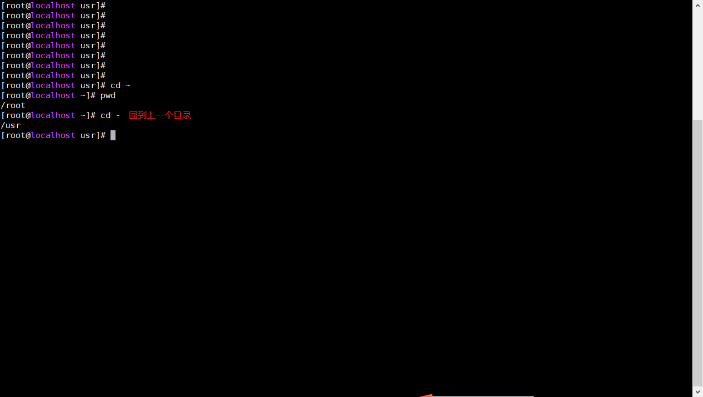
</figure>

### 【2】创建目录

创建文件夹

```properties
命令: 
单层目录:mkdir 目录名
多个目录:mkdir 目录名A 目录名B
多层目录:mkdir -p A/B/C
```

单个目录


 <figure class="thumbnails">
    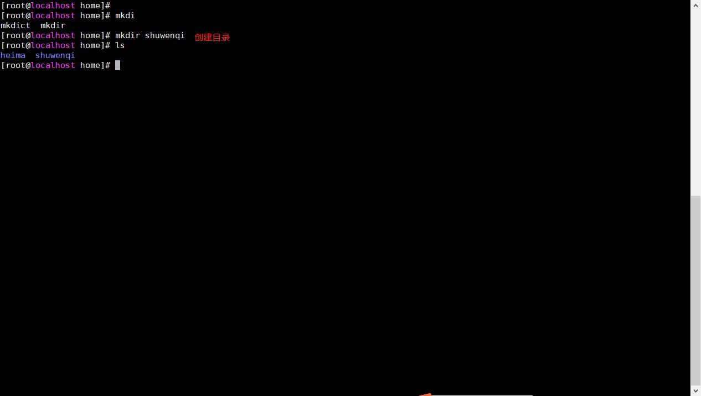
</figure>

多个目录


 <figure class="thumbnails">
    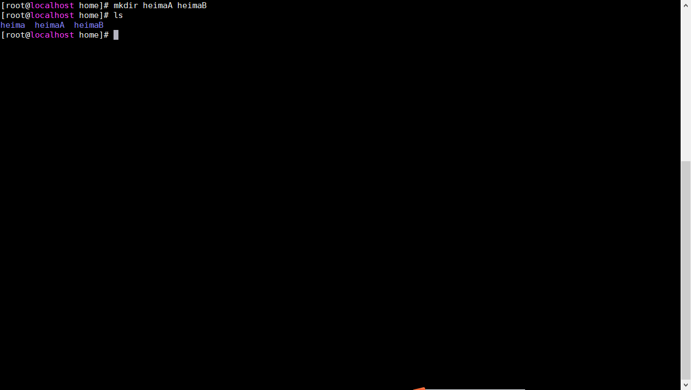
</figure>


多层目录


 <figure class="thumbnails">
    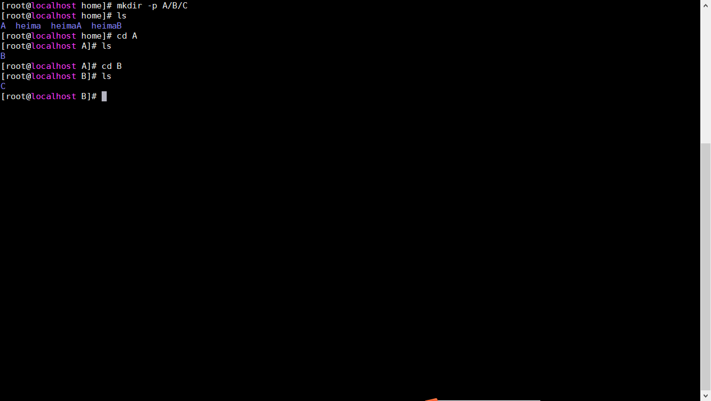
</figure>

### 【3】查看目录

```properties
命令: ls 查看文件
命令: ls -l 可以看到该目录下的所有目录和文件的详细信息===>简写ll
命令: ls -a 可以看到该目录下的所有文件和目录，包括隐藏的
```

查看文件

 <figure class="thumbnails">
    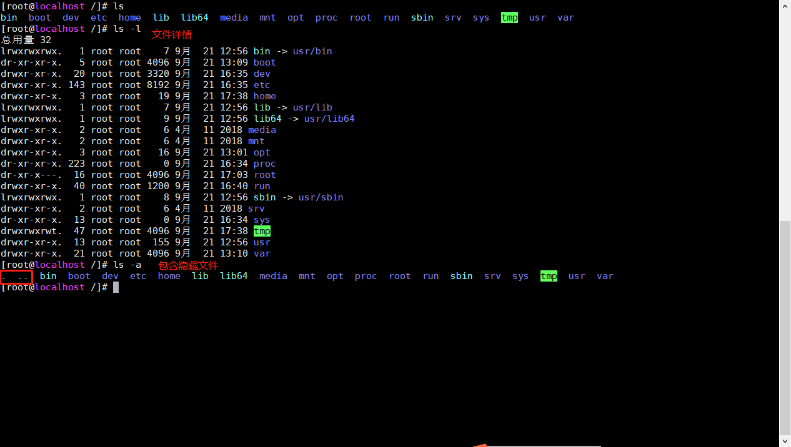
</figure>

ll  为ls -l 的简写方式


 <figure class="thumbnails">
    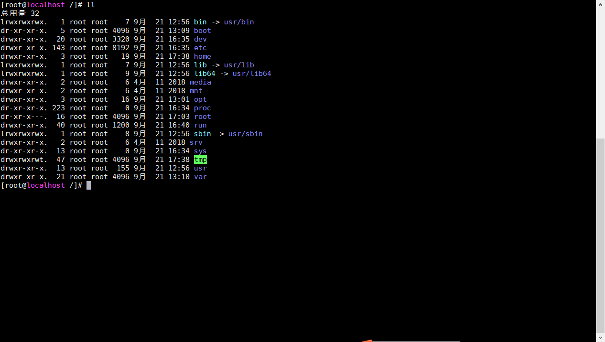
</figure>

### 【4】搜索目录

```properties
命令: find 目录 -name 文件名称
eg:	find / -name 'aa*'
		从根目录下递归查询以aa开头的文件
```


 <figure class="thumbnails">
    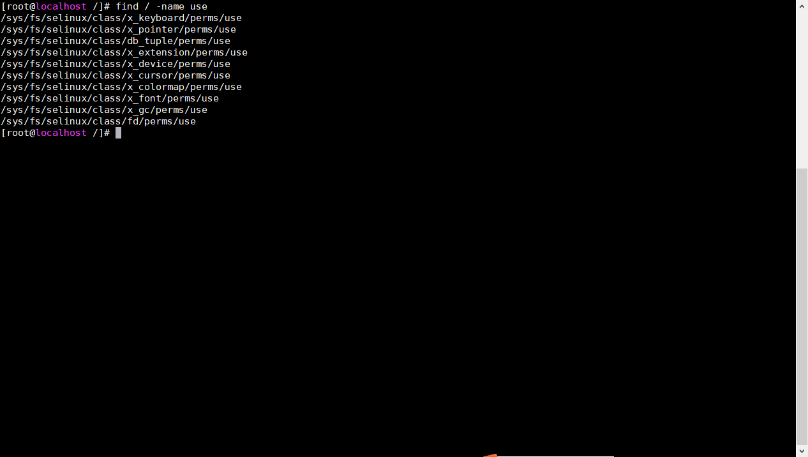
</figure>

### 【5】编辑目录

```properties
命令: mv 目录名称 新目录名称
	 mv的语法不仅可以对目录进行重命名 而且也可以对各种文件，压缩包等进行 重命名的操作
```


 <figure class="thumbnails">
    
</figure>

### 【6】移动目录

```properties
命令: mv 目录名称 目录新位置
```

在home目录下建立目录test和newTest

```properties
命令: mkdir test newTest
```


 <figure class="thumbnails">
    
</figure>

移动test到newTest

```properties
命令: mv test /home/newTest
	 mv语法不仅可以对目录进行剪切操作，对文件和压缩包等都可执行剪切操作*
```


 <figure class="thumbnails">
    
</figure>

### 【7】拷贝目录

把/home/newTest/test 文件拷贝到 /home

```properties
命令: cp -r 目录名称 目录拷贝的目标位置    r代表递归
	 cp命令不仅可以拷贝目录还可以拷贝文件，压缩包等，拷贝文件和压缩包时不用-r表示递归**
```


 <figure class="thumbnails">
    
</figure>

### 【8】删除目录

```properties
命令：rm [-rf] 目录      r:表示递归     f:表示强制
	 rm不仅可以删除目录，也可以删除其他文件或压缩包，为了方便大家的记忆，无论删除任何目录或文件，都直接使用rm -rf 目录/文件/压缩包
```


 <figure class="thumbnails">
    
</figure>

## 3、文件操作

### 【1】创建文件

```properties
命令:touch 文件名称 
	 创建的文件为一个没有内容的文件
```

在test目录中创建test.txt文件


 <figure class="thumbnails">
    
</figure>

### 【2】查看文件

```properties
复制一个系统文件到当前目录:
		cp -r /etc/sudo.conf ./

命令: cat  文件名称 
	直接跳到最后一屏内容
命令: more 文件名称 
	可以显示百分比，回车可以向下一行，	空格可以向下一页，q可以退出查看
命令: less 文件名称 
	可以使用键盘上的PgUp和PgDn向上	和向下翻页，q结束查看
命令: tail -10 文件名称 
	查看/etc/sudo.conf文件的后10行
命令: head -10 文件名称
	查看指定文件的前n行
```


 <figure class="thumbnails">
    
</figure>

### 【3】编辑文件★

```properties
命令: vim 或 vi 文件
	vim 文件名(打开文件)  --->  
	按 i/a/o (进入编辑模式)   ---> 
	编辑文件   --->  
	按esc(一个键),退出编辑模式  ---> 
	按： (进入低行模式)  ---> 
	按 wq(写入并退出)  或 q!(强制退出不保存)  或 wq!(强制写入并退出)  
```

/test下的aaa.txt文件，使用vim aaa.txt


 <figure class="thumbnails">
    
</figure>


但此时并不能编辑，因为此时处于命令模式，点击键盘i/a/o进入编辑模式，可以	编辑文件


 <figure class="thumbnails">
    
</figure>

编辑完成后，按下Esc，退回命令模式


 <figure class="thumbnails">
    
</figure>

此时文件虽然已经编辑完成，但是没有保存，需输入冒号：进入底行模式，在底行模	式下输入wq代表写入内容并退出，即保存；输入q!代表强制退出不保存


 <figure class="thumbnails">
    
</figure>

```java
vim 文件名(打开文件) ---->  按 i/a/o (进入编辑模式) ----> 编辑文件  ---->  按 esc (退出编辑模式) ---->  按 : (进入低行模式)  ---->  按 wq (写入并退出)  或 按q!(强制退出不保存) 或 按wq!(强制写入,一般针对只读文件的写入)
```

### 【4】删除文件

同目录删除：熟记 ==rm -rf 文件== 即可

## 4、压缩文件操作

### 【1】打包并压缩（了解)

#### 【1.1】分类

Windows的压缩文件的扩展名  .zip或.rar
linux中的打包文件的扩展名：.tar
linux中的压缩文件的扩展名：.gz
linux中打包并压缩的文件的扩展名： .tar.gz

#### 【1.2】操作

```properties
命令:tar -zcvf 打包压缩后的文件名 要打包的文件
		z：调用gzip压缩命令进行压缩
  	c：打包文件
  	v：显示运行过程
  	f：指定文件名
```

实例：打包并压缩/test下的所有文件test.txt  压缩后的压缩包指定名称为test.tar.gz

```properties
命令:tar -zcvf test.tar.gz test.txt
```


 <figure class="thumbnails">
    
</figure>

实例：打包并压缩/test下的所有文件 压缩后的压缩包指定名称为xxx.tar.gz

```properties
命令:tar -zcvf test.tar.gz /test/*
```


 <figure class="thumbnails">
    
</figure>

### 【2】解压压缩包(重点)

```properties
命令: tar -xvf  解压文件名称
     x: 代表解压
     v: 显示运行过程
  	 f: 指定文件名
```

示例：将/test下的test.tar.gz解压到当前目录下


 <figure class="thumbnails">
    
</figure>

示例：将/test下的xxx.tar.gz解压到根目录/home下

```properties
命令: tar -xvf  解压文件名称
     x: 代表解压
     v: 显示运行过程
  	 f: 指定文件名
  	-C:代表指定解压的位置
  	 
```


 <figure class="thumbnails">
    
</figure>

## 5、其他命令

### 【1】显示工作目录

```properties
命令:pwd  显示当前所在的目录的绝对路径
```


 <figure class="thumbnails">
    
</figure>

### 【2】查看进程

```properties
命令: ps -ef 显示所有的进程
```


 <figure class="thumbnails">
    
</figure>

### 【3】kill命令

```properties
命令: kill -9 pid （pid是进程的id）结束指定的进程
```

### 【4】搜索命令

```properties
命令: grep [参数] 要搜索的字符串 被搜索的文件
参数:
	1. -i 搜索时不区分大小写，大小写不敏感
	2. -n 显示匹配行及行号，大小写敏感
	3. -v 显示不匹配行及行号，大小写敏感
```

示例：搜索/usr/sudo.conf文件中包含字符串to的行


 <figure class="thumbnails">
    
</figure>

### 【5】管道命令

```properties
命令:|   将前一个命令的输出作为本次目录的输入
```

示例：查看当前系统中所有的进程中包括system字符串的进程


 <figure class="thumbnails">
    
</figure>

### 【6】网络通信命令

```properties
命令:ifconfig 查看当前系统的网卡信息
```


 <figure class="thumbnails">
    
</figure>

```properties
命令: ping  查看与某台机器的连接情况 
```


 <figure class="thumbnails">
    
</figure>

```properties
命令: netstat -an | grep 80 查看当前系统的端口使用 
```

全部信息：


 <figure class="thumbnails">
    
</figure>

80端口信息：


 <figure class="thumbnails">
    
</figure>

### 【7】关机命令

```properties
命令: reboot 重启命令
命令: shutdown now 立即关机
```

## 6、权限命令

### 【1】文件类别含义


 <figure class="thumbnails">
    
</figure>


 <figure class="thumbnails">
    
</figure>

| **字母** | **说明**     |
| -------- | ------------ |
| **d**    | 这是一个目录 |
| **-**    | 这是一个文件 |
| **l**    | 这是一个链接 |


 <figure class="thumbnails">
    
</figure>

### 【2】操作方式

```properties
修改文件/目录的权限的命令：
	命令格式: chmod u=rwx,g=rwx,o=r-- 文件的名称
		u: user属主
		g: group属组
		o: other其他
		- : 可以进行占位  
		+ : 可以添加新的权限
命令:chmod u=rwx,g=rwx,o=rwx test/
```


 <figure class="thumbnails">
    
</figure>

```properties
数字表示权限法:
		r: 4
    w: 2
    x: 1
    命令: chmod 764 文件名称
				7 = 4 + 2 + 1
        6 = 4 + 2
        1 = 1
命令:chmod 761 test
```


 <figure class="thumbnails">
    
</figure>

## 7、防火墙设置

### 【1】简介

防火墙:
	作用: 保证电脑的安全,在请求进入电脑前,进行一次拦截
	Centos7: firewalld   防火墙的默认状态为开启状态,不建议关闭
	Centos6: iptables
	在Linux防火墙中默认只开启了一个端口: 22 端口

### 【2】基本操作

#### 【2.1】查看防火墙状态

```properties
命令:systemctl status firewalld 
或者:firewall-cmd --state
```


 <figure class="thumbnails">
    
</figure>


 <figure class="thumbnails">
    
</figure>

#### 【2.2】关闭防火墙

```properties
命令:systemctl stop firewalld 关闭防火墙
```


 <figure class="thumbnails">
    
</figure>

#### 【2.3】启动防火墙

```properties
命令:systemctl start firewalld  启动防火墙
```


 <figure class="thumbnails">
    
</figure>

#### 【2.4】重启防火墙

```properties
命令:systemctl restart firewalld 重启防火墙
```

#### 【2.5】开机启动方式

```properties
命令:systemctl enable firewalld 设置开机自启动
命令:sytemctl disable firewalld 停止并禁用开机启动:
```


 <figure class="thumbnails">
    
</figure>

#### 【2.6】端口设置

```java
允许某个端口访问: 公布端口
	注意: --permanent 意思是:永久生效
	firewall-cmd --zone=public --add-port=80/tcp --permanent
	配置完端口后,需要重启防火墙
	// 展示防火墙中公布的所有端口
	firewall-cmd --zone=public --list-ports
	// 删除防火墙中公布的端口
	firewall-cmd --zone=public --remove-port=80/tcp --permanent	
```

添加80端口


 <figure class="thumbnails">
    
</figure>

重启防火墙，查看防火墙信息：

```properties
命令:firewall-cmd --zone=public --list-ports
```


 <figure class="thumbnails">
    
</figure>

删除80端口

```properties
密令:firewall-cmd --zone=public --remove-port=80/tcp --permanent	
```


 <figure class="thumbnails">
    
</figure>

## 8、基础命令总结

```properties
命令: cd
		.  :当前目录，运行可执行文件的时候需要
		.. :上一级目录
		~  :可以省略，切换到用户主目录 如果是管理员：切换到root目录，如果是普通用户：切换到home/用户名
		-  :切换到上一个目录，相当于后退
            
命令: mkdir
		单层目录:mkdir 目录名
		多个目录:mkdir 目录名A 目录名B
		多层目录:mkdir -p A/B/C
    
命令: ls 查看文件
命令: ls -l 可以看到该目录下的所有目录和文件的详细信息===>简写ll
命令: ls -a 可以看到该目录下的所有文件和目录，包括隐藏的
    
命令: find 目录 -name 文件名称
    
命令: mv 目录名称 新目录名称
	 	mv的语法不仅可以对目录进行重命名 而且也可以对各种文件，压缩包等进行 重命名的操作
	 
命令: cp -r 目录名称 目录拷贝的目标位置    r代表递归
	 	cp命令不仅可以拷贝目录还可以拷贝文件，压缩包等，拷贝文件和压缩包时不用-r表示递归
     
命令:touch 文件名称 
	 	创建的文件为一个没有内容的文件     

命令: cat  文件名称 直接跳到最后一屏内容
命令: more 文件名称 可以显示百分比，回车可以向下一行，	空格可以向下一页，q可以退出查看
命令: less 文件名称 可以使用键盘上的PgUp和PgDn向上	和向下翻页，q结束查看
命令: tail -10 文件名称 查看/etc/sudo.conf文件的后10行，Ctrl+C结束

命令: vim 或 vi 文件
        vim 文件名(打开文件)  --->  
        按 i/a/o (进入编辑模式)   ---> 
        编辑文件   --->  
        按esc(一个键),退出编辑模式  ---> 
        按： (进入低行模式)  ---> 
        按 wq(写入并退出)  或 q!(强制退出不保存)  或 wq!(强制写入并退出)  
 
命令: tar -zcvf 打包压缩后的文件名 要打包的文件
        z:调用gzip压缩命令进行压缩
        c:打包文件
        v:显示运行过程
        f:指定文件名 

命令: tar -xvf  解压文件名称
        x:代表解压
        v:显示运行过程
        f:指定文件名

命令: pwd  显示当前所在的目录的绝对路径
命令: ps -ef 显示所有的进程
命令: kill -9 pid （pid是进程的id）结束指定的进程

命令: grep [参数] 要搜索的字符串 被搜索的文件
        -i 搜索时不区分大小写，大小写不敏感
        -n 显示匹配行及行号，大小写敏感
        -v 显示不匹配行及行号，大小写敏感
 
命令: |   将前一个命令的输出作为本次目录的输入

命令: ifconfig 查看当前系统的网卡信息

命令: ping  查看与某台机器的连接情况 

命令: reboot 重启命令
命令: shutdown now 立即关机

修改文件/目录的权限的命令：
	命令格式: chmod u=xxx,g=xxx,o=xxx 文件的名称
		u: user属主
		g: group属组
		o: other其他
		- : 可以进行占位  
		+ : 可以添加新的权限
命令:chmod u=rwx,g=rwx,o=rwx test/

数字表示权限法:
	r: 4
    w: 2
    x: 1
    命令: chmod 764 文件名称
		7 = 4 + 2 + 1
        6 = 4 + 2
        1 = 1
命令:chmod 761 test/

命令:systemctl status firewalld
或者:firewall-cmd --state

命令:systemctl stop firewalld 关闭防火墙

命令:systemctl start firewalld  启动防火墙

命令:systemctl restart firewalld 重启防火墙

命令:systemctl enable firewalld 设置开机自启动
命令:sytemctl disable firewalld 停止并禁用开机启动:

允许某个端口访问: 公布端口
	注意: --permanent 意思是:永久生效
	firewall-cmd --zone=public --add-port=80/tcp --permanent
	配置完端口后,需要重启防火墙
	// 展示防火墙中公布的所有端口
	firewall-cmd --zone=public --list-ports
	// 删除防火墙中公布的端口
	firewall-cmd --zone=public --remove-port=80/tcp --permanent	
```

## 9、配置Linux的静态ip地址

```java
BOOTPROTO=static 	#启动网卡时指定获取IP地址的方式
  常用取值 : dhcp 		（自动获取ip地址,ip地址,网关,子网掩码等信息无需设置）
  常用取值 : static 		（静态ip,如需要访问网络,需要自己设置ip地址等信息）
  其他取值 : none 		（不指定,如需要访问网络,,需要自己设置ip地址等信息）
IPADDR=192.168.190.132 	#ip地址
GATEWAY=192.168.1.1 	#网关(网络关卡)
NETMASK=255.255.255.0 	#子网掩码
网卡的配置文件路径:
	cd	/etc/sysconfig/network-scripts/
    vim  ifcfg-ens33 
    修改ip获取方式为 static,然后在最下方添加以上三句话
```

## 10、域名映射

```java
http://localhost:8080 : 为什么在自己电脑上访问localhost可以找到自己的本机呢?
		localhost为本机的域名,在windows系统中做了域名映射
    域名映射配置文件的位置: C:\Windows\System32\drivers\etc
        hosts文件
===========================
Linux; 配置域名映射
  	/etc/hosts
  			ip地址 域名
  			192.168.190.132 itbaima
```

## 11、快照与克隆

### Linux快照

将Linux系统分节点备份保存.  在Linux启动状态下就可以进行.


 <figure class="thumbnails">
    
</figure>

### Linux系统克隆:

克隆: 将一个Linux系统复制一份, 操作之前需要将Linux关机


 <figure class="thumbnails">
    
</figure>


 <figure class="thumbnails">
    
</figure>


 <figure class="thumbnails">
    
</figure>


 <figure class="thumbnails">
    
</figure>


 <figure class="thumbnails">
    
</figure>


 <figure class="thumbnails">
    
</figure>


 <figure class="thumbnails">
    
</figure>


 <figure class="thumbnails">
    
</figure>

# 第四章 软件安装

```java
将来我们要将我们的项目部署到Linux服务器上,所以需要在Linux服务器上先搭建代码运行的环境
-----------软件安装
jdk
mysql
tomcat
redis
nginx
```

# 第五章 nginx

```java
nginx:
		作用:
				部署静态资源
          	直接将静态资源部署到nginx服务器上,就可以被外界访问了
          	
          	location / {
                  # root   html;
            			root 	D:\nginx113\project;
                  # index  index.html index.htm;
            			index hello.html;
             }
        负载均衡(反向代理)
          	nginx.conf配置
          			upstream tomcatpool {
                  server localhost:8080 weight=5;
                  server localhost:8081 weight=3;
                  server localhost:8082 weight=2;
                }
								server {
                  	location / {
                        # root   html;
                        # root 	D:/nginx110/project;
                        proxy_pass http://tomcatpool;
                        index  index.html index.htm;
                        # index hello.html;
                    }
                }

----------------
Windows:
		启动: start nginx.exe
    重启: nginx -s reload
    停止: nginx -s stop
Linux:

```


  <figure class="thumbnails">
    
</figure>

 

  <figure class="thumbnails">
    
</figure>