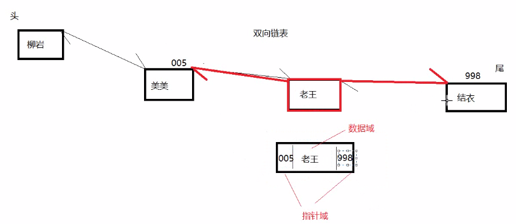
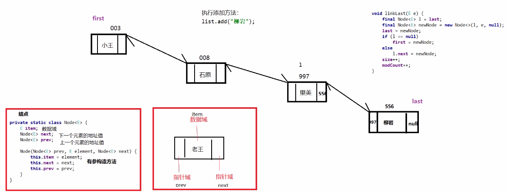
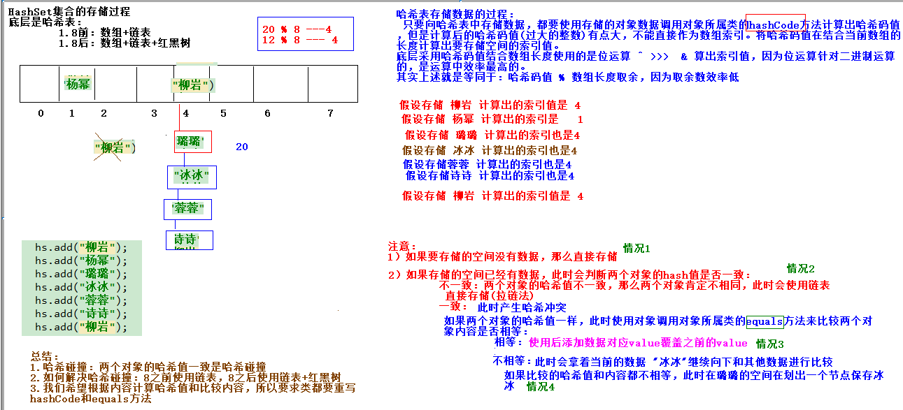

# 第一章 List接口

我们掌握了Collection接口的使用后，再来看看Collection接口中的子类，他们都具备那些特性呢？

接下来，我们一起学习Collection中的常用几个子接口（`java.util.List`集合、`java.util.Set`集合）。

## 1.1 List接口介绍

`java.util.List`接口继承自`Collection`接口，是单列集合的一个重要分支，习惯性地会将实现了`List`接口的对象称为List集合。在List集合中允许出现重复的元素，所有的元素是以一种线性方式进行存储的，在程序中可以通过索引来访问集合中的指定元素。另外，List集合还有一个特点就是元素有序，即元素的存入顺序和取出顺序一致。

看完API，我们总结一下：

List接口特点：

1. 它是一个元素存取有序的集合。例如，存元素的顺序是11、22、33。那么集合中，元素的存储就是按照11、22、33的顺序完成的）。
2. 它是一个带有索引的集合，通过索引就可以精确的操作集合中的元素。
3. 集合中可以有重复的元素，通过元素的equals方法，来比较是否为重复的元素。

> tips:我们之前已经学习过List接口的子类java.util.ArrayList类，该类中的方法都是来自List中定义。


## 1.2 List接口中常用方法

List作为Collection集合的子接口，不但继承了Collection接口中的全部方法，而且还增加了一些根据元素索引来操作集合的特有方法，如下：

- `public void add(int index, E element)`: 将指定的元素，添加到该集合中的指定位置上。
- `public E get(int index)`:返回集合中指定位置的元素。
- `public E remove(int index)`: 移除列表中指定位置的元素, 返回的是被移除的元素。
- `public E set(int index, E element)`:用指定元素替换集合中指定位置的元素,返回值的更新前的元素。

List集合特有的方法都是跟索引相关。

代码演示：

~~~java
public class Demo_List {
    public static void main(String[] args) {

        //创建对象
        //多态写法(之能调用父类中定义的共性方法,不能调用子类中的特有方法)
        //Collection<String> c = new ArrayList<>();

        //创建List
        List<String> list = new ArrayList<>();

        //增加
        list.add("柳岩");
        list.add("美美");
        //将石原里美添加到索引是1的位置，美美的索引变为2 集合数据：柳岩 石原里美 美美
        list.add(1,"石原里美");

        //删除(返回的是被删除的元素)
        list.remove(2);                      //删掉的是“美美”

        //修改(返回的是被替换的元素)
        list.set(0, "新垣结衣");//把“柳岩”修改成了“新垣结衣”

        //查询
        String s = list.get(1);
        System.out.println(s);    //石原里美
        
        System.out.println(list);  //[新垣结衣, 石原里美]
        
    }
}
~~~

> tips:我们之前学习Colletion体系的时候，发现List集合下有很多集合，它们的存储结构不同，这样就导致了这些集合它们有各自的特点，供我们在不同的环境下使用，那么常见的数据结构有哪些呢？在下一章我们来介绍：


## 1.3 ArrayList集合

`java.util.ArrayList`集合数据存储的结构是数组结构。元素增删慢，查找快，由于日常开发中使用最多的功能为查询数据、遍历数据，所以`ArrayList`是最常用的集合。

许多程序员开发时非常随意地使用ArrayList完成任何需求，并不严谨，这种用法是不提倡的。


## 1.4 LinkedList集合

`java.util.LinkedList`集合数据存储的结构是链表结构。方便元素添加、删除的集合。

> LinkedList是一个双向链表，那么双向链表是什么样子的呢，我们用个图了解下




说明：

1.LinkedList集合底层是由双向链表组成的

2.双向链表的节点由三部分组成，一部分是数据域存储数据的，一部分是指针域分别存储前一个和后一个节点的地址

3.链表有头和尾组成，我们可以针对链表的头和尾进行操作，可以从链表头或者链表尾开始操作。


实际开发中对一个集合元素的添加与删除经常涉及到首尾操作，而LinkedList提供了大量首尾操作的方法。这些方法我们作为**了解即可**：

- `public void addFirst(E e)`:将指定元素插入此列表的开头。
- `public void addLast(E e)`:将指定元素添加到此列表的结尾。
- `public E getFirst()`:返回此列表的第一个元素。
- `public E getLast()`:返回此列表的最后一个元素。
- `public E removeFirst()`:移除并返回此列表的第一个元素。
- `public E removeLast()`:移除并返回此列表的最后一个元素。
- `public E pop()`:从此列表所表示的堆栈处弹出一个元素。
- `public void push(E e)`:将元素推入此列表所表示的堆栈。
- `public boolean isEmpty()`：如果列表不包含元素，则返回true。

LinkedList是List的子类，List中的方法LinkedList都是可以使用，这里就不做详细介绍，我们只需要了解LinkedList的特有方法即可。在开发时，LinkedList集合也可以作为堆栈，队列的结构使用。

代码演示：

```java
public class Demo03_LinkedList {
    public static void main(String[] args) {
        //创建LinkedList对象
        LinkedList<String> list = new LinkedList<>();

        list.add("石原");
        list.add("里美");
        list.add("柳岩");

        //void addFirst(E e)
        //往开头添加元素
        list.addFirst("老王");    //[老王, 石原, 里美, 柳岩]

        //void addLast(E e)
        //往末尾添加元素
        list.addLast("小王");     //[老王, 石原, 里美, 柳岩, 小王]

        //E getFirst()
        //获取开头的元素
        String s = list.getFirst();  //老王

        //E getLast()
        //获取末尾的元素
        String s2 = list.getLast();  //小王

        //E removeFirst()
        //删除开头的元素
        list.removeFirst();
        //System.out.println(list);  //[石原, 里美, 柳岩, 小王]

        //E removeLast()
        //删除末尾的元素
        list.removeLast();
        list.removeLast();
        System.out.println(list);   //[石原, 里美]

        //E pop()
        //模拟栈的结构,弹出第一个元素
        String pop = list.pop();
        System.out.println(pop);  //石原
        System.out.println(list); //[里美]

        //void push(E e)
        //模拟栈的结构,推入一个元素
        list.push("老王");
        System.out.println(list); //[老王, 里美]

        
    }
}
```

说明：

1.这么多方法感觉有很多是相似的。。其实就是同样的原理换了个名字而已

例如：

​	1)pop() 方法表示弹出栈结构的第一个元素，而removeFirst()方法也表示删除第一个元素。查看pop方法源码

~~~java
public E pop() {
        return removeFirst();
}
~~~

​	2)add()方法表示向集合最后添加，addLast()也是向集合最后添加。

add()方法源码：

~~~java
public boolean add(E e) {
    	//调用linkLast方法添加数据
        linkLast(e);
        return true;
    }
~~~

addLast()方法源码：

~~~java
public void addLast(E e) {
    	//调用linkLast方法添加数据
        linkLast(e);
    }
~~~

这些方法能看明白作用就可以了。不需要去记忆和研究。


## 1.5 LinkedList源码分析

代码演示：

~~~java
public class Test02 {
    public static void main(String[] args) {
        //创建LinkedList对象
        LinkedList<String> list = new LinkedList<>();

        list.add("小王");
        list.add("石原");
        list.add("里美");
        list.add("柳岩");
        System.out.println("list = " + list);
    }
}
~~~


- LinkedList的源码分析：

  ```java
  public class LinkedList<E> extends AbstractSequentialList<E>
      				implements List<E>, Deque<E>, Cloneable, java.io.Serializable{
      transient int size = 0;
      /**
       *存储第一个节点的引用
       */
      transient Node<E> first;
  
      /**
       * 存储最后一个节点的引用
       */
      transient Node<E> last;
      
       //......
      //LinkedList的内部类Node类源码分析
      private static class Node<E> {
          E item;//被存储的对象
          Node<E> next;//下一个节点地址值
          Node<E> prev;//前一个节点地址值
  
          //构造方法
          Node(Node<E> prev, E element, Node<E> next) {
              this.item = element;
              this.next = next;
              this.prev = prev;
          }
      }
      //......
      //LinkedList的add()方法源码分析
      public boolean add(E e) {
          linkLast(e);//调用linkLast()方法
          return true;//永远返回true
  	}
      void linkLast(E e) {
          final Node<E> l = last;//一个临时变量，存储最后一个节点的地址值
          /*
          	这里调用Node类的构造方法：
          	·1.Node<E> prev = l;将上个节点的地址值赋值给新的节点前面的指针域
          	 2.E element = e；将元素e存储到新的节点的数据域中
          	 3.Node<E> next = null 新的节点作为链表中最后一个节点的下一个指针域为null
          	Node(Node<E> prev, E element, Node<E> next) {
                  this.item = element;
                  this.next = next;
                  this.prev = prev;
          	}
          */
          final Node<E> newNode = new Node<>(l, e, null);//创建一个Node对象
          last = newNode;//将新Node对象地址值存储到last
          if (l == null)//如果没有最后一个元素，说明当前是第一个节点。l等于null说明集合是空的，还没添			加数据
              first = newNode;//将新节点存为第一个节点
          else
              l.next = newNode;//说明不是第一个节点，将新的节点地址值赋值到上个节点的的next成员
          size++;//总数量 + 1
          modCount++;//修改一次集合，该变量就会+1
      }
  }
  ```

  

  

- 


# 第二章  Collections类

## 2.1 Collections常用功能

- `java.utils.Collections`是集合工具类，用来对集合进行操作。

  常用方法如下：


- `public static void shuffle(List<?> list) `:打乱集合顺序。
- `public static <T> void sort(List<T> list)`:将集合中元素按照默认规则排序(从小到大)。
- `public static <T> void sort(List<T> list，Comparator<? super T> c)`:将集合中元素按照指定规则排序。

- 代码示例

  ```java
  public class Demo04 {
      public static void main(String[] args) {
          //Collections是一个工具类,里面的方法都是静态方法
          ArrayList<Integer> list = new ArrayList<>();
          //添加元素
          list.add(123);
          list.add(456);
          list.add(111);
          list.add(10);
          list.add(789);
  
          System.out.println("打印集合" + list);
  
          //static void shuffle(List<?> list)
          //随机打乱集合元素的顺序
          Collections.shuffle(list);
  
          System.out.println("乱序之后" + list);
  
          //static <T> void sort(List<T> list)
          //完成集合的排序(从小到大)
          Collections.sort(list);
  
          System.out.println("排序之后" + list);
          /*
              打印集合[123, 456, 111, 10, 789]
              乱序之后[10, 789, 111, 456, 123]
              排序之后[10, 111, 123, 456, 789]
           */
      }
  }
  ```

- 字符串的比较规则

  -  字符串是从前往后一个一个比较,如果第一个字符相同,就比较第二个字符，以此类推
  -  如果从前往后一个短的字符串是另一个长的字符串的子字符串，就比较长度。例如："abc"  "abcdef"

  ```java
         ArrayList<String> list = new ArrayList<>();
          list.add("abc");
          list.add("ABC");
          list.add("AAA");
          list.add("abcd");
  
          //排序
          //看一看字符串是怎么排序的？
          Collections.sort(list);
  
          /*
              字符串是从前往后一个一个比较字符,如果第一个字符相同,就比较第二个字符
              如果字符相同就比较长度
           */        //                     65   97
          System.out.println(list); //[AAA, ABC, abc, abcd]
      }
  }
  ```

我们的集合按照默认的自然顺序进行了升序排列，如果想要指定顺序那该怎么办呢？


## 2.2 Comparator比较器

我们已经使用了集合工具类Collections中带一个参数的排序方法，发现两个参数的排序方法还没有使用，接下来我们学习下带两个参数的排序方法：

~~~java
public static <T> void sort(List<T> list，Comparator<? super T> )方法灵活的完成，这个里面就涉及到了Comparator这个接口，位于java.util包下，排序是comparator能实现的功能之一,该接口代表一个比较器，比较器具有可比性！顾名思义就是做排序的，通俗地讲需要比较两个对象谁排在前谁排在后，那么比较的方法就是：
	 public int compare(String o1, String o2)：比较其两个参数的顺序。
		1.o1 - o2 升序
		2.o2 - o1 降序
~~~

- compare方法的底层实现原理解释

  ```java
   		说明：该方法要求必须返回一个int类型的整数，然后底层根据返回数据的正负进行比较大小排序。
  		  参数
                  o1表示后加入的值 (要比较的值)
                  o2表示已经添加的值(已经比较过的值)
              返回值
                  如果返回值是正数,就会把元素移动到后面(代表o1>o2)
                  如果返回值是负数,就会把元素移动到前面(代表o1<o2)
                  如果返回值是0,就表示两个元素相同,就不移动(代表o1=o2)
  ```

- 排列整数类型

  - 需求：对以下数据进行排序

    ~~~java
    123 456 111 10
    ~~~

    

    ```java
    public class Test03 {
        public static void main(String[] args) {
            //我如果想要别的排序的方式怎么办？
            //要求：想要按照从大到小的顺序排。
    
            //创建集合
            ArrayList<Integer> list = new ArrayList<>();
            //添加元素
            list.add(123);
            list.add(456);
            list.add(111);
            list.add(10);
    
            /*
                参数
                    o1表示后加入的值(要比较的值)
                    o2表示已经添加的值(已经比较过的值)
                返回值
                    如果返回值是正数,就会把元素移动到后面(代表o1>o2)
                    如果返回值是负数,就会把元素移动到前面(代表o1<o2)
                    如果返回值是0,就表示两个元素相同,就不移动(代表o1=o2)
               123 456 111 10
                o2 o1
                升序：o1 - o2
               第一次比较：123(o2) 456(o1)---->o1 - o2 大于 0 --->结果：123 456
               第二次比较：123 456 111---》
                    1）456(o2) 111(o1)--》o1 - o2小于0 结果：111 456
                    2）123(o2) 111(o1) 456---->o1 - o2小于0 结果：111 123
                    最后结果是：111 123 456
               第三次比较：111 123 456 10---》
                    1）456(o2) 10(o1) --》o1 - o2小于0 结果：10 456
                    2）123(o2) 10(o1) --》o1 - o2小于0 结果：10 123--->10 123 456
                    2）111(o2) 10(o1) --》o1 - o2小于0 结果：10 111--->10 111 123 456
                降序：o2 - o1
                 1)123 456 111 10
                   o2  o1
                2)456 123  111 10
                      o2  o1
                3)456 123  111 10
                           o2  o1
             */
            //排序
            Collections.sort(list, new Comparator<Integer>() {
                @Override
                public int compare(Integer o1, Integer o2) {
    //                System.out.println("o1 = " + o1);
    //                System.out.println("o2 = " + o2);
                    return o1 - o2;//升序：[10, 111, 123, 456]
    //                return o2 - o1;//降序：[456, 123, 111, 10]
                }
            });
    
            System.out.println(list);
        }
    }
    ```

- 排列自定义类型

  - 按照年龄从小到大排列

    ```java
    //学生类
    public class Student {
        String name;
        int age;
    
        public Student() {
        }
    
        public Student(String name, int age) {
            this.name = name;
            this.age = age;
        }
    
        //方便打印
        @Override
        public String toString() {
            return "Student{" +
                    "name='" + name + '\'' +
                    ", age=" + age +
                    '}';
        }
    }
    ```

    ```java
    package com.itheima.sh.demo_05;
    
    import java.util.ArrayList;
    import java.util.Collections;
    import java.util.Comparator;
    
    public class Test01 {
        public static void main(String[] args) {
            //测试代码
            ArrayList<Student> list = new ArrayList<>();
    
            //添加元素
            Student s1 = new Student("石原里美",18);
            Student s2 = new Student("柳岩",36);
            Student s3 = new Student("新垣结衣",20);
            list.add(s1);
            list.add(s2);
            list.add(s3);
    
            //排序
            Collections.sort(list, new Comparator<Student>() {
                /*
                      参数
                             o1表示后加入的值 (要比较的值)
                             o2表示已经添加的值(已经比较过的值)
                        返回值
                            如果返回值是正数,就会把元素移动到后面      (代表o1>o2)
                            如果返回值是负数,就会把元素移动到前面      (代表o1<o2)
                            如果返回值是0,就表示两个元素相同,就不移动  (代表o1=o2)
                    需求：按照年龄从小到大排列
                     18 36 20
                     o2 o1
                     18 36 20---->18 20 36
                        o2 o1     o2 o1
                 */
                @Override
                //    18 36 20
                //
                public int compare(Student o1, Student o2) {
    
                    return o1.age - o2.age;
                    //   相当于36 - 18     结果是一个正数,就会把o1放在后面
                    //   相当于20 - 36     结果是一个负数,就会把o1放在前面
                    //   相当于20 - 18     结果是一个正数,就会把o1放在后面
                }
            });
            System.out.println(list);
        }
    }
    ```

- 排列自定义类型

  - 按照年龄从小到大排列，如果年龄相同，姓名短的在前，姓名长的在后(就是按照名字长度升序排序)

    ```java
    package com.itheima.sh.demo_05;
    
    import java.util.ArrayList;
    import java.util.Collections;
    import java.util.Comparator;
    
    public class Test02 {
        public static void main(String[] args) {
            //要求：按照年龄从小到大排列，如果年龄相同，姓名短的在前，姓名长的在后
            //创建集合
            ArrayList<Student> list = new ArrayList<>();
            //添加元素
            Student s1 = new Student("石原里美",18);
            Student s2 = new Student("柳岩",36);
            Student s3 = new Student("新垣结衣",20);
            Student s4 = new Student("老王",20);
            list.add(s1);
            list.add(s2);
            list.add(s3);
            list.add(s4);
    
            /*
                   参数
                    o1表示后加入的值 (要比较的值)
                    o2表示已经添加的值(已经比较过的值)
                  返回值
                    如果返回值是正数,就会把元素移动到后面(代表o1>o2)
                    如果返回值是负数,就会把元素移动到前面(代表o1<o2)
                    如果返回值是0,就表示两个元素相同,就不移动(代表o1=o2)
                  要求：按照年龄从小到大排列，如果年龄相同，姓名短的在前，姓名长的在后(就是按照名字长度升序排序)
                    Student s1 = new Student("石原里美",18);
                    Student s2 = new Student("柳岩",36);
                    Student s3 = new Student("新垣结衣",20);
                    Student s4 = new Student("老王",20);
             */
            //排序
            Collections.sort(list, new Comparator<Student>() {
                @Override
                public int compare(Student o1, Student o2) {
                    //先按照年龄排列
                    if(o1.age != o2.age){
                        //18 20 36
                        return o1.age - o2.age;
                    }
    
                    //如果年龄不同,上面就已经返回了结果,程序就不会往下走了
                    //只有在年龄相同的情况下,程序才会继续往下执行
                    //年龄相同,再按照姓名长度排序
                    return o1.name.length() - o2.name.length();
    
                }
            });
    
            System.out.println(list);
        }
    }
    
    ```


## 2.3 可变参数

在**JDK1.5**之后，如果我们定义一个方法需要接受多个参数，并且多个参数类型一致，我们可以对其简化.

**格式：**

```
修饰符 返回值类型 方法名(参数类型... 形参名){  }
```

**代码演示:**

```java
  public class ChangeArgs {
   public static void main(String[] args) {
        //调用
        method(10,20);  //传入2个整数

        method();      //传入了0个整数

        method(10,20,30,40,50); //传入了5个整数

        int[] arr = {11,22,34};
        method(arr);        //也可以传入一个数组
    }


    //要求：想要接受任意个整数
    public static void method(int... a){
        //可变参数的本质就是一个数组
        for (int i = 0; i < a.length; i++) {
            System.out.println(a[i]);
        }
    }
}
```

**注意：**

​	1.一个方法只能有一个可变参数

​	2.如果方法中有多个参数，可变参数要放到最后。

​	3.可变参数的本质其实就是一个数组

- 可变参数的优势：

  ```
  传参更方便,可以不传参,可以传递任意个参数,也可以直接传入数组
  ```


**应用场景: Collections**

​	在Collections中也提供了添加一些元素方法：

​	`public static <T> boolean addAll(Collection<T> c, T... elements)  `:往集合中添加一些元素。

**代码演示:**

```java
public class CollectionsDemo {
	public static void main(String[] args) {
      ArrayList<Integer> list = new ArrayList<Integer>();
      //原来写法
      //list.add(12);
      //list.add(14);
      //list.add(15);
      //list.add(1000);
      //采用工具类 完成 往集合中添加元素  
      Collections.addAll(list, 5, 222, 1，2);
      System.out.println(list);
}
```


# 第三章 Set接口

`java.util.Set`接口和`java.util.List`接口一样，同样继承自`Collection`接口，它与`Collection`接口中的方法基本一致，并没有对`Collection`接口进行功能上的扩充，只是比`Collection`接口更加严格了。与`List`接口不同的是，`Set`接口都会以某种规则保证存入的元素不出现重复。

`Set`集合有多个子类，这里我们介绍其中的`java.util.HashSet`、`java.util.LinkedHashSet`、`java.util.TreeSet`这几个集合。

> tips:Set集合取出元素的方式可以采用：迭代器、增强for。

## 3.1 HashSet集合介绍

`java.util.HashSet`是`Set`接口的一个实现类，它所存储的元素是不可重复的，并且元素都是无序的(即存取顺序不能保证不一致)。`java.util.HashSet`底层的实现其实是一个**java.util.HashMap**支持，由于我们暂时还未学习，先做了解。

特点小结：

~~~java
1.元素不可重复
2.元素的存取是无序的
3.不能使用索引操作Set集合
~~~


`HashSet`是根据对象的哈希值来确定元素在集合中的存储位置，因此具有良好的存储和查找性能。保证元素唯一性的方式依赖于：`hashCode`与`equals`方法。

我们先来使用一下Set集合存储，看下现象，再进行原理的讲解:

```java
package com.itheima.sh.hashset_12;

import java.util.HashSet;

/*
    HashSet 集合：是一个类 底层使用哈希表数据结构
    构造方法：
        1.HashSet()构造一个新的空 set，其底层 HashMap 实例的默认初始容量是 16，加载因子是 0.75。
        2.HashSet(int initialCapacity) 构造一个新的空 set，其底层 HashMap 实例具有指定的初始容量和默认的加载因子（0.75）。****
    方法：
        就是Collection集合中的

    HashSet集合特点：
        1.数据唯一
        2.存取无序
    具有上述特点和底层数据结构哈希表有关系。
 */
public class HashSetDemo01 {
    public static void main(String[] args) {
        //创建对象 1.HashSet()构造一个新的空集合
        HashSet<String> hs = new HashSet<>();
        //添加数据
        hs.add("柳岩");
        hs.add("杨幂");
        hs.add("冰冰");
        hs.add("璐璐");
        hs.add("圆圆");
        hs.add("柳岩");
        //输出
        System.out.println(hs);
       /* String s = "柳岩";
        String s1 = "柳岩";
        String s2 = "圆圆";
        *//*
        	如果哈希值不同,说明两个对象一定不同
			如果哈希值相同,两个对象不一定相同.例如："通话"  "重地" 计算出的哈希码值一样
         *//*
        System.out.println(s.hashCode());//848662
        System.out.println(s1.hashCode());//848662
        System.out.println(s2.hashCode());//712896*/
        System.out.println("通话".hashCode());//1179395
        System.out.println("重地".hashCode());//1179395
    }
}

```

说明：

~~~java
如果哈希值不同,说明两个对象一定不同
如果哈希值相同,两个对象不一定相同
~~~


输出结果如下，说明集合中不能存储重复元素：

```
[杨幂, 柳岩, 冰冰, 圆圆, 璐璐]
```

通过以上程序输出结果得出结论：

1）HashSet集合不能存储重复的元素；

2）HashSet集合存储元素的顺序不固定；

接下来我们要分析为什么HashSet集合存储的数据顺序不固定和为什么不支持存储重复的元素？

答案肯定和HashSet集合的底层哈希表数据结构有关系，所以接下来我们要学习什么是哈希表。

## 3.2  HashSet集合存储数据的结构（哈希表）

### 3.2.1 什么是哈希表呢？

​	1.在**JDK1.8之前**，哈希表底层采用**数组+链表**实现，数组是 哈希表的主体，链表则是主要为了解决哈希冲突**(两个对象调用的hashCode方法计算的哈希码值一致导致计算的数组索引值相同)**而存在的（“拉链法”解决冲突).

​	2.**JDK1.8 以后**在解决哈希冲突时有了较大的变化，**当链表长度大于阈值（或者红黑树的边界值，默认为 8）并且当前数组的长度大于等于64时，此时此索引位置上的所有数据改为使用红黑树存储。**

​	补充：将链表转换成红黑树前会判断，即使阈值大于8，但是数组长度小于64，此时并不会将链表变为红黑树。而是选择进行数组扩容。

这样做的目的是因为数组比较小，尽量避开红黑树结构，这种情况下变为红黑树结构，反而会降低效率，因为红黑树需要进行左旋，右旋，变色这些操作来保持平衡 。同时数组长度小于64时，搜索时间相对要快些。所以综上所述为了提高性能和减少搜索时间，底层在阈值大于8并且数组长度大于等于64时，链表才转换为红黑树。具体可以参考 `treeifyBin`方法。

小结：

特点：

1.存取无序的

2.数据唯一

3.jdk1.8前数据结构是：链表 + 数组  jdk1.8之后是 ： 链表 + 数组  + 红黑树

4.阈值(边界值) > 8 并且数组长度大于等于64，才将链表转换为红黑树，变为红黑树的目的是为了高效的查询。

### 3.2.2 向哈希表中存储数据的过程

我们了解完毕什么是哈希表，接下来我们来讲解根据上述的代码演示向哈希表中存储数据的过程，了解完毕之后再看源码会简单一点。




小结：

1.哈希表如何保证元素唯一？

~~~java
哈希表保证元素唯一依赖两个方法：hashCode和equals。
哈希表底层其实基于数组，元素在存储的时候，会先通过hashCode算法结合数组长度得到一个索引。然后判断该索引位置是否有元素：
    1）如果没有，不用调用equals函数，直接存储；【情况1】
    2）如果有数据，先判断两个对象的哈希码值是否相等;
		a:不相等：直接存储。【情况2】
    	b:相等：此时使用对象调用重写之后的equals方法比较内容是否相等：(哈希值相等发生哈希碰撞)
            	1）不相等：直接存储。【情况3】
            	2）相等： 将后添加的元素对应value覆盖之前的元素value.【情况4】
           
~~~


2.简单的来说，哈希表是由数组+链表+红黑树（JDK1.8增加了红黑树部分）实现的，如下图所示。 

看到这张图就有人要问了，这个是怎么存储的呢？

为了方便大家的理解我们结合一个存储流程图来说明一下：


总而言之，**JDK1.8**引入红黑树大程度优化了HashMap的性能，那么对于我们来讲保证HashSet集合元素的唯一，其实就是根据对象的hashCode和equals方法来决定的。如果我们往集合中存放自定义的对象，那么保证其唯一，就必须**复写hashCode和equals方法**建立属于当前对象的比较方式。


## 3.3  HashSet存储自定义类型元素

给HashSet中存放自定义类型元素时，需要重写对象中的hashCode和equals方法，建立自己的比较方式，才能保证HashSet集合中的对象唯一.

创建自定义Student类:

```java
public class Student {
    private String name;
    private int age;

	//get/set
    @Override
    public boolean equals(Object o) {
        if (this == o)
            return true;
        if (o == null || getClass() != o.getClass())
            return false;
        Student student = (Student) o;
        return age == student.age &&
               Objects.equals(name, student.name);
    }

    @Override
    public int hashCode() {
        return Objects.hash(name, age);
    }
}
```

创建测试类:

```java
public class HashSetDemo2 {
    public static void main(String[] args) {
        //创建对象
        HashSet<Student> set = new HashSet<>();

        Student s1 = new Student("柳岩",36);
        Student s2 = new Student("老王",38);
        Student s3 = new Student("柳岩",36);
        Student s4 = new Student("小王",16);

        //把对象添加到集合中
        //保证元素不重复依靠的是hashCode()和equals()两个方法
        //如果想要判断内容是否相同,一定要重写hashCode()和equals()方法
        set.add(s1);
        set.add(s2);
        set.add(s3);
        set.add(s4);

        System.out.println(set);
    }
    }
}
```


## 3.4 HashSet的源码分析

### 3.4.1 HashSet的成员属性及构造方法

~~~java
public class HashSet<E> extends AbstractSet<E>
    					implements Set<E>, Cloneable, java.io.Serializable{
    
	//内部一个HashMap——HashSet内部实际上是用HashMap实现的
    private transient HashMap<E,Object> map;
    // 用于做map的值
    private static final Object PRESENT = new Object();
    /**
     * 构造一个新的HashSet，
     * 内部实际上是构造了一个HashMap
     */
    public HashSet() {
        map = new HashMap<>();
    }
    
}
~~~

- 通过构造方法可以看出，HashSet构造时，实际上是构造一个HashMap

### 3.4.2 HashSet的add方法源码解析

~~~java
public class HashSet{
    //......
    public boolean add(E e) {
       return map.put(e, PRESENT)==null;//内部实际上添加到map中，键：要添加的对象，值：Object对象
    }
    //......
}
~~~

### 3.4.3 HashMap的put方法源码解析

~~~java
public class HashMap{
    //......
    public V put(K key, V value) {
        return putVal(hash(key), key, value, false, true);
    }
    //......
    static final int hash(Object key) {//根据参数，产生一个哈希值
        int h;
        /*
     		1）如果key等于null：
     			可以看到当key等于null的时候也是有哈希值的，返回的是0.
     		2）如果key不等于null：
     			首先计算出key的hashCode赋值给h,然后与h无符号右移16位后的二进制进行按位异或得到最后的					hash值
     		3)注意这里计算最后的hash值会结合下面的数组长度计算出存储数据的索引
     	*/
        return (key == null) ? 0 : (h = key.hashCode()) ^ (h >>> 16);
    }
    //......
    final V putVal(int hash, K key, V value, boolean onlyIfAbsent,
                   boolean evict) {
        Node<K,V>[] tab; //临时变量，存储"哈希表"——由此可见，哈希表是一个Node[]数组
        Node<K,V> p;//临时变量，用于存储从"哈希表"中获取的Node
        int n, i;//n存储哈希表长度；i存储哈希表索引
        /*
    	1）transient Node<K,V>[] table; 表示存储Map集合中元素的数组。
    	2）(tab = table) == null 表示将空的table赋值给tab,然后判断tab是否等于null，第一次肯定是			null
    	3）(n = tab.length) == 0 表示将数组的长度0赋值给n,然后判断n是否等于0，n等于0
    	由于if判断使用双或，满足一个即可，则执行代码 n = (tab = resize()).length; 进行数组初始化。
    	并将初始化好的数组长度赋值给n.
    	4）执行完n = (tab = resize()).length，数组tab每个空间都是null
    	*/
        if ((tab = table) == null || (n = tab.length) == 0)//判断当前是否还没有生成哈希表
            n = (tab = resize()).length;//resize()方法用于生成一个哈希表，默认长度：16，赋给n
    /*
    	1）i = (n - 1) & hash 表示计算数组的索引赋值给i，即确定元素存放在哪个桶中
    	2）p = tab[i = (n - 1) & hash]表示获取计算出的位置的数据赋值给节点p
    	3) (p = tab[i = (n - 1) & hash]) == null 判断节点位置是否等于null，如果为null，则执行代			码：tab[i] = newNode(hash, key, value, null);根据键值对创建新的节点放入该位置的桶中
        小结：如果当前桶没有哈希碰撞冲突，则直接把键值对插入空间位置
    */ 
        if ((p = tab[i = (n - 1) & hash]) == null)//(n-1)&hash等效于hash % n，转换为数组索引
            tab[i] = newNode(hash, key, value, null);//此位置没有元素，直接存储
        else {//否则此位置已经有元素了
            Node<K,V> e; K k;
       /*
        	比较桶中第一个元素(数组中的结点)的hash值和key是否相等
        	1）p.hash == hash ：p.hash表示原来存在数据的hash值  hash表示后添加数据的hash值 比较两个				 hash值是否相等
                 说明：p表示tab[i]，即 newNode(hash, key, value, null)方法返回的Node对象。
                    Node<K,V> newNode(int hash, K key, V value, Node<K,V> next) 
                    {
                        return new Node<>(hash, key, value, next);
                    }
                    而在Node类中具有成员变量hash用来记录着之前数据的hash值的
             2）(k = p.key) == key ：p.key获取原来数据的key赋值给k  key 表示后添加数据的key 比较两					个key的地址值是否相等
             3）key != null && key.equals(k)：能够执行到这里说明两个key的地址值不相等，那么先判断后				添加的key是否等于null，如果不等于null再调用equals方法判断两个key的内容是否相等
        */
            if (p.hash == hash &&
                ((k = p.key) == key || (key != null && key.equals(k))))//判断哈希值和equals
               /*
                	说明：两个元素哈希值相等，并且key的值也相等
                	将旧的元素整体对象赋值给e，用e来记录
                */ 
                e = p;//将哈希表中的元素存储为e
            // hash值不相等或者key不相等；判断p是否为红黑树结点
            else if (p instanceof TreeNode)//判断是否为"树"结构
                // // 放入树中
                e = ((TreeNode<K,V>)p).putTreeVal(this, tab, hash, key, value);
            else {//排除以上两种情况，将其存为新的Node节点
                //说明是链表节点
            /*
            	1)如果是链表的话需要遍历到最后节点然后插入
            	2)采用循环遍历的方式，判断链表中是否有重复的key
            */
                for (int binCount = 0; ; ++binCount) {//遍历链表
                /*
                	1)e = p.next 获取p的下一个元素赋值给e
                	2)(e = p.next) == null 判断p.next是否等于null，等于null，说明p没有下一个元					素，那么此时到达了链表的尾部，还没有找到重复的key,则说明HashMap没有包含该键
                	将该键值对插入链表中
                */
                    if ((e = p.next) == null) {//找到最后一个节点
                        /*
                    	1）创建一个新的节点插入到尾部
                    	 p.next = newNode(hash, key, value, null);
                    	 Node<K,V> newNode(int hash, K key, V value, Node<K,V> next) 
                    	 {
                                return new Node<>(hash, key, value, next);
                         }
                         注意第四个参数next是null，因为当前元素插入到链表末尾了，那么下一个节点肯定是								null
                         2）这种添加方式也满足链表数据结构的特点，每次向后添加新的元素
                    	*/
                        p.next = newNode(hash, key, value, null);//产生一个新节点，赋值到链表
                    /*
                    	1)节点添加完成之后判断此时节点个数是否大于TREEIFY_THRESHOLD临界值8，如果大于
                    	则将链表转换为红黑树
                    	2）int binCount = 0 ：表示for循环的初始化值。从0开始计数。记录着遍历节点的个						数。值是0表示第一个节点，1表示第二个节点。。。。7表示第八个节点，加上数组中的的一						个元素，元素个数是9
                    	TREEIFY_THRESHOLD - 1 --》8 - 1 ---》7
                    	如果binCount的值是7(加上数组中的的一个元素，元素个数是9)
                    	TREEIFY_THRESHOLD - 1也是7，此时转换红黑树
                    */
                        if (binCount >= TREEIFY_THRESHOLD - 1) //判断链表长度是否大于了8
                            //转换为红黑树
                            treeifyBin(tab, hash);//树形化
                        //跳出循环
                        break;
                    }
                 /*
                	执行到这里说明e = p.next 不是null，不是最后一个元素。继续判断链表中结点的key值与插					  入的元素的key值是否相等
                */
                    if (e.hash == hash &&
                        ((k = e.key) == key || (key != null && key.equals(k))))//跟当前变量的元素比较，如果hashCode相同，equals也相同
                    // 相等，跳出循环
                    /*
                		要添加的元素和链表中的存在的元素的key相等了，则跳出for循环。不用再继续比较了
                		直接执行下面的if语句去替换去 if (e != null) 
                	*/
                        break;//结束循环
                /*
                	说明新添加的元素和当前节点不相等，继续查找下一个节点。
                	用于遍历桶中的链表，与前面的e = p.next组合，可以遍历链表
                */
                    p = e;//将p设为当前遍历的Node节点
                }
            }
        /*
        	表示在桶中找到key值、hash值与插入元素相等的结点
        	也就是说通过上面的操作找到了重复的键，所以这里就是把该键的值变为新的值，并返回旧值
        	这里完成了put方法的修改功能
        */
            if (e != null) {  
            // 记录e的value
            V oldValue = e.value;
            // onlyIfAbsent为false或者旧值为null
            if (!onlyIfAbsent || oldValue == null)
                //用新值替换旧值
                //e.value 表示旧值  value表示新值 
                e.value = value;
            // 访问后回调
            afterNodeAccess(e);
            // 返回旧值
            return oldValue;
            }
        }
        ++modCount;
        if (++size > threshold)
            resize();
        afterNodeInsertion(evict);
        return null;
    }
}
~~~

扩容方法【扩展】：

~~~java
final Node<K,V>[] resize() {
    //得到当前数组
    Node<K,V>[] oldTab = table;
    //如果当前数组等于null长度返回0，否则返回当前数组的长度
    int oldCap = (oldTab == null) ? 0 : oldTab.length;
    //当前阈值点 默认是12(16*0.75)
    int oldThr = threshold;
    int newCap, newThr = 0;
    //如果老的数组长度大于0
    //开始计算扩容后的大小
    if (oldCap > 0) {
        // 超过最大值就不再扩充了，就只好随你碰撞去吧
        if (oldCap >= MAXIMUM_CAPACITY) {
            //修改阈值为int的最大值
            threshold = Integer.MAX_VALUE;
            return oldTab;
        }
        /*
        	没超过最大值，就扩充为原来的2倍
        	1)(newCap = oldCap << 1) < MAXIMUM_CAPACITY 扩大到2倍之后容量要小于最大容量
        	2）oldCap >= DEFAULT_INITIAL_CAPACITY 原数组长度大于等于数组初始化长度16
        */
        else if ((newCap = oldCap << 1) < MAXIMUM_CAPACITY &&
                 oldCap >= DEFAULT_INITIAL_CAPACITY)
            //阈值扩大一倍
            newThr = oldThr << 1; // double threshold
    }
    //老阈值点大于0 直接赋值
    else if (oldThr > 0) // 老阈值赋值给新的数组长度
        newCap = oldThr;
    else {// 直接使用默认值
        newCap = DEFAULT_INITIAL_CAPACITY;//16
        newThr = (int)(DEFAULT_LOAD_FACTOR * DEFAULT_INITIAL_CAPACITY);
    }
    // 计算新的resize最大上限
    if (newThr == 0) {
        float ft = (float)newCap * loadFactor;
        newThr = (newCap < MAXIMUM_CAPACITY && ft < (float)MAXIMUM_CAPACITY ?
                  (int)ft : Integer.MAX_VALUE);
    }
    //新的阀值 默认原来是12 乘以2之后变为24
    threshold = newThr;
    //创建新的哈希表
    @SuppressWarnings({"rawtypes","unchecked"})
    //newCap是新的数组长度--》32
    Node<K,V>[] newTab = (Node<K,V>[])new Node[newCap];
    table = newTab;
    //判断旧数组是否等于空
    if (oldTab != null) {
        // 把每个bucket都移动到新的buckets中
        //遍历旧的哈希表的每个桶，重新计算桶里元素的新位置
        for (int j = 0; j < oldCap; ++j) {
            Node<K,V> e;
            if ((e = oldTab[j]) != null) {
                //原来的数据赋值为null 便于GC回收
                oldTab[j] = null;
                //判断数组是否有下一个引用
                if (e.next == null)
                    //没有下一个引用，说明不是链表，当前桶上只有一个键值对，直接插入
                    newTab[e.hash & (newCap - 1)] = e;
                //判断是否是红黑树
                else if (e instanceof TreeNode)
                    //说明是红黑树来处理冲突的，则调用相关方法把树分开
                    ((TreeNode<K,V>)e).split(this, newTab, j, oldCap);
                else { // 采用链表处理冲突
                    Node<K,V> loHead = null, loTail = null;
                    Node<K,V> hiHead = null, hiTail = null;
                    Node<K,V> next;
                    //通过上述讲解的原理来计算节点的新位置
                    do {
                        // 原索引
                        next = e.next;
                     	//这里来判断如果等于true e这个节点在resize之后不需要移动位置
                        if ((e.hash & oldCap) == 0) {
                            if (loTail == null)
                                loHead = e;
                            else
                                loTail.next = e;
                            loTail = e;
                        }
                        // 原索引+oldCap
                        else {
                            if (hiTail == null)
                                hiHead = e;
                            else
                                hiTail.next = e;
                            hiTail = e;
                        }
                    } while ((e = next) != null);
                    // 原索引放到bucket里
                    if (loTail != null) {
                        loTail.next = null;
                        newTab[j] = loHead;
                    }
                    // 原索引+oldCap放到bucket里
                    if (hiTail != null) {
                        hiTail.next = null;
                        newTab[j + oldCap] = hiHead;
                    }
                }
            }
        }
    }
    return newTab;
}
~~~

treeifyBin方法如下所示：【扩展】

~~~java
  /**
   * Replaces all linked nodes in bin at index for given hash unless
   * table is too small, in which case resizes instead.
     替换指定哈希表的索引处桶中的所有链接节点，除非表太小，否则将修改大小。
     Node<K,V>[] tab = tab 数组名
     int hash = hash表示哈希值
  */
    final void treeifyBin(Node<K,V>[] tab, int hash) {
        int n, index; Node<K,V> e;
        /*
        	如果当前数组为空或者数组的长度小于进行树形化的阈值(MIN_TREEIFY_CAPACITY = 64),
        	就去扩容。而不是将节点变为红黑树。
        	目的：如果数组很小，那么转换红黑树，然后遍历效率要低一些。这时进行扩容，那么重新计算哈希值
        	，链表长度有可能就变短了，数据会放到数组中，这样相对来说效率高一些。
        */
        if (tab == null || (n = tab.length) < MIN_TREEIFY_CAPACITY)
            //扩容方法
            resize();
        else if ((e = tab[index = (n - 1) & hash]) != null) {
            /*
            	1）执行到这里说明哈希表中的数组长度大于等于阈值64，开始进行树形化
            	2）e = tab[index = (n - 1) & hash]表示将数组中的元素取出赋值给e,e是哈希表中指定位					置桶里的链表节点，从第一个开始
            */
            //hd：红黑树的头结点   tl :红黑树的尾结点
            TreeNode<K,V> hd = null, tl = null;
            do {
                //新创建一个树的节点，内容和当前链表节点e一致
                TreeNode<K,V> p = replacementTreeNode(e, null);
                if (tl == null)
                    //将新创键的p节点赋值给红黑树的头结点
                    hd = p;
                else {
                    /*
                    	 p.prev = tl：将上一个节点p赋值给现在的p的前一个节点
                    	 tl.next = p;将现在节点p作为树的尾结点的下一个节点
                    */
                    p.prev = tl;
                    tl.next = p;
                }
                tl = p;
                /*
                	e = e.next 将当前节点的下一个节点赋值给e,如果下一个节点不等于null
                	则回到上面继续取出链表中节点转换为红黑树
                */
            } while ((e = e.next) != null);
            /*
            	让桶中的第一个元素即数组中的元素指向新建的红黑树的节点，以后这个桶里的元素就是红黑树
            	而不是链表数据结构了
            */
            if ((tab[index] = hd) != null)
                hd.treeify(tab);
        }
    }
~~~


## 3.5 LinkedHashSet

我们知道HashSet保证元素唯一，可是元素存放进去是没有顺序的，那么我们要保证有序，怎么办呢？

在HashSet下面有一个子类`java.util.LinkedHashSet`，它是链表和哈希表组合的一个数据存储结构。

演示代码如下:

```java
public class LinkedHashSetDemo {
	public static void main(String[] args) {
		Set<String> set = new LinkedHashSet<String>();
		set.add("bbb");
		set.add("aaa");
		set.add("abc");
		set.add("bbc");
        Iterator<String> it = set.iterator();
		while (it.hasNext()) {
			System.out.println(it.next());
		}
	}
}
结果：
  bbb
  aaa
  abc
  bbc
```


## 3.6 TreeSet集合(了解)

### 3.6.1 特点

TreeSet集合是Set接口的一个实现类,底层依赖于TreeMap,是一种基于**红黑树**的实现,其特点为：

1. 元素唯一
2. 元素没有索引
3. 使用元素的[自然顺序](../../java/lang/Comparable.html)对元素进行排序，或者根据创建 TreeSet 时提供的 [`Comparator`](../../java/util/Comparator.html) 比较器
   进行排序，具体取决于使用的构造方法：

```java
public TreeSet()：								根据其元素的自然排序进行排序
public TreeSet(Comparator<E> comparator):    根据指定的比较器进行排序
```

### 3.6.2 演示

- TreeSet的排序方式

  - 自然排序

    ```java
    //按照数据的默认排序方式排序(这里会涉及到Comparable的东西，我们不讲解，如果有兴趣研究一下)
    public class Test03 {
        public static void main(String[] args) {
            //创建对象
            TreeSet<String> set = new TreeSet<>();
    
    //添加方法
            set.add("abc");
            set.add("ABC");
            set.add("AAA");
            set.add("abcd");
            set.add("abcd");
    
            System.out.println(set);  //[AAA, ABC, abc, abcd]
        }
    }
    ```

  - 比较器排序.要求：按照长度升序排序,长度相同的不存

    ```java
    //自己定义排序方法
    public class Demo02_TreeSet {
        public static void main(String[] args) {
            //创建对象
            //使用比较器自己定义排序方法
            TreeSet<String> set = new TreeSet<>(new Comparator<String>() {
                @Override
                /*
                        如果返回值是正数,代表要把元素放在后面
                        如果返回值是负数,代表要把元素放在前面
                        如果返回值是零,代表元素是重复的,不会存储
                        说明：
                        	o1 - o2 :升序
                        	o2 - o1 :降序
                 */
    
                //要求：按照长度排序,长度相同的不存
                public int compare(String o1, String o2) {
                    return o1.length() - o2.length();
                }
            });
    
            //添加方法
            set.add("ab");
            set.add("ABC3r345445");
            set.add("AAA");
            set.add("aa");
            set.add("abcd");
            set.add("abcd234");
    
            System.out.println(set);
        }
    }
    结果：按照字符串长度升序：[ab, AAA, abcd, abcd234, ABC3r345445]
    ```

    


