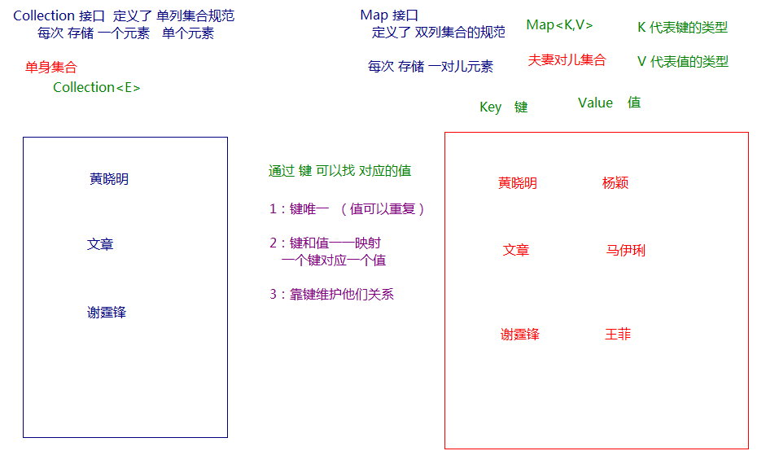
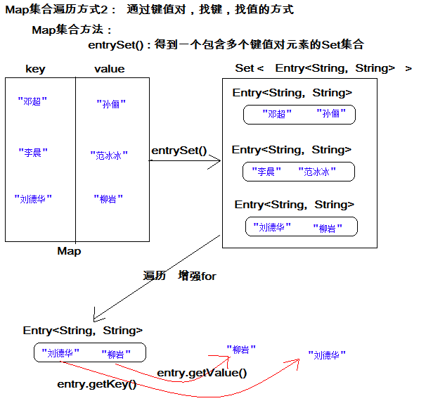

# 第一章 Map集合

## 1.1 概述

现实生活中，我们常会看到这样的一种集合：IP地址与主机名，身份证号与个人，老公和老婆等，这种一一对应的关系，就叫做映射。Java提供了专门的集合类用来存放这种对象关系的对象，即`java.util.Map`接口。

我们通过查看`Map`接口描述，发现`Map`接口下的集合与`Collection`接口下的集合，它们存储数据的形式不同，如下图。



- `Collection`中的集合，元素是孤立存在的（理解为单身），向集合中存储元素采用一个个元素的方式存储。
- `Map`中的集合，元素是成对存在的(理解为夫妻)。每个元素由键与值两部分组成，通过键可以找对所对应的值。
- `Collection`中的集合称为单列集合，`Map`中的集合称为双列集合。
- 需要注意的是，`Map`中的集合不能包含重复的键，值可以重复；每个键只能对应一个值。


## 1.2  Map的继承体系

通过查看Map接口描述，看到Map有多个子类，这里我们主要讲解常用的HashMap集合、LinkedHashMap集合。


- **HashMap<K,V>**：存储数据采用的哈希表结构，元素的存取顺序不能保证一致。由于要保证键的唯一、不重复，需要重写**键**的hashCode()方法、equals()方法。哈希表控制键，键唯一。
- **LinkedHashMap<K,V>**：HashMap下有个子类LinkedHashMap，存储数据采用的哈希表结构+链表结构。通过链表结构可以保证元素的存取顺序一致；通过哈希表结构可以保证的键的唯一、不重复，需要重写键的hashCode()方法、equals()方法。
- **TreeMap<K,V>**：TreeMap集合和Map相比没有特有的功能，底层的数据结构是红黑树；可以对元素的***键***进行排序，排序方式有两种:**自然排序**和**比较器排序**
- Hashtable被HashMap集合取代了 安全的，但是效率比HashMap低
- ConcurrentHashMap属于多线程安全，效率低 比Hashtable效率高

> tips：Map接口中的集合都有两个泛型变量<K,V>,在使用时，要为两个泛型变量赋予数据类型。两个泛型变量<K,V>的数据类型可以相同，也可以不同。


## 1.3  Map的常用方法

Map接口中定义了很多方法，常用的如下：

- `public V put(K key, V value)`:  把指定的键与指定的值添加到Map集合中。
- `public V remove(Object key)`: 把指定的键 所对应的键值对元素 在Map集合中删除，返回被删除元素的值。
- `public V get(Object key)` 根据指定的键，在Map集合中获取对应的值。
- `public Set<K> keySet()`: 获取Map集合中所有的键，存储到Set集合中。
- `public Set<Map.Entry<K,V>> entrySet()`: 获取到Map集合中所有的键值对对象的集合(Set集合)。
- `public boolean containKey(Object key)`:判断该集合中是否有此键。

Map接口的方法演示

```java
public class Test02 {
    public static void main(String[] args) {
        //创建 map对象
        HashMap<String, String> map = new HashMap<String, String>();

        //添加元素到集合
        map.put("黄晓明", "杨颖");
        map.put("文章", "马伊琍");
        map.put("邓超", "孙俪");
        System.out.println(map);//{邓超=孙俪, 文章=马伊琍, 黄晓明=杨颖}

        String value = map.put("亮哥", "李小璐");
        System.out.println("value = " + value);//value = null
        //此时put是添加功能 覆盖之前的value并返回
        String value2 = map.put("亮哥", "璐璐");
        System.out.println("value2 = " + value2);//value2 = 李小璐
        //String remove(String key)
        //根据键删除对应的键值对(返回值代表的是被删除的值,没有删除成功返回null)
        System.out.println(map.remove("邓超"));//孙俪
        System.out.println(map);//{文章=马伊琍, 亮哥=璐璐, 黄晓明=杨颖}

        // 想要查看 黄晓明的媳妇 是谁
        //V get(Object key)
        //根据键获取值
        System.out.println(map.get("黄晓明"));//杨颖
        System.out.println(map.get("邓超"));//null


        //boolean containsKey(Object key)
        //判断是否包含某个键
        boolean b = map.containsKey("锁哥");
        System.out.println(b);        //false
        boolean b2 = map.containsKey("黄晓明");
        System.out.println(b2);       //true


        //boolean containsValue(Object value)
        //判断是否包含某个值
        boolean b3 = map.containsValue("柳岩");
        System.out.println(b3);         //false
        boolean b4 = map.containsValue("杨颖");
        System.out.println(b4);         //true
    }
}
```

> tips:
>
> 使用put方法时，若指定的键(key)在集合中没有，则没有这个键对应的值，返回null，并把指定的键值添加到集合中； 
>
> 若指定的键(key)在集合中存在，则返回值为集合中键对应的值（该值为替换前的值），并把指定键所对应的值，替换成指定的新值。 


## 1.4   Map的遍历

### 方式1:键找值方式(了解)

通过元素中的键，获取键所对应的值

分析步骤：

1. 获取Map中所有的键，由于键是唯一的，所以返回一个Set集合存储所有的键。方法提示:`keyset()`
2. 遍历键的Set集合，得到每一个键。
3. 根据键，获取键所对应的值。方法提示:`get(K key)`

遍历图解：


代码演示：

~~~java
public class Demo02_Map{
    public static void main(String[] args) {
        //创建对象
        Map<String,String> map = new HashMap<>();

        //添加键值对
        map.put("邓超","孙俪");
        map.put("李晨","范冰冰");
        map.put("刘德华","柳岩");

        //遍历
        //keySet() :把键变成Set集合
        Set<String> set = map.keySet();

        //使用增强for遍历set集合
        for (String key : set) {
            //根据键获取值
            String value = map.get(key);
            System.out.println("键是"+key + " 值是" + value);
        }

    }
}
~~~

说明：不建议使用上述方式遍历集合，因为keySet()方法遍历一次集合。get()方法又遍历一次集合。遍历两次，效率低。

以下是阿里开发手册原话：


### 方式2:键值对方式(掌握)

即通过集合中每个键值对(Entry)对象，获取键值对(Entry)对象中的键与值。

**Entry键值对对象:**

我们已经知道，`Map`中存放的是两种对象，一种称为**key**(键)，一种称为**value**(值)，它们在在`Map`中是一一对应关系，这一对对象又称做`Map`中的一个`Entry(项)`。`Entry`将键值对的对应关系封装成了对象。即键值对对象，这样我们在遍历`Map`集合时，就可以从每一个键值对（`Entry`）对象中获取对应的键与对应的值。

在Map集合中也提供了获取所有Entry对象的方法：

- `public Set<Map.Entry<K,V>> entrySet()`: 获取到Map集合中所有的键值对对象的集合(Set集合)。

 获取了Entry对象 , 表示获取了一对键和值，那么同样Entry中 , 分别提供了获取键和获取值的方法：

- `public K getKey()`：获取Entry对象中的键。
- `public V getValue()`：获取Entry对象中的值。

操作步骤与图解：

1. 获取Map集合中，所有的键值对(Entry)对象，以Set集合形式返回。方法提示:`entrySet()`。
2. 遍历包含键值对(Entry)对象的Set集合，得到每一个键值对(Entry)对象。
3. 通过键值对(Entry)对象，获取Entry对象中的键与值。  方法提示:`getkey() getValue()`     

遍历图解：



代码演示如下：

~~~java
public class Demo03_Map{
    public static void main(String[] args) {
        //创建对象
        Map<String,String> map = new HashMap<>();

        //添加键值对
        map.put("邓超","孙俪");
        map.put("李晨","范冰冰");
        map.put("刘德华","柳岩");

        //遍历
        //entrySet()   把键值对转成Set集合
        Set<Map.Entry<String, String>> set = map.entrySet();

        //增强for遍历set集合
        //(元素类型 元素名 : 数组/集合)
        for (Map.Entry<String, String> e : set) {
            //获取键
            String key = e.getKey();
            //获取值
            String value = e.getValue();
            //打印
            System.out.println("key:"+key + "  value:" +value);

        }
    }
}
~~~


> tips：Map集合不能直接使用迭代器或者foreach进行遍历。但是转成Set之后就可以使用了。


# 第二章. Map常用子类

## 2.1HashMap类(必须掌握)

1.HashMap类底层是一个哈希表数据结构，控制键

**2.要求HashMap键位置的对象所属类必须重写hashCode和equals方法**

3.HashMap集合是jdk1.2开始有的：

~~~
1）线程不安全
2) 效率高
3）键和值可以是null
4) 存取无序
~~~

代码演示：

~~~java
package com.itheima.sh.hashmap_09;

import java.util.HashMap;
import java.util.Map;
import java.util.Set;

/*
    需求：向key位置存储自定义类的对象
 */
public class HashMapDemo01 {
    public static void main(String[] args) {
        //创建HashMap集合对象
        HashMap<Teacher, String> hm = new HashMap<>();
        //添加数据
        hm.put(new Teacher("锁哥", 18), "黑龙江");
        hm.put(new Teacher("班导", 19), "安徽");
        hm.put(new Teacher("老王", 38), "上海");
        hm.put(new Teacher("锁哥", 18), "上海");
        hm.put(null, null);
        hm.put(null, null);
        hm.put(null, null);
        //遍历
        Set<Map.Entry<Teacher, String>> entries = hm.entrySet();
        //遍历entries
        for (Map.Entry<Teacher, String> entry : entries) {
            Teacher key = entry.getKey();
            String value = entry.getValue();
            System.out.println(key+"----"+value);
        }
    }
}

~~~

小结：向HashMap中的键位置存储的对象所属类必须重写hashCode和equals方法

## 2.2Hashtable类(了解)

1.jdk1.0 

2.效率低

3.线程安全

4.键和值不能是null

小结：

Hashtable键和值都不能是null。

~~~~java
public synchronized V put(K key, V value) {
        // Make sure the value is not null
        if (value == null) {
            throw new NullPointerException();
        }

        // Makes sure the key is not already in the hashtable.
        Entry<?,?> tab[] = table;
        int hash = key.hashCode();
  }
~~~~

## 2.3LinkedHashMap(了解)

1.他的父类是HashMap

2.底层有两个数据结构：

​	1）哈希表：保证键唯一 存储键的

​	2）双链表链表：保证存取顺序

~~~java
package com.itheima.sh.linkedhashmap_10;

import java.util.LinkedHashMap;
import java.util.Map;
import java.util.Set;

/*
    LinkedHashMap 讲解：
    构造方法：
    LinkedHashMap() 构造一个带默认初始容量 (16) 和加载因子 (0.75) 的空插入顺序 LinkedHashMap 实例。
 */
public class LinkedHashMapDemo01 {
    public static void main(String[] args) {
        //创建对象
        LinkedHashMap<Integer, String> lhm = new LinkedHashMap<>();
        lhm.put(10, "锁哥");
        lhm.put(11, "黑旋风");
        lhm.put(12, "李逵");
        lhm.put(12, "哈哈");
        Set<Map.Entry<Integer, String>> entries = lhm.entrySet();
        for (Map.Entry<Integer, String> entry : entries) {
            System.out.println(entry.getKey()+"--"+entry.getValue());
        }
    }
}

~~~

小结：

1.底层有两个数据结构：

​	1）哈希表：保证键唯一 存储键的

​	2）双向链表：保证存取顺序


## 2.4 TreeMap集合

### 2.4.1.TreeMap介绍

TreeMap集合和Map相比没有特有的功能，底层的数据结构是红黑树；可以对元素的***键***进行排序，排序方式有两种:**自然排序**和**比较器排序**；到时使用的是哪种排序，取决于我们在创建对象的时候所使用的构造方法；

```java
public TreeMap()									使用自然排序
public TreeMap(Comparator<? super K> comparator) 	比较器排序
```

### 2.4.2.演示

案例演示**自然排序**

```java
public class Demo04_TreeMap {
    public static void main(String[] args) {
        //创建对象
        //排序
        TreeMap<String,String> map = new TreeMap<>();

        //添加元素
        map.put("abc","美美");
        map.put("aa","甜甜");
        map.put("cc","结衣");
        map.put("ee","柳岩");
        map.put("nba","詹姆斯");


        System.out.println(map);
        //{aa=甜甜, abc=美美, cc=结衣, ee=柳岩, nba=詹姆斯}
    }
}
```

案例演示**比较器排序**

**.存储自定义类型**

需求：按照年龄从小往大排

~~~java
public class Demo06_TreeMap {
    public static void main(String[] args) {
        //创建对象
        TreeMap<Student,Integer> map = new TreeMap<>(new Comparator<Student>() {
            //要求：按照年龄从小往大排
            @Override
            public int compare(Student o1, Student o2) {
                return o1.age - o2.age;
            }
        });

        //创建学生对象
       /* Student s1 = new Student("柳岩",36);
        Student s2 = new Student("石原里美",20);
        Student s3 = new Student("咩咩",18);
        Student s4 = new Student("柳岩",36);*/

        //添加元素
        map.put(new Student("柳岩",36),100);
        map.put(new Student("石原里美",20),90);
        map.put(new Student("咩咩",18),80);
        map.put(new Student("柳岩",36),70);


        System.out.println(map);  //Student学生类自己没有排序方式,自定义类型必须给出排序方式
        //{Student{name='咩咩', age=18}=80, Student{name='石原里美', age=20}=90, Student{name='柳岩', age=36}=70}
    }
}
~~~


# 第三章 Map集合练习

**需求：**

计算一个字符串中每个字符出现次数。

**分析：**

1. 获取一个字符串对象
2. 创建一个Map集合，键代表字符，值代表次数。
3. 遍历字符串得到每个字符。
4. 判断Map中是否有该键。
5. 如果没有，第一次出现，存储次数为1；如果有，则说明已经出现过，获取到对应的值进行++，再次存储。     
6. 打印最终结果

**代码：**

```java
public class MapTest {
    public static void main(String[] args) {
        //1:创建一个集合 存储  字符 以及其出现的次数
        HashMap<Character, Integer> map = new HashMap<Character, Integer>();
        //友情提示
        System.out.println("请录入一个字符串:");
        String line = new Scanner(System.in).nextLine();
        //2:遍历字符串
        for (int i = 0; i < line.length(); i++) {
            char c = line.charAt(i);
            //判断 该字符 是否在键集中
            if (!map.containsKey(c)) {//说明这个字符没有出现过
                //那就是第一次
                map.put(c, 1);
            } else {
                //先获取之前的次数
                Integer count = map.get(c);
                count++;
                //再次存入  更新
                map.put(c, count);
            }
        }
        System.out.println(map);
    }
}
```


# 第四章 集合的嵌套

- **总述：任何集合内部都可以存储其它任何集合**

## 2.1 List嵌套List

需求：假如有两个班的学生姓名，它们分别存储在两个集合中，最后存储到一个集合中。

~~~java
public class Test{
    public static void main(String[] args){
        /*
			假如有两个班的学生姓名，它们分别存储在两个集合中：
		*/
        //第一个班
        ArrayList<String> list1 = new ArrayList<>();
        list1.add("迪丽热巴");
        list1.add("古力娜扎");
        list1.add("柳岩");
        list1.add("杨幂");
        
        //第二个班
        ArrayList<String> list2 = new ArrayList<>();
        list2.add("蔡徐坤");
        list2.add("杨坤");
        list2.add("陈伟霆");
        list2.add("李易峰");
        
        //将两个集合存储到一个集合中
        ArrayList<ArrayList<String>> allList = new ArrayList<>();
        allList.add(list1);
        allList.add(list2);
        
        //遍历allList，取出每个ArrayList
        for(ArrayList<String> list : allList){
            //遍历每个班的ArrayList
            for(String s : list){
                System.out.println(s);
            }
        }
    }
    
}

~~~


## 2.2 List嵌套Map

需求：有两个班的学员，分别存储在两个Map中，然后将两个班的map存储到一个ArrayList中。

~~~java
public class Test{
    public static void main(String[] args){
        /*
        	有两个班的学员，分别存储在两个Map中
        */
        //第一个班：
        Map<String,String> map1 = new HashMap<>();
        map1.put("it001","迪丽热巴");
        map1.put("it002","古力娜扎");
        
        //第二个班：
        Map<String,String> map2 = new HashMap<>();
        map2.put("heima001","蔡徐坤");
        map2.put("heima002","李易峰");
        
        //将两个班的map存储到一个ArrayList中
        ArrayList<Map<String,String>> allList = new ArrayList<>();
        allList.add(map1);
        allList.add(map2);
        
        //遍历allList，取出每个Map
        for(Map<String,String> map : allList){
            //遍历map
            Set<String> keys = map.keySet();
            for(String key : keys){
                System.out.println(key + " - " + map.get(key));
            }
        }
    }
}
~~~


## 2.3 Map嵌套Map

需求： 有两个班，班号分别为："黑马188期"和"黑马189期"，两个班学员的姓名分别存储在两个Map中

~~~java
public class Test{
    public static void main(String[] args){
        /*
        有两个班，班号分别为："黑马188期"和"黑马189期"，两个班学员的姓名分别存储在两个Map中
        */
        //"黑马188期"：
        Map<String,String> map1 = new HashMap<>();
        map1.put("it001","迪丽热巴");
        map1.put("it002","古力娜扎");
        
        //"黑马189期"：
        Map<String,String> map2 = new HashMap<>();
        map2.put("heima001","蔡徐坤");
        map2.put("heima002","李易峰");
        
        //将两个班的Map连同对应的"班号"一同存储在一个Map中
        Map<String,Map<String,String>> allMap = new HashMap<>();
        allMap.put("黑马188期",map1);
        allMap.put("黑马189期",map2);
        
        //遍历allMap
        Set<String> keys = allMap.keySet();
        for(String k : keys){
            System.out.println(k + "：");
            //取出对应的map
            Map<String,String> map = allMap.get(k);
            //遍历map
            Set<String> keys2 = map.keySet();
            for(String k2 : keys2){
                System.out.println(k2 + " = " + map.get(k2));
            }
        }
    }
}
~~~


# 第五章 模拟斗地主洗牌发牌

## 5.1 案例介绍

按照斗地主的规则，完成洗牌发牌的动作。


具体规则：

​	1. 组装54张扑克牌

​	2.将54张牌顺序打乱

​	3. 三个玩家参与游戏，三人交替摸牌，每人17张牌，最后三张留作底牌。

​	4. 查看三人各自手中的牌（按照牌的大小排序）、底牌

**手中扑克牌从大到小的摆放顺序：大☺,小☺,2,A,K,Q,J,10,9,8,7,6,5,4,3**

♣♦♠♥ 大☺小☺

## 5.2 案例需求分析

1、准备牌：

​	完成数字编号与纸牌的映射关系：

​	使用双列Map(HashMap)集合，完成一个数字编号与字符串纸牌的对应关系(相当于一个字典)。

​	在Map集合中一个编号对应一张牌：

​	如：

​		编号    纸牌

​		0 	   大王

        1        小王

2、洗牌：

​	通过数字编号完成洗牌发牌。

3、发牌：

​	将每个人以及底牌设计为ArrayList<String>,将最后3张牌直接存放于底牌，剩余牌通过对3取模依次发牌。

​	存放的过程中要求数字大小与斗地主规则的大小对应。

​	将代表不同纸牌的数字分配给不同的玩家与底牌。

4、看牌：

​	通过Map集合找到对应字符展示。

​	通过查询纸牌与数字的对应关系，先遍历存储编号的集合，然后每取出一个编号作为map集合键在取出map集合中的值。最后打印

从map集合中获取的扑克牌即值。

具体思想如下图所示：


## 5.3  实现代码步骤

```java
public class PlayCard {

	public static void main(String[] args) {
		// 组装牌
		// 定义map集合存储扑克牌 键是牌的编号 值是牌
		HashMap<Integer, String> mapPoker = new HashMap<Integer, String>();
		// 定义一个List集合保存牌的编号 一共54张牌 这里编号范围是0~53
		ArrayList<Integer> pokerNumbers = new ArrayList<Integer>();
		// 定义集合保存花色
		ArrayList<String> colors = new ArrayList<String>();
		colors.add("♣");
		colors.add("♦");
		colors.add("♠");
		colors.add("♥");
		// 定义一个集合保存牌的数字
		ArrayList<String> numbers = new ArrayList<String>();
		Collections.addAll(numbers, "2", "A", "K", "Q", "J");
		for (int i = 10; i >= 3; i--) {
			numbers.add(i + "");
		}
		// System.out.println(numbers);
		// 定义变量作为编号
		int index = 0;
		// 将大小王添加到mapPoker集合中
		mapPoker.put(index, "大☺");
		pokerNumbers.add(index);
		// 修改编号
		index++;
		mapPoker.put(index, "小☺");
		pokerNumbers.add(index);
		// 修改编号
		index++;
		// 组装牌 2AKQJ109
		for (String thisNumber : numbers) {
			for (String thisColor : colors) {
				mapPoker.put(index, thisColor + thisNumber);
				// 将编号保存到pokerNumbers集合中
				pokerNumbers.add(index);
				// 修改编号
				index++;
			}
		}

		// System.out.println(mapPoker.size());
		// 洗牌 其实就是在打乱保存编号的集合顺序
		Collections.shuffle(pokerNumbers);
		// 创建三个玩家和底牌
		ArrayList<Integer> fage = new ArrayList<Integer>();
		ArrayList<Integer> suoge = new ArrayList<Integer>();
		ArrayList<Integer> liuyan = new ArrayList<Integer>();
		ArrayList<Integer> dipai = new ArrayList<Integer>();
		// 遍历pokerNumbers集合，即存储编号的集合
		for (int i = 0; i < pokerNumbers.size(); i++) {
			// 取出编号
			Integer thisPokerNumber = pokerNumbers.get(i);
			if (i >= pokerNumbers.size() - 3) {
				// 存储到底牌中
				dipai.add(thisPokerNumber);
			} else {
				// 将编号给三个玩家
				if (i % 3 == 0) {
					fage.add(thisPokerNumber);
				} else if (i % 3 == 1) {
					suoge.add(thisPokerNumber);
				} else if (i % 3 == 2) {
					liuyan.add(thisPokerNumber);
				}
			}
		}
		// 给玩家集合排序
		Collections.sort(fage);
		Collections.sort(suoge);
		Collections.sort(liuyan);
		Collections.sort(dipai);

		// 看牌
		// 调用方法遍历三个玩家的牌，并根据牌即编号作为key到map集合中查找value
		lookCard(mapPoker, fage, "发哥");
		lookCard(mapPoker, suoge, "锁哥");
		lookCard(mapPoker, liuyan, "柳岩");
		lookCard(mapPoker, dipai, "底牌");

	}
	// 看牌方法
	public static void lookCard(HashMap<Integer, String> mapPoker, ArrayList<Integer> list, String name) {
		// 创建字符串缓冲区对象
		StringBuilder sb = new StringBuilder(name).append(": ");
		//遍历存储编号的集合
		for (Integer key : list) {
			//根据key获取值
			String value = mapPoker.get(key);
			sb.append(value).append(" ");
		}
		System.out.println(sb);
	}
}
```

运行的结果：

```
发哥: ♣2 ♦2 ♠A ♥K ♣J ♥J ♦10 ♠10 ♠9 ♠8 ♥8 ♦7 ♠7 ♣6 ♣4 ♦4 ♥3 
锁哥: ♠2 ♦A ♥A ♣K ♣Q ♦Q ♥Q ♦J ♥10 ♦9 ♣8 ♦8 ♣7 ♠6 ♣5 ♥5 ♠4 
柳岩: 大☺ 小☺ ♦K ♠K ♠Q ♠J ♣10 ♣9 ♥9 ♥7 ♦6 ♥6 ♦5 ♥4 ♣3 ♦3 ♠3 
底牌: ♥2 ♣A ♠5 
```


# 第六章 冒泡排序

## 6.1冒泡排序概述

- 一种排序的方式，对要进行排序的数据中相邻的数据进行两两比较，将较大的数据放在后面，依次对所有的数据进行操作，直至所有数据按要求完成排序
- 如果有n个数据进行排序，总共需要比较n-1趟
- 每一次比较完毕，下一次的比较就会少一个数据参与

## 6.2冒泡排序图解

 

## 6.3冒泡排序代码实现

```java
/*
    冒泡排序：
        一种排序的方式，对要进行排序的数据中相邻的数据进行两两比较，将较大的数据放在后面，
        依次对所有的数据进行操作，直至所有数据按要求完成排序
        
        i=0的时候代表第一趟,  arr.length-1-i = 4
        i=1的时候代表第二趟,  arr.length-1-i = 3
        i=2的时候代表第三趟,  arr.length-1-i = 2
        i=3的时候代表第四趟,  arr.length-1-i = 1
   
 */
public class ArrayDemo {
    public static void main(String[] args) {
        //定义一个数组
        int[] arr = {7, 6, 5, 4, 3};
       System.out.print("排序前：");
        for (int i = 0; i < arr.length; i++) {
            System.out.print(arr[i]+" ");
        }
        //换行
        System.out.println();

        // 这里减1，是控制每趟比较的次数
        //比较的趟数
        //x =0 表示第一趟 1 第二趟 2 第三趟  3 第四趟
        for (int x = 0; x < arr.length - 1; x++) {
            // -1是为了避免索引越界，-x是为了调高比较效率
            //i表示索引
            for (int i = 0; i < arr.length - 1 - x; i++) {
                if (arr[i] > arr[i + 1]) {
                    int temp = arr[i];
                    arr[i] = arr[i + 1];
                    arr[i + 1] = temp;
                }
            }
        }
         System.out.print("排序后：");
        for (int i = 0; i < arr.length; i++) {
            System.out.print(arr[i]+" ");
        }
    }
}
```

##### 使用场景的问题

​	比如冒泡排序这些知识本来就没有使用场景，这些东西是为了开发大家【编程能力】【知识累积】