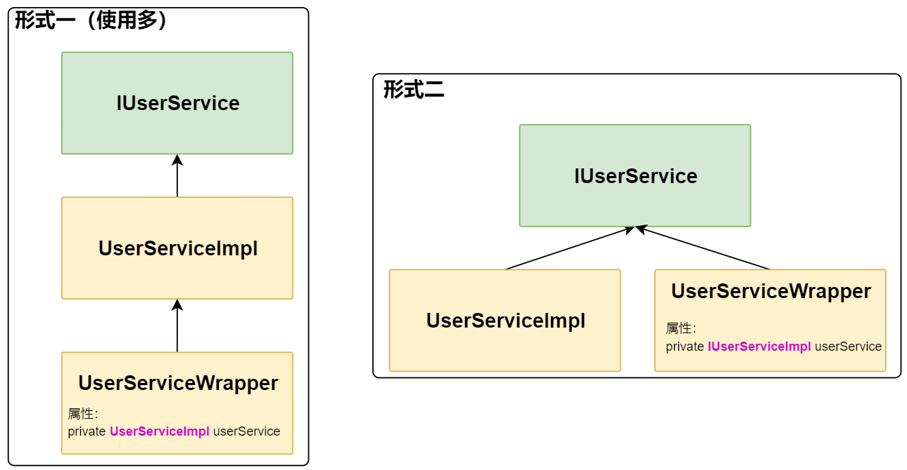
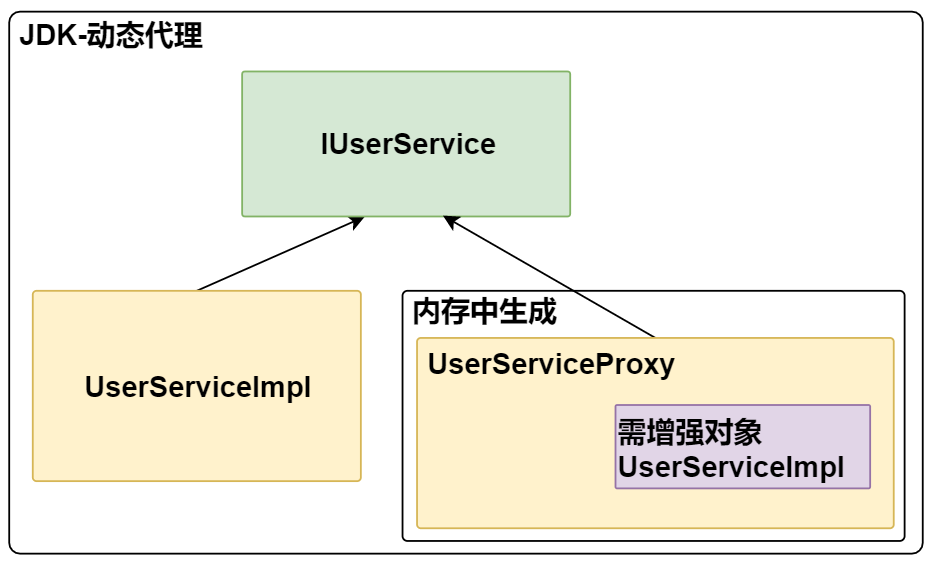
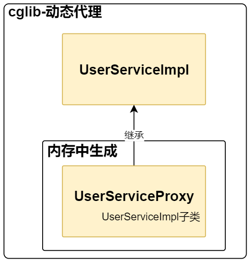
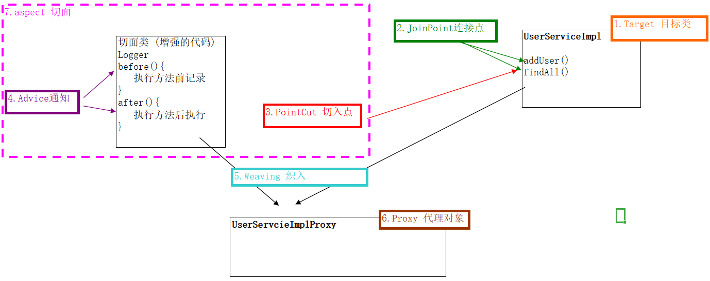
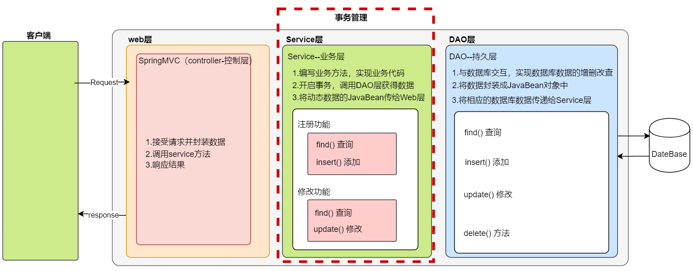
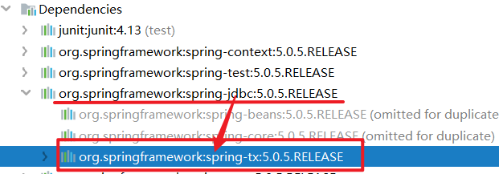

## 1.动态代理回顾

在之前课程用，已经学习了，在修改源代码的基础上，对方法进行增强，大致有两种方式，如下：

```markdown
# 1.装饰者模式
	特点：基于 Java 的继承来实现
	体现：
		1.装饰类和被装饰着类必有继承关系或都实现同一个接口
		2.装饰类中会将被装饰者列做为成员变量
		3.装饰者会将调用被装饰者类中的方法 
		4.装饰者会在调用被装饰者类方法前后进行方法增强
# 2.动态代理
	特点：程序运行中生成代理类来增强原有方法
	体现：
		1.使用 JDK 中的 Proxy 来进行代理（JDK）
			要求：被代理的类必须要有接口
			增强方式：方法增强
		2.使用 cglib 对进行代理（cglib）
			在程序运行中，内容里生成一个代理类生子类（代理类可以没有接口）
			增强方式：字节码增强
```


### 1.1 装饰者方法增强

- 装饰者示意图：




示例代码：

```JAVA
public interface IUserService {

    int addUser();

    List queryAll();
}
```


```JAVA
public class UserServiceImpl implements IUserService {


    public int addUser() {
        System.out.println("UserServiceImpl 执行 addUser 方法");
        return 0;
    }

    public List queryAll() {
        System.out.println("UserServiceImpl 执行 queryAll 方法");
        return null;
    }
}
```


```JAVA
public class UserServiceWrapper extends UserServiceImpl {

    private UserServiceImpl userService;

    public UserServiceWrapper(UserServiceImpl userService) {
        this.userService = userService;
    }


    @Override
    public int addUser() {
        System.out.println("执行 addUser 方法");
        int i = super.addUser();
        System.out.println("执行 addUser 结果："+i);
        return i;
    }

    @Override
    public List queryAll() {
        System.out.println("执行 queryAll 方法");
        List list = super.queryAll();
        System.out.println("执行 addUser 结果："+list);
        return list;
    }
}
```


```JAVA
package com.itheima.test;

import com.itheima.servie.wrapper.UserServiceWrapper;
import com.itheima.servie.impl.UserServiceImpl;
import org.junit.Test;

/**
 * <p></p>
 *
 * @Description:
 */
public class WrapperTest {

    @Test
    public void test01() {

        // 1.创建被装饰者的类
        UserServiceImpl userService = new UserServiceImpl();

        // 2.创建装饰者类
        UserServiceWrapper serviceWrapper = new UserServiceWrapper(userService);

        serviceWrapper.addUser();
    }
}

```


### 1.2 动态代理

动态代理的方式可以使用 JDK 和 cglib分别进行增强，下面是各自的方式。

#### 1.2.1 JDK的动态代理

- JDK动态代理示意图：




示例代码：

```java
public interface IUserService {

    int addUser();

    List queryAll();
}
```


```java
public class UserServiceImpl implements IUserService {


    public int addUser() {
        System.out.println("UserServiceImpl 执行 addUser 方法");
        return 0;
    }

    public List queryAll() {
        System.out.println("UserServiceImpl 执行 queryAll 方法");
        return null;
    }
}

```


```java
package com.itheima.proxy;

import org.springframework.cglib.proxy.Enhancer;
import org.springframework.cglib.proxy.MethodInterceptor;
import org.springframework.cglib.proxy.MethodProxy;

import java.lang.reflect.InvocationHandler;
import java.lang.reflect.Method;
import java.lang.reflect.Proxy;

/**
 * <p></p>
 *
 * @Description:
 */
public class ServiceProxy {


    public static <T> T getServiceProxy(T t,Class<T> iClass ) {

        T instance = (T) Proxy.newProxyInstance(t.getClass().getClassLoader(),
                t.getClass().getInterfaces(),
                // new Class[]{IUserService.class},
                new InvocationHandler() {
                    /**
                     *
                     * @param proxy    --代理对象（慎用！！！）
                     * @param method   --被代理对象的方法字节码对象
                     * @param args     --被代理对象的方法参数
                     * @return
                     * @throws Throwable
                     */
                    public Object invoke(Object proxy, Method method, Object[] args) throws Throwable {

                        System.out.println(" 执行方法：  "+method.getName());

                        //执行业务代码
                        Object result = method.invoke(t, args);

                        System.out.println(" 执行结果：  "+result);

                        return result;
                    }
                });


        return instance;
    }

}

```


```java
package com.itheima.test02;

import com.itheima.proxy.ServiceProxy;
import com.itheima.service.IUserService;
import com.itheima.service.impl.UserServiceImpl;
import org.junit.Test;

/**
 * <p></p>
 *
 * @Description:
 */
public class ProxyTest {


    @Test
    public void test01() {

        IUserService userService = new UserServiceImpl();

        userService.addUser();

        userService.findAll();

    }

    @Test
    public void test02() {

        // 1.创建被代理对象
        IUserService userService = new UserServiceImpl();

        // 2.创建代理对象--jdk
        IUserService userServiceProxy = ServiceProxy.getServiceProxy(userService, IUserService.class);


        userServiceProxy.addUser();

        userServiceProxy.findAll();

    }
}
```


#### 1.2.2 cglib的动态代理

- cglib动态代理示意图：




- 导入 cglib 的 jar 包：

```XML
<dependency>
    <groupId>org.springframework</groupId>
    <artifactId>spring-context</artifactId>
    <version>5.0.5.RELEASE</version>
</dependency>
```

说明：spring 的 core 包已经将 cglib 的核心包集成起来，无需导入其他包。


- 示例代码：

```java
public interface IUserService {

    int addUser();

    List queryAll();
}
```


```java
public class UserServiceImpl implements IUserService {


    public int addUser() {
        System.out.println("UserServiceImpl 执行 addUser 方法");
        return 0;
    }

    public List queryAll() {
        System.out.println("UserServiceImpl 执行 queryAll 方法");
        return null;
    }
}
```


```java
package com.itheima.proxy;

import org.springframework.cglib.proxy.Enhancer;
import org.springframework.cglib.proxy.MethodInterceptor;
import org.springframework.cglib.proxy.MethodProxy;

import java.lang.reflect.InvocationHandler;
import java.lang.reflect.Method;
import java.lang.reflect.Proxy;

/**
 * <p></p>
 *
 * @Description:
 */
public class ServiceProxy {


    public static <T> T getServiceProxy(T t ) {

        T instance = (T) Enhancer.create(t.getClass(),
                new MethodInterceptor() {

                    /**
                     *
                     * @param o            --代理对象(慎用！！！)
                     * @param method       --被代理对象的方法字节码对象
                     * @param objects      --被代理对象的方法参数
                     * @param methodProxy  --代理对象方法字节码对象
                     * @return
                     * @throws Throwable
                     */
                    public Object intercept(Object o, Method method, Object[] objects, MethodProxy methodProxy) throws Throwable {
                        System.out.println(" 执行方法：  "+method.getName());
                        Object result = method.invoke(t , objects);
                        System.out.println(" 执行结果：  "+result);
                        return result;
                    }
                });

        return instance;
    }

}

```


```JAVA
package com.itheima.test02;

import com.itheima.proxy.ServiceProxy;
import com.itheima.service.IUserService;
import com.itheima.service.impl.UserServiceImpl;
import org.junit.Test;

/**
 * <p></p>
 *
 * @Description:
 */
public class CglibTest {

    @Test
    public void test01() {

        // 1.创建被代理对象
        IUserService userService = new UserServiceImpl();


        // 2.创建代理类
        UserServiceImpl userServiceProxy = (UserServiceImpl) ServiceProxy.getServiceProxy(userService);

        userServiceProxy.addUser();
        userServiceProxy.findAll();


    }
}

```


## 2. Spring AOP 

AOP（Aspect Oriented Programing）意为面向切面编程， 是 Spring 框架的核心思想其中之一，是通过动态代理的形式来实现的。

```markdown
# 1.AOP 
	解释：面向切面编程。
	作用：在程序运行期间,不修改源码的基础上对已有方法进行增强
	优势：
		1.提供开发效率
		2.代码抽取利用率高
		3.代码维护方便
	实现方式：动态代理
	使用场景：性能监控、事务管理、日志等。
```

下面我们先来认识下 AOP 。


### 2.1 AOP 实现类别和术语

Spring 的 AOP 有两种实现方式：

```markdown
# 1.spring 工程Bean来实现 AOP（了解）
	此实现方式属于半自动方式，代码过于繁琐。
# 2.spring通过 AspectJ 来实现（掌握）
	此实现方式属于自动方式，应用较多。
```

AspectJ是一个基于Java语言的AOP框架。

Spring2.0开始，Spring AOP引入对Aspect的支持，AspectJ扩展了Java语言，提供了一个专门的编译器，在编译时提供横向代码的织入。

对于使用 Spring AOP 前，需要了解些 AOP 的相关术语。如下：

```markdown
# 1.target
	目标类，需要被代理的类，也是需要被增强的类。
# 2.JoinPoint 
	连接点，需要被拦截点。spring中连接点就是方法。及为目标类所有方法。
# 3.PointCut
	切入点，已经被拦截连接点。有哪些连接点需要被增强。
# 4.Advice
	通知/增强，增强内容
# 5.weaving
	织入，用增强Advice应用到目标类Target，生成代理对象过程。
# 6.proxy 
	目标对象（被代理对象）
# 7.aspect
	切面，通知advice 与 切入点 PointCut 结合
```

术语示意图：




### 2.2 AOP 功能演示

根据上面的 AOP 示意图，来进行功能演示

**1.导入相关jar文件**

```XML
<dependencies>
    <!-- spring核心jar包,已经依赖的AOP的jar -->
    <dependency>
        <groupId>org.springframework</groupId>
        <artifactId>spring-context</artifactId>
        <version>5.0.5.RELEASE</version>
    </dependency>
    <!-- spring整合单元测试的jar -->
    <dependency>
        <groupId>org.springframework</groupId>
        <artifactId>spring-test</artifactId>
        <version>5.0.5.RELEASE</version>
    </dependency>
    <!-- 切入点表达式 -->
    <dependency>
        <groupId>org.aspectj</groupId>
        <artifactId>aspectjweaver</artifactId>
        <version>1.8.7</version>
    </dependency>
    <!-- 单元测试的jar -->
    <dependency>
        <groupId>junit</groupId>
        <artifactId>junit</artifactId>
        <version>4.12</version>
    </dependency>
</dependencies>
```

**2.编写 Service 代码**

```java
public interface IUserService {

    int addUser();

    List queryAll();
}
```

```java
public class UserServiceImpl implements IUserService {


    public int addUser() {
        System.out.println("UserServiceImpl 执行 addUser 方法");
        return 0;
    }

    public List queryAll() {
        System.out.println("UserServiceImpl 执行 queryAll 方法");
        return null;
    }
}
```

**3.编写切面类**

```java
package com.itheima.service.aspect;

import org.aspectj.lang.ProceedingJoinPoint;

/**
 * <p></p>
 *
 * @Description:
 */
public class LoggerAspect {

    //执行方法前增强
    public void before() {
        System.out.println("方法前 执行");
    }

    //执行方法后增强
    public void afterReturning() {
        System.out.println("方法后 执行");
    }


    //执行方法异常增强
    public void afterThrowing() {
        System.out.println("方法异常 执行");
    }


    //执行方法最终增强
    public void after() {
        System.out.println("方法最终 执行");
    }

    //执行方法环绕增强
    /*
        ProceedingJoinPoint:切点类
            1.切点的信息
            2.目标对象的方法代理
           方法：
             proceed：执行目标对象的连接点方法
             getArgs：获得目标对象方法的参数
     */
    public Object around(ProceedingJoinPoint joinPoint) {

        Object proceed = null;
        try {
            System.out.println("方法前 执行");

            proceed = joinPoint.proceed(joinPoint.getArgs());

            System.out.println("方法后 执行");
        } catch (Throwable e) {
            e.printStackTrace();
            System.out.println("方法异常 执行");
        } finally {
            System.out.println("方法最终 执行");
        }

        return proceed;
    }
}
```

**4.编写Spring核心配置文件**

```xml
<?xml version="1.0" encoding="UTF-8"?>
<beans xmlns="http://www.springframework.org/schema/beans"
       xmlns:xsi="http://www.w3.org/2001/XMLSchema-instance"
       xmlns:context="http://www.springframework.org/schema/context"
       xmlns:aop="http://www.springframework.org/schema/aop"
       xsi:schemaLocation="
       http://www.springframework.org/schema/beans
       http://www.springframework.org/schema/beans/spring-beans.xsd
       http://www.springframework.org/schema/aop
       http://www.springframework.org/schema/aop/spring-aop.xsd
       http://www.springframework.org/schema/context
       http://www.springframework.org/schema/context/spring-context.xsd">


    <!-- 1.目标对象 -->
    <bean class="com.itheima.service.impl.UserServiceImpl" id="userService"></bean>

    <!-- 2.切面类 -->
    <bean class="com.itheima.service.aspect.LoggerAspect" id="LoggerAspect"></bean>

    <!-- 3.配置aop -->
    <aop:config >
        <!-- 配置切入点 -->
        <!-- 优化表达式：
            # 支持通配符的写法：
            *   ： 标识任意字符串
            ..  ： 任意重复次数
            1. 方法的修饰符可以省略：
            int com.itheima.service.impl.UserServiceImpl.addUser()
            2. 返回值可以使用*号代替：标识任意返回值类型
            * com.itheima.service.impl.UserServiceImpl.addUser()
            3. 包名可以使用*号代替，代表任意包（一层包使用一个*）
            * com.itheima.service.*.UserServiceImpl.addUser()
            4. 使用..配置包名，标识此包以及此包下的所有后代包
            * com.itheima.service..UserServiceImpl.addUser()
            5. 类名可以使用*号代替，标识任意类
            * com.itheima.service..*.addUser()
            6. 方法名可以使用*号代替，表示任意方法
             * com.itheima.service..*.*()
            7. 可以使用..配置参数，任意参数
            * com.itheima.service..*.*(..)

        -->
        <aop:pointcut id="pt1" expression="execution(* com.itheima.service..*.*(..)  )"/>
        <aop:aspect ref="LoggerAspect">
        <!--    <aop:before method="before" pointcut="execution(public int com.itheima.service.impl.UserServiceImpl.addUser() )"  />
            <aop:after-returning method="afterReturning" pointcut="execution(public int com.itheima.service.impl.UserServiceImpl.addUser() )"  />
            <aop:after-throwing method="afterThrowing" pointcut="execution(public int com.itheima.service.impl.UserServiceImpl.addUser() )"  />
            <aop:after method="after" pointcut="execution(public int com.itheima.service.impl.UserServiceImpl.addUser() )"  />
            -->
<!--            <aop:around method="around" pointcut="execution(public int com.itheima.service.impl.UserServiceImpl.addUser() )"  />-->
            <aop:around method="around" pointcut-ref="pt1"  />

        </aop:aspect>
    </aop:config>


</beans>
```

**5.测试类代码**

```java
package com.itheima.test01;

import com.itheima.service.IUserService;
import org.junit.Test;
import org.junit.runner.RunWith;
import org.springframework.beans.factory.annotation.Autowired;
import org.springframework.test.context.ContextConfiguration;
import org.springframework.test.context.junit4.SpringJUnit4ClassRunner;

/**
 * <p></p>
 *
 * @Description:
 */
@RunWith(SpringJUnit4ClassRunner.class)
@ContextConfiguration(locations = {"classpath:applicationContext.xml"})
public class SpringAopAspectjTest {

    @Autowired
    private IUserService userService;

    @Test
    public void test01() {

        userService.findAll();

    }
}
```


### 2.3 AOP 功能说明

下面来说明下功能演示中的 AOP 的通知类型、AOP切入点表达式、AOP通知配置常用属性。

#### 2.3.1  AOP 的通知类型

AOP的通知类型共5种，如下：

```markdown
# 1.before:前置通知(应用：各种校验)
	在方法执行前执行，如果其中抛出异常，阻止方法运行
# 2.after:后通知(应用：清理现场)
	方法执行完毕后执行，无论方法中是否出现异常
# 3.afterReturning:返回后通知(应用：常规数据处理)
	方法正常返回后执行，如果方法中抛出异常，无法执行
# 4.afterThrowing:抛出异常后通知(应用：包装异常信息)
	方法抛出异常后执行，如果方法没有抛出异常，无法执行
# 5.around:环绕通知(应用：十分强大，可以做任何事情)
	方法执行前后分别执行，可以阻止方法的执行
```

对于通知类型可以使用 XML 和 Annotation 两种表达式，如下：

- XML 形式：

```xml
<!--前置通知-->
<aop:before method="前置通知方法(切面类中的方法)" pointcut-ref="目标类的方法"/>

<!--后通知-->
<aop:after-returning method="后通知方法(切面类中的方法)" pointcut-ref="目标类的方法" />

<!--返回后通知-->
<aop:after-throwing method="返回后通知方法(切面类中的方法)" pointcut-ref="目标类的方法" />

<!--抛出异常后通知-->
<aop:after method="抛出异常后通知方法(切面类中的方法)" pointcut-ref="目标类的方法" />

<!--环绕通知-->
<aop:around method="环绕通知方法(切面类中的方法)" pointcut-ref="目标类的方法"/>
```

- 注解形式：

```markdown
# @Before 
	功能：前置通知
	使用位置：方法上

# @AfterReturning 
	功能：后置通知
	使用位置：方法上

# @AfterThrowing 
	功能：抛出通知
	使用位置：方法上

# @After
	功能：最终final通知，不管是否异常，该通知都会执行
	使用位置：方法上

# @Around 
	功能：环绕通知
	使用位置：方法上
	
# @Aspect
	功能：标明一个类为切面类
	使用位置：类上

# @Pointcut
	功能：编写切入点的表达式
	使用位置：方法上
```


#### 2.3.2 AOP切入点表达式

AOP切入点表达式支持多种形式的定义规则，如下：

```markdown
# 1.execution:匹配方法的执行(常用)
	execution(public * *(..))
# 2.within:匹配包或子包中的方法(了解)
	within(cn.itcast.aop..*)
# 3.this:匹配实现接口的代理对象中的方法(了解)
	this(cn.itcast.aop.user.UserDAO)
# 4.target:匹配实现接口的目标对象中的方法(了解)
	target(cn.itcast.aop.user.UserDAO)
# 5.args:匹配参数格式符合标准的方法(了解)
	args(int,int)
```

在上面中，经常使用的是 execution 表达式，语法为：

```markdown
# 语法：execution(<访问修饰符> <返回类型> <方法名> (<参数>) <异常>)
```

表达式形式：

```markdown
# 支持通配符的写法：
	*   ： 标识任意字符串
	..  ： 任意重复次数
1. 方法的修饰符可以省略：

2. 返回值可以使用*号代替：标识任意返回值类型

3. 包名可以使用*号代替，代表任意包（一层包使用一个*）

4. 使用..配置包名，标识此包以及此包下的所有后代包

5. 类名可以使用*号代替，标识任意类

6. 方法名可以使用*号代替，表示任意方法

7. 可以使用..配置参数，任意参数
```


### 2.4 Spring AOP AspectJ 实现方式

Spring 通过 AspectJ 来实现 AOP ，其实现方式有下面三种：

```markdown
# 1.纯XML配置
	完全在xml文件中进行配置（功能演示已经实现）
# 2.半注解和半XML形式
	将项目中编写的代码使用注解
	jar包里的内容使用xml文件
# 3.纯注解方式
	完整使用注解的方式
```

功能演示中演示了xml形式，下面就来实现其他形式的内容。

#### 2.4.1 半注解 AOP实现

**1.导入相关jar文件**

```xml
<dependencies>
    <!-- spring核心jar包,已经依赖的AOP的jar -->
    <dependency>
        <groupId>org.springframework</groupId>
        <artifactId>spring-context</artifactId>
        <version>5.0.5.RELEASE</version>
    </dependency>
    <!-- spring整合单元测试的jar -->
    <dependency>
        <groupId>org.springframework</groupId>
        <artifactId>spring-test</artifactId>
        <version>5.0.5.RELEASE</version>
    </dependency>
    <!-- 切入点表达式 -->
    <dependency>
        <groupId>org.aspectj</groupId>
        <artifactId>aspectjweaver</artifactId>
        <version>1.8.7</version>
    </dependency>
    <!-- 单元测试的jar -->
    <dependency>
        <groupId>junit</groupId>
        <artifactId>junit</artifactId>
        <version>4.12</version>
    </dependency>
</dependencies>
```

**2.编写 Service 代码**

```java
public interface IUserService {

    int addUser();

    List queryAll();
}
```

```java
@Component
public class UserServiceImpl implements IUserService {


    public int addUser() {
        System.out.println("UserServiceImpl 执行 addUser 方法");
        return 0;
    }

    public List queryAll() {
        System.out.println("UserServiceImpl 执行 queryAll 方法");
        return null;
    }
}
```

**3.编写切面类**

```java
package com.itheima.service.aspect;

import org.aspectj.lang.ProceedingJoinPoint;
import org.aspectj.lang.annotation.*;
import org.springframework.stereotype.Component;

/**
 * <p>
 *     @Aspect :标明当前类为切面类
 *     @Component：标明是spring的组件（将当前类的实例对象交于spring容器来管理）
 *     注意：这两个注解都是必须的
 * </p>
 *
 * @Description:
 */
@Aspect
@Component
public class LoggerAspect {

    //切入点方法
    @Pointcut("execution(* com.itheima.service..*.*(..))")
    public void pt(){}

    //执行方法前增强
    @Before("pt()")
    public void before() {
        System.out.println("方法前 执行");
    }

    //执行方法后增强
    @AfterReturning("pt()")
    public void afterReturning() {
        System.out.println("方法后 执行");
    }


    //执行方法异常增强
    @AfterThrowing("pt()")
    public void afterThrowing() {
        System.out.println("方法异常 执行");
    }


    //执行方法最终增强
    @After("pt()")
    public void after() {
        System.out.println("方法最终 执行");
    }

    //执行方法环绕增强
    /*
        ProceedingJoinPoint:切点类
            1.切点的信息
            2.目标对象的方法代理
           方法：
             proceed：执行目标对象的连接点方法
             getArgs：获得目标对象方法的参数
     */
    public Object around(ProceedingJoinPoint joinPoint) {

        Object proceed = null;
        try {
            System.out.println("方法前 执行");

            proceed = joinPoint.proceed(joinPoint.getArgs());

            System.out.println("方法后 执行");
        } catch (Throwable e) {
            e.printStackTrace();
            System.out.println("方法异常 执行");
        } finally {
            System.out.println("方法最终 执行");
        }

        return proceed;
    }


}
```

**4.编写Spring核心配置文件**

```xml
<?xml version="1.0" encoding="UTF-8"?>
<beans xmlns="http://www.springframework.org/schema/beans"
       xmlns:xsi="http://www.w3.org/2001/XMLSchema-instance"
       xmlns:context="http://www.springframework.org/schema/context"
       xmlns:aop="http://www.springframework.org/schema/aop"
       xsi:schemaLocation="
       http://www.springframework.org/schema/beans
       http://www.springframework.org/schema/beans/spring-beans.xsd
       http://www.springframework.org/schema/aop
       http://www.springframework.org/schema/aop/spring-aop.xsd
       http://www.springframework.org/schema/context
       http://www.springframework.org/schema/context/spring-context.xsd">


    <!-- 开启注解扫描包 -->
    <context:component-scan base-package="com.itheima" />


    <!-- 开启aop注解形式 -->
    <aop:aspectj-autoproxy />


</beans>
```

**5.测试类代码**

```java
@RunWith(SpringJUnit4ClassRunner.class)
@ContextConfiguration(locations = {"classpath:applicatoinContext.xml"})
public class AspectTest {

    @Autowired
    private IUserService userService;

    @Test
    public void test01() {
        userService.addUser();
    }
}
```


#### 2.4.1 纯注解 AOP实现

**1.导入相关jar文件**

```xml
<dependencies>
    <!-- spring核心jar包,已经依赖的AOP的jar -->
    <dependency>
        <groupId>org.springframework</groupId>
        <artifactId>spring-context</artifactId>
        <version>5.0.5.RELEASE</version>
    </dependency>
    <!-- spring整合单元测试的jar -->
    <dependency>
        <groupId>org.springframework</groupId>
        <artifactId>spring-test</artifactId>
        <version>5.0.5.RELEASE</version>
    </dependency>
    <!-- 切入点表达式 -->
    <dependency>
        <groupId>org.aspectj</groupId>
        <artifactId>aspectjweaver</artifactId>
        <version>1.8.7</version>
    </dependency>
    <!-- 单元测试的jar -->
    <dependency>
        <groupId>junit</groupId>
        <artifactId>junit</artifactId>
        <version>4.12</version>
    </dependency>
</dependencies>
```

**2.编写 Service 代码**

```java
public interface IUserService {

    int addUser();

    List queryAll();
}
```

```java
@Component
public class UserServiceImpl implements IUserService {


    public int addUser() {
        System.out.println("UserServiceImpl 执行 addUser 方法");
        return 0;
    }

    public List queryAll() {
        System.out.println("UserServiceImpl 执行 queryAll 方法");
        return null;
    }
}
```

**3.编写切面类**

```java
@Aspect
@Component
public class LogAspect {

    @Pointcut("execution(* com.itheima.service..*.*(..))")
    public void pt(){}

    // @Before("pt()")
    public void before() {
        System.out.println("之前执行");
    }

    // @AfterReturning("pt()")
    public void afterReturn() {
        System.out.println("之后执行");
    }

    // @AfterThrowing("pt()")
    public void afterThrowing() {
        System.out.println("异常执行");
    }

    // @After("pt()")
    public void after() {
        System.out.println("最终执行");
    }

    @Around("pt()")
    public Object around(ProceedingJoinPoint point) {
        Object result = null;
        try {
            System.out.println("之前执行");
            result = point.proceed(point.getArgs());
            System.out.println("之后执行");
        } catch (Throwable throwable) {
            System.out.println("异常执行");
        } finally {
            System.out.println("最终执行");
        }
        return result;
    }
}
```

**4.编写Spring核心配置类**

```java
package com.itheima.service.config;

import org.springframework.context.annotation.ComponentScan;
import org.springframework.context.annotation.Configuration;
import org.springframework.context.annotation.EnableAspectJAutoProxy;

/**
 * <p></p>
 *
 * @Description:
 */
@Configuration
@ComponentScan("com.itheima.service")
@EnableAspectJAutoProxy  //开启aop注解形式
public class SpringConfig {
}
```

**5.测试类代码**

```java
@RunWith(SpringJUnit4ClassRunner.class)
@ContextConfiguration(classes = SpringConfig.class)
public class AspectTest {

    @Autowired
    private IUserService userService;

    @Test
    public void test01() {
        userService.addUser();
    }
}
```


## 3.声明式事务

Spring 框架中提供了对事务完美的解决方案，在学习前，先来一起回顾下数据库事务的内容。

### 3.1 事务回顾

```markdown
# 1.事务说明
	事务是一组操作的执行单元，一组中会执行很多的内容，这些内容要么全部成功，要么全部失败。
# 2.数据库事务
	数据库操作来讲，事务管理的是一组SQL指令，对于增加，修改，删除操作会使用到事务。
	如果操作成功就会提交数据，如果失败，将全部操作进行回滚。
```


事务的词汇(ACID)：

```markdown
# atomic(原子性):要么都发生，要么都不发生。
# consistent(一致性):数据应该不被破坏。 
# Isolate(隔离性):用户间操作不相混淆
# Durable(持久性):永久保存,例如保存到数据库中等
```


在三层软件架构中，视图的体现：



在 Service 层会开启事务管理。

JDBC中的事务管理：

```java
Connection conn = null;
try{
   //获得连接
   conn = DriverManger...
   //1 开启事务
   conn.setAutoCommit(false);
   
    
   //操作
   insert()....
   update()....
       
       
       
       
   //2 提交
   conn.commit();
} catch(){
   //3回滚
   conn.rollback();
}finally{
   //4 释放
   conn.close();
}
```


### 3.2 Spring 的事务管理 

Spring的事务管理是通过 AOP 来实现的，必须要导入Spring相关的jar文件，如下：

```XML
<dependency>
    <groupId>org.springframework</groupId>
    <artifactId>spring-jdbc</artifactId>
    <version>5.0.5.RELEASE</version>
</dependency>
```

在上面的依赖jar文件中，会将 **spring-tx** 事务管理的jar依赖引入，如下图：




#### 3.2.1 Spring 事务管理 Api 介绍

Spring 管理事务提供了相关的 Api 来管理JDBC事务，下面是器主要的内容。


**1.PlatformTransactionManager 事务管理平台**

此接口是 spring 的事务管理器，它里面提供了我们常用的操作事务的方法。

```JAVA
 // 获取事务的状态
TransactionStatus getTransaction(TransactionDefinition definition);
 // 提交事务
commit(TransactionStatus status);
 // 回滚事务
rollback(TransactionStatus status);
```


**2.PlatformTransactionManager 实现类**

下面是事务管理平台接口常用的实现类：

```markdown
# 1.DatasourceTransactionManager：
	对jdbc操作的事务管理器（mybatis，jdbctemplate）
# 2.HibernateTransactionManager： 
	对hibernate操作的事务管理器（hibernate）--在spring-orm包中
# 3.JPATransactionManager：
	 对jpa操作的事务管理器（jpa）--在spring-orm包中
```


**3.TransactionDefinition 事务详情类**

此类中定义了事务相关的内容，如下：

```markdown
# 1.事务的隔离级别（IsolationLevel）
	使用默认值 -1（使用数据库默认的隔离级别）
 **问题：
	脏读: 一个事务读取到了另一个事务中尚未提交的数据
	不可重复度: 一个事务中两次读取的数据内容不一致，要求的是一个事务中多次读取时数据是一致的，这是事务**update**时引发的问题
	虚读，幻读: 一个事务中两次读取的数据的数量不一致，要求在一个事务多次读取的数据的数量是一致的，这是**insert或delete**时引发的问题

 **解决：
 	Read unCommitted	：什么都解决不了
	Read committed		：解决脏读  Oracle
	Repeatable Read	：解决脏读和不可重复读  Mysql
	Serializable		：解决所有但是不用

# 2.超时时间（Timeout）
	使用默认值 -1（无超时时间）

# 3.是否是只读事务（readOnly）
	只读事务	：主要用于查询
	非只读事务   ：主要用于增删改


# 4.事务传播级别（propagation）
1. PROPAGATION_REQUIRED, required ： 默认
		支持当前事务，A如果已经在事务中，B将直接使用A中事务。
		如果不存在创建新的，A不在事务中，B将创建新的。
2. PROPAGATION_SUPPORTS supports ：
		支持当前事务，A如果已经在事务中，B将直接使用A中事务。
		使用非事务执行，A不在事务中，B将也不使用事务执行。
```


### 3.3 事务案例搭建

下面我们将来搭建**转账**的案例来说明 Spring 中的事务。

#### 3.3.1.导入 jar 到工程中

```XML
<dependencies>
     <!-- spring核心jar包,已经依赖的AOP的jar -->
     <dependency>
         <groupId>org.springframework</groupId>
         <artifactId>spring-context</artifactId>
         <version>5.0.5.RELEASE</version>
     </dependency>
     
     <!-- spring-jdbc -->
     <dependency>
         <groupId>org.springframework</groupId>
         <artifactId>spring-jdbc</artifactId>
         <version>5.0.5.RELEASE</version>
     </dependency>
     <dependency>
         <groupId>mysql</groupId>
         <artifactId>mysql-connector-java</artifactId>
         <version>5.1.26</version>
     </dependency>

     <!-- spring整合单元测试的jar -->
     <dependency>
         <groupId>org.springframework</groupId>
         <artifactId>spring-test</artifactId>
         <version>5.0.5.RELEASE</version>
     </dependency>
     
     <!-- 单元测试的jar -->
     <dependency>
         <groupId>junit</groupId>
         <artifactId>junit</artifactId>
         <version>4.12</version>
     </dependency>
     
     <!-- 切入点表达式 -->
     <dependency>
         <groupId>org.aspectj</groupId>
         <artifactId>aspectjweaver</artifactId>
         <version>1.8.7</version>
     </dependency>
</dependencies>
 
<build>
    <plugins>
        <plugin>
            <groupId>org.apache.maven.plugins</groupId>
            <artifactId>maven-compiler-plugin</artifactId>
            <version>3.2</version>
            <configuration>
                <source>1.8</source>
                <target>1.8</target>
                <encoding>utf-8</encoding>
            </configuration>
        </plugin>
    </plugins>
</build>
```

#### 3.3.2.创建数据和Javabean

```sql
create database case3;
use case3;
# 转账
create table account(
  id int primary key auto_increment,
  username varchar(50),
  money int 
);

insert into account(username,money) values('jack',1000);
insert into account(username,money) values('rose',1000);
```

```JAVA
package com.itheima.domain;


import java.io.Serializable;

public class Account implements Serializable {

    private String id;
    private String username;
    private String money;

    public Account() {
    }

    public Account(String id, String username, String money) {
        this.id = id;
        this.username = username;
        this.money = money;
    }

    public String getId() {
        return id;
    }

    public void setId(String id) {
        this.id = id;
    }

    public String getUsername() {
        return username;
    }

    public void setUsername(String username) {
        this.username = username;
    }

    public String getMoney() {
        return money;
    }

    public void setMoney(String money) {
        this.money = money;
    }

    
    @Override
    public String toString() {
        return "Account{" +
                "id='" + id + '\'' +
                ", username='" + username + '\'' +
                ", money='" + money + '\'' +
                '}';
    }
}
```


#### 3.3.3 dao层

```JAVA
package com.itheima.dao;

public interface IAccountDao {
	/**
	 * 收款
	 */
	void in(String inUser, int money);
	/**
	 * 汇款
	 */
	void out(String outUser, int money);

}
```

```java
package com.itheima.dao.impl;

import com.itheima.dao.IAccountDao;
import org.springframework.jdbc.core.JdbcTemplate;

/**
 * <p></p>
 *
 * @Description:
 */
public class AccountDaoImpl implements IAccountDao {

    private JdbcTemplate jdbcTemplate;

    public void setJdbcTemplate(JdbcTemplate jdbcTemplate) {
        this.jdbcTemplate = jdbcTemplate;
    }

    @Override
    public void in(String inUser, int money) {

        String sql = "update account set money=money+? where username=? ";

        jdbcTemplate.update(sql, money, inUser);

    }

    @Override
    public void out(String outUser, int money) {

        String sql = "update account set money=money-? where username=? ";

        jdbcTemplate.update(sql, money, outUser);
    }
}
```


#### 3.3.4 service层

```java
package com.itheima.service;

/**
 * <p></p>
 *
 * @Description:
 */
public interface IAccountService {
    /**
     * 转账方法
     * @param fromAcc
     * @param toAcc
     * @param money
     */
    void transfer(String fromAcc, String toAcc, int money);
}

```

```java
package com.itheima.service.impl;

import com.itheima.dao.IAccountDao;
import com.itheima.service.IAccountService;

/**
 * <p></p>
 *
 * @Description:
 */
public class AccountServiceImpl implements IAccountService {

    private IAccountDao accountDao;

    public void setAccountDao(IAccountDao accountDao) {
        this.accountDao = accountDao;
    }

    @Override
    public void transfer(String fromAcc, String toAcc, int money) {

        System.out.println("转出账户："+outName+" 转出金额"+money);

        int out = accountDao.out(outName, money);
        //int i = 1 / 0;

        System.out.println("转入账户："+inName+" 转入金额"+money);

        int in = accountDao.in(inName, money);

    }
}
```


#### 3.3.5 配置文件

数据库信息配置文件 jdbc.properties

```properties
jdbc.driver=com.mysql.jdbc.Driver
jdbc.url=jdbc:mysql://localhost:3306/case3
jdbc.username=root
jdbc.password=root
```

spring核心配置文件

```XML
<?xml version="1.0" encoding="UTF-8"?>
<beans xmlns="http://www.springframework.org/schema/beans"
       xmlns:xsi="http://www.w3.org/2001/XMLSchema-instance"
       xmlns:context="http://www.springframework.org/schema/context"
       xsi:schemaLocation="http://www.springframework.org/schema/beans http://www.springframework.org/schema/beans/spring-beans.xsd http://www.springframework.org/schema/context http://www.springframework.org/schema/context/spring-context.xsd">

    <context:property-placeholder location="classpath:jdbc.properties" />

    <bean class="org.springframework.jdbc.datasource.DriverManagerDataSource" id="dataSource">
        <property name="url" value="${jdbc.url}"></property>
        <property name="username" value="${jdbc.username}"></property>
        <property name="password" value="${jdbc.password}"></property>
        <property name="driverClassName" value="${jdbc.driver}"></property>
    </bean>

    <bean class="org.springframework.jdbc.core.JdbcTemplate" id="jdbcTemplate">
        <property name="dataSource" ref="dataSource" />
     </bean>

    <bean class="com.itheima.dao.impl.AccountDaoImpl" id="accountDao">
        <property name="jdbcTemplate" ref="jdbcTemplate"/>
    </bean>


    <bean class="com.itheima.service.impl.AccountServiceImpl" id="accountService">
        <property name="accountDao" ref="accountDao" />
    </bean>

</beans>
```


#### 3.3.6 测试类

```java
package com.itheima.test;

import com.itheima.service.IAccountService;
import org.junit.Test;
import org.junit.runner.RunWith;
import org.springframework.beans.factory.annotation.Autowired;
import org.springframework.test.context.ContextConfiguration;
import org.springframework.test.context.junit4.SpringJUnit4ClassRunner;

/**
 * <p></p>
 *
 * @Description:
 */
@RunWith(SpringJUnit4ClassRunner.class)
@ContextConfiguration(locations = "classpath:applicationContext.xml")
public class AccountTest {

    @Autowired
    private IAccountService accountService;

    @Test
    public void test01() {

        accountService.transfer("jack","rose",100);

    }
}
```


### 4.4 声明式事务的配置

```markdown
# 1.纯XML配置
	完全在xml文件中进行配置（功能演示已经实现）
# 2.半注解和半XML形式
	将项目中编写的代码使用注解
	jar包里的内容使用xml文件
# 3.纯注解方式
	完整使用注解的方式
```


#### 4.4.1 纯XML配置

下面通过xml文件配置事务管理

```XML
<?xml version="1.0" encoding="UTF-8"?>
<beans xmlns="http://www.springframework.org/schema/beans"
       xmlns:xsi="http://www.w3.org/2001/XMLSchema-instance"
       xmlns:context="http://www.springframework.org/schema/context"
       xmlns:tx="http://www.springframework.org/schema/tx"
       xmlns:aop="http://www.springframework.org/schema/aop"
       xsi:schemaLocation="
        http://www.springframework.org/schema/beans
        http://www.springframework.org/schema/beans/spring-beans.xsd
        http://www.springframework.org/schema/tx
        http://www.springframework.org/schema/tx/spring-tx.xsd
        http://www.springframework.org/schema/aop
        http://www.springframework.org/schema/aop/spring-aop.xsd
         http://www.springframework.org/schema/context
         http://www.springframework.org/schema/context/spring-context.xsd">


    <!-- 加载配置文件 -->
    <context:property-placeholder  location="classpath:jdbc.properties"/>

    <!-- 数据库连接池（数据源） -->
    <bean class="org.springframework.jdbc.datasource.DriverManagerDataSource" id="dataSource">
        <property name="url"             value="${jdbc.url}"></property>
        <property name="username"        value="${jdbc.username}"></property>
        <property name="password"        value="${jdbc.password}"></property>
        <property name="driverClassName" value="${jdbc.driver}"></property>
    </bean>

    <!-- 事务管理器 -->
    <bean class="org.springframework.jdbc.datasource.DataSourceTransactionManager" id="trancactionManager">
        <!-- 配置数据源 -->
        <property name="dataSource" ref="dataSource"></property>
    </bean>

    <!-- 配置事务的advice -->
    <tx:advice transaction-manager="trancactionManager" id="txAdvice">
        <tx:attributes>
            <!-- tx:method 配置目标对象的方法统配符和事务的定义
                name：配置目标对象的方法统配符
                事务的定义：
                    1.read-only：配置事务只读
                            true：只读 查询
                            false（默认）：非只读 增删改
                    2.timeout
                        默认值为：-1（无事务超时时间）
                        具体数值（秒）
                    3.propagation
                         默认为：required（操作业务层肯定有事务创建）
                            事务传递
                    4.isolation：事务隔离级别
                          默认值：DEFAULT（使用数据库的隔离级别）
                          具体数值：Connection中的值
                -->
            <tx:method name="trans*" />
        </tx:attributes>
    </tx:advice>


    <!-- 切面配置 -->
    <aop:config>
        <!-- 切入点的配置 -->
        <aop:pointcut id="pt" expression="execution(* com.itheima.service..*.*(..))"/>
        <!-- advice（事务） 配置-->
        <aop:advisor advice-ref="txAdvice" pointcut-ref="pt" ></aop:advisor>
    </aop:config>


    <!-- jdbcTemplate -->
    <bean class="org.springframework.jdbc.core.JdbcTemplate" id="jdbcTemplate">
        <property name="dataSource" ref="dataSource" />
    </bean>


    <!-- dao实例对象 -->
    <bean class="com.itheima.dao.impl.AccountDaoImpl" id="accountDao">
        <property name="jdbcTemplate" ref="jdbcTemplate"></property>
    </bean>


    <!-- service实例对象 -->
    <bean class="com.itheima.service.impl.AccountServiceImpl" id="accountService">
        <property name="accountDao" ref="accountDao"></property>
    </bean>


</beans>
```

转账案例其他内容不需要进行修改，运行测试方法查看效果。


#### 4.4.2 半注解和半XML形式

```xml
<?xml version="1.0" encoding="UTF-8"?>
<beans xmlns="http://www.springframework.org/schema/beans"
       xmlns:xsi="http://www.w3.org/2001/XMLSchema-instance"
       xmlns:context="http://www.springframework.org/schema/context"
       xmlns:tx="http://www.springframework.org/schema/tx"
       xmlns:aop="http://www.springframework.org/schema/aop"
       xsi:schemaLocation="
        http://www.springframework.org/schema/beans
        http://www.springframework.org/schema/beans/spring-beans.xsd
        http://www.springframework.org/schema/tx
        http://www.springframework.org/schema/tx/spring-tx.xsd
        http://www.springframework.org/schema/aop
        http://www.springframework.org/schema/aop/spring-aop.xsd
         http://www.springframework.org/schema/context
         http://www.springframework.org/schema/context/spring-context.xsd">


    <!-- 组件扫描 -->
    <context:component-scan base-package="com.itheima" />

    <!-- 加载配置文件 -->
    <context:property-placeholder  location="classpath:jdbc.properties"/>

    <!-- 数据库连接池（数据源） -->
    <bean class="org.springframework.jdbc.datasource.DriverManagerDataSource" id="dataSource">
        <property name="url"             value="${jdbc.url}"></property>
        <property name="username"        value="${jdbc.username}"></property>
        <property name="password"        value="${jdbc.password}"></property>
        <property name="driverClassName" value="${jdbc.driver}"></property>
    </bean>

    <!-- 事务管理器 -->
    <bean class="org.springframework.jdbc.datasource.DataSourceTransactionManager" id="trancactionManager">
        <!-- 配置数据源 -->
        <property name="dataSource" ref="dataSource"></property>
    </bean>

    <!-- 开启事务注解模式 -->
    <!--
        事务注解模式，需要一个事务管理器
            如果spring容器中只要一个事务管理器，只需要 <tx:annotation-driven ></tx:annotation-driven>
            如果spring容器中有多事务管理器，需要 <tx:annotation-driven transaction-manager="trancactionManager" />
          proxy-target-class:是否直接对目标对象进行代理
            true：对目标对象直接进行代理（cglib）
            false：对目标对象接口进行代理（jdk）
     -->
    <tx:annotation-driven transaction-manager="trancactionManager" proxy-target-class="true" />


    <!-- jdbcTemplate -->
    <bean class="org.springframework.jdbc.core.JdbcTemplate" id="jdbcTemplate">
        <property name="dataSource" ref="dataSource" />
    </bean>


</beans>
```


dao代码

```java
package com.itheima.dao;

public interface IAccountDao {
	/**
	 * 收款
	 */
	void in(String inUser, int money);
	/**
	 * 汇款
	 */
	void out(String outUser, int money);

}
```

```java
package com.itheima.dao.impl;

import com.itheima.dao.IAccountDao;
import org.springframework.beans.factory.annotation.Autowired;
import org.springframework.jdbc.core.JdbcTemplate;
import org.springframework.stereotype.Repository;

/**
 * <p></p>
 *
 * @Description:
 */
@Repository
public class AccountDaoImpl implements IAccountDao {

    @Autowired
    private JdbcTemplate jdbcTemplate;


    @Override
    public void in(String inUser, int money) {

        String sql = "update account set money=money+? where username=? ";

        jdbcTemplate.update(sql, money, inUser);

    }

    @Override
    public void out(String outUser, int money) {

        String sql = "update account set money=money-? where username=? ";

        jdbcTemplate.update(sql, money, outUser);
    }
}

```


service代码


```java
package com.itheima.service;

/**
 * <p></p>
 *
 * @Description:
 */
public interface IAccountService {
    /**
     * 转账方法
     * @param fromAcc
     * @param toAcc
     * @param money
     */
    void transfer(String fromAcc, String toAcc, int money);
}

```

```java
package com.itheima.service.impl;

import com.itheima.dao.IAccountDao;
import com.itheima.service.IAccountService;
import org.springframework.beans.factory.annotation.Autowired;
import org.springframework.stereotype.Service;
import org.springframework.transaction.annotation.Transactional;

/**
 *   @Transactional
 *      作用：给类或方法加上声明式事务
 *      位置：类上和方法上
 *          类上：当前类的所有方法都会加上声明式事务
 *          方法上：当前方法加上声明式事务
 *
 *      属性：
 *          1.proragation：事务的传播级别
 *          2.readonly：设置事务是否可读
 *          3.isolation：事务的隔离级别
 *          4.timeout:事务的超时时间
 */
@Service
public class AccountServiceImpl implements IAccountService {

    @Autowired
    private IAccountDao accountDao;


    @Transactional
    public void transfer(String inName, String outName, int money) {

        System.out.println("转出账户："+outName+" 转出金额"+money);

        int out = accountDao.out(outName, money);
        int i = 1 / 0;

        System.out.println("转入账户："+inName+" 转入金额"+money);

        int in = accountDao.in(inName, money);

    }
}
```

转账案例其他内容不需要进行修改，运行测试方法查看效果。


#### 4.4.3 纯注解方式

Spring 配置类

```JAVA
package com.itheima.config;

import org.springframework.beans.factory.annotation.Qualifier;
import org.springframework.beans.factory.annotation.Value;
import org.springframework.context.annotation.Bean;
import org.springframework.jdbc.core.JdbcTemplate;
import org.springframework.jdbc.datasource.DataSourceTransactionManager;
import org.springframework.jdbc.datasource.DriverManagerDataSource;
import org.springframework.stereotype.Component;

/**
 * <p></p>
 *
 * @Description:
 */
public class DataSourceConfig {

    @Value("${jdbc.driver}")
    private String driver;
    @Value("${jdbc.url}")
    private String url;
    @Value("${jdbc.username}")
    private String username;
    @Value("${jdbc.password}")
    private String password;


    @Bean("dataSource")
    public DriverManagerDataSource dataSource() {
        DriverManagerDataSource dataSource = new DriverManagerDataSource();
        dataSource.setUrl(url);
        dataSource.setUsername(username);
        dataSource.setPassword(password);
        dataSource.setDriverClassName(driver);
        return dataSource;
    }

    @Bean("transactionManager")
    public DataSourceTransactionManager transactionManager(@Qualifier("dataSource") DriverManagerDataSource dataSource) {
        DataSourceTransactionManager transactionManager = new DataSourceTransactionManager();
        transactionManager.setDataSource(dataSource);
        return transactionManager;
    }


    @Bean("jdbcTemplate")
    public JdbcTemplate jdbcTemplate(@Qualifier("dataSource") DriverManagerDataSource dataSource) {
        JdbcTemplate jdbcTemplate = new JdbcTemplate(dataSource);
        return jdbcTemplate;
    }

}
```

```java
package com.itheima.config;

import org.springframework.context.annotation.ComponentScan;
import org.springframework.context.annotation.Configuration;
import org.springframework.context.annotation.Import;
import org.springframework.context.annotation.PropertySource;
import org.springframework.transaction.annotation.EnableTransactionManagement;

/**
 * <p></p>
 *
 * @Description:
 */
@Configuration
@ComponentScan("com.itheima")
@PropertySource("classpath:jdbc.properties")
@EnableTransactionManagement(proxyTargetClass = true) //开启注解形式的事务
@Import(TransactionConfig.class)
public class SpringConfig {
}
```


测试类：

```java
package com.itheima.test;

import com.itheima.config.SpringConfig;
import com.itheima.service.IAccountService;
import org.junit.Test;
import org.junit.runner.RunWith;
import org.springframework.beans.factory.annotation.Autowired;
import org.springframework.test.context.ContextConfiguration;
import org.springframework.test.context.junit4.SpringJUnit4ClassRunner;

/**
 * <p></p>
 *
 * @Description:
 */
@RunWith(SpringJUnit4ClassRunner.class)
// @ContextConfiguration(locations = "classpath:applicationContext.xml")
@ContextConfiguration(classes = SpringConfig.class)
public class AccountTest {

    @Autowired
    private IAccountService accountService;

    @Test
    public void test01() {

        accountService.transfer("jack","rose",100);

    }
}
```

