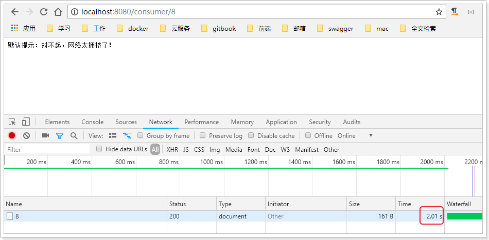
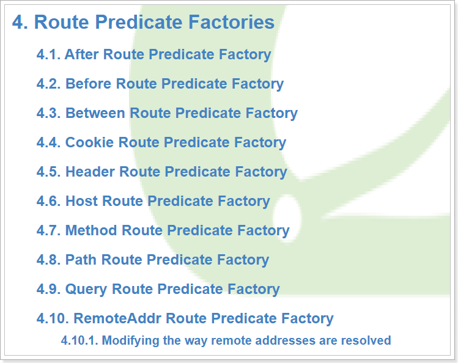
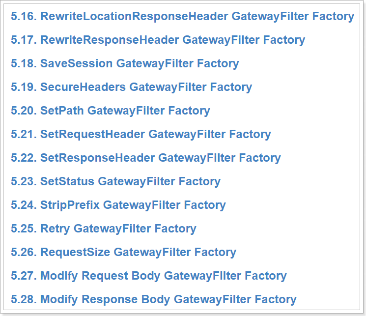
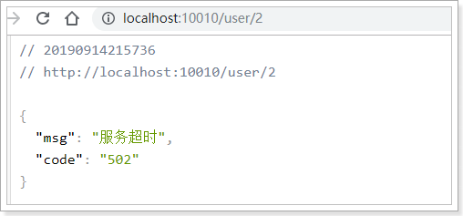
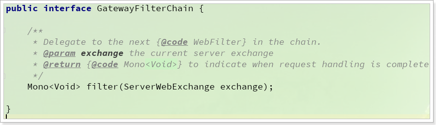
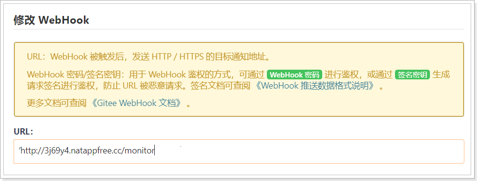
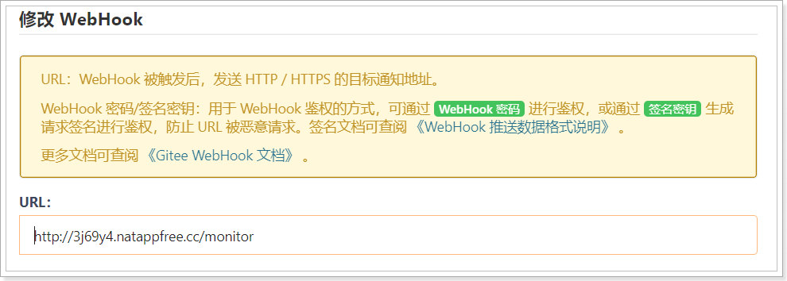

# 1.Hystrix

## 1.1.简介

Hystix,英文意思是豪猪，全身是刺，看起来就不好惹，是一种保护机制。

Hystrix也是Netflix公司的一款组件。

主页：https://github.com/Netflix/Hystrix/


那么Hystix的作用是什么呢？具体要保护什么呢？

Hystix是Netflix开源的一个延迟和容错库，用于隔离访问远程服务、第三方库，防止出现级联失败。

## 1.2.雪崩问题

微服务中，服务间调用关系错综复杂，一个服务的业务，有可能需要调用多个其它微服务，才能完成。

 

如图，如果说，我们需要访问的某个服务，Dependency-I发生了故障，此时，我们应用中，调用Dependency-I的服务，也会故障，造成阻塞。

此时，其它业务似乎不受影响。

 

例如微服务I发生异常，请求阻塞，用户不会得到响应，则tomcat的这个线程不会释放，于是越来越多的用户请求到来，越来越多的线程会阻塞：

 

服务器支持的线程和并发数有限，请求一直阻塞，会导致服务器资源耗尽，从而导致所有其它服务都不可用，形成雪崩效应。

这就好比，一个汽车生产线，生产不同的汽车，需要使用不同的零件，如果某个零件因为种种原因无法使用，那么就会造成整台车无法装配，陷入等待零件的状态，直到零件到位，才能继续组装。  此时如果有很多个车型都需要这个零件，那么整个工厂都将陷入等待的状态，导致所有生产都陷入瘫痪。一个零件的波及范围不断扩大。 


Hystix解决雪崩问题的手段主要是服务降级，包括：

- 线程隔离
- 服务熔断

## 1.3.线程隔离，服务降级

### 1.3.1.原理

线程隔离示意图：

 

解读：

Hystrix为每个服务调用的功能分配一个小的线程池，如果线程池已满调用将被立即拒绝，默认不采用排队.加速失败判定时间。

用户的请求将不再直接访问服务，而是通过线程池中的空闲线程来访问服务，如果**线程池已满**，或者**请求超时**，则会进行降级处理：**返回给用户一个错误提示或备选结果**。


用户的请求故障时，不会被阻塞，更不会无休止的等待或者看到系统崩溃，至少可以看到一个执行结果（例如返回友好的提示信息） 。

服务降级虽然会导致请求失败，但是不会导致阻塞，而且最多占用该服务的线程资源，不会导致整个容器资源耗尽，把故障的影响隔离在线程池内。


### 1.3.2.动手实践

线程隔离的完整步骤包括：

- 引入Hystrix的依赖
- 添加注解，开启Hystix功能
- 给业务编写降级的备用处理逻辑
- 给业务添加注解，开启线程隔离功能
- 设置触发降级的最长等待时间

现在，consumer-demo是服务的调用者，user-service是服务的提供者，因此consumer-demo需要把调用user-service的业务隔离，避免级联失败。

因此我们接下来的操作都是在consumer-demo中添加的。

#### 引入依赖：

在consumer-demo添加Hystix的依赖：

```xml
<dependency>
    <groupId>org.springframework.cloud</groupId>
    <artifactId>spring-cloud-starter-netflix-hystrix</artifactId>
</dependency>
```

#### 开启熔断：

在consumer-demo的启动类上添加注解：@EnableCircuitBreaker

```java
@SpringBootApplication
@EnableDiscoveryClient
@EnableCircuitBreaker
public class ConsumerApplication {
	// ...
}
```

可以看到，我们类上的注解越来越多，在微服务中，经常会引入上面的三个注解，于是Spring就提供了一个组合注解：@SpringCloudApplication

  

因此，我们可以使用这个组合注解来代替之前的3个注解。

```java
@SpringCloudApplication
public class ConsumerDemoApplication {
    // ...
}
```


#### 编写降级逻辑

当目标服务的调用出现故障，我们希望快速失败，给用户一个友好提示。因此需要提前编写好失败时的降级处理逻辑，然后使用HystixCommond来指定降级的方法。

在consumer-demo的ConsumerController中调用user-service的方法上，添加降级逻辑：

```java
@GetMapping("{id}")
@HystrixCommand(fallbackMethod = "queryByIdFallBack")
public String queryById(@PathVariable("id") Long id){
    String url = "http://user-service/user/" + id;
    String user = restTemplate.getForObject(url, String.class);
    return user;
}
public String queryByIdFallBack(Long id){
    log.error("查询用户信息失败，id：{}", id);
    return "对不起，网络太拥挤了！";
}
```

要注意，因为熔断的降级逻辑方法必须跟正常逻辑方法保证：**相同的参数列表和返回值声明**。失败逻辑中返回User对象没有太大意义，一般会返回友好提示。所以我们把queryById的方法改造为返回String，反正也是Json数据。这样失败逻辑中返回一个错误说明，会比较方便。

说明：

- `@HystrixCommand(fallbackMethod = "queryByIdFallBack")`：用来声明一个降级逻辑的方法

测试：

当user-service正常提供服务时，访问与以前一致。但是当我们将user-service停机时，会发现页面返回了降级处理信息：


#### 超时设置：

在之前的案例中，请求在超过1秒后都会返回错误信息，这是因为Hystix的默认超时时长为1，我们可以通过配置修改这个值：

```yaml
hystrix:
  command:
    default:
      execution.isolation.thread.timeoutInMilliseconds: 2000
```

这个配置会作用于全局所有方法。


再次测试：



可以发现，请求的时长已经到了2.01s，证明配置生效了。


## 1.4.服务熔断

尽管隔离可以避免服务出现级联失败，但是对于访问**服务I（故障服务）**的其它服务，每次处理请求都要等待数秒直至fallback，显然是对系统资源的浪费。

因此，当Hystix判断一个依赖服务失败比例较高时，就会对其做**熔断处理**：拦截对故障服务的请求，快速失败，不再阻塞等待，就像电路的断路器断开了，保护电路。

### 1.4.1.熔断原理

熔断器，也叫断路器，其英文单词为：Circuit Breaker 


Hystix的熔断状态机模型：


状态机有3个状态：

- Closed：关闭状态（断路器关闭），所有请求都正常访问。
- Open：打开状态（断路器打开），所有请求都会被降级。Hystix会对请求情况计数，当一定时间内失败请求百分比达到阈值，则触发熔断，断路器打开。默认失败比例的阈值是50%，请求次数最少不低于20次。
- Half Open：半开状态，open状态不是永久的，打开后会进入休眠时间（默认是5S）。随后断路器会自动进入半开状态。此时会释放1次请求通过，若这个请求是健康的，则会关闭断路器，否则继续保持打开，再次进行5秒休眠计时。

### 1.4.2.动手实践

为了能够精确控制请求的成功或失败，我们在consumer的调用业务中加入一段逻辑：

```java
@GetMapping("{id}")
@HystrixCommand
public String queryById(@PathVariable("id") Long id){
    if(id == 1){
        throw new RuntimeException("太忙了");
    }
    String url = "http://user-service/user/" + id;
    String user = restTemplate.getForObject(url, String.class);
    return user;
}
```

这样如果参数是id为1，一定失败，其它情况都成功。

我们准备两个请求窗口：

- 一个请求：http://localhost:9101consumer/1，注定失败
- 一个请求：http://localhost:9101/consumer/2，肯定成功

熔断器的默认触发阈值是20次请求，不好触发。休眠时间时5秒，时间太短，不易观察，为了测试方便，我们可以通过配置修改熔断策略：

```properties
hystrix:
  command:
    default:
      execution.isolation.thread.timeoutInMilliseconds: 2000
      circuitBreaker:
        errorThresholdPercentage: 50 # 触发熔断错误比例阈值，默认值50%
        sleepWindowInMilliseconds: 10000 # 熔断后休眠时长，默认值5秒
        requestVolumeThreshold: 10 # 触发熔断的最小请求次数，默认20
```

解读：

- requestVolumeThreshold：触发熔断的最小请求次数，默认20，这里我们设置为10，便于触发
- errorThresholdPercentage：触发熔断的失败请求最小占比，默认50%
- sleepWindowInMilliseconds：休眠时长，默认是5000毫秒，这里设置为10，便于观察熔断现象

当我们疯狂访问id为1的请求时（10次左右），就会触发熔断。断路器会进入打开状态，一切请求都会被降级处理。


此时你访问id为2的请求，会发现返回的也是失败，而且失败时间很短，只有20毫秒左右：


# 2.Feign

在前面的学习中，我们使用了Ribbon的负载均衡功能，大大简化了远程调用时的代码：

```java
String baseUrl = "http://user-service/user/";
User user = this.restTemplate.getForObject(baseUrl + id, User.class)
```

如果就学到这里，你可能以后需要编写类似的大量重复代码，格式基本相同，无非参数不一样。有没有更优雅的方式，来对这些代码再次优化呢？

这就是我们接下来要学的Feign的功能了。

## 2.1.简介

有道词典的英文解释：

 

为什么叫伪装？可以把一个远程调用的请求，伪造的像一个本地方法调用一样。


Feign可以把Rest的请求进行隐藏，伪装成类似SpringMVC的Controller一样。你不用再自己拼接url，拼接参数等等操作，一切都交给Feign去做。

项目主页：https://github.com/OpenFeign/feign

## 2.2.快速入门

### 2.2.1.导入依赖

```xml
<dependency>
    <groupId>org.springframework.cloud</groupId>
    <artifactId>spring-cloud-starter-openfeign</artifactId>
</dependency>
```

### 2.2.2.Feign的客户端

```java
@FeignClient("user-service")
public interface UserClient {

    @GetMapping("/user/{id}")
    String queryById(@PathVariable("id") Long id);
}
```

- 首先这是一个接口，Feign会通过动态代理，帮我们生成实现类。这点跟mybatis的mapper很像
- `@FeignClient`，声明这是一个Feign客户端，同时通过`value`属性指定服务名称
- 接口中的定义方法，完全采用SpringMVC的注解，Feign会根据注解帮我们生成URL，并访问获取结果

改造原来的调用逻辑，使用UserClient访问：

```java
@RestController
@RequestMapping("consumer")
@Slf4j
public class ConsumerController {
    @Autowired
    private UserClient userClient;
    @GetMapping("{id}")
    public User queryById(@PathVariable("id") Long id){
        return userClient.queryById(id);
    }
}
```

### 2.2.3.开启Feign功能

我们在启动类上，添加注解，开启Feign功能

```java
@SpringCloudApplication
@EnableFeignClients // 开启Feign功能
public class ConsumerDemoApplication {
    public static void main(String[] args) {
        SpringApplication.run(UserConsumerDemoApplication.class, args);
    }
}
```

- 你会发现RestTemplate的注册被我删除了。Feign中已经自动集成了Ribbon负载均衡，因此我们不需要自己定义RestTemplate了

### 2.2.4.启动测试：

访问接口：

 

正常获取到了结果。

## 2.3.负载均衡

Feign中本身已经集成了Ribbon依赖和自动配置：


因此我们不需要额外引入依赖，也不需要再注册`RestTemplate`对象。

Fegin内置的ribbon默认设置了请求超时时长，默认是1000ms，我们可以通过手动配置来修改这个超时时长：

```yaml
ribbon:
  ReadTimeout: 2000 # 读取超时时长
  ConnectTimeout: 1000 # 建立链接的超时时长
```

，因为ribbon内部有重试机制，一旦超时，会自动重新发起请求。如果不希望重试，可以添加配置：

```yaml
ribbon:
  ConnectTimeout: 500 # 连接超时时长
  ReadTimeout: 2000 # 数据通信超时时长
  MaxAutoRetries: 0 # 当前服务器的重试次数
  MaxAutoRetriesNextServer: 1 # 重试多少次服务
  OkToRetryOnAllOperations: false # 是否对所有的请求方式都重试
```

另外，Hystix的超时时间，应该比重试的总时间要大，比如当前案例中，应该配 大于2500*2 = 5000


## 2.4.Hystix支持

Feign默认也有对Hystix的集成：


只不过，默认情况下是关闭的。我们需要通过下面的参数来开启：

```yaml
feign:
  hystrix:
    enabled: true # 开启Feign的熔断功能
```

但是，Feign中的Fallback配置不像Ribbon中那样简单了。

1）首先，我们要定义一个类，实现刚才编写的UserFeignClient，作为fallback的处理类

```java
@Component
public class UserClientFallback implements UserClient {
    @Override
    public User queryById(Long id) {
        User user = new User();
        user.setId(id);
        user.setName("用户查询出现异常！");
        return user;
    }
}
```

2）然后在UserFeignClient中，指定刚才编写的实现类

```java
@FeignClient(value = "user-service", fallback = UserFeignClientFallback.class)
public interface UserClient {

    @GetMapping("/user/{id}")
1
}
```

3）重启测试：

我们关闭user-service服务，然后在页面访问：


 


## 2.5.日志级别

前面讲过，通过`logging.level.xx=debug`来设置日志级别。然而这个对Fegin客户端而言不会产生效果。因为`@FeignClient`注解修改的客户端在被代理时，都会创建一个新的Fegin.Logger实例。我们需要额外指定这个日志的级别才可以。

1）设置com.itcast包下的日志级别都为debug

```yaml
logging:
  level:
    com.itcast: debug
```

2）编写配置类，定义日志级别

```java
@Configuration
public class FeignConfig {
    @Bean
    Logger.Level feignLoggerLevel(){
        return Logger.Level.FULL;
    }
}
```

这里指定的Level级别是FULL，Feign支持4种级别：


- NONE：不记录任何日志信息，这是默认值。
- BASIC：仅记录请求的方法，URL以及响应状态码和执行时间
- HEADERS：在BASIC的基础上，额外记录了请求和响应的头信息
- FULL：记录所有请求和响应的明细，包括头信息、请求体、元数据。


3）在FeignClient中指定配置类：

```java
@FeignClient(value = "user-service", fallback = UserClientFallback.class, configuration = FeignConfig.class)
public interface UserClient {
    @GetMapping("/user/{id}")
    User queryById(@PathVariable("id") Long id);
}
```

4）重启项目，即可看到每次访问的日志：


# 2.Gateway网关


## 2.1.简介

Netflix       zuul    Gateway 

Gateway网关是我们服务的守门神，所有微服务的统一入口。Spring Cloud Gateway 是 Spring Cloud 的一个全新项目，该项目是基于 Spring 5.0，Spring Boot 2.0 和 Project Reactor 等响应式编程和事件流技术开发的网关，它旨在为微服务架构提供一种简单有效的统一的 API 路由管理方式。


在SpringCloudGateway之前，SpringCloud并不自己开发网关，而是使用Netflix公司的Zuul框架，不过zuul2.0更新迭代缓慢，难以满足Spring的更新需求。于是就有了SpringCloudGateway。其不仅提供统一的路由方式，并且基于 Filter 链的方式提供了网关基本的功能，例如：安全，监控/指标，和限流。

zuul 1.x   -->   spring cloud gateway

zuul 2.x  

eureka -- > zookeeper, consol 

| 对比项           | Zuul1.x                                                      | Gateway                                                      |
| ---------------- | ------------------------------------------------------------ | ------------------------------------------------------------ |
| 实现             | 基于Servlet2.x构建，使用阻塞的API。                          | 基于Spring 5、Project Reactor、Spring Boot 2，使用非阻塞式的API。 |
| 长连接           | 不支持                                                       | 支持                                                         |
| 不适用场景       | 后端服务响应慢或者高并发场景下，因为线程数量是固定（有限）的，线程容易被耗尽，导致新请求被拒绝。 | 中小流量的项目，使用Zuul1.x更合适。                          |
| 限流             | 无                                                           | 内置限流过滤器                                               |
| 上手难度         | 同步编程，上手简单                                           | 门槛较高，上手难度中等                                       |
| Spring Cloud集成 | 是                                                           | 是                                                           |
| Sentinel集成     | 是                                                           | 是                                                           |

**性能对比**

| 网关                 | Avg Req/sec/Thread | Avg Latency |
| -------------------- | ------------------ | ----------- |
| Spring Cloud Gateway | 3.24k              | 6.61ms      |
| Zuul1                | 2.09k              | 12.56ms     |
| none                 | 11.77k             | 2.09ms      |

**核心功能特性**

- 请求路由
- 集成 Hystrix 断路器
- 权限控制
- 限流

加入网关后的服务结构：


**路由**：gateway加入后，一切请求都必须先经过gateway，因此gateway就必须根据某种规则，把请求转发到某个微服务，这个过程叫做路由。

**权限控制**：请求经过路由时，我们可以判断请求者是否有请求资格，如果没有则进行拦截。

**限流**：当请求流量过高时，在网关中按照下流的微服务能够接受的速度来放行请求，避免服务压力过大。


## 2.2.快速入门

首先，我们来研究下Gateway的路由功能，基本步骤如下：

1. 创建SpringBoot工程gateway-server，引入网关依赖
2. 编写启动类
3. 编写基础配置：服务端口，应用名称
4. 编写路由规则
5. 启动网关服务进行测试


### 2.2.1.新建工程

填写基本信息：


位置信息：


添加gateway依赖：

```xml
<?xml version="1.0" encoding="UTF-8"?>
<project xmlns="http://maven.apache.org/POM/4.0.0"
         xmlns:xsi="http://www.w3.org/2001/XMLSchema-instance"
         xsi:schemaLocation="http://maven.apache.org/POM/4.0.0 http://maven.apache.org/xsd/maven-4.0.0.xsd">
    <parent>
        <artifactId>cloud-demo</artifactId>
        <groupId>cn.itcast.demo</groupId>
        <version>1.0-SNAPSHOT</version>
    </parent>
    <modelVersion>4.0.0</modelVersion>

    <artifactId>gateway-server</artifactId>

    <dependencies>
        <dependency>
            <groupId>org.springframework.cloud</groupId>
            <artifactId>spring-cloud-starter-gateway</artifactId>
        </dependency>
    </dependencies>
    
    <build>
        <plugins>
            <plugin>
                <groupId>org.springframework.boot</groupId>
                <artifactId>spring-boot-maven-plugin</artifactId>
            </plugin>
        </plugins>
    </build>
</project>
```


### 2.2.2.编写启动类

```java
@SpringBootApplication
public class GatewayApplication {
	public static void main(String[] args) {
		SpringApplication.run(GatewayApplication.class, args);
	}
}
```

### 2.2.3.编写配置

```yaml
server:
  port: 10010 #服务端口
spring: 
  application:  
    name: gateway-server #指定服务名
```

### 2.2.4.编写路由规则

我们需要用gateway来代理user-service服务，先看一下控制面板中的服务状态：


- ip为：127.0.0.1
- 端口为：9001

映射规则：

```yaml
spring:
  application:
    name: gateway-server #指定服务名
  cloud:
    gateway:
      routes:
      - id: user-service # 当前路由的唯一标识
        uri: http://127.0.0.1:9001 # 路由的目标微服务地址
        predicates: # 断言
        - Path=/user/** # 按照路径匹配的规则
```

我们将符合`Path` 规则的一切请求，都代理到 `uri`参数指定的地址

本例中，我们将 `/user/**`开头的请求，代理到http://127.0.0.1:9001


### 2.3.5.启动测试：

我们访问：http://localhost:9001/user/2，请求直达用户微服务：

 

当我们访问：http://localhost:10010/user/3，符合`/user/**`的规则，因此请求被代理到http://localhost:9001/user/3


## 2.3.面向服务的路由

在刚才的路由规则中，我们把路径对应的服务地址写死了！如果同一服务有多个实例的话，这样做显然就不合理了。

我们应该根据服务的名称，去Eureka注册中心查找 服务对应的所有实例列表，并且对服务列表进行负载均衡才对！


### 2.3.1.添加Eureka客户端依赖

```xml
<dependency>
    <groupId>org.springframework.cloud</groupId>
    <artifactId>spring-cloud-starter-netflix-eureka-client</artifactId>
</dependency>
```

### 2.3.2.添加Eureka配置

```yaml
eureka:
  client:
    service-url:
      defaultZone: http://127.0.0.1:10086/eureka
```

### 2.3.3.修改映射配置

因为已经有了Eureka客户端，我们可以从Eureka获取服务的地址信息，因此映射时无需指定IP地址，而是通过服务名称来访问，而且Zuul已经集成了Ribbon的负载均衡功能。

```yaml
eureka:
  client:
    service-url:
      defaultZone: http://127.0.0.1:10086/eureka
spring:
  cloud:
    gateway:
      routes:
      - id: user-service # 当前路由的唯一标识
        uri: lb://user-service # 路由的目标微服务,lb:代表负载均衡，user-service:代表服务id
        predicates: # 断言
        - Path=/user/** # 按照路径匹配的规则
```

这里修改了uri的路由方式：

- lb：负载均衡的协议，将来会使用Ribbon实现负载均衡
- user-service：服务的id


### 2.3.4.启动测试

再次启动，这次gateway进行代理时，会利用Ribbon进行负载均衡访问，日志中可以看到使用了负载均衡器：


## 2.4.其它路由方式

` Spring Cloud Gateway ` 实现路由规则匹配的方式主要基于jdk8提供的断言函数, 实现该函数接口需要实现返回boolean类型的test方法。  

```
Predicate 来源于 Java 8，是 Java 8 中引入的一个函数，Predicate 接受一个输入参数，返回一个布尔值结果。该接口包含多种默认方法来将 Predicate 组合成其他复杂的逻辑（比如：与，或，非）。可以用于接口请求参数校验、判断新老数据是否有变化需要进行更新操作。
```

在` Spring Cloud Gateway `中 Spring 利用 Predicate 的特性实现了各种路由匹配规则，有通过 Header、请求参数等不同的条件来进行作为条件匹配到对应的路由。

**注意:** 

​	gateway网关的路由中至少要配置一个断言！！

SpringCloudGateway内置的断言全部继承AbstractRoutePredicateFactory抽象类



主要包括：

- After Route Predicate Factory、Before Route Predicate Factory和Between Route Predicate Factory：基于请求时间的路由规则
- Cookie Route Predicate Factory：基于cookie值的路由匹配规则
- Header Route Predicate Factory：基于请求头的路由匹配规则
- Host  Route Predicate Factory：基于主机名的路由匹配规则
- Method Route Predicate Factory：基于请求方式的路由匹配规则
- Path Route Predicate Factory：基于请求路径的路由匹配规则
- Query Route Predicate Factory：基于请求参数的路由匹配规则
- RemoteAddr Route Predicate **Factory**：基于请求者ip地址的路由匹配规则

有兴趣的同学可以自己查看。


## 2.5.局部过滤器

Spring Cloud Gateway同zuul类似，有“pre”和“post”两种方式的filter。在“pre”类型的过滤器可以做参数校验、权限校验、流量监控、日志输出、协议转换等；在“post”类型的过滤器中可以做响应内容、响应头的修改，日志的输出，流量监控等。


与zuul不同的是，filter除了分为“pre”和“post”两种方式的filter外，在Spring Cloud Gateway中，filter从作用范围可分为另外两种，一种是针对于单个路由的GatewayFilter，它在配置文件中的写法同predicates类似；另外一种是针对于所有路由的GlobalFilter。

二者区别如下：
 GatewayFilter : 需要通过spring.cloud.routes.filters 配置在具体路由下，只作用在当前路由上或通过spring.cloud.default-filters配置在全局，作用在所有路由上。

 GlobalFilter : 全局过滤器，不需要在配置文件中配置，作用在所有的路由上，系统初始化时加载，并作用在每个路由上。


GatewayFilter Factories是Gateway中的局部过滤器工厂，作用于某个特定路由，允许以某种方式修改传入的HTTP请求或返回的HTTP响应。


还包括：



下面我们以几个过滤器的配置为示例：

### 2.5.1.添加请求头

示例：AddRequestHeader GatewayFilter Factory，可以在请求中添加请求头，配置如下：

```yaml
eureka:
  client:
    service-url:
      defaultZone: http://127.0.0.1:10086/eureka
spring:
  cloud:
    gateway:
      routes:
      - id: user-service # 当前路由的唯一标识
        uri: lb://user-service # 路由的目标微服务,lb:代表负载均衡，user-service:代表服务id
        predicates: # 断言
        - Path=/user/** # 按照路径匹配的规则
        filters: # 过滤项
        - AddRequestHeader=info, java is best!
```

其中：

- `filters`：就是当前路由规则的所有过滤器配置
- `AddRequestHeader`是添加一个头信息

重启后，再user-service的内部断点，查看请求头：


### 2.5.2.Hystrix

网关做请求路由转发，如果被调用的请求阻塞，需要通过Hystrix来做线程隔离和熔断，防止出现故障。

#### 1）引入Hystrix的依赖

```xml
<dependency>
    <groupId>org.springframework.cloud</groupId>
    <artifactId>spring-cloud-starter-netflix-hystrix</artifactId>
</dependency>
```


#### 2）定义降级处理规则

可以通过default-filter来配置，会作用于所有的路由规则。

```yaml
server:
  port: 10010
eureka:
  client:
    service-url:
      defaultZone: http://127.0.0.1:10086/eureka
spring:
  application:
    name: gateway-service
  cloud:
    gateway:
      routes:
      - id: user-service # 当前路由的唯一标识
        uri: lb://user-service # 路由的目标微服务,lb:代表负载均衡，user-service:代表服务id
        predicates: # 断言
        - Path=/user/** # 按照路径匹配的规则
        filters:
        - AddRequestHeader=info, java is best!

      default-filters: # 默认过滤项
      - name: Hystrix # 指定过滤工厂名称（可以是任意过滤工厂类型）
        args: # 指定过滤的参数
          name: fallbackcmd  # hystrix的指令名
          fallbackUri: forward:/fallbackTest # 失败后的跳转路径
hystrix:
  command:
    default:
      execution.isolation.thread.timeoutInMilliseconds: 1000 # 失败超时时长


```

- default-filters：默认过滤项，作用于所有的路由规则
  - name：过滤工厂名称，这里指定Hystrix，意思是配置Hystrix类型
  - args：配置过滤工厂的配置
    - name：Hystrix的指令名称，用于配置例如超时时长等信息
    - fallbackUri：失败降级时的跳转路径


#### 3）定义降级的处理函数

定义一个controller，用来编写失败的处理逻辑：

```java
@RestController
public class FallbackController {
    @RequestMapping(value = "/fallbackTest")
    public Map<String, String> fallBackController() {
        Map<String, String> response = new HashMap<>();
        response.put("code", "502");
        response.put("msg", "服务超时");
        return response;
    }
}

```


#### 4）启动测试

再UserController的业务中打断点，让请求超时，查看页面的效果：

 

### 2.5.3.路由前缀

#### 1）问题呈现

我们之前用`/user/**`这样的映射路径代表`user-service`这个服务。因此请求`user-service`服务的一切路径要以`/user/**`开头

比如，访问：`localhost:10010/user/2`会被代理到：`localhost:9001/user/2`

现在，我们在`user-service`中的`com.itcast.user.web`中定义一个新的接口：

```java
@RestController
@RequestMapping("address")
public class AddressController {
    @GetMapping("me")
    public String myAddress() {
        return "上海市浦东新区航头镇航头路18号传智播客";
    }
}

```

这个接口的路径是`/address/me`，并不是以`/user/`开头。当访问：`localhost:10010/address/me`时，并不符合映射路径，因此会得到404.

无论是 `/user/**`还是`/address/**`都是`user-service`中的一个controller路径，都不能作为网关到user-service的映射路径。

因此我们需要定义一个额外的映射路径，例如：`/user-service`，配置如下：

 

```yaml
spring:
  cloud:
    gateway:
      routes:
      - id: user-service # 当前路由的唯一标识
        uri: lb://user-service # 路由的目标微服务,user-service:代表服务id
        predicates: # 断言
        - Path=/user-service/** # 按照路径匹配的规则
```


那么问题来了:

当我们访问：http://localhost:10010/user-service/user/1时，映射路径`/user-service`指向用户服务，会被代理到：http://localhost:9001/user-service/user/1.

当我们访问：http://localhost:10010/user-service/address/me时，映射路径`/user-service`指向用户服务，会被代理到：http://localhost:9001/user-service/address/me

而在`user-service`中，无论是`/user-service/user/1`还是`/user-service/address/me`都是错误的，因为多了一个`/user-service`。

这个`/user-service`是gateway中的映射路径，不应该被代理到微服务，怎办吧？


#### 2）去除路由前缀

解决思路很简单，当我们访问http://localhost:10010/user-service/user/1时，网关利用`/user-service`这个映射路径匹配到了用户微服务，请求代理时，只要把`/user-service`这个映射路径去除不就可以了吗。

恰好有一个过滤器：StripPrefixFilterFactory可以满足我们的需求。


https://cloud.spring.io/spring-cloud-static/spring-cloud-gateway/2.2.3.RELEASE/reference/html/#the-stripprefix-gatewayfilter-factory

我们修改刚才的路由配置：

 

此时，网关做路由的代理时，就不会把/user-service作为目标请求路径的一部分了。

也就是说，我们访问：http://localhost:10010/user-service/user/1，会代理到：http://localhost:9001/user/1

我们访问：http://localhost:10010/user-service/address/me，会代理到：http://localhost:9001/address/me

试试看：

 

 


## 2.6.全局过滤器

全局过滤器Global Filter 与局部的GatewayFilter会在运行时合并到一个过滤器链中，并且根据`org.springframework.core.Ordered`来排序后执行，顺序可以通过`getOrder()`方法或者`@Order`注解来指定。


### 2.6.1.GlobalFilter接口

来看看全局过滤器的顶级接口：

```java
public interface GlobalFilter {

	/**
	 * Process the Web request and (optionally) delegate to the next {@code WebFilter}
	 * through the given {@link GatewayFilterChain}.
	 * @param exchange the current server exchange
	 * @param chain provides a way to delegate to the next filter
	 * @return {@code Mono<Void>} to indicate when request processing is complete
	 */
	Mono<Void> filter(ServerWebExchange exchange, GatewayFilterChain chain);

}
```

实现接口，就要实现其中的filter方法，在方法内部完成过滤逻辑，其中的参数包括：

- ServerWebExchange：一个类似于Context的域对象，封装了Request、Response等服务相关的属性

   

- GatewayFilterChain：过滤器链，用于放行请求到下一个过滤器

  


### 2.6.2.过滤器顺序

通过添加@Order注解，可以控制过滤器的优先级，从而决定了过滤器的执行顺序。

另外，一个过滤器的执行包括`"pre"`和`"post"`两个过程。在GlobalFilter.filter()方法中编写的逻辑属于pre阶段，在使用GatewayFilterChain.filter().then()的阶段，属于Post阶段。


优先级最高的过滤器，会在pre过程的第一个执行，在post过程的最后一个执行，如图：

 


我们可以在pre阶段做很多事情，诸如：

- 登录状态判断
- 权限校验
- 请求限流等


## 2.7.自定义过滤器

定义过滤器只需要实现GlobalFilter即可，不过我们有多种方式来完成：

- 方式一：定义过滤器类，实现接口
- 方式二：通过@Configuration类结合lambda表达式
- ​                @Bean 


### 2.7.1.登录过滤器

现在，我们通过自定义过滤器，模拟一个登录校验功能，逻辑非常简单：

- 获取用户请求参数中的 access-token 参数
- 判断是否为"admin"
  - 如果不是，证明未登录，拦截请求
  - 如果是，证明已经登录，放行请求

代码如下

```java
@Order(0) // 通过注解声明过滤器顺序
@Component
public class LoginFilter implements GlobalFilter {
    @Override
    public Mono<Void> filter(ServerWebExchange exchange, GatewayFilterChain chain) {
        // 获取token
        String token = exchange.getRequest().getQueryParams().toSingleValueMap().get("access-token");
        // 判断请求参数是否正确
        if(StringUtils.equals(token, "admin")){
            // 正确，放行
            return chain.filter(exchange);
        }
        // 错误，需要拦截，设置状态码
        exchange.getResponse().setStatusCode(HttpStatus.UNAUTHORIZED);
        // 结束任务
        return exchange.getResponse().setComplete();
    }
}
```

位置如下：

 

测试：带错误参数的情况：

 

带正确参数的情况：

 


### 2.7.2.多过滤器演示（了解）

下面我们通过lambda表达式来定义过滤器：

```java
@Slf4j
@Configuration
public class FilterConfiguration {

    @Bean
    @Order(-2)
    public GlobalFilter globalFilter1(){
        return ((exchange, chain) -> {
            log.info("过滤器1的pre阶段！");
            return chain.filter(exchange).then(Mono.fromRunnable(() -> {
                log.info("过滤器1的post阶段！");
            }));
        });
    }

    @Bean
    @Order(-1)
    public GlobalFilter globalFilter2(){
        return ((exchange, chain) -> {
            log.info("过滤器2的pre阶段！");
            return chain.filter(exchange).then(Mono.fromRunnable(() -> {
                log.info("过滤器2的post阶段！");
            }));
        });
    }

    @Bean
    @Order(0)
    public GlobalFilter globalFilter3(){
        return ((exchange, chain) -> {
            log.info("过滤器3的pre阶段！");
            return chain.filter(exchange).then(Mono.fromRunnable(() -> {
                log.info("过滤器3的post阶段！");
            }));
        });
    }
}

```

执行结果如下：


# 3.配置中心

当项目上线部署时，往往会部署到数十台甚至数千台服务节点，如果我们需要修改某个配置文件中的内容，就需要逐个服务器去修改，工作量太大而且容易出错。

而统一配置中心就是解决这个问题的。

## 3.1.认识SpringCloudConfig

Spring Cloud Config为分布式系统中的**配置管理**提供`服务器`和`客户端`支持。它包含两部分：

- Config Server：是一个可横向扩展、集中式的配置服务器，它用于集中管理应用程序各个环境下的配置，默认使用Git存储配置文件内容，也可以使用SVN存储，或者是本地文件存储。
- Config Client：是Config Server的客户端，用于操作存储在Config Server中的配置内容。微服务在启动时Config Client会请求Config Server以获取配置文件的内容，请求到后再启动容器并应用配置。

如图：


当用户提交并推送配置到Git仓库时，ConfigServer可以从Git获取到最新的配置，并缓存到本地。而ConfigClient则可以从ConfigServer中获取配置。


## 3.2.准备Git仓库

首先，我们需要准备一个Git仓库，用来保存服务间共享的配置文件。

在任意目录创建一个Git仓库，并添加一个配置文件：

 

然后在consumer.yml中编写一些测试内容：

```yaml
test:
  redis:
    host: localhost
    port: 6379
```


接下来，在gitee.com中创建一个远程库：

 


并与本地库建立连接，然后将代码push到远程库：


## 3.3.搭建ConfigServer

接下来，我们来搭建一个ConfigServer，

### 3.3.1.创建工程


坐标：


位置：


### 3.3.2.依赖

接下来，在项目的pom.xml中引入一些依赖：

```xml
<?xml version="1.0" encoding="UTF-8"?>
<project xmlns="http://maven.apache.org/POM/4.0.0"
         xmlns:xsi="http://www.w3.org/2001/XMLSchema-instance"
         xsi:schemaLocation="http://maven.apache.org/POM/4.0.0 http://maven.apache.org/xsd/maven-4.0.0.xsd">
    <parent>
        <artifactId>cloud-demo</artifactId>
        <groupId>cn.itcast.demo</groupId>
        <version>1.0-SNAPSHOT</version>
    </parent>
    <modelVersion>4.0.0</modelVersion>

    <artifactId>config-server</artifactId>

    <dependencies>
        <!--eureka依赖-->
        <dependency>
            <groupId>org.springframework.cloud</groupId>
            <artifactId>spring-cloud-starter-netflix-eureka-client</artifactId>
        </dependency>
        <!--config-server依赖-->
        <dependency>
            <groupId>org.springframework.cloud</groupId>
            <artifactId>spring-cloud-config-server</artifactId>
        </dependency>
    </dependencies>
</project>
```

这里引入了两个依赖：

- eureka-client依赖：因为ConfigServer也是一个微服务，需要注册到eureka
- config-server依赖：包含ConfigServer的全部功能


### 3.3.3.配置文件

然后在项目的`application.yml`中添加配置：

```yaml
server:
  port: 12580
spring:
  application:
    name: config-server 
  cloud:
    config:
      server:
        git:
          uri: https://gitee.com/taft31/config-test.git # 需要拉取配置的Git仓库地址
eureka:
  client:
    service-url:
      defaultZone: http://127.0.0.1:10086/eureka/ # eureka地址
```

核心配置有两个：

- `spring.cloud.config.server.git.url`：管理的git仓库的地址，将来ConfigServer会去拉取配置
- `eureka.client.service-url`：eureka地址


### 3.3.4.启动类

最后，我们添加一个启动类：

```java
@EnableConfigServer
@SpringBootApplication
public class ConfigServer {
    public static void main(String[] args) {
        SpringApplication.run(ConfigServer.class, args);
    }
}
```

在启动类上，通过`@EnableConfigServer`注解来开启ConfigServer的功能。


### 3.3.5.基本测试

启动项目，查看eureka的页面发现服务注册成功：


然后，我们在浏览器输入地址：http://localhost:12580/consumer.yml，结果如下：

 

为什么？

这是因为在SpringCloudConfig中，配置文件访问必须符合下面的路径规范：

```
/{application}/{profile}[/{label}]
/{application}-{profile}.yml
/{label}/{application}-{profile}.yml
/分支名称/应用名称-环境名称.yml
/master/consumer-dev.yml


```

后缀名同样适用于`.properties`。这是什么意思呢？

- application：应用名，也就是配置文件名，这里是consumer，最好与微服务名称一致
- profile：当前激活的开发环境，也就是SpringBoot中的`spring.profiles.active`属性值，例如：dev环境、prod环境、test环境等，可以自定义
- label：配置文件所在分支，缺省值是master

我们刚刚访问的路径不符合规范，缺少了profile值。

现在，我们在git仓库新添加2个文件：`consumer-dev.yml`、`consumer-prod.yml`


其中，`consumer-dev.yml`内容为：

```yaml
env: dev
```

其中，`consumer-prod.yml`内容为：

```yaml
env: prod
```

文件名后面的`dev`和`prod`就是profile。

我们再次在浏览器访问地址：http://localhost:12580/consumer-dev.yml

 

然后：http://localhost:12580/consumer-prod.yml

 

可以看到，`consumer-dev.yml`和`consumer-prod.yml`将`consumer.yml`中的数据作为了公共数据。


### 3.3.6.分支测试

我们新建一个分支，名为feature：


然后修改feature分支中的`consumer.yml`文件，内容如下：

```yaml
test:
  redis:
    host: localhost
    port: 6379
branch: feature
```

提交以后，在浏览器访问路径：http://localhost:12580/feature/consumer-dev.yml

 


## 3.4.配置ConfigClient

我们已经能够从ConfigServer获取配置文件内容。接下来我们需要在微服务配置ConfigClient，去读取这些配置。

### 3.4.1.引入依赖

首先，在consumer-service服务中引入config依赖：

```xml
<dependency>
    <groupId>org.springframework.cloud</groupId>
    <artifactId>spring-cloud-starter-config</artifactId>
</dependency>
```


### 3.4.2.配置

接下来，我们要编写配置文件。与之前不同，项目启动要**优先**去读取配置，这些配置可能在后面创建Spring容器，初始化各种Bean的时候用到。

SpringBoot中提供了一个名为`bootstrap.yml`的文件，加载顺序比application.yml优先。

因此我们需要在`consumer`服务创建一个`bootstrap.yml`的文件，内容如下：

```yaml
server:
  port: 9101
spring:
  application:
    name: consumer
  cloud:
    config:
      name: consumer # 配置文件的名称
      profile: dev # 环境
      label: master # 分支
      discovery:
        enabled: true # 通过注册中心寻找ConfigServer
        service-id: config-server # ConfigServer的服务id
eureka:
  client:
    service-url:
      defaultZone: http://127.0.0.1:10086/eureka/
```

然后是`application.yml`，内容做一些修改：

```yaml
logging:
  level:
    cn.itcast: debug
hystrix:
  command:
    default:
      execution.isolation.thread.timeoutInMilliseconds: 2000
```


### 3.4.3.定义属性读取类

接下来，为了测试，我们需要定义一个属性读取类，读取远程加载的consumer-dev.yml中的数据。

在`consumer`中定义一个属性类：

```java
package cn.itcast.consumer.config;

import lombok.Data;
import org.springframework.boot.context.properties.ConfigurationProperties;
import org.springframework.stereotype.Component;


@Data
@Component
@ConfigurationProperties(prefix = "test.redis")
public class RedisProperties {
    private String host;
    private int port;
}
```


### 3.4.4.测试

为了方便查看结果，我们在`consumer`中定义一个新的controller接口：

```java
package cn.itcast.consumer.web;

import cn.itcast.user.config.RedisProperties;
import org.springframework.beans.factory.annotation.Autowired;
import org.springframework.web.bind.annotation.GetMapping;
import org.springframework.web.bind.annotation.RequestMapping;
import org.springframework.web.bind.annotation.RestController;


@RestController
@RequestMapping("hello")
public class HelloController {

    @Autowired
    private RedisProperties properties;

    @GetMapping("prop")
    public RedisProperties getProperties(){
        return properties;
    }
}
```


重启consumer-service后，在浏览器访问：http://localhost:9101/hello/prop，内容如下：

 


## 3.5.手动刷新配置

现在，我们修改git仓库中，master分支的consumer.yml文件，修改端口为6380：

```yaml
test:
  redis:
    host: localhost
    port: 6380
```

然后我们访问ConfigServer：http://localhost:12580/consumer-dev.yml：

 

我们访问consumer：

http://localhost:9101/hello/prop，内容如下：

 

发现consumer-service的内容没有跟着改变，说明默认情况下config-client并未发现配置变化，新的配置也没有生效。


### 3.5.1.开启刷新功能

如果要让提交在Git的配置立即生效，需要在ConfigClient端做一些配置。

首先，在`consumer`中引入依赖：

```xml
<dependency>
    <groupId>org.springframework.boot</groupId>
    <artifactId>spring-boot-starter-actuator</artifactId>
</dependency>
```

然后，在`consumer`的`application.yml`文件中添加配置：

```yaml
management:
  endpoints:
    web:
      exposure:
        include: "*" # 暴露refresh接口
```

这个配置会对外暴露一个接口：/actuator/refresh，调用该接口即可刷新配置。

**重启consumer服务。**


### 3.5.2.测试

现在，我们修改git仓库中，master分支的consumer-dev.yml文件，内容如下：

```yaml
env: dev
test:
  redis:
    host: localhost
    port: 6381
```

然后我们访问ConfigServer：http://localhost:12580/consumer-dev.yml：

 


然后，访问http://localhost:9101/hello/prop，内容如下：

 

然后打开客户端工具，访问：http://localhost:9101/actuator/refresh，注意是POST请求：

 

此时，查看user-service的日志：

```
[nio-8081-exec-3] c.c.c.ConfigServicePropertySourceLocator : Fetching config from server at : http://LAPTOP-RICV7F2U:12580/
[nio-8081-exec-3] c.c.c.ConfigServicePropertySourceLocator : Located environment: name=consumer, profiles=[dev], label=master, version=47438af700209fa556184cd104b001088d033232, state=null
```

可以看到，已经重新加载配置。再次访问：http://localhost:9101/hello/prop：

 

可以发现，项目无需重启，只需要访问接口即可实现配置更新！


# 4.消息总线

现在，我们可以通过访问微服务的`/actuator/refresh`接口来手动刷新配置。但是，如果我们的微服务有数百个节点，一个个去手动访问并不现实。有没有办法可以实现配置的自动更新呢？

这里可以使用消息总线来实现，例如Spring Cloud Bus技术。

## 4.1.认识消息总线

在微服务架构体系中，我们通常会使用轻量级的消息代理（MQ）来构建一个共用的消息系统，让所有的微服务节点都连上来。由于该系统中的话题会被所有微服务节点订阅和消费，因此成为：**消息总线**。

我们可以利用**消息总线**方便的实现统一的配置管理和配置动态刷新。

目前，SpringCloud中的SpringCloudBus技术就实现了消息总线的功能，其底层默认是采用RabbitMQ和Kafka来作为消息代理。


利用SpringCloudBus来实现配置动态刷新的流程如图：


## 4.2.安装MQ

略，之前已经学习过MQ的安装，此处略过。


## 4.3.配置ConfigServer

ConfigServer需要做两件事情：

- 连接MQ，并监听消息
- 暴露refresh接口，将来Git会主动调用和通知

### 4.3.1.引入依赖

我们在ConfigServer的pom.xml中引入依赖。

```xml
<!--bus-->
<dependency>
    <groupId>org.springframework.cloud</groupId>
    <artifactId>spring-cloud-starter-bus-amqp</artifactId>
</dependency>
<!--端点-->
<dependency>
    <groupId>org.springframework.boot</groupId>
    <artifactId>spring-boot-starter-actuator</artifactId>
</dependency>
```


### 4.3.2.配置文件

然后修改ConfigServer的application.yml文件，添加两部分内容：

- RabbitMQ地址
- 开启refresh端口

```yaml
server:
  port: 12580
spring:
  application:
    name: config-server
  cloud:
    config:
      server:
        git:
          uri: https://gitee.com/taft31/config-test.git # 需要拉取配置的Git仓库地址
  rabbitmq:
    host: 127.0.0.1
    port: 5672
    username: guest
    password: guest
eureka:
  client:
    service-url:
      defaultZone: http://127.0.0.1:10086/eureka/ # eureka地址
management:
  endpoints:
    web:
      exposure:
        include: "*"
```


## 4.4.配置ConfigClient

接下来，需要在ConfigClient端做相同配置，这里我们修改user-service服务。

### 4.4.1.引入依赖

我们在`consumer`的pom.xml中引入依赖。

```xml
<!--bus-->
<dependency>
    <groupId>org.springframework.cloud</groupId>
    <artifactId>spring-cloud-starter-bus-amqp</artifactId>
</dependency>
```


### 4.3.2.配置文件

然后修改consumer-service`的`bootstrap.yml`文件，添加MQ地址后，完整配置如下：

```yaml
server:
  port: 9101
spring:
  application:
    name: consumer
  cloud:
    config:
      name: consumer # 配置文件的名称
      profile: dev # 环境
      label: master # 分支
      discovery:
        enabled: true # 通过注册中心寻找ConfigServer
        service-id: config-server # ConfigServer的服务id
  rabbitmq:
    host: 127.0.0.1
    port: 5672
    username: guest
    password: guest
eureka:
  client:
    service-url:
      defaultZone: http://127.0.0.1:10086/eureka
```


## 4.5.测试

重启 config-server和consumer服务，可以启动多个consumer服务：


修改Git仓库中的master分支下的`consumer.yml`，内容如下：

```yaml
test:
  redis:
    host: localhost
    port: 6666
```

然后，在Rest工具中访问ConfigServer的刷新接口：`http://localhost:12580/actuator/bus-refresh`：

 

然后分别访问两个consumer的接口：http://localhost:9101/hello/prop

 

第二个consumer：http://localhost:9102/hello/prop

 

两个微服务的配置都刷新了！


## 4.6.自动刷新

现在，我们提交了代码后还需要手动调用刷新接口。能不能自动刷新呢？

gitee.com或者github.com这样的远程仓库，都提供了`web hook`功能，允许我们配置一个地址，当有代码提交时，远程库会向配置的地址发送一个POST请求，即可实现自动刷新了！

### 4.6.1.内网穿透

不过，你配置的web hook必须是外网地址，这样才能被gitee.com这样的网站访问到。

参考：《如何实现内网穿透.md》


我这里的内网穿透地址为：http://jp37w8.natappfree.cc 代理到本机的 12580端口


 


因此，只要访问：http://3j69y4.natappfree.cc/actuator/bus-refresh即可刷新配置

### 4.6.2.配置web hook

现在，我们在gitee.com的仓库中配置一个web hook。

进入管理页面，点击左侧的 web hook 菜单，然后点击添加按钮：


在弹出的页面中填写web hook的表单：



在URL一栏填写刷新配置的endpoint地址，然后点击添加即可。

### 4.6.3.测试

然后在Git仓库提交一次修改，会发现控制台中已经发出web-hook，但是却得到一个400的请求错误信息：

 

查看错误信息，发现是JSON解析错误！

什么原因？

### 4.6.4.monitor端点

查看官网，发现官网中关于自动刷新的解释如下：

> 许多源代码存储库提供程序（例如Github，Gitlab，Gita，Gitee，Gogs或Bitbucket）都通过Webhook通知您存储库中的更改。您可以通过提供者的用户界面将Webhook配置为URL和感兴趣的一组事件。例如，[Github](https://developer.github.com/v3/activity/events/types/#pushevent)使用POST到Webhook，其JSON主体包含提交列表和`X-Github-Event`设置为的标头（）`push`。如果您在`spring-cloud-config-monitor`库上添加依赖项并在Config Server中激活Spring Cloud Bus，那么将`/monitor`启用端点。
>
> 激活Webhook后，Config Server会`RefreshRemoteApplicationEvent`针对其认为可能已更改的应用程序发送目标。可以将变更检测策略化。但是，默认情况下，它会查找与应用程序名称匹配的文件中的更改（例如，`foo.properties`针对`foo`应用程序，而`application.properties`针对所有应用程序）。要覆盖此行为时，可以使用的策略是`PropertyPathNotificationExtractor`，该策略接受请求标头和正文作为参数，并返回已更改文件路径的列表。

可以看出，我们需要在项目中引入：`spring-cloud-config-monitor`依赖，这样就会开启一个`/monitor`的端点，也就是说刷新配置要访问这个路径了。

1）添加依赖

在`config-server`服务中引入依赖：

```xml
<dependency>
    <groupId>org.springframework.cloud</groupId>
    <artifactId>spring-cloud-config-monitor</artifactId>
</dependency>
```

2）配置web-hook

修改web hook的刷新地址为 `/monitor`：



### 4.6.5.再次测试

重启config-server服务，然后再次更新`consumer-dev.yml`中的端口数据：

```yaml
env: dev
test:
  redis:
    host: localhost
    port: 12121
```

然后发现config-server收到通知，日志内容：

 

访问：http://localhost:9101/hello/prop


访问：http://localhost:9102/hello/prop


稍等一会后 数据变为最新状态


### 4.6.6.解决错误

上面过程，有可能因为命名规范问题 造成消费者服务没有更新，需要在`consumer`的yml中设置

`spring.cloud.bus.id: ${spring.application.name}:${spring.cloud.config.profile}:${random.value}`

源码中destinationService的值是`consumer:dev`，也就是applicationName和profile值，我们可以修改`consumer`服务中的`bootstrap.yml`文件：

```yaml
spring:
  cloud:
    bus:
      id: ${spring.application.name}:${spring.cloud.config.profile}:${random.value}
```

注意，这里没有换行，值太长了自动换行了。

完整配置如下：

```yaml
server:
  port: 9101
spring:
  application:
    name: consumer
  cloud:
    config:
      name: consumer # 配置文件的名称
      profile: dev # 环境
      label: master # 分支
      discovery:
        enabled: true # 通过注册中心寻找ConfigServer
        service-id: config-server # ConfigServer的服务id
    bus:
      id: ${spring.application.name}:${spring.cloud.config.profile}:${random.value}
  rabbitmq:
    host: 127.0.0.1
    port: 5672
    username: guest
    password: guest
eureka:
  client:
    service-url:
      defaultZone: http://127.0.0.1:10086/eureka
```

重启`consumer`服务，然后再次修改`consumer.yml`文件中的值为：

```yaml
env: dev
test:
  redis:
    host: localhost
    port: 6385
```

然后测试提交。

访问consumer服务：http://localhost:9101/hello/prop

访问consumer服务：http://localhost:9102/hello/prop

查看配置是否更新

 


### 4.6.7.源码排查思路(了解)

这里官网并没有给出说明，我们需要自己排查错误，将`consumer`服务的Debug日志开启：

```yaml
logging:
  level:
    org.springframework.cloud.bus: debug
```

重启consumer服务并测试，可以看到控制台日志：


可以看到是一个名为DefaultBusPathMatcher的类输出的日志，我们打断点然后跟入日志部分：

```java
@Override
public boolean match(String pattern, String path) {
    log.debug("In match: " + pattern + ", " + path);
    if (!this.delagateMatcher.match(pattern, path)) {
        return matchMultiProfile(pattern, path);
    }
    return true;
}
```

然后看看这个方法的调用者，`ServiceMatcher`的`isForSelf()`方法：


这里的参数：`destinationService`是修改的文件信息，`getServiceId()`是获取当前服务id，结果如下：

 

两者不一致，导致最终`isForSelf()`方法返回结果是false，那么返回值由怎样的影响？继续看`isForSelf()`方法的调用者，`BusAutoConfiguration`中的`acceptRemote()`方法：


因此，`isForSelf()`方法返回结果是false，代表接收到的MQ消息通知并不是针对当前服务的配置更新，就会放弃处理，所以我们最终并未看到配置自动刷新。


那么问题来了，为什么`isForSelf()`方法返回了false？

因为isForSelf()方法调用DefaultBusPathMatcher的match()方法返回了false。:

那么参数中的destinationService和getServiceId()为什么不一致呢？

- `destinationService`：是根据Git推送的消息来决定的，因为我们修改了`consumer-dev.yml`，因此得到的`destinationService`值就是：`consumer:dev`

- `getServiceId()`：获取服务id，跟入方法可以看到：

  ```java
  public String getServiceId() {
      return this.id;
  }
  ```

  也就是说id是ServiceMatcher类的成员变量，会在构造函数初始化的时候赋值：

  ```java
  public ServiceMatcher(PathMatcher matcher, String id) {
      this.matcher = matcher;
      this.id = id;
  }
  ```


我们给ServiceMatch而构造函数打断点，然后Debug启动项目，看看这个类什么时候完成的初始化，id又是如何得来的。

断点截图：


可以发现是由BusAutoConfiguration这个类中完成的初始化，跟入：


也就是说，id参数是通过`properties.getId()`来获取的，查看这个Properties发现：


