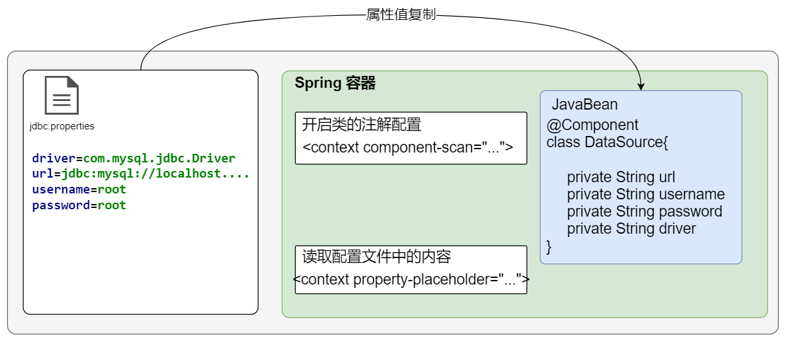

## 1.DI注解配置

在学习完 Spring DI 后，下面要通过 Spring 的注解方式来实现 DI 。

对于 DI注解形式只支持两种类型的参数注入，如下：

```markdown
# 第一类：基本类型和String
# 第二类：Object类型
    要求：注入的Object对象也要在spring的配置文件中定义，或者是用注解注释。
```

下面我们分别来演示。


### 1.1 DI 注入值注解

下面我们通过向 Spring 容器中实例化对象注入基础类型和Spring类型的属性。

```markdown
# @Value: 用于注入基本类型和String的
	作用：注入基本类型和String的数据
	属性: value：指定数据的内容，它可以支持Spring的EL表达式(SPEL)，写法就是${表达式}/#{表达式}
	位置：
		1.私有属性上(常用)
		2.set方法
	属性值：
		1.写具体的值
		2.spEL表达式
# SpEL表达式:
	作用: 从IOC容器中获取对应的值
	格式: 
		1.${key}属性值来自于properties配置文件
		2.#{key}用来执行spEL表达式，处理后的结果在赋值
		
# 加载properties配置文件中的信息存放到容器中
	在配置文件中必须通过下面的配置来加载配置文件中的内容
	<context:property-placeholder 
		location="classpath:jdbc.properties"
         file-encoding="utf-8"/>
	
 注意: 当我们使用注解注入数据时,构造器和set方法都不是必须的了.
```


对于 DI 注解 @value 形式主要用途：

 <figure class="thumbnails">
    
</figure>

**1.编写一个类，并交给 Spring 容器进行管理。**

```JAVA
package com.itheima.domain;

import org.springframework.beans.factory.annotation.Value;
import org.springframework.stereotype.Component;

import java.io.Serializable;

/**
 * <p></p>
 *
 * @Description:
 */
@Component
public class DataSource implements Serializable {
    /*
        实例对象属性赋值：基础类型和String
            使用的注解：@Value
                1.写入具体的值
                2.使用${} spEL表达式
                3.使用#{} spEL表达式（使用非常少）

     */
    /*  2.使用${} spEL表达式 */
   @Value("${jdbc.driver}")
   private String driver;
   @Value("${jdbc.url}")
   private String url;
   @Value("${jdbc.username}")
   private String username;
   @Value("${jdbc.password}")
   private String password;
   /* 1.写入具体的值 */
    @Value("88")
   private String age;

    /* 3.使用#{} spEL表达式（使用非常少） */
    @Value("#{' abc '.trim()}")
   private String name;

    @Value("#{'male'.toUpperCase()}")
    private String gender;

    public DataSource() {
    }

    public String getName() {
        return name;
    }

    public void setName(String name) {
        this.name = name;
    }

    public String getGender() {
        return gender;
    }

    public void setGender(String gender) {
        this.gender = gender;
    }

    public String getAge() {
        return age;
    }

    public void setAge(String age) {
        this.age = age;
    }

    public String getDriver() {
        return driver;
    }

    public void setDriver(String driver) {
        this.driver = driver;
    }

    public String getUrl() {
        return url;
    }

    public void setUrl(String url) {
        this.url = url;
    }

    public String getUsername() {
        return username;
    }

    public void setUsername(String username) {
        this.username = username;
    }

    public String getPassword() {
        return password;
    }

    public void setPassword(String password) {
        this.password = password;
    }

    @Override
    public String toString() {
        return "DataSource{" +
                "driver='" + driver + '\'' +
                ", url='" + url + '\'' +
                ", username='" + username + '\'' +
                ", password='" + password + '\'' +
                ", age='" + age + '\'' +
                ", name='" + name + '\'' +
                ", gender='" + gender + '\'' +
                '}';
    }
}

```


**2.编写一个配置文件的信息，配置系统参数**

```PRO
jdbc.driver=com.mysql.jdbc.Driver
jdbc.url=jdbc:mysql://localhost:3306/case2?characterEncoding=utf8
jdbc.username=root
jdbc.password=root
```


**3.Spring 的核心配置文件进行配置**

```xml
<?xml version="1.0" encoding="UTF-8"?>
<beans xmlns="http://www.springframework.org/schema/beans"
       xmlns:xsi="http://www.w3.org/2001/XMLSchema-instance"
       xmlns:context="http://www.springframework.org/schema/context"
       xsi:schemaLocation="http://www.springframework.org/schema/beans http://www.springframework.org/schema/beans/spring-beans.xsd http://www.springframework.org/schema/context http://www.springframework.org/schema/context/spring-context.xsd">

    <!-- 1.开启注解扫描 -->
    <context:component-scan base-package="com.itheima" />


    <!-- 2.加载property文件
        context 标签
            property-placeholder 加载 property文件
            location 加载本地文件：加载classpath下文:: classpath前缀
    -->
    <context:property-placeholder location="classpath:jdbc.properties" />
    
    

</beans>
```


**4.测试代码**

```java
package com.itheima.test01;

import com.itheima.domain.DataSource;
import org.junit.Test;
import org.springframework.context.ApplicationContext;
import org.springframework.context.support.ClassPathXmlApplicationContext;

/**
 * <p></p>
 *
 * @Description:
 */
public class SpringDIAnno {

    @Test
    public void test01() {

        ApplicationContext context = new ClassPathXmlApplicationContext("applicationContext.xml");

        DataSource dataSource = context.getBean("dataSource", DataSource.class);

        System.out.println(dataSource);
    }
}

```


### 1.2 DI 注入Bean注解

Spring 对于 IOC 容器中的Bean进行注入属性，提供了以下注解：

```markdown
# 方案1：
## @AutoWired 自动注入，默认按照类型
	作用：默认按照注入属性的类型注入数据
	使用位置：可以修饰在属性（可以是私有）
			 也可以修饰在setter方法上
	注入规则:
   	 	1.先按照类型类注入，如果spring容器中有该类型的一个实例，直接注入
		2.先按照类型类注入，如果spring容器中有该类型多个实例
  		  Autowired会按照实例对象的Id值和当前的变量名称一致来匹配

	属性:
        required: 必须要有@Qualifier的存在,如果不能按照名称注入成功,则为null
        	true: 此对象必须注入成功,若不成功则报错. 默认值
        	false: 可以注入不成功

## @Qualifier 修改AutoWired匹配，将按照名称匹配。
	注入规则
		1.Autowired会按照实例对象的Id值和当前的变量名称一致来匹配
  		  
	注意:此注解不能独立使用,它必须和Autowired一起使用
---------------------------------------------------------------------------------------------
# 方案2：
## @Resource 可以完成 @AutoWired 和 @Qualifier 功能
	出现：JSR规范--JSR250
	作用:默认按照bean名称和属性名称注入数据
	属性:
		name：指定bean的名称注入数据
		type：指定bean的类型注入数据
		
	注意细节:
		如果没有对应的名称与之匹配,则按照类型注入
```


#### 1.2.1 DI 注入Bean方式一

使用 @Autowired 和  @Autowired + @Qualifier

**1.编写UserSerivce类，并交给 Spring 容器进行管理。**

```java
package com.itheima.service;

/**
 * <p></p>
 *
 * @Description:
 */
public interface IUserService {

    int addUser();
}
```


```JAVA
package com.itheima.service.impl;

import com.itheima.dao.IUserDao;
import com.itheima.service.IUserService;
import org.springframework.beans.factory.annotation.Autowired;
import org.springframework.beans.factory.annotation.Qualifier;
import org.springframework.stereotype.Service;

/**
 *
 * @Description:
 */
@Service("userService")
public class UserServiceImpl implements IUserService {

    /*
        service一般调用dao获得数据
        提供dao的接口属性（解耦）
         特点：不需要提供set方法(xml形式必须要提供set方法)
          @Autowired注入Obj类型
            注入规则：
               1.先按照类型类注入，如果spring容器中有该类型的一个实例，直接注入
               2.先按照类型类注入，如果spring容器中有该类型多个实例
                 Autowired会按照实例对象的Id值和当前的变量名称一致来匹配

          @Autowired + @Qualifier
            注入规则：
                1.会按照实例对象的Id值和@Qualifier属性value一致来匹配
            属性：
                required--@Autowired
                required：
                    true(默认值)：创建对象时就会注入属性，如果属性注入失败，报错
                    false：创建对象时就会注入属性，如果属性注入失败，当前属性为：null
                            执行方式的时候会报错
            注意事项：
                  1.@Qualifier不能单独使用
                  2.@Autowired的属性required使用时，必须要和@Qualifier一起使用才生效

     */
    @Autowired(required=false)
    @Qualifier("userDao11111")
    private IUserDao dao;

    public int addUser() {

        System.out.println("UserServiceImpl 执行addUser方法");
        dao.insertUser();

        return 0;
    }
}
```


**2.编写UserDao类，配置系统参数**

```java
package com.itheima.dao;

/**
 * <p></p>
 *
 * @Description:
 */
public interface IUserDao {

    int insertUser();
}
```


```java
package com.itheima.dao.impl;

import com.itheima.dao.IUserDao;
import org.springframework.stereotype.Repository;

/**
 * <p></p>
 *
 * @Description:
 */
@Repository("userDao")
public class UserDaoImpl implements IUserDao {


    public int insertUser() {
        System.out.println("UserDaoImpl 执行insertUser方法");
        return 0;
    }
}
```


**3.Spring 的核心配置文件进行配置**

```xml
<?xml version="1.0" encoding="UTF-8"?>
<beans xmlns="http://www.springframework.org/schema/beans"
       xmlns:xsi="http://www.w3.org/2001/XMLSchema-instance"
       xmlns:context="http://www.springframework.org/schema/context"
       xsi:schemaLocation="http://www.springframework.org/schema/beans http://www.springframework.org/schema/beans/spring-beans.xsd http://www.springframework.org/schema/context http://www.springframework.org/schema/context/spring-context.xsd">

    <!-- 1.开启注解扫描 -->
    <context:component-scan base-package="com.itheima" />


    <!-- 2.加载property文件
        context 标签
            property-placeholder 加载 property文件
            location 加载本地文件：加载classpath下文:: classpath前缀
    -->
    <context:property-placeholder location="classpath:jdbc.properties" />

</beans>
```


**4.测试代码**

```java
package com.itheima.test02;

import com.itheima.service.IUserService;
import org.junit.Test;
import org.springframework.context.ApplicationContext;
import org.springframework.context.support.ClassPathXmlApplicationContext;

/**
 * <p></p>
 *
 * @Description:
 */
public class SpringDIAnno {


    @Test
    public void test01() {

        ApplicationContext context = new ClassPathXmlApplicationContext("applicationContext.xml");

        IUserService userService = context.getBean("userService", IUserService.class);

        userService.addUser();
    }
}
```


#### 1.2.2 DI 注入Bean方式二

使用 @Resource 

**1.编写UserSerivce类，并交给 Spring 容器进行管理。**

```java
package com.itheima.service;

/**
 * <p></p>
 *
 * @Description:
 */
public interface IUserService {

    int addUser();
}

```

```JAVA
package com.itheima.service.impl;

import com.itheima.dao.IUserDao;
import com.itheima.service.IUserService;
import org.springframework.stereotype.Service;

import javax.annotation.Resource;

/**
 *
 * @Description:
 */
@Service("userService2")
public class UserServiceImpl2 implements IUserService {

    /*
        @Resource注入Obj类型
          注入规则：
             1.先会按照实例对象的Id值和当前的变量名称一致来匹配
             2.先按照类型类注入，如果spring容器中有该类型多个实例，报错
          指定实例对象的id名称：
            1.将属性变量名称改为和实例对象的id值一致
            2.@Resource的属性name匹配（属性变量名称改为和实例对象的id值一致）
            3.@Resource的属性type会强制要求按照类型匹配

     */
    @Resource(type = IUserDao.class)
    // @Resource(name="userDao")
    // private IUserDao userDao;
    private IUserDao dao;

    public int addUser() {

        System.out.println("UserServiceImpl 执行addUser方法");
        dao.insertUser();

        return 0;
    }
}
```


**2.编写UserDao类，配置系统参数**

```java
package com.itheima.dao;

/**
 * <p></p>
 *
 * @Description:
 */
public interface IUserDao {

    int insertUser();
}

```

```JAVA
package com.itheima.dao.impl;

import com.itheima.dao.IUserDao;
import org.springframework.stereotype.Repository;

/**
 * <p></p>
 *
 * @Description:
 */
@Repository("userDao")
public class UserDaoImpl implements IUserDao {


    public int insertUser() {
        System.out.println("UserDaoImpl 执行insertUser方法");
        return 0;
    }
}

```

```JAVA
package com.itheima.dao.impl;

import com.itheima.dao.IUserDao;

/**
 * <p></p>
 *
 * @Description:
 */
 @Repository("userDao2")
public class UserDaoImpl2 implements IUserDao {


    public int insertUser() {
        System.out.println("UserDaoImpl 执行insertUser方法");
        return 0;
    }
}

```


**3.Spring 的核心配置文件进行配置**

```XML
<?xml version="1.0" encoding="UTF-8"?>
<beans xmlns="http://www.springframework.org/schema/beans"
       xmlns:xsi="http://www.w3.org/2001/XMLSchema-instance"
       xmlns:context="http://www.springframework.org/schema/context"
       xsi:schemaLocation="http://www.springframework.org/schema/beans http://www.springframework.org/schema/beans/spring-beans.xsd http://www.springframework.org/schema/context http://www.springframework.org/schema/context/spring-context.xsd">

    <!-- 1.开启注解扫描 -->
    <context:component-scan base-package="com.itheima" />


    <!-- 2.加载property文件
        context 标签
            property-placeholder 加载 property文件
            location 加载本地文件：加载classpath下文:: classpath前缀
    -->
    <context:property-placeholder location="classpath:jdbc.properties" />

</beans>
```


**4.测试代码**

```java
package com.itheima.test02;

import com.itheima.service.IUserService;
import org.junit.Test;
import org.springframework.context.ApplicationContext;
import org.springframework.context.support.ClassPathXmlApplicationContext;

/**
 * <p></p>
 *
 * @Description:
 */
public class SpringDIAnno {


    @Test
    public void test01() {

        ApplicationContext context = new ClassPathXmlApplicationContext("applicationContext.xml");

        IUserService userService = context.getBean("userService2", IUserService.class);

        userService.addUser();
    }
}

```


## 2.Spring的纯注解形式

在 Spring 3.0 后开始提供了一套注解形式来达到和 Xml 配置内容信息，具体注解如下：

```markdown
# 1.@Configuration: 声明该类为Spring的配置文件类
	作用：标注类为配置类
	位置：在类上标明
	等同：Spring的核心配置文件

# 2.@ComponentScan(basePackages = "com.itheima") : 指定要扫描的包
	作用：包扫描注解 
	位置：在类上标明
	等同：Context--componentScan

# 3.@PropertySource(value = "classpath:jdbc.properties") : 将配置文件交给Spring容器管理
	作用：property文件扫描 
	位置：在类上标明
	等同：Context--propertyPlaceHolder

# 4.@Bean : 将返回的对象存放到IOC容器中
	作用：bean 实例化
	位置：在方法上
	等同：bean标签
	适用场景：一般将第三方提供的类对加载到IOC容器
```


示例代码：

1.配置类：

```java
package com.itheima.config;

import com.itheima.service.IUserService;
import com.itheima.service.impl.UserServiceImpl;
import org.springframework.context.annotation.*;

/**
 *  @Configuration ：相当于xml配置文件
 *  @ComponentScan：xml文件中的 context：component-scan
 *      属性:
 *          1.basePackages(等同于value--@Aliasfor)
 *          2.value(等同于basePackages--@Aliasfor)
 *  @PropertySource:xml文件中的 context：property-placeholder
 *
 *  @ComponentScans ：出现jdk1.5 后开始出现注解，注解不能重复使用
 *                             @ComponentScans
 *  @ComponentScans编写麻烦：
 *      1.@ComponentScan的value属性为String[]
 *      2.@ComponentScan重复使用 jdk8后开始支持重复注解

 *      springboot 编程思想
 *  @Import:导入其他的Spring配置类信息
 *      只支持：类的配置形式
 */

@Configuration
// @ComponentScan(basePackages={"com.itheima"})
// @ComponentScan("com.itheima")
@ComponentScan("com.itheima")
@PropertySource("classpath:jdbc.properties")
@Import(UserConfig.class)
public class SpringConfig {


    // 通过方法来描述Bean标签
    /*
        @Bean:
        作用：实例化对象一旦创建出就会被spring容器管理
        实例对象名称命名：
            1.默认方法的名称命名
            2.@Bean属性name或value来给实例化对象命名id值
     */
    @Bean("userService")
    public IUserService getUserService() {

        UserServiceImpl userService = new UserServiceImpl();

        return userService;

    }
}
```

```java
package com.itheima.config;

import com.itheima.domain.User;
import org.springframework.context.annotation.Bean;

/**
 * <p></p>
 *
 * @Description:
 */
public class UserConfig {

    @Bean
    public User user() {
        User user = new User();
        user.setName("小吴");
        user.setAge("99");
        user.setGender("衰哥");
        return user;
    }
}
```


2.测试代码：

```java
package com.itheima.test01;

import com.itheima.config.SpringConfig;
import com.itheima.domain.User;
import com.itheima.service.IUserService;
import org.junit.Test;
import org.springframework.context.ApplicationContext;
import org.springframework.context.annotation.AnnotationConfigApplicationContext;

/**
 * <p></p>
 *
 * @Description:
 */
public class SpringAnnoTest {

    @Test
    public void test02() {

        ApplicationContext context = new AnnotationConfigApplicationContext(SpringConfig.class);

        User user = context.getBean("user", User.class);

        System.out.println(user);

    }
}

```


## 3.JdbcTemplate

Spring 对数据访问也进行了相关的支持，其中提供了 JDBCTemplate 来控制数据库持久层，下面将对此进行学习。

### 3.1 JDBC的回顾（面试）

在之前的课程中，我们已经对 JDBC的相关 Api 进行了介绍，下面一起来回顾下，JDBC 的具体操作步骤如下：

```markdown
# 1.注册驱动
	Class.forName("com.mysql.jdbc.Driver")
# 2.获得连接
    url=jdbc:mysql://localhost:3306/数据库名称
    Connection connection= DriverManager.getConnection(url,username,password);
# 3.编写sql语句
   String sql = "select * from user where id=?"
# 4.获得预处理对象
   PrepareStatement p =  connection.prepareStatement(sql)
# 5.占位符的赋值
   p.setInt(占位符的下标：从1开始，占位符的具体值)
# 6.执行sql语句，获得结果
  ResultSet rs=  p.executeQuery() -- 查询
   p.executeUpdate() -- 增删改
# 7.解析结果
 while（rs.next()）{
     rs.getInt/getString/getFloat
     
 }
# 8.关闭资源
 Resultset.close()--结果集
 PrepareStatement.close()--预处理对象
 Connection.close()--连接
```

示例代码：

```java
package com.itheima.test01;

import org.junit.Test;

import java.sql.Connection;
import java.sql.DriverManager;
import java.sql.PreparedStatement;
import java.sql.ResultSet;

/**
 * <p></p>
 *
 * @Description:
 */
public class JDBCTest {

    @Test
    public void test01() throws Exception {

        // 1.注册驱动
        Class.forName("com.mysql.jdbc.Driver");

        // 2.获得连接
        Connection connection = DriverManager.getConnection("jdbc:mysql://localhost:3306/case1","root","root");

        // 3.编写sql语句
        String sql = "select * from user where id = ?";

        // 4.获得执行语句
        PreparedStatement state = connection.prepareStatement(sql);

        // 5.设置占位符
        state.setInt(1, 1);

        // 6.获得结果
        ResultSet rs = state.executeQuery();

        // 7.处理结果数据
        while (rs.next()) {

            int id = rs.getInt("id");

            String name = rs.getString("name");

            String password = rs.getString("password");

            System.out.println(id+"--"+name+"--"+ password);
        }

        // 8.关闭资源
        rs.close();
        state.close();
        connection.close();

    }

}
```


### 3.2 JdbcTemplate 入门

**1.导入JDBCTemplate相关 jar 文件**

```XML
<dependencies>
    <!-- spring-context -->
    <dependency>
        <groupId>org.springframework</groupId>
        <artifactId>spring-context</artifactId>
        <version>5.0.5.RELEASE</version>
    </dependency>
    <!-- spring对jdcb的支持和封装 -->
    <dependency>
        <groupId>org.springframework</groupId>
        <artifactId>spring-jdbc</artifactId>
        <version>5.0.5.RELEASE</version>
    </dependency>
    <!-- mysql驱动包 -->
    <dependency>
        <groupId>mysql</groupId>
        <artifactId>mysql-connector-java</artifactId>
        <version>5.1.26</version>
        <scope>runtime</scope>
    </dependency>
    <!-- junit -->
    <dependency>
        <groupId>junit</groupId>
        <artifactId>junit</artifactId>
        <version>4.13</version>
        <scope>test</scope>
    </dependency>
</dependencies>
```


**2.编写测试方法**

```JAVA
package com.itheima.test01;

import org.junit.Test;
import org.springframework.jdbc.core.JdbcTemplate;
import org.springframework.jdbc.datasource.DriverManagerDataSource;

import java.util.List;

/**
 * <p></p>
 *
 * @Description:
 */
public class JdbcTemplateTest {

    @Test
    public void test01() {

        // 1.创建数据库连接池（数据源）--spring-jdbc中的连接池
        DriverManagerDataSource dataSource = new DriverManagerDataSource();
        //使用之前的数据库
        dataSource.setUrl("jdbc:mysql://localhost:3306/case1");
        dataSource.setUsername("root");
        dataSource.setPassword("root");
        dataSource.setDriverClassName("com.mysql.jdbc.Driver");

        // 2.创建JdbcTemplate对象--构造方法传入数据源对象
        JdbcTemplate template = new JdbcTemplate(dataSource);


        // 3.编写sql语句
        String sql = "select name from user";


        // 4.执行sql获得结果
        /*
            参数：
                1.sql语句
                2.返回数据类型
         */
        List<String> names = template.queryForList(sql, String.class);

        for (String name : names) {
            System.out.println(name);
        }


    }
}
```


### 3.3 JdbcTemplate 的 Api

 JdbcTemplate 提供了一阵套的对 JDBC 数据操作的 Api，大体上分为两种 Api。

```markdown
# 1.对数据库数据的-增删改操作
	方法：update()
	返回类型：单行单列
# 2.对数据库数据的-查询操作
	方法：queryxxxx()
	返回类型：
		1.单行单列
			select count(id) from tablename
			select name from tablename where id = xxx
		2.单行多列
			select * from tablename where id =xxx
		3.多行单列
			select name from tablename
		4.多行多列
			select * from tablename
```

#### 3.3.1 增删改操作

对于增删改，JDBCTemplate只提供了一个Api ，如下：

```markdown
# 方法：public int update(String sql,Object... args)
1. 方法参数：
		1.sql--增删改的sql语句
		2.args--增删改的参数
2. 返回参数
		int--影响的行数
```

示例代码：

```Java
package com.itheima.test01;

import org.junit.Test;
import org.springframework.jdbc.core.JdbcTemplate;
import org.springframework.jdbc.datasource.DriverManagerDataSource;

import java.util.List;

/**
 * <p></p>
 *
 * @Description:
 */
public class JdbcTemplateTest {
    
    //封装代码
    private JdbcTemplate getJdbcTemplate() {
        // 1.创建数据库连接池（数据源）--spring-jdbc中的连接池
        DriverManagerDataSource dataSource = new DriverManagerDataSource();
        //使用之前的数据库
        dataSource.setUrl("jdbc:mysql://localhost:3306/case1");
        dataSource.setUsername("root");
        dataSource.setPassword("root");
        dataSource.setDriverClassName("com.mysql.jdbc.Driver");

        // 2.创建JdbcTemplate对象--构造方法传入数据源对象
        return new JdbcTemplate(dataSource);
    }

    @Test
    public void insertTest() {

        // 代码的方法封装快捷键：ctrl+alt+m

        // 1.创建数据库连接池（数据源）--spring-jdbc中的连接池
        JdbcTemplate template = getJdbcTemplate();


        // 3.编写sql语句
        String sql = "insert into user(name,password) values (?,?)";


        // 4.执行sql获得结果
        /*
            参数：
                1.sql语句
                2.占位符的具体值(可以是数组)
         */
        String[] params = {"小毛","123"};
        // int result = template.update(sql, "小毛", "123");
        int result = template.update(sql, params);

        System.out.println(result);


    }

    @Test
    public void updateTest() {

        // 代码的方法封装快捷键：ctrl+alt+m

        // 1.创建数据库连接池（数据源）--spring-jdbc中的连接池
        JdbcTemplate template = getJdbcTemplate();


        // 3.编写sql语句
        String sql = "update user set name=? where id=?";


        // 4.执行sql获得结果
        /*
            参数：
                1.sql语句
                2.占位符的具体值(可以是数组)
         */

        int result = template.update(sql, "小猫",24);

        System.out.println(result);


    }

    @Test
    public void deleteTest() {

        // 代码的方法封装快捷键：ctrl+alt+m

        // 1.创建数据库连接池（数据源）--spring-jdbc中的连接池
        JdbcTemplate template = getJdbcTemplate();


        // 3.编写sql语句
        String sql = "delete from user where id=?";


        // 4.执行sql获得结果
        /*
            参数：
                1.sql语句
                2.占位符的具体值(可以是数组)
         */

        int result = template.update(sql, 24);

        System.out.println(result);


    }

}
```


#### 3.3.1 查询操作

对于查询，JDBCTemplate只提供了丰富的Api ，如下：

```markdown
# 1.方法：public int queryForObject(String sql,数据封装类型,Object... args)
1. 操作返回的数据：
		1.单行多列
		2.单行单列
2. 方法参数：
		1.sql--增删改的sql语句
		2.返回数据的封装类型类型
			*类对象
			*BeanProperRowMapper封装数据
		3.args--参数
3. 返回参数
		封装的类型
		

# 2.方法：public int queryForList(String sql,数据封装类型,Object... args)
1. 操作返回的数据：
		1.多行单列
		1.多行多列
2. 方法参数：
		1.sql--增删改的sql语句
		2.args--参数
3. 返回参数
		list数据
		
# 3.方法：public int queryForMap(String sql,Object... args)
1. 操作返回的数据：
		1.单行多列
2. 方法参数：
		1.sql--增删改的sql语句
		2.args--参数
3. 返回参数
		map数据

# 4.方法：public int query(String sql,数据封装类型,Object... args)
1. 操作返回的数据：
		1.多行多列
2. 方法参数：
		1.sql--增删改的sql语句
		2.返回数据的封装类型类型
			*BeanProperRowMapper封装数据	
			*RowMapper封装数据--可以对数据库数据进行处理操作
		3.args--参数
3. 返回参数
		list封装的类型
```


实例代码：

QueryForObect方法：

```JAVA
package com.itheima.test02;

import com.itheima.domain.User;
import org.junit.Test;
import org.springframework.jdbc.core.BeanPropertyRowMapper;
import org.springframework.jdbc.core.JdbcTemplate;
import org.springframework.jdbc.datasource.DriverManagerDataSource;

/**
 * <p></p>
 *
 * @Description:
 */
public class JdbcTemplateQueryTest {


    /*
    # 1.方法：public int queryForObject(String sql,数据封装类型,Object... args)
        1. 操作返回的数据：
                1.单行多列
                2.单行单列
        2. 方法参数：
                1.sql--增删改的sql语句
                2.返回数据的封装类型类型
                    *类对象
                    *BeanProperRowMapper封装数据
                3.args--参数
        3. 返回参数
                封装的类型
     */
    @Test
    public void queryForObject01() {
        JdbcTemplate jdbcTemplate = getJdbcTemplate();

        // 单行单列--类型
        String sql = "select count(id) from user ";


        // String name = jdbcTemplate.queryForObject(sql, String.class);
        // int counts = jdbcTemplate.queryForObject(sql,params,int.class);
        /*
            queryForObject:
              参数：
                1.sql语句
                2.占位符具体的值arrs(可以省略)
                3.返回的类型
                    具体的类.class
                    new BeanproperyRowMapper()
               返回数据：
                    1.具体的类.class值
                    2.BeanproperyRowMapper封装的数据类型
         */
        int counts = jdbcTemplate.queryForObject(sql,int.class);

        System.out.println(counts);

    }


    @Test
    public void queryForObject02() {
        JdbcTemplate jdbcTemplate = getJdbcTemplate();

        // 单行多列-类型
        String sql = "select * from user where id=?";

        String[] params = {"23"};
        /*
            queryForObject:--单个数据
              参数：
                1.sql语句
                2.占位符具体的值arrs(可以省略)
                3.返回的类型
                    具体的类.class
                    new BeanproperyRowMapper()
               返回数据：
                    1.具体的类.class值
                    2.BeanproperyRowMapper封装的数据类型
         */
        User user = jdbcTemplate.queryForObject(sql, params, new BeanPropertyRowMapper<>(User.class));

        System.out.println(user);

    }


    private JdbcTemplate getJdbcTemplate() {
        // 1.创建数据库连接池
        DriverManagerDataSource dataSource = new DriverManagerDataSource();
        dataSource.setUrl("jdbc:mysql://127.0.0.1:3306/case1");
        dataSource.setUsername("root");
        dataSource.setPassword("root");
        dataSource.setDriverClassName("com.mysql.jdbc.Driver");


        // 2.创建JdbcTemplate对象
        return new JdbcTemplate(dataSource);
    }
}
```

QueryForList：

```java
package com.itheima.test03;

import org.junit.Test;
import org.springframework.jdbc.core.JdbcTemplate;
import org.springframework.jdbc.datasource.DriverManagerDataSource;

import java.util.List;
import java.util.Map;

/**
 * <p></p>
 *
 * @Description:
 */
public class JdbcTemplateQueryTest {


    /*
    # 2.方法：public int queryForList(String sql,数据封装类型,Object... args)
        1. 操作返回的数据：
                1.多行单列
                1.多行多列
        2. 方法参数：
                1.sql--增删改的sql语句
                2.args--参数
        3. 返回参数
                list数据
     */

    @Test
    public void test01() {
        //多行单列
        String sql = "select name from user";

        JdbcTemplate jdbcTemplate = getJdbcTemplate();

        /*
            queryForList
               参数：
                    1.sql语句
                    2.返回数据的类型
               返回类型：
                    list数据

         */
        List<String> names = jdbcTemplate.queryForList(sql, String.class);

        System.out.println(names);

    }


    @Test
    public void test02() {
        //多行多列
        String sql = "select * from user";

        JdbcTemplate jdbcTemplate = getJdbcTemplate();

        /*
            queryForList
               参数：
                    1.sql语句
               返回类型：
                    list数据

         */
        List<Map<String, Object>> maps = jdbcTemplate.queryForList(sql);

        System.out.println(maps);
    }


    private JdbcTemplate getJdbcTemplate() {
        // 1.创建数据库连接池
        DriverManagerDataSource dataSource = new DriverManagerDataSource();
        dataSource.setUrl("jdbc:mysql://127.0.0.1:3306/case1");
        dataSource.setUsername("root");
        dataSource.setPassword("root");
        dataSource.setDriverClassName("com.mysql.jdbc.Driver");


        // 2.创建JdbcTemplate对象
        return new JdbcTemplate(dataSource);
    }
}
```

QueryForMap

```java
package com.itheima.test04;

import org.junit.Test;
import org.springframework.jdbc.core.JdbcTemplate;
import org.springframework.jdbc.datasource.DriverManagerDataSource;

import java.util.Map;

/**
 * <p></p>
 *
 * @Description:
 */
public class JdbcTemplateQueryTest {

    /*
    # 3.方法：public int queryForMap(String sql,Object... args)
        1. 操作返回的数据：
                1.单行多列
        2. 方法参数：
                1.sql--增删改的sql语句
                2.args--参数
        3. 返回参数
                数据
     */

    @Test
    public void test01() {

        //queryForMap：返回单条数据
        String sql = "select * from user where id=?";

        JdbcTemplate jdbcTemplate = getJdbcTemplate();

        Map<String, Object> map = jdbcTemplate.queryForMap(sql, 23);

        System.out.println(map);


    }


    private JdbcTemplate getJdbcTemplate() {
        // 1.创建数据库连接池
        DriverManagerDataSource dataSource = new DriverManagerDataSource();
        dataSource.setUrl("jdbc:mysql://127.0.0.1:3306/case1");
        dataSource.setUsername("root");
        dataSource.setPassword("root");
        dataSource.setDriverClassName("com.mysql.jdbc.Driver");


        // 2.创建JdbcTemplate对象
        return new JdbcTemplate(dataSource);
    }
}
```

Query:

```java
package com.itheima.test05;

import com.itheima.domain.User;
import org.junit.Test;
import org.springframework.jdbc.core.BeanPropertyRowMapper;
import org.springframework.jdbc.core.JdbcTemplate;
import org.springframework.jdbc.core.RowMapper;
import org.springframework.jdbc.datasource.DriverManagerDataSource;

import java.sql.ResultSet;
import java.sql.SQLException;
import java.util.List;

/**
 * <p></p>
 *
 * @Description:
 */
public class JdbcTemplateQueryTest {


    /*
    # 4.方法：public int query(String sql,数据封装类型,Object... args)
        1. 操作返回的数据：
                1.多行多列
        2. 方法参数：
                1.sql--增删改的sql语句
                2.返回数据的封装类型类型
                    *BeanProperRowMapper封装数据
                3.args--参数
        3. 返回参数
                list
     */

    @Test
    public void test01() {

        String sql = "select * from user";

        JdbcTemplate jdbcTemplate = getJdbcTemplate();

        /*
            query:
                参数：
                    1.sql
                    2.返回数据的数据类型封装 new BeanPropertyRowMaper()
                    3.占位符的值
                返回的结果：
                    list
         */
        List<User> users = jdbcTemplate.query(sql, new BeanPropertyRowMapper<>(User.class));

        System.out.println(users);


    }

    @Test
    public void test02() {

        String sql = "select * from user";

        JdbcTemplate jdbcTemplate = getJdbcTemplate();

        /*
            query:
                参数：
                    1.sql
                    2.返回数据的数据类型封装 new BeanPropertyRowMaper()
                    3.占位符的值
                返回的结果：
                    list
         */
        List<User> users = jdbcTemplate.query(sql, new RowMapper<User>() {
            @Override
            public User mapRow(ResultSet resultSet, int i) throws SQLException {

                // 当前方法需要返回每一条数据内容（User对象）
                User user = new User();
                user.setId(resultSet.getString("id"));
                user.setName(resultSet.getString("name")+"1");
                user.setPassword(resultSet.getString("password"));
                return user;
            }
        });

        System.out.println(users);


    }


    private JdbcTemplate getJdbcTemplate() {
        // 1.创建数据库连接池
        DriverManagerDataSource dataSource = new DriverManagerDataSource();
        dataSource.setUrl("jdbc:mysql://127.0.0.1:3306/case1");
        dataSource.setUsername("root");
        dataSource.setPassword("root");
        dataSource.setDriverClassName("com.mysql.jdbc.Driver");


        // 2.创建JdbcTemplate对象
        return new JdbcTemplate(dataSource);
    }


}

```


### 3.4 Spring整合 JDBCTemplate

下面通过的 Spring 的 IOC容器来配置 JDBCTemplate，并通过 DI 注入属性。

**1.编写 jdbc.properties 数据库信息配置文件**

```properties
jdbc.driver=com.mysql.jdbc.Driver
jdbc.url=jdbc:mysql://localhost:3306/case1
jdbc.username=root
jdbc.password=root
```

**2.编写Spring核心配置文件**

```XML
<?xml version="1.0" encoding="UTF-8"?>
<beans xmlns="http://www.springframework.org/schema/beans"
       xmlns:xsi="http://www.w3.org/2001/XMLSchema-instance"
       xsi:schemaLocation="http://www.springframework.org/schema/beans http://www.springframework.org/schema/beans/spring-beans.xsd">

    <!-- 加载配置文件信息 -->
    <bean class="org.springframework.beans.factory.config.PropertyPlaceholderConfigurer">
        <property name="locations">
            <list>
                <value>classpath:jdbc.properties</value>
            </list>
        </property>
    </bean>

    <!-- 配置数据源 -->
    <bean id="dataSource" class="org.springframework.jdbc.datasource.DriverManagerDataSource">
        <property name="url" value="${jdbc.url}"></property>
        <property name="username" value="${jdbc.username}"></property>
        <property name="password" value="${jdbc.password}"></property>
        <property name="driverClassName" value="${jdbc.driver}"></property>
    </bean>

    <!-- 配置JDBCTemplate -->
    <bean id="jdbcTemplate" class="org.springframework.jdbc.core.JdbcTemplate">
        <constructor-arg name="dataSource" ref="dataSource"></constructor-arg>
    </bean>

</beans>
```

**3.编写测试类**

```JAVA

```


### 3.5  JDBCTemplate支持数据源

Spring的JDBCTemplate 支持很多种热门开源的数据库连接池下面，下面我们分别来切换不同的数据库连接池来操作 JDBCTemplate。

#### 3.5.1 Spring自带连接池

```xml
<dependency>
    <groupId>org.springframework</groupId>
    <artifactId>spring-jdbc</artifactId>
    <version>5.0.5.RELEASE</version>
</dependency>
```

已经在入门中讲解，故略。


#### 3.5.2 C3P0数据库连接池支持

C3P0是一个开源的[JDBC](https://baike.baidu.com/item/JDBC/485214)连接池，它实现了数据源和[JNDI](https://baike.baidu.com/item/JNDI/3792442)绑定，支持JDBC3规范和JDBC2的标准扩展。目前使用它的开源项目有Hibernate、Spring等。 

**1.引入依赖jar文件**

```XML
<dependency>
    <groupId>c3p0</groupId>
    <artifactId>c3p0</artifactId>
    <version>0.9.1.2</version>
</dependency>
```

**2.配置数据源**

```XML
<?xml version="1.0" encoding="UTF-8"?>
<beans xmlns="http://www.springframework.org/schema/beans"
       xmlns:xsi="http://www.w3.org/2001/XMLSchema-instance"
       xsi:schemaLocation="http://www.springframework.org/schema/beans http://www.springframework.org/schema/beans/spring-beans.xsd">

    <!-- 加载配置文件信息 -->
    <bean class="org.springframework.beans.factory.config.PropertyPlaceholderConfigurer">
        <property name="locations">
            <list>
                <value>classpath:jdbc.properties</value>
            </list>
        </property>
    </bean>

    <!-- 配置数据源 -->
    <bean id="dataSource" class="com.mchange.v2.c3p0.ComboPooledDataSource">
        <property name="jdbcUrl" value="${jdbc.url}"></property>
        <property name="user" value="${jdbc.username}"></property>
        <property name="password" value="${jdbc.password}"></property>
        <property name="driverClass" value="${jdbc.driver}"></property>
    </bean>

    <!-- 配置JDBCTemplate -->
    <bean id="jdbcTemplate" class="org.springframework.jdbc.core.JdbcTemplate">
        <constructor-arg name="dataSource" ref="dataSource"></constructor-arg>
    </bean>

</beans>
```


#### 3.5.3 druid数据库连接池支持

DRUID 是阿里巴巴开源平台上一个数据库连接池实现，它结合了 C3P0、DBCP、PROXOOL等DB池的优点，同时加入了日志监控 。

**1.引入依赖jar文件**

```xml
<dependency>
    <groupId>com.alibaba</groupId>
    <artifactId>druid</artifactId>
    <version>1.1.9</version>
</dependency>
```

**2.配置数据源**

```xml
<?xml version="1.0" encoding="UTF-8"?>
<beans xmlns="http://www.springframework.org/schema/beans"
       xmlns:xsi="http://www.w3.org/2001/XMLSchema-instance"
       xsi:schemaLocation="http://www.springframework.org/schema/beans http://www.springframework.org/schema/beans/spring-beans.xsd">

    <!-- 加载配置文件信息 -->
    <bean class="org.springframework.beans.factory.config.PropertyPlaceholderConfigurer">
        <property name="locations">
            <list>
                <value>classpath:jdbc.properties</value>
            </list>
        </property>
    </bean>

    <!-- 配置数据源 -->
    <bean id="dataSource" class="com.alibaba.druid.pool.DruidDataSource">
        <property name="url" value="${jdbc.url}"></property>
        <property name="username" value="${jdbc.username}"></property>
        <property name="password" value="${jdbc.password}"></property>
        <property name="driverClassName" value="${jdbc.driver}"></property>
    </bean>

    <!-- 配置JDBCTemplate -->
    <bean id="jdbcTemplate" class="org.springframework.jdbc.core.JdbcTemplate">
        <constructor-arg name="dataSource" ref="dataSource"></constructor-arg>
    </bean>

</beans>
```


## 4. IOC和JDCBTemmplate练习

通过上面的学习，下面需要对 IOC 和 JDBCTemplate 的进行不同中方式的配置，配置方式分为三种：

```markdown
# 1.基于纯xml配置
	所有的配置信息都要写在 xml 文件中
# 2.基于xml和注解配置
	1.jar包中的类配置使用 xml 配置方式
	2.项目中编写的类使用注解方式
# 3.基于纯注解配置
	所有的配置信息都要写在配置类中
```


### 4.0 pom文件依赖

```XML
 <dependencies>
		<!--spring核心-->
        <dependency>
            <groupId>org.springframework</groupId>
            <artifactId>spring-context</artifactId>
            <version>5.0.5.RELEASE</version>
        </dependency>


        <!-- spring对jdcb的支持和封装  -->
        <dependency>
            <groupId>org.springframework</groupId>
            <artifactId>spring-jdbc</artifactId>
            <version>5.0.5.RELEASE</version>
        </dependency>

        <!-- mysql驱动-->
        <dependency>
            <groupId>mysql</groupId>
            <artifactId>mysql-connector-java</artifactId>
            <version>5.1.26</version>
            <scope>runtime</scope>
        </dependency>

    
        <dependency>
            <groupId>junit</groupId>
            <artifactId>junit</artifactId>
            <version>4.12</version>
            <scope>test</scope>
        </dependency>
    </dependencies>


    <build>
        <plugins>
            <plugin>
                <groupId>org.apache.maven.plugins</groupId>
                <artifactId>maven-compiler-plugin</artifactId>
                <version>3.2</version>
                <configuration>
                    <source>1.8</source>
                    <target>1.8</target>
                    <encoding>utf-8</encoding>
                </configuration>
            </plugin>
        </plugins>
    </build>
```


### 4.1 基于纯XML配置

- dao层

```JAVA
package com.itheima.dao;

import com.itheima.domain.User;

import java.util.List;

/**
 * <p></p>
 *
 * @Description:
 */
public interface IUserDao {

    List<User> selectUsers();

}
```


```JAVA
package com.itheima.dao.impl;

import com.itheima.dao.IUserDao;
import com.itheima.domain.User;
import org.springframework.beans.factory.annotation.Autowired;
import org.springframework.jdbc.core.BeanPropertyRowMapper;
import org.springframework.jdbc.core.JdbcTemplate;
import org.springframework.stereotype.Repository;

import java.util.List;

/**
 * <p></p>
 *
 * @Description:
 */
public class UserDaoImpl implements IUserDao {

    private JdbcTemplate jdbcTemplate;

    public void setJdbcTemplate(JdbcTemplate jdbcTemplate) {
        this.jdbcTemplate = jdbcTemplate;
    }

    public List<User> selectUsers() {
        String sql = "select * from user";
        List<User> users = jdbcTemplate.query(sql, new BeanPropertyRowMapper<User>(User.class));
        return users;
    }
}

```


- service层

```JAVA
package com.itheima.service;

import com.itheima.domain.User;

import java.util.List;

/**
 * <p></p>
 *
 * @Description:
 */
public interface IUserService {

    List<User> queryUsers();
}

```


```java
package com.itheima.service.impl;

import com.itheima.dao.IUserDao;
import com.itheima.domain.User;
import com.itheima.service.IUserService;
import org.springframework.beans.factory.annotation.Autowired;
import org.springframework.stereotype.Service;

import java.util.List;

/**
 * <p></p>
 *
 * @Description:
 */
public class UserServiceImpl implements IUserService {

    private IUserDao dao;

    public void setDao(IUserDao dao) {
        this.dao = dao;
    }

    public List<User> queryUsers() {
        List<User> users = dao.selectUsers();
        return users;
    }
}

```


- 配置文件

jdbc.properties

```properties
jdbc.driver=com.mysql.jdbc.Driver
jdbc.url=jdbc:mysql://localhost:3306/case1
jdbc.username=root
jdbc.password=root
```

spring配置文件

```XML
<?xml version="1.0" encoding="UTF-8"?>
<beans xmlns="http://www.springframework.org/schema/beans"
       xmlns:xsi="http://www.w3.org/2001/XMLSchema-instance"
       xmlns:context="http://www.springframework.org/schema/context"
       xsi:schemaLocation="http://www.springframework.org/schema/beans http://www.springframework.org/schema/beans/spring-beans.xsd http://www.springframework.org/schema/context http://www.springframework.org/schema/context/spring-context.xsd">

    <bean class="org.springframework.beans.factory.config.PropertyPlaceholderConfigurer">
        <property name="locations">
            <list>
                <value>classpath:jdbc.properties</value>
            </list>
        </property>
    </bean>

    <context:component-scan base-package="com.itheima" />

    <bean id="dataSource3" class="com.alibaba.druid.pool.DruidDataSource">
        <property name="url" value="${jdbc.url}"></property>
        <property name="username" value="${jdbc.username}"></property>
        <property name="password" value="${jdbc.password}"></property>
        <property name="driverClassName" value="${jdbc.driver}"></property>
    </bean>

    <!-- 配置JDBCTemplate -->
    <bean id="jdbcTemplate" class="org.springframework.jdbc.core.JdbcTemplate">
        <constructor-arg name="dataSource" ref="dataSource3"></constructor-arg>
    </bean>


    <bean id="userDao" class="com.itheima.dao.impl.UserDaoImpl">
        <property name="jdbcTemplate"  ref="jdbcTemplate"></property>
    </bean>

    <bean id="userService" class="com.itheima.service.impl.UserServiceImpl">
        <property name="dao" ref="userDao"></property>
    </bean>

</beans>
```


- 测试类

```java
package com.itheima.test04;

import com.itheima.domain.User;
import com.itheima.service.IUserService;
import org.junit.Test;
import org.springframework.context.ApplicationContext;
import org.springframework.context.support.ClassPathXmlApplicationContext;

import java.util.List;

/**
 * <p></p>
 *
 * @Description:
 */
public class SpringXMLConfig {

    @Test
    public void test() {

        ApplicationContext context = new ClassPathXmlApplicationContext("applicationContext.xml");

        IUserService userService = context.getBean("userService", IUserService.class);

        List<User> users = userService.queryUsers();

        System.out.println(users);
    }
}

```


### 4.1 基于xml和注解配置

- dao层

```java
package com.itheima.dao;

import com.itheima.domain.User;

import java.util.List;

/**
 * <p></p>
 *
 * @Description:
 */
public interface IUserDao {

    List<User> selectUsers();

}

```


```java
package com.itheima.dao.impl;

import com.itheima.dao.IUserDao;
import com.itheima.domain.User;
import org.springframework.beans.factory.annotation.Autowired;
import org.springframework.jdbc.core.BeanPropertyRowMapper;
import org.springframework.jdbc.core.JdbcTemplate;
import org.springframework.stereotype.Repository;

import java.util.List;

/**
 * <p></p>
 *
 * @Description:
 */
@Repository
public class UserDaoImpl implements IUserDao {

    @Autowired
    private JdbcTemplate jdbcTemplate;


    public List<User> selectUsers() {
        String sql = "select * from user";
        List<User> users = jdbcTemplate.query(sql, new BeanPropertyRowMapper<User>(User.class));
        return users;
    }
}

```


- service层

```java
package com.itheima.service;

import com.itheima.domain.User;

import java.util.List;

/**
 * <p></p>
 *
 * @Description:
 */
public interface IUserService {

    List<User> queryUsers();
}

```


```java
package com.itheima.service.impl;

import com.itheima.dao.IUserDao;
import com.itheima.domain.User;
import com.itheima.service.IUserService;
import org.springframework.beans.factory.annotation.Autowired;
import org.springframework.stereotype.Service;

import java.util.List;

/**
 * <p></p>
 *
 * @Description:
 */
@Service
public class UserServiceImpl implements IUserService {

    @Autowired
    private IUserDao dao;


    public List<User> queryUsers() {
        List<User> users = dao.selectUsers();
        return users;
    }
}

```


- 配置文件

jdbc.properties

```properties
jdbc.driver=com.mysql.jdbc.Driver
jdbc.url=jdbc:mysql://localhost:3306/case1
jdbc.username=root
jdbc.password=root
```

spring配置文件

```xml
<?xml version="1.0" encoding="UTF-8"?>
<beans xmlns="http://www.springframework.org/schema/beans"
       xmlns:xsi="http://www.w3.org/2001/XMLSchema-instance"
       xmlns:context="http://www.springframework.org/schema/context"
       xsi:schemaLocation="http://www.springframework.org/schema/beans http://www.springframework.org/schema/beans/spring-beans.xsd http://www.springframework.org/schema/context http://www.springframework.org/schema/context/spring-context.xsd">

    <bean class="org.springframework.beans.factory.config.PropertyPlaceholderConfigurer">
        <property name="locations">
            <list>
                <value>classpath:jdbc.properties</value>
            </list>
        </property>
    </bean>

    <context:component-scan base-package="com.itheima" />

    <bean id="dataSource3" class="com.alibaba.druid.pool.DruidDataSource">
        <property name="url" value="${jdbc.url}"></property>
        <property name="username" value="${jdbc.username}"></property>
        <property name="password" value="${jdbc.password}"></property>
        <property name="driverClassName" value="${jdbc.driver}"></property>
    </bean>

    <!-- 配置JDBCTemplate -->
    <bean id="jdbcTemplate" class="org.springframework.jdbc.core.JdbcTemplate">
        <constructor-arg name="dataSource" ref="dataSource3"></constructor-arg>
    </bean>

</beans>
```


- 测试类

```java
package com.itheima.test04;

import com.itheima.domain.User;
import com.itheima.service.IUserService;
import org.junit.Test;
import org.springframework.context.ApplicationContext;
import org.springframework.context.support.ClassPathXmlApplicationContext;

import java.util.List;

/**
 * <p></p>
 *
 * @Description:
 */
public class SpringXMLConfig {

    @Test
    public void test() {

        ApplicationContext context = new ClassPathXmlApplicationContext("applicationContext.xml");

        IUserService userService = context.getBean("userServiceImpl", IUserService.class);

        List<User> users = userService.queryUsers();

        System.out.println(users);
    }
}

```


### 4.1 基于纯注解配置

- dao层

```java
package com.itheima.dao;

import com.itheima.domain.User;

import java.util.List;

/**
 * <p></p>
 *
 * @Description:
 */
public interface IUserDao {

    List<User> selectUsers();

}
```


```java
package com.itheima.dao.impl;

import com.itheima.dao.IUserDao;
import com.itheima.domain.User;
import org.springframework.beans.factory.annotation.Autowired;
import org.springframework.jdbc.core.BeanPropertyRowMapper;
import org.springframework.jdbc.core.JdbcTemplate;
import org.springframework.stereotype.Repository;

import java.util.List;

/**
 * <p></p>
 *
 * @Description:
 */
@Repository
public class UserDaoImpl implements IUserDao {

    @Autowired
    private JdbcTemplate jdbcTemplate;


    public List<User> selectUsers() {
        String sql = "select * from user";
        List<User> users = jdbcTemplate.query(sql, new BeanPropertyRowMapper<User>(User.class));
        return users;
    }
}

```


- service层

```java
package com.itheima.service;

import com.itheima.domain.User;

import java.util.List;

/**
 * <p></p>
 *
 * @Description:
 */
public interface IUserService {

    List<User> queryAll();
}

```


```java
package com.itheima.service.impl;

import com.itheima.dao.IUserDao;
import com.itheima.domain.User;
import com.itheima.service.IUserService;
import org.springframework.beans.factory.annotation.Autowired;
import org.springframework.stereotype.Service;

import java.util.List;

/**
 * <p></p>
 *
 * @Description:
 */
@Service("userService")
public class UserServiceImpl implements IUserService {

    @Autowired
    private IUserDao dao;

    @Override
    public List<User> queryAll() {

        List<User> users = dao.selectUsers();

        return users;
    }
}
```


- 配置文件

jdbc.properties

```properties
jdbc.driver=com.mysql.jdbc.Driver
jdbc.url=jdbc:mysql://localhost:3306/case1
jdbc.username=root
jdbc.password=root
```

spring配置类

```java
package com.itheima.config;

import org.springframework.beans.factory.annotation.Qualifier;
import org.springframework.beans.factory.annotation.Value;
import org.springframework.context.annotation.Bean;
import org.springframework.context.annotation.ComponentScan;
import org.springframework.context.annotation.Configuration;
import org.springframework.context.annotation.PropertySource;
import org.springframework.jdbc.core.JdbcTemplate;
import org.springframework.jdbc.datasource.DriverManagerDataSource;

/**
 * <p></p>
 *
 * @Description:
 */
@Configuration
@ComponentScan("com.itheima")
@PropertySource("classpath:jdbc.properties")
public class SpringConfig {

    // 通过属性来接收配置文件中的jdbc内容
    @Value("${jdbc.driver}")
    private String driver;
    @Value("${jdbc.url}")
    private String url;
    @Value("${jdbc.username}")
    private String username;
    @Value("${jdbc.password}")
    private String password;


    // 配合数据库连接池
    @Bean("datasource")
    public DriverManagerDataSource getDataSource() {
        DriverManagerDataSource dataSource = new DriverManagerDataSource();
        dataSource.setUrl(url);
        dataSource.setUsername(username);
        dataSource.setPassword(password);
        dataSource.setDriverClassName(driver);
        return dataSource;
    }

    // 配置jdbcTempalte

    /**
     * 如果通过@Bean来配置实例化对象
     *  当前实例化对象需要参数，通过方法的参数来进行传递
     *  参数如果需要的是Spring容器中的实例化对象，可以通过@Qualifier来传入属性
     */
    @Bean("jdbcTemplate")
    public JdbcTemplate getJdbcTempalte(@Qualifier("datasource") DriverManagerDataSource dataSource) {

        JdbcTemplate jdbcTemplate = new JdbcTemplate(dataSource);

        return jdbcTemplate;

    }
}
```


- 测试类

```java
package com.itheima.test01;

import com.itheima.config.SpringConfig;
import com.itheima.domain.User;
import com.itheima.service.IUserService;
import org.junit.Test;
import org.springframework.context.ApplicationContext;
import org.springframework.context.annotation.AnnotationConfigApplicationContext;

import java.util.List;

/**
 * <p></p>
 *
 * @Description:
 */
public class SpringAnnoTest {

    @Test
    public void test01() {

        ApplicationContext context = new AnnotationConfigApplicationContext(SpringConfig.class);

        IUserService userService = context.getBean("userService", IUserService.class);

        List<User> users = userService.queryAll();

        System.out.println(users);


    }
}
```


## 5. Spring整合 Junit

Spring 容器在 Junit 测试时，都需要通过 Spring 的 Api 代码来创建 Spring 的容器并加载配置文件。这样做太过繁琐。为了简化操作，Spring特此对 Junit 进行整合，方便对 Spring 容器进行测试。

### 5.1 Spring整合 Junit 准备

Spring 对于Junit 的整合需要引入下面的 jar文件，如下：

```XML
<!-- junit -->
<dependency>
    <groupId>junit</groupId>
    <artifactId>junit</artifactId>
    <version>4.12</version>
    <scope>test</scope>
</dependency>

<!-- Spring对junit整合 -->
<dependency>
    <groupId>org.springframework</groupId>
    <artifactId>spring-test</artifactId>
    <version>5.0.5.RELEASE</version>
</dependency>
```

Spring5 对于 Junit 版本必须要求是 4.12以上的版本


### 5.2 Spring整合 Junit 相关注解

Spring 对于 Junit 的整合提供了下面的注解：

```markdown
# 1.@RunWith(SpringJUnit4ClassRunner.class)
	作用：使用Spring对Junit整合来运行Junit
	位置：在测试类上
# 2.@ContextConfiguration
	作用：指定Spring的配置文件和配置类
	位置：在测试类上
	相关属性：
		locations：指定spring的核心配置文件
		classes：编写配置
```

测试代码：

```java
package com.itheima.test05;

import com.itheima.config.SpringConfig;
import com.itheima.domain.User;
import com.itheima.service.IUserService;
import org.junit.Test;
import org.junit.runner.RunWith;
import org.springframework.beans.factory.annotation.Autowired;
import org.springframework.test.context.ContextConfiguration;
import org.springframework.test.context.junit4.SpringJUnit4ClassRunner;

import java.util.List;

/**
 * <p></p>
 *
 * @Description:
 */
@RunWith(SpringJUnit4ClassRunner.class)
// @ContextConfiguration(locations = {"classpath:applicationContext.xml"})
@ContextConfiguration(classes = {SpringConfig.class})
public class SpringJunit {

    @Autowired
    private IUserService userService;

     @Test
    public void test02() {

        List<User> users = userService.queryAll();

        System.out.println(users);

    }
}
```


