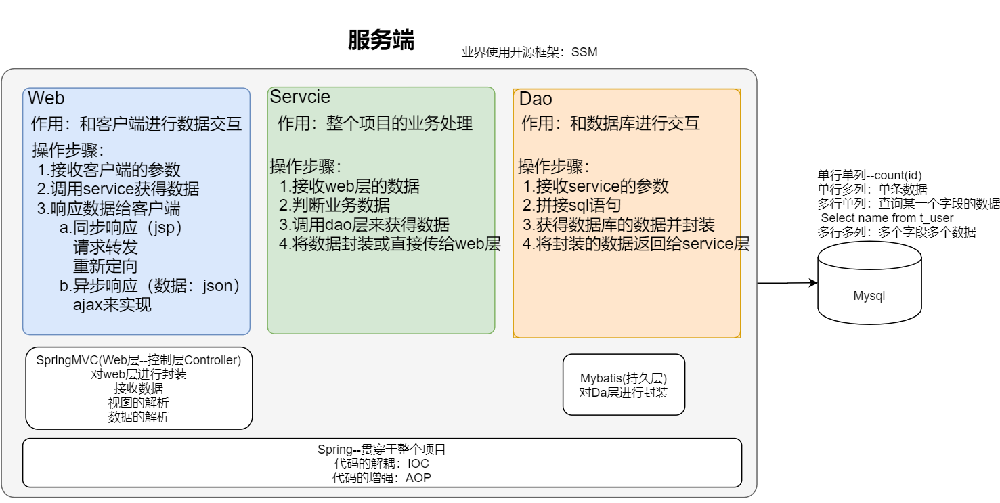
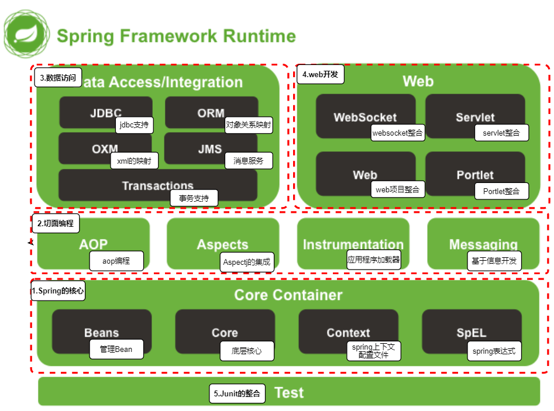
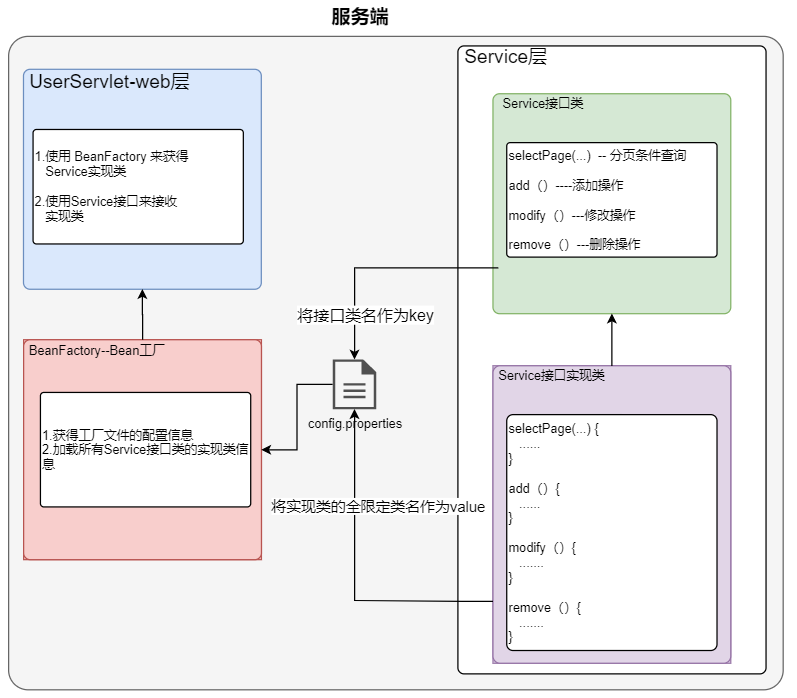
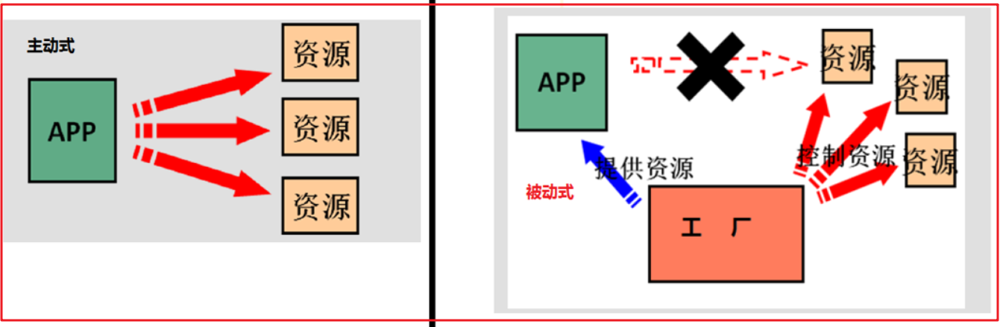
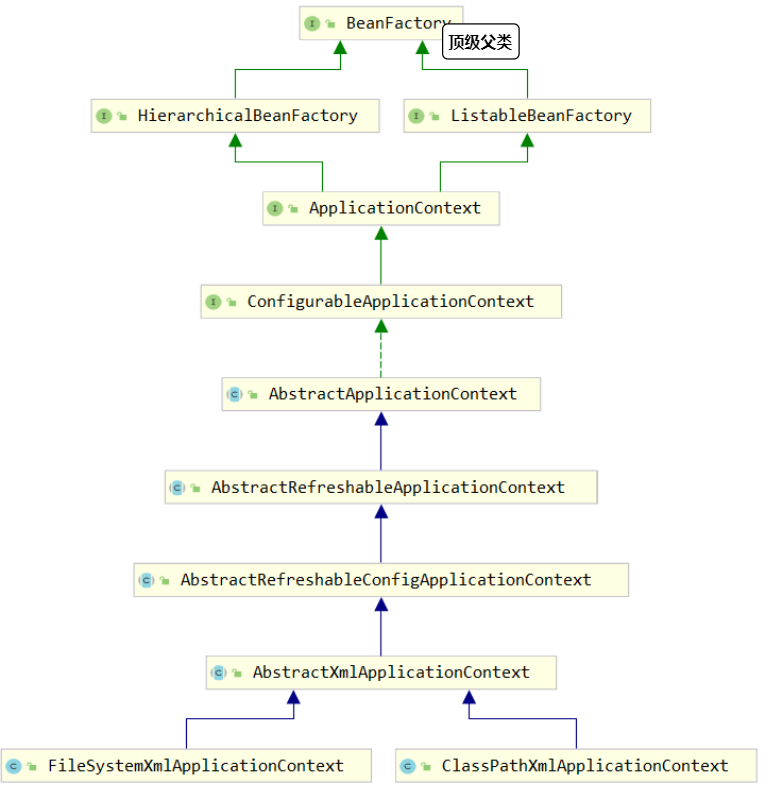

# java学习
[](https://www.npmjs.com/package/docsify-themeable)
[](https://www.codacy.com/app/jhildenbiddle/docsify-themeable?utm_source=github.com&amp;utm_medium=referral&amp;utm_content=jhildenbiddle/docsify-themeable&amp;utm_campaign=Badge_Grade)
[](https://github.com/jhildenbiddle/docsify-themeable/blob/master/LICENSE)
[](https://www.jsdelivr.com/package/npm/docsify-themeable)
[](https://twitter.com/intent/tweet?url=https%3A%2F%2Fgithub.com%2Fjhildenbiddle%2Fdocsify-themeable&hashtags=css,docsify,developers,frontend)
<a class="github-button" href="https://github.com/jhildenbiddle/docsify-themeable" data-icon="octicon-star" data-show-count="true" aria-label="Star jhildenbiddle/docsify-themeable on GitHub">Star</a>


# 开源框架介绍

项目中的开源框的使用较为广泛，较为流行 SSM 使用广泛，结构图如下：


 <figure class="thumbnails">
    
</figure>

# 框架阶段学习

对于框架阶段的学习有以下要求：

```markdown
# 1.学会使用框架
	按照步骤搭建框架
# 2.知道框架的执行流程

# 3.能够描述出框架的原理
```

Spring框架课程的安排：

```markdown
# 第一天：Spring的IOC(xml方式和注解方式实现)

# 第二天：Spring的JBDCtemplate, 单元测试

# 第三天：动态代理、Spring中的AOP(xml方式和注解方式实现)
```


# Spring第一天

在第一天中主要来讲解 Spring的IOC，来解决项目中的代码解耦。


## 1.Spring 介绍

spring框架是J2EE企业级应用的轻量级开源框架。它是以==IOC（Inversion Of Control）控制反转==、和==AOP（Aspect Oriented Programming）面向切面编程为核心==；提供了表现层springmvc和持久层spring JDBC(JDBCTemplate)，以及业务层的事务管理等企业级应用解决方案；还能实现将开源世界中众多优秀的第三方框架整合，成为越来越受欢迎的J2EE企业级应用框架。

Spring 官网：<https://spring.io/> 

源码下载地址: http://repo.springsource.org/libs-release-local/org/springframework/spring/


名词解释：

```markdown
# 1.框架会提供工具类
	对代码进行封装，提供相应的方法
	便于项目开发
# 2.框架
	框架是个一个半成品，通过框架来搭建项目，并开发项目
	框架提高项目的开发效率

# 3.轻量级
	学习成本低
	
# 4.开源
	开源即免费，源代码开源

# 5.Spring核心内容
 1. 控制翻转（IOC）
 	作用：帮助代码进行解耦操作
 	效果：项目中的软件三层架构的代码不需要 new，软件三层架构Bean被 Spring容器
 2. 面向切面（AOP）
 	作用：对代码进行增强
 	效果：在对之前原代码不修改的情况下来增强代码
```


### 1.1 Spring 好处

以下是 Spring 的特点：

```markdown
# 1.代码的解耦
	Spring就是一个大工厂，可以将所有对象的创建和依赖关系，交给 Spring 来管理
# 2.AOP面层切面编程
	Spring提供面层切面编程，可以方便实现对源程序代码进行增强（权限拦截、运行监控、事务管理）
# 3.声明式事务
	只需通过配置就可以完成对事务的管理，无需手动编程
# 4.方法程序的测试
	Spring对 Junit 的支持，可以通过注解的方式来测试 Spring 程序
# 5.方便集成各种优秀的框架
	Spring 不排斥各种优秀的开源框架，其内部直接支持（mybatis、Hibernate、Quartz）
	对于自身的产品可以做到无缝整合
# 6.降低 JavaEE 项目的开发难度
	Spring 对 JavaEE 进行可高度封装，降低了其开发难度
```


### 1.2 Spring 体系

Spring结构体系如下：


 <figure class="thumbnails">
    
</figure>


整个结构分为五大块：

```markdown
# 1.Spring核心
# 2.切面编程
# 3.数据访问
# 4.web开发
# 5.测试开发
```


## 2.代码耦合回顾

在之前项目中，经常会出现代码代码的耦合，那么代码的耦合具体体现为：

​	*A依赖于B，A可以通过B来调用B的方法。*


### 2.1 耦合代码的体现

以下是 Java 代码的耦合体现：

**1.软件三层架构的耦合**

耦合代码：

```JAVA
@WebServlet("/studentServlet")
public class StudentServlet extends HttpServlet {
   
    /*
        删除数据功能
     */
    private void deleteStu(HttpServletRequest req, HttpServletResponse resp) {
	           
        StudentService service = new StudentService();

        //调用业务层的删除方法
        service.deleteStu(number);

    }
}
```

解耦代码：

```java
@WebServlet("/studentServlet")
public class StudentServlet extends HttpServlet {
   
    /*
        删除数据功能
     */
    private void deleteStu(HttpServletRequest req, HttpServletResponse resp) {
	           
        IStudentService service = BeanFactory.getBean(IStudentService.class);

        //调用业务层的删除方法
        service.deleteStu(number);

    }
}
```


**2.JDBC的耦合**

耦合代码：

```JAVA
// 注册 JDBC 驱动
DriverManager.registerDriver(new Driver()); // 注册驱动
```

解耦代码：

```java
Class.forName("com.mysql.jdbc.Driver");  // 实现注册驱动 
```


### 2.2 耦合缺点

耦合代码在项目中的出现会导致下面的问题

```markdown
# 1.代码的维护成本高
# 2.代码重用度低
# 3.代码的独立性差
```


### 2.3 工厂模式解决耦合

对于工厂模式解决耦合，其核心内容就是：

​	*配置文件 +工厂类*


 <figure class="thumbnails">
    
</figure>


- 工厂模式大致可以分为两种类型：

```markdown
#1.单例工厂
	
#2.多例工厂
```


- 编写工厂的大致步骤：

```markdown
#1.编写代码
 1. 编写业务代码的接口
 2. 编写业务代码的实现类
	
#2.编写工厂配置文件
 1. 配置接口和实现类的信息

#3.编写工厂类
 1. 加载配置文件信息
 2. 将配置文件信息保存到Map集合中
 
#4.从工厂类中获得接口实现类
```


#### 2.3.1 单例工厂


单例工厂的特点：

```markdown
# 1.获得的对象
	现象：不管多少次获得对象，当前对象都是同一个对象
	Bean特点：单例对象（程序运行中，一个对象在内容中只有一个）
	单例对象：
		缺点：线程不安全
		优点：节省资源
	单例对象设计名称：饿汉式（在使用BeanFactory前就将对象创建好）
```


配置文件

```PRO
IUserDao=com.itheima.dao.impl.UserDaoImpl
IUserService=com.itheima.service.impl.UserServiceImpl
```

工厂类

```java
package com.itheima.factory;

import java.util.Enumeration;
import java.util.HashMap;
import java.util.Map;
import java.util.ResourceBundle;

/**
 * <p>
 *     单例工厂
 * </p>
 *
 * @Description:
 */
public class BeanFactory {

    private static final Map<String, Object> beanFactory = new HashMap<String, Object>();

    static{

        try {
            // 1.加载配置文件
            ResourceBundle config = ResourceBundle.getBundle("config");

            // 2.获得配置文件中的内容（key：value）
            Enumeration<String> keys = config.getKeys();

            while (keys.hasMoreElements()) {

                // 3.获得key值
                String key = keys.nextElement();
                // 4.获得value
                String value = config.getString(key);

                // 5.将value值进行实例化-->对象
                Class<?> aClass = Class.forName(value);
                Object instance = aClass.newInstance();

                // 5.将key和instance放到map中
                beanFactory.put(key, instance);
            }
        } catch (Exception e) {
            e.printStackTrace();
            throw new RuntimeException(e);
        }

    }


    public static <T> T getBeanImpl(Class<T> iClass) {
        // 1.获得接口的类名称
        String name = iClass.getSimpleName();

        // 2.通过name来获得接口的实现类
        T t = (T) beanFactory.get(name);

        return t;
    }


}

```

测试类

```java
package com.itheima.test;

import com.itheima.factory.BeanFactory;
import com.itheima.service.IUserService;
import org.junit.Test;

/**
 * <p></p>
 *
 * @Description:
 */
public class UserServiceTest {


    @Test
    public void test01() {

        // 1.获得service实现类
        IUserService userService = BeanFactory.getBeanImpl(IUserService.class);

        userService.addUser();

    }


    @Test
    public void test02() {


        for (int i = 0; i < 10; i++) {
            // 1.获得service实现类
            IUserService userService = BeanFactory.getBeanImpl(IUserService.class);

            System.out.println(userService);
        }

    }

}

```


#### 2.3.2 多例工厂


 多例工厂的特点：

```markdown
# 1.获得的对象
	现象：每次获得对象都是一个新的对象
	Bean特点：多例对象（程序运行中，对象在内存中只有多个）
	多例对象：
		缺点：资源浪费
		优点：线程安全
	多例对象设计名称：懒汉式（使用的时候在创建对象）
```


配置文件

```pro
IUserDao=com.itheima.dao.impl.UserDaoImpl
IUserService=com.itheima.service.impl.UserServiceImpl
```

工厂类

```java
package com.itheima.factory;

import java.util.Enumeration;
import java.util.HashMap;
import java.util.Map;
import java.util.ResourceBundle;

/**
 * <p>
 *     单例工厂
 * </p>
 *
 * @Description:
 */
public class BeanFactory {

    private static final Map<String, Object> beanFactory = new HashMap<String, Object>();

    static{

        try {
            // 1.加载配置文件
            ResourceBundle config = ResourceBundle.getBundle("config");

            // 2.获得配置文件中的内容（key：value）
            Enumeration<String> keys = config.getKeys();

            while (keys.hasMoreElements()) {

                // 3.获得key值
                String key = keys.nextElement();
                // 4.获得value
                String value = config.getString(key);

                // 5.将value值进行实例化-->对象
                Class<?> aClass = Class.forName(value);
                Object instance = aClass.newInstance();

                // 5.将key和instance放到map中
                beanFactory.put(key, instance);
            }
        } catch (Exception e) {
            e.printStackTrace();
            throw new RuntimeException(e);
        }

    }


    public static <T> T getBeanImpl(Class<T> iClass) {
        // 1.获得接口的类名称
        String name = iClass.getSimpleName();

        // 2.通过name来获得接口的实现类
        T t = (T) beanFactory.get(name);

        return t;
    }


}

```

测试类

```java
package com.itheima.test;

import com.itheima.factory.BeanFactory;
import com.itheima.factory.BeanFactoryMuti;
import com.itheima.service.IUserService;
import org.junit.Test;

/**
 * <p></p>
 *
 * @Description:
 */
public class UserServiceTest {


   @Test
    public void test011() throws Exception {

        // 1.获得service实现类
       IUserService userService = BeanFactoryMuti.getBeanImpl(IUserService.class);

        userService.addUser();

    }

    @Test
    public void test022() throws Exception {


        for (int i = 0; i < 10; i++) {
            // 1.获得service实现类
            IUserService userService = BeanFactoryMuti.getBeanImpl(IUserService.class);

            System.out.println(userService);
        }

    }

}

```


## 3.Spring的 IOC (XML配置)

下面我们来介绍 Spring 的 IOC 来解决代码的耦合（实质上是一个Map）

### 3.1  IOC的介绍

lInversion of  control 控制反转，让spring创建对象实例。将创建对象实例的权利反转给spring。

对比：之前是自己new（创建），之后将由spring创建。


 <figure class="thumbnails">
    
</figure>


### 3.2 IOC的入门

**1.导入Spring的核心jar包的坐标**

```xml
<dependencies>
    <dependency>
        <groupId>org.springframework</groupId>
        <artifactId>spring-context</artifactId>
        <version>5.0.5.RELEASE</version>
    </dependency>
</dependencies>
```


**2.创建applicationContext.xml,并导入约束**

在 maven 的 src/main/resource 目录下添加文件名称为：applicationContext.xml 文件

```xml
<?xml version="1.0" encoding="UTF-8"?>
<beans xmlns="http://www.springframework.org/schema/beans"
       xmlns:xsi="http://www.w3.org/2001/XMLSchema-instance"
       xsi:schemaLocation="http://www.springframework.org/schema/beans
       http://www.springframework.org/schema/beans/spring-beans.xsd">

    <!-- 声明一个类，让当前类被 Spring 容器管理 -->
    <!--
        bean 标签来声明一个类对象
            属性：
                id：类对象名称
                class：类的全限定类名（实现类）
    -->
    <bean id="userDao" class="com.itheima.dao.impl.UserDaoImpl"></bean>

</beans>
```


**3.测试类代码:**

```java
package com.itheima.test.test01;

import com.itheima.dao.IUserDao;
import org.junit.Test;
import org.springframework.context.ApplicationContext;
import org.springframework.context.support.ClassPathXmlApplicationContext;

/**
 * <p></p>
 *
 * @Description:
 */
public class SpringTest01 {


    @Test
    public void test01() {

        // 1.创建spring上下文对象
        ApplicationContext context =
                new ClassPathXmlApplicationContext("applicationContext.xml");

        // 2.通过上下文获得实例对象
        IUserDao dao = (IUserDao) context.getBean("userDao");

        dao.insertUser();

    }

    @Test
    public void test02() {

        // 1.创建spring上下文对象
        ApplicationContext context =
                new ClassPathXmlApplicationContext("applicationContext.xml");

        // 2.通过上下文获得实例对象
        IUserDao dao =  context.getBean("userDao",IUserDao.class);

        dao.insertUser();

    }
}

```


### 3.3 IOC 的 API介绍

在 Spring 中，对于其 Api 的使用如下结构图：

 <figure class="thumbnails">
    
</figure>

上图的结构介绍：

```markdown
# Spring Factory工厂接口：
1. BeanFactory 采用延迟加载，当第一次调用 getBean方法时初始化
2. AppliCationContext 在加载完成配置文件之后就进行初始化。


# Spring Factory工厂实现类：
1. ClassPathXMLApplicationContext 加载xml配置文件：加载项目下的classpath里的配置文件 
		new ClassPathXmlApplicationContext(String) 加载一个配置文件
		new ClassPathXmlApplicationContext(String...) 加载多个配置文件

2. FileSystemXMLApplicationContext 加载 指定位置的xml配置文件。
		new FileSystemXMLApplicationContext(String) 加载一个配置文件
		new FileSystemXMLApplicationContext(String...) 加载多个配置文件
		
3. AnnotationConfigApplicationContext:它是用于根据注解配置 创建容器的。
```


BeanFactory和ApplicationContext的区别：

```markdown
# 1.BeanFactory 采取延迟加载，第一次getBean时才会初始化Bean
# 2.ApplicationContext 采用立即加载，是对BeanFactory扩展，提供了更多功能
	1. 国际化处理
	2. 事件传递
	3. Bean自动装配
	4. 各种不同应用层的Context实现
```


测试代码

```JAVA
package com.itheima.test.test01;

import com.itheima.dao.IUserDao;
import org.junit.Test;
import org.springframework.beans.factory.support.DefaultListableBeanFactory;
import org.springframework.beans.factory.xml.XmlBeanDefinitionReader;
import org.springframework.context.ApplicationContext;
import org.springframework.context.support.ClassPathXmlApplicationContext;
import org.springframework.context.support.FileSystemXmlApplicationContext;

/**
 * <p></p>
 *
 * @Description:
 */
public class SpringTest01 {

    @Test
    public void test02() {

        // 1.创建spring上下文对象
        ApplicationContext context =
                new ClassPathXmlApplicationContext("applicationContext.xml");

        // 2.通过上下文获得实例对象
        IUserDao dao =  context.getBean("userDao",IUserDao.class);

        dao.insertUser();

    }

    @Test
    public void test04() {

        // 1.创建工厂对象
        DefaultListableBeanFactory factory = new DefaultListableBeanFactory();

        // 2.创建一个xml解析器
        XmlBeanDefinitionReader reader = new XmlBeanDefinitionReader(factory);

        // 3.加载配置文件
        reader.loadBeanDefinitions("applicationContext.xml");


        // 4.从工厂中后的实现类
        IUserDao userDao = factory.getBean("userDao", IUserDao.class);

        userDao.insertUser();


    }
}

```


### 3.3 Bean三种实例化方式

在 Spring 中，对于一个类的实例化有三种方式，如下：

```markdown
# 1. 通过默认构造方法创建
	<bean id="" class="">
# 2. 静态工厂，与其他项目或框架整合
	<bean id="" class="工厂全限定类名"  factory-method="静态方法">
# 3. 实例工厂，使用工厂之间，必须创建工厂。
	<bean id="" factory-bean="spring已经配置工厂实例" factroy-method="工厂方法名称">
```


#### 3.3.1 默认构造方法实例化

**1.Spring核心配置文件添加类信息**

```xml
<?xml version="1.0" encoding="UTF-8"?>
<beans xmlns="http://www.springframework.org/schema/beans"
       xmlns:xsi="http://www.w3.org/2001/XMLSchema-instance"
       xsi:schemaLocation="http://www.springframework.org/schema/beans http://www.springframework.org/schema/beans/spring-beans.xsd">

    <!-- id: 容器中的唯一标识  class:被创建的类的全限定名(包名+类名) -->
    <bean id="accountService" class="com.itheima.service.impl.AccountServiceImpl"></bean>
</beans>
```

已在入门案例中测试，代码省略。


#### 3.3.2 静态工厂实例化

**1.编写静态工程类**

```java
package com.itheima.factory;

import com.itheima.dao.IUserDao;
import com.itheima.dao.impl.UserDaoImpl;

/**
 * <p>
 *      静态工厂
 * </p>
 *
 * @Description:
 */
public class StaticFactory {

    /**
     * 提供一个静态方法来获得 类的实例对象
     *  当前的实现类创建后，会被 Spring容器管理（UserDaoImpl实例化后会到spring容器中）
     */
    public static IUserDao getUserDaoImpl() {
        return new UserDaoImpl();
    }
}

```


**2.Spring核心配置文件添加类信息**

```xml
<?xml version="1.0" encoding="UTF-8"?>
<beans xmlns="http://www.springframework.org/schema/beans"
       xmlns:xsi="http://www.w3.org/2001/XMLSchema-instance"
       xsi:schemaLocation="http://www.springframework.org/schema/beans http://www.springframework.org/schema/beans/spring-beans.xsd">

  <!-- 实例化对象 方式二：静态工厂 -->
    <bean id="userDao2" class="com.itheima.factory.StaticFactory" factory-     method="getUserDaoImpl" ></bean>
    
</beans>
```


**3.测试类**

```java
public class SpringInstance {

    @Test
    public void test02() {

        // 1.创建spring上下文对象
        ApplicationContext context =
                new ClassPathXmlApplicationContext("applicationContext.xml");

        // 2.通过上下文获得实例对象
        IUserDao dao =  context.getBean("userDao2",IUserDao.class);

        dao.insertUser();

    }
}
```


#### 3.3.3 实例工厂实例化

**1.编写静态工程类**

```java
package com.itheima.factory;

import com.itheima.dao.IUserDao;
import com.itheima.dao.impl.UserDaoImpl;

/**
 * <p>
 *     实例工厂
 * </p>
 *
 * @Description:
 */
public class InstanceFactory {

    /**
     * 提供一个方法来获得 类的实例对象
     * 当前的实现类创建后，会被 Spring容器管理（UserDaoImpl实例化后会到spring容器中）
     */
    public IUserDao getUserDaoImpl() {
        return new UserDaoImpl();
    }
}

```


**2.Spring核心配置文件添加类信息**

```xml
<?xml version="1.0" encoding="UTF-8"?>
<beans xmlns="http://www.springframework.org/schema/beans"
       xmlns:xsi="http://www.w3.org/2001/XMLSchema-instance"
       xsi:schemaLocation="http://www.springframework.org/schema/beans http://www.springframework.org/schema/beans/spring-beans.xsd">


    <!-- 实例化对象 方式三：实例工厂 -->
    <!-- 配置实例工厂 -->
    <bean id="instanceFactory" class="com.itheima.factory.InstanceFactory"></bean>
    <!-- 配置实例对象 -->
    <bean id="userDao3" factory-bean="instanceFactory" factory-method="getUserDaoImpl"></bean>

</beans>  
```


**3.测试类**

```java
public class SpringInstance {

    @Test
    public void test02() {

        // 1.创建spring上下文对象
        ApplicationContext context =
                new ClassPathXmlApplicationContext("applicationContext.xml");

        // 2.通过上下文获得实例对象
        IUserDao dao =  context.getBean("userDao3",IUserDao.class);

        dao.insertUser();

    }
}
```


### 3.4 Bean作用范围

在 Spring 中，对于实例化的 Bean  都有所属的作用范围，可以通过下面来设置作用范围：

```XML
<bean  scope="....">
```

Scope来设置 Bean 的生命周期，值如下：

|      类别类别       |                             说明                             |
| :-----------------: | :----------------------------------------------------------: |
| **singleton(常用)** | Bean是单例的，在Spring IOC容器中仅存在一个 Bean实例，默认值  |
| **prototype(常用)** | Bean是多例的，每次从Spring IOC容器获得Bean都是一个新的实例对象 |
|       request       |     每次HTTP请求都会创建一个Bean，适用于 Spring Web项目      |
|       session       | 同一个HTTP请求共享一个Bean对象，不同的Session使用不同的Bean对象，适用于 Spring Web项目 |
|   global-session    |        用于Java Portlet环境中，适用于 Spring Web项目         |

示例代码：

```XML
<?xml version="1.0" encoding="UTF-8"?>
<beans xmlns="http://www.springframework.org/schema/beans"
       xmlns:xsi="http://www.w3.org/2001/XMLSchema-instance"
       xsi:schemaLocation="http://www.springframework.org/schema/beans
       http://www.springframework.org/schema/beans/spring-beans.xsd">

    <!--
        spring的单例对象：
            scope：singleton（默认）
    -->
    <bean id="userDao1" class="com.itheima.dao.impl.UserDaoImpl"  >
    </bean>


    <!--
        spring的多例对象：
            scope：prototype
    -->
    <bean id="userDao2" class="com.itheima.dao.impl.UserDaoImpl" scope="prototype"  >
    </bean>


</beans>
```


```java
package com.itheima.test.test02;

import com.itheima.dao.IUserDao;
import org.junit.Test;
import org.springframework.context.ApplicationContext;
import org.springframework.context.support.ClassPathXmlApplicationContext;

/**
 * <p></p>
 *
 * @Description:
 */
public class SpringScopeTest {


    /**
     * 对Spring的单例对象进行测试
     */
    @Test
    public void test01() {

        ApplicationContext context = new ClassPathXmlApplicationContext("applicationContext.xml");

        for (int i = 0; i < 10; i++) {
            IUserDao userDao = context.getBean("userDao1", IUserDao.class);
            System.out.println(userDao);
        }

    }

    /**
     * 对Spring的多例对象进行测试
     */
    @Test
    public void test02() {

        ApplicationContext context = new ClassPathXmlApplicationContext("applicationContext.xml");

        for (int i = 0; i < 10; i++) {
            IUserDao userDao = context.getBean("userDao2", IUserDao.class);
            System.out.println(userDao);
        }

    }
}

```


### 3.5 Bean生命周期

在spring 中对于不同方式的 Bean ，它都有属于自己的生命周期，其配置如下：

```XML
<bean  init-method="..." destroy-method="..." ></bean>
```

 init-method 设置 Bean 的初始化， destroy-method 设置 Bean 的销毁。


通过上面的配置，Spring 的 多例Bean 和单例 Bean 生命周期不一致，具体如下：

```markdown
# 1.单例对象：<bean  scope="singleton">
	创建:随着spring容器创建而创建
	存着:spring容器存在，spring容器中的对象就会存在
	销毁:spring容器销毁，对象就会销毁
	特点：
		1.初始化方法会后于bean对象构造方法执行
		2.初始化方法和销毁方法会被spring容器来执行调用
# 2.多例对象：<bean  scope="prototype">
	创建：getBean是就会创建一个Bean对象
	存着：只要创建出的对象一直使用，那么就一直会存在
	销毁：垃圾回收会来销毁当前对象
	特点：
		1.初始化方法会后于bean对象构造方法执行
		2.初始化方法会被spring容器来执行调用
		  销毁方法在GC回收对象时，如果Spring容器还存在的情况下会调用销毁方法
		  销毁方法在GC回收对象时，Spring容器销毁了，销毁方法将不再执行
```


示例代码

```XML
<?xml version="1.0" encoding="UTF-8"?>
<beans xmlns="http://www.springframework.org/schema/beans"
       xmlns:xsi="http://www.w3.org/2001/XMLSchema-instance"
       xsi:schemaLocation="http://www.springframework.org/schema/beans
       http://www.springframework.org/schema/beans/spring-beans.xsd">

  
    <!--
        spring的bean的生命周期：
            1.单例对象
                init-method  初始化
                destroy-method  销毁
    -->
    <!--<bean id="userDao3" class="com.itheima.dao.impl.UserDaoImpl"
          init-method="initMethod" destroy-method="destroyMethod"  >
    </bean>-->


    <!--
        spring的bean的生命周期：
            1.多例对象
                init-method  初始化
                destroy-method  销毁
    -->
    <bean id="userDao4" class="com.itheima.dao.impl.UserDaoImpl"
          init-method="initMethod" destroy-method="destroyMethod" scope="prototype"  >
    </bean>

</beans>
```


实例类：

```java
package com.itheima.dao.impl;

import com.itheima.dao.IUserDao;

public class UserDaoImpl implements IUserDao {

    public UserDaoImpl() {
        System.out.println("UserDaoImpl 实例化");
    }

    public int insertUser() {
        System.out.println("UserDaoImpl 执行用户添加");
        return 0;
    }


    /**
     * 初始化方法
     */
    public void initMethod() {
        System.out.println("UserDaoImpl 初始化方法执行");
    }


    /**
     * 销毁方法
     */
    public void destroyMethod() {
        System.out.println("UserDaoImpl 销毁方法执行");
    }
}

```


测试代码：

```JAVA
package com.itheima.test.test02;

import com.itheima.dao.IUserDao;
import org.junit.Test;
import org.springframework.context.support.ClassPathXmlApplicationContext;

/**
 * <p></p>
 *
 * @Description:
 */
public class SpringBeanLifecycleTest {


    /**
     * 对spring容器中的单例对象生命周期进行测试
     */
    @Test
    public void test01() {

        ClassPathXmlApplicationContext context = new ClassPathXmlApplicationContext("applicationContext.xml");

        IUserDao dao = context.getBean("userDao3", IUserDao.class);

        // 关闭spring上下文对象，关闭spring容器
        context.close();

    }


    /**
     * 对spring容器中的多例对象生命周期进行测试
     *  多例对象创建：spring容器创建
     *  多例对象销毁：GC（垃圾回收） 控制
     */
    @Test
    public void test02() {

        ClassPathXmlApplicationContext context = new ClassPathXmlApplicationContext("applicationContext.xml");

        IUserDao dao = context.getBean("userDao4", IUserDao.class);

        // 关闭spring上下文对象，关闭spring容器
        context.close();

    }
}
```


## 4.Spring中的DI（依赖注入）

在学习完 Spring 的 IOC 后，下面我们来介绍 Spring 容器中 Bean对象里的依赖注入DI


### 4.1 DI 概述

依赖注入(Dependency Injection) 。

通俗来讲 Spring 容器中的 Bean 缺什么给什么(给的内容从IOC容器中获取)。

简单的说，就是在程序运行期，Spring 容器中的 Bean 传入依赖的内容。


### 4.2 注入的方式

在 Spring 的依赖注入中，大体有三种方式，如下：

```markdown
# 第一种：使用构造方法注入
     要求：必须有对应参数列表的构造函数
# 第二种：使用set方法注入
     要求：提供被注入对象的set方法（不需要get方法）
# 第三种：使用注解注入(后期介绍)
```

示例代码：

```XML
<?xml version="1.0" encoding="UTF-8"?>
<beans xmlns="http://www.springframework.org/schema/beans"
       xmlns:xsi="http://www.w3.org/2001/XMLSchema-instance"
       xsi:schemaLocation="http://www.springframework.org/schema/beans
       http://www.springframework.org/schema/beans/spring-beans.xsd">

    <!-- 声明一个User对象 -->
    <!--
        DI赋值第一种方式：
            构造方法
                constructor-arg 标签
                   属性：
                        name：构造方法的形参名称
                        value：具体的值
    -->
    <bean id="user1" class="com.itheima.domain.User">
        <constructor-arg name="name" value="xiaoming"  ></constructor-arg>
        <constructor-arg name="age" value="18"  ></constructor-arg>
        <constructor-arg name="gender" value="不详"  ></constructor-arg>
    </bean>


    <!--
        DI赋值第一种方式：
            构造方法
                constructor-arg 标签
                   属性：
                        index：构造方法的参数索引（从0开始）
                        value：具体的值
    -->
    <bean id="user2" class="com.itheima.domain.User">
        <constructor-arg index="0" value="小红"  ></constructor-arg>
        <constructor-arg index="1" value="16"  ></constructor-arg>
        <constructor-arg name="gender" value="female"  ></constructor-arg>
    </bean>


    <!--
        DI赋值第二种方式：
            set方法
                property 标签
                   属性：
                        name：属性的名称
                        value：具体的值
    -->
    <bean id="user3" class="com.itheima.domain.User">
        <property name="name" value="瘪三小吴"></property>
        <property name="age" value="88"></property>
        <property name="gender" value="8384250"></property>
    </bean>


</beans>
```


实例类User

```JAVA
package com.itheima.domain;

/**
 * <p>
 *     实例类对象
 *       1.提供构造方法来传入参数
 *       2.提供set方法来传入参数
 * </p>
 *
 * @Description:
 */
public class User {

    private String name;
    private Integer age;
    private String gender;

    public User() {
    }

    public User(String name, Integer age, String gender) {
        this.name = name;
        this.age = age;
        this.gender = gender;
    }

    public void setName(String name) {
        this.name = name;
    }

    public void setAge(Integer age) {
        this.age = age;
    }

    public void setGender(String gender) {
        this.gender = gender;
    }


    @Override
    public String toString() {
        return "User{" +
                "name='" + name + '\'' +
                ", age=" + age +
                ", gender='" + gender + '\'' +
                '}';
    }
}

```

测试类：

```JAVA
package com.itheima.test.test03;

import com.itheima.domain.User;
import org.junit.Test;
import org.springframework.context.ApplicationContext;
import org.springframework.context.support.ClassPathXmlApplicationContext;

/**
 * <p></p>
 *
 * @Description:
 */
public class SpringDITest {

    /**
     * DI第一种方式赋值
     *  通过name和value
     */
    @Test
    public void test01() {

        ApplicationContext context = new ClassPathXmlApplicationContext("applicationContext.xml");

        User user = context.getBean("user1", User.class);

        System.out.println(user);

    }

    /**
     * DI第一种方式赋值
     * 通过index和value
     */
    @Test
    public void test02() {

        ApplicationContext context = new ClassPathXmlApplicationContext("applicationContext.xml");

        User user = context.getBean("user2", User.class);

        System.out.println(user);

    }

    /**
     * DI第二种方式赋值
     * 通过index和value
     */
    @Test
    public void test03() {

        ApplicationContext context = new ClassPathXmlApplicationContext("applicationContext.xml");

        User user = context.getBean("user3", User.class);

        System.out.println(user);

    }
}
```


### 4.3 注入的类型

对于 Spring 管理 Bean 的依赖注入，其注入类型有三种，如下：

```markdown
# 第一类：基本类型和String
# 第二类：Object类型
    要求：注入的Object对象也要在spring的配置文件中定义，或者是用注解注释。
# 第三类：复杂类型（集合类型）--只支持xml形式
    Array
    List
    Map
    Properties
```

**第一类：基本类型和String**

之前注入方式讲解，故略


**第二类：注入Object类型**

示例代码：

```XML
<?xml version="1.0" encoding="UTF-8"?>
<beans xmlns="http://www.springframework.org/schema/beans"
       xmlns:xsi="http://www.w3.org/2001/XMLSchema-instance"
       xsi:schemaLocation="http://www.springframework.org/schema/beans
       http://www.springframework.org/schema/beans/spring-beans.xsd">

  
    <!-- 将UserDao实例对象进行管理 -->
    <bean id="userDao" class="com.itheima.dao.impl.UserDaoImpl"></bean>

    <!-- 将UserService实例对象进行管理
         property 标签
            属性：
                name：属性的名称
                ref：spring容器中的实例对象名称
     -->
    <bean id="userService" class="com.itheima.service.impl.UserServiceImpl">
        <property name="userDao" ref="userDao"></property>
    </bean>

</beans>
```


```JAVA
package com.itheima.service.impl;

import com.itheima.dao.IUserDao;
import com.itheima.service.IUserService;

/**
 * <p></p>
 *
 * @Description:
 */
public class UserServiceImpl implements IUserService {


    // 1.DI注入类型：Object(获得实例对象一般使用实例对象接口来接收--解耦)
    private IUserDao userDao;


    public void setUserDao(IUserDao userDao) {
        this.userDao = userDao;
    }


    public int addUser() {
        System.out.println("UserServiceImpl 执行用户添加");

        userDao.insertUser();

        return 0;
    }
}

```


**第三类：注入复杂类型**

示例代码：

```xml
<?xml version="1.0" encoding="UTF-8"?>
<beans xmlns="http://www.springframework.org/schema/beans"
       xmlns:xsi="http://www.w3.org/2001/XMLSchema-instance"
       xsi:schemaLocation="http://www.springframework.org/schema/beans
       http://www.springframework.org/schema/beans/spring-beans.xsd">

    <!-- DI注入类型的第三种方式：
        array
        list
        map
        property
     -->
    <bean id="userService" class="com.itheima.service.impl.UserServiceImpl">
        <!-- 数组 -->
        <property name="array">
           <array>
               <value>乃亮</value>
               <value>宝宝</value>
               <value>羽凡</value>
               <value>金豆</value>
           </array>
       </property>
        <!-- list集合 -->
        <property name="list">
            <list>
                <value>露露</value>
                <value>蓉蓉</value>
                <value>百合</value>
                <value>德隆</value>
            </list>
        </property>

        <property name="map">
            <map>
                <entry key="name" value="小瘪三"></entry>
            </map>
        </property>
        <property name="pros">
            <props>
                <prop key="age">18</prop>
            </props>
        </property>

    </bean>

</beans>
```


```java
package com.itheima.service.impl;

import com.itheima.dao.IUserDao;
import com.itheima.service.IUserService;

import java.util.Arrays;
import java.util.List;
import java.util.Map;
import java.util.Properties;

/**
 * <p></p>
 *
 * @Description:
 */
public class UserServiceImpl implements IUserService {


    // 1.DI注入类型：Object(获得实例对象一般使用实例对象接口来接收--解耦)
    private IUserDao userDao;


    public void setUserDao(IUserDao userDao) {
        this.userDao = userDao;
    }


    /*
        Array
        List
        Map
        Properties
     */
    private Object[] array;
    private List list;
    private Map map;
    private Properties pros;

    public void setArray(Object[] array) {
        this.array = array;
    }

    public void setList(List list) {
        this.list = list;
    }

    public void setMap(Map map) {
        this.map = map;
    }

    public void setPros(Properties pros) {
        this.pros = pros;
    }


    public int addUser() {
        System.out.println("UserServiceImpl 执行用户添加");

        userDao.insertUser();

        return 0;
    }

    @Override
    public String toString() {
        return "UserServiceImpl{" +
                "array=" + Arrays.toString(array) +
                ", list=" + list +
                ", map=" + map +
                ", pros=" + pros +
                '}';
    }
}
```


## 5. IOC 的注解配置

在学习完 Spring 的 IOC 和 DI 后，下面要通过 Spring 的注解方式来实现 IOC 。

### 5.1 注解配置的开启

对于 spring 使用 IOC 注解形式，必须要在 spring 核心配置文件中开启注解的支持，如下：

```XML
<?xml version="1.0" encoding="UTF-8"?>
<beans xmlns="http://www.springframework.org/schema/beans"
       xmlns:xsi="http://www.w3.org/2001/XMLSchema-instance"
       xmlns:context="http://www.springframework.org/schema/context"
       xsi:schemaLocation="http://www.springframework.org/schema/beans
       http://www.springframework.org/schema/beans/spring-beans.xsd
       http://www.springframework.org/schema/context
       http://www.springframework.org/schema/context/spring-context.xsd">

    <!-- 开启spring 注解形式 -->
    <context:component-scan base-package="com.itheima"></context:component-scan>

</beans>
```

上面配置中的 base-package 后的值，会使得 Spring 容器启动后，对其中的包下以及子包下进行扫描，扫描标注有 Spring 的 IOC 注解类。


### 5.2 IOC相关的注解

Spring 对于项目的软件三层架构提供了不同的注解，来使得 Bean 被 Spring 容器进行管理，下面是注解形式：

```markdown
# 1.@Component
	作用: 相当于bean标签,创建当前类对象并存放到IOC容器中
    使用位置: 使用在类上
    属性:value-用于指定存入时bean的id. 当不写时,是当前类名,并且把首字母改成小写	
# 2.@Controller
	与@Component的作用和属性是一模一样的
	该提供了更加明确的语义化，精确指出是哪一层的对象,但不是强制要求的
# 3.@Service
	与@Component的作用和属性是一模一样的
	该提供了更加明确的语义化，精确指出是哪一层的对象,但不是强制要求的
# 4.@Repository
	与@Component的作用和属性是一模一样的
	该提供了更加明确的语义化，精确指出是哪一层的对象,但不是强制要求的
```


示例代码：

```java
package com.itheima.dao.impl;

import com.itheima.dao.IUserDao;
import org.springframework.stereotype.Repository;

/**
 * <p></p>
 *
 * @Component :将一个实例化类放入到 Spring 容器中
 * 1.如果Component注解没有指定当前的实例化对象名称，默认为：类名（首字母小写）
 * 2.如果Component注解指定当前的实例化对象名称,那么实例化对象的名称就为指定名称
 */
// @Component("userDao")
@Repository("userDao")
public class UserDaoImpl implements IUserDao {

    public UserDaoImpl() {
        System.out.println("UserDaoImpl 实例化");
    }

    public int insertUser() {
        System.out.println("UserDaoImpl 执行用户添加");
        return 0;
    }


    /**
     * 初始化方法
     */
    public void initMethod() {
        System.out.println("UserDaoImpl 初始化方法执行");
    }


    /**
     * 销毁方法
     */
    public void destroyMethod() {
        System.out.println("UserDaoImpl 销毁方法执行");
    }
}
```


### 5.2 作用范围和生命周期注解形式

对于 Spring 的 IOC 注解形式，也提供了作用范围和生命周期注解形式，注解如下：

```markdown
# 1.@Scope: 相当于bean标签的scope属性
	作用：用于调整bean的作用范围
	使用位置: 被创建的类上
	属性：
		value：指定作用范围的取值。取值是固定的5个，和XML的配置取值是一样的。
			singleton: 单实例 默认值
			prototype: 多实例

# 2.@PostConstruct : 使用在方法上
	使用位置: 初始化的方法上
	作用：指定初始化方法，相当于init-method
# 3.@PreDestroy : 使用在方法上
	作用：指定销毁方法，相当于destroy-method
```


示例代码：

```XML
<?xml version="1.0" encoding="UTF-8"?>
<beans xmlns="http://www.springframework.org/schema/beans"
       xmlns:xsi="http://www.w3.org/2001/XMLSchema-instance"
       xmlns:context="http://www.springframework.org/schema/context"
       xsi:schemaLocation="http://www.springframework.org/schema/beans
       http://www.springframework.org/schema/beans/spring-beans.xsd http://www.springframework.org/schema/context http://www.springframework.org/schema/context/spring-context.xsd">

    <!-- 1.开启注解形式
        context 标签
          属性：
            component-scan：扫描指定包下（包括后代包）的spring注解形式的bean
     -->
    <context:component-scan base-package="com.itheima" />
</beans>
```


```JAVA
package com.itheima.dao.impl;

import com.itheima.dao.IUserDao;
import org.springframework.beans.factory.config.ConfigurableBeanFactory;
import org.springframework.context.annotation.Scope;
import org.springframework.stereotype.Repository;

import javax.annotation.PostConstruct;
import javax.annotation.PreDestroy;

/**
 * <p></p>
 *
 * @Component :将一个实例化类放入到 Spring 容器中
 * 1.如果Component注解没有指定当前的实例化对象名称，默认为：类名（首字母小写）
 * 2.如果Component注解指定当前的实例化对象名称,那么实例化对象的名称就为指定名称
 */
// @Component("userDao")
@Repository("userDao")

// @Scope("singleton")
@Scope(ConfigurableBeanFactory.SCOPE_SINGLETON)
public class UserDaoImpl implements IUserDao {

    public UserDaoImpl() {
        System.out.println("UserDaoImpl 实例化");
    }

    public int insertUser() {
        System.out.println("UserDaoImpl 执行用户添加");
        return 0;
    }


    /**
     * 初始化方法
     */
    @PostConstruct
    public void initMethod() {
        System.out.println("UserDaoImpl 初始化方法执行");
    }


    /**
     * 销毁方法
     */
    @PreDestroy
    public void destroyMethod() {
        System.out.println("UserDaoImpl 销毁方法执行");
    }
}
```

测试代码“

```JAVA
public class SpringIOCAnnotationTest {


    @Test
    public void test02() {

        ClassPathXmlApplicationContext context = new 
            ClassPathXmlApplicationContext("applicationContext.xml");

        for (int i = 0; i < 5; i++) {
            IUserDao daoImpl = context.getBean("userDao", IUserDao.class);

            System.out.println(daoImpl);
        }

        context.close();

    }
}

```


## 补充：

项目开发场景：（XML和注解）

1.项目自行开发的代码（实例对象需要spring管理）

​	使用spring的注解形式更加简便

2.项目开发依赖的jar包代码（需要spring管理）

​	必须使用spring的XML形式


注：Spring中的好用的思想和技术很多都不是自己研发的，都会在之前的技术上进行延展开发，发扬光大。

IOC--->JavaEE 中的JNDI

AOP---> AspectJ