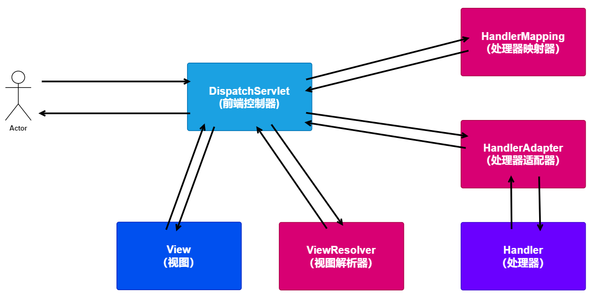

## 1.SpringMVC概述

### 1.1 MVC架构

```markdown
# MVC(Model View Controller) 是一种软件设计典范。主要作用是将视图展示和业务控制代码分离开来。 
	M 模型:是指数据模型,代表一个存取数据的对象 
	V 视图:负责数据的展示 
	C 控制器:负责调度 
```

**思考：MVC架构跟三层架构是什么关系？** 

可以这样理解：MVC把三层架构中的表现层再度进行了分化，分成了控制器、视图、模型。 

三层架构的目的是解耦，mvc的目的是实现web层系统的职责划分。 

MVC架构在三层架构中的位置图示：


### 1.2 SpringMVC

**SpringMVC** 顾名思义就是Spring对MVC架构的一种实现，属于轻量级的WEB框架。 

它通过一个简单的**注解**就可以让一个普通的Java类成为控制器，这种低侵入性的设计使得他备受业界欢迎 

同时他还支持RestFul风格的编程风格。

```markdown
# SpringMVC:
    就是Spring提供的mvc框架,Spring对web层进行封装的产物
# Controller: 控制器,控制器本质上是一个java类,java类中提供了一些方法
        这些方法用来接收来自浏览器的请求,我们给这些方法起个名称叫做---处理器
        使用SpringMVC框架后,我们使用一个简单的注解,就可以将一个方法变成SpringMVC的处理器
# Model: SpringMVC提供获取请求参数的API,不再需要我们自己获取请求携带的数据了

# View: SpringMVC封装请求转发,重定向,异步响应相关的代码,我们只需要返回指定的字符串,SpringMVC就好帮我们生成执行的视图
```


## 2.SpringMVC 入门

目标: 通过浏览器访问SpringMVC框架返回一个jsp页面


SpringMVC 中有以下核心组件，如下：
 <figure class="thumbnails">
    
    
</figure>


```markdown
# 1.前段控制器：DispatcherServlet
	DispatcherServlet负责接收用户请求，是整个流程的控制中心
# 2.处理器映射器：HandlerMapping
	HandlerMapping负责为每个请求找到一个合适的处理器handler
# 3.处理器适配器：HandlerAdapter
	前端控制器会挑选一个能够执行这个handler的处理器适配器
# 4.处理器：Handler
	Handler涉及到具体的用户业务请求，所以一般情况需要程序员根据业务需求开发Handler。
# 5.视图解析器：ViewResolver
	首先把逻辑视图名解析成实际的页面位置，再生成视图View对象并返回给前端控制器。
# 6.视图：View
	View对象负责渲染视图文件，将数据结果通过视图文件展示给用户
```


### 2.1 创建工程，引入坐标

**编写pom.xml**

```xml
<?xml version="1.0" encoding="UTF-8"?>
<project xmlns="http://maven.apache.org/POM/4.0.0" xmlns:xsi="http://www.w3.org/2001/XMLSchema-instance"
  xsi:schemaLocation="http://maven.apache.org/POM/4.0.0 http://maven.apache.org/xsd/maven-4.0.0.xsd">
  <modelVersion>4.0.0</modelVersion>
  <groupId>com.itheima</groupId>
  <artifactId>day04_springmvc_01</artifactId>
  <version>1.0-SNAPSHOT</version>
  <packaging>war</packaging>
  <!-- 导入jar包依赖 -->
  <dependencies>
        <dependency>
            <groupId>org.springframework</groupId>
            <artifactId>spring-webmvc</artifactId>
            <version>5.0.5.RELEASE</version>
        </dependency>

        <dependency>
            <groupId>javax.servlet</groupId>
            <artifactId>javax.servlet-api</artifactId>
            <version>3.1.0</version>
            <scope>provided</scope>
        </dependency>

        <dependency>
            <groupId>javax.servlet</groupId>
            <artifactId>jsp-api</artifactId>
            <version>2.0</version>
            <scope>provided</scope>
        </dependency>
    </dependencies>
</project>
```

### 2.2 配置前端控制器

编写web.xml文件

在web.xml文件中配置核心控制器

```xml
<?xml version="1.0" encoding="UTF-8"?>
<web-app xmlns="http://xmlns.jcp.org/xml/ns/javaee"
         xmlns:xsi="http://www.w3.org/2001/XMLSchema-instance"
         xsi:schemaLocation="http://xmlns.jcp.org/xml/ns/javaee http://xmlns.jcp.org/xml/ns/javaee/web-app_3_1.xsd"
         version="3.1">

    <!-- 全局 -->
    <!--<context-param>
        <param-name></param-name>
        <param-value></param-value>
    </context-param>-->

    <!-- 配置前端控制器：springmvc -->
    <!-- 声明servlet -->
    <servlet>
        <servlet-name>dispatcherServlet</servlet-name>
        <servlet-class>org.springframework.web.servlet.DispatcherServlet</servlet-class>
        <!-- 加载springmvc 核心配合文件 -->
        <!-- 局部：只会针对servlet -->
        <init-param>
            <param-name>contextConfigLocation</param-name>
            <param-value>classpath:spring-mvc.xml</param-value>
        </init-param>
    </servlet>

    <!-- 配置servlet路径 -->
    <servlet-mapping>
        <servlet-name>dispatcherServlet</servlet-name>

        <!-- / 所有的资源请求对话匹配到当前的servlet中，除了jsp资源不会匹配 -->
        <url-pattern>/</url-pattern>
    </servlet-mapping>


</web-app>
```

### 2.3 编写SpringMVC配置文件

spring-mvc.xml

```xml
<?xml version="1.0" encoding="UTF-8"?>
<beans xmlns="http://www.springframework.org/schema/beans"
       xmlns:xsi="http://www.w3.org/2001/XMLSchema-instance"
       xmlns:context="http://www.springframework.org/schema/context"
       xsi:schemaLocation="http://www.springframework.org/schema/beans http://www.springframework.org/schema/beans/spring-beans.xsd http://www.springframework.org/schema/context http://www.springframework.org/schema/context/spring-context.xsd">

    <!-- 加载注解类 -->
    <context:component-scan base-package="com.itheima.controller" />

    <!-- 1.配置处理器映射器 -->
    <bean class="org.springframework.web.servlet.mvc.method.annotation.RequestMappingHandlerMapping"></bean>

    <!-- 2.配置处理器适配器 -->
    <bean class="org.springframework.web.servlet.mvc.method.annotation.RequestMappingHandlerAdapter"></bean>

    <!-- 3.配置视图解析器 -->
    <bean class="org.springframework.web.servlet.view.InternalResourceViewResolver" >
        <!-- 配置视图的前缀 -->
        <property name="prefix" value="/WEB-INF/pages/"></property>
        <!-- 配置视图的后缀 -->
        <property name="suffix" value=".jsp"></property>
    </bean>


</beans>
```

### 2.4 编写业务 处理器

```java
package com.itheima.controller;

import org.springframework.stereotype.Controller;
import org.springframework.web.bind.annotation.RequestMapping;

/**
 * <p></p>
 *
 * @Description:
 */
@Controller
public class HelloController {

    @RequestMapping("/hello")
    public String hello() {
        System.out.println("hello 方法被执行");
        return "success";
    }
}
```

### 2.5 编写响应页面

**index.jsp: 发起请求的页面**

```jsp
<%@ page contentType="text/html;charset=UTF-8" language="java" %>
<html>
  <head>
    <title>index</title>
  </head>
  <body>
      <a href="/hello" >访问hello方法</a>
  </body>
</html>
```

**success.jsp响应页面**（要添加在/WEB-INF/pages下）

```jsp
<%@ page contentType="text/html;charset=UTF-8" language="java" %>
<html>
  <head>
    <title>success</title>
  </head>
  <body>
      访问成功
  </body>
</html>
```


## 3.Spring MVC 流程解析

对于 Spring MVC 整个流程可以分为两个流程，一个为加载流程，一个为执行流程，下面就来介绍。

### 3.1 SpringMVC 的加载流程

流程图如下：


```markdown
# SpringMVC加载流程: 服务器启动时
1. 服务器启动时,只会加载web.xml文件
2. 实例化前端控制器 DispatcherServlet
3. 加载SpringMVC核心配置文件
4. 在前端控制器的初始化方法中(initStrategies:初始化策略),完成组件的加载
    	处理器映射器:HandlerMapping
            建立绑定路径与方法全限定名的对应关系
        处理器适配器:HandlerAdapter
            适配处理器的实现方式,调用指定的类反射执行处理器方法
        视图解析器:ViewResolver
            根据逻辑视图生成对应的物理视图,并将物理视图返回
```


### 3.2 SpringMVC 的执行流程

路径请求执行过程：

```markdown
1. http请求
   http://localhost:8080/hello
2. 服务器响应：Servlet响应并处理
	Servlet-->service方法
	HttpServlet-->service方法（Servlet）
	frameworkservlet-->service方法（HttpServlet）-->processRequest-->doService抽象方法
	DispatchServlet-->doService(处理用户的请求)-->★★doDispatch★★(用户请求资源处理)
```

路径请求执行：


DispatchServlet执行流程：

```markdown
# 1.用户发送出请求到前端控制器DispatcherServlet。
	http://localhost:8080/hello  --> DispatcherServlet (url-mapping:/)
# 2.DispatcherServlet收到请求调用HandlerMapping（处理器映射器）。
	根据用户的请求路径来给处理器映射器，最终获得Handler方法名称（url--method）
# 3.HandlerMapping找到具体的处理器(可查找xml配置或注解配置)，生成处理器对象及处理器拦截器(如果有)，再一起返回给DispatcherServlet。
    mappedHandler = getHandler(processedRequest);
    public String com.itheima.controller.HelloController.hello();
# 4.DispatcherServlet调用HandlerAdapter（处理器适配器）。
	public String com.itheima.controller.HelloController.hello()结果
	给处理器适配器处理
# 5.HandlerAdapter经过适配调用具体的处理器（Handler/Controller）。
	public String com.itheima.controller.HelloController.hello()
	根据用户资源路径请求的方法：
		1.配合方法中的参数（request中获得数据）
		2.调用Controller中的方法（反射）
# 6.Controller执行完成返回结果视图。
		返回结果视图名称：“success”
# 7.HandlerAdapter将Controller执行结果视图返回给DispatcherServlet。
       处理器适配器返回结果视图名称：“success” 给DispatcherServlet
# 8.DispatcherServlet将结果视图传给ViewReslover（视图解析器）。
	   结果视图名称：“success” 给ViewReslover（视图解析器）
# 9.ViewReslover解析后返回具体View（视图）。
        ViewReslover（视图解析器）根据前缀和后缀拼接路径（View）
           前缀 + 结果视图名称：“success”+ 后缀
# 10.DispatcherServlet根据View进行渲染视图。
     前缀+结果视图名称：“success”+后缀-->View(jsp:服务端进行渲染)-->输出一个完整的html页面
# 11.DispatcherServlet响应用户。
	 获得一个完整的html页面
```


### 3.3 SpringMVC 的执行组件说明

SpringMVC中的执行组件，较多，下面一起来认识下。

SpringMVC三大核心组件（面试）：处理器映射器、处理器适配器、视图解析器

#### 3.3.1 请求组件

**1.HandlerMapping（处理器映射器）**

```yacas
HandlerMapping负责为每个请求找到一个合适的处理器handler，其实简单来说就是维持了一个url到handler的映射Map。springmvc提供了不同的映射器，实现不同的映射方式，例如：配置文件方式，实现接口方式，注解方式等
```


**2.HandlerAdapter（处理器适配器）**

```yacas
HandlerMapping找到了url对应的handler对象后，前端控制器会挑选一个能够执行这个handler的处理器适配器，然后给这个适配器发送指令，同时把这个handler对象传给这个适配器，让它执行handler，最终将handler的返回值和逻辑视图名字符串返回给前端控制器
```


#### 3.3.2 返回结果组件

**1.ViewResolver（视图解析器）**

```yacas
HandlerMapping负责为每个请求找到一个合适的处理器handler，其实简单来说就是维持了一个url到handler的映射Map。springmvc提供了不同的映射器，实现不同的映射方式，例如：配置文件方式，实现接口方式，注解方式等
```


**2.View（视图）**

```yacas
springmvc框架提供了很多的View类型，包括：jspView(jstl、EL),jstlView、freemarkerView、pdfView等
```


#### 3.3.3 前端控制器

```yacas
DispatcherServlet负责接收用户请求，是整个流程的控制中心，但它几乎不做任何具体的工作，只进行任务调度。具体的工作由具体的组件来完成。这就是组件式结构的优势，专项事情又专门的组件来做，这样能提高专项的处理能力同时集中调度的存在降低了组件之间的耦合性
```


#### 3.3.4 处理器

```yacas
在DispatcherServlet的控制下Handler对具体的用户请求进行处理。由于Handler涉及到具体的用户业务请求，所以一般情况需要程序员根据业务需求开发Handler。
```


## 4.Spring MVC 组件配置

下面一起来看下Spring运行组件的配置

### 4.1 映射器和适配器配置

**1.xml中的配置**

在SpringMVC的执行结果中，需要来配置映射器和适配器，如下：

```XML
<!-- 1.配置处理器映射器 -->
<bean class="org.springframework.web.servlet.mvc.method.annotation.RequestMappingHandlerMapping"></bean>
<!-- 2.配置处理器适配器 -->
<bean class="org.springframework.web.servlet.mvc.method.annotation.RequestMappingHandlerAdapter"></bean>
```


**2.简化配置**

```XML
<mvc:annotation-driven /> 
```

使 用 <mvc:annotation-driven> 自 动加载 RequestMappingHandlerMapping （处理映射器） 和
RequestMappingHandlerAdapter （ 处 理 适 配 器 ） ， 可 用 在 SpringMVC.xml 配 置 文 件 中 使 用
<mvc:annotation-driven>替代注解处理器和适配器的配置。


**3.组件免配置**

即什么都不配。此时SpringMVC仍然可以正常运行，全凭它自己的DispatcherServlet.properties，会从中找到合适的组件去执行，此文件位置在spring-webmvc.jar中

```properties
#映射器
org.springframework.web.servlet.HandlerMapping=org.springframework.web.servlet.handler.BeanNameUrlHandlerMapping,\
	org.springframework.web.servlet.mvc.method.annotation.RequestMappingHandlerMapping
#适配器
org.springframework.web.servlet.HandlerAdapter=org.springframework.web.servlet.mvc.HttpRequestHandlerAdapter,\
	org.springframework.web.servlet.mvc.SimpleControllerHandlerAdapter,\
	org.springframework.web.servlet.mvc.method.annotation.RequestMappingHandlerAdapter
#视图解析器
org.springframework.web.servlet.ViewResolver=org.springframework.web.servlet.view.InternalResourceViewResolver
```

PS：组件免配置是有缺陷的，因为每次请求都要去这里去找合适的组件，所以执行效率很低，因此什么都不配置是不可取的。需要我们显示配置来提高执行效率。


### 4.2 视图解析器配置 

```XML
<!-- 3.配置视图解析器 -->
<bean class="org.springframework.web.servlet.view.InternalResourceViewResolver" >
    <!-- 配置视图的前缀 -->
    <property name="prefix" value="/WEB-INF/pages/"></property>
    <!-- 配置视图的后缀 -->
    <property name="suffix" value=".jsp"></property>
</bean>
```

PS: web项目中的/WEB-INF/ 是授权控制

​	1.浏览器不能直接访问。

​	2.服务器中通过请求转发可以访问此目录下的内容


### 4.3 前端控制器路径配置

在web.xml中的配置的前端控制器

```XML
 <!-- 配置前端控制器：springmvc -->
 <!-- 声明servlet -->
 <servlet>
     <servlet-name>dispatcherServlet</servlet-name>
     <servlet-class>org.springframework.web.servlet.DispatcherServlet</servlet-class>
     <!-- 加载springmvc 核心配合文件 -->
     <!-- 局部：只会针对servlet -->
     <init-param>
         <param-name>contextConfigLocation</param-name>
         <param-value>classpath:spring-mvc.xml</param-value>
     </init-param>
     <!-- 随着服务器启动初始化 -->
     <load-on-startup>5</load-on-startup>
 </servlet>
 <!-- 配置servlet路径 -->
 <servlet-mapping>
     <servlet-name>dispatcherServlet</servlet-name>
     <!-- / 所有的资源请求对话匹配到当前的servlet中，除了jsp资源不会匹配 -->
     <!-- url推荐使用：后缀模式 -->
     <url-pattern>*.do</url-pattern>
 </servlet-mapping>
```

PS:对于 SpringMVC 路径的配置有如下配置方式

```markdown
# 1.[/*]: 
	SpringMvc禁止使用。
# 2.[*.action/*.do]: 
	以结尾的url地址请求可以进入DispatcherServlet, 放行所有资源文件后缀的url。
# 3.[/]: 
	所有url地址请求均可进入DispatcherServlet, 但只放行以.jsp为结尾的url，其他资源文件后缀的url都不放行
```


## 5.@RequestMapping说明讲解

在Controller中需要通过@RequestMapping来配置方法的Url访问路径，用于建立请求 URL 和处理请求方法之间的对应关系，下面了解其中的内容。

### 5.1 使用的位置

**1.使用在方法上**

标记url到请求方法的映射，即通过一段url找到Controller中对应的方法。

```JAVA
@RequestMapping("/hello")
public String hello() {
    System.out.println("执行 hello 方法");
    return "success";
}
```

**2.使用在类上**

官方的说法叫做窄化请求映射，其实就是为了防止你和你的同事起的url重名，在类上多给url加了一层目录。

```java
@Controller
@RequestMapping("/test")
public class HelloController {

    @RequestMapping("/hello")
    public String hello() {
        System.out.println("执行 hello 方法");
        return "success";
    }
}
```

上面在类上添加的注解后，方法的访问路径就变为：http://localhost:8080/test/hello 


PS对于路径的编写：路径 / 的说明

在Controller中添加访问路径，对于路径前的 / 是可以省略的。但是，要遵循一下规则：

1.Controller中路径前加/ ,那么都加 /

```java
@Controller
@RequestMapping("/mapping")
public class RequestMappingController {

    @RequestMapping("/url")
    public String url() {
        System.out.println("url 方法执行");
        return "success";
    }
}
```


2.Controller中路径前不加/ ,都不加 /

```JAVA
@Controller
@RequestMapping("mapping")
public class RequestMappingController {

    @RequestMapping("url")
    public String url() {
        System.out.println("url 方法执行");
        return "success";
    }
}
```


### 5.2 限制请求类型

对于Http常用的请求为：

```markdown
# get         --查询操作
# post        --添加操作
# put         --修改操作
# delete      --删除操作
```

在 @RequestMapping 可以通过配置来限定方法http请求的类别，大致限定分为三类

```markdown
# 默认方式
	之前使用@RequestMapping都是它的默认使用方式，默认的@RequestMapping支持所有的Http请求类型。
# 正常方式
	@RequestMapping(method=某一种http请求类型)，指定了Http请求类型就限制只能用指定的请求类型提交请求
	如果是其他的请求方式，会出现 405 错误
# 多请求方式
	@RequestMapping(method={请求类型1, 请求类型2,……})
```

Spring对于请求方式的设置提供了简便的注解：

@GetMapping

@PostMapping

@PutMapping

@DeleteMapping


代码如下：

```JAVA
package com.itheima.controller02;

import org.springframework.stereotype.Controller;
import org.springframework.web.bind.annotation.RequestMapping;
import org.springframework.web.bind.annotation.RequestMethod;

/**
 * <p></p>
 *
 * @Description:
 */
@Controller
@RequestMapping("/mapping")
public class RequestMappingController {


    /*
         @RequestMapping 请求类别：
            1.默认方式--任意的请求方式都可以访问该方法
                不去指定method属性
     */
    @RequestMapping("/url")
    public String url() {
        System.out.println("url 方法执行");
        return "success";
    }


    /*
         @RequestMapping 请求类别：
            2.正常方式--需要指定的请求方式才能访问
                指定method属性
     */
    @RequestMapping(value ="/urlGet",method = RequestMethod.GET)
    public String urlGet() {
        System.out.println("urlGet 方法执行");
        return "success";
    }


    /*
        @RequestMapping 请求类别：
           3.多请求方式--指定多个请求方式
               指定method属性
    */
    @RequestMapping(value ="/urlMulti",method = {RequestMethod.GET,RequestMethod.POST})
    public String urlMulti() {
        System.out.println("urlMulti 方法执行");
        return "success";
    }
}
```


```HTML
<!DOCTYPE html>
<html lang="zh">
<head>
  <meta charset="UTF-8">
  <title>请求方法类型</title>
</head>
<body>

  <!-- 1.默认方式 -->
  <h1>get请求--默认方式 </h1>
  <form method="get" action="/mapping/url.do">
    <input type="submit" value="get请求">
  </form>

   <h1>post请求--默认方式 </h1>
  <form method="post" action="/mapping/url.do">
    <input type="submit" value="post请求">
  </form>


  <!-- 2.正常方式 -->
  <h1>get请求--正常方式 </h1>
  <form method="get" action="/mapping/urlGet.do">
    <input type="submit" value="get请求">
  </form>

   <h1>post请求--正常 </h1>
  <form method="post" action="/mapping/urlGet.do">
    <input type="submit" value="post请求">
  </form>


  <!-- 3.多请求方式 -->
  <h1>get请求--多请求方式 </h1>
  <form method="get" action="/mapping/urlMulti.do">
    <input type="submit" value="get请求">
  </form>

   <h1>post请求--多请求方式 </h1>
  <form method="post" action="/mapping/urlMulti.do">
    <input type="submit" value="post请求">
  </form>


</body>
</html>
```

PS：如果限定了请求类别，并以其他方式来访问就会出现 405 


### 5.3 其他属性

**1.params 属性**

作用：用于指定限制请求参数的条件。它支持简单的表达式。要求请求参数的 key 和 value 必须和配置的一模一样。

```JAVA
package com.itheima.controller03;

import org.springframework.stereotype.Controller;
import org.springframework.web.bind.annotation.RequestMapping;

/**
 * <p></p>
 *
 * @Description:
 */
@Controller
@RequestMapping("/param")
public class RequestMappingParamController {


    /*
         @RequestMapping 控制参数：
            params：控制前端的传来的参数
                    参数必须要有keys，如果没有key，就会出现400
                    PS：key可以没有值
            示例：http://localhost:8080/param/p.do?name=xx&age

     */
    @RequestMapping(value = "/p",params = {"name","age"})
    public String param(String name ,String age) {
        System.out.println("param 方法执行 "+name +":"+age);
        return "success";
    }

}
```

用户请求参数必须要name和age参数传入。


**2.headers 属性**

用于指定限制请求消息头的条件

```java
package com.itheima.controller03;

import org.springframework.stereotype.Controller;
import org.springframework.web.bind.annotation.RequestMapping;

/**
 * <p></p>
 *
 * @Description:
 */
@Controller
@RequestMapping("/param")
public class RequestMappingParamController {


    /*
         @RequestMapping 控制参数：
            headers：控制前端的传来请求头的参数
                如果没有对应的请求头信息，出现 404
     */
    @RequestMapping(value = "/header",headers = {"Cookie"})
    public String header() {
        System.out.println("header 方法执行 ");
        return "success";
    }

}
```


## 6. 获取请求参数

Springmvc作为表现层框架，是连接页面和service层的桥梁，它负责所有请求的中转。怎么从请求中接收参数是重点，这也体现了我们刚开始说的Springmvc的第一个作用：“接收请求中的参数”。

下面是主要支持的类型：

```markdown
# 1.基本数据类型和string
# 2.pojo类型 
# 3.数组类型 
# 4.集合类型 
```

如果请求携带这些类型的数据,SpringMVC会自动帮我们接收,并传递给方法进行使用,方法上的形参名称必须要和请求参数名称保持一致。


### 6.1 基本类型和String

只需要保证前端传递的参数名称跟方法的形参名称一致就好。 

SpringMVC接收的参数默认都是String类型的，它内部会进行一个自动转型。 

```java
/*
    基础类型参数：
        1.请求中的参数的key值必须和方法的传入参数的名称一致
        2.方法的参数尽量使用包装类型
            如果使用基础类型话，如果不传入的相应值，就会出现错误
            如果是包装类型，不传入的相应值，给参数赋值为null（程序不会报错）
 */
@RequestMapping("basic")
public String basic(String uname,String gender,Integer age) {
    System.out.println("basic 方法执行："+uname+":"+gender);
    return "success";
}
```

```html
<h1>基础类型和String </h1>
<form method="get" action="rparam/basic.do">
  用户名：<input type="text" name="uname" > <br>
  性别：<input type="text" name="sgender"> <br>
  年龄：<input type="text" name="age"> <br>
  <input type="submit" value="get请求">
</form>
```


### 6.2 pojo类型

POJO(Plain Ordinary Java Object) 简单的java对象

只需要保证前端传递的参数名称跟pojo的属性名称（set方法）一致就好。 

```java
 @RequestMapping("pojo")
 public String pojo(User user) {
     System.out.println("pojo 方法执行："+user);
     return "success";
 }
```

```java
package com.itheima.domain;

import lombok.AllArgsConstructor;
import lombok.Data;
import lombok.NoArgsConstructor;

/**
 * <p></p>
 *
 * @Description:
 */
@Data  //生成get/set 方法+ toString
@NoArgsConstructor //生成无参构造
@AllArgsConstructor//全参构造
public class User {

    private String name;
    private Integer age;
    private String gender;
}
```

```HTML
<h1>pojo对象 </h1>
<form method="get" action="rparam/pojo.do">
  用户名：<input type="text" name="name" > <br>
  性别：<input type="text" name="gender"> <br>
  年龄：<input type="text" name="age"> <br>
  <input type="submit" value="get请求">
</form>
```


### 6.3 数组类型

只需要保证前端传递的参数名称跟方法中的数组形参名称一致就好。 

```java
@RequestMapping("array")
public String array(String[] names) {
    System.out.println("array 方法执行："+ Arrays.toString(names));
    return "success";
}
```

```html
   <h1>array数值 </h1>
 <form method="get" action="rparam/array.do">
   <input type="checkbox" name="names" value="smoke"> 抽烟
   <input type="checkbox" name="names" value="drink"> 喝酒
   <input type="checkbox" name="names" value="perm">  烫头
   <input type="submit" value="get请求">
 </form>
```


### 6.4 集合类型

SpringMVC不能直接传递List集合类型的参数，必须包装在对象中。这是SpringMVC框架的强制要求

VO: value Object 或 view Object 封装来自浏览器携带的数据

```java
/*
    如果传入的参数是封装类型：自定义
        请求参数中的key直接写封装类型里属性名称就可以
 */
@RequestMapping("collection")
public String collection(Vo vo) {
    System.out.println("collection 方法执行："+ vo);
    return "success";
}
```

```java
package com.itheima.domain;

import lombok.AllArgsConstructor;
import lombok.Data;
import lombok.NoArgsConstructor;

import java.util.List;
import java.util.Map;

@Data
@NoArgsConstructor
@AllArgsConstructor
public class Vo {
    private List<User> users;
    private Map<String, String> maps;
}
```

```html
<h1>集合 </h1>
<form action="rparam/collection.do">
  <input type="text" name="users[0].name" value="zhangsan">
  <input type="text" name="users[0].age" value="18">
  <input type="text" name="users[1].name" value="lisi">
  <input type="text" name="users[1].age" value="19">
  <input type="text" name="maps['uname']" value="zhangsan">
  <input type="text" name="maps['age']" value="19">
  <input type="submit">
</form>
```


完整代码：

```JAVA
package com.itheima.controller04;

import com.itheima.domain.User;
import com.itheima.domain.Vo;
import org.springframework.stereotype.Controller;
import org.springframework.web.bind.annotation.RequestMapping;

import java.util.Arrays;
import java.util.Date;

/**
 * <p></p>
 *
 * @Description:
 */
@Controller
@RequestMapping("rparam")
public class RequestParamController {

    /*
        基础类型参数：
            1.请求中的参数的key值必须和方法的传入参数的名称一致
            2.方法的参数尽量使用包装类型
                如果使用基础类型话，如果不传入的相应值，就会出现错误
                如果是包装类型，不传入的相应值，给参数赋值为null（程序不会报错）
     */
    @RequestMapping("basic")
    public String basic(String uname,String gender,Integer age) {

        System.out.println("basic 方法执行："+uname+":"+gender);

        return "success";
    }


    @RequestMapping("basic")
    public String basic(String uname, Date birth) {

        System.out.println("basic 方法执行："+uname+":"+birth.getTime());

        return "success";
    }


    @RequestMapping("pojo")
    public String pojo(User user) {

        System.out.println("pojo 方法执行："+user);

        return "success";
    }

    @RequestMapping("array")
    public String array(String[] names) {

        System.out.println("array 方法执行："+ Arrays.toString(names));

        return "success";
    }


    /*
        如果传入的参数是封装类型：自定义
            请求参数中的key直接写封装类型里属性名称就可以
     */
    @RequestMapping("collection")
    public String collection(Vo vo) {

        System.out.println("collection 方法执行："+ vo);

        return "success";
    }


}
```

```HTML
<!DOCTYPE html>
<html lang="zh">
<head>
  <meta charset="UTF-8">
  <title>param</title>
</head>
<body>

  <h1>基础类型和String </h1>
  <form method="get" action="rparam/basic.do">
    用户名：<input type="text" name="uname" > <br>
    <!--性别：<input type="text" name="sgender"> <br>-->
    年龄：<input type="text" name="age"> <br>
    生日：<input type="date" name="birth"> <br>
    <input type="submit" value="get请求">
  </form>


  <h1>pojo对象 </h1>
  <form method="post" action="rparam/pojo.do">
    用户名：<input type="text" name="name" > <br>
    性别：<input type="text" name="gender"> <br>
    年龄：<input type="text" name="age"> <br>

    <input type="submit" value="get请求">
  </form>


    <h1>array数值 </h1>
  <form method="get" action="rparam/array.do">
    <input type="checkbox" name="names" value="smoke"> 抽烟
    <input type="checkbox" name="names" value="drink"> 喝酒
    <input type="checkbox" name="names" value="perm">  烫头
    <input type="submit" value="get请求">
  </form>


  <h1>集合 </h1>
  <form action="rparam/collection.do">
    <input type="text" name="users[0].name" value="zhangsan">
    <input type="text" name="users[0].age" value="18">
    <input type="text" name="users[1].name" value="lisi">
    <input type="text" name="users[1].age" value="19">

    <input type="text" name="maps['uname']" value="zhangsan">
    <input type="text" name="maps['age']" value="19">
    <input type="submit">
  </form>


</body>

</html>
```


## 7. 请求参数内容设置

### 7.1 日期处理

如果请求携带的参数为日期类型,SpringMVC没有提供相关的转换器,哪该如何处理呢?
我们可以使用SpringMVC提供的注解进行日期格式化操作.

```java
@DateTimeFormat(pattern = "yyyy-MM-dd")
```

代码如下：

```java
@RequestMapping(value = "/date")
public String date(@DateTimeFormat(pattern = "yyyy-MM-dd") Date date) {
    System.out.println(date.getTime());
    System.out.println("执行 date 方法");
    return "success";
}
```


SpringMVC除了提供上面的注解形式，还有可以使用转换器来转换，代码如下：

```JAVA
package com.itheima.conversion;

import org.springframework.core.convert.converter.Converter;

import java.text.ParseException;
import java.text.SimpleDateFormat;
import java.util.Date;

/**
 * <p></p>
 *
 * @Description:
 */
public class DateConversion implements Converter<String,Date> {


    public Date convert(String s) {
        try {
            SimpleDateFormat format = new SimpleDateFormat("yyyy-MM-dd");
            return  format.parse(s);
        } catch (ParseException e) {
            e.printStackTrace();
            throw new RuntimeException(e);
        }
    }
}
```

配置文件信息：

```xml
<!-- 将自己定义的转化器放到Springmvc转换器工程类中 -->
<bean class="org.springframework.context.support.ConversionServiceFactoryBean" id="conversionService">
    <property name="converters">
        <set>
            <bean class="com.itheima.convert.DateConvert"></bean>
        </set>
    </property>
</bean>

<!-- 自动加载映射器和适配器 -->
<mvc:annotation-driven conversion-service="conversionService" />
```


### 7.2 编码过滤器

如果请求携带了中文有乱码该怎么办呢?
我们在web阶段自己编写过编码过滤器,在SpringMVC中已经提供好了编码过滤器,我们直接使用即可。

将下面的过滤器配置到web.xml文件中，就可以解决乱码问题。

```XML
<!-- 配置编码过滤器 -->
<filter>
    <filter-name>encodingFilter</filter-name>
    <filter-class>org.springframework.web.filter.CharacterEncodingFilter</filter-class>
    <!-- 配置字符集码表 -->
    <init-param>
        <param-name>encoding</param-name>
        <param-value>utf-8</param-value>
    </init-param>
</filter>
<filter-mapping>
    <filter-name>encodingFilter</filter-name>
    <!-- 编码过滤器路径一般配置 /* 拦截所有 -->
    <url-pattern>/*</url-pattern>
</filter-mapping>
```


### 7.3 请求参数名称不一致

@RequestParam : 主要用于在SpringMVC后台控制层获取参数时，前端传入的参数和方法形参不一致时。

```markdown
它有三个属性: 
	value：默认属性，用于指定前端传入的参数名称 
	required：用于指定此参数是否必传 
	defaultValue：当参数为非必传参数且前端没有传入参数时，指定一个默认值。
```

示例代码：
```java
package com.itheima.controller04;

import com.itheima.domain.User;
import com.itheima.domain.Vo;
import org.springframework.stereotype.Controller;
import org.springframework.web.bind.annotation.RequestMapping;

import java.util.Arrays;
import java.util.Date;

/**
 * <p></p>
 *
 * @Description:
 */
@Controller
@RequestMapping("rparam")
public class RequestParamController {

    /*
        基础类型参数：
            1.请求中的参数的key值必须和方法的传入参数的名称一致
            2.方法的参数尽量使用包装类型
                如果使用基础类型话，如果不传入的相应值，就会出现错误
                如果是包装类型，不传入的相应值，给参数赋值为null（程序不会报错）
     */
    @RequestMapping("basic")
    public String basic(@RequestParam(defaultValue = "tom",required = false,value = "name") 
                        String uname,String gender,Integer age) {

        System.out.println("basic 方法执行："+uname+":"+gender);

        return "success";
    }

}
```

```HTML
<h1>基础类型和String </h1>
<form method="get" action="rparam/basic.do">
  用户名：<input type="text" name="uname" > <br>
  <!--性别：<input type="text" name="sgender"> <br>-->
  年龄：<input type="text" name="age"> <br>
  生日：<input type="date" name="birth"> <br>
  <input type="submit" value="get请求">
</form>
```


### 7.4 获取请求头信息

@RequestHeader

**作用:** 主要用于从请求头中获取参数。它支持的属性跟@RequestParam一样。 

```java
/*
 获得请求头中的内容
 */
@RequestMapping("cookie")
public String getHeader(@RequestHeader("Cookie") String cookie) {
    System.out.println("执行 getHeader ："+cookie);
    return "success";
}
```


### 7.5 获取cookie信息

@CookieValue

**作用:** 用于从cookie中取值。 

```java
/*
 获得Cookie中的内容
 */
@RequestMapping("cVal")
public String getCookieVal(@CookieValue("JSESSIONID") String jsessionid) {
    System.out.println("执行 getHeader ："+jsessionid);
    return "success";
}
```

注意: cookie的name值区分大小写


请求头和Cookie完整代码：

```JAVA
package com.itheima.controller05;

import org.springframework.stereotype.Controller;
import org.springframework.web.bind.annotation.CookieValue;
import org.springframework.web.bind.annotation.RequestHeader;
import org.springframework.web.bind.annotation.RequestMapping;

/**
 * <p></p>
 *
 * @Description:
 */
@Controller
@RequestMapping("hc")
public class HeaderCookieController {

    /*
     获得请求头中的内容
     */
    @RequestMapping("cookie")
    public String getHeader(@RequestHeader("Cookie") String cookie) {
        System.out.println("执行 getHeader ："+cookie);
        return "success";
    }

    /*
     获得Cookie中的内容
     */
    @RequestMapping("cVal")
    public String getCookieVal(@CookieValue("JSESSIONID") String jsessionid) {
        System.out.println("执行 getHeader ："+jsessionid);
        return "success";
    }

}
```

访问路径：http://localhost:8080/hc/cookie.do

访问路径：http://localhost:8080/hc/cVal.do


## 8. 补充

添加Lombok依赖：

```xml
<dependency>
    <groupId>org.projectlombok</groupId>
    <artifactId>lombok</artifactId>
    <version>1.18.12</version>
    <scope>provided</scope>
</dependency>
```

- **Lombok的介绍：**

**Lombok是一种Java™实用工具，可用来帮助开发人员消除Java的冗长代码，尤其是对于简单的Java对象（POJO）。它通过注释实现这一目的**。 

- **原理：**

JSR 269 之前我们也有注解这样的神器，可是我们比如想要做什么必须使用反射，反射的方法局限性较大。**首先，它必须定义@Retention为RetentionPolicy.RUNTIME，只能在运行时通过反射来获取注解值，使得运行时代码效率降低**。其次，如果想在编译阶段利用注解来进行一些检查，对用户的某些不合理代码给出错误报告，反射的使用方法就无能为力了。**而 JSR 269 之后我们可以在 Javac的编译期利用注解做这些事情**。所以我们发现**核心的区分是在 运行期 还是 编译期**。

 

 

 

 

