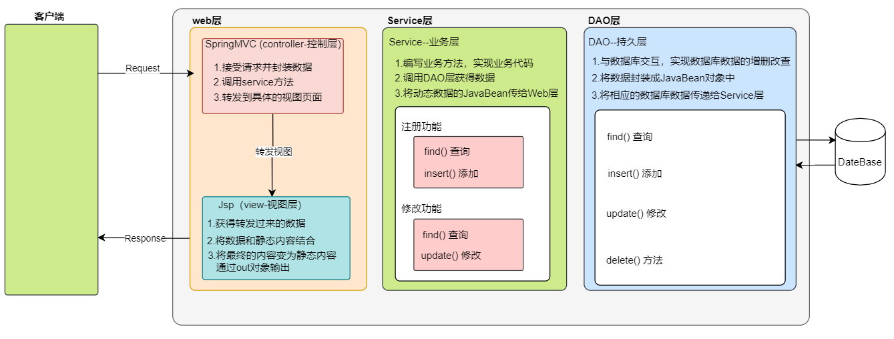
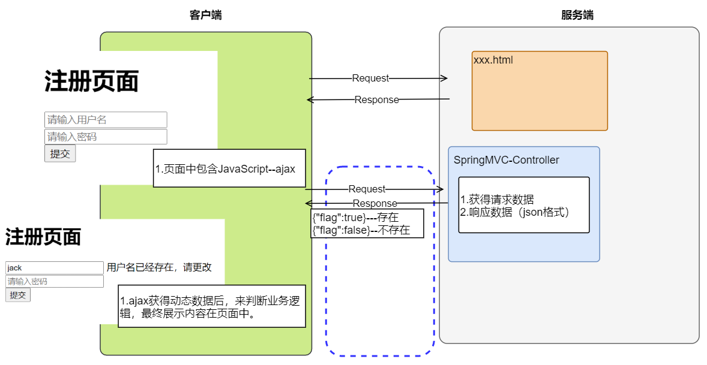
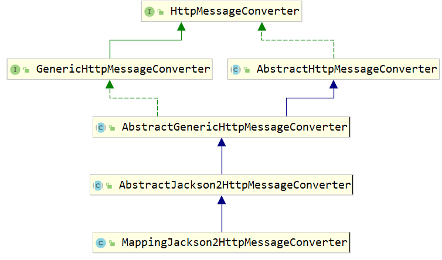

# 1.响应和封装返回值

 SpringMVC的返回值可以分为两大类: 

​	1.同步请求的响应:

​			请求转发 或 重定向
2.异步请求的响应

​			ajax请求直接返回响应结果字符串


# 2. 同步响应

对于 SpringMVC 早期来说，主要是针对 MVC 思想来进行前后端的数据交互，View（视图层）主要在服务端进行解析，最终生成完整的 HTML ，响应给服务端。


 <figure class="thumbnails">
    
    
</figure>


## 2.1 同步请求所需环境

1.使用这种方式需要导入servlet相关包 

```xml
  <!-- 导入jar包依赖 -->
<dependencies>
     <dependency>
         <groupId>org.springframework</groupId>
         <artifactId>spring-webmvc</artifactId>
         <version>5.0.5.RELEASE</version>
     </dependency>

     <dependency>
         <groupId>javax.servlet</groupId>
         <artifactId>javax.servlet-api</artifactId>
         <version>3.1.0</version>
         <scope>provided</scope>
     </dependency>

     <dependency>
         <groupId>javax.servlet</groupId>
         <artifactId>jsp-api</artifactId>
         <version>2.0</version>
         <scope>provided</scope>
     </dependency>
</dependencies>

<build>
    <plugins>
        <plugin>
            <groupId>org.apache.maven.plugins</groupId>
            <artifactId>maven-compiler-plugin</artifactId>
            <version>3.2</version>
            <configuration>
                <source>1.8</source>
                <target>1.8</target>
                <encoding>utf-8</encoding>
            </configuration>
        </plugin>
    </plugins>
</build>
```

**2.前端控制器**

```XML
<?xml version="1.0" encoding="UTF-8"?>
<web-app xmlns="http://xmlns.jcp.org/xml/ns/javaee"
         xmlns:xsi="http://www.w3.org/2001/XMLSchema-instance"
         xsi:schemaLocation="http://xmlns.jcp.org/xml/ns/javaee http://xmlns.jcp.org/xml/ns/javaee/web-app_3_1.xsd"
         version="3.1">

    <!-- 配置前端控制器：springmvc -->
    <!-- 声明servlet -->
    <servlet>
        <servlet-name>dispatcherServlet</servlet-name>
        <servlet-class>org.springframework.web.servlet.DispatcherServlet</servlet-class>
        <!-- 加载springmvc 核心配合文件 -->
        <!-- 局部：只会针对servlet -->
        <init-param>
            <param-name>contextConfigLocation</param-name>
            <param-value>classpath:spring-mvc.xml</param-value>
        </init-param>
    </servlet>

    <!-- 配置servlet路径 -->
    <servlet-mapping>
        <servlet-name>dispatcherServlet</servlet-name>
        <!-- / 所有的资源请求对话匹配到当前的servlet中，除了jsp资源不会匹配 -->
        <url-pattern>*.do</url-pattern>
    </servlet-mapping>

</web-app>
```

**3.springmvc核心配置文件**

```XML
<?xml version="1.0" encoding="UTF-8"?>
<beans xmlns="http://www.springframework.org/schema/beans"
       xmlns:xsi="http://www.w3.org/2001/XMLSchema-instance"
       xmlns:context="http://www.springframework.org/schema/context"
       xsi:schemaLocation="http://www.springframework.org/schema/beans http://www.springframework.org/schema/beans/spring-beans.xsd http://www.springframework.org/schema/context http://www.springframework.org/schema/context/spring-context.xsd">

    <!-- 1.加载注解类 -->
    <context:component-scan base-package="com.itheima" />

    <!-- 2.映射器和适配器 -->
    <mvc:annotation-driven /> 

    <!-- 3.配置视图解析器 -->
    <bean class="org.springframework.web.servlet.view.InternalResourceViewResolver" >
        <!-- 配置视图的前缀 -->
        <property name="prefix" value="/WEB-INF/pages/"></property>
        <!-- 配置视图的后缀 -->
        <property name="suffix" value=".jsp"></property>
    </bean>

</beans>
```


## 2.2 同步请求的响应结果类型

对于同步响应 SpringMVC 返回的结果大致分为三种，如下：

```markdown
# 1.String（字符串）
	Controller 方法返回：字符串
# 2.Void （空值返回）
	Controller 方法返回：空值返回
# 3.ModelAndView（SpringMVC的模型视图对象）
	Controller 方法返回：ModelAndView 对象
```


## 2.3 同步-返回String字符串

Controller方法如果返回的是普通字符串，那就是视图文件的逻辑视图名或者是视图文件的物理地址，具体代码如下：

```java
@Controller
public class HelloController {

	@RequestMapping("/list")
	public String list() throws Exception {
		.......
		return "字符串";
	}
}
```


### 2.3.1  返回字符串的形式

返回字符串有三种形式，如下：

```markdown
# 1.结果视图的名称字符串
	配置了结果视图器，指定前缀和后缀名称，Controller方法返回结果视图的名称。
# 2.请求转发字符串--和ServletApi来进行解耦
	返回的字符串中以【forward:】开头，后面跟转发的URL路径
# 3.重新定向字符串--和ServletApi来进行解耦
	返回的字符串中以【redirect:】开头，后面跟重定向的URL路径。
```


### 2.3.2  结果视图的名称字符串

配置了结果视图后，Controller 方法直接返回视图名称。

```XML
<!-- 配置视图解析器 -->
<bean class="org.springframework.web.servlet.view.InternalResourceViewResolver" >
    <!-- 配置视图的前缀 -->
    <property name="prefix" value="/WEB-INF/pages/"></property>
    <!-- 配置视图的后缀 -->
    <property name="suffix" value=".jsp"></property>
</bean>
```

```JAVA
package com.itheima.controller01;

import org.springframework.stereotype.Controller;
import org.springframework.ui.Model;
import org.springframework.web.bind.annotation.RequestMapping;

import javax.servlet.http.HttpServletRequest;

/**
 * <p></p>
 *
 * @Description:
 */
@Controller
@RequestMapping("str")
public class ReturnStrController {

    /*
        返回结果视图的名称
     */

    @RequestMapping("viewName")
    public String str() {
        System.out.println("执行 str 方法");
        return "success";
    }

}
```

01returnStr.jsp

```JSP
<%@ page contentType="text/html;charset=UTF-8" language="java" %>
<html>
  <head>
    <title>01returnStr</title>
  </head>
  <body>
      <h1> Str返回值</h1>
    <a href="/str/viewName.do">String返回形式</a> <br>
    <a href="/str/forward.do">foward前缀返回形式</a> <br>
    <a href="/str/redirect.do">redirect前缀返回形式</a>

  </body>
</html>
```

success.jsp

```JSP
<%@ page contentType="text/html;charset=UTF-8" language="java" %>
<html>
  <head>
    <title>success</title>
  </head>
  <body>

    访问成功 <br>
	

  </body>
</html>
```


### 2.3.3  请求转发字符串

SpringMVC 提供为解耦Servlet Api，可以通过返回的字符串中以【forward:】开头，后面跟转发的URL路径。

```JAVA
package com.itheima.controller01;

import org.springframework.stereotype.Controller;
import org.springframework.ui.Model;
import org.springframework.web.bind.annotation.RequestMapping;

import javax.servlet.http.HttpServletRequest;

/**
 * <p></p>
 *
 * @Description:
 */
@Controller
@RequestMapping("str")
public class ReturnStrController {


    /*
        请求转发字符串
            forward:前缀
                解析：视图解析器
                注意实现：视图解析器前缀和后缀就不进行拼接
            方法的访问路径：http://localhost:8080/str/forward.do
                          http://localhost:8080/success.jsp
            访问路径的注意实现：
                如果使用的是forward，后面的路径地址--绝对路径
     */

       @RequestMapping("forward")
    public String strForward(HttpServletRequest request, Model model) {
        System.out.println("执行 strForward 方法");
        String contextPath = request.getContextPath();

        model.addAttribute("msg","执行 strForward 方法");

        return "forward:"+contextPath+"/success.jsp";
    }

}
```

01returnStr.jsp

```jsp
<%@ page contentType="text/html;charset=UTF-8" language="java" %>
<html>
  <head>
    <title>01returnStr</title>
  </head>
  <body>
      <h1> Str返回值</h1>
    <a href="/str/viewName.do">String返回形式</a> <br>
    <a href="/str/forward.do">foward前缀返回形式</a> <br>
    <a href="/str/redirect.do">redirect前缀返回形式</a>

  </body>
</html>
```


success.jsp页面

```jsp
<%@ page contentType="text/html;charset=UTF-8" language="java" %>
<html>
  <head>
    <title>success</title>
  </head>
  <body>

    访问成功 <br>
    结果内容:${msg}

  </body>
</html>
```


### 2.3.4  重新定向字符串

SpringMVC 提供为解耦Servlet Api，可以通过返回的字符串中以【redirect:】开头，后面跟重定向的URL路径。

```java
package com.itheima.controller01;

import org.springframework.stereotype.Controller;
import org.springframework.ui.Model;
import org.springframework.web.bind.annotation.RequestMapping;

import javax.servlet.http.HttpServletRequest;

/**
 * <p></p>
 *
 * @Description:
 */
@Controller
@RequestMapping("str")
public class ReturnStrController {


    /*
        数据模型对象：model --加参数（推荐使用）
                model：可以做请求转发的参数传递--将参数放到域对象中
                model：可以做重新定向的参数传递--将参数放到url中
                    1.将参数在重新定向的路径后进行参数拼接
                    2.将参数进行编程操作
                处理model：
     */
    @RequestMapping("redirect")
    public String strRedirect(HttpServletRequest request, Model model) {
        System.out.println("执行 strRedirect 方法");

        String contextPath = request.getContextPath();

        // String encode = URLEncoder.encode("执行 void--redirect 方法", "utf-8");

        // return "redirect:"+contextPath+"/success.jsp?msg="+encode;
        model.addAttribute("msg", "执行 strRedirect 方法");

        return "redirect:"+contextPath+"/success.jsp";
    }

}
```

01returnStr.jsp

```JSP
<%@ page contentType="text/html;charset=UTF-8" language="java" %>
<html>
  <head>
    <title>01returnStr</title>
  </head>
  <body>
      <h1> Str返回值</h1>
    <a href="/str/viewName.do">String返回形式</a> <br>
    <a href="/str/forward.do">foward前缀返回形式</a> <br>
    <a href="/str/redirect.do">redirect前缀返回形式</a>


          <h1> void返回值</h1>
    <a href="/void/forward.do">foward返回形式</a> <br>
    <a href="/void/redirect.do">redirect返回形式</a>

     <h1>模型和视图返回值</h1>
    <a href="/mv/mnv.do">mnv返回形式</a>

  </body>
</html>

```


/success.jsp页面

```jsp
<%@ page contentType="text/html;charset=UTF-8" language="java" %>
<html>
  <head>
    <title>success</title>
  </head>
  <body>

    访问成功 <br>
    <%-- msg从对象中获得 --%>
    <%--param.msg 从request.getParameter中获得 --%>

    接收参数-域对象： ${msg} <br>
    接收参数-请求参数： ${param.msg}

  </body>
</html>

```

PS：重新定向传入参数，可以使用 Spring MVC 中 Model 对象来设置重新定向的参数，解决了重新定向无法传入参数的问题。

重新定向会有字符集乱码的问题，需要配置字符集过滤器，如下：

```XML
<!-- 配置编码过滤器 -->
<filter>
    <filter-name>encodingFilter</filter-name>
    <filter-class>org.springframework.web.filter.CharacterEncodingFilter</filter-class>
    <!-- 配置字符集码表 -->
    <init-param>
        <param-name>encoding</param-name>
        <param-value>utf-8</param-value>
    </init-param>
</filter>
<filter-mapping>
    <filter-name>encodingFilter</filter-name>
    <!-- 编码过滤器路径一般配置 /* 拦截所有 -->
    <url-pattern>/*</url-pattern>
</filter-mapping>
```


## 2.4 同步-返回空值

如果使用void为返回值，那么就需要使用原生的HttpServletRequest，HttpServletResponse等，这样就不走SpringMVC的视图解析器，这样就破坏了SpringMVC的体系结构，所以一般不要使用。这里只是提一下。

```java
@Controller
public class HelloController {

	@RequestMapping("/list")
	public void list() throws Exception {
		.......
	}
}
```


对于Controller 方法返回 Void ，SpringMVC 提供了对 Servlet Api 支持，适配器可以通过方法的参数传入方法中。如下：

```markdown
# 1.HttpServletRequest：
	通过request对象获取请求信息
# 2.HttpServletResponse：
	通过response处理响应信息
# 3.HttpSession：
	通过session对象得到session中存放的对象
```


示例代码如下：

```java
package com.itheima.controller02;

import org.springframework.stereotype.Controller;
import org.springframework.web.bind.annotation.RequestMapping;

import javax.servlet.ServletException;
import javax.servlet.http.HttpServletRequest;
import javax.servlet.http.HttpServletResponse;
import java.io.IOException;
import java.net.URLEncoder;

/**
 * <p>
 *     void 返回参数：
 *      以后就不要在使用
 *      原因：Controller必须使用 Servlet api 来进行操作
 *            破坏SpringMVC的执行模型--适配器不会处理相关的内容
 *
 * </p>
 *
 * @Description:
 */
@Controller
@RequestMapping("void")
public class VoidController {


    /*
        void 形式的：请求转发
            请求转发可以进行传入参数：Request域对象中
     */
    @RequestMapping("forward")
    public void forward(HttpServletRequest request, HttpServletResponse response) throws ServletException, IOException {

        System.out.println("执行 void--forward 方法");

        // 1.获得项目的虚拟路径
        String contextPath = request.getContextPath();

        // 2.设置参数
        request.setAttribute("msg","执行 void--forward 方法");

        // 3.请求转发
        request.getRequestDispatcher(contextPath+"/WEB-INF/pages/success.jsp").forward(request,response);
    }


      /*
        void 形式的：重新定向
     */
      @RequestMapping("redirect")
      public void redirect(HttpServletRequest request, HttpServletResponse response) throws ServletException, IOException {

          System.out.println("执行 void--redirect 方法");

          // 1.获得项目的虚拟路径
          String contextPath = request.getContextPath();

          // 2.设置参数
          // request.setAttribute("msg","执行 void--redirect 方法");
          String encode = URLEncoder.encode("执行 void--redirect 方法", "utf-8");

          // 3.重新定向
          response.sendRedirect(contextPath+"/success.jsp?msg="+encode);
      }

}
```

01returnStr.jsp

```jsp
<%@ page contentType="text/html;charset=UTF-8" language="java" %>
<html>
  <head>
    <title>01returnStr</title>
  </head>
  <body>
      <h1> Str返回值</h1>
    <a href="/str/viewName.do">String返回形式</a> <br>
    <a href="/str/forward.do">foward前缀返回形式</a> <br>
    <a href="/str/redirect.do">redirect前缀返回形式</a>


          <h1> void返回值</h1>
    <a href="/void/forward.do">foward返回形式</a> <br>
    <a href="/void/redirect.do">redirect返回形式</a>

     <h1>模型和视图返回值</h1>
    <a href="/mv/mnv.do">mnv返回形式</a>

  </body>
</html>
```

success.jsp

```jsp
<%@ page contentType="text/html;charset=UTF-8" language="java" %>
<html>
  <head>
    <title>success</title>
  </head>
  <body>

    访问成功 <br>
    <%-- msg从对象中获得 --%>
    <%--param.msg 从request.getParameter中获得 --%>

    接收参数-域对象： ${msg} <br>
    接收参数-请求参数： ${param.msg}

  </body>
</html>
```


## 2.5 同步-模型视图对象

SpringMVC 提供了模型视图对象， 可以调用里面的方法指定页面的地址；还可以调用里面的方法指定返回给页面的数据。

```markdown
# 1.设置视图的名称
	ModelAndView.setViewName(String viewName)
# 2.设置数据
	ModelAndView.addObject(String key,Object obj)
```


代码如下：

```xml
<!-- 配置视图解析器 -->
<bean class="org.springframework.web.servlet.view.InternalResourceViewResolver" >
    <!-- 配置视图的前缀 -->
    <property name="prefix" value="/WEB-INF/pages/"></property>
    <!-- 配置视图的后缀 -->
    <property name="suffix" value=".jsp"></property>
</bean>
```

01returnStr.jsp

```jsp
<%@ page contentType="text/html;charset=UTF-8" language="java" %>
<html>
  <head>
    <title>01returnStr</title>
  </head>
  <body>
      <h1> Str返回值</h1>
    <a href="/str/viewName.do">String返回形式</a> <br>
    <a href="/str/forward.do">foward前缀返回形式</a> <br>
    <a href="/str/redirect.do">redirect前缀返回形式</a>


          <h1> void返回值</h1>
    <a href="/void/forward.do">foward返回形式</a> <br>
    <a href="/void/redirect.do">redirect返回形式</a>

     <h1>模型和视图返回值</h1>
    <a href="/mv/mnv.do">mnv返回形式</a>

  </body>
</html>
```


/WEB-INF/pages/success.jsp页面

```jsp
<%@ page contentType="text/html;charset=UTF-8" language="java" %>
<html>
  <head>
    <title>success</title>
  </head>
  <body>

    访问成功 <br>
    结果内容:${msg}

  </body>
</html>
```

```java
package com.itheima.controller03;

import org.springframework.stereotype.Controller;
import org.springframework.web.bind.annotation.RequestMapping;
import org.springframework.web.servlet.ModelAndView;

/**
 * <p></p>
 *
 * @Description:
 */
@Controller
@RequestMapping("mv")
public class MVController {

    /*
        modelAndView：
            参数：
                1.视图名称
                2.数据模型（name：value）
            特点：
                1.默认执行的请求转发
                2.当前对象适配器来解析
     */
    @RequestMapping("mnv")
    public ModelAndView mnv() {

        // 1.创建模型视图对象
        ModelAndView modelAndView = new ModelAndView();

        // 2.设置数据模型
        modelAndView.addObject("msg", "执行 mnv 方法");

        // 3.设置视图名称
        modelAndView.setViewName("success");

        return modelAndView;
    }

}
```


# 3. 异步响应

随着项目结构的变化，页面的渲染已经放到客户端或前端服务器（Node.js）中来解析，后端服务器可以返回json数据，来实现页面动态数据的显示。


 <figure class="thumbnails">
    
    
</figure>


针对此，SpringMVC 可以返回 Json 数据，对此方式有下面方式：

```markdown
# 1.通过 Servlet 中的 Response 来响应数据
	向Reponse中写入响应的数据，并设置响应类型。
# 2.通过 SpringMVC 相关配置来响应数据
	通过 SpringMVC 的配置和注解来响应数据
```


## 3.1 使用Response返回结果

使用 HttpServletResponse 向其中直接写入数据并设置类型，如下：

```java
package com.itheima.controller04;

import org.springframework.stereotype.Controller;
import org.springframework.web.bind.annotation.RequestMapping;

import javax.servlet.http.HttpServletResponse;
import java.io.IOException;

/**
 * <p></p>
 *
 * @Description:
 */
@RequestMapping("respJson")
@Controller
public class RespJsonController {


    @RequestMapping("jsonStr")
    public void jsonStr(HttpServletResponse response) throws IOException {

        // 1.jsonStr
        String jsonStr = "{\n" +
                "  \"name\": \"瘪三-成林\",\n" +
                "  \"age\": \"99999\"\n" +
                "}\n";

        // 2.设置响应类型
        response.setContentType("application/json;charset=utf-8");


        // 3.写入json数据
        response.getWriter().println(jsonStr);

    }

}
```

02ajax.html

```HTML
<!DOCTYPE html>
<html lang="zh">
<head>
  <meta charset="UTF-8">
  <title>ajax</title>
</head>
<body>

  <div id="app">
    <!--
      javascript:void(0):让超链接不进行跳转操作
     -->
    <a href="javascript:void(0)" @click="sendAjax" >ajax请求</a>
  </div>

  <script src="js/axios-0.18.0.js"></script>
  <script src="js/vue.js"></script>

  <script>

    var app = new Vue({
      el:"#app",
      data:{
        user:{
          name:"小犊子--成林",
          age:8888
        }
      },
      methods:{
        sendAjax:function () {

          // 发送ajax请求
          //   当前的请路径会被前端控制器来处理，
          //   处理的url是以 *.do来匹配
          //   路径前必须要和Controller方法的访问路径一致
          //   Controller方法的访问路径前加 / 和不加 / 效果是一致的
          axios.get("/respJson/jsonStr.do").then(resp => {
            // alert(resp.data);
            console.log(resp.data)
          });

        }
      }
    });
  </script>
</body>
</html>
```


## 3.2 使用SpringMVC返回结果

下面就来使用 SpringMVC 来配置和注解来返回具体数据，但前提需要来进行配置，下面就来一一介绍。

### 3.2.1 构建环境

**1.导入相关jar文件**

如果 SpringMVC 返回的数据为 Json 需要将依赖的包导入到项目中，如下：

```XML
<dependency> 
    <groupId>com.fasterxml.jackson.core</groupId> 
    <artifactId>jackson-core</artifactId> 
    <version>2.9.4</version> 
</dependency> 
<dependency> 
    <groupId>com.fasterxml.jackson.core</groupId> 
    <artifactId>jackson-databind</artifactId> 
    <version>2.9.4</version> 
</dependency> 
<dependency>
	<groupId>com.fasterxml.jackson.core</groupId> 
    <artifactId>jackson-annotations</artifactId> 
    <version>2.9.4</version> 
</dependency>
```


**2.配置json转换器**

SpringMVC 对 json 数据的转换，需要通过 HttpMessageConverter 接口的实现类来转换，实现类SpringMVC 已经提供，即为MappingJackson2HttpMessageConverter。


 <figure class="thumbnails">
    
    
</figure>


MappingJackson2HttpMessageConverter 对json数据的转换，依赖 jackson 来处理数据，需要前提就要把 jackson 包导入到工程中。

该转换器 MappingJackson2HttpMessageConverter  已经自动加入到 SpringMVC 中处理器适配器中，只需要配置下面内容即可：

```xml
<!-- 
	1.配置适配器
	2.适配器已经自动加载json转换器
 -->
<mvc:annotation-driven /> 
```


### 3.2.2 json数据处理

SpringMVC 已经加入对 json 数据的处理，处理种类如下：

```markdown
# 1.对传入数据转json（json格式的字符串-->String/javaBean）
	将传入的json格式的字符串自动转换成java对象
# 2.对传出数据转json(javabean-->json格式的字符串)
	将Controller中处理好的java对象自动转换成json格式字符串。
```

下面就来测试。

#### 3.2.2.1 对传入数据转json

客户端传入 json 数据，可以使用 String 方式来接收，也可以将其将 json 数据转换为 java对象，但需要通过 @RequestBody 注解来处理，代码如下：

```HTML
<!DOCTYPE html>
<html lang="zh">
<head>
  <meta charset="UTF-8">
  <title>ajax</title>
</head>
<body>

  <div id="app">
    <!--
      javascript:void(0):让超链接不进行跳转操作
     -->
    <h1>  获得响应的json数据 </h1>
    <a href="javascript:void(0)" @click="sendAjax" >ajax请求</a>  <br>
    <a href="javascript:void(0)" @click="sendAjaxUser" >sendAjaxUser请求</a> <br>
    <a href="javascript:void(0)" @click="sendAjaxStr" >sendAjaxStr请求</a>


    <h1>  传入json数据 </h1>
    <a href="javascript:void(0)" @click="inJsonStr" >传入json数据--获得Jsonstr</a>  <br>
    <a href="javascript:void(0)" @click="inJsonObj" >传入json数据--获得JsonObj</a> <br>
  </div>

  <script src="js/axios-0.18.0.js"></script>
  <script src="js/vue.js"></script>

  <script>

    var app = new Vue({
      el:"#app",
      data:{
        user:{
          name:"小犊子--成林",
          age:8888
        }
      },
      methods:{
        sendAjax:function () {

          // 发送ajax请求
          //   当前的请路径会被前端控制器来处理，
          //   处理的url是以 *.do来匹配
          //   路径前必须要和Controller方法的访问路径一致
          //   Controller方法的访问路径前加 / 和不加 / 效果是一致的
          axios.get("/respJson/jsonStr.do").then(resp => {
            // alert(resp.data);
            console.log(resp.data)
          });

        } ,
        sendAjaxUser:function () {

          // 发送ajax请求
          //   当前的请路径会被前端控制器来处理，
          //   处理的url是以 *.do来匹配
          //   路径前必须要和Controller方法的访问路径一致
          //   Controller方法的访问路径前加 / 和不加 / 效果是一致的
          axios.get("/respJson/jsonUser.do").then(resp => {
            // alert(resp.data);
            console.log(typeof  resp.data)
            console.log(resp.data);
          });

        },

        sendAjaxStr:function () {

          // 发送ajax请求
          //   当前的请路径会被前端控制器来处理，
          //   处理的url是以 *.do来匹配
          //   路径前必须要和Controller方法的访问路径一致
          //   Controller方法的访问路径前加 / 和不加 / 效果是一致的
          axios.get("/respJson/testStr.do").then(resp => {
            // alert(resp.data);
            console.log(typeof  resp.data)
            console.log(resp.data)
          });

        },

        inJsonStr:function () {

          axios.post("/respJson/inJsonStr.do", this.user);

        } ,

        inJsonObj:function () {

          axios.post("/respJson/inJsonObj.do", this.user);

        }
      }
    });


  </script>


</body>
</html>
```

```JAVA
package com.itheima.controller04;

import com.itheima.domain.User;
import org.springframework.web.bind.annotation.RequestBody;
import org.springframework.web.bind.annotation.RequestMapping;
import org.springframework.web.bind.annotation.RestController;

import javax.servlet.http.HttpServletResponse;
import java.io.IOException;

/**
 *  如果当前的Controller的所有方法返回到数据都需要进行json转换
 *    @ResponseBody可以直接写在类上
 *    @ResponseBody作用：
 *       1.输出String类型
 *       2.如果是对象的转为json（必须将jackson引入）
 */
@ResponseBody
@Controller
@RequestMapping("respJson")
public class RespJsonController {


    /*
        传入参数
            @RequestBody:可以将传入json格式的字符串进行转换
             1.转为String--jsonStr
             2.转为Javabean
               要求：js对象的属性和javabean中的属性一致
            前提：jackson的包必须要有
            位置：方法传入参数前
     */
    @RequestMapping("inJsonStr")
    public User inJsonStr(@RequestBody String jsonStr) throws IOException {

        System.out.println("jsonStr:"+jsonStr);

        // 1.创建对象
        User user = new User("滚犊子--成林", "789797979", "不详");

        return user;
    }

    @RequestMapping("inJsonObj")
    public User inJsonObj(@RequestBody User user) throws IOException {

        System.out.println("jsonObj:"+user);

        return user;
    }


}
```

@RequestBody 在底层其实是通过 request.getInputStream() 来获得 json格式的字符串，来将其内容转换为对应的数据。


#### 3.2.2.2 对传出数据转json

对于Controller 方法返回 json 数据有两种方式，如下：

```markdown
# 1.使用 HttpServletResponse 来传出 json 格式的数据
	通过设置response中的类型和将数据转为json来实现
# 2.通过 SpringMVC 的注解来传出 json 格式数据
	使用 @ResponseBody 来讲传出数据转为 json 数据 
```


**1.使用 HttpServletResponse 来传出 json 格式的数据**

```HTML
<!DOCTYPE html>
<html lang="zh">
<head>
  <meta charset="UTF-8">
  <title>ajax</title>
</head>
<body>

  <div id="app">
    <!--
      javascript:void(0):让超链接不进行跳转操作
     -->
    <h1>  获得响应的json数据 </h1>
    <a href="javascript:void(0)" @click="sendAjax" >ajax请求</a>  <br>
    <a href="javascript:void(0)" @click="sendAjaxUser" >sendAjaxUser请求</a> <br>
    <a href="javascript:void(0)" @click="sendAjaxStr" >sendAjaxStr请求</a>


    <h1>  传入json数据 </h1>
    <a href="javascript:void(0)" @click="inJsonStr" >传入json数据--获得Jsonstr</a>  <br>
    <a href="javascript:void(0)" @click="inJsonObj" >传入json数据--获得JsonObj</a> <br>
  </div>

  <script src="js/axios-0.18.0.js"></script>
  <script src="js/vue.js"></script>

  <script>

    var app = new Vue({
      el:"#app",
      data:{
        user:{
          name:"小犊子--成林",
          age:8888
        }
      },
      methods:{
        sendAjax:function () {

          // 发送ajax请求
          //   当前的请路径会被前端控制器来处理，
          //   处理的url是以 *.do来匹配
          //   路径前必须要和Controller方法的访问路径一致
          //   Controller方法的访问路径前加 / 和不加 / 效果是一致的
          axios.get("/respJson/jsonStr.do").then(resp => {
            // alert(resp.data);
            console.log(resp.data)
          });

        } ,
        sendAjaxUser:function () {

          // 发送ajax请求
          //   当前的请路径会被前端控制器来处理，
          //   处理的url是以 *.do来匹配
          //   路径前必须要和Controller方法的访问路径一致
          //   Controller方法的访问路径前加 / 和不加 / 效果是一致的
          axios.get("/respJson/jsonUser.do").then(resp => {
            // alert(resp.data);
            console.log(typeof  resp.data)
            console.log(resp.data);
          });

        },

        sendAjaxStr:function () {

          // 发送ajax请求
          //   当前的请路径会被前端控制器来处理，
          //   处理的url是以 *.do来匹配
          //   路径前必须要和Controller方法的访问路径一致
          //   Controller方法的访问路径前加 / 和不加 / 效果是一致的
          axios.get("/respJson/testStr.do").then(resp => {
            // alert(resp.data);
            console.log(typeof  resp.data)
            console.log(resp.data)
          });

        },

        inJsonStr:function () {

          axios.post("/respJson/inJsonStr.do", this.user);

        } ,

        inJsonObj:function () {

          axios.post("/respJson/inJsonObj.do", this.user);

        }
      }
    });


  </script>


</body>
</html>
```


```java
package com.itheima.controller04;

import com.itheima.domain.User;
import org.springframework.stereotype.Controller;
import org.springframework.web.bind.annotation.RequestMapping;
import org.springframework.web.bind.annotation.ResponseBody;

import javax.servlet.http.HttpServletResponse;
import java.io.IOException;

/**
 * <p></p>
 *
 * @Description:
 */
@RequestMapping("respJson")
@Controller
public class RespJsonController {


    @RequestMapping("jsonStr")
    public void jsonStr(HttpServletResponse response) throws IOException {

        // 1.jsonStr
        String jsonStr = "{\n" +
                "  \"name\": \"瘪三-成林\",\n" +
                "  \"age\": \"99999\"\n" +
                "}\n";

        // 2.设置响应类型
        response.setContentType("application/json;charset=utf-8");


        // 3.写入json数据
        response.getWriter().println(jsonStr);

    }

}

```


**2.通过 SpringMVC 的注解来传出 json 格式数据**


```html
<!DOCTYPE html>
<html lang="zh">
<head>
  <meta charset="UTF-8">
  <title>ajax</title>
</head>
<body>

  <div id="app">
    <!--
      javascript:void(0):让超链接不进行跳转操作
     -->
    <h1>  获得响应的json数据 </h1>
    <a href="javascript:void(0)" @click="sendAjax" >ajax请求</a>  <br>
    <a href="javascript:void(0)" @click="sendAjaxUser" >sendAjaxUser请求</a> <br>
    <a href="javascript:void(0)" @click="sendAjaxStr" >sendAjaxStr请求</a>


    <h1>  传入json数据 </h1>
    <a href="javascript:void(0)" @click="inJsonStr" >传入json数据--获得Jsonstr</a>  <br>
    <a href="javascript:void(0)" @click="inJsonObj" >传入json数据--获得JsonObj</a> <br>
  </div>

  <script src="js/axios-0.18.0.js"></script>
  <script src="js/vue.js"></script>

  <script>

    var app = new Vue({
      el:"#app",
      data:{
        user:{
          name:"小犊子--成林",
          age:8888
        }
      },
      methods:{
        sendAjax:function () {

          // 发送ajax请求
          //   当前的请路径会被前端控制器来处理，
          //   处理的url是以 *.do来匹配
          //   路径前必须要和Controller方法的访问路径一致
          //   Controller方法的访问路径前加 / 和不加 / 效果是一致的
          axios.get("/respJson/jsonStr.do").then(resp => {
            // alert(resp.data);
            console.log(resp.data)
          });

        } ,
        sendAjaxUser:function () {

          // 发送ajax请求
          //   当前的请路径会被前端控制器来处理，
          //   处理的url是以 *.do来匹配
          //   路径前必须要和Controller方法的访问路径一致
          //   Controller方法的访问路径前加 / 和不加 / 效果是一致的
          axios.get("/respJson/jsonUser.do").then(resp => {
            // alert(resp.data);
            console.log(typeof  resp.data)
            console.log(resp.data);
          });

        },

        sendAjaxStr:function () {

          // 发送ajax请求
          //   当前的请路径会被前端控制器来处理，
          //   处理的url是以 *.do来匹配
          //   路径前必须要和Controller方法的访问路径一致
          //   Controller方法的访问路径前加 / 和不加 / 效果是一致的
          axios.get("/respJson/testStr.do").then(resp => {
            // alert(resp.data);
            console.log(typeof  resp.data)
            console.log(resp.data)
          });

        },

        inJsonStr:function () {

          axios.post("/respJson/inJsonStr.do", this.user);

        } ,

        inJsonObj:function () {

          axios.post("/respJson/inJsonObj.do", this.user);

        }
      }
    });


  </script>


</body>
</html>
```


这里会设计到 @ResponseBody 来转换json数据，代码如下：

```JAVA
package com.itheima.controller04;

import com.itheima.domain.User;
import org.springframework.web.bind.annotation.RequestBody;
import org.springframework.web.bind.annotation.RequestMapping;
import org.springframework.web.bind.annotation.RestController;

import javax.servlet.http.HttpServletResponse;
import java.io.IOException;

/**
 *  如果当前的Controller的所有方法返回到数据都需要进行json转换
 *    @ResponseBody可以直接写在类上
 *    @ResponseBody作用：
 *       1.输出String类型
 *       2.如果是对象的转为json（必须将jackson引入）
 *
 *   如果当前的Controller的所有方法返回到数据都需要进行json转换
 *      简便的写法：@Controller+@ResponseBody =@RestController
 */
// @ResponseBody
// @Controller
@RequestMapping("respJson")
@RestController
public class RespJsonController {


    @RequestMapping("jsonStr")
    public void jsonStr(HttpServletResponse response) throws IOException {

        // 1.jsonStr
        String jsonStr = "{\n" +
                "  \"name\": \"瘪三-成林\",\n" +
                "  \"age\": \"99999\"\n" +
                "}\n";

        // 2.设置响应类型
        response.setContentType("application/json;charset=utf-8");


        // 3.写入json数据
        response.getWriter().println(jsonStr);

    }


    /*
        返回对象
            @ResponseBody:可以将对象转为json格式数据
            前提：jackson的包必须要有
     */
    @RequestMapping("jsonUser")
    // @ResponseBody
    public User outJson() throws IOException {

        // 1.创建对象
        User user = new User("滚犊子--成林", "789797979", "不详");

        return user;
    }
}
```


如果一个Controller 中的所有方法返回的数据都是 json 格式，可以将@ResponseBody 写在类上。

```java
@Controller
@RequestMapping("json")
@ResponseBody
public class RespJsonController {

    .......
 
}
```

类上的注解可以简化，@Controller +@ResponseBody = @RestController ,代码如下：

```java
@RestController
@RequestMapping("json")
public class RespJsonController {

    .......
 
}
```


# 4.对RestFul的支持

SpringMVC 对RestFul格式的HTTP请求也是支持的，下面就来进行介绍。

## 4.1 RestFul 的概述

RESTful中一个建议就是将互联网上所有的一切都看作为资源，url就是描述这些资源的地址。这是对 HTTP 请求补充，是基于 HTTP 的一套风格。下面是RestFul路径的例子：

```markdown
# 1.HTTP正常的url：
	http://localhost:8080/user/list.action   （查询）
	http://localhost:8080/user/userEdit.action?id=1 （查询）
	http://localhost:8080/user/userUpdate.action  （更新）
	http://localhost:8080/user/sendJson.action?id=1   （删除）
# 2.RESTful样式url：
	http://localhost:8080/user/list（查询，GET）
	http://localhost:8080/user/detail/1（查询，GET）
	http://localhost:8080/user/detail（更新，PUT）
	http://localhost:8080/user/detail/1（删除，DELETE）
```


- RestFul建议：

```markdown
# 1.URL使用名词而不是动词
# 2.用HTTP的请求动词（GET：查询、POST：新增、PUT：更新、DELETE：删除）描述对URL指定资源的操作。
# 3.想完整阐述对一个url的处理时，需要URL + HTTP请求动词
```

- RestFul特点：

```markdown
# 1.请求的url，除了静态资源文件的url外不允许有后缀名
# 2.Get请求url后面附带的参数必须在url后面用斜杠/分隔，可以传递多个，但先后顺序不要记错了，在SpringMVC方法中接收时候要对号入座的。
# 3.用名词组成的URL定位资源，用HTTP动词（GET、POST、PUT、DELETE）描述操作。
```


## 4.2 SpringMVC对RESTful配置

SpringMVC 对Resful 的支持，必须要做一些配置才可以支持，具体内容下面进行讲解。

**1.修改前端控制器**

```xml
<?xml version="1.0" encoding="UTF-8"?>
<web-app xmlns="http://xmlns.jcp.org/xml/ns/javaee"
         xmlns:xsi="http://www.w3.org/2001/XMLSchema-instance"
         xsi:schemaLocation="http://xmlns.jcp.org/xml/ns/javaee http://xmlns.jcp.org/xml/ns/javaee/web-app_3_1.xsd"
         version="3.1">
    .....

    <!-- 配置servlet路径 -->
    <servlet-mapping>
        <servlet-name>dispatcherServlet</servlet-name>
        <!-- DispatcherServlet拦截接收所有url请求，但只放行以.jsp为结尾的url，
			  其他资源文件后缀的url不放行 -->
        <url-pattern>/</url-pattern>
    </servlet-mapping>

</web-app>
```

**2.前端控制器放行**

前端控制器配置的路径为：/ ,这样客户端就无法访问其他资源，这里需要对静态资源放行，如下：

```XML
 <mvc:default-servlet-handler />
```

对于静态资源的放行，后面会单独讲解。


**3.Controller方法的映射路径的编写**

Restful路径格式要求：

1. 先在@RequestMapping中的url中对应参数的部分加一个{自定义接收的变量名称}
2. 然后在方法的形参中定义个形参，类型要相符合
3. 再在形参前面加一个注解@PathVariable(“同自定义接收的变量名称”)
4. 如果{}中的变量名称和形参变量名称相同，则@PathVariable("id")可以省略成@PathVariable

代码：

```java
package com.itheima.controller05;

import com.itheima.domain.User;
import org.springframework.web.bind.annotation.*;

/**
 * <p></p>
 *
 * @Description:
 */
@RestController
@RequestMapping("rest")
public class RestfulController {

    /*
    用户查询（根据id来查询）
     请求地址：http://localhost:8080/rest/user/1111 (get)
     要求：
        1.路径中的参数必须要有{},{}里面要写上参数名称
        2.方法参数接受RestFul的参数内容，方法参数前要加上@PathVariable
                如果不加的话，他默认为：@RequestParam
        3.方法参数名称必须要和路径上的参数名称一致
        4.方法参数名称如果和路径上的参数名称不一致
            通过@PathVariable来指定属性名称
     */
    @GetMapping("user/{uId}/{age}/{name}")
    public String getById(@PathVariable("uId") String id,
                          @PathVariable String age,
                          @PathVariable String name) {
        System.out.println(id+":"+age+":"+name);
        return id;
    }

    /*
    用户删除
    请求地址：http://localhost:8080/rest/user/1111 (del)
     */
    @DeleteMapping("user/{uId}")
    public String delUser(@PathVariable String uId) {

        return uId;
    }


    /*
    用户添加
      请求地址：http://localhost:8080/rest/user (post)
     */
    @PostMapping("user")
    public User addUser(@RequestBody User user) {

        return user;
    }


    /*
    用户修改
     请求地址：http://localhost:8080/rest/user (put)
     */
    @PutMapping("user")
    public User modifyUser(@RequestBody User user) {

        return user;
    }


}

```

ajax.html

```html
<!DOCTYPE html>
<html lang="zh">
<head>
  <meta charset="UTF-8">
  <title>ajax</title>
</head>
<body>
  <div id="app">
    <input type="button" value="get提交" @click="getById">
    <input type="button" value="post提交"@click="addUser">
    <input type="button" value="put提交" @click="modifyUser">
    <input type="button" value="del提交" @click="delById">
  </div>
</body>
  <script src="js/axios-0.18.0.js"></script>
  <script src="js/vue.js"></script>
  <script !src="">

    let app = new Vue({
      el:"#app",
      data:{
        user:{
          name:"小明",
          age:18
        }
      },
      methods:{
        getById:function () {
          axios.get("restful/user/22222");
        },
        addUser() {
          axios.post("restful/user",this.user);
        },
        modifyUser:function () {
          axios.put("restful/user",this.user);
        },
        delById:function () {
          axios.delete("restful/user/22222");
        }
      }
    });
  </script>
</html>
```


# 5.静态资源的放行

SpringMVC 的前端控制器的路径配置设置为：/ 。除了 jsp 文件，其他资源就没有办法再无法访问了，所以需要进行配置，对静态资源放行。对于静态资源的放行，有以下方式：

```markdown
# 1.web.xml文件的配置（Servlet）
	在项目的 web.xml 文件配置静态资源的路径
	场景：静态资源不需要过前端控制器
# 2.静态资源映射配置（springmvc）
	对静态资源的访问路径进行映射配置
	场景：要对项目中的一个目录进行放行（窄化）
# 3.静态资源处理配置（springmvc）
	配置静态资源处理器
	场景：项目中的所有静态资源放行（宽化）
```


## 5.1 .web.xml文件的配置

在 Tomcat 目录下的 conf 中 web.xml 文件，其中有 Tomcat 服务器自己的资源配置，具体如下：

**1.对静态资源处理Servlet**

```XML
<servlet>
 	<servlet-name>default</servlet-name>
 	<servlet-class>org..DefaultServlet</servlet-class>
 </servlet>
 <init-param>
 <servlet-mapping>
     <servlet-name>default</servlet-name>
     <url-pattern>/</url-pattern>
 </servlet-mapping>
```

**2.对 jsp 资源处理的Servlet**

```XML
<servlet>
	<servlet-name>jsp</servlet-name>
	<servlet-class>org.apache.jasper.servlet.JspServlet</servlet-class>
</servlet>
<servlet-mapping>
    <servlet-name>jsp</servlet-name>
    <url-pattern>*.jsp</url-pattern>
</servlet-mapping>
```


而 SpringMVC 前端控制器访问路径设置为：/ ，这会覆盖 Tomcat 处理静态资源Servlet访问路径，所以我们需要单独为Tomcat 处理静态资源 Servlet 配置其他访问路径，如下：

```xml
<servlet-mapping>
    <servlet-name>default</servlet-name>
    <url-pattern>*.html</url-pattern>
    <url-pattern>*.bmp</url-pattern>
    <url-pattern>*.png</url-pattern>
    <url-pattern>*.jpg</url-pattern>
    <url-pattern>*.js</url-pattern>
    <url-pattern>*.css</url-pattern>
</servlet-mapping>
```

PS：上面的配置需要在**项目**中 **web.xml** 文件中配置。


## 5.2 静态资源映射配置

 SpringMVC 前端控制器可以对服务中的资源进行映射配置，这样就可以让处理器映射器识别到客户端想用访问的资源，具体配置如下：

```xml
<mvc:resources mapping="/css/**" location="/css/" />  <!-- 样式 -->
<mvc:resources mapping="/images/**" location="/images/" />  <!-- 图片 -->
<mvc:resources mapping="/js/**" location="/js/" />  <!-- javascript -->
<mvc:resources mapping="/html/**" location="/html/" />  <!-- html资源 -->
```

PS：上面的配置需要在**项目**中 **SpringMVC配置文件**中配置。


## 5.3 静态资源处理配置

 SpringMVC 有独自处理静态资源的处理器，它的功能和 Tomcat 中的 DefaultServlet 大致相同，配置如下

```xml
<mvc:default-servlet-handler/>
```

PS：上面的配置需要在**项目**中 **SpringMVC配置文件**中配置。


# 6.SpringMVC异常处理

在项目工程中进行代码运行时，会有异常信息产生。对于异常是不会让前端客户看到，系统需要对异常信息进行统一处理和异常信息的记录。

SpringMVC 有专对异常处理的处理器异常解析器，下面对其内容进行讲解。


## 6.1 异常的分类

在程序运行中，出现的异常分为两大类，如下：

```markdown
# 1.可预知异常
	Java编译时可检测异常，例如：IOException、SQLException等。自定义异常（继承Exception父类的自定义类即为自定义异常）
# 2.不可预知异常
	Java运行时异常，例如：NullPointerException、IndexOutOfBoundsException等,自定义异常（继承RunTimeException父类的自定义类即为自定义异常）
```


在系统中，一般会定义自定义异常来处理相应的异常信息，自定义异常可以有针对性的处理，自定义异常如下：

```java
package com.itheima.exception;

/**
 * 自定义异常的定义
 *   1.继承 RuntimeException 或  Exception
 *   2.定义出异常信息属性
 *      生成get、set方法
 *   3.定义无参构造和有参构造方法
 *        有参构造方法：将错误信息传入进来，赋值给异常信息属性
 * @Description:
 */
public class CustomExcetion extends RuntimeException {

    // 定义出异常信息属性
    private String err_msg;

    public CustomExcetion() {
    }


    public CustomExcetion(String err_msg) {
        this.err_msg = err_msg;
    }


    public String getErr_msg() {
        return err_msg;
    }

    public void setErr_msg(String err_msg) {
        this.err_msg = err_msg;
    }
}

```


## 6.2 SpringMVC对异常的处理

SpringMVC 有单独处理异常的解析器，需要开发人员在自定义实现其接口，并同一处理系统中的异常，下面是异常处理的结果图：


 <figure class="thumbnails">
    
    
</figure>


异常处理器：

```java
package com.itheima.exception;

import org.springframework.stereotype.Component;
import org.springframework.web.servlet.HandlerExceptionResolver;
import org.springframework.web.servlet.ModelAndView;

import javax.servlet.http.HttpServletRequest;
import javax.servlet.http.HttpServletResponse;

/**
 *  自定义异常处理器
 *      1.实现 HandlerExceptionResolver
 *      2.实现HandlerExceptionResolver接口中resolveException方法
 *      3.需要被Spring或SpringMVC容器扫描到
 *
 * @Description:
 */
@Component
public class CusTomExceptionResolver implements HandlerExceptionResolver {


    /**
     *
     * @param request
     * @param response
     * @param handler  --执行的handler（出现错误）
     * @param ex       --具体的异常信息
     * @return
     */
    public ModelAndView resolveException(HttpServletRequest request,
                                         HttpServletResponse response,
                                         Object handler, Exception ex) {


        String err_msg = "";
        /*
        instanceof :判断对象的类型（运行中的类型）
         */
        // 1.获得异常种类并判断
        if (ex instanceof CustomExcetion) {
            //处理自定义异常
            CustomExcetion  customExcetion= (CustomExcetion) ex;

            // 2.获得异常信息
            err_msg = customExcetion.getErr_msg();

        } else {
            // 处理其他异常
            // 通过message获得异常信息
            err_msg = ex.getMessage();
        }

        // 3.创建数据视图模型
        ModelAndView modelAndView = new ModelAndView();

        // 4.赋值（1.错误信息 2.错误页面）
        modelAndView.setViewName("error");
        modelAndView.addObject("err", err_msg);

        return modelAndView;
    }
}
```

/WEB-INF/pages/error.jsp

```JSP
<%@ page contentType="text/html;charset=UTF-8" language="java" %>
<html>
  <head>
    <title>success</title>
  </head>
  <body>

    访问成功 <br>
    接收错误： ${err}

  </body>
</html>
```

异常代码：

```java
package com.itheima.controller01;

import com.itheima.exception.CustomExcetion;
import org.springframework.stereotype.Controller;
import org.springframework.ui.Model;
import org.springframework.web.bind.annotation.RequestMapping;

import javax.servlet.http.HttpServletRequest;

/**
 * <p></p>
 *
 * @Description:
 */
@Controller
@RequestMapping("str")
public class ReturnStrController {

    @RequestMapping("forward")
    public String strForward(HttpServletRequest request, Model model) {

             //抛出自定义异常信息
        if(true)
            throw new CustomExcetion("测试异常");


        System.out.println("执行 strForward 方法");
        String contextPath = request.getContextPath();

           model.addAttribute("msg","执行 strForward 方法");

        return "forward:"+contextPath+"/success.jsp";
    }


    /*
        数据模型对象：model --加参数（推荐使用）
                model：可以做请求转发的参数传递--将参数放到域对象中
                model：可以做重新定向的参数传递--将参数放到url中
                    1.将参数在重新定向的路径后进行参数拼接
                    2.将参数进行编程操作
                处理model：
     */
    @RequestMapping("redirect")
    public String strRedirect(HttpServletRequest request, Model model) {

        //测试其他异常
        int i = 1 / 0;

        System.out.println("执行 strRedirect 方法");

        String contextPath = request.getContextPath();

        // String encode = URLEncoder.encode("执行 void--redirect 方法", "utf-8");

        // return "redirect:"+contextPath+"/success.jsp?msg="+encode;
        model.addAttribute("msg", "执行 strRedirect 方法");


        return "redirect:"+contextPath+"/success.jsp";
    }

}
```


# 7.文件上传

对于B/S 方式开发，客户端会有文件上传到服务端的场景，作为Web层的 SpringMVC 框架也提供了对此的支持，下面就来介绍下。

##  7.1 多媒体解析器

SpringMVC 有对多媒体文件上传解析器 CommonsMultipartResolver ，此解析器需要导入相关的包和配置可以实现客户端的文件上传，具体如下：

**1.导入jar文件**

```XML
<!--普通文件上传-->
<dependency>
  <groupId>commons-fileupload</groupId>
  <artifactId>commons-fileupload</artifactId>
  <version>1.3.1</version>
</dependency>
```

**2.添加文件解析器**

```XML
   <!-- 多媒体解析器
      id值为固定内容：multipartResolver
 -->
   <bean class="org.springframework.web.multipart.commons.CommonsMultipartResolver"  id="multipartResolver" >
       <!-- 设置上传文件简单最大值（byte）
               5242880：5MB
        -->
       <property name="maxUploadSize" value="5242880"></property>
       <!-- 设置上传文件的字符集 -->
       <property name="defaultEncoding" value="utf-8"></property>
   </bean>
```

PS：上面的配置需要在**项目**中 **SpringMVC配置文件**中配置。


## 7.2 文件上传实现

对于后端的多媒体解析器配置好后，下面需要来编写前后端代码。

**1.前端页面编写**

```HTML
<!DOCTYPE html>
<html lang="zh">
<head>
  <meta charset="UTF-8">
  <title>upload</title>
</head>
<body>

  <!--
   前端页面编写有一下要求：

      1. form应为【enctype="multipart/form-data"】
      2. form应为【method="post"】方式
      3. 上传文件input【type="file"】
      4. 上传文件input【name="pictureName"】属性名称要与后台接收时的形参名相同
   -->
  <form method="post" enctype="multipart/form-data" action="/upload/file">
      用户名:<input type="text" name="username" > <br>
      密码:<input type="text" name="password" > <br>
      <!-- 文件上传项 input:type 为 file -->
      头像：<input type="file" name="fileName" > <br>
      <input type="submit" value="提交">
  </form>

</body>
</html>
```

前端页面编写有一下要求：

1. form应为【enctype="multipart/form-data"】
2. form应为【method="post"】方式
3. 上传文件input【type="file"】
4. 上传文件input【name="pictureName"】属性名称要与后台接收时的形参名相同


**2.后端代码编写**

```JAVA
package com.itheima.controller06;

import org.springframework.stereotype.Controller;
import org.springframework.web.bind.annotation.RequestMapping;
import org.springframework.web.multipart.MultipartFile;

import java.io.File;
import java.io.IOException;

/**
 * <p></p>
 *
 * @Description:
 */
@Controller
@RequestMapping("upload")
public class UploadController {

    /*
          如果是文件上传的话：
            SpringMVC提供了一个封装类来封装上传的文件
                MultipartFile：
                    要求：MultipartFile属性的变量名称必须 input：type-file 的name值一致
     */
    @RequestMapping("file")
    public String uploadFile(String username, String password, MultipartFile fileName) throws IOException {

        System.out.println(username+":"+password);

        // 1.获得上传文件的名称
        String filename = fileName.getOriginalFilename();

        // 2.获得input：type-file中的name属性值
        String name = fileName.getName();

        // 3.获得上传文件
        // 3.1 创建File对象--接收上传文件(指定自己盘符中的路径地址--必须存在)
        File file = new File("h:/upload/"+filename);

        // 3.2 获得上传文件的二进制内容
        fileName.transferTo(file);

        return "success";
    }
}
```

