# 1.跨服务器文件上传

对于线上的服务来说，主要分为以下几类：

```markdown
# 1.应用服务器：
	负责部署部门的应用
# 2.数据库服务器：
	运行数据库服务
# 3.缓存和消息服务器：
	负责处理大并发访问的缓存和消息
# 4.文件服务器：
	负责存储用户上传文件的服务器
```

分服务器处理的目的是让服务器各司其职，从而提高我们项目的运行效率。


## 1.1 文件上传的形式

文件上传的形式有两种，如下形式：

**1.同步上传文件（实现）**


<figure class="thumbnails">
    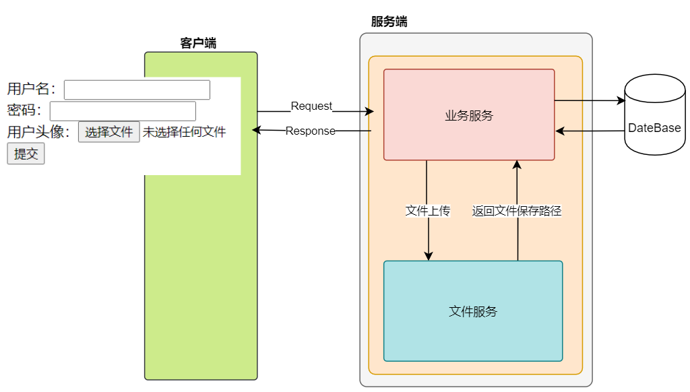
    
</figure>


上传步骤：

1. 前端通过 form 表单将普通数据和上传文件数据直接上传业务服务，
2. 业务服务接收到上传的文件会将其保存到文件服务中
3. 文件服务会返回给文件保存后的路径


**2.异步上传文件（项目中实现）** 

<figure class="thumbnails">
    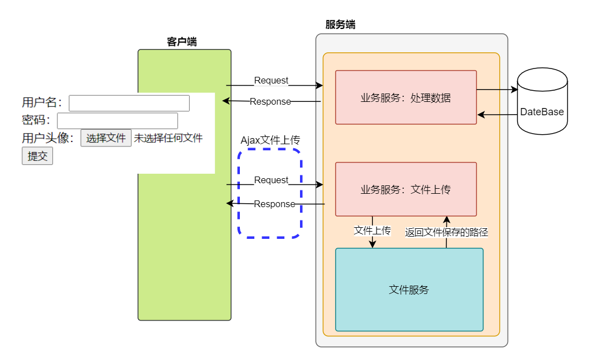
    
</figure>

上传步骤：

1. 前端通过 ajax 调用后端的文件上传接口，单独保存文件 
2. 业务服务：文件上传接口接收到 ajax 的上传文件，并将其保存到文件服务中
3. 文件服务会返回给文件保存后的路径
4. 业务服务：文件上传接口返回上传后的文件保存路径给前端
5. 前端接收到保存后的文件路径地址，将其填到 form 表单中
6. 将用户数据和文件保存的路径一同提交后的业务处理服务中


## 1.2 搭建文件服务（模拟）

由于课程中还没安排文件系统服务的介绍，现在可以使用 Tomcat 来模拟一个文件服务器。下面是搭建的过程，如下：

**1.重新复制一个tomcat**

<figure class="thumbnails">
    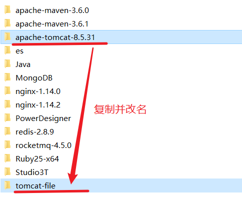
    
</figure>


**2.修改tomcat端口号**

统一将端口 +1 

<figure class="thumbnails">
    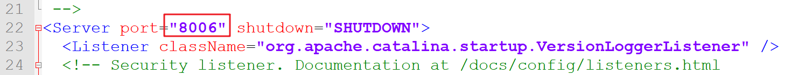
    
</figure>


<figure class="thumbnails">
    
    
</figure>


<figure class="thumbnails">
    
    
</figure>

**3.在conf目录下的web.xml文件中设置tomcat为非只读**


<figure class="thumbnails">
    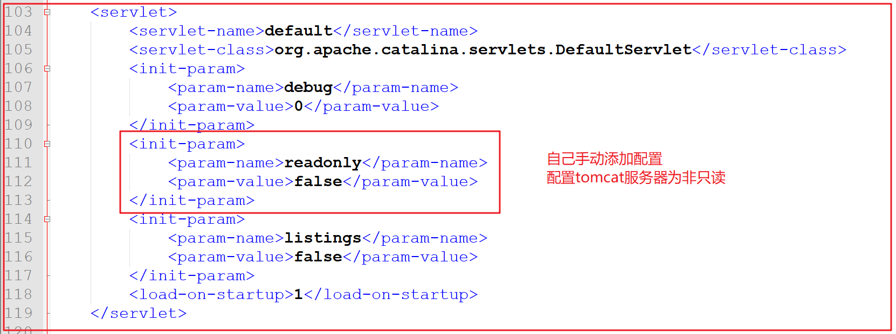
    
</figure>

**4.在conf/Catalina/localhost 目录下创建文件**

创建一个 file.xml 文件，其中内容如下：

```XML
 <Context docBase="自己本地电脑的盘符路径:\upload" />
```


**5.启动tomcat**


<figure class="thumbnails">
    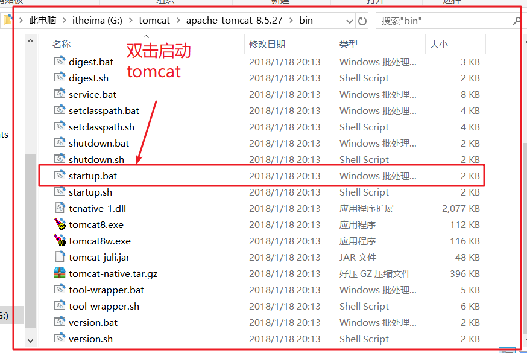
    
</figure>

**6.将下发资料中的图片，拷贝到文件服务目录中，然后通过浏览器访问**


<figure class="thumbnails">
    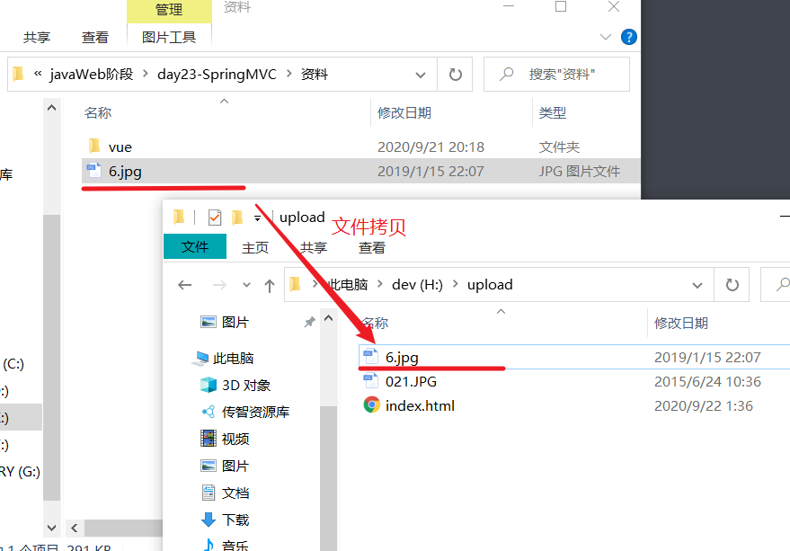
    
</figure>

浏览器访问：


<figure class="thumbnails">
    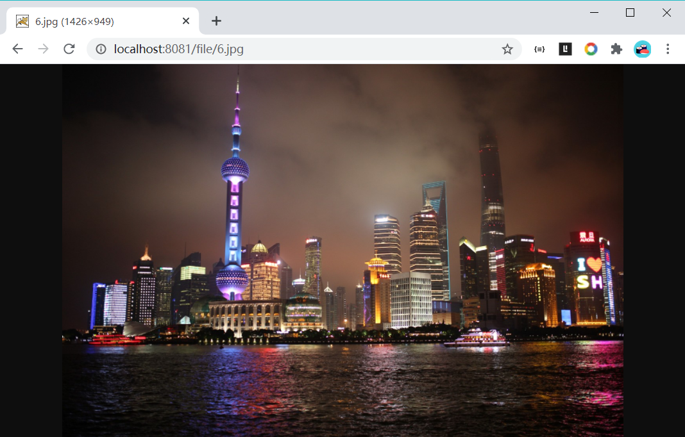
    
</figure>

## 1.3 跨服务文件上传实现

下面进行跨服务内容配置和代码实现。


### 1.3.1 导入跨服务依赖 jar

在后端服务中，需要将上传过来的文件上传到远端服务中，下面是依赖的包：

```XML
<!-- 导入jar包依赖 -->
<dependencies>
    <dependency>
        <groupId>org.springframework</groupId>
        <artifactId>spring-webmvc</artifactId>
        <version>5.0.5.RELEASE</version>
    </dependency>
    <dependency>
        <groupId>javax.servlet</groupId>
        <artifactId>javax.servlet-api</artifactId>
        <version>3.1.0</version>
        <scope>provided</scope>
    </dependency>
    <dependency>
        <groupId>javax.servlet</groupId>
        <artifactId>jsp-api</artifactId>
        <version>2.0</version>
        <scope>provided</scope>
    </dependency>
    <dependency>
        <groupId>org.projectlombok</groupId>
        <artifactId>lombok</artifactId>
        <version>1.18.12</version>
        <scope>provided</scope>
    </dependency>
    <dependency>
        <groupId>com.fasterxml.jackson.core</groupId>
        <artifactId>jackson-core</artifactId>
        <version>2.9.4</version>
    </dependency>
    <dependency>
        <groupId>com.fasterxml.jackson.core</groupId>
        <artifactId>jackson-databind</artifactId>
        <version>2.9.4</version>
    </dependency>
    <dependency>
        <groupId>com.fasterxml.jackson.core</groupId>
        <artifactId>jackson-annotations</artifactId>
        <version>2.9.4</version>
    </dependency>
    <!--普通文件上传-->
    <dependency>
        <groupId>commons-fileupload</groupId>
        <artifactId>commons-fileupload</artifactId>
        <version>1.3.1</version>
    </dependency>
    <!--跨服务器文件上传-->
    <dependency>
        <groupId>com.sun.jersey</groupId>
        <artifactId>jersey-core</artifactId>
        <version>1.18.1</version>
    </dependency>
    <dependency>
        <groupId>com.sun.jersey</groupId>
        <artifactId>jersey-client</artifactId>
        <version>1.18.1</version>
    </dependency>
</dependencies>
<build>
    <plugins>
        <plugin>
            <groupId>org.apache.maven.plugins</groupId>
            <artifactId>maven-compiler-plugin</artifactId>
            <version>3.2</version>
            <configuration>
                <source>1.8</source>
                <target>1.8</target>
                <encoding>utf-8</encoding>
            </configuration>
        </plugin>
    </plugins>
</build>
```

PS: 本地仓库没有，需要进行联网下载


### 1.3.2 前端代码编写

前端代码通过 form 表单来上传文件：

```html
<!DOCTYPE html>
<html lang="zh">
<head>
  <meta charset="UTF-8">
  <title>uploadfile</title>
</head>
<body>


  <h1> 跨服务器上传文件 </h1>
  <form action="/upload/file" enctype="multipart/form-data" method="post">
    用户名：<input name="username" type="text"> <br>
    密码：<input name="password" type="password"> <br>
    用户头像：<input name="filename" type="file"> <br>
    <input type="submit" value="提交"> <br>
  </form>


</body>
</html>
```


### 1.3.3 后端代码的编写

编写Controller代码，通过远端代码上传文件：

```JAVA
package com.itheima.controller;

import com.sun.jersey.api.client.Client;
import com.sun.jersey.api.client.WebResource;
import org.springframework.stereotype.Controller;
import org.springframework.web.bind.annotation.RequestMapping;
import org.springframework.web.multipart.MultipartFile;

import java.io.IOException;
import java.util.UUID;

/**
 * <p></p>
 *
 * @Description:
 */
@Controller
@RequestMapping("upload")
public class UploadController {

    @RequestMapping("file")
    public String uploadFile(String username, String password, MultipartFile filename) throws IOException {

        System.out.println(username+"=="+password);


        // 1.获得文件的名称
        String uploadFileName = filename.getOriginalFilename();

        // 2.获得文件的内容 byte[]
        byte[] bytes = filename.getBytes();

        // 3.获得文件服务器的地址
        String fileServerUrl = "http://localhost:8081/file/";

        // 4.创建远端的客户端对象
        Client client = Client.create();

        //文件的唯一标识（UUID、雪花算法、xxxxx）
        String uuidStr = UUID.randomUUID().toString();

        int index = uploadFileName.lastIndexOf(".");

        String suffix = uploadFileName.substring(index);

        String fullFileName = uuidStr + suffix;

        // 5.设置上传文件的资源路径地址
        WebResource resource = client.resource(fileServerUrl + fullFileName);

        // 6.向资源对象中传入上传文件的内容
        resource.put(bytes);

        return "success";
    }

}
```


# 2.SpringMVC拦截器

在SpringMVC中，也能拦截请求，类似于Servlet 开发中的过滤器Filter，用于对处理器进行预处理和后处理。一般在权限验证的时候使用较多，下面就先来认识下拦截器。


## 2.1 SpringMVC拦截器介绍

SpringMVC中的拦截器提供的一种机制，可以对请求进行拦截或直接放行，可以在进入控制器方法之前对请求做出相应的处理。下面我们先来认识下他在Servlet中的位置，如下：


<figure class="thumbnails">
    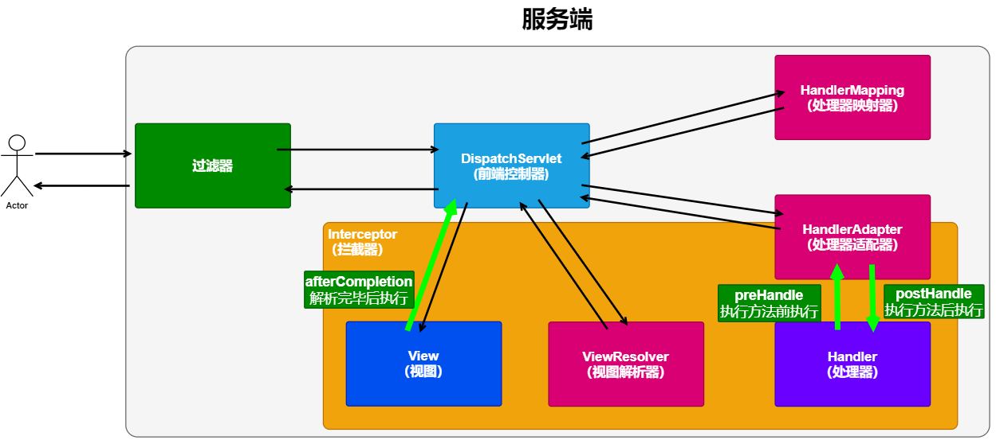
    
</figure>
根据上层图，来分析拦截器内容：

```markdown
# 作用：
	在处理器方法执行前后,进行拦截过滤
# 执行的拦截：
	1.在处理器方法执行前执行拦截: preHandle
	2.在处理方法执行后执行拦截: postHandle
	3.在视图解析器解析完毕后执行拦截: afterCompletion
# 注意事项
	1.Filter在Servlet执行前执行
	2.过滤器是Servlet提供的,拦截器是SpringMVC提供的
	3.过滤器在拦截器之前执行
	4.SpringMVC的处理器方法在Servlet执行后执行
	5.SpringMVC提供的拦截器在处理器执行前后执行
```


## 2.2 SpringMVC 拦截器接口介绍

SpringMVC 中的Interceptor 拦截请求是通过HandlerInterceptor 来实现的 ，如果需要在 SpringMVC 来实现拦截器，那么就需要定义实现 HandlerInterceptor 接口，或者是这个类继承实现了HandlerInterceptor 接口的类 。

在 SpringMVC 的 HandlerInterceptor 接口中有三个方法，如下：

```markdown
# 1.preHandle 方法
	执行时机：在Controller方法执行之前。
	应用场景：这里可以加入权限验证，登录验证等，使用的是最多的，拦截所有请求并判断是否具有访问权限。
	返回布尔类型的结果，返回true放行，返回false拦截后续所有的方法执行。
# 2.postHandle 方法
	执行时机：Controller方法已经执行，但处理结果没有返回给适配器，所以它可以拦截住返回的ModelAndView。
	应用场景：这里可以返回用户前对模型数据进行加工处理，比如这里加入公共信息以便页面显示
# 3.afterCompletion 方法
	执行时机：视图渲染完成后执行拦截
	应用场景：用于进行资源清理工作，或记录日志。
```


## 2.3 SpringMVC 拦截器代码实现

**1.实现 HandlerInterceptor 接口**

```java
package com.itheima.interceptor;

import org.springframework.web.servlet.HandlerInterceptor;
import org.springframework.web.servlet.ModelAndView;

import javax.servlet.http.HttpServletRequest;
import javax.servlet.http.HttpServletResponse;

/**
 * HandlerInterceptor接口使用的JDK1.8的特性
 *  默认方法（接口）
 *  前提：JDK版本必须是1.8
 *
 * @Description:
 */
public class CustomInterceptor implements HandlerInterceptor {


    /**
     * 执行Handler方法前来执行
     *  特点：可以进行权限控制
     *      返回：true--放行
     *           false--拦截请求
     *              只有preHandle方法执行，
     *              后面的Handler方法和postHandl和 afterCompletion 都将不在执行
     * @param request
     * @param response
     * @param handler  执行方法的handler对象（方法全限定类名）
     * @return
     * @throws Exception
     */
    public boolean preHandle(HttpServletRequest request, HttpServletResponse response, Object handler) throws Exception {


        System.out.println("1.CustomInterceptor 方法----preHandle");

        return true;
    }

    /**
     * 执行完Handler方法后会执行该方法
     * @param request
     * @param response
     * @param handler
     * @param modelAndView  ---Handler方法返回数据的封装
     * @throws Exception
     */
    @Override
    public void postHandle(HttpServletRequest request, HttpServletResponse response, Object handler, ModelAndView modelAndView) throws Exception {
        System.out.println("1.CustomInterceptor 方法----postHandle");
    }

    /**
     * 视图渲染完毕后会执行该方法
     * @param request
     * @param response
     * @param handler
     * @param ex
     * @throws Exception
     */
    @Override
    public void afterCompletion(HttpServletRequest request, HttpServletResponse response, Object handler, Exception ex) throws Exception {
        System.out.println("1.CustomInterceptor 方法----afterCompletion");
    }
}
```

**2.配置拦截器**

```XML
<?xml version="1.0" encoding="UTF-8"?>
<beans xmlns="http://www.springframework.org/schema/beans"
       xmlns:xsi="http://www.w3.org/2001/XMLSchema-instance"
       xmlns:context="http://www.springframework.org/schema/context"
       xmlns:mvc="http://www.springframework.org/schema/mvc"
       xsi:schemaLocation="http://www.springframework.org/schema/beans http://www.springframework.org/schema/beans/spring-beans.xsd http://www.springframework.org/schema/context http://www.springframework.org/schema/context/spring-context.xsd http://www.springframework.org/schema/mvc http://www.springframework.org/schema/mvc/spring-mvc.xsd">

    <!-- 包扫描 -->
    <context:component-scan base-package="com.itheima.controller" />

    <!-- 映射器和适配器 -->
    <mvc:annotation-driven />

    <!-- 视图解析器 -->
    <bean class="org.springframework.web.servlet.view.InternalResourceViewResolver">
        <property name="prefix" value="/WEB-INF/pages/"></property>
        <property name="suffix" value=".jsp"></property>
    </bean>

    <!-- 静态资源的放行
            静态资源会使用一个SpringMVC中的DefaultServletHandler来进行处理
    -->
    <mvc:default-servlet-handler />


    <!--  拦截器栈
                可以配置多个拦截器
     -->
    <mvc:interceptors>
        <!-- mvc:interceptor 配置一个拦截器 -->
        <mvc:interceptor>
            <!-- mvc:mapping 配置拦截路径
                        /**: 拦截所有
                          区分：Servlet路径 ：拦截所有 /*
              -->
            <mvc:mapping path="/**"/>
            <!-- 配置拦截器
                    前提：必须要先声明一个拦截器并且实现HandlerInterceptor接口
             -->
            <bean class="com.itheima.interceptor.CustomInterceptor"/>
        </mvc:interceptor>
    </mvc:interceptors>


</beans>
```

PS：上面的配置需要在**项目**中 **SpringMVC配置文件**中配置。


IntercController

```JAVA
package com.itheima.controller;

import org.springframework.stereotype.Controller;
import org.springframework.web.bind.annotation.RequestMapping;

/**
 * <p></p>
 *
 * @Description:
 */
@Controller
@RequestMapping("interceptor")
public class IntercController {

    @RequestMapping("welcome")
    public String welcome() {
        System.out.println("IntercController 方法--welcome 执行 ");
        return "success";
    }

}
```


对于拦截路径配置的解释：

```markdown
# mvc:interceptors
	拦截器栈
# mvc:interceptor
	配置一个拦截器
# mvc:mapping 
	配置拦截路径
# mvc:exclude-mapping
	配置排除的拦截路径
```


## 2.4 拦截器链


<figure class="thumbnails">
    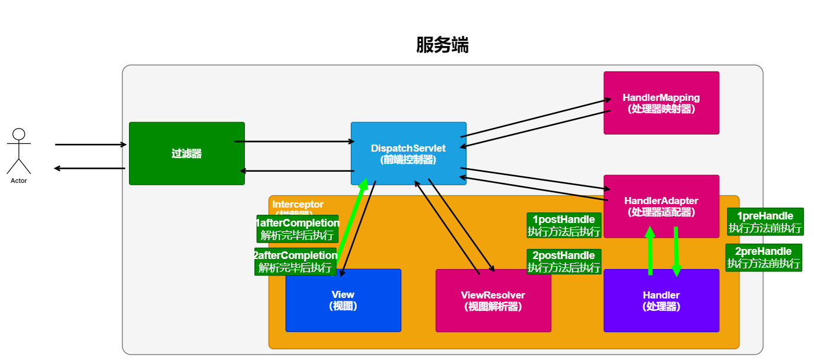
    
</figure>

拦截器链是配置多个拦截器来拦截资源如下：

CustomInterceptor

```JAVA
package com.itheima.interceptor;

import org.springframework.web.servlet.HandlerInterceptor;
import org.springframework.web.servlet.ModelAndView;

import javax.servlet.http.HttpServletRequest;
import javax.servlet.http.HttpServletResponse;

/**
 * HandlerInterceptor接口使用的JDK1.8的特性
 *  默认方法（接口）
 *  前提：JDK版本必须是1.8
 *
 * @Description:
 */
public class CustomInterceptor implements HandlerInterceptor {


    /**
     * 执行Handler方法前来执行
     *  特点：可以进行权限控制
     *      返回：true--放行
     *           false--拦截请求
     *              只有preHandle方法执行，
     *              后面的Handler方法和postHandl和 afterCompletion 都将不在执行
     * @param request
     * @param response
     * @param handler  执行方法的handler对象（方法全限定类名）
     * @return
     * @throws Exception
     */
    public boolean preHandle(HttpServletRequest request, HttpServletResponse response, Object handler) throws Exception {


        System.out.println("1.CustomInterceptor 方法----preHandle");

        return true;
    }

    /**
     * 执行完Handler方法后会执行该方法
     * @param request
     * @param response
     * @param handler
     * @param modelAndView  ---Handler方法返回数据的封装
     * @throws Exception
     */
    @Override
    public void postHandle(HttpServletRequest request, HttpServletResponse response, Object handler, ModelAndView modelAndView) throws Exception {
        System.out.println("1.CustomInterceptor 方法----postHandle");
    }

    /**
     * 视图渲染完毕后会执行该方法
     * @param request
     * @param response
     * @param handler
     * @param ex
     * @throws Exception
     */
    @Override
    public void afterCompletion(HttpServletRequest request, HttpServletResponse response, Object handler, Exception ex) throws Exception {
        System.out.println("1.CustomInterceptor 方法----afterCompletion");
    }
}
```

CustomInterceptor2

```JAVA
package com.itheima.interceptor;

import org.springframework.web.servlet.HandlerInterceptor;
import org.springframework.web.servlet.ModelAndView;

import javax.servlet.http.HttpServletRequest;
import javax.servlet.http.HttpServletResponse;

/**
 * HandlerInterceptor接口使用的JDK1.8的特性
 *  默认方法（接口）
 *  前提：JDK版本必须是1.8
 *
 * @Description:
 */
public class CustomInterceptor2 implements HandlerInterceptor {


    /**
     * 执行Handler方法前来执行
     *  特点：可以进行权限控制
     *      返回：true--放行
     *           false--拦截请求
     *              只有preHandle方法执行，
     *              后面的Handler方法和postHandl和 afterCompletion 都将不在执行
     * @param request
     * @param response
     * @param handler  执行方法的handler对象（方法全限定类名）
     * @return
     * @throws Exception
     */
    public boolean preHandle(HttpServletRequest request, HttpServletResponse response, Object handler) throws Exception {


        System.out.println("2.CustomInterceptor 方法----preHandle");

        return true;
    }

    /**
     * 执行完Handler方法后会执行该方法
     * @param request
     * @param response
     * @param handler
     * @param modelAndView  ---Handler方法返回数据的封装
     * @throws Exception
     */
    @Override
    public void postHandle(HttpServletRequest request, HttpServletResponse response, Object handler, ModelAndView modelAndView) throws Exception {
        System.out.println("2.CustomInterceptor 方法----postHandle");
    }

    /**
     * 视图渲染完毕后会执行该方法
     * @param request
     * @param response
     * @param handler
     * @param ex
     * @throws Exception
     */
    @Override
    public void afterCompletion(HttpServletRequest request, HttpServletResponse response, Object handler, Exception ex) throws Exception {
        System.out.println("2.CustomInterceptor 方法----afterCompletion");
    }
}
```

配置文件

```XML
<?xml version="1.0" encoding="UTF-8"?>
<beans xmlns="http://www.springframework.org/schema/beans"
       xmlns:xsi="http://www.w3.org/2001/XMLSchema-instance"
       xmlns:context="http://www.springframework.org/schema/context"
       xmlns:mvc="http://www.springframework.org/schema/mvc"
       xsi:schemaLocation="http://www.springframework.org/schema/beans http://www.springframework.org/schema/beans/spring-beans.xsd http://www.springframework.org/schema/context http://www.springframework.org/schema/context/spring-context.xsd http://www.springframework.org/schema/mvc http://www.springframework.org/schema/mvc/spring-mvc.xsd">

    <!-- 包扫描 -->
    <context:component-scan base-package="com.itheima.controller" />

    <!-- 映射器和适配器 -->
    <mvc:annotation-driven />

    <!-- 视图解析器 -->
    <bean class="org.springframework.web.servlet.view.InternalResourceViewResolver">
        <property name="prefix" value="/WEB-INF/pages/"></property>
        <property name="suffix" value=".jsp"></property>
    </bean>

    <!-- 静态资源的放行
            静态资源会使用一个SpringMVC中的DefaultServletHandler来进行处理
    -->
    <mvc:default-servlet-handler />


    <!--  拦截器栈
                可以配置多个拦截器

          访问路径：http://localhost:8080/interceptor/welcome

          拦截顺序：是按照拦截器的配置顺序拦截
     -->
    <mvc:interceptors>
        <!-- mvc:interceptor 配置一个拦截器 -->
        <mvc:interceptor>
            <!-- mvc:mapping 配置拦截路径
                        /**: 拦截所有
                          区分：Servlet路径 ：拦截所有 /*
              -->
            <mvc:mapping path="/**"/>
            <!-- 配置拦截器
                    前提：必须要先声明一个拦截器并且实现HandlerInterceptor接口
             -->
            <bean class="com.itheima.interceptor.CustomInterceptor"/>
        </mvc:interceptor>

        <mvc:interceptor>
            <mvc:mapping path="/interceptor/welcome"/>
            <bean class="com.itheima.interceptor.CustomInterceptor2"/>
        </mvc:interceptor>
    </mvc:interceptors>
</beans>
```

PS：上面的配置需要在**项目**中 **SpringMVC配置文件**中配置。

IntercController

```java
package com.itheima.controller;

import org.springframework.stereotype.Controller;
import org.springframework.web.bind.annotation.RequestMapping;

/**
 * <p></p>
 *
 * @Description:
 */
@Controller
@RequestMapping("interceptor")
public class IntercController {

    @RequestMapping("welcome")
    public String welcome() {
        System.out.println("IntercController 方法--welcome 执行 ");
        return "success";
    }

}
```


执行顺序：

```markdown
1. CustomInterceptor 方法----preHandle
2. CustomInterceptor 方法----preHandle


IntercController 方法--welcome 执行 


2. CustomInterceptor 方法----postHandle
1. CustomInterceptor 方法----postHandle

2. CustomInterceptor 方法----afterCompletion
1. CustomInterceptor 方法----afterCompletion
```


## 2.5 登录案例

下来来实现一个使用SpringMVC的拦截器来实现登录的案例。

**1.前端页面** 

登录页面

```HTML
<!DOCTYPE html>
<html lang="zh-CN">
<head>
    <meta charset="UTF-8">
    <title>Title</title>
</head>
<body>
        <h1>登录页面</h1>
    <form action="" method="post">
        
        <input type="text" name="username" placeholder="请输入用户名"> <br>
        <input type="password" name="password" placeholder="请输入密码"> <br><br>
        <input type="submit">

    </form>

</body> 
</html>
```

访问成功页面

```JSP
<%@ page contentType="text/html;charset=UTF-8" language="java" %>
<html>
  <head>
    <title>success</title>
  </head>
  <body>

    访问成功 <br>
    用户名为：${user.name}

  </body>
</html>
```


**2.后端代码** 

拦截器

```JAVA
package com.itheima.interceptor;

import org.springframework.web.servlet.HandlerInterceptor;
import org.springframework.web.servlet.ModelAndView;

import javax.servlet.http.HttpServletRequest;
import javax.servlet.http.HttpServletResponse;
import javax.servlet.http.HttpSession;

/**
 * <p></p>
 *
 * @Description:
 */
public class CustomInterceptor implements HandlerInterceptor {

    @Override
    public boolean preHandle(HttpServletRequest request, HttpServletResponse response, Object handler) throws Exception {

        HttpSession session = request.getSession(false);

        if (session != null) {

            Object user = session.getAttribute("user");

            if (user != null) {
                return true;
            }
        }

        String contextPath = request.getContextPath();

        response.sendRedirect(contextPath + "/login.html");

        return false;
    }

    @Override
    public void postHandle(HttpServletRequest request, HttpServletResponse response, Object handler, ModelAndView modelAndView) throws Exception {
    }

    @Override
    public void afterCompletion(HttpServletRequest request, HttpServletResponse response, Object handler, Exception ex) throws Exception {
    }
}
```

拦截器的配置

```XML
<?xml version="1.0" encoding="UTF-8"?>
<beans xmlns="http://www.springframework.org/schema/beans"
       xmlns:xsi="http://www.w3.org/2001/XMLSchema-instance"
       xmlns:context="http://www.springframework.org/schema/context"
       xmlns:mvc="http://www.springframework.org/schema/mvc"
       xsi:schemaLocation="http://www.springframework.org/schema/beans http://www.springframework.org/schema/beans/spring-beans.xsd http://www.springframework.org/schema/context http://www.springframework.org/schema/context/spring-context.xsd http://www.springframework.org/schema/mvc http://www.springframework.org/schema/mvc/spring-mvc.xsd">

    <context:component-scan base-package="com.itheima" />

    <mvc:annotation-driven />

    <bean class="org.springframework.web.servlet.view.InternalResourceViewResolver">
        <property name="prefix" value="/WEB-INF/pages/" />
        <property name="suffix" value=".jsp" />
    </bean>
    
    <mvc:default-servlet-handler />

    <!-- 登录拦截器 -->
    <mvc:interceptors>
        <mvc:interceptor>
            <mvc:mapping path="/**"/>
            <mvc:exclude-mapping path="/login.html"/>
            <mvc:exclude-mapping path="/user/login"/>
            <bean class="com.itheima.interceptor.CustomInterceptor"></bean>
        </mvc:interceptor>
    </mvc:interceptors>
</beans>
```

Controller代码编写

```java
package com.itheima.controller07;

import com.itheima.domain.User;
import org.springframework.stereotype.Controller;
import org.springframework.ui.Model;
import org.springframework.web.bind.annotation.RequestMapping;
import org.springframework.web.bind.annotation.SessionAttributes;

/**
 * <p></p>
 *
 * @Description:
 */
@Controller
@RequestMapping("user")
@SessionAttributes("user")
public class LoginController {

    @RequestMapping("login")
    public String login(User user, Model model) {

        if ("jack".equalsIgnoreCase(user.getName()) && "123".equalsIgnoreCase(user.getPassword())) {
            model.addAttribute("user", user);
            return "success";
        }

        return "redirect:/login.html";
    }
}
```


# 3.SSM整合

SSM框架在三层架构的位置，如下：

<figure class="thumbnails">
    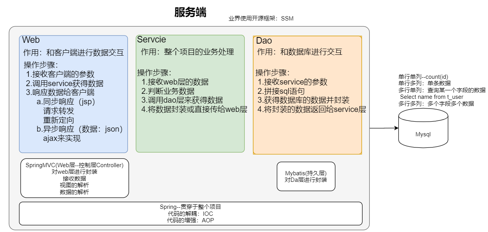
    
</figure>
现在需要将 SSM 框架整合到一起，让这三个框架整合在一起，其中 Spring 框架是整个项目框架的粘合剂。它可以将很多的框架整合在一起。

o

## 3.1 SSM整合环境说明

下面需要先了解下，每个框架所需要的内容

### 3.1.1 Spring环境

下面是Spring的环境相关内容

```markdown
# 1.Spring 导入的包
	核心包：spring-context
	数据库：spring-jdbc，数据库驱动
	aop依赖：aspectj
	测试包：spring-junit、junit
# 2.配置文件
	ioc：
		纯xml文件
		半xml半注解 ★★★
		纯注解 ★
	aop：
		声明式事务
```

### 3.1.2 SpringMVC环境

下面是SpringMVC的环境相关内容

```markdown
# 1.SpringMVC 导入的包
	核心包：spring-webmvc
# 2.配置文件
	三大核心组件
		处理器映射器
		处理器适配器
		视图解析器
	对静态资源的放行
# 3.web文件的配置
	配置前端控制器
	配置字符集过滤器
```


### 3.1.3 mybatis环境

下面是 mybatis的环境相关内容

```markdown
# 1.mybatis 导入的包
	核心包：mybatis（数据库相关已经导入）
# 2.核心配置文件
	加载properties文件
	别名配置
	环境配置-数据库连接池
	映射配置-加载映射信息
```


## 3.2 项目的前期环境的搭建

在进行整合前，需要进行前期环境的单间

**1.初始化数据库**

```SQL
create database case3;
use case3;
CREATE TABLE `account` (
  `id` int(11) NOT NULL AUTO_INCREMENT,
  `name` varchar(40) DEFAULT NULL,
  `money` float DEFAULT NULL,
  PRIMARY KEY (`id`)
) ENGINE=InnoDB AUTO_INCREMENT=9 DEFAULT CHARSET=utf8;

INSERT INTO `account` VALUES ('1', 'tom', '1000');
INSERT INTO `account` VALUES ('2', 'rose', '1000');
INSERT INTO `account` VALUES ('3', 'jack', '1000');
```

**2.导入ssm项目**

将资料中的基础项目导入到Idea中

<figure class="thumbnails">
    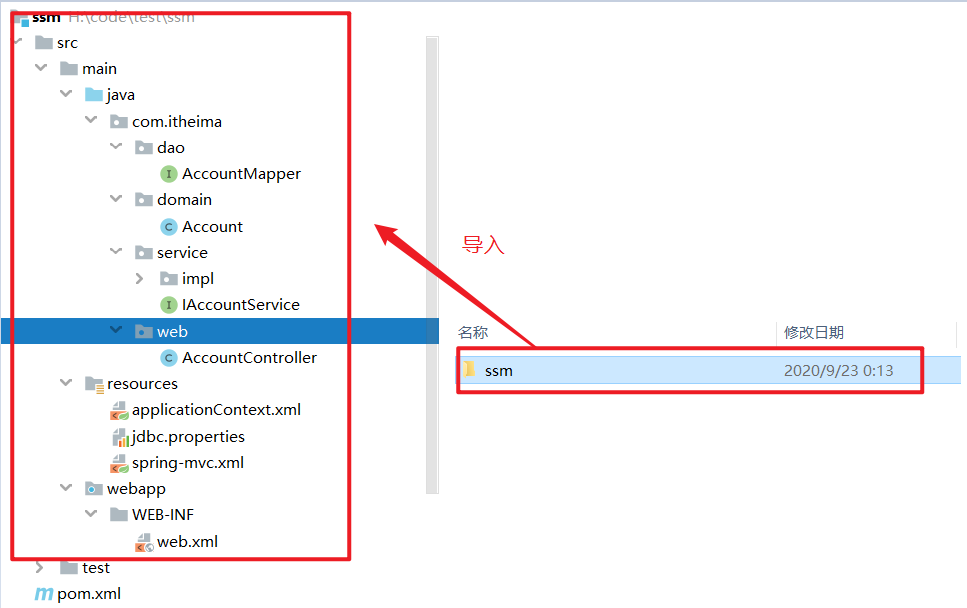
    
</figure>

**3.将ssm相关的jar文件导入的工程中**

```XML

    <properties>
        <!-- 定义变量 -->
        <spring-version>5.0.5.RELEASE</spring-version>
    </properties>

    <dependencies>
        <!-- spring核心jar包 -->
        <dependency>
            <groupId>org.springframework</groupId>
            <artifactId>spring-context</artifactId>
            <version>${spring-version}</version>
        </dependency>
        
        <!-- aspectJ坐标 切入点表达式-->
        <dependency>
            <groupId>org.aspectj</groupId>
            <artifactId>aspectjweaver</artifactId>
            <version>1.8.7</version>
        </dependency>
        
        
        <!-- Mybatis jar包 -->
        <dependency>
            <groupId>org.mybatis</groupId>
            <artifactId>mybatis</artifactId>
            <version>3.4.5</version>
        </dependency>
        <dependency>
            <groupId>org.slf4j</groupId>
            <artifactId>slf4j-log4j12</artifactId>
            <version>1.6.4</version>
        </dependency>
        <!-- spring整合mybatis的坐标 -->
        <dependency>
            <groupId>org.mybatis</groupId>
            <artifactId>mybatis-spring</artifactId>
            <version>1.3.1</version>
        </dependency>
        
        
        <!-- springmvc的坐标 -->
        <dependency>
            <groupId>org.springframework</groupId>
            <artifactId>spring-webmvc</artifactId>
            <version>${spring-version}</version>
        </dependency>
        
        <!-- jackson -->
        <dependency>
            <groupId>com.fasterxml.jackson.core</groupId>
            <artifactId>jackson-core</artifactId>
            <version>2.9.4</version>
        </dependency>
        <dependency>
            <groupId>com.fasterxml.jackson.core</groupId>
            <artifactId>jackson-databind</artifactId>
            <version>2.9.4</version>
        </dependency>
        <dependency>
            <groupId>com.fasterxml.jackson.core</groupId>
            <artifactId>jackson-annotations</artifactId>
            <version>2.9.4</version>
        </dependency>
        
        
        <!-- Servlet的jar包 -->
        <dependency>
            <groupId>javax.servlet</groupId>
            <artifactId>javax.servlet-api</artifactId>
            <version>3.1.0</version>
            <scope>provided</scope>
        </dependency>
        <!-- jsp的jar包 -->
        <dependency>
            <groupId>javax.servlet</groupId>
            <artifactId>jsp-api</artifactId>
            <version>2.0</version>
            <scope>provided</scope>
        </dependency>
		<!-- jstl的jar包-->
        <dependency>
            <groupId>jstl</groupId>
            <artifactId>jstl</artifactId>
            <version>1.2</version>
        </dependency>
        
        
        
        <!-- Spring整合jdbc的jar包 -->
        <dependency>
            <groupId>org.springframework</groupId>
            <artifactId>spring-jdbc</artifactId>
            <version>${spring-version}</version>
        </dependency>
        <!-- mysql驱动包 -->
        <dependency>
            <groupId>mysql</groupId>
            <artifactId>mysql-connector-java</artifactId>
            <version>5.1.26</version>
        </dependency>
        
        
        <!-- spring和junit的整合坐标 -->
        <dependency>
            <groupId>org.springframework</groupId>
            <artifactId>spring-test</artifactId>
            <version>${spring-version}</version>
        </dependency>
        <!-- junit的整合坐标 -->
        <dependency>
            <groupId>junit</groupId>
            <artifactId>junit</artifactId>
            <version>4.12</version>
        </dependency>
        
        
         <dependency>
            <groupId>org.projectlombok</groupId>
            <artifactId>lombok</artifactId>
            <version>1.18.12</version>
        </dependency>
    </dependencies>

    <!--设置插件-->
    <build>
        <plugins>
            <!--JDK编译插件-->
            <plugin>
                <groupId>org.apache.maven.plugins</groupId>
                <artifactId>maven-compiler-plugin</artifactId>
                <version>3.2</version>
                <configuration>
                    <source>1.8</source>
                    <target>1.8</target>
                    <encoding>UTF-8</encoding>
                </configuration>
            </plugin>


            <plugin>
                <groupId>org.apache.tomcat.maven</groupId>
                <artifactId>tomcat7-maven-plugin</artifactId>
                <version>2.2</version>
                <configuration>
                    <path>/case2</path>
                    <port>80</port>
                    <uriEncoding>utf-8</uriEncoding>
                </configuration>
            </plugin>

           </plugins>
    </build>

```


## 3.3 Spring环境搭建

### 3.3.1 配置文件

applicationContext.xml配置文件

```xml
<?xml version="1.0" encoding="UTF-8"?>
<beans xmlns="http://www.springframework.org/schema/beans"
       xmlns:xsi="http://www.w3.org/2001/XMLSchema-instance"
       xmlns:aop="http://www.springframework.org/schema/aop"
       xmlns:context="http://www.springframework.org/schema/context" xmlns:tx="http://www.springframework.org/schema/tx"
       xsi:schemaLocation="http://www.springframework.org/schema/beans
        http://www.springframework.org/schema/beans/spring-beans.xsd
        http://www.springframework.org/schema/aop
        http://www.springframework.org/schema/aop/spring-aop.xsd
        http://www.springframework.org/schema/context
        http://www.springframework.org/schema/context/spring-context.xsd http://www.springframework.org/schema/tx http://www.springframework.org/schema/tx/spring-tx.xsd">

   <!-- 开启包扫描
        Spring只管扫描Service层
            1.管理所有的Service实现类
            2.声明式事务
    -->
    <context:component-scan base-package="com.itheima.service" />

</beans>
```

### 3.3.2 测试SpringIOC环境

```java
---------接口
public interface IAccountService {

    List<Account> findAll();
}


---------实现类

@Service
public class AccountServiceImpl implements IAccountService {


    public List<Account> findAll() {

        // 伪造出Account集合数据
        Account account1 = new Account("1","xiaoming","666");
        Account account2 = new Account("2","xiaohonghong","666");
        Account account3 = new Account("3","xiaobiaodi","666");

        List<Account> accounts =  new ArrayList<Account>();

        Collections.addAll(accounts, account1, account2, account3);


        return accounts;
    }
}
```


**测试代码**

```java
package com.itheima.test;

import com.itheima.domain.Account;
import com.itheima.service.IAccountService;
import org.junit.Test;
import org.junit.runner.RunWith;
import org.springframework.beans.factory.annotation.Autowired;
import org.springframework.test.context.ContextConfiguration;
import org.springframework.test.context.junit4.SpringJUnit4ClassRunner;

import java.util.List;

/**
 * <p></p>
 *
 * @Description:
 */
@RunWith(SpringJUnit4ClassRunner.class)
@ContextConfiguration(locations = {"classpath:applicationContext.xml"})
public class SpringTest {

    @Autowired
    private IAccountService accountService;


    @Test
    public void test01() {

        List<Account> all = accountService.findAll();

        System.out.println(all);

    }
}
```


## 3.4 搭建Mybatis环境

### 3.4.1 创建sqlMapConfig.xml文件

```xml
<?xml version="1.0" encoding="UTF-8" ?>
<!DOCTYPE configuration
        PUBLIC "-//mybatis.org//DTD Config 3.0//EN"
        "http://mybatis.org/dtd/mybatis-3-config.dtd">
<configuration>

    <!--加载外部的properties文件-->
    <properties resource="jdbc.properties">
    </properties>

    <settings>
        <!--开启全局加载-->
        <setting name="lazyLoadingEnabled" value="true"/>
        <setting name="logImpl" value="LOG4J" />
    </settings>

    <!--给类或包下面的类起别名，目标：在接口映射文件中只需要写类名就可以-->
    <typeAliases>
        <package name="com.itheima.domain"/>
    </typeAliases>

    <environments default="mysql">
        <environment id="mysql">
            <transactionManager type="JDBC"></transactionManager>
            <dataSource type="pooled">
                <property name="driver" value="${jdbc.driver}"/>
                <property name="url" value="${jdbc.url}"/>
                <property name="username" value="${jdbc.username}"/>
                <property name="password" value="${jdbc.password}"/>
            </dataSource>
        </environment>


    </environments>

    <!--加载接口映射文件-->
    <mappers>
        <!--加载指定包下所有的接口映射文件-->
        <package name="com.itheima.dao"/>
    </mappers>
</configuration>
```

jdbc.properties

```properties
jdbc.driver=com.mysql.jdbc.Driver
jdbc.url=jdbc:mysql://localhost:3306/case3?characterEncoding=utf8
jdbc.username=root
jdbc.password=root
```


### 3.4.2 dao层的映射文件

```java
public interface AccountMapper {
    //@Select("select *  from account")
    List<Account> findAll();
}
```

```xml
<?xml version="1.0" encoding="UTF-8" ?>
<!DOCTYPE mapper
        PUBLIC "-//mybatis.org//DTD Mapper 3.0//EN"
        "http://mybatis.org/dtd/mybatis-3-mapper.dtd">
<!--namespace:名称空间,用于区分不同的模块
        值: dao接口的全限定名
 -->
<mapper namespace="com.itheima.dao.AccountMapper">
    <!-- select 查询 -->
    <!-- id: 接口中方法的名称 -->
	<select id="findAll" resultType="account">
		select *  from account
	</select>
</mapper>
```


### 3.4.3 测试Mybatis

```java
package com.itheima.test;

import com.itheima.dao.AccountMapper;
import com.itheima.pojo.Account;
import org.apache.ibatis.io.Resources;
import org.apache.ibatis.session.SqlSession;
import org.apache.ibatis.session.SqlSessionFactory;
import org.apache.ibatis.session.SqlSessionFactoryBuilder;

import java.io.IOException;
import java.io.InputStream;
import java.util.List;

public class Test02Mybatis {
    public static void main(String[] args) throws IOException {
        //1.创建SqlSessionFactoryBuilder对象,解析核心配置文件
        SqlSessionFactoryBuilder sqlSessionFactoryBuilder = new SqlSessionFactoryBuilder();
        // 获取配置文件的流信息
        InputStream is = Resources.getResourceAsStream("sqlMapConfig.xml");
        //2.解析核心配置文件得到工厂对象
        SqlSessionFactory sqlSessionFactory = sqlSessionFactoryBuilder.build(is);
        //3.获取SQLSession对象
        SqlSession sqlSession = sqlSessionFactory.openSession();
        //4.获取dao接口的实现类对象
        AccountMapper mapper = sqlSession.getMapper(AccountMapper.class);
        //5.调用方法执行
        List<Account> list = mapper.findAll();
        for (Account account : list) {
            System.out.println(account);
        }
        sqlSession.close();
        is.close();
    }
}

```


## 3.5 Spring整合Mybatis

整合时需要依赖整合的jar包(我们已经事先导过了)

```XML
<!-- spring整合mybatis的坐标 :之前已经导入-->
<dependency>
    <groupId>org.mybatis</groupId>
    <artifactId>mybatis-spring</artifactId>
    <version>1.3.1</version>
</dependency>
```


### 3.5.1 编写applicationContext配置

```xml
<?xml version="1.0" encoding="UTF-8"?>
<beans xmlns="http://www.springframework.org/schema/beans"
       xmlns:xsi="http://www.w3.org/2001/XMLSchema-instance"
       xmlns:aop="http://www.springframework.org/schema/aop"
       xmlns:context="http://www.springframework.org/schema/context" xmlns:tx="http://www.springframework.org/schema/tx"
       xsi:schemaLocation="http://www.springframework.org/schema/beans
        http://www.springframework.org/schema/beans/spring-beans.xsd
        http://www.springframework.org/schema/aop
        http://www.springframework.org/schema/aop/spring-aop.xsd
        http://www.springframework.org/schema/context
        http://www.springframework.org/schema/context/spring-context.xsd http://www.springframework.org/schema/tx http://www.springframework.org/schema/tx/spring-tx.xsd">

   <!-- 开启包扫描
        Spring只管扫描Service层
            1.管理所有的Service实现类
            2.声明式事务
    -->
    <context:component-scan base-package="com.itheima.service" />


    <!-- 加载配置文件 jdbc.properties -->
    <context:property-placeholder location="classpath:jdbc.properties" />
    <!--<bean class="org.springframework.beans.factory.config.PropertyPlaceholderConfigurer">
        <property name="locations">
            <list>
                <value>classpath:jdbc.properties</value>
            </list>
        </property>
    </bean>-->

    <!-- 数据库连接池 -->
    <bean class="org.springframework.jdbc.datasource.DriverManagerDataSource" id="dataSource">
        <property name="url"                value="${jdbc.url}"></property>
        <property name="username"           value="${jdbc.username}"></property>
        <property name="password"           value="${jdbc.password}"></property>
        <property name="driverClassName"    value="${jdbc.driver}"></property>
    </bean>

    <!-- 声明式事务 -->
    <!-- 事务管理器 -->
    <bean class="org.springframework.jdbc.datasource.DataSourceTransactionManager" id="transactionManager">
        <property name="dataSource" ref="dataSource"/>
    </bean>


    <!-- 注解形式的声明式事务 -->
    <tx:annotation-driven transaction-manager="transactionManager"></tx:annotation-driven>


    <!-- xml形式的声明式事务 -->
    <!-- advice -->
    <!--<tx:advice transaction-manager="transactionManager" id="txAdvice">
        <tx:attributes>
            <tx:method name="find*" isolation="DEFAULT" propagation="REQUIRED" timeout="-1" read-only="true" />
        </tx:attributes>
    </tx:advice>

    &lt;!&ndash; 事务的切面 &ndash;&gt;
    <aop:config>
        <aop:pointcut id="pt" expression="execution(* com.itheima.service..*.*(..))"/>
        <aop:advisor advice-ref="txAdvice" pointcut-ref="pt"></aop:advisor>
    </aop:config>-->


    <!-- 配置Spring整合Mybatis的SqlSessionFactoryBean -->
    <bean class="org.mybatis.spring.SqlSessionFactoryBean"  id="sessionFactory">
        <!-- 配置domain别名 -->
        <property name="typeAliasesPackage" value="com.itheima.domain"></property>
        <!-- 配置数据源 -->
        <property name="dataSource"  ref="dataSource" ></property>
        <!-- 加载Mybatis的全局配置 -->
        <property name="configLocation" value="classpath:sqlMapConfig.xml"></property>

    </bean>

    <!-- 扫描Mybatis的接口和映射文件 -->
    <bean class="org.mybatis.spring.mapper.MapperScannerConfigurer" id="scannerConfigurer">
        <!--加载指定包下所有的接口映射文件-->
        <property name="basePackage" value="com.itheima.dao"></property>
    </bean>


</beans>
```

sqlMapConfig.xml

```XML
<?xml version="1.0" encoding="UTF-8" ?>
<!DOCTYPE configuration
        PUBLIC "-//mybatis.org//DTD Config 3.0//EN"
        "http://mybatis.org/dtd/mybatis-3-config.dtd">
<configuration>

    <settings>
        <!--开启全局加载-->
        <setting name="lazyLoadingEnabled" value="true"/>
        <setting name="logImpl" value="LOG4J" />
    </settings>
    
</configuration>
```


### 3.5.2 测试Spring整合Mybatis

service层代码:

```java
package com.itheima.service.impl;

import com.itheima.dao.AccountMapper;
import com.itheima.domain.Account;
import com.itheima.service.IAccountService;
import org.springframework.beans.factory.annotation.Autowired;
import org.springframework.stereotype.Service;

import java.util.List;

/**
 * <p></p>
 *
 * @Description:
 */
@Service
// @Transactional// 当前的service所有的方法都会加上事务
public class AccountServiceImpl implements IAccountService {

    @Autowired
    private AccountMapper accountMapper;

    // @Transactional //当前方法加上事务
    public List<Account> findAll() {

        // 伪造出Account集合数据
        // Account account1 = new Account("1","xiaoming","666");
        // Account account2 = new Account("2","xiaohonghong","666");
        // Account account3 = new Account("3","xiaobiaodi","666");
        //
        // List<Account> accounts =  new ArrayList<Account>();
        //
        // Collections.addAll(accounts, account1, account2, account3);

        List<Account> accounts = accountMapper.selectAll();

        return accounts;
    }
}
```

测试:

```java
package com.itheima.test;

import com.itheima.domain.Account;
import com.itheima.service.IAccountService;
import org.junit.Test;
import org.junit.runner.RunWith;
import org.springframework.beans.factory.annotation.Autowired;
import org.springframework.test.context.ContextConfiguration;
import org.springframework.test.context.junit4.SpringJUnit4ClassRunner;

import java.util.List;

/**
 * <p></p>
 *
 * @Description:
 */
@RunWith(SpringJUnit4ClassRunner.class)
@ContextConfiguration(locations = {"classpath:applicationContext.xml"})
public class SpringTest {

    @Autowired
    private IAccountService accountService;


    @Test
    public void test01() {

        List<Account> all = accountService.findAll();

        System.out.println(all);

    }
}
```

## 3.6 搭建SpringMVC环境

### 3.6.1 编写web.xml文件

```xml
<?xml version="1.0" encoding="UTF-8"?>
<web-app xmlns="http://xmlns.jcp.org/xml/ns/javaee"
         xmlns:xsi="http://www.w3.org/2001/XMLSchema-instance"
         xsi:schemaLocation="http://xmlns.jcp.org/xml/ns/javaee http://xmlns.jcp.org/xml/ns/javaee/web-app_3_1.xsd"
         version="3.1">

    <!-- 配置字符集过滤器 -->
    <filter>
        <filter-name>encodingFilter</filter-name>
        <filter-class>org.springframework.web.filter.CharacterEncodingFilter</filter-class>
        <init-param>
            <param-name>encoding</param-name>
            <param-value>utf-8</param-value>
        </init-param>
    </filter>
    <filter-mapping>
        <filter-name>encodingFilter</filter-name>
        <url-pattern>/*</url-pattern>
    </filter-mapping>


    <!-- springmvc的前端控制器 -->
    <servlet>
        <servlet-name>dispatcherServlet</servlet-name>
        <servlet-class>org.springframework.web.servlet.DispatcherServlet</servlet-class>
        <!-- 加载springmvc的核心配置文件 -->
        <init-param>
            <param-name>contextConfigLocation</param-name>
            <param-value>classpath:spring-mvc.xml</param-value>
        </init-param>
        <!-- 前端控制器随服务启动而创建 -->
        <load-on-startup>5</load-on-startup>
    </servlet>
    <servlet-mapping>
        <servlet-name>dispatcherServlet</servlet-name>
        <!-- 为了以后支持Restful，将路径配置为 / -->
        <url-pattern>/</url-pattern>
    </servlet-mapping>


</web-app>
```

### 3.6.2 编写springmvc的核心配置文件

```xml
<?xml version="1.0" encoding="UTF-8"?>
<beans xmlns="http://www.springframework.org/schema/beans"
       xmlns:xsi="http://www.w3.org/2001/XMLSchema-instance"
       xmlns:mvc="http://www.springframework.org/schema/mvc"
       xmlns:context="http://www.springframework.org/schema/context"
       xmlns:mvc="http://www.springframework.org/schema/mvc"
       xsi:schemaLocation="http://www.springframework.org/schema/beans
        http://www.springframework.org/schema/beans/spring-beans.xsd
        http://www.springframework.org/schema/mvc
        http://www.springframework.org/schema/mvc/spring-mvc.xsd http://www.springframework.org/schema/context http://www.springframework.org/schema/context/spring-context.xsd">

    <!-- 包扫描 -->
    <context:component-scan base-package="com.itheima.web">
        <!-- 只扫描注解为 @Controller的组件
                type：扫描的类型（注解）
                expression：注解的全限定类名
         -->
        <context:include-filter type="annotation" expression="org.springframework.stereotype.Controller"/>
    </context:component-scan>

    <!-- 映射器和适配器 -->
    <mvc:annotation-driven />

    <!-- 视图解析器 -->
    <bean class="org.springframework.web.servlet.view.InternalResourceViewResolver" id="viewResolver">
        <property name="prefix" value="/WEB-INF/pages/" />
        <property name="suffix" value=".jsp" />
    </bean>

    <!-- 静态资源的放行
        解析静态资源的处理器：DefaultServletHttpRequestHandler
        提供方：SpringMVC
    -->
    <mvc:default-servlet-handler />


</beans>
```

AccountController

```JAVA
package com.itheima.web;

import org.springframework.stereotype.Controller;
import org.springframework.web.bind.annotation.RequestMapping;

/**
 * <p></p>
 */
@Controller
@RequestMapping("account")
public class AccountController {

    @RequestMapping("list")
    public String findAll() {
        return "success";
    }
}
```


## 3.7 Spring整合Web

由于SpringMVC属于Spring家族,可以进行无缝整合，只需要在启动项目的时候初始化 Spring 容器和 SpringMVC 容器。

直接在web.xml文件中配置加载Spring的核心配置文件即可

```xml
<context-param>
  <param-name>contextConfigLocation</param-name>
  <param-value>classpath:applicationContext.xml</param-value>
</context-param>
<listener>
  <listener-class>org.springframework.web.context.ContextLoaderListener</listener-class>
</listener>
```

下面是Spring 接管 Web 的示例图：


<figure class="thumbnails">
    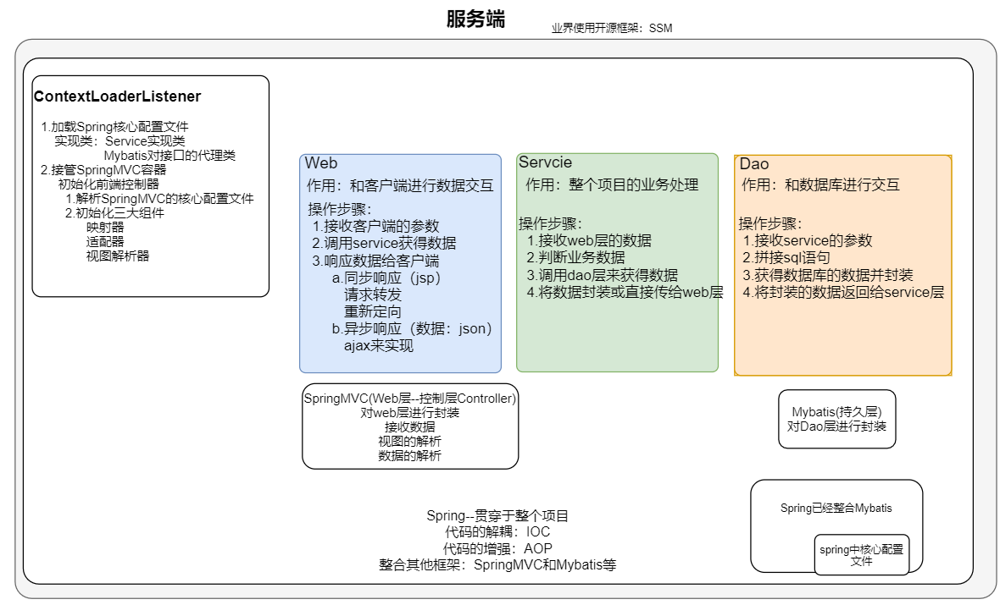
    
</figure>

整合后的代码修改：

Controller

```java
package com.itheima.web;

        import com.itheima.domain.Account;
        import com.itheima.service.IAccountService;
        import org.springframework.beans.factory.annotation.Autowired;
        import org.springframework.stereotype.Controller;
        import org.springframework.web.bind.annotation.RequestMapping;
        import org.springframework.web.bind.annotation.ResponseBody;

        import java.util.List;

/**
 * <p></p>
 */
@Controller
@RequestMapping("account")
public class AccountController {

    @Autowired
    private IAccountService accountService;

    @RequestMapping("list")
    @ResponseBody
    public List findAll() {
        List<Account> all = accountService.findAll();
        return all;
    }
}
```

service

```JAVA
package com.itheima.service.impl;

import com.itheima.dao.AccountMapper;
import com.itheima.domain.Account;
import com.itheima.service.IAccountService;
import org.springframework.beans.factory.annotation.Autowired;
import org.springframework.stereotype.Service;

import java.util.List;

/**
 * <p></p>
 *
 * @Description:
 */
@Service
// @Transactional// 当前的service所有的方法都会加上事务
public class AccountServiceImpl implements IAccountService {

    @Autowired
    private AccountMapper accountMapper;

    // @Transactional //当前方法加上事务
    public List<Account> findAll() {


        List<Account> accounts = accountMapper.selectAll();

        return accounts;
    }
}
```

DAO

```JAVA
package com.itheima.dao;

import com.itheima.domain.Account;
import org.apache.ibatis.annotations.Select;

import java.util.List;

/**
 * <p></p>
 *
 * @Description:
 */
public interface AccountMapper {

    @Select("select * from account")
    List<Account> selectAll();
}
```

spring配置文件

```XML
<?xml version="1.0" encoding="UTF-8"?>
<beans xmlns="http://www.springframework.org/schema/beans"
       xmlns:xsi="http://www.w3.org/2001/XMLSchema-instance"
       xmlns:aop="http://www.springframework.org/schema/aop"
       xmlns:context="http://www.springframework.org/schema/context" xmlns:tx="http://www.springframework.org/schema/tx"
       xsi:schemaLocation="http://www.springframework.org/schema/beans
        http://www.springframework.org/schema/beans/spring-beans.xsd
        http://www.springframework.org/schema/aop
        http://www.springframework.org/schema/aop/spring-aop.xsd
        http://www.springframework.org/schema/context
        http://www.springframework.org/schema/context/spring-context.xsd http://www.springframework.org/schema/tx http://www.springframework.org/schema/tx/spring-tx.xsd">

   <!-- 开启包扫描
        Spring只管扫描Service层
            1.管理所有的Service实现类
            2.声明式事务
    -->
    <context:component-scan base-package="com.itheima.service" />


    <!-- 加载配置文件 jdbc.properties -->
    <context:property-placeholder location="classpath:jdbc.properties" />
    <!--<bean class="org.springframework.beans.factory.config.PropertyPlaceholderConfigurer">
        <property name="locations">
            <list>
                <value>classpath:jdbc.properties</value>
            </list>
        </property>
    </bean>-->

    <!-- 数据库连接池 -->
    <bean class="org.springframework.jdbc.datasource.DriverManagerDataSource" id="dataSource">
        <property name="url"                value="${jdbc.url}"></property>
        <property name="username"           value="${jdbc.username}"></property>
        <property name="password"           value="${jdbc.password}"></property>
        <property name="driverClassName"    value="${jdbc.driver}"></property>
    </bean>

    <!-- 声明式事务 -->
    <!-- 事务管理器 -->
    <bean class="org.springframework.jdbc.datasource.DataSourceTransactionManager" id="transactionManager">
        <property name="dataSource" ref="dataSource"/>
    </bean>


    <!-- 注解形式的声明式事务 -->
    <tx:annotation-driven transaction-manager="transactionManager"></tx:annotation-driven>


    <!-- xml形式的声明式事务 -->
    <!-- advice -->
    <!--<tx:advice transaction-manager="transactionManager" id="txAdvice">
        <tx:attributes>
            <tx:method name="find*" isolation="DEFAULT" propagation="REQUIRED" timeout="-1" read-only="true" />
        </tx:attributes>
    </tx:advice>

    &lt;!&ndash; 事务的切面 &ndash;&gt;
    <aop:config>
        <aop:pointcut id="pt" expression="execution(* com.itheima.service..*.*(..))"/>
        <aop:advisor advice-ref="txAdvice" pointcut-ref="pt"></aop:advisor>
    </aop:config>-->


    <!-- 配置Spring整合Mybatis的SqlSessionFactoryBean -->
    <bean class="org.mybatis.spring.SqlSessionFactoryBean"  id="sessionFactory">
        <!-- 配置domain别名 -->
        <property name="typeAliasesPackage" value="com.itheima.domain"></property>
        <!-- 配置数据源 -->
        <property name="dataSource"  ref="dataSource" ></property>
        <!-- 加载Mybatis的全局配置 -->
        <property name="configLocation" value="classpath:sqlMapConfig.xml"></property>

    </bean>

    <!-- 扫描Mybatis的接口和映射文件 -->
    <bean class="org.mybatis.spring.mapper.MapperScannerConfigurer" id="scannerConfigurer">
        <!--加载指定包下所有的接口映射文件-->
        <property name="basePackage" value="com.itheima.dao"></property>
    </bean>


</beans>
```

springmvc

```XML
<?xml version="1.0" encoding="UTF-8"?>
<beans xmlns="http://www.springframework.org/schema/beans"
       xmlns:xsi="http://www.w3.org/2001/XMLSchema-instance"
       xmlns:mvc="http://www.springframework.org/schema/mvc"
       xmlns:context="http://www.springframework.org/schema/context"
       xsi:schemaLocation="http://www.springframework.org/schema/beans
        http://www.springframework.org/schema/beans/spring-beans.xsd
        http://www.springframework.org/schema/mvc
        http://www.springframework.org/schema/mvc/spring-mvc.xsd
        http://www.springframework.org/schema/context
        http://www.springframework.org/schema/context/spring-context.xsd">

    <!-- 包扫描 -->
    <context:component-scan base-package="com.itheima.web">
        <!-- 只扫描注解为 @Controller的组件
                type：扫描的类型（注解）
                expression：注解的全限定类名
         -->
        <context:include-filter type="annotation" expression="org.springframework.stereotype.Controller"/>
    </context:component-scan>

    <!-- 映射器和适配器 -->
    <mvc:annotation-driven />

    <!-- 视图解析器 -->
    <bean class="org.springframework.web.servlet.view.InternalResourceViewResolver" id="viewResolver">
        <property name="prefix" value="/WEB-INF/pages/" />
        <property name="suffix" value=".jsp" />
    </bean>

    <!-- 静态资源的放行
        解析静态资源的处理器：DefaultServletHttpRequestHandler
        提供方：SpringMVC
    -->
    <mvc:default-servlet-handler />


</beans>
```

Mybatis配置文件

```XML
<?xml version="1.0" encoding="UTF-8" ?>
<!DOCTYPE configuration
        PUBLIC "-//mybatis.org//DTD Config 3.0//EN"
        "http://mybatis.org/dtd/mybatis-3-config.dtd">
<configuration>

    <settings>
        <!--开启全局加载-->
        <setting name="lazyLoadingEnabled" value="true"/>
        <setting name="logImpl" value="LOG4J" />
    </settings>
</configuration>
```

jdbc.properties

```properties
jdbc.driver=com.mysql.jdbc.Driver
jdbc.url=jdbc:mysql://localhost:3306/case3?characterEncoding=utf8
jdbc.username=root
jdbc.password=root
```

日志配置

```properties
# Set root category priority to INFO and its only appender to CONSOLE.
#log4j.rootCategory=INFO, CONSOLE            debug   info   warn error fatal
log4j.rootCategory=info, CONSOLE

# Set the enterprise logger category to FATAL and its only appender to CONSOLE.
log4j.logger.org.apache.axis.enterprise=FATAL, CONSOLE

# CONSOLE is set to be a ConsoleAppender using a PatternLayout.
log4j.appender.CONSOLE=org.apache.log4j.ConsoleAppender
log4j.appender.CONSOLE.layout=org.apache.log4j.PatternLayout
log4j.appender.CONSOLE.layout.ConversionPattern=%d{ISO8601} %-6r [%15.15t] %-5p %30.30c %x - %m\n
```

web.xml 配置

```XML
<?xml version="1.0" encoding="UTF-8"?>
<web-app xmlns="http://xmlns.jcp.org/xml/ns/javaee"
         xmlns:xsi="http://www.w3.org/2001/XMLSchema-instance"
         xsi:schemaLocation="http://xmlns.jcp.org/xml/ns/javaee http://xmlns.jcp.org/xml/ns/javaee/web-app_3_1.xsd"
         version="3.1">

    <!-- Spring对web的整合 -->
    <!-- 指定Spring核心配置文件
            ContextLoaderListener监听器会加载Spring核心配置文件
            1.初始化Spring容器（Service实现类和Mybatis接口代理类）
            2.接管SpringMVC容器
     -->
    <context-param>
        <param-name>contextConfigLocation</param-name>
        <param-value>classpath:applicationContext.xml</param-value>
    </context-param>
    <listener>
        <listener-class>org.springframework.web.context.ContextLoaderListener</listener-class>
    </listener>

    <!-- 配置字符集过滤器 -->
    <filter>
        <filter-name>encodingFilter</filter-name>
        <filter-class>org.springframework.web.filter.CharacterEncodingFilter</filter-class>
        <init-param>
            <param-name>encoding</param-name>
            <param-value>utf-8</param-value>
        </init-param>
    </filter>
    <filter-mapping>
        <filter-name>encodingFilter</filter-name>
        <url-pattern>/*</url-pattern>
    </filter-mapping>


    <!-- springmvc的前端控制器 -->
    <servlet>
        <servlet-name>dispatcherServlet</servlet-name>
        <servlet-class>org.springframework.web.servlet.DispatcherServlet</servlet-class>
        <!-- 加载springmvc的核心配置文件 -->
        <init-param>
            <param-name>contextConfigLocation</param-name>
            <param-value>classpath:spring-mvc.xml</param-value>
        </init-param>
        <!-- 前端控制器随服务启动而创建 -->
        <load-on-startup>5</load-on-startup>
    </servlet>
    <servlet-mapping>
        <servlet-name>dispatcherServlet</servlet-name>
        <!-- 为了以后支持Restful，将路径配置为 / -->
        <url-pattern>/</url-pattern>
    </servlet-mapping>


</web-app>
```
