# Tomcat

**今日目标**

```markdown

```


# 一  Web知识概述

JavaWeb：使用 Java 技术的互联网项目。


## 1.1 软件架构

- 网络中有很多的计算机，它们直接的信息交流，我们称之为：交互
- 在互联网交互的过程的有两个非常典型的交互方式——B/S  交互模型（架构）和 C/S  交互模型（架构）

**C/S架构**

> Client/Server 客户端/服务器
>
> 访问服务器资源必须安装客户端软件
>
> 例如: QQ，绝地求生，LOL


 <figure class="thumbnails">
    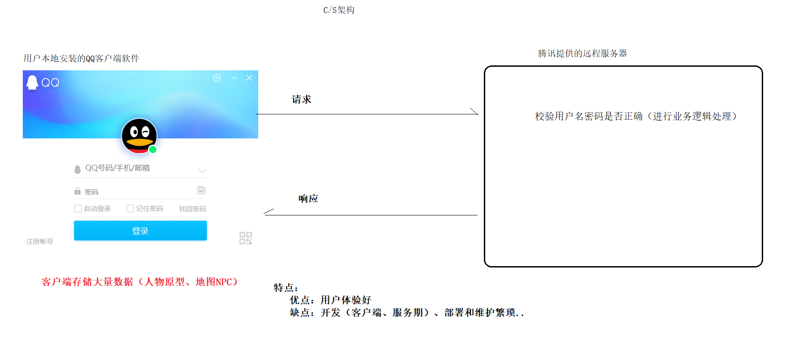
</figure>

**B/S架构**

> Browser/Server 浏览器/服务器
>
> 访问服务器资源不需要专门安装客户端软件,而是直接通过浏览器访问服务器资源.
>
> 例如: 天猫、京东、知乎网站


 <figure class="thumbnails">
    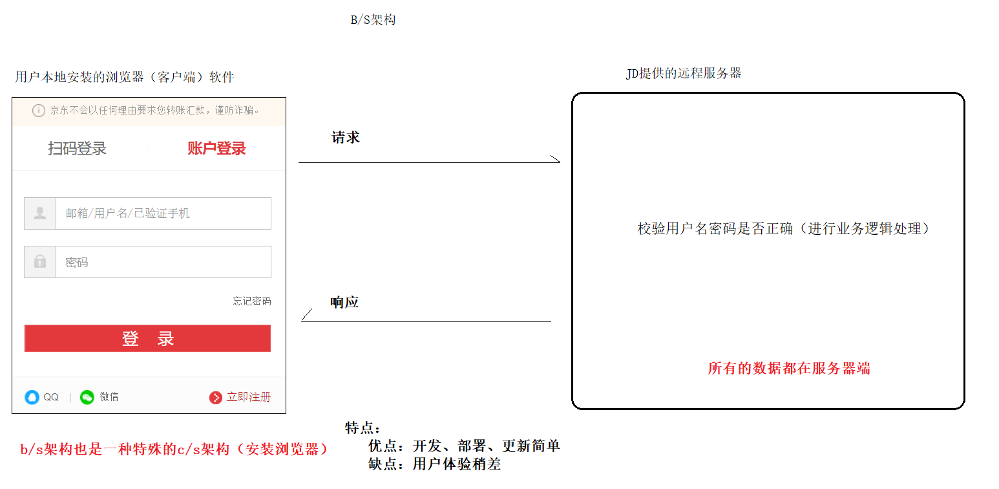
</figure>

## 1.2 Web服务器作用

- 服务器: 提供数据服务的
- **服务端**: 开发者可以通过web服务器把本地==资源==发布到互联网(提供数据服务和支持)
- 客户端: 用户就可以通过浏览器访问这些资源(消费服务的)


## 1.3 资源的分类

资源：计算机中数据文件

**静态资源**

- 对于同一个页面,不同用户看到的内容是一样的(该资源不会变化)。
  - 例如：体育新闻、网站门户等，常见后缀：`*.html、*.js、*.css , 图片,视频...`

**动态资源**

- 用对于同一个页面,不同用户看到的内容可能不一样(该资源会变化)。
  - 例如：购物车、我的订单等，常见后缀：`*.jsp、*.aspx、*.php`


 <figure class="thumbnails">
    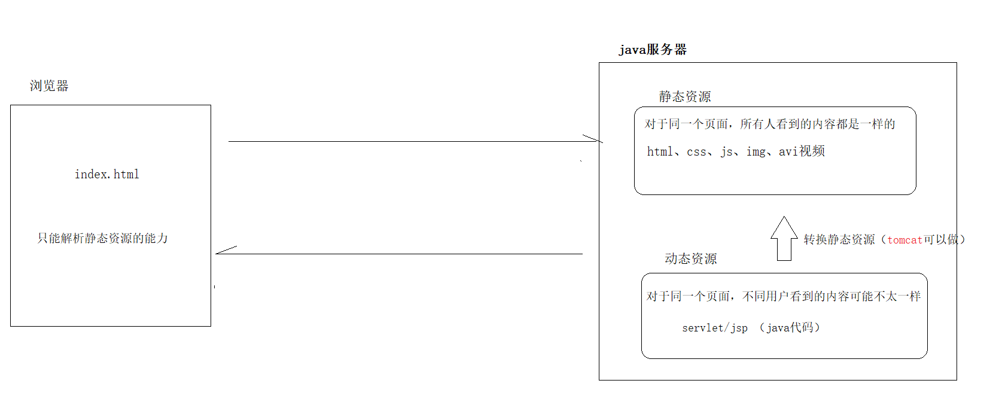
</figure>


## 1.4 常见的Web服务器

服务器：一台电脑（主机）安装了服务器软件并运行，我们称之为这台主机为服务器。


 <figure class="thumbnails">
    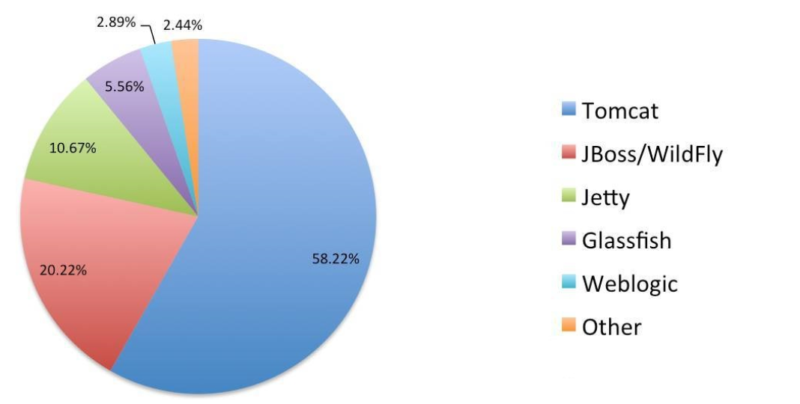
</figure>

```markdown
互联网：
* Tomcat: Apache组织开源免费的web服务器,支持部分JavaEE规范（Servlet/Jsp）.
* Jetty:Apache组织开源免费的小型web服务器,支持部分JavaEE规范.

企业：
* JBoss: RedHat红帽公司的开源免费的web服务器,完全支持JavaEE规范.
* Glass Fish:Sun公司开源免费的web服务器,完全支持JavaEE规范.

---------------------------------------------------------------------

* WebLogic: Oracle公司收费的web服务器,支持JavaEE规范.
* WebSphere:IBM公司收费的web服务器,支持JavaEE规范.
```

**JavaEE规范**

​	Java语言在企业级开发中定义出的规范，称之为 JavaEE 规范。

​	在Java中所有的服务器厂商都要实现一组Oracle公司规定的接口，这些接口是称为JavaEE规范。不同厂商的JavaWeb服务器都实现了这些接口，在JavaEE中一共有13种规范。实现的规范越多，功能越强。

​	(笔记本电脑: 制定usb接口规范,  usb设备 键盘 鼠标都要遵循usb接口规范)


# 二 Tomcat服务器【重点】

## 2.1 Tomcat使用

### 2.1.1 下载

Tomcat 官网下载地址：https://tomcat.apache.org/download-80.cgi


 <figure class="thumbnails">
    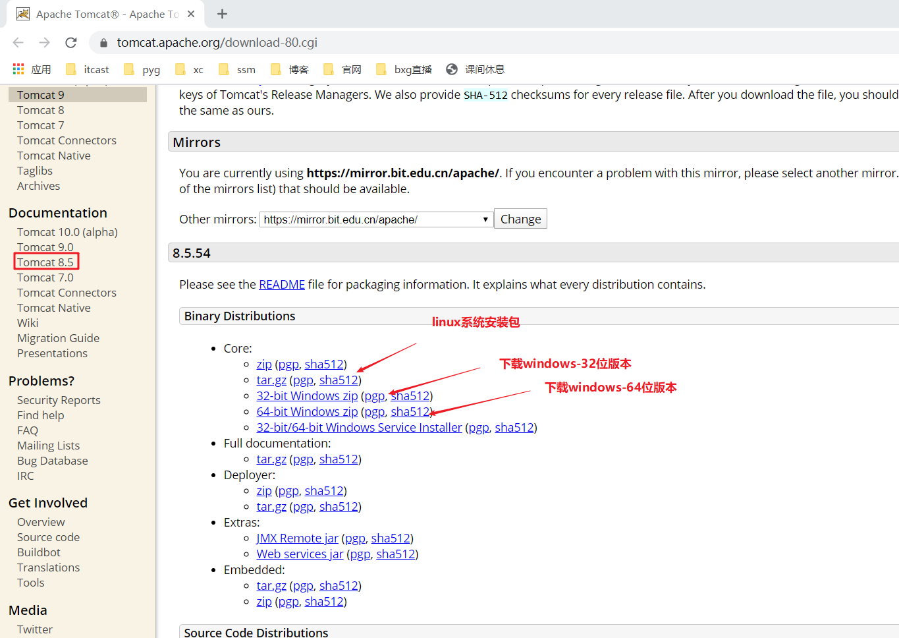
</figure>

对于Tomcat运行环境的要求：


 <figure class="thumbnails">
    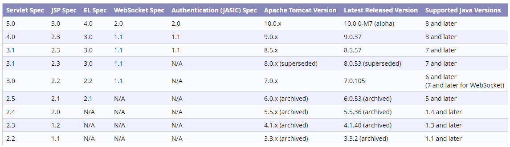
</figure>

上面图中，可以看到课程所使用的 tomcat 8.5.31 所支持：

​	1. JDK 7以后的版本

​	2. Servlet3.1 版本


### 2.1.2 安装（强烈建议）

绿色免安装版，解压即用（注意：不要有中文路径）


 <figure class="thumbnails">
    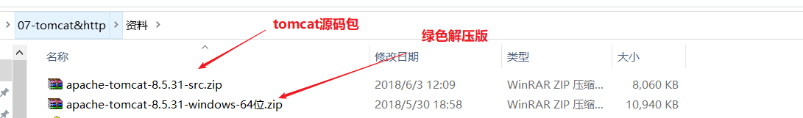
</figure>


 <figure class="thumbnails">
    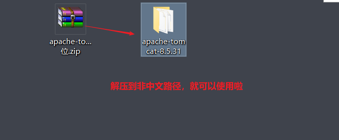
</figure>

### 2.1.3 目录结构


 <figure class="thumbnails">
    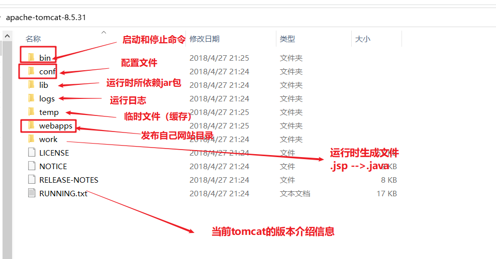
</figure>

### 2.1.4 启动和关闭

- **启动**
  1. 进入到 tomcat/bin  目录下。
  2. startup.bat  启动 。
  3. 通过浏览器来进行访问。
     1. 本机访问:http://localhost:8080  或 http://127.0.0.1:8080


- **关闭**

1.在 startup.bat  启动后，运行 shutdown.bat 正常关闭。

2.在 startup.bat  启动后，在启动的命令中使用` ctrl+c` 二次，表示正常关闭

3.直接关闭dos窗口: 强制关闭(断电) , 不推荐


 <figure class="thumbnails">
    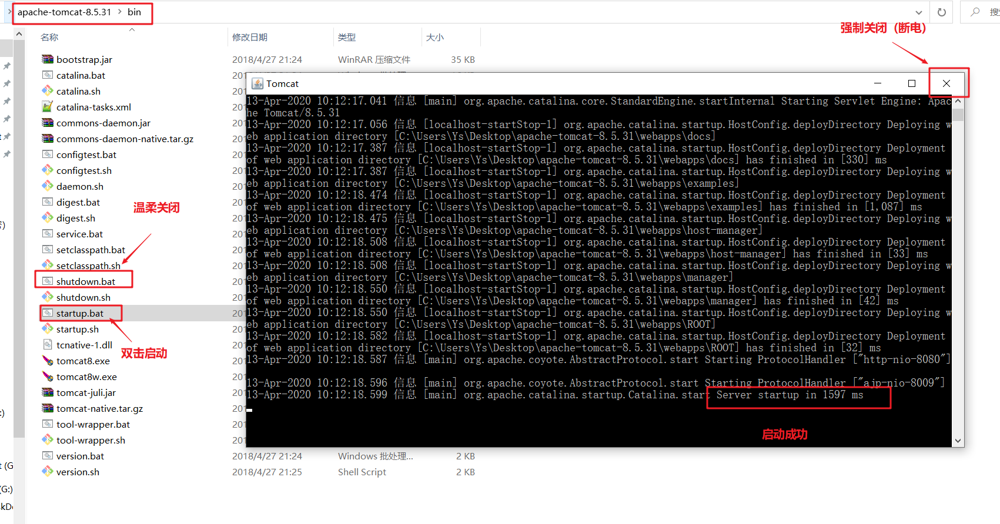
</figure>


### 2.1.5 启动报错问题【经验】

#### ① Java环境变量

现象: 闪退, 黑窗口一闪而过(不到半秒)  

原因: tomcat软件的大部分代码也是java写的, 运行依赖JDK

解决:  安装**JDK8**(弹出两次窗口,装在同一路径下),并配置环境

> 解决:
>
>  1. 配置好Java环境变量
>
>     ​	目的: 是为了可以在任意位置,打开cmd都能访问
>
>     ​		C:\Program Files\Java\jdk1.8.0_111\bin 下的可执行程序(java.exe...)
>
>     ​		a. JAVA_HOME :  C:\Program Files\Java\jdk1.8.0_111
>     		b. Path :  %JAVA_HOME%\bin
>
>  2. JDK换成8版本,目前tomcat8和jdk8兼容没问题
>


 <figure class="thumbnails">
    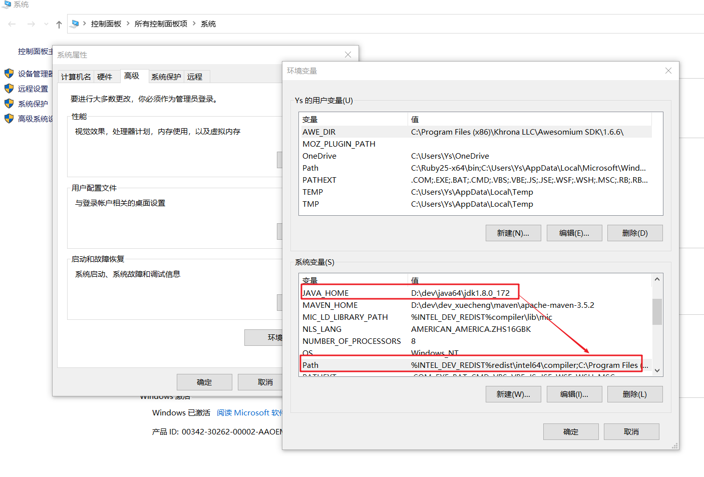
</figure>

#### ② 8080端口被占用

现象：启动时报错（黑框口等了一会就关闭）

​	(很多同学打开了两次tomcat)

原因:   一个进程占用一个端口port,  一个端口不能被多个进程同时占用

​	(软件启动至少一个进程)


 <figure class="thumbnails">
    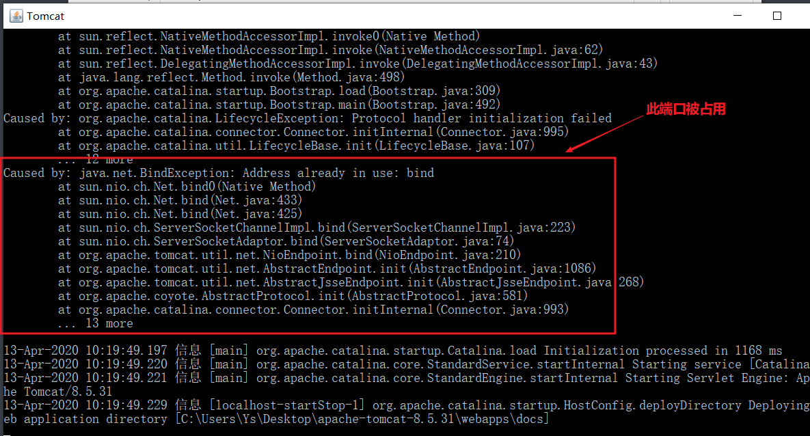
</figure>


 <figure class="thumbnails">
    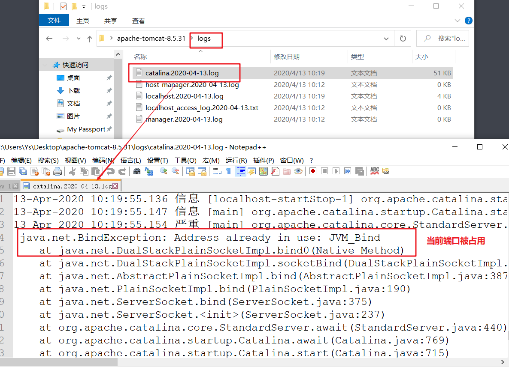
</figure>

解决方式：

1. 暴力：找到占用的端口号，并且找到对应的进程，杀死该进程
  * netstat -ano|findStr 8080
2. 温柔：修改自身的端口号
  * 通过Tomcat目录下的conf/server.xml 文件修改端口号。


**暴力：找到占用的端口号的对应进程，杀死进程**

cmd命令：`netstat -ano | findstr "8080"`


 <figure class="thumbnails">
    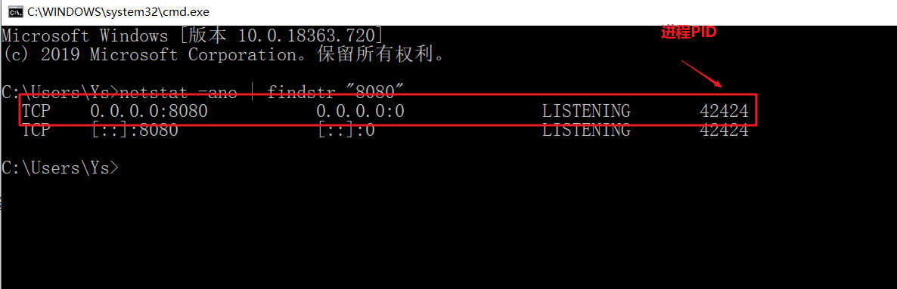
</figure>

**进入到任务管理器，找到它，干掉它**

 

 <figure class="thumbnails">
    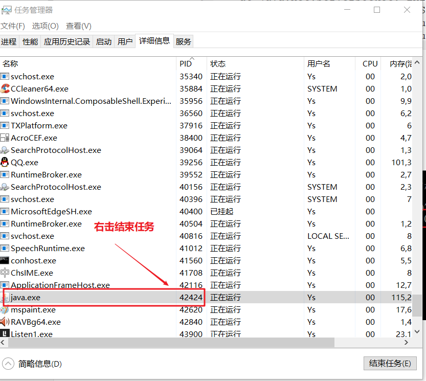
</figure>


**温柔：修改Tomcat端口号**

进入Tomcat安装目录/conf/server.xml 文件修改 (重启tomcat生效)


  <figure class="thumbnails">
    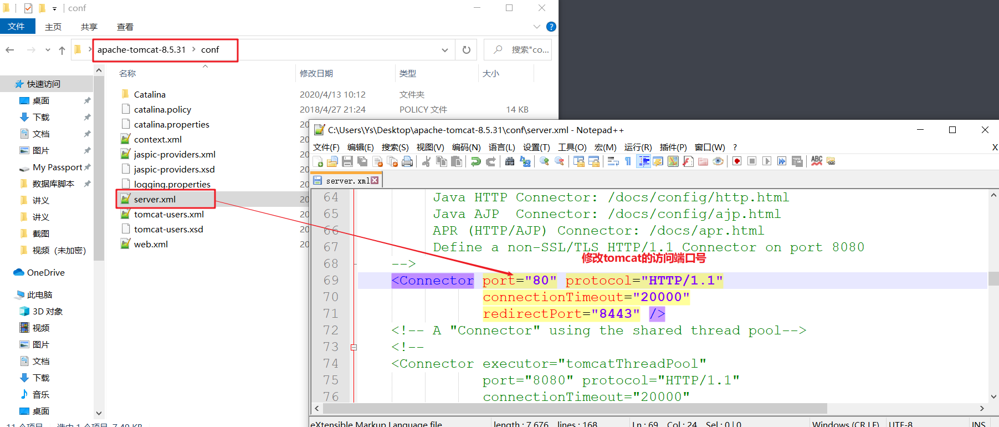
</figure>

### 2.1.6 Tomcat默认资源内容

#### ①  Http 默认端口号

```html
http://localhost:80
http协议默认端口80(会被隐藏)
https协议默认端口443
```

==在整个web阶段我们使用的就是tomcat默认端口：8080==

 <figure class="thumbnails">
    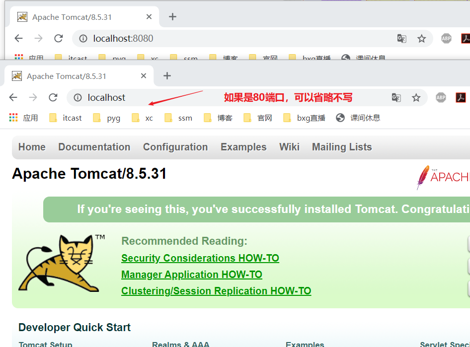
</figure>

#### **② Tomcat的默认资源**

**1.在使用浏览器访问 Tomcat 资源时，会对应访问一个默认资源目录（项目目录）。**

​	默认Web项目： ROOT 项目。

​	默认文件： Index.jsp或index.html 文件。


 <figure class="thumbnails">
    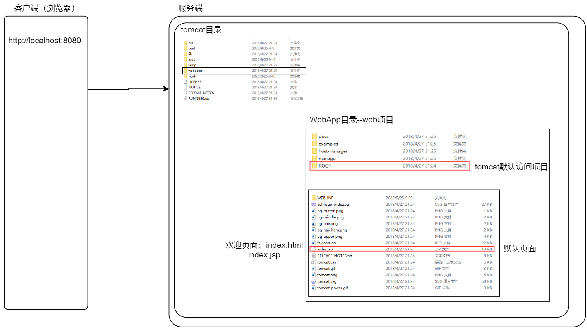
</figure>

**2.对于访问其他的项目资源，需要在 URL 路径后添加对应的资源。**

- 路径格式：


 <figure class="thumbnails">
    
</figure>

- URL路径内容介绍：


 <figure class="thumbnails">
    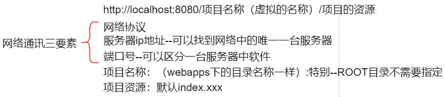
</figure>

**3.Tomcat对于欢迎页的访问顺序**

在tomcat的conf 目录下存在 web.xml文件夹，里面有对欢迎页面配置内容，如下：

```xml
<welcome-file-list>
    <welcome-file>index.html</welcome-file>
    <welcome-file>index.htm</welcome-file>
    <welcome-file>index.jsp</welcome-file>
</welcome-file-list>
```

对于配置文件的访问优先级为：

​	index.html > index.htm > index.jsp


### 2.1.7 发布项目三种方式 (练习)

#### ① webapps 部署(最简单)

直接放置在 webapps 目录下


 <figure class="thumbnails">
    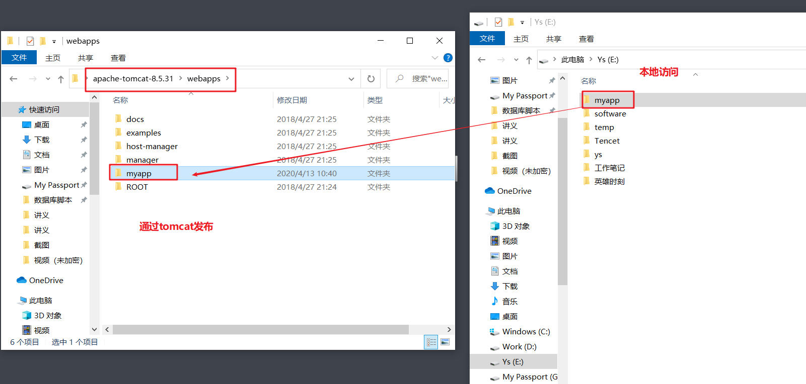
</figure>


 <figure class="thumbnails">
    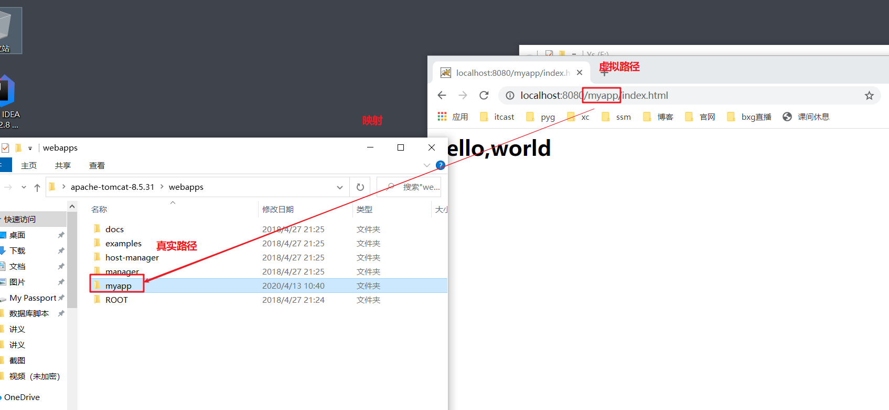
</figure>

==这种方案(支持热更新)，一般在开发完毕后，正式发布项目时使用。。。。==

>热更新: 边运行边更新
>


#### ② server.xml部署（了解）

```markdown
#虚拟路径部署方式
1. 通过指定 虚拟路径 和 真实路径, 让这两个路径产生映射关系
2. 浏览器通过访问虚拟路径, tomcat会响应真实路径的资源

# 设置
	1. 虚拟路径: myapp
	2. 真实路径: c:/test/work
	String myapp = "c:/test/work"
# 效果
	浏览器地址栏:  http://localhost:8080/myapp/a.html
	访问到服务器中的:  c:/test/work/a.html
```


在tomcat/conf/server.xml中找到<Host>标签内，添加<Context>标签


 <figure class="thumbnails">
    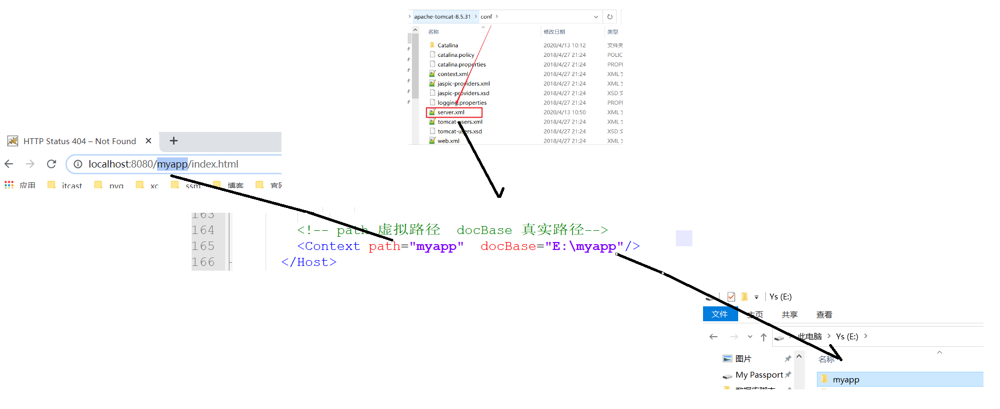
</figure>

```html
		  <!--
					路径映射
						虚拟路径 : mypro（浏览器访问URL地址）
						真实路径 : 项目真正的路径(在电脑中的路径地址)
						String pro = "C:\Users\spy\Desktop\xx";
			  --> 
		<Context path="/mypro" docBase="C:\Users\spy\Desktop\xx"/>
      </Host>
```


**缺点**

> 1.配置文件修改完毕后，需要重启tomcat生效...
>
> 2.server.xml是tomcat的核心配置文件，如果稍有不慎操作失误，整个tomcat启动失败
>


#### ③ 独立xml部署

虚拟路径部署方式

在tomcat/conf/Catalina/localhost 目录下创建一个xml文件，添加<Context>标签


 <figure class="thumbnails">
    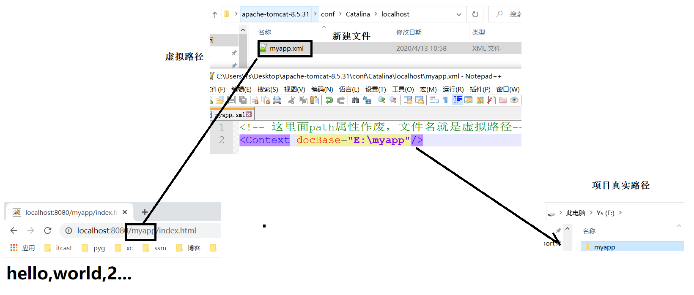
</figure>

> **文件名就是虚拟路径**
>
> xml文件除了配置啥都不要写  :  <Context docBase="C:\test\work"/>
>
> 不需要重启tomcat


## 2.2 Web项目结构

```markdown
1. 前端项目
        |-- myapp(项目名称)
            |-- css 目录
            |-- js  目录
            |-- html目录
            |-- img 目录
            |-- index.html
            
2. web项目
		|-- myapp（项目名称）
			|-- 静态资源（html、css、js、img）
			|-- WEB-INF 目录（浏览器无法直接访问内部的资源）
				|-- classes 目录（java的字节码文件）
				|-- lib     目录（当前项目所需要的第三方jar包）
				|-- web.xml 文件 （当前项目核心配置文件，servlet3.0可以省略）
			|-- index.html or index.jsp
```


## 2.3 Idea中使用Tomcat【重中之重,起码操作2遍.....】

1. 在使用Idea来启动 tomcat，要将单独运行 startup.bat 文件关闭掉。 (要关闭,不然idea中启动tomcat会冲突)

2. 我们后续要用代码编写动态/静态资源,所以掌握 idea中使用tomat非常重要的


### 2.3.1 配置Tomcat

​	(工具栏居中,不然默认显示在右侧) 

2019前的设置：


 <figure class="thumbnails">
    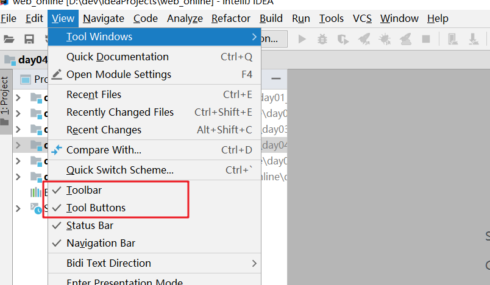
</figure>

2019以后的设置


 <figure class="thumbnails">
    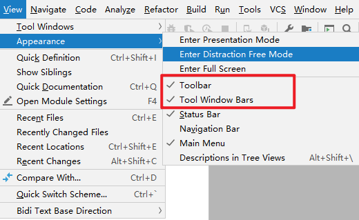
</figure>


 <figure class="thumbnails">
    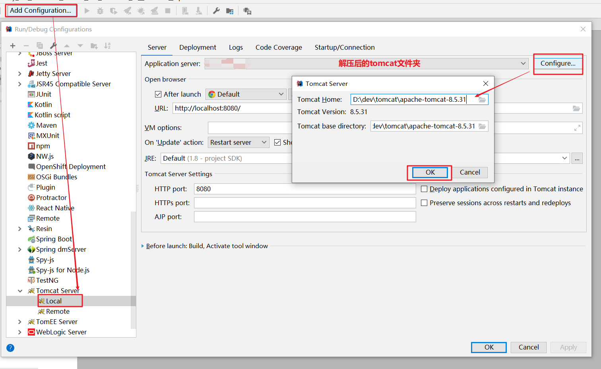
</figure>

再次点击，确定是否配置成功...


 <figure class="thumbnails">
    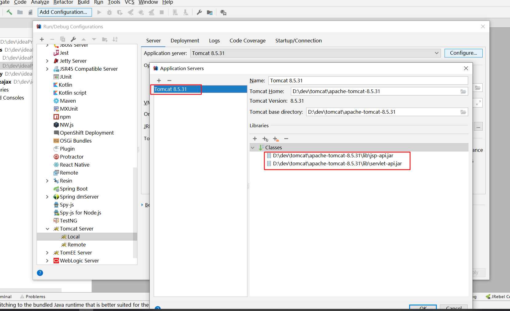
</figure>


### 2.3.2 创建Web项目


创建项目版本：

​	JDK版本：8.0 

​	Servlet版本：3.1

​	JavaEE版本：Java EE 7（支持Servlet3.1）


 <figure class="thumbnails">
    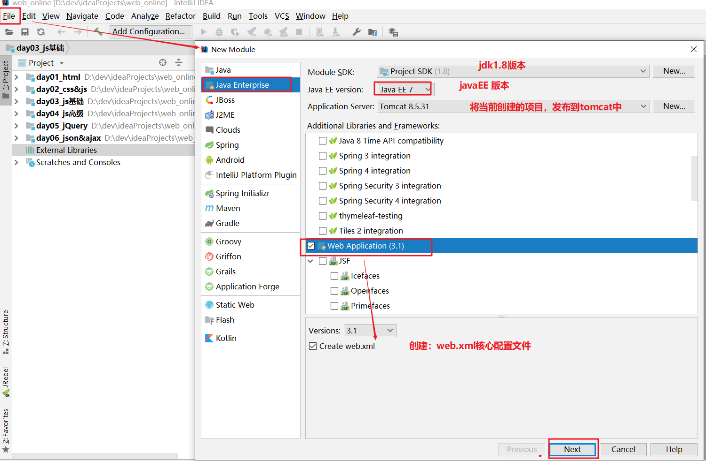
</figure>


 <figure class="thumbnails">
    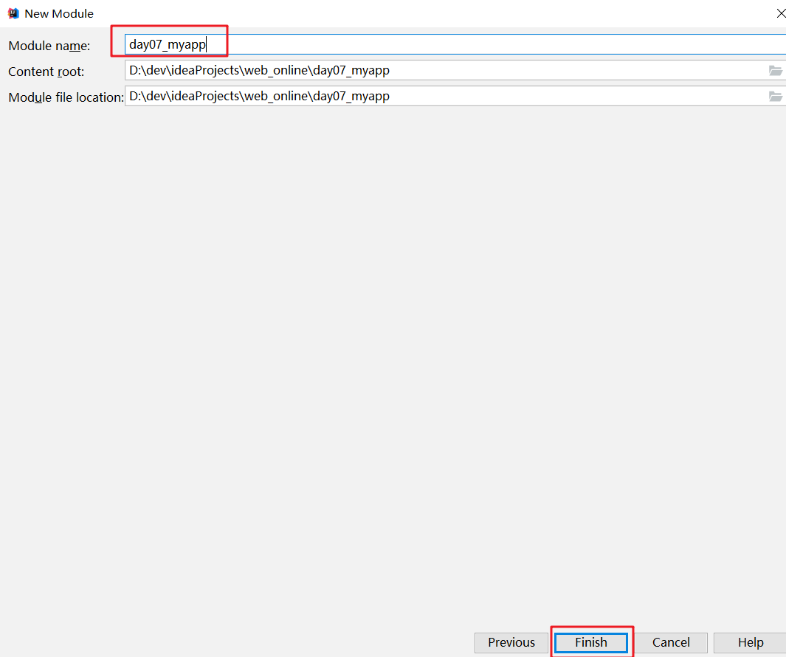
</figure>


 <figure class="thumbnails">
    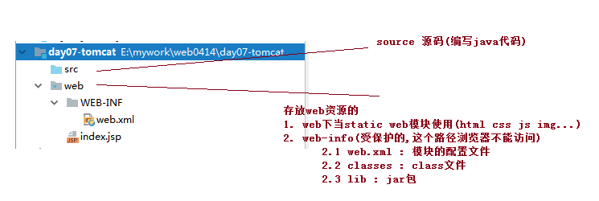
</figure>

### 2.3.2 发布Web项目


 <figure class="thumbnails">
    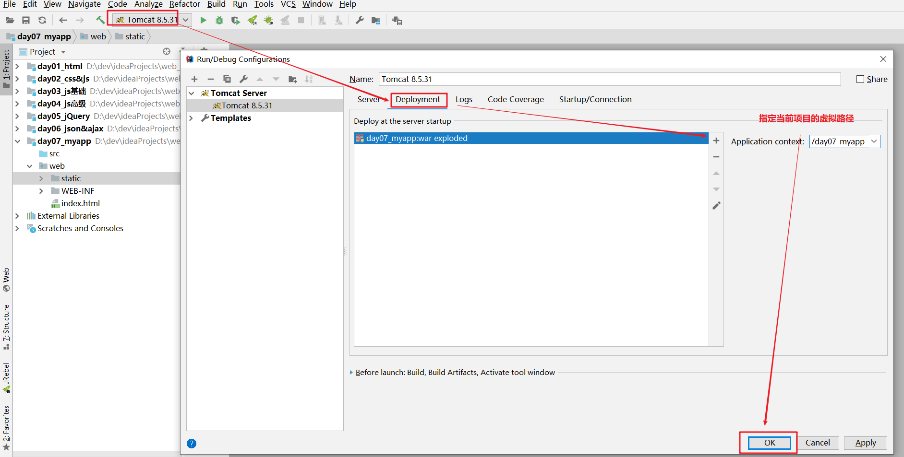
</figure>


 <figure class="thumbnails">
    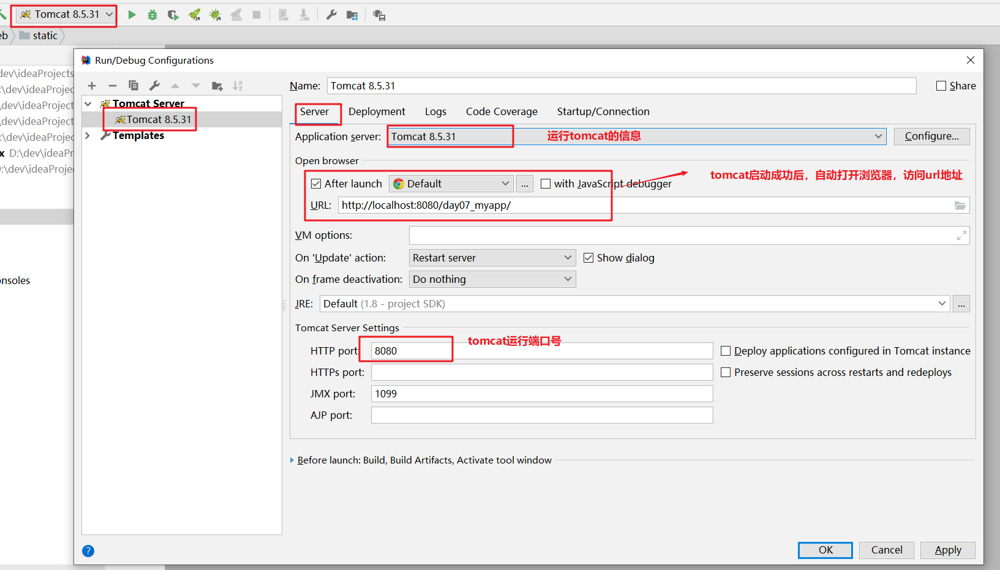
</figure>


 <figure class="thumbnails">
    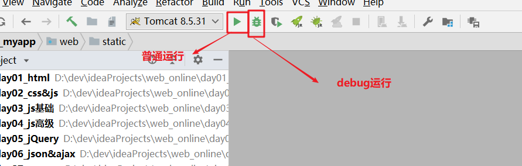
</figure>


 <figure class="thumbnails">
    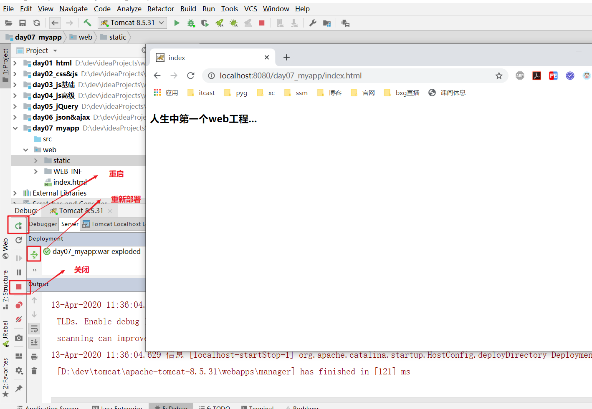
</figure>

### 2.3.4 页面资源热更新


 <figure class="thumbnails">
    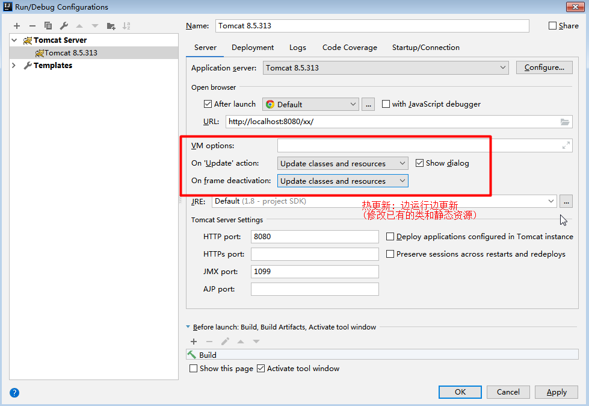
</figure>


PS：在做完修改后，一般通过 Idea 的快捷键来更新资源：Ctrl + F9。


### 2.3.5 Idea 中相关 tomcat 目录


 <figure class="thumbnails">
    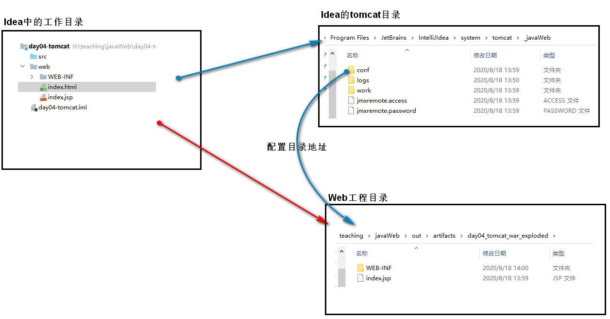
</figure>

- 工作目录：开发人员编程的目录。
- Idea 的 tomcat 目录：Idea 对 tomcat 相关内容的配置的目录
- web 工程目录：由工作目录项目中的 web目录下的所有资源。

