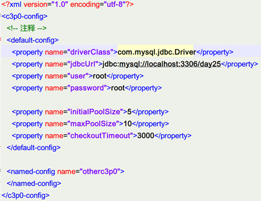
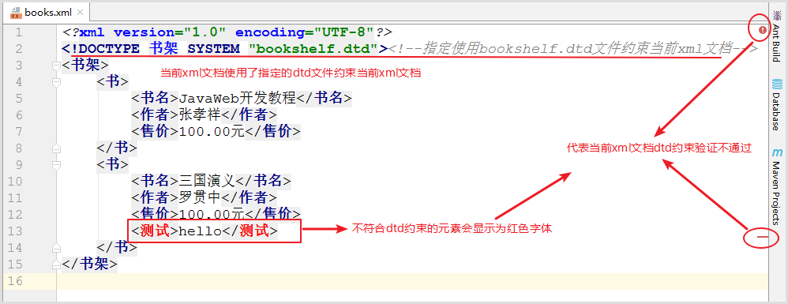
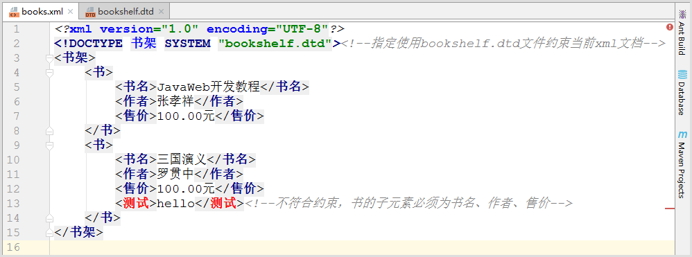
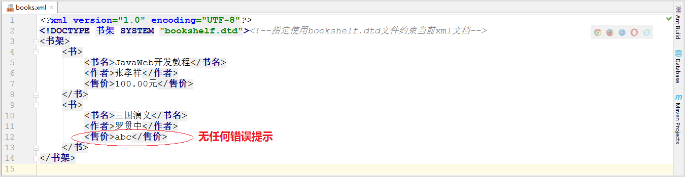
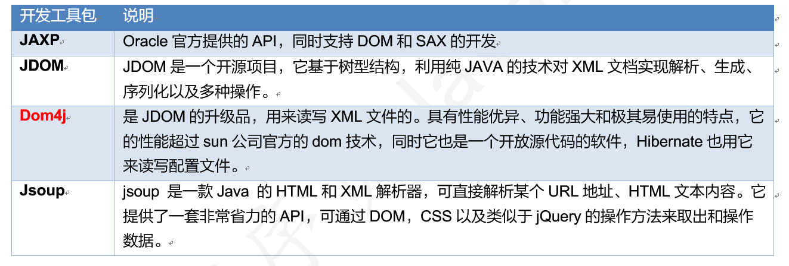

# 第一章 XML

## 1 XML概述

### 目标

1. 什么是XML

### 什么是XML

1. 英文：eXtensible Markup Language 可扩展的标记语言，由各种标记(标签，元素)组成。
2. 可扩展：所有的标签都是自定义的，可以随意扩展的。如：\<abc/>，<姓名>
3. 标记语言：整个文档由各种标签组成。清晰，数据结构化！
4. XML是通用格式标准，全球所有的技术人员都知道这个东西，都会按照XML的规范存储数据，交互数据！！

### XML作用

==就是为了存储描述数据的。==


**1) 数据交换：**不同的计算机语言之间，不同的操作系统之间，不同的数据库之间，进行数据交换。                                                 

 <figure class="thumbnails">
    
</figure>


**2)  配置文件：**在后期我们主要用于各种框架的配置文件基本天天见。

比如我们很快会学到连接池：c3p0-config.xml


 <figure class="thumbnails">
    
</figure>

### 小结

1. 主要有哪两个作用？
   
   数据的交换
   
   做配置文件

XML就是用来保存描述数据的。


## 2 编写第1个XML文件


### 需求

编写xml文档，用于描述人员信息，person代表一个人员，id是人员的属性代表人员编号。人员信息包括age年龄、name姓名、sex性别信息。

使用Java类去描述：

使用的是对象进行保存数据。

```java
class Person{
  String id;
  int age;
  String name;
  String sex;
}

Person p = new Person("1","张三",18,"男");
```


### 效果


 <figure class="thumbnails">
    
</figure>

### 步骤

1. 选择当前项目鼠标右键新建


 <figure class="thumbnails">
    
</figure>

2. 编写person.xml文件

   XML文件上最上面的声明写法：xml文件的开始位置先输入：<?  直接按回车，选择utf-8再按回车。【不要按Tab键】

   ```xml
   <?xml version="1.0" encoding="UTF-8" ?>
   <person id="1">
       <name>张三</name>
       <age>18</age>
       <sex>男</sex>
   </person>
   ```

3. 通过浏览器解析XML的内容

   
 <figure class="thumbnails">
    
</figure>

- **注：XML以后通过Java来进行解析，很少直接在浏览器上显示。**


## 3 XML的组成：声明和元素

### 目标

2. XML文档中的声明
3. XML文档中的元素

### XML组成

1. 声明
2. 元素(标签)
3. 属性
4. 注释
5. 转义字符
6. CDATA 字符区

### 文档声明

```xml
<?xml version="1.0" encoding="utf-8" ?>
```

1. 使用IDE创建xml文件时默认没有自带有文档声明，需要自己加上。

2. 文档声明必须为<?xml开头，以？>结束 

3. 文档声明必须从文档的1行1列位置开始,==**必须在xml文档中的首行首列**==


 <figure class="thumbnails">
    
</figure>

4. 文档声明中常见的两个属性：

   - version：指定XML文档版本。必须属性，这里一般选择1.0；
   - encoding：指定当前文档的编码，可选属性，默认值是utf-8；

   

### 元素/标签


```xml
格式1:<person>  标签体 </person>   有标签体的标签
格式2:<person />  没有标签体的标签
```

1. 元素是XML文档中最重要的组成部分；

2. 普通元素的结构由开始标签、元素体、结束标签组成。【格式1】

3. 元素体：元素体可以是**元素**，也可以是**文本**，例如：

   ```xml
   <person> 
     <name>张三</name> 
   </person>
   ```

   

4. 空元素：空元素只有标签，而没有结束标签，但元素必须自己闭合，【格式2】

   例如：

   ```xml
   <sex/>
   ```

5. 元素命名

   - 区分大小写
   - 不能使用空格，不能使用冒号(有专用)
   - 不建议以XML、xml、Xml开头
   - 标签名不能数字开头

6. ==格式化良好的XML文档，有且仅有一个根元素。==

```xml
<?xml version="1.0" encoding="UTF-8" ?>
<persons>
    <person id="1">
        <name>张三</name>
        <age>18</age>
        <sex>男</sex>
    </person>

    <person id="2">
        <name>李四</name>
        <age>18</age>
        <sex>男</sex>
    </person>

    <!--    <a></A>   区分大小写-->

    <!--    <a b></a b>  不能有空格-->
    <!--    <a:b></a:b> 不能有冒号，冒号有专用-->
    <abc123></abc123>
    <!--    <1abc> <1abc> 可以后数字，但不能以数字开头-->
    <_abc></_abc> <!--下划线可以有-->
    <!--    <-abc><-abc> 中划线不能有-->
    <!--    <a-b></a-b>-->
    <你好></你好>


    <abc id="123"/> <!--空标签-->
    

</persons>
```

建议写标签名的时候，参考java中定义标识符的规则：可以有下划线，大小写字母，汉字，可以有数字，但数字不能开头。


错误演示：

元素没有结束


 <figure class="thumbnails">
    
</figure>

元素大写小写不一致


 <figure class="thumbnails">
    
</figure>

xml中多个根 


 <figure class="thumbnails">
    
</figure>

### 小结

1. 声明有哪两个常用的属性？

   version版本号

   encoding编码

2. 一个XML有几个根元素？ 

   一个

3. XML标签命名不能有什么符号？  

   不能有冒号，不能有中划线，不能有空格，

   可以有数字但是不能以数字开头，可以使用下划线


## 4 XML的组成：属性、注释和转义字符

1. XML文档中属性
2. XML文档中的注释
3. XML文档中实体字符

### 属性的语法

```xml
<person id="110"> </person>
<person id="112"/>
```

1. 属性是元素的一部分，它必须出现在元素的开始标签中

2. 属性的定义格式：`属性名=“属性值”`，其中**属性值必须使用单引或双引号括起来**

3. 一个元素可以有0~N个属性，但一个元素中**==不能出现同名属性==**


 <figure class="thumbnails">
    
</figure>


4. 属性名不能使用空格 , 建议不要使用冒号等特殊字符，且必须以字母开头

   和标签名命名规则保持一致


### 注释


```xml
<!--   注释内容  -->

<!--   
注释内容 
注释内容 
注释内容 
 -->
```

XML的注释与HTML相同，既以``<!--``开始，``-->``结束。**==不能嵌套。==**

Java中注释：

```
// 单行
/* */ 多行注释
/** */ 文档注释
```

XML注释：

```xml
<!-- 
注释内容 
-->
```

```xml
<!--<person>注释</person>-->  <!-- 快捷键：Ctrl+/ :可以将整行进行注释 或解注释-->
<person>三生三世</person> <!-- 快捷键：Ctrl+Shift+/:局部注释 在光标所在位置定义注释-->
```


### 转义字符

​	XML中的实体字符与HTML一样。因为很多符号已经被文档结构所使用，所以在元素体或属性值中想使用这些符号就必须使用实体字符


 <figure class="thumbnails">
    
</figure>


| 字符 | 预定义的转义字符 |        说明        |
| :--: | :--------------: | :----------------: |
|  <   |     ``&lt;``     | 小于（less than）  |
|  >   |    `` &gt;``     | 大于(greater than) |
|  "   |   `` &quot;``    | 双引号(quotation)  |
|  '   |   `` &apos;``    | 单引号(apostrophe) |
|  &   |    `` &amp;``    |  和号(ampersand )  |

*注意：严格地讲，在 XML 中仅有字符 "<"和"&" 是非法的。省略号、引号和大于号是合法的，但是把它们替换为实体引用是个好的习惯。*

转义字符应用示例：

​	假如您在 XML 文档中放置了一个类似 "<" 字符，那么这个文档会产生一个错误，这是因为解析器会把它解释为新元素的开始。因此你不能这样写：

```xml
<message>if salary < 1000 then </message>
```

为了避免此类错误，需要把字符 "<" 替换为实体引用，就像这样：

```xml
<message>if salary &lt; 1000 then</message>
```


### 小结

1. 属性必须出现在标签哪个位置?

   开始标签位置

2. 同一个标签是否可以有同名的属性？

   不行，一个标签，可以有多个属性，但是属性名不能重复

3. 为什么要有转义字符（实体字符）？

   因为有些符号比如 < > & "  ' 等一些符号是XML中专用格式符号，如果需要使用其普通的字符，就需要使用其对应的转义字符。否则有可能会出错，比如  < 

4. 注释的快捷？

   ```java
   <!-- 注释内容 -->
   ```

   Ctrl+/ : 整行注释

   Ctrl+Shift+/:局部注释,光标所在位置进行注释


## 5 XML的组成：字符区(了解)

当大量的转义字符出现在xml文档中时，会使XML文档的可读性大幅度降低。这时如果使用CDATA段就会好一些。

CDATA (Character Data)字符数据区，格式如下：

```xml
<![CDATA[

	文本数据
	<   > 

]]>
```

1.  CDATA 指的是不应由 XML 解析器进行解析的文本数据（Unparsed Character Data）
2.  CDATA 部分由 `<![CDATA[`开始，由 `]]>` 结束；

例如：

~~~java
<![CDATA[
    if salary < 1000 then
]]
~~~

快捷模板：CD 回车


 <figure class="thumbnails">
    
</figure>


*注意：*

​	CDATA 部分不能包含字符串 "]]>"。也不允许嵌套的 CDATA 部分。

​	标记 CDATA 部分结尾的 "]]>" 不能包含空格或折行。


### 小结

作用，CDATA字符区，可以存储任意的符号，以普通字符进行解析。


## 6 XML约束：DTD约束

### 目标

1. XML有哪两种约束

2. 了解DTD约束

   

### 1. XML约束

在XML技术里，可以编写一个文档来约束一个XML文档的书写规范，这称之为XML约束。

常见的xml约束：DTD、Schema

约束会规范我们XML能够使用那些标签，标签按什么顺序去写....

> 注意:我们对于约束的要求是能通过已写好的约束文件编写xml文档.


### 2. 约束体验

体验效果说明：当编写xml文档时不符合指定dtd约束时，进行提示xml编写错误，如下图：


 <figure class="thumbnails">
    
</figure>


体验步骤:

步骤1：复制bookshelf.dtd文件

步骤2：bookshelf.dtd文件内容如下

```dtd
<!ELEMENT 书架 (书+)>
<!ELEMENT 书 (书名,作者,售价)><!--约束元素书的子元素必须为书名、作者、售价-->
<!ELEMENT 书名 (#PCDATA)>
<!ELEMENT 作者 (#PCDATA)>
<!ELEMENT 售价 (#PCDATA)>
```


 <figure class="thumbnails">
    
</figure>


步骤三：新建books.xml，代码如下

```
引用 <!DOCTYPE 根元素 SYSTEM "dtd约束文件的路径"> 
```

```xml
<?xml version="1.0" encoding="UTF-8"?>
<!DOCTYPE 书架 SYSTEM "bookshelf.dtd"><!--指定使用bookshelf.dtd文件约束当前xml文档-->
<书架>
    <书>
        <书名>JavaWeb开发教程</书名>
        <作者>张孝祥</作者>
        <售价>100.00元</售价>
    </书>
    <书>
        <书名>三国演义</书名>
        <作者>罗贯中</作者>
        <售价>100.00元</售价>
        <测试>hello</测试><!--不符合约束，书的子元素必须为书名、作者、售价-->
    </书>
</书架>
```

步骤四：idea开发工具books.xml的dtd约束验证不通过的效果如下


   <figure class="thumbnails">
    
</figure>


### 3. DTD学习要求

​	在企业实际开发中，我们很少自己编写DTD约束文档，通常情况下通过框架提供的DTD约束文档编写对应的XML文档。所以这一知识点的要求是可以根据DTD约束文档内容编写XML文档。


## 7 XML约束：Schema约束

### 目标

了解Schema约束

### 1 概念

Schema 语言也可作为 XSD（XML Schema Definition）。

Schema 比DTD强大，是DTD代替者。

Schema 本身也是XML文档，单Schema文档扩展名为xsd，而不是xml。

Schema 功能更强大，数据类型约束更完善。

### 2 约束体验

体验效果说明：体验schema约束XML文档中对元素体数据类型的约束。效果如下：


 <figure class="thumbnails">
    
</figure>


DTD约束无法对具体数据类型进行约束,所以开发工具没有任何错误提示，如下效果：


 <figure class="thumbnails">
    
</figure>


**实现步骤**

步骤1：复制schema约束文件bookshelf.xsd，其中已对售价约束了数据类型，代码如下

```scheme
<?xml version="1.0" encoding="UTF-8" ?>
<!--
	传智播客DTD教学实例文档.将注释中的以下内容复制到要编写的xml的声明下面
	复制内容如下:
	<书架 xmlns="http://www.itcast.cn"
		  xmlns:xsi="http://www.w3.org/2001/XMLSchema-instance"
		  xsi:schemaLocation="http://www.itcast.cn bookshelf.xsd"
    >
 -->
<xs:schema xmlns:xs="http://www.w3.org/2001/XMLSchema"
           targetNamespace="http://www.itcast.cn"
           elementFormDefault="qualified">
        <xs:element name='书架' >
                <xs:complexType>
                        <xs:sequence maxOccurs='unbounded' >
                                <xs:element name='书' >
                                        <xs:complexType>
                                                <xs:sequence>
                                                     <xs:element name='书名' type='xs:string' />
                                                     <xs:element name='作者' type='xs:string' />
                                                     <xs:element name='售价' type='xs:double' />
                                                </xs:sequence>
                                        </xs:complexType>
                                </xs:element>
                        </xs:sequence>
                </xs:complexType>
        </xs:element>
</xs:schema>

```


 <figure class="thumbnails">
    
</figure>


步骤2：新建books2.xml使用schema约束文件bookshelf.xsd，代码如下

```xml
<?xml version="1.0" encoding="UTF-8"?>
<书架
xmlns="http://www.itcast.cn"
xmlns:xsi="http://www.w3.org/2001/XMLSchema-instance"
xsi:schemaLocation="http://www.itcast.cn bookshelf.xsd"
><!--指定schema文档约束当前XML文档-->
    <书>
        <书名>JavaScript网页开发</书名>
        <作者>张孝祥</作者>
        <售价>abc</售价>
    </书>
</书架>
```

步骤3：开发工具提示效果


 <figure class="thumbnails">
    
</figure>


### 3 名称空间

​	一个XML文档最多可以使用一个DTD文件,但一个XML文档中使用多个Schema文件，若这些Schema文件中定义了相同名称的元素时,使用的时候就会出现名字冲突。这就像一个Java文件中使用了`import java.util.*`和`import java.sql.*`时，在使用Date类时，那么就不明确Date是哪个包下的Date了。同理 , 在XML文档中就需要通过名称空间(namespace)来区分元素和属性是来源于哪个约束中的。名称空间就在在根元素后面的内容 , 使用xmlns到引入约束 。

​	当一个XML文档中需要使用多个Schema文件的时候 , 有且仅有一个使用缺省的 , 其他的名称空间都需要起别名 。参考资料中的 applicationContext.xml文件(spring框架的配置文件)

```schema
 xmlns="http://www.itcast.cn"    
 	<!-- 缺省的名称空间.使用此约束中的元素的时候只需要写元素名即可 例如:<书></书> -->
 
 xmlns:aa="http://java.sun.com"
 	<!-- aa就是此约束的别名,使用此约束中的元素的时候就需要加上别名 例如:<aa:书></aa:书> -->
```

​	总之名称空间就是用来处理元素和属性的名称冲突问题，与Java中的包是同一用途。如果每个元素和属性都有自己的名称空间，那么就不会出现名字冲突问题，就像是每个类都有自己所在的包一样，那么类名就不会出现冲突。


### 4 schema学习要求

​	虽然schema功能比dtd强大，但是编写要比DTD复杂，同样以后我们在企业开发中也很少会自己编写schema文件。


​	xml编写与约束内容已经完成了，根据xml的作用我们了解到，无论是xml作为配置文件还是数据传输，我们的程序都要获取xml文档中的数据以便我们进行具体的业务操作，接下来我们就要学习XML解析技术Dom4j。


# 第二章 Dom4j


## 1 XML解析

### 1.1 解析概述

​	当将数据存储在XML后，我们就希望通过程序获取XML的内容。我们使用Java基础所学的IO知识是可以完成的，不过需要非常繁琐的操作才可以完成，且开发中会遇到不同问题（只读、读写）。人们为不同问题提供不同的解析方式，使用不同的解析器进行解析，方便开发人员操作XML。


### 1.2 解析方式和解析器

开发中比较常见的解析方式有三种，如下：

1. **DOM**：要求解析器把整个XML文档装载到内存，并解析成一个Document对象

   a）优点：元素与元素之间保留结构关系，故可以进行增删改查操作。

   b）缺点：XML文档过大，可能出现内存溢出

   

2. **SAX**：是一种速度更快，更有效的方法。它逐行扫描文档，一边扫描一边解析。并以事件驱动的方式进行具体解析，每执行一行，都触发对应的事件。

   a）优点：处理速度快，可以处理大文件

   b）缺点：只能读，逐行后将释放资源，解析操作繁琐。

   

3. **PULL**：Android内置的XML解析方式，类似SAX。（了解）


解析器，就是根据不同的解析方式提供具体实现。有的解析器操作过于繁琐，为了方便开发人员，有提供易于操作的解析开发包


 <figure class="thumbnails">
    
</figure>


**常见的解析器**


 <figure class="thumbnails">
    
</figure>


## 2 Dom4j的基本使用

### 2.1 DOM解析原理及结构模型

**解析原理**

将整个XML文档加载到内存，生成一个DOM树，并获得一个Document对象，通过Document对象就可以对DOM树进行操作。以下面books.xml文档为例。

```xml
<?xml version="1.0" encoding="UTF-8"?>
<books>
    <book id="0001">
        <name>JavaWeb开发教程</name>
        <author>张孝祥</author>
        <sale>100.00元</sale>
    </book>
    <book id="0002">
        <name>三国演义</name>
        <author>罗贯中</author>
        <sale>100.00元</sale>
    </book>
</books>
```

**结构模型**

DOM中的核心概念就是节点，在XML文档中的元素、属性、文本，在DOM中都是节点！所有的节点都封装到了Document对象中。


 <figure class="thumbnails">
    
</figure>


**引入dom4j的jar包**  

去官网下载 zip 包。<http://www.dom4j.org/>

 <figure class="thumbnails">
    
</figure>


**通常我们会在项目中创建lib文件夹，将需要依赖的库放在这里。**

库导入方式：

1. 在IDEA中，选择项目鼠标右键--->弹出菜单-->open Module settings”-->Dependencies-->+-->JARs or directories...   找到dom4j-1.6.1.jar,成功添加之后点击"OK" 即可。

   

2. 直接右键选择：Add as Library


 <figure class="thumbnails">
    
</figure>


### 2.2 常用的方法

dom4j 必须使用核心类SaxReader加载xml文档获得Document，通过Document对象获得文档的根元素，然后就可以操作了。

#### SAXReader对象

| 方法                       | 作用            |
| -------------------------- | --------------- |
| new SAXReader()            | 构造器          |
| Document read(String path) | 加载执行xml文档 |


#### Document对象

| 方法                     | 作用       |
| ------------------------ | ---------- |
| Element getRootElement() | 获得根元素 |

#### Element对象

| 方法                                   | 作用                                     |
| -------------------------------------- | ---------------------------------------- |
| List elements (String eName )          | 获得指定名称的所有子元素。可以不指定名称 |
| Element element ( String ele )1        | 获得指定名称第一个子元素。可以不指定名称 |
| String getName()                       | 获得当前元素的元素名                     |
| String attributeValue(String attrName) | 获得指定属性名的属性值                   |
| String elementText(Sting ele)          | 获得指定名称子元素的文本值               |
| String getText()                       | 获得当前元素的文本内容                   |


### 2.3 方法演示

复制资料下的常用xml中"books.xml",内容如下:

```xml
<?xml version="1.0" encoding="UTF-8"?>
<books>
    <book id="0001">
        <name>JavaWeb开发教程</name>
        <author>张孝祥</author>
        <sale>100.00元</sale>
    </book>
    <book id="0002">
        <name>三国演义</name>
        <author>罗贯中</author>
        <sale>100.00元</sale>
    </book>
</books>
```

> 注意:为了便于解析,此xml中没有添加约束

解析此文件,获取每本书的id值,以及书本名称,作者名称和价格.

步骤分析：

1. 创建SaxReader对象，调用read方法关联xml文件
2. 调用read方法会得到一个Document对象
3. 通过document对象就可以调用getRootElement获取根元素
4. 层层解析

```java
public class Demo01 {
    public static void main(String[] args) throws DocumentException {
        //解析此 day20/xml/books.xml  文件,获取每本书的id值,以及书本名称,作者名称和价格.

        //1. 创建SaxReader对象，调用read方法关联xml文件
        SAXReader reader = new SAXReader();
        //2. 调用read方法会得到一个Document对象
        Document doc = reader.read("day20/xml/books.xml");
        //3. 通过document对象就可以调用getRootElement获取根元素
        Element root = doc.getRootElement();
        System.out.println("root.getName() = " + root.getName());
        //4. 层层解析
        //先获取子元素book
        List<Element> booksList = root.elements("book");
        //遍历每个book元素，获取对应的值
        for (Element bookElement : booksList) {
            //获取book的属性id的值
            String id = bookElement.attributeValue("id");
            //System.out.println("id = " + id);
            //直接获取子元素的文本  elementText(子元素名字)
            String name = bookElement.elementText("name");
            String author = bookElement.elementText("author");
            String sale = bookElement.elementText("sale");
            System.out.println("id=" + id + " name=" + name + " author=" + author + " sale=" + sale);
        }
    }
}

```

结果：

```
root.getName() = books
id=0001 name=JavaWeb开发教程 author=张孝祥 sale=100.00元
id=0002 name=三国演义 author=罗贯中 sale=100.00元
```


需求二：

将xml中文件数据解析成为java对象，每个book解析为一个book类型的对象。然后将book对象放到一个集合中存储。

```xml
<?xml version="1.0" encoding="UTF-8"?>
<books>
    <book id="0001">
        <name>JavaWeb开发教程</name>
        <author>张孝祥</author>
        <sale>100.00元</sale>
    </book>
    <book id="0002">
        <name>三国演义</name>
        <author>罗贯中</author>
        <sale>100.00元</sale>
    </book>
</books>
```

步骤分析：

1. 先创建一个Book类对应book元素
2. 创建一个ArrayList集合用来存储解析后的book对象
3. 创建SaxReader对象，调用read方法加载xml文件，得到文档对象
4. 通过文档对象获取根元素，然后层层解析

代码实现：

```java
package _03xml文件的解析;

import org.dom4j.Document;
import org.dom4j.DocumentException;
import org.dom4j.Element;
import org.dom4j.io.SAXReader;

import java.util.ArrayList;
import java.util.List;

public class Demo02 {
    public static void main(String[] args) throws DocumentException {
        //1. 先创建一个Book类对应book元素
        //2. 创建一个ArrayList集合用来存储解析后的book对象
        ArrayList<Book> bookArrayList = new ArrayList<>();
        //3. 创建SaxReader对象，调用read方法加载xml文件，得到文档对象
        SAXReader sr = new SAXReader();
        Document doc = sr.read("day20/xml/books.xml");
        //4. 通过文档对象获取根元素，然后层层解析
        Element root = doc.getRootElement();
        List<Element> bookList = root.elements("book");
        for (Element bookElement : bookList) {
            String id = bookElement.attributeValue("id");
            String name = bookElement.elementText("name");
            String author = bookElement.elementText("author");
            String sale = bookElement.elementText("sale");

            //将解析的数据封装成为Book类的对象

            Book book = new Book(id,name,author,sale);
            //将对象放到集合中
            bookArrayList.add(book);
        }

        //遍历解析的集合
        for (Book book : bookArrayList) {
            System.out.println("book = " + book);
        }

    }
}

class Book{
    private String id;
    private String name;
    private String author;
    private String sale;

    public Book() {
    }

    public Book(String id, String name, String author, String sale) {
        this.id = id;
        this.name = name;
        this.author = author;
        this.sale = sale;
    }

    public String getId() {
        return id;
    }

    public void setId(String id) {
        this.id = id;
    }

    public String getName() {
        return name;
    }

    public void setName(String name) {
        this.name = name;
    }

    public String getAuthor() {
        return author;
    }

    public void setAuthor(String author) {
        this.author = author;
    }

    public String getSale() {
        return sale;
    }

    public void setSale(String sale) {
        this.sale = sale;
    }


    @Override
    public String toString() {
        return "Book{" +
                "id='" + id + '\'' +
                ", name='" + name + '\'' +
                ", author='" + author + '\'' +
                ", sale='" + sale + '\'' +
                '}';
    }
}
```


打印结果：

```
book = Book{id='0001', name='JavaWeb开发教程', author='张孝祥', sale='100.00元'}
book = Book{id='0002', name='三国演义', author='罗贯中', sale='100.00元'}
```


## 3 Dom4J结合XPath解析XML

### 3.1 介绍

XPath 使用路径表达式来选取XML/HTML 文档中的元素节点或属性节点。节点是通过沿着路径 (path) 来选取的。XPath在解析XML/HTML文档方面提供了一独树一帜的路径思想。

### 3.2 XPath使用步骤

步骤1：导入jar包(dom4j和jaxen-1.1-beta-6.jar)

步骤2：通过dom4j的SaxReader获取Document对象

步骤3： 利用Xpath提供的api,结合xpaht的语法完成选取XML文档元素节点进行解析操作。


Node接口中存在以下方法：

| 方法                               | 作用                     |
| ---------------------------------- | ------------------------ |
| `List<Node> selectNodes("表达式")` | 获取符合表达式的元素集合 |
| `Node selectSingleNode("表达式")`  | 获取符合表达式的唯一元素 |

我们熟知的Document，Element等都是Node的子类型，因此也能使用上述selectNode的方法。如下图


 <figure class="thumbnails">
    
</figure>


### 3.3 XPath语法(了解)

- XPath表达式，就是用于选取XML，HTML文档中节点的表达式字符串。

  获取XML文档节点元素一共有如下4种XPath语法方式：

  1. **绝对路径表达式方式**	     例如: /元素/子元素/子子元素...
  2. **相对路径表达式方式**          例如: 子元素/子子元素..    或者   ./子元素/子子元素..
  3. **全文搜索路径表达式方式**  例如: //子元素//子子元素
  4. **谓语（条件筛选）方式**      例如: //元素[@attr]

  


- 获取不同节点语法

  | 获取类型     | 语法代码  |
  | ------------ | --------- |
  | 获取元素节点 | 元素名称  |
  | 获取属性节点 | @属性名称 |


#### 3.3.1 绝对路径表达式(了解)

**格式：**

```java
String xpath="/元素/子元素/子子元素...";
```

绝对路径是以“/”开头，一级一级描述标签的层级路径就是绝对路径，***这里注意不可以跨层级***


- 演示需求(将素材中的Contact.xml拷贝到项目中)

  ```
  采用绝对路径获取从根节点开始逐层的查找name节点列表并打印信息
  String path="/contactList/contact/name";
  ```

【代码演示】

1. 先创建SAXReader对象，调用read方法关联文件，得到Document对象
2. 使用document对象调用 selectNodes传入 xpath
3. 遍历节点获取内容

```java

public class Demo01 {
    public static void main(String[] args) throws DocumentException {
        //绝对路径
        //1. 先创建SAXReader对象，调用read方法关联文件，得到Document对象
        SAXReader sr = new SAXReader();
        Document doc = sr.read("day20/xml/Contact.xml");
        //2. 使用document对象调用 selectNodes传入 xpath
        List<Node> nodes = doc.selectNodes("/contactList/contact/name");
        //3. 遍历节点获取内容
        for (Node node : nodes) {
            System.out.println(node.getName()+":"+node.getText());
        }

    }
}

```


#### 3.3.2 相对路径表达式(了解)

- 相对路径介绍

  格式：	

  ```java
  String xpath2="./子元素/子子元素";		// "./"代表当前元素路径位置
  ```

- 需求：
  先采用绝对路径获取 contact 节点再采用相对路径获取下一级name子节点并打印信息。

```java

import org.dom4j.Document;
import org.dom4j.DocumentException;
import org.dom4j.Node;
import org.dom4j.io.SAXReader;

import java.util.List;

public class Demo02 {
    public static void main(String[] args) throws DocumentException {
        //先采用绝对路径获取 contact 节点再采用相对路径获取下一级name子节点并打印信息。

        //相对路径
        //1. 先创建SAXReader对象，调用read方法关联文件，得到Document对象
        SAXReader sr = new SAXReader();
        Document doc = sr.read("day20/xml/Contact.xml");
        //2. 使用document对象调用 selectNodes传入 xpath
        List<Node> nodes = doc.selectNodes("/contactList/contact");//绝对路径
        //3. 遍历节点获取内容
        for (Node node : nodes) {
           //contact
            Node nameNode = node.selectSingleNode("./name");//相对路径

            System.out.println(nameNode.getText());

        }

    }
}

```


#### 3.3.3 全文搜索路径表达式(了解)

- 全文搜索路径介绍

  格式：	

  ```java
  String xpath1="//子元素//子子元素";
  ```

  “/”符号，代表逐级写路径

  “//”符号，不用逐级写路径，可以直接选取到对应的节点，是全文搜索匹配的不需要按照逐层级

  | **举例**            | **说明**                                                   |
  | ------------------- | ---------------------------------------------------------- |
  | **//contact**       | 找contact元素，无论元素在哪里                              |
  | **//contact/name**  | 找contact，无论在哪一级，但name一定是contact的子节点       |
  | **//contact//name** | contact无论在哪一种，name只要是contact的子孙元素都可以找到 |

- 需求：直接全文搜索所有的 name元素并打印

```java
public class Demo03 {
    public static void main(String[] args) throws DocumentException {
        //全文搜索
        //直接全文搜索所有的 name元素并打印

        //1. 先创建SAXReader对象，调用read方法关联文件，得到Document对象
        SAXReader sr = new SAXReader();
        Document doc = sr.read("day20/xml/Contact.xml");
        //2. 使用document对象调用 selectNodes传入 xpath
        List<Node> nodes = doc.selectNodes("//name");
        //3. 遍历节点获取内容
        for (Node node : nodes) {
            System.out.println(node.getName()+":"+node.getText());
        }

    }
}

```


#### 3.3.4 谓语（条件筛选 了解）

- 介绍

  谓语，又称为条件筛选方式，就是根据条件过滤判断进行选取节点

  格式：	

  ```java
  String xpath2="//元素[@属性名]"//查找元素对象，全文中只要含有该属性名的元素
  ```

- 需求：

  查找含有id属性的contact元素

  ```
  //contant[@id]
  ```
  
  
  
  ```java
  public class Demo04 {
      public static void main(String[] args) throws DocumentException {
          //绝对路径
          //1. 先创建SAXReader对象，调用read方法关联文件，得到Document对象
          SAXReader sr = new SAXReader();
          Document doc = sr.read("day20/xml/Contact.xml");
          //2. 使用document对象调用 selectNodes传入 xpath
          List<Node> nodes = doc.selectNodes("//contact[@id]");
          //3. 遍历节点获取内容
          for (Node node : nodes) {
              Element e = (Element) node;
              System.out.println(e.attributeValue("id"));
  
          }
  
      }
  }
  
  ```
  
  

# **第三章** **XML的实际应用场景（了解）**

实际开发中，我们一般会使用各种各样的框架的进行企业开发，而这些框架一般都会将某些公共的功能写好了，我们需要做的只需要按照框架提供的约束进行框架的配置就可以了，当我们使用XML配置好框架后，在运行时，框架底层会解析我们配置XML文档获取有用的信息，从而根据我们的需求实现某些功能。

所以，实际开发中我们很少会自己编写XML约束和解析XML 。主要写XML配置文件。


配置文件：

xml , properties


配置方式：xml,properties,注解

