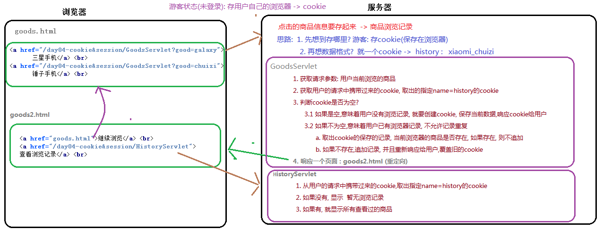

# 一 会话概述

## 1.1 什么是会话？

日常生活中：从拨通电话到挂断电话之间的一连串你问我答的过程就是一个会话。

B/S架构中：从浏览器第一次给服务器发送请求时，建立会话；直到有一方断开，会话结束。

	一次会话：包含多次请求响应。


<figure class="thumbnails">
    
</figure>


## 1.2 会话技术

**问题：**Http是一个无状态协议，同一个会话的连续两个请求相互独立，彼此并不了解

**作用**：用于==存储==浏览器与服务器在请求和响应过程中产生的==数据==

​	   在一次会话中(多次请求响应), 共享数据

客户端会话技术：cookie

服务器端会话技术：session


<figure class="thumbnails">
    
</figure>

# 二 Cookie【重点】

## 2.1 概述

Cookie是客户端会话技术，可以解决 Http 无状态的问题。

Cookie作用：在一次会话的多次请求之间共享数据，将数据**保存到客户端（浏览器）**


```markdown
#Cookie的特点
1. cookie保存在客户端(浏览器), 往往是由服务器产生发送给浏览器
2. cookie只能保存字符串, 格式是entry(name : value)
3. cookie的大小有限制: 4k
4. 一般, 同一域名下的cookie限制数量50个
```


## 2.2 快速入门   

- **Cookie入门以京东网站为例子:**

1.有游客身份登录京东网站（未登录）

2.添加任意商品到购物车

3.将浏览器关闭

4.在此打开浏览器并访问京东网站，发现购物车还有之前添加的商品。


- **jd购物车**


<figure class="thumbnails">
    
</figure>

- **京东Cookie的使用流程：**

1.用户添加商品到购物车

​	1.1 京东服务器会创建一个 Cookie 信息，记录用户所添加购物车商品的信息，并将其Cookie发送浏览器

​	1.2 浏览器接送到 Cookie 后，会保存到客户端中

2.当用户再次访问京东网站，发现购物数据依旧存在

​	1.1 浏览器再次访问京东购物车的时候，会在携带之前保持的 Cookie 到京东的购物车服务中

​	1.2 服务器读取到 Cookie 后，将其进行解析并显示在页面中。


- **Cookie相关Api**

```markdown
1. 设置数据到cookie中
	// 1.创建cookie对象，设置数据
		Cookie cookie = new Cookie(String name,String value);
	// 2.通过response，响应（返回）cookie
		response.addCookie(cookie);

2. 从cookie中获取数据
	// 1.通过request对象，接收cookie数组
		Cookie[] cookies = request.getCookies();
	// 2.遍历数组
		获取name值：	 String name = cookie.getName();
		获取value值：	 String value = cookie.getValue();
```


- **入门案例示意图：**


<figure class="thumbnails">
    
</figure>


**index.html**

```html
<!DOCTYPE html>
<html lang="zh">
<head>
  <meta charset="UTF-8">
  <title>购物车</title>
</head>
<body>

    <a href="CartServlet?goods=8384250">添加商品到购物车--手办</a>  <br>

    <a href="LookUpServlet">查看购物车</a>

</body>
</html>
```


```java
package com.itheima.web.servlet01;

import javax.servlet.ServletException;
import javax.servlet.annotation.WebServlet;
import javax.servlet.http.Cookie;
import javax.servlet.http.HttpServlet;
import javax.servlet.http.HttpServletRequest;
import javax.servlet.http.HttpServletResponse;
import java.io.IOException;

/**
 * <p></p>
 *
 * @Description:
 */
@WebServlet("/CartServlet")
public class CartServlet extends HttpServlet {
    protected void doPost(HttpServletRequest request, HttpServletResponse response) throws ServletException, IOException {

        response.setContentType("text/html;charset=utf-8");

        // 1.获得用户所添加商品到购物车的信息
        String goods = request.getParameter("goods");
        response.getWriter().println("添加的商品Id:"+goods);

        // 2.创建Cookie信息
        Cookie cookie = new Cookie("cart", goods);
        response.getWriter().println("已经保持到Cookie中:"+goods);

        // 3.将Cookie响应给浏览器
        response.addCookie(cookie);

    }

    protected void doGet(HttpServletRequest request, HttpServletResponse response) throws ServletException, IOException {
        doPost(request, response);
    }
}

```


```java
package com.itheima.web.servlet01;

import javax.servlet.ServletException;
import javax.servlet.annotation.WebServlet;
import javax.servlet.http.Cookie;
import javax.servlet.http.HttpServlet;
import javax.servlet.http.HttpServletRequest;
import javax.servlet.http.HttpServletResponse;
import java.io.IOException;

/**
 * <p></p>
 *
 * @Description:
 */
@WebServlet("/LookUpServlet")
public class LookUpServlet extends HttpServlet {
    protected void doPost(HttpServletRequest request, HttpServletResponse response) throws ServletException, IOException {

        response.setContentType("text/html;charset=utf-8");

        // 1.获得浏览器的Cookie信息
        Cookie[] cookies = request.getCookies();

        String showMsg = "";

        if (cookies != null && cookies.length > 0) {
            for (Cookie cookie : cookies) {
                if ("cart".equals(cookie.getName())) {
                    showMsg = cookie.getValue();
                }
            }
        }

        // 2.判断购物车信息是否存在
        if (showMsg.length() > 0) {

            response.getWriter().println("您的购物车商品Id为：" + showMsg);

        } else {

            response.getWriter().println("您的购物车为空");
        }


    }

    protected void doGet(HttpServletRequest request, HttpServletResponse response) throws ServletException, IOException {
        doPost(request, response);
    }
}
```


- **google浏览器中查看Cookie**


<figure class="thumbnails">
    
</figure>

    

<figure class="thumbnails">
    
</figure>

## 2.3 工作原理

基于HTTP协议：

​	1. 服务器发送Cookie给浏览器是通过 :  响应(响应头 set-cookie)

​		Set-Cookie: name=value

​	2. 浏览器发送Cookie给服务器是通过:  请求(请求头  cookie)

​		Cookie: name=value


<figure class="thumbnails">
    
</figure>


## 2.4 Cookie详情

### 2.4.1 服务器发送多个Cookie

```markdown
* 答案: 可以的
	// 1. 创建多个cookie对象
		Cookie cookie1 = new Cookie("name","lucy");
		Cookie cookie2 = new Cookie("age","18");
	// 2. 通过response响应多个
		response.addCookie(cookie1);
		response.addCookie(cookie2);
```


```java
package com.itheima.web.servlet02;

import javax.servlet.ServletException;
import javax.servlet.annotation.WebServlet;
import javax.servlet.http.Cookie;
import javax.servlet.http.HttpServlet;
import javax.servlet.http.HttpServletRequest;
import javax.servlet.http.HttpServletResponse;
import java.io.IOException;

/**
 * <p></p>
 *
 * @Description:
 */
@WebServlet("/MoreCookieServlet")
public class MoreCookieServlet extends HttpServlet {
    protected void doPost(HttpServletRequest request, HttpServletResponse response) throws ServletException, IOException {

        //如果name是一致的后面的会覆盖前面的
        Cookie cookie = new Cookie("name","欧里给");
        Cookie cookie2 = new Cookie("age","火钳刘明");

        // response在设置cookie时候，需要一个一个的设置
        response.addCookie(cookie);
        response.addCookie(cookie2);

    }

    protected void doGet(HttpServletRequest request, HttpServletResponse response) throws ServletException, IOException {
        doPost(request, response);
    }
}

```


### 2.4.2 Cookie是否可以存储中文和非法字符

```markdown
* tomcat8之前的版本，不支持中文--Servlet3.0 之前的
* tomcat8以后的版本，支持中文...--Servlet3.0之后的支持中文
	但是按照 Rfc6265Cookie规范，在cookie值中不能使用分号（;）、逗号（,）、等号（=）以及空格

我们可以存储,但是要使用url编码,来避开这个规范限制

* 解决
		java.net.URLEncoder.encode(字符串","utf-8") 把字符串使用utf-8进行编码
		java.net.URLDecoder.decode(字符串","utf-8")  把字符串使用utf-8进行解码
```

```java


@WebServlet("/Cookie03Servlet")
public class Cookie03Servlet extends HttpServlet {

    protected void doGet(HttpServletRequest request, HttpServletResponse response) throws ServletException, IOException {
        this.doPost(request, response);
    }

    protected void doPost(HttpServletRequest request, HttpServletResponse response) throws ServletException, IOException {
        /*
            按照 Rfc6265Cookie规范，在cookie值中不能使用分号（;）、逗号（,）、等号（=）以及空格

                 String encode = URLEncoder.encode(str, "utf-8");  编码
                   记得:
                        空格  ->  +

                    String decode = URLDecoder.decode(encode, "utf-8"); 解码
         */
        String str = "张三 三";
        String encode = URLEncoder.encode(str, "utf-8");  //编码


        Cookie cookie = new Cookie("name", encode);
        response.addCookie(cookie);
    }

}
```

```java
package com.itheima01.cookie;

import javax.servlet.ServletException;
import javax.servlet.annotation.WebServlet;
import javax.servlet.http.Cookie;
import javax.servlet.http.HttpServlet;
import javax.servlet.http.HttpServletRequest;
import javax.servlet.http.HttpServletResponse;
import java.io.IOException;
import java.net.URLDecoder;

@WebServlet("/Cookie04Servlet")
public class Cookie04Servlet extends HttpServlet {

    protected void doGet(HttpServletRequest request, HttpServletResponse response) throws ServletException, IOException {
        this.doPost(request, response);
    }

    protected void doPost(HttpServletRequest request, HttpServletResponse response) throws ServletException, IOException {

        Cookie[] cookies = request.getCookies();
        for (Cookie cookie : cookies) {
            String name = cookie.getName();
            String value = cookie.getValue();
            if("name".equalsIgnoreCase(name)){
                value = URLDecoder.decode(value, "utf-8");
            }
            System.out.println(name + "---" + value);
        }
    }

}
```


```html
 <a href="Cookie03Servlet">第一次_获取cookie_非法字符</a> <br>

<a href="Cookie04Servlet">第二次_查看cookie_非法字符</a>  <br>
```


### 2.4.3 Cookie的域名作用(domain)

```markdown
1. cookie信息中的域名作用是标记这个cookie的归属
		在我们的浏览器中,既保存了域名为localhost的cookie,又保存域名为baidu的cookie
		那么访问的网站如果是 http://localhost:8080, 浏览器的请求只会携带域名为localhost的cookie
		
2. 默认情况下,cookie的域名是发送此cookie的服务器域名是一致的
	url格式 ->  协议://域名:端口/资源位置
```

- **Cookie 域示意图**


<figure class="thumbnails">
    
</figure>

```JAVA
package com.itheima.web.servlet03;

import javax.servlet.ServletException;
import javax.servlet.annotation.WebServlet;
import javax.servlet.http.Cookie;
import javax.servlet.http.HttpServlet;
import javax.servlet.http.HttpServletRequest;
import javax.servlet.http.HttpServletResponse;
import java.io.IOException;

/**
 * <p></p>
 *
 * @Description:
 */
@WebServlet("/DomainServlet")
public class DomainServlet extends HttpServlet {
    protected void doPost(HttpServletRequest request, HttpServletResponse response) throws ServletException, IOException {

        Cookie cookie = new Cookie("hobby", "玩只狼");

        //setDomain：给cookie设置域名
        //在 localhost中这是了cookie域名为www.baidu.com
        //那么由于不是在同一个域名下，当前的cookie作废
        //一般情况下不去设置setDomain，默认为当前的访问域名
        //cookie.setDomain("www.baidu.com");

        response.addCookie(cookie);

    }

    protected void doGet(HttpServletRequest request, HttpServletResponse response) throws ServletException, IOException {
        doPost(request, response);
    }
}
```


### 2.4.4 Cookie的路径(path)

**1.Cookie路径的设置：**

- **默认设置**

在我们的项目中,cookie的路径默认为 项目所访问的资源路径到项目虚拟路径之间的路径。
		url->  http://localhost:8080/项目虚拟路径/Servlet的虚拟路径
		比如: servlet访问路径为 = http://localhost:8080/day07-cookie/aa/cc/cookieServlet


<figure class="thumbnails">
    
</figure>

- **手动设置**

我们可以通过Cookie的API来设置Cookie的路径。

​	设置路径：setPath("路径地址")；


```JAVA
package com.itheima.web.servlet04;

import javax.servlet.ServletException;
import javax.servlet.annotation.WebServlet;
import javax.servlet.http.Cookie;
import javax.servlet.http.HttpServlet;
import javax.servlet.http.HttpServletRequest;
import javax.servlet.http.HttpServletResponse;
import java.io.IOException;

/**
 * <p></p>
 *
 * @Description:
 */
@WebServlet("/a/b/c/PathServlet")
public class PathServlet extends HttpServlet {
    protected void doPost(HttpServletRequest request, HttpServletResponse response) throws ServletException, IOException {

        Cookie cookie = new Cookie("age", "16");

        //如果没有设置Cookie路径==项目的虚拟路径--资源路径中间部分：/day07-cookie/a/b/c/
        // 通过代码来设置--一般代码会设置项目虚拟路径为cookie的路径

        //获得项目的虚拟路径
        String contextPath = request.getContextPath();

        cookie.setPath(contextPath);

        response.addCookie(cookie);

    }

    protected void doGet(HttpServletRequest request, HttpServletResponse response) throws ServletException, IOException {
        doPost(request, response);
    }
}
```


**2.Cookie路径的作用：**

1. 第一个作用: cookie信息中的path和name共同决定了cookie的唯一性

2. 第二个作用: cookie的path还决定了cookie允许被访问的范围

```markdown
1. 第一个作用: cookie信息中的path和name共同决定了cookie的唯一性
		a. PathServlet被浏览器每访问一次, cookie就会发送一次
        b. 如果服务器再次发送一个同 path+name的cookie,会覆盖浏览器的那个cookie
        	(新覆盖旧)
        c. 服务器再次发送一个同 path, 异name的cookie , 不会覆盖
        d. 服务器再次发送一个异path, 同name的cookie, 不会覆盖
        
2. 第二个作用: cookie的path还决定了cookie允许被访问的范围
		特点：Cookie在其设置的有效路径和其子路径下能够被访问到；
		举例: 有一个cookie,路径为 /day11-cookie/aaa
          只有访问 http://localhost:8080/day11-cookie/aaa 以及其子路径,才会携带这个cookie
                问题:
                1. 访问http://localhost:8080/day11-cookie/PathServlet  -> PathServlet
               		 会携带这个cookie吗     ->  不会
                2. 访问http://localhost:8080/day11-cookie/aaa    -> AaaServlet
                		会携带这个cookie吗     ->  会
                3. 访问http://localhost:8080/day11-cookie/aaa/MyServlet -> MyServlet
                		会携带这个cookie吗     ->  会
#API : cookie.setPath(虚拟路径); 
	路径要以 / 开头
```


```java
package com.itheima01.cookie;

import javax.servlet.ServletException;
import javax.servlet.annotation.WebServlet;
import javax.servlet.http.Cookie;
import javax.servlet.http.HttpServlet;
import javax.servlet.http.HttpServletRequest;
import javax.servlet.http.HttpServletResponse;
import java.io.IOException;

@WebServlet("/Cookie05Servlet")
public class Cookie05Servlet extends HttpServlet {

    protected void doGet(HttpServletRequest request, HttpServletResponse response) throws ServletException, IOException {
        this.doPost(request, response);
    }

    protected void doPost(HttpServletRequest request, HttpServletResponse response) throws ServletException, IOException {
        /*
        * cookie路径第一个作用:
        *       相同域名前提下
        *       path + name 决定了cookie 的唯一性
        *
        * cookie路径第二个作用:
        *       限制cookie的作用范围 (有效范围)
        *
        *     概念: path = ?, 只有在访问? 及其 子路径的时候才会携带这个cookie
        *
        *     举例:
        *           path = /doc
        *
        *           只有在访问 http://localhost:8080/doc  以及
        *                       http://localhost:8080/doc/....  才会携带这个cookie
        *
        *     提问:
        *          path= /a 的cookie
        *          访问http://localhost:8080/     不会
        *          访问http://localhost:8080/b/a    不会
        *          访问http://localhost:8080/a    会
        *          访问http://localhost:8080/a/b    会
        *
        *    提问:
        *           path = /a    A
        *           path = /     B
                *
        *        访问 http://localhost:8080/  携带B
        *
        *        访问 http://localhost:8080/a  携带A,B
        *
        *    实际的例子
        *        某个同学访问   http://www.baidu.com:80/doc/1.txt
        *                       path = /doc   的cookie
        *
        *       这个同学访问
        *           http://www.baidu.com:80/doc/2.txt  会携带
        *           http://www.baidu.com:80/map/shanghai   不会携带
        *
        * */
//        Cookie cookie = new Cookie("car", "red_flag");
        Cookie cookie = new Cookie("car", "qq");
        cookie.setPath("/a");//如果不写默认 / (项目虚拟路径)
        response.addCookie(cookie);
    }

}
```


### 2.4.5 Cookie的存活时间

```markdown
# 浏览器中cookie的信息
1. 创建时间: 浏览器接收到此cookie的时间
2. 到期时间: cookie销毁的时间 浏览器清空一个网站下的cookie

# cookie的存活时间有两种
1. 会话级别(默认,浏览器关闭，cookie销毁 )
	浏览器中的cookie显示(浏览会话结束时: 浏览器关闭)
	原因: 浏览器将cookie保存内存中(临时的)
	
	cookie在一个会话中(浏览器从打开到关闭: 访问服务器)共享数据
	
2. 持久级别(需要手动设置)
	cookie.setMaxAge(int second); -- 单位是秒
		正数：指定存活时间，持久化浏览器的磁盘中，到期后自动销毁
		零：立即销毁
	原因: 浏览器将cookie保存在硬盘上(持久的)	
	
	cookie在可以在多个会话中(浏览器从打开到关闭多次: 访问服务器)共享数据
	
```

```java
package com.itheima01.cookie;

import javax.servlet.ServletException;
import javax.servlet.annotation.WebServlet;
import javax.servlet.http.Cookie;
import javax.servlet.http.HttpServlet;
import javax.servlet.http.HttpServletRequest;
import javax.servlet.http.HttpServletResponse;
import java.io.IOException;

@WebServlet("/Cookie07Servlet")
public class Cookie07Servlet extends HttpServlet {

    protected void doGet(HttpServletRequest request, HttpServletResponse response) throws ServletException, IOException {
        this.doPost(request, response);
    }

    protected void doPost(HttpServletRequest request, HttpServletResponse response) throws ServletException, IOException {
        /*
        *   1. 到期时间: 浏览会话结束时
        *      操作: 关闭浏览器, 再次打开这个浏览器,并访问这个网站
        *
        *       -> 浏览器关闭
        *
        *   Cookie的生命周期
        *       1. 会话级别
        *           浏览器关闭, cookie就会被销毁(浏览器运行内存)
        *
        *       2. 持久级别
        *           长久关闭, 不受浏览器关闭的影响,cookie依然在(硬盘上)
        *
        *           C:\Users\用户名\AppData\Local\Google\Chrome\User Data\Default\Cache
        * */
        Cookie cookie = new Cookie("car", "red_flag");
        cookie.setMaxAge(60*60*24*30); // 单位是秒, 30天
        response.addCookie(cookie);
    }

}
```


### 2.4.6 Cookie的删除

```markdown
# 目标：删除Cookie
	1. 用户在浏览器中手动删除cookie(清除浏览记录): 用户未必知道或者配合
	2. 从服务端远程操控删除cookie(服务端)
	
# 远程删除实现步骤：
	0. 核心思想: 服务端发送一个同 path+name的cookie,cookie的存活时间为0
		  原理:  新cookie先覆盖浏览器保存的cookie,但是因为时间0,新cookie马上死掉
              
	1. 创建与要删除的cookie同name的cookie，将其值设置成什么都无所谓;
    2. 设置这个cookie的路径（与原cookie的路径一致）；
    3. 将这个cookie的最大存活时间设置成0；
    4. 将这个新的cookie响应给浏览器，置换原来的cookie,新cookie也马上销毁；	
```


<figure class="thumbnails">
    
</figure>


```java
package com.itheima.web.servlet05;

import javax.servlet.ServletException;
import javax.servlet.annotation.WebServlet;
import javax.servlet.http.Cookie;
import javax.servlet.http.HttpServlet;
import javax.servlet.http.HttpServletRequest;
import javax.servlet.http.HttpServletResponse;
import java.io.IOException;

/**
 * <p></p>
 *
 * @Description:
 */
@WebServlet("/DeadTimeServlet")
public class DeadTimeServlet extends HttpServlet {
    protected void doPost(HttpServletRequest request, HttpServletResponse response) throws ServletException, IOException {

        // 1.创建一个同name同path的cookie
        Cookie cookie = new Cookie("hobby", "");

        //服务器将浏览器中的持久cookie删除掉--设置存活时间为0
        cookie.setMaxAge(0);

        String contextPath = request.getContextPath();

        cookie.setPath(contextPath);

        response.addCookie(cookie);

    }

    protected void doGet(HttpServletRequest request, HttpServletResponse response) throws ServletException, IOException {
        doPost(request, response);
    }
}
```


## 2.5 Cookie特点

```markdown
面试会考到
1. cookie存储位置：在客户端（浏览器）
2. cookie的存储数据类型：只能是字符串（String）
3. cookie单个大小：4kb
4. 同一个域名下cookie数量：常见的浏览器：50个，JavaEE规范：20个
5. 同一域名下, cookie的唯一性：name+path
6. cookie数据安全：不安全，因为在浏览器中存在（敏感数据不要在cookie中存储）
```


# 三 综合案例

## 3.1 商品浏览记录

**需求**

​	做一个商品页面，当我们访问后，在页面上点击查看商品浏览记录后，可以查看到以前浏览过的商品信息


### 3.1.1 需求分析


<figure class="thumbnails">
    
</figure>

### 3.1.2 代码实现

#### ① goods.html

```html
<!DOCTYPE html>
<html lang="zh-CN">
<head>
    <meta charset="UTF-8">
    <title>Title</title>
</head>
<body>
    <a href="?product=huawei">华为手机</a><br>
    <a href="?product=xiaomi">小米手机</a> <br>
    <a href="?product=chuizi">锤子手机</a> <br>
</body>
</html>
```

#### ② info.thml

```html
<!DOCTYPE html>
<html lang="zh-CN">
<head>
    <meta charset="UTF-8">
    <title>Title</title>
</head>
<body>
            <a href="">继续浏览</a> <br>
            <a href="">查看浏览记录</a> <br>
</body>
</html>
```


#### ③ GoodsServlet

```java
package com.itheima.web.servlet02;

import com.itheima.web.utils.CookieUtils;

import javax.servlet.ServletException;
import javax.servlet.annotation.WebServlet;
import javax.servlet.http.Cookie;
import javax.servlet.http.HttpServlet;
import javax.servlet.http.HttpServletRequest;
import javax.servlet.http.HttpServletResponse;
import java.io.IOException;

/**
 * <p></p>
 *
 * @Description:
 */
@WebServlet("/goodsServlet")
public class GoodsServlet extends HttpServlet {
    protected void doPost(HttpServletRequest request, HttpServletResponse response) throws ServletException, IOException {

        String product = request.getParameter("product");
        String pros = "";

        Cookie coo = CookieUtils.getCookie(request, "product");

        if (coo != null) {
            pros = coo.getValue();
            pros = pros +"_"+ product;
        }

        // Cookie[] cookies = request.getCookies();
        //
        //
        // if (cookies != null && cookies.length > 0) {
        //     for (Cookie cookie : cookies) {
        //         if ("product".equals(cookie.getName())) {
        //             pros = cookie.getValue();
        //             pros = pros+"_"+product;
        //         }
        //     }
        // }

        if (pros.length() < 1) {
            pros = product;
        }

        Cookie co = new Cookie("product", pros);
        co.setPath("/");
        co.setMaxAge(60*60*24);
        response.addCookie(co);

        String contextPath = request.getContextPath();
        response.sendRedirect(contextPath+"/03info.html");

    }

    protected void doGet(HttpServletRequest request, HttpServletResponse response) throws ServletException, IOException {
        doPost(request,response);
    }
}
```


#### ④ HistoryServlet

```java
package com.itheima.web.servlet02;

import com.itheima.web.utils.CookieUtils;

import javax.servlet.ServletException;
import javax.servlet.annotation.WebServlet;
import javax.servlet.http.Cookie;
import javax.servlet.http.HttpServlet;
import javax.servlet.http.HttpServletRequest;
import javax.servlet.http.HttpServletResponse;
import java.io.IOException;

/**
 * <p></p>
 *
 * @Description:
 */
@WebServlet("/historyServlet")
public class HistoryServlet extends HttpServlet {
    protected void doPost(HttpServletRequest request, HttpServletResponse response) throws ServletException, IOException {

        Cookie[] cookies = request.getCookies();

        String pros = "";

        Cookie cookie = CookieUtils.getCookie(request, "product");

        if (cookie != null) {
            pros = cookie.getValue();
        }

        // if (cookies != null && cookies.length > 0) {
        //
        //     for (Cookie cookie : cookies) {
        //
        //         if ("product".equals(cookie.getName())) {
        //
        //             pros = cookie.getValue();
        //         }
        //     }
        // }

        response.setContentType("text/html;charset=utf-8");

        if (pros.length() > 0) {

            String[] proArr = pros.split("_");

            response.getWriter().println("<h1>浏览历史记录<h1>");
            for (String pro : proArr) {
                response.getWriter().println(pro + "<br/>");
            }

        } else {
            response.getWriter().println("<h1>无浏览历史记录<h1>");
            String contextPath = request.getContextPath();

            response.getWriter().println("<a href='"+contextPath+"/02goods.html'>继续浏览商品</a>");
        }
    }

    protected void doGet(HttpServletRequest request, HttpServletResponse response) throws ServletException, IOException {
        doPost(request, response);
    }
}
```

#### ⑤ CookieUtils

```java
public class CookieUtils {
    /**
     *  根据指定的name获取对应的cookie,如果不存在返回null
     * @param request 请求
     * @param specified  指定的cookie的name
     * @return
     */
    public static Cookie getCookie(HttpServletRequest request,String specified){
        Cookie[] cookies = request.getCookies();
        if(cookies != null && cookies.length > 0){
            for (Cookie cookie : cookies) {
                String name = cookie.getName();
                if(specified.equalsIgnoreCase(name)){
                    //这种情况,存在符合条件的cookie
                    return cookie;
                }
            }
        }
        return null;
    }
}
```

