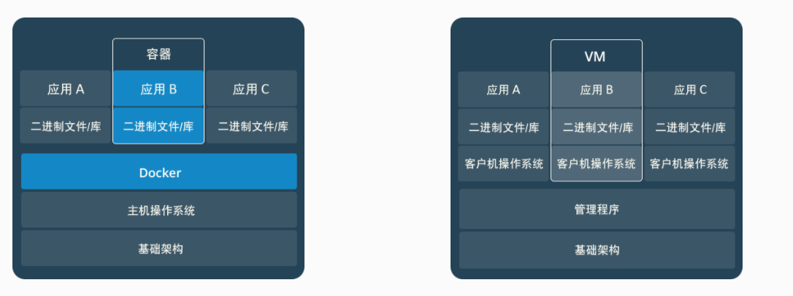
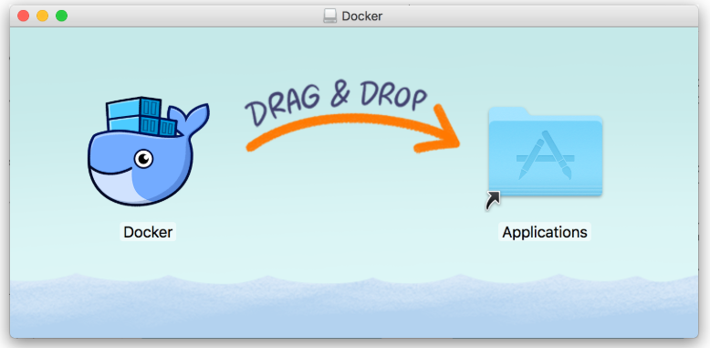

# 应用容器平台-Docker


# 0. 课程目标

- 熟悉Docker的基本概念
- 理解Docker的几个对象概念
- 掌握Docker的安装和启动
- 掌握Docker的镜像操作
- 掌握Docker的容器操作
- 掌握Docker的部署案例
- 熟悉Docker的备份和迁移
- 掌握Dockerfile构建镜像的基本使用
- 了解Docker私有注册中心

# 1.Docker的基本概念

## 1.1 什么是容器？

先来看看容器较为官方的解释：

一句话概括容器：容器就是将软件打包成标准化单元，以用于开发、交付和部署。

如果需要通俗的描述容器的话，容器就是一个存放东西的地方，就像书包可以装各种文具、衣柜可以放各种衣服、鞋架可以放各种鞋子一样。我们现在所说的容器存放的东西可能更偏向于应用比如网站、程序甚至是系统环境。


 <figure class="thumbnails">
    
</figure>


## 1.2  容器 VS 虚拟机

物理机：


 <figure class="thumbnails">
    
</figure>
虚拟机：


 <figure class="thumbnails">
    
</figure>

容器：


 <figure class="thumbnails">
    
</figure>

相信通过上面的解释大家对于容器这个既陌生又熟悉的概念有了一个初步的认识，下面我们就来谈谈Docker的一些概念。

**两者对比图**

简单来说： 容器和虚拟机具有相似的资源隔离和分配优势，但功能有所不同，因为容器虚拟化的是操作系统，而不是硬件，因此容器更容易移植，效率也更高。

虚拟机技术：是虚拟出一套计算机硬件后，在这套硬件上安装并运行一个完整的操作系统，然后就可以像使用一台真实计算机一样，在该机器上安装被运行各种应用。

容器技术：是一个**共享操作系统内核**的虚拟化技术。不会虚拟化硬件，容器的运行要依赖于**宿主**的内核，容器内没有自己的内核。因此容器要比传统虚拟机更为轻便。


 <figure class="thumbnails">
    
</figure>

**容器与虚拟机 (VM) 总结**


 <figure class="thumbnails">
    
</figure>

- 容器: 用于将代码和依赖资源打包在一起。 多个容器可以在同一台机器上运行，共享操作系统内核，但各自作为独立的进程在用户空间中运行 。与虚拟机相比， 容器占用的空间较少（容器镜像大小通常只有几十兆），瞬间就能完成启动 。
- 虚拟机（VM）是一个物理硬件层抽象，用于将一台服务器变成多台服务器。 管理程序允许多个VM在一台机器上运行。每个VM都包含一整套操作系统、一个或多个应用、必要的二进制文件和库资源，因此占用大量空间。而且VM启动也十分缓慢 。

两者有不同的使用场景,虚拟机更擅长于彻底隔离整个运行环境。

**并且两者也可以共存的：**


 <figure class="thumbnails">
    
</figure>

## 1.3 什么是Docker

Docker 是一个开源的应用容器引擎，让开发者可以打包他们的应用以及依赖包到一个`可移植`的容器中,然后发布到任何流行的[Linux](https://baike.baidu.com/item/Linux)机器或Windows 机器上。


 <figure class="thumbnails">
    
</figure>

#### Docker服务器与客户端

```
Docker是一个客户端/服务端(C/S)架构程序。Docker客户端只需要向Docker服务器或者守护进程发送请求，服务器或者守护进程完成所有工作并返回结果。Docker提供了一个命令行工具Docker以及一整套的Restful API。 你可以在同一台宿主机上运行Docker守护进程和客户端。也可以从本地的Docker客户端连接到运行在另一台宿主机上的远程Docker守护进程
```


 <figure class="thumbnails">
    
</figure>

英文官网：

https://www.docker.com/

中文社区：

http://www.docker.org.cn/

## 1.4 Docker的优点

```
(1) 上手快、体积小、性能高
	用户只需要几分钟，就可以把自己的程序"Docker化"。就可以创建容器来运行程序了，大多数Docker容器只需要不到1秒中即可启动。由于去除了管理程序的开销，Docker容器拥有很高的性能，同时同一台宿主机中也可以运行更多的容器，使用户尽可能的充分利用系统资源。
	
（2）职责的逻辑分类
	
	使用Docker,开发人员只需要关心容器中运行的应用程序，而运维人员只需要关心如何管理容器。Docker设计的目的就是要加强开发人员写代码的开发环境与应用程序要部署的生产环境一致性。从而降低那种“开发时一切正常，肯定是运维的问题 （测试环境都是正常，一上线就出问题肯定是运维的问题）
	
（3）快速高效的开发生命周期
	Docker的目标之一就是是缩短代码从开发、测试到部署、上线运行的周期，让你的应用程序具备可移植性，易于构建，并易于协作。（通俗点说，Docker就像一个盒子，里面可以装很多物件，如果需要这些物件的可以直接将该大盒子拿走，而不需要从该盒子中一件件的取）
	
（4）鼓励使用面向服务的架构
	Docker还鼓励面向服务的体系结构和微服务架构。Docker推荐单个容器只运行一个应用程序或进程，这样就形成了一个分布式的应用程序模型，在这种模型下，应用程序或者服务都可以表示为一系列内部互联的容器，从而使分布式部署应用程序，扩展或调试应用程序都变得非常简单。
```


# 2. Docker的安装和启动

## 2.1 安装环境准备-linux虚拟机

Docker官方建议在Ubuntu中安装，因为Docker是基于Ubuntu发布的，而且一般Docker出现的问题Ubuntu是最先更新或者打补丁的。在很多版本的CentOS中是不支持更新最新的一些补丁包的。

由于我们学习的环境都使用的是CentOS，因此这里我们将Docker安装到CentOS上。注意：这里建议安装在CentOS7.x以上的版本，在CentOS6.x的版本中，安装前需要安装其他很多的环境而且Docker很多补丁不支持更新。

我们使用VMware的虚拟机中安装了Centos7。直接打开提供好的虚拟机文件，挂载即可。

挂载后，先设置内存大小，但不能超过宿主机的内存大小，这里设置3g，推荐6G以上。

启动虚拟机，选择`我已复制该虚拟机`。


 <figure class="thumbnails">
    
</figure>

启动成功后，需要登录，默认的用户名为`root`，密码为`itcast`。

使用ip addr或ifconfig命令查看虚拟机系统的IP，使用客户端软件，连接该IP的主机。


 <figure class="thumbnails">
    
</figure>

## 2.2 Docker的安装

### Linux系统安装Docker

从 2017 年 3 月开始 docker 在原来的基础上分为两个分支版本: 

Docker CE （Docker Community Edition） 即社区免费版，

Docker EE 即企业版，强调安全，但需付费使用。

**docker依赖性检查：**

Docker需要一个64位系统的红帽系统，内核的版本必须大于3.10，可以通过下面的命令来查看linux内核版本：

```
uname -r
```

**查看下是否安装过：**

```
yum list installed | grep docker
```

```shell
#本机的执行效果：
[root@bobohost ~]# yum list installed | grep docker
containerd.io.x86_64                 1.2.6-3.3.el7                    @docker-ce-stable
docker-ce.x86_64                     3:19.03.0-3.el7                  @docker-ce-stable
docker-ce-cli.x86_64                 1:19.03.0-3.el7                  @docker-ce-stable
```

如果有已经安装，删除旧的docker，命令如下：

```shell
#相关的都删除
yum remove docker-ce
#或分别删除
sudo yum remove docker-ce \
docker-ce-cli
```

**清除默认的docker目录**

其中包含了之前的镜像和容器文件、配置等。

```shell
#提示：该目录是docker服务启动后自动生成的。
rm -rf /var/lib/docker
```

**安装依赖工具包**

```
sudo yum install -y yum-utils device-mapper-persistent-data lvm2
```

**设置阿里云镜像源**

```
sudo yum-config-manager --add-repo http://mirrors.aliyun.com/docker-ce/linux/centos/docker-ce.repo
```

**更新 yum 缓存：**

```shell
#必须先更新yum源，否则找不到docker-ce，只能找到docker
sudo yum makecache fast
```

**安装docker**

```shell
#查看所有仓库中所有docker版本
yum list docker-ce --showduplicates|sort -r  

#直接安装Docker CE 
yum -y install docker-ce

#或选择安装64位的版本：
yum install docker-ce.x86_64

#或选择特定版本安装，比如这里的版本是19.03.0.ce：
yum -y install docker-ce-19.03.0.ce
```

**验证安装是否成功**

方式一：查看已经安装后的软件，

```shell
#有client和service两部分表示docker安装启动都成功了
yum list installed | grep docker
```

有client和service两部分表示docker安装启动都成功了：

```shell
[root@bobohost lib]# yum list installed | grep docker
containerd.io.x86_64                 1.2.6-3.3.el7                    @docker-ce-stable
docker-ce.x86_64                     3:19.03.0-3.el7                  @docker-ce-stable
docker-ce-cli.x86_64                 1:19.03.0-3.el7                  @docker-ce-stable
```

方式二：查看docker的版本号

```shell
docker -v
```

本机输出如下：

```
[root@bobohost lib]# docker -v
Docker version 19.03.0, build aeac9490dc
```

或

```
docker version
```

本机输出如下：

```
[root@bobohost lib]# docker version
Client: Docker Engine - Community
 Version:           19.03.0
 API version:       1.40
 Go version:        go1.12.5
 Git commit:        aeac9490dc
 Built:             Wed Jul 17 18:15:40 2019
 OS/Arch:           linux/amd64
 Experimental:      false
```

**设置镜像加速**

docker 从 docker hub 拉取镜像，因为是从国外获取，速度较慢。可以通过配置国内镜像源的方式，从国内获取镜像，提高拉取速度。

1. 中国科学技术大学（LUG@USTC）的开源镜像

https://docker.mirrors.ustc.edu.cn

```shell
sudo mkdir -p /etc/docker
sudo tee /etc/docker/daemon.json <<-'EOF'
{
  "registry-mirrors": ["https://docker.mirrors.ustc.edu.cn"]
}
EOF
sudo systemctl daemon-reload 
sudo systemctl restart docker
```


2 . 使用阿里云镜像

获取阿里云镜像加速账号获取 [https://cr.console.aliyun.com/#/accelerator](https://cr.console.aliyun.com/cn-hangzhou/instances/mirrors)


 <figure class="thumbnails">
    
</figure>

```shell
sudo mkdir -p /etc/docker
sudo tee /etc/docker/daemon.json <<-'EOF'
{
  "registry-mirrors": ["https://r2fftmt2.mirror.aliyuncs.com"]
}
EOF
sudo systemctl daemon-reload
sudo systemctl restart docker
```

## 

### MacOS安装Docker

macOS下支持两种安装方式：

- Homebrew安装
- 手动下载安装

大家根据自己情况选择。

**使用 Homebrew 安装**

[Homebrew](https://brew.sh/) 的 [Cask](https://github.com/Homebrew/homebrew-cask) 已经支持 Docker Desktop for Mac，因此可以很方便的使用 Homebrew Cask 来进行安装：


```bash
$ brew cask install docker
```

**手动下载安装**

如果需要手动下载，请点击以下链接下载 [Stable](https://download.docker.com/mac/stable/Docker.dmg) 或 [Edge](https://download.docker.com/mac/edge/Docker.dmg) 版本的 Docker Desktop for Mac。

如同 macOS 其它软件一样，安装也非常简单，双击下载的 `.dmg` 文件，然后将那只叫 [Moby](https://www.docker.com/blog/call-me-moby-dock/) 的鲸鱼图标拖拽到 `Application` 文件夹即可（其间需要输入用户密码）。


 <figure class="thumbnails">
    
</figure>

**运行**

从应用中找到 Docker 图标并点击运行。


 <figure class="thumbnails">
    
</figure>

运行之后，会在右上角菜单栏看到多了一个鲸鱼图标，这个图标表明了 Docker 的运行状态。


 <figure class="thumbnails">
    
</figure>

第一次点击图标，可能会看到这个安装成功的界面，点击 "Got it!" 可以关闭这个窗口。


**配置镜像加速**

对于使用 macOS 的用户，在任务栏点击 Docker Desktop 应用图标 -> `Perferences`，在弹出窗口的顶部导航菜单选择 `Daemon`，在下边的`Registry mirrors`框中，填写镜像地址即可，例如网易镜像：

```json
https://hub-mirror.c.163.com
```

修改完成之后，点击 `Apply & Restart` 按钮，Docker 就会重启并应用配置的镜像地址了。


## 2.3 Docker服务的启动停止

刚安装好的Docker并没有启动，需要通过系统服务命令的方式来启动。

比如：要运行查看Docker的概要信息的命令`info`:

```
docker info
```

控制台会出现：

```shell
[root@bobohost ~]# docker info
Client:
 Debug Mode: false

Server:
ERROR: Cannot connect to the Docker daemon at unix:///var/run/docker.sock. Is the docker daemon running?
errors pretty printing info
```

在Centos7中，可以使用系统服务管理器指令`systemctl`来启动Docker服务，该命令可以认为是 `service` 和 `chkconfig` 两个命令组合。Centos6中只能使用`service`指令。

相关命令如下：

查看docker服务的启动状态

```shell
systemctl status docker
```

启动docker服务：

```shell
systemctl start docker
```

停止docker服务：

```shell
systemctl stop docker
```

重启docker服务：

```shell
systemctl restart docker
```

加入到开机启动（生产环境下一般要系统启动时自动运行Docker服务）：

```shell
systemctl enable docker
```

查看docker所有命令：

```
docker --help
```

官方命令手册地址：

https://docs.docker.com/engine/reference/commandline/

## 2.4 Docker中的组件

#### 镜像（Image）——一个特殊的文件系统

```
Docker镜像是一个特殊的文件系统，除了提供容器运行时所需的程序、库、资源、配置等文件外，还包含了一些为运行时准备的一些配置参数（如匿名卷、环境变量、用户等）。 镜像不包含任何动态数据，其内容在构建之后也不会被改变。
```

#### 容器（Container）——镜像运行时的实体

```
镜像（Image）和容器（Container）的关系，就像是面向对象程序设计中的类和实例一样，镜像是静态的定义，容器是镜像运行时的实体。容器可以被创建、启动、停止、删除、暂停等 。
```

#### 注册中心（Registry）——集中存放镜像仓库的地方

```
镜像构建完成后，可以很容易的在当前宿主上运行，但是， 如果需要在其它服务器上使用这个镜像，我们就需要一个集中的存储、分发镜像的服务，Docker Registry就是这样的服务。

一个Docker Registry中可以包含多个仓库（Repository）；
每个仓库可以包含多个标签（Tag）；
每个标签对应一个镜像。
所以说：镜像仓库是Docker用来集中存放镜像文件的地方类似于我们之前常用的代码仓库。

通常，一个仓库会包含同一个软件不同版本的镜像，而标签就常用于对应该软件的各个版本 。我们可以通过<仓库名>:<标签>的格式来指定具体是这个软件哪个版本的镜像。
```

```
Docker Registry 分为 公开服务和私有服务的概念：
Docker Registry公开服务是开放给用户使用、允许用户管理镜像的Registry服务。

最常使用的Registry公开服务是官方的Docker Hub，这也是默认的Registry，并拥有大量的高质量的官方镜像，网址为：hub.docker.com/ 。 在国内访问Docker Hub可能会比较慢国内也有一些云服务商提供类似于Docker Hub的公开服务。
```

# 3. Image镜像操作

## 3.1 查看镜像

```shell
# 查看本地已有的镜像
docker images 
```

根据仓库名字和标记来列出本地镜像，

```shell
#列出"centos"仓库中的所有镜像：
docker images centos
```

## 3.2 查找镜像

```none
# 查询在注册中心中有没有需要的镜像。
docker search [选项] 关键字
```

**示例：**

列出Docker Hub上包含“centos”关键字的的镜像：

```
docker search centos
```

该命令一般只用于查看是否存在拥有关键字的镜像。


 <figure class="thumbnails">
    
</figure>

```
- NAME：仓库名称
- DESCRIPTION：镜像描述
- STARS：用户评价，反应一个镜像的受欢迎程度
- OFFICIAL：是否官方
- AUTOMATED：自动构建，表示该镜像由Docker Hub自动构建流程创建的

查找镜像中没有给我们提供查看版本号的地方
要想查看有哪些tag版本号
可以去网站中查看：https://hub.docker.com/
```

## 3.3 拉取镜像

```shell
#从注册中心上拉取下载需要的镜像。
docker pull 镜像名称[:标记]
```

【示例】

（1）拉取centos仓库中的镜像

```shell
docker pull centos
docker pull 注册中心/仓库名字:标记

docker pull centos
```

docker镜像名字组成：`注册中心/仓库名字:标记`，如：`docker.io/library/centos:7.6.1810`

但如果是从官方docker hub下载镜像，可以省略注册中心，可以写成：`仓库名字:标记`，例如`centos:7.6.1810`

标记一般是类似于版本号的组成方式，它支持`x.y.z`语义化版本方式，并能自动识别。

比如拉取镜像操作中的使用：

```
centos:7.6.1810----->下载的就是7.6.1810
centos:7.6  ------->下载7.5.最高版本 的版本
centos:7    ------->下载7系列最高的版本
centos:6    ------->下载6系列最高的版本
centos:latest   ------->下载最高的版本
centos   ------->下载最高的版本,省略版本号时就是latest
```

如果要下载指定版本的镜像，可以执行命令：

```shell
docker pull centos:7.6.1810
```

对于本节案例，标记不写，将使用默认的标记latest，即下载的是centos最新版本，即相当于下载的命令为：

```
docker pull centos:latest
```

因为最新版本不断的会更新，因此，企业中使用Docker一般会使用完整的语义化版本的标记方式。

## 3.4 删除镜像

```none
docker rmi [OPTIONS] IMAGE [IMAGE...]
```

【示例】

删除centos的镜像

```
# 通过镜像的名字删除
docker rmi centos
# 通过镜像ID删除
docker rmi fce289e99eb9
```

删除所有镜像（慎用）

```
docker rmi `docker images -q`
```

# 4. Container容器操作

## 4.1 查看容器

```none
docker ps [OPTIONS]
```

【示例】

（1）列出所有正在运行的容器：

```shell
docker ps
```

（2）显示所有容器，包括正在运行的和停止的。

```shell
docker ps -a
```

## 4.2 容器的创建

语法：

```none
docker run [选项] 镜像名称:版本号 [命令] [ARG...]
```

```
常用选项：
	-i: 以交互式的方式允许容器，通常与-t一起使用
	--name: 创建容器的名称
	-v: 表示目录映射关系（前者是宿主机目录，后者是映射到宿主机上的目录），可以使用多个-v做多个目录的映射。注意：做好映射后，最好在宿主机中更改文件
	-t: 表示容器启动后会进入其命令行。加入这两个参数后，容器创建好后就能登录到容器中。并分配一个伪终端
	-d: 在run后面加上-d参数，则会创建一个守护式容器在后台运行（这样容器创建后，就不会登陆到容器中）
	-p: 表示端口映射，前者是宿主机端口，后者是容器内的映射端口。可以使用多个-p做多个端口映射
```

根据平时的使用方式，我们分别以交互式容器和守护式容器的创建来讲解：

（一）交互式容器

创建一个用于测试的容器，容器创建成功后自动分配伪终端，可进行人机交互。

创建运行一个centos的容器：

```shell
docker run -it --name=mycentos centos /bin/bash
#或
docker run -i -t --name=mycentos centos /bin/bash
# 退出容器
exit
```

```
bash：分配伪终端时要在容器上执行的命令，这里使用的linux的bash脚本命令，该命令完整写法为`/bin/bash`。

提示：

`run`和镜像名字之间的选项没有顺序，但命令必须放到镜像名字之后。

优点：

创建完容器后，自动运行容器，并可以直接进入到子容器系统中操作了，主要用于测试使用。

缺点：

当退出子容器后，该容器会自动停止运行。
```

（二）守护式容器：

创建一个需要长期运行的容器，就可以创建一个守护式容器（后台运行的容器），下面的命令用于在后台创建运行容器并打印容器ID：

```shell
docker run -id --name=mycentos2 centos
#或
docker run -id --name mycentos2 centos
```

- -d：在后台运行容器并打印容器ID。

登录守护式容器方式：

```
docker exec -it container_name (或者 container_id)  /bin/bash（exit退出时，容器不会停止）
```

比如：

```
方式1：使用名字进入
docker exec -it mycentos2 bash 
[root@2c32a5cb4a71 /]# 
方式2：使用id进入
docker exec -it 2c32a5cb4a71 bash
[root@2c32a5cb4a71 /]#  
```

优点：

从守护式容器中退出，并不影响容器的运行。

缺点：

必须的手动命令进入到容器。

小结：

【理解】

run命令的本质是两个命令的结合：create+start

## 4.3 容器的停止启动挂起

一、容器的停止

```none
# 停止一个或多个正在运行的容器
docker stop 容器名称/容器ID
```

二、容器的启动

```none
# 启动一个或多个停止的容器
docker start 容器名称/容器ID
```

三、重启容器

```none
# 重启一个或多个容器
docker restart 容器名称/容器ID
```

四、暂停容器

```
docker pause 容器名称/容器ID
```

五、取消暂停容器

```
docker unpause 容器名称/容器ID
```

六、设置容器开机自启动

```powershell
# 新容器创建，启动时加--restart=always
docker run -id --name=mycentos2  --restart=always centos
```

```powershell
# 如果已经过运行的容器
docker update --restart=always mycentos2
```

## 4.4 文件的拷贝

说明：

在容器和本地文件系统之间复制文件/文件夹。

```
# 如果我们需要将文件拷贝到容器内可以使用cp命令
docker cp 需要拷贝的文件或目录 容器名称:容器目录
```

如：将宿主机的文件拷贝到mycentos2中

```shell
#在宿主机上创建一个空文件test.txt
touch test.txt
#将test.txt拷贝到mycentos2容器的根目录中：
docker cp test.txt mycentos2:/
```

验证效果：进入到容器中，可以查看到刚拷贝的文件。

也可以将文件从容器内拷贝出来

```
docker cp 容器名称:容器目录或文件 需要拷贝的文件或目录
```

如：从mycentos2容器拷贝文件到宿主机器的当前目录中：

```shell
#在宿主机先删除test.txt文件
rm -f test.txt
#将mycentos2容器中的根目录的test.txt拷贝到宿主机的当前目录中：
docker cp mycentos2:/test.txt ./
```

## 4.5 目录挂载 

说明：

宿主机的目录的挂载映射到容器中。

我们可以在创建容器的时候，将宿主机的目录与容器内的目录进行映射，这样我们就可以通过修改宿主机某个目录的文件从而去影响容器。 

语法：

```
docker run -v `宿主机目录`:`容器目录` image
```

- -v：将当前工作目录装载到容器中。绑定装载卷的宿主机目录不存在时，Docker会自动在宿主机上为您创建这个目录。

【示例】

将宿主机上的`/root/myvolume`目录挂载到`mycentos3`中的`/myvolume`目录中：

```
#进入到宿主机目录，建立新目录和新的文件：
#mkdir myvolume
docker run -id --name=mycentos3 -v /root/myvolume:/myvolume centos
或
docker run -id --name=mycentos3 -v $(pwd)/myvolume:/myvolume centos
```

提示：宿主机的目录必须是以`/`或`~`开头。


## 4.6 容器的删除

```none
# 删除一个或多个容器
docker rm 容器名称/容器ID
```

【示例】

（1）先停止运行的mycentos3的容器，再删除它。

```shell
docker stop mycentos3
docker rm mycentos3
```

提示：

上述命令默认只能删除停止了的容器。若容器是启动的状态，则可以先停止容器，再删除。

（2）直接强制删除正在运行的mycentos2容器

```shell
docker rm -f redis
#或者
docker rm --force redis
```

（3）强制删除所有的容器

```shell
docker rm -f `docker ps -qa`
#或
docker rm -f $(docker ps -a -q)
```

# 6. 部署案例

## 6.1 MySQL部署

目标：使用Docker部署一个MySQL，并通过客户端连接访问。

第一步：拉取MySQL镜像

```shell
docker pull centos/mysql-57-centos7
```

提示：如果已经下载过到本地了，则无需下载。

第二步：创建MySQL容器并映射端口和改密码

```
docker run -di --name=my_mysql -p 3306:3306 -e MYSQL_ROOT_PASSWORD=root centos/mysql-57-centos7
```

- -e：代表添加环境变量  MYSQL_ROOT_PASSWORD是root用户的登陆密码

测试一：进入容器内部，登陆MySQL测试

（1）进入mysql容器

```
docker exec -it my_mysql bash
```

（2）登陆mysql

```
mysql -uroot
```

测试二：远程登陆MySQL

（1）我们在我们本机的电脑上去连接虚拟机Centos中的Docker容器，这里192.168.206.99是虚拟机操作系统的IP：

 

 <figure class="thumbnails">
    
</figure>

## 6.2 Tomcat部署

目标：使用Docker部署一个Tomcat，并部署应用来访问。

第一步：拉取tomcat镜像

```
docker pull tomcat:8.5.43
```

第二步：创建tomcat容器

创建容器，并映射端口等

```
docker run -id --name=my_tomcat -p 8080:8080 -v /usr/local/mytomcat:/usr/local/tomcat/webapps tomcat:8.5.43
```

测试：

部署web应用

1）将程序拷贝到宿主机的`/usr/local/mytomcat`下面

比如：再建立目录`myapp`，里面编辑一个`index.html`页面作为测试主页

2）在虚拟机的宿主机上的浏览器地址栏中输入：http://192.168.206.99:8080/myapp

## 6.3 Nginx部署

目标：使用Docker部署一个Nginx,并将网页部署到nginx中

第一步：拉取nginx镜像

```
docker pull nginx
```

第二步：创建nginx容器

```
docker run -di --name=mynginx -p 80:80 nginx
```

这一次我们并没有选择挂载文件目录，那么如果我们想向nginx中部署一些资源文件该怎么做呢？

```
# 在我们不知道目录的情况 可以使用查找文件命令
find / -name 'nginx'

# 找到nginx 安装在了etc目录下
cd /etc/nginx

# 查看nginx的配置文件 nginx.conf
cat nginx.conf

# 发现这个文件中没有我们要找到安装目录
# 实际上是nginx 用到了其它的配置文件
# include /etc/nginx/conf.d/*.conf;
# 进入其他的配置文件目录
cd /etc/nginx/conf.d/

cat default.conf
# 得到 资源目录/usr/share/nginx/html

# 将我们需要部署的资源拷贝到该目录
docker cp 我们的资源 mynginx:/usr/share/nginx/html
```

## 6.4 Redis部署

目标：使用Docker部署一个Redis，并通过客户端连接访问。

第一步：拉取Redis镜像

```
docker pull redis
```

第二步：创建Redis容器

```
docker run -di --name=myredis -p 6379:6379 redis
```

- -p：代表端口映射，格式为  宿主机映射端口:容器运行端口

客户端测试

在你的本地电脑命令提示符下，用window版本redis测试

```
redis-cli -h 192.168.206.66 –p 6379
```

提示：

如果远程无法连接虚拟机，则可能是虚拟机防火墙没有关闭。

解决方案：

关闭即可：

```
#查看防火墙状态
systemctl status firewalld
#关闭防火墙
systemctl stop firewalld
#禁止开机启动防火墙
systemctl disable firewalld
```

# 7. 备份与迁移 

## 7.1 容器保存为新镜像

说明：

根据容器的更改创建新镜像，即基于原始镜像，将其运行的容器中更改的内容，来生成新的镜像。

语法：

```none
docker commit 容器名称 镜像名称
```

```shell
# 将`my_redis`容器提交为一个新的镜像`myredis:1.0.1`：
docker commit mynginx mynewnginx
```

运行结果：本地镜像中新增了`mynewnginx`的镜像

简单快速测试：使用自定义的镜像来运行容器，发现也可正常使用,并且之前存放的静态资源也存在。

## 7.2 镜像的备份

说明：将一个或多个镜像保存到tar存档（默认流到标准输出-STDOUT）

语法：

```none
docker save [OPTIONS] IMAGE [IMAGE...]
```

【示例】

（1）创建一个镜像的备份到磁盘文件：

```shell
#               输出到指定文件           镜像名   tag
docker save -o myredis-1.0.1.save.tar myredis:1.0.1
#或             镜像名         输出到指定文件
docker save myredis:1.0.1 > myredis-1.0.1.save.tar
```

（2）对多个镜像打包备份到一个磁盘文件：

```shell
docker save -o xxx.tar 镜像1 镜像2...
#如将redis所有标记版本镜像和ngix的1.17.2版本的镜像，都打包到一个文件中。
docker save -o mybak20190726.save.tar redis nginx：1.17.2
```

【应用场景】

docker save的主要应用场景是，你要部署的客户服务器并不能连外网。这时，你可以使用docker save将用到的相关镜像打个包，然后拷贝到客户服务器上，再使用docker load一次性载入。

## 7.3 镜像的加载

说明：

从tar归档文件或标准输入（stdin）加载镜像，归档文件即使是使用gzip、bzip2或xz压缩后的，也能自动识别和处理。

语法：

```none
docker load [OPTIONS]
```

【示例】

先删除已有的镜像，然后通过备份的归档文件加载还原镜像到docker中：

```shell
docker load -i myredis-1.0.1.save.tar
#或
docker load < myredis-1.0.1.save.tar
```

# 8. Dockerfile构建镜像

## 8.1.什么是Dockerfile

Dockerfile是由一系列命令和参数构成的脚本，这些命令应用于基础（原始）镜像并最终创建一个自定义的新的镜像。

1、对于开发人员：可以为开发团队提供一个完全一致的开发环境；

2、对于测试人员：可以直接拿开发时所构建的镜像或者通过Dockerfile文件构建一个新的镜像开始工作了；

3、对于运维人员：在部署时，可以实现应用的无缝移植。

## 8.2.常用命令(参考)

| 命令                               | 作用                                                         |
| ---------------------------------- | ------------------------------------------------------------ |
| FROM image_name:tag                | 定义了使用哪个基础镜像启动构建流程                           |
| MAINTAINER user_name               | 声明镜像的创建者                                             |
| ENV key value                      | 设置环境变量 (可以写多条)                                    |
| RUN command                        | 是Dockerfile的核心部分(可以写多条)                           |
| ADD source_dir/file dest_dir/file  | 将宿主机的文件复制到容器内，如果是一个压缩文件，将会在复制后自动解压 |
| COPY source_dir/file dest_dir/file | 和ADD相似，但是如果有压缩文件并不能解压                      |
| WORKDIR path_dir                   | 设置工作目录                                                 |
| EXPOSE port1 prot2                 | 用来指定端口，使容器内的应用可以通过端口和外界交互           |
| CMD argument                       | 在构建容器时使用，会被docker run 后的argument覆盖            |
| ENTRYPOINT argument                | 入口点，容器启动后会执行的命令，比如启动mysql。效果和CMD相似，但是并不会被docker run指定的参数覆盖 |
| VOLUME                             | 将本地文件夹或者其他容器的文件挂载到容器中                   |


## 8.3.使用脚本创建镜像

目标：创建一个安装有jdk1.8的centos的docker基础镜像

步骤：

（1）创建目录，用来存放脚本、要安装的资源等。

```shell
mkdir -p ~/dockerjdk8
```

（2）下载jdk-8u181-linux-x64.tar.gz并上传到服务器（虚拟机）中的/usr/local/dockerjdk8目录

```shell
#Alt+p打开sftp,然后在sftp中执行下列命令上传(或者直接将文件拖放进去)：
put E:\jdk-8u181-linux-x64.tar.gz
#如果带有目录，则
put -r E:\jdk-8u181-linux-x64.tar.gz
#将文件移动到指定目录：
mv ~/jdk-8u181-linux-x64.tar.gz ~/dockerjdk8
```

（3）创建文件Dockerfile

```
vi Dockerfile
```

内容参考如下：

```shell
#依赖的基础镜像名称和ID，如果本地不存在，则自动下载
FROM centos:7.6.1810
#指定镜像创建者信息
MAINTAINER yunfei
#切换当前的工作目录，进入容器化，默认进入的目录
WORKDIR /usr
#容器中创建java的目录
RUN mkdir /usr/local/java
#将容器外的文件（相对、绝对路径均可）拷贝到容器内指定的目录，并自动解压
ADD jdk-8u161-linux-x64.tar.gz /usr/local/java/
#容器中配置java环境变量
ENV JAVA_HOME /usr/local/java/jdk1.8.0_161
ENV JRE_HOME $JAVA_HOME/jre
ENV CLASSPATH $JAVA_HOME/lib/dt.jar:$JAVA_HOME/lib/tools.jar:$JRE_HOME/lib:$CLASSPATH
ENV PATH $JAVA_HOME/bin:$PATH
```

【提示】

基础镜像暂无需设置入口点。

（4）执行命令构建镜像

参考命令：

```shell
# 注意后边的空格和点，不要省略
docker build -t centos-jdk8 .
#或
docker build -t 'centos-jdk8' .
```

****

执行情况：

```
[root@pinyoyougou-docker dockerjdk8]# docker build -t 'itcast.cn/centos-jdk8' .
Sending build context to Docker daemon  185.7MB
Step 1/9 : FROM centos:7
7: Pulling from library/centos
256b176beaff: Pull complete 
Digest: sha256:6f6d986d425aeabdc3a02cb61c02abb2e78e57357e92417d6d58332856024faf
Status: Downloaded newer image for centos:7
 ---> 5182e96772bf
Step 2/9 : MAINTAINER ITCAST
 ---> [Warning] IPv4 forwarding is disabled. Networking will not work.
 ---> Running in 42d3d623a482
Removing intermediate container 42d3d623a482
 ---> 4f98432cc7e9
Step 3/9 : WORKDIR /usr
Removing intermediate container dec88e91bd57
 ---> 35493ede840d
Step 4/9 : RUN mkdir /usr/local/java
 ---> [Warning] IPv4 forwarding is disabled. Networking will not work.
 ---> Running in cccbf0aa02ba
Removing intermediate container cccbf0aa02ba
 ---> 672c668ad17b
Step 5/9 : ADD jdk-8u181-linux-x64.tar.gz /usr/local/java/
 ---> 92db16a7f941
Step 6/9 : ENV JAVA_HOME /usr/local/java/jdk1.8.0_181
 ---> [Warning] IPv4 forwarding is disabled. Networking will not work.
 ---> Running in 6c01f5cc4a5c
Removing intermediate container 6c01f5cc4a5c
 ---> 7520a12e17a4
Step 7/9 : ENV JRE_HOME $JAVA_HOME/jre
 ---> [Warning] IPv4 forwarding is disabled. Networking will not work.
 ---> Running in f7afa99da91e
Removing intermediate container f7afa99da91e
 ---> a153addf4d67
Step 8/9 : ENV CLASSPATH $JAVA_HOME/lib/dt.jar:$JAVA_HOME/lib/tools.jar:$JRE_HOME/lib:$CLASSPATH
 ---> [Warning] IPv4 forwarding is disabled. Networking will not work.
 ---> Running in 1ac4b1dd8ed1
Removing intermediate container 1ac4b1dd8ed1
 ---> a5df2bdfc6fa
Step 9/9 : ENV PATH $JAVA_HOME/bin:$PATH
 ---> [Warning] IPv4 forwarding is disabled. Networking will not work.
 ---> Running in 095f193b12f6
Removing intermediate container 095f193b12f6
 ---> 42585050b9b3
Successfully built 42585050b9b3
```


参考官网：https://docs.docker.com/engine/reference/builder

（5）查看镜像是否建立完成

```
docker images
```

执行结果：

```
[root@pinyoyougou-docker dockerjdk8]# docker images
REPOSITORY                TAG                 IMAGE ID            CREATED             SIZE
centos-jdk8     latest              42585050b9b3        6 minutes ago       581MB
```


（6）创建容器

```shell
#退出容器命令后，容器自动停止但不会被删除
docker run -it --name=mycentosjdk8 itcast.cn/centos-jdk8 /bin/bash
```

果然可以创建哟~

进入到容器中查看当前目录、jdk的环境`java -version`、jdk安装目录等

# 9. Docker私有Registry

## 9.1.私有注册中心搭建

（1）拉取私有仓库镜像（此步可省略）

```
docker pull registry
```

（2）启动私有仓库容器

```
docker run -id -p 5000:5000 --name myregistry registry
```

（3）查看检验是否安装启动成功。

打开浏览器 输入地址

```
http://192.168.206.99:5000/v2/_catalog
```

看到 {"repositories":[]} ，表示私有仓库搭建成功并且内容为空

## 9.2.镜像上传至私有注册中心

目标：将前面自己制作的`centos-jdk8`的镜像上传到私服仓库中。

第一步：当前docker信任私有注册中心

（1）修改daemon.json，让 docker信任私有仓库地址

修改文件：

```shell
vim /etc/docker/daemon.json
```

添加如下内容，保存退出。

```json
{
"insecure-registries":["192.168.12.134:5000"]
}

```

注意：该文件中如有多个内容，比如有之前配置的私服镜像地址，用英文逗号隔开，参考如下：

```json
{
"registry-mirrors": ["https://docker.mirrors.ustc.edu.cn"]
,"insecure-registries":["192.168.206.99:5000"]
}
```

（2）重启docker 服务和私服

```
systemctl restart docker
#可以省略（如果创建容器时带有--restart always）
docker start registry
```

第二步：修改镜像的相关信息，重打标记

（1）创建标记（tag）此镜像为私有仓库的镜像

```shell
docker tag centosjdk8 192.168.206.99:5000/centosjdk8
```

提示：打标记从某中角度说，就是复制一份，重命名一下。

（2）上传标记的镜像

```
docker push 192.168.206.99:5000/centosjdk8
```

稍等片刻，完成后，通过浏览器访问私服仓库镜像列表即可。

```
{"repositories":["centos-jdk8"]}
```

【了解】

名称空间默认是仓库的名字，

如192.168.206.99:5000/centos-jdk8，则默认在http://192.168.206.99:5000/v2中寻找centos-jdk8镜像。

如itcast.cn/centos-jdk8，则默认在https://itcast.cn:5000/v2中寻找centos-jdk8镜像。


# 10.微服务的部署（扩展）

**搭建私人注册中心准备基础镜像:**

参照docker课件

基础镜像准备一个centos+安装了jdk8的镜像

**仓库网址**: http://192.168.206.99:5000/v2/_catalog

**开启docker远程访问**

```
vi /lib/systemd/system/docker.service
```

开启端口2375  ，备用端口7654

```shell
ExecStart=/usr/bin/dockerd -H tcp://0.0.0.0:2375 -H unix:///var/run/docker.sock -H tcp://0.0.0.0:7654
```

保存后,重启docker

```
systemctl daemon-reload
systemctl restart docker
```

检查docker是否监听了2375端口：

有监听结果代表启动成功

```
netstat -ano | grep 2375
```

本地浏览器访问:

有结果代表能够远程访问docker

```
http://192.168.206.99:2375/version
```

如果访问不了，可能是防火墙问题，可以关闭防火墙

**引入spring-boot-maven-plugin插件并配置:**

```xml
<build>
        <finalName>app</finalName>
        <plugins>
            <!-- 打jar包时如果不配置该插件，打出来的jar包没有清单文件 -->
            <plugin>
                <groupId>org.springframework.boot</groupId>
                <artifactId>spring-boot-maven-plugin</artifactId>
            </plugin>
            <!-- 插件网址:https://github.com/spotify/docker-maven-plugin -->
            <plugin>
                <groupId>com.spotify</groupId>
                <artifactId>docker-maven-plugin</artifactId>
                <version>1.2.0</version>
                <configuration>
                    <imageName>192.168.206.99:5000/${project.artifactId}:${project.version}</imageName>
                    <baseImage>centosjdk8</baseImage>
                    <entryPoint>["java","-jar","/${project.build.finalName}.jar"]</entryPoint>
                    <resources>
                        <resource>
                           <targetPath>/</targetPath>
                           <directory>${project.build.directory}</directory>
                           <include>${project.build.finalName}.jar</include>
                        </resource>
                    </resources>
                    <dockerHost>http://192.168.206.99:2375</dockerHost>
                </configuration>
            </plugin>
        </plugins>
    </build>
```

配置后 在maven的管理页面刷新一下，会出现docker插件 并有一些可执行的命令

 <figure class="thumbnails">
    
</figure>

**执行mvn clean package docker:build -DpushImage**

```
该命令是由4个命令组成
clean 代表清空之前maven的打包信息
package 重新打包最新代码
docker:build 使用docker的build命令构建镜像
-DpushImage  推送镜像到仓库
```


 <figure class="thumbnails">
    
</figure>

在docker中通过docker images查看


 <figure class="thumbnails">
    
</figure>

上传成功！！

启动成功即可访问:

```
docker run -id --name=容器名称 -p 9002:9002 镜像ID
```   

# 11.DevOps持续自动化集成（了解）

```
持续集成 Continuous integration ，简称CI
  随着软件开发复杂度的不断提高，团队开发成员间如何更好地协同工作以确保软件
开发的质量已经慢慢成为开发过程中不可回避的问题。尤其是近些年来，敏捷（Agile）
在软件工程领域越来越红火，如何能再不断变化的需求中快速适应和保证软件的质量也
显得尤其的重要。
  持续集成正是针对这一类问题的一种软件开发实践。它倡导团队开发成员必须经常
集成他们的工作，甚至每天都可能发生多次集成。而每次的集成都是通过自动化的构建
来验证，包括自动编译、发布和测试，从而尽快地发现集成错误，让团队能够更快的开
发内聚的软件。

持续集成的特点
它是一个自动化的周期性的集成测试过程，从检出代码、编译构建、运行测试、结果
记录、测试统计等都是自动完成的，无需人工干预；
需要有专门的集成服务器来执行集成构建；
```

 <figure class="thumbnails">
    
</figure>

**所涉及相关工具**

**远程代码库**:  

如： **Gitee**    官网： https://gitee.com/

​		码云(*gitee*.com)是 OSCHINA.NET 推出的代码托管平台,支持 Git 和 SVN,提供免费的私有仓库托管。

​         **Github**  官网：https://github.com/

​		GitHub 是一个面向[开源](https://baike.baidu.com/item/%E5%BC%80%E6%BA%90/20720669)及私有[软件](https://baike.baidu.com/item/%E8%BD%AF%E4%BB%B6/12053)项目的托管平台，因为只支持 Git 作为唯一的版本库格式进行托管，故名 GitHub。2018 年 6 月 4 日，微软宣布，通过 75 亿美元的股票交易收购代码托管平台 GitHub

​         **GitLab** 官网:https://about.gitlab.com/

​		GitLab 是一个用于仓库管理系统的开源项目，使用[Git](https://baike.baidu.com/item/Git)作为代码管理工具，并在此基础上搭建起来的web服务。安装方法是参考GitLab在GitHub上的Wiki页面。

**自动化构建工具**:

如： **jenkins** 官网：https://jenkins.io/zh/

​	Jenkins是一个开源的、可扩展的持续集成、交付、部署（软件/代码的编译、打包、部署）

**容器引擎：**

如：**docker**  官网：https://www.docker.com/

​	*Docker* 是一个开源的应用容器引擎，让开发者可以打包他们的应用以及依赖包到一个可移植的镜像中，然后发布到任何流行的 Linux或Windows 机器上，也可以实现虚拟化。

**可视化容器管理：**

如： **Rancher** 官网: https://rancher.com/

Rancher是一个开源的企业级容器管理平台。通过Rancher，企业再也不必自己使用一系列的开源软件去从头搭建容器服务平台。Rancher提供了在生产环境中使用的管理Docker和Kubernetes的全栈化容器部署与管理平台。


