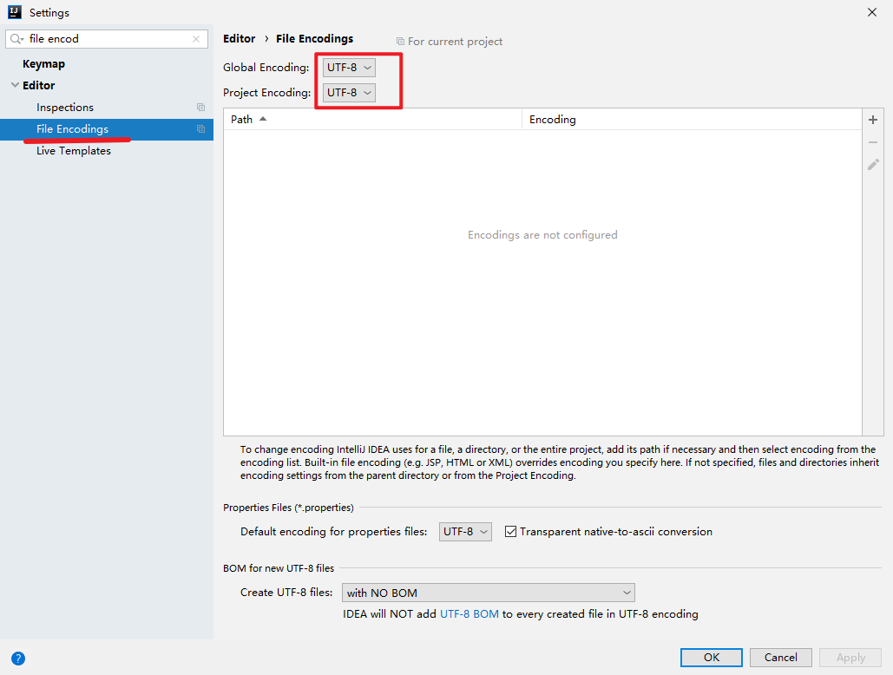
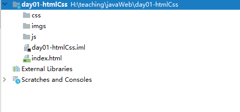

# 学习目标

```markdown
1.能够使用idea创建html文档
2.能够使用h1~h6、hr、p、br 等与文本有关的标签
3.能够使用有序列表ul-li和无序列表ol-li显示列表内容
4.能够使用图片img标签把图片显示在页面中
5.能够使用块标签div与内联标签span
6.能够使用超链接a标签跳转到一个新页面
7.能够使用table、tr、td标签定义表格
8.能够使用表单form标签创建表单容器
9.能够使用表单中常用的input标签创建输入项
```


# 1. Web内容知识介绍(了解)


## 1.1 JavaWeb 的简介

​	使用 Java 技术来开发的互联网项目，一般称之为 JavaWeb 项目。一般来说 Web 的开发一般分为：web客户端和 web服务端两部分。


## 1.2 Web 项目的结构

对于 web 项目结构总体来说分为两种形式：一种为 C/S 结构、一种为B/S 结构。

**1.C/S 结构**

​	解释：C/S(Client/Server) 结构为 客户端和服务端。

​	体现形式：QQ、微信、迅雷等（需要自本地安装）


 <figure class="thumbnails">
    
</figure>


**2.B/S结构** 

​	解释：B/S(Browser/Server) 结构为 浏览器和服务器。

​	体现形式：浏览器通过HTTP地址来和服务器件进行数据交互。


 <figure class="thumbnails">
    
</figure>


## 1.3 B/S内容介绍

在浏览器和服务器间进行数据交互的时候，浏览器获得的内容资源一般分文：静态资源、动态资源。

**1.静态资源**

​	解释：页面中不会改变的内容称之为静态资源。

​	体现形式：图片、文本、视频、音频 等。

​	展示过程：服务器对于静态资源会直接发送给浏览器，浏览器会通过自身的引擎来处理并展示。

**2.动态资源**

​	解释：页面中内容会变化的内容称之为静态资源。

​	体现形式：头条新闻、热搜排行内容等....

​	展示过程：服务器对于动态资源，会对其进行获取数据，获得后将数据转为静态资源并发送给浏览器。

​	实现的技术：JSP/html（JavaEE）、.net、asp、php等。


 <figure class="thumbnails">
    
</figure>

既然我们所学习的动态资源中会涉及到静态资源，所有需要先来了解静态资源内容。

对于静态资源基础内容的学习包含以下三个方面：

​	1.HTML---用于基础页面的构建，展示页面中的内容。

​	2.CSS---用户美化页面，为页面添加布局。

​	3.JavaScript---控制页面中的元素或内容，让页面实现动态的效果。


# 2.HTML


## 2.1 HTML概念（熟知）

HTML(Hyper Text Markup Language) 超文本标记语言。其中有两个词所构成 超文本 和 标记语言。

​	1.超文本：超出文本的范畴，除了有文字的特性，还会有图片、超链接、视频、音频等。

​	2.标记语言：有标签来构成的语言（标记语言不是编程语言）。

HTML 是最基础的网页开发语言。


## 2.2 HTML入门（掌握）

### 2.2.1 创建 Project 

从今天开始，需要创建一个新的工作空间（空工程）。


 <figure class="thumbnails">
    
</figure>


 <figure class="thumbnails">
    
</figure>


 <figure class="thumbnails">
    
</figure>

PS：创建的目录一定要是为空的目录。


- jdk版本必须是1.8


 <figure class="thumbnails">
    
</figure>

- 字符集UTF-8


 <figure class="thumbnails">
    
</figure>


### 2.2.2 创建  static web/javascript（模块）

创建前端 static web（模块）


 <figure class="thumbnails">
    
</figure>


 <figure class="thumbnails">
    
</figure>


 <figure class="thumbnails">
    
</figure>

### 2.2.3 构建项目的目录

对于静态项目基础目录为：

```markdown
|-- 项目名
	|- css 目录(存放CSS资源)
	|- js  目录（存放JavaScript资源） 	
	|- imgs 目录（存放图片资源）
	index.html  项目首页面
```


 <figure class="thumbnails">
    
</figure>

### 2.2.4 HTML页面结构

对于HTML的页面内容都有相应的结构，对于这些结构都是固定的，格式如下：

```html
<!DOCTPYE html>
<html lang="zh">
	<head>
		<title>页面的标题</title>
		<meta charset="utf-8">
	</head>
	<body>
        <font color="red" size='8'>Hello World</font>
    </body>
</html>
```


### 2.2.5 HTML书写规范

**1.文档声明**

要求：必须在第一行，固定格式

```
<!DOCTPYE html>
```


**2.双标签**

```html
如：<h1></h1>
```

**3.单标签**

```html
如：<br/>
```


**4.标签的嵌套**

需要正确嵌套，不能你中有我，我中有你

```html
错误：<a><b></a></b>
正确：<a><b></b></a>
```


**5.标签的属性**

编写的位置：需要在开始标签或者是单标签中进行编写。

编写的形式：以键值对的方式存在，值需要用单引或者双引包括其中。

```html
如：<font color='red'>Hello world</font>
```


**6.文本的编写**

对于 HTML 的普通文字需要编写在 标签中间。

```html
如：<body>Hello world<body>
```


**7.标签的字母**

对于标签中的字母是不会区分大小写的，但官方推荐使用小写字母编写标签。


## 2.3 Html中的常用标签

### 2.3.1.文档基础标签

1. <!DOCTPYE html> ：文档声明标签，必须在文档中的第一行。
2. html ：html文件的根标签。
   1. lang：控制文档的语言（中文--zh，英文--en）
3. head：头部标签，用于设置html的属性或引入外部文件。
4. title：标题标签。
5. meta：元标签，可以设置html文档的属性。
6. body：主体标签，用来在浏览器中展示内容。

```html
<!DOCTPYE html>
<html lang="zh">
	<head>
		<title>页面的标题</title>
		<meta charset="utf-8">
	</head>
	<body>
    	页面中需要展示给用户的信息
    </body>
</html>
```


### 2.3.2. 文本标签


文本标签可以控制html页面中的文字格式已经样式，如下：


 <figure class="thumbnails">
    
</figure>

**1.标题标签 hn**

标签：

```html
<h1>黑马程序员</h1>
<h2>黑马程序员</h2>
<h3>黑马程序员</h3>
<h4>黑马程序员</h4>
<h5>黑马程序员</h5>
<h6>黑马程序员</h6>
```

特点：

​	1.调整字体大小，将字体加粗。

​	2.字体的最后会有换行。

 <figure class="thumbnails">
    
</figure>

**2.水平线标签 hr**

标签：

```html
<hr align='center' size='20' wigth='200' color='red'/>
```

属性：

​	1.align：水平位置

​		center：设置水平线置中

​		left：设置水平线左对齐

​		right：设置水品线右对齐

​	2.size：视频线的高度（默认单位：px 像素）

​	3.width：水平线的宽度

​	4.color：颜色


**3.换行标签 br**

标签：

```html
<br/>
```

特点：

​	1.将内容内容进行换行。


**4.字体加粗标签 b**

标签：

```html
<b>文字内容<b/>
```

特点：

​	1.将页面字体加粗处理。


**5.斜体标签 i**

标签：

```html
<i>文字内容<i/>
```

特点：

​	1.将页面字体倾斜处理。


**6.字体标签 font**

标签：

```html
<font size='3' color='green' >字体内容</font>
```

特点：

​	1.将页面字体倾斜处理。

属性：

​	1.size：字体大小

​	2.color：字体颜色


 <figure class="thumbnails">
    
</figure>

**7.特殊符号**

对于HTML的页面中的内容，有些是较为敏感的字符，如下列：


 <figure class="thumbnails">
    
</figure>

使用特殊字符：以&打头

常用的字符：

```html
1.小于号--&lt；
2.大于号--&gt；
3.英文的空格--&nbsp;
4.中文的空格--&emsp;
5.&符号--&amp;
```


**8.特殊属性的赋值**

1.color属性的值

​	1.英文单词--green，red...

​	2.rgb(数值1，数值2，数值3) --数值的取值范围 0-255（废弃掉，使用第三种方式替代）

​	3.#六位数字（数字为十六进制）-- 每两位表示一种颜色(RGB)，数值的取值范围 00-FF

```html
<font size="3" color="green"  > 东北老八，吃饭顶三  </font><br>
<font size="3" color="rgb(0,0,0)"  > 东北老八，吃饭顶三  </font><br>
<font size="3" color="#00FF00"  > 东北老八，吃饭顶三  </font>
```


2.width属性的值

​	1.像素值px

​		填写百分比会按照，显示器的分辨率的数值大小进行显示。（默认单位）

​	2.百分比%

​		会根据父级容器的大小来展示。

```html
<hr size="20" width="100px" color="red" align="center"/>
<hr size="20" width="50%" color="red" align="left"/>
```


### 2.3.3 图片标签

图片标签可以在页面中将一张图片显示出来。

标签：

```html

```

属性：

​	1.src属性（重点）

​		指定图片的位置，对于图片的位置有两种形式

​			* 本地图片  

```html

```

​			* 网络图片
```html

```
​	2.width属性

​		指定图片的宽度(修改时会自动影响height的值)

​	3.height属性

​		指定图片的高度(修改时会自动影响width值)

​	4.alt属性

​		加载图片失败时，文字信息描述图片

​	5.title属性

​		鼠标悬停会显示图片的信息		


### 2.3.4 超链接标签

标签：

```html
<a href='....' target='...'></a>
```

属性：

​	1.href属性

​		指定跳转的资源，形式有两种

​			* 内部资源的跳转

```html
<a src="./01文件.html" />01文件</a>
```

​			* 外部资源的跳转

```html
<a href="https://timgsa.baidu.com/timg?image&quality=80&size=b9999_10000&sec=1590041812129&di=ef864577ea0bee96a549bab4a3fdec76&imgtype=0&src=http%3A%2F%2Fn.sinaimg.cn%2Fsinacn16%2F740%2Fw1440h900%2F20180416%2Fc681-fzcyxmv4458667.jpg"
  >精美图片</a>
```

​	2.target属性			

​		指定跳转资源打开的方式，其中值有下面几种：

​			* _self 本网页打开（默认）

```html
<a href="http://www.itcast.cn" target="_self">跳转到传智播客首页面</a>
```

​			*_blank  新页面打开

```html
<a href="http://www.itcast.cn" target="_blank">跳转到传智播客首页面</a>
```


### 2.3.5 序列标签

标签：

```html
有序标签
<ol>
  <li>吕布</li>
  <li>小乔</li>
  <li>李白</li>
</ol>
```

```html
无序标签
<ul>
  <li>吕布</li>
  <li>小乔</li>
  <li>李白</li>
</ul>
```


 <figure class="thumbnails">
    
</figure>

### 2.3.6 DIV和span标签

标签：

```html
<div>........</div>
```

```html
<span>.......</span>
```

特点：

​	1.div为块级元素，默认会占据一行空间。

​	2.span为行内元素，会在一行中显示内容。

代码：

```html
<!-- span 为行内元素，内容会在一行中进行显示 -->
<span style="background-color: bisque"> 传智播客 </span>
<span> 黑马程序员 </span>
<hr>
<!-- div为块级元素,默认会占据一行的空间 -->
<div style="background-color: bisque">传智播客</div>
<div>黑马程序员</div>
```


 <figure class="thumbnails">
    
</figure>

### 2.3.7 表格标签

标签：

```html
<table>
  <tr>
    <td></td>
  </tr>
</table>
```

标签解释：

1.table标签-表格标签

​	属性:

​		1.border--设置表格的边框宽度

​		2.align--表格的水平位置（left-默认、center、right）

​		3.bgcolor--表格的背景色

​		4.cellpadding--设置单元格中的内容和单元格边框的距离

​		5.cellspacing--设置单元格之间的距离

2.tr标签-表格行级标签

​	属性：

​		1.align--设置表格行中内容的水平位置

​		2.bgcolor--设置表格行级的背景色

3.th标签--表格头标签

​	使用th的单元行的内容将置中并文件加粗显示。

4.td标签-表格单元格标签

​	属性：

​		1.rowspan--跨行单元格合并（从上到下合并）

​		2.colspan--跨列单元格合并（从左到右合并）

```html
<!-- 表格 -->
<table align="center" bgcolor="#ffe4c4" border="1" cellpadding="0" cellspacing="0" width="500">
  <tr>
    <th>序号</th>
    <th>姓名</th>
    <th>性别</th>
    <th>年龄</th>
  </tr>
  <tr align="center">
    <td>1</td>
    <td>小明</td>
    <td>不详</td>
    <td>18</td>
  </tr>
  <tr align="center">
    <td>2</td>
    <td>小红</td>
    <td>女</td>
    <td>16</td>
  </tr>
</table>
<hr>
<!-- 合并单元格表格 -->
<table align="center" bgcolor="#ffe4c4" border="1" cellpadding="0" cellspacing="0" width="500">
  <tr>
    <th rowspan="2">序号</th>
    <th>姓名</th>
    <th>性别</th>
    <th>年龄</th>
  </tr>
  <tr align="center">
    <td>小明</td>
    <td>不详</td>
    <td>18</td>
  </tr>
  <tr align="center">
    <td>2</td>
    <td>小红</td>
    <td colspan="2">女</td>
  </tr>
</table>
```


 <figure class="thumbnails">
    
</figure>


### 2.3.8 表单标签

页面中的表达的作用：

1. 采集用户数据
2. 发送数据到服务器端（java服务器）

PS：在表单中的数据是存在范围的，如果操作的表单的范围，那么无法获得用户的数据。


 <figure class="thumbnails">
    
</figure>

**1.表单标签 form**

标签：

```html
<form action="#" method="get">
    账号：<input type="text" name="account"><br>
    密码：<input type="text" name="password"><br>
    <input type="submit" value="提交">
</form>
```

特点：

​	1.在form表单中的表单项数据会被提交到服务器中，超出form标签的无法提交。

​	2.对于提交的数据会以键值对的形式进行提交数据（k=v/k:v）

属性：

​	1.action：要将表单数据提交的服务器地址。

​	2.method: 提交数据的方法         

​		-get方式（默认）       

​			get方式会将参数和值填写到浏览器地址里来发送客户端数据。  

​		-post方式

​			post方式会将参数和值通过请求体来发送数据。

form中的表单项有三大类型：

​	1.input表单项

​	2.select表单项

​	3.textarea表单项


通过表单项可以展现出下面的形式（样式可以忽略掉）


 <figure class="thumbnails">
    
</figure>

**2.表单项标签input**

标签：

```html
<input type="...." name="account"><br>
```

特点：

​	1.用来或用户在页面中填写的数据。

​	2.可以通过type属性来展现出不同的形式。

属性：

​	1.type：设置input的展示形式。

​		-text 填写文本内容

​		-password 填写密码

​		-radio 单选框    

​			单选框要实现多个内容只能选择一个，那么所有的单选框的name值必须是一致

​		-checkbox 多选框    

​			多选框要实现多个内容可以选择多个，那么所有的单选框的name值必须是一致

​		-file 上传文件    

​			向服务器上传本地文件数据

​		-date 日期    

​			向服务器提交时间数据

​		-email 邮箱地址

​		-number 只能填写数值类型数据

​		-reset 将表单数据内容清除，并给表单数据设置默认值

​		-submit 提交按钮，将表单中的数据提交到服务器端

​	2.name：设置表单项的名称，提交数据时，会将那么的值作为key值

​	3.value：设置表单项的值，提交数据时，会将表单项中的填写内容作为value值

​	4.placehodler：设置表单项的显示数据，当表单项中的内容为空时，会显示出来，如果表单项中的内容不为空，则自动消失。

​	5.checked 将用户的选择内容设置默认值


**2.表单项标签select**

标签：

```html
<select name="" >
    <option value=""></option>
    <option value=""></option>
    <option value=""></option>
    <option value=""></option>
</select>
```

特点：

​	1.用来或用户在页面中填写的数据。

​	2.可以通过type属性来展现出不同的形式。

select 属性：

​	name：设置下拉列表的name值

option属性：

​	value: 设置列表项的值

​	selected：设置下拉列表的默认值


3.表单项标签 textarea

标签：

```html
<textarea name="intro" cols="30" rows="10" ></textarea>
```

属性：

​	1.cols：指定列数，每一行有多少个字符
	2.rows：默认多少行。


# 3.CSS

## 3.1 CSS的概念

CSS为层叠样式表（Cascading Style Sheet），CSS 能够对网页中元素位置的排版进行像素级精确控制，支持几乎所有的字体字号样式，拥有对网页对象和模型样式编辑的能力。 

作用：美化页面。

> 层叠样式: 对同一个标签添加多个不同的样式,所有样式会叠加在一起展示出效果

```HTML
<!DOCTYPE html>
<html lang="en">
<head>
  <meta charset="UTF-8">
  <title>css初体验</title>

  <style>
    font {
      color: red;
    }
    h1{
      font-size: 50px;
    }
  </style>

</head>
<body>
  <font>传智播客</font>
  <font>黑马程序员</font>


  <h1>欧力给</h1>
  <h1>欧力给</h1>
    
</body>
</html>
```

通过上面的代码可以看到CSS好处：

​	1.html页面内容和页面的样式分离，代码的复用性高。
	2.前端代码编写进行解耦，HTML代码构建页面内容，CSS给页面添加样式，分工明确。


## 3.2 CSS的引入

对于 CSS 在 HTML 页面中的引入，会有三种方式：

​	1.行内样式

​	2.内部样式

​	3.外部样式


**1.行内样式**

方式：在html标签中，通过style属性来设置css样式

作用范围：当前标签中生效

```html
<font style="font-size: 15px;color: greenyellow">传智播客</font>
```

PS:行内样式不推荐使用，因为它破坏了页面内容的分离（页面内容和页面样式）。


**2.内部样式**

方式：在head标签中来声明 style标签，并在其中指定CSS样式

作用范围：当前的页面中所有符合条件的内容都会生效

```html
  <style>
    font {
      font-size: 20px;
      color: red;
    }
  </style>
  <font>传智播客</font>
  <font>黑马程序员</font>
```


**3.外部样式**

方式：在head标签中来声明 link标签，将外部的CSS样式文件进入到当前的HTML文件中。
作用范围：被引入的html文件都会生效

外部文件内容：02-css.css（css外部文件的后缀为：css）

```css
font {
    font-size: 20px;
    color: greenyellow;
}
```


HTML页面内容：

```html
<link rel="stylesheet" href="css/02-css.css">
  <font>传智播客</font>
  <font>黑马程序员</font>
```

PS：CSS的内部样式和外部样式编写位置是没有限制的，但是按照规范一般编写在head标签中。


## 3.3 CSS编写的规范

CSS样式编写规范如下格式：

```yacas
选择器 {
    css属性1 ：css属性值1；
    css属性2 ：css属性值2；
    css属性3 ：css属性值3；
}
```

1. 样式值多个单词用空格分割 border: 1px solid blue (宽度 实线 颜色)
2. 多个样式之间，以分号分割


## 3.4 CSS选择器

### 3.4.1 基础选择器

CSS的基础选择器有三个：id选择器，class选择器，标签选择器。

**1.id选择器**
  	语法：#id的值 {....}
  	作用范围：找到符合条件的 id 值，对其进行 css 渲染。
  	PS：页面中可以对多个符合条件的 id 值进行CSS渲染，但是在前端开发规范中，id的的一定要唯一。

```HTML
#div1 {
  font-size: 50px;
  color: greenyellow;
}
<div id="div1" class="div1">大威天龙</div>
```


**2.class选择器**
  语法：.class名称 {....}
  作用范围：找到符合条件的 class 的值，会对其进行 css 渲染。
  PS：页面中可以存在多个 class 一样的值。

```HTML
.div1 {
  font-size: 50px;
  color: greenyellow;
}
<div id="div1" class="div1">大威天龙</div>
```


**3.标签选择器**
  语法：页面标签名称 {....}
  作用范围：找到对应的标签，会对其进行 css 渲染。

```HTML
div {
  font-size: 50px;
  color: greenyellow;
}
<div id="div1" class="div1">大威天龙</div>
```


**4.基础选择器的优先级**

CSS基础选择器是有优先级的
  id选择器 > class 选择器 > 标签选择器
  PS:
      1.对于选择器的优先级，如果不同的选择器中设置同一个css样式，优先级高选择器中的css样式生效。
      2.对于选择器的优先级，如果不同的选择器中设置不同的css样式，css样式会信息叠加效果。

```html
#div1 {
  font-size: 50px;    /*优先级高，生效*/
  color: greenyellow; /*css样式叠加 */
}
.div1 {
  font-size: 30px;   /*优先级低，无效*/
  border: 1px solid black; /*css样式叠加 */
}
<div id="div1" class="div1">大威天龙</div>
```


### 3.4.2  扩展选择器

下面将介绍的扩展选择器有下面五种

​	1.所有选择器。

​	2.并集选择器

​	3.子类选择器

​	4.父类选择器

​	5.属性选择器


**1.所有选择器**

​	语法：* {}
	作用：给所有的html的元素添加css样式

```css
* {
      border: 1px solid black;
   }
```


**2.并集选择器**
语法：选择器1,选择器2,.. {}
作用：给多个html的元素添加相同的css样式

``` css
#div1, #div2 {
    font-size: 30px;
}
<div class="div1" id="div1">大威天龙</div>
<div class="div2" id="div2">接着奏乐，接着舞</div>
```


**3.子类（后代）选择器**
语法：父选择器1 子选择器
作用：给父级选择器的子选择器添加css样式

```css
#div4 span {
        color: red;
}
<div id="div4">
  <span> 你好讨厌 </span>
</div>
```


**4.父类选择器**
语法：父选择器>子选择器
作用：给子选择器的父选择器添加css样式

```css
div > #in_span {
    border: 1px solid blue;
}
<div>
  <span id="in_span"> 品如的衣柜 </span>
</div>
```


**5.属性选择器**
语法：选择器[属性名称=属性值]
作用：给指定的元素添加css样式

```css
span[id='indeep_span'] {
    color: green;
    font-weight: bold;
}
<span id="indeep_span" >你能给我添加个样式吗</span>
```


## 3.5 CSS常用的属性

对于CSS常用属性有一下五种：

​	1.文本属性

​	2.背景属性

​	3.边框

​	4.尺寸

​	5.显示属性

​	6.盒子模型

**1.文本属性**

​	作用：用来控制 html 中文本的css样式

​	属性：

​		1.color--设置字体颜色

​		2.font-size--设置字体的大小

​		3.text-align--设置字体的水平位置

​		4.line-height--设置字体所在行的行高

```CSS
#div1 {
  color: red;
  font-size:20px ;
  text-align: center;
  line-height: 50px;
}
```


**2.背景属性**

​	作用：用来控制页面元素的背景内容

​	属性：background 

​		    background：背景颜色 背景图片 背景图片平铺方式 背景图的固定方式 背景图的水平位置

​	PS：背景颜色 背景图片 两者会选择其一。

```CSS
body {
      background: url("imgs/register_bg.png")  repeat-x fixed center;
    }
```


**3.边框属性和尺寸属性**

​	作用：用来控制页面元素的边框和尺寸

​	边框属性：border

​		    border：边框的粗度 边框样式 边框的颜色

​	尺寸属性：width/height

```css
div {
  width: 500px;
  height: 400px;
  border: 2px solid black;
}
<div></div>
```


**5.显示属性**

​	作用：用来设置html元素在页面中显示样式

​	属性：display		

​		    值1：block  此元素将显示为块级元素，此元素前后会带有换行符。

​		    值2：inline  此元素会被显示为内联元素，元素前后没有换行符。

​		    值3：none 此元素不会被显示。


```css
 div {
   display: inline;
 }
 span {
   /*display: block;*/
   display: none;
 }
<div>div显示内容1</div>
<div>div显示内容2</div>
<div>div显示内容3</div>
<div>div显示内容4</div>
<span>span显示内容1</span>
<span>span显示内容2</span>
<span>span显示内容3</span>
<span>span显示内容4</span>
```


**6.盒子模型**

Html页面中的标签都可以看成是一个盒子，盒子模型主要是来控制页面中元素的布局。

盒子模型原型图：

 <figure class="thumbnails">
    
</figure>

盒子模型的主要元素（五大元素）：

​	1.width 盒子的宽度

​	2.height 盒子的高度

​	3.border 盒子的边框

​	4.margin 盒子和外面的元素的边距（外边距）

​	5.padding 盒子边框和盒子内容的距离（内边距）


属性:

​	1.margin 外边距

​		margin-left：左外边距

​		margin-bottome：底外边距

​		margin-right：右外边距

​		margin-top：顶外边距

​	2.padding 内边距

​		padding-left：左内边距

​		padding-bottome：底内边距

​		padding-right：右内边距

​		padding-top：顶内边距

​	3.box-sizing 设置某区域中的元素尺寸

​		border-box：固定元素的高和宽。