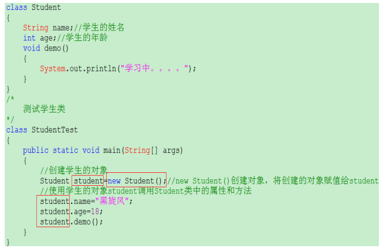
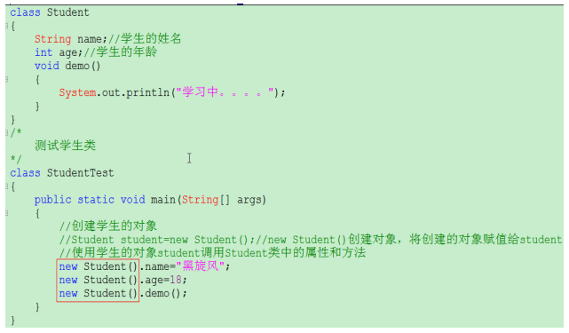
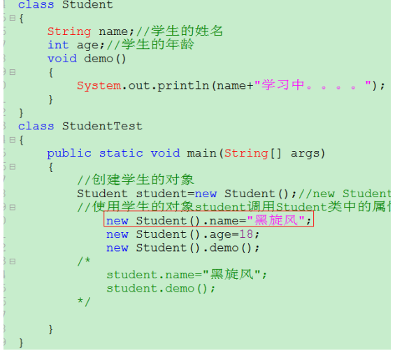
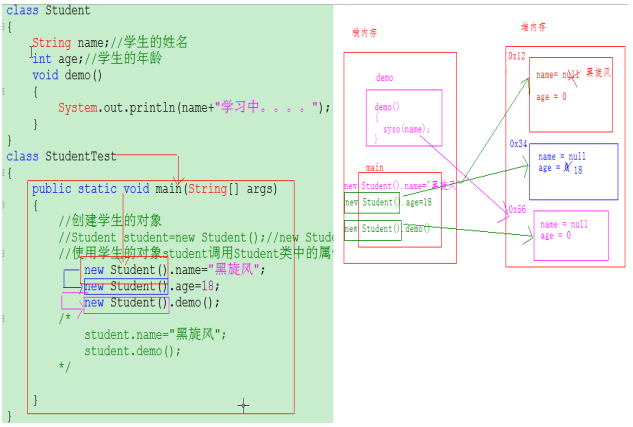
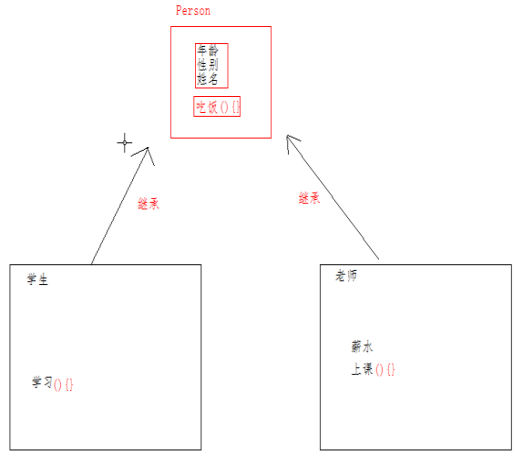
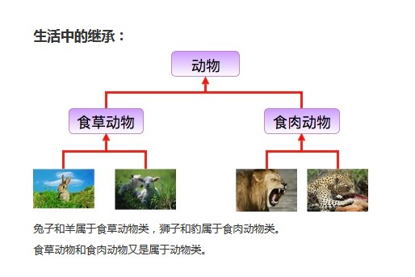
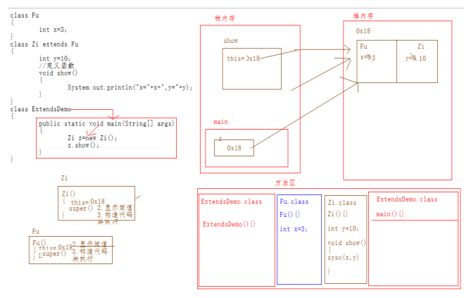
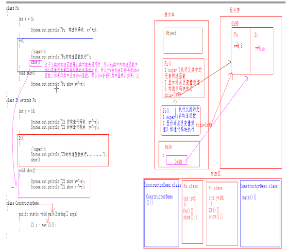
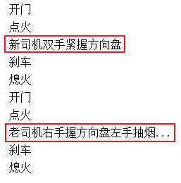

# 第一章 复习回顾

[](https://www.npmjs.com/package/docsify-themeable)
[](https://www.codacy.com/app/jhildenbiddle/docsify-themeable?utm_source=github.com&amp;utm_medium=referral&amp;utm_content=jhildenbiddle/docsify-themeable&amp;utm_campaign=Badge_Grade)
[](https://github.com/jhildenbiddle/docsify-themeable/blob/master/LICENSE)
[](https://www.jsdelivr.com/package/npm/docsify-themeable)
[](https://twitter.com/intent/tweet?url=https%3A%2F%2Fgithub.com%2Fjhildenbiddle%2Fdocsify-themeable&hashtags=css,docsify,developers,frontend)
<a class="github-button" href="https://github.com/jhildenbiddle/docsify-themeable" data-icon="octicon-star" data-show-count="true" aria-label="Star jhildenbiddle/docsify-themeable on GitHub">Star</a>

## 1.1 如何定义类

类的定义格式如下:

```java
修饰符 class 类名{
    // 类中的五大成分。之前学习三个成分
    // 1.成员变量（属性）
    // 2.成员方法 (行为) 
    // 3.构造器 （初始化类的对象数据的）
}
```

## 1.2 如何通过类创建对象

```java
类名 对象名称 = new 类名();
```

例如:

```java
Student stu = new Student();
```

## 1.3 封装

#### 1.3.1 封装的步骤

1.使用 `private` 关键字来修饰成员变量。

2.使用`public`修饰getter和setter方法。

#### 1.3.2 封装的步骤实现

1. private修饰成员变量

```java
public class Student {
    private String name;
    private int age;
}
```

2. public修饰getter和setter方法

```java
public class Student {
    private String name;
    private int age;

    public void setName(String n) {
      	name = n;
    }

    public String getName() {
      	return name;
    }

    public void setAge(int a) {
            age = a;
    }

    public int getAge() {
      	return age;
    }
}
```

## 1.4 构造器

### 1.4.1 构造器的作用

通过调用构造器可以返回一个类的对象，构造器同时负责帮我们把对象的数据（属性和行为等信息）初始化。

### 1.4.2 构造器的格式

```java
修饰符 类名(形参列表) {
    // 构造体代码，执行代码
}
```

### 1.4.3 构造器的应用

首先定义一个学生类，代码如下：

```java
public class Student {
    // 1.成员变量
     String name;
     int age;

    // 2.构造器
    //无参构造器
    public Student() {
		System.out.println("无参数构造器被调用")；
    }
}
```

接下来通过调用构造器得到两个学生对象。

```java
public class CreateStu02 {
    public static void main(String[] args) {
        // 创建一个学生对象
        // 类名 变量名称 = new 类名();
        Student s1 = new Student();
        // 使用对象访问成员变量，赋值
        s1.name = "张三";
        s1.age = 20 ;

        // 使用对象访问成员变量 输出值
        System.out.println(s1.name);
        System.out.println(s1.age); 

        Student s2 = new Student();
        // 使用对象访问成员变量 赋值
        s2.name = "李四";
        s2.age = 18 ;
        System.out.println(s2.name);
        System.out.println(s2.age);
    }
}
```

## 1.5 this关键字的作用

### 1.5.1 this关键字的作用

this代表所在类的当前对象的引用（地址值），即代表当前对象。

### 1.5.2 this关键字的应用

#### 1.5.2.1 用于普通的gettter与setter方法

this出现在实例方法中，谁调用这个方法（哪个对象调用这个方法），this就代表谁（this就代表哪个对象）。

```java
public class Student {
    private String name;
    private int age;

    public void setName(String name) {
      	this.name = name;
    }

    public String getName() {
      	return name;
    }

    public void setAge(int age) {
        if (age > 0 && age < 200) {
            this.age = age;
        } else {
            System.out.println("年龄非法！");
        }
    }

    public int getAge() {
      	return age;
    }
}
```

#### 1.5.2.2 用于构造器中

this出现在构造器中，代表构造器正在初始化的那个对象。

```java
public class Student {
    private String name;
    private int age;
    
    // 无参数构造方法
    public Student() {} 
    
    // 有参数构造方法
    public Student(String name,int age) {
    	this.name = name;
    	this.age = age; 
    }
}
```

## 1.6 匿名对象【理解】

### 概念

需求：

1、创建一个学生的类Student，并在Student类中定义两个属性name和age。

2、在Student类中定义一个函数demo()。

3、定义一个测试学生类的类StudentTest。


<figure class="thumbnails">
    
</figure>

Student：是一个类。描述的是学生这个事物

student：类所创建的对象名(实例名)

匿名对象：就是指没有名称的对象。创建对象时，只有创建对象的语句，却没有把对象地址值赋值给某个变量。虽然是创建对象的简化写法，但是应用场景非常有限。

格式：

```java
new 类名(参数列表)；
```

举例：

```java
new Scanner(System.in)；
new Student();
```


### 匿名对象应用场景


<figure class="thumbnails">
    
</figure>

说明：匿名对象是指创建对象时，只有创建对象的语句，却没有把对象地址值赋值给某个变量。

### **匿名对象的局限性**


<figure class="thumbnails">
    
</figure>


上述代码结果：

null 学习中。。。。。

出现以上问题的原因如下图所示：

**注意：只要在程序中使用new关键字创建对象，那么在堆中都会有一个新的对象产生。**


<figure class="thumbnails">
    
</figure>

**注意：匿名对象通常是在对象只需要访问成员一次的情况下使用**

**如果对象需要多次的操作成员，就不能使用匿名对象来访问。**

注意：匿名对象可以简化代码的书写，但是匿名对象一旦使用结束，这时这个对象就立刻变成垃圾。

如果对象只使用一次，这时可以采用匿名对象，如果这个对象要使用多次，必须给对象起名。

### **匿名对象作为参数传递(理解)**

需求：

1）定义一个Person类，在这个类中定义人的名字和年龄，并定义一个说话的功能;

2）再定义一个测试Person类的类PersonTest，在PersonTest类中定义一个功能，给所有的Person类的对象下的属性name和age进行相同数据的赋值，并调用Person类中的说话的方法。

```java
class Person
{
	String name;
	int age;
	void say()
	{
		System.out.println(name+"哇哇哇哇叫"+age);
	}
}
class PersonTest1 
{
	public static void main(String[] args) 
	{
		//创建person对象
		/*Person person =new Person();
		demo(person);
		Person person1 =new Person();
		demo(person1);
		Person person2 =new Person();
		demo(person2);
		上述程序中创建的Person对象的引用，仅仅是为了把对象传递给demo函数，
		这时也可以使用匿名对象传递对象
		*/
		demo(new Person());
	}
	/*
		定义一个函数给Person类中的属性赋值，并调用Person类中的方法
	*/
	public static void demo(Person p)//Person p=new Person();
	{
		p.name="baby";
		p.age=1;
		p.say();
	}
}
```


# 第二章 继承(掌握)

## 2.1继承概述

### 2.1.1 继承引入

面向对象语言三大基本特征：

**封装（private）、继承(extends)、多态**

Java中的类是描述生活中的任何事物的。而在生活中任何事物之间必然会存在一些联系。那么我们在前面学习的过程中，仅仅只是在描述单个的事物，并没把握事物和事物之间的关系。

接下来我们要研究的是如何通过Java中的类，展示所描述的事物和事物之间的关系。

一般事物和事物之间会有继承的关系。在Java中我们的类就是描述事物的，那么也就是说我们的类之间也应该存在继承的关系。

需求：

分别描述学生和老师两个类。

学生：

​	    属性：年龄、性别、姓名

​		行为：学习、吃饭 

定义构造函数给属性初始化

老师：

​	属性：年龄、性别、姓名、薪水

​	行为：上课、吃饭

定义构造函数给属性初始化.

代码如下所示：

```java
/*
学生：
	属性：年龄、性别、姓名
	行为：学习、吃饭
*/
class Student
{
	String name;
	int age;
	String sex;

	Student( String name , int age , String sex )
	{
		this.name = name;
		this.age  = age;
		this.sex = sex;
	}
	//行为
	void study()
	{
		System.out.println(name+"在 学习 java ......");
	}

	void eat()
	{
		System.out.println("吃饭.......");
	}
}
/*
老师：
	属性：年龄、性别、姓名、薪水
	行为：上课、吃饭
*/
class Teacher
{
	String name;
	int age;
	String sex;
	double salary;

	Teacher( String name , int age , String sex , double salary )
	{
		this.name = name;
		this.age = age;
		this.sex = sex;
		this.salary = salary;
	}

	void teach()
	{
		System.out.println(name+"正在讲 Java....");
	}
	void eat()
	{
		System.out.println("吃饭.......");
	}
}
```

上述程序在描述学生和老师这2类事物，但是学生和老师这两类事物中有共同的属性和行为，我们应该只描述一次就可以了，然后让学生和老师共享这些属性和行为。

把学生和老师中的共性行为和属性进行抽取。抽取到哪里合适呢？

在描述事物的时候，发现描述的两个事物之间没有继承的关系，但是2个事物之间有共同的属性和行为，那么我们就找这2个事物的共同祖先。

学生和老师，没有继承关系，但是学生和老师都属于人这类事物。那么我们就可以把学生和老师的共性内容抽取到人这个类中，然后让学生和老师与人这个类产生关系即可。


<figure class="thumbnails">
    
</figure>


<figure class="thumbnails">
    
</figure>


其中，多个类可以称为**子类**，单独被继承的那一个类称为**父类**、**超类（superclass）**或者**基类**。

### 2.1.2 继承的含义

继承描述的是事物之间的所属关系。例如，兔子属于食草动物，食草动物属于动物。可见，父类更通用，子类更具体。我们通过继承，可以使多种事物之间形成一种关系体系。

**继承**：就是子类继承父类的**属性**和**行为**，使得子类对象可以直接具有与父类相同的属性、相同的行为。子类可以直接访问父类中的**非私有**的属性和行为。


### 2.1.3 Java中的继承体现

需求：把学生和老师中的共性内容抽取到人这个类中

然后分别建立学生、老师和人的关系，可以让学生和老师使用人类中的属性和方法。

怎么建立Person类和Student类还有Teacher类之间的关系？

   在java中使用关键字extends 建立类和类之间的关系，extends在java中表示继承的意思。

关键字extends的使用格式：

~~~java
classs  类1  extends  类2
{     
       //代码
}
~~~


说明：类1叫做子类。类2叫做父类

代码如下：

```java
/*
	把学生和老师中的共性内容抽取到人这个类中

*/
class Person
{
	String name;
	int age;
	String sex;

	void eat()
	{
		System.out.println("吃饭.......");
	}
}
/*
学生：
	属性：年龄、性别、姓名
	行为：学习、吃饭

*/
class Student extends Person
{
	Student( String name , int age , String sex )
	{
		this.name = name;
		this.age  = age;
		this.sex = sex;
	}
	//行为
	void study()
	{
		System.out.println(name+"在 学习 java ......");
	}
}
/*
老师：
	属性：年龄、性别、姓名、薪水
	行为：上课、吃饭
*/

class Teacher extends Person
{
	double salary;

	Teacher( String name , int age , String sex , double salary )
	{
		this.name = name;
		this.age = age;
		this.sex = sex;
		this.salary = salary;
	}

	void teach()
	{
		System.out.println(name+"正在讲 Java....");
	}
}


class ExtendsDemo2 
{
	public static void main(String[] args) 
	{
		Student s = new Student("张三",23,"男");
		s.eat();
		s.study();

		Teacher t = new Teacher("黑旋风",28,"男",9999.99);
		t.eat();
		t.teach();
	}
}
```

Java中的继承代码体现：

当某个类需要继承其他类的时候，在当前定义这个类的地方使用 extends 关键字，然后让这个类去继承需要继承的其他类。

这时被继承的类称为 父类。  实现继承的这个类称为 子类。

例如：

~~~java
 classs  类1 **extends**  类2
{     
       //代码
 }
~~~


类2就是父类，类1就是子类。 

**在Java的继承语法中，只要使用extends 关键字 任何2个类之间都可以完成继承。但是我们在写程序的时候，一定要心里清楚2个类之间有没有联系，能不能继承。**


### 2.1.4 继承的好处

1. 提高**代码的复用性**（减少代码冗余，相同代码重复利用）。
2. 使类与类之间产生了关系。


### 2.1.5 小结

1.继承实际上是子类相同的属性和行为可以定义在父类中，子类特有的属性和行为由自己定义，这样就实现了相同属性和行为的重复利用，从而提高了代码复用。

2.子类继承父类，就可以直接得到父类的成员变量和方法。是否可以继承所有成员呢？请看下节！


## 2.2 子类不能继承的内容

### 2.2.1 引入

并不是父类的所有内容都可以给子类继承的：

**子类不能继承父类的构造器，因为子类有自己的构造器。**

**值得注意的是子类可以继承父类的私有成员（成员变量，方法），只是子类无法直接访问而已，可以通过getter/setter方法访问父类的private成员变量。**

### 2.2.2 演示代码

```java
class Fu {
    public int num1 = 10;
    private int num2 = 20;

    public void show1() {
        System.out.println("show1");
    }

    private void show2() {
        System.out.println("show2");
    }

    public int getNum2() {
        return num2;
    }

    public void setNum2(int num2) {
        this.num2 = num2;
    }
}

class Zi extends Fu {
}
public class Demo03 {
    public static void main(String[] args) {
        Zi z = new Zi();
        System.out.println(z.num1);
//		System.out.println(z.num2); // 私有的子类无法使用
        // 通过getter/setter方法访问父类的private成员变量
        System.out.println(z.getNum2());

        z.show1();
        // z.show2(); // 私有的子类无法使用
    }
}

```

## 2.3 继承中的特点

1、Java只支持单继承，不支持多继承。

说明：

单继承：一个子类只能有一个父类。**支持**

多继承：一个子类可以有多个父类。**不支持**

```java
//一个类只能有一个父类，不可以有多个父类。
class C extends A{} 	//ok
class C extends A，B...	//error
```

2、Java支持多重继承(继承体系)。

说明：多重继承也叫做多层次继承

```java
class A{}
class B extends A{}
class C extends B{}
```

> 顶层父类是Object类。所有的类默认继承Object，作为父类。


## 2.4 继承后的特点——成员变量

学习继承：围绕 类中的成员变量  、**成员函数** 、 构造函数的变化。

当类之间产生了继承关系后，其中各类中的成员变量，又产生了哪些影响呢？

需求：

1、分别定义一个父类和一个子类，让子类继承父类；

2、在父类中定义一个非静态成员变量x，并赋值为3；

3、在子类中定义一个非静态成员变量y,并赋值为10，同时定义一个一般非静态函数show,在这个函数中输出父类的成员变量x和子类的成员变量y的值；

4、定义一个测试类，在这个测试类中创建子类的对象，并使用子类的对象调用子类中的函数show。

```java
//继承中成员变量的特点：
class Fu
{
	int x = 3;
  Fu()
	{
		System.out.println("this"+this);
	}
}

class Zi extends Fu
{
	int y = 10;

	void show()
	{
		System.out.println("x="+x+",y="+y);
	}
   Zi()
	{
		System.out.println("this"+this);
	}
}

class ExtendsDemo3 
{
	public static void main(String[] args) 
	{
		Zi z = new Zi();
		z.show();
	}
}
```

在上述程序中 Zi 类 继承 Fu 类，在测试的程序中 我们仅仅只创建了 Zi类的对象，而没有创建Fu类的对象，但是在程序运行的过程中，使用到了Fu类中的成员变量，说明在程序中一定给Fu类的成员变量开辟了空间。

当子类继承了父类，在创建子类对象的时候，堆中的子类对象中会划分出一片空间来保存父类中的成员变量。

上述代码图解分析：


<figure class="thumbnails">
    
</figure>


注意：加载到方法区的顺序：在jvm加载子类的时候，jvm会发现子类的字节码文件里面有一个extends标识，所以jvm会先将父类加载到方法区中，然后再将子类加载到方法区中。

上述代码创建子类对象，给堆中Zi类和Fu类中的成员变量分别隐式初始化值后，创建好的对象会去调用子类的无参构造函数，在执行无参构造函数里面的代码之前，**会先执行隐式三步，即调用父类中的构造函数super().**

在执行父类中构造函数的时候，同样也有隐式三步，那么父类中的super(),会去调用所有类的上帝类Object类，然后第二步给父类中成员变量x显示赋值，由于没有代码块，然后jvm回到子类构造函数中继续执行隐式第二步。

即给子类中成员变量y显示初始化值，由于子类也没有构造代码块，那么jvm会开始执行子类构造函数内容。

### 2.4.1 成员变量重名

子父类中出现了同名的成员变量，如何在子类中访问父类的成员变量？

如果在子类中要访问父类中的成员变量，可以使用super关键字。在Java中super关键字主要是用来在子类中去访问父类的内容。

super有两个作用：

​		1) super.父类成员（变量，函数）super.x  super.show()

​		2) super(参数); 访问父类的构造函数

需求：

1、分别定义一个父类和一个子类，让子类继承父类；

2、在父类中定义一个成员变量x，并赋值为3；

3、在子类中定义一个成员变量x,并赋值为10，同时定义一个一般非静态函数show,在这个函数中再定义一个局部变量 x并赋值为111，在show函数中先输出父类的成员变量x和子类的成员变量x的值；

4、最后在屏幕上输出父类成员变量、子类成员变量和子类局部变量的值；

4、定义一个测试类，在这个测试类中创建子类的对象，并使用子类的对象调用子类中的函数show。

```java
//继承中子父类中出现同名的成员变量：
class Fu
{
	int x = 3;
}
class Zi extends Fu
{
	int x = 10;
	void show()
	{
       //定义一个局部变量
		int x = 111;
       /*
			如果子类和父类中的成员变量同名，怎样去访问父类中的成员?
			使用super关键字
		*/
       //在屏幕上打印父类中成员变量和子类中的成员变量
       //System.out.println("super.x="+super.x+”,x=”+x);
		System.out.println("局部变量x="+x);
		System.out.println("成员变量x="+this.x);
		System.out.println("父类成员变量x="+super.x);
      
	}
}
class ExtendsDemo4 
{
	public static void main(String[] args) 
	{
		Zi z = new Zi();
		z.show();
	}
}
```


需要注意的是：

​	**1.super代表的是父类的引用，也可以理解为是一个标记，标记哪个是父类。this代表的是当前对象的引用。**

​	2.当子父类中存在一模一样的成员变量时，子类对象优先使用属于子类对象自己的成员变量，

​		如果想要让子类中使用父类的成员变量，需要使用关键字：super.父类成员变量名;


> 小贴士：Fu 类中的成员变量是非私有的，子类中可以直接访问。若Fu 类中的成员变量私有了，子类是不能直接访问的。通常编码时，我们遵循封装的原则，使用private修饰成员变量，那么如何访问父类的私有成员变量呢？可以在父类中提供公共的getXxx方法和setXxx方法。


## 2.5 继承后的特点—成员方法(很重要)

当类之间产生了关系，其中各类中的成员方法，又产生了哪些影响呢？

### 1 成员方法不重名

如果子类父类中出现**不重名**的成员方法，这时的调用是**没有影响的**。对象调用方法时，会先在子类中查找有没有对应的方法，若子类中存在就会执行子类中的方法，若子类中不存在就会执行父类中相应的方法。代码如下：

```java
class Fu {
	public void show() {
		System.out.println("Fu类中的show方法执行");
	}
}
class Zi extends Fu {
	public void show2() {
		System.out.println("Zi类中的show2方法执行");
	}
}
public  class Demo05 {
	public static void main(String[] args) {
		Zi z = new Zi();
     	//子类中没有show方法，但是可以找到父类方法去执行
		z.show(); 
		z.show2();
	}
}
```


## 2.6 方法重写

### 2.6.1 概念

**方法重写** ：子类中出现与父类一模一样的方法时（返回值类型，方法名和参数列表都相同），会出现覆盖效果，也称为重写或者复写。**声明不变，重新实现**。

### 2.6.2 使用场景与案例

发生在子父类之间的关系。
子类继承了父类的方法，但是子类觉得父类的这方法不足以满足自己的需求，子类重新写了一个与父类同名的方法，以便覆盖父类的该方 法。

例如：我们定义了一个动物类代码如下：

```java
public class Animal  {
    public void run(){
        System.out.println("动物跑的很快！");
    }
    public void cry(){
        System.out.println("动物都可以叫~~~");
    }
}
```

然后定义一个猫类，猫可能认为父类cry()方法不能满足自己的需求

代码如下：

```java
public class Cat extends Animal {
    public void cry(){
        System.out.println("我们一起学猫叫，喵喵喵！喵的非常好听！");
    }
}

public class Test {
	public static void main(String[] args) {
      	// 创建子类对象
      	Cat ddm = new Cat()；
        // 调用父类继承而来的方法
        ddm.run();
      	// 调用子类重写的方法
      	ddm.cry();
	}
}
```

### 2.6.3 @Override重写注解

- @Override:注解，重写注解校验！

- 这个注解标记的方法，就说明这个方法必须是重写父类的方法，否则编译阶段报错。

- 建议重写都加上这个注解，一方面可以提高代码的可读性，一方面可以防止重写出错！

  加上后的子类代码形式如下：

  ```java
  public class Cat extends Animal {
       // 声明不变，重新实现
      // 方法名称与父类全部一样，只是方法体中的功能重写写了！
      @Override
      public void cry(){
          System.out.println("我们一起学猫叫，喵喵喵！喵的非常好听！");
      }
  }
  ```

### 2.6.4 注意事项

1. 方法重写是发生在子父类之间的关系。
2. 子类方法覆盖父类方法，必须要保证权限大于等于父类权限。
3. 子类方法覆盖父类方法，返回值类型、函数名和参数列表(参数类型)都要一模一样。

## 2.7 继承后的特点—构造器

### 2.7.1 引入

当类之间产生了关系，其中各类中的构造器，又产生了哪些影响呢？
首先我们要回忆两个事情，构造器的定义格式和作用。

1. 构造器的名字是与类名一致的。所以子类是无法继承父类构造方法的。
2. 构造器的作用是初始化对象成员变量数据的。所以子类的初始化过程中，必须先执行父类的初始化动作。子类的构造方法中默认有一个`super()` ，表示调用父类的构造方法，父类成员变量初始化后，才可以给子类使用。（**先有爸爸，才能有儿子**）

**继承后子类构造器特点:子类所有构造器的第一行都会先调用父类的无参构造器，再执行自己**

### 2.7.2 案例演示

在前面学习对象的创建流程中，在使用new关键字创建对象的时候，先在堆中给对象分配内存空间，接着给非静态的成员变量进行默认初始化，开始调用对应的构造函数。而在执行构造函数中有隐式的三步：

1、super(); 它是在调用自己的父类空参数的构造函数。

2、非静态成员变量显示赋值。

3、构造代码块运行。

4、本构造函数中的代码运行。

 

需求：

根据以下代码画图说明子父类构造函数的特点。

1）创建一个子类Zi和一个父类Fu,让这个子类来继承这个Fu类；

2）在Fu类中定义一个成员变量x并赋值为3，然后创建Fu类构造代码块，在这个Fu类代码块中打印x的值；

3）在Fu类中定义一个一般函数show，也打印x的值；

4）在Fu类中定义一个无参构造函数，随便打印一句话；

5）在Zi类中定义一个成员变量y并赋值为10，同样定义一个构造代码块，分别写两个打印语句打印x和y的值；

6）在子类中复写父类中show函数，并写两句语句，分别打印x和y的值；

7）在子类中定义一个构造函数，使用super()调用父类无参构造函数，在子类构造函数中打印一句话，调用show函数；

8）定义一个测试类ConstructorDemo ，在这个类中创建Zi类的对象；

 

```java
//继承中的构造函数细节
class Fu
{
	int x = 3;
	{
		System.out.println("Fu  构造代码块  x="+x);
	}
	Fu()
	{
		//super();
		System.out.println("Fu的构造函数执行");
	}
	void show()
	{
		System.out.println("Fu show x="+x);
	}
}
class Zi extends Fu
{
	int y = 10;
	{
		System.out.println("Zi 的构造代码块  x="+x);
		System.out.println("Zi 的构造代码块  y="+y);
	}
	Zi()
	{
		super();
		System.out.println("Zi的构造函数执行。。。。。");
		show();
	}
	void show()
	{
		System.out.println("Zi show x="+x);
		System.out.println("Zi show y="+y);
	}
}

class ConstructorDemo 
{
	public static void main(String[] args) 
	{
		Zi z = new Zi();
	}
}
```

注意：

1、在每个类中都调用父类中的构造函数，是因为子类继承了父类，子类要使用父类中的成员变量，所以调用父类中的构造函数是为了父类中的成员变量显示初始化使用的；

2、上述代码中由于父类的构造函数是Zi类对象来调用的，所以Fu类中的构造函数中this变量记录着Zi类对象的内存地址名；

上述代码的内存执行过程如下所示：


<figure class="thumbnails">
    
</figure>


### 2.7.3 小结

- 子类构造器执行的时候，都会在第一行默认先调用父类无参数构造器一次。
- 子类构造器的第一行都隐含了一个**super()**去调用父类无参数构造器，**super()**可以省略不写。


## 2.8 super(...)和this(...)

### 2.8.1  引入

```java 
class Person {
    private String name;
    private int age;

    public Person() {
        System.out.println("父类无参");
    }

    // getter/setter省略
}

class Student extends Person {
    private double score;

    public Student() {
        //super(); // 调用父类无参构造器,默认就存在，可以不写，必须再第一行
        System.out.println("子类无参");
    }
    
     public Student(double score) {
        //super();  // 调用父类无参构造器,默认就存在，可以不写，必须再第一行
        this.score = score;    
        System.out.println("子类有参");
     }
      // getter/setter省略
}

public class Demo07 {
    public static void main(String[] args) {
        // 调用子类有参数构造器
        Student s2 = new Student(99.9);
        System.out.println(s2.getScore()); // 99.9
        System.out.println(s2.getName()); // 输出 null
        System.out.println(s2.getAge()); // 输出 0
    }
}
```

我们发现，子类有参数构造器只是初始化了自己对象中的成员变量score，而父类中的成员变量name和age依然是没有数据的，怎么解决这个问题呢，我们可以借助与super(...)去调用父类构造器，以便初始化继承自父类对象的name和age.

### 2.8.2 super和this的用法格式

super和this完整的用法如下，其中this，super访问成员我们已经接触过了。

```java
this.成员变量    	--    本类的
super.成员变量    	--    父类的

this.成员方法名()  	--    本类的    
super.成员方法名()   --    父类的
```

接下来我们使用调用构造器格式：

```java
super(...) -- 调用父类的构造器，根据参数匹配确认
this(...) -- 调用本类的其他构造器，根据参数匹配确认
```

### 2.8.3 super(....)用法演示

代码如下：

```java
class Person {
    private String name ="凤姐";
    private int age = 20;

    public Person() {
        System.out.println("父类无参");
    }
    
    public Person(String name , int age){
        this.name = name ;
        this.age = age ;
    }

    // getter/setter省略
}

class Student extends Person {
    private double score = 100;

    public Student() {
        //super(); // 调用父类无参构造器,默认就存在，可以不写，必须再第一行
        System.out.println("子类无参");
    }
    
     public Student(String name ， int age，double score) {
        super(name ,age);// 调用父类有参构造器Person(String name , int age)初始化name和age
        this.score = score;    
        System.out.println("子类有参");
     }
      // getter/setter省略
}

public class Demo07 {
    public static void main(String[] args) {
        // 调用子类有参数构造器
        Student s2 = new Student("张三"，20，99);
        System.out.println(s2.getScore()); // 99
        System.out.println(s2.getName()); // 输出 张三
        System.out.println(s2.getAge()); // 输出 20
    }
}
```

**注意：**

**子类的每个构造方法中均有默认的super()，调用父类的空参构造。手动调用父类构造会覆盖默认的super()。**

**super() 和 this() 都必须是在构造方法的第一行，所以不能同时出现。**

super(..)是根据参数去确定调用父类哪个构造器的。

### 2.8.4 super(...)案例图解

**父类空间优先于子类对象产生**

在每次创建子类对象时，先初始化父类空间，再创建其子类对象本身。目的在于子类对象中包含了其对应的父类空间，便可以包含其父类的成员，如果父类成员非private修饰，则子类可以随意使用父类成员。代码体现在子类的构造器调用时，一定先调用父类的构造器。理解图解如下：


<figure class="thumbnails">
    
</figure>

### 2.8.5 this(...)用法演示

this(...)

- 默认是去找本类中的其他构造器，根据参数来确定具体调用哪一个构造器。
- 为了借用其他构造器的功能。

```java
package com.itheima._08this和super调用构造器;
class Student{
    private String name ;
    private int age ;
    private char sex ;

    public Student() {
  // 很弱，我的兄弟很牛逼啊，我可以调用其他构造器：Student(String name, int age, char sex)
        this("徐干",21,'男');
    }

    public Student(String name, int age, char sex) {
        this.name = name ;
        this.age = age   ;
        this.sex = sex   ;
    }

    public String getName() {
        return name;
    }

    public void setName(String name) {
        this.name = name;
    }

    public int getAge() {
        return age;
    }

    public void setAge(int age) {
        this.age = age;
    }

    public char getSex() {
        return sex;
    }

    public void setSex(char sex) {
        this.sex = sex;
    }
}

/**
 * this(...):
 *    默认是去找本类中的其他构造器，根据参数来确定具体调用哪一个构造器。
 *    为了借用其他构造器的功能。
 *
 */
public class ThisDemo01 {
    public static void main(String[] args) {
        Student xuGan = new Student();
        System.out.println(xuGan.getName()); // 输出:徐干
        System.out.println(xuGan.getAge());// 输出:21
        System.out.println(xuGan.getSex());// 输出： 男
    }
}


```

### 2.8.6 小结

- **子类的每个构造方法中均有默认的super()，调用父类的空参构造。手动调用父类构造会覆盖默认的super()。**
- **super() 和 this() 都必须是在构造方法的第一行，所以不能同时出现。**
- **super(..)和this(...)是根据参数去确定调用父类哪个构造器的。**
- super(..)可以调用父类构造器初始化继承自父类的成员变量的数据。
- this(..)可以调用本类中的其他构造器。


# 第三章 抽象类(掌握)

## 3.1抽象类的产生

父类中的方法，被它的子类们重写，子类各自的实现都不尽相同。那么父类的方法声明和方法主体，只有声明还有意义，而方法主体则没有存在的意义了。我们把没有方法主体的方法称为**抽象方法**。Java语法规定，包含抽象方法的类就是**抽象类**。

使用类是描述生活中的某一类事物，但是事物和事物之间又有继承的关系，因此我们描述的类和类之间也会有继承关系存在。

在继承中，越往顶层父类中，其中描述的属性和行为更加的共性。

我们在描述事物的过程中，把共性的行为或属性不停的往父类中抽取，这样就会导致在父类中描述的行为越来越不具体，无法表示出事物的特有的特点。可是这时我们依然要进行抽取和简单的描述。

描述猫和狗：

​	猫：

​		吃鱼

​		抓老鼠

​	狗：

​		啃骨头

​		看家

狗和猫中有共性的吃的行为，这时我们可以抽取到父类动物类中，但是在动物类中，这个吃的行为的行为体是没有办法写的十分清楚和具体。

这时我们就需要使用Java中的抽象的概念来描述这个无法写清楚的行为。由于行为我们在Java中以函数的形式体现，也就是说这个函数就变成一个抽象的函数，一旦某个类中有了抽象的函数这个类就变成抽象类了。

对上述描述的猫和狗使用java代码体现出来：

1）定义两个类Cat和Dog类;

2）在Cat类中定义两个函数eat和catchMouse;

3）在Dog类中定义两个函数eat和lookHome;

4）定义一个测试类测试Cat和Dog类;

```java
class Dog 
{
	void eat()
	{
		System.out.println("啃骨头");
	}
	void lookHome()
	{
		System.out.println("看家");
	}
}

class Cat
{
	void eat()
	{
		System.out.println("吃鱼");
	}
	void catchMouse()
	{
		System.out.println("抓老鼠");
	}
}

class AbstractDemo 
{
	public static void main(String[] args) 
	{
		Cat c = new Cat();
		c.eat();
	}
}
```

通过分析：以上程序中存在共性的内容

Cat类和Dog类中共性内容：

在上述两个类中都有吃的行为，遇到共性内容，需要向上抽取，抽取存放到类中：把共性内容封装到Animal类中。

我们把狗和猫中的eat行为抽取到了Animal类中，但是我们没有办法去明确具体的函数体代码，如果没有办法明确具体的函数体的时候，这时可以把函数体省略。在java中没有函数体的函数我们称为抽象的函数，这个函数必须使用Java中的抽象关键字修饰。抽象关键字：abstract

什么是abstract(抽象)？

   当一个事物中的功能(函数)没有具体的实现时或对这个事物不能描述清楚时，这个事物称为抽象事物。

注意：	当一个类中有抽象方法的时候，这个类必须使用 抽象关键字修饰。

abstract(抽象)的用法如下所示：

```java
//把狗和猫中的共性抽取到Animal类中
abstract class Animal
{
	abstract void eat();
}
```

抽象类：

使用某个类描述事物的时候，如果这个类中在描述这个事物的某个行为或功能的时候，只知道这个事物有这个行为或功能，但没有办法书写清楚具体的功能体，函数体，这时可以使用抽象函数来表示这个行为或功能，由于类中有抽象的函数，这个类就会变成抽象类。 

当一个类继承某个抽象类，这时这个类要把这个抽象类中的所有抽象方法全部复写。

```java
//把狗和猫中的共性抽取到Animal类中
abstract class Animal
{
	abstract void eat();
}

class Dog extends Animal
{
	void eat()
	{
		System.out.println("啃骨头");
	}
	void lookHome()
	{
		System.out.println("看家");
	}
}

class Cat extends Animal
{
	
	//复写Animal类中的抽象函数eat
	void eat()
	{
		System.out.println("吃鱼");
	}
	void catchMouse()
	{
		System.out.println("抓老鼠");
	}
}

class AbstractDemo 
{
	public static void main(String[] args) 
	{
		Cat c = new Cat();
		c.eat();
	}
}
```


## 3.2 抽象类的特征

抽象类的特征总结起来可以说是 **有得有失**

**有得：抽象类得到了拥有抽象方法的能力。**

**有失：抽象类失去了创建对象的能力。**

其他成员（构造器，实例方法，静态方法等）抽象类都是具备的。


## 3.3 抽象类的注意事项

关于抽象类的使用，以下为语法上要注意的细节，虽然条目较多，但若理解了抽象的本质，无需死记硬背。

1. 抽象类**不能创建对象**，如果创建，编译无法通过而报错。只能创建其非抽象子类的对象。

   > 理解：假设创建了抽象类的对象，调用抽象的方法，而抽象方法没有具体的方法体，没有意义。

2. 抽象类中，可以有构造器，是供子类创建对象时，初始化父类成员使用的。

   > 理解：子类的构造方法中，有默认的super()，需要访问父类构造方法。

3. 抽象类中，不一定包含抽象方法，但是有抽象方法的类必定是抽象类。

   > 理解：未包含抽象方法的抽象类，目的就是不想让调用者创建该类对象，通常用于某些特殊的类结构设计。

4. 抽象类的子类，必须重写抽象父类中**所有的**抽象方法，否则子类也必须定义成抽象类，编译无法通过而报错。 

   > 理解：假设不重写所有抽象方法，则类中可能包含抽象方法。那么创建对象后，调用抽象的方法，没有意义。

5. 抽象类存在的意义是为了被子类继承，抽象类体现的是模板思想。

   > 理解：抽象类中已经实现的是模板中确定的成员，抽象类不确定如何实现的定义成抽象方法，交给具体的子类去实现。


## 3.4 抽象类存在的意义

抽象类存在的意义是为了被子类继承，否则抽象类将毫无意义，**抽象类体现的是模板思想**，模板是通用的东西抽象类中已经是具体的实现（抽象类中可以有成员变量和实现方法），而模板中不能决定的东西定义成抽象方法，让使用模板（继承抽象类的类）的类去重写抽象方法实现需求，这是典型的模板思想。


## 3.5 第一个设计模式：模板模式

设计模式：解决问题的方案。最早起源于建筑领域。后来被应用到计算机领域。只要遇到相同问题，直接按照这种方式做就可以解决问题。在java中设计模式有23种。我们今天学习第一个设计模式：模板模式。

模板设计模式是一种行为设计模式，一般是准备一个抽象类，将部分逻辑以具体方法实现(带方法体)，然后声明一些抽象方法，这样可以强制子类实现剩余的逻辑。不同的子类以不同的方式实现这些抽象方法，从而对剩余的逻辑有不同的实现。这就是模板设计模式能达成的功能。

适用于一些复杂操作进行步骤分割、抽取公共部分由抽象父类实现、将不同的部分在父类中定义抽象实现、而将具体实现过程由子类完成。对于整体步骤很固定，但是某些部分易变，可以将易变的部分抽取出来，供子类实现。

 角色：

​    抽象类： 

​		1）定义了一个或多个抽象方法，以便让子类实现。这些抽象方法叫做基本操作，它们是一个顶级逻辑的组成步骤。 

​		2）定义带方法体的方法。这些方法一般是一个具体方法(带方法体)，它给出了一个顶级逻辑的骨架，而逻辑的组成步骤在相应的抽象操作中，推迟到子类实现。 

​    具体类：

​		1） 实现父类所定义的一个或多个抽象方法，它们是一个顶级逻辑的组成步骤。 

​		2） 每一个抽象模板角色都可以有任意多个具体模板角色与之对应，而每一个具体模板角色都可以给出这些抽象方法（也就是顶级逻辑的组成步骤）的不同实现，从而使得顶级逻辑的实现各不相同。 


实现抽象类中的抽象方法，完成特定的算法

我们现在使用抽象类设计一个模板模式的应用，例如在小学的时候，我们经常写作文，通常都是有模板可以套用的。假如我现在需要定义新司机和老司机类，新司机和老司机都有开车功能，开车的步骤都一样，只是驾驶时的姿势有点不同，`新司机:开门,点火,双手紧握方向盘,刹车,熄火`，`老司机:开门,点火,右手握方向盘左手抽烟,刹车,熄火`。我们可以将固定流程写到父类中，不同的地方就定义成抽象方法，让不同的子类去重写，代码如下:

```java
// 司机开车的模板类
public abstract class Driver {
    public void go() {
        System.out.println("开门");
        System.out.println("点火");
        // 开车姿势不确定?定义为抽象方法
        ziShi();
        System.out.println("刹车");
        System.out.println("熄火");
    }

    public abstract void ziShi();
}
```

现在定义两个使用模板的司机：

```java
public class NewDriver extends Driver {

    @Override
    public void ziShi() {
        System.out.println("新司机双手紧握方向盘");
    }
}

public class OldDriver extends Driver {
    @Override
    public void ziShi() {
        System.out.println("老司机右手握方向盘左手抽烟...");
    }
}
```

编写测试类

```java
public class Demo02 {
    public static void main(String[] args) {
        NewDriver nd = new NewDriver();
        nd.go();

        OldDriver od = new OldDriver();
        od.go();
    }
}
```

运行效果


<figure class="thumbnails">
    
</figure>

**可以看出，模板模式的优势是，模板已经定义了通用架构，使用者只需要关心自己需要实现的功能即可！非常的强大！**
