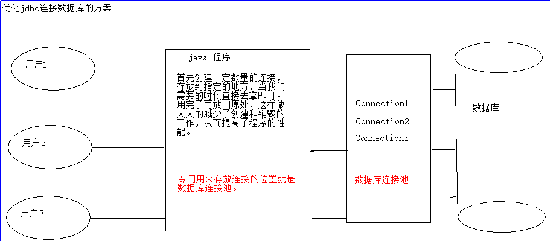
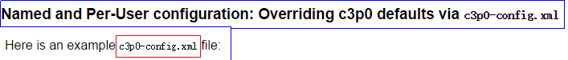
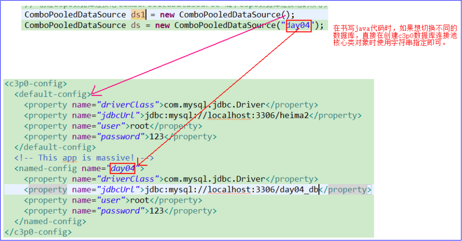
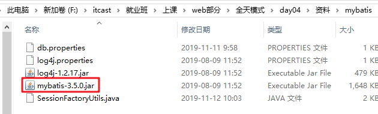
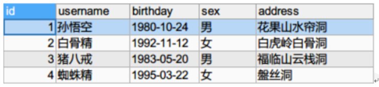

# 数据库连接池和MyBatis(第1天)

# 学习目标

1. 连接池
   1. 能够理解连接池解决现状问题的原理
   2. 能够使用C3P0连接池
   3. 能够使用DRUID连接池
2. 能够了解什么是框架
3. <font color="red">掌握mybatis框架开发快速入门</font>

   

# 1.连接池

## 1、连接池介绍

### 目标

能够理解连接池的原理和好处

### 讲解

#### 没有连接池的现状

首先我们通过画图的形式来分析一下我们目前所学的jdbc程序的结构。


 <figure class="thumbnails">
    
</figure>


说明：以前使用的jdbc的缺点：

1、操作数据库都需要创建连接，操作完成还需要关闭连接

2、创建连接和关闭连接需要可能比执行sql需要的时间都长

3、一个网站需要高频繁的访问数据库，如果短时间频繁的访问数据库服务器，就容易造成服务器的宕机，即死机。

####  连接池解决现状问题的原理

注意：

通过画图分析得出：当前的jdbc程序每次访问数据库都需要创建一个新的连接，访问完毕之后，还需要释放资源。那么在这样的一个过程中，连接的创建和销毁所消耗的资源是远远大于我们发送sql并执行的时间的。基于这样的情况，我们发现我们的jdbc程序将大量的资源浪费在了连接的创建和销毁上。

举例：就像在上海坐地铁，就一站2分钟的路程，往往在买地铁票的过程需要等待至少10分钟以上的时间。这样是不合理的。所以我们 需要对这样的结构进行优化。

 

思考上面的结构，大部分的时间浪费在了创建和销毁上。那么我们能不能实现将这些连接回收和利用呢？这样我们就不需要不停的创建和销毁了。只需要创建一次，放在指定的地方。当我们使用的时候，直接从里面拿就行了。用完放回原来的地方。不去销毁，当我再次使用的时候，去拿就行了。而这样的解决方案就是我们需要的。

 

优化后的结构如下：

说明：首先创建一定数量的连接，然后放到指定的地方。当我们需要获取连接的时候，直接从指定的地方获取。用完了，我们再将连接放回去。这样就能将我们连接的回收利用。并且不用花费大量时间在创建和销毁连接上。

解决方案如下图所示：

 <figure class="thumbnails">
    
</figure>


#### 连接池好处

连接池中保存了一些数据库连接，这些连接是可以重复使用的。节省数据库的资源消耗。

#### 常用连接池的介绍

`javax.sql.DataSource`表示数据库**连接池**，DataSource本身只是Sun公司提供的一个接口,没有具体的实现，它的实现由连接池的数据库厂商去实现。我们只需要学习这个工具如何使用即可。

该接口如下：

```java
public interface DataSource {
	Connection getConnection();
}
```

常用的连接池实现组件有以下这些：

1. **阿里巴巴-德鲁伊Druid连接池：Druid是阿里巴巴开源平台上的一个项目，整个项目由数据库连接池、插件框架和SQL解析器组成。该项目主要是为了扩展JDBC的一些限制，可以让程序员实现一些特殊的需求。**
2. **C3P0是一个开源的JDBC连接池，支持JDBC3规范和JDBC2的标准扩展。目前使用它的开源项目有Hibernate，Spring等。C3P0有自动回收空闲连接功能。**
3. DBCP(DataBase Connection Pool)数据库连接池，是Apache上的一个Java连接池项目。dbcp没有自动回收空闲连接的功能。

### 小结

连接池的好处？
连接池内部会保存好一些连接,这些连接可以反复使用,提高连接的使用率,降低数据库资源消耗
连接池的原理?
1.创建连接池时,连接池内部就会创建一些连接
2.当需要使用连接时,就直接从连接池里面取出连接
3.当连接使用完毕时,重新放回连接池

## 2、C3P0连接池

准备数据：

~~~sql
create database day04_db;

use day04_db;

create table emp(
	id int primary key auto_increment,
	name varchar(50),
	city varchar(50)
);

insert into emp values(null, '刘备', '北京');
insert into emp values(null, '关羽', '上海');
insert into emp values(null, '张飞', '广州');

select * from emp;
~~~

### 目标

能够使用C3P0连接池

### 讲解


#### C3P0连接池简介

C3P0 是一个开源的JDBC连接池，目前spring 和 hibernate框架对C3P0是支持的。

使用c3p0数据库连接池之前，首先需要在资料中找到如下的jar包，加载到项目中。

C3P0的核心jar包：`c3p0-0.9.1.2.jar`


 <figure class="thumbnails">
    
</figure>

对上述核心包进行Add as Library...

最后生成如下内容：


 <figure class="thumbnails">
    
</figure>

#### C3P0常用的配置参数解释

| 参数            | 说明                                                         |
| --------------- | ------------------------------------------------------------ |
| driverClass     | 数据库驱动类。例如：com.mysql.jdbc.Driver                    |
| jdbcUrl         | 连接数据库的url地址。例如：jdbc:mysql://localhost:3306/day05_db |
| user            | 连接数据库的用户名。例如：root                               |
| password        | 连接数据库的密码。例如：1234                                 |
| initialPoolSize | 刚创建好连接池的时候连接数量                                 |
| maxPoolSize     | 连接池中最多可以放多少个连接                                 |

#### C3P0配置文件方式获取数据库连接

​	我们看到要使用C3P0连接池，需要设置一些参数。那么这些参数怎么设置最为方便呢？使用配置文件方式。

​	我们可以找到c3p0的主页index.html。即c3p0的API帮助文档。


 <figure class="thumbnails">
    
</figure>
打开该页面，如下图所示：


 <figure class="thumbnails">
    
</figure>
这里我们采用xml的配置方式：


 <figure class="thumbnails">
    
</figure>
点击进去，如下模板：


 <figure class="thumbnails">
    
</figure>
那么接下来就会有几个问题，这些配置信息存放的配置文件叫什么？

 <figure class="thumbnails">
    
</figure>
通过读取API得知，要求c3p0数据库连接池的配置文件的名字必须叫做：c3p0-config.xml。

配置文件存放到哪里？


 <figure class="thumbnails">
    
</figure>
说明：WEB-INF/classes 属于web项目中的目录，在javase项目下就相当于src目录。

所以我们需要将c3p0-config.xml配置文件存放到src目录下。

这样C3P0数据库连接池自己就会去找这个文件，并且读取文件中信息。

具体操作步骤如下所示：

1）点击src-----》右键new--------》选择File

 <figure class="thumbnails">
    
</figure>
2) 在弹出的框中输入配置文件的名字c3p0-config.xml--------》点击OK


 <figure class="thumbnails">
    
</figure>
3）配置文件创建好之后，将API中的配置信息存放到c3p0-config.xml文件中，并修改配置文件，如下所示：

```xml
<?xml version="1.0" encoding="UTF-8"?>
<c3p0-config>
  <default-config>
    <property name="driverClass">com.mysql.jdbc.Driver</property>
    <property name="jdbcUrl">jdbc:mysql://localhost:3306/day05_db</property>
    <property name="user">root</property>
    <property name="password">1234</property>
  </default-config>

  <named-config name="intergalactoApp"> 
  </named-config>
</c3p0-config>
```

配置文件配置完成之后，接下来我们开始学习相关的API

#### API介绍

`com.mchange.v2.c3p0.ComboPooledDataSource`类表示C3P0的连接池对象，常用2种创建连接池的方式：

`1.无参构造，使用默认配置`，

`2.有参构造，使用命名配置`

1. ```java
   public ComboPooledDataSource()
   无参构造使用默认配置（使用xml中default-config标签中对应的参数）
   ```

2. ```java
   public ComboPooledDataSource(String configName)
   有参构造使用命名配置（configName：xml中配置的名称，使用xml中named-config标签中对应的参数）
   ```

3. ```java
   public Connection getConnection() throws SQLException
   从连接池中取出一个连接
   ```

#### 使用步骤

1. 导入jar包`c3p0-0.9.1.2.jar`
2. 编写`c3p0-config.xml`配置文件，配置对应参数
3. 将配置文件放在src目录下
4. 创建连接池对象`ComboPooledDataSource`，使用默认配置或命名配置
5. 从连接池中获取连接对象
6. 使用连接对象操作数据库
7. 关闭资源

#### 注意事项

C3P0配置文件名称必须为`c3p0-config.xml`
C3P0命名配置可以有多个

#### 案例代码

需求：查询表中所有数据并输出到控制台。

2. java代码

   ```java
   @Test
   	public void demo2() throws PropertyVetoException {
   		// 需求：遍历emp的用户。
   		// 首先创建c3p0的数据库连接池
   		ComboPooledDataSource cpds = new ComboPooledDataSource();
   
   		Connection conn = null;
   		PreparedStatement stmt = null;
   		ResultSet rs = null;
   
   		try {
   			// 从连接池中获取连接
   			conn = cpds.getConnection();
   			// 获得发送sql的对象
   			String sql = "select * from emp";
   			stmt = conn.prepareStatement(sql);
   			// 执行sql 获得结果
   			rs = stmt.executeQuery();
   			// 处理结果
   			while (rs.next()) {
   				int id = rs.getInt("id");
   				String name = rs.getString("name");
   				String city = rs.getString("city");
   			     System.out.println("C3P0::::: " + id + ">>>" + name + ">>>" + city);
   			}
   		} catch (Exception e) {
   			e.printStackTrace();
   		} finally {
   			// 释放资源: 关闭stmt 和 rs
   			JDBCUtils.release(conn, stmt, rs);
   		}
   
   	}
   ```

#### 案例效果


 <figure class="thumbnails">
    
</figure>
**说明：**

**1）、我们发现在创建c3p0数据库连接池对象的时候，没有进行设置参数，就可以和数据库建立连接了。说明在创建数据库连接池对象的时候，数据库连接池就会去src下找c3p0-config.xml,并且读取该配置文件中的配置信息从而来连接数据库。因为C3P0 自己按照约定去找src目录下的 c3p0-config.xml 文件，**

**2）、上述打印红色的内容是在创建c3p0核心类ComboPooledDataSource对象和调用conn = cpds.getConnection();方法时打印的。**

**3）、关于打印主要信息解释：**

**驱动类：driverClass -> com.mysql.jdbc.Driver** 

**连接池可以存放的最大连接数：maxPoolSize -> 15**

**连接池可以存放的最小连接数：minPoolSize -> 3**

> 注意：配置文件名称必须为：`c3p0-config.xml`，将配置文件放在src目录下

#### 使用命名配置操作指定的数据库

需求：现在想读取day04_db数据库下面的user表中的信息。

1、修改c3p0-config.xml配置文件中的配置信息：

```xml
<?xml version="1.0" encoding="UTF-8"?>
<c3p0-config>
  <default-config>
    <property name="driverClass">com.mysql.jdbc.Driver</property>
    <property name="jdbcUrl">jdbc:mysql://localhost:3306/day_05db</property>
    <property name="user">root</property>
    <property name="password">123</property>
  </default-config>

  <named-config name="day04">
    <property name="driverClass">com.mysql.jdbc.Driver</property>
    <property name="jdbcUrl">jdbc:mysql://localhost:3306/day_04db</property>
    <property name="user">root</property>
    <property name="password">123</property> 
  </named-config>
</c3p0-config>
```

2、java代码

```java
@Test
	public void demo2() throws PropertyVetoException {
		// 需求：遍历emp的用户。
		// 首先创建c3p0的数据库连接池构造方法ComboPooledDataSource(configName) configName表示新增的名字
		ComboPooledDataSource cpds = new ComboPooledDataSource(“day04”);

		Connection conn = null;
		PreparedStatement stmt = null;
		ResultSet rs = null;

		try {
			// 从连接池中获取连接
			conn = cpds.getConnection();
			// 获得发送sql的对象
			String sql = "select * from user";
			stmt = conn.prepareStatement(sql);
			// 执行sql 获得结果
			rs = stmt.executeQuery();
			// 处理结果
			while (rs.next()) {
				int id = rs.getInt("id");
				String username = rs.getString("name");
				String password= rs.getString("password");

				System.out.println("C3P0::::: " + id + ">>>" + username + ">>>" + password);
			}
		} catch (Exception e) {
			e.printStackTrace();
		} finally {
			// 释放资源: 关闭stmt 和 rs
			JDBCUtils.release(conn, stmt, rs);
		}
}
```

小结：

如何快速切换不同的数据源呢？ 根据实例化数据源ComboPooledDataSource(String configName) 指定不同的参数


 <figure class="thumbnails">
    
</figure>


只需要单独修改配置文件，不用修改代码
多个配置的好处：

1. 可以连接不同的数据库：db1,db2
2. 可以使用不同的连接池参数：maxPoolSize
3. 可以连接不同厂商的数据库：Oracle或MySQL

### 小结

CP30使用步骤？

1.导入jar包
2.复制配置文件到src下:c3p0-config.xml
3.修改配置信息
4.创建ComboPooledDataSource()连接池
5.使用连接池获取连接:getConnection();
6.后续操作
7.关闭资源

注意：

1、配置文件名称是 c3p0-config.xml 文件，并且必须在src 目录下

2、c3p0会自动寻找这个文件，加载里面的配置信息。

## 3、Druid连接池

### 目标

能够掌握Druid连接池的使用

### 讲解

#### DRUID简介

​	Druid是阿里巴巴开发的号称为监控而生的数据库连接池(可以监控访问数据库的性能)，Druid是目前最好的数据库连接池。在功能、性能、扩展性方面，都超过其他数据库连接池。Druid已经在阿里巴巴部署了超过600个应用，经过一年多生产环境大规模部署的严苛考验。如：一年一度的双十一活动，每年春运的抢火车票。

Druid的下载地址：<https://github.com/alibaba/druid>  

DRUID连接池使用的jar包：druid-1.0.9.jar


 <figure class="thumbnails">
    
</figure>

#### Druid常用的配置参数

| **url**             | **数据库**连接字符串**jdbc:mysql://localhost:3306/数据库名** |
| ------------------- | ------------------------------------------------------------ |
| **username**        | **数据库的用户名**                                           |
| **password**        | **数据库的密码**                                             |
| **driverClassName** | **驱动类名。根据url自动识别，这一项可配可不配，如果不配置druid会根据url自动识别数据库的类型，然后选择相应的数据库驱动名** |
| **initialSize**     | **初始化时建立的物理连接的个数。初始化发生在显式调用init方法，或者第一次获取连接对象时** |
| **maxActive**       | **连接池中最大连接数**                                       |
| **maxWait**         | **获取连接时最长等待时间，单位是毫秒。**                     |

#### Druid连接池基本使用

##### API介绍

核心类：**DruidDataSourceFactory**

获取数据源的方法：使用**com.alibaba.druid.pool.DruidDataSourceFactory**类中的静态方法：

```java
public static DataSource createDataSource(Properties properties)
创建一个连接池，连接池的参数使用properties中的数据
```

配置信息在properties属性对象中。

我们可以看到Druid连接池在创建的时候需要一个Properties对象来设置参数，所以我们使用properties文件来保存对应的参数。

Druid连接池的配置文件名称随便，放到src目录或者项目根目录下面加载
`druid.properties`文件内容：

```properties
# 数据库连接参数
url=jdbc:mysql://localhost:3306/day05_db
username=root
password=123
driverClassName=com.mysql.jdbc.Driver
```

#### 使用步骤

1) 导入核心包druid-1.0.9.jar


 <figure class="thumbnails">
    
</figure>
2) 在项目下创建一个properties文件，文件名随意，设置对应参数


 <figure class="thumbnails">
    
</figure>
3) 加载properties文件的内容到Properties对象中

4) 创建DRUID连接池，使用配置文件中的参数

5) 从DRUID连接池中取出连接

6) 执行SQL语句

7) 关闭资源

#### 案例代码

1. 属性文件：在项目下新建一个druid配置文件，命名为：druid.properties 

```properties
# 数据库连接参数
url=jdbc:mysql://localhost:3306/day05_db
username=root
password=123
driverClassName=com.mysql.jdbc.Driver
```

2.java代码

```java
public class Demo03 {
    public static void main(String[] args) throws Exception {
      //加载properties文件的内容到Properties对象中
        Properties info = new Properties();
        //加载项目下的属性文件 相对项目根目录
//        FileInputStream fis = new FileInputStream("druid.properties");
        //相对src目录
        InputStream fis = Test01.class.getClassLoader().getResourceAsStream("druid.properties");
        //从输入流中加载属性
        info.load(fis);
        System.out.println(info);
        //创建DRUID连接池，使用配置文件中的参数
        DataSource dataSource = DruidDataSourceFactory.createDataSource(info);
        //从DRUID连接池中取出连接
        //Connection conn = dataSource.getConnection();
        //System.out.println("conn = " + conn);
// 需求: 根据用户名和密码 查询用户信息
        Connection conn = null;
        PreparedStatement pstmt = null;
        ResultSet rs = null;

        try {
            // 获得连接
            conn = dataSource.getConnection();
            // 获得发送sql的对象
            String sql = "select * from emp where name=? and city=?";
            pstmt = conn.prepareStatement(sql);
            // 如果有问号,需要 设置参数,注意:下标从1开始
            pstmt.setString(1, "刘备");
            pstmt.setString(2, "北京");
            // 执行sql 获得结果
            rs = pstmt.executeQuery();
            // 处理结果
            if (rs.next()) {
                int id = rs.getInt("id");
                String name = rs.getString("name");
                String city = rs.getString("city");

                System.out.println(id + ":::" + name + "===" + city);
            } else {
                System.out.println("没有查到对应的用户信息!");
            }
        } catch (Exception e) {
        } finally {
//            JDBCUtils.release(conn, pstmt, rs);
        }
    }
}
```

#### 案例效果


 <figure class="thumbnails">
    
</figure>


# 2.框架概述

## 目标

1. 什么是框架

2. 框架解决了哪些问题

3. 分层开发下常见的框架

## 什么是框架

程序开发中的框架往往是对常见功能的封装，**通常与具体业务无关**，也可以认为是软件的半成品。程序框架理解为基础或者机械标准件(例如螺丝螺母标准的机械部件)。

假如你要造一辆马车，在没有框架的情况下，你需要自己去伐木，去把木头做成木板，木棍，然后组成轮子，门，等部件，然后组装起来。但如果你用了框架，就相当于你有现成的轮子，门等部件，你只需要组装一下就可以了。

一个框架是一组可复用的设计构件。


 <figure class="thumbnails">
    
</figure>
框架(Framework)是整个或者部分系统的可重用设计，是JavaEE底层技术的封装。

框架是可以被开发者定制的应用骨架。

框架是一个半成品，软件是成品。我们在它的基础上开发出成品(软件)。   


 <figure class="thumbnails">
    
</figure>

## 框架解决的问题

### 解决了技术通用的问题

在JavaEE体系中，有着各种各样的技术。不同的软件企业，根据自身的业务需求选择不同的技术，容易造成应用依赖技术，增加了项目开发实现的复杂性和技术风险性。而框架技术就可以解决上述问题。

### 提升了开发效率

企业项目中使用框架，只需要专注实现业务需求。使用框架的方便性，提升了开发效率。

### 提升了系统稳定性

一个成熟的框架，经过了在众多企业项目中的验证使用，稳定性有保障。


 <figure class="thumbnails">
    
</figure>
### 小结

1. 理解为软件中标准件，程序员可以利用这些半成品来开发软件。
2. 提高开发效率，降低开发成本。
3. 以后我们在企业中开发项目基本上都是使用框架来开发

 


# 3.mybatis框架介绍

## 目标

1. mybatis框架介绍

2. mybatis框架官网和jar包下载

## mybatis框架介绍

~~~java
	mybatis是Apache软件基金会下的一个开源项目，前身是iBatis框架。2010年这个项目由apache 软件基金会迁移到google code下，改名为mybatis。2013年11月又迁移到了github(GitHub 是一个面向开源及私有 软件项目的托管平台)。
	MyBatis 是一款优秀的持久层框架，它支持定制化 SQL、存储过程以及高级映射(多表)。MyBatis 避免了几乎所有的 JDBC 代码和手动设置参数以及获取结果集。它对 jdbc 的操作数据库的过程进行封装，使开发者只需要关注 SQL 本身，而不需要花费精力去处理例如注册驱动、创建 connection、创建 statement、手动设置参数、结果集检索等 jdbc 繁杂的过程代码。MyBatis 可以使用简单的 XML 或注解来配置和映射原生类型、接口和 Java 的 POJO（Plain Old Java Objects，普通老式 Java 对象）为数据库中的记录。  
~~~


### mybatis的优点

1. 简单易学：mybatis本身就很小且简单。没有任何第三方依赖，最简单安装只要两个jar文件+配置几个SQL映射文件即可。  
2. 使用灵活：Mybatis不会对应用程序或者数据库的现有设计强加任何影响。SQL语句写在XML里，便于统一管理和优化。
3. 解除SQL与程序代码的耦合：通过提供DAO层，将业务逻辑和数据访问逻辑分离，使系统的设计更清晰，更易维护，更易进行单元测试。SQL语句和代码的分离，提高了可维护性。

### mybatis的不足

1. 编写SQL语句时工作量很大，尤其是字段多、关联表多时，更是如此。
2. SQL语句依赖于数据库，导致数据库移植性差，不能更换数据库。
3. 框架还是比较简陋，功能尚有缺失。


### 官方网站及框架包下载

官网地址：http://www.mybatis.org/mybatis-3/ 


  <figure class="thumbnails">
    
</figure>


 <figure class="thumbnails">
    
</figure>

源码和包下载地址：https://github.com/mybatis/mybatis-3/releases


 <figure class="thumbnails">
    
</figure>

下载后的包位于课后资料中：


 <figure class="thumbnails">
    
</figure>

###  mybatis框架整体架构


 <figure class="thumbnails">
    
</figure>
```html
1、配置文件
	全局配置文件（核心配置文件）：mybatis-config.xml，作用：配置数据源（配置数据库连接信息），引入映射文件
	映射文件：XxMapper.xml，作用：配置sql语句、参数、结果集封装类型等
	
2、SqlSessionFactory
	作用：获取SqlSession
	通过new SqlSessionFactoryBuilder().build(inputStream)来构建，inputStream：读取配置文件的IO流

3、SqlSession
	作用：执行CRUD操作
	
4、Executor
	执行器，SqlSession通过调用它来完成具体的CRUD
	
5、Mapped Statement
	在映射文件里面配置，包含3部分内容：
		具体的sql，sql执行所需的参数类型，sql执行结果的封装类型
	参数类型和结果集封装类型包括3种：
		HashMap，基本数据类型，pojo
```

### **MyBatis的ORM方式**

---

Object Relational Mapping 对象关系映射


 <figure class="thumbnails">
    
</figure>
**MyBatis的两种映射方式：**

1. 通过XML映射
2. 通过注解


### 【小结】

~~~html
1、mybatis解决了三层(web,service,dao)中哪一层的问题？
	dao(数据持久层)
2、mybatis框架是对什么技术进行的封装？
	JDBC
3、mybatis框架中的核心组件有哪些？
	SqlSessionFactoryBuilder:SqlSessionFactory工厂的创造类
	SqlSessionFactory：加载配置信息，提供SqlSession
	SqlSession： 数据操作的对象 sql语句
~~~


# 4.MyBatis框架入门开发【掌握】

## 4.1入门案例：环境的搭建和代码实现

### 目标

1.     mybatis开发环境的搭建

2.     了解mybatis的开发步骤

### 需求

利用mybatis框架，从MySQL中查询所有的用户

                                             
 <figure class="thumbnails">
    
</figure>
### 准备数据

要查询的表

```mysql
create table user (
  id int primary key auto_increment,
  username varchar(20) not null,
  birthday date,
  sex char(1) default '男',
  address varchar(50)
);

insert into user values (null, '孙悟空','1980-10-24','男','花果山水帘洞');
insert into user values (null, '白骨精','1992-11-12','女','白虎岭白骨洞');
insert into user values (null, '猪八戒','1983-05-20','男','福临山云栈洞');
insert into user values (null, '蜘蛛精','1995-03-22','女','盤丝洞');

select * from user;
```


### 步骤

我们完全可以按照mybatis官网入门步骤进行开发即可：

 <figure class="thumbnails">
    
</figure>
1. 创建项目

2. 创建lib目录，复制以下包

   1. 日志记录包：mybatis在执行过程中输出的一些信息，mybatis底层需要使用log4j日志框架

       log4j.jar

   2. mysql驱动

    
 <figure class="thumbnails">
    
</figure>
   3. mybatis框架的包


 <figure class="thumbnails">
    
</figure>
      

3. 创建实体类User

~~~java
package com.itheima.sh.pojo;
import java.sql.Date;
public class User {
    private Integer id;
    private String username;
    private Date birthday;
    private String sex;
    private String address;

    public User() {
    }

    public User(Integer id, String username, Date birthday, String sex, String address) {
        this.id = id;
        this.username = username;
        this.birthday = birthday;
        this.sex = sex;
        this.address = address;
    }

    public Integer getId() {
        return id;
    }

    public void setId(Integer id) {
        this.id = id;
    }

    public String getUsername() {
        return username;
    }

    public void setUsername(String username) {
        this.username = username;
    }

    public Date getBirthday() {
        return birthday;
    }

    public void setBirthday(Date birthday) {
        this.birthday = birthday;
    }

    public String getSex() {
        return sex;
    }

    public void setSex(String sex) {
        this.sex = sex;
    }

    public String getAddress() {
        return address;
    }

    public void setAddress(String address) {
        this.address = address;
    }

    @Override
    public String toString() {
        return "User{" +
                "id=" + id +
                ", username='" + username + '\'' +
                ", birthday=" + birthday +
                ", sex='" + sex + '\'' +
                ", address='" + address + '\'' +
                '}';
    }
}
~~~


4.在src下面创建核心配置文件：**mybatis-config.xml**

~~~java
	XML 配置文件中包含了对 MyBatis 系统的核心设置，包含获取数据库连接实例的数据源（DataSource）和决定事务作用域和控制方式的事务管理器（TransactionManager）。 XML 配置文件的详细内容后面再探讨，这里先给出一个简单的示例：
~~~


~~~xml
<?xml version="1.0" encoding="UTF-8" ?>
<!DOCTYPE configuration
        PUBLIC "-//mybatis.org//DTD Config 3.0//EN"
        "http://mybatis.org/dtd/mybatis-3-config.dtd">
<configuration>
    <!--mybatis环境的配置-->
    <environments default="development">
        <!--通常我们只需要配置一个就可以了， id是环境的名字 -->
        <environment id="development">
            <!--事务管理器：由JDBC来管理-->
            <transactionManager type="JDBC"/>
            <!--数据源的配置：mybatis自带的连接池-->
            <dataSource type="POOLED">
                <property name="driver" value="com.mysql.jdbc.Driver"/>
                <property name="url" value="jdbc:mysql://localhost:3306/db4"/>
                <property name="username" value="root"/>
                <property name="password" value="1234"/>
            </dataSource>
        </environment>
    </environments>
    <mappers>
        <!--加载映射文件,放到src下即可-->
        <mapper resource="userMapper.xml"/>
    </mappers>
</configuration>
~~~

4.在src下创建映射文件**userMapper.xml**

~~~xml
<?xml version="1.0" encoding="UTF-8" ?>
<!DOCTYPE mapper
        PUBLIC "-//mybatis.org//DTD Mapper 3.0//EN"
        "http://mybatis.org/dtd/mybatis-3-mapper.dtd">
<mapper namespace="org.mybatis.example.BlogMapper">
    <!--
        查询语句
        resultType：返回的实体类的类型，类全名
    -->
    <select id="findAllUsers" resultType="com.itheima.sh.pojo.User">
        select * from user
    </select>
</mapper>
~~~

5.编写测试类代码

- 三大对象作用和生命周期

在mybatis中一个会话相当于一次访问数据库的过程，**一个会话对象类似于一个Connection连接对象**。

1. **SqlSessionFactoryBuilder**：这是一个临时对象，用完就不需要了。通过这个工厂建造类来创建一个会话工厂。
2. **SqlSessionFactory**：从一个工厂类中得到一个会话对象，一个项目中只需要创建一个会话工厂对象即可。通过会话工厂对象来创建会话对象。
3. **SqlSession**： 每次访问数据库都需要创建一个会话对象，这个会话对象不能共享。访问完成以后会话需要关闭。                   

~~~java
public class MyBatisTest01 {
    //从MySQL中查询所有的用户
    @Test
    public void test01() throws Exception{
        //1.从xml文件中构建SqlSessionFactory
        //定义核心配置文件路径
        String resource = "mybatis-config.xml";
        //加载核心配置文件获取输入流
        InputStream inputStream = Resources.getResourceAsStream(resource);
        SqlSessionFactory sqlSessionFactory = new SqlSessionFactoryBuilder().build(inputStream);

        //2.从SqlSessionFactory中获取session
        SqlSession session = sqlSessionFactory.openSession();

        //3.使用session操作数据库 CRUD
        //通过参数：org.mybatis.example.BlogMapper.findAllUsers找到映射文件userMapper.xml中的sql语句
        List<User> userList = session.selectList("org.mybatis.example.BlogMapper.findAllUsers");
        for (User user : userList) {
            System.out.println("user = " + user);
        }
        //关闭会话
        session.close();
    }
}
~~~

编写流程：Resources工具类直接可以读取src目录下配置文件，转成输入流。


 <figure class="thumbnails">
    
</figure>

6.运行结果：


 <figure class="thumbnails">
    
</figure>
说明：我们通过运行结果发现mybatis框架发出警告，因为没有使用log4j日志。所以我们需要在src下再次创建一个日志配置文件：log4j.properties

~~~properties
### 设置Logger输出级别和输出目的地 ###
log4j.rootLogger=debug, stdout

### 把日志信息输出到控制台 ###
log4j.appender.stdout=org.apache.log4j.ConsoleAppender
log4j.appender.stdout.Target=System.out
log4j.appender.stdout.layout=org.apache.log4j.SimpleLayout

~~~

作用：用来设置日志记录的格式，因为mybaits需要使用到log4j来记录它的日志。日志记录程序运行过程中各种事件。


mybatis配置文件分两种

1. 核心配置文件：mybatis-config.xml 配置连接数据库参数
2. 映射文件：UserMapper.xml编写SQL语句


### 项目结构


 <figure class="thumbnails">
    
</figure>

## 4.2入门案例：mybatis执行流程分析

 <figure class="thumbnails">
    
</figure>
说明：

1.第一步：是从核心配置文件mybatis-config.xml中构建SqlSessionFactory对象，由于核心配置文件mybatis-config.xml中关联了映射文件UserMapper.xml,所以在SqlSessionFactory中也存在映射文件的内容

2.第二步：是从SqlSessionFactory中获取SqlSession会话对象，其实SqlSession会话对象底层封装的就是conn连接对象

3.第三步：是通过SqlSession会话对象调用查询方法selectList然后根据参数找到映射文件中中的sql语句并将数据封装到pojo的User对象中


## 4.3入门案例：核心配置文件 mybatis-config.xml

在src目录下核心配置文件


 <figure class="thumbnails">
    
</figure>
- 可以在mybatis官网入门中找到配置模板：

  http://www.mybatis.org/mybatis-3/zh/getting-started.html

```xml
<?xml version="1.0" encoding="UTF-8" ?>
<!DOCTYPE configuration
        PUBLIC "-//mybatis.org//DTD Config 3.0//EN"
        "http://mybatis.org/dtd/mybatis-3-config.dtd">
<configuration>
    <!--mybatis环境的配置-->
    <environments default="development">
        <!--通常我们只需要配置一个就可以了， id是环境的名字 -->
        <environment id="development">
            <!--事务管理器：由JDBC来管理-->
            <transactionManager type="JDBC"/>
            <!--数据源的配置：mybatis自带的连接池-->
            <dataSource type="POOLED">
                <property name="driver" value="com.mysql.jdbc.Driver"/>
                <property name="url" value="jdbc:mysql://localhost:3306/db4"/>
                <property name="username" value="root"/>
                <property name="password" value="1234"/>
            </dataSource>
        </environment>
    </environments>
    <mappers>
        <!--加载映射文件,放到src下即可-->
        <mapper resource="userMapper.xml"/>
    </mappers>
</configuration>
```


- 可以在idea中定义模板，以后重用。


 <figure class="thumbnails">
    
</figure>

## 4.4入门案例：常见错误

- 在映射文件userManager.xml中的resultType位置没有书写类的全名


 <figure class="thumbnails">
    
</figure>
- 在核心配置文件中没有引入映射文件


 <figure class="thumbnails">
    
</figure>

小结：

1、mybatis框架的核心组件：

   SqlSessionFactoryBuilder;会话工厂构造类创建会话工厂对象

​	SqlSessionFactory：会话工厂类创建会话对象
​	SqlSession：会话类

2、入门程序开发流程：
	【1】从xml文件中构建：___SqlSessionFactory____
	【2】从SqlSessionFactory中获取：____SqlSession_____
	【3】通过__SqlSession____执行___映射文件___文件中的sql语句


# 5.mybatis的dao层动态代理实现【掌握】

​	在上述入门案例中，我们使用了mybatis框架的SqlSession完成了对数据库的查询操作。但是，mybatis是持久层（dao层）的框架，在实际开发中，mybatis应该在持久层起作用。关于mybatis在持久层的使用。官方描述如下：


 <figure class="thumbnails">
    
</figure>

## 【目标】

```html
创建dao层接口UserMapper，通过SqlSession获取UserMapper接口的动态代理对象实现查询所有数据；
```

## 【步骤】

```html
第一步：新建接口 UserMapper；
第二步：将接口和映射文件绑定；
第三步：在映射文件中书写SQL语句；
第四步：获取UserMapper的动态代理对象完成查询；
```

## 【实现】

【1】新建UserMapper接口：

```java
public interface UserMapper {
    /**
     查询所有的用户
     */
    List<User> findAllUsers();
}
```

【2】将接口和映射文件绑定：

```html
映射文件的	namespace值==接口的全路径
映射文件的sql语句的	id值 ==接口中的方法名
```


 <figure class="thumbnails">
    
</figure>

【3】获取UserMapper接口的动态代理对象执行查询：

```java
    @Test
    public void test02() throws Exception{
        //1.从xml文件中构建SqlSessionFactory
        //定义核心配置文件路径
        String resource = "mybatis-config.xml";
        //加载核心配置文件获取输入流
        InputStream inputStream = Resources.getResourceAsStream(resource);
        SqlSessionFactory sqlSessionFactory = new SqlSessionFactoryBuilder().build(inputStream);

        //2.从SqlSessionFactory中获取session
        SqlSession session = sqlSessionFactory.openSession();

        //3.使用session获取接口的动态代理对象
        UserMapper mapper = session.getMapper(UserMapper.class);
        //4.使用接口对象调用接口中的方法
        List<User> userList = mapper.findAllUsers();
        //5.遍历集合
        for (User user : userList) {
            System.out.println(user);
        }
        //关闭会话
        session.close();
    }
```


## 【小结】

```html
mybatis动态代理对象实现过程：
【1】书写dao层： UserMapper.java接口 --定义方法
【2】把接口和映射文件绑定：
		1、映射文件的namespace="接口的全限定类名";
		2、映射文件中sql语句的id值必须为 接口中方法名
【3】获取接口的动态代理对象：
	 UserMapper userMapper = sqlSession.getMapper(UserMapper.class);
	 List<User> userList = userMapper.findAllUser();

 直接使用SqlSession进行查询：
SqlSession session = sqlSessionFactory.openSession();
List<User> userList =  session.selectList("org.mybatis.example.BlogMapper.findAllUsers");
说明：原来的方式在selectList方法的参数中直接书写字符串，容易写错，并且也不知道是哪个模块，开发中模块会有多个，而上述接口方式我们能看出到底用户模块还是商品模块
```


# 6.mybatis核心配置

**【mybatis全局配置介绍】**

​	mybatis-config.xml，是MyBatis的全局配置文件，包含全局配置信息，如数据库连接参数、插件等。整个框架中只需要一个即可。

```html
1、mybatis全局配置文件是mybatis框架的核心配置，整个框架只需一个；
2、mybatis全局配置文件中的配置顺序：注意如果配置多项，必须按照以下顺序进行配置
	properties：属性配置
	settings：设置
	typeAliases：类型别名设置
	typeHandlers：类型处理器
	enviroments：环境配置
		environment（环境变量）
		transactionManager（事务管理器）
		dataSource（数据源）
	mappers：映射器
```


## 6.1、properties(属性)

### 【作用】

```html
1、加载外部的java资源文件（properties文件）；
2、通过子标签property设置属性；
```

### 【需求】

```html
使用properties属性，配置数据库连接参数；
```

#### 【1】property标签设置

```html
1、通过properties的子标签设置属性；
2、使用${key}获取设置的属性值；
```

【通过properties的子标签property设置属性】了解

~~~xml
<?xml version="1.0" encoding="UTF-8" ?>
<!DOCTYPE configuration
        PUBLIC "-//mybatis.org//DTD Config 3.0//EN"
        "http://mybatis.org/dtd/mybatis-3-config.dtd">
<configuration>
    <!--
        一、properties（属性）
            【1】作用：定义参数或者加载外部的资源文件中的参数
            【2】用法：
            用法一：通过子标签 property 设置属性名和属性值；
            用法二：通过标签属性resource，加载外部的资源文件中参数；
    -->
    <properties>
        <property name="driver" value="com.mysql.jdbc.Driver"/>
    </properties>

    <!--mybatis环境的配置-->
    <environments default="development">
        <!--通常我们只需要配置一个就可以了， id是环境的名字 -->
        <environment id="development">
            <!--事务管理器：由JDBC来管理-->
            <transactionManager type="JDBC"/>
            <!--数据源的配置：mybatis自带的连接池-->
            <dataSource type="POOLED">
                <!--
                    这里的value="${driver}"  driver 是子标签property的name属性值
                -->
                <property name="driver" value="${driver}"/>
                <property name="url" value="jdbc:mysql://localhost:3306/db4"/>
                <property name="username" value="root"/>
                <property name="password" value="1234"/>
            </dataSource>
        </environment>
    </environments>
    <mappers>
        <!--加载映射文件,放到src下即可-->
        <mapper resource="userMapper.xml"/>
    </mappers>
</configuration>
~~~


#### 【2】加载外部properties

##### 第一步：新建资源文件

新建jdbc.properties文件，将连接参数抽取到配置文件中：

```properties
driver=com.mysql.jdbc.Driver
url=jdbc:mysql://localhost:3306/db4
username=root
password=1234
```

##### 第二步：引入资源文件

在mybatis-config.xml文件中加载jdbc.properties文件；**通过properties的属性resource引入；**


 <figure class="thumbnails">
    
</figure>
 **【注意事项】**：子标签和属性resource同时加载一个变量，先加载子标签，然后在加载resource关联的外部文件的值，那么子标签中的内容会被覆盖。此时子标签存在就没有意义了。


 <figure class="thumbnails">
    
</figure>

## 6.2、settings(设置)

settings参数有很多，今天咱们先学习驼峰匹配-mapUnderscoreToCamelCase。翻译过来就是映射下划线到驼峰式命名。


 <figure class="thumbnails">
    
</figure>

### 【作用】

 <figure class="thumbnails">
    
</figure>
```html
开启驼峰匹配：完成经典的数据库命名到java属性的映射
		经典数据库命名：如果多个单词之间，通常使用下划线进行连接。
		java中命名：第二个单词首字母大写。
驼峰匹配：相当于去掉数据库的数据中的名字的下划线，和java进行匹配  
```


### 【应用场景】

```html
从数据库中查到数据的字段名user_name和实体类属性名userName，不一致，导致查到的数据无法封装到实体类中。
但是，实体类中的属性userName符合驼峰命名，数据库字段名user_name符合数据库经典字段命名。
```


 <figure class="thumbnails">
    
</figure>
如果此时直接查询数据，那么用户名是null。

 <figure class="thumbnails">
    
</figure>


#### 【1】配置驼峰映射

​	在mybatis-config.xml中做如下配置：

~~~xml
settings设置：
 mapUnderscoreToCamelCase ：驼峰自动映射配置 ,值是true表示开启驼峰自动映射。满足条件：数据库字段名  user_name   ,实体类属性名 userName
~~~


~~~xml
<!--
    2、settings设置：
 mapUnderscoreToCamelCase ：驼峰自动映射配置 满足条件：数据库字段名  user_name   ,实体类属性名 userName
 -->
<settings>
  <setting name="mapUnderscoreToCamelCase" value="true"/>
</settings>
~~~


​	运行测试，查看结果：


 <figure class="thumbnails">
    
</figure>
【小结】

```html
1、开启驼峰自动映射的作用：user_name ====> userName；
2、注意事项：字段名必须符合user_name格式，属性名必须符合驼峰命名规则；
```


#### 【2】解决字段名和属性名不一致的方法

```html
	如果数据库字段名和属性名不一致，或者是也不满足上面的命名规则。可以通过在SQL语句中为字段名取别名进行映射。
```


 <figure class="thumbnails">
    
</figure>

## 6.3、typeAliases(类型别名)

### 【1】作用

类型别名是给类的全限定名称(包名.类名) 取一个短名称。存在的意义仅在于用来减少类完全限定名的冗余。例如：


 <figure class="thumbnails">
    
</figure>
​	这些全限定类名可通过设置类型别名--短名称代替。类型别名的设置有以下几种方式：

```html
方式一：使用typeAliases标签的子标签typeAlias手动设置类型别名；
方式二：使用typeAliases标签的子标签package包扫描映射别名；
```


### 【2】应用

#### 【方式一】typeAlias

第一步：在mybatis-config.xml核心配置文件中通过typeAlias设置User的全限定类名为User；

~~~xml
<!--
        三、typeAliases（类型别名）
            【1】作用：给类的全限定名称 取一个短名称   com.heima.mybatis.pojo.User==>User
            【2】用法：
                1、单独取别名：<typeAlias type="com.heima.mybatis.pojo.User" alias="User"/>       
    -->
    <typeAliases>
        <!--
            type 关联的类的全名
            alias：属于别名，随便定义，但是这里定义什么那么在映射文件UserMapper.xml中就使用什么
        -->
        <typeAlias type="com.itheima.sh.pojo.User" alias="User"/>
    </typeAliases>
~~~

第二步：在UserMapper.xml文件中直接使用短名称--User取代全限定类名；


 <figure class="thumbnails">
    
</figure>
【小结】

```html
1、优点：通过typeAlias可以为全限定类名设置短名称，使用比较方便；
2、缺点：如果实体类很多，需要设置的别名就会很多；就是<typeAlias type="com.itheima.sh.pojo.User" alias="User"/>标签会很多，例如Order Product都对应一个typeAlias标签，比较麻烦
```


#### 【方式二】package

​	扫描指定包下的所有类，扫描之后的别名就是类名，大小写不敏感（不区分大小写），建议使用的时候和类名一致。

设置别名：

~~~xml
<!--
        三、typeAliases（类型别名）
            【1】作用：给类的全限定名称 取一个短名称   com.heima.mybatis.pojo.User==>User
            【2】用法：
                1、单独取别名：<typeAlias type="com.heima.mybatis.pojo.User" alias="User"/>
                2、批量取别名：<package name="com.heima.mybatis.pojo"/> 扫描到当前包下的所有类
                              类的类名==》别名
    -->
    <typeAliases>
        <!--
            type 关联的类的全名
            alias：属于别名，随便定义，但是这里定义什么那么在映射文件UserMapper.xml中就使用什么
        -->
        <!--<typeAlias type="com.itheima.sh.pojo.User" alias="u"/>-->
        <!--扫描com.itheima.sh.pojo包下所有的类，类名直接作为别名(别名不区分大小写)-->
        <package name="com.itheima.sh.pojo"/>
    </typeAliases>
~~~

使用别名：


 <figure class="thumbnails">
    
</figure>
#### 【内置别名】

​	这是一些为常见的 Java 类型内建的相应的类型别名。它们都是不区分大小写的，注意对基本类型名称重复采取的特殊命名风格。

| 别名       | 映射的类型 |
| ---------- | ---------- |
| _byte      | byte       |
| _long      | long       |
| _short     | short      |
| _int       | int        |
| _integer   | int        |
| _double    | double     |
| _float     | float      |
| _boolean   | boolean    |
| string     | String     |
| byte       | Byte       |
| long       | Long       |
| short      | Short      |
| int        | Integer    |
| integer    | Integer    |
| double     | Double     |
| float      | Float      |
| boolean    | Boolean    |
| date       | Date       |
| decimal    | BigDecimal |
| bigdecimal | BigDecimal |
| object     | Object     |
| map        | Map        |
| hashmap    | HashMap    |
| list       | List       |
| arraylist  | ArrayList  |
| collection | Collection |
| iterator   | Iterator   |

【代码演示】

~~~xml
<!--parameterType="int" 表示sql语句参数id的类型，int是Integer的别名-->
    <select id="queryById" resultType="user" parameterType="int">
        select * from user where id = #{id}
    </select>
~~~


## 6.4、typeHandlers(类型处理器)【了解】

​	无论是 MyBatis 在预处理语句（PreparedStatement）中设置一个参数时，还是从结果集中取出一个值时， 都会用类型处理器将获取的值以合适的方式转换成 Java 类型。下表描述了一些默认的类型处理器。


 <figure class="thumbnails">
    
</figure>
~~~xml
<!--
        四、typeHandlers（类型处理器）
            数据库数据类型：varchar    ===StringTypeHandler===> 实体类：String
            数据库数据类型：double   DoubleTypeHandler  实体类中的数据： java.lang.Double 
-->
~~~


## 6.5、environments【了解】

```html
	MyBatis 可以配置成适应多种环境，例如，开发、测试和生产环境需要有不同的配置；
尽管可以配置多个环境，每个 SqlSessionFactory 实例只能选择其一。
虽然，这种方式也可以做到很方便的分离多个环境，但是实际使用场景下，我们更多的是选择使用spring来管理数据源，来做到环境的分离。
```

~~~xml
      父标签： environments（环境配置）
			子标签：
                environment（环境变量）
                transactionManager（事务管理器）
                dataSource（数据源） 
~~~


### 【1】默认环境设置

第一步：在environments标签中配置多个environment，通过属性default指定一个默认环境配置；


 <figure class="thumbnails">
    
</figure>


第二步：在构建SqlSessionFactory时，可指定具体环境，如果不指定就使用默认的环境配置；

 <figure class="thumbnails">
    
</figure>


### 【2】指定环境设置

第一步：在environments中配置多个环境


 <figure class="thumbnails">
    
</figure>

第二步：在构建SqlSessionFactory时，通过environment的id指定环境


 <figure class="thumbnails">
    
</figure>

代码演示：

~~~xml
<!--mybatis环境的配置-->
    <!--
        五、 environments（数据库环境配置）
                开发过程中会使用第三方的连接池：druid,C3P0
                Spring框架管理连接池
    -->
    <!--<environments default="test">-->
    <environments default="development">
        <!--通常我们只需要配置一个就可以了， id是环境的名字 -->
        <environment id="development">
            <!--事务管理器：由JDBC来管理-->
            <transactionManager type="JDBC"/>
            <!--数据源的配置：mybatis自带的连接池-->
            <dataSource type="POOLED">
                <!--
                    这里的value="${driver}"  driver 是子标签property的name属性值
                -->
                <property name="driver" value="${driver}"/>
                <property name="url" value="jdbc:mysql://localhost:3306/db4"/>
                <property name="username" value="root"/>
                <property name="password" value="1234"/>
            </dataSource>
        </environment>


        <!--通常我们只需要配置一个就可以了， id是环境的名字 -->
        <environment id="test">
            <!--事务管理器：由JDBC来管理-->
            <transactionManager type="JDBC"/>
            <!--数据源的配置：mybatis自带的连接池-->
            <dataSource type="POOLED">
                <!--
                    这里的value="${driver}"  driver 是子标签property的name属性值
                -->
                <property name="driver" value="${driver}"/>
                <property name="url" value="jdbc:mysql://localhost:3306/db4"/>
                <property name="username" value="root"/>
                <property name="password" value="12345"/>
            </dataSource>
        </environment>
    </environments>
~~~

~~~java
    @Test
    public void queryById( ) throws Exception {
        //获取mapper接口的动态代理实现

        //1、从xml中构建SqlSessionFactory
        String resource = "mybatis-config.xml";
        InputStream inputStream = Resources.getResourceAsStream(resource);
        //这里指定了环境为test
//        SqlSessionFactory sqlSessionFactory = new SqlSessionFactoryBuilder().build(inputStream,"test");
        //build不方法不指定环境就使用默认的 <environments default="development">
        SqlSessionFactory sqlSessionFactory = new SqlSessionFactoryBuilder().build(inputStream);

        //2、获取SqlSession
        SqlSession sqlSession = sqlSessionFactory.openSession();

        //3、获取UserMapper接口的动态代理对象
        UserMapper userMapper = sqlSession.getMapper(UserMapper.class);

        User user = userMapper.queryById(1);
        System.out.println("user = " + user);
    }
~~~


【注意事项】

```html
	虽然，这种方式也可以做到很方便的分离多个环境，但是实际使用场景下，我们更多的是选择使用第三方的连接池：druid,C3P0。并且使用spring来管理数据源(连接池)，来做到环境的分离。 
```


## 6.6、mappers(映射器)

mappers（映射器）：UserMapper.xml====>UserMapper.java接口 关联.

作用：维护接口和映射文件之间的关系.

​	既然 MyBatis 的行为已经由上述元素配置完了，我们现在就要定义 SQL 映射语句了。 但是首先我们需要告诉 MyBatis 到哪里去找到这些语句。 Java 在自动查找这方面没有提供一个很好的方法，所以最佳的方式是告诉MyBatis 到哪里去找映射文件。 你可以使用相对于类路径的资源引用， 或完全限定资源定位符（包括 `file:///` 的 URL），或类名和包名等。方式如下：

使用方式：
                  1、加载映射文件，关联UserMapper.java接口
                        【1】<mapper resource="UserMapper.xml"/> 从src下加载映射文件；
                        【2】<mapper url=""/>  从本地磁盘中加载映射文件,但是需要添加`file:///`协议

​				   2、加载接口，关联映射文件
​                     条件：**1、接口名和映射文件名保持一致；2、路径保持一致；**
​                    【1】class：加载单独的接口：<mapper class="com.heima.mybatis.dao.UserMapper"/>
​                    【2】批量加载class：<package name="com.heima.mybatis.dao"/>

### 方式一：加载映射文件方式resource

​	在mybatis-config.xml文件中，通过mapper标签的resource属性引入当前工程src下的映射文件。


 <figure class="thumbnails">
    
</figure>
**【缺点】**

```html
有多少个映射文件就要配置多少次，麻烦。
```


### 方式二：加载映射文件方式url【了解】

将UserMapper.xml映射文件放入e盘下，然后在全局配置文件中引入该映射文件。
引入硬盘目录下的映射文件：


 <figure class="thumbnails">
    
</figure>


 <figure class="thumbnails">
    
</figure>


缺点：
1、	硬盘的位置可能随着项目的部署或迁移，路径发生变化
2、	每新增一个映射文件，就要在全局配置文件中引入


### 方式三：加载接口，关联映射文件方式class

条件：**1、接口名和映射文件名保持一致；2、路径保持一致；**

在mybatis-config.xml配置mapper接口的全路径：

~~~xml
   <mappers>
       <!-- <mapper resource="UserMapper.xml"/>-->
        <mapper class="com.heima.mybatis.mapper.UserMapper"/>
    </mappers>
~~~

在与UserMapper.java相同目录结构的包下面新建映射文件UserMapper.xml，内容如下：


 <figure class="thumbnails">
    
</figure>
```xml
<?xml version="1.0" encoding="UTF-8" ?>
<!DOCTYPE mapper
        PUBLIC "-//mybatis.org//DTD Mapper 3.0//EN"
        "http://mybatis.org/dtd/mybatis-3-mapper.dtd">
<mapper namespace="com.heima.mybatis.mapper.UserMapper">
    <!--根据id查询-->
    <select id="queryById" resultType="User">
        select *,user_name AS  userName from user where id = #{id}
    </select>
</mapper>
```


**【注意事项】**

```html
class配置条件：
 1、映射文件名必须与接口同名（UserMapper.xml ===> UserMapper.java）；
 2、映射文件必须与接口的目录结构相同（UserMapper.xml和UserMapper.java在同一个包下面）；
 3、映射文件的namespace必须是接口的全路径：namespace="com.heima.mapper.UserMapper"；
```


**【缺点】**

```html
需要为每一个接口都配置一个class，接口名称必须与映射文件名相同，而且目录结构相同。
```


### 方式四：加载接口，关联映射文件方式package

在mybatis-config.xml中，开启包扫描：扫描包下的所有接口和对应的映射文件。

条件：**1、接口名和映射文件名保持一致；2、路径保持一致；**

~~~xml
    <mappers>
        <package name="com.itheima.sh.dao"/>
    </mappers>
~~~


**【原理】：**

```html
扫描目标包目录下的mapper接口，并按照class的方式找到接口对应的映射文件。
```

其条件和设置class的条件一样：

```html
1、映射文件和mapper接口在同一个目录下
2、文件名必须一致
3、映射文件的namespace必须和mapper接口的全路径保持一致
```

**【缺点】：**

```html
1、需要遵守的条件太多
2、mapper.xml和mapper.java没有分离。
```


#### 【mappers小结】：

```html
mappers:配置映射文件
	mapper
		resource:配置类路径下的映射文件(掌握)
		url：配置磁盘位置的映射文件
		class:配置接口
            1、要求接口和映射文件在同一个包下
            2、要求接口和映射文件同名
            3、要求namesapce的值必须为接口的全限定类名
	   package：配置接口包扫描(掌握)
            1、要求接口和映射文件在同一个包下
            2、要求接口和映射文件同名
            3、要求namesapce的值必须为接口的全限定类名

【推荐使用】resource加载映射文件，如果使用注解开发只能使用	class  和 package方式，建议使用package方式，注解开发不能使用加载配置文件的方式，因为注解已经取代了xml文件。所有注解都使用在接口的方法上。
```


## 6.7、全局配置小结

```html
一、全局配置：如果需要配置多个，必须按照以下顺序
    properties（属性）
    settings（设置）
    typeAliases（类型别名）
    typeHandlers（类型处理器）
    environments（环境配置）
        environment（环境变量）
        transactionManager（事务管理器）
        dataSource（数据源）
    mappers（映射器）
二、常用配置：
	1、properties（属性）
		【作用】定义一些属性或者加载外部的资源文件
		【用法】
			1、通过子标签定义：
				<properties>
					<property name="driver" value="com.mysql.jdbc.Driver"></property>
				</properties>
    	 		获取参数： ${driver}
		   2、加载外部的资源文件（src， jdbc.properties）
				<properties resource="jdbc.properties"></properties>
				获取参数： ${driver}
	2、settings(设置)：
		驼峰自动映射：数据库下划线命名：user_name  ===》实体类属性命名：userName
			    <settings>
                      <setting name="mapUnderscoreToCamelCase" value="true"/>
                  </settings>
			说明：如果不满足驼峰式命名，查询时起别名。
   3、typeAliases（类型别名）
		【作用】给类的全名称 取 短名称  com.heima.pojo.User===>User
		【配置】
			 <typeAliases>
                <!--<typeAlias type="com.heima.mybatis.pojo.User" alias="User"/>-->
                <package name="com.heima.mybatis.pojo"/>
            </typeAliases>

   4、mappers（映射器）
		【作用】把映射文件   和  接口 进行绑定
		【配置】
			加载xml文件：
				1、mapper resource="src下的映射文件"    多
				2、mapper url="本地磁盘中的文件"
			加载接口：【1】映射文件和接口名称必须一致； 【2】路径一致
				1、一个接口： mapper  class="com.heima.mybatis.dao.UserMapper"
				2、接口扫描： package name="com.heima.mybatis.dao" 多
```


# 7.编写会话工具类

---

1. 在静态代码块中创建会话工厂对象
2. 编写静态方法得到会话对象
3. 编写静态方法得到会话工厂对象

**代码**

---

```java
package com.itheima.utils;

import org.apache.ibatis.io.Resources;
import org.apache.ibatis.session.SqlSession;
import org.apache.ibatis.session.SqlSessionFactory;
import org.apache.ibatis.session.SqlSessionFactoryBuilder;

import java.io.IOException;
import java.io.InputStream;

public class SessionFactoryUtils {

    // 声明一个工厂对象
    private static SqlSessionFactory factory;

    // 在静态代码块中创建会话工厂
    static {
        SqlSessionFactoryBuilder builder = new SqlSessionFactoryBuilder();
        try (
                // 获取配置文件的输入流
                InputStream inputStream = Resources.getResourceAsStream("sqlMapConfig.xml");
                ) {
            factory = builder.build(inputStream);
        } catch (IOException e) {
            e.printStackTrace();
        }
    }

    /**
     * 获取会话工厂
     */
    public static SqlSessionFactory getSessionFactory() {
        return factory;
    }

    /**
     * 得到会话对象
     */
    public static SqlSession getSession() {
        return factory.openSession();
    }
}

```


