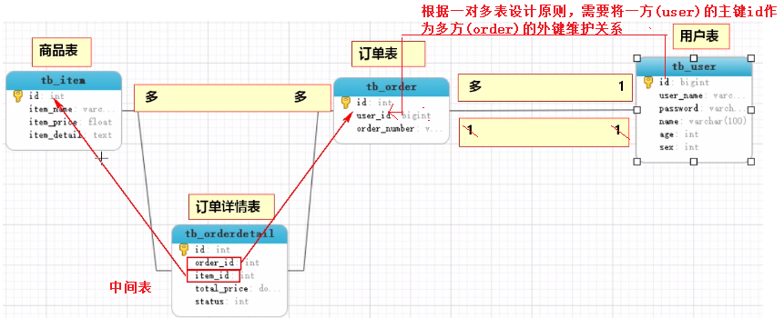
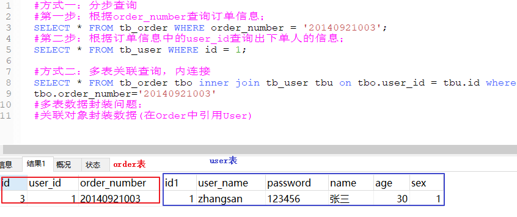
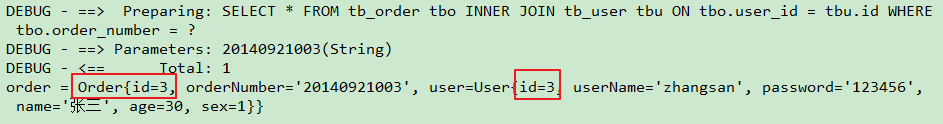
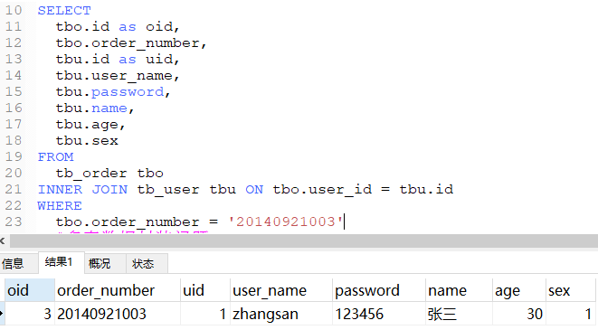
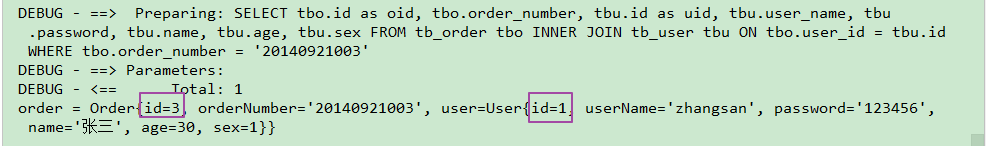
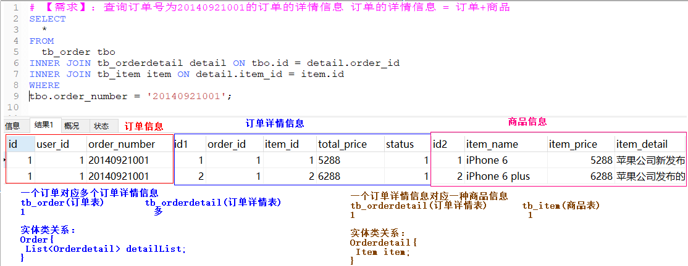

## 学习目标

~~~html
1. 掌握sqlMapConfig.xml中常用标签
2. 掌握mybatis框架在DAO层的开发
3. 能够完成单表的CRUD操作
4. 掌握mybatis框架的输入输出映射
5. 掌握MyBatis动态SQL
~~~

## 回顾

~~~java
1、数据库： DataBase-数据存储
2、数据操作：CRUD-增删改查
	【1】使用MySQL默认的客户端：  输入sql脚本操作数据
	【2】JDBC：java代码操作数据库中的数据（sql脚本）

3、JDBC：
	【1】导入mysql驱动包： java程序==》数据库软件
	【2】编码：JDBC
			//1、注册驱动：Class.forName("com.mysql.jdbc.Driver");
			//2、获取连接：Connection conn = DriverManager.getConnection(url,user,password);
			//3、创建操作：
					String sql = "SELECT * FROM user WHERE id = ?";
					PreparedStatement stmt = conn.preparedStatement(sql);
					stmt.setInt(1,1);
			//4、执行sql语句：
					ResultSet rs = stmt.executeQuery();
			//5、处理结果集：
                  while(rs.next()){
					int id = 	rs.getInt("id");
					String username = rs.getString("username");
					//获取其他字段数据..........
					
					//封装数据： User user = new User();
					 user.setId(id);
					 user.setUsername(username);
                  }
			//6、释放资源：close()

4、持久层框架：对JDBC进行封装--mybatis
		1、导入mybatis相关jar包；
		2、提供配置文件；
		3、框架开发；

~~~


<figure class="thumbnails">
    
</figure>


## 第一章、mybatis环境搭建

### 1、需求

~~~html
搭建mybatis环境，完成dao层根据id查询用户数据功能；
~~~

~~~sql
create table user (
  id int primary key auto_increment,
  username varchar(20) not null,
  age int,
  birthday date,
  sex char(1) default '男',
  address varchar(50)
);

insert into user values (null, '孙悟空',30,'1980-10-24','男','花果山水帘洞');
insert into user values (null, '白骨精',20,'1992-11-12','女','白虎岭白骨洞');
insert into user values (null, '猪八戒',20,'1983-05-20','男','福临山云栈洞');
insert into user values (null, '蜘蛛精',30,'1995-03-22','女','盤丝洞');

select * from user;
~~~

注意：我们在数据库中创建好表并添加数据之后，每次操作数据都要切换idea中，这样会比较麻烦，我们其实可以在idea中直接连接mysql数据库服务器，这样操作起来会更加简单，不用总是切换到数据库的图形化界面，那么接下来我们就开始学习下如何在idea中操作数据库服务器。

【步骤】

1.点击idea右边的database数据库工具栏


<figure class="thumbnails">
    
</figure>


​	说明：如果你的idea没有，请按照如下操作：


<figure class="thumbnails">
    
</figure>


2.

<figure class="thumbnails">
    
</figure>


3.配置连接数据库的参数


<figure class="thumbnails">
    
</figure>


4.操作数据库的界面


<figure class="thumbnails">
    
</figure>

<figure class="thumbnails">
    
</figure>


补充：如果驱动下载完毕。还是连接不上，需要按照如下做：修改mysql时间：

~~~java
set global time_zone='+8:00';
~~~

### 2、环境搭建

~~~html
1、创建项目，导入jar包；
2、准备接口和实体类：UserMapper.java，User.java
~~~

#### 【1】创建项目，导入jar包；


<figure class="thumbnails">
    
</figure>


#### 【2】准备实体类和接口：User.java，UserMapper.java

<figure class="thumbnails">
    
</figure>


User.java

~~~java
public class User {

    private Integer id;
    private String username;
    private Integer age;
    private Date birthday;
    private String sex;
    private String address;
  

    ......
}

~~~

UserMapper.java

~~~java
public interface UserMapper {
    //根据id查询
    User queryById(Integer id);
}
~~~


### 3、mybatis配置

~~~html
1、配置mybatis全局配置：mybatis-config.xml
2、配置mybatis映射文件：UserMapper.xml
3、测试
~~~

#### 【1】配置mybatis全局配置：mybatis-config.xml

~~~xml
<?xml version="1.0" encoding="UTF-8" ?>
<!DOCTYPE configuration
        PUBLIC "-//mybatis.org//DTD Config 3.0//EN"
        "http://mybatis.org/dtd/mybatis-3-config.dtd">
<configuration>
    <environments default="development">
        <environment id="development">
            <transactionManager type="JDBC"/>
            <dataSource type="POOLED">
                <property name="driver" value="com.mysql.jdbc.Driver"/>
                <property name="url" value="jdbc:mysql:///heima87_ssm"/>
                <property name="username" value="root"/>
                <property name="password" value="1234"/>
            </dataSource>
        </environment>
    </environments>
    <mappers>
        <mapper resource="UserMapper.xml"/>
    </mappers>
</configuration>
~~~


#### 【2】配置mybatis映射文件：UserMapper.xml

~~~xml
<?xml version="1.0" encoding="UTF-8" ?>
<!DOCTYPE mapper
        PUBLIC "-//mybatis.org//DTD Mapper 3.0//EN"
        "http://mybatis.org/dtd/mybatis-3-mapper.dtd">
<mapper namespace="com.heima.mybatis.mapper.UserMapper">
    <!--根据id查询-->
    <select id="queryById" resultType="com.heima.mybatis.pojo.User">
        select * from user where id = #{id}
    </select>
</mapper>
~~~


#### 【3】测试

~~~java
public class MyBatisTest {
    @Test
    public void queryById( ) throws Exception {
        //获取mapper接口的动态代理实现

        //1、从xml中构建SqlSessionFactory
        String resource = "mybatis-config.xml";
        InputStream inputStream = Resources.getResourceAsStream(resource);
        SqlSessionFactory sqlSessionFactory = new SqlSessionFactoryBuilder().build(inputStream);

        //2、获取SqlSession
        SqlSession sqlSession = sqlSessionFactory.openSession();

        //3、获取UserMapper接口的动态代理对象
        UserMapper userMapper = sqlSession.getMapper(UserMapper.class);

        User user = userMapper.queryById(1);
        System.out.println("user = " + user);
    }
}
~~~


## 第二章、mybatis映射文件配置

**【注意】**

​	Mapper映射文件中定义了操作数据库的sql,每一个sql都被包含在一个statement中。映射文件是mybatis操作数据库的核心。


<figure class="thumbnails">
    
</figure>


​	在映射文件中我们需要研究的内容有：SQL语句，入参，返回值


<figure class="thumbnails">
    
</figure>


### 2.1、SQL语句-CRUD

​	映射文件中需要直接书写SQL语句对数据库进行操作，对数据库操作SQL语句主要有CRUD这四类。这四类对应到映射文件中的配置为四类标签：`select`，`insert`,`update`，`delete` 。

- 接口

  ~~~java
  public interface UserMapper {
      /*
          查询所有用户
       */
      List<User> findAllUsers();
      //根据id查询
      User queryById(Integer id);
      //添加
      void saveUser(User user);
  
      //修改
      void updateUser(User user);
  
      //根据id删除
      void deleteUser(Integer id);
  }
  ~~~

  

#### 【1】select

Select标签：用来编写查询语句的statement

##### **【语法】**

UserMapper.xml代码：

```xml
<!--根据id查询用户数据-->
<!--parameterType="int" 表示sql语句参数id的类型，int是Integer的别名-->
<select id="queryById" resultType="user" parameterType="int">
    select * from user where id = #{id}
</select>
```

##### **【属性】**

| 属性名        | 说明                                      | 是否必须 |
| ------------- | ----------------------------------------- | -------- |
| id            | 这条SQL语句的唯一标识，和接口的方法名一致 | 是       |
| parameterType | 入参类型                                  | 否       |
| resultType    | 返回值类型                                | 是       |

【java代码】

~~~java
public class MyBatisTest01 {
   private static UserMapper userMapper;
    @BeforeClass
    public static void berofeClass() throws Exception {
        //1、从xml中构建SqlSessionFactory
        String resource = "mybatis-config.xml";
        InputStream inputStream = Resources.getResourceAsStream(resource);
        //这里指定了环境为test
//        SqlSessionFactory sqlSessionFactory = new SqlSessionFactoryBuilder().build(inputStream,"test");
        //build不方法不指定环境就使用默认的 <environments default="development">
        SqlSessionFactory sqlSessionFactory = new SqlSessionFactoryBuilder().build(inputStream);

        //2、获取SqlSession
        SqlSession sqlSession = sqlSessionFactory.openSession(true);

        //3、获取UserMapper接口的动态代理对象
         userMapper = sqlSession.getMapper(UserMapper.class);
    } 
	@Test
    public void queryById() throws Exception {
        //获取mapper接口的动态代理实现
        User user = userMapper.queryById(1);
        System.out.println("user = " + user);
    }
 }
~~~

说明：userMapper只需要创建一个对象即可，所以在这里需要将获取userMapper的对象代码放到@BeforeClass注解修饰的方法中。下面直接使用同一个userMapper对象即可。


#### 【2】insert

insert标签：编写新增语句的statement

##### **【语法】**

```xml
 <!--新增
	注意：#{username},#{birthday},#{sex},#{address} 大括号里面的值必须和pojo的实体类User类中的属性名一致，否则会报错。其实这里看的是User类中的getXxx()的get后面的xxx内容
例如 getUserName---看的是userName ,就是将get去掉，U变为小写u,后面不变
-->
<insert id="saveUser">
    insert into user values (null ,#{username},#{birthday},#{sex},#{address})
</insert>
```

**注意：#{username},#{birthday},#{sex},#{address} 大括号里面的值必须和pojo的实体类User类中的属性名一致，否则会报错。其实这里看的是User类中的getXxx()的get后面的xxx内容**
**例如 getUserName---看的是userName ,就是将get去掉，U变为小写u,后面不变**

##### **【属性】**

| 属性 | 说明                                      | 是否必须 |
| ---- | ----------------------------------------- | -------- |
| id   | 这条SQL语句的唯一标识，和接口的方法名一致 | 是       |

##### 【测试】

注意：需要改为自动提交事务。

 SqlSession sqlSession = sqlSessionFactory.openSession(**true**);

测试新增方法

```java
/*
        mysql是自动提交事务，但是如果mysql将事务交给mybatis处理，而mybatis属于手动处理事务，需要使用
         SqlSession sqlSession = sqlSessionFactory.openSession(true);
         来开启自动提交事务
     */
    @Test
    public void saveUser() throws Exception {
        User user = new User();
        user.setUsername("蔡徐坤");
        user.setBirthday(new Date());
        user.setSex("男");
        user.setAddress("上海");

        userMapper.saveUser(user);
    }
```

说明：

 mysql是自动提交事务，但是如果mysql将事务交给mybatis处理，而mybatis属于手动处理事务，需要使用
 SqlSession sqlSession = sqlSessionFactory.openSession(**true**);
 来开启自动提交事务


#### 【3】update

update标签：编写更新语句的statement

##### 【语法】

```xml
 <!--修改-->
    <!--
        username = #{username}
        1.等号左边表示数据表列名
        2.#{username} 这里的username需要和pojo中的get和set方法后面的标识符一致
    -->
    <update id="updateUser">
        update user set username = #{username},birthday=#{birthday},sex=#{sex},address=#{address} where id = #{id}
    </update>
```

##### 【属性】

| 属性 | 说明                                  | 是否必须 |
| ---- | ------------------------------------- | -------- |
| id   | SQL语句的唯一标识，和接口的方法名一致 | 是       |

##### 【测试】

```java
	@Test
    public void updateUser(){
        User user = new User();
        user.setUsername("锁哥");
        user.setBirthday(new Date());
        user.setSex("男");
        user.setAddress("黑龙江");

        user.setId(6);
        userMapper.updateUser(user);
    }
```


【注意事项】

```html
	使用SQL语句修改数据时需要根据id修改，所以id必须传入；
```


#### 【4】delete

##### 【语法】

```xml
<!--删除-->
<delete id="deleteUser" >
    delete from user where id = #{id}
</delete>
```

##### 【属性】

| 属性 | 说明                                  | 是否必须 |
| ---- | ------------------------------------- | -------- |
| id   | SQL语句的唯一标识，和接口的方法名一致 | 是       |

##### 【测试】

```java
 @Test
public void deleteUser(){
    userMapper.deleteUser(6);
}
```


### 2.2、传入的参数

#### 【1】parameterType

​	CRUD标签都有一个属性parameterType，底层的statement通过它指定接收的参数类型。入参数据有以下几种类型：HashMap，基本数据类型（包装类），实体类；

```html
	设置传入这条语句的参数类的完全限定名或别名。这个属性是可选的，因为 MyBatis 可以通过类型处理器（TypeHandler） 推断出具体传入语句的参数类型。
```


<figure class="thumbnails">
    
</figure>


说明：

**在mybatis中入参的数据类型分为2种：**

1. 简单数据类型：int,string,long,Date，String;

2. 复杂数据类型：类(JavaBean)和Map;

​	说明：如果传递参数是数组或者集合，底层都会封装到Map集合中。

【示例】

~~~java
public interface UserMapper {
    //根据id查询
    User queryById(Integer id);
}
~~~


```xml
【基本类型数据】
<!--根据id查询-->
<!--parameterType="int" 表示sql语句参数id的类型，int是Integer的别名.MyBatis 可以通过类型处理器（TypeHandler） 根据接口中的方法User queryById(Integer id)参数类型推断出具体传入语句的参数类型。-->
<select id="queryById" resultType="user" parameterType="int">
    select * from user where id = #{id}
</select>

【pojo类型】
<insert id="savetUser" parameterType="User">
  INSERT INTO user(...)
</insert>
```

说明：对于parameterType属性可以不书写，那么MyBatis 就会通过类型处理器（TypeHandler） 根据接口中的方法User queryById(Integer id)参数类型推断出具体传入语句的参数类型。

#### 【2】自增主键回填（了解）

【需求】

```html
新增一条数据成功后，将这条数据的主键封装到实体类中，并查看主键的值。
```

【实现】

测试类代码：

~~~java
    @Test
    public void saveUser() throws Exception {
        User user = new User();
        user.setUsername("蔡徐坤");
        user.setBirthday(new Date());
        user.setSex("男");
        user.setAddress("上海");

        userMapper.saveUser(user);

        //查看新的数据的主键值
        System.out.println(user.getId());//null
    }
~~~

直接获取的结果是null。

按照如下方式可以实现添加好数据直接将主键封装到实体类对象中，如下：

##### **实现：使用insert标签的属性useGeneratedKeys，keyProperty，keyColumn实现；**

| 属性             | 说明                                              |
| ---------------- | ------------------------------------------------- |
| useGeneratedKeys | true 获取自动生成的主键，将主键封装到实体类对象中 |
| keyColumn        | 表中主键的列名                                    |
| keyProperty      | 实体类中主键的属性名                              |

映射文件

```xml
<insert id="saveUser" useGeneratedKeys="true" keyColumn="id" keyProperty="id">
        insert into user values (null ,#{username},#{birthday},#{sex},#{address})
</insert>
```

##### 小结

1. 添加用户使用哪个标签？

   insert

2. 得到主键值方式？

   1. 在insert中添加属性useGeneratedKeys="true" keyColumn="id" keyProperty="id"


#### 【3】单个参数，多个参数(重点)

主要是针对简单类型的数据(int,string,long,Date)等数据进行入参处理。

##### 【单个参数】

```html
单个参数：接口方法传入一个参数
```

###### 【接口传参】

```java
 User queryById(Integer id);
```

###### 【接收参数】

**1、通过#{参数名}接收**

```xml
    <!--根据id查询-->
    <select id="queryById" resultType="User" parameterType="int">
        select *,user_name AS  userName from user where id = #{id}
    </select>
```

**2、通过#{任意变量名}接收**

```xml
    <!--根据id查询-->
    <select id="queryById" resultType="User" parameterType="int">
        select *,user_name AS  userName from user where id = #{abc}
    </select>
```

###### 【结论】

```html
当接口方法传入一个参数时，mybatis不做特殊处理，只需要#{任意变量名}都可接收；
```


##### 【多个参数】

需求：根据用户名和性别查询用户

###### 【接口传参】

```java
//根据用户名和性别查询
User queryByUserNameAndSex(String userName, String sex);
```

【UserMapper.xml】

~~~xml
<select id="queryByUserNameAndSex" resultType="User">
        select * from user where username=#{username} and sex=#{sex}
</select>
~~~

【测试类】

~~~java
    @Test
    public void queryByUserNameAndSex() throws Exception {
        User user = userMapper.queryByUserNameAndSex("孙悟空", "男");
        System.out.println("user = " + user);
    }
~~~

【结果】


<figure class="thumbnails">
    
</figure>


上述报异常了，当传入多个参数时，mybatis底层进行了处理。我们需要按照如下方式解决异常：

###### 【接收参数】

**1、使用命名参数获取，明确指定传入参数的名称：**(掌握)

  步骤一：在接口中传入参数时通过@Param指定参数名称

```java
//根据用户名和性别查询
User queryByUserNameAndSex(@Param("username") String userName, @Param("sex") String sex);
```

  步骤二：在接收参数时，通过指定的名称获取参数值；

```xml
    <!--根据用户名和性别查询-->
    <select id="queryByUserNameAndSex" resultType="User">
        <!--#{username}这里的username是@Param("username")，也就是说@Param("标识符")标识符是什么，这里就写什么-->
        select * from user where username=#{username} and sex=#{sex}
    </select>
```


###### 【小结】

```html
1、多个参数的取值方式：
    命名参数：#{参数名}  
2、无论使用的是单个参数还是多个参数，建议都使用命名参数进行传值；
```


#### 【4】pojo参数【重点】

```html
使用pojo来传递参数
```

**接口添加方法：**

```java
    //新增
    void saveUser(User user);
```

**映射文件：**

```xml
<!--新增-->
<insert id="saveUser">
    insert into user values (null ,#{username},#{birthday},#{sex},#{address})
</insert>
```

说明：接口方法传入pojo类型的数据时，mybatis底层直接使用pojo封装数据。  sql语句中  #{username}取值==》到pojo中调用 getUsername(){}

**测试:**

```java
    @Test
    public void saveUser() throws Exception {
        User user = new User();
        user.setUsername("蔡徐坤");
        user.setBirthday(new Date());
        user.setSex("男");
        user.setAddress("上海");
        userMapper.saveUser(user);
    }
```

#### 【5】HashMap参数

需求：模拟用户登录，登录方法参数是Map集合，泛型都是String类型分别表示用户名和性别。

在UserMapper接口中添加以下方法：

```java
/**
 * 用户登陆，参数为map
 * @return
 */
User login(Map<String,String> map);
```


**UserMapper配置文件：**

```xml
<!--
   将map的key作为参数名称来传递参数
-->
<select id="login" resultType="User">
     select * from user where username=#{username} and sex=#{sex}
</select>
```


**测试用例：**

```java
    @Test
    public void login(){
        Map<String, String> map = new HashMap<>();
        map.put("username","孙悟空");
        map.put("sex","男");
        User user = userMapper.login(map);
        System.out.println(user);
    }
```

**注意事项：**

```html
参数map中的key值是与SQL语句中 #{} 的取值名称一致。
```


#### 【6】入参小结：接口方法传入的参数

~~~html
mybatis中能够接收2种类型的参数传入：

【1】简单类型数据：
	 单个数据： queryById(Integer id);
		 mybatis底层不做处理，使用任意变量都可接收   #{abc}
	 多个数据： queryByUsernameAndSex(@Param("username")String username,@Param("sex")String sex);
   使用命名参数取值   queryByUsernameAndSex(@Param("username")String username);
			 sql取值：  #{username}


【2】复杂数据类型：
	1.pojo类型数据：mybatis底层直接使用pojo封装数据
			sql取值：  #{pojo的属性名}   #{username}==>调用pojo的 getUsername(){}
    2.map集合数据：mybatis底层直接使用map封装参数
			Map<String,String>  put("username","白骨精")
              #{username}
~~~


### 2.3、参数值的获取之面试题#和$区别


<figure class="thumbnails">
    
</figure>


说明：我们上述一直在讲解接口中的方法传入的参数，那么接下来我们要讲解如何在sql语句中获取传入的数据，其实我们之前也在一直使用一种方式就是**#{}**的方式。	

参数值的获取指的是，statement获取接口方法中传入的参数。获取参数，有两种方式：**#{}**和**${}**；


<figure class="thumbnails">
    
</figure>


#### 【1】#{}和${}取值

**`#{}` 取值：**


<figure class="thumbnails">
    
</figure>


mybatis后台处理：


<figure class="thumbnails">
    
</figure>


**`${}` 取值：**


<figure class="thumbnails">
    
</figure>


mybatis后台处理：

【接口方法】

~~~java
//根据id查询
User queryById(@Param("id") Integer id);
~~~

【测试类】

~~~java
    @Test
    public void queryById() throws Exception {
        //获取mapper接口的动态代理实现
        User user = userMapper.queryById(1);
        System.out.println("user = " + user);
    }
~~~


<figure class="thumbnails">
    
</figure>


【注意】${id} 获取id值时，必须使用命名参数取值：


<figure class="thumbnails">
    
</figure>


如果不使用命名参数取值，即不在接口中加入@Param("id")，就会报异常：


<figure class="thumbnails">
    
</figure>


**【小结】**

```html
1、SQL语句中获取参数的方式：
	#{xxx}  sql:select * from user where id = ?
	${xxx} sql:select * from user where id = 1
2、取值的相同点：
	都能够获取接口方法传入的参数值
3、取值的不同点：
	#{}取值：是以预编译的形式将参数设置到SQL语句中。PreparedStatement 防止SQL注入；
	${}取值：直接把获取到的参数值，拼接到sql语句中，会有安全问题；不能防止SQL注入；
4、小结：
	SQL传入参数的获取使用#{}；
	拼接参数使用${}；
```


#### 【2】${}取值的应用场景

​	在一些特殊的应用场景中，需要对SQL语句部分（不是参数）进行拼接，这个时候就必须使用${}来进行拼接，不能使用#{}.例如：

```html
	1、企业开发中随着数据量的增大，往往会将数据表按照年份进行分表，如：2017_user，2018_user....，对这些表进行查询就需要动态把年份传入进来，而年份是表名的一部分，并不是参数，JDBC无法对其预编译，所以只能使用${}进行拼接：  
	SELECT * FROM ${year}_user；
	
	2、根据表名查询数据总记录数：
		SELECT COUNT(*) FROM user
		SELECT COUNT(*) FROM order
		SELECT COUNT(*) FROM  ${tableName}
简言之：如果需要设置到SQL中的不是查询的条件，只能使用${}拼接；
```

**示例：**

需求：查询user表中的总记录数。

【映射文件】：

```xml
 <select id="selectCountByTableName" resultType="int">
      select count(*) from ${tableName}
 </select>
```

【接口】：

~~~java
 //需求：查询user表中的总记录数。
 int selectCountByTableName(@Param("tableName") String table);
~~~

【测试类】

~~~java
   @Test
    public void selectCountByTableName(){
        int count = userMapper.selectCountByTableName("user");
        System.out.println("count = " + count);
    }
~~~

**小结：**

```html
SQL中非参数部分的拼接使用${}
举例：
	select * from user where username=#{username} and sex=#{sex} 这里 #{username} #{sex} 都属于参数部分，所以是#{}
	 select count(*) from ${tableName} 这里${tableName} 属于表名，不是参数部分，所以使用${}
```

#### 【3】${}取值注意事项

**【 ${}获取单个值】**了解

​	`${}` 获取单个值时，最好是通过命名参数的形式获取。如果不指定参数的，也可以使用${value}来获取传入的单个值；

传入参数：没有指定参数名称


<figure class="thumbnails">
    
</figure>


获取参数：通过${value获取}


<figure class="thumbnails">
    
</figure>


**【${}获取配置文件中的值】**

有时候，我们如果非要使用$来接收参数，将login修改如下：

```xml
    <!--根据用户名和性别查询-->
    <select id="queryByUserNameAndSex" resultType="User">
        SELECT  * FROM  user WHERE  user_name = '${username}' AND  sex = #{sex}
    </select>
```

说明：上述sql语句中：SELECT  * FROM  user WHERE  user_name = **'${username}'** AND  sex = #{sex}

对于 '${username}' 加单引号是因为${}获取数据的方式直接将获取的数据拼接到字符串上，并不会加引号，如果获取的值是数值型，没有问题，但是如果是字符类型就会有问题，所以需要加上引号进行拼接。

假设${username}获取的值是锁哥，那么不加单引号效果是：

~~~sql
SELECT  * FROM  user WHERE  user_name = 锁哥 AND  sex = #{sex} 
显然是不可以的，而加上单引号效果就是：
SELECT  * FROM  user WHERE  user_name = '锁哥' AND  sex = #{sex} 
~~~


**测试方法：**

```java
    @Test
    public void queryByUserNameAndPassword( ){
        User user = userMapper.queryByUserNameAndSex("孙悟空", "男");
        System.out.println("user = " + user);
    }
```

**执行测试：**发现测试方法中传递的参数明明是孙悟空，却获取到了jdbc.properties资源文件中的root.


 <figure class="thumbnails">
    
</figure>


**原因：**`$`可以获取资源文件中的数据，比如mybatis-config.xml中使用`$`获取连接信息就是。

```
<property name="driver" value="${driver}"/>
```

由于映射文件中使用的${username}的参数名称正好和资源文件jdbc.properties中的key相同，因此获取到了资源文件中的数据。

​	这种错误发生的根本原因是因为资源文件中的key和参数名称重名了，为了解决这个文件，我们只需要将资源文件中的key设置成唯一的不会被重复的key即可。

解决方案：在资源文件中的key中添加前缀

**修改资源文件：**

```properties
jdbc.driverClass=com.mysql.jdbc.Driver
jdbc.url=jdbc:mysql://localhost:3306/heima37
jdbc.username=root
jdbc.password=root
```

**修改mybatis-config.xml：**

```xml
<dataSource type="POOLED">
    <!-- 配置连接信息 -->
    <property name="driver" value="${jdbc.driverClass}" />
    <property name="url" value="${jdbc.url}" />
    <property name="username" value="${jdbc.username}" />
    <property name="password" value="${jdbc.password}" />
</dataSource>
```


#### 【小结】

```html
1、#{}和${}取值的相同点：
	  都能够获取传入的命名参数

2、#{}和${}取值的不同点：
	#{}: 以预编译的方式将参数设置到sql语句中  防止SQL注入 。可以自动加单引号
	${}: 把参数直接拼接到sql语句中  不能够防止sql注入。不能自动加单引号。
3、具体应用：
	#{}获取sql语句中的条件参数
	${}应用于sql语句拼接和读取配置文件
	
```


### 2.4、结果映射

我们已经学习了入参和获取参数的方式，接下来学习最后的返回值。


<figure class="thumbnails">
    
</figure>


```html
	在使用原生的JDBC操作时，对于结果集ResultSet，需要手动处理。mybatis框架提供了resultType和resultMap来对结果集进行封装。
```

**注意：只要一个方法有返回值需要处理，那么 resultType和resultMap必须有一个**

#### 【1】resultType

```html
	从sql语句中返回的期望类型的类的完全限定名或别名。 注意如果返回的是集合，那应该设置为集合包含的类型，而不是集合本身。可以使用 resultType 或 resultMap，但不能同时使用。
```

##### 返回值是基本类型

例如 int ,string ===>resultType="书写对应的基本类型别名或者全名即可"


<figure class="thumbnails">
    
</figure>


##### 返回值为一个pojo(User)对象时

【定义resultType为User】


<figure class="thumbnails">
    
</figure>


 【使用User来接收返回值】


<figure class="thumbnails">
    
</figure>


##### 返回值为一个List<User>时

​	当返回值为List集合时，resultType需要设置成集合中存储的具体的pojo数据类型：

【映射文件】


<figure class="thumbnails">
    
</figure>


【接口】


<figure class="thumbnails">
    
</figure>


【测试类】

~~~java
//1.使用接口对象调用接口中的方法
List<User> userList = mapper.findAllUsers();
//2.遍历集合
for (User user : userList) {
    System.out.println(user);
}
~~~


##### 返回值为map

###### 【1】返回一条数据，封装到map中

需求：查询id是1的数据，将查询的结果封装到Map<String,Object>中

接口方法：

~~~java
 //需求：查询id是1的数据，将查询的结果封装到Map<String,Object>中
 Map<String,Object> selectByIdReturnMap(Integer id);
~~~

SQL语句：

~~~xml
<select id="selectByIdReturnMap" resultType="map">
        select * from user where id=#{id}
</select> 
~~~

测试：原来封装到对象中的数据也能够封装到map中

~~~java
@Test
public void selectByIdReturnMap(){
    Map<String, Object> map = userMapper.selectByIdReturnMap(1);
    System.out.println("map = " + map);
}
~~~

结果：

~~~java
map = {birthday=1980-10-24, address=花果山水帘洞, sex=男, id=1, username=孙悟空}
~~~

通过上述结果我们发现如果返回一条数据放到Map中，那么列名会作为Map集合的key,结果作为Map集合的value:


<figure class="thumbnails">
    
</figure>


###### 【2】返回多条数据，封装到map中

​	需求：查询数据表所有的数据封装到Map<String,User>集合中

​	要求： Key值为一条记录的主键，Value值为pojo的对象.

​	

​	如下所示：


<figure class="thumbnails">
    
</figure>


接口方法：接口方法上面通过注解 @MapKey指定key值封装的列数据

~~~java
   //需求：查询数据表所有的数据封装到Map<String,User>集合中
    @MapKey("id")
    Map<String, User> selectReturnMap();
~~~

说明：需要在接口的方法上使用注解@MapKey指定数据表中哪一列作为Map集合的key，否则mybatis不知道具体哪个列作为Map集合的key.

SQL语句：

~~~xml
<select id="selectReturnMap" resultType="map">
        select * from user
</select>
~~~

测试代码：

~~~java
    @Test
    public void selectReturnMap(){
        Map<String, User> map = userMapper.selectReturnMap();
        System.out.println("map = " + map);
    }
~~~

结果：

~~~java
map = {1={birthday=1980-10-24, address=花果山水帘洞, sex=男, id=1, username=孙悟空}, 2={birthday=1992-11-12, address=白虎岭白骨洞, sex=女, id=2, username=白骨精}, 3={birthday=1983-05-20, address=福临山云栈洞, sex=男, id=3, username=猪八戒}, 4={birthday=1995-03-22, address=盤丝洞, sex=女, id=4, username=蜘蛛精}, 7={birthday=2020-06-05, address=上海, sex=男, id=7, username=蔡徐坤}, 8={birthday=2020-06-05, address=上海, sex=男, id=8, username=蔡徐坤}, 9={birthday=2020-06-05, address=上海, sex=男, id=9, username=蔡徐坤}, 10={birthday=2020-06-05, address=上海, sex=男, id=10, username=蔡徐坤}, 11={birthday=2020-06-06, address=上海, sex=男, id=11, username=蔡徐坤}}

~~~

#### 【2】resultMap(掌握)

ResultMap是mybatis中最重要最强大的元素，使用ResultMap可以解决两大问题：

1. POJO属性名和表结构字段名不一致的问题（有些情况下也不是标准的驼峰格式，比如id和userId）
2. 完成高级查询，比如说，一对一、一对多、多对多。(后面多表中会涉及到)

 查询数据的时候，查不到userName的信息，原因：数据库的字段名是user_name，而POJO中的属性名字是userName
两端不一致，造成mybatis无法填充对应的字段信息。修改方法：在sql语句中使用别名
**解决方案1**：在sql语句中使用别名

~~~xml
<select id="queryById" resultType="user" parameterType="int">
   select *,name as username from user where id = #{id}
</select>
~~~

**解决方案2**：参考驼峰匹配 --- mybatis-config.xml 的时候

```xml
<settings>
   <setting name="mapUnderscoreToCamelCase" value="true" />
</settings>
```

注意：这种解决方案只能解决列名是下划线命名.

**解决方案3**：resultMap自定义映射

通过案例掌握resultMap的使用方式之一，手动配置实体类中属性和表中字段的映射关系

##### 【需求】

```html
使用resultMap完成结果集的封装（resultSet===》JavaBean）
```

##### 【实现步骤】

```html
手动配置实体类属性和表字段映射关系的步骤如下：
1、	配置自定义结果集<resultMap>
2、	配置id映射
3、	配置其他普通属性的映射
```

**步骤一：**将驼峰匹配注释掉
​	一旦注释掉驼峰匹配，那么再通过queryUserById查询的结果中，用户名就无法封装了，此时我们可以尝试使用ResultMap来解决这个问题。

**步骤二：**配置resultMap

resultMap标签的作用:自定义结果集，自行设置结果集的封装方式

```html
id属性：resultMap标签的唯一标识，不能重复，一般是用来被引用的
type属性：结果集的封装类型
autoMapping属性：操作单表时，不配置默认为true,如果pojo对象中的属性名称和表中字段名称相同，则自动映射。
```

在映射文件中自定义结果集类型：

```html
    <!--
            type="user" 表示结果集的封装类型是user
    -->
<resultMap id="userResultMap" type="User" autoMapping="true">
   <!--配置主键映射关系-->
   <id column="id" property="id"></id>
   <!--配置用户名的映射关系  column 表示数据表列  property表示pojo的属性-->
  <result column="name" property="username"></result>
</resultMap>
```

**步骤三**：修改查询语句的statement
在查询语句的select标签中通过resultMap属性可以引用自定义结果集作为数据的封装方式。

```xml
<!--
     resultMap属性：引用自定义结果集作为数据的封装方式.属性值是自定义resultMap标签的id属性值，这里表示通过id引入自定义的resultMap标签
-->
<select id="queryById" resultMap="userResultMap">
    select * from user where id = #{id}
</select>
```

测试代码：

~~~java
    @Test
    public void queryById() throws Exception {
        //获取mapper接口的动态代理实现
        User user = userMapper.queryById(1);
        System.out.println("user = " + user);
    }
~~~

**注意：**测试完记得将驼峰命名的配置重新开启，因为其他的测试方法还要用。


##### 【小结】

resultMap可以用来手动配置属性和字段的映射关系：

**属性：**

```html
1、id属性
定义唯一标识，用来被sql语句的声明引用的

2、type属性
配置结果集类型，将查询的数据往哪个类型中封装

3、autoMapping属性的值
	为true时：在字段和属性名称相同时，会进行自动映射。如果不配置，则默认为true。
	为false时：只针对resultMap中已经配置的字段作映射。
```

**子标签：**

```html
1、id子标签
	配置主键的映射关系
2、result子标签
	配置其他普通属性和字段的映射关系
```


## 第三章、SQL片段

在java代码中，为了提高代码的重用性，针对一些出现频率较高的代码，抽离出来一个共同的方法或者类
那么针对一些重复出现的sql片段，mybatis有没有一个比较好的解决方案呢？

​	Mybatis当然想到了这一点，它就是**sql标签**。

​	SQL片段有两种使用方式：**1、引用当前文件中的SQL片段；2、引入独立文件中的SQL片段；**


### 3.1、引用当前文件中的SQL片段

​	sql标签可以定义一个sql片段，在需要使用该sql片段的地方，通过<include refid="sql片段id"/>标签来使用。

#### 【1】定义SQL片段

```xml
<!--定义SQL片段-->
<sql id="commonSql">
         id,
         user_name AS userName,
  		age,
          sex,
          birthday,
      	  address
</sql>
```

注意：SQL片段必须设置id属性；

#### 【2】使用SQL片段

​	在SQL语句中通过`<include>`标签引入SQL片段；

```xml
  <select id="queryById"  resultType="User">
        select <include refid="commonSql"/> from user where id = #{id}
    </select>
```


<figure class="thumbnails">
    
</figure>


**【测试】**

<figure class="thumbnails">
    
</figure>


### 3.2、引入独立文件中的SQL片段；

​	很多时候同一个sql片段，可能在多个映射文件中都有使用，如果每一个映射文件都编写一个相同的sql就比较麻烦，因此可以将通用的sql片段都定义在一个专门存放sql片段的映射文件中，然后由其他映射文件引用它即可。
如下，在src目录下新增CommonSQL.xml文件：

#### 【1】新建SQL片段文件

​	复制一份映射文件，将SQL片段写入即可

**【CommonSQL.xml】**

```xml
<?xml version="1.0" encoding="UTF-8" ?>
<!DOCTYPE mapper
        PUBLIC "-//mybatis.org//DTD Mapper 3.0//EN"
        "http://mybatis.org/dtd/mybatis-3-mapper.dtd">

<mapper namespace="CommonSQL">
    <sql id="commonSql">
         id,
         user_name AS userName,
      	age,
          sex,
          birthday,
      	  address
    </sql>
</mapper>
```


#### 【2】在mybatis核心配置文件mybatis-config.xml引入SQL片段文件

​	定义好sql片段的映射文件之后，接下来就该使用它了，首先应该把该映射文件引入到mybatis的全局配置文件中（mybatis-config.xml）：


<figure class="thumbnails">
    
</figure>


#### 【3】引用SQL片段

​	最后在需要使用该sql片段的地方通过include标签的refId属性引用该sql片段：`<include refId=”名称空间.sql片段的id” />`
在UserMapper.xml的映射文件中，进一步改造根据用户名查询用户信息

<figure class="thumbnails">
    
</figure>


### 【小结】

Sql片段的出现是为了提高sql语句的复用性，其使用方式如下：

```html
1、在映射文件中使用sql标签编写sql片段
2、在映射文件中使用include标签引用sql片段
	1）当前映射文件中的使用：直接通过sql标签中的id引用
	2）如果是在其他映射文件中引用： namespace.id来引用
```


## 第四章、动态SQL

MyBatis 的强大特性之一便是它的动态 SQL。如果你有使用 JDBC 或其它类似框架的经验，你就能体会到根据不同条件拼接 SQL 语句的痛苦。例如拼接时要确保不能忘记添加必要的空格，还要注意去掉列表最后一个列名的逗号。利用动态 SQL 这一特性可以彻底摆脱这种痛苦。


例如，下面需求就会使用到拼接sql语句：

【需求】：查询**男性**用户，**如果输入了用户名，按用户名模糊查询**,如果**没有输入用户名，就查询所有男性用户**。

正常的sql语句：查询男性并且用户名中包含zhang


<figure class="thumbnails">
    
</figure>


```sql
select * from tb_user where sex = "男" and user_name like '%zhang%'
```


<figure class="thumbnails">
    
</figure>


```sql
select * from tb_user where  sex = "男"  
```

​	实现需求时还要判断用户是否输入用户名来做不同的查询要求，而这里似乎没有办法判断是否输入了用户名，因此可以考虑使用动态sql来完成这个功能。


​	动态 SQL 元素和后面学习的 JSTL 或基于之前学习的类似 XML 的文本处理器相似。在 MyBatis 之前的版本中，有很多元素需要花时间了解。MyBatis 3 开始精简了元素种类，现在只需学习原来一半的元素便可。MyBatis 采用功能强大的 OGNL 的表达式来淘汰其它大部分元素。

常见标签如下：

```tex
if：判断   if(1 gt 2){}
choose (when, otherwise)：分支判断    switch:多选一
trim (where, set)：去除
foreach：循环遍历标签
```

动态SQL中的业务逻辑判断需要使用到以下运算符： ognl表达式

```tex
1.   e1 or e2 满足一个即可
2.   e1 and e2 都得满足
3.    e1 == e2,e1 eq e2 判断是否相等
4.    e1 != e2,e1 neq e2 不相等
5.    e1 lt e2：小于   lt表示less than 
6.    e1 lte e2：小于等于，其他gt（大于）,gte（大于等于） gt 表示greater than
7.    e1 in e2 
8.    e1 not in e2
9.    e1 + e2,e1 * e2,e1/e2,e1 - e2,e1%e2
10.   !e,not e：非，求反
11.   e.method(args)调用对象方法
12.   e.property对象属性值
13.   e1[ e2 ]按索引取值，List,数组和Map
14.   @class@method(args)调用类的静态方法
15.   @class@field调用类的静态字段值
```


### 1、if标签

格式：

```xml
 <if test="判断条件">
   满足条件执行的代码
 </if>
说明：
 1）if标签：判断语句，用于进行逻辑判断的。如果判断条件为true，则执行if标签的文本内容
 2）test属性：用来编写表达式，支持ognl；
```

【需求】：查询**男性**用户，**如果输入了用户名，按用户名模糊查询**,如果**没有输入用户名，就查询所有男性用户**。

正常的sql语句：查询男性并且用户名中包含zhang


<figure class="thumbnails">
    
</figure>


```sql
select * from tb_user where sex = "男" and user_name like '%zhang%'
```


<figure class="thumbnails">
    
</figure>


```sql
select * from tb_user where  sex = "男"  
```

​	实现需求时还要判断用户是否输入用户名来做不同的查询要求，而这里似乎没有办法判断是否输入了用户名，因此可以考虑使用动态sql来完成这个功能。

​	上述动态sql语句部分： and user_name like '%zhang%' 

#### 1.1、定义接口方法

​	在UserMapper接口中，定义如下方法：

```java
   /**
     * 根据用户名模糊查询
     * @param userName
     * @return
     */
    List<User> queryLikeUserName(@Param("userName") String userName);
```


#### 1.2、编写SQL

​	在UserMapper.xml文件中编写与方法名同名的sql语句：

```xml
  <select id="queryLikeUserName" resultType="user">
       select * from user where sex='男'
       <if test="userName!=null and userName.trim()!=''">
           and username like '%${userName}%'
       </if>
   </select>
```

【注】`<if>` 判断中：

1、if标签：用来判断；

2、test属性：使用OGNL表达式，完成具体的判断业务逻辑；

**3、这里使用的字符串拼接，所以这里不能是#取值，只能使用$取值，否则会报错**


#### 1.3、测试

【userName有值】


<figure class="thumbnails">
    
</figure>


对应的SQL语句是：select * from user where sex="男" and username like '%孙%' 

【userName没有值】


<figure class="thumbnails">
    
</figure>


对应的SQL语句是：select * from user where sex="男" 

【小结】

```tex
1、if标签：用来在sql中处理判断是否成立的情况；
2、属性：test中书写OGNL表达式，如果结果为true，if标签的文本中的内容会被拼接到SQL中，反之不会被拼接到SQL中；
3、if标签的应用场景：适用于 二选一 
```


### 2、choose，when，otherwise

```tex
choose标签：分支选择（多选一，遇到成立的条件即停止）
	when子标签：编写条件，不管有多少个when条件，一旦其中一个条件成立，后面的when条件都不执行。
           test属性：编写ognl表达式
	otherwise子标签：当所有条件都不满足时，才会执行该条件。
```


 需求：

```tex
编写一个查询方法，设置两个参数，一个是用户名，一个是住址。

根据用户名或者住址查询所有男性用户:
	如果输入了用户名则按照用户名模糊查找，
	否则就按照住址查找，两个条件只能成立一个，
	如果都不输入就查找用户名为“孙悟空”的用户。
```

【需求分析】

1、查询所有男性用户,如果输入了用户名则按照用户名模糊查找;

```sql
SELECT * FROM  user WHERE  sex = "男" AND  username LIKE  '%孙%';
```

2、查询所有男性用户,如果输入了住址则按照住址查询；

```sql
SELECT * FROM  user WHERE  sex = "男" AND  address = "花果山水帘洞";
```

3、查询所有男性用户，如果都不输入就查找用户名为“孙悟空”的用户。

```sql
SELECT * FROM  user WHERE  sex = "男" AND username = '孙悟空';
```


#### 2.1、定义接口方法

在UserMapper接口中，定义接口方法：

```java
 /*
    查询用户名或者地址
  */
 List<User> queryByUserNameOrAddress(@Param("userName") String userName, @Param("address") String address);
```


#### 2.2、编写SQL

在UserMapper.xml中编写对应的SQL语句

```xml
<!--
        根据用户名或者住址查询所有男性用户:
            如果输入了用户名则按照用户名模糊查找，
            否则就按照住址查找，两个条件只能成立一个，
            如果都不输入就查找用户名为“孙悟空”的用户。
  -->
    <select id="queryByUserNameOrAddress" resultType="user">
        select * from user where sex='男'
        <choose>
            <when test="userName!=null and userName.trim()!=''">
                and username like '%${userName}%'
            </when>
            <when test="address!=null and address.trim()!=''">
                and address = #{address}
            </when>
            <otherwise>
                and username='孙悟空'
            </otherwise>
        </choose>
    </select>
```

#### 2.3、测试

编写测试类，对这个方法进行测试：

```java
@Test
public void queryByUserNameOrAddress(){
    List<User> userList = userMapper.queryByUserNameOrAddress("", null);
    System.out.println("userList = " + userList);
}
```

【小结】

```tex
1、choose，when，otherwise标签组合的作用类似于java中的switch语句，使用于多选一；
```


### 3、where

 where标签：拼接多条件查询时 1、能够添加where关键字； 2、能够去除多余的and或者or关键字

案例：按照如下条件查询所有用户，

```tex
如果输入了用户名按照用户名进行查询，
如果输入住址，按住址进行查询，
如果两者都输入，两个条件都要成立。
```

【需求分析】

1、如果输入了用户名按照用户名进行查询，

```sql
SELECT * FROM  user WHERE user_name = '孙悟空';
```

2、如果输入住址，按住址进行查询，

```sql
SELECT * FROM  user WHERE address='花果山水帘洞';
```

3、如果两者都输入，两个条件都要成立。

```sql
SELECT * FROM  user WHERE user_name = '孙悟空' AND address='花果山水帘洞';
```

#### 3.1、定义接口方法

在UserMapper接口中定义如下方法：

```java
List<User> queryByUserNameAndAge(@Param("userName") String userName, @Param("address") String address);
```


#### 3.2、编写SQL

在UserMapper.xml中编写SQL

```xml
 <!--
        如果输入了用户名按照用户名进行查询，
        如果输入住址，按住址进行查询，
        如果两者都输入，两个条件都要成立。

        说明：如果按照如下写sql语句会有问题，假设用户名username是空，那么用户名的sql语句不参与条件，此时
        sql语句就会变为：SELECT * FROM  user where AND address = #{address}
        where后面直接书写了and显然不满足sql语句语法，这里会报错
        我们可以使用where标签解决上述问题：
             where标签：拼接多条件查询时 1、能够添加where关键字； 2、能够去除多余的and或者or关键字
    -->
   <!-- <select id="queryByUserNameAndAge" resultType="user">
        SELECT * FROM  user where
            <if test="userName != null and userName.trim()!=''">
                username = #{userName}
            </if>
            <if test="address!=null and address.trim()!=''">
                AND address = #{address}
            </if>
    </select>-->
    <!-- SELECT * FROM user WHERE address = ?
        where子标签将and去掉了
    -->
    <select id="queryByUserNameAndAge" resultType="user">
        SELECT * FROM  user
        <where>
            <if test="userName != null and userName.trim()!=''">
                username = #{userName}
            </if>
            <if test="address!=null and address.trim()!=''">
                AND address = #{address}
            </if>
        </where>
    </select>
```

说明：

1.说明：如果按照如下写sql语句会有问题，假设用户名username是空，那么用户名的sql语句不参与条件，此时
        sql语句就会变为：SELECT * FROM  user where AND address = #{address}
        where后面直接书写了and显然不满足sql语句语法，这里会报错
        我们可以使用where标签解决上述问题：
             where标签：拼接多条件查询时 1、能够添加where关键字； 2、能够去除多余的and或者or关键字

2.SELECT * FROM user WHERE address = ?
       where子标签将and去掉了


#### 3.3、测试

```java
@Test
    public void queryByUserNameAndAge() {
        List<User> userList = userMapper.queryByUserNameAndAge("", "花果山水帘洞");
        System.out.println("userList = " + userList);
    }
```


<figure class="thumbnails">
    
</figure>


只传入住址，此时where子标签去掉了and.

【小结】

```tex
1、<where>标签作用：用于拼接多选一或者同时成立的SQL情况；
2、<where>还会根据情况，动态的去掉SQL语句中的AND或者or；
```


### 4、set

set标签：在update语句中,可以自动添加一个set关键字，并且会将动态sql多余的逗号去除。

案例：修改用户信息，如果参数user中的某个属性为null，则不修改。

如果在正常编写更新语句时，如下：


<figure class="thumbnails">
    
</figure>


 ~~~sql
update user SET username = ?, birthday=?, sex=?, where id = ? 
 ~~~

那么一旦在传递的参数中没有address，此时生成的sql语句就会因为多了一个逗号而报错。


#### 4.1、定义接口方法

在UserMapper接口中定义如下方法：

```java
void updateSelectiveUser(User user);
```


#### 4.2、编写SQL

在UserMapper.xml文件中编写如下SQL:

```xml
    <!--选择性地对user数据进行修改-->
   <update id="updateSelectiveUser">
        update user
        <set>
            <if test="username != null and username.trim()!=''">
                username = #{username},
            </if>
            <if test="birthday != null">
                birthday=#{birthday},
            </if>
            <if test="sex != null and sex.trim()!=''">
                sex=#{sex},
            </if>
            <if test="address != null and address.trim()!=''">
                address=#{address}
            </if>
        </set>
        where id = #{id}
    </update>
```


#### 4.3、测试

```java
 @Test
    public void updateSelectiveUser() {
        User user = new User();
        user.setUsername("锁哥1");
        user.setBirthday(new Date());
        user.setSex("男");
        user.setAddress("");

        user.setId(7);
        userMapper.updateSelectiveUser(user);
    }
```

【结果】

~~~sql
 update user SET username = ?, birthday=?, sex=? where id = ? 
~~~


【小结】

```tex
1、<set>标签替代了sql语句中的set关键字；
2、<set>标签还能把sql中多余的,去掉；
```


### 5、foreach

```xml
foreach标签：遍历集合或者数组
<foreach collection="集合名或者数组名" item="元素" separator="标签分隔符" open="以什么开始" close="以什么结束">
   #{元素}
</foreach>
	collection属性：接收的集合或者数组,集合名或者数组名
	item属性：集合或者数组参数中的每一个元素 
	separator属性：标签分隔符 
	open属性：以什么开始 
	close属性：以什么结束
```

需求：按照id值是1，2，3来查询用户数据；

#### 5.1、定义接口方法

在UserMapper接口中定义如下方法：

```java
List<User> queryByIds(@Param("arrIds") Integer[] arrIds);
```

**这里一定加@Param("arrIds")，否则报错**

#### 5.2、编写SQL

```xml
	<!--根据多个id值查询-->
    <select id="queryByIds" resultType="user">
        SELECT * FROM  user WHERE id IN
        <foreach collection="arrIds" item="ID" separator="," open="(" close=")">
            #{ID}
        </foreach>
    </select>
```

#### 5.3、测试

```java
    @Test
    public void queryByIds() {
        Integer[] arrIds = {1,2,3};
        List<User> userList = userMapper.queryByIds(arrIds);
        System.out.println("userList = " + userList);
    }
```


<figure class="thumbnails">
    
</figure>


【小结】

```tex
<foreach>标签的作用：用于对查询参数进行遍历取值；
```


### 6、小结

```tex
If标签：条件判断
	test属性：编写ognl表达式

where标签：用于sql动态条件拼接，添加where关键字，可以将动态sql多余的第一个and或者or去除。

set标签: 用于更新语句的拼接，添加set关键字，并可以将动态sql中多余的逗号去除

foreach标签：用于遍历参数中的数组或者集合
	collection属性：参数中的数组或者集合
	item属性：表示数组或者集合中的某个元素
	separator属性：分隔符
	open:以什么开始
	close:以什么结束
```


## 第五章 mybatis高级查询【掌握】

### 1、准备工作

#### 【1】包结构

创建java项目，导入jar包和log4j日志配置文件以及连接数据库的配置文件；


<figure class="thumbnails">
    
</figure>


#### 【2】导入SQL脚本

运行资料中的sql脚本：**mybatis.sql**


<figure class="thumbnails">
    
</figure>


<figure class="thumbnails">
    
</figure>


#### 【3】创建实体来包，导入资料中的pojo


<figure class="thumbnails">
    
</figure>


#### 【4】UserMapper接口

~~~java
package com.itheima.sh.dao;
import com.itheima.sh.pojo.User;
public interface UserMapper {
    //完成根据id查询用户数据；
    User selectById(Long id);
}
~~~

#### 【5】UserMapper.xml

~~~xml
<?xml version="1.0" encoding="UTF-8" ?>
<!DOCTYPE mapper
        PUBLIC "-//mybatis.org//DTD Mapper 3.0//EN"
        "http://mybatis.org/dtd/mybatis-3-mapper.dtd">
<mapper namespace="com.heima.mybatis.mapper.UserMapper">

    <!--根据id查询:statement-->
    <select id="selectById"  resultType="User">
        SELECT *  FROM  tb_user WHERE  id=#{id}
    </select>

</mapper>
~~~

#### 【6】测试

~~~java
package com.itheima.sh.test;

import com.itheima.sh.dao.UserMapper;
import com.itheima.sh.pojo.User;
import org.apache.ibatis.io.Resources;
import org.apache.ibatis.session.SqlSession;
import org.apache.ibatis.session.SqlSessionFactory;
import org.apache.ibatis.session.SqlSessionFactoryBuilder;
import org.junit.BeforeClass;
import org.junit.Test;

import java.io.IOException;
import java.io.InputStream;

public class MybatisTest01 {
    private static UserMapper mapper = null;

    @BeforeClass
    public static void beforeClass() throws Exception {
        //1.构建SessionFactory
        String resouce = "mybatis-config.xml";
        InputStream is = Resources.getResourceAsStream(resouce);
        SqlSessionFactory build = new SqlSessionFactoryBuilder().build(is);
        //2.获取session
        SqlSession sqlSession = build.openSession(true);
        //3.获取接口对象
        mapper = sqlSession.getMapper(UserMapper.class);
    }

    @Test
    public void selectById() {
        User user = mapper.selectById(1L);
        System.out.println(user);
    }
}
~~~


### 2、表介绍和表关系说明

导入资料中mybatis.sql脚本。新建以下4张表

```html
tb_user：用户表
tb_order：订单表
tb_item：商品表
tb_orderdetail：订单详情表
```


<figure class="thumbnails">
    
</figure>


【表关系】

```tex
1.tb_user和 tb_order表关系
	tb_user  《==》  tb_order：一对多， 一个人可以下多个订单
	tb_order 《==》 tb_user：一对一，一个订单只能属于一个人
	结论：tb_user和tb_order属于一对多的关系，需要将一方tb_user的主键作为多方tb_order的外键维护关系
2.tb_order 和 tb_item 表关系
	tb_order 《==》 tb_item ：一个订单可以有多个商品
	tb_item 《==》 tb_order：一个商品可以在多个订单上
	结论：tb_order和tb_item属于多对多的关系，需要创建中间表tb_orderdetail维护两个表的关系，并且将两张表	的主键作为中间表的外键
```


### 3、一对一查询

需求：通过订单编号20140921003查询出**订单信息**，并查询出**下单人信息**。

#### 【实现：关联查询】

【目标】使用多表关联查询，完成根据订单号查询订单信息和下单人信息（订单号：20140921003）

【分析】

一个订单编号对应一个订单，一个订单只能属于一个人。所以上述需求实现是一对一的实现。

【步骤】

```tex
1、首先，编写接口方法。编写SQL语句；
2、第二步：分析SQL，封装数据（关联对象）；
3、处理多表之间的数据封装（数据库字段名---》实体类的属性名之间的映射）
```

【实现】

##### 第一步：需求分析

​	编写多表关联查询SQL，根据订单号查询**订单信息**及**下单人**信息；

查询语句以及查询结果：


<figure class="thumbnails">
    
</figure>


```sql
    #方式一：分步查询
	#第一步：根据order_number查询订单信息；
	SELECT * FROM tb_order WHERE order_number = '20140921003';
	#第二步：根据订单信息中的user_id查询出下单人的信息；
	SELECT * FROM tb_user WHERE id = 1;

  #方式二：多表关联查询，内连接
	SELECT * FROM tb_order tbo inner join tb_user tbu on tbo.user_id = tbu.id where 
  tbo.order_number='20140921003'
	#多表数据封装问题：
	#关联对象封装数据(在Order中引用User)
```

##### 第二步：添加关联

修改Order：

​	在Order类中，添加关联对象User，并添加getter和setter方法；

```java
package com.itheima.sh.pojo;
/**
 * 订单表
 * 
 */
public class Order {
    private Integer id;
    private String orderNumber;
    //关联User对象
    private User user;
    public Integer getId() {
        return id;
    }

    public void setId(Integer id) {
        this.id = id;
    }

    public String getOrderNumber() {
        return orderNumber;
    }
    public void setOrderNumber(String orderNumber) {
        this.orderNumber = orderNumber;
    }
    public User getUser() {
        return user;
    }
    public void setUser(User user) {
        this.user = user;
    }
    @Override
    public String toString() {
        return "Order{" +
                "id=" + id +
                ", orderNumber='" + orderNumber + '\'' +
                ", user=" + user +
                '}';
    }
}
```


##### 第三步：添加方法

编写OrderMapper接口


<figure class="thumbnails">
    
</figure>


```java
public interface OrderMapper {
       /**
     * 根据订单号查询订单及下单人的信息：方式二
     * @param orderNumber
     * @return
     */
    Order queryOrderAndUserByOrderNumber2(@Param("orderNumber")String orderNumber);
}

```


##### 第四步：编写SQL

在OrderMapper.xml中编写对应的SQL，并将OrderMapper.xml加入到mybatis-config.xml全局配置中；


<figure class="thumbnails">
    
</figure>


【OrderMapper.xml代码；】

说明：

~~~java
association：配置关联对象（User）的映射关系
 <association property="user" javaType="User" autoMapping="true">
           
  </association>
	属性：
		property：关联对象在主表实体类中的属性名；property="user" 表示在Order类中的引用的User类的对象		   成员变量名
		javaType：关联对象的类型；javaType="User" 表示引用的user对象属于User类型
~~~


~~~xml
<?xml version="1.0" encoding="UTF-8" ?>
<!DOCTYPE mapper
        PUBLIC "-//mybatis.org//DTD Mapper 3.0//EN"
        "http://mybatis.org/dtd/mybatis-3-mapper.dtd">
<!--
映射文件
namespace 指定接口的类全名
-->
<mapper namespace="com.itheima.sh.dao.OrderMapper">
    <!--
        1.autoMapping="true" 表示只需要给当前表的id然后自动映射当前表的其他列值到
        对应实体类的属性中，这属于偷懒行为，开发中我们最好都书写出来
        2.id标签表示id的映射关系
        3.result标签表示其他列和pojo类的属性映射关系
        4.一对一映射关系使用子标签association来表示引用的另一个pojo类的对象
    -->
    <resultMap id="orderAndUserResultRelative" type="Order" autoMapping="true">
        <!--主表主键-->
        <id column="id" property="id"/>
        <!--关联关系-->
        <!--
            1.property="user" 表示在Order类中的引用的User类的对象成员变量名
            2.javaType="User" 表示引用的user对象属于User类型
        -->
        <association property="user" javaType="User" autoMapping="true">
            <!--从表主键-->
            <id column="id" property="id"/>
            <!--<result column="user_name" property="userName"/>-->
        </association>
    </resultMap>

    <!--多表关联查询：一对一-->
    <select id="queryOrderAndUserByOrderNumber2" resultMap="orderAndUserResultRelative">
        SELECT
            *
        FROM
            tb_order tbo
            INNER JOIN tb_user tbu ON tbo.user_id = tbu.id
        WHERE
            tbo.order_number = #{orderNumber}
    </select>
</mapper>
~~~

说明：

~~~java
1、由于queryOrderAndUserByOrderNumber2查询的结果Order对象中需要封装User信息，所以返回值不能够再使用单纯的resultType来操作；

2、定义resultMap进行关联查询的配置，其中：
	属性：
		id：标识这个resultMap；
		type：返回的结果类型
    	autoMapping="true"： 表示只需要给当前表的id然后自动映射当前表的其他列值到对应实体类的属性中，这		  属于偷懒行为，开发中我们最好都书写出来
	子元素：
		id：主表主键映射
		result：主表普通字段的映射
		association:关联对象的映射配置
		
3、association：配置关联对象（User）的映射关系
	属性：
		property：关联对象在主表实体类中的属性名；property="user" 表示在Order类中的引用的User类的对象		   成员变量名
		javaType：关联对象的类型；javaType="User" 表示引用的user对象属于User类型
~~~

##### 第五步：测试

~~~java
package com.itheima.sh.test;

import com.itheima.sh.dao.OrderMapper;
import com.itheima.sh.dao.UserMapper;
import com.itheima.sh.pojo.Order;
import com.itheima.sh.pojo.User;
import org.apache.ibatis.io.Resources;
import org.apache.ibatis.session.SqlSession;
import org.apache.ibatis.session.SqlSessionFactory;
import org.apache.ibatis.session.SqlSessionFactoryBuilder;
import org.junit.BeforeClass;
import org.junit.Test;
import java.io.InputStream;
public class MybatisTest02 {
    private static OrderMapper mapper = null;
    @BeforeClass
    public static void beforeClass() throws Exception {
        //1.构建SessionFactory
        String resouce = "mybatis-config.xml";
        InputStream is = Resources.getResourceAsStream(resouce);
        SqlSessionFactory build = new SqlSessionFactoryBuilder().build(is);
        //2.获取session
        SqlSession sqlSession = build.openSession(true);
        //3.获取接口对象
        mapper = sqlSession.getMapper(OrderMapper.class);
    }
    @Test
    public void selectById() {
        Order order = mapper.queryOrderAndUserByOrderNumber2("20140921003");
        System.out.println("order = " + order);
    }
}
~~~

【测试结果】


<figure class="thumbnails">
    
</figure>


##### 注意事项

通过上述测试结果，我们发现User的id是错误的，不是3，正确结果是1：

<figure class="thumbnails">
    
</figure>


因为tb_user表的主键是id，tb_order的主键也是id。查询的结果中有两列相同的id字段。在将查询结果封装到实体类的过程中就会封装错误。

注意：user表查询的是id不是id1,由于SQLyog图形化界面显示的原因。可以在cmd窗口查看结果：


<figure class="thumbnails">
    
</figure>


【解决方案】

```html
1、建议将所要查询的所有字段显示地写出来；
2、将多表关联查询结果中，相同的字段名取不同的别名；
```


<figure class="thumbnails">
    
</figure>


<figure class="thumbnails">
    
</figure>


resultMap中应该如下配置：


<figure class="thumbnails">
    
</figure>


【正确结果】


<figure class="thumbnails">
    
</figure>


##### 【小结】

```xml
一对一关联查询：
1、需要在Order实体类中关联User对象；最终将数据封装到Order中；
2、在OrderMapper.xml文件中书写关联语句并配置关系；
3、关联关系配置：
	    <resultMap id="orderAndUserResultRelative" type="Order" autoMapping="true">
            <!--主表主键-->
            <id column="oid" property="id"/>
            <!--关联关系-->
            <association property="user" javaType="User" autoMapping="true">
                <!--从表主键-->
                <id column="uid" property="id"/>
            </association>
        </resultMap>
```


### 4、一对多查询

【目标】查询id为1的用户及其订单信息

【分析】

​	一个用户可以有多个订单。

​	一个订单只能属于一个用户。

用户(1)-----订单(n)

【步骤】

```tex
第一步：查询SQL分析；
第二步：添加关联关系；
第三步：编写接口方法；
第四步：编写映射文件；
第五步：测试
```

【实现】

##### 第一步：需求分析

编写SQL实现**查询id为1的用户及其订单信息**

查询语句及查询结果：


<figure class="thumbnails">
    
</figure>


```sql
#查询id为1的用户及其订单信息
select * from tb_user where id=1;
select * from tb_order where user_id=1;

#一对多 内连接查询
select * from tb_user tbu inner join tb_order tbo on tbu.id = tbo.user_id where tbu.id=1;
# 封装数据：关联对象，一个用户关联多个订单  User(List<Order> orderList)
```

说明：一个用户关联多个订单  User(List<Order> orderList) ，在User类中定义一个List集合存储多个订单Order对象。


##### 第二步：添加映射关系

​	因为一个用户可以拥有多个订单，所以**用户**和**订单**是**一对多**的关系；需要在User类中添加一个`List<Order>` 属性；

```java
package com.itheima.sh.pojo;

import java.io.Serializable;
import java.util.List;

public class User implements Serializable {

    private Long id;

    // 用户名
    private String userName;

    // 密码
    private String password;

    // 姓名
    private String name;

    // 年龄
    private Integer age;
	//0 女性 1 男性
    private Integer sex;

    //订单
    List<Order> orders;

    public Long getId() {
        return id;
    }

    public void setId(Long id) {
        this.id = id;
    }

    public String getUserName() {
        return userName;
    }

    public void setUserName(String userName) {
        this.userName = userName;
    }

    public String getPassword() {
        return password;
    }

    public void setPassword(String password) {
        this.password = password;
    }

    public String getName() {
        return name;
    }

    public void setName(String name) {
        this.name = name;
    }

    public Integer getAge() {
        return age;
    }

    public void setAge(Integer age) {
        this.age = age;
    }

    public Integer getSex() {
        return sex;
    }

    public void setSex(Integer sex) {
        this.sex = sex;
    }

    public List<Order> getOrders() {
        return orders;
    }

    public void setOrders(List<Order> orders) {
        this.orders = orders;
    }

    @Override
    public String toString() {
        return "User{" +
                "id=" + id +
                ", userName='" + userName + '\'' +
                ", password='" + password + '\'' +
                ", name='" + name + '\'' +
                ", age=" + age +
                ", sex=" + sex +
                ", orders=" + orders +
                '}';
    }
}

```


##### 第三步：编写接口方法

在**UserMapper接口**中，添加关联查询；

```java
  /**
     * 根据用户id查询用户及其订单信息
     * @param id
     * @return
     */
    User oneToManyQuery(@Param("id") Long id);
```


##### 第四步：编写SQL

​	在**UserMapper.xml**文件中编写SQL语句完成一对多的关联查询；

说明：

~~~xml
1.一对多使用collection子标签进行关联多方Order
  <collection property="类中引用多方的成员变量名" javaType="存放多方容器的类型" ofType="多方类型" autoMapping="true">
  </collection>
2.属性：
    1）property="orders" 这里的orders表示User类的成员变量orders
    2）javaType="List" 表示User类的成员变量orders存储的Order对象使用的类型，这里是List
    3) ofType="Order" 表示List集合中存储数据的类型 Order
3.一定要记住这里给user表的id起别名是uid,order表的id起别名是oid.在resultMap标签的id子标签中的column属性值书写对应的uid和oid.
~~~


```xml
    <!--自定义结果集-->
    <resultMap id="oneToManyResult" type="User" autoMapping="true">
        <!--User的主键-->
        <id column="uid" property="id"/>
        <!--Order关联映射-->
        <!--
            1.一对多使用collection子标签进行关联多方Order
            2.属性：
                1）property="orders" 这里的orders表示User类的成员变量orders
                2）javaType="List" 表示User类的成员变量orders存储的Order对象使用的类型，这里是List
                3) ofType="Order" 表示List集合中存储数据的类型 Order
        -->

        <collection property="orders" javaType="List" ofType="Order" autoMapping="true">
            <!--Order的主键-->
            <id column="oid" property="id" />
        </collection>
    </resultMap>

    <!--根据用户ID查询用户及其订单数据-->
    <select id="oneToManyQuery" resultMap="oneToManyResult">
        SELECT
            tbo.id as oid,
            tbo.order_number,
            tbu.id as uid,
            tbu.user_name,
            tbu.password,
            tbu.name,
            tbu.age,
            tbu.sex
        FROM
            tb_user tbu
            INNER JOIN tb_order tbo ON tbu.id = tbo.user_id
        WHERE
            tbu.id = #{id}
    </select>
```

##### 第五步：测试

在用户的测试类中

```java
public class MybatisTest01 {
    private static UserMapper mapper = null;

    @BeforeClass
    public static void beforeClass() throws Exception {
        //1.构建SessionFactory
        String resouce = "mybatis-config.xml";
        InputStream is = Resources.getResourceAsStream(resouce);
        SqlSessionFactory build = new SqlSessionFactoryBuilder().build(is);
        //2.获取session
        SqlSession sqlSession = build.openSession(true);
        //3.获取接口对象
        mapper = sqlSession.getMapper(UserMapper.class);
    }  
	//根据用户ID查询用户及其订单数据
    @Test
    public void oneToManyQuery() {
        User user = mapper.oneToManyQuery(1L);
        System.out.println("user = " + user);
    }
}
```


<figure class="thumbnails">
    
</figure>


##### 【小结】

```tex
一对多关系配置：
1、在对象中添加映射关系；
2、编写接口方法，编写SQL；
3、编写resultMap处理数据库字段和实体类之间数据的封装；
```


### 5、多对多

【需求】：查询订单号为20140921001的订单的详情信息即查询订单信息+订单中的商品信息；

**【步骤】**

```tex
第一步：需求分析；
第二步：添加关联关系；
第三步：编写SQL；
第四步：配置关联关系；
第五步：运行；
```

##### 第一步：【需求分析】


<figure class="thumbnails">
    
</figure>


~~~
1、查询订单详情信息即：查询订单信息+订单中的商品信息；
2、订单信息在tb_order中，订单中的商品信息在tb_item中，这两个表是通过中间表 tb_orderdetail进行关联的。
3、关联查询思路：先查询订单表，通过订单表中的id关联中间表order_id,然后查询中间表，根据中间表的item_id关联商品表的id,最后查询商品表；
~~~

【SQL查询及结果】


<figure class="thumbnails">
    
</figure>


```sql
# 【需求】：查询订单号为20140921001的订单的详情信息 订单的详情信息 = 订单+商品
SELECT
	*
FROM
	tb_order tbo
INNER JOIN tb_orderdetail detail ON tbo.id = detail.order_id
INNER JOIN tb_item item ON detail.item_id = item.id
WHERE
tbo.order_number = '20140921001';
```


##### 第二步：添加关联关系

**【修改Order】**

​	一个订单表中关联了多个订单详情信息，所以在订单表中添加`List<Orderdetail>`属性：

【Order.java】

```java
package com.itheima.sh.pojo;
import java.util.List;
/**
 * 订单表
 * 
 */
public class Order {
    private Integer id;
    private String orderNumber;
    //关联User对象
    private User user;
    //关联订单详情列表
    private List<Orderdetail> detailList;
    public Integer getId() {
        return id;
    }

    public void setId(Integer id) {
        this.id = id;
    }

    public String getOrderNumber() {
        return orderNumber;
    }

    public void setOrderNumber(String orderNumber) {
        this.orderNumber = orderNumber;
    }

    public User getUser() {
        return user;
    }

    public void setUser(User user) {
        this.user = user;
    }

    public List<Orderdetail> getDetailList() {
        return detailList;
    }

    public void setDetailList(List<Orderdetail> detailList) {
        this.detailList = detailList;
    }

    @Override
    public String toString() {
        return "Order{" +
                "id=" + id +
                ", orderNumber='" + orderNumber + '\'' +
                ", user=" + user +
                ", detailList=" + detailList +
                '}';
    }
}
```


**【修改Orderdetail】**

​	每一条订单详情记录中都包含了一条商品信息，所以需要在Orderdetail中添加一个Item属性；

【Orderdetail.java】

```java
package com.itheima.sh.pojo;
public class Orderdetail {   
    private Integer id;  
    private Double totalPrice;  
    private Integer status;
    //商品信息
    private Item item;
    public Integer getId() {
        return id;
    }
    public void setId(Integer id) {
        this.id = id;
    }

    public Double getTotalPrice() {
        return totalPrice;
    }

    public void setTotalPrice(Double totalPrice) {
        this.totalPrice = totalPrice;
    }

    public Integer getStatus() {
        return status;
    }

    public void setStatus(Integer status) {
        this.status = status;
    }

    public Item getItem() {
        return item;
    }

    public void setItem(Item item) {
        this.item = item;
    }
    @Override
    public String toString() {
        return "Orderdetail{" +
                "id=" + id +
                ", totalPrice=" + totalPrice +
                ", status=" + status +
                ", item=" + item +
                '}';
    }
}
```


##### 第三步：编写接口方法

​	在OrderMapper接口中新增，根据orderNumber查询订单及订单详情的方法：

```java
public interface OrderMapper {
    /**
     * 根据orderNumber查询订单及其详情信息
     * @param orderNumber
     * @return
     */
    Order queryOrderAndDetailByOrderNumber(@Param("orderNumber") String orderNumber);
}
```


##### 第四步：编写SQL

说明：一定要记住这里给order表的id起别名是oid,订单详情表的id起别名是detailId，商品表item的id起别名是itemId。在resultMap标签的id子标签中的column属性值书写对应的oid、detailId和itemId.

```xml
 <!--订单及订单详情结果集-->
    <resultMap id="orderAndDetailMap" type="Order" autoMapping="true">
        <!--tb_order表 和 Order实体类-->
        <!--订单表主键-->
        <id property="id" column="oid"/>
        <!--多个订单详情 1对多：detailList-->
        <collection property="detailList" javaType="List" ofType="Orderdetail" autoMapping="true">
            <!--tb_order_detail表  和 Orderdetail实体类-->
            <!--订单详情主键  detailId表示下面sql语句的别名-->
            <id property="id" column="detailId"/>

            <!--关联商品对象  一对一：orderdetail-Item-->
            <association property="item" javaType="Item" autoMapping="true">
                <!--tb_item表 和 Item实体类  itemId 表示下面的sql语句别名-->
                <id property="id" column="itemId"/>
            </association>
        </collection>
    </resultMap>

    <!--多对多查询-->
    <select id="queryOrderAndDetailByOrderNumber" resultMap="orderAndDetailMap">
        SELECT
            tbo.id as oid,
            tbo.order_number,
            detail.id as detailId,
            detail.total_price,
            detail.status,
            item.id as itemId,
            item.item_detail,
            item.item_name,
            item.item_price
        FROM
            tb_order tbo
            INNER JOIN tb_orderdetail detail ON tbo.id = detail.order_id
            INNER JOIN tb_item item ON detail.item_id = item.id
        WHERE
            tbo.order_number = #{orderNumber};
    </select>
```


##### 第五步：测试

~~~java
    @Test
    public void queryOrderAndDetailByOrderNumber() {
        Order order = mapper.queryOrderAndDetailByOrderNumber("20140921001");
        System.out.println("order = " + order);
    }
~~~


<figure class="thumbnails">
    
</figure>


【结果】


<figure class="thumbnails">
    
</figure>


<figure class="thumbnails">
    
</figure>


#### 【扩展】

【需求】根据订单号（20140921001）

​		**查询订单信息**

​		**查询订单所属用户信息**

​		**查询订单中的详细商品信息**


<figure class="thumbnails">
    
</figure>


【SQL实现及查询结果】

​	通过分析，实现这个查询就在上面的查询基础上再关联一个一对一的User信息；


<figure class="thumbnails">
    
</figure>


```sql
#查询订单详情
SELECT
	tbo.id as oid,
	tbo.order_number,
	detail.id as detailId,
	detail.total_price,
	detail.status,
	item.id as itemId,
	item.item_detail,
	item.item_name,
	item.item_price,
	tbu.id as uid,
	tbu.age,
	tbu.name,
	tbu.password,
	tbu.sex,
	tbu.user_name
FROM
	tb_order tbo
INNER JOIN tb_orderdetail detail ON tbo.id = detail.order_id
INNER JOIN tb_item item ON detail.item_id = item.id
INNER JOIN tb_user tbu ON tbo.user_id = tbu.id
WHERE
tbo.order_number = '20140921001';
```

【添加关联关系】

都已经在实体类添加完毕，直接操作即可

##### 【编写接口方法】

在OrderMapper接口中再扩展一个方法：queryOrderAndDetailAndUserByOrderNumber

```java
    /**
     * 根据orderNumber查询 订单，详情，商品及用户数据
     * @param orderNumber
     * @return
     */
    Order queryOrderAndDetailAndUserByOrderNumber(@Param("orderNumber") String orderNumber);
```

##### 【编写SQL】

```xml
 <!--订单及订单详情结果集-->
    <resultMap id="orderAndDetailMapPlus" type="Order" autoMapping="true">
        <!--tb_order表 和 Order实体类-->
        <!--订单表主键-->
        <id property="id" column="oid"/>
        <!--Order-User：一对一关联-->
        <association property="user" javaType="User" autoMapping="true">
            <!--User主键-->
            <id property="id" column="uid"/>
        </association>
        <!--多个订单详情 1对多：detailList-->
        <collection property="detailList" javaType="List" ofType="Orderdetail" autoMapping="true">
            <!--tb_order_detail表  和 Orderdetail实体类-->
            <!--订单详情主键-->
            <id property="id" column="detailId"/>

            <!--关联商品对象  一对一：orderdetail-Item-->
            <association property="item" javaType="Item" autoMapping="true">
                <!--tb_item表 和 Item实体类-->
                <id property="id" column="itemId"/>
            </association>
        </collection>
    </resultMap>
    <select id="queryOrderAndDetailAndUserByOrderNumber" resultMap="orderAndDetailMapPlus">
        SELECT
            tbo.id as oid,
            tbo.order_number,
            detail.id as detailId,
            detail.total_price,
            detail.status,
            item.id as itemId,
            item.item_detail,
            item.item_name,
            item.item_price,
            tbu.id as uid,
            tbu.age,
            tbu.name,
            tbu.password,
            tbu.sex,
            tbu.user_name
        FROM
            tb_order tbo
            INNER JOIN tb_orderdetail detail ON tbo.id = detail.order_id
            INNER JOIN tb_item item ON detail.item_id = item.id
            INNER JOIN tb_user tbu ON tbo.user_id = tbu.id
        WHERE
            tbo.order_number = #{orderNumber};
    </select>
```


##### 【测试】


<figure class="thumbnails">
    
</figure>


【结果】


<figure class="thumbnails">
    
</figure>


### 6、ResultMap继承

​	如果两个结果集有重叠的部分，如下图所示。我们可以使用结果集继承来实现重叠的结果集的复用。


<figure class="thumbnails">
    
</figure>


`orderAndDetailAndUserMap`结果集可以继承`orderAndDetailMap`结果集。


<figure class="thumbnails">
    
</figure>


### 7、高级查询小结

```tex
resutlType无法帮助我们自动的去完成映射，所以只有使用resultMap手动的进行映射
resultMap: 
	属性：
        type 结果集对应的数据类型  Order
        id 唯一标识，被引用的时候，进行指定
        autoMapping 开启自动映射
        extends 继承
	子标签：
	 id:配置id属性
	 result:配置其他属性
      association：配置一对一的映射
          property 定义对象的属性名
          javaType 属性的类型
          autoMapping 开启自动映射
      collection：配置一对多的映射
          property 定义对象的属性名
          javaType 集合的类型
          ofType 集合中的元素类型 泛型
  		  autoMapping 开启自动映射
```


##  总结

~~~html
一、全局配置：能够影响mybatis的运行
	【1】能够配置的参数：
			properties:
			settings:
			typeAliases:
			mappers:
	【2】properties：属性
		作用：设置参数 ，加载外部的资源文件中的参数
		用法：
			1、设置参数：
				<properties>
					<property name="driver" value="com.mysql.jdbc.Driver"></property>
				</properties>
			   取参数： ${driver}
			2、加载外部的资源文件：从src路径下加载
				<properties resource="jdbc.properties"></properties>
				获取资源文件中的参数： ${key}

	【3】settings设置：
			开启驼峰自动映射：
				<settings>
                  		<setting name="mapUnderscoreToCamelCase" value="true"/>
				</settings>
			作用： 数据库下划线命名： user_name    驼峰命名：userName
	【4】typeAliases：类型别名 
			作用：给全限定类名 取一个 短名称  com.heima.mybatis.pojo.User ==> User
			用法：
				1、单独设置：
					<typeAliases>
                      	<typeAliase type="com.heima.mybatis.pojo.User" alias="User"></typeAliase>
					</typeAliases>

				2、批量设置：包扫描
					<typeAliases>
                      	<package name="com.heima.mybatis.pojo"></package>
          			</typeAliases>
	【5】mappers 映射器：
		【作用】管理映射文件 和  接口
		【配置】
			1、加载xml文件
				 从src下加载：resource="UserMapper.xml"
				 从本地磁盘： url="file:///E://aaa.xml"

			2、加载接口: 接口和映射文件同名，在相同的包下面
				 单独加载： class="com.heima.mybatis.dao.UserMapper"
				 批量加载： package="com.heima.mybatis.dao"


二、映射文件配置
	【1】作用：配置sql相关信息 
			 1、CRUD四类标签：
			 2、sql标签：sql片段
			 3、resultMap：
	【2】CRUD四类标签：
			增： <insert></insert>
			删： <delete></delete>
			改：<update></update>
			查：<select></select>

	【3】入参相关：<select resultType="User" paramType="int">
      				SELECT * FROM user WHERE id = #{id}
				</select>
			
		paramType：设置传入的参数的类型，可以省略
		insert语句相关：自增主键回填--数据插入到数据库之后，返回这条数据在数据库中的主键值
			【1】子标签：<selectKey></selectKey>
		<selectKey keyColumn="id" keyProperty="id" resultType="int" order="AFTER">
            SELECT LAST_INSERT_ID() ;
        </selectKey>
			【2】属性：
				useGeneratedKeys="true" keyColumn="id" keyProperty="id" 


	【4】sql参数传入：
			能够接收的参数类型： 基本类型数据，pojo，map

	【5】传入基本类型数据：string,int
		 单个数据传入： queryById(Integer id)        WHERE id = #{id}
		多个数据传入：queryByNameAndSex(String name,String sex):  
						WHERE username=#{} and sex= #{}
		最佳实践：命名参数取值  
				queryByNameAndSex(@Param("name")String name,@Param("sex")String sex):  
				WHERE username=#{name} and sex= #{sex}

	【6】传入pojo和map数据：
			pojo： User{id,username}   #{username}
			map:  Map<Key,Value>      #{key}
	
     【7】映射文件中sql语句取值： #{}  ${}
              相同点：都能够获取命名参数值
              不同点：
              		#{} 取值使用预编译方式设置参数
              		${} 直接标签获取的参数拼接到sql语句中
           最佳实践： 获取查询参数，防止SQL注入 使用  #{}取值
              
      【8】${}应用场景： 拼接SQL语句
       
       
       【9】sql返回值处理：
              resultType:基本类型数据，pojo，map
              	基本类型数据： resultType="int"
              	pojo类型：
              		单个pojo，多个pojo：   resultType="pojo"
              	map：
              		单条数据：map  默认    resulteType="map"
              		多条数据：map    @MapKey("id")
             
              resultMap:
				【1】设置数据库的列名  和  实体类的属性名之间  映射关系
              	 【2】多表关联配置：
              
        【10】SQL片段： <sql>id,username</sql>
         【11】动态sql：
              	判断： if，分支
              	trim： where，set
              	foreach：遍历

~~~


