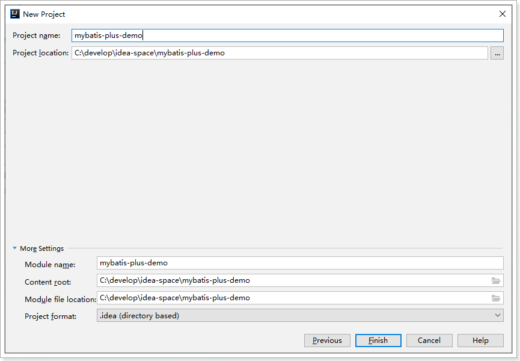

# MybatisPlus

mybatis作为持久层框架，其优势是灵活，我们可以灵活定制sql。但凡事有利有弊，灵活的带来的缺点是，很多单表的简单CRUD，依然需要我们自己来写，非常浪费时间。

因此我们接下来要学习一个mybatis的插件：MybatisPlus，可以大大提高Mybatis的开发效率。

MybatisPlus     mp 

tkMapper        通用mapper


## 2.1.介绍

[MyBatis-Plus](https://github.com/baomidou/mybatis-plus)（简称 MP）是一个 [MyBatis](http://www.mybatis.org/mybatis-3/) 的增强工具，在 MyBatis 的基础上只做增强不做改变，为简化开发、提高效率而生。官网：https://mp.baomidou.com/

> 愿景
>
> 我们的愿景是成为 MyBatis 最好的搭档，就像 [魂斗罗](https://mp.baomidou.com/img/contra.jpg) 中的 1P、2P，基友搭配，效率翻倍。


- **无侵入**：只做增强不做改变，引入它不会对现有工程产生影响，如丝般顺滑
- **损耗小**：启动即会自动注入基本 CURD，性能基本无损耗，直接面向对象操作
- **强大的 CRUD 操作**：内置通用 Mapper、通用 Service，仅仅通过少量配置即可实现单表大部分 CRUD 操作，更有强大的条件构造器，满足各类使用需求
- **支持 Lambda 形式调用**：通过 Lambda 表达式，方便的编写各类查询条件，无需再担心字段写错
- **支持主键自动生成**：支持多达 4 种主键策略（内含分布式唯一 ID 生成器 - Sequence），可自由配置，完美解决主键问题
- **支持 ActiveRecord 模式**：支持 ActiveRecord 形式调用，实体类只需继承 Model 类即可进行强大的 CRUD 操作
- **支持自定义全局通用操作**：支持全局通用方法注入（ Write once, use anywhere ）
- **内置代码生成器**：采用代码或者 Maven 插件可快速生成 Mapper 、 Model 、 Service 、 Controller 层代码，支持模板引擎，更有超多自定义配置等您来使用
- **内置分页插件**：基于 MyBatis 物理分页，开发者无需关心具体操作，配置好插件之后，写分页等同于普通 List 查询
- **分页插件支持多种数据库**：支持 MySQL、MariaDB、Oracle、DB2、H2、HSQL、SQLite、Postgre、SQLServer 等多种数据库
- **内置性能分析插件**：可输出 Sql 语句以及其执行时间，建议开发测试时启用该功能，能快速揪出慢查询
- **内置全局拦截插件**：提供全表 delete 、 update 操作智能分析阻断，也可自定义拦截规则，预防误操作


## 2.2.快速入门

### 2.2.1.准备数据

首先新建一个库，然后运行下面的sql：

```mysql
# 建表
DROP TABLE IF EXISTS user;

CREATE TABLE user
(
	id BIGINT(20) NOT NULL COMMENT '主键ID',
	name VARCHAR(30) NULL DEFAULT NULL COMMENT '姓名',
	age INT(11) NULL DEFAULT NULL COMMENT '年龄',
	email VARCHAR(50) NULL DEFAULT NULL COMMENT '邮箱',
	PRIMARY KEY (id)
);
# 准备数据

INSERT INTO user (id, name, age, email) VALUES
(1, 'Jone', 18, 'test1@baomidou.com'),
(2, 'Jack', 20, 'test2@baomidou.com'),
(3, 'Tom', 28, 'test3@baomidou.com'),
(4, 'Sandy', 21, 'test4@baomidou.com'),
(5, 'Billie', 24, 'test5@baomidou.com');
```

### 2.2.2.准备Demo工程

新建maven工程


坐标：


项目位置：




### 2.2.3.引入依赖

在项目pom文件写入依赖：

```xml
<?xml version="1.0" encoding="UTF-8"?>
<project xmlns="http://maven.apache.org/POM/4.0.0"
         xmlns:xsi="http://www.w3.org/2001/XMLSchema-instance"
         xsi:schemaLocation="http://maven.apache.org/POM/4.0.0 http://maven.apache.org/xsd/maven-4.0.0.xsd">
    <modelVersion>4.0.0</modelVersion>

    <groupId>cn.itcast.demo</groupId>
    <artifactId>mybatis-plus-demo</artifactId>
    <version>1.0-SNAPSHOT</version>

    <parent>
        <groupId>org.springframework.boot</groupId>
        <artifactId>spring-boot-starter-parent</artifactId>
        <version>2.1.12.RELEASE</version>
    </parent>
    <dependencies>
        <dependency>
            <groupId>org.springframework.boot</groupId>
            <artifactId>spring-boot-starter-test</artifactId>
            <scope>test</scope>
        </dependency>
        <!--mybatis-plus的springboot支持-->
        <dependency>
            <groupId>com.baomidou</groupId>
            <artifactId>mybatis-plus-boot-starter</artifactId>
            <version>3.2.0</version>
        </dependency>
        <!--mysql驱动-->
        <dependency>
            <groupId>mysql</groupId>
            <artifactId>mysql-connector-java</artifactId>
            <version>5.1.47</version>
        </dependency>
        <!--简化代码的工具包-->
        <dependency>
            <groupId>org.projectlombok</groupId>
            <artifactId>lombok</artifactId>
            <optional>true</optional>
        </dependency>
    </dependencies>
    <build>
        <plugins>
            <plugin>
                <groupId>org.springframework.boot</groupId>
                <artifactId>spring-boot-maven-plugin</artifactId>
            </plugin>
        </plugins>
    </build>
</project>
```


### 2.2.4.配置

在resources目录新建application.yml文件，写入下列配置：

```yaml
spring:
  application:
    name: mybatis-plus-demo
  datasource:
    driver-class-name: com.mysql.jdbc.Driver
    url: jdbc:mysql://ly-mysql:3306/heima?useUnicode=true&characterEncoding=utf8&allowMultiQueries=true&useSSL=false
    username: root
    password: 123
logging:
  level:
    cn.itcast: debug
```


### 2.2.5.实体类

```java
package cn.itcast.mp.pojo;

import lombok.Data;

@Data
public class User {
    private Long id;
    private String name;
    private Integer age;
    private String email;
}
```


### 2.2.6.mapper接口

```java
package cn.itcast.mp.mapper;

import cn.itcast.mp.pojo.User;
import com.baomidou.mybatisplus.core.mapper.BaseMapper;

public interface UserMapper extends BaseMapper<User> {

}
```

这里继承了BaseMapper，是MybatisPlus提供的基础接口，里面准备了大量的CRUD方法。


### 2.2.7.启动类

```java
package cn.itcast;

import org.mybatis.spring.annotation.MapperScan;
import org.springframework.boot.SpringApplication;
import org.springframework.boot.autoconfigure.SpringBootApplication;

@SpringBootApplication
@MapperScan("cn.itcast.mp.mapper")
public class MpDemoApplication {

    public static void main(String[] args) {
        SpringApplication.run(MpDemoApplication.class, args);
    }

}
```


### 2.2.8.单元测试

```java
package cn.itcast.mp.mapper;

import cn.itcast.mp.pojo.User;
import org.junit.Assert;
import org.junit.Test;
import org.junit.runner.RunWith;
import org.springframework.beans.factory.annotation.Autowired;
import org.springframework.boot.test.context.SpringBootTest;
import org.springframework.test.context.junit4.SpringRunner;

import java.util.List;

@RunWith(SpringRunner.class)
@SpringBootTest
public class UserMapperTest {

    @Autowired
    private UserMapper userMapper;

    @Test
    public void testSelect() {
        System.out.println(("----- selectAll method test ------"));
        // 使用BaseMapper提供的selectList方法
        List<User> userList = userMapper.selectList(null);
        Assert.assertEquals(5, userList.size());
        userList.forEach(System.out::println);
    }
}
```

这里测试了BaseMapper提供的查询所有的方法，运行结果如下：


## 2.3.一些注解

上面我们虽然定义了Mapper接口，但是没有写任何SQL，MybatisPlus是如何知道该查询哪张表呢？

来看看mapper的定义方式：

 

我们在继承BaseMapper时，指定了泛型是`<User>`，BaseMapper基于反射获取到`User`的字节码，然后默认就**把类的名称作为表名称**、**把类中的字段作为数据库字段**。

如果类名或字段名与数据库不一致，我们可以通过注解来声明：

官方文档：https://mp.baomidou.com/guide/annotation.html

### 2.3.1.@TableName

这个注解用在类上，声明当前类关联的表名称，可以配置下列属性：

|       属性       |  类型   | 必须指定 | 默认值 | 描述                                                         |
| :--------------: | :-----: | :------: | :----: | ------------------------------------------------------------ |
|      value       | String  |    否    |   ""   | 表名                                                         |
|      schema      | String  |    否    |   ""   | schema                                                       |
| keepGlobalPrefix | boolean |    否    | false  | 是否保持使用全局的 tablePrefix 的值(如果设置了全局 tablePrefix 且自行设置了 value 的值) |
|    resultMap     | String  |    否    |   ""   | xml 中 resultMap 的 id                                       |
|  autoResultMap   | boolean |    否    | false  | 是否自动构建 resultMap 并使用(如果设置 resultMap 则不会进行 resultMap 的自动构建并注入) |


### 2.3.2.@TableId

- 描述：主键注解

| 属性  |  类型  | 必须指定 |   默认值    |             描述             |
| :---: | :----: | :------: | :---------: | :--------------------------: |
| value | String |    否    |     ""      |          主键字段名          |
| type  |  Enum  |    否    | IdType.NONE | 主键类型，通过IdType枚举指定 |


- IdType的枚举项：

|     值      |                             描述                             |
| :---------: | :----------------------------------------------------------: |
|    AUTO     |                         数据库ID自增                         |
|    NONE     | 无状态,该类型为未设置主键类型(注解里等于跟随全局,全局里约等于 INPUT) |
|    INPUT    |                    insert前自行set主键值                     |
|  ASSIGN_ID  | 分配ID(主键类型为Number(Long和Integer)或String)(since 3.3.0),使用接口`IdentifierGenerator`的方法`nextId`(默认实现类为`DefaultIdentifierGenerator`雪花算法) |
| ASSIGN_UUID | 分配UUID,主键类型为String(since 3.3.0),使用接口`IdentifierGenerator`的方法`nextUUID`(默认default方法) |


### 2.3.3.@TableField

- 描述：字段注解(非主键)
- 属性：

|       属性       |             类型             | 必须指定 |          默认值          |                             描述                             |
| :--------------: | :--------------------------: | :------: | :----------------------: | :----------------------------------------------------------: |
|      value       |            String            |    否    |            ""            |                            字段名                            |
|        el        |            String            |    否    |            ""            | 映射为原生 `#{ ... }` 逻辑,相当于写在 xml 里的 `#{ ... }` 部分 |
|      exist       |           boolean            |    否    |           true           |                      是否为数据库表字段                      |
|    condition     |            String            |    否    |            ""            | 字段 `where` 实体查询比较条件,有值设置则按设置的值为准,没有则为默认全局的 `%s=#{%s}`,[参考](https://github.com/baomidou/mybatis-plus/blob/3.0/mybatis-plus-annotation/src/main/java/com/baomidou/mybatisplus/annotation/SqlCondition.java) |
|      update      |            String            |    否    |            ""            | 字段 `update set` 部分注入, 例如：update="%s+1"：表示更新时会set version=version+1(该属性优先级高于 `el` 属性) |
|  insertStrategy  |             Enum             |    N     |         DEFAULT          | 举例：NOT_NULL: `insert into table_a(column) values (#{columnProperty})` |
|  updateStrategy  |             Enum             |    N     |         DEFAULT          | 举例：IGNORED: `update table_a set column=#{columnProperty}` |
|  whereStrategy   |             Enum             |    N     |         DEFAULT          |      举例：NOT_EMPTY: `where column=#{columnProperty}`       |
|       fill       |             Enum             |    否    |    FieldFill.DEFAULT     |                       字段自动填充策略                       |
|      select      |           boolean            |    否    |           true           |                     是否进行 select 查询                     |
| keepGlobalFormat |           boolean            |    否    |          false           |              是否保持使用全局的 format 进行处理              |
|     jdbcType     |           JdbcType           |    否    |    JdbcType.UNDEFINED    |           JDBC类型 (该默认值不代表会按照该值生效)            |
|   typeHandler    | Class<? extends TypeHandler> |    否    | UnknownTypeHandler.class |          类型处理器 (该默认值不代表会按照该值生效)           |
|   numericScale   |            String            |    否    |            ""            |                    指定小数点后保留的位数                    |


## 2.4.常见配置

MyBatisPlus配置整合了部分原来的Mybatis配置，都可以通过yaml文件来配置。

详见文档：[https://mp.baomidou.com/config/](https://mp.baomidou.com/config/)


例如：mapper文件地址、别名扫描包等

```yaml
mybatis-plus:
  type-aliases-package: com.leyou.item.entity # 别名扫描包
  mapper-locations: classpath*:/mappers/*.xml # mapper的xml文件地址
  global-config:
    db-config:
      id-type: auto # 全局主键策略，默认为自增长
      update-strategy: not_null # 更新时，只更新非null字段
      insert-strategy: not_null # 新增时，只新增非null字段
```


## 2.5.BaseMapper的CRUD

在MybatisPlus中，BaseMapper中定义了一些常用的CRUD方法，当我们自定义的Mapper接口继承BaseMapper后即可拥有了这些方法。

### 2.5.1.新增

#### 方法：

```java
// 插入一条记录
int insert(T entity);
```

#### 参数说明

| 类型 | 参数名 |   描述   |
| :--: | :----: | :------: |
|  T   | entity | 实体对象 |

#### 示例：

```java
@Test
public void testInsert() {
    User user = new User();
    user.setId(6L);
    user.setName("Amy");
    user.setAge(16);
    user.setEmail("amy@itcast.cn");
    userMapper.insert(user);
}
```

运行结果：

```
11:49:28.988 DEBUG 30192 --- [           main] cn.itcast.mp.mapper.UserMapper.insert    : ==>  Preparing: INSERT INTO user ( id, name, email, age ) VALUES ( ?, ?, ?, ? ) 
11:49:29.004 DEBUG 30192 --- [           main] cn.itcast.mp.mapper.UserMapper.insert    : ==> Parameters: 6(Long), Amy(String), amy@itcast.cn(String), 16(Integer)
11:49:29.007 DEBUG 30192 --- [           main] cn.itcast.mp.mapper.UserMapper.insert    : <==    Updates: 1
```


### 2.5.2.删除

#### 方法：

```java
// 根据 entity 条件，删除记录
int delete(@Param(Constants.WRAPPER) Wrapper<T> wrapper);
// 删除（根据ID 批量删除）
int deleteBatchIds(@Param(Constants.COLLECTION) Collection<? extends Serializable> idList);
// 根据 ID 删除
int deleteById(Serializable id);
// 根据 columnMap 条件，删除记录
int deleteByMap(@Param(Constants.COLUMN_MAP) Map<String, Object> columnMap);
```

#### [#](https://mp.baomidou.com/guide/crud-interface.html#参数说明-10)参数说明

|                类型                |  参数名   |                描述                |
| :--------------------------------: | :-------: | :--------------------------------: |
|             Wrapper<T>             |  wrapper  | 实体对象封装操作类（可以为 null）  |
| Collection<? extends Serializable> |  idList   | 主键ID列表(不能为 null 以及 empty) |
|            Serializable            |    id     |               主键ID               |
|        Map<String, Object>         | columnMap |          表字段 map 对象           |

#### 测试

```java
@Test
public void testDelete(){
    userMapper.deleteById(6L);
    System.out.println("删除成功!");
}
```

结果：

```
11:51:57.488 DEBUG 552 --- [           main] c.i.mp.mapper.UserMapper.deleteById      : ==>  Preparing: DELETE FROM user WHERE id=? 
11:51:57.505 DEBUG 552 --- [           main] c.i.mp.mapper.UserMapper.deleteById      : ==> Parameters: 6(Long)
11:51:57.508 DEBUG 552 --- [           main] c.i.mp.mapper.UserMapper.deleteById      : <==    Updates: 1
删除成功!
```


### 2.5.3.修改

#### 方法：

```java
// 根据 whereEntity 条件，更新记录
int update(@Param(Constants.ENTITY) T entity, @Param(Constants.WRAPPER) Wrapper<T> updateWrapper);
// 根据 ID 修改
int updateById(@Param(Constants.ENTITY) T entity);
```

#### 参数：

|    类型    |    参数名     |                             描述                             |
| :--------: | :-----------: | :----------------------------------------------------------: |
|     T      |    entity     |               实体对象 (set 条件值,可为 null)                |
| Wrapper<T> | updateWrapper | 实体对象封装操作类（可以为 null,里面的 entity 用于生成 where 语句） |

#### 示例：

```java
@Test
public void testUpdate(){
    User user = new User();
    user.setId(5L);
    user.setName("lisi");
    int count = userMapper.updateById(user);
    System.out.println("修改成功!, count = " + count );
}
```

结果：

```
HikariPool-1 - Start completed.
2020-01-13 11:56:08.785 DEBUG 36240 --- [           main] c.i.mp.mapper.UserMapper.updateById      : ==>  Preparing: UPDATE user SET name=? WHERE id=? 
2020-01-13 11:56:08.811 DEBUG 36240 --- [           main] c.i.mp.mapper.UserMapper.updateById      : ==> Parameters: lisi(String), 5(Long)
2020-01-13 11:56:08.813 DEBUG 36240 --- [           main] c.i.mp.mapper.UserMapper.updateById      : <==    Updates: 1
修改成功!, count = 1
```


### 2.5.4.查询单个

#### 方法列表:

```java
// 根据 ID 查询
T selectById(Serializable id);
// 根据 entity 条件，查询一条记录
T selectOne(@Param(Constants.WRAPPER) Wrapper<T> queryWrapper);

```

#### [#](https://mp.baomidou.com/guide/crud-interface.html#参数说明-12)参数说明:

|     类型     |    参数名    |               描述                |
| :----------: | :----------: | :-------------------------------: |
| Serializable |      id      |              主键ID               |
|  Wrapper<T>  | queryWrapper | 实体对象封装操作类（可以为 null） |

#### 示例：

```java
@Test
public void testQueryById(){
    // 根据ID查询
    User user = userMapper.selectById(1L);
    System.out.println("user = " + user);
}
```


### 2.5.5.查询集合：

#### 方法列表：

```java
// 查询（根据ID 批量查询）
List<T> selectBatchIds(@Param(Constants.COLLECTION) Collection<? extends Serializable> idList);
// 根据 entity 条件，查询全部记录
List<T> selectList(@Param(Constants.WRAPPER) Wrapper<T> queryWrapper);
// 查询（根据 columnMap 条件）
List<T> selectByMap(@Param(Constants.COLUMN_MAP) Map<String, Object> columnMap);
// 根据 Wrapper 条件，查询全部记录
List<Map<String, Object>> selectMaps(@Param(Constants.WRAPPER) Wrapper<T> queryWrapper);
// 根据 Wrapper 条件，查询全部记录。注意： 只返回第一个字段的值
List<Object> selectObjs(@Param(Constants.WRAPPER) Wrapper<T> queryWrapper);

```

#### 示例：

1）根据id集合查询：

```java
@Test
public void testQueryByIdList(){
    // 根据ID查询
    List<User> list = userMapper.selectBatchIds(Arrays.asList(1L, 2L, 3L));
    list.forEach(System.out::println);
}
```

2）根据wrapper查询：

```java
@Test
public void testQueryByWrapper(){
    // 定义wrapper
    QueryWrapper<User> wrapper = new QueryWrapper<>();
    // 模糊
    wrapper.like("name", "o")
        // 范围
        .le("age", 30)
        // 排序
        .orderByAsc("age");

    // 查询
    List<User> list = userMapper.selectList(wrapper);

    list.forEach(System.out::println);
}
```

生成的sql：

```sql
SELECT id,name,email,age FROM user WHERE (name LIKE ? AND age <= ?) ORDER BY age ASC
```


### 2.5.6.分页查询

```java
// 根据 entity 条件，查询全部记录（并翻页）
IPage<T> selectPage(IPage<T> page, @Param(Constants.WRAPPER) Wrapper<T> queryWrapper);
// 根据 Wrapper 条件，查询全部记录（并翻页）
IPage<Map<String, Object>> selectMapsPage(IPage<T> page, @Param(Constants.WRAPPER) Wrapper<T> queryWrapper);
// 根据 Wrapper 条件，查询总记录数
Integer selectCount(@Param(Constants.WRAPPER) Wrapper<T> queryWrapper);
```


分页查询需要引入额外的插件才能生效。

#### 1）引入分页插件

```java
package cn.itcast.mp.config;

import com.baomidou.mybatisplus.extension.plugins.PaginationInterceptor;
import com.baomidou.mybatisplus.extension.plugins.pagination.optimize.JsqlParserCountOptimize;
import org.springframework.context.annotation.Bean;
import org.springframework.context.annotation.Configuration;

/**
 * @author 虎哥
 */
@Configuration
public class MybatisConfig {

    /**
     * 注册mybatis plus的分页插件
     * @return
     */
    @Bean
    public PaginationInterceptor paginationInterceptor() {
        PaginationInterceptor paginationInterceptor = new PaginationInterceptor();
        return paginationInterceptor;
    }
}
```

#### 2）测试分页

代码：

```java
@Test
public void testPageQuery(){
    // 分页条件
    Page<User> page = new Page<>();
    // 当前页
    page.setCurrent(1);
    // 每页大小
    page.setSize(3);
    // 分页查询，结果会放到Page<User>中，因此无需返回
    userMapper.selectPage(page, null);

    // 总条数
    long total = page.getTotal();
    System.out.println("total = " + total);
	// 总页数
    long pages = page.getPages();
    System.out.println("pages = " + pages);
    // 当前页结果
    List<User> list = page.getRecords();
    list.forEach(System.out::println);
}
```

结果：

```java
2020-01-13 13:23:55.761 DEBUG 41364 --- [           main] c.i.mp.mapper.UserMapper.selectPage      : ==>  Preparing: SELECT COUNT(1) FROM user 
2020-01-13 13:23:55.776 DEBUG 41364 --- [           main] c.i.mp.mapper.UserMapper.selectPage      : ==> Parameters: 
2020-01-13 13:23:55.787 DEBUG 41364 --- [           main] c.i.mp.mapper.UserMapper.selectPage      : ==>  Preparing: SELECT id,name,email,age FROM user LIMIT ?,? 
2020-01-13 13:23:55.788 DEBUG 41364 --- [           main] c.i.mp.mapper.UserMapper.selectPage      : ==> Parameters: 0(Long), 3(Long)
2020-01-13 13:23:55.791 DEBUG 41364 --- [           main] c.i.mp.mapper.UserMapper.selectPage      : <==      Total: 3
total = 5
pages = 2
User(id=1, name=Jone, age=18, email=test1@baomidou.com)
User(id=2, name=Jack, age=20, email=test2@baomidou.com)
User(id=3, name=Tom, age=28, email=test3@baomidou.com)

```


## 2.6.IService的CRUD

MybatisPlus除了提供BaseMapper，还提供了通用的Service接口：`IService`

### 2.6.1.新增

```java
// 插入一条记录（选择字段，策略插入）
boolean save(T entity);
// 插入（批量）
boolean saveBatch(Collection<T> entityList);
// 插入（批量）
boolean saveBatch(Collection<T> entityList, int batchSize);
```

#### [#](https://mp.baomidou.com/guide/crud-interface.html#参数说明)参数说明

|     类型      |   参数名   |     描述     |
| :-----------: | :--------: | :----------: |
|       T       |   entity   |   实体对象   |
| Collection<T> | entityList | 实体对象集合 |
|      int      | batchSize  | 插入批次数量 |


### 2.6.2.SaveOrUpdate

```java
// TableId 注解存在更新记录，否插入一条记录
boolean saveOrUpdate(T entity);
// 根据updateWrapper尝试更新，否继续执行saveOrUpdate(T)方法
boolean saveOrUpdate(T entity, Wrapper<T> updateWrapper);
// 批量修改插入
boolean saveOrUpdateBatch(Collection<T> entityList);
// 批量修改插入
boolean saveOrUpdateBatch(Collection<T> entityList, int batchSize);
```

#### [#](https://mp.baomidou.com/guide/crud-interface.html#参数说明-2)参数说明

|     类型      |    参数名     |               描述               |
| :-----------: | :-----------: | :------------------------------: |
|       T       |    entity     |             实体对象             |
|  Wrapper<T>   | updateWrapper | 实体对象封装操作类 UpdateWrapper |
| Collection<T> |  entityList   |           实体对象集合           |
|      int      |   batchSize   |           插入批次数量           |


### 2.6.3.删除

```java
// 根据 entity 条件，删除记录
boolean remove(Wrapper<T> queryWrapper);
// 根据 ID 删除
boolean removeById(Serializable id);
// 根据 columnMap 条件，删除记录
boolean removeByMap(Map<String, Object> columnMap);
// 删除（根据ID 批量删除）
boolean removeByIds(Collection<? extends Serializable> idList);
```

#### [#](https://mp.baomidou.com/guide/crud-interface.html#参数说明-3)参数说明

|                类型                |    参数名    |          描述           |
| :--------------------------------: | :----------: | :---------------------: |
|             Wrapper<T>             | queryWrapper | 实体包装类 QueryWrapper |
|            Serializable            |      id      |         主键ID          |
|        Map<String, Object>         |  columnMap   |     表字段 map 对象     |
| Collection<? extends Serializable> |    idList    |       主键ID列表        |

### 2.6.4.修改

```java
// 根据 UpdateWrapper 条件，更新记录 需要设置sqlset
boolean update(Wrapper<T> updateWrapper);
// 根据 whereEntity 条件，更新记录
boolean update(T entity, Wrapper<T> updateWrapper);
// 根据 ID 选择修改
boolean updateById(T entity);
// 根据ID 批量更新
boolean updateBatchById(Collection<T> entityList);
// 根据ID 批量更新
boolean updateBatchById(Collection<T> entityList, int batchSize);
```

#### [#](https://mp.baomidou.com/guide/crud-interface.html#参数说明-4)参数说明

|     类型      |    参数名     |               描述               |
| :-----------: | :-----------: | :------------------------------: |
|  Wrapper<T>   | updateWrapper | 实体对象封装操作类 UpdateWrapper |
|       T       |    entity     |             实体对象             |
| Collection<T> |  entityList   |           实体对象集合           |
|      int      |   batchSize   |           更新批次数量           |

### 2.6.5.查询单个

```java
// 根据 ID 查询
T getById(Serializable id);
// 根据 Wrapper，查询一条记录。结果集，如果是多个会抛出异常，随机取一条加上限制条件 wrapper.last("LIMIT 1")
T getOne(Wrapper<T> queryWrapper);
// 根据 Wrapper，查询一条记录
T getOne(Wrapper<T> queryWrapper, boolean throwEx);
// 根据 Wrapper，查询一条记录
Map<String, Object> getMap(Wrapper<T> queryWrapper);
// 根据 Wrapper，查询一条记录
<V> V getObj(Wrapper<T> queryWrapper, Function<? super Object, V> mapper);
```

#### [#](https://mp.baomidou.com/guide/crud-interface.html#参数说明-5)参数说明

|            类型             |    参数名    |              描述               |
| :-------------------------: | :----------: | :-----------------------------: |
|        Serializable         |      id      |             主键ID              |
|         Wrapper<T>          | queryWrapper | 实体对象封装操作类 QueryWrapper |
|           boolean           |   throwEx    |   有多个 result 是否抛出异常    |
|              T              |    entity    |            实体对象             |
| Function<? super Object, V> |    mapper    |            转换函数             |

### 2.6.6.查询多个

```java
// 查询所有
List<T> list();
// 查询列表
List<T> list(Wrapper<T> queryWrapper);
// 查询（根据ID 批量查询）
Collection<T> listByIds(Collection<? extends Serializable> idList);
// 查询（根据 columnMap 条件）
Collection<T> listByMap(Map<String, Object> columnMap);
// 查询所有列表
List<Map<String, Object>> listMaps();
// 查询列表
List<Map<String, Object>> listMaps(Wrapper<T> queryWrapper);
// 查询全部记录
List<Object> listObjs();
// 查询全部记录
<V> List<V> listObjs(Function<? super Object, V> mapper);
// 根据 Wrapper 条件，查询全部记录
List<Object> listObjs(Wrapper<T> queryWrapper);
// 根据 Wrapper 条件，查询全部记录
<V> List<V> listObjs(Wrapper<T> queryWrapper, Function<? super Object, V> mapper);
```

##### [#](https://mp.baomidou.com/guide/crud-interface.html#参数说明-6)参数说明

|                类型                |    参数名    |              描述               |
| :--------------------------------: | :----------: | :-----------------------------: |
|             Wrapper<T>             | queryWrapper | 实体对象封装操作类 QueryWrapper |
| Collection<? extends Serializable> |    idList    |           主键ID列表            |
|        Map<?String, Object>        |  columnMap   |         表字段 map 对象         |
|    Function<? super Object, V>     |    mapper    |            转换函数             |

### 2.6.7.分页查询

```java
// 无条件翻页查询
IPage<T> page(IPage<T> page);
// 翻页查询
IPage<T> page(IPage<T> page, Wrapper<T> queryWrapper);
// 无条件翻页查询
IPage<Map<String, Object>> pageMaps(IPage<T> page);
// 翻页查询
IPage<Map<String, Object>> pageMaps(IPage<T> page, Wrapper<T> queryWrapper);
```

##### [#](https://mp.baomidou.com/guide/crud-interface.html#参数说明-7)参数说明

|    类型    |    参数名    |              描述               |
| :--------: | :----------: | :-----------------------------: |
|  IPage<T>  |     page     |            翻页对象             |
| Wrapper<T> | queryWrapper | 实体对象封装操作类 QueryWrapper |

### 2.6.8.查询数量

```java
// 查询总记录数
int count();
// 根据 Wrapper 条件，查询总记录数
int count(Wrapper<T> queryWrapper);
```

#### [#](https://mp.baomidou.com/guide/crud-interface.html#参数说明-8)参数说明

|    类型    |    参数名    |              描述               |
| :--------: | :----------: | :-----------------------------: |
| Wrapper<T> | queryWrapper | 实体对象封装操作类 QueryWrapper |


## 2.7.ServiceImpl

上面的`IService`提供了service的默认方法接口，而`ServiceImpl`就是对`IService`的默认实现。我们在定义service时，一般先定义接口，继承`IService`，然后在定义实现类，继承`ServiceImpl`。

例如，我们定义一个UserService接口：

```java
package cn.itcast.mp.service;

import cn.itcast.mp.pojo.User;
import com.baomidou.mybatisplus.extension.service.IService;

/**
 * @author 虎哥
 */
public interface UserService extends IService<User> {
}
```

然后是实现类：

```java
package cn.itcast.mp.service.impl;

import cn.itcast.mp.mapper.UserMapper;
import cn.itcast.mp.pojo.User;
import cn.itcast.mp.service.UserService;
import com.baomidou.mybatisplus.extension.service.impl.ServiceImpl;
import org.springframework.stereotype.Service;

/**
 * @author 虎哥
 */
@Service
public class UserServiceImpl extends ServiceImpl<UserMapper, User> implements UserService {
}
```

结构：

 

单元测试：

```java
package cn.itcast.mp.service;

import cn.itcast.mp.pojo.User;
import org.junit.Test;
import org.junit.runner.RunWith;
import org.springframework.beans.factory.annotation.Autowired;
import org.springframework.boot.test.context.SpringBootTest;
import org.springframework.test.context.junit4.SpringRunner;

import java.util.List;

@RunWith(SpringRunner.class)
@SpringBootTest
public class UserServiceTest {

    @Autowired
    private UserService userService;

    @Test
    public void testQuery(){
        List<User> list = userService.list();
        list.forEach(System.out::println);
    }
}
```
