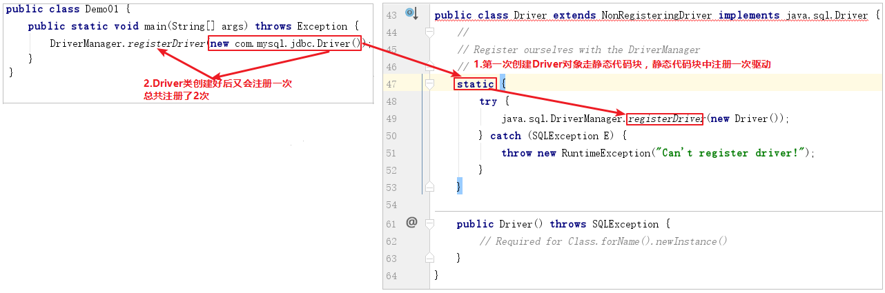
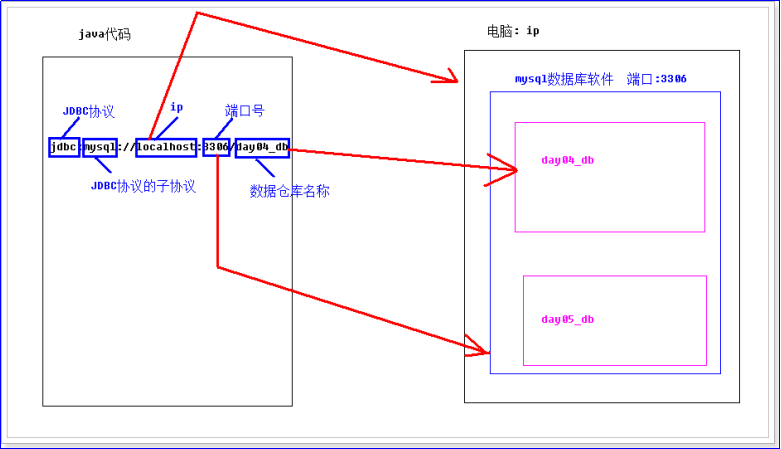

# JDBC
## 学习目标

1. 能够使用DCL处理MySQL中的用户
2. 能够理解JDBC的概念
3. 能够使用Connection接口(掌握)
4. 能够使用Statement接口(掌握)
5. 能够使用ResultSet接口(掌握)
6. 能够使用JDBC实现对单表数据增、删、改、查(掌握)
7. 能够使用JDBC操作事务(掌握)
8. 能够编写JDBC工具类(掌握)
9. 能够完成JDBC实现登录案例(掌握)

## 1、JDBC的概念

### 目标

1. 能够掌握JDBC的概念
2. 能够理解JDBC的作用

### 讲解

客户端操作MySQL数据库的方式
1. 使用第三方客户端来访问MySQL：SQLyog、Navicat

2. 使用MySQL自带的命令行方式

3. **通过Java来访问MySQL数据库，今天要学习的内容**

   **如何通过Java代码去操作数据库呢？**

   Java中给我们提供专门的一套技术，可以通过其中的某些类和接口操作任何的数据库，这个技术就是今天要学习的JDBC。

   **什么是JDBC**：Sun公司为了简化、统一对数据库的操作，定义了一套java操作数据库的接口的规范，称之为JDBC。JDBC的全称为：java database connection (java和 数据库的连接 ) 就是使用java代码来操作数据库。
   **JDBC的作用**：Java通过JDBC就可以操作数据库


#### JDBC的由来
1. **java程序依赖于jdk,jdk和数据库是2个不同的应用程序，那他们是怎么进行访问的呢？**

   要想搞清楚这个问题，我们必须了解下电脑是如何和其他硬件设备交互的。假设我们电脑安装完系统之后是一个无驱动的操作系统。那么当我们电脑想播放声音，即安装音响，必须得安装声卡驱动。同时电脑想和u盘硬件进行交互，也必须在电脑上安装对应的驱动。如果驱动安装失败，很显然他们是不能正常的交互的。这个安装驱动的其实就是为了定义他们两个相互交互的规则。只有统一了规则，才能交互。

   具体的解释如下图所示：

  

<figure class="thumbnails">
    
</figure>


同理：java程序想和数据库进行交互，也必须得安装数据库驱动，这样才能交互。但是，我们数据库有多种，这样就会导致不同的数据库具备不同的数据库驱动。

从而会导致在开发中作为程序员由于安装不同的数据库驱动而浪费很多时间，同时和数据库交互的java代码也得重新书写，这样都会导致效率很低。所以说，sun公司就会制定一套规则，这套规则就是用来java程序连接数据库的，然后各大数据库厂商只需要实现这个规则即可。这个规则就是jdbc技术，即接口。

换句话就是说，就是数据库厂商使用sun公司提供的接口，然后作为java程序员实现接口中的方法即可。**接口中的方法体由具体的数据库厂商来实现。**


<figure class="thumbnails">
    
</figure>

#### JDBC的好处

1. 我们只需要会调用JDBC接口中的方法即可，使用简单
2. JDBC有关的类和接口：都在java.sql 和 javax.sql(扩展包) 包下
3. 方法体由具体的数据库厂商来完成的
4. 使用同一套Java代码，进行少量的修改就可以访问其他JDBC支持的数据库

### 小结

1. 说出JDBC的概念？Java数据库连接(Java操作数据库的标准规范)
2. 说出JDBC的作用？Java通过JDBC就可以操作数据库

## 2、JDBC核心API的介绍

### 目标

能够理解JDBC四个核心对象

### 讲解

#### JDBC会用到的包

1. java.sql：JDBC访问数据库的基础包，在JavaSE中的包。如：java.sql.Connection
2. javax.sql： JDBC访问数据库的扩展包
3. 数据库的驱动，各大数据库厂商来实现。如：MySQL的驱动：com.mysql.jdbc.Driver

#### JDBC四个核心对象

这几个类都是在java.sql包中

1. DriverManager(类):  数据库驱动管理类。这个类的作用：1）注册驱动; 2)创建java代码和数据库之间的连接，即获取Connection接口;
2. Connection(接口): 是一个接口, 建立数据库连接的一个接口。作用：建立数据库和java代码之间的连接。表示与数据库创建的连接
3. Statement(接口)、PreparedStatement(接口) (解决安全隐患问题，比如sql注入的问题)： 数据库操作，向数据库发送sql语句。执行SQL语句的对象
4. ResultSet: 结果集或一张虚拟表。 Statement 发送sql语句，得到的结果 封装在 ResultSet 中。


<figure class="thumbnails">
    
</figure>

#### JDBC访问数据库的步骤

1. 由DriverManager注册驱动程序

2. 创建和数据库的连接对象Connection

3. 由客户端发送SQL语句给服务器执行，SQL语句封装成Statement对象

4. 查询到的结果集封装成ResultSet对象

5. 在客户端可以从ResultSet中取出数据，处理结果集

6. 释放资源，关闭连接对象


### 小结

JDBC四个核心对象？

1. DriverManager(类): 用于注册驱动
2. Connection(接口): 表示与数据库创建的连接
3. Statement(接口): 执行SQL语句的对象
4. ResultSet(接口): 结果集或一张虚拟表

## 3、JDBC注册驱动

`Connection`表示Java程序与数据库之间的连接，只有拿到Connection才能操作数据库。

**JDBC获取连接步骤**

1.导入mysql驱动Jar包
2.注册驱动
3.获取连接

### 目标

能够导入mysql驱动Jar包

能够通过JDBC注册数据库驱动

### 讲解

#### 准备工作

1、确定启动mysql数据库。

此电脑-------》右键管理-------》选择服务


<figure class="thumbnails">
    
</figure>

找到MySQL服务，查看MySQL服务是否已经启动了，如果启动是灰色，说明已经启动了。


<figure class="thumbnails">
    
</figure>

2、创建数据库和创建user表，并添加信息，sql语句如下。

打开可视化工具，将如下sql语句添加到可视化工具中，并执行以下sql语句即可。


<figure class="thumbnails">
    
</figure>

```sql
-- 创建数据库
create database day04_db;

-- 切换数据库
use day04_db;

-- 用户表
create table user (
  id int primary key auto_increment,
  username varchar(30) unique not null,
  password varchar(30)
);

insert into user(username, password) values('zhangsan','123');
insert into user(username, password) values('lisi','123');
insert into user(username, password) values('wangwu','123');

select * from user;
```

执行结果：


<figure class="thumbnails">
    
</figure>

#### 导入驱动Jar包

1、新建项目day04，在项目day04上新建lib文件夹


<figure class="thumbnails">
    
</figure>

2、将mysql驱动的jar包导入到lib文件夹下


<figure class="thumbnails">
    
</figure>

3、在导入的mysql的jar包上右键，选择Add as Library...


<figure class="thumbnails">
    
</figure>

#### 注册驱动
我们Java程序需要通过数据库驱动才能连接到数据库，因此需要注册驱动。
MySQL的驱动的入口类是：`com.mysql.jdbc.Driver`


<figure class="thumbnails">
    
</figure>

##### API介绍
`java.sql.DriverManager`类用于注册驱动。提供如下方法注册驱动

```java
static void registerDriver(Driver driver) 
向 DriverManager 注册给定驱动程序。 
```

说明：

​	1)执行完上述语句之后，DriverManager就可以管理mysql驱动了。

​	2)当前的DriverManager.registerDriver(Driver driver);方法的参数是Driver，这是jdbc的一个接口，所以我们需要给定实现该接口的实现类。如果我们连接的是mysql数据库，那么需要导入mysql数据库提供的包，也就是com.mysql.jdbc.Driver; 下的Driver类。如果我们连接的是oracle数据库，那么需要导入oracle数据库提供的包。

##### 使用步骤

1.DriverManager.registerDriver(驱动对象); 传入对应参数即可

##### 案例代码
```java
public class Demo01 {
	public static void main(String[] args) throws Exception {
		// 注册驱动
		DriverManager.registerDriver(new com.mysql.jdbc.Driver());
	}
}
```

说明：这里的new Driver()的类Driver就是来自mysql数据库。

通过查询com.mysql.jdbc.Driver源码，我们发现Driver类“主动”将自己进行注册

```java
public class Driver extends NonRegisteringDriver implements java.sql.Driver {
    static {
        try {
            // 自己自动注册
            java.sql.DriverManager.registerDriver(new Driver());
        } catch (SQLException E) {
            throw new RuntimeException("Can't register driver!");
        }
    }
    public Driver() throws SQLException {
    }
}
```


<figure class="thumbnails">
    
</figure>

>注意：使用`DriverManager.registerDriver(new com.mysql.jdbc.Driver());`，存在以下方面不足
>
>1. 驱动被注册两次

使用`Class.forName("com.mysql.jdbc.Driver");`加载驱动，这样驱动只会注册一次
```sql
public class Demo01 {
	public static void main(String[] args) throws Exception {
		Class.forName("com.mysql.jdbc.Driver"); // 后期可以将"com.mysql.jdbc.Driver"字符串写在文件中.
	}
}
```

演示：`Class.forName("包名.类名");`会走这个类的静态代码块


<figure class="thumbnails">
    
</figure>

通常开发我们使用Class.forName() 加载驱动。`Class.forName("com.mysql.jdbc.Driver");`会走Driver类的静态代码块。在静态代码块中注册一次驱动。


<figure class="thumbnails">
    
</figure>

>总结：注册MySQL驱动使用`Class.forName("com.mysql.jdbc.Driver");`

### 小结

1. 导入mysql驱动Jar包

2. 通过JDBC注册数据库驱动？

   ```sql
   Class.forName("com.mysql.jdbc.Driver");
   ```

## 4、获取连接

能够通过JDBC获取数据库连接

### 讲解

#### API介绍
`java.sql.DriverManager`类中有如下方法获取数据库连接

```java
static Connection getConnection(String url, String user, String password) 
连接到给定数据库 URL ，并返回连接。 
```

#### 参数说明
1. `String url`：连接数据库的URL，用于说明连接数据库的位置
2. `String user`：数据库的账号
3. `String password`：数据库的密码

连接数据库的URL地址格式：`协议名:子协议://服务器名或IP地址:端口号/数据库名?参数=参数值`


<figure class="thumbnails">
    
</figure>

MySQL写法：`jdbc:mysql://localhost:3306/day04_db`
如果是本地服务器，端口号是默认的3306，则可以简写：`jdbc:mysql:///day04_db`


<figure class="thumbnails">
    
</figure>

#### 注意事项
>如果数据出现乱码需要加上参数: ?useUnicode=true&characterEncoding=utf8，表示让数据库以UTF8编码来处理数据。
>如: jdbc:mysql://localhost:3306/day04_db?useUnicode=true&characterEncoding=utf8

#### 使用步骤
1.DriverManager.getConnection(url, user, password); 传入对应参数即可

#### 案例代码
```java
public class Demo01 {
	public static void main(String[] args) throws Exception {
		Class.forName("com.mysql.jdbc.Driver");
		// 连接到MySQL
		// url: 连接数据库的URL
		// user: 数据库的账号
		// password: 数据库的密码
		Connection conn = DriverManager.getConnection("jdbc:mysql://localhost:3306/day04_db", "root", "1234");
		System.out.println(conn);
	}
}
```
#### 案例效果
1.连接成功


<figure class="thumbnails">
    
</figure>

2.连接失败


<figure class="thumbnails">
    
</figure>

### 小结

1. JDBC获取数据库连接使用哪个API？

   ```
   DriverManager.getConnection(数据库url, 账号, 密码)
   ```

2. 通过JDBC连接mysql的URL写法？

   ```sql
   jdbc:mysql://localhost:3306/数据库
   ```

## 5、JDBC实现对单表数据增、删、改、查

### 目标

通过JDBC实现对单表数据增、删、改、查

### 讲解

#### JDBC实现对单表数据增、删、改

我们要对数据库进行增、删、改、查，需要使用`Statement`对象来执行SQL语句。

##### API介绍
获取Statement对象

在`java.sql.Connection`接口中有如下方法获取到`Statement`对象
```java
Statement createStatement() 
创建一个 Statement 对象来将 SQL 语句发送到数据库
```
Statement的API介绍

1. ```java
   int executeUpdate(String sql)
   根据执行的DML（INSERT、UPDATE、DELETE）语句，返回受影响的行数
   ```

2. ```java
   ResultSet executeQuery(String sql)
   根据查询语句返回结果集,只能执行SELECT语句
   ```
   >注意：在MySQL中，只要不是查询就是修改。
   >executeUpdate：用于执行增删改
   >executeQuery：用于执行查询

#### 使用步骤
1. 注册驱动
2. 获取连接
3. 获取Statement对象
4. 使用Statement对象执行SQL语句
5. 释放资源

#### 案例代码
```java
public class Demo03 {
	public static void main(String[] args) throws Exception {
		Class.forName("com.mysql.jdbc.Driver");

		Connection conn = DriverManager.getConnection("jdbc:mysql:///day04_db", "root", "1234");
		System.out.println(conn);

		// 从连接中拿到一个Statement对象
		Statement stmt = conn.createStatement();

		// 1.插入记录
		String sql = "insert into user values(null, 'zhaoliu', 'abc')";
		int i = stmt.executeUpdate(sql);
		System.out.println("影响的行数:" + i);

		// 2.修改记录
		sql = "update user set username='tianqi' where username='zhaoliu'";
		i = stmt.executeUpdate(sql);
		System.out.println("影响的行数:" + i);

		// 3.删除记录
		sql = "delete from user where id=4";
		i = stmt.executeUpdate(sql);
		System.out.println("影响的行数:" + i);
		
		// 释放资源
		stmt.close();
		conn.close();
	}
}
```


## 6、JDBC实现对单表数据查询

### 目标

能够掌握JDBC实现对单表数据查询

### 讲解

`ResultSet`用于保存执行查询SQL语句的结果。
我们不能一次性取出所有的数据，需要一行一行的取出。

#### ResultSet的原理

1. ResultSet内部有一个指针,刚开始记录开始位置
2. 调用next方法, ResultSet内部指针会移动到下一行数据
3. 我们可以通过ResultSet得到一行数据 getXxx得到某列数据


<figure class="thumbnails">
    
</figure>

#### ResultSet获取数据的API

其实ResultSet获取数据的API是有规律的get后面加数据类型。我们统称`getXXX()`


<figure class="thumbnails">
    
</figure>

​     例如：


<figure class="thumbnails">
    
</figure>

对于上图中的一行数据，我要获取username为zhangsan这列的值，有如下2种写法：

 1) rs.getString(“username”);  通过列名获取该列的值。

 2) rs.getString(2);        通过username列所在的第二个位置获取该列的值。

#### 使用JDBC查询数据库中的数据的步骤

1. 注册驱动
2. 获取连接
3. 获取到Statement
4. 使用Statement执行SQL
5. ResultSet处理结果
6. 关闭资源

#### 案例代码

```java
public class Demo04 {
	public static void main(String[] args) throws Exception {
		Class.forName("com.mysql.jdbc.Driver");
		
		Connection conn = DriverManager.getConnection("jdbc:mysql:///day04_db", "root", "1234");
		Statement stmt = conn.createStatement();
		
		String sql = "select * from user";
		ResultSet rs = stmt.executeQuery(sql);
		
		// 内部有一个指针,只能取指针指向的那条记录
        while(rs.next()){// 指针移动一行,有数据才返回true
				int id = rs.getInt("id");
				String name = rs.getString(2);
				String pwd= rs.getString(3);
				System.out.println(id+"+++"+name+"++++"+pwd);
			}
		
		// 关闭资源
		rs.close();
		stmt.close();
		conn.close();
	}
}
```


### 小结

其实我们使用JDBC操作数据库的步骤都是固定的。不同的地方是在编写SQL语句

1. 注册驱动
2. 获取连接
3. 获取到Statement
4. 使用Statement执行SQL
5. ResultSet处理结果
6. 关闭资源

ResultSet如何获取数据？

1. 调用next方法, ResultSet内部指针会移动到下一行数据
2. 我们可以通过ResultSet得到一行数据 getXxx得到某列数据


## 7、编写JDBC工具类

### 目标

能够编写JDBC获取连接与关闭连接工具类

### 讲解

​	在上面的学习过程中，我们发现我们有很多重复的操作。那么这样一方面来说对我们开发带来了不便，更多的时候是当我遇到如下的问题：

数据库的用户名发生了变化，这时候我们发现，我们需要修改每处获取连接的用户名参数。这样是对于我们后期的维护是非常繁琐的。所以我们需要对jdbc操作数据库的步骤的一些常用的方法抽出来，放到一个外部的工具类中。

#### 获得连接的初步抽取

首先创建一个JDBCUtils 工具类：然后将jdbc中获取连接的方法抽取到工具类中。

```java
public class JDBCUtils {
	// 获得连接
	public static Connection getConnection(){
Connection con = null;
		try {
             // 注册驱动
			Class.forName("com.mysql.jdbc.Driver");
			// 创建连接
		    String url = "jdbc:mysql://localhost:3306/day04_db";
		    String user = "root";
		    String password = "123";
		    con = DriverManager.getConnection(url, user, password);
		} catch (Exception e) {
			e.printStackTrace();
		}
		return con;
	}
}
```

#### 获得连接第二次优化

紧接着，将刚刚获取连接的方法中所用的参数 都以变量的形式抽离出来，这样方便这些参数的统一管理。

```java
public class JDBCUtils {
	static String driverClass = null;
	static String url = null;
	static String user = null;
	static String password = null;

	static {
		driverClass = "com.mysql.jdbc.Driver";
		url = "jdbc:mysql://localhost:3306/day04_db";
		user = "root";
		password = "123";
		// 注册驱动
		try {
			Class.forName(driverClass);
		} catch (Exception e) {
			e.printStackTrace();
		}
	}
	// 获得连接
	public static Connection getConnection() {
Connection con = null;
		  try {
		    con = DriverManager.getConnection(url, user, password);
		   } catch (Exception e) {
			e.printStackTrace();
		   }
		   return con;
	}
}
```

#### 在项目day04目录下创建jdbc.properties

问题：上面的操作已经完成了我们工具类获取连接的方法的抽取。但是如果说当数据库的用户名，或者说密码，或者说数据库的地址放生变化的时候，

  我们发现我们需要修改java代码，这也就意味着我们的.class文件需要重新编译。并且每次修改java代码有可能还会带来没有必要的风险。

那么针对这样的问题我们该如何进行优化呢？

显然，我们不能将这些配置参数放在java代码中，只能将这些参数存放在外部文件中，而我们在java代码中通过io流的方式将文件读取出来就行了。当我们需要修改这些参数的时候，只需要修改配置文件中的值，java代码并不需要编译，只需要将应用程序重新启动一下，io重新读取一下。这样就行了。所以接下来我们需要将jdbc获取连接中需要的参数存放在外部的.properties文件中。

创建properties文件的步骤：

第一步：选中项目day04,右键----》new-----》File


<figure class="thumbnails">
    
</figure>

第二步：将文件以properties为后缀名进行保存。


<figure class="thumbnails">
    
</figure>

jdbc.properties文件中的配置信息：

```java
driverClass=com.mysql.jdbc.Driver
url=jdbc:mysql://localhost:3306/day04_db
user=root
password=123
```

第三步：如何读取外部文件的内容呢？

分析：

使用Properties集合和字节流读取可以实现。

具体的测试代码如下所示：

```java
public static void main(String[] args) {
		// 需求： 通过properties对象读取 外部配置的内容
		Properties prop = new Properties();
		try {
            //对于FileInputStream流相对的路径是当前模块
             FileInputStream in=new FileInputStream("jdbc.properties");
			// 加载外部的配置文件
			prop.load(in);
		} catch (IOException e) {
			// TODO Auto-generated catch block
			e.printStackTrace();
		}
		// 读取外部配置文件的内容
		String driverClass = prop.getProperty("driverClass");
		String url = prop.getProperty("url");
		String user = prop.getProperty("user");
		String password = prop.getProperty("password");

		System.out.println(driverClass);
	}
```

#### 获得连接的最终优化版

```java
public class JDBCUtils {
	static String driverClass = null;
	static String url = null;
	static String user = null;
	static String password = null;

	static {
		// 需求： 通过properties对象读取 外部配置的内容
		Properties prop = new Properties();

		try {
			 FileInputStream in=new FileInputStream("jdbc.properties");
			// 加载外部的配置文件
			prop.load(in);
			// 读取外部配置文件的内容
		    driverClass = prop.getProperty("driverClass");
		    url = prop.getProperty("url");
		    user = prop.getProperty("user");
		    password = prop.getProperty("password");
			// 注册驱动
			Class.forName(driverClass);
		} catch (Exception e) {
			// TODO Auto-generated catch block
			e.printStackTrace();
		}
	}
// 获得连接
	public static Connection getConnection() {
		Connection con = null;
		  try  {
		          con = DriverManager.getConnection(url, user, password);
		        } catch (Exception e) 
				{
			        e.printStackTrace();
		         }
         return con;
	}
}
```

#### 关闭资源

```java
// 释放资源
	public static void release(Connection conn, Statement stmt, ResultSet rs) {
		// 释放资源
		try {
			if (rs != null) {
				rs.close();
			}
		} catch (SQLException e) {
			// TODO Auto-generated catch block
			e.printStackTrace();
		}

		try {
			if (stmt != null) {
				stmt.close();
			}
		} catch (SQLException e) {
			// TODO Auto-generated catch block
			e.printStackTrace();
		}

		try {
			if (conn != null) {
				conn.close();
			}
		} catch (SQLException e) {
			// TODO Auto-generated catch block
			e.printStackTrace();
		}
	}
```

#### 优化后的delete 方法

 需求: 删除id=3的记录。

```java
@Test
	public void delete() {
		// 需求: 删除id=3的记录
		Connection conn = null;
		Statement stmt = null;

		try {
			// 获得连接
			conn = JDBCUtils.getConnection();
			// 获得发送sql的对象
			stmt = conn.createStatement();
			// 执行sql 获得结果
			String sql = "delete from user where id=3";
			int sum = stmt.executeUpdate(sql);
			// 处理结果
			System.out.println(sum);
		} catch (Exception e) {
			e.printStackTrace();
		} finally {
			// 释放资源
			JDBCUtils.release(conn, stmt, null);
		}
	}
```


## 8、JDBC事务

### 目标

能够掌握JDBC操作事务

### 讲解

之前我们是使用MySQL的命令来操作事务。接下来我们使用JDBC来操作银行转账的事务。
#### 准备数据
```sql
# 创建一个表：账户表.
create database day05_db;
# 使用数据库
use day05_db;
# 创建账号表
create table account(
	id int primary key auto_increment,
	name varchar(20),
	money double
);
# 初始化数据
insert into account values (null,'a',1000);
insert into account values (null,'b',1000);
```
#### JDBC操作事务


<figure class="thumbnails">
    
</figure>

#### API介绍

`Connection`接口中与事务有关的方法

1. ```java
   void setAutoCommit(boolean autoCommit) throws SQLException;
   false：开启事务， true：关闭事务
   ```

2. ```java
   void commit() throws SQLException;
   提交事务
   ```

3. ```java
   void rollback() throws SQLException;
   回滚事务
   ```

说明：

注意：在jdbc事务操作中，事务的控制都是通过Connection对象完成的，当一个完整的业务操作前，我们首先使用conn.setAutoCommit(false)来开启事务。默认情况下是true的，表示关闭事务，那么一条sql语句就是一个事务，默认提交事务。如果设置为false，那么表示开启事务，所有的sql语句就会都在一个事务中。

当业务操作完成之后，如果整个操作没有问题，我们需要使用conn.commit()来提交事务。当然了，如果出现了异常，我们需要使用conn.rollback()撤销所有的操作，所以出现异常，需要进行事务的回滚。

#### 使用步骤

1. 注册驱动
2. 获取连接
3. **开启事务**
4. 获取到Statement
5. 使用Statement执行SQL
6. **提交或回滚事务**
7. 关闭资源

#### 案例代码

如下是使用jdbc操作事务的转账案例代码。

需求：a转给b 100元。

分析：

a用户 money=money-100

b用户 money=money+100

```java
 /*
        jdbc事务
        需求：a给b转账100元
        a-100
        b+100
     */
    @Test
    public void jdbcTransac() {
        Connection conn = null;
        //捕获异常代码快捷键：ctrl+alt+T
        try {
            //1.注册驱动
            Class.forName("com.mysql.jdbc.Driver");
            //2.获取连接
            conn = DriverManager.getConnection("jdbc:mysql:///day03_db", "root", "1234");
            //开启事务
            conn.setAutoCommit(false);
            //3.获取发送sql语句的对象
            Statement st = conn.createStatement();
            //4.发送sql语句
            //a-100
            st.executeUpdate("UPDATE account SET money = money - 100 WHERE name='a'");

            ////////////////////发生异常////////////////////////////
            int x = 1 / 0;


            //b+100
            st.executeUpdate("UPDATE account SET money = money + 100 WHERE name='b'");
            //一切正常，提交事务
            conn.commit();
        } catch (Exception e) {
            e.printStackTrace();
            try {
                //回滚事务
                //为了避免空指针异常这里对conn进行判断
                if(conn != null){
                    conn.rollback();
                }
            } catch (Exception e1) {
                e1.printStackTrace();
            }
        }


    }
```

### 小结

JDBC中与事务相关的API？`Connection`接口中setAutoCommit，commit，rollback

JDBC操作事务的步骤？

1. 注册驱动
2. 获取连接
3. 获取到Statement
4. **开启事务**
5. 使用Statement执行SQL
6. **提交或回滚事务**
7. 关闭资源


## 9、JDBC实现登录案例

### 目标
模拟用户输入账号和密码登录网站

1. 输入正确的账号，密码，显示登录成功
2. 输入错误的账号，密码，显示登录失败

### 讲解

#### 案例分析

1. 使用数据库保存用户的账号和密码
2. 使用SQL根据用户的账号和密码去数据库查询数据
3. 如果查询到数据，说明登录成功
4. 如果查询不到数据，说明登录失败

#### 实现步骤
1.使用SQL根据用户的账号和密码去数据库查询数据.


```java
@Test
	public void login() {
		// 需求: 根据用户名和密码 查询用户信息
		Connection conn = null;
		Statement stmt = null;
		ResultSet rs = null;

		try {
			// 获得连接
			conn = JDBCUtils.getConnection();
			// 获得发送sql的对象
			stmt = conn.createStatement();
			// 执行sql 获得结果
			String uname = "zhangsan";
			String upwd = "1234";
			String sql = "select * from user where username='" + uname + "' and password='" + upwd + "'";
			System.out.println(sql);
			rs = stmt.executeQuery(sql);
			// 处理结果
			if (rs.next()) {
				int id = rs.getInt("id");
				String username = rs.getString("username");
				String pwd = rs.getString("password");
				System.out.println(id + ":::" + username + "===" + pwd);
                System.out.println("登录成功");
			} else {
				System.out.println("登录失败");
			}
		} catch (Exception e) {
			e.printStackTrace();
		} finally {
			// 释放资源
			JDBCUtils.release(conn, stmt, rs);
		}
}
```

### 小结

登录案例步骤

1. 使用数据库保存用户的账号和密码
2. 让用户输入账号和密码
3. 使用SQL根据用户的账号和密码去数据库查询数据
4. 如果查询到数据，说明登录成功
5. 如果查询不到数据，说明登录失败


## 10、PreparedSatement预编译对象

### 目标

能够理解什么是SQL注入

能够理解PreparedSatement的执行原理

### 讲解

#### SQL注入问题

sql注入：由于没有对用户输入进行充分检查，而SQL又是拼接而成，在用户输入参数时，在参数中添加一些SQL 关键字，达到改变SQL运行结果的目的，也可以完成恶意攻击。

简单来说就是：用户在页面提交数据的时候人为的添加一些特殊字符，使得sql语句的结构发生了变化，最终可以在没有用户名或者密码的情况下进行登录。

 案例：模拟登陆。

#### sql注入原因演示_模拟登陆：

sql注入代码演示：

 需求: 根据用户名和密码 查询用户信息(只知道用户名,不知道密码)。

恶意注入方式：在sql语句中添加 -- 是mysql的注释。

用户名username输入 zhangsan' 空格--空格 ，密码password 随意。

select * from user where username ='zhangsan' -- ' and password ='kajajha''' ;

对上述sql语句进行说明：

 -- ' and password ='kajajha''' ; -- 表示注释的意思，这样就会将密码都给注释掉了，就相当于只根据用户名zhangsan来查询了。


<figure class="thumbnails">
    
</figure>

注意：以上的 zhangsan' 空格--空格 中的用户名zhangsan是数据库存在的。

```java
@Test
	public void ZhuRu2() {
		// 需求: 根据用户名和密码 查询用户信息(只知道用户名,不知道密码)
		Connection conn = null;
		Statement stmt = null;
		ResultSet rs = null;
		try {
			// 获得连接
			conn = JDBCUtils.getConnection();
			// 获得发送sql的对象
			stmt = conn.createStatement();
			// 执行sql 获得结果
			String uname = "zhangsan' -- ";
			String upwd = "skjflskfjslfksf";
			String sql = "select * from user where username='" + uname + "' and password='" + upwd + "'";
//上述sql语句等同于sql="select * from user where username='zhangsan' -- ' and password='skjflskfjslfksf'";
			System.out.println(sql);
			rs = stmt.executeQuery(sql);
			// 处理结果
			if (rs.next()) {
				int id = rs.getInt("id");
				String username = rs.getString("username");
				String pwd = rs.getString("password");

				System.out.println(id + ":::" + username + "===" + pwd);
			} else {
				System.out.println("没有查到对应的用户信息!");
			}
		} catch (Exception e) {
			e.printStackTrace();
		} finally {
			// 释放资源
			JDBCUtils.release(conn, stmt, rs);
		}
	}
```

### 小结

**问题根本原因：**

之所以有sql注入的问题，无非是在参数中设置了一些特殊字符，使sql语句在拼接这些参数的时候因为特殊字符的原因改变了sql语句原来的规则。

**问题的解决方案：**

使用PreparedStatement 解决SQL注入问题，运行在SQL中参数以 ? 占位符的方式表示。

## 11、PreparedStatement解决SQL注入方案

### 目标

掌握PreparedStatement是如何解决SQL注入问题的

### 讲解

1.获取PreparedStatement对象

PreparedStatement是Statement的子接口，可以防止sql注入问题。可以通过Connection接口中的prepareStatement(sql)方法获得PreparedStatement的对象。

方法如下所示：

```java
 PreparedStatement	prepareStatement(String sql)  创建一个 PreparedStatement 对象来将参数化的 SQL 语句发送到数据库。
```

注意：sql提前创建好的。sql语句中需要参数。使用？进行占位。

举例：

select *from user where username='zhangsan' and password = '123456';

使用？进行占位

select *from user where username=? and password = ?;

 

String sql=”select *from user where username=? and password = ?”;

步骤一：PreparedStatement  pstmt =  conn.prepareStatement(sql); -----需要你事先传递sql。如果sql需要参数，使用？进行占位。

步骤二：设置参数（执行sql之前）：pstmt.setXXX(int index, 要放入的值) -----根据不同类型的数据进行方法的选择。第一个参数index表示的是？出现的位置。从1开始计数，有几个问号，就需要传递几个参数。

方法的参数说明：

第一个参数：int index ;表示的是问号出现的位置。 问号是从1开始计数

第二个参数：给问号的位置传入的值。

步骤三、执行，不需要在传递sql了。

   pstmt.executeQuery();---执行select

   pstmt.executeUpdate();---执行insert，delete，update

## 12、PreparedStatement的 应用(掌握)

### 目标

能够掌握PreparedSatement实现查询和添加数据

### 讲解

**1、需求: 根据用户名和密码查询用户信息。**

代码如下所示：

说明：导包必须都得使用java.sql包下的。

```java
@Test
	public void demo1() {
		// 需求: 根据用户名和密码 查询用户信息
		Connection conn = null;
		PreparedStatement pstmt = null;
		ResultSet rs = null;

		try {
			// 获得连接
			conn = JDBCUtils.getConnection();
			// 获得发送sql的对象
			String sql = "select * from user where username=? and password=?";
			pstmt = conn.prepareStatement(sql);
			// 如果有问号,需要 设置参数,注意:下标从1开始
			pstmt.setString(1, "lisi");
			pstmt.setString(2, "abc");
			// 执行sql 获得结果
			rs = pstmt.executeQuery();
			// 处理结果
			if (rs.next()) {
				int id = rs.getInt("id");
				String username = rs.getString("username");
				String pwd = rs.getString("password");

				System.out.println(id + ":::" + username + "===" + pwd);
			} else {
				System.out.println("没有查到对应的用户信息!");
			}
		} catch (Exception e) {
			e.printStackTrace();
		} finally {
			JDBCUtils.release(conn, pstmt, rs);
		}
	}
```

**2、 需求: 插入用户名 liuyan ，密码123.**

```java
@Test
	public void demo2() {
		// 需求: 插入 用户 liuyan 123
		Connection conn = null;
		PreparedStatement pstmt = null;

		try {
			// 获得连接
			conn = JDBCUtils.getConnection();
			// 获得发送sql的对象
			String sql = "insert into user values(null, ?, ?)";
			pstmt = conn.prepareStatement(sql);
			// 如果有问号 必须设置
			pstmt.setString(1, "liuyan");
			pstmt.setString(2, "123");
			// 执行sql 获得结果
			int sum = pstmt.executeUpdate();
			// 处理结果
			System.out.println(sum);
		} catch (Exception e) {
			e.printStackTrace();
		} finally {
			JDBCUtils.release(conn, pstmt,null);
		}
	}
```

## 13.<font color="red">执行DQL封装成集合的操作</font>

在实际开发中我们使用三层架构进行开发，层与层之间会将传递的参数封装成实体对象，那么接下来我们来看一下dao(数据处理层)层是如何将查询出的结果封装成user对象的：

说明：封装到User类的对象中是因为我们要把查询的结果进行显示和其他的处理。

举例：

用户想在浏览器查询自己的个人信息，那么我们需要到数据库查询出来，然后把个人的全部信息封装到User类的对象中。然后在将User类的对象传递给前台，最后经过相关技术显示到页面浏览器中，达到显示个人信息的效果。

其实我们生活中到淘宝网站购买商品，查看某个商品信息也是这样做的，将数据库中有关商品信息都先全部封装到Product类的对象中。最后显示到页面中。

按照如下操作，书写代码：

新建一个User类，具体属性如下所示：


<figure class="thumbnails">
    
</figure>

在DAO层使用JDBC将查询的数据封装到User类的对象中的代码，如下所示：

```java
@Test
	public void show() {
		// 初始化值
		Connection conn = null;
		ResultSet rs = null;
		PreparedStatement pst = null;
		try {
			conn = JDBCUtils.getConnection();
			String sql = "select * from emp";
			// 获取发送sql的对象
			pst = conn.prepareStatement(sql);
			// 执行sql
			rs = pst.executeQuery();
			//定义集合将遍历结果集封装到List集合中
			List<User> list=new ArrayList<User>();
			// 处理结果
			while (rs.next()) {
				//由于数据库中有多行，所以需要多个User类的对象
				User u = new User();
				u.setId(rs.getInt("id"));
				u.setName(rs.getString("name"));
				u.setCity(rs.getString("city"));
				// 将对象添加到集合中
				list.add(u);
			}
			System.out.println(list.size());//3
		} catch (Exception e) {
			e.printStackTrace();
			
		} finally {
			JDBCUtils.release(rs, pst, conn);// 不要关闭连接，每次使用完之后，把连接还给连接池
		}
	}
```

说明：

上述将从数据库中查询的数据封装到User类的对象中，相对来说比较复杂。我们这里用户属性相对比较少，如果属性多的话会更加复杂。所以，我们完全可以使用更为简单的方式来对数据进行封装到User类的对象中。可以使用后面学习的mybatis进行封装。

## 14、使用JDBC调用存储过程

需求：使用jdbc技术调用之前编写的转账的存储过程，如下：

~~~sql
/*
	参数：
		fromSub 从哪位用户转账
		toSub 转给的用户
		m 转账金额
		flag 标记，1表示转账成功  0表示转账失败
*/
-- 存储过程sql
DELIMITER $
CREATE  procedure transfer(in fromSub VARCHAR(20),in toSub VARCHAR(20),in m FLOAT,OUT flag INT)
BEGIN
		-- i1变量存储转出账的ROW_COUNT()结果
        declare i1 INT DEFAULT 0;
        -- i2变量存储转入账的ROW_COUNT()结果
        declare i2 INT DEFAULT 0;
        START TRANSACTION;
        -- 转出账 扣钱
        UPDATE account SET money = money - m WHERE name=fromSub;
        -- 将ROW_COUNT()即上次修改影响的行数1保存到变量i1中
        SELECT ROW_COUNT() INTO i1;
         -- 转入账 
        UPDATE account SET money = money + m WHERE name=toSub;
        -- 将ROW_COUNT()即上次修改影响的行数1保存到变量i2中
        SELECT ROW_COUNT() INTO i2;
        IF i1>0 AND i2>0 THEN
        		-- 提交事务
                COMMIT;
                SET flag = 1;
        ELSE
        		-- 回滚事务
                ROLLBACK;
                SET flag = 0;
        END IF;
        SELECT CONCAT(i1,'---',i2);        
END $
~~~

mysql调用存储过程：

~~~sql
call transfer('tom','rose',100,@flag)$
~~~

在jdbc中调用存储过程使用CallableStatement接口完成。


<figure class="thumbnails">
    
</figure>

说明：

1.CallableStatement属于预编译接口PreparedStatement子接口，而PreparedStatement属于Statement子接口。

2.CallableStatement接口用于执行 SQL 存储过程的接口。

3.CallableStatement接口调用存储过程有两种形式：

​	1）一个是包含结果参数的形式，结果参数就是一种输出  (OUT)  参数，是储存过程的返回值。如果使用结果参数，则**必须将其注册为 OUT 参数**

​	2）另一个是不包含结果参数的形式

补充：两种形式都可带有数量可变的输入（IN  参数）、输出（OUT  参数）或输入和输出（INOUT  参数）的参数。**问号将用作参数的占位符。**

4.使用步骤：

1）获取连接Connection的对象

2）使用连接Connection的对象调用连接Connection的对象接口中的方法获取CallableStatement接口对象

~~~java
 CallableStatement prepareCall(String sql) 创建一个 CallableStatement 对象来调用数据库存储过程。 
     参数：
		sql - 可以包含一个或多个 '?' 参数占位符的 SQL 语句。通常此语句是使用 JDBC 调用转义语法指定的。
     	说明：参数sql中书写的是存储过程语句，语法是固定的写法：
     		1）带参数的存储过程写法：
     		String sql="{call 存储过程名(?,?, ...)}";
				IN 参数值是使用继承自 PreparedStatement 的 set 方法设置的.
                    从左向右第一个占位符编号是 1，第二个占位符编号是2，依次递增。
              void setString(int parameterIndex, String x)将指定参数设置为给定Java String 值。 
              void setInt(int parameterIndex, int x)  将指定参数设置为给定 Java int 值。 
                 参数：parameterIndex表示第几个占位符 x 表示给占位符赋的实际值
         	在执行存储过程之前，必须注册所有 OUT 参数的类型。注册参数类型使用registerOutParameter   			  方法来完成的。
                void registerOutParameter(int parameterIndex, int sqlType) 
          			按顺序位置 parameterIndex 将 OUT 参数注册为 JDBC 类型 sqlType。      
                    	参数：
                    	parameterIndex：第一个参数是 1，第二个参数是 2，依此类推
                    	sqlType：java.sql.Types 定义的 JDBC 类型代码。例如：Types.INTEGER
              语句执行完后，CallableStatement的getXXX方法将取回参数值:
				 int getInt(int parameterIndex) 以 Java 编程语言中 int 值的形式获取指定的 JDBC 					INTEGER 参数的值。 
                     参数：表示获取的值属于第几个占位符，上述占位符中属于第四个，所以这里写4
				
			2)　不带参数的储存过程的语法：
            String sql="{call 存储过程名}"; 
返回：
包含预编译 SQL 语句的新的默认 CallableStatement 对象 

~~~

3）使用CallableStatement接口的父接口PreparedStatement的方法执行存储过程的sql语句：

~~~java
 boolean execute() 在此 PreparedStatement 对象中执行 SQL 语句，该语句可以是任何种类的 SQL 语句。 
~~~

4)使用CallableStatement的getXXX方法将取回参数值:

~~~java
int getInt(int parameterIndex) 以 Java 编程语言中 int 值的形式获取指定的 JDBC的INTEGER 参数的值。 
    参数：表示获取的值属于第几个占位符，上述占位符中属于第四个，所以这里写4
~~~

5）输出存储过程的结果

6）释放资源

```java
package com.itheima.sh.test_01;

import com.itheima.sh.utils.JDBCUtils01;
import org.junit.Test;

import java.sql.CallableStatement;
import java.sql.Connection;
import java.sql.ResultSet;
import java.sql.Types;

public class Test01 {

    @Test
    public void test() throws Exception{
        //1）获取连接Connection的对象
        Connection conn = JDBCUtils01.getConnection();
        //2.编写sql
        // 存储过程中的参数使用 ? 占位
        //存储过程：CREATE  procedure transfer(fromSub VARCHAR(20),toSub VARCHAR(20),m FLOAT,OUT flag INT)
        String sql = "{call transfer(?,?,?,?)}";//transfer表示调用的存储过程的名字
        //3.获取CallableStatement
        /*
            CallableStatement prepareCall(String sql) 创建一个 CallableStatement 对象来调用数据库存储过程。
         */
        CallableStatement cst = conn.prepareCall(sql);
        //4.设置真实参数
        cst.setString(1,"tom"); // 给第一个?设置真实值
        cst.setString(2,"rose"); // 给第二个?设置真实值
        cst.setFloat(3,100f); // 给第三个?设置真实值
        /*
            	在执行存储过程之前，必须注册所有 OUT 参数的类型。注册参数类型使用registerOutParameter方法来完成的。
                void registerOutParameter(int parameterIndex, int sqlType)
          			按顺序位置 parameterIndex 将 OUT 参数注册为 JDBC 类型 sqlType。
                    	参数：
                    	parameterIndex：第一个参数是 1，第二个参数是 2，依此类推
                    	sqlType：java.sql.Types 定义的 JDBC 类型代码。例如：Types.INTEGER
         */
        cst.registerOutParameter(4, Types.INTEGER);
        //5.执行sql:boolean execute() 在此 PreparedStatement 对象中执行 SQL 语句，该语句可以是任何种类的 SQL 语句。
        cst.execute();
        /*
            6.获取返回值:使用CallableStatement的getXXX方法将取回参数值:
            int getInt(int parameterIndex) 以 Java 编程语言中 int 值的形式获取指定的 JDBC的INTEGER 参数的值。
            参数：表示获取的值属于第几个占位符，上述占位符中属于第四个，所以这里写4
         */
        int result = cst.getInt(4);
        System.out.println("返回结果为: "+result);
        //关流
        JDBCUtils01.release(conn,cst,null);
    }
}
```


## 15、三层开发业务的案例分析(掌握)

1、开发中，常使用分层思想

​	1) 不同的层次结构分配不同的解决过程，各个层次间组成严密的封闭系统

​	2)不同层级结构彼此平等

​	3)分层的目的是：

​		a:解耦，就是降低代码之间的依赖关系。

​		b:可维护性，哪一层出现问题，直接维护哪一层。

​		c:可扩展性，哪一层需要添加代码，直接添加即可。

​		d:可重用性，一个方法可以被其它层重复调用。

2、不同层次，使用不同的包表示

​	1）com.itheima.web   web层	公司域名倒写。和前端页面直接交互。

​	2）com.itheima.service	service层。也叫做业务层。专门用来处理业务的，比如事务。

​	3）com.itheima.dao		dao层。数据处理层。操作数据库的代码都书写在这一层。直接和数据库交互。

​	4）com.itheima.domain/bean/pojo	javabean 存放实体类。临时存放数据

​	5）com.itheima.utils		存放工具类。

具体的三层开发如下图所示：


<figure class="thumbnails">
    
</figure>