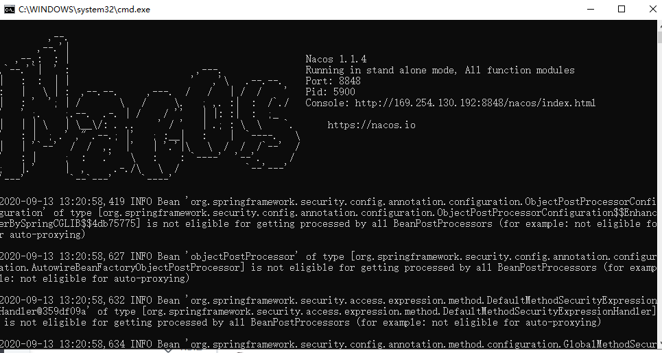

#### 注册中心的选择


CAP原则又称CAP定理，指的是在一个分布式系统中，[一致性](https://baike.baidu.com/item/%E4%B8%80%E8%87%B4%E6%80%A7/9840083)（Consistency）、[可用性](https://baike.baidu.com/item/%E5%8F%AF%E7%94%A8%E6%80%A7/109628)（Availability）、分区容错性（Partition tolerance）。CAP 原则指的是，这三个要素最多只能同时实现两点，不可能三者兼顾。


**场景分析**


美团下单到派单，并且扣除优惠券100元

张三在美团上点了外卖，然后下订单，然后在通知外卖小哥接单。思考三个问题：

1：如何体现C数据的 一致性

整个分布式系统中，一致性体现这笔订单，必须通知外卖小哥送单。必须扣除100元的优惠券。


2：如果体现A 可用性

在整个分布式系统中，可用性体现在张三下订单的时候，如果订单服务或卡券服务瘫痪了，这时候不能影响张三下单。（一般采用集群部署即可）


3：如何体现P分区容错性

整个分布式系统中，分区容错主要体现中张三下单的时候，突然订单服务和卡券服务之间的网络突然断开了，不能影响整个系统。


CAP原则又称CAP定理，指的是在一个[分布式系统](https://baike.baidu.com/item/%E5%88%86%E5%B8%83%E5%BC%8F%E7%B3%BB%E7%BB%9F/4905336)中， Consistency（一致性）、 Availability（可用性）、Partition tolerance（分区容错性），三者不可得兼。


**Zookeeper是保证CP**
当向注册中心查询服务列表时，我们可以容忍注册中心返回的是几分钟以前的注册信息，但不能接受服务直接down掉不可用。也就是说，服务注册功能对可用性的要求要高于一致性。但是zk会出现这样一种情况，当master节点因为网络故障与其他节点失去联系时，剩余节点会重新进行leader选举。问题在于，选举leader的时间太长，30 ~ 120s, 且选举期间整个zk集群都是不可用的，这就导致在选举期间注册服务瘫痪。在云部署的环境下，因网络问题使得zk集群失去master节点是较大概率会发生的事，虽然服务能够最终恢复，但是漫长的选举时间导致的注册长期不可用是不能容忍的。


**Eureka是保证AP**
Eureka看明白了这一点，因此在设计时就优先保证可用性。

Eureka各个节点都是平等的，几个节点挂掉不会影响正常节点的工作，剩余的节点依然可以提供注册和查询服务。

而Eureka的客户端在向某个Eureka注册或时如果发现连接失败，则会自动切换至其它节点，只要有一台Eureka还在，就能保证注册服务可用(保证可用性)，只不过查到的信息可能不是最新的(不保证强一致性)。

除此之外，Eureka还有一种自我保护机制，如果在15分钟内超过85%的节点都没有正常的心跳，那么Eureka就认为客户端与注册中心出现了网络故障，此时会出现以下几种情况： 

1. Eureka不再从注册列表中移除因为长时间没收到心跳而应该过期的服务 

2. Eureka仍然能够接受新服务的注册和查询请求，但是不会被同步到其它节点上(即保证当前节点依然可用) 

3. 当网络稳定时，当前实例新的注册信息会被同步到其它节点中

zookeeper

consul 

nacos 


#### spring cloud nacos注册中心搭建（扩展）

Nacos是阿里的一个开源产品，它是针对微服务架构中的服务发现、配置管理、服务治理的综合型解决方案。 官方介绍是这样的：

Nacos 致力于帮助您发现、配置和管理微服务。Nacos 提供了一组简单易用的特性集，帮助您实
现动态服务 发现、服务配置管理、服务及流量管理。 Nacos 帮助您更敏捷和容易地构建、交付和
管理微服务平台。 Nacos 是构建以“服务”为中心的现代应用架构的服务基础设施。
官网地址：https://nacos.io
官方文档：https://nacos.io/zh-cn/docs/what-is-nacos.html

**Nacos主要提供以下四大功能：**

1. 服务发现与服务健康检查 Nacos使服务更容易注册，并通过DNS或HTTP接口发现其他服务，
   Nacos还提供服务的实时健康检查，以防 止向不健康的主机或服务实例发送请求。
2. 动态配置管理 动态配置服务允许您在所有环境中以集中和动态的方式管理所有服务的配置。
   Nacos消除了在更新配置时重新 部署应用程序，这使配置的更改更加高效和灵活。
3. 动态DNS服务 Nacos提供基于DNS 协议的服务发现能力，旨在支持异构语言的服务发现，支持将
   注册在Nacos上的服务以 域名的方式暴露端点，让三方应用方便的查阅及发现。
4. 服务和元数据管理 Nacos 能让您从微服务平台建设的视角管理数据中心的所有服务及元数据，包
   括管理服务的描述、生命周 期、服务的静态依赖分析、服务的健康状态、服务的流量管理、路由
   及安全策略。


##### **启动nacos服务中心**

官网下载nacos服务压缩包

解压后启动bin/startup.cmd(window) 或 启动 bin/startup.sh (linux) 即可

下载页面: https://github.com/alibaba/nacos/releases

我们资源中准备的是1.3.2版本

 	单节点启动nacos

​	startup.cmd -m standalone

启动后的控制台



访问:localhost:8848 进入登录页，默认用户名密码: nacos    nacos


##### **注册服务**

在user微服务中加入依赖
在user微服务中的application.yml文件中加入配置
引导类中加上注解 @EnableDiscoveryClient 可以让该服务注册到nacos注册中心上去

父工程对阿里巴巴依赖进行定义

```xml
<?xml version="1.0" encoding="UTF-8"?>
<project xmlns="http://maven.apache.org/POM/4.0.0"
         xmlns:xsi="http://www.w3.org/2001/XMLSchema-instance"
         xsi:schemaLocation="http://maven.apache.org/POM/4.0.0 http://maven.apache.org/xsd/maven-4.0.0.xsd">
    <modelVersion>4.0.0</modelVersion>
    <packaging>pom</packaging>
    <modules>
        <module>user-service</module>
        <module>consume-service</module>
        <module>eureka-server</module>
    </modules>
    <parent>
        <groupId>org.springframework.boot</groupId>
        <artifactId>spring-boot-starter-parent</artifactId>
        <version>2.1.16.RELEASE</version>
        <relativePath/> <!-- lookup parent from repository -->
    </parent>

    <groupId>org.example</groupId>
    <artifactId>cloud_demo</artifactId>
    <version>1.0-SNAPSHOT</version>

    <properties>
        <project.build.sourceEncoding>UTF-8</project.build.sourceEncoding>
        <project.reporting.outputEncoding>UTF-8</project.reporting.outputEncoding>
        <java.version>1.8</java.version>
        <spring-cloud.version>Greenwich.SR5</spring-cloud.version>
        <mysql.version>5.1.47</mysql.version>
    </properties>
    <!-- 预定义依赖 管理依赖关系 -->
    <dependencyManagement>
        <dependencies>
            <dependency>
                <groupId>com.alibaba.cloud</groupId>
                <artifactId>spring-cloud-alibaba-dependencies</artifactId>
                <version>2.1.0.RELEASE</version>
                <type>pom</type>
                <scope>import</scope>
            </dependency>
            <!-- springCloud -->
            <dependency>
                <groupId>org.springframework.cloud</groupId>
                <artifactId>spring-cloud-dependencies</artifactId>
                <version>${spring-cloud.version}</version>
                <type>pom</type>
                <scope>import</scope>
            </dependency>
            <!-- mysql驱动 -->
            <dependency>
                <groupId>mysql</groupId>
                <artifactId>mysql-connector-java</artifactId>
                <version>${mysql.version}</version>
            </dependency>
            <!--mybatis-->
            <dependency>
                <groupId>org.mybatis.spring.boot</groupId>
                <artifactId>mybatis-spring-boot-starter</artifactId>
                <version>2.1.1</version>
            </dependency>
        </dependencies>
    </dependencyManagement>
    <dependencies>
        <dependency>
            <groupId>org.projectlombok</groupId>
            <artifactId>lombok</artifactId>
        </dependency>
    </dependencies>
</project>
```

在客户端端中引入此依赖

```xml
<dependency>
  <groupId>com.alibaba.cloud</groupId>
  <artifactId>spring-cloud-starter-alibaba-nacos-discovery</artifactId>
</dependency>
```

```yaml
spring:
  cloud:
 	nacos:
      discovery:
        server-addr: 127.0.0.1:8848
```

启动user微服务，启动nacos，可以查看到服务信息 服务注册 搞定~！


##### **配置中心**

Nacos除了作为注册中心，还可以用来代替SpringCloudConfig作为配置中心。而且SpringCloudConfig在使用是有下列弊端：

- 依赖于外部的Git仓库做配置管理
- 集群中的配置刷新依赖于消息总线SpringCloudBus

而Nacos的配置中心都有自己来实现，包括配置文件管理、文件历史记录都由Nacos自己完成。

微服务只需要监听Nacos即可，无需通过消息总线做配置同步。


点击定义配置


点击发布后，在nacos中我们定义好了配置


然后在我们的微服务中准备读取配置


读取属性配置 会读取myredis.host 和 myredis.port

```java
package com.itheima.user.config;

import lombok.Data;
import org.springframework.boot.context.properties.ConfigurationProperties;
import org.springframework.stereotype.Component;

/**
 * @作者 itcast
 * @创建日期 2020/11/8 21:39
 **/
@Component
@ConfigurationProperties(prefix = "myredis")
@Data
public class MyRedisProperties {
    private String host;
    private int port;
}
```

提供`ConfigController` 展示配置信息

```java
package com.itheima.user.controller;
import com.itheima.user.config.MyRedisProperties;
import com.itheima.user.pojo.User;
import com.itheima.user.service.UserService;
import org.springframework.beans.factory.annotation.Autowired;
import org.springframework.beans.factory.annotation.Value;
import org.springframework.web.bind.annotation.GetMapping;
import org.springframework.web.bind.annotation.PathVariable;
import org.springframework.web.bind.annotation.RequestMapping;
import org.springframework.web.bind.annotation.RestController;
/**
 * @作者 itcast
 * @创建日期 2020/11/6 20:22
 **/
@RestController
@RequestMapping("config")
public class ConfigController {
    @Autowired
    MyRedisProperties myRedisProperties;
    @GetMapping
    public MyRedisProperties findById(){
        return myRedisProperties;
    }
}
```


依赖中引入nacos-config依赖

```xml
<!--Spring的健康检测依赖-->
        <dependency>
            <groupId>com.alibaba.cloud</groupId>
            <artifactId>spring-cloud-starter-alibaba-nacos-config</artifactId>
        </dependency>
```


在微服务中 创建`bootstrap.yml`启动配置

```yml
server:
  port: 9001
spring:
  profiles:
    active: dev # 激活dev配置
  application:
    name: user-service
  datasource:
    url: jdbc:mysql://localhost:3306/javaee113?useSSL=false
    username: root
    password: root
    driver-class-name: com.mysql.jdbc.Driver
  cloud:
    nacos:
      discovery:
        server-addr: 127.0.0.1:8848 # 注册中心地址
      config:
        server-addr: 127.0.0.1:8848 # 配置中心地址
        name: user # 配置名称 
```

按照上面配置 服务在启动时

会自动加载nacos中    dataid为  user-dev.properties的配置内容


访问: http://localhost:9001/config 


nacos中的配置读到啦~


修改nacos中的配置并保存


然后刷新访问路径: http://localhost:9001/config 


可以看到配置自动更新啦