# 2.下载和安装

官网下载地址：http://www.rabbitmq.com/download.html


   <figure class="thumbnails">
    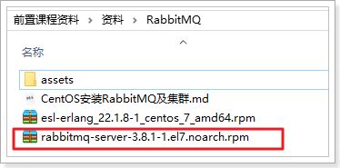
</figure>


## 2.1.安装依赖

RabbitMQ的安装需要一些依赖项，需要联网安装，输入命令：

```sh
yum -y install epel-release
```

然后输入命令：

```sh
yum -y install socat
```

如果没错则继续到 `2.2.安装Erlang`这里

如果发现报错：


 <figure class="thumbnails">
    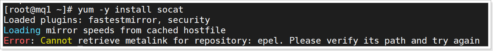
</figure>


需要修改本地.repo文件地址：

```sh
vi /etc/yum.repos.d/epel.repo
```


把其中的红框部分的注释打开，然后把紧跟着的一行**注释**：


 <figure class="thumbnails">
    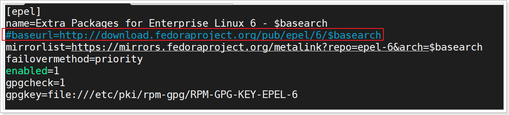
</figure>


最终效果如图：


 <figure class="thumbnails">
    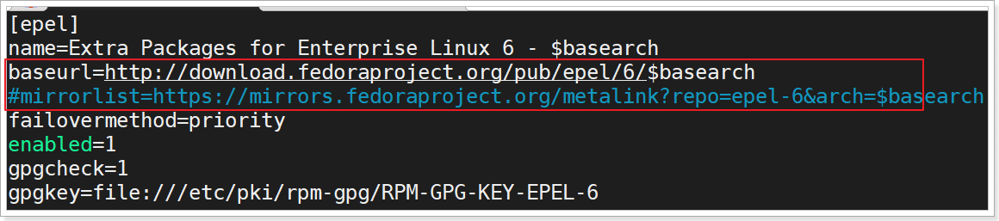
</figure>


再次安装socat：

```sh
yum -y install socat
```


## 2.2.安装Erlang

### 1）上传

上传本地的安装包：


 <figure class="thumbnails">
    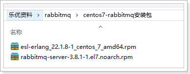
</figure>


进入 /usr/src目录

```sh
cd /usr/src/
```

创建新目录，完成上传：

```sh
mkdir mq
cd mq
```


 <figure class="thumbnails">
    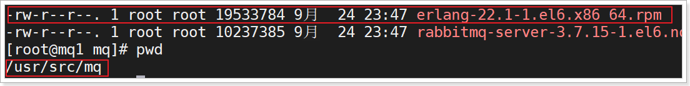
</figure>


### 2）安装

输入命令：

```sh
yum install -y esl-erlang_22.1.8-1_centos_7_amd64.rpm
```

结果：


 <figure class="thumbnails">
    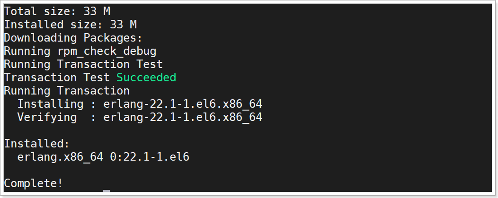
</figure>


## 2.3.安装RabbitMQ

### 1）上传

上传本地的 rabbitMQ安装包到 `/usr/src/mq`目录下

### 2）安装

```
yum install -y rabbitmq-server-3.8.1-1.el7.noarch.rpm
```


 <figure class="thumbnails">
    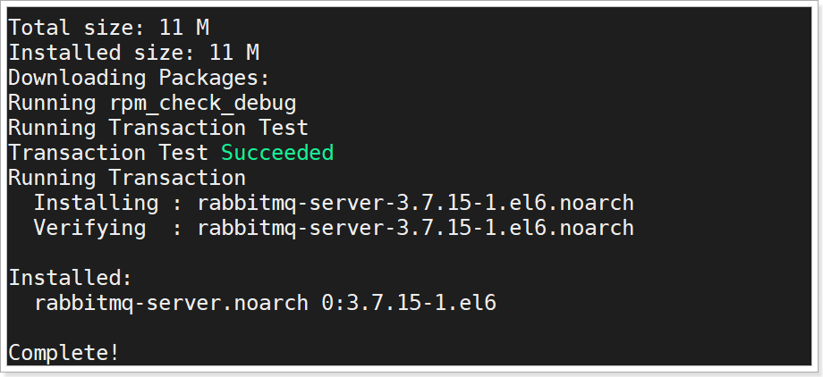
</figure>


## 2.4.启动服务

### 1）启动服务

输入命令，启动服务：

```sh
service rabbitmq-server start
# 或者
systemctl start rabbitmq-server
```

停止服务：

```sh
service rabbitmq-server stop
# 或者
systemctl stop rabbitmq-server
```

重启：

```sh
service rabbitmq-server restart
# 或者
systemctl restart rabbitmq-server
```


### 2）开启管理插件

默认情况下，rabbitMQ并没有开启管理界面，需要我们手动开启：

```
rabbitmq-plugins enable rabbitmq_management
```

看到如下信息：


 <figure class="thumbnails">
    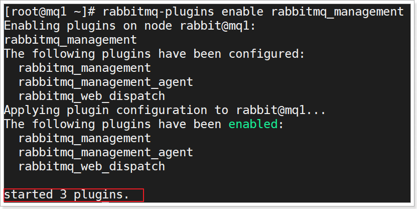
</figure>


访问 http://192.168.150.101:15672 即可看到如下页面：


 <figure class="thumbnails">
    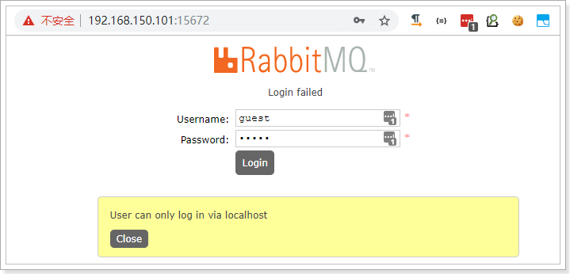
</figure>


注意：需要替换成自己的虚拟机的ip地址

### 3）添加新的用户

默认的guest用户只能在本地访问，如果要远程访问，需要修改配置文件，或者用命令添加新的用户.

添加新用户的命令：`rabbitmqctl add_user <username> <password>`

```sh
rabbitmqctl add_user itcast itcast
```

然后需要配置管理员权限：`rabbitmqctl set_user_tags <username> <tag>`

```sh
rabbitmqctl set_user_tags itcast administrator
```

如图：


 <figure class="thumbnails">
    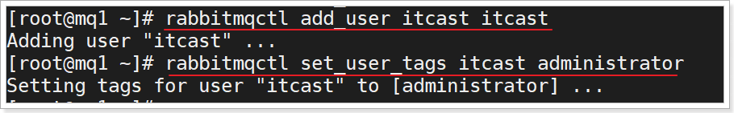
</figure>


使用itcast:itcast登录后，可以看到如下界面：


 <figure class="thumbnails">
    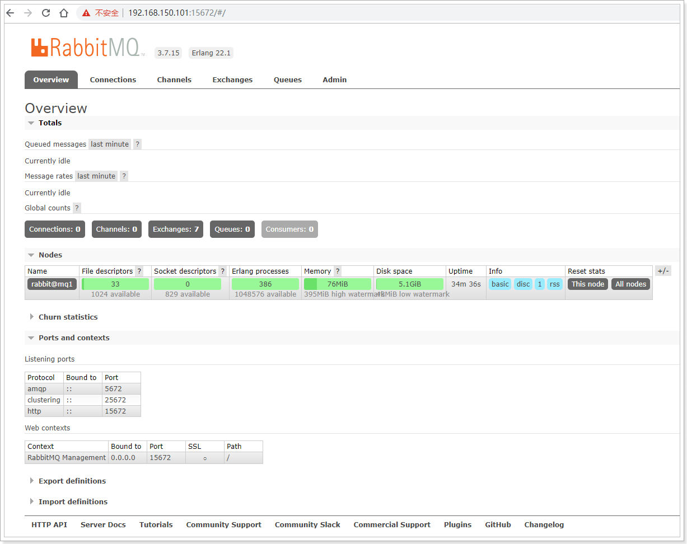
</figure>


## 2.5.RabbitMQ的命令

RabbitMQ的提供了好多CLI指令，详见官网：https://www.rabbitmq.com/cli.html

RabbitMQ 提供的命令行工具包括:

- [rabbitmqctl](https://www.rabbitmq.com/rabbitmqctl.8.html) : 用于服务管理及其它任务的生成
- [rabbitmq-diagnostics](https://www.rabbitmq.com/rabbitmq-diagnostics.8.html) ：用于诊断和健康检测
- [rabbitmq-plugins](https://www.rabbitmq.com/rabbitmq-plugins.8.html) ：用于[插件管理](https://www.rabbitmq.com/plugins.html)
- [rabbitmqadmin](https://www.rabbitmq.com/management-cli.html) ：用于 [HTTP API](https://www.rabbitmq.com/management.html) 来操作MQ，例如队列、交换机等

