# Http请求&Request

***

**今日目标**

```markdown
0. http请求

1. Request概述

2. reuqest获取请求消息内容
	请求行
	请求头
	请求参数（体）【重点】
	
3. request其他功能
	请求转发
	域对象
	
4. 案例：用户登录
```


# 零 Http协议


## 0.1 Http协议概述（熟知）

超文本传输协议（Hyper Text Transfer Protocol)是互联网上应用最为广泛的一种网络协议。

传输协议：在客户端和服务器端通信时，规范了传输数据的格式和内容

 <figure class="thumbnails">
    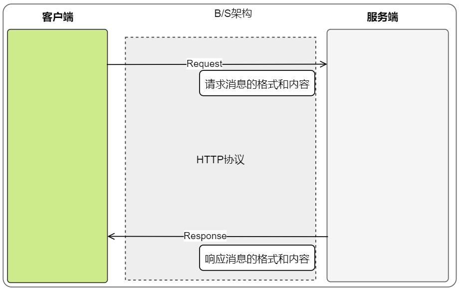
    
</figure>

```markdown
#. 1. http协议的特点
	0) tcp/ip协议族: 网络接口,网络层, 传输层(tcp), 应用层(http)
	1). 基于tcp协议 : 传输层协议, 三次握手,保障数据安全,相对udp效率低
	2). 默认端口 80 (省略不写)
			完整版: http://localhost:80/a.html
			省略版: http://localhost/a.html
			
			https 的默认端口是443 (secure 安全, 对传输数据进行加密)
	3). 基于请求/响应模型
		一次请求对应一次响应 / 先有请求,再有响应
	4). 无状态协议(多次请求之间相互独立,不记录状态)	 	
# 2. http协议版本发展
	1). http1.0 (1996) : 每次请求都有一个新的连接(开销大,比较慢)
	2). http1.1	(1999) : 长连接,多个请求共用一个连接(开销小一些,比较快) 
						 传输的数据都是文本(比较慢), 不支持推送
						 目前!!!
	3). http2.0 (2015) : 传输的数据经过压缩的,效率很高, 支持推送	
# 3. http协议的内容
	1). 请求报文: 浏览器发送给服务器的数据 
		请求行, 请求头, 请求体
	2). 响应报文: 服务器发送给浏览器的数据
		响应行, 响应头, 响应体

# 4. 抓包工具 (抓取基于http协议传输的数据包)
	1. 在浏览器和服务器交互的时候(发送请求,然后响应),我们可以使用工具抓取数据查看
	2. google浏览器内置开发者工具

```

名称解释：

​	**1.TCP/IP 网络模型**


<figure class="thumbnails">
    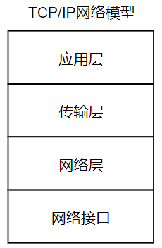
    
</figure>

​	**2.报文**

​	报文：在网络中传输和交换的数据单元（数据单元并不是随意传输单位），称之为报文。


### 使用 chrome(谷歌)抓包 ——按键f12


 
<figure class="thumbnails">
    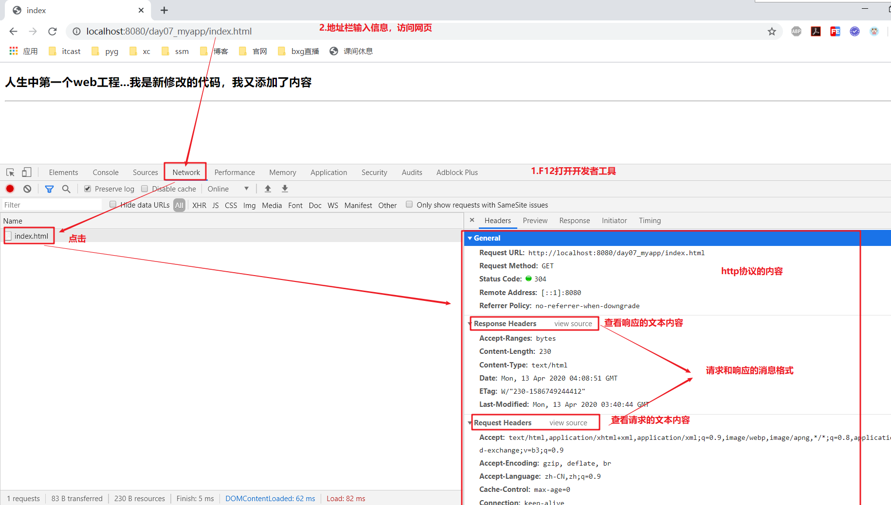
    
</figure>
 

## 0.2 Http请求

### 0.2.1 浏览器查看Http请求协议

#### ① get方式


<figure class="thumbnails">
    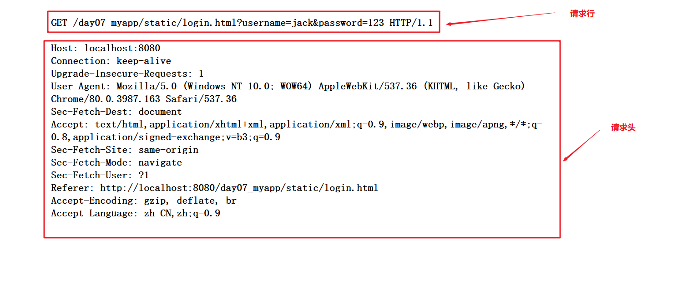
    
</figure>

#### ② post方式


<figure class="thumbnails">
    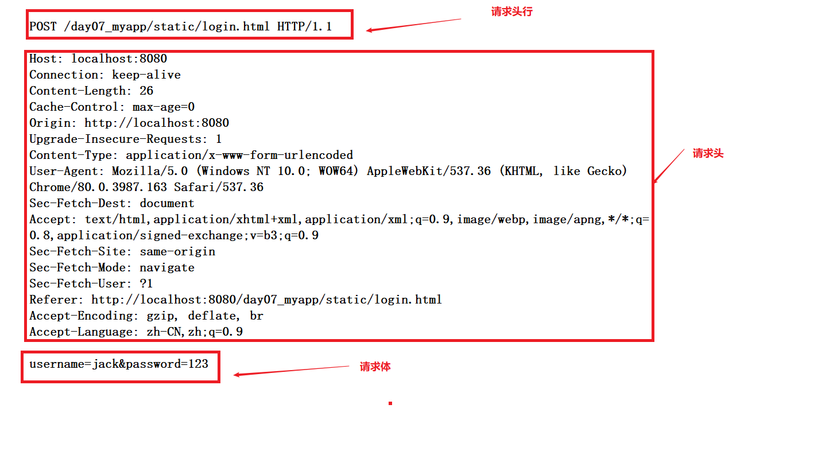
    
</figure>

```html
<!DOCTYPE html>
<html lang="zh-CN">
<head>
    <meta charset="UTF-8">
    <title>Title</title>
</head>
<body>
        <h1>get请求方式</h1>
        <form action="/day05-web/request/MyHttpServlet" method="get">
            <input type="text" name="user" placeholder="请输入用户名"> <br>
            <input type="password" name="pwd" placeholder="请输入密码"> <br>
             <input type="submit">
        </form>

        <h1>post请求方式</h1>
        <form action="/day05-web/request/MyHttpServlet" method="post">
            <input type="text" name="user" placeholder="请输入用户名"> <br>
            <input type="password" name="pwd" placeholder="请输入密码"> <br>
            <input type="submit">
        </form>
</body>
</html>
```


```java
@WebServlet("/MyHttpServlet")
public class MyHttpServlet extends HttpServlet {

    protected void doGet(HttpServletRequest web/request, HttpServletResponse response) throws ServletException, IOException {
        System.out.println("进入到MyHttpServlet的---get方法");
    }

    protected void doPost(HttpServletRequest web/request, HttpServletResponse response) throws ServletException, IOException {

        System.out.println("进入到MyHttpServlet的---post方法");
    }

}
```


### 0.2.2 HTTP请求消息格式

#### ① 请求行

```markdown
* 格式
		请求方式 请求路径 协议/版本号
		
* 例如
		POST /day07_myapp/static/login.html HTTP/1.1
		GET /day07_myapp/static/login.html?username=jack&password=123 HTTP/1.1
		
* 请求方式区别
	get
		1.请求参数在地址栏显示（请求行）
		2.请求参数大小有限制
		3.数据不太安全
	post
		1.请求参数不在地址栏显示（请求体）
		2.请求参数大小没有限制
		3.数据相对安全
		(上传文件和表单要用post,其他请求两种都可以)
```


#### ② 请求头

```markdown
* 格式
		请求头名称：请求头的值
* 例如   
		Host: localhost:8080
```

**常见请求头**：

```markdown
		------------------------------------------（了解）
1. Host: localhost:8080         所访问的服务器地址（域名+端口）
2. Connection: keep-alive       长连接（http1.1协议）	
3. Upgrade-Insecure-Requests:1  客户端支持https加密协议  
			
		---------------------------------------（重点）
4. Referer: http://baidu.com    上一次请求的地址	
        防盗链....		
5. User-Agent:        客户端系统和浏览器版本
		User-Agent: Mozilla/5.0 (Windows NT 10.0; WOW64) Chrome/63.0 Safari/537.36
		浏览器兼容性
			判断 : 服务器根据用户的浏览器版本, 返回响应的数据
				谷歌方式一 : 发送google浏览器可以解析的数据
				IE方式二 : 发送ie浏览器可以解析的数据
				火狐方式三 : 
```


#### ③ 请求体（正文）

```markdown
* 格式
		参数名=参数值&参数名=参数值...
* 例如
		http://localhost:8080/项目的虚拟路径/资源地址?username=jack&password=123
		get请求也成为？号传参---Query String 
		post 请求：
		
* 注意：
		get方式没有请求体，post方式才有
```


 

# 一 Request概述

- 由来: 用户通过浏览器访问服务器时，Tomcat将HTTP请求中所有的信息都封装在Request对象中

- 作用：开发人员可以通过request对象方法，来获取浏览器发送给服务器的所有信息.


 <figure class="thumbnails">
    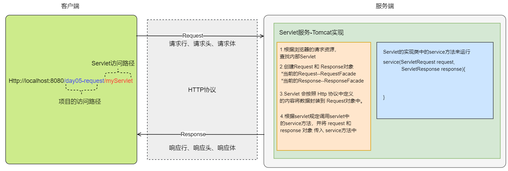
    
</figure>

**Request体系结构**

```markdown
		ServletRequest  (兼容大部分协议)
			|
		HttpServletRequest (HTTP协议)
			|
		org.apache.catalina.connector.RequestFacade（由tomcat厂商提供实现类）
```

在Servlet执行中：

1.根据浏览器的请求资源， 查找内部Servlet 

2.创建Request 和 Response对象  

​	*当前的Request--RequestFacade  

​	*当前的Response--ResponseFacade 

3.Servlet 会按照 Http 协议中定义 的内容将数据封装到 Request对象中。 

4.根据servlet规定调用servlet中 的service方法，并将 web/request 和 response 对象 传入 service方法中 。

--体现 Java 中的多态

 

# 二 Request获取Http请求信息

## 2.1 获取请求行信息（掌握）

```markdown
* 例如：
		GET /day09_request/requestDemo1 HTTP/1.1
	     请求方式     请求地址    协议/版本
* 相关API： (查阅文档: 是javaee文档)
	1. 获取请求方式 GET【掌握】
			String getMethod()  
            
	2. 获取项目虚拟路径（项目名）/day09_request【掌握】
			String getContextPath()  
			
	3. 获取URI /day09_request/requestDemo1
			URI：Uniform Resource Identifier，统一资源标识符
				（范围广,只要能唯一标识资源的: 本地路径,远程地址
					url 是 uri 的子集
				）  
			String getRequestURI() 
			
	4. 获取URL http://localhost:8080/day09_request/requestDemo1
			URL：Uniform Resource Location统一资源定位符（确定某一个资源的地址:俗称网址） 
			StringBuffer getRequestURL()  
			
	5. 获取协议和版本号	HTTP/1.1
			String getProtocol()
			
	6. 获取客户端ip  (浏览器所在计算机的ip,不在请求行中)
			String getRemoteAddr()
```

```java
package com.itheima03.web/request;

import javax.servlet.ServletException;
import javax.servlet.annotation.WebServlet;
import javax.servlet.http.HttpServlet;
import javax.servlet.http.HttpServletRequest;
import javax.servlet.http.HttpServletResponse;
import java.io.IOException;
/*
*   # 从request中获取请求行数据
*
*
* */
@WebServlet("/MyHttpServlet")
public class MyHttpServlet extends HttpServlet {

    protected void doGet(HttpServletRequest web/request, HttpServletResponse response) throws ServletException, IOException {
        this.doPost(web/request, response);
    }

    protected void doPost(HttpServletRequest web/request, HttpServletResponse response) throws ServletException, IOException {

        String method = web/request.getMethod();
        System.out.println("请求方式:" + method);

        StringBuffer requestURL = web/request.getRequestURL();
        System.out.println("请求地址:" + requestURL); // 不包含参数

        String protocol = web/request.getProtocol();
        System.out.println("请求协议:" + protocol);

        String contextPath = web/request.getContextPath();
        System.out.println("项目虚拟路径:" + contextPath);

        /*
        *  URI : Uniform Resource Identifier  统一资源标识符
        *       (资源唯一标识)
        *       远程地址, 本地路径
        *
        *  URL : Uniform Resource Locator  统一资源定位符
        *       (远程地址 : 网址)
        *
        *       URL 是 URI 的子集
        * */
        String requestURI = web/request.getRequestURI();
        System.out.println("请求地址:(省略三要素)" + requestURI);

        String remoteAddr = web/request.getRemoteAddr();
        System.out.println("用户ip:" + remoteAddr);

    }

}
```


## 2.2 获取请求头信息（掌握）

```markdown
* 例如：
	    Host: localhost:8080(主机: 指的就是tomcat访问地址)
        name(请求头属性名,固定不变的) : value(对应的属性值,动态改变)
     	常见请求头: 
        	user-agent (用户的系统版本和浏览器)
        	referer(上一次地址) 
        	如果在浏览器抓包中看不到某个头,就表示这个头所对应的值是null
        
* 相关API：
	1. 获取指定请求头名称对应的值，注：名称不区分大小写  (掌握)
			String getHeader(String name)  
			
	2. 获取所有请求头的名称
			Enumeration<String> getHeaderNames()  
			注：是Iterator迭代器前身(JDK 枚举)
```

```java
@WebServlet("/RequestHeaderServlet")
public class RequestHeaderServlet extends HttpServlet {

    protected void doGet(HttpServletRequest web/request, HttpServletResponse response) throws ServletException, IOException {
        this.doPost(web/request, response);
    }
  
    protected void doPost(HttpServletRequest web/request, HttpServletResponse response) throws ServletException, IOException {

        String user_agent = web/request.getHeader("user-agent");
        System.out.println("用户的系统和浏览器版本:" + user_agent);

        String referer = web/request.getHeader("referer");
        System.out.println("用户的上一次访问地址:" + referer);

        System.out.println("------------------");

      /*  HashMap<String,String> map = new HashMap<>();
        Set<String> keySet = map.keySet();
        Iterator<String> it = keySet.iterator();
        while(it.hasNext()){
            String key = it.next();
            String value = map.get(key);
        }*/

        Enumeration<String> headerNames = web/request.getHeaderNames();
        while(headerNames.hasMoreElements()){
            String name = headerNames.nextElement();
            String value = web/request.getHeader(name);
            System.out.println(name + "====" + value);
        }

    }

}
```


### 2.2.1 案例：视频防盗链

- referer : 请求来源


   <figure class="thumbnails">
    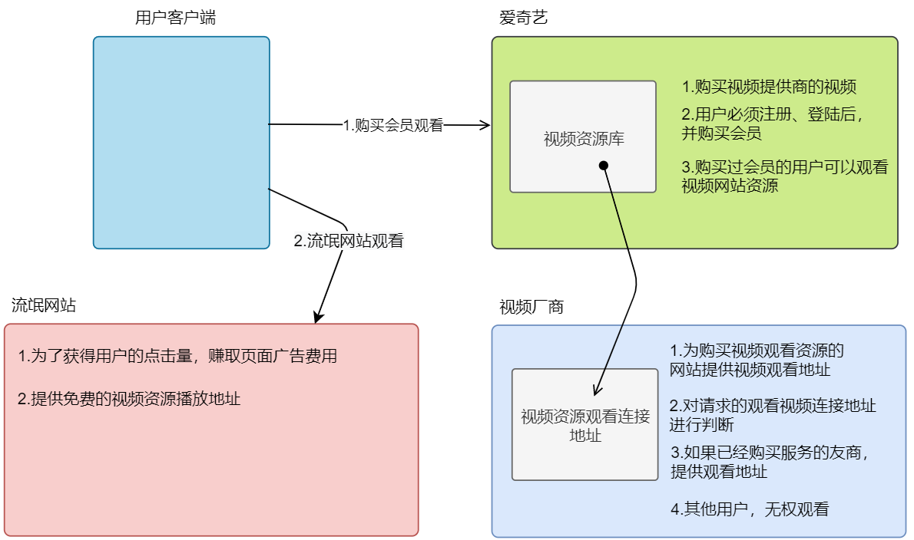
    
</figure>

- **视频资源拥有方的servlet服务**


```java
@WebServlet("/doorChainServlet")
public class DoorChainServlet extends HttpServlet {
    protected void doPost(HttpServletRequest web/request, HttpServletResponse response) throws ServletException, IOException {

        // 1.获得用户的地址
        String referer = web/request.getHeader("Referer");

        // 2.判断地址内容
        if (referer != null && referer.startsWith("http://localhost")) {
            System.out.println("iQiYi 网站");
            response.getWriter().println("get url addr ......");
        } else {
            System.out.println("流氓网站");
            response.getWriter().println("no permission");
        }
    }

    protected void doGet(HttpServletRequest web/request, HttpServletResponse response) throws ServletException, IOException {
        doPost(web/request,response);
    }
}

```


- **视频网站**

```html
<!DOCTYPE html>
<html lang="zh">
<head>
  <meta charset="UTF-8">
  <title>iQiYi</title>
</head>
<body>
    <a href="/day05-web/request/doorChainServlet"> 爱奇艺的视频连接地址 </a>
</body>
</html>
```


- **第三方非法资源**

```html
<!DOCTYPE html>
<html lang="zh">
<head>
  <meta charset="UTF-8">
  <title>yykan</title>
</head>
<body>
  <a href="http://自己本机ip地址:8080/day05-web/request/doorChainServlet">免费观看</a>
</body>
</html>
```

在cmd中通过 ipconfig查看自己的ip地址。


### 2.2.2 关于Html页面访问的问题

```markdown
#看个例子
1. 以前在学习前端的时候,还没学习tomcat, 点击右上角 浏览器
	http://localhost:63342/class111_web/day01-html&css/%E8%A1%A8%E6%A0%BC%E7%BB%83%E4%B9%A0.html
	
	-> idea 内置虚拟服务器 (端口 63342)--只能访问html页面
	
2. 现在所学习项目 部署 在 tomcat上
	html  -> 右上角 浏览器 (端口: 8080)
	

3. web项目的html页面访问
	web项目在tomcat中并运行，此时的访问html会使用tomcat的来运行（端口号：8080）。
	web项目没有加入tomcat或者是tomcat没有运行项目，此时会使用 idea 中的虚拟服务器。（端口号为：63342）
```


## 2.3 获取请求参数（体）【重点】

- 不论get还是post请求方式，都可以使用下列方法来获取请求参数

  >get请求参数放在 请求行 url中(get没有请求体)
  >
  >post请求参数放在 请求体


```markdown
* 参数
		username=jack&password=123&hobby=drink&hobby=perm
		格式: name1=value1&name2=value2... (name是可以重复)
* API
	1. 获取指定参数名的值  username=jack
			String getParameter(String name)			
	2. 获取指定参数名的值数组  hobby=drink&hobby=perm
			String[] getParameterValues(String name)
	3. 获取所有参数名和对应值数组，参数名 name（key），值数组 value，封装map集合
			Map<String,String[]> getParameterMap()
				 name , value
			
* 参数获得
	通过 web/request 通过 key 获得参数
		找到：具体的值
		找不到：null
		
* 中文乱码【重点】
	* get：在tomcat8及以上版本，解决了中文乱码问题
		内部URL编码
		
		传输的参数: 杯子(url编码表 : 编解码)
		杯子 -> %E6%9D%AF%E5%AD%90 (url编码: 看得懂 -> 看不懂) 保存 传输
			浏览器自动url编码 (get请求参数在url中的)
		%E6%9D%AF%E5%AD%90 -> 杯子(url解码)
			tomcat进行URL解码

	* post：编码解码不一致，造成乱码现象
   		参数在请求体
		客户端（浏览器）编码：UTF-8
		服务器默认     解码：ISO-8859-1 
		指定解码：void setCharacterEncoding(String env)
			注：这必须在方法内，获取参数之前
```


Http请求方式对中文的处理：


<figure class="thumbnails">
    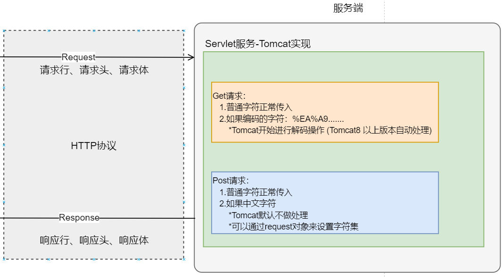
    
</figure>

示例代码：

```html
<!DOCTYPE html>
<html lang="zh-CN">
<head>
    <meta charset="UTF-8">
    <title>Title</title>
</head>
<body>
        <h1>get请求方式</h1>
        <form action="/day05-web/request/MyHttpServlet" method="get">
            <input type="text" name="username" placeholder="请输入用户名"> <br>
            <input type="password" name="password" placeholder="请输入密码"> <br>
             <input type="submit">
        </form>

        <h1>post请求方式</h1>
        <form action="/day05-web/request/MyHttpServlet" method="post">
            <input type="text" name="user" placeholder="请输入用户名"> <br>
            <input type="password" name="pwd" placeholder="请输入密码"> <br>
            <input type="submit">
        </form>
</body>
</html>
```


```java
package com.itheima04.param;

import javax.servlet.ServletException;
import javax.servlet.annotation.WebServlet;
import javax.servlet.http.HttpServlet;
import javax.servlet.http.HttpServletRequest;
import javax.servlet.http.HttpServletResponse;
import java.io.IOException;
import java.util.Arrays;
import java.util.Map;
import java.util.Set;

/*
* * API
	1. 获取指定参数名的值  username=jack
			String getParameter(String name)
	2. 获取指定参数名的值数组  hobby=drink&hobby=perm
			String[] getParameterValues(String name)

	3. 获取所有参数名和对应值数组，参数名 name（key），值数组 value，封装map集合
			Map<String,String[]> getParameterMap()
				 name , value

    # 问题: post请求中文乱码问题
        1. get请求 中文不乱码(tomcat8及以上)
             请求参数放在地址栏,一般文本数据 (url编码)
                浏览器发送的时候进行url编码
                tomcat在接收的时候进行url解码

        2. post请求 中文不乱码
             请求参数放在请求体

              浏览器发送的数据中文: utf-8
              tomcat默认编码表: ISO-8859-1

        解决:
            web/request.setCharacterEncoding("utf-8");

            注意: 写在获取参数之前
* */
@WebServlet("/ParamServlet")
public class ParamServlet extends HttpServlet {

    protected void doGet(HttpServletRequest web/request, HttpServletResponse response) throws ServletException, IOException {
        this.doPost(web/request, response);
    }

    protected void doPost(HttpServletRequest web/request, HttpServletResponse response) throws ServletException, IOException {
        web/request.setCharacterEncoding("utf-8");

        String username = web/request.getParameter("username");
        String pwd = web/request.getParameter("pwd");
        String sex = web/request.getParameter("sex");

        String[] hobbies = web/request.getParameterValues("hobby");
        System.out.println(username + "," + pwd + "," + sex + ',' + Arrays.toString(hobbies));

        System.out.println("--------------");
        Map<String, String[]> parameterMap = web/request.getParameterMap();
        Set<String> keySet = parameterMap.keySet();
        for (String key : keySet) {
            String[] value = parameterMap.get(key);
            System.out.println(key + "---" + Arrays.toString(value));
        }

    }

}
```


## 2.4 BeanUtils

BeanUtils工具由Apache软件基金组织编写，提供给我们使用。要解决的问题是：把对象的属性数据封装到对象中。 

BeanUtils应用场景：


<figure class="thumbnails">
    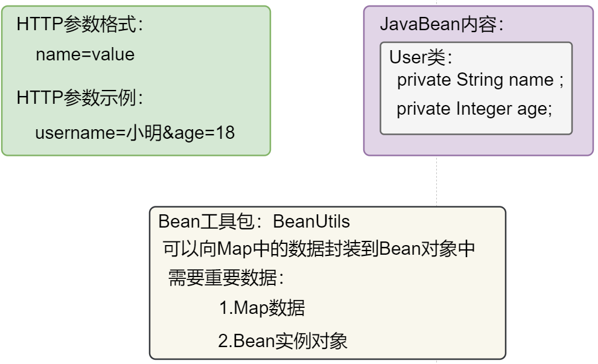
    
</figure>


> 要用BeanUtils 表单项的name属性值 和 javaBean的属性名一致即可 


### 2.4.1 使用方式

#### ① 导入jar包


<figure class="thumbnails">
    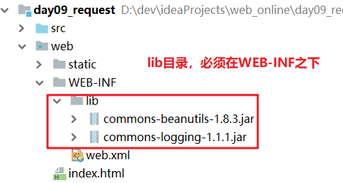
    
</figure>

#### ② 使用工具类封装数据

代码示例：

```html
<!DOCTYPE html>
<html lang="zh-CN">
<head>
    <meta charset="UTF-8">
    <title>Title</title>
</head>
<body>

    <h1>get请求</h1>
<!--  <form action="./hServlet" method="get">-->
<!--  <form action="./headServlet" method="get">-->
   <form action="/day05-web/request/utilsServlet" method="get">
    账号：<input type="text" name="account" > <br>
    密码：<input type="password" name="password" > <br>
     爱好：<input type="checkbox" name="hobby" value="smoke" > 抽烟
     <input type="checkbox" name="hobby" value="drink" > 喝酒
         <input type="checkbox" name="hobby" value="perm" > 烫头 <br>
    <input type="submit" value="提交">
  </form>


  <h1>post请求</h1>
<!--  <form action="/day05-web/request/paramServlet" method="post">-->
  <form action="./utilsServlet" method="post">
  <form action="./utilsServlet" method="post">
    账号：<input type="text" name="account" > <br>
    密码：<input type="password" name="password" > <br>
     爱好：<input type="checkbox" name="hobby" value="smoke" > 抽烟
     <input type="checkbox" name="hobby" value="drink" > 喝酒
         <input type="checkbox" name="hobby" value="perm" > 烫头 <br>
    <input type="submit" value="提交">
  </form>
   
</body>
</html>
```


```java
package com.itheima04.param;

import org.apache.commons.beanutils.BeanUtils;

import javax.servlet.ServletException;
import javax.servlet.annotation.WebServlet;
import javax.servlet.http.HttpServlet;
import javax.servlet.http.HttpServletRequest;
import javax.servlet.http.HttpServletResponse;
import java.io.IOException;
import java.io.UnsupportedEncodingException;
import java.lang.reflect.InvocationTargetException;
import java.util.Arrays;
import java.util.Map;
import java.util.Set;

/*
* * API
	1. 获取指定参数名的值  username=jack
			String getParameter(String name)
	2. 获取指定参数名的值数组  hobby=drink&hobby=perm
			String[] getParameterValues(String name)

	3. 获取所有参数名和对应值数组，参数名 name（key），值数组 value，封装map集合
			Map<String,String[]> getParameterMap()
				 name , value

    # 问题: post请求中文乱码问题
        1. get请求 中文不乱码(tomcat8及以上)
             请求参数放在地址栏,一般文本数据 (url编码)
                浏览器发送的时候进行url编码
                tomcat在接收的时候进行url解码

        2. post请求 中文不乱码
             请求参数放在请求体

              浏览器发送的数据中文: utf-8
              tomcat默认编码表: ISO-8859-1

        解决:
            web/request.setCharacterEncoding("utf-8");

            注意: 写在获取参数之前
* */
@WebServlet("/ParamServlet")
public class ParamServlet extends HttpServlet {

    protected void doGet(HttpServletRequest web/request, HttpServletResponse response) throws ServletException, IOException {
        this.doPost(web/request, response);
    }

    protected void doPost(HttpServletRequest web/request, HttpServletResponse response) throws ServletException, IOException {

        Map<String, String[]> parameterMap = web/request.getParameterMap();
        User user = new User();
       

        try {
            BeanUtils.populate(user,parameterMap);
        } catch (IllegalAccessException e) {
            e.printStackTrace();
        } catch (InvocationTargetException e) {
            e.printStackTrace();
        }

        System.out.println(user);

    }

    private void method01(HttpServletRequest web/request) throws UnsupportedEncodingException {
        web/request.setCharacterEncoding("utf-8");

        String username = web/request.getParameter("username");
        String pwd = web/request.getParameter("pwd");
        String sex = web/request.getParameter("sex");

        String[] hobbies = web/request.getParameterValues("hobby");
        System.out.println(username + "," + pwd + "," + sex + ',' + Arrays.toString(hobbies));

        System.out.println("--------------");
        Map<String, String[]> parameterMap = web/request.getParameterMap();
        Set<String> keySet = parameterMap.keySet();
        for (String key : keySet) {
            String[] value = parameterMap.get(key);
            System.out.println(key + "---" + Arrays.toString(value));
        }
    }

}
```

 

**javaBean**

```java
package com.itheima04.param;

import java.io.Serializable;
import java.util.Arrays;

/*
* javaBean
*   1. 实现serializable接口
*   2. private 属性
*   3. public get/set
*   4. public 空参构造
*
*
*   属性名 和 表单的name属性值 一致 !!!
*       更准确的说法: set XXX 跟 表单的name 属性值 一致
*       javabean : setXXX 一般 又跟属性名 一致
*
*   mybatis 的orm
*       如果结果集的字段 和 javabean 属性名一致, 自动映射
*       如果不一致, 手动写映射
* */
public class User implements Serializable {
    private String username;
    private String pwd;
    private String sex;
    private String[] hobby;

    @Override
    public String toString() {
        return "User{" +
                "username='" + username + '\'' +
                ", pwd='" + pwd + '\'' +
                ", sex='" + sex + '\'' +
                ", hobby=" + Arrays.toString(hobby) +
                '}';
    }

    public String getUsername() {
        return username;
    }

    public void setUsername(String username) {
        this.username = username;
    }


    public String getPwd() {
        return pwd;
    }

    public void setPwd(String pwd) {
        this.pwd = pwd;
    }

    public String getSex() {
        return sex;
    }

    public void setSex(String sex) {
        this.sex = sex;
    }

    public String[] getHobby() {
        return hobby;
    }

    public void setHobby(String[] hobby) {
        this.hobby = hobby;
    }
}

```


### 2.4.2 BeanUtils封装数据原理（扩展--了解）

原理图：


<figure class="thumbnails">
    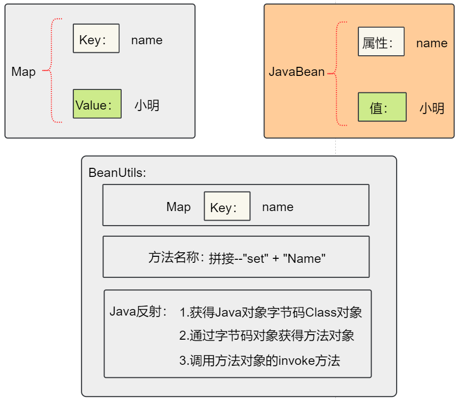
    
</figure>

BeanUtils原理代码：

```java
package com.itheima.web.servlet06;

import com.itheima.web.pojo.User;

import javax.servlet.ServletException;
import javax.servlet.annotation.WebServlet;
import javax.servlet.http.HttpServlet;
import javax.servlet.http.HttpServletRequest;
import javax.servlet.http.HttpServletResponse;
import java.io.IOException;
import java.lang.reflect.Method;
import java.util.Map;

/**
 * <p></p>
 *
 * @Description:
 */
@WebServlet("/theoryServlet")
public class BeanUtilsTheoryServlet extends HttpServlet {
    protected void doPost(HttpServletRequest web/request, HttpServletResponse response) throws ServletException, IOException {

        try {

            // 1.获得所有参数
            Map<String, String[]> parameterMap = web/request.getParameterMap();

            // 2.获得bean对象
            User user = new User();


            // 3.循环map数据
            for (String key : parameterMap.keySet()) {
                //name = value
                // 4.拼接set方法--name：setName
                StringBuffer stringBuffer = new StringBuffer("set");
                String attriName = key.substring(0, 1).toUpperCase() + key.substring(1);
                StringBuffer methodName = stringBuffer.append(attriName);

                // 5.获得Method对象
                Class<? extends User> uClazz = user.getClass();

                Method method = uClazz.getMethod(methodName.toString(), key.getClass());

                method.invoke(user, parameterMap.get(key));

            }

            System.out.println(user);


        } catch (Exception e) {
            e.printStackTrace();
        }

    }

    protected void doGet(HttpServletRequest web/request, HttpServletResponse response) throws ServletException, IOException {
        doPost(web/request,response);
    }
}
```

页面：

```html
<!DOCTYPE html>
<html lang="zh-CN">
<head>
    <meta charset="UTF-8">
    <title>Title</title>
</head>
<body>

    <h1>get请求</h1>
   <form action="/day05-web/request/theoryServlet" method="get">
    账号：<input type="text" name="account" > <br>
    密码：<input type="password" name="password" > <br>
     爱好：<input type="checkbox" name="hobby" value="smoke" > 抽烟
     <input type="checkbox" name="hobby" value="drink" > 喝酒
         <input type="checkbox" name="hobby" value="perm" > 烫头 <br>
    <input type="submit" value="提交">
  </form>
</body>
</html>
```


# 三 Request其他功能

## 3.1 请求转发

请求转发就是服务内部中的资源跳转。

特点：整个资源跳转中，内部资源都是一个request，但是不是同一个request对象。

- 示意图：


<figure class="thumbnails">
    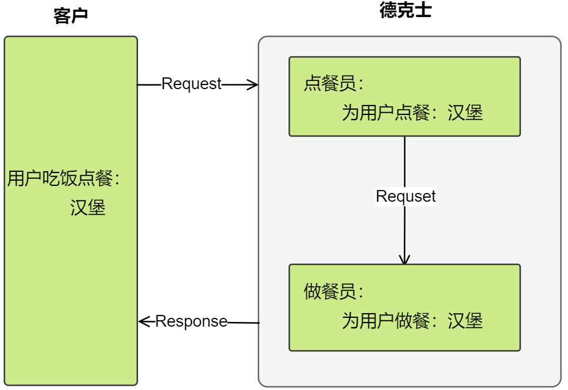
    
</figure>

- 请求转发相关内容

```markdown
* API
	1. 通过request对象，获得转发器对象(邮递员)
			 //path是要跳转的资源路径
			RequestDispatcher getRequestDispatcher(String path)
			
	2. 通过转发器对象，实现转发功能
			 // 要记得携带请求和响应
			void forward(ServletRequest web/request, ServletResponse response)  
			
* 请求转发特点
	1. 浏览器：发了一次请求
	2. 地址栏：没有发生改变
	3. 只能转发到服务器内部资源....
	
* 链式编程
		web/request.getRequestDispatcher("/bServlet").forward(web/request,response)
```


- 请求转发是，产生外部资源的跳转，出现错误


<figure class="thumbnails">
    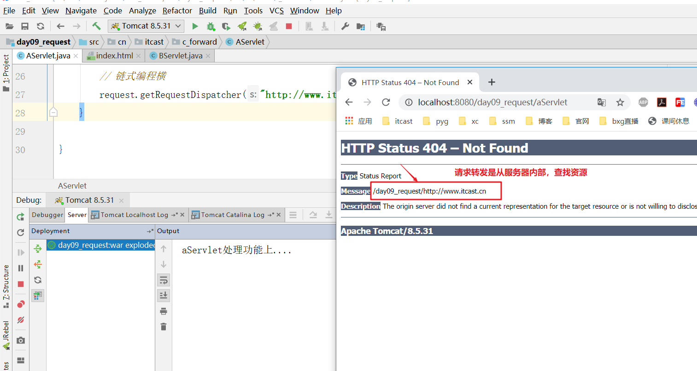
    
</figure>


示例代码

```html
<!DOCTYPE html>
<html lang="zh">
<head>
  <meta charset="UTF-8">
  <title>OrderFood</title>
</head>
<body>

    <a href="aServlet?food=hamburg">点一个汉堡</a>

</body>
</html>
```


```java
package com.itheima.web.servlet07;

import javax.servlet.ServletException;
import javax.servlet.annotation.WebServlet;
import javax.servlet.http.HttpServlet;
import javax.servlet.http.HttpServletRequest;
import javax.servlet.http.HttpServletResponse;
import java.io.IOException;
import java.util.UUID;

/**
 * <p></p>
 *
 * @Description:
 */
@WebServlet("/aServlet")
public class AServlet extends HttpServlet {
    protected void doPost(HttpServletRequest web/request, HttpServletResponse response) throws ServletException, IOException {

        // 1.获得客户端的参数
        String food = web/request.getParameter("food");
        System.out.println("点餐人员(aServlet)接受请求食物：" + food);
        System.out.println(web/request);

        // 2.a向b转发请求
        //相对路径：
        // a: http://localhost:8080/day05-web/request/aServlet
        // b: http://localhost:8080/day05-web/request/bServlet
        // RequestDispatcher dispatch = web/request.getRequestDispatcher("bServlet");
        // dispatch.forward(web/request,response);
        // web/request.getRequestDispatcher("bServlet").forward(web/request,response);
        //绝对路径--肯定是 / 或 http 打头
        web/request.getRequestDispatcher("/bServlet").forward(web/request,response);;


    }

    protected void doGet(HttpServletRequest web/request, HttpServletResponse response) throws ServletException, IOException {
        doPost(web/request,response);
    }
}
```


```java
package com.itheima.web.servlet07;

import javax.servlet.ServletException;
import javax.servlet.annotation.WebServlet;
import javax.servlet.http.HttpServlet;
import javax.servlet.http.HttpServletRequest;
import javax.servlet.http.HttpServletResponse;
import java.io.IOException;

/**
 * <p></p>
 *
 * @Description:
 */
@WebServlet("/bServlet")
public class BServlet extends HttpServlet {
    protected void doPost(HttpServletRequest web/request, HttpServletResponse response) throws ServletException, IOException {

        // 1.获得客户端的参数
        String food = web/request.getParameter("food");
        System.out.println("做餐人员(bServlet)接受请求食物：" + food+" -- 开始做");
        System.out.println(web/request);

        response.getWriter().println("make food orderId："+orderId);
    }

    protected void doGet(HttpServletRequest web/request, HttpServletResponse response) throws ServletException, IOException {
        doPost(web/request,response);
    }
}
```


## 3.2 域对象（共享数据）

域对象：一个有作用范围的对象，可以在范围内共享数据 

>Servlet 中有三大域对象 :  web/request , session, servletContext  （必须记忆--面试）
>
>web/request --是servlet域对象中最小范围的对象。
>
>共同点:  设置,获取和移除数据的api完全相同, 
>
>​		作用范围不一样
>
>域(scope) : 作用域, 作用范围

request域：代表一次请求的范围，一般用于请求中转发的多个资源中共享数据


- 域对象示例图


 <figure class="thumbnails">
    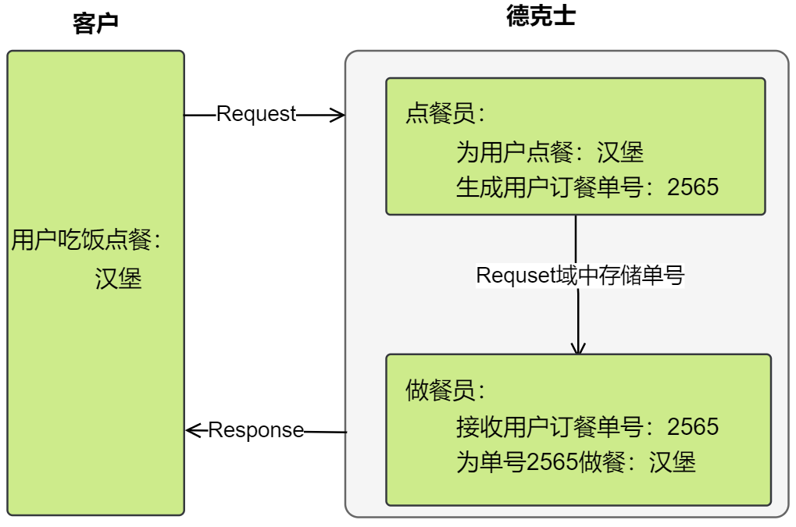
    
</figure>

- 域对象API内容

```markdown
* API
	1. 设置数据
			void setAttribute(String name, Object o)
				-> map.put(key,value)
	2. 获取数据
			Object getAttribute(String name)
				-> value = map.get(key)
	3. 删除数据
			void removeAttribute(String name)
				->  map.remove(key)
			
* 生命周期 : 一次请求到一次响应之间
	1. 何时创建？
			用户发送请求时，request
	2. 何时销毁
			服务器返回响应时，销毁request
	3. 作用范围？
			一次请求，一次请求可以在服务中转发多次
```


- 示意代码


```html
<!DOCTYPE html>
<html lang="zh">
<head>
  <meta charset="UTF-8">
  <title>OrderFood</title>
</head>
<body>

    <a href="aServlet?food=hamburg">点一个汉堡</a>

</body>
</html>
```


```java
package com.itheima.web.servlet07;

import javax.servlet.ServletException;
import javax.servlet.annotation.WebServlet;
import javax.servlet.http.HttpServlet;
import javax.servlet.http.HttpServletRequest;
import javax.servlet.http.HttpServletResponse;
import java.io.IOException;
import java.util.UUID;

/**
 * <p></p>
 *
 * @Description:
 */
@WebServlet("/aServlet")
public class AServlet extends HttpServlet {
    protected void doPost(HttpServletRequest web/request, HttpServletResponse response) throws ServletException, IOException {

        // 1.获得客户端的参数
        String food = web/request.getParameter("food");
        System.out.println("点餐人员(aServlet)接受请求食物：" + food);
        System.out.println(web/request);


        // 生成订单号
        // UUID 生成随机字符的，全球统一（重复的几率很低很低）
        UUID uuid = UUID.randomUUID();
        String orderId = uuid.toString();

        //设置到域对象中--web/request
        web/request.setAttribute("orderId",orderId);
        System.out.println("aServlet Orderid："+orderId);

        // 2.a向b转发请求
        //相对路径：
        // a: http://localhost:8080/day05-web/request/aServlet
        // b: http://localhost:8080/day05-web/request/bServlet
        // RequestDispatcher dispatch = web/request.getRequestDispatcher("bServlet");
        // dispatch.forward(web/request,response);
        // web/request.getRequestDispatcher("bServlet").forward(web/request,response);
        //绝对路径--肯定是 / 或 http 打头
        web/request.getRequestDispatcher("/bServlet").forward(web/request,response);;


    }

    protected void doGet(HttpServletRequest web/request, HttpServletResponse response) throws ServletException, IOException {
        doPost(web/request,response);
    }
}
```


```java
package com.itheima.web.servlet07;

import javax.servlet.ServletException;
import javax.servlet.annotation.WebServlet;
import javax.servlet.http.HttpServlet;
import javax.servlet.http.HttpServletRequest;
import javax.servlet.http.HttpServletResponse;
import java.io.IOException;

/**
 * <p></p>
 *
 * @Description:
 */
@WebServlet("/bServlet")
public class BServlet extends HttpServlet {
    protected void doPost(HttpServletRequest web/request, HttpServletResponse response) throws ServletException, IOException {

        // 1.获得客户端的参数
        String food = web/request.getParameter("food");
        System.out.println("做餐人员(bServlet)接受请求食物：" + food+" -- 开始做");
        System.out.println(web/request);

        // 获得用户的订餐号
        Object orderId = web/request.getAttribute("orderId");
        System.out.println("bServlet Orderid："+orderId);

        response.getWriter().println("make food orderId："+orderId);
    }

    protected void doGet(HttpServletRequest web/request, HttpServletResponse response) throws ServletException, IOException {
        doPost(web/request,response);
    }
}
```


# 四 案例：用户登录

**需求**

实现用户的登录功能

登录成功跳转到SuccessServlet展示：登录成功！xxx,欢迎您

登录失败跳转到FailServlet展示：登录失败，用户名或密码错误


**需求分析**


<figure class="thumbnails">
    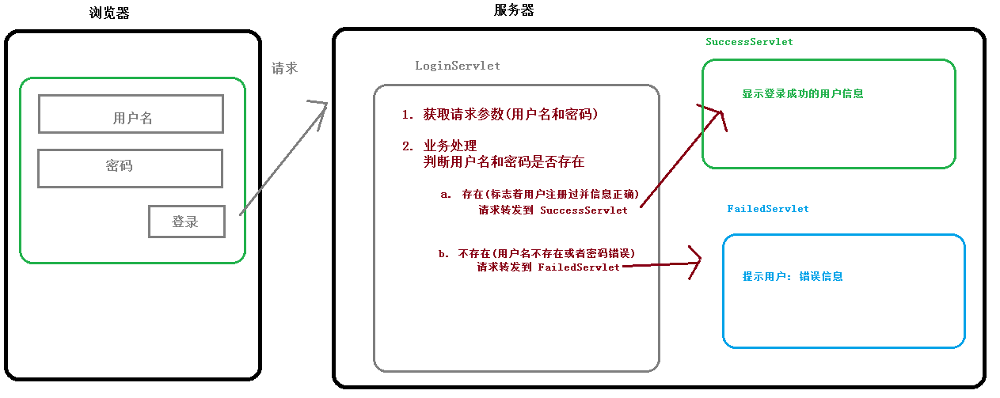
    
</figure>


### 代码实现

#### ① 创建web项目

  在Idea 创建web模块 day05-web/request


#### ③ 编写index.html

```html
<!DOCTYPE html>
<html lang="zh">
<head>
  <meta charset="UTF-8">
  <title>登录页面</title>
</head>
<body>

    <h1>登录页面</h1>

<!--    <form action="/day05-web/request/loginServlet" method="post">-->
    <form action="./loginServlet" method="post">
        用户<input type="text" name="account"> <br>
        密码<input type="password" name="password"> <br> <br>
        <input type="submit" value="登录">
    </form>

</body>
</html>
```


#### ④ User实体类

```java
package com.itheima.web.pojo;

import java.io.Serializable;
import java.util.Arrays;

/**
 * <p></p>
 *
 *  {@link java.io.ObjectInputStream}
 * @Description:
 */
public class User implements Serializable {

    // http参数中的所有name要和对象的属性名要一直
    private String account;
    private String password;
    private String[] hobby;

    public User() {
    }


    public User(String account, String password, String[] hobby) {
        this.account = account;
        this.password = password;
        this.hobby = hobby;
    }

    public String getAccount() {
        return account;
    }

    public void setAccount(String account) {
        this.account = account;
    }

    public String getPassword() {
        return password;
    }

    public void setPassword(String password) {
        this.password = password;
    }

    public String[] getHobby() {
        return hobby;
    }

    public void setHobby(String[] hobby) {
        this.hobby = hobby;
    }

    @Override
    public String toString() {
        return "User{" +
                "account='" + account + '\'' +
                ", password='" + password + '\'' +
                ", hobby=" + Arrays.toString(hobby) +
                '}';
    }
}
```


#### ⑤ LoginServlet

```java
package com.itheima.web.servlet08;

import com.itheima.web.pojo.User;
import org.apache.commons.beanutils.BeanUtils;

import javax.servlet.ServletException;
import javax.servlet.annotation.WebServlet;
import javax.servlet.http.HttpServlet;
import javax.servlet.http.HttpServletRequest;
import javax.servlet.http.HttpServletResponse;
import java.io.IOException;
import java.lang.reflect.InvocationTargetException;
import java.util.Map;

/**
 * <p></p>
 *
 * @Description:
 */
@WebServlet("/loginServlet")
public class LoginServlet extends HttpServlet {
    protected void doPost(HttpServletRequest web/request, HttpServletResponse response) throws ServletException, IOException {

        try {
            // 1.获得用户的数据，使用User对象来封装数据
            Map<String, String[]> parameterMap = web/request.getParameterMap();

            User user = new User();

            BeanUtils.populate(user,parameterMap);


            // 2.判断用户的数据，用户数据是否存在--现实从数据库中查看
            // jack

            if ("jack".equalsIgnoreCase(user.getAccount()) && "123".equalsIgnoreCase(user.getPassword())) {

                // 3.用户数据存在，调到成功servlet
                // 3.1 将用户数据放到域对象中
                web/request.setAttribute("user", user);
                web/request.getRequestDispatcher("successServlet").forward(web/request, response);

            } else {
                // 3.用户数据不存在，调到失败servlet
                web/request.getRequestDispatcher("failedServlet").forward(web/request, response);
            }

        } catch (IllegalAccessException e) {
            e.printStackTrace();
        } catch (InvocationTargetException e) {
            e.printStackTrace();
        }


    }

    protected void doGet(HttpServletRequest web/request, HttpServletResponse response) throws ServletException, IOException {
        doPost(web/request,response);
    }
}
```


#### ⑥ SuccessServlet

```java
package com.itheima.web.servlet08;

import com.itheima.web.pojo.User;

import javax.servlet.ServletException;
import javax.servlet.annotation.WebServlet;
import javax.servlet.http.HttpServlet;
import javax.servlet.http.HttpServletRequest;
import javax.servlet.http.HttpServletResponse;
import java.io.IOException;

/**
 * <p></p>
 *
 * @Description:
 */
@WebServlet("/successServlet")
public class SuccessServlet extends HttpServlet {
    protected void doPost(HttpServletRequest web/request, HttpServletResponse response) throws ServletException, IOException {

        // 1.获得用户数据
        User user = (User) web/request.getAttribute("user");


        // 2.显示用户数据到浏览器中
        response.getWriter().println("Welcome user:"+user.getAccount());


    }

    protected void doGet(HttpServletRequest web/request, HttpServletResponse response) throws ServletException, IOException {
        doPost(web/request,response);
    }
}
```


#### ⑦ FailServlet

```java
package com.itheima.web.servlet08;

import javax.servlet.ServletException;
import javax.servlet.annotation.WebServlet;
import javax.servlet.http.HttpServlet;
import javax.servlet.http.HttpServletRequest;
import javax.servlet.http.HttpServletResponse;
import java.io.IOException;

/**
 * <p></p>
 *
 * @Description:
 */
@WebServlet("/failedServlet")
public class FailedServlet extends HttpServlet {
    protected void doPost(HttpServletRequest web/request, HttpServletResponse response) throws ServletException, IOException {

        response.getWriter().println("login failed");

    }

    protected void doGet(HttpServletRequest web/request, HttpServletResponse response) throws ServletException, IOException {
        doPost(web/request, response);
    }
}
```


