## 0.1 浏览器查看Http响应协议


<figure class="thumbnails">
    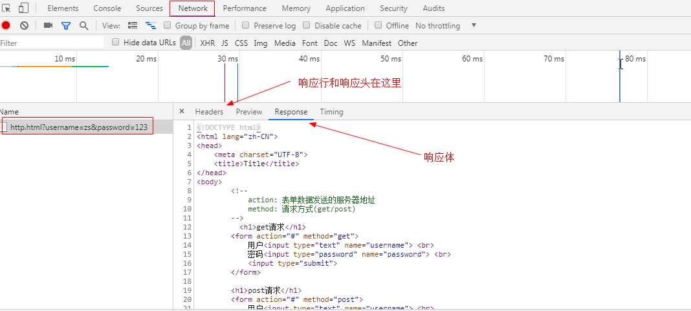
</figure>


<figure class="thumbnails">
    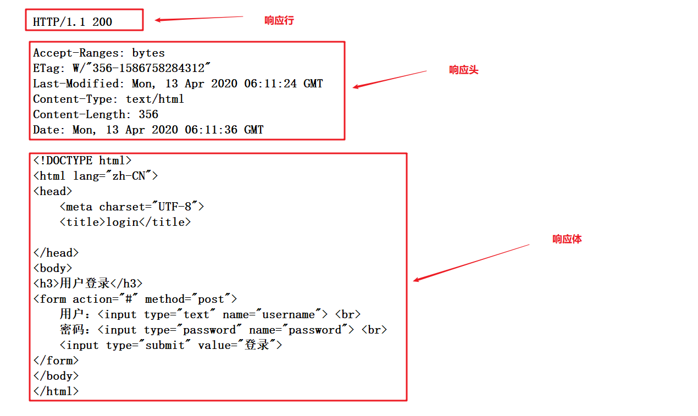
</figure>


## 0.2 HTTP响应消息格式

#### ① 响应行

```markdown
* 格式
		协议/版本号 状态码
* 例如
		HTTP/1.1 200

* 常见状态码
	--------------- 用户可以正常访问页面
	200 ：表示成功	
	302 ：重定向(response学习)
	304 ：从缓存中读取数据
		(如果这个资源没有变化,浏览器是会缓存的,下次请求,就直接从缓存中读取,提高效率)
	--------------- 用户无法正常访问页面
	404：请求资源未找到（not  found）
	405：请求的方法不允许访问（servlet给大家演示....）
	500：服务器内部错误（java代码写错了.....）
```


#### ② 响应头

```markdown
* 格式
		响应头名称：响应头的值
* 例如
		Last-Modified: Mon, 13 Apr 2020 06:11:24 GMT
```

**常见响应头**：

```markdown
1. Location：通常与状态码302一起使用，实现重定向操作
		Location:http://www.itcast.cn
2. Content-Type：服务器告诉客户端，返回响应体的数据类型和编码方式
		Content-Type:text/html;charset=utf-8
3. Content-Disposition：服务器告诉客户端，以什么样方式打开响应体
		* in-line（默认）：浏览器直接打开相应内容，展示给用户
		* attachment;filename=文件名：浏览器以附件的方式保存文件 【文件下载】
4. Refresh：在指定间隔时间后，跳转到某个页面
		"Refresh"： "3;url=http://www.itheima.com"
```


#### ③ 响应体（正文）

```markdown
* 服务器返回的数据，由浏览器解析后展示给用户
   用户看到页面所有的内容，都是在响应体中返回的
```


```html
<!DOCTYPE html>
<html lang="zh">
<head>
  <meta charset="UTF-8">
  <title>login</title>
</head>
<body>

    <h1>用户登录</h1>

    <form action="#" method="post">
        用户<input type="text" name="account"> <br>
        密码<input type="password" name="password"> <br> <br>
        <input type="submit" value="登录">
    </form>

</body>
</html>
```


# 一 Response【重点】

## 1.1 概述

- response对象表示web服务器给浏览器返回的响应信息

- 作用：开发人员可以使用response对象的方法，设置要返回给浏览器的响应信息

  > 注意: tomcat在响应会有一些默认的设置, 开发人员在servlet中的设置会覆盖tomcat的设置


<figure class="thumbnails">
    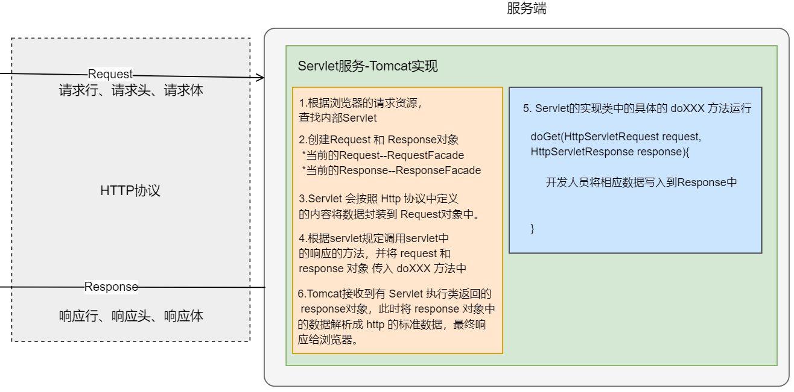
</figure>

```markdown
	ServletResponse 接口 (理论上兼容大部分协议)
			|	
	HttpServletResponse 接口 (专门指的是http协议的响应)
			|	
	org.apache.catalina.connector.ResponseFacade 实现类（由tomcat提供的）
```

执行步骤：

1.根据浏览器的请求资源， 查找内部Servlet 

2.创建Request 和 Response对象  

​	*当前的Request--RequestFacade  

​	*当前的Response--ResponseFacade 

3.Servlet 会按照 Http 协议中定义 的内容将数据封装到 Request对象中。 

4.根据servlet规定调用servlet中 的service方法，并将 request 和 response 对象 传入 service方法中 。

--体现 Java 中的多态

5.Servlet的实现类中的具体的 doXXX 方法运行 ， 开发人员在Servlet方法中将相应数据写入到Response里。

6.Tomcat接收到有 Servlet 执行类返回的 response对象，此时将 response 对象中 的数据解析成 http 的标准数据，最终响应给浏览器。

 

## 1.2 设置Http响应行

```markdown
* 格式
	 	协议/版本号 状态码(status code) 
* 例如
		HTTP/1.1 200	
* API
	1. 设置状态码 
			 void setStatus(int sc)  
    2. 常见响应状态码：
            200：请求和响应都OK(顺利)
            
            302：重定向 (待会)
            304：浏览器从缓存中加载数据
            
            404：请求的路径错误或请求的资源不存在(自己开发的时候,路径有问题)
            405: 在HttpServlet的子类中, doGet或doPost方法没有重写
            500：服务器内部异常
	3. 注意事项：上述常见的响应状态码，通常是由tomcat服务器自动响应给浏览器。我们一般是不需要手动设置的；       
```


示例代码：

```java
package com.itheima.web.servlet01;

import javax.servlet.ServletException;
import javax.servlet.annotation.WebServlet;
import javax.servlet.http.HttpServlet;
import javax.servlet.http.HttpServletRequest;
import javax.servlet.http.HttpServletResponse;
import java.io.IOException;

/**
 * <p></p>
 *
 * @Description:
 */
@WebServlet("/changeLineServlet")
public class ChangeLineServlet extends HttpServlet {
    protected void doPost(HttpServletRequest request, HttpServletResponse response) throws ServletException, IOException {

        // 设置响应状态码--覆盖tomcat默认的状态码
        response.setStatus(404);

    }

    protected void doGet(HttpServletRequest request, HttpServletResponse response) throws ServletException, IOException {
        doPost(request, response);
    }
}
```


**浏览器缓存**(304)


<figure class="thumbnails">
    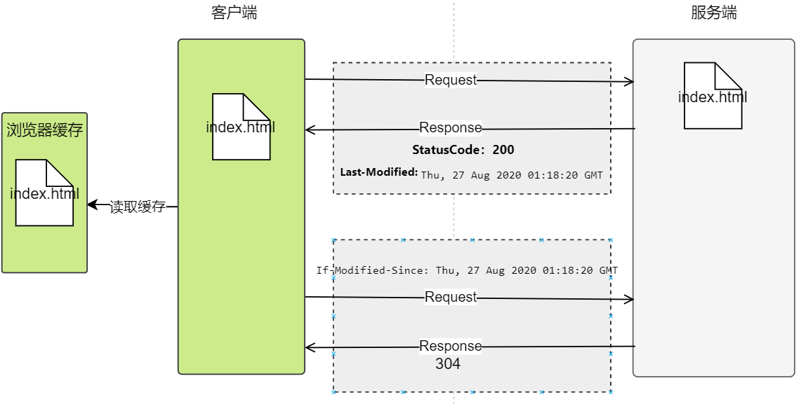
</figure>

步骤分析：

1.浏览器第一次访问服务器某个**静态资源**：

​	如：http://localhost:8080/day06-response/index.html

2.浏览器获得服务器的 index.html 页面，此时获得：响应的状态码为：200, 文件的更新时间(Last-Modified )

​	浏览器在将 index.html 页面获得后，会保存到缓存中（内容或硬盘）

3.浏览器第二次访问 index.html 页面时，会先查看缓存中是否有 index.html 页面。

​	如果有的话，会将此文件的更新时间作为请求头(If-Modified-Since )发送给服务器。

4.服务器根据浏览器请求头中 If-Modified-Since 判断服务器的 index.html 文件是否更新。

​	如果没有更新，服务端会给浏览器响应 304,浏览器会加载缓存中的数据。

​	如果有更新， 服务端会给浏览器最新的 index.html 文件，此时：状态码为200，文件的最新时间(Last-Modified )。


## 1.3 设置Http响应头

```markdown
* 格式
		响应头名称：响应头的值
		(name : value)
* 例如
		Content-Length : 5 (指的是响应体内容长度5个字符)
* API
	1. 设置指定头名称和对应的值
			void setHeader(String name, String value)  
	2. value值可以由多个参数组成，不同参数之间使用分号隔开： 		
			response.setHeader(key,"value1;value2")；
	3. 常用响应头：
            refresh：定时刷新；
            content-type:设置响应数据的数据类型和编码格式； (内容类型)
            location:配合302响应状态码完成重定向；(位置)
            content-disposition：通知浏览器以附件的形式解析响应的数据；		
```


## 1.4 设置Http响应体

```markdown
响应体中包含 响应数据的正文
响应是服务器给浏览器发送数据: 输出流
* API（输出流对象）
	1. 字符输出流 : 用于向浏览器输出字符数据(文本)
			PrintWriter getWriter()			
	2. 字节输出流 : 用于向浏览器输出二进制数据(比如文件下载)
			ServletOutputStream getOutputStream()

	注意：在同一个servlet中，二种类型的输出流不能同时存在，互斥
```


```java
package com.itheima.web.servlet08;

import javax.servlet.ServletException;
import javax.servlet.ServletOutputStream;
import javax.servlet.annotation.WebServlet;
import javax.servlet.http.HttpServlet;
import javax.servlet.http.HttpServletRequest;
import javax.servlet.http.HttpServletResponse;
import java.io.FileInputStream;
import java.io.IOException;

/**
 * <p></p>
 *
 * @Description:
 */
@WebServlet("/ResponseBodyServlet")
public class ResponseBodyServlet extends HttpServlet {
    protected void doPost(HttpServletRequest request, HttpServletResponse response) throws ServletException, IOException {

        // 1.使用response来响应字符流内容
        //   注意：在响应体中填写中文之前，设置字符集
        /*
            由于响应类型时text/html，浏览器在获得后对响应内容自动加html标签
         */
        // String encode = getServletContext().getInitParameter("encode");

        // response.setContentType("text/html;charset="+encode);

        // response.getWriter().println("我是一个响应体的中文");
        // response.getWriter().write("我是一个响应体的中文");
        /*
            println:将输出的内容都会当长字符串来处理
            write：如果时数字，那么久会按照ASCII码表来进行转换
                println --> 调用 write
         */
        // response.getWriter().println(98);
        // response.getWriter().write(98);


        // 2.使用response来响应字节流内容--不要设置码表
        //将本地的图片使用流的方式给浏览器
        ServletOutputStream outputStream = response.getOutputStream();

        //参数：name--文件的真实路径
        FileInputStream inputStream = new FileInputStream("C:\\Users\\Simple\\Desktop\\ASCII.jpg");

        byte[] buffer = new byte[1024];

        int length;

        while ((length = inputStream.read(buffer)) != -1) {
            outputStream.write(buffer, 0, length);
        }
        inputStream.close();
        // outputStream 不需要关闭，tomcat会自动关闭

    }

    protected void doGet(HttpServletRequest request, HttpServletResponse response) throws ServletException, IOException {
        doPost(request, response);
    }
}
```


# 二. 响应头的功能【重点】

## 2.1  响应定时刷新(refresh)

**需求**

在当前页面停留3秒钟之后，跳转到传智播客首页 


<figure class="thumbnails">
    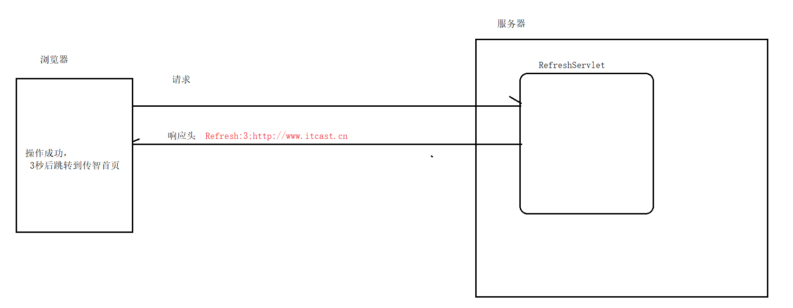
</figure>

**步骤分析**

```markdown
1. 通过response设置响应头 Refresh
		response.setHeader("Refresh","间隔时间（秒）;跳转页面");
```


```java
package com.itheima.web.servlet02;

import javax.servlet.ServletException;
import javax.servlet.annotation.WebServlet;
import javax.servlet.http.HttpServlet;
import javax.servlet.http.HttpServletRequest;
import javax.servlet.http.HttpServletResponse;
import java.io.IOException;

/**
 * <p></p>
 *
 * @Description:
 */
@WebServlet("/RefreshServlet")
public class RefreshServlet extends HttpServlet {
    protected void doPost(HttpServletRequest request, HttpServletResponse response) throws ServletException, IOException {

        // response.setHeader("Refresh","间隔时间（秒）;url=跳转页面");
        // 如果是跳转到外部资源，网络通讯三要素不能省略
        response.setHeader("Refresh","5;url=http://www.itheima.com");
    }

    protected void doGet(HttpServletRequest request, HttpServletResponse response) throws ServletException, IOException {
        doPost(request, response);
    }
}
```


## 2.2 响应体中文乱码(content-type)

- **需求**

向页面输出中文数据没有乱码  


<figure class="thumbnails">
    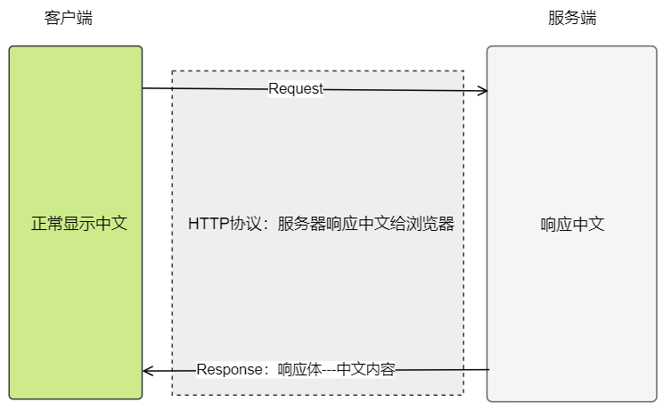
</figure>


- **原因分析**


```markdown
1. 通过response获取字符输出流
		PrintWriter pw = response.getWriter();		
2. 通过字符输出输出中文字符
		pw.println("中文....");
3. 浏览器访问,网页出现中文乱码	

4. 原因: tomcat默认使用ISO-8859-1编码, 然后也让浏览器用ISO-8859-1解码
	
5. 解决 : 统一浏览器和服务器编码(utf-8)	
	response.setContentType("text/html;charset=utf-8");
```


- **解决中文乱码**

在解决响应体中的中文乱码时，服务器告诉浏览器:
       *应该以text/html格式去解析 响应体
       *应该以utf-8的字符集去解码 响应体


```markdown
#统一浏览器和服务器编码
		response.setHeader("content-type","text/html;charset=utf-8"); //完整写法
		response.setContentType("text/html;charset=utf-8"); //,简写,推荐!!!!
```


- **HTTP内容类型 的解释**

在使用 Response 给浏览器响应类型的时候，需要给的类型为 ：MIME 类型。

MIME：**多用途互联网邮件扩展**（**MIME**，Multipurpose Internet Mail Extensions）是一个互联网标准，它扩展了电子邮件标准，使其能够支持非ASCII字符、二进制格式附件等 。

MIME 在window出现前就已经存在，HTTP协议中使用的内容类型就是 MIME。

下面是 window 和 MIME 类型的对比：
| 环境 | 普通文本 | html文本 | json |
| :----:| :---: | :----: | :----:|
| window | .txt | .html | .json |
| MIME | text/plain | text/html | application/json |


- **实例代码**


```java
package com.itheima02.header;

import javax.servlet.ServletException;
import javax.servlet.annotation.WebServlet;
import javax.servlet.http.HttpServlet;
import javax.servlet.http.HttpServletRequest;
import javax.servlet.http.HttpServletResponse;
import java.io.IOException;

@WebServlet("/ContentTypeServlet")
public class ContentTypeServlet extends HttpServlet {

    protected void doGet(HttpServletRequest request, HttpServletResponse response) throws ServletException, IOException {
        this.doPost(request, response);
    }

    protected void doPost(HttpServletRequest request, HttpServletResponse response) throws ServletException, IOException {
        /*
        * # 1. value2
        *   乱码问题: 编解码所使用的字符集不一致
        *
        *   服务器在编码 : utf-8
        *   浏览器在解码 :  肯定不是utf-8解码
        *
        *       tomcat默认设置 : charset=ISO-8859-1
        *           告诉浏览器用iso--8859-1解码
        *
        *  #  response.setContentType("text/html;charset=utf-8");
        *       -> 响应体中文乱码
        *
        *  # 2. value1
        *       windows系统文件扩展名:         txt             html            json               
        *       MIME  邮件中使用文件扩展名:   text/plain      text/html      application/json
        *                                  主类型/子类型
        *
        *       映射关系: tomcat/conf/web.xml 文件查看
        *
        *
        *   response.setContentType("text/html;charset=utf-8");
        *
        *       服务器告诉浏览器:
        *           你应该以text/html格式去解析 响应体
        *           应该以utf-8的字符集去解码 响应体
        * */
        // 向浏览器输出中文内容
        // 1.中文乱码
        // 2.向浏览器输出具体的格式内容

        // 向浏览器输出中文前要设置编码表和响应内容类型
        //content-type 内容格式： 响应内容格式 ; charset=
        //  windows : .txt   .html  .json
        // MIME
        // response.setHeader("content-type", "text/html;charset=utf-8");
        response.setContentType("text/html;charset=utf-8");

        response.getWriter().println("你想看我吗？");
        
        
        
        
        String fileName = "1.txt";

        //通过文件的后缀名，使用服务器来找 当前文件的 MIME 类型
        String mimeType = getServletContext().getMimeType(fileName);

        response.getWriter().println("1.txt 文件MIME格式：" + mimeType);
        
        
        
    }

}
```


## 2.3 响应重定向(location+302)

**需求**

用户访问AServlet后，服务器告诉浏览器重定向到BServlet


<figure class="thumbnails">
    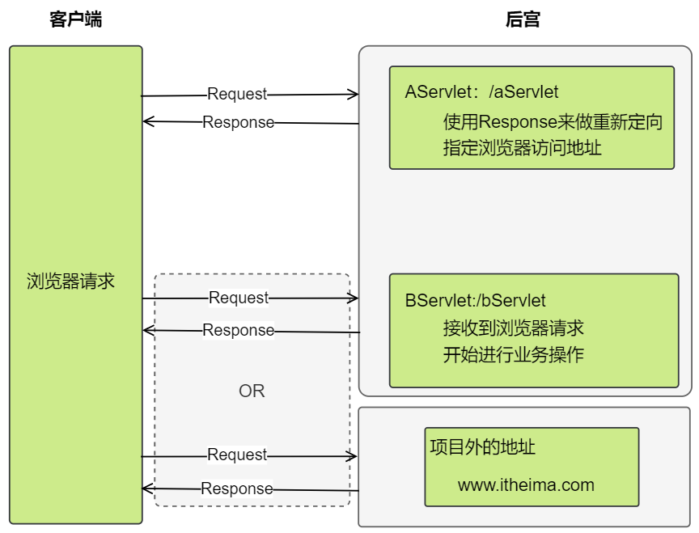
</figure>

**重定向特点**

```markdown
# 重定向是浏览器行为

1.客户端发送了两次请求

2.客户端请求地址会发生改变

3.重新定向是浏览器多次访问服务器

	重新定向的地址可以访问项目的内部资源和项目外的外部资源。

4.重新定向中不能使用 request 域来实现数据共享
```


**步骤分析**

```markdown
* 方式一
	// 1.设置状态码
		response.setStatus(302);
	// 2.设置响应头 Location
		response.setHeader("Location","重定向网络地址");
			
* 方式二
	// 1.response这哥们封装专门处理重定向的方法 (掌握)
		response.sendRedirect("重定向网络地址");
```


**实例代码**

```html
   <a href="AServlet?msg=怎么追前端的女孩子">响应头_location_重定向</a> <br>
```


```java
package com.itheima.web.servlet04;

import javax.servlet.ServletException;
import javax.servlet.annotation.WebServlet;
import javax.servlet.http.HttpServlet;
import javax.servlet.http.HttpServletRequest;
import javax.servlet.http.HttpServletResponse;
import java.io.IOException;
import java.net.URLEncoder;

/**
 * <p></p>
 *
 * @Description:
 */
@WebServlet("/Rediract01Servlet")
public class RediractServlet extends HttpServlet {
    protected void doPost(HttpServletRequest request, HttpServletResponse response) throws ServletException, IOException {


        // 1.获得客户端参数
        String food = request.getParameter("food");

        System.out.println("皇上想吃：" + food);

        System.out.println("Rediract01Servlet 身体不适");


        // 2.重新定向定制
        //      sendRedirect：指定路径--给浏览器
        /*
               相对：
                    http://localhost:8080/day06-response/Rediract01Servlet
                    http://localhost:8080/day06-response/Rediract02Servlet
         页面的路径：http://localhost:8080/day06-response/index.html
                绝对：  / :+项目的虚拟路径

         */

        //内部资源跳转
        // response.sendRedirect("Rediract02Servlet");  --相对
        System.out.println("---------------------------------------");

        //设置中文为 URLEncode 编码：%xx%xx....
        // JDK 提供 URLEncoder
        food = URLEncoder.encode(food, "utf-8");
        response.sendRedirect("/day06-response/Rediract02Servlet?food="+food);  //绝对路径

        // response.setStatus(302);
        // response.setHeader("location","/day06-response/Rediract02Servlet?food="+food);


        // 外部资源跳转--完整路径 网络三要素+具体资源路径
        // response.sendRedirect("http://www.itheima.com");
    }

    protected void doGet(HttpServletRequest request, HttpServletResponse response) throws ServletException, IOException {
        doPost(request, response);
    }
}
```


```java
package com.itheima.web.servlet04;

import javax.servlet.ServletException;
import javax.servlet.annotation.WebServlet;
import javax.servlet.http.HttpServlet;
import javax.servlet.http.HttpServletRequest;
import javax.servlet.http.HttpServletResponse;
import java.io.IOException;

/**
 * <p></p>
 *
 * @Description:
 */
@WebServlet("/Rediract02Servlet")
public class Rediract02Servlet extends HttpServlet {
    protected void doPost(HttpServletRequest request, HttpServletResponse response) throws ServletException, IOException {


        //get请求中如果存在 URLEncode内容--tomcat会默认处理
        String food = request.getParameter("food");

        System.out.println("皇上想吃：" + food);

        System.out.println("Rediract02Servlet 身体健康");

    }

    protected void doGet(HttpServletRequest request, HttpServletResponse response) throws ServletException, IOException {
        doPost(request, response);
    }
}
```


```HTML
<!DOCTYPE html>
<html lang="zh">
<head>
  <meta charset="UTF-8">
  <title>redirect</title>
</head>
<body>

  <a href="Rediract01Servlet?food=脏脏包">去太和殿</a>

</body>
</html>
```


**转发与重定向的区别--面试题**

```markdown
1. 哪个对象的方法
	1). 请求转发 :
			request.getRequestDispatch("转发路径").forward(request,response)
	2). 重定向 : 
			response.sendRedirect("重新定向的路径") //重新定向的路径--给浏览器
2. 请求次数
	请求转发 : 1次
	重定向: 如果是内容资源最少2次
	          外部资源2次

3. 地址栏指向
	请求转发: 地址栏地址不会变化：请求第一个资源的地址
	重定向: 地址栏地址会变化：请求最终资源的地址
	
4. 行为人
	请求转发 : 服务器内部行为
	重定向 : 浏览器行为

5. request域数据共享
	请求转发: 可以共享
	重定向 : 不能共享
```


# 三 ServletContext

## 3.1 概述

- web容器（tomcat）在启动时，它会为每个web项目承建一个对应的ServletContext对象(唯一)
- 它代表：当前web项目 

<figure class="thumbnails">
    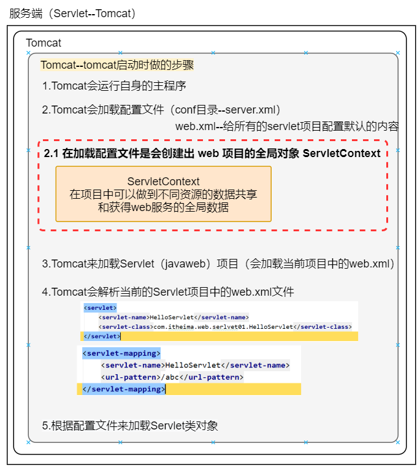
</figure>

**主要作用**

1. 域对象（共享数据）

   ```markdown
   # Servlet三大域对象:  有作用范围,并可在作用范围中共享数据的对象(有点像Map)
   
   1. 域对象方法api对一样 : 
          setAttribute(name,value) 
          getAttribute(name)
          removeAttribute(name)
          
   2. 作用范围不一样
   		//小的可以获得大的对象
   		 request < session < ServletContext
   ```


<figure class="thumbnails">
    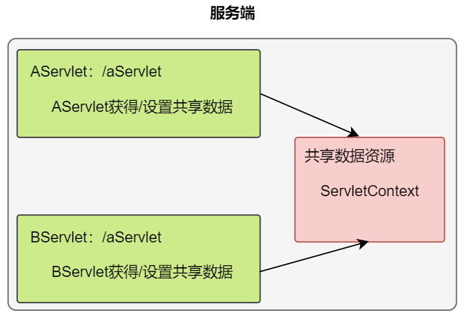
</figure>

2. 获取一些应用全局的数据

   1). 获取全局的配置参数

   2).获取项目中资源的真实路径

   3).获取资源的MIME类型


**获取ServletContext对象**

```markdown
1. 通过request对象获得
		ServletContext sc = request.getServletContext();
		
2. 继承HttpServlet后，可以直接调用
		ServletContext sc = getServletContext();
```


## 3.2 域对象（共享数据）

> 在当前整个服务器应用范围内，共享数据

- **生命周期**

  ```markdown
  1. 何时创建？
  		项目加载时，创建唯一的一个ServletContext对象(全局唯一)
  2. 何时销毁？
  		项目卸载时，销毁
  3. 作用范围？
  		与项目共存亡（多个servlet和多次请求都可以操作它）
  ```

- **API方法**

  ```tex
  1. 存储数据
  		void setAttribute(String name,Object value)
  2. 获取数据
  		Object getAttribute(String name)
  3. 删除数据
  		void removeAttribute(String name)
  ```


<figure class="thumbnails">
    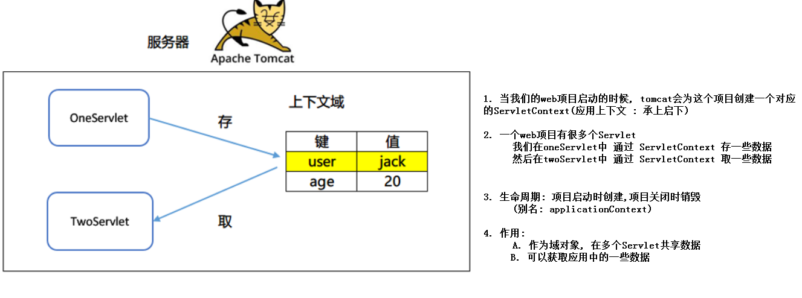
</figure>

```java
package com.itheima.web.servlet05;

import javax.servlet.ServletContext;
import javax.servlet.ServletException;
import javax.servlet.annotation.WebServlet;
import javax.servlet.http.HttpServlet;
import javax.servlet.http.HttpServletRequest;
import javax.servlet.http.HttpServletResponse;
import java.io.IOException;

/**
 * <p></p>
 *
 * @Description:
 */
@WebServlet("/AServlet")
public class AServlet extends HttpServlet {
    protected void doPost(HttpServletRequest request, HttpServletResponse response) throws ServletException, IOException {

        // 1.获取ServletContext
        ServletContext servletContext = getServletContext();
        ServletContext servletContext1 = request.getServletContext();

        // System.out.println(servletContext);
        // System.out.println(servletContext1);
        servletContext.setAttribute("name", "jack");


    }

    protected void doGet(HttpServletRequest request, HttpServletResponse response) throws ServletException, IOException {
        doPost(request, response);
    }
}
```


```java
package com.itheima.web.servlet05;

import javax.servlet.ServletContext;
import javax.servlet.ServletException;
import javax.servlet.annotation.WebServlet;
import javax.servlet.http.HttpServlet;
import javax.servlet.http.HttpServletRequest;
import javax.servlet.http.HttpServletResponse;
import java.io.IOException;

/**
 * <p></p>
 *
 * @Description:
 */
@WebServlet("/BServlet")
public class BServlet extends HttpServlet {
    protected void doPost(HttpServletRequest request, HttpServletResponse response) throws ServletException, IOException {

        // 1.获取ServletContext
        ServletContext servletContext = getServletContext();

        // 2.获得数据
        Object name = servletContext.getAttribute("name");
        System.out.println(name.toString());


    }

    protected void doGet(HttpServletRequest request, HttpServletResponse response) throws ServletException, IOException {
        doPost(request, response);
    }
}
```


### 3.3.1  域对象案例：统计网站的访问次数

**需求**

一般个人博客的首页，都会显示你是第几位访问此网站...


<figure class="thumbnails">
    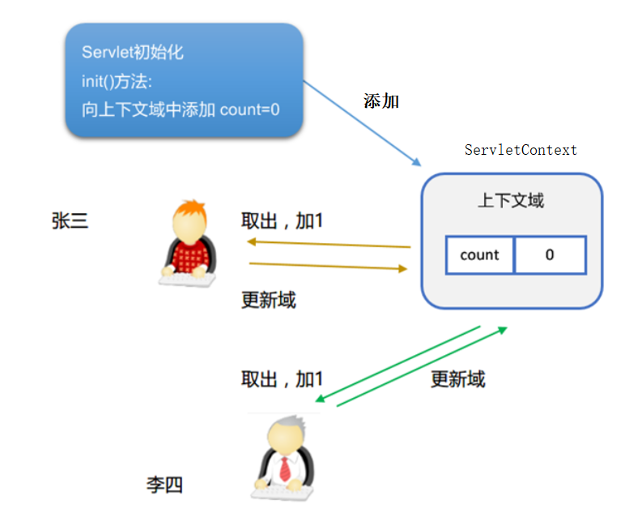
</figure>


```java
package com.itheima.web.servlet09;

import javax.servlet.ServletContext;
import javax.servlet.ServletException;
import javax.servlet.annotation.WebServlet;
import javax.servlet.http.HttpServlet;
import javax.servlet.http.HttpServletRequest;
import javax.servlet.http.HttpServletResponse;
import java.io.IOException;

/**
 * <p></p>
 *
 * @Description:
 */
@WebServlet(value = "/CountServlet",loadOnStartup = 6)
public class CountServlet extends HttpServlet {

    // 重写init方法
    /**
     * 带参数的init方法--init(ServletConfig config)
     * 在ServletContext对象实例化前在会执行
     * 无法获得ServletContext
     */
    // @Override
    // public void init(ServletConfig config) throws ServletException {
    //     ServletContext servletContext = getServletContext();
    //     System.out.println("init(ServletConfig config):"+servletContext);
    // }


    /**
     * 不带参数的init方法--init(ServletConfig config)
     * 在ServletContext对象实例化后在会执行
     * 可以获得ServletContext
     * @param config
     * @throws ServletException
     */
    @Override
    public void init() throws ServletException {
        ServletContext servletContext = getServletContext();
        servletContext.setAttribute("count", 0);
    }

    protected void doPost(HttpServletRequest request, HttpServletResponse response) throws ServletException, IOException {

        // 1.获得servletcontext
        ServletContext servletContext = getServletContext();

        // 2.获得访问次数--从servletcontext域中获得
        int count = (int) servletContext.getAttribute("count");

        count = count + 1;

        // 3.设置最新的访问次数到servletcontext域中
        servletContext.setAttribute("count", count);

        response.getWriter().println("count:" + count);

    }

    protected void doGet(HttpServletRequest request, HttpServletResponse response) throws ServletException, IOException {
        doPost(request, response);
    }
}
```


## 3.4  获取全局的配置参数(了解)

- 读取web.xml配置文件中<context-param>标签信息，实现参数和代码的解耦（该项目中所有的servlet都可以获取）

> 获取web.xml中的初始化参数   getInitParameter("encode");

```xml
<?xml version="1.0" encoding="UTF-8"?>
<web-app xmlns="http://xmlns.jcp.org/xml/ns/javaee"
         xmlns:xsi="http://www.w3.org/2001/XMLSchema-instance"
         xsi:schemaLocation="http://xmlns.jcp.org/xml/ns/javaee http://xmlns.jcp.org/xml/ns/javaee/web-app_3_1.xsd"
         version="3.1">

    <!--
        全局参数: 用servletContext读取的,在任意servlet都可以读取到
		如果参数都是写在代码中的，就会出现硬编码 
         硬编码解决：将系统中的部分参数写在配置文件中
		让项目可维护性好。
    -->
    <context-param>
        <param-name>encode</param-name>
        <param-value>utf-8</param-value>
    </context-param>
</web-app>
```


```java
package com.itheima.web.servlet06;

import javax.servlet.ServletContext;
import javax.servlet.ServletException;
import javax.servlet.annotation.WebServlet;
import javax.servlet.http.HttpServlet;
import javax.servlet.http.HttpServletRequest;
import javax.servlet.http.HttpServletResponse;
import java.io.IOException;

/**
 * <p></p>
 *
 * @Description:
 */
@WebServlet("/ServletParamServlet")
public class ServletParamServlet extends HttpServlet {
    protected void doPost(HttpServletRequest request, HttpServletResponse response) throws ServletException, IOException {


        ServletContext servletContext = getServletContext();

        String encode = servletContext.getInitParameter("encode");

        response.setContentType("text/plain;charset="+encode);

        response.getWriter().println("我是一个中文");

    }

    protected void doGet(HttpServletRequest request, HttpServletResponse response) throws ServletException, IOException {
        doPost(request, response);
    }
}
```


## 3.5  获取资源在服务器的真实地址

> 可以实现web项目的移植性...动态获取文件真实路径
>
> 

```markdown
* API
		String getRealPath(String path);
```

```java
package com.itheima.web.servlet07;

import javax.servlet.ServletContext;
import javax.servlet.ServletException;
import javax.servlet.annotation.WebServlet;
import javax.servlet.http.HttpServlet;
import javax.servlet.http.HttpServletRequest;
import javax.servlet.http.HttpServletResponse;
import java.io.IOException;

/**
 * <p></p>
 *
 * @Description:
 */
@WebServlet("/GetRealPathServlet")
public class GetRealPathServlet extends HttpServlet {
    protected void doPost(HttpServletRequest request, HttpServletResponse response) throws ServletException, IOException {

        // 1.获得ServletContext
        ServletContext servletContext = getServletContext();

        // 2.获得项目运行的正式路径(默认给：/)--动态获得
        // getRealPath：只管获得项目真实的路径--项目的根路径
        // getRealPath：获得项目真实的路径+开发人员所写的路径（不关心资源地址是否真实存在）
        // 使用 getRealPath 方法填写路径参数是，一定要写上有意义的路径地址（资源真实存在）
        // String realPath = servletContext.getRealPath("/1.avi");
        String realPath = servletContext.getRealPath("/index.html");

        response.getWriter().println(realPath);

    }

    protected void doGet(HttpServletRequest request, HttpServletResponse response) throws ServletException, IOException {
        doPost(request, response);
    }
}

```


## 3.6  获取资源的MIME类型

- 在互联网通信过程中定义的一种文件数据类型
- 格式：`大类型/小类型` 例如：`text/html -> html   text/plain-> txt`

 ```java
package com.itheima.web.servlet03;

import javax.servlet.ServletException;
import javax.servlet.annotation.WebServlet;
import javax.servlet.http.HttpServlet;
import javax.servlet.http.HttpServletRequest;
import javax.servlet.http.HttpServletResponse;
import java.io.IOException;

/**
 * <p></p>
 *
 * @Description:
 */
@WebServlet("/ContentTypeServlet")
public class ContentTypeServlet extends HttpServlet {
    protected void doPost(HttpServletRequest request, HttpServletResponse response) throws ServletException, IOException {


        response.setContentType("text/html;charset=utf-8");

        String fileName = "1.txt";

        //通过文件的后缀名，使用服务器来找 当前文件的 MIME 类型
        String mimeType = getServletContext().getMimeType(fileName);

        response.getWriter().println("1.txt 文件MIME格式：" + mimeType);

    }

    protected void doGet(HttpServletRequest request, HttpServletResponse response) throws ServletException, IOException {
        doPost(request, response);
    }
}
 ```


# 三 综合案例【作业】

## 3.1 文件下载

- **需求**


用户点击页面的链接，浏览器开始下载文件。 


<figure class="thumbnails">
    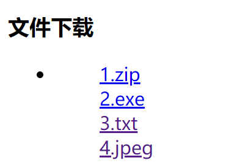
</figure>

- **实现方式**

1.使用浏览器自动下载（有缺陷）

2.使用servlet设置响应头来下载（较为完善）


### 3.1.1 浏览器自动下载

**浏览器下载示意图：**


<figure class="thumbnails">
    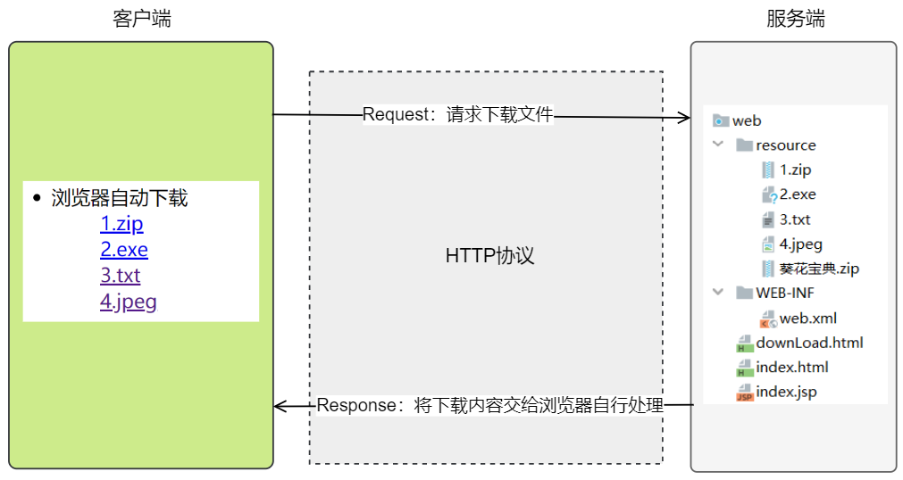
</figure>

#### ① 将资料中的下载素材复制到web项目中  
  

<figure class="thumbnails">
    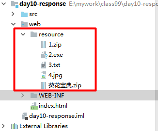
</figure>

#### ② 编写下载页面

```html
<!DOCTYPE html>
<html lang="zh-CN">
<head>
    <meta charset="UTF-8">
    <title>donload.html</title>

  </head>
  <body>
<h3>文件下载</h3>
<ul>
    <li>浏览器自动下载
        <ul>
            <a href="">1.zip</a> <br>
            <a href="">2.exe</a> <br>
            <a href="">3.txt</a> <br>
            <a href="">4.jpeg</a> <br>
        </ul>
    </li>
    <li>

    </li>

    <li>通过Servlet设置响应头下载
        <ul>
            <a href="">1.zip</a> <br>
            <a href="">2.exe</a> <br>
            <a href="">3.txt</a> <br>
            <a href="">4.jpeg</a> <br>
        </ul>
    </li>
</ul>
</body>
</html>
```


#### ③ 原理

​	浏览器向服务器请求下载静态文件资源，tomcat服务器会将下载内容交给浏览器来处理。

​	浏览器会其从服务器获得的静态文件资源将使用浏览器内部引擎来处理内容。

​	认识内容会在页面直接打开，不认识以下载的方式来处理。

#### ③ 缺点

1. 完全是浏览器的行为,   浏览器对不可识别的文件进行下载 ,    可识别的文件是直接打开而不是下载
2. 资源直接对外暴露, 我们无法对资源下载进行限制(比如需要会员才能下载)


### 3.2.2 使用Servlet下载文件【推荐....】

- 二个响应头二个字节流

```markdown
1. 被下载文件的字节输入流
		FileInputStream
2. response字节输出流
		ServletOutputStream	
3. 告知客户端下载文件的MIME类型（最新的浏览器此步骤可以省略....）
		Content-Type:MIME类型		
4. 告知浏览器以附件的方式保存
		Content-Disposition : attachment;filename=文件名
			attachment 附件
			filename=文件名
```


- **下载示意图：**


<figure class="thumbnails">
    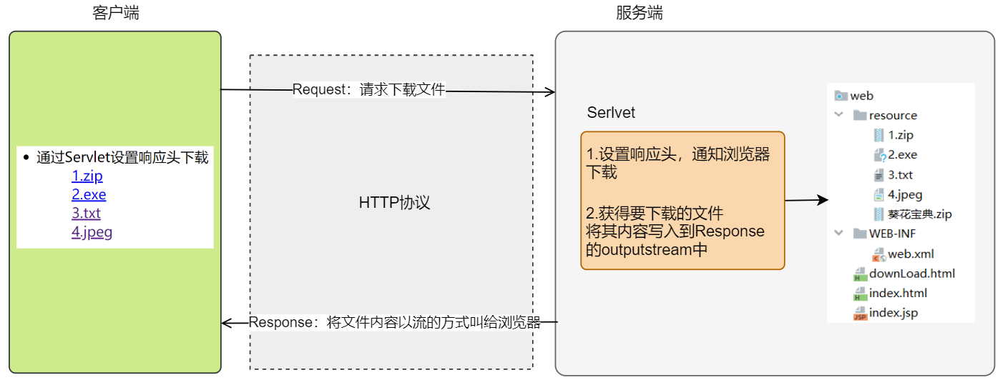
</figure>

#### ① download.html

```html
<!DOCTYPE html>
<html lang="zh-CN">
<head>
    <meta charset="UTF-8">
    <title>donload.html</title>

  </head>
  <body>
<h3>文件下载</h3>
<ul>
    <li>浏览器自动下载
        <ul>
            <a href="resource/1.zip">1.zip</a> <br>
            <a href="resource/2.exe">2.exe</a> <br>
            <a href="resource/3.txt">3.txt</a> <br>
            <a href="resource/4.jpeg">4.jpeg</a> <br>
        </ul>
    </li>
    <li>

    </li>

    <li>通过Servlet设置响应头下载
        <ul>
            <a href="DownloadServlet?file=1.zip">1.zip</a> <br>
            <a href="DownloadServlet?file=2.exe">2.exe</a> <br>
            <a href="DownloadServlet?file=3.txt">3.txt</a> <br>
            <a href="DownloadServlet?file=4.jpeg">4.jpeg</a> <br>
            <a href="DownloadServlet?file=葵花宝典.zip">葵花宝典</a> <br>
        </ul>
    </li>
</ul>
</body>
</html>
```


#### ② DownLoadServlet

```java
package com.itheima.web.servlet10;

import com.itheima.web.utils.DownLoadUtils;

import javax.servlet.ServletException;
import javax.servlet.ServletOutputStream;
import javax.servlet.annotation.WebServlet;
import javax.servlet.http.HttpServlet;
import javax.servlet.http.HttpServletRequest;
import javax.servlet.http.HttpServletResponse;
import java.io.FileInputStream;
import java.io.IOException;

/**
 * <p></p>
 *
 * @Description:
 */
@WebServlet("/DownloadServlet")
public class DownloadServlet extends HttpServlet {
    protected void doPost(HttpServletRequest request, HttpServletResponse response) throws ServletException, IOException {

        // 1.获得要下载文件的名称
        String file = request.getParameter("file");

        // 2.获得文件的MIME类型
        String mimeType = getServletContext().getMimeType(file);

        // 3.设置文件的类型到content-type（响应头）中,下载文件不需要指定码表
        response.setContentType(mimeType);


        //对请求头中的内容做编码操作（文件名称）
        String newFileName = DownLoadUtils.getName(request, file);

        //通过响应头告诉浏览器以下载的方式来处理内容
        //content-disposition 下载: attachment;filename=     text/html;charset=
        response.setHeader("content-disposition","attachment;filename="+newFileName);

        // 4.获得文件的真实路径
        String realPath = getServletContext().getRealPath("/resource/" + file);

        // 5.创建下载文件的input对象
        FileInputStream inputStream = new FileInputStream(realPath);

        // 6.获得输出流对象
        ServletOutputStream outputStream = response.getOutputStream();

        // 7.将文件的进制信息写入到response的outputstream中
        byte[] buffer = new byte[1024];
        int length;
        while ((length = inputStream.read(buffer)) != -1) {
            outputStream.write(buffer, 0, length);
        }

        inputStream.close();


    }

    protected void doGet(HttpServletRequest request, HttpServletResponse response) throws ServletException, IOException {
        doPost(request, response);
    }
}

```


#### ③ 中文乱码

````markdown
* 如果该下载文件名是中文的话，会出现乱码...
	谷歌和绝大多数的浏览器是通过 url编码
		URLEncode() 编码
		URLDecode() 解码
	火狐浏览器   base64编码
	
* 我们就需要考虑浏览器兼容性问题....
	资料提供了判断浏览器不同编码的工具类直接使用即可....
````

```java
public class DownLoadUtils {

	public static String getName(HttpServletRequest request, String filename) throws UnsupportedEncodingException {
		// 获得请求头中的User-Agent
		String agent = request.getHeader("User-Agent");
		// 根据不同的客户端进行不同的编码
		String filenameEncoder = "";
		 if (agent.contains("Firefox")) {
			// 火狐浏览器
			 System.out.println("我是火狐");
			BASE64Encoder base64Encoder = new BASE64Encoder();
			filenameEncoder = "=?utf-8?B?" + base64Encoder.encode(filename.getBytes("utf-8")) + "?=";
		} else {
			// 其它浏览器
			 System.out.println("我是google");
			filenameEncoder = URLEncoder.encode(filename, "utf-8");
		}
		return filenameEncoder;
	}
}
```

