# 一 Servlet概述

- servlet= server+applet 运行在服务器端的java程序。
- Servlet是一个接口(规范)，一个类要想通过浏览器被访问到,那么这个类就必须直接或间接的实现Servlet接口

**作用**

接收请求，处理业务，响应结果


 <figure class="thumbnails">
    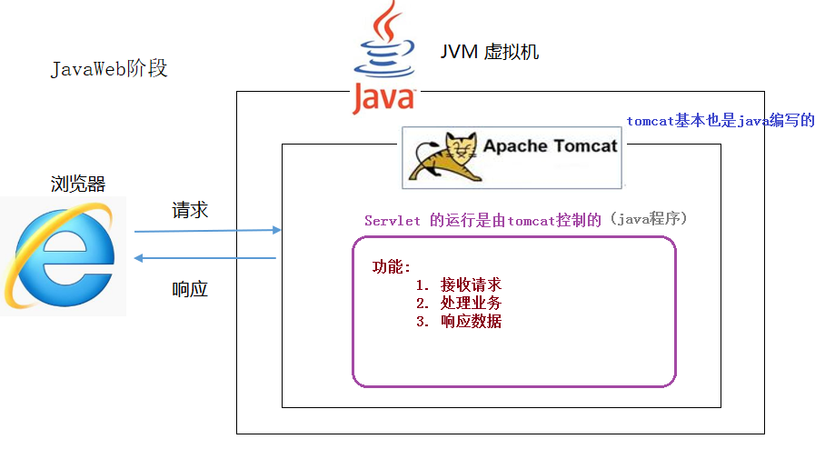
</figure>


# 二 Servlet快速入门

目标：编写一个普通的java类，通过浏览器可以访问

```tex
#编写步骤
	1. 定义一个类,实现Servlet接口,重写所有的抽象方法(特别是service方法)
	2. 配置web.xml文件
```


## 2.1 代码编写

#### ① 创建web项目


 <figure class="thumbnails">
    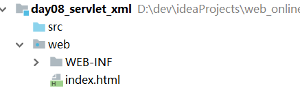
</figure>


#### ② 编写普通java类，实现servlet接口

重写抽象方法（service方法）

```java
package com.itheima.web.serlvet01;

import javax.servlet.*;
import java.io.IOException;

/**
 * <p></p>
 *
 * @Description:
 */
public class HelloServlet implements Servlet {
    @Override
    public void init(ServletConfig servletConfig) throws ServletException {

    }

    @Override
    public ServletConfig getServletConfig() {
        return null;
    }

    /*
    Servlet核心方法 Service
        servletRequest：封装浏览器请求数据
        servletResponse：封装服务器给浏览器的数据
     */
    @Override
    public void service(ServletRequest servletRequest, ServletResponse servletResponse) throws ServletException, IOException {
        System.out.println("get in HelloServlet");
    }

    @Override
    public String getServletInfo() {
        return null;
    }

    @Override
    public void destroy() {

    }
}
```


#### ③ 配置web.xml

配置servlet网络访问路径

```xml
<?xml version="1.0" encoding="UTF-8"?>
<web-app xmlns="http://xmlns.jcp.org/xml/ns/javaee"
         xmlns:xsi="http://www.w3.org/2001/XMLSchema-instance"
         xsi:schemaLocation="http://xmlns.jcp.org/xml/ns/javaee http://xmlns.jcp.org/xml/ns/javaee/web-app_3_1.xsd"
         version="3.1">

    <!--声明servlet-->
    <!--
        servlet-name:给servlet起名
        servlet-class：编写servlet类的全限定类名（包名+类名）Ctrl+shift+alt+c
    -->
    <servlet>
        <servlet-name>HelloServlet</servlet-name>
        <servlet-class>com.itheima.web.serlvet01.HelloServlet</servlet-class>
    </servlet>

    <!--给servlet配置访问路径-->
    <!--
        servlet-name:指定在web配置文件中的servlet名称
        url-pattern：配置Servlet的URL访问路径
                    servlet的路径配置：一般来说都是以 /
                            如果servlet路径没有 / ,那么tomcat启动时候 Invalid <url-pattern> [abc] in servlet mapping
    -->
    <servlet-mapping>
        <servlet-name>HelloServlet</servlet-name>
        <url-pattern>/abc</url-pattern>
    </servlet-mapping>

</web-app>
```


#### ④ 部署web项目

修改项目的访问路径：


 <figure class="thumbnails">
    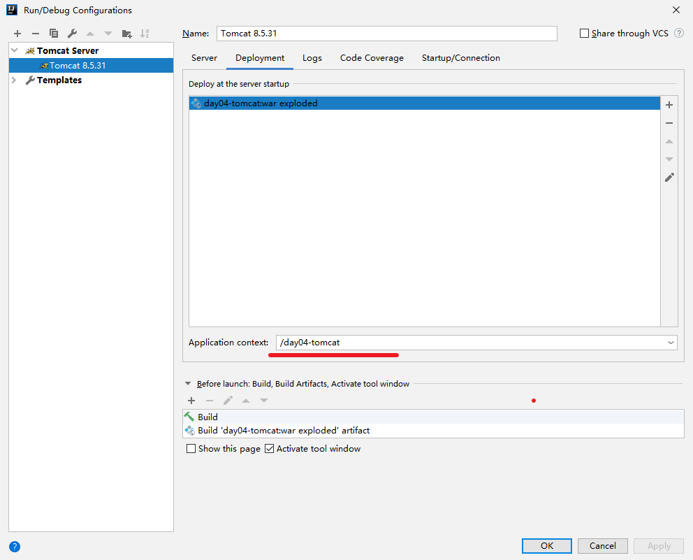
</figure>


#### ⑤ 启动测试

 <figure class="thumbnails">
    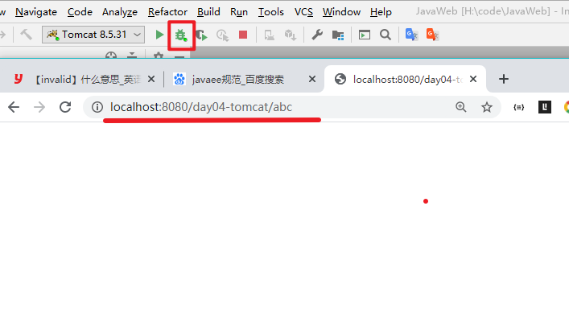
</figure>


## 2.2 执行原理


   <figure class="thumbnails">
    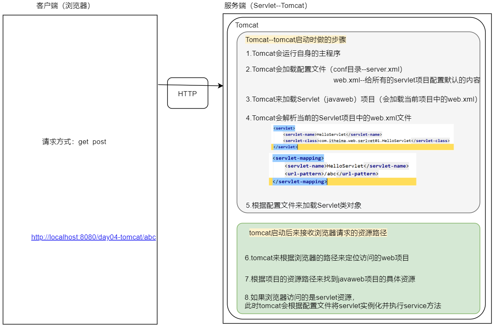
</figure>


# 三 Servlet相关API

## 3.1 生命周期方法

### 3.1.1 思想介绍

- 生命周期：指的是一个对象从生（创建）到死（销毁）的一个过程

```java
// 1. servlet对象创建时，调用此方法
public void init(ServletConfig servletConfig);
// 2. 用户访问servlet时，调用此方法
public void service(ServletRequest servletRequest, ServletResponse servletResponse);
// 3. servlet对象销毁时，调用此方法
public void destroy();
```


 <figure class="thumbnails">
    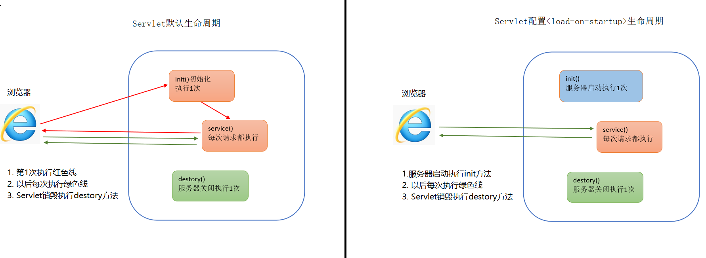
</figure>


```markdown
* 创建
	1）默认情况下
		用户第一次访问时，创建servlet，执行init方法
	2）修改创建时机
		<load-on-startup></load-onstartup>
			正数：5-N  【服务器启动时，创建】
				补充：Tomcat的web.xml里有1,4 所以推荐5-n 
			负数（默认值）：-1 【用户第一次访问时，创建】
	
* 运行（提供服务）
		用户每次访问时，都执行service方法

* 销毁
		服务器正常关闭时，销毁servlet，执行destroy方法
```


### 3.1.2 代码演示

#### ① LifeServlet

```java
/*
*   Servlet的生命周期方法
*      0. 前提: Servlet中的方法基本都是由tomcat底层调用的
*   # 观察这些方法调用的特点
*     1. 浏览器第一次访问: init , service
*     2. 浏览器再次访问 : service
*     3. tomcat关闭: destroy
*
*   # Servlet的生命周期方法:
*       1. init : 初始化
*           特点: 默认在浏览器第一次访问时调用     
*
*       2. service : 服务, 核心方法
*           特点: 浏览器每次访问,都会执行一次
*           
*       3. destroy : 销毁
*           特点: tomcat关闭之前, 执行一次destroy方法       
* */
public class LifeServlet implements Servlet {
    @Override
    public void init(ServletConfig servletConfig) throws ServletException {
        System.out.println("init");
    }

    @Override
    public void service(ServletRequest servletRequest, ServletResponse servletResponse) throws ServletException, IOException {
        System.out.println("service");
    }

    @Override
    public void destroy() {
        System.out.println("destroy");
    }

    @Override
    public ServletConfig getServletConfig() {
        System.out.println("getServletConfig");
        return null;
    }

    @Override
    public String getServletInfo() {
        System.out.println("getServletInfo");
        return null;
    }


}
```


#### ② 配置web.xml

```xml
 <servlet>
        <servlet-name>LifeServlet</servlet-name>
        <servlet-class>com.itheima02.lifecycle.LifeServlet</servlet-class>
    </servlet>
    <servlet-mapping>
        <servlet-name>LifeServlet</servlet-name>
        <url-pattern>/lifeServlet</url-pattern>
    </servlet-mapping>
```


### 3.1.3 启动加载

```html
   # 启动加载
*       1)问题: 发现 init 默认第一次被访问的时候才调用,适合用来初始化项目数据
*           如果项目数据很多, 加载就需要一定的时候,这样就会给第一个用户的体验不好,因为要等比较久
*
*       2)解决: 服务器一启动,就执行init方法
*       
*       3) 实现: 要在web.xml配置
```

```xml
<?xml version="1.0" encoding="UTF-8"?>
<web-app xmlns="http://xmlns.jcp.org/xml/ns/javaee"
         xmlns:xsi="http://www.w3.org/2001/XMLSchema-instance"
         xsi:schemaLocation="http://xmlns.jcp.org/xml/ns/javaee http://xmlns.jcp.org/xml/ns/javaee/web-app_3_1.xsd"
         version="3.1">    
     <servlet>
        <servlet-name>MyServlet01</servlet-name>
        <servlet-class>com.itheima01.servlet.MyServlet</servlet-class>
          <load-on-startup>6</load-on-startup>
    </servlet>
    <servlet-mapping>
        <servlet-name>MyServlet01</servlet-name>
        <url-pattern>/myServlet</url-pattern>
    </servlet-mapping>

    <!--
     默认情况下,servlet在浏览器第一次访问的时候,才创建,并调用init方法

    有些问题: 我们如果init方法加载大量的配置文件
             会把第一个访问的用户给坑(他要等很久)

     解决: 启动就加载(tomcat启动的时候就就在)

        load-on-startup 里面必须写一个整数n
            n 默认值 是 -1, 表示浏览器第一次访问才加载
            n >= 0, tomcat一启动,就立即加载
                0~4被tomcat的一些servlet使用了
                数字越小,越先加载
    -->
     <servlet>
        <servlet-name>LifeServlet</servlet-name>
        <servlet-class>com.itheima02.lifecycle.LifeServlet</servlet-class>
      <load-on-startup>5</load-on-startup>
    </servlet>
    <servlet-mapping>
        <servlet-name>LifeServlet</servlet-name>
        <url-pattern>/lifeServlet</url-pattern>
    </servlet-mapping>
</web-app>
```


# 四 Servlet体系结构

```html
快捷键:
	1. ctrl + alt + u : 查看一个类的继承结构图
	2. ctrl + h : 这个类的简化版继承结构 
```


 <figure class="thumbnails">
    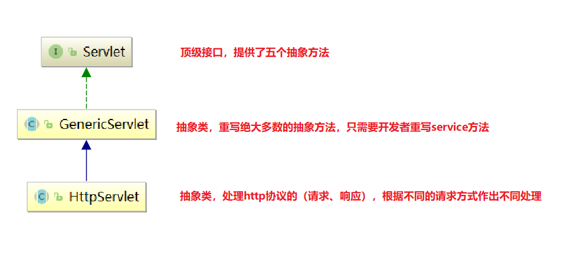
</figure>


## 4.1 GenericServlet

```markdown
1. 问题: 
	Servlet中使用频率最高,最重要的方法是service方法(大部分场景)
	但是我们每次编写Servlet实现类,都是直接实现Servlet接口,重写5个抽象方法(太冗余了)

2. 需求: 如果我们以后编写Servlet实现类,只要重写service方法就好了
			
3. 发现 : 很巧, 开发包已经有了这个类GenericServlet
```


#### ① 编写普通java类，继承GenericServlet抽象类

```java
public class GenericServletChild extends GenericServlet {


    @Override
    public void service(ServletRequest servletRequest, ServletResponse servletResponse) throws ServletException, IOException {
        System.out.println("get in GenericServletChild");
    }
}
```


#### ② 配置web.xml

```xml
<servlet>
    <servlet-name>GenericServletChild</servlet-name>
    <servlet-class>com.itheima.web.servlet03.GenericServletChild</servlet-class>
</servlet>
<servlet-mapping>
    <servlet-name>GenericServletChild</servlet-name>
    <url-pattern>/gChild</url-pattern>
</servlet-mapping>
```


## 4.2 HttpServlet

```markdown
1. 问题: 
	  我们在前端的form表单中,method属性, 学习过有两种常用的请求方式(get/post)
	  我们现在的service方法是这样的: 用户发送请求,无论是什么请求方式,都会统一的执行service方法, 我们无法很好的区别是哪一种请求方式
	  
2. 需求: 我们如果想确切的知道是哪一种请求方式，必须将 ServletRequest 和 ServletResponse 转为 Http相关的类。Servlet 为我们提给了 HttpServlet 来转换类。

3. 解决: 继承 HttpServlet 
```


#### ① 编写前端html

```xml
<!DOCTYPE html>
<html lang="zh">
<head>
  <meta charset="UTF-8">
  <title>Title</title>
</head>
<body>
  <!--
      index.html:  http://localhost:8080/day04-tomcat/index.html
 HttpServletChild: http://localhost:8080/day04-tomcat/hChild
        同级之间的访问：相对
              直接写路径
              ./路径

  -->

  <h1>get请求</h1>
  <form action="hChild" method="get">
<!--  <form action="./hChild" method="get">-->
    账号：<input type="text" name="account" > <br>
    密码：<input type="password" name="password" > <br>
    <input type="submit" value="提交">
  </form>


  <h1>post请求</h1>
  <form action="./hChild" method="post">
    账号：<input type="text" name="account" > <br>
    密码：<input type="password" name="password" > <br>
    <input type="submit" value="提交">
  </form>


</body>
</html>
```


#### ② 编写普通java类，继承HttpServlet抽象类

```java
public class HttpServletChild extends HttpServlet {


    // doGet and doPost
    /*
        浏览器中访问的路径如果没有指明请求方式，默认为：get请求方式
        HttpServlet 中的 doGet方法和 doPost 方法不让访问。
        HttpServletChild 子类必须要重写 doGet 和 doPost方法
     */
    @Override
    protected void doGet(HttpServletRequest req, HttpServletResponse resp) throws ServletException, IOException {
        System.out.println("get method invoked");
    }

    @Override
    protected void doPost(HttpServletRequest req, HttpServletResponse resp) throws ServletException, IOException {
        System.out.println("post method invoked");
    }
}

```


#### ③ 配置web.xml

```xml
<servlet-mapping>
    <servlet-name>HttpServletChild</servlet-name>
    <url-pattern>/hChild</url-pattern>
</servlet-mapping>
<servlet>
    <servlet-name>HttpServletChild</servlet-name>
    <servlet-class>com.itheima.web.servlet04.HttpServletChild</servlet-class>
</servlet>
```


### 4.3 经验值分享


#### ① 响应状态码405

请求方法没有重写.....

```html
	/*
        注意: 如果我们不重写doGet/doPost方法, 那么父类的doGet/doPost方法会执行(继承)
            给浏览器响应一个错误: 状态码405 (http1.1)
     */
```


 <figure class="thumbnails">
    
</figure>


#### ② 响应状态码500

java代码写错了...


 <figure class="thumbnails">
    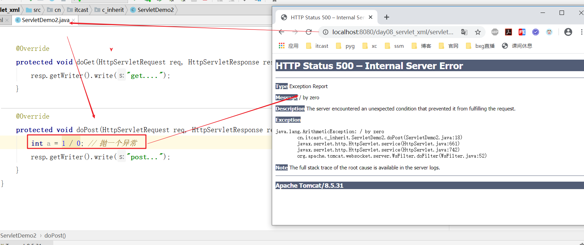
</figure>


常用的 HTTP 代码：

- 200 - 请求成功
  - 返回 200 系列的代码基本表示一切都很OK。请求已成功被服务器接收、理解、并接受，服务器也没有什么问题。于是这个 URL 返回状态码 200 。 

 <figure class="thumbnails">
    
</figure>


- 301 - 资源（网页等）被永久转移到其它URL
- 404 - 请求的资源（网页等）不存在
  - 访问服务资源不存在，被访问的资源在服务端是不存在的。


 <figure class="thumbnails">
    
</figure>


- 500 - 内部服务器错误
  - 客户端请求到服务端，但是服务端内容出现错误。


 <figure class="thumbnails">
    
</figure>


HTTP状态码类别：


 <figure class="thumbnails">
    
</figure>


# 五 Servlet路径

## 5.1 url-pattern

作用：将一个请求网络地址和servlet类建立一个映射关系


 <figure class="thumbnails">
    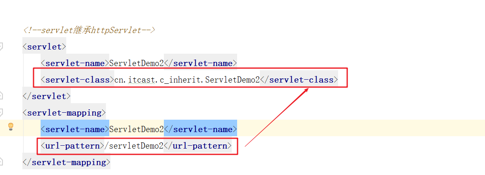
</figure>


### 5.1.1 Servlet映射多个url

```xml
<servlet>
    <servlet-name>HttpServletChild</servlet-name>
    <servlet-class>com.itheima.web.servlet04.HttpServletChild</servlet-class>
</servlet>

<servlet-mapping>
    <servlet-name>HttpServletChild</servlet-name>
    <url-pattern>/hChild</url-pattern>
    <!--
	多个路径配置
        方式一：
    -->
    <url-pattern>/hChildSun</url-pattern>
</servlet-mapping>

<!--
	多个路径配置
    方式二：
-->
<servlet-mapping>
    <servlet-name>HttpServletChild</servlet-name>
    <url-pattern>/hChildSun2</url-pattern>
</servlet-mapping>
```

 


### 5.1.2 url映射模式【了解】

配置 <url-pattern> url地址取值可以是：

```markdown
1. 精确匹配(掌握) 
 		/servletDemo3  
2. 目录匹配 
		/aa/*
3. 后缀匹配 
		*.xxx	例如：*.do
```

```xml
<servlet-mapping>
        <servlet-name>PathServlet</servlet-name>
        <!--
            Servlet的路径(虚拟路径)
            1. 一个Servlet可以配置多个虚拟路径  -> 了解 (在Filter中有用)
            2. 一个Servlet的路径有三种写法
                2.1  精确匹配(掌握)
                        /servletDemo3
                2.2  目录匹配
                        /aa/*
                2.3 后缀匹配
                        *.xxx	例如：*.do

        -->
        <url-pattern>/bbb/ccc</url-pattern>
        <url-pattern>/aa/*</url-pattern>
        <url-pattern>*.do</url-pattern>
    </servlet-mapping>
<servlet-mapping>
    <servlet-name>PathServlet</servlet-name>
    <url-pattern>/pathServlet03</url-pattern>
</servlet-mapping>
```


## 5.2 相对/绝对路径

- 现阶段我们访问资源的方式越来越多，请求路径在编写时难免出现混淆

1. 浏览器的地址栏 (输入服务器某个资源地址,敲回车会发送请求)
2. a标签的href属性 (超链接被点击的时候会发送请求)
3. form表单的action属性 (form中的submit按钮被点击的时候,发送请求)
4. js的loation.href属性 (只要设置, 触发相应的)


**这里我们复习下路径规则：**

```html
<!DOCTYPE html>
<html lang="zh-CN">
<head>
    <meta charset="UTF-8">
    <title>Title</title>
</head>
<body>
        <!--
            html页面中,难免书写url

            1. 绝对路径
                a. http://localhost:8080/day01-servlet/PathServlet
                b. /day01-servlet/PathServlet (省略了三要素,前提: 当前页面和所访问的资源必须在同一服务器上)
                        内部资源, 推荐!!!

            2. 相对路径
                1) ../ 是上一级
                2) ./ 是平级,可以省略
        -->
        <a href="http://www.baidu.com">百度</a> <br>
        <a href="http://localhost:8080/day01-servlet/PathServlet">我的PathServlet</a> <br>
        <a href="/day01-servlet/PathServlet">我的PathServlet2</a> <br>

        <a href="http://localhost:8080/day01-servlet/doc/aaa.html">aaa.html绝对路径写法</a>
        <a href="doc/aaa.html">aaa.html相对写法</a>
</body>
</html>
```


# 六 Servlet3.0

- 通过注解配置Servlet，简化web.xml配置Servlet复杂性，提高开发效率，几乎所有的框架都在使用注解

 

#### ① 编写普通java类，继承HttpServlet

```java
package com.itheima.web.servlet05;

import javax.servlet.ServletException;
import javax.servlet.annotation.WebServlet;
import javax.servlet.http.HttpServlet;
import javax.servlet.http.HttpServletRequest;
import javax.servlet.http.HttpServletResponse;
import java.io.IOException;


public class FastServlet extends HttpServlet {

    protected void doPost(HttpServletRequest request, HttpServletResponse response) throws ServletException, IOException {
        System.out.println("post in FastServlet");
    }

    protected void doGet(HttpServletRequest request, HttpServletResponse response) throws ServletException, IOException {
        System.out.println("get in FastServlet");
    }
}

```


#### ② 配置@WebServlet


 <figure class="thumbnails">
    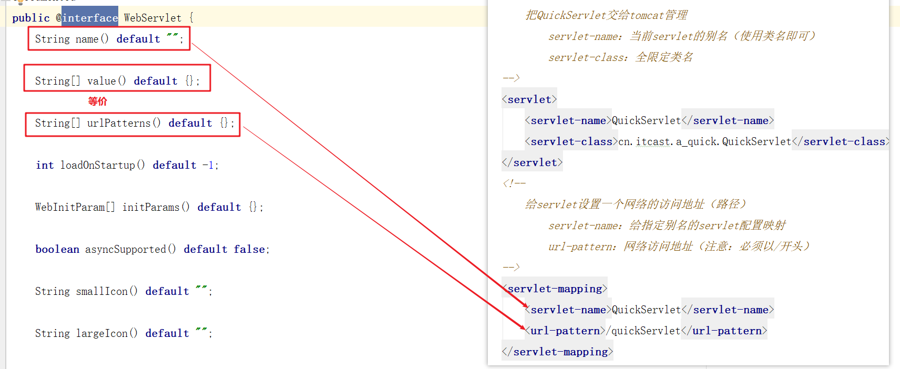
</figure>


```java
/* 配置一个路径 */
/*修改类注解：不支持热加载*/
// @WebServlet(urlPatterns = "/fastServlet")
/* 配置多个路径 */
// @WebServlet(urlPatterns = {"/fastServlet","/fastServlet2"})
// @WebServlet("/fastServlet")
@WebServlet({"/fastServlet","/fastServlet2"})
public class FastServlet extends HttpServlet {
    ......
}
```


## idea创建web模块的规律


 <figure class="thumbnails">
    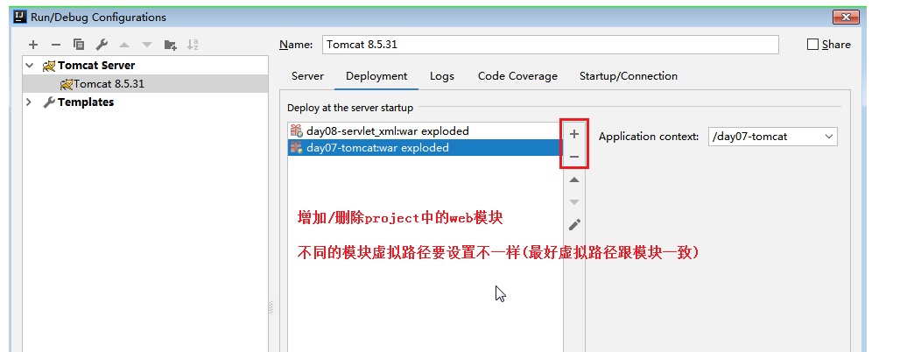
</figure>


>tomcat可以同时运行多个web模块,但是现在一般只运行一个模块


注意: project structure中要设置这两项

 <figure class="thumbnails">
    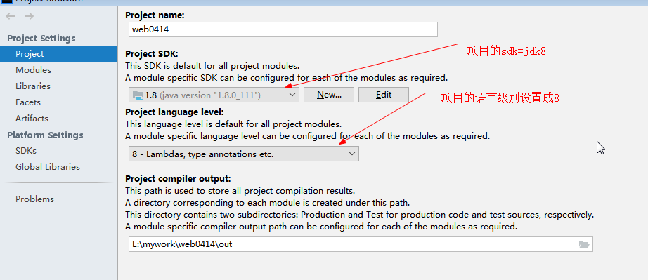
</figure>
