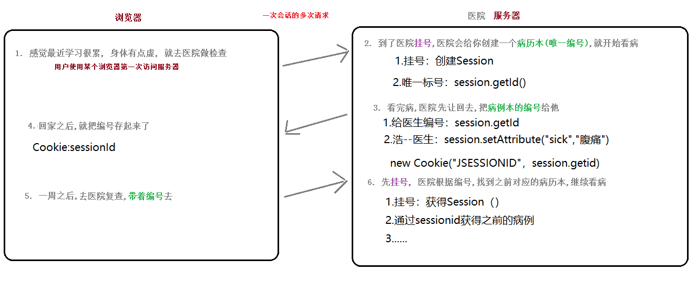
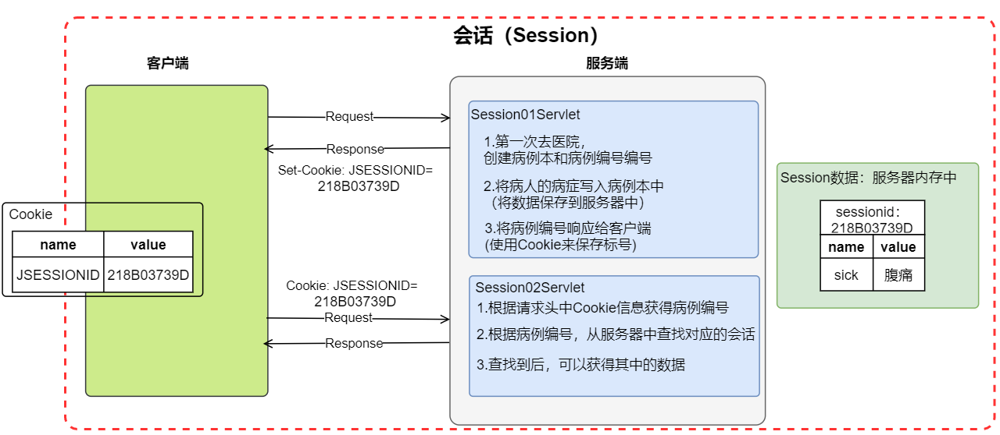
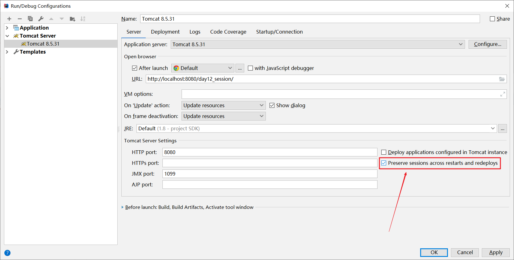
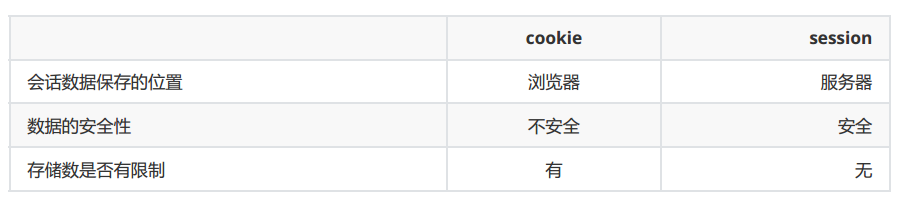
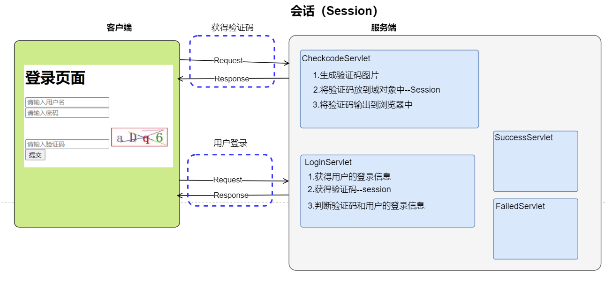

# Session

**今日目标**

```markdown
1. session【重点】
	 它也是一个域对象
	 
2. 三大域对象总结
	servletContext
	session
	request
	
3. 综合案例
	用户登录（验证码）
```


# 一 Session

## 1.1 概述

**session是服务器端的会话技术**

```markdown
# session的作用
	在一次会话的多次请求之间共享数据，将数据保存到服务器端

# HttpSession是一个域对象 
	HttpSession是一个接口
	域对象可以看成是map(存储多个键值对), cookie是一个entry(只能存一个键值对)
1. 域对象的方法 
	a. 存储数据
			void setAttribute(String name,Object value)
	b. 获取数据
			Object getAttribute(String name)
	c. 删除数据
			void removeAttribute(String name)
```


## 1.2 工作原理

**Session基于Cookie技术实现**

 

<figure class="thumbnails">
    
</figure>

**方法介绍**

```markdown
1. 获取session对象: 
		*HttpSession  session = request.getSession()--获得Session，如果没有回话，则创建会话。
		*HttpSession  session = request.getSession(false)--获得Session，如果没有回话，则返回null。
		1). 通过请求对象创建一个会话对象,如果当前用户会话不存在，创建新会话。  
		2). 如果会话已经存在，这个方法返回已经存在的会话对象。
2. 获取session的id
		String sessionId = session.getId();
3.  使当前session失效
		ression.invalidate();	
```

> 记得把项目中的index.jsp干掉(影响到 JSESSIONID的cookie)


原理图：


<figure class="thumbnails">
    
</figure>

```html
<!DOCTYPE html>
<html lang="zh">
<head>
  <meta charset="UTF-8">
  <title>看病</title>
</head>
<body>

      <a href="Session01Servlet?sick=腹痛">第一次去看病--腹痛</a> <br>


      <a href="Session02Servlet">第二次去看病</a> <br>

</body>
</html>
```


```java
package com.itheima.web.servlet01;

import javax.servlet.ServletException;
import javax.servlet.annotation.WebServlet;
import javax.servlet.http.*;
import java.io.IOException;

/**
 * <p></p>
 *
 * @Description:
 */
@WebServlet("/Session01Servlet")
public class Session01Servlet extends HttpServlet {
    protected void doPost(HttpServletRequest request, HttpServletResponse response) throws ServletException, IOException {

        response.setContentType("text/html;charset=utf-8");

        // 1.创建会话
        // request.getSession();--获得Session，如果没有Session的，会自动创建Session
        // request.getSession(false);--获得Session，
        //      如果有Session就获得Session，
        //      如果没有Session，返回null
        HttpSession session = request.getSession();

        String sessionId = session.getId();

        // 2.设置session域中的数据
        // 2.1 获得request数据
        String sick = request.getParameter("sick");
        session.setAttribute("sick", sick);

        response.getWriter().println("第一次去--sick："+sick);
        response.getWriter().println("第一次去--创建sessionId："+sessionId);
        response.getWriter().println("第一次去--创建Session："+session);
        response.getWriter().println("-----------------------------------------");

        // 3.给客户端SessionId，放到Cookie--tomcat实现
        // Cookie cookie = new Cookie("JSESSIONID", sessionId);
        // String contextPath = request.getContextPath();
        // cookie.setPath(contextPath);
        // response.addCookie(cookie);


    }

    protected void doGet(HttpServletRequest request, HttpServletResponse response) throws ServletException, IOException {
        doPost(request, response);
    }
}

```


```java
package com.itheima.web.servlet01;

import javax.servlet.ServletException;
import javax.servlet.annotation.WebServlet;
import javax.servlet.http.HttpServlet;
import javax.servlet.http.HttpServletRequest;
import javax.servlet.http.HttpServletResponse;
import javax.servlet.http.HttpSession;
import java.io.IOException;

/**
 * <p></p>
 *
 * @Description:
 */
@WebServlet("/Session02Servlet")
public class Session02Servlet extends HttpServlet {
    protected void doPost(HttpServletRequest request, HttpServletResponse response) throws ServletException, IOException {

        response.setContentType("text/html;charset=utf-8");

        // 1.获得会话
        // request.getSession();--获得Session，如果没有Session的，会自动创建Session
        // request.getSession(false);--获得Session，
        //      如果有Session就获得Session，
        //      如果没有Session，返回null
        HttpSession session = request.getSession(false);

        Object sick = session.getAttribute("sick");

        response.getWriter().println("第二次去--sick："+sick);
        response.getWriter().println("第二次去--获得sessionId："+session.getId());
        response.getWriter().println("第二次去--获得Session："+session);
        response.getWriter().println("-----------------------------------------");


    }

    protected void doGet(HttpServletRequest request, HttpServletResponse response) throws ServletException, IOException {
        doPost(request, response);
    }
}
```


## 1.3 Session细节

```markdown
# 找不到当前会话中的session原因分析 (通俗版)
	问题: 什么时候找不到班长原来的病历本?
1. 班长的原因(浏览器)
	0). 只要班长把病例本编号搞丢了 
		1). 用户清除cookie(清除浏览记录)---丢失无法找回
		2). 用户关闭浏览器, 保存id的cookie默认会话级别,自动销毁了---可以通过持久化Sessionid解决
			
2. 医院的原因
	0). 医院把病历信息搞没了（服务端）
		1). 手动销毁session
			session.invalidate();//只控制服务端，客户端的Cookie数据不管
		2). 自动销毁session
    		默认30分钟内不访问,自动销毁 (可以改)
		    文件配置: web.xml (tomcat中的默认设置)
				1. tomcat/config/web.xml 中有session-config配置 (全局有效)
				2. 我们可以在项目中web.xml覆盖其配置 (只对当前项目有效)
				<session-config>
                    <session-timeout>30</session-timeout>
                  </session-config>
    1). 服务器关闭
    	突然断电, 数据来不及保存--
    	正常关闭: session数据会会从内存消失----session 钝化和活化		
```


```markdown
# 找不到当前会话中的session原因分析(专业版)
1. 浏览器方面的原因
        0). 核心: 保存JSESSIONID的cookie被销毁
        2). 用户关闭浏览器, 保存id的cookie默认会话级别,自动销毁了
        		-> session持久化
        2). 用户清除浏览记录(包含cookie) 
        
2. 服务器方面的原因
	0). Session信息消息
		1). 手动销毁session
			session.invalidate();
		2). 自动销毁session
    		默认30分钟内不访问,自动销毁 (可以改)
		    备注: (该用户连续30分钟不访问,服务器会自动销毁session)
		    文件配置: web.xml (tomcat中的默认设置)
				1. tomcat/config/web.xml 中有session-config配置 (全局有效)
				2. 我们可以在项目中web.xml覆盖其配置 (只对当前项目有效)
				<session-config>
                    <session-timeout>30</session-timeout>
                </session-config>
    3). 服务器关闭
    	突然断电, 数据来不及保存
    	正常关闭: session数据会会从内存保存硬盘上
    		-> session 钝化和活化
```


## 1.4 session的持久化

```markdown
#浏览器关闭后,session的持久化方案 
1. 问题: 从以上的分析我们得知, 浏览器关闭之后,就找不到原来的session了
2. 原因:
        1. 浏览器关闭,服务器中的session是在的
        2. 但是前端的JSESSIONID这个cookie消失了
	    3. 浏览器提交请求没有这个id,服务器自然就找不到之前的session了

3. 解决: 浏览器关闭,session依然找到的
        1. 在Servlet中手动创建JSESSIONID的cookie数据；
        2. 这个cookie存储session的id,设置持久化级别 setMaxAge(秒)；
        3. 将JSESSIONID的cookie响应给浏览器； 
```


```java
package com.itheima.web.servlet01;

import javax.servlet.ServletException;
import javax.servlet.annotation.WebServlet;
import javax.servlet.http.*;
import java.io.IOException;

/**
 * <p></p>
 *
 * @Description:
 */
@WebServlet("/Session01Servlet")
public class Session01Servlet extends HttpServlet {
    protected void doPost(HttpServletRequest request, HttpServletResponse response) throws ServletException, IOException {

        response.setContentType("text/html;charset=utf-8");

        // 1.创建会话
        // request.getSession();--获得Session，如果没有Session的，会自动创建Session
        // request.getSession(false);--获得Session，
        //      如果有Session就获得Session，
        //      如果没有Session，返回null
        HttpSession session = request.getSession();

        String sessionId = session.getId();

        // 2.设置session域中的数据
        // 2.1 获得request数据
        String sick = request.getParameter("sick");
        session.setAttribute("sick", sick);

        response.getWriter().println("第一次去--sick："+sick);
        response.getWriter().println("第一次去--创建sessionId："+sessionId);
        response.getWriter().println("第一次去--创建Session："+session);
        response.getWriter().println("-----------------------------------------");

        // 3.给客户端SessionId，放到Cookie--tomcat实现
        // 3.持久化sesisonid的cookie
        Cookie cookie = new Cookie("JSESSIONID", sessionId);
        String contextPath = request.getContextPath();
        cookie.setPath(contextPath);
        cookie.setMaxAge(60 * 60 * 24);
        response.addCookie(cookie);


    }

    protected void doGet(HttpServletRequest request, HttpServletResponse response) throws ServletException, IOException {
        doPost(request, response);
    }
}
```


## 1.5 session的钝化和活化（了解）

```markdown
# 之前提到, 当服务器正常关闭，重启后，还可以再获取session(跟之前的一样)
这是因为tomcat已实现以下二个功能
1. 钝化（序列化: ObjectOutputStream） 保存
		当服务器正常关闭时，session中的数据，会序列化到硬盘 (持久化)
			序列化的目的: 将内存中对象或数据结构 保存 到硬盘 (编码: 看得懂 -> 看不懂)
				内存: 临时性存储设备, 断电了数据就消失
				硬盘: 持久性存储设备, 断电了数据依然在
				
2. 活化（反序列化 : ObjectInputStream） 读取
		当服务器开启后，从磁盘文件中，将数据反序列化到内存中
			反序列化的目的: 将硬盘上的数据读取到内存,形成对象或数据结构 (解码: 看不懂 -> 看得懂)

备注: 钝化和活化的本质是序列化技术, 所以保存的存储数据类型需要实现serializable接口
```


> 支持钝化

**我们可以设置idea重启时，不清除session数据**


<figure class="thumbnails">
    
</figure>


## 1.6 URL重写(了解)

```markdown
# URL重写是为了解决cookie禁用问题
1. 问题: 浏览器是默认启用cookie,但是用户也可以禁用浏览器的Cookie(浏览器自带功能: 不允许浏览器保存cookie), 由于Session基于Cookie技术实现，所以一旦禁用了之后，Session功能就会出现问题

2. 解决: url重写技术
			response.encodeURL(path)
			会在url，拼接JSESSIONID
			
3. 备注: 开发中,一般我们是不关注禁用cookie的用户，若用户禁用了cookie,会给很多功能的实现带来很大的麻烦
```


```java
package com.itheima01.session;

import javax.servlet.ServletException;
import javax.servlet.annotation.WebServlet;
import javax.servlet.http.*;
import java.io.IOException;

@WebServlet("/UrlOverrideServlet")
public class UrlOverrideServlet extends HttpServlet {

    protected void doGet(HttpServletRequest request, HttpServletResponse response) throws ServletException, IOException {
        this.doPost(request, response);
    }

    /*
    * 正常session 有个前提:
    *   1. 浏览器需要携带 Jsessionid 过来
    *   2. 默认情况下: Jsessionid是用cookie保存的
    *   3. 用户在浏览器中设置: 禁用cookie  -> 浏览器不再保存cookie
    *
    *   解决:
    *       jsessionid 作为参数放在url后面
    *
    *      url = http://localhost:8080/day07-session/Session02Servlet
    *
    *     重写url
    *           http://localhost:8080/day07-session/Session02Servlet;jsessionid = ?
    *
    *          参数分割符 ?  , 还有分号
    *           url?name=value  ->  value = request.getParameter(name)
    *           url;name=value   不能上面的api获取, tomcat可以获取就行了
    * */
    protected void doPost(HttpServletRequest request, HttpServletResponse response) throws ServletException, IOException {

        HttpSession session = request.getSession();
        session.setAttribute("sick", "很虚");
        String id = session.getId();
        System.out.println(id);

        String url = "Session02Servlet";
        String newUrl = response.encodeURL(url); //重写url,拼接jsessionid
        System.out.println(newUrl); //  Session02Servlet;jsessionid = ?

        response.setContentType("text/html;charset=utf-8");
        response.getWriter().print("<a href='"+newUrl+"'>第二次去医院</a>" );

    }

}
```


## 1.7 Session特点

```markdown
# session是服务器端的会话技术
	作用: 在一次会话的多次请求之间共享数据
		从浏览器第一次向服务器发起请求建立会话, 直到其中一方断开为止会话结束

1. session存储位置：
2. session存储数据类型：
3. session存储数据空间限制：
4. session存储安全性：
```

**cookie和session的对比**

<figure class="thumbnails">
    
</figure>

**cookie和session的选择**

```markdown
1. cookie将数据保存在浏览器端,数据相对不安全.
		建议将不敏感的数据放在Cookie中，数据量不要太大。
   		成本低，对服务器要求不高
   
2. session将数据保存在服务器端内存,数据相对安全.
		数据的大小要比cookie中数据灵活很多
   		成本较高，对服务器压力较大
```


# 二 3大域对象总结

request < session < ServletContext

## 2.1 域对象方法

```markdown
# 特点1：域对象方法都一致
1. 设置数据
		setAttribute(String name,Object value);
2. 获取数据
		getAttribute(String name)
3. 删除数据
		removeAttribute(String name)
		
#  特点2：小域对象可以获取大域对象
1. request
	request.getServletContext()
	request.getSession()
2. session
	session.getServletContext()
```


## 2.2 生命周期

### 2.2.1 ServletContext域对象

```markdown
* 何时创建
		服务器启动时创建
* 何时销毁
		服务器关闭或一个项目移除服务器
* 作用范围
		整个web（当前）项目
```

### 2.2.2 HttpSession域对象

```markdown
* 何时创建
		第一次使用request.getSession（）方法。
* 何时销毁
		1.手动销毁 session.invalidate();
		2.自动销毁 web.xml中的配置信息session-timeout
		3.关闭浏览器销毁（Cookie不做持久化--默认会销毁）
			服务器的session是不会消失的。
* 作用范围
		一次会话（多次请求和响应）

# 会话的定义: 双方建立连接,连接期间的多次请求响应,直到一方断开连接为止
	(B/S) 从浏览器第一次访问这个服务器,期间多次请求响应,直到浏览器关闭为止 -> 狭义的一次会话
		cookie和session默认都是会话级别,都可以设置持久级别
# 会话的持久
1. cookie
	在服务的设置JSESSIONID的cookie中的setMaxAge()
2. 服务端
	在tomcat中的配置文件中来配置钝化和活化的内容
```


### 2.2.3 HttpServletRequest域对象

```markdown
* 何时创建
		 客户端请求会创建 Request对象
* 何时销毁
		一次请求后，请求对象会销毁（请求对象不会销毁，会清空请求对象中的数据--新版本的tomcat）
* 作用范围
		一次请求（可以在服务端进行多次请求转发）
```


## 2.3 小结

- **能用小的不用大的**：request(一次请求)<session(一次会话)<servletContext(应用全局)

  > 因为生命周期长的域对象销毁时间比较晚,占用服务器内存时间太长

- **常用的场景**:

  - request：一次请求中（请求转发共享）
  - session：存放当前会话的私有数据
    - 用户登录状态
    - 验证码
    - 购物车

  - servletContext:若需要所有的servlet都能访问到,才使用这个域对象.


# 三 综合案例

## 3.1 用户登录（验证码）

**需求**

用户访问带有验证码的登录页面，输入用户名，密码以及验证码实现登录功能。


### 3.1.1 需求分析

   

<figure class="thumbnails">
    
</figure>

### 3.1.2 代码实现

#### ② 导入验证码Servlet

```java
package cn.itcast.a_response;

import java.awt.Color;
import java.awt.Font;
import java.awt.Graphics;
import java.awt.image.BufferedImage;
import java.io.IOException;
import java.util.Random;

import javax.imageio.ImageIO;
import javax.servlet.ServletException;
import javax.servlet.annotation.WebServlet;
import javax.servlet.http.HttpServlet;
import javax.servlet.http.HttpServletRequest;
import javax.servlet.http.HttpServletResponse;

@WebServlet("/CheckcodeServlet")
public class CheckcodeServlet extends HttpServlet {
	private static final long serialVersionUID = 1L;

	protected void doGet(HttpServletRequest request, HttpServletResponse response) throws ServletException, IOException {
		//  创建画布
		int width = 120;
		int height = 40;
		BufferedImage bufferedImage = new BufferedImage(width, height, BufferedImage.TYPE_INT_RGB);
		//  获得画笔
		Graphics g = bufferedImage.getGraphics();
		//  填充背景颜色
		g.setColor(Color.white);
		g.fillRect(0, 0, width, height);
		//  绘制边框
		g.setColor(Color.red);
		g.drawRect(0, 0, width - 1, height - 1);
		//  生成随机字符
		//  准备数据
		String data = "ABCDEFGHIJKLMNOPQRSTUVWXYZabcdefghijklmnopqrstuvwxyz1234567890";
		//  准备随机对象
		Random r = new Random();
		//  声明一个变量 保存验证码
		String code = "";
		//  书写4个随机字符
		for (int i = 0; i < 4; i++) {
			//  设置字体
			g.setFont(new Font("宋体", Font.BOLD, 28));
			//  设置随机颜色
			g.setColor(new Color(r.nextInt(255), r.nextInt(255), r.nextInt(255)));

			String str = data.charAt(r.nextInt(data.length())) + "";
			g.drawString(str, 10 + i * 28, 30);

			//  将新的字符 保存到验证码中
			code = code + str;
		}
		//  绘制干扰线
		for (int i = 0; i < 6; i++) {
			//  设置随机颜色
			g.setColor(new Color(r.nextInt(255), r.nextInt(255), r.nextInt(255)));

			g.drawLine(r.nextInt(width), r.nextInt(height), r.nextInt(width), r.nextInt(height));
		}

		//  将验证码 打印到控制台
		System.out.println(code);

		//  将验证码放到session中
		request.getSession().setAttribute("code_session", code);

		//  将画布显示在浏览器中
		ImageIO.write(bufferedImage, "jpg", response.getOutputStream());
	}

	protected void doPost(HttpServletRequest request, HttpServletResponse response) throws ServletException, IOException {
		doGet(request, response);
	}

}
```


#### ③ login.html

```jsp
<!DOCTYPE html>
<html lang="zh-CN">
<head>
    <meta charset="UTF-8">
    <title>Title</title>
</head>
<body>
        <h1>登录页面</h1>
        <!--
            相对当前路径:
                http://localhost:8080/day06-login

        -->
    <form action="LoginServlet" method="post">
        
        <input type="text" name="username" placeholder="请输入用户名"> <br>
        <input type="password" name="password" placeholder="请输入密码"> <br><br>
        <input type="text" name="code" placeholder="请输入验证码">
        <br>
        <input type="submit">

    </form>

    <script >
        var img = document.getElementById("myimg");
        img.onclick = function () {
            /*
            *   浏览器特点:
            *       动态修改了网页中的元素属性,浏览器自动加载
            *
            *   原理:
            *       通过在url中添加一个没有实际作用的参数来欺骗浏览器
            *           修改网页属性,浏览器自动加载
            * */
            // console.log("1");
            let time = new Date().getTime() // 获取当前系统时间毫秒值
            img.src = "CheckcodeServlet?time=" + time
        }
    </script>
</body> 
</html>
```


#### ④ LoginServlet

```java

@WebServlet("/LoginServlet")
public class LoginServlet extends HttpServlet {

    protected void doGet(HttpServletRequest request, HttpServletResponse response) throws ServletException, IOException {
        this.doPost(request, response);
    }

    protected void doPost(HttpServletRequest request, HttpServletResponse response) throws ServletException, IOException {
        request.setCharacterEncoding("utf-8");
        /*
        * TODO: 验证码校验
        * */
            //1. 之前服务端保存的验证码
        String code_session = (String) request.getSession().getAttribute("code_session");
            //2. 获取用户输入的验证码
        String checkcode = request.getParameter("checkcode");

        if(!code_session.equalsIgnoreCase(checkcode)){
            response.setContentType("text/html;charset=utf-8");
            response.getWriter().print("验证码错误,请重新输入");
            return;
        }

        //1. 获取请求参数
        String username = request.getParameter("username");
        String password = request.getParameter("password");

        //2. 业务处理
        if("jack".equalsIgnoreCase(username) && "123".equalsIgnoreCase(password)){
            //已经注册过了,登录成功
            User user = new User();
            user.setUsername(username);
            user.setPassword(password);
            request.setAttribute("user",user);//域对象设置数据,准备传递

            request.getRequestDispatcher("/SuccessServlet").forward(request,response);
        }else{
            //登录失败
            request.getRequestDispatcher("/FailedServlet").forward(request,response);
        }

    }

}
```


#### ⑤ successServlet

```java
package com.itheima.login;

import javax.servlet.ServletException;
import javax.servlet.annotation.WebServlet;
import javax.servlet.http.HttpServlet;
import javax.servlet.http.HttpServletRequest;
import javax.servlet.http.HttpServletResponse;
import java.io.IOException;

@WebServlet("/SuccessServlet")
public class SuccessServlet extends HttpServlet {

    protected void doGet(HttpServletRequest request, HttpServletResponse response) throws ServletException, IOException {
        this.doPost(request, response);
    }

    protected void doPost(HttpServletRequest request, HttpServletResponse response) throws ServletException, IOException {
        System.out.println("2:" + request);
        System.out.println("2:" + response);
        User user = (User) request.getAttribute("user");

        response.setContentType("text/html;charset=utf-8");
        response.getWriter().print("<h1>登录成功,欢迎回来: "+user.getUsername()+"</h1>");
    }

}
```

#### ⑥ **FailedServlet**

```java
package com.itheima.login;

import javax.servlet.ServletException;
import javax.servlet.annotation.WebServlet;
import javax.servlet.http.HttpServlet;
import javax.servlet.http.HttpServletRequest;
import javax.servlet.http.HttpServletResponse;
import java.io.IOException;

@WebServlet("/FailedServlet")
public class FailedServlet extends HttpServlet {

    protected void doGet(HttpServletRequest request, HttpServletResponse response) throws ServletException, IOException {
        this.doPost(request, response);
    }

    protected void doPost(HttpServletRequest request, HttpServletResponse response) throws ServletException, IOException {

        response.setContentType("text/html;charset=utf-8");
        response.getWriter().print("<h1>用户名不存在或密码错误或验证码错误</h1>");
    }

}
```

