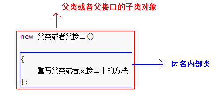
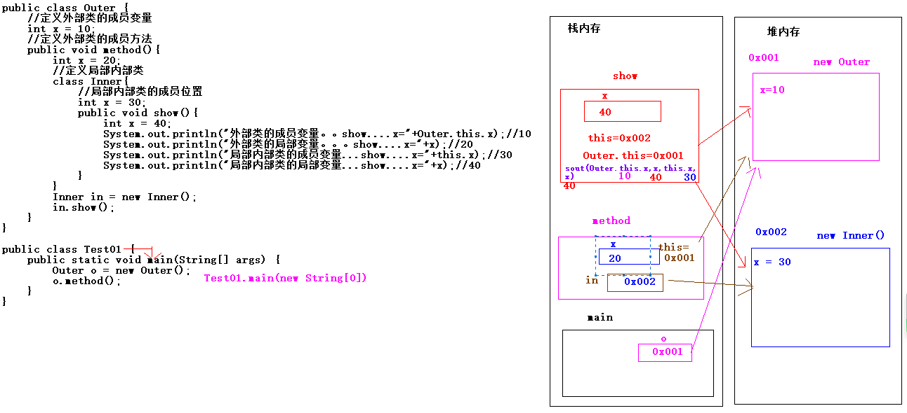

# 第一章 内部类

## 1.1 概述

### 什么是内部类

类是描述事物的，内部类，它也是用来描述事物，只不过在描述的这个事物需要依赖在其他事物中。

内部类：在其他类中类。

使用地方：

当我们在描述事物的时候，事物中还有其他的事物，这个位于事物中的那个事物，就可以使用Java中提供的内部类来描述。

比如：人，可以使用Person类描述。人这个事物还有心脏这个事物，可是心脏这个事物不仅仅人所具备，而其他的动物也会具备心脏这个事物。

因此我们在描述比如人这类事物的时候，如果还需要描述心脏，那么就必须把心脏这个类描述在人这个类的内部。

这个心脏就需要使用内部类描述。

简单来讲：在一个类中包含了另一个类。

内部类：在一个类中还有类。

分类：

~~~java
1.成员内部类：位于外部类的成员位置的类
2.局部内部类：位于外部类的局部位置的类
~~~

## 1.2 成员内部类

- **成员内部类** ：定义在**类中方法外**的类。

定义格式：

```java
class 外部类 {
    class 内部类{

    }
}
```

在描述事物时，若一个事物内部还包含其他事物，就可以使用内部类这种结构。比如，汽车类`Car` 中包含发动机类`Engine` ，这时，`Engine `就可以使用内部类来描述，定义在成员位置。

代码举例：

```java
class Car { //外部类
    class Engine { //内部类

    }
}
```

### 访问特点

- 内部类可以直接访问外部类的成员，包括私有成员。
- 外部类要访问内部类的成员，必须要建立内部类的对象。

创建内部类对象格式：

```java
外部类名.内部类名 对象名 = new 外部类型().new 内部类型()；
```

访问演示，代码如下：

定义类：

```java
public class Person {
    private  boolean live = true;
    class Heart {
        public void jump() {
            // 直接访问外部类成员
            if (live) {
                System.out.println("心脏在跳动");
            } else {
                System.out.println("心脏不跳了");
            }
        }
    }

    public boolean isLive() {
        return live;
    }

    public void setLive(boolean live) {
        this.live = live;
    }

}
```

定义测试类：

```java
public class InnerDemo {
    public static void main(String[] args) {
        // 创建外部类对象 
        Person p  = new Person();
        // 创建内部类对象
        Person.Heart heart = p.new Heart();
        // 调用内部类方法
        heart.jump();
        // 调用外部类方法
        p.setLive(false);
        // 调用内部类方法
        heart.jump();
    }
}
输出结果:
心脏在跳动
心脏不跳了
```

> 内部类仍然是一个独立的类，在编译之后会内部类会被编译成独立的.class文件，但是前面冠以外部类的类名和$符号 。
>
> 比如，Person$Heart.class  

> 小结：内部类是定义在一个类中的类。


## 1.3 局部内部类

位于外部类的局部位置的类。

~~~java
package com.itheima.sh.f_outer_inner_class_06;

public class Outer {
    //定义外部类的成员变量
    int x = 10;
    //定义外部类的成员方法
    public void method(){
        System.out.println("method....");
        //外部类的局部位置
        //定义一个局部变量
        int y = 20;
        //定义局部内部类
        class Inner{
            //局部内部类的成员位置
            int z = 30;
            //定义局部内部类的成员方法
            public void show(){
                System.out.println("show....");
            }
        }
        //创建局部内部类的对象
        Inner in = new Inner();
        //使用局部内部类的对象调用局部内部类的成员方法
        in.show();
    }
}

package com.itheima.sh.f_outer_inner_class_06;

public class Test01 {
    public static void main(String[] args) {
        /*
            需求：运行局部内部类的成员方法show
            说明：
            1.我们不能在测试类直接创建局部内部类的对象，需要创建外部类
            对象，使用外部类对象调用外部类中的成员方法，然后在外部类
            的成员方法体中创建局部内部类的对象
         */
        //创建外部类的对象
        Outer o = new Outer();
        //使用o调用外部类的成员方法
        o.method();
    }
}

~~~

小结：

1.局部内部类位于外部类的局部位置。

2..我们不能在测试类直接创建局部内部类的对象，需要创建外部类对象，使用外部类对象调用外部类中的成员方法，然后在外部类的成员方法体中创建局部内部类的对象。


## 1.3 匿名内部类（重点）

- **匿名内部类** ：是内部类的简化写法。它的本质是一个`带具体实现的` `父类或者父接口的` `匿名的` **子类对象**。

开发中，最常用到的内部类就是匿名内部类了。以接口举例，当你使用一个接口时，似乎得做如下几步操作，

1. 定义子类
2. 重写接口中的方法
3. 创建子类对象
4. 调用重写后的方法

我们的目的，最终只是为了调用方法，那么能不能简化一下，把以上四步合成一步呢？匿名内部类就是做这样的快捷方式。

### 前提

存在一个**类或者接口**，这里的**类可以是具体类也可以是抽象类**。

### 格式

```java
new 父类名或者接口名(){
    // 方法重写
    @Override 
    public void method() {
        // 执行语句
    }
};
说明：
    1.匿名内部类要求必须有一个类或者接口作为父类或者父接口。这里父类不一定是抽象类
    2.其实上述整体格式是父类或者父接口的子类对象
    3.大括号是匿名内部类

```



### 使用方式

以接口为例，匿名内部类的使用，代码如下：

定义接口：

```java
public abstract class FlyAble{
    public abstract void fly();
}
```

匿名内部类可以通过多态的形式接受

```java
public class InnerDemo01 {
    public static void main(String[] args) {
        /*
        	1.等号右边:定义并创建该接口的子类对象
        	2.等号左边:是多态,接口类型引用指向子类对象
       */
        FlyAble  f = new FlyAble(){
            public void fly() {
                System.out.println("我飞了~~~");
            }
        };
    }
}
```

匿名内部类直接调用方法

```java
public class InnerDemo02 {
    public static void main(String[] args) {
        /*
        	1.等号右边:定义并创建该接口的子类对象
        	2.等号左边:是多态,接口类型引用指向子类对象
       */
       	new FlyAble(){
            public void fly() {
                System.out.println("我飞了~~~");
            }
        }.fly();
    }
}
```

方法的形式参数是接口或者抽象类时，也可以将匿名内部类作为参数传递

```java
public class InnerDemo3 {
    public static void main(String[] args) {
        /*
        1.等号右边:定义并创建该接口的子类对象
        2.等号左边:是多态,接口类型引用指向子类对象
       */
        FlyAble  f = new FlyAble(){
            public void fly() {
                System.out.println("我飞了~~~");
            }
        };
        // 将f传递给showFly方法中
        showFly(f);
    }
    public static void showFly(FlyAble f) {
        f.fly();
    }
}
```

以上可以简化，代码如下：

```java
public class InnerDemo2 {
    public static void main(String[] args) {     	  
        /*
       	创建匿名内部类,直接传递给showFly(FlyAble f)
        */
        showFly( new FlyAble(){
            public void fly() {
                System.out.println("我飞了~~~");
            }
        });
    }

    public static void showFly(FlyAble f) {
        f.fly();
    }
}
```

> 小结：匿名内部类做的事情是创建一个类的子类对象


## 1.4 内部类扩展(了解)

1.内部类的名字：

~~~java
1.成员内部类名字：Person$Heart.class
2.局部内部类名字：Outer$1Inner.class  $后面有个数字
~~~

2.

~~~java
package com.itheima.sh.h_outer_inner_class_08;

public class Outer {
    //定义外部类的成员变量
    int x = 10;
    //定义外部类的成员方法
    public void method(){
//        System.out.println("method....");
        //外部类的局部位置
        //定义一个局部变量
        int x = 20;
        //定义局部内部类
        class Inner{
            //局部内部类的成员位置
            int x = 30;
            //定义局部内部类的成员方法
            /*
                show 方法中的this们：
                1.this : 记录着者调用show方法的对象in的地址值
                2.Outer.this ：记录着者调用method方法的对象地址值o
             */
            public void show(){
//                System.out.println(this);
//                System.out.println(Outer.this);
                //局部内部类的局部变量
                int x = 40;
                System.out.println("外部类的成员变量。。show....x="+Outer.this.x);//10
                //这里的method的局部变量x无法打印
                System.out.println("外部类的局部变量。。。show....x="+x);//20
                //this记录着者调用show方法的对象in的地址值
                System.out.println("局部内部类的成员变量...show....x="+this.x);//30
                System.out.println("局部内部类的局部变量...show....x="+x);//40
            }
        }

        //创建局部内部类的对象
        Inner in = new Inner();
//        System.out.println(in);
        //使用局部内部类的对象调用局部内部类的成员方法
        in.show();
    }
}
package com.itheima.sh.h_outer_inner_class_08;

public class Test01 {
    public static void main(String[] args) {
        Outer o = new Outer();
//        System.out.println("o = " + o);
        //使用o调用外部类的成员方法
        o.method();
    }
}

~~~




3.

~~~java
package com.itheima.sh.i_outer_inner_class_09;
/*
    1.是否可以使用成员修饰符修饰成员内部类：
        private public final static 可以修饰成员内部类
        上述只有final可以修饰局部内部类，其余三个不能修饰。
    2.使用static修饰的成员内部类怎么执行内部类的方法：
      外部类.内部类 对象 = new 外部类.内部类();

 */
public class Person {
    //外部类的成员位置
    //定义外部类成员变量
    static boolean isLive = true;
    //定义成员内部类
    static class Heart{
        //内部类的成员位置
        //定义内部类的成员变量
        int x = 10;
        //定义内部类的成员方法
        public void jump(){
            //判断
            //isLive 属于外部类的成员变量
            if(isLive){
                System.out.println("心脏在跳动，人活了");
            }else{
                System.out.println("心脏停止跳动，人挂了");
            }
        }
    }
    //定义外部类的成员方法
    public void show(){
        //创建内部类对象
        Heart h = new Heart();
        System.out.println(h.x);
    }
}

package com.itheima.sh.i_outer_inner_class_09;

public class Test01 {
    public static void main(String[] args) {
       //需求：运行jump方法

        /*
            在测试类中创建的非静态成员内部类对象：
            外部类.内部类 对象名 = new 外部类().new 内部类();
            静态成员内部类是在外部类Person一加载到内存中直接也会加载内存中
            外部类.内部类 对象 = new 外部类.内部类();
         */
        //创建静态成员内部类对象
        Person.Heart h = new Person.Heart();
        h.jump();

    }
}

~~~

小结：

在测试类中创建静态成员内部类对象格式：

~~~java
 外部类.内部类 对象 = new 外部类.内部类();
~~~


# 第二章 权限修饰符

## 2.1 概述

在Java中提供了四种访问权限，使用不同的访问权限修饰符修饰时，被修饰的内容会有不同的访问权限，

* public：公共的。没有限制。在同一个包中同一个类中 或 在同一个包中不同类之间 或 不同包之间的子类中 或 不同包不同类之间都可以访问(简而言之-------》任何包中的类都可以访问)；修饰成员变量 方法 构造方法 类

* protected：受保护的。在本类中访问 或 同一个包中的其它类中访问 或 **不同包中的子类访问**；

* 默认的权限(空的)：就是什么权限修饰符也不写。在本类访问或同一个包中的其它类中访问；

* private：私有的。只能在本类(同一类)中访问。其它类(包含子类)都不能访问；修饰成员变量 方法 构造方法

  public > protected>默认的权限(空的)>private


## 2.2 不同权限的访问能力

|                        | public | protected | （空的） | private |
| ---------------------- | ------ | --------- | -------- | ------- |
| 同一类中               | √      | √         | √        | √       |
| 同一包中(子类与无关类) | √      | √         | √        |         |
| 不同包的子类           | √      | √         |          |         |
| 不同包中的无关类       | √      |           |          |         |

可见，public具有最大权限。private则是最小权限。

说明：关于protected(受保护权限)的演示，可以在不同包的子类中访问。

1、public访问权限：没有任何限制(权限最大)

代码举例：

需求：

1）定义一个com.fu包，在这个包中创建一个使用public关键字来修饰的Fu类，在这个父类中定义一个使用public修饰的method函数，在这个函数中随便打印一句话；

2）再重新定义一个com.zi包，在这个包中引入com.fu包下面的Fu类，定义一个使用public关键字来修饰的Zi类继承Fu类，在Zi类中定义一个public修饰的函数run,在这个函数中调用父类中method方法；

3）在重新定义一个com.test包，在这个包中引入com.fu包下面的Fu类和com.zi包下面的Zi类,定义一个测试类Test,在这个测试类中分别创建子父类对象，并使用对象分别调用各自中的函数；

父类：

```java
package com.fu;
public class Fu 
{
	public void method()
	{
		System.out.println("父类中的方法....");
	}
}
```

子类：

```java
package com.zi;
import com.fu.Fu;//导入Fu类
public class Zi extends Fu 
{
	public void run()
	{
		System.out.println("子类中的方法....");
		method();  //子类继承了父类 是可以直接去访问父类中的方法
	}
}
```

测试类：

```java
package com.test;
import com.fu.Fu;//导入Fu类
import com.zi.Zi;//导入子类

class Test 
{
	public static void main(String[] args) 
	{
		Zi z = new Zi();
		z.run();//子类对象调用子类中的方法
            /*
                测试类没有继承Fu这个类，但是可以创建对象，那么就可以调用Fu类中的method方法，
                  这样导致Fu类中的方法不仅仅子类可以直接去 访问，不是Fu的子类也可以访问了。
            */
		Fu f = new Fu();   		
         f.method();
	}
}
```

问题：

com.test包中的Test类没有继承com.fu包中的Fu这个类，但是可以在com.test包中的Test类中创建Fu类对象，那么就可以在com.test包中的Test类中调用com.fu包中的Fu类中的method方法，这样导致Fu类中的方法不仅仅在com.zi包中的子类Zi可以直接去访问，而不是Fu的子类也可以访问了。

上述现象导致Zi类继承Fu类没有任何意义了。

在java中当定义一个类的时候，如果当前这个类中的方法只让自己的子类使用，而其他的类不让使用，这时可以在这个方法前面加上**protected关键字。**

**protected访问权限：专门给子类使用的访问权限。**

**将上述Fu类中的method函数的修饰符public换成protected。**

父类：

```java
package com.fu;
public class Fu 
{
	protected void method()
	{
		System.out.println("父类中的方法....");
	}
}
```

子类：

```java
package com.zi;
import com.fu.Fu;//导入Fu类

public class Zi extends Fu 
{
	public void run()
	{
		System.out.println("子类中的方法....");
		method();  //子类继承了父类 是可以直接去访问父类中的方法
	}
}
```

测试类：

```java
package com.test;
import com.fu.Fu;//导入Fu类
import com.zi.Zi;//导入子类
class Test 
{
	public static void main(String[] args) 
	{
		Zi z = new Zi();
		z.run();//子类对象调用子类中的方法
          
		Fu f = new Fu();   		
         f.method();//报错
	}
}
```

**注意：**

**1）如果父类中的函数使用protected关键字修饰，那么这个函数可以被不同包下的子类访问，而不同包中的其他类不能访问。**

**2）protected只能修饰成员函数或成员变量，不能修饰类。**

**3) 四种访问权限，能够跨包访问的只有 public protected(必须是子类)**

**4）public修饰符和默认修饰符注意事项**

~~~java
package com.itheima.sh.demo_03;
/*
    1.public 修饰的类，要求当前.java源文件名必须和public修饰的类名一致
    2.如果一个类是默认修饰符，那么当前源文件名可以随便定义
    3.如果一个源文件中具有多个class类，那么只能有一个使用public修饰，并且源文件名必须是public修饰的类的名字
 */
class Demo02{

}

public class Demo01 {
}

~~~


编写代码时，如果没有特殊的考虑，建议这样使用权限：

- 成员变量使用`private` ，隐藏细节。

- 构造方法使用` public` ，方便创建对象。

- 成员方法使用`public` ，方便调用方法。


# 第三章 代码块

## 3.1 构造代码块

- 构造代码块：
  
  - 位置：定义在成员位置的代码块{}
  
  - 执行：每次创建对象都会执行构造代码块
  - 作用：一般是一个类的多个构造方法重复的代码放到构造代码块中
  - 使用场景：
  
  ​		举例：统计当前类一共创建了几个对象

```java
public class Teacher {
    String name;
    int age;

    //定义计数器
    static int count = 0;
    //构造代码块
    //构造代码块会在构造方法之前执行，并且每次执行构造方法都会先执行构造代码块
    {
        System.out.println("构造代码块");
        //统计
        count++;
    }

    //无参构造
    public Teacher(){
        System.out.println("构造方法");
    }
    //有参构造
    public Teacher(String name, int age){
        this.name = name;
        this.age = age;
    }
}

public class Demo02 {
    public static void main(String[] args) {
        //创建对象
        Teacher t1 = new Teacher();
        Teacher t2 = new Teacher();
        Teacher t3 = new Teacher("柳岩",35);
        System.out.println("一共创建过" + Teacher.count +"次");
    }
}
```


## 3.2 静态代码块(掌握)

- **静态代码块**：
  
  - 格式：
  
    ~~~java
      //静态代码块
        static{
           
        }
    ~~~
  
  - 位置：定义在成员位置，类中方法外。
  - 执行：在当前类第一次被使用时，静态代码块会执行。并且静态代码块只会执行一次。
  - 使用场景：比如我们加载驱动（驱动需要在第一次使用前加载，只需要加载一次），这种功能就可以放在静态代码块中。

格式：

```java
public class Person {
	private String name;
	private int age;
 //静态代码块
	static{
		System.out.println("静态代码块执行了");
	}
}
```

## 3.3 局部代码块

- 格式：

```java
定义在方法中:
//局部代码块
{
    
}
```

```java
public class Demo03 {
    public static void main(String[] args) {
        int a = 10;
        //局部代码块
        //局部代码块的作用就是限制变量的作用域
        {
           int b = 20;
        }

        //int a = 30;    //在同一个区域不能定义重名变量
        //不报错，因为作用域不同
        int b = 40;
    }
}
```

## 3.4 执行顺序演示

~~~java
public class AAA {
    //静态代码块
    //静态代码块只会执行一次 并在最开始第一个执行
    static{
        System.out.println(2);
    }
    //构造代码块
    //在每次执行构造方法之前先执行构造代码块
    {
        System.out.println(3);
    }
    //构造方法
    public AAA() {
        System.out.println(1);
    }
   
}

public class Demo04{
    public static void main(String[] args) {
        //创建对象
        AAA a1 = new AAA();
        AAA a2 = new AAA();
    }
}

执行结果：    2 3 1 3 1
~~~

