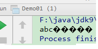
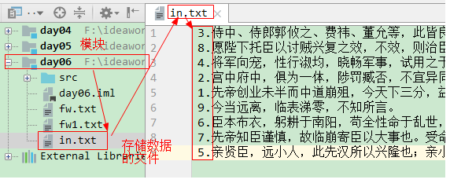

# 第一章 字符流

当使用字节流读取文本文件时，可能会有一个小问题。就是遇到中文字符时，可能不会显示完整的字符，那是因为一个中文字符可能占用多个字节存储。所以Java提供一些字符流类，以字符为单位读写数据，专门用于处理文本文件。

## 1.1 字节流读取字符的问题

数据在持久设备上一定是以二进制形式保存，是以字节形式保存。但是有些字节数据合在一起才表示的是字符数据。

比如：记事本中保存的数据，最后肯定是以字节形式保存在硬盘上，但是其中需要2个字节表示一个汉字。我们真正要使用流读取记事本中的数据时，不应该一个一个字节读取，而是应该把表示汉字的那几个字节一起读取，然后把这些字节合在一起表示一个汉字。

需求：使用字节流读取D:\\out.txt记事本以下的内容：

```
abc你好
```

一次读一个字节数组代码演示如下所示：

分析和步骤：

1）创建FileInputStream类的对象fis，D:\\out.txt作为参数；

2）定义一个字节byte数组b，先让数组长度是1024然后读取一遍后在将数组长度变为4；

3）定义一个变量len=0记录读取字节的个数；

4）使用while循环来读取数据，并使用输出语句输出String类构造函数转换后的数据

5）关闭资源流；

```java
//一次读取一个字节数组
	public static void method_2() throws IOException {
		// 创建读取字符数据的输入流对象
		FileInputStream fis = new FileInputStream("D:\\out.txt");
		//定义一个字节数组
//		byte[] b=new byte[1024];//数组大小是1024的整数倍
		byte[] b=new byte[4];//abc  
		//定义一个变量记录读取字节的个数
		int len=0;
		while((len=fis.read(b))!=-1)
		{
			System.out.print(new String(b,0,len));
		}
		//释放资源
		fis.close();
	}
```

结果：

 

说明：会出现上述结果的原因是字母abc各占一个字节，而汉字占两个或者三个字节。上述定义的字节数组一次只能存放4个字节，所以会将你字进行字节的拆分，这样会导致后面的汉字字符对应的字节都发生了变化，所以会出现乱码。

字节流读取字符数据的问题：

汉字等字符，往往由多个字节组成。使用字节流读取由多个字节组成字符数据，发现读取到的每个字符的对应的字节数据，而不是真正的字符内容。而我们更希望看到读取的具体的内容是什么字符数据。

我们需要把读取到的某2个或者3个字节合并在一起，拼成一个汉字。这时我们在程序中并不知道应该把哪2个或者3个字节合并成一个汉字。由于在程序中，有时一个字节就表示一个字符数据，比如英文字母，有时必须是2个字节或者3个字节表示一个汉字，那么到底应该把一个字节转成字母，还是把2个字节或者3个字节转成汉字，这时我们无法对读取的数据进行控制。

例如：记事本中的数据：abc你好

      我们如果使用字节流来读取上述数据，那么字节流不知道什么时候是几个字节组成字母，几个字节组成汉字，这样会出现我们不想要的结果。

**但是Java提供的字符流就可以解决上述读取字符数据的问题**


## 1.2 字符输入流【Reader】

`java.io.Reader`抽象类是表示用于读取字符流的所有类的超类，可以读取字符信息到内存中。它定义了字符输入流的基本共性功能方法。

- `public void close()` ：关闭此流并释放与此流相关联的任何系统资源。    

- `public int read()`： 调用一次读取一个字符，返回字符的编码值。即读取的内容存放到返回值中。如果读取到文件末尾返回-1；

- `public int read(char[] cbuf)`： 调用一次读取多个字符，把这些字符保存在cbuf中，返回给字符数组中存储的字符个数，如果读取到文件末尾返回-1；

  

## 1.3 FileReader类  

`java.io.FileReader `类是读取字符文件的便利类。构造时使用当前环境默认的字符编码和默认字节缓冲区。

> 小贴士：
>
> 1. 字符编码：字节与字符的对应规则。Windows系统的中文编码默认是GBK编码表。idea中UTF-8
> 2. 字节缓冲区：一个字节数组，用来临时存储字节数据。
>
> 注意：在计算机中所有数据在底层都是以字节数据存在的，即使是字符数据在最底层也是以字节数据存在的，因为计算机只识别字节数据。所以在字符流底层使用的是字节缓冲区，其实就是一个字节数组。
>

### 构造方法

- `FileReader(File file)`： 创建一个新的 FileReader ，给定要读取的File对象。   
- `FileReader(String fileName)`： 创建一个新的 FileReader ，给定要读取的文件的名称。  

当你创建一个流对象时，必须传入一个文件路径。类似于FileInputStream 。

- 构造举例，代码如下：

```java
public class FileReaderConstructor throws IOException{
    public static void main(String[] args) {
   	 	// 使用File对象创建流对象
        File file = new File("day09\\a.txt");
        FileReader fr = new FileReader(file);
      
        // 使用文件名称创建流对象
        FileReader fr = new FileReader("day09\\b.txt");
    }
}
```

### 读取字符数据

1. **读取字符**：`read`方法，调用一次读取一个字符，返回字符的编码值。提升为int类型。即读取的内容存放到返回值中。如果读取到文件末尾返回-1；循环读取，代码使用演示：

   案例：使用字符输入流读取D:\\out.txt上的文本文件。并将数据显示到控制台中。

    读数据--输入流--FileReader

    FileReader:

    		FileReader(String fileName):传递文件名称 

     输入流读文件的步骤：

     		A:创建输入流对象

     		B:调用输入流对象的读数据方法

     		C:释放资源

   ```java
   package com.itheima_02;
   import java.io.FileReader;
   import java.io.IOException;
   
   public class FileReaderDemo {
   	public static void main(String[] args) throws IOException {
   		//创建输入流对象
   //指定文件不存在就会报异常：java.io.FileNotFoundException: D:\\test\\1111.txt (系统找不到指定的文件。)
   //		FileReader fr = new FileReader("D:\\test\\1111.txt");
   		FileReader fr = new FileReader("D:\\out.txt");
   		
   		//调用输入流对象的读数据方法
   		//int read():一次读取一个字符
   		int ch=0;
   		while((ch=fr.read())!=-1) {
   			System.out.print((char)ch);
   		}
   		//释放资源
   		fr.close();
   	}
   }
   
   ```

> 小贴士：虽然读取了一个字符，但是会自动提升为int类型。

1. **使用字符数组读取**：`read(char[] cbuf)`，调用一次读取多个字符，把这些字符保存在cbuf数组中，返回给字符数组中存储的字符个数，如果读取到文件末尾返回-1.代码使用演示：

```java
public class FISRead {
    public static void main(String[] args) throws IOException {
      	// 使用文件名称创建流对象
       	FileReader fr = new FileReader("D:\\out.txt");
      	// 定义变量，保存有效字符个数
        int len =0;
        // 定义字符数组，作为装字符数据的容器
        char[] cbuf = new char[1024];
        // 循环读取
        while ((len = fr.read(cbuf))!=-1) {
            System.out.println(new String(cbuf,0,len));
        }
    	// 关闭资源
        fr.close();
    }
}
```

## 1.4 字符输出流【Writer】

`java.io.Writer `抽象类是表示用于写出字符流的所有类的超类，将指定的字符信息写出到目的地。它定义了字符输出流的基本共性功能方法。

- `public abstract void close()` ：关闭此输出流并释放与此流相关联的任何系统资源。  

- `public abstract void flush() ` ：刷新此输出流并强制任何缓冲的输出字符被写出。 

  说明：字符输入和字符输出流都是自带缓冲区的。缓冲区就是在类的底层封装了一个数组，如果我们使用字符输出流向目的地文件中写数据的时候，数据不会立刻写到目的地文件中，而是写到自带的数组中，数据还在内存中，所以我们必须调用FileWriter类中的刷新方法flush将数组中的数据刷新到目的地硬盘文件中。 

- `public void write(int b)` ：写出一个字符。

- `public void write(char[] cbuf)`：将 b.length字符从指定的字符数组写出此输出流。  

- `public abstract void write(char[] b, int off, int len)` ：从指定的字符数组写出 len字符，从偏移量 off开始输出到此输出流。  

- `public void write(String str)` ：写出一个字符串。

## 1.5 FileWriter类

`java.io.FileWriter `类是写出字符到文件的便利类。构造时使用系统默认的字符编码和默认字节缓冲区。

### 构造方法

- `FileWriter(File file)`： 创建一个新的 FileWriter，给定要读取的File对象。   

- `FileWriter(String fileName)`： 创建一个新的 FileWriter，给定要读取的文件的名称。 

  

  当你创建一个流对象时，必须传入一个文件路径。该路径下，如果没有这个文件，会创建该文件。如果有这个文件，会清空这个文件的数据。 类似于FileOutputStream。

- 构造举例，代码如下：

```java
public class FileWriterConstructor {
    public static void main(String[] args) throws IOException {
   	 	// 使用File对象创建流对象
        File file = new File("day09\\a.txt");
        FileWriter fw = new FileWriter(file);
      
        // 使用文件名称创建流对象
        FileWriter fw = new FileWriter("day09\\b.txt");
    }
}
```

### 基本写出数据

**写出字符**：`write(int b)` 方法，每次可以写出一个字符数据，代码使用演示：

```java
public class FWWrite {
    public static void main(String[] args) throws IOException {
        // 使用文件名称创建流对象
        FileWriter fw = new FileWriter("day09\\fw.txt");     
      	// 写出数据
      	fw.write(97); // 写出第1个字符
      	fw.write('b'); // 写出第2个字符
      	fw.write('C'); // 写出第3个字符
      
      	/*
        【注意】关闭资源时,与FileOutputStream不同。
      	 如果不关闭,数据只是保存到缓冲区，并未保存到文件。
        */
        // fw.close();
    }
}
输出结果：
abC
```

> 小贴士：
>
> 1. 虽然参数为int类型四个字节，但是只会保留一个字符的信息写出。
> 2. 未调用close方法，数据只是保存到了缓冲区，并未写出到文件中。

### 关闭和刷新

因为内置缓冲区的原因，如果不关闭输出流，无法写出字符到文件中。但是关闭的流对象，是无法继续写出数据的。如果我们既想写出数据，又想继续使用流，就需要`flush` 方法了。

- `flush` ：刷新缓冲区，流对象可以继续使用。
- `close` ：关闭流，释放系统资源。关闭前会刷新缓冲区。

代码使用演示：

```java
public class FWWrite {
    public static void main(String[] args) throws IOException {
        // 使用文件名称创建流对象
        FileWriter fw = new FileWriter("day09\\fw.txt");
        // 写出数据，通过flush
        fw.write('刷'); // 写出第1个字符
        fw.flush();
        fw.write('新'); // 继续写出第2个字符，写出成功
        fw.flush();
      
      	// 写出数据，通过close
        fw.write('关'); // 写出第1个字符
        fw.close();
        fw.write('闭'); // 继续写出第2个字符,【报错】java.io.IOException: Stream closed
        fw.close();
    }
}

```

> 小贴士：
>
> 1）即便是flush方法写出了数据，操作的最后还是要调用close方法，释放系统资源。
>
> 2）注意：
>
> close()和flush()方法的区别：
>
> flush():刷新缓冲区。流对象还可以继续使用。
>
> close():先刷新缓冲区，然后通知系统释放资源。流对象不可以再被使用了。

### 写出其他数据

void write(String str):写一个字符串数据

void write(String str,int index,int len):写一个字符串中的一部分数据

​	说明：

​		str 表示要写的字符串

​		index 表示从字符串哪个下标开始写

​		len  表示写的字符个数。

​	注意：字符串可以看做是一个由多个字符组成的字符数组。

void write(int ch):写一个字符数据,这里写int类型的好处是既可以写char类型的数据，也可以写char对应的int类型的值。'a',97

void write(char[] chs):写一个字符数组数据

void write(char[] chs,int index,int len):写一个字符数组的一部分数据

​	参数：

​		chs  表示写的字符数组

​		index 表示从数组哪个下标开始写

​		len写的字符个数

代码使用演示：

```java
package com.itheima_01;
import java.io.FileWriter;
import java.io.IOException;

/*
 * void write(String str):写一个字符串数据
 * void write(String str,int index,int len):写一个字符串中的一部分数据
 * void write(int ch):写一个字符数据,这里写int类型的好处是既可以写char类型的数据，也可以写char对应的int类型的值。'a',97
 * void write(char[] chs):写一个字符数组数据
 * void write(char[] chs,int index,int len):写一个字符数组的一部分数据
 */
public class FileWriterDemo3 {
	public static void main(String[] args) throws IOException {
		//创建输出流对象
		FileWriter fw = new FileWriter("day09\\b.txt");
		
		//void write(String str):写一个字符串数据
		//fw.write("abcde");
		
		//void write(String str,int index,int len):写一个字符串中的一部分数据
		//fw.write("abcde",0,5);
		//fw.write("abcde",1,3);
		
		//void write(int ch):写一个字符数据,这里写int类型的好处是既可以写char类型的数据，也可以写char对应的int类型的值。'a',97
		//fw.write('a');
		//fw.write(97);
		
		//void write(char[] chs):写一个字符数组数据
		char[] chs = {'a','b','c','d','e'};
		//fw.write(chs);
		
		//void write(char[] chs,int index,int len):写一个字符数组的一部分数据
		//fw.write(chs,0,5);
		fw.write(chs,2,3);
		
		//释放资源
		fw.close();
	}
}
```

#### FileWriter写入换行以及向文本末尾追加

说明：操作类似于FileOutputStream。

操作代码演示如下：

```java
package com.itheima_01;

import java.io.FileWriter;
import java.io.IOException;

public class FileWriterDemo4 {
	public static void main(String[] args) throws IOException {
		//创建输出流对象
		//FileWriter fw = new FileWriter("day09\\4.txt");
		FileWriter fw = new FileWriter("day09\\4.txt",true); //表示追加写入，默认是false
		
		for(int x=0; x<10; x++) {
			fw.write("hello"+x+"\r\n");
		}
		//释放资源
		fw.close();
	}
}
```

> 小贴士：字符流，只能操作文本文件，不能操作图片，视频等非文本文件。

# 第二章 IO异常的处理

## JDK7前处理

我们使用Java程序，操作的是Java程序以外的其他设备上的数据，都有可能发生异常问题。

我们在书写的Java程序读写其他设备上的数据时，都要考虑异常问题。这些异常一般开发中都要开发者自己处理掉，不能直接往声明。

建议使用`try...catch...finally` 代码块，处理异常部分，代码使用演示：

说明：这里拿字符输出流举例。

```java
public class HandleException1 {
    public static void main(String[] args) {
      	// 声明变量
        FileWriter fw = null;
        try {
            //创建流对象
            fw = new FileWriter("day09\\fw.txt");
            // 写出数据
            fw.write("黑马程序员"); //黑马程序员
        } catch (IOException e) {
            e.printStackTrace();
        } finally {
            try {
                if (fw != null) {
                    fw.close();
                }
            } catch (IOException e) {
                e.printStackTrace();
            }
        }
    }
}
```

## JDK7的处理(掌握)

如果涉及到关闭多个流的时候，我们使用上述jdk7之前的技术虽然也可以关闭资源，但是显得比较麻烦，在finally中代码显得比较冗余，所以在jdk7对于释放资源进行了优化，即以后关闭资源不用在finally中书写释放资源的代码了。这样对于程序员关于释放资源的代码写法更为简单了。

**注意：此处只是优化释放资源的代码。**

那么接下来我们来学习下jdk7是如何实现的。

首先在jdk7中出现了一个接口叫做：AutoCloseable 

无论是字节流还是字符流都实现了这个接口。

举例：FileWriter


AutoCloseable 接口说明：


**说明：**

- **只要IO流实现了这个接口，都可以完成自动释放资源.**
- jdk7提供了新的方式来处理释放资源的问题.

使用JDK7优化后的`try-with-resource` 语句，该语句确保了每个资源在语句结束时关闭。所谓的资源（resource）是指在程序完成后，必须关闭的对象。

格式：

```java
try (创建流对象语句，如果多个流对象语句,使用';'隔开) {
	// 读写数据
} catch (IOException e) {
	e.printStackTrace();
}
```

说明：

​	1）try后面书写了小括号()，括号里书写了流对象的创建。

​	2）try后面的大括号中书写读取或者书写数据的逻辑代码。

​	3）只要使用上述格式，资源就会被自动释放。

代码使用演示：

写数据模板代码：

```java
public class HandleException2 {
    public static void main(String[] args) {
      	// 创建流对象
        try ( FileWriter fw = new FileWriter("fw.txt"); ) {
            // 写出数据
            fw.write("黑马程序员"); //黑马程序员
        } catch (IOException e) {
            e.printStackTrace();
        }
    }
}
```

读写数据模板代码：

```java
public class Demo {
    public static void main(String[] args) {
        try (FileWriter fw = new FileWriter("day09\\fw1.txt"); FileReader fr = new FileReader("day09\\fw.txt")) {
            //读数据
            int len=0;
            char[] ch=new char[1024];
            while ((len=fr.read(ch))!=-1) {
                fw.write(ch,0,len);
            }

        } catch (IOException e) {
            e.printStackTrace();
        }
    }
}
```

# 第三章 缓冲流

上述学习了基本的一些流，作为IO流的入门，今天我们要见识一些更强大的流。比如能够高效读写的缓冲流，能够转换编码的转换流，能够持久化存储对象的序列化流等等。这些功能更为强大的流，都是在基本的流对象基础之上创建而来的，就像穿上铠甲的武士一样，相当于是对基本流对象的一种增强。

## 3.1 概述

缓冲流是对4个基本的`FileXxx` 流的增强，所以也是4个流，按照流操作数据的数据类型分类：

- **字节缓冲流**：`BufferedInputStream`，`BufferedOutputStream` 
- **字符缓冲流**：`BufferedReader`，`BufferedWriter`

缓冲流的基本原理，是在创建流对象时，会创建一个内置的默认大小的缓冲区数组，通过缓冲区读写，减少系统IO次数，从而提高读写的效率。

## 3.2 字节缓冲流

### 构造方法

- `public BufferedInputStream(InputStream in)` ：创建一个 新的字节缓冲输入流。 

- `public BufferedOutputStream(OutputStream out)`： 创建一个新的字节缓冲输出流。

  说明：我们发现上述缓冲流的参数依然需要对应的字节流对象。

  这是因为缓冲区流是为了 高效而设计的，缓冲区流本身仅仅是维护了一个数组。不具备读和写的功能。真正的读写还是要依赖普通的字节流。

  

构造举例，代码如下：

```java
// 创建字节缓冲输入流
BufferedInputStream bis = new BufferedInputStream(new FileInputStream("day09\\bis.txt"));
// 创建字节缓冲输出流
BufferedOutputStream bos = new BufferedOutputStream(new FileOutputStream("day09\\bos.txt"));
```

### 效率测试

查询API，缓冲流读写方法与基本的流是一致的，我们通过复制大文件，测试它的效率。

1. 基本流，代码如下：

```java
public class BufferedDemo {
    public static void main(String[] args) {
        // 记录开始时间
      	long start = System.currentTimeMillis();
		// 创建流对象
        try (
        	FileInputStream fis = new FileInputStream("D:\\test\\制服诱惑2.mp4");
        	FileOutputStream fos = new FileOutputStream("F:\\制服诱惑2.mp4")
        ){
        	// 读写数据
            int b;
            while ((b = fis.read()) != -1) {
                fos.write(b);
            }
        } catch (Exception e) {
            e.printStackTrace();
        }
		// 记录结束时间
        long end = System.currentTimeMillis();
        System.out.println("普通流复制时间:"+(end - start)+" 毫秒");
    }
}

普通流复制时间:288242 毫秒
```

​	2.缓冲流，代码如下：

```java
public class BufferedDemo {
    public static void main(String[] args){
        // 记录开始时间
      	long start = System.currentTimeMillis();
		// 创建流对象
        try (
        	BufferedInputStream bis = new BufferedInputStream(new FileInputStream("D:\\test\\制服诱惑2.mp4"));
	     BufferedOutputStream bos = new BufferedOutputStream(new FileOutputStream("F:\\制服诱惑2.mp4"));
        ){
        // 读写数据
            int b;
            while ((b = bis.read()) != -1) {
                bos.write(b);
            }
        } catch (Exception e) {
            e.printStackTrace();
        }
		// 记录结束时间
        long end = System.currentTimeMillis();
        System.out.println("缓冲流复制时间:"+(end - start)+" 毫秒");
    }
}

缓冲流复制时间:2108 毫秒
```

如何更快呢？

使用数组的方式，代码如下：

```java
public class BufferedDemo {
    public static void main(String[] args) throws FileNotFoundException {
      	// 记录开始时间
        long start = System.currentTimeMillis();
		// 创建流对象
        try (
			BufferedInputStream bis = new BufferedInputStream(new FileInputStream("D:\\test\\制服诱惑2.mp4"));
		 BufferedOutputStream bos = new BufferedOutputStream(new FileOutputStream("F:\\制服诱惑2.mp4"));
        ){
          	// 读写数据
            int len;
            byte[] bytes = new byte[8*1024];
            while ((len = bis.read(bytes)) != -1) {
                bos.write(bytes, 0 , len);
            }
        } catch (IOException e) {
            e.printStackTrace();
        }
		// 记录结束时间
        long end = System.currentTimeMillis();
        System.out.println("缓冲流使用数组复制时间:"+(end - start)+" 毫秒");
    }
}
缓冲流使用数组复制时间:115 毫秒
```

## 3.3 字符缓冲流

### 构造方法

- `public BufferedReader(Reader in)` ：创建一个 新的字符缓冲输入流。 
- `public BufferedWriter(Writer out)`： 创建一个新的字符缓冲输出流。

构造举例，代码如下：

```java
// 创建字符缓冲输入流
BufferedReader br = new BufferedReader(new FileReader("E:\\br.txt"));
// 创建字符缓冲输出流
BufferedWriter bw = new BufferedWriter(new FileWriter("E:\\bw.txt"));
```

### 特有方法

字符缓冲流的基本方法与普通字符流调用方式一致，不再阐述，我们来看它们具备的特有方法。

- BufferedReader：`public String readLine()`: 经常使用它读取一行数据。readLine方法可以按照行读取，读取的结束标记’\r’’\n’，返回的结果是读到这一行的所有文字。如果读取到文件的末尾返回 null。

- BufferedWriter：`public void newLine()`: 写一行行分隔符。就是换行。

  

`readLine`方法演示，代码如下：

```java
public class BufferedReaderDemo {
    public static void main(String[] args) throws IOException {
      	 // 创建流对象
        BufferedReader br = new BufferedReader(new FileReader("E:\\in.txt"));
		// 定义字符串,保存读取的一行文字
        String line  = null;
      	// 循环读取,读取到最后返回null
        while ((line = br.readLine())!=null) {
            System.out.print(line);
            System.out.println("------");
        }
		// 释放资源
        br.close();
    }
}
```

`newLine`方法演示，代码如下：

```java
public class BufferedWriterDemo throws IOException {
    public static void main(String[] args) throws IOException  {
      	// 创建流对象
		BufferedWriter bw = new BufferedWriter(new FileWriter("E:\\out.txt"));
      	// 写出数据
        bw.write("黑马");
      	// 写出换行
        bw.newLine();
        bw.write("程序");
        bw.newLine();
        bw.write("员");
        bw.newLine();
		// 释放资源
        bw.close();
    }
}
输出效果:
黑马
程序
员
```

## 3.4 练习:文本排序

请将文本信息恢复顺序。

```
3.侍中、侍郎郭攸之、费祎、董允等，此皆良实，志虑忠纯，是以先帝简拔以遗陛下。愚以为宫中之事，事无大小，悉以咨之，然后施行，必得裨补阙漏，有所广益。
8.愿陛下托臣以讨贼兴复之效，不效，则治臣之罪，以告先帝之灵。若无兴德之言，则责攸之、祎、允等之慢，以彰其咎；陛下亦宜自谋，以咨诹善道，察纳雅言，深追先帝遗诏，臣不胜受恩感激。
4.将军向宠，性行淑均，晓畅军事，试用之于昔日，先帝称之曰能，是以众议举宠为督。愚以为营中之事，悉以咨之，必能使行阵和睦，优劣得所。
2.宫中府中，俱为一体，陟罚臧否，不宜异同。若有作奸犯科及为忠善者，宜付有司论其刑赏，以昭陛下平明之理，不宜偏私，使内外异法也。
1.先帝创业未半而中道崩殂，今天下三分，益州疲弊，此诚危急存亡之秋也。然侍卫之臣不懈于内，忠志之士忘身于外者，盖追先帝之殊遇，欲报之于陛下也。诚宜开张圣听，以光先帝遗德，恢弘志士之气，不宜妄自菲薄，引喻失义，以塞忠谏之路也。
9.今当远离，临表涕零，不知所言。
6.臣本布衣，躬耕于南阳，苟全性命于乱世，不求闻达于诸侯。先帝不以臣卑鄙，猥自枉屈，三顾臣于草庐之中，咨臣以当世之事，由是感激，遂许先帝以驱驰。后值倾覆，受任于败军之际，奉命于危难之间，尔来二十有一年矣。
7.先帝知臣谨慎，故临崩寄臣以大事也。受命以来，夙夜忧叹，恐付托不效，以伤先帝之明，故五月渡泸，深入不毛。今南方已定，兵甲已足，当奖率三军，北定中原，庶竭驽钝，攘除奸凶，兴复汉室，还于旧都。此臣所以报先帝而忠陛下之职分也。至于斟酌损益，进尽忠言，则攸之、祎、允之任也。
5.亲贤臣，远小人，此先汉所以兴隆也；亲小人，远贤臣，此后汉所以倾颓也。先帝在时，每与臣论此事，未尝不叹息痛恨于桓、灵也。侍中、尚书、长史、参军，此悉贞良死节之臣，愿陛下亲之信之，则汉室之隆，可计日而待也。
```

准备工作：

在当前项目下面新建一个文件，叫做in.txt。然后将上述内容复制到in.txt文件中。注意每个序号后面要是一行数据。每个序号之间的数据要换行。效果如下图所示。



### 案例分析

1. 逐行读取文本信息。
2. 解析文本信息到集合中。
3. 遍历集合，按顺序，写出文本信息。

### 案例实现

```java
/*
分析：原来文本文件中的数据是乱序的，我们现在要求将文本文件in.txt中的无序的数据按照顺序写到一个文件out.txt中。
    1. 逐行读取文本信息。
        数据源文件in.txt属于文本文件，使用字符输入流---一行一行---高效的字符输入流BufferedReader 方法 readLine()
    2. 解析文本信息到集合中。
        每一行数据有个特点:  3.侍中、侍郎郭攸之、费祎
         数字+"."+文本数据
         读取到这一行数据，将其进行切割  使用String类中 split("\\.")
         注意：这里要书写  \\. 不能直接书写 . 因为在这里.具备特殊含义 表示任意的字符
         而我们这里希望是真正的 点，所以需要使用\将点进行转义，但是在java中\\表示一个真正的\
         总结：\\.表示我们生活中的一个 .

         3.侍中、侍郎郭攸之、费祎、董允等，....
         8.愿陛下托臣以讨贼兴复之效。。。
         按照上述做法切割完成之后，数组长度是2
         索引     数据
         0       3
         1       侍中、侍郎郭攸之、费祎、董允等，....
         将截取的数据存放到Map集合中
         序号作为key  文本数据作为value
         HashMap<Integer,String> hm = new HashMap<Integer,String>();
         hm.put(3,"侍中、侍郎郭攸之、费祎、董允等，....");----->hm.put(Integer.parseInt(arr[0]),arr[1]);
    3. 遍历集合，按顺序，写出文本信息。

        //遍历
        for(int i=1;i<=hm.size();i++)
        {
            //i赋值给key
            Integer key=i;
            //根据key获取值
            String value = hm.get(key);
            //写文本信息 一行一行  BufferedWriter  换行 newLine()
            每一行信息包括： bw.write(key+"."+value);
        }
 */
public class BufferedTest {
    public static void main(String[] args) throws Exception {
        //1. 逐行读取文本信息。
        //1.1 创建高效字符输入流对象关联数据源文件
        BufferedReader br = new BufferedReader(new FileReader("in.txt"));
        //1.2 调用方法读取数据
        //创建集合对象保存切割后的序号和文本数据 key ： 存储序号 3   value ： 存储文本数据
        HashMap<Integer, String> hm = new HashMap<>();
        String line = null;
        while ((line = br.readLine()) != null) {
            //1.3 截取读取的数据
            String[] arr = line.split("\\.");
            //2. 解析文本信息到集合中。  3.侍中、侍郎郭攸之、费祎、董允等，....
            //由于key位置是Integer类型，而 数组中第一个数据是字符串，所以需要转换
            int key = Integer.parseInt(arr[0]);
            //添加到集合中
            hm.put(key, arr[1]);//key:3 value:侍中、侍郎郭攸之、费祎、董允等，....
        }
       
        //关闭资源
        br.close();
        //创建字符高效输出流对象
        BufferedWriter bw = new BufferedWriter(new FileWriter("out.txt"));
        //3. 遍历集合，按顺序，写出文本信息。
        for (int i = 1; i <= hm.size(); i++) {
            //获取i就是key，i赋值给key
            Integer key = i;
            //根据key获取value
            String value = hm.get(key);
            //将遍历出来的key和value写到out.txt中
            bw.write(key+"."+value);
            //换行
            bw.newLine();
        }
        //释放资源
        bw.close();
    }
}
```

