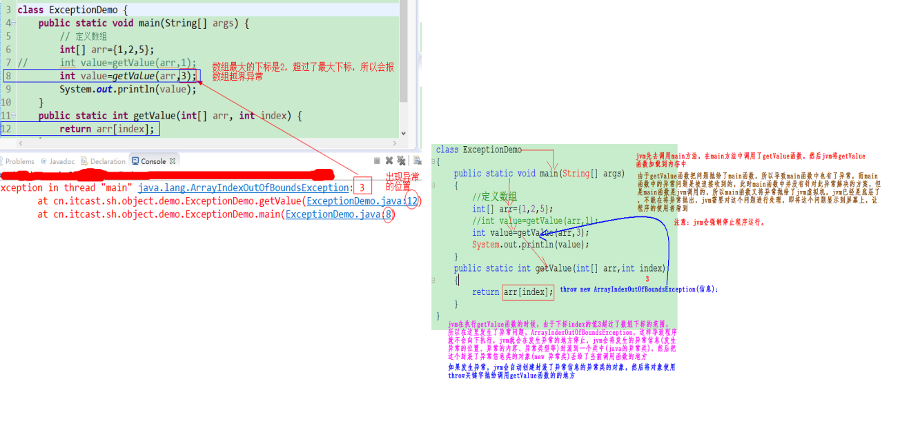

# 第一章   异常

## 1.1 异常概念

异常：不正常。

生活中的异常：

   例：在上课时，突然间停电，造成上课终止。   处理：等待来电、使用备用发电机。

程序中的异常：

   程序在运行的过程，出现了一些突发状况，造成程序无法继续运行。我们把上述的突发状况，无法正常运行的这些状态称为Java中的异常。

Java中的异常：就是程序中出现的错误（bug），或者不正常现象。而我们在开发程序的时候，就需要对这些问题进行预先的判断和处理。

学习Java中的异常，我们需要研究：

1、什么是异常；

**2、异常问题怎么去解决和处理；**

3、我们自己怎么把问题报告给程序的使用者；

我们编写程序的时候，在程序中肯定会有问题（bug）出现，而sun公司把开发中最最常见的一些问题，进行总结和抽取，形成了一个体系，这个体系就是我们要学习的异常体系。

> 异常指的并不是语法错误,语法错了,编译不通过,不会产生字节码文件,根本不能运行.


## 1.2     异常的产生过程解析(掌握)

需求：根据用户指定的下标，输出该下标对应的数据。

1）定义一个类ExceptionDemo；

2）定义一个主方法，在主方法中定义一个int类型的数组，在这个数组中存放int类型的数据；

3）在这个类中自定义一个函数getValue，在这个函数中根据调用者传递过来的下标和数组返回给调用者

对应的数据；

4）在主方法中调用自定义函数getValue，接收自定义函数返回回来的数据，并将数据打印到屏幕上；




说明：上述代码发生异常的过程：

1）jvm先去调用main函数，在main函数中调用了getValue函数，然后jvm将getValue函数加载到内存中；

2）Jvm在执行getValue函数的时候，由于数组下标index的值3超过了数组的最大下标的范围，所以在这里发生了异常问题，ArrayIndexOutOfBoundsException，这样导致程序就不会向下执行，jvm会在发生异常的地方停止，jvm会将发生异常信息（发生异常的位置、异常内容、异常类型等）封装到一个类中（Java的异常类），然后把这个封装了异常信息类的对象（new 异常类）丢给了当前调用函数的地方。

3）如果发生异常，jvm会自动创建封装了异常信息的异常类的对象，然后将对象使用throw关键字抛给调用getValue函数的地方。

4）由于getValue函数把问题抛给了main函数，所以导致了main函数中也有了异常，而main函数中的异常是被迫接收的，此时main函数中并没有解决此异常的解决方案，但是main函数是jvm调用的，所以main函数又将异常抛给了jvm虚拟机，jvm已经是底层了，不能再将异常抛出，jvm需要对这个问题进行处理，即将这个问题显示到屏幕上，让程序的使用者看到。


## 1.3 异常体系

我们书写程序，肯定会有问题的发生，这些问题统称为异常。而sun公司把最常见的一些异常进行类的描述和封装。然后我们如果在程序中遇到了这些问题，就可以直接通过这些描述异常的类进行错误信息的封装。然后把这些信息丢给程序的调用者。

异常的根类是`java.lang.Throwable`，Throwable这个类描述的是Java中所有异常和错误的共性内容。其下有两个子类：`java.lang.Error`与`java.util.Exception`，平常所说的异常指`java.util.Exception`。


**Throwable体系：**

- **Error**:严重错误Error，无法通过处理的错误，只能事先避免，好比绝症。

  ​	在程序运行时，会产生一些错误信息。java把这些错误信息使用Error或其子类进行描述。

   	错误属于系统级别的，是由于JVM在操作内存时(JVM需要借助操作系统来实现内存的操作)，出现了一些不正常的操作，造成内存错误，出现错误后操作系统就会把这个错误返回给JVM。

          在程序中，遇到错误时，java没有针对性的解决方案，只能通过修改源代码的方式来解决程序中的错误问题。

- **Exception**:表示异常，异常产生后程序员可以通过代码的方式纠正，使程序继续运行，是必须要处理的。好比感冒。

  ​      在程序运行时，也会出现一些异常状况。表示Java程序中存在的异常问题，而不是错误问题。这些异常问题，在程序中通过判断等形式是可以检测并且预防的。针对这些异常问题，程序员在写代码的时候一旦发生，必须给出有效的解决方案。

  java对于异常状况是有针对性的解决方案（异常处理），例：角标越界、空指针异常等。

   异常状况的发生，通常是JVM在操作一些数据时，出现的问题，java对于异常的发生，是可以通过一些手段(捕获)避免程序终止运行，保证让程序继续向下正常执行。

## 1.4 异常分类

我们平常说的异常就是指Exception，因为这类异常一旦出现，我们就要对代码进行更正，修复程序。

**异常(Exception)的分类**:根据在编译时期还是运行时期去检查异常?

- **编译时期异常**:checked异常。在编译时期,就会检查,如果没有处理异常,则编译失败。(如日期格式化异常)
- **运行时期异常**:runtime异常。在运行时期,检查异常.在编译时期,运行异常不会让编译器检测(不报错)。

​    

**小结：**

     RuntimeException和Exception有什么区别：

     Exception属于编译时异常，编译器在编译时会检测该异常是否异常的处理方案 ，如果没有处理方案，编译不能通过。

     RuntimeException属于运行时异常，编译器不会检测该异常是否有异常的处理方案，不需要声明。

说明：在Exception的所有子类异常中，只有RuntimeException不是编译异常，是运行时异常，其他子类都是编译异常。


# 第二章 异常的处理

Java异常处理的五个关键字：**try、catch、finally、throw、throws**

## 2.1 	抛出异常throw

在编写程序时，我们必须要考虑程序出现问题的情况。比如，在定义方法时，方法需要接受参数。那么，当调用方法使用接受到的参数时，首先需要先对参数数据进行合法的判断，数据若不合法，就应该告诉调用者，传递合法的数据进来。这时需要使用抛出异常的方式来告诉调用者。

在java中，提供了一个**throw**关键字，它用来抛出一个指定的异常对象。那么，抛出一个异常具体如何操作呢？

1. 创建一个异常对象。封装一些提示信息(信息可以自己编写)。

2. 需要将这个异常对象告知给调用者。怎么告知呢？怎么将这个异常对象传递到调用者处呢？通过关键字throw就可以完成。throw 异常对象。

   throw**用在**方法内**，用来**抛出一个异常对象，将这个异常对象传递到调用者处，并结束当前方法的执行。

**使用格式：**

```
throw new 异常类名(参数);
```

 例如：

```java
throw new NullPointerException("要访问的arr数组不存在");

throw new ArrayIndexOutOfBoundsException("该索引在数组中不存在，已超出范围");
```

学习完抛出异常的格式后，我们通过下面程序演示下throw的使用。

```java
public class ThrowDemo {
    public static void main(String[] args) {
        //创建一个数组 
        int[] arr = {2,4,52,2};
        //根据索引找对应的元素 
        int index = 4;
        int element = getElement(arr, index);

        System.out.println(element);
        System.out.println("over");
    }
    /*
     * 根据 索引找到数组中对应的元素
     */
    public static int getElement(int[] arr,int index){ 
       	//判断  索引是否越界
        if(index<0 || index>arr.length-1){
             /*
             判断条件如果满足，当执行完throw抛出异常对象后，方法已经无法继续运算。
             这时就会结束当前方法的执行，并将异常告知给调用者。这时就需要通过异常来解决。 
              */
             throw new ArrayIndexOutOfBoundsException("哥们，角标越界了~~~");
        }
        int element = arr[index];
        return element;
    }
}
```

> 注意：如果产生了问题，我们就会throw将问题描述类即异常进行抛出，也就是将问题返回给该方法的调用者。
>
> 那么对于调用者来说，该怎么处理呢？一种是进行捕获处理，另一种就是继续将问题声明出去，使用throws声明处理。

## 2.2  声明异常throws(掌握)

**声明异常**：将问题标识出来，报告给调用者。如果方法内通过throw抛出了编译时异常，而没有捕获处理（稍后讲解该方式），那么必须通过throws进行声明，让调用者去处理。

关键字**throws**运用于方法声明之上,用于表示当前方法不处理异常,而是提醒该方法的调用者来处理异常(抛出异常).

**声明异常格式：**

```
修饰符 返回值类型 方法名(参数) throws 异常类名1,异常类名2…
{   
	方法体
}	
```

注意：

​	    1）throws后面可以跟多个异常类，使用逗号分隔；

        2）在函数中如果发生了异常，jvm会拿发生的异常和声明的异常类进行匹配，如果匹配才会把发生的异常交给别人处理；

需求：声明的简单使用

1）定义一个ThrowDemo类；

2）在定义一个Demo类，在这个类中定义一个函数show，在show函数中对传入的参数x进行判断，如果x等于0，则使用throw关键字抛出Exception异常；

3）由于抛出的是编译时异常所以需要在show函数上使用throws关键字声明这个异常，告诉调用者，有异常；

4）在show函数中打印x的值；

5）在ThrowDemo类中创建Demo类的对象，使用对象调用函数；

 


声明异常的代码演示：

```java
public class ThrowsDemo {
    public static void main(String[] args) throws Exception {
        show(2);
    }

    // 如果定义功能时有问题发生需要报告给调用者。可以通过在方法上使用throws关键字进行声明
    public static void show(int x) throws Exception {
        if (x == 0) {//如果x等于0
            // 我假设  如果不是 a.txt 认为 该文件不存在 是一个错误 也就是异常  throw
            throw new Exception("x不能等于0");
        }
       System.out.println(x);
    }
}
```

**注意：在开发中，main函数中不会出现声明，在main函数通常是使用捕获。**

## 2.3  捕获异常try…catch(掌握)

### 2.3.1格式

就是遇到异常时，不再把异常交给他人处理，自己处理。

在程序中有异常，但这个异常我们不能继续使用throws声明，这时不处理，程序无法编译通过，那么在程序中只能使用捕获方式解决问题。

格式如下：

```java
try{
     编写可能会出现异常的代码
}catch(异常类型  对象名){
     处理异常的代码
     //记录日志/打印异常信息/继续抛出异常
}
```

**try：**该代码块中编写可能产生异常的代码。

**catch：**用来进行某种异常的捕获，实现对捕获到的异常进行处理。

> 注意:try和catch都不能单独使用,必须连用。

演示如下：

```java
public class ThrowDemo {
	 /*
     * 一般在开发中我们不会在主函数上面抛异常，主函数一般是最后处理者，
     * 我们需要在主函数中对异常进行处理------》捕获
     */
    public static void main(String[] args){

        try
        {
            show(0);//异常代码
        }catch(Exception e)//Exception e=new Exception("x不能等于0")
        {
            //处理异常的代码
            //System.out.println("hahhahaha");
			//System.out.println(e.getMessage());//x不能等于0
//			System.out.println(e);
	        e.printStackTrace();
        }
    }
    public static void show(int x) throws Exception {
        if (x == 0) {//如果x等于0
           
            throw new Exception("x不能等于0");
        }
        System.out.println(x);
    }
}
```

总结：不管自己是函数的定义者，还是函数的调用者，只要是在自己的函数中有异常发生， 那么自己都可以使用上述的两种方案对异常进行处理。


### 2.3.2如何获取异常信息：

Throwable类中定义了一些查看方法:

异常中的常用方法

| 方法                | 说明                                                         |
| ------------------- | ------------------------------------------------------------ |
| String getMessage() | 获取报错原因.                                                |
| String toString()   | 获取报错的类型和原因                                         |
| printStackTrace()   | 直接打印报错的类型、原因和位置.包含了异常的类型,异常的原因,还包括异常出现的位置. |

代码演示：

~~~java
public class Test04 {
    public static void main(String[] args) {

        //解析异常(编译时期异常)
        String s = "2000-11-12";
        SimpleDateFormat sdf = new SimpleDateFormat("yyyy/MM/dd");

        try {
            //解析
            Date date = sdf.parse(s);
            System.out.println(date);

        }catch (ParseException e){
            //e是一个异常对象
            //1.getMessage()获取报错原因
//            String ss = e.getMessage();
//            System.out.println(ss);      //Unparseable date: "2000-11-12"


            //2.toString()获取报错的类型和原因
//            String ss = e.toString();
//            System.out.println(ss);       //java.text.ParseException: Unparseable date: "2000-11-12"


            //3.printStackTrace()直接打印报错的类型、原因和位置
            /*
               java.text.ParseException: Unparseable date: "2000-11-12"
                at java.base/java.text.DateFormat.parse(DateFormat.java:388)
                at com.itheima_03.Demo05_tryCatch.main(Demo05_tryCatch.java:17)
            */
            e.printStackTrace();
        }

        //当trycatch执行完程序会继续往后执行
    }
}
~~~

### 2.3.3捕获多个异常

多个异常使用捕获又该如何处理呢？

​	多个异常一次捕获，多次处理。

一般我们是使用一次捕获多次处理方式，格式如下：

```java
try{
     编写可能会出现异常的代码
}catch(异常类型A  e){  当try中出现A类型异常,就用该catch来捕获.
     处理异常的代码
     //记录日志/打印异常信息/继续抛出异常
}catch(异常类型B  e){  当try中出现B类型异常,就用该catch来捕获.
     处理异常的代码
     //记录日志/打印异常信息/继续抛出异常
}
```


## 2.4 finally 代码块(掌握)

**finally**：有一些特定的代码无论异常是否发生，都需要执行。另外，因为异常会引发程序跳转，导致有些语句执行不到。而finally就是解决这个问题的，在finally代码块中存放的代码都是一定会被执行的。

什么时候的代码必须最终执行？

当我们在try语句块中打开了一些物理资源(磁盘文件/网络连接/数据库连接等),我们都得在使用完之后,最终关闭打开的资源。

finally的语法:

 try...catch....finally:自身需要处理异常,最终还得关闭资源。

~~~java
try{
	   可能发生异常的代码
   }catch(异常类名  变量名){
	  处理异常的代码。
	}finally{
	 程序中永远都能执行到的代码
  }
~~~


在程序中随时都有可能发生异常，一旦程序中发生了异常，这样就会导致在发生异常的地方之后的所有代码都不会运行。可是在程序中，有时有些代码不管程序中有没有问题都必须执行。这时这部分代码必须写在finally代码块中。

> 注意:finally不能单独使用。

比如在我们之后学习的IO流中，当打开了一个关联文件的资源，最后程序不管结果如何，都需要把这个资源关闭掉。

finally代码参考如下：

需求：

1）创建一个Test类；

2）定义一个Demo1类，在这个类中定义一个show函数，根据传递进来的参数x进行判断，如果x等于0，则使用throw关键字抛异常Exception；

3）对这个异常我们不使用声明处理，我们使用捕获进行处理，即使用try-catch-finally进行处理；

4）并分别在try-catch-finally的代码中使用return关键字返回给调用者1,2,3；

5）在Test类中创建Demo1对象，并使用对象调用类中的show函数，并打印返回来的值；


```java
package cn.itcast.sh.b_excep_other;
class Demo1
{
	public int show(int x)
	{
		try
		{
			if(x==0){
				throw new Exception("x是零");
			}
			System.out.println("try.....");
			return 1;
		}catch(Exception e)
		{
			System.out.println("捕获异常");
			return 2;
		}finally
		{
			System.out.println("必须执行");
			return 3;
		}
	}
}
public class Test {
	public static void main(String[] args) {
		Demo1 d = new Demo1();
		int value=d.show(0);
		System.out.println(value);
	}
}
```

说明：在上述代码中，因为传入show函数中的值是0，所以发生异常，那么在jvm执行catch中的return 2代码的时候，jvm发现此时下面有finally关键字，那么jvm先不会执行return 2语句，jvm会先去执行finally中的代码，因为此时finally中有return 3语句，在函数中，遇见return关键字就会结束整个函数，此时jvm不会回来执行return2语句，如果在finally代码块中没有return语句，那么jvm在执行finally代码块里面的代码之后就又会回到catch中继续执行return 2语句。

finally代码块是永远都会被执行的代码，不管程序发生什么问题，最后JVM一定会把finally中的代码执行一遍。


**使用场景**

之后会学习IO流，IO流就相当于水龙头。

打开水龙头之后，中间不管是做了什么操作，最后都一定要关闭水龙头。（节约资源）

关闭水龙头(节约资源)的代码就可以写在finally

## 2.5   异常注意事项

- 运行时异常被抛出可以不处理。即不捕获也不声明抛出。

- 父类方法没有抛出异常，子类覆盖父类该方法时也不可抛出异常。此时子类产生该异常，只能捕获处理，不能声明抛出

  需求：

  ​	1）创建类Test2；

  ​	2）定义一个Fu类和Zi类，在Fu类中定义一个method函数；

  ​	3）在Zi类中复写method函数，在这个函数中抛Exception异常；

  ​	4）在类Test2中创建Zi类对象，通过子类对象调用子类中的method函数；

  ​	5）在Zi类中的method中捕获异常；

```java
package cn.itcast.sh.b_excep_other;
class Fu
{
	public void method()
	{
		System.out.println("父类中的method");
	}
}
class Zi extends Fu
{
	public void method() //throws Exception
	{
		System.out.println("子类重写方法method");
		try {
			throw new Exception("异常");
		} catch (Exception e) {
			// TODO Auto-generated catch block
			e.printStackTrace();
		}
	}
}
public class Test2 {
	public static void main(String[] args) {
		Zi z=new Zi();
		z.method();
	}
}
```

- 在try/catch后可以追加finally代码块，其中的代码一定会被执行，通常用于资源回收。

- 如果finally有return语句,永远返回finally中的结果,避免该情况. 

  需求：

  1）创建一个Test类；

  2）定义一个Demo1类，在这个类中定义一个show函数，根据传递进来的参数x进行判断，如果x等于0，则使用throw关键字抛异常Exception；

  3）对这个异常我们不使用声明处理，我们使用捕获进行处理，即使用try-catch-finally进行处理；

  4）并分别在try-catch-finally的代码中使用return关键字返回给调用者1,2,3；

  5）在Test类中创建Demo1对象，并使用对象调用类中的show函数，并打印返回来的值；

  

  ```java
  package cn.itcast.sh.b_excep_other;
  class Demo1
  {
  	public int show(int x)
  	{
  		try
  		{
  			if(x==0){
  				throw new Exception("x是零");
  			}
  			System.out.println("try.....");
  			return 1;
  		}catch(Exception e)
  		{
  			System.out.println("捕获异常");
  			return 2;
  		}finally
  		{
  			System.out.println("必须执行");
  			return 3;
  		}
  	}
  }
  public class Test {
  	public static void main(String[] args) {
  		Demo1 d = new Demo1();
  		int value=d.show(0);
  		System.out.println(value);
  	}
  }
  ```

# 第三章 自定义异常

## 3.1 概述

**为什么需要自定义异常类:**

我们说了Java中不同的异常类,分别表示着某一种具体的异常情况,那么在开发中总是有些异常情况是SUN没有定义好的,此时我们根据自己业务的异常情况来定义异常类。,例如年龄负数问题,考试成绩负数问题。

在上述代码中，发现这些异常都是JDK内部定义好的，但是实际开发中也会出现很多异常,这些异常很可能在JDK中没有定义过,例如年龄负数问题,考试成绩负数问题.那么能不能自己定义异常呢？

**什么是自定义异常类:**

在开发中根据自己业务的异常情况来定义异常类.

自定义一个业务逻辑异常: **LoginException**。一个登陆异常类。

**异常类如何定义:**

1. 自定义一个编译期异常: 自定义类 并继承于`java.lang.Exception`。

2. 自定义一个运行时期的异常类:自定义类 并继承于`java.lang.RuntimeException`。

   异常也是一个类，那么就和我们学习面向对象中定义类没有区别：

   格式：

   ~~~java
   public class 异常类的名字  extends Exception / RuntimeException
   
   {
   
   	//不需要任何的属性和行为，仅仅只需要提供构造函数即可。
   	public 异常类的名字(){}
   	public 异常类的名字( String message ){
   	super(message);
   	}
   }
   ~~~

   

**注意：不需要任何的属性和行为，仅仅只需要提供构造函数即可。**

**查看异常源码**

~~~java
public class NullPointerException extends RuntimeException {
    //版本号 没什么用
    private static final long serialVersionUID = 5162710183389028792L;
	//构造方法
    public NullPointerException() {
        super();
    }
	//构造方法
    public NullPointerException(String s) {
        super(s);
    }
}
~~~

- 

  - 通过查看源码我们发现，异常类中什么都没有定义。
  - 不同的异常只是类名不同而已，内部并没有特殊的方法。类名不同方便程序员识别不同的错误。

- 自定义异常的作用

  - 自定义异常的作用就是在出现异常时，让异常的名字更加直观。

## 3.2 自定义异常的练习

练习：

需求：定义一个类，描述矩形，提供计算面积的功能。要求对长和宽进行判断， 如果非法直接抛出长或宽非法异常。

分析和步骤：

1）定义一个类Rectangle描述矩形，在这个类中分别定义长length和宽width两个私有属性，并对外提供get和set方法；

2）在Rectangle类中定义一个构造函数分别给长length和宽width初始化值；

3）在这个类的构造函数中分别对length和width两个属性进行判断，如果长和宽不合法，分别对长和宽进行抛异常，同时构造函数要声明异常；

4）定义一个类IllegalWidthException对非法的宽进行异常处理，在这个类中分别定义无参构造函数和有一个参数的构造函数，同时这个类需要继承Exception类，这样在编译的时候就可以检测异常；

5）定义一个类IllegalLengthException对非法的长进行异常处理，在这个类中分别定义无参构造函数和有一个参数的构造函数，同时这个类需要继承Exception类，这样在编译的时候就可以检测异常；

6）在Rectangle类中定义一个计算矩形面积的函数getArea，将最终的面积值返回给调用者；

7）定义一个异常测试类ThrowTest，在这个测试类中创建矩形类Rectangle的对象，并通过对象调用计算圆的面积的函数getArea并打印，同时并对异常进行捕获处理；

```java
/*
 * 需求：定义一个类，描述矩形，提供计算面积的功能。
 * 要求对长和宽进行判断， 如果非法直接抛出长或宽非法异常。
 */
//自己定义长和宽非法的异常
class IllegalWidthException extends Exception{

	public IllegalWidthException() {
		super();
	}

	public IllegalWidthException(String message) {
		super(message);
	}
}

//非法的长度异常
class IllegalLengthException extends Exception{

	public IllegalLengthException() {
		super();
	}
	public IllegalLengthException(String message) {
		super(message);
	}
}

//描述矩形
class Rectangle{
	//长和宽
	private double length;
	private double width;
	
	public Rectangle(double length, double width) throws IllegalLengthException, IllegalWidthException {
		//对长和宽进行合法的验证
		if( length <= 0 ){
			throw new IllegalLengthException("非法的矩形长度");
		}
		
		if( width <= 0 ){
			throw new IllegalWidthException("非法的矩形宽度");
		}
		this.length = length;
		this.width = width;
	}
	
	public double getLength() {
		return length;
	}
	public void setLength(double length) {
		this.length = length;
	}
	public double getWidth() {
		return width;
	}
	public void setWidth(double width) {
		this.width = width;
	}
	
	//计算面积
	public double getArea(){
		return this.length * this.width;
	}
	
}

public class ThrowTest {
	public static void main(String[] args) {
		
		//创建矩形对象
		try {
			Rectangle r = new Rectangle(-3,4);
			
			System.out.println(r.getArea());
			
		} catch ( IllegalWidthException e) {
			e.printStackTrace();
		} catch ( IllegalLengthException e) {
			e.printStackTrace();
		}
		
	}
}
```


# 第四章 多线程

我们在之前，学习的程序在没有跳转语句的前提下，都是由上至下依次执行，那现在想要设计一个程序，边打游戏边听歌，怎么设计？

要解决上述问题,咱们得使用多进程或者多线程来解决.

## 4.1 并发与并行

- **并行**：指两个或多个事件在**同一时刻**发生（同时执行）。
- **并发**：指两个或多个事件在**同一个时间段内**发生(交替执行)。


在操作系统中，安装了多个程序，并发指的是在一段时间内宏观上有多个程序同时运行，这在单 CPU 系统中，每一时刻只能有一道程序执行，即微观上这些程序是分时的交替运行，只不过是给人的感觉是同时运行，那是因为分时交替运行的时间是非常短的。

而在多个 CPU 系统中，则这些可以并发执行的程序便可以分配到多个处理器上（CPU），实现多任务并行执行，即利用每个处理器来处理一个可以并发执行的程序，这样多个程序便可以同时执行。目前电脑市场上说的多核 CPU，便是多核处理器，核越多，并行处理的程序越多，能大大的提高电脑运行的效率。

> 注意：单核处理器的计算机肯定是不能并行的处理多个任务的，只能是多个任务在单个CPU上并发运行。同理,线程也是一样的，从宏观角度上理解线程是并行运行的，但是从微观角度上分析却是串行运行的，即一个线程一个线程的去运行，当系统只有一个CPU时，线程会以某种顺序执行多个线程，我们把这种情况称之为线程调度。


## 4.2 线程与进程

- **进程**：是指一个内存中运行的应用程序，每个进程都有一个独立的内存空间，一个应用程序可以同时运行多个进程；进程也是程序的一次执行过程，是系统运行程序的基本单位；系统运行一个程序即是一个进程从创建、运行到消亡的过程。
- **线程**：是进程中的一个执行单元，负责当前进程中程序的执行，一个进程中至少有一个线程。一个进程中是可以有多个线程的，这个应用程序也可以称之为多线程程序。

**进程**


**线程**


**进程与线程的区别**

- 进程：有独立的内存空间，进程是程序的一次执行过程。
- 线程：是进程中的一个执行单元，一个进程中至少有一个线程,一 进程中也可以有多个线程。

> **注意：**下面内容为了解知识点
>
> 1:因为一个进程中的多个线程是并发运行的，那么从微观角度看也是有先后顺序的，哪个线程执行完全取决于 CPU 的调度，程序员是干涉不了的。而这也就造成的多线程的随机性。
>
> 2:Java 程序的进程里面至少包含两个线程，主进程也就是 main()方法线程，另外一个是垃圾回收机制线程。每当使用 java 命令执行一个类时，实际上都会启动一个 JVM，每一个 JVM 实际上就是在操作系统中启动了一个线程，java 本身具备了垃圾的收集机制，所以在 Java 运行时至少会启动两个线程。
>
> 3:由于创建一个线程的开销比创建一个进程的开销小的多，那么我们在开发多任务运行的时候，通常考虑创建多线程，而不是创建多进程。

**线程调度:**

- 分时调度

  ​	所有线程轮流使用 CPU 的使用权，平均分配每个线程占用 CPU 的时间。

- 抢占式调度

  ​	优先让优先级高的线程使用 CPU，如果线程的优先级相同，那么会随机选择一个(线程随机性)，Java使用的为抢占式调度。

  

## 4.3 Thread类

线程开启我们需要用到了`java.lang.Thread`类，API中该类中定义了有关线程的一些方法，具体如下：

- 构造方法

  | 方法                                       | 说明                              |
  | ------------------------------------------ | --------------------------------- |
  | public Thread()                            | 创建线程对象                      |
  | public Thread(String name)                 | 创建线程对象并指定线程名字        |
  | public Thread(Runnable target)             | 使用Runnable创建线程              |
  | public Thread(Runnable target,String name) | 使用Runable创建线程并指定线程名字 |

- 常用方法

  | 方法                           | 说明                                                     |
  | ------------------------------ | -------------------------------------------------------- |
  | String getName()               | 获取线程的名字                                           |
  | void start()                   | 开启线程，**每个对象只调用一次start**                    |
  | void run()                     | run方法写线程执行的代码,此线程要执行的任务在此处定义代码 |
  | static void sleep(long millis) | 让当前线程睡指定的时间                                   |
  | static Thread currentThread()  | 获取当前线程对象                                         |

翻阅API后得知创建线程的方式总共有两种，一种是继承Thread类方式，一种是实现Runnable接口方式。

## 4.4实现多线程方式

### 4.4.1方式一：继承Thread (理解)

一种方法是：将类声明为 Thread 的子类。该子类应重写 Thread 类的 run 方法。接下来可以分配并启动该子类的实例。

在java中，所有的线程对象都必须是Thread类或其子类的实例。每个线程的作用是完成一定的任务，实际上就是执行一段程序流即一段顺序执行的代码。Java使用线程执行体来代表这段程序流。Java中通过继承Thread类来**创建**并**启动多线程**的步骤如下：

1）步骤：

​	A：自定义一个类，继承Thread，这个类称为线程类；

​	B：重写Thread类中的run方法，run方法中就是线程要执行的任务代码；

​	C：创建线程类的对象；

​	D：启动线程，执行任务；

 

2）代码实现：

需求：演示：实现多线程方式1：继承Thread。

分析和步骤：

1）自定义一个类MyThread ，继承Thread类，在自定义类中重写run函数；

2）在run函数中循环打印1~10数字；

3）定义一个测试类ThreadDemo1，在这个类中创建MyThread类的对象mt；

4）使用对象mt调用start()函数启动线程；

5）在main函数中同样循环输出1~10数字；

```java
/*
  需求：演示：实现多线程方式1：继承Thread。
 * 实现多线程步骤：
 * 	A:定义一个类继承Thread
 *  B:复写Thread类中的run函数
 *  C:创建线程类的对象
 *  D:启动线程，执行任务
 */
//定义一个类继承Thread，这个类称为线程类
class MyThread extends Thread
{
	//B:复写Thread类中的run函数
	/*
	 * 这个函数就是执行线程任务的函数
	 * 开启线程的目的就是要执行代码，比如360体检、杀毒、清理垃圾等
	 */
	public void run() {
		//这里就是线程要执行的代码
		for (int i = 0; i < 10; i++) {
			System.out.println(i);
		}
	}
}
public class ThreadDemo1 {
	public static void main(String[] args) {
		//C:创建线程类的对象
		MyThread mt = new MyThread();
		//D:启动线程，执行任务
		/*
		 * 这里我们启动线程之后，由于MyThread类是一个线程，main函数是一个线程，这里有两个线程
		 * 并且两个线程中都输出0~9，那么根据线程的特点，如果多个线程执行任务，那么CPU执行哪个线程是随机的，
		 * 并且不固定，所以这里的打印结果0~9应该输出一部分MyThread类中的，然后在输出main函数中的，输出的
		 * 内容不固定，这样才对
		 * 但是如果使用线程类对象直接调用run函数，其实这里并没有启动线程，因为启动线程要调用系统资源，开辟内存空间
		 * run函数中只是执行线程任务的代码，所以这里打印的结果是按顺序打印的，和我们之前调用一般函数并没有区别。
		 * 那么怎么能够启动线程呢？
		 * 通过查阅API得知需要调用start()函数才能够启动线程
		 */
		mt.run();
		for (int i = 0; i < 10; i++) {
			System.out.println(i);
		}
	}
}
```

上述代码输出结果是：

0 1 2 3 4 5 6 7 8 9

0 1 2 3 4 5 6 7 8 9

上述代码有问题，直接使用线程类的对象mt调用run函数这样做是不对的。

这里我们启动线程之后，由于MyThread类是一个线程，main函数是一个线程，这里有两个线程，并且两个线程中都输出0~9，那么根据线程的特点，如果多个线程执行任务，那么CPU执行哪个线程是随机的，并且不固定。

所以这里的打印结果0~9应该输出一部分是MyThread类中的，然后在输出main函数中的，输出的内容不固定，这样才对。

但是如果使用线程类对象直接调用run函数，其实这里并没有启动线程，因为启动线程要调用系统资源，开辟内存空间。而run函数中只是执行线程任务的代码，所以这里打印的结果是按顺序打印的，和我们之前调用一般函数并没有区别。

那么怎么能够启动线程呢？

通过查阅API得知需要调用start()函数才能够启动线程。

启动线程需要使用Thread类中的start()函数。在这个函数的底层调用了系统资源，开辟内存空间，同时调用了该线程的run函数。

也就是说调用了start()函数既启动了线程又调用了run函数。

```java
void start() 导致此线程开始执行; Java虚拟机调用此线程的run方法。 
```

所以修改上述代码变为：

```java
class MyThread extends Thread
{
	//B:复写Thread类中的run函数
	/*
	 * 这个函数就是执行线程任务的函数
	 * 开启线程的目的就是要执行代码，比如360体检、杀毒、清理垃圾等
	 */
	public void run() {
		//这里就是线程要执行的代码
		for (int i = 0; i < 10; i++) {
			System.out.println(i);
		}
	}
}
public class ThreadDemo1 {
	public static void main(String[] args) {
		//C:创建线程类的对象
		MyThread mt = new MyThread();
		mt.start();
		for (int i = 0; i < 10; i++) {
			System.out.println(i);
		}
	}
}
```

正确的输出结果：

```
0
1
2
3
0
1
2
3
4
5
6
7
8
9
4
5
6
7
8
9
```

线程执行代码的特点就是CPU随机执行代码，执行代码顺序不固定。

**注意：同一个线程对象是否可以多次启动线程？**

不能。如果同一个对象多次启动线程就会报如下异常。

注意：如果想要启动多个线程，可以重新再创建一次自定义线程类的对象调用一次start()函数来启动线程。

OK 相信我们都看到多线程的现象了，那么接下来几天我们就进入多线程的世界！

#### 获取、设置线程名称

通过以上代码的结果，我们发现只能打印出结果，但是不知道是哪个线程打印的，所以接下来我们需要知道是哪些线程打印的结果，那么我们就得先获取线程的名字，然后才能知道是哪些线程打印的结果。

问题一、那么如何获得线程的名字呢？

要想获得当前线程的名字，首先必须先获得当前线程的对象，然后根据当前线程对象调用线程类Thread类中的方法 String getName()就可以获取当前线程的名称。

问题二、如何获取当前线程的对象？

在Thread类中提供一个函数可以返回当前正在执行的线程的对象，这个函数是：

```java
static Thread currentThread()返回对当前正在执行的线程对象的引用。 
```

说明：这个函数是静态函数，直接通过这个函数所属的类名Thread直接调用即可。

 

补充：既然有获取线程的名字的函数，那么在Thread类中肯定还会有给线程设置名字的函数，setName(String name)。

void setName(String name) 改变线程名称，使之与参数 name 相同。

需求：演示：获取和设置线程的名称。

分析和步骤：

1）代码和上述代码一致，在run函数中书写getName()函数获取线程的名字；

2）在测试类中分别使用自定义类的线程对象给线程设置新的名字；

代码如下所示：

```java
/*
 需求：演示：获取和设置线程的名称。
 获取线程的名字使用函数getName()
 线程的默认名字是：Thread-x x是从0开始的递增数字
 */
//定义一个类继承Thread，这个类称为线程类
class MyThread2 extends Thread {
	// B:复写Thread类中的run函数
	public void run() {
		// 这里就是线程要执行的代码
		/*
* Thread.currentThread().getName();获取当前线程对象的名称
		 * 由于getName()函数属于Thread类中的函数，而Thread类属于MyThread2的父类
		 * 所以可以直接通过线程对象调用getName()函数就可以获得线程的名字。
*  哪个线程调用run函数，Thread.currentThread()就会获得哪个线程的对象
		 */
		for (int i = 0; i < 10; i++) {
			System.out.println(Thread.currentThread().getName()+"..."+i);
		}
	}
}
public class ThreadDemo2 {

	public static void main(String[] args) {
		// C:创建线程类的对象
		MyThread2 mt = new MyThread2();
		// D:启动线程，执行任务
		mt.start();
		// 再创建一个线程对象
		MyThread2 mt2 = new MyThread2();
		// 再一次开辟一个新的线程
		mt2.start();
		for (int i = 0; i < 10; i++) {
			System.out.println(i);
		}
	}
}
```

 

说明：Thread.currentThread().getName();获取当前线程对象的名称。由于getName()函数属于Thread类中的函数，而Thread类属于MyThread2的父类，所以可以直接通过线程对象调用getName()函数就可以获得线程的名字。哪个线程调用run函数，Thread.currentThread()就会获得哪个线程的对象。

结果如下所示：

Thread-0.....0

Thread-1.....0

通过以上结果发现多线程是有默认名字的，即Thread-x  x是从0开始递增数字。

但是如果我们想给多线程设置我们自己想要的名字，就不会使用默认名字，可以通过Thread类中的setName()进行设置。

代码如下所示：

```java
public class ThreadDemo2 {

	public static void main(String[] args) {
		// C:创建线程类的对象
		MyThread2 mt = new MyThread2();
		// 再创建一个线程对象
		MyThread2 mt2 = new MyThread2();
        //给线程起名字
        mt.setName("mt");
        mt2.setName("mt2");
		// D:启动线程，执行任务
		mt.start();
		// 再一次开辟一个新的线程
		mt2.start();
		for (int i = 0; i < 10; i++) {
			System.out.println(i);
		}
	}
}
```

设置完名字后结果如下所示：

mt.....0

mt2.....0

