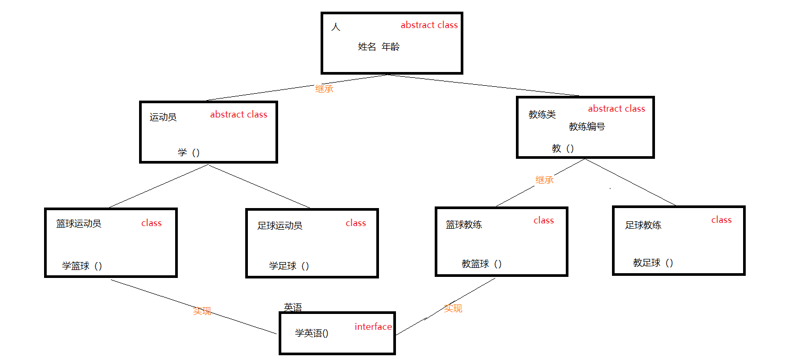

# 第一章 接口(必须掌握)

## 1.1 概述

接口，是Java语言中一种引用类型，是方法的集合，如果说类的内部封装了成员变量、构造方法和成员方法，那么接口的内部主要就是**封装了方法**，包含抽象方法（JDK 7及以前），默认方法和静态方法（JDK 8）。

接口的定义，它与定义类方式相似，但是使用 `interface` 关键字。它也会被编译成.class文件，但一定要明确它并不是类，而是另外一种引用数据类型。

public class 类名.java-->.class

public interface 接口名.java-->.class

> 引用数据类型：数组，类，接口。

接口的使用，它不能创建对象，但是可以被实现（`implements` ，类似于被继承）。一个实现接口的类（可以看做是接口的子类），需要实现接口中所有的抽象方法，创建该类对象，就可以调用方法了，否则它必须是一个抽象类。


## 1.2 定义格式

```java
public interface 接口名称 {
    // 抽象方法
    // 默认方法
    // 静态方法
}
```

### 含有抽象方法

抽象方法：使用`abstract` 关键字修饰，可以省略，没有方法体。该方法供子类实现使用。

代码如下：

```java
public interface InterFaceName {
    public abstract void method();
}
```

### 含有默认方法和静态方法

默认方法：使用 `default` 修饰，不可省略，供子类调用或者子类重写。

静态方法：使用 `static` 修饰，供接口直接调用。

代码如下：

```java
public interface InterFaceName {
    public default void method() {
        // 执行语句
    }
    public static void method2() {
        // 执行语句    
    }
}
```

> 小结：定义接口时就是将定义类的class改成了interface，并且接口中的内容也有了一些变化。


## 1.3 基本的实现

### 实现的概述

类与接口的关系为实现关系，即**类实现接口**，该类可以称为接口的实现类，也可以称为接口的子类。实现的动作类似继承，格式相仿，只是关键字不同，实现使用 ` implements`关键字。

非抽象子类实现接口：

1. 必须重写接口中所有抽象方法。
2. 继承了接口的默认方法，即可以直接调用，也可以重写。

实现格式：

```java
class 类名 implements 接口名 {
    // 重写接口中抽象方法【必须】
  	// 重写接口中默认方法【可选】
} 
```

### 抽象方法的使用

必须全部实现，代码如下：

定义接口：

```java
public interface LiveAble {
    // 定义抽象方法
    public abstract void eat();
    public abstract void sleep();
}
```

定义实现类：

```java
public class Animal implements LiveAble {
    @Override
    public void eat() {
        System.out.println("吃东西");
    }

    @Override
    public void sleep() {
        System.out.println("晚上睡");
    }
}
```

定义测试类：

```java
public class InterfaceDemo {
    public static void main(String[] args) {
        // 创建子类对象  
        Animal a = new Animal();
        // 调用实现后的方法
        a.eat();
        a.sleep();
    }
}
输出结果：
吃东西
晚上睡
```

### 默认方法的使用

可以继承，可以重写，二选一，但是只能通过实现类的对象来调用。

1. 继承默认方法，代码如下：

定义接口：

```java
public interface LiveAble {
    public default void fly(){
        System.out.println("天上飞");
    }
}
```

定义实现类：

```java
public class Animal implements LiveAble {
	// 继承，什么都不用写，直接调用
}
```

定义测试类：

```java
public class InterfaceDemo {
    public static void main(String[] args) {
        // 创建子类对象  
        Animal a = new Animal();
        // 调用默认方法
        a.fly();
    }
}
输出结果：
天上飞
```

1. 重写默认方法，代码如下：

定义接口：

```java
public interface LiveAble {
    public default void fly(){
        System.out.println("天上飞");
    }
}
```

定义实现类：

```java
public class Animal implements LiveAble {
    @Override
    public void fly() {
        System.out.println("自由自在的飞");
    }
}
```

定义测试类：

```java
public class InterfaceDemo {
    public static void main(String[] args) {
        // 创建子类对象  
        Animal a = new Animal();
        // 调用重写方法
        a.fly();
    }
}
输出结果：
自由自在的飞
```

### 静态方法的使用

静态与.class 文件相关，只能使用接口名调用，不可以通过实现类的类名或者实现类的对象调用，代码如下：

定义接口：

```java
public interface LiveAble {
    public static void run(){
        System.out.println("跑起来~~~");
    }
}
```

定义实现类：

```java
public class Animal implements LiveAble {
	// 无法重写静态方法
}
```

定义测试类：

```java
public class InterfaceDemo {
    public static void main(String[] args) {
        // Animal.run(); // 【错误】无法继承方法,也无法调用
        LiveAble.run(); // 
    }
}
输出结果：
跑起来~~~
```

> 小结： 类实现接口使用的是implements关键字，并且一个普通类实现接口，必须要重写接口中的所有的抽象方法


## 1.4 接口的多实现

之前学过，在继承体系中，一个类只能继承一个父类。而对于接口而言，一个类是可以实现多个接口的，这叫做接口的**多实现**。并且，一个类能继承一个父类，同时实现多个接口。

实现格式：

```java
class 类名 [extends 父类名] implements 接口名1,接口名2,接口名3... {
    // 重写接口中抽象方法【必须】
  	// 重写接口中默认方法【不重名时可选】
} 
```

> [ ]： 表示可选操作。

### 抽象方法

接口中，有多个抽象方法时，实现类必须重写所有抽象方法**。如果抽象方法有重名的，只需要重写一次。**代码如下：

定义多个接口：

```java
interface A {
    public abstract void showA();
    public abstract void show();
}

interface B {
    public abstract void showB();
    public abstract void show();
}
```

定义实现类：

```java
public class C implements A,B{
    @Override
    public void showA() {
        System.out.println("showA");
    }

    @Override
    public void showB() {
        System.out.println("showB");
    }

    @Override
    public void show() {
        System.out.println("show");
    }
}
```

### 默认方法

接口中，有多个默认方法时，实现类都可继承使用。**如果默认方法有重名的，必须重写一次。**代码如下：

定义多个接口：

```java
interface A {
    public default void methodA(){}
    public default void method(){}
}

interface B {
    public default void methodB(){}
    public default void method(){}
}
```

定义实现类：

```java
public class C implements A,B{
    @Override
    public void method() {
        System.out.println("method");
    }
}
```

### 静态方法

接口中，存在同名的静态方法并不会冲突，原因是只能通过各自接口名访问静态方法。

### 优先级的问题

当一个类，既继承一个父类，又实现若干个接口时，父类中的成员方法与接口中的默认方法重名，子类就近选择执行父类的成员方法。代码如下：

定义接口：

```java
interface A {
    public default void methodA(){
        System.out.println("AAAAAAAAAAAA");
    }
}
```

定义父类：

```java
class D {
    public void methodA(){
        System.out.println("DDDDDDDDDDDD");
    }
}
```

定义子类：

```java
class C extends D implements A {
  	// 未重写methodA方法
}
```

定义测试类：

```java
public class Test {
    public static void main(String[] args) {
        C c = new C();
        c.methodA(); 
    }
}
输出结果:
DDDDDDDDDDDD
```

> 小结： 一个类可以实现多个接口，多个接口之间使用逗号隔开即可。


## 1.5 接口的多继承【理解】

一个接口能继承另一个或者多个接口，这和类之间的继承比较相似。接口的继承使用 `extends` 关键字，子接口继承父接口的方法。**如果父接口中的默认方法有重名的，那么子接口需要重写一次。**代码如下：

定义父接口：

```java
interface A {
    public default void method(){
        System.out.println("AAAAAAAAAAAAAAAAAAA");
    }
}

interface B {
    public default void method(){
        System.out.println("BBBBBBBBBBBBBBBBBBB");
    }
}
```

定义子接口：

```java
interface D extends A,B{
    @Override
    public default void method() {
        System.out.println("DDDDDDDDDDDDDD");
    }
}
```

> 小贴士：
>
> 子接口重写默认方法时，default关键字可以保留。
>
> 子类重写默认方法时，default关键字不可以保留。

> 小结：接口和接口之间是继承的关系，而不是实现。一个接口可以继承多个接口。


## 1.6 其他成员特点

- 接口中，无法定义成员变量，但是可以定义常量，其值不可以改变，默认使用public static final修饰。
- 接口中，没有构造方法，不能创建对象。
- 接口中，没有静态代码块。

## 1.7接口和抽象类

```
抽象类：
	本质是一个类class
	抽象类有构造方法，抽象类我们不能创建对象
	可以有抽象方法
接口：
	本质是一个interface
	接口没有构造方法，也不能创建对象
	方法不加修饰符，自动就是抽象方法
	
接口的作用：
	弥补了单继承的问题，因为接口可以同时实现多个
	
共同点：
	接口和抽象类都要有子类。
```


## 1.8抽象类和接口的综合案例

- 案例图：

  

- 用到的知识点：

  ​           类、抽象类、接口、继承、实现


- 代码实现：

  ```java
  //人类
  public abstract class Person {
      //姓名
      String name;
      //年龄
      int age;
  
      //构造方法
      public Person() {
      }
  
      public Person(String name, int age) {
          this.name = name;
          this.age = age;
      }
  }
  ```

```java
//运动员类
public abstract class Athlete extends Person {

    //提供自己的构造方法
    public Athlete() {
        //super();
    }

    public Athlete(String name, int age) {
        super(name, age);
    }

    //学习
    public abstract void study();
}
```

```java
//教练类
public abstract class Coach extends Person {
    //编号
    String id;
    //空参构造
    public Coach() {
    }

    //有参构造
    public Coach(String name, int age, String id) {
        //姓名和年龄赋值给父类
        super(name, age);
        //编号赋值给自己的成员变量
        this.id = id;
    }
    
    //教学
    //父类中不知道到底教啥 定义成抽象方法  在子类中自己重写
    public abstract void teach();
}
```

```java
//篮球运动员
public class BasketAthlete extends Athlete implements English{

    //构造方法

    public BasketAthlete() {
    }

    public BasketAthlete(String name, int age) {
        super(name, age);
    }

    @Override
    public void study() {
        System.out.println(age +"岁的篮球运动员"+name + "在打篮球");
    }

    @Override
    public void speakEnglish() {
        System.out.println("篮球运动员出国说英语");
    }
}
```

```java
//篮球教练
public class BasketCoach extends Coach implements English{
    //构造方法
    public BasketCoach() {
    }

    public BasketCoach(String name, int age, String id) {
        super(name, age, id);
    }

    @Override
    public void teach() {
        System.out.println("编号为" + id + "年龄为" + age + "姓名叫" + name + "的篮球教练教扣篮");
    }

    @Override
    public void speakEnglish() {
        System.out.println("篮球教练出国说英语");
    }
}
```

```java
public class FootAthlete extends Athlete {
    //构造方法

    public FootAthlete() {
    }

    public FootAthlete(String name, int age) {
        super(name, age);
    }

    @Override
    public void study() {
        System.out.println(age + "岁的足球运动员" + name + "在踢足球");
    }
}
```

```java
//足球教练
public class FootCoath extends Coach {
    //构造方法

    public FootCoath() {
    }

    public FootCoath(String name, int age, String id) {
        super(name, age, id);
    }

    @Override
    public void teach() {
        System.out.println("编号为" + id + "年龄为" + age + "姓名叫" + name + "的足球教练教射门");
    }
}
```

```java
//接口
public interface English {
    //学英语（抽象方法）
    void speakEnglish();
}
```

```java
public class Demo测试类 {
    public static void main(String[] args) {
        //足球教练
        FootCoath fc = new FootCoath("柳岩",20,"001");
        //调用方法
        fc.teach();


        System.out.println("--------------");
        //篮球运动员
        BasketAthlete ba = new BasketAthlete("蔡徐坤",35);
        ba.study();
        ba.speakEnglish();
    }
} 
```


> ​	讲完抽象类和接口后,相信有许多同学会存有疑惑,两者的共性那么多,只留其中一种不就行了,这里就得知道抽象类和接口从根本上解决了哪些问题.
>
> ​	一个类只能继承一个直接父类(可能是抽象类),却可以实现多个接口, 接口弥补了Java的单继承
>
> ​	抽象类为继承体系中的共性内容, 接口为继承体系中的扩展功能
>
> ​	接口还是后面一个知识点的基础(lambada)


# 第二章 多态(必须掌握)

## 2.1 概述

### 引入

面向对象语言三大特征：**封装(private)、继承(extends)、多态。**

**多态：表示的是一个事物的多种表现形态。同一个事物，以不同的形态表现出来.**

多态来源于生活，在生活中我们经常会对某一类事物使用它的共性统称来表示某个具体的事物，这时这个具体的事物就以其他的形式展示出来。

苹果：说苹果，说水果。

狗：说狗，说动物。

猫：说猫，说动物。


### 前提【重点】

1. 继承(extends)或者实现(implements)【二选一】
2. 方法的重写【意义体现：不重写，无意义】
3. 父类引用指向子类对象【格式体现】


## 2.2 多态的体现

多态体现的格式：

```java
父类类型 变量名 = new 子类对象；
变量名.方法名();
```

> 父类类型：指子类对象继承的父类类型，或者实现的父接口类型。

代码如下：

```java
Fu f = new Zi();
f.method();
```

**当使用多态方式调用方法时，首先检查父类中是否有该方法，如果没有，则编译错误；如果有，执行的是子类重写后方法。**

代码如下：

定义父类：

```java
public abstract class Animal {  
    public abstract void eat();  
}  
```

定义子类：

```java
class Cat extends Animal {  
    public void eat() {  
        System.out.println("吃鱼");  
    }  
}  

class Dog extends Animal {  
    public void eat() {  
        System.out.println("吃骨头");  
    }  
}
```

定义测试类：

```java
public class Test {
    public static void main(String[] args) {
        // 多态形式，创建对象
        Animal a1 = new Cat();  
        // 调用的是 Cat 的 eat
        a1.eat();          

        // 多态形式，创建对象
        Animal a2 = new Dog(); 
        // 调用的是 Dog 的 eat
        a2.eat();               
    }  
}
```

> 多态在代码中的体现为父类引用指向子类对象。


## 2.3 多态的好处

实际开发的过程中，父类类型作为方法形式参数，传递子类对象给方法，进行方法的调用，更能体现出多态的扩展性与便利。代码如下：

定义父类：

```java
public abstract class Animal {  
    public abstract void eat();  
}  
```

定义子类：

```java
class Cat extends Animal {  
    public void eat() {  
        System.out.println("吃鱼");  
    }  
}  

class Dog extends Animal {  
    public void eat() {  
        System.out.println("吃骨头");  
    }  
}
```

定义测试类：

```java
public class Test {
    public static void main(String[] args) {
        // 多态形式，创建对象
        Cat c = new Cat();  
        Dog d = new Dog(); 

        // 调用showCatEat 
        showCatEat(c);
        // 调用showDogEat 
        showDogEat(d); 

        /*
        以上两个方法, 均可以被showAnimalEat(Animal a)方法所替代
        而执行效果一致
        */
        showAnimalEat(c);
        showAnimalEat(d); 
    }

    public static void showCatEat (Cat c){
        c.eat(); 
    }

    public static void showDogEat (Dog d){
        d.eat();
    }

    public static void showAnimalEat (Animal a){
        a.eat();
    }
}
```

由于多态特性的支持，showAnimalEat方法的Animal类型，是Cat和Dog的父类类型，父类类型接收子类对象，当然可以把Cat对象和Dog对象，传递给方法。

当eat方法执行时，多态规定，执行的是子类重写的方法，那么效果自然与showCatEat、showDogEat方法一致，所以showAnimalEat完全可以替代以上两方法。

不仅仅是替代，在扩展性方面，无论之后再多的子类出现，我们都不需要编写showXxxEat方法了，直接使用showAnimalEat都可以完成。

所以，多态的好处，体现在，可以使程序编写的更简单，并有良好的扩展。

> 小结：多态的好处是提高程序的灵活性，扩展性


## 2.4 引用类型转换

多态的转型分为向上转型与向下转型两种：

### 向上转型

- **向上转型**：多态本身是子类类型向父类类型向上转换的过程，这个过程是默认的。

当父类引用指向一个子类对象时，便是向上转型。

使用格式：

```java
父类类型  变量名 = new 子类类型();
如：Animal a = new Cat();
```

### 向下转型

- **向下转型**：父类类型向子类类型向下转换的过程，这个过程是强制的。

一个已经向上转型的子类对象，将父类引用转为子类引用，可以使用强制类型转换的格式，便是向下转型。

使用格式：

```java
子类类型 变量名 = (子类类型) 父类变量名;
如:Cat c =(Cat) a;  
```

### 为什么要转型

当使用多态方式调用方法时，首先检查父类中是否有该方法，如果没有，则编译错误。也就是说，**不能调用**子类有而父类没有的方法。编译都错误，更别说运行了。这也是多态给我们带来的一点"小麻烦"。所以，想要调用子类特有的方法，必须做向下转型。

转型演示，代码如下：

定义类：

```java
abstract class Animal {  
    abstract void eat();  
}  

class Cat extends Animal {  
    public void eat() {  
        System.out.println("吃鱼");  
    }  
    public void catchMouse() {  
        System.out.println("抓老鼠");  
    }  
}  

class Dog extends Animal {  
    public void eat() {  
        System.out.println("吃骨头");  
    }  
    public void watchHouse() {  
        System.out.println("看家");  
    }  
}
```

定义测试类：

```java
public class Test {
    public static void main(String[] args) {
        // 向上转型  
        Animal a = new Cat();  
        a.eat(); 				// 调用的是 Cat 的 eat

        // 向下转型  
        Cat c = (Cat)a;       
        c.catchMouse(); 		// 调用的是 Cat 的 catchMouse
    }  
}
```

### 转型的异常

转型的过程中，一不小心就会遇到这样的问题，请看如下代码：

```java
public class Test {
    public static void main(String[] args) {
        // 向上转型  
        Animal a = new Cat();  
        a.eat();               // 调用的是 Cat 的 eat

        // 向下转型  
        Dog d = (Dog)a;       
        d.watchHouse();        // 调用的是 Dog 的 watchHouse 【运行报错】
    }  
}
```

这段代码可以通过编译，但是运行时，却报出了 `ClassCastException` ，类型转换异常！这是因为，明明创建了Cat类型对象，运行时，当然不能转换成Dog对象的。这两个类型并没有任何继承关系，不符合类型转换的定义。

为了避免ClassCastException的发生，Java提供了 `instanceof` 关键字，给引用变量做类型的校验，格式如下：

```java
变量名 instanceof 数据类型 
如果变量属于该数据类型，返回true。
如果变量不属于该数据类型，返回false。
```

所以，转换前，我们最好先做一个判断，代码如下：

```java
public class Test {
    public static void main(String[] args) {
        // 向上转型  
        Animal a = new Cat();  
        a.eat();               // 调用的是 Cat 的 eat

        // 向下转型  
        if (a instanceof Cat){
            Cat c = (Cat)a;       
            c.catchMouse();        // 调用的是 Cat 的 catchMouse
        } else if (a instanceof Dog){
            Dog d = (Dog)a;       
            d.watchHouse();       // 调用的是 Dog 的 watchHouse
        }
    }  
}
```

> 小结：多态向上转型是将子类类型转成父类类型，多态向下转型是将父类类型转成子类类型。

## 2.5笔记本案例

- 案例目的：接口也可以体现多态

- 案例代码：

  USB接口：

  ```java
  /*
   * 定义一个USB接口
   */
  public interface USB {
  	public void open();
  	public void close();
  }
  ```

  鼠标类：

  ```java
  /*
   * 定义一个鼠标类
   */
  public class Mouse implements USB{
  	//行为：开启
  	public void open()
  	{
  		System.out.println("mouse open....");
  	}
  	//行为：关闭
  	public void close()
  	{
  		System.out.println("mouse close....");
  	}
  }
  ```

  键盘类：

  ```java
  /*
   * 定义一个键盘类
   */
  public class Keyboard implements USB{
  	// 行为：开启
  	public void open() {
  		System.out.println("keyboard open....");
  	}
  	// 行为：关闭
  	public void close() {
  		System.out.println("keyboard close....");
  	}
  }
  ```

  电脑类：

  ```java
  /*
   * 描述电脑类
   */
  public class Computer {
  	//属性
  	//行为
  	public void run()
  	{
  		System.out.println("computer run....");
  	}
  	//给电脑外围设备提供预留的功能，该功能要遵守USB接口的规则
  	public void useUSB(USB u)//USB u=m
  	{
  		if(u!=null)
  		{
  			u.open();
  			u.close();
  		}
  	}
  }
  ```

  测试类：

  ```java
  public class ComputerTest {
  	public static void main(String[] args) {
  		// 创建笔记本电脑类的对象
  		Computer c = new Computer();
  		c.run();
  		Mouse m = new Mouse();
  		//电脑使用鼠标
  		c.useUSB(m);
  		Keyboard k = new Keyboard();
  //		//电脑使用键盘
  		c.useUSB(k);
  	}
  }
  ```

  **总结**:发现接口的出现:

  1、 扩展了笔记本电脑的功能.

  2、 定义了规则.

  3、降低了笔记本电脑和外围设备之间的耦合性.  `解耦`