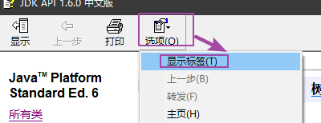
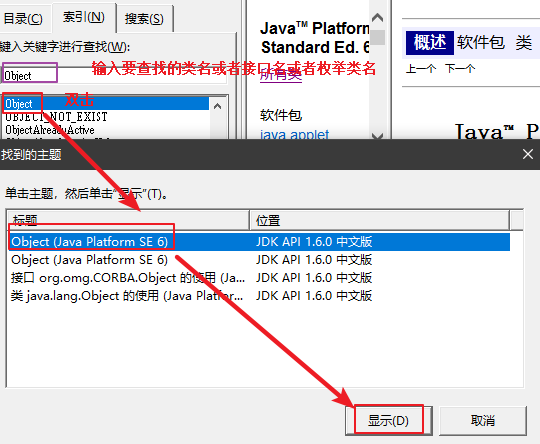
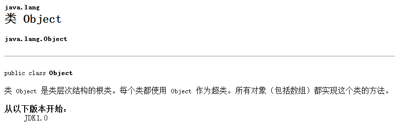
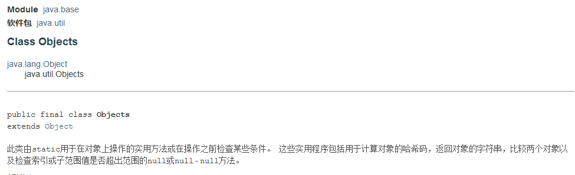
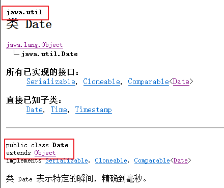
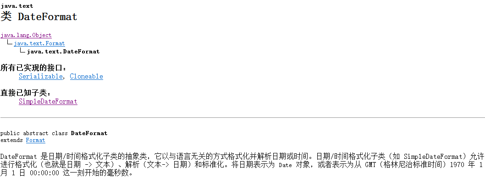
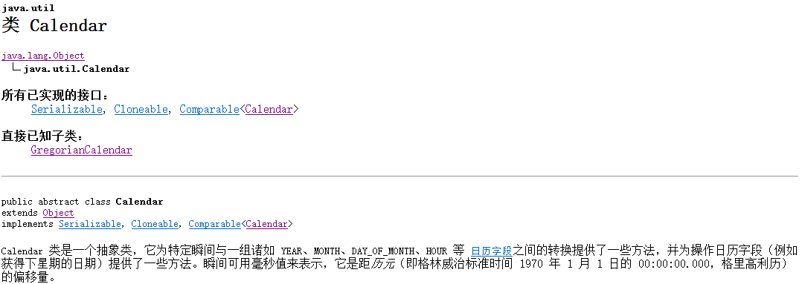
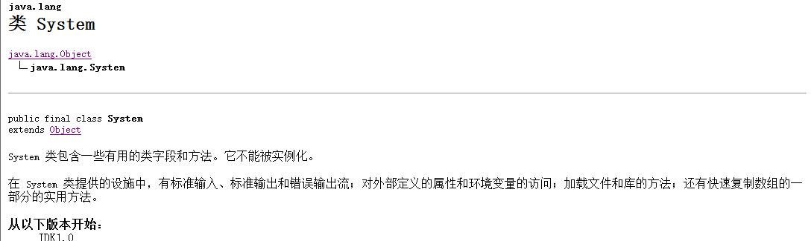

# 1.Object类(掌握)

## 1.如何使用API

1)

2)

## 2.Object类的介绍

1）Object类位于java.lang包下的，使用的时候不需要导包

2）Object类是所有的父类，包括数组都可以使用Object类的方法

## 3.Object类的方法(必须掌握)

~~~java
1.String toString() 返回该对象的字符串表示。    
2.boolean equals(Object obj) 指示其他某个对象是否与此对象“相等”。
~~~

### 3.1toString

~~~java
1.String toString() 返回该对象的字符串表示。  
~~~

~~~java
package com.itheima.sh.a_object_01;

public class Student {
    //成员位置
    //成员变量
    private String name;
    private int age;
    //成员方法

    public String getName() {
        return name;
    }

    public void setName(String name) {
        this.name = name;
    }

    public int getAge() {
        return age;
    }

    public void setAge(int age) {
        this.age = age;
    }

    //重写Object类的toString方法

    @Override
    public String toString() {
        return "Student{" +
                "name='" + name + '\'' +
                ", age=" + age +
                '}';
    }

    //构造方法
    public Student(String name, int age) {
        this.name = name;
        this.age = age;
    }

    //构造代码块
    //成员内部类
    //静态代码块
}

package com.itheima.sh.a_object_01;

public class StudentTest01 {
    public static void main(String[] args) {
        //创建学生对象
        Student s = new Student("班长",26);
        //输出对象s
        /*
            1.打印结果：com.itheima.sh.a_object_01.Student@1540e19d
            说明：
            能够输出s打印上述内容原因是在底层调用了Object类的toString方法：
             public String toString() {
                return getClass().getName() + "@" + Integer.toHexString(hashCode());
            }
            1)getClass().getName() :获取当前对象所属类的全名(包名.类名)：
                 com.itheima.sh.a_object_01.Student
            2）@ :就是一个固定的字符串
            3）Integer.toHexString(hashCode())：hashCode()表示根据对象s调用hashCode方法
            生成的哈希码值，就是一个过大的整数，然后将过大的整数通过
            Integer.toHexString()转换为十六进制

            2.我们在实际开发中通过打印对象不希望输出对象地址值，我们希望快速输出对象的内容即对象的成员变量值
             我们发现这里默认调用的是Object类的toString方法，而作为父类Object类的方法体不是我们想要的
             我们需要在子类Student中重写toString方法
                重写快捷键：alt+insert
         */
        //重写之后的：Student{name='班长', age=26}
        System.out.println(s.toString());//这里调用和不调用toString方法都是执行Object类的toString
    }
}

~~~

小结：

1.以后我们可以在自定义类中重写toString方法可以快速打印对象的成员变量值，这样就不会打印地址值。

2.非自定义String Integer Date 都已经重写了toString

### 3.2equals方法

~~~java
2.boolean equals(Object obj) 指示其他某个对象是否与此对象“相等”。
    	参数：obj:指示其他某个对象
         此对象 表示equals方法调用者，这里存在隐式变量this记录着调用者对象的地址值
~~~

~~~java
package com.itheima.sh.a_object_01;

import java.util.Objects;

public class Student {
    //成员位置
    //成员变量
    private String name;
    private int age;
    //成员方法

    public String getName() {
        return name;
    }

    public void setName(String name) {
        this.name = name;
    }

    public int getAge() {
        return age;
    }

    public void setAge(int age) {
        this.age = age;
    }

    //重写Object类的toString方法
    @Override
    public String toString() {
        return "Student{" +
                "name='" + name + '\'' +
                ", age=" + age +
                '}';
    }
    //重写Object类的equals方法
    /*
        this:调用者对象 s1
        o:传入的对象s2
     */
    @Override
    public boolean equals(Object o) {
        /*
            比较this即s1和o即s2的地址值是否相等，如果地址值相等直接返回true
         */
        if (this == o) return true;
        /*
            如果执行到这里，说明两个对象地址值肯定不相等
            1.o == null 判断参数o即s2是否等于null，如果等于null那么||直接结束
            直接返回false
            2.如果o不等于null，||前面是false，继续向后判断
                getClass() != o.getClass()
                getClass()其实这里是this.getClass()即调用者s1对象的类名Student
                o.getClass():即s2.getClass()获取s2所属类Student
                这里s1和s2都是Student类，属于同一个类
                getClass() != o.getClass() 这里结果是false
                最后这里不会执行return false
         */
        if (o == null || getClass() != o.getClass()) return false;
        /*
            执行到这里说明this和o表示的类一定是同一个类
            1.Student student = (Student) o; 将参数o的object类型强制转换为Student类型
         */
        Student student = (Student) o;
        /*
            1.age == student.age ===>this.age == student.age===> s1.age == s2.age
            2.Objects.equals(name, student.name);使用Objects工具类，是jdk7添加的，防止空指针异常
                    比较s1的name和s2的name属性值是否相等
                    相等返回true，否则返回false
         */
        return age == student.age &&
                Objects.equals(name, student.name);
    }
/*
    @Override
    public int hashCode() {

        return Objects.hash(name, age);
    }*/

    //构造方法
    public Student(String name, int age) {
        this.name = name;
        this.age = age;
    }

    //构造代码块
    //成员内部类
    //静态代码块
}

package com.itheima.sh.a_object_01;
/*
    1.查找源码快捷键：ctrl+N
    2.查看某个类的成员结构：alt+7
 */
public class StudentTest02 {
    public static void main(String[] args) {
        //需求：比较两个学生对象是否是同一个人(姓名和年龄都相等)
        //1.创建学生对象
        Student s1 = new Student("班长", 18);
        Student s2 = new Student("班长", 18);
        //2.使用对象s1调用Student类的方法判断s1和s2是否相等
        /*
            1.我们发现使用Object类的equals方法比较两个对象，即使对象成员变量值相等，返回的也是false，原因是Object类的方法体如下：
                     public boolean equals(Object obj) {
                        //this 记录着调用equals方法的对象地址值即s1
                        //obj接收传递的对象s2的地址值
                        //这里在比较s1和s2的地址值，所以永远是false，我们希望比较对象内容，所以在子类Student中重写equals方法
                        return (this == obj);
                     }
            2.这里在比较s1和s2的地址值，所以永远是false，我们希望比较对象内容，所以在子类Student中重写equals方法
                重写方法快捷键：alt+insert
         */
        boolean boo = s1.equals(s2);
        System.out.println("boo = " + boo);
    }
}

~~~

小结：

1.以后在开发中只要比较基本数据类型使用 ==

 2.比较引用数据类型使用equals方法，比较对象内容，不是比较地址值。如果是自定义类Student必须重写equals方法，非自定义String不用重写，因为已经重写好了

### 3.3native本地方法(了解)

native属于一个关键字，表示本地的意思。用来修饰方法的，表示本地的方法，该方法体我们是看不到的，因为底层使用的是c或者c++编写。

Object类的hashCode方法：

~~~java
   public native int hashCode();
~~~

# 2.Objects类(了解)

1.Objects表示工具类，属于java.util包下的，需要导包

2.是jdk7后才有的，主要防止空指针异常的

~~~java
package com.itheima.sh.b_objects_02;

import java.util.Objects;

/*
    工具类特点：
        1.都位于util包
        2.构造方法都是私有的 不让创建对象
        3.方法全部是静态的，直接使用工具类名调用
 */
public class ObjectsDemo01 {
    public static void main(String[] args) {
        //1.创建字符串对象
        String s1 = "abc";
        String s2 = null;
        //判断s1和s2是否相等
//        boolean boo = s1.equals(s2);
        //使用Objects工具类中的static boolean equals​(Object a, Object b) 返回 true如果参数相等，彼此 false否则。
        /*
             public static boolean equals(Object a, Object b) {
                1.a == b 如果相等，直接返回true，不相等继续向后比较
                2.a != null 如果a等于null，整体是false，返回false
                3.a.equals(b) 如果能够执行该代码说明a不等于null继续比较a和b内容
                return (a == b) || (a != null && a.equals(b));
            }
         */
        boolean boo = Objects.equals(s1, s2);
        System.out.println("boo = " + boo);

    }
}

~~~

# 3.Date类(掌握)

## 1.介绍

1.Date类属于java.util包下的，使用需要导包

2.表示系统时间日期

3.在 JDK 1.1 之前，类 `Date`  有两个其他的函数。它允许把日期解释为年、月、日、小时、分钟和秒值。它也允许格式化和解析日期字符串。不过，这些函数的 API 不易于实现国际化。从 JDK 1.1  开始，应该使用 `Calendar` 类实现日期和时间字段之间转换，使用 `DateFormat`  类来格式化和解析日期字符串。**`Date` 中的相应方法已废弃。** 

## 2.构造方法

~~~java
1.Date() 获取当前系统时间
2.Date(long date) 根据参数的毫秒获取Date日期时间对象       
~~~

~~~java
package com.itheima.sh.c_date_03;
import java.util.Date;
/*
    构造方法：
        1.Date() 获取当前系统时间
        2.Date(long date) 根据参数的毫秒获取Date日期时间对象
 */
public class DateDemo01 {
    public static void main(String[] args) {
        //1.Date() 获取当前系统时间
        Date d1 = new Date();
        //Sun Jul 12 10:02:10 GMT+08:00 2020
        System.out.println(d1);

        //2.Date(long date) 根据参数的毫秒获取Date日期时间对象
        Date d2 = new Date(4827281945181L);
        //d2 = Mon Dec 21 15:39:05 GMT+08:00 2122
        System.out.println("d2 = " + d2);
    }
}

~~~

## 3.方法

~~~java
1. long getTime()  返回自 1970 年 1 月 1 日 00:00:00 GMT 以来此 Date 对象表示的毫秒数。 
2. void setTime(long time) 根据参数毫秒修改当前Date表示时间
~~~

~~~java
package com.itheima.sh.c_date_03;

import java.util.Date;

/*
    方法：
        1. long getTime()  返回自 1970 年 1 月 1 日 00:00:00 GMT 以来此 Date 对象表示的毫秒数。
        2. void setTime(long time) 根据参数毫秒修改当前Date表示时间
 */
public class DateDemo02 {
    public static void main(String[] args) {
       //创建时间对象
        Date d1 = new Date();
        System.out.println("d1 = " + d1);//d1 = Sun Jul 12 10:09:15 GMT+08:00 2020
        //1. long getTime()  返回自 1970 年 1 月 1 日 00:00:00 GMT 以来此 Date 对象表示的毫秒数。
        long time = d1.getTime();//将d1转换为毫秒
        System.out.println("time = " + time);//time = 1594519755702

        //创建Date对象 将毫秒转换为date
        Date d2 = new Date(time);
        //d2 = Sun Jul 12 10:09:15 GMT+08:00 2020
        System.out.println("d2 = " + d2);

        //2. void setTime(long time) 根据参数毫秒修改当前Date表示时间
        //修改d1表示的时间
        d1.setTime(492382829299L);
        System.out.println("d1 = " + d1);
    }
}

~~~

小结：

1.构造方法：

~~~java
1.Date() 获取当前系统时间
2.Date(long date) 根据参数的毫秒获取Date日期时间对象
~~~

2.方法：

~~~java
 1.long getTime()  返回自 1970 年 1 月 1 日 00:00:00 GMT 以来此 Date 对象表示的毫秒数。
 2. void setTime(long time) 根据参数毫秒修改当前Date表示时间
~~~

# 4.DateFormat类(掌握)

## 1.介绍

1.DateFormat类位于java.text包下的，需要导包

2.DateFormat 是日期/时间格式化子类的抽象类，可以实现日期的格式化和解析

~~~java
格式化：也就是日期 -> 文本(字符串)  就是将我们看不懂的时间转换为我们看的懂的时间
    Sun Jul 12 10:09:15 GMT+08:00 2020 ---》 "2020年07月12日  10:09:15"
解析：解析（文本-> 日期） 就是将我们看的懂的时间转换为我们看不懂的，计算机看的懂
    "2020年07月12日  10:09:15" ----》 Sun Jul 12 10:09:15 GMT+08:00 2020
~~~

3.DateFormat 属于抽象类，不能创建对象，使用子类SimpleDateFormat创建对象

| 标识字母（区分大小写） | 含义 |
| ---------------------- | ---- |
| y year                 | 年   |
| M month                | 月   |
| d day                  | 日   |
| H hour                 | 时   |
| m minute               | 分   |
| s second               | 秒   |

子类构造方法：

~~~java
SimpleDateFormat(String pattern) 用给定的模式和默认语言环境的日期格式符号构造 SimpleDateFormat。
    参数：pattern属于一个字符串，创建对象时需要我们指定日期格式：举例："yyyy年MM月dd日 HH:mm:ss"或者
    "yyyy-MM-dd HH:mm:ss" 等
    这里的参数日期格式不固定。可以随便指定
    	
~~~

4.方法：

~~~java
1)格式化方法：
 也就是日期 -> 文本(字符串) Sun Jul 12 10:09:15 GMT+08:00 2020 ---》 "2020年07月12日  10:09:15"
     String format(Date date) 将一个 Date 格式化为日期/时间字符串。 
 
2）解析方法：解析（文本-> 日期）
  "2020年07月12日  10:09:15" ----》 Sun Jul 12 10:09:15 GMT+08:00 2020  
     Date parse(String source) 从给定字符串的开始解析文本，以生成一个日期。 
~~~

代码演示：

~~~java
package com.itheima.sh.d_dateformat_04;

import java.text.DateFormat;
import java.text.ParseException;
import java.text.SimpleDateFormat;
import java.util.Date;

/*
    DateFormat时间格式化解析类介绍：

    补充：抽取方法快捷键：ctrl+alt+M
 */
public class DateFormatDemo01 {
    public static void main(String[] args) throws ParseException {
        method_2();

    }
    //将日期字符串解析为Date格式
    private static void method_2() throws ParseException {
        //1.创建时间格式化解析类对象，
        SimpleDateFormat sdf = new SimpleDateFormat("yyyy-MM-dd HH:mm:ss");
        //2.创建一个字符串保存时间
        String time = "2020/10-10 10:33:30";
        //3.使用对象sdf调用解析方法将time字符串的时间解析为Date格式
        //  Date parse(String source) 从给定字符串的开始解析文本，以生成一个日期。
        /*
            在parse底层会判断字符串的日期格式是否满足创建对象的构造方法中的日期格式，如果不满足就会报解析异常：
            java.text.ParseException
         */
        Date date = sdf.parse(time);//在报错位置按alt+enter即可
        //date = Sat Oct 10 10:33:30 GMT+08:00 2020
        System.out.println("date = " + date);
    }

    private static void method_1() {
        //1.创建时间格式化解析类对象，
        // 使用子类SimpleDateFormat(String pattern) 用给定的模式和默认语言环境的日期格式符号构造 SimpleDateFormat。
        DateFormat df = new SimpleDateFormat("yyyy年MM月dd日 HH:mm:ss");
        //2.创建Date对象获取当前系统时间
        Date date = new Date();
        System.out.println("date = " + date);
        //3.使用df调用格式化方法将date日期进行格式化String format(Date date) 将一个 Date 格式化为日期/时间字符串。
        String s = df.format(date);
        System.out.println("s = " + s);
    }
}

~~~

小结：

1.DateFormat属于抽象类，不能创建对象，使用子类SimpleDateFormat创建对象

~~~java
SimpleDateFormat(String pattern) 用给定的模式和默认语言环境的日期格式符号构造 SimpleDateFormat。
    参数：pattern属于一个字符串，创建对象时需要我们指定日期格式：举例："yyyy年MM月dd日 HH:mm:ss"或者
    "yyyy-MM-dd HH:mm:ss" 等
    这里的参数日期格式不固定。可以随便指定
~~~

2.格式化方法：

~~~java
1)格式化方法：
 也就是日期 -> 文本(字符串) Sun Jul 12 10:09:15 GMT+08:00 2020 ---》 "2020年07月12日  10:09:15"
     String format(Date date) 将一个 Date 格式化为日期/时间字符串。 
 

~~~

3.解析方法：

~~~java
2）解析方法：解析（文本-> 日期）
  "2020年07月12日  10:09:15" ----》 Sun Jul 12 10:09:15 GMT+08:00 2020  
     Date parse(String source) 从给定字符串的开始解析文本，以生成一个日期。 
~~~

## 2.练习(课下必须完成)

### 2.1练习一：字符串日期的格式转化

键盘输入一个日期：2008年8月8日
需求：变成"2008/8/8"的格式

~~~java
package com.itheima.sh.d_dateformat_04;

import java.text.ParseException;
import java.text.SimpleDateFormat;
import java.util.Date;
import java.util.Scanner;

/*
    键盘输入一个日期：2008年08月08日 需求：变成"2008/08/08"的格式
    "2008年8月8日" --- 解析 Date---格式化"2008/8/8"
    步骤：
    1.创建键盘录入的对象
    2.获取键盘录入的数据
    3.创建时间日期格式化解析类对象  SimpleDateFormat sdf = SimpleDateFormat("yyyy年MM月dd日");
    4.使用对象sdf调用解析方法Date parse(String s) 对录入的字符串进行解析
    5.再次创建时间日期格式化解析类对象  SimpleDateFormat sdf2 = SimpleDateFormat("yyyy/MM/dd");
    6.使用sdf2调用格式化方法 String format(date)
    7.输出格式化后的时间
 */
public class Test01 {
    public static void main(String[] args) throws ParseException {
        //1.创建键盘录入的对象
        Scanner sc = new Scanner(System.in);
        //2.获取键盘录入的数据
        System.out.println(" 键盘输入一个日期：yyyy年MM月dd日");
        String input_date = sc.next();
        //3.创建时间日期格式化解析类对象  SimpleDateFormat sdf = new SimpleDateFormat("yyyy年MM月dd日");
        SimpleDateFormat sdf = new SimpleDateFormat("yyyy年MM月dd日");
        //4.使用对象sdf调用解析方法Date parse(String s) 对录入的字符串进行解析
        Date date = sdf.parse(input_date);
        //5.再次创建时间日期格式化解析类对象  SimpleDateFormat sdf2 = new SimpleDateFormat("yyyy/MM/dd");
        SimpleDateFormat sdf2 = new SimpleDateFormat("yyyy/MM/dd");
        //6.使用sdf2调用格式化方法 String format(date)
        String time = sdf2.format(date);
        //7.输出格式化后的时间
        System.out.println("time = " + time);
    }
}

~~~

### 2.2 练习二：求你来到这个世界多少天？

​	键盘输入一个字符串类型的时间，打印来到世界多少天。

​	比如：

​		请输入你的出生时间：
​			1999-01-01 

​                   你来到这个世界已经8888天了

~~~java
package com.itheima.sh.d_dateformat_04;

import java.text.ParseException;
import java.text.SimpleDateFormat;
import java.util.Date;
import java.util.Scanner;

/*
    需求：
    ​	键盘输入一个字符串类型的时间，打印来到世界多少天。
    ​	比如：
    ​		请输入你的出生时间：
    ​			1999-01-01
    ​                   你来到这个世界已经8888天了
    步骤：
    1.创建键盘录入的对象
    2.获取录入的生日日期 "1999-01-01"
    3.创建日期格式化解析类的对象   SimpleDateFormat sdf = new SimpleDateFormat("yyyy-MM-dd");
    4.使用对象sdf调用解析方法 Date parse(String s)
    5.使用Date对象调用Date类的long getTime() 变为毫秒
    6.获取当前系统时间 Date d= new Date();
    7.将当前系统时间d转换为毫秒
    8.将当前时间毫秒值减去出生日期的毫秒值最后转换为天数在输出
 */
public class Test02 {
    public static void main(String[] args) throws ParseException {
        //1.创建键盘录入的对象
        Scanner sc = new Scanner(System.in);
        //2.获取录入的生日日期 "1999-01-01"
        System.out.println("请输入您的生日(yyyy-MM-dd):");
        String inputBirthdayStr = sc.next();
        //3.创建日期格式化解析类的对象   SimpleDateFormat sdf = new SimpleDateFormat("yyyy-MM-dd");
        SimpleDateFormat sdf = new SimpleDateFormat("yyyy-MM-dd");
        //4.使用对象sdf调用解析方法 Date parse(String s)
        Date inputBirthdayDate = sdf.parse(inputBirthdayStr);
        //5.使用Date对象调用Date类的long getTime() 变为毫秒
        long inputBirthdayDateTime = inputBirthdayDate.getTime();
        //6.获取当前系统时间 Date d= new Date();
        Date todayDate= new Date();
        //7.将当前系统时间d转换为毫秒
        long todayDateTime = todayDate.getTime();
        //8.将当前时间毫秒值减去出生日期的毫秒值最后转换为天数在输出
        System.out.println("您已经来到这个世界"+(todayDateTime - inputBirthdayDateTime)/1000/60/60/24+"天");
    }
}

~~~

# 5.Calendar类(掌握)

## 1.介绍

1.Calendar类表示日历类。对时间进行运算

2.Calendar类属于抽象类，不能创建对象，我们可以使用子类获取对象：

~~~java
1)使用子类GregorianCalendar 的构造方法：GregorianCalendar() 不使用
2）使用Calendar类中的静态方法获取子类GregorianCalendar对象：使用它
    static Calendar getInstance() 使用默认时区和语言环境获得一个日历。 
~~~

~~~java
package com.itheima.sh.e_calendar_05;

import java.util.Calendar;

/*
    1.获取对象：
        使用Calendar类中的静态方法获取子类GregorianCalendar对象：使用它
        static Calendar getInstance() 使用默认时区和语言环境获得一个日历。
    2.说明：
        1）在计算机中月份范围是 0 ~11  如果超过了月份的范围会修改年
        2）在计算机中，每周的第一天是周日
 */
public class CalendarDemo01 {
    public static void main(String[] args) {
        //1.获取Calendar类的子类对象
        Calendar c = Calendar.getInstance();//多态
        //输出c
        /*
            c = java.util.GregorianCalendar[time=1594523841613,areFieldsSet=true,areAllFieldsSet=true,
            lenient=true,zone=sun.util.calendar.ZoneInfo[id="GMT+08:00",offset=28800000,dstSavings=0,
            useDaylight=false,transitions=0,lastRule=null],firstDayOfWeek=1,minimalDaysInFirstWeek=1,ERA=1,
            YEAR=2020,MONTH=6,WEEK_OF_YEAR=29,WEEK_OF_MONTH=3,
            DAY_OF_MONTH=12,DAY_OF_YEAR=194,DAY_OF_WEEK=1,DAY_OF_WEEK_IN_MONTH=2,AM_PM=0,HOUR=11,HOUR_OF_DAY=11,
            MINUTE=17,SECOND=21,MILLISECOND=613,ZONE_OFFSET=28800000,DST_OFFSET=0]
         */
        System.out.println("c = " + c);
    }
}

~~~

小结：

1.获取对象：
        使用Calendar类中的静态方法获取子类GregorianCalendar对象：使用它
        static Calendar getInstance() 使用默认时区和语言环境获得一个日历。
  2.说明：
        1）在计算机中月份范围是 0 ~11  如果超过了月份的范围会修改年
        2）在计算机中，每周的第一天是周日

## 2.方法

| 方法名                                | 说明                                                         |
| ------------------------------------- | ------------------------------------------------------------ |
| public static Calendar getInstance()  | 获取一个它的子类GregorianCalendar对象。                      |
| public int get(int field)             | 获取某个字段的值。field参数表示获取哪个字段的值， 可以使用Calender中定义的常量来表示： Calendar.YEAR : 年 Calendar.MONTH ：月 Calendar.DAY_OF_MONTH：月中的日期 Calendar.HOUR：小时 Calendar.MINUTE：分钟 Calendar.SECOND：秒 Calendar.DAY_OF_WEEK：星期 |
| public void set(int field,int value)  | 设置某个字段的值                                             |
| public void add(int field,int amount) | 为某个字段增加/减少指定的值                                  |
| setTime(Date date)                    | 把Date对象转成Calendar对象                                   |

### 2.1get方法

~~~java
public int get(int field)获取某个字段的值。field参数表示获取哪个字段的值， 可以使用Calender中定义的常量来表示： Calendar.YEAR : 年 Calendar.MONTH ：月 Calendar.DAY_OF_MONTH：月中的日期 Calendar.HOUR：小时 Calendar.MINUTE：分钟 Calendar.SECOND：秒 Calendar.DAY_OF_WEEK：星期
~~~

说明：参数field表示Calendar类的静态成员变量，想获取哪个成员变量的值，在get方法参数位置必须使用类名调用。

~~~java
package com.itheima.sh.e_calendar_05;

import java.util.Calendar;

/*
    public int get(int field)获取某个字段的值。field参数表示获取哪个字段的值，
    可以使用Calender中定义的常量来表示： Calendar.YEAR : 年 Calendar.MONTH ：月 Calendar.DAY_OF_MONTH：月中的日期 Calendar.HOUR：
    小时 Calendar.MINUTE：分钟 Calendar.SECOND：秒 Calendar.DAY_OF_WEEK：星期
 */
public class CalendarDemo02 {
    public static void main(String[] args) {
        //1.获取日历类Calendar的对象
        Calendar c = Calendar.getInstance();
        //2.使用对象调用方法get根据成员变量获取对应的值
        int year = c.get(Calendar.YEAR);//年
        int month = c.get(Calendar.MONTH)+1;//月份
        int day = c.get(Calendar.DAY_OF_MONTH);//日

        System.out.println("年:"+year+",月份:"+month+"，日:"+day);

        //获取星期几
        int day_week = c.get(Calendar.DAY_OF_WEEK);
//        System.out.println("day_week = " + day_week);//1对应的饿时星期日
        System.out.println("day_week = " + getDayWeek(day_week));//1对应的星期日
    }

    public static String getDayWeek(int dayWeek) {
        //定义数组存储日期
        String[] arr = {"","星期日","星期一","星期二","星期三","星期四","星期五","星期六"};
        return arr[dayWeek];
    }
}

~~~

小结：

1.get(Calendar类的成员变量)根据成员变量获取对应的数据

### 2.2set和add方法示例

~~~java
1.public void set(int field,int value)设置某个字段的值
    	参数：
    		field：表示要修改的成员变量名 Calendar.YEAR Calendar.MONTH
    		value：新的值  Calendar.YEAR 值是2020  value 2030 在获取年就是2030
2.public void add(int field,int amount)为某个字段增加/减少指定的值
    	参数：
    		field：表示要修改的成员变量名 Calendar.YEAR Calendar.MONTH
    		amount：如果amount是正数，那么就是增加，如果是负数那么就减少
    		Calendar.YEAR 值是2020   amount 值是2  现在的YEAR是2022
    		Calendar.YEAR 值是2020   amount 值是-2  现在的YEAR是2018
~~~

代码演示：

~~~java
package com.itheima.sh.e_calendar_05;

import java.util.Calendar;

/*
    1.public void set(int field,int value)设置某个字段的值
    	参数：
    		field：表示要修改的成员变量名 Calendar.YEAR Calendar.MONTH
    		value：新的值  Calendar.YEAR 值是2020  value 2030 在获取年就是2030
    2.public void add(int field,int amount)为某个字段增加/减少指定的值
    	参数：
    		field：表示要修改的成员变量名 Calendar.YEAR Calendar.MONTH
    		amount：如果amount是正数，那么就是增加，如果是负数那么就减少
    		Calendar.YEAR 值是2020   amount 值是2  现在的YEAR是2022
    		Calendar.YEAR 值是2020   amount 值是-2  现在的YEAR是2018
 */
public class CalendarDemo03 {
    public static void main(String[] args) {
        //1.获取Calendar类的对象
        Calendar c = Calendar.getInstance();
        //2.修改年 2020变为2030
        //1.public void set(int field,int value)设置某个字段的值
        //c.set(Calendar.YEAR,2030);

        // 2.public void add(int field,int amount)为某个字段增加/减少指定的值
        //需求:针对当前月份进行加或者减
//        c.add(Calendar.MONTH,2);//月份+2
        c.add(Calendar.MONTH,6);//7月份+6--》13  年:2021,月份:1，日:12

        //2.使用对象调用方法get根据成员变量获取对应的值
        int year = c.get(Calendar.YEAR);//年
        int month = c.get(Calendar.MONTH)+1;//月份
        int day = c.get(Calendar.DAY_OF_MONTH);//日

        System.out.println("年:"+year+",月份:"+month+"，日:"+day);
    }
}

~~~

小结：

1.

~~~java
1.public void set(int field,int value)设置某个字段的值
    	参数：
    		field：表示要修改的成员变量名 Calendar.YEAR Calendar.MONTH
    		value：新的值  Calendar.YEAR 值是2020  value 2030 在获取年就是2030
2.public void add(int field,int amount)为某个字段增加/减少指定的值
    	参数：
    		field：表示要修改的成员变量名 Calendar.YEAR Calendar.MONTH
    		amount：如果amount是正数，那么就是增加，如果是负数那么就减少
    		Calendar.YEAR 值是2020   amount 值是2  现在的YEAR是2022
    		Calendar.YEAR 值是2020   amount 值是-2  现在的YEAR是2018
~~~

2.月份超过范围修改年，天数超过范围修改月份

### 2.3setTime(Date date)方法演示

~~~java
setTime(Date date)把Date对象转成Calendar对象
~~~

代码演示：

~~~java
package com.itheima.sh.e_calendar_05;

import java.util.Calendar;
import java.util.Date;

/*
    setTime(Date date)把Date对象转成Calendar对象
 */
public class CalendarDemo04 {
    public static void main(String[] args) {
        //1.创建日历类的对象
        Calendar c = Calendar.getInstance();

        //2.创建Date对象
        Date date = new Date(2829191298178L);
        //date = Wed Aug 27 14:28:18 GMT+08:00 2059
        System.out.println("date = " + date);
        //需求：使用方法 setTime(Date date)把Date对象转成Calendar对象根据date修改当前对象c表示日历时间
        c.setTime(date);

        //2.使用对象调用方法get根据成员变量获取对应的值
        int year = c.get(Calendar.YEAR);//年
        int month = c.get(Calendar.MONTH)+1;//月份
        int day = c.get(Calendar.DAY_OF_MONTH);//日
        //当前时间，修改前：年:2020,月份:7，日:12
        //修改后的：年:2059,月份:8，日:27
        System.out.println("年:"+year+",月份:"+month+"，日:"+day);
    }
}

~~~

小结;

setTime(Date date)根据date对象表示的日期来修改Calendar类的对象表示时间

# 6.System类(掌握)

1.System类位于java.lang包下，不需要导包

2.System类表示系统类，System类中的成员变量和方法都是静态的，使用类名直接调用，该类不能创建对象
## 6.2 常用方法

| 方法名                                   | 说明                                             |
| ---------------------------------------- | ------------------------------------------------ |
| public   static void exit(int status)    | 终止当前运行的   Java   虚拟机，非零表示异常终止 |
| public   static long currentTimeMillis() | 返回当前时间(以毫秒为单位)                       |
| static void arrayCopy()                  | 数组中元素的复制                                 |

代码演示：

~~~java
package com.itheima.sh.f_system_06;

import java.util.Arrays;
import java.util.Date;

/*
    System类的方法：
    1.static long currentTimeMillis() 返回以毫秒为单位的当前时间。
    2.static void exit(int status) 终止当前正在运行的 Java 虚拟机。
            非 0 的状态码表示异常终止。 一般建议参数给0
    3.static void arraycopy(Object src, int srcPos, Object dest, int destPos, int length)
             从指定源数组中复制一个数组，复制从指定的位置开始，到目标数组的指定位置结束。

            参数：
                src - 源数组。
                srcPos - 源数组中的起始位置。
                dest - 目标数组。
                destPos - 目标数据中的起始位置。
                length - 要复制的数组元素的数量。
    4.获取当前系统的行分隔符：使用jdk7后的System类的新的方法：
    static String lineSeparator​() 返回与系统相关的行分隔符字符串。 行分隔符是换行符
        不同的操作系统行分隔符是不一样的，windows系统换行符是：\r\n
 */
public class SystemDemo01 {
    public static void main(String[] args) {
        method_3();

    }

    private static void method_3() {
//        System.out.println("哈哈\r\n呵呵");
        //获取当前系统的行分隔符
        String lineSeparator = System.lineSeparator();
        System.out.println("哈哈"+lineSeparator+"呵呵");
    }

    /*
         3.static void arraycopy(Object src, int srcPos, Object dest, int destPos, int length)
             从指定源数组中复制一个数组，复制从指定的位置开始，到目标数组的指定位置结束。

            参数：
                src - 源数组。
                srcPos - 源数组中的起始位置。
                dest - 目标数组。
                destPos - 目标数据中的起始位置。
                length - 要复制的数组元素的数量。
     */
    private static void method_2() {
        //1.定义一个源数组
        int[] srcArr = {1, 2, 3, 4, 5};
        //2.目标数组
        int[] destArr = {6, 7, 8, 9, 10};
        //3.需求：将源数组srcArr的前三个数据1 2 3 复制到目标数组的前三个位置
        // 最后目标数组的结果是：{1, 2, 3, 9, 10};   不会影响源数组
        /*
            srcArr:表示源数组
            第一个0：表示从源数组的起始位置开始复制
            destArr：表示目标数组
            第二个0：表示复制到目标数组的起始位置
            3：表示复制元素的个数
         */
        System.arraycopy(srcArr,0,destArr,0,3);
        /*
            4.使用Arrays数组工具类中的方法:
            static String toString(int[] a) 返回指定数组内容的字符串表示形式。
         */
        System.out.println(Arrays.toString(srcArr));//Arrays.toString(srcArr)将源数组转换为字符串 [1, 2, 3, 4, 5]
        System.out.println(Arrays.toString(destArr));//Arrays.toString(destArr)将目标数组转换为字符串[1, 2, 3, 9, 10]
    }

    private static void method_1() {
        //        System.err.println(10);
        //使用Date获取
       /* Date date = new Date();
        long time = date.getTime();
        System.out.println("time = " + time);//time = 1594526897816
        //使用System类的方法获取当前系统时间的毫秒值
        // 1.static long currentTimeMillis() 返回以毫秒为单位的当前时间。
        long time2 = System.currentTimeMillis();
        System.out.println("time2 = " + time2);//time2 = 1594526897816*/
       /* long start = System.currentTimeMillis();
        for (int i = 0; i < 10000; i++) {
            System.out.println("i = " + i);
        }
        long end = System.currentTimeMillis();
        System.out.println((end-start));*/

       /*
            2.static void exit(int status) 终止当前正在运行的 Java 虚拟机。
            非 0 的状态码表示异常终止。 一般建议参数给0
        */
        System.out.println("哈哈");
        //停止jvm虚拟机
        System.exit(0);
        System.out.println("呵呵");
    }
}

~~~

小结：

~~~java
System类的方法：
    1.static long currentTimeMillis() 返回以毫秒为单位的当前时间。
    2.static void exit(int status) 终止当前正在运行的 Java 虚拟机。了解
            非 0 的状态码表示异常终止。 一般建议参数给0
    3.static void arraycopy(Object src, int srcPos, Object dest, int destPos, int length)
             从指定源数组中复制一个数组，复制从指定的位置开始，到目标数组的指定位置结束。

            参数：
                src - 源数组。
                srcPos - 源数组中的起始位置。
                dest - 目标数组。
                destPos - 目标数据中的起始位置。
                length - 要复制的数组元素的数量。
    4.获取当前系统的行分隔符：使用jdk7后的System类的新的方法：
    static String lineSeparator​() 返回与系统相关的行分隔符字符串。 行分隔符是换行符
        不同的操作系统行分隔符是不一样的，windows系统换行符是：\r\n
~~~

# 今日作业

1.Object类：需要重写toString和equals方法 快捷键：alt+insert

2.Date 时间日期

3.DateFormat 时间格式化和解析 使用子类SimpleDateFormat 指定可以

4.Calendar表示日历类

5.System系统类

