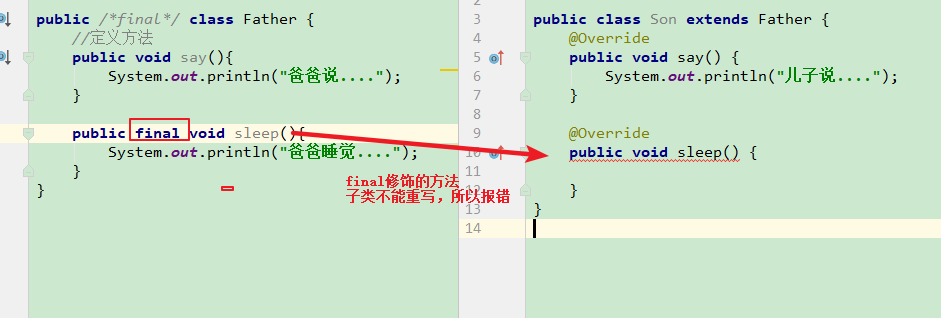
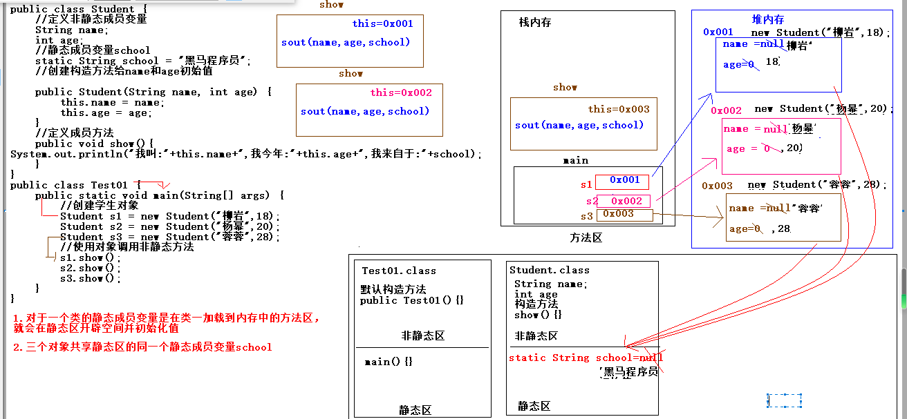
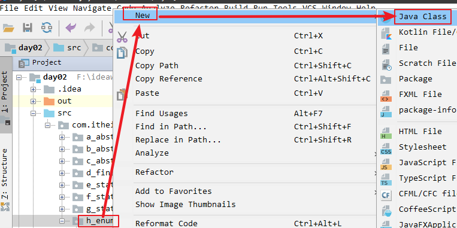
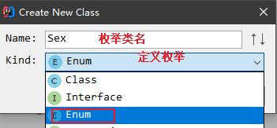

# 1.抽象类(掌握)

## 1.介绍和引入

抽象类：描述的内容不是具体的内容。

~~~java
package com.itheima.sh.a_abstract_01;
/*
    父类：动物类
 */
public abstract class Animal {
    //描述共性的
    /*
        1.在Java中没有方法体的方法称为抽象方法，抽象方法必须是抽象
         修饰符abstract进行修饰
        2.都是修饰符，对于public abstract 书写前后顺序不固定，但是一般建议
        权限修饰符写在最前面
        3.在java中只要一个类中含有了抽象方法，那么所属类必须也是抽象的
     */
    public abstract void eat();
}

package com.itheima.sh.a_abstract_01;

public class Dog extends Animal{
    //共性方法
    @Override
    public void eat(){
        System.out.println("狗啃骨头");
    }

    //特有方法
    public void lookHome(){
        System.out.println("狗看家");
    }
}

package com.itheima.sh.a_abstract_01;

public class Cat extends Animal{
    //共性方法
    public void eat(){
        System.out.println("猫吃鱼");
    }

    //特有方法
    public void catchMouse(){
        System.out.println("猫抓老鼠");
    }
}

package com.itheima.sh.a_abstract_01;

public class Test01 {
    public static void main(String[] args) {
        //创建狗类对象
        Dog d = new Dog();
        //使用对象d调用共性方法
        d.eat();
        //使用对象d调用特有方法
        d.lookHome();
    }
}

~~~

小结：

​       1.在Java中没有方法体的方法称为抽象方法，抽象方法必须是抽象
​         修饰符**abstract**进行修饰
​        2.都是修饰符，对于public abstract 书写前后顺序不固定，但是一般建议
​        权限修饰符写在最前面
​        **3.在java中只要一个类中含有了抽象方法，那么所属类必须也是抽象的**

## 2.抽象类的注意事项(掌握)

~~~java
package com.itheima.sh.b_abstract_02;
/*
    父类：动物类
 */
public abstract class Animal {
    //成员变量
    int x = 10;
    //构造方法

    public Animal() {
        /*
            隐式三步
         */
    }
    //带方法体的方法
    public void sleep(){
        
    }
    //描述共性的
    public abstract void eat();
    public abstract void say();
}

package com.itheima.sh.b_abstract_02;
/*
    抽象类的注意事项：
    1.如果一个子类继承了一个抽象类，那么这个子类必须重写抽象类中的所有的抽象方法。
        否则父类中的抽象方法存在毫无意义，也会报错
    2.重写抽象方法快捷键：
        1）重写哪个方法在子类中书写方法名即可
        2）在子类的报错位置按万能键：alt+enter
        3) 在子类的报错位置按:ctrl+i
    3.如果一个子类继承了抽象类，没有抽象抽象方法，那么要求这个子类必须也是抽象类，然后
    在定义一个子类继承该抽象类
    4.抽象类也是类，在成员位置除了书写抽象方法，
    还可以书写其他内容(成员变量,构造方法,一般成员方法就是带方法体,构造代码块，静态代码块)
    5.虽然抽象类含有构造方法，但是不能创建抽象类的对象
        因为抽象类中含有没有方法体的抽象方法，如果可以创建抽象类对象，那么可以直接使用
        对象来调用抽象方法了，这样没有意义
    6.抽象类一定不是顶层父类，因为顶层父类是Object类，但是一定要有子类，使用子类重写父类的
    抽象方法，否则毫无意义
    7.抽象类含有构造方法，不让创建对象，那么存在意义是什么？
        供子类调用
 */
public  class Dog extends Animal {
    //共性方法
    @Override
    public void eat(){
        System.out.println("狗啃骨头");
    }

    @Override
    public void say() {

    }


    //特有方法
    public void lookHome(){
        System.out.println("狗看家");
    }
}

package com.itheima.sh.b_abstract_02;

public class Test01 {
    public static void main(String[] args) {
        //创建狗类对象
        Dog d = new Dog();
        //使用对象d调用共性方法
        d.eat();
        //使用对象d调用特有方法
        d.lookHome();

        //创建父类抽象类的对象 实例化
//        Animal an = new Animal();
    }
}

~~~

小结：

  抽象类的注意事项：
    **1.如果一个子类继承了一个抽象类，那么这个子类必须重写抽象类中的所有的抽象方法。**
        否则父类中的抽象方法存在毫无意义，也会报错
    2.重写抽象方法快捷键：
        1）重写哪个方法在子类中书写方法名即可
        2）在子类的报错位置按万能键：alt+enter
        **3) 在子类的报错位置按:ctrl+i**
    3.如果一个子类继承了抽象类，没有重写抽象方法，那么要求这个子类必须也是抽象类，然后
    在定义一个子类继承该抽象类
    4.抽象类也是类，在成员位置除了书写抽象方法，
    还可以书写其他内容(成员变量,构造方法,一般成员方法就是带方法体,构造代码块，静态代码块)
    **5.虽然抽象类含有构造方法，但是不能创建抽象类的对象**
        因为抽象类中含有没有方法体的抽象方法，如果可以创建抽象类对象，那么可以直接使用
        对象来调用抽象方法了，这样没有意义
    6.抽象类一定不是顶层父类，因为顶层父类是Object类，但是一定要有子类，使用子类重写父类的
    抽象方法，否则毫无意义
    **7.抽象类含有构造方法，不让创建对象，那么存在意义是什么？**
        供子类调用

​    8.抽象类本身存在意义需要子类重写抽象方法，并且抽象类起到模板思想

## 3.抽象类存在的意义_模板思想(掌握)

### 3.1设计模式

设计模式：最早起源于建筑领域。遇到相同问题就是按照这种思想去解决即可。

java中的设计模式有23种，以后只要遇到相同问题就按照这种设计模式的思想去解决。

常见的设计模式：代理设计模式，装饰者设计模式、工厂设计模式、单例设计模式、模板设计模式。

### 3.2模板设计模式

模板设计模式：相同内容即共性内容在父类中的实现(定义方法体)，如果也是共性的，但是方法体实现不一样，此时在父类中定义抽象方法，然后子类去实现方法体，完成自己的内容。

练习：

假如我现在需要定义新司机和老司机类，新司机和老司机都有开车功能，开车的步骤都一样，只是驾驶时的姿势有点不同，`新司机:开门,点火,双手紧握方向盘,刹车,熄火`，`老司机:开门,点火,右手握方向盘左手抽烟,刹车,熄火`。

~~~java
package com.itheima.sh.c_abstract_03;

public abstract class Driver {
    //定义一般方法
    public void go(){
        //相同内容
        System.out.println("开门");
        System.out.println("打火");
        //开车姿势
        //调用开车姿势的方法
        ziShi();
        System.out.println("刹车");
        System.out.println("熄火");
    }

    public abstract void ziShi();
}

package com.itheima.sh.c_abstract_03;

public class OldDriver extends Driver {
    //开车姿势
    @Override
    public void ziShi() {
        System.out.println("老司机开车，一手抽烟，一手打电话。。很牛逼...");
    }
}

package com.itheima.sh.c_abstract_03;

public class NewDriver extends Driver {
    //开车姿势
    @Override
    public void ziShi() {
        System.out.println("新手上路，很紧张，双手握住方向盘。。。。。。");
    }
}
package com.itheima.sh.c_abstract_03;

public class Test01 {
    public static void main(String[] args) {
        //创建老司机对象
        OldDriver oldDriver = new OldDriver();
        oldDriver.go();

        //创建新司机对象
        NewDriver newDriver = new NewDriver();
        newDriver.go();
    }
}

~~~

# 2.final(掌握)

final是一个修饰符，可以修饰类 方法 变量(成员变量和局部变量)。final表示最终的意思。修饰内容的特点都是不能被改变的。

## 1.final修饰类

不能有子类，不能被继承。

~~~java
public final class Father {
    //定义方法
    public void say(){
        System.out.println("爸爸说....");
    }
}
~~~

sun公司定义final修饰的类：String、Scanner

## 2.final修饰方法

如果一个类没有被final修饰，可以有子类那么可以通过重写来修改方法，如果这个类的部分方法不想让子类重写就使用final修饰




## 3.final修饰的变量

### 1.final修饰的局部变量

​	1）基本类型的变量

~~~java
package com.itheima.sh.d_final_04;
/*
    1.final修饰的变量不能被改变，变为常量。
    2.如果一个变量使用了final修饰了，那么在生成的class文件中使用final修饰的变量的位置已经是常量
    3.final修饰的变量已经变为常量了，为了区分和普通变量，所以建议final修饰的变量名都大写 final int X = 10;
 */
public class Test01 {
    public static void main(String[] args) {
        //局部位置
        //定义局部变量
        final int X = 10;
        //修改x
//        x = 20;
//        System.out.println("x = " + x);
        //如果一个变量使用了final修饰了，那么在生成的class文件中使用final修饰的变量的位置已经是常量
        //.java源文件---javac编译生成.class文件在硬盘上
        //使用java命令启动jvm虚拟机将硬盘上的.class加载到内存中
        System.out.println(X);
    }
}

~~~

​	2）引用类型的变量

~~~java
package com.itheima.sh.d_final_04;

public class Person {
    //定义成员变量
    int age = 20;
}

public class Test01 {
    public static void main(String[] args) {
        //创建Person类的对象
        //final修饰的引用类型的变量
        final Person p = new Person();//0x001
        //修改p的地址值
//        p = new Person();//0x002
        //修改p对象中的age属性值
        p.age = 30;
        System.out.println(p.age);
    }
}
~~~


小结：

```
1.final修饰的变量不能被改变，变为常量。
2.如果一个变量使用了final修饰了，那么在生成的class文件中使用final修饰的变量的位置已经是常量
3.final修饰的变量已经变为常量了，为了区分和普通变量，所以建议final修饰的变量名都大写 final int X = 10;
4.final修饰的引用类型的变量，变量的地址值不能被改变,但是对象中的成员变量内容是可以改变的
```

【final修饰的变量面试题】

~~~java
package com.itheima.sh.d_final_04;

public class Test02 {
    public static void main(String[] args) {
        //1.在循环外部定义final修饰的变量变为常量，二如果在循环体中每次都是修改常量x，所以报错
       /* final int x = 10;
        //循环
        for (int i = 0; i < 5; i++) {
            x = i;
        }*/

        //2.不报错：每次循环都是重新定义一个final修饰的变量保存i的值
        for (int i = 0; i < 5; i++) {
            final int y = i;
            System.out.println("y = " + y);
        }

    }
}

~~~


### 2.final修饰的成员变量

~~~java
package com.itheima.sh.d_final_04;

/*
    final修饰的成员变量有两种方式初始化：
    1.定义的时候直接显示初始化  final int age = 10;
    2.通过构造方法初始化值：
         public Student(int age) {
            this.age = age;
        }
 */
public class Student {
    //定义成员变量
    final int age;
    //构造方法

    public Student(int age) {
        this.age = age;
    }

    /*public int getAge() {
        return age;
    }

    public void setAge(int age) {
        this.age = age;
    }*/
}

~~~

小结：

 final修饰的成员变量有两种方式初始化：
    1.定义的时候直接显示初始化  final int age = 10;
    2.通过构造方法初始化值：
         public Student(int age) {
            this.age = age;
        }


**总结：final属于一种修饰符，可以修饰类 方法 变量(局部变量 成员变量)，都不能被改变**


# 3.static关键字(掌握)

## 1.介绍

static属于一种修饰符，可以修饰**成员方法 成员变量**，static表示**静态**的意思，修饰的内容和对象无关，只和类有关，直接可以使用类名调用。

总结：在java中在一个类中使用不同类的成员内容方式：

~~~java
1.继承，子类继承父类，可以直接使用父类的非私有成员
2.创建对象，使用对象调用非静态方法，就是没有static修饰的
3.使用类名调用，要求类名调用的成员必须使用static修饰
~~~

static修饰的成员变量格式：

~~~java
static 数据类型 变量名 = 常量;
~~~

static修饰的成员方法格式：

~~~java
方法修饰符 方法返回值类型 方法名(参数列表){
    方法体
}
public static 方法返回值类型 方法名(参数列表){
    方法体
}
~~~

## 2.static修饰的成员变量

1.static修饰的成员变量格式：

~~~java
static 数据类型 变量名 = 常量;
~~~

2.static修饰的**成员变量只和类有关，和对象无关**，可以直接使用类名调用，调用格式：**类名.静态成员变量名**

3.静态成员变量也称为类变量，非静态成员变量称为实例变量(对象变量)就是之前一直使用的

4.静态成员变量不在堆内存中，随着类一加载就在方法区的静态区中开辟空间，直接可以使用，然后多个对象可以直接共享一个静态成员变量

需求：创建三个学生对象，给非静态成员变量name 和 age赋值，在类中定义静态成员变量school，初始化值是**黑马程序员**

~~~java
package com.itheima.sh.e_static_05;
/*
    需求：创建三个学生对象，给非静态成员变量name 和 age赋值，
    在类中定义静态成员变量school，初始化值是**黑马程序员**
 */
public class Student {
    //定义非静态成员变量
    String name;
    int age;
    //静态成员变量school
    static String school = "黑马程序员";
    //创建构造方法给name和age初始值

    public Student(String name, int age) {
        this.name = name;
        this.age = age;
    }
    //定义成员方法
    public void show(){
        System.out.println("我叫:"+this.name+",我今年:"+this.age+",我来自于:"+school);
    }
}

package com.itheima.sh.e_static_05;

public class Test01 {
       //底层使用jvm通过类名调用main方法：Test01.main(new String[0]);
    public static void main(String[] args) {
        //创建学生对象
        Student s1 = new Student("柳岩",18);
        Student s2 = new Student("杨幂",20);
        Student s3 = new Student("蓉蓉",28);
        //使用对象调用非静态方法
        s1.show();
        s2.show();
        s3.show();
        System.out.println(Student.school);//黑马程序员
    }
}

~~~

图解：



## 3.静态方法

1.static修饰的成员方法格式：

~~~java
方法修饰符 方法返回值类型 方法名(参数列表){
    方法体
}
public static 方法返回值类型 方法名(参数列表){
    方法体
}
~~~

2.调用格式：

直接使用类名调用静态方法

~~~java
类名.方法名(实参);
~~~

代码演示：

~~~java
package com.itheima.sh.f_static_06;

public class Student {
    //定义静态成员方法
    public static void show(){
        System.out.println("我是静态成员方法show...");
    }
}
package com.itheima.sh.f_static_06;

public class Test01 {
    public static void main(String[] args) {
        //运行Student类的静态方法
        Student.show();
    }
}

~~~

小结：static修饰的成员方法称为静态方法，和对象无关，只和类有关，直接可以使用类名调用：

类名.方法名(实参);

```
3.static修饰的成员方法注意事项：
    1）static修饰的成员方法中不能使用非静态成员变量和方法。
        原因：静态方法一加载到方法区的静态区就可以直接使用类名调用了，不需要对象。
        而非静态方法和变量必须依赖于对象，非静态成员变量只有创建对象才可以在堆内存中开辟空间
        非静态方法必须依赖于对象调用
    2）在非静态方法中可以使用静态成员变量和调用静态成员方法
        原因：非静态方法运行需要使用对象调用，那么对象有了，类一定加载完成了，因为
        先有类后有对象。类既然加载完成了，那么静态的成员变量和方法是都可以使用的
    3) 静态方法中不能使用this 和 super
    总结：只要在静态中都不能使用和对象有关的一切内容
```

代码演示:

~~~java
package com.itheima.sh.g_static_07;
/*
    3.static修饰的成员方法注意事项：
        1）static修饰的成员方法中不能使用非静态成员变量和方法。
            原因：静态方法一加载到方法区的静态区就可以直接使用类名调用了，不需要对象。
            而非静态方法和变量必须依赖于对象，非静态成员变量只有创建对象才可以在堆内存中开辟空间
            非静态方法必须依赖于对象调用
        2）在非静态方法中可以使用静态成员变量和调用静态成员方法
            原因：非静态方法运行需要使用对象调用，那么对象有了，类一定加载完成了，因为
            先有类后有对象。类既然加载完成了，那么静态的成员变量和方法是都可以使用的
        3) 静态方法中不能使用this 和 super
        总结：只要在静态中都不能使用和对象有关的一切内容

 */
public class Student {
    //非静态成员变量
    static int x = 10;
    //定义静态成员方法
    public static void show(){
        // 1）static修饰的成员方法中不能使用非静态成员变量
//        System.out.println("我是静态成员方法show...x="+x);
        System.out.println("我是静态成员方法show...");
        //调用非静态成员方法
        //static修饰的成员方法中不能调用非静态成员方法。
//        test();
    }

    //定义非静态方法
    public void test(){
        //调用静态方法
        show();
        System.out.println("我是非静态方法test....");
    }
}

package com.itheima.sh.g_static_07;
public class Test01 {
    public static void main(String[] args) {
        //运行Student类的静态方法
//        Student.show();
        //创建学生对象
        Student s = new Student();
        s.test();
    }
}

~~~

 总结：只要在静态中都不能使用和对象有关的一切内容

# 4.枚举(掌握)

## 1.枚举引入

~~~java
package com.itheima.sh.h_enum_08;

public class Person {
    //定义成员变量
    String name;
    String sex;
    //构造方法

    public Person(String name, String sex) {
        this.name = name;
        this.sex = sex;
    }
    //定义成员方法
    public void show(){
        System.out.println("我叫:"+this.name+"，我的性别是:"+this.sex);
    }
}
package com.itheima.sh.h_enum_08;

public class Test01 {
    public static void main(String[] args) {
        //创建对象
//        Person p = new Person("锁哥","男");
        /*
            由于Person类中的成员变量sex属于String类型，那么我们创建对象时
            可以赋值任意的值，那么这样不符合我们实际应用场景
            正常性别是固定的两种：
                男   女
            在java中如果对于上述这种情况，使用的值是固定范围的某几个，我们可以使用
            枚举来定义
         */
        Person p = new Person("锁哥","哈哈");
        //使用对象调用方法show
        p.show();
    }
}

~~~

小结：

在实际开发中只要使用的值是固定范围的某几个，我们可以使用**枚举**来定义

## 2.枚举介绍

1.枚举其实就是一个类，和类是同等级别，定义的时候使用的关键字不是class

~~~java
定义类：
public class 类名{
    成员位置
}
定义枚举：
public enum 枚举类名{
    //成员位置
    //1.对象(实例)属性：定义的时候都是大写，就是当前枚举类的对象
}
~~~

2.创建枚举类

1）



2）



3)代码体现:

~~~java
package com.itheima.sh.h_enum_08;

public class Person {
    //定义成员变量
    String name;
//    String sex;
    //将性别定义为枚举类型
    //Sex 表示枚举类类型  s 表示对象名
    Sex s;
    //构造方法
    /*
        String name = "锁哥"
        Sex s = Sex.MALE
     */
    public Person(String name, Sex s) {
        this.name = name;
        this.s = s;
    }
   /* public Person(String name, String sex) {
        this.name = name;
        this.sex = sex;
    }*/
    //定义成员方法
    public void show(){
//        System.out.println("我叫:"+this.name+"，我的性别是:"+this.sex);
        System.out.println("我叫:"+this.name+"，我的性别是:"+this.s);
    }
}

package com.itheima.sh.h_enum_08;

public enum Sex {
    //1.对象(实例)属性：定义的时候都是大写，就是当前枚举类的对象
    //MALE 男  FEMALE 女
    MALE,FEMALE
}

package com.itheima.sh.h_enum_08;

public class Test01 {
    public static void main(String[] args) {
        //创建对象
//        Person p = new Person("锁哥","男");
        /*
            由于Person类中的成员变量sex属于String类型，那么我们创建对象时
            可以赋值任意的值，那么这样不符合我们实际应用场景
            正常性别是固定的两种：
                男   女
            在java中如果对于上述这种情况，使用的值是固定范围的某几个，我们可以使用
            枚举来定义
         */
//        Person p = new Person("锁哥","哈哈");
        Person p = new Person("锁哥",Sex.MALE);
        //使用对象调用方法show
        p.show();
    }
}

~~~

小结：

1.定义枚举：

~~~java
public enum 枚举类名{
    1.对象(实例)属性：定义的时候都是大写，就是当前枚举类的对象
         MALE,FEMALE
}
~~~

2.使用枚举：

~~~java
枚举类名.枚举类中的对象属性名
    举例：
    Sex.MALE
~~~


## 3.枚举类的原理

对枚举类反编译的结果如下：

~~~java
public final class Sex extends Enum
{
	//MALE 属于当前枚举类Sex类型，在枚举类的静态代码块中创建该类的对象，并将地址值赋值给MALE这里
    //静态代码块执行时机：当前枚举类Sex第一次加载到方法区的静态区就执行静态代码块，并且只执行一次
	public static final Sex MALE;
	public static final Sex FEMALE;
	private static final Sex $VALUES[];

	public static Sex[] values()
	{
		return (Sex[])$VALUES.clone();
	}

	public static Sex valueOf(String name)
	{
		return (Sex)Enum.valueOf(com/itheima/sh/i_enum_09/Sex, name);
	}

	private Sex(String s, int i)
	{
		super(s, i);
	}

	static 
	{
		MALE = new Sex("MALE", 0);
		FEMALE = new Sex("FEMALE", 1);
		$VALUES = (new Sex[] {
			MALE, FEMALE
		});
	}
}
~~~

代码演示：

~~~java
package com.itheima.sh.i_enum_09;

public enum Sex {
    //定义对象属性
    // MALE("锁哥")调用有一个参数的构造方法，参数类型是String
    // FEMALE(20)调用有一个参数的构造方法，参数类型是int
    MALE("锁哥"), FEMALE(20);

    //定义方法
    public void show() {
        System.out.println("show...");
    }

    //定义一个无参的构造方法
    /*private*/ Sex() {
        System.out.println("无参构造方法");
    }

    //有一个参数的构造方法
    Sex(String name) {
        System.out.println("有参构造方法,name=" + name);
    }

    Sex(int age) {
        System.out.println("有参构造方法,age=" + age);
    }
}
package com.itheima.sh.i_enum_09;

public class Test01 {
    public static void main(String[] args) {
        //调用枚举类中的对象属性
        /*
            1.Sex.MALE 表示获取枚举类的对象属性，获取的类型是Sex类型，
            说明Sex枚举类中的对象属性都是当前枚举类Sex的对象
            2.MALE 属于当前枚举类Sex类型，在枚举类的静态代码块中创建该类的对象，
            并将地址值赋值给MALE这里.
            静态代码块执行时机：当前枚举类Sex第一次加载到方法区的静态区就执行静态代码块，并且只执行一次
            3.自定义的枚举类是final修饰的类，不能有子类，枚举类是不能被继承
            4.通过反编译工具我们发现枚举类自动继承了java中的枚举类： java.lang.Enum
                public final class Sex extends Enum{}
                 java.lang.Enum表示所有枚举类的父类
            5.枚举类也是类，在枚举类中的成员位置除了可以书写对象属性，也可以书写类的其他内容：
            例如：构造方法 方法 成员变量 代码块
            注意啦：如果响应在枚举类中的成员位置书写其他内容，必须书写在对象属性的下面，并且最后一个
            对象属性使用分号结束
            6.枚举类的构造方法都是私有的，默认也是私有的，所以我们不能在其他了中
            使用new调用构造方法方式创建
            7.在枚举类中如果定义对象属性直接书写，那么调用的是默认的无参构造方法
               MALE,FEMALE;
            8.如果创建枚举调用调用有参构造方法：
				 MALE("锁哥"), FEMALE(20);
         */
        Sex m = Sex.MALE;
       /* Sex f = Sex.FEMALE;
        System.out.println(m);*/
       //使用对象名m调用非静态方法show
//        m.show();
//        new Sex();
    }
}

~~~

小结：

​             **1.Sex.MALE 表示获取枚举类的对象属性，获取的类型是Sex类型，**
​            说明Sex枚举类中的对象属性都是当前枚举类Sex的对象

​	【扩展】

​            2.MALE 属于当前枚举类Sex类型，在枚举类的静态代码块中创建该类的对象，
​            并将地址值赋值给MALE这里.
​            静态代码块执行时机：当前枚举类Sex第一次加载到方法区的静态区就执行静态代码块，并且只执行一次
​            3.自定义的枚举类是final修饰的类，不能有子类，枚举类是不能被继承
​            4.通过反编译工具我们发现枚举类自动继承了java中的枚举类： java.lang.Enum
​                public final class Sex extends Enum{}
​                 java.lang.Enum表示所有枚举类的父类
​            5.枚举类也是类，在枚举类中的成员位置除了可以书写对象属性，也可以书写类的其他内容：
​            例如：构造方法 方法 成员变量 代码块
​            **注意啦：如果响应在枚举类中的成员位置书写其他内容，必须书写在对象属性的下面，并且最后一个
​            对象属性使用分号结束**
​            6.枚举类的构造方法都是私有的，默认也是私有的，所以我们不能在其他类中。使用new调用构造方法方式   创建
​            7.在枚举类中如果定义对象属性直接书写，那么调用的是默认的无参构造方法
​               MALE,FEMALE;
​            8.如果创建枚举调用调用有参构造方法：
​				 MALE("锁哥"), FEMALE(20);

## 4.枚举类的应用场景

只要是使用固定数量的就使用枚举定义。

红绿灯： RED YELLOW GREEN

方向：UP RIGHT DOWN LEFT

性别：MALE FEMALE


# 今日作业：

1.抽象类 abstract  不能创建对象 子类必须重写抽象类的所有的抽象方法

2.final 修饰类(不能被继承)  方法(不能被重写) 变量(变为常量)不能修改

3.static : 直接使用类名调用，和对象无关。

4.枚举：

​	1）定义枚举(很少自己定义 enum)

​	2)枚举使用：枚举类 对象 = 枚举类.对象属性名

Sex s= Sex.MALE;

