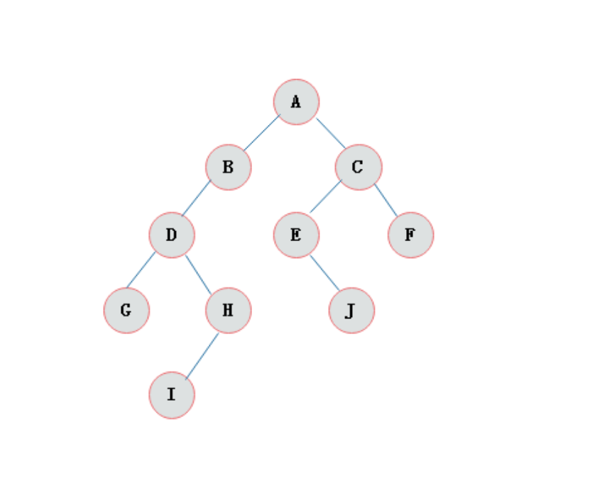
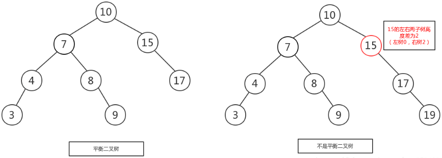

# 第一章 泛型

## 1.1 泛型引入

集合是一个容器，可以保存对象。集合中是可以保存任意类型的对象。

List list = new ArrayList();

list.add(“abc”);  保存的是字符串对象

list.add(123); 保存的是Integer对象

list.add(new Person()); 保存的是自定义Person对象

 

这些对象一旦保存到集合中之后，都会被提升成Object类型。当我们取出这些数据的时候，取出来的时候一定也是以Object类型给我们，所以取出的数据发生多态了。发生多态了，当我们要使用保存的对象的特有方法或者属性时，需要向下转型。而向下转型有风险，我们还得使用 instanceof关键字进行判断，如果是想要的数据类型才能够转换，不是不能强制类型转换，使用起来相对来说比较麻烦。

举例：

现在要使用String类的特有方法，需要把取出的obj向下转成String类型。

String s = (String)obj;

代码如下：

需求：查看集合中字符串数据的长度。

分析和步骤：

1）创建一个ArrayList的集合对象list；

2）使用list集合调用add()函数向集合中添加几个字符串数据和整数数据；

3）迭代集合分别取出集合中的数据，并查看集合中的字符串数据的长度；

代码如下：

```java
package cn.itcast.sh.generic.demo;
import java.util.ArrayList;
import java.util.Iterator;
/*
 * 泛型引入
 */
public class GenericDemo1 {
	public static void main(String[] args) {
		// 创建集合对象
		ArrayList list = new ArrayList();
		// 向集合中添加数据
		list.add("aaa");
		list.add("bbb");
		list.add("ccc");
		list.add(true);
		list.add(123);
		//迭代集合
		for (Iterator it = list.iterator(); it.hasNext();) {
			Object obj =  it.next();
			/*
			 * 需求：想使用String类型的特有的函数查看字符串的长度
			 * Object obj =  it.next();上述代码发生多态了，想使用String类中特有的函数必须得强制类型转换
			 * 可是由于集合可以存储任意类型的对象，而这里只是适合String类型的强制类型转换，其他数据类型会报classCastException类转换
			 * 异常，如果为了不报异常只能在转换前需要判断，这样做比较麻烦
			 * 由于这里的需求只是遍历集合后对于取出来的数据是String类型，查看他的长度，其他数据类型不管
			 * 我们能否想办法不让运行时报错呢，在存储的时候就告诉我，只要是String类型的可以存储，其他数据类型不让存储，这样做起来效率会高一些
			 */
			String s=(String)obj;
			System.out.println(s+"长度是"+s.length());
		}
	}
}
```

上述的情况会发生ClassCastException异常。发生这个异常的原因是由于集合中保存了多种不同类型的对象，而在取出的时候没有进行类型的判断，直接使用了强转。

  换句话也就是说我们存储的时候，任何类型都让我们存储。

  然后我们取的时候，却报错，抛异常。非常不靠谱。你应该在我存的时候就告诉我：锁哥，我只能存字符串，其他引用数据类型不能存储，那么这样我在取出数据的时候就不会犯错了。

假设我们在使用集合的时候，如果不让给集合中保存类型不同的对象，那么在取出的时候即使有向下转型，也不会发生异常。

 我们回顾下以前学习的数组容器：

在前面学习数组的时候，我们知道数组这类容器在定义好之后，类型就已经确定，如果保存的数据类型不一致，编译直接报错。

代码举例如下所示：


数组是个容器，集合也是容器，数组可以在编译的时候就能检测数保存的数据类型有问题，如果我们在定义集合的时候，也让集合中的数据类型进行限定，然后在编译的时候，如果类型不匹配就不让编译通过， 那么运行的时候也就不会发生ClassCastException。

 

要做到在向集合中存储数据的时候限定集合中的数据类型，也就是说编译的时候会检测错误。java中从JDK1.5后提供了一个新的技术，可以解决这个问题：泛型技术。

## 1.2  泛型概述

泛型的格式：

​	<具体的数据类型>

使用格式：

 ArrayList<限定集合中的数据类型>  list = new  ArrayList<限定集合中的数据类型>();

​	说明：给集合加泛型，就是让集合中只能保存具体的某一种数据类型。

使用泛型改进以上程序中存在的问题：


说明：由于创建ArrayList集合的时候就已经限定集合中只能保存String类型的数据，所以编译的时候保存其他的数据类型就会报错，这样就达到了我们上述保存数据的目的了。

## 1.3 使用泛型的好处

上一节只是讲解了泛型的引入，那么泛型带来了哪些好处呢？

* 将运行时期的ClassCastException，转移到了编译时期变成了编译失败。
* 避免了类型强转的麻烦。

通过我们如下代码体验一下：

~~~java
public class GenericDemo2 {
	public static void main(String[] args) {
        Collection<String> list = new ArrayList<String>();
        list.add("abc");
        list.add("itcast");
        // list.add(5);//当集合明确类型后，存放类型不一致就会编译报错
        // 集合已经明确具体存放的元素类型，那么在使用迭代器的时候，迭代器也同样会知道具体遍历元素类型
        Iterator<String> it = list.iterator();
        while(it.hasNext()){
            String str = it.next();
            //当使用Iterator<String>控制元素类型后，就不需要强转了。获取到的元素直接就是String类型
            System.out.println(str.length());
        }
	}
}
~~~

> tips:泛型是数据类型的一部分，我们将类名与泛型合并一起看做数据类型。

## 1.4 泛型的注意事项

1）泛型只支持引用数据类型(类类型或接口类型等)，泛型不支持基本数据类型：

```java
ArrayList<int> list = new ArrayList<int>();//错误的
```

2）泛型不支持数据类型以继承的形式存在，要求前后泛型的数据类型必须一致：	

```java
ArrayList<Object> list = new ArrayList<String>();//错误的
```

 3）在jdk1.7之后，泛型也可以支持如下写法：

```java
ArrayList<String> list = new ArrayList<>();//正确的
```

**注意：现在的开发中，泛型已经成为编写代码的规范**。

## 1.5  自定义泛型

在集合中，不管是接口还是类，它们在定义的时候类或接口名的后面都使用<标识符>，当我们在使用的时候，可以指定其中的类型。如果当前的类或接口中并没有<标识符>，我们在使用的时候也不能去指定类型。

举例：比如我们之前所学习的集合ArrayList类：

new ArrayList<E>

说明：在ArrayList类上有一个泛型的参数：E 

  设计API的时候，设计者并不知道我们要用ArrayList存储哪种数据类型，所以他定义了一个泛型。

  然后当我们使用ArrayList的时候，我们知道要存储的类型，比如要存储String类型：

```java
ArrayList<String> list = new ArrayList<String>();
```

当我们new对象的时候，就把泛型E替换成了String，于是JVM就知道我们要存储的其实是String。

泛型：如果我们不确定数据的类型，可以用一个标识符来代替。

如果我们在使用的时候已经确定要使用的数据类型了，我们在创建对象的时候可以指定使用的数据类型。

泛型自定义格式：

​	<标识符>

​		这里的标识符可以是任意的字母、数字、下划线和 $ 。但是这里一般规范使用单个大写字母。

注意：自定义泛型也属于标识符，满足标识符的命名规则。1）数字不能开始；2）关键字不能作为标识符；

根据以上分析我们可以思考一个问题：既然我们学习过的集合类可以定义泛型，那么我们自己在描述类或接口的时候，是否也可以在自己的类或接口上定义泛型，然后别人使用的时候也可以指定这个类型呢？

答案当然是可以的。

### 自定义泛型类（掌握）

泛型类：

​	在定义类的时候，在类名的后面书写泛型。

​	格式：

~~~java
class 类名<泛型参数>
{

}
~~~

泛型参数其实就是标识符。

分析和步骤：

1）创建测试类GenericDemo1 ，在这个类中定义一个main函数；

2）定义一个泛型类Demo<ABC>;

3）在这个类中定义一个成员变量name,类型是泛型ABC类型；

4）在定义一个非静态成员函数show，接收参数给name属性赋值，局部变量name的类型是ABC类型；

5）在main函数中创建Demo类的对象，并指定泛型分别是String 和Integer类型；

```java
package cn.itcast.sh.generic.demo1;
/*
 * 自定义泛型类演示
 * 在类上定义的泛型，当外界创建这个对象的时候，由创建者指定泛型的类型
 * 在类上定义的泛型，类中的成员变量和函数都可以使用
 */
class Demo<ABC>
{
	 ABC name;
	public void show(ABC name)
	{
		this.name=name;
	}
}
public class GenericDemo1 {
	public static void main(String[] args) {
		//创建Demo类的对象
		/*
		 * 注意如果这里创建Demo类的对象时没有指定泛型类的类型时，这里ABC默认是Object类型
		 * 如下代码所示创建Demo类的对象的时候，指定的泛型类类型是String类型，
		 * 那么Demo类中的泛型类ABC就是String类
		 * 同理，如果指定的数据类型是Integer，那么ABC就是Integer类
		 */
//		Demo<String> d=new Demo<String>();
		Demo<Integer> d=new Demo<Integer>();
//		d.show("哈哈");
		d.show(123);
		System.out.println(d.name);
	}
}
```

说明：

  1）在类上定义的泛型，当外界在创建这个类的对象的时候，需要创建者自己来明确当前泛型的具体类型；

  2）在类上定义的泛型，在类中的方法上和成员变量是可以使用的；

  3）上述代码中如果创建Demo类的对象时没有指定泛型类的类型时，那么ABC默认是Object类型；

  4）上述代码中如果创建Demo类的对象时指定的泛型类类型是String类型，那么ABC默认是String类型；

**注意：对于自定义泛型类只有在创建这个类的对象的时候才可以指定泛型的类型。**

### 在方法上使用泛型（掌握）

我们不仅可以在自己定义的类或接口上使用泛型，还可以在自定义的函数上使用泛型。

虽然可以在类上定义泛型，但是有时类中的方法需要接收的数据类型和类上外界指定的类型不一致。也就是说对于某个函数而言参数的数据类型和所属类的泛型类型不一致了，这时我们可以在这个类中的这个方法上单独给这个方法设定泛型。

​	在函数上使用泛型的格式：

~~~java
	函数修饰符 <泛型名>  函数返回值类型  方法名( 泛型名 变量名 )
    { 
        函数体;

    }
~~~


说明：函数返回值类型前面的<泛型名>相当于定义了方法参数列表中泛型的类型。

代码演示如下图所示：


说明：

1）类上的泛型是在创建这个类的对象的时候明确具体是什么类型；

2）方法上的泛型是在真正调用这个方法时，传递的是什么类型，泛型就会自动变成什么类型；

举例：上述代码中当调用者传递的是2，那么这个Q就代表Integer类型。

如果调用者传递的是new Student(“班长”，19)，那么这个Q类型就是Student类型。

 3）上述method函数中<Q>表示定义的泛型，而参数列表中的Q q是在使用泛型类型，而这里的Q类型具体由调用者来指定；

### **泛型接口和泛型传递（**掌握）

通过查阅API得知，类支持泛型，那么接口也可以支持泛型，比如集合中的接口.

那么既然API中的接口支持泛型，自己定义的接口同样也可以使用泛型。

泛型接口的格式：

修饰符 interface 接口名<泛型>{}

问题：泛型类的泛型，在创建类的对象时确定。

那么接口又无法创建对象，什么时候确定泛型的类型呢？有两种方式可以实现。

方式1：类实现接口的时候，直接明确泛型类型。


方式2：类实现接口的时候，还不确定数据类型，这时可以在实现类上随便先定义个泛型，当这个类被创建对象的时候，

就明确了类上的泛型，于是接口上的泛型也明确了。

我们管方式2这种方式叫做泛型的传递。

代码实现如下：


举例，API中集合的泛型使用情况解释如下所示：

​	比如：

~~~java
interface  Collection<E>{

}

interface List<E> extends Collection<E>{

}

class ArrayList<E> implements List<E>{

}

ArrayList<String> list = new ArrayList<String>();
~~~

结论：通过以上操作，上述集合接口中的泛型类型是String类型。

## 1.6泛型通配符

- 格式：

  ```java
  1）<?>				:可以表示任何类型
  2）<? extends XXX> :表示可以接受XXX和XXX的子类类型(泛型的上限限定) 
      举例：<？ extends Person> ：？代表的是一种类型，当前这个类型可以是Person本身，也可以是Person的子类。
  3）<? super XXX>   :表示可以接受XXX和XXX的父类类型(泛型的下限限定) 
      举例： <？ super Student> ：？代表当前的类型可以是Student类型，也可以是Student的父类类型。
  ```

- 示例代码：

  ```java
  public class Demo03 {
      public static void main(String[] args) {
          //创建对象
          ArrayList<String> list1 = new ArrayList<>();
          ArrayList<Integer> list2 = new ArrayList<>();
  
          //调用方法
          method(list1);
          method(list2);
      }
  
      //定义方法
      //<?>可以接受任何类型
      public static void method(ArrayList<?> l){
  
      }
  }
  ```

  ```java
  public class Demo04 {
      public static void main(String[] args) {
          //创建集合
          ArrayList<Person> list1 = new ArrayList<>();
          //创建集合
          ArrayList<Student> list2 = new ArrayList<>();
  
          //调用方法
          method(list1);
          method(list2);
      }
      //实际接受的是Person或者是Person的子类(泛型的上限)
      public static void method(ArrayList<? extends Person> list){
  
      }
  }
  ```

  ```java
  public class Demo05 {
      public static void main(String[] args) {
          //创建集合
          ArrayList<Person> list1 = new ArrayList<>();
          //创建集合
          ArrayList<Student> list2 = new ArrayList<>();
  
          //调用方法
          method(list1);
          method(list2);
  
      }
  
      //实际接受的是Student以及Student的父类类型(泛型的下限)
      public static void method(ArrayList<? super Student> list){
  
      }
  }
  ```

## 1.7泛型在开发中的使用

​	类上、方法上、接口上定义泛型，我们今天只是学习写法。在开发中也不需要自己定义泛型。刚入行我们做的只是使用泛型，而不是定义泛型。

# 第二章 集合综合案例

## 2.1 案例介绍

按照斗地主的规则，完成洗牌发牌的动作。

♣♦♠♥ 大☺小☺

具体规则：

​	使用54张牌打乱顺序

​	三个玩家参与游戏，三人交替摸牌，每人17张牌，最后三张留作底牌。

## 2.2 案例分析

A:准备牌：

牌可以设计为一个ArrayList<String>,每个字符串为一张牌。

每张牌由花色和数字两部分组成，我们可以使用花色集合与数字集合嵌套迭代完成每张牌的组装。

牌由集合工具类Collections类的shuffle方法进行随机排序。

B:发牌：

将每个人以及底牌设计为ArrayList<String>,将最后3张牌直接存放于底牌，剩余牌通过对3取模依次发牌。

C:看牌：

直接打印每个集合，调用自定义函数输出每个玩家手里的牌

## 2.3 代码实现

```java
/*
 * 按照斗地主的规则，完成洗牌发牌的动作。
 * ♣♦♠♥ 大☺小☺
 * 具体规则：
 * 	使用54张牌打乱顺序
 * 	三个玩家参与游戏，三人交替摸牌，每人17张牌，最后三张留作底牌。
 * A:准备牌：
 * 	牌可以设计为一个ArrayList<String>,每个字符串为一张牌。
 * 	每张牌由花色和数字两部分组成，我们可以使用花色集合与数字集合嵌套迭代完成每张牌的组装。
 * 	牌由Collections类的shuffle方法进行随机排序。
 * B:发牌：
 *将每个人以及底牌设计为ArrayList<String>,将最后3张牌直接存放于底牌，剩余牌通过对3取模依次发牌。
 *C:看牌：
 *直接打印每个集合
 */
public class PlayCard {
	public static void main(String[] args) {
		//A:准备牌
		//定义一个集合用来存储牌
		ArrayList<String> poker = new ArrayList<String>();
		//定义一个集合用来存储花色
		ArrayList<String> colors = new ArrayList<String>();
		//添加花色
		colors.add("♣");
		colors.add("♦");
		colors.add("♠");
		colors.add("♥");
		//定义集合保存数字
		ArrayList<String> numbers = new ArrayList<String>();
		for(int i=2;i<=10;i++)
		{
			numbers.add(i+"");
		}
		numbers.add("J");
		numbers.add("Q");
		numbers.add("K");
		numbers.add("A");
		//嵌套完成每张牌的组装
		for (String thisColor : colors) {
			for (String thisNumber : numbers) {
				//通过花色和数字组成每张牌
				String thisCard=thisColor+thisNumber;//"♣2"
				//将拼接好的牌存放到扑克牌集合中
				poker.add(thisCard);
			}
		}
		//补充大小王
		poker.add("大☺");
		poker.add("小☺");
		//输出准备好的牌
		/*System.out.println(poker);
		System.out.println(poker.size());*/
		//洗牌 使用集合工具类Collections中的shuffle函数将集合中的数据打乱
		Collections.shuffle(poker);
//		System.out.println(poker);
		/*
		 * B:发牌：
		 *将每个人以及底牌设计为ArrayList<String>,将最后3张牌直接存放于底牌，
		 *剩余牌通过对3取模依次发牌。
		 */
		//创建集合模拟三个人和底牌
		ArrayList<String> fage = new ArrayList<String>();
		ArrayList<String> suoge = new ArrayList<String>();
		ArrayList<String> liuyan = new ArrayList<String>();
		ArrayList<String> dipai = new ArrayList<String>();
		//使用普通的for循环通过下标处理纸牌
		for(int i=0;i < poker.size();i++)
		{
			//获取当前纸牌
			String thisCard = poker.get(i);
			//判断是否为最后三张，如果是则发给底牌
			if(i >= poker.size()-3)
			{
				//说明是最后三张牌，给底牌
				dipai.add(thisCard);
			}else
			{
				//说明不是最后三张，发给赌神，对3取余数决定给哪个玩家发牌
				if(i%3==0)
				{
					fage.add(thisCard);
				}else if(i%3==1)
				{
					suoge.add(thisCard);
				}else
				{
					liuyan.add(thisCard);
				}
			}
		}
		/*
		 * C:看牌：
		 *直接打印每个集合
		 */
       //看看
       /* System.out.println("发哥："+fage);
        System.out.println("锁哥："+suoge);
        System.out.println("柳岩："+liuyan);
        System.out.println("底牌："+dipai); */
		//调用自定义函数看牌
		printPokers(fage,"发哥");
		printPokers(suoge,"锁哥");
		printPokers(liuyan,"柳岩");
		printPokers(dipai,"底牌");
	}
	public static void printPokers(ArrayList<String> list, String name) {
		// 创建缓冲区对象
		StringBuilder sb = new StringBuilder(name).append(": ");
		//迭代集合
		for (String s : list) {
			sb.append(s).append(" ");
		}
		System.out.println(sb);
	}
}
```


# 第三章 数据结构

数据结构学习网站：

~~~html
https://www.cs.usfca.edu/~galles/visualization/Algorithms.html
~~~

## 3.1 数据结构介绍

数据结构 : 数据用什么样的方式组合在一起。就是数据的存储方式。

## 3.2 常见数据结构

数据存储的常用结构有：栈、队列、数组、链表和红黑树。我们分别来了解一下：

### 3.2.1栈和队列

#### 栈

- **栈**：**stack**,又称堆栈，它是运算受限的线性表，其限制是仅允许一端进行插入和删除操作，不允许在其他任何位置进行添加、查找、删除等操作。

简单的说：采用该结构的集合，对元素的存取有如下的特点

- 先进后出（即，存进去的元素，要在后它后面的元素依次取出后，才能取出该元素）。例如，子弹压进弹夹，先压进去的子弹在下面，后压进去的子弹在上面，当开枪时，先弹出上面的子弹，然后才能弹出下面的子弹。
- 栈的入口、出口的都是栈的顶端位置。
- 需求：演示向栈中存储数据ABC,然后再取出数据的过程。


这里两个名词需要注意：

- **压栈**：就是存元素。即，把元素存储到栈的顶端位置，栈中已有元素依次向栈底方向移动一个位置。
- **弹栈**：就是取元素。即，把栈的顶端位置元素取出，栈中已有元素依次向栈顶方向移动一个位置。

#### 队列

- **队列**：**queue**,简称队，它同堆栈一样，也是一种运算受限的线性表，其限制是仅允许在一端进行插入，而在另一端进行取出并删除。

  简单的说，采用该结构的集合，对元素的存取有如下的特点：

  - 先进先出（即，存进去的元素，要在后它前面的元素依次取出后，才能取出该元素）。例如，小火车过山洞，车头先进去，车尾后进去；车头先出来，车尾后出来。排队买票等。
  - 队列的入口、出口各占一侧。例如，下图中的左侧为入口，右侧为出口。
  - 需求：演示向队列中存储数据ABC,然后再取出数据的过程。


### 3.2.2数组和链表

#### 数组

```
是有序的元素序列，数组是在内存中开辟一段连续的空间，并在此空间存放元素.就像是一排出租屋，有100个房间，从001到100每个房间都有固定编号，通过编号就可以快速找到租房子的人。
```

简单的说,采用该结构的集合，对元素的存取有如下的特点：

- 特点：查找快，增删慢

  

- 查找元素快：通过索引，可以快速访问指定位置的元素

  

- 增删元素慢

- **指定索引位置增加元素**：需要创建一个新数组，将指定新元素存储在指定索引位置，再把原数组元素根据索引，复制到新数组对应索引的位置。如下图

- **指定索引位置删除元素：**需要创建一个新数组，把原数组元素根据索引，复制到新数组对应索引的位置，原数组中指定索引位置元素不复制到新数组中。如下图

#### 链表

- **链表**:**linked list**,由一系列结点node（链表中每一个元素称为结点）组成，结点可以在运行时动态生成。每个结点包括多个部分：一部分是存储数据元素的数据域，另一部分是存储前后一个结点地址的指针域。我们常说的链表结构有单向链表与双向链表，那么这里给大家介绍的是**单向链表**。后面讲双向链表。

  

  

  简单的说，采用该结构的集合，对元素的存取有如下的特点：

  - 多个结点之间，通过地址进行连接。例如，多个人手拉手，每个人使用自己的右手拉住下个人的左手，依次类推，这样多个人就连在一起了。
- 查找元素慢：想查找某个元素，需要通过连接的节点，依次向后查找指定元素。
  - 增删元素快：

  
  
  
  
  说明：
  
  ​	查找慢：因为每个元素在内存中位置不同，所以查找慢。
  
  ​	增删快：增删时只需要改变前后两个元素的指针指向，对其他元素没有任何影响。


### 3.2.3 树基本结构介绍

#### 树结构

计算机中的树结构就是生活中倒立的树。

树具有的特点：

1. 每一个节点有零个或者多个子节点
2. 没有父节点的节点称之为根节点，一个树最多有一个根节点。类似于生活中大树的树根。
3. 每一个非根节点有且只有一个父节点

 

| 名词     | 含义                                                         |
| -------- | ------------------------------------------------------------ |
| 节点     | 指树中的一个元素(数据)                                       |
| 节点的度 | 节点拥有的子树(儿子节点)的个数，二叉树的度不大于2，例如：下面二叉树A节点的度是2，E节点的度是1，F节点的度是0 |
| 叶子节点 | 度为0的节点，也称之为终端结点，就是没有儿子的节点。          |
| 高度     | 叶子结点的高度为1，叶子结点的父节点高度为2，以此类推，根节点的高度最高。例如下面二叉树ACF的高度是3，ACEJ的高度是4，ABDHI的高度是5. |
| 层       | 根节点在第一层，以此类推                                     |
| 父节点   | 若一个节点含有子节点，则这个节点称之为其子节点的父节点       |
| 子节点   | 子节点是父节点的下一层节点                                   |
| 兄弟节点 | 拥有共同父节点的节点互称为兄弟节点                           |

#### 二叉树

如果树中的每个节点的子节点的个数不超过2，那么该树就是一个二叉树。



#### 二叉查找树	

上面都是关于树结构的一些概念，那么下面的二叉查找树就是和java有关系的了，那么接下来我们就开始学习下什么是二叉查找树。

二叉查找树的特点：

~~~java
1. 【左子树】上所有的节点的值均【小于】他的【根节点】的值 
2. 【右子树】上所有的节点值均【大于】他的【根节点】的值 
3. 每一个子节点最多有两个子树
4. 二叉查找树中没有相同的元素
~~~

说明：

​	1.左子树：根节点左边的部分称为左子树.

​	2.右子树:   根节点右边的部分称为右子树.

案例演示(20,18,23,22,17,24,19)数据的存储过程；


遍历二叉树有几种遍历方式：

​	1）前序(根)遍历：根-----左子树-----右子树

​	2）中序(根)遍历：左子树-----根-----右子树

​	3）后序(根)遍历：左子树-----右子树-----根

​	4）按层遍历：从上往下，从左向右

遍历获取元素的时候可以按照"左中右"(中序(根)遍历)的顺序进行遍历来实现数据的从小到大排序；


注意：二叉查找树存在的问题：会出现"瘸子"的现象，影响查询效率

(17,24,19,18,20,23)数据的存储过程；


#### 平衡二叉树

##### 概述

为了避免出现"瘸子"的现象，减少树的高度，提高我们的搜素效率，又存在一种树的结构："平衡二叉树"

规则：**它的左右两个子树的高度差的绝对值不超过1(小于等于1)，并且左右两个子树都是一棵平衡二叉树**

如下图所示：



1.如上图所示，左图是一棵平衡二叉树.

​	举例：

​		1）根节点10，左右两子树的高度差的绝对值是1。10的左子树有3个子节点(743),10的右子树有2个子节点.所			以高度差是1.

​		2）15的左子树没有节点，右子树有一个子节点(17),两个子树的高度差的绝对值是1.

2.而右图不是一个平衡二叉树，虽然根节点10左右两子树高度差是0(左右子树都是3个子节点)，但是右子树15的左右子树高度差为2，不符合定义。15的左子树的子节点为0，右子树的子节点为2.差的绝对值是2。所以右图不是一棵平衡二叉树。

说明：为什么需要平衡二叉树？如下图：


左图是一个平衡二叉树，如果查到左子树的叶子节点需要执行3次。而右图不是一个平衡二叉树，那么查到最下面的叶子节点需要执行5次，相对来说平衡二叉树查找效率更高。

#### 旋转

在构建一棵平衡二叉树的过程中，当有新的节点要插入时，检查是否因插入后而破坏了树的平衡，如果是，则需要做旋转去改变树的结构，变为平衡的二叉树。

各种情况如何旋转：

~~~java
左左：只需要做一次【右旋】就变成了平衡二叉树。
右右：只需要做一次【左旋】就变成了平衡二叉树。
左右：先做一次分支的【左旋】，再做一次树的【右旋】，才能变成平衡二叉树。
右左：先做一次分支的【右旋】，再做一次数的【左旋】，才能变成平衡二叉树。
~~~

课上只讲解“左左”的情况,其余情况都作为扩展去学习，这里只是让你知道怎么旋转即可。

##### 左左

左左即为在原来平衡的二叉树上，在节点的左子树的左子树下，有新节点插入，导致节点的左右子树的高度差为2，如下即为"18"节点的左子树"16"，的左子树"13"，插入了节点"10"导致失衡。

~~~java
需求：二叉树已经存在的数据：18 16 20 13 17
    后添加的数据是：10
~~~

说明：

​	**1.左左：只需要做一次右旋就变成了平衡二叉树。**

​	2.**右旋：将节点的左支往右拉，左子节点变成了父节点，并把晋升之后多余的右子节点出让给降级节点的左子节点**


 

#### 红黑树

##### 概述

红黑树是一种自平衡的二叉查找树，是计算机科学中用到的一种数据结构，它是在1972年由Rudolf Bayer发明的，当时被称之为平衡二叉B树，后来，在1978年被Leoj.Guibas和Robert Sedgewick修改为如今的"红黑树"。它是一种特殊的二叉查找树，红黑树的每一个节点上都有存储位表示节点的颜色，可以是红或者黑；

红黑树不是高度平衡的，它的平衡是通过"红黑树的特性"进行实现的；

红黑树的特性：

~~~java
1. 每一个节点或是红色的，或者是黑色的。
2. 根节点必须是黑色
3. 每个叶节点(Nil)是黑色的；（如果一个节点没有子节点，则该节点相应的指针属性值为Nil，这些 Nil视为叶节点）
4. 如果某一个节点是红色，那么它的子节点必须是黑色(不能出现两个红色节点相连的情况) 
5. 对每一个节点，从该节点到其所有后代叶节点的路径上，均包含相同数目的黑色节点
~~~

如下图所示就是一个红黑树

 


在进行元素插入的时候，和之前一样； 每一次插入完毕以后，使用红黑规则进行校验，如果不满足红黑规则，就需要通过变色，左旋和右旋来调整树，使其满足红黑规则；
