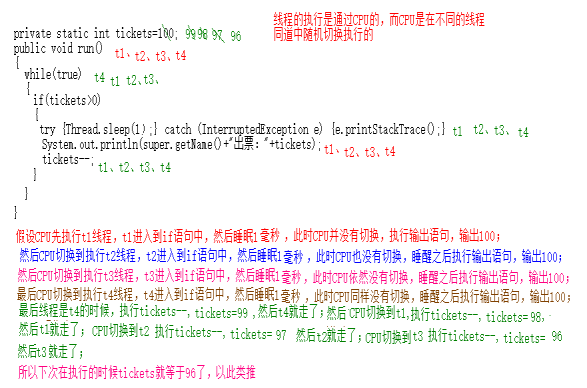
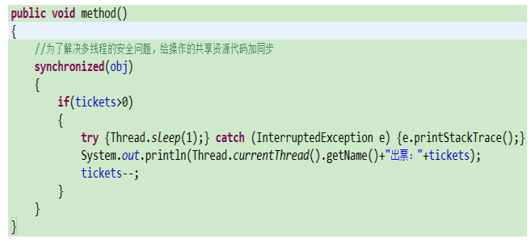
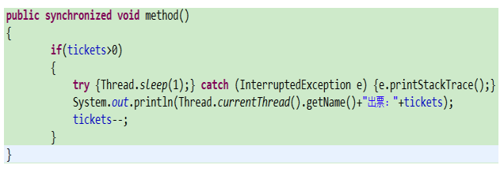
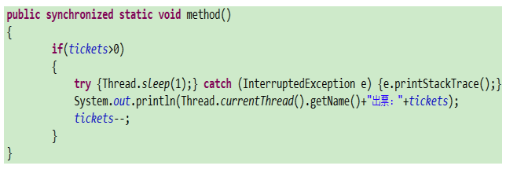
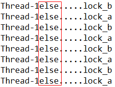
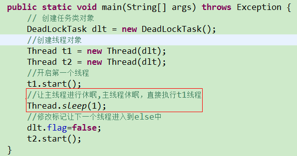
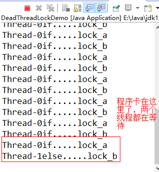
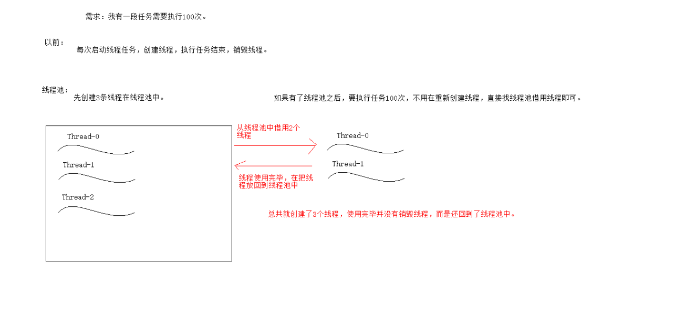
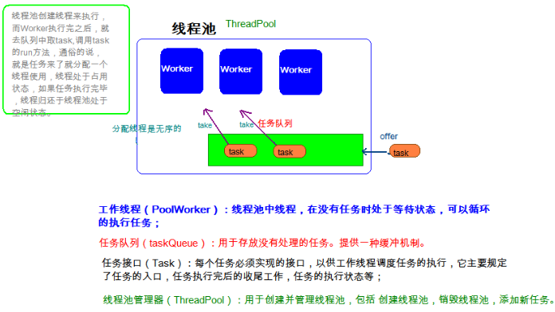

# 第一章 线程

## 1.1 Thread类

在上一天内容中我们已经可以完成最基本的线程开启，那么在我们完成操作过程中用到了`java.lang.Thread`类，API中该类中定义了有关线程的一些方法，具体如下：

**构造方法：**

- `public Thread(Runnable target)`:分配一个带有指定目标新的线程对象。
- `public Thread(Runnable target,String name)`:分配一个带有指定目标新的线程对象并指定名字。

**常用方法：**

- `public String getName()`:获取当前线程名称。
- `public void setName()`:设置当前线程名称。
- `public void start()`:导致此线程开始执行; Java虚拟机调用此线程的run方法。
- `public void run()`:此线程要执行的任务在此处定义代码。
- `public static void sleep(long millis)`:使当前正在执行的线程以指定的毫秒数暂停（暂时停止执行）。
- `public static Thread currentThread()  `:返回对当前正在执行的线程对象的引用。

翻阅API后得知创建线程的方式总共有两种，一种是继承Thread类方式，一种是实现Runnable接口方式，方式一我们上一天已经完成，接下来讲解方式二实现的方式。

## 1.2 创建线程方式二(开发使用这种)

通过之前的学习我们得知实现多线程的第一种方式是继承Thread类，那么第二种方式是什么呢？

API描述：

```java
创建线程的另一种方法是声明一个实现Runnable接口的类。 那个类然后实现了run方法。 然后可以分配类的实例，在创建Thread时作为参数传递，并启动。 
```

通过以上API得知，第二种方式是创建一个类来实现Runnable接口，并实现Runnable接口中的run函数。

### Runnable接口介绍

Runnable接口中只有一个函数如下所示：

```java
void run()当使用实现接口 Runnable的对象来创建线程时，启动线程将使该对象的 run方法在单独执行的线程中被调用。 
```

说明：

1）我们发现，Thread类其实已经实现Runnable接口了，Thread类中的run方法就是实现来自Runnable接口的。

2）Runnable接口中，只有一个run方法，而run方法是用来封装线程任务的。因此，这个接口就是专门用来封装线程任务的接口。为了区分和上述的Thread类，

因此，我们可以这样理解：实现该接口的类，称为任务类。

### 实现步骤

A：自定义类，实现Runnable接口，这个类就是任务类；

B：实现run方法，run函数中书写的任务代码；

C：创建任务类的对象；

D：创建Thread类对象，并且把任务对象作为参数传递；

​	说明：既然任务类的对象要作为Thread类构造函数的参数传递，而任务类我们又不知道叫什么名字，但是任务类需要实现Runnable接口，所以在Thread类的构造函数中肯定有Runnable接口类型作为参数接收。

**构造方法：**

- `public Thread(Runnable target)`:分配一个带有指定目标新的线程对象。
- `public Thread(Runnable target,String name)`:分配一个带有指定目标新的线程对象并指定名字。

注意：第二个构造函数的String类型的name是给自己定义的任务类线程起名字，不用在使用setName()给线程起名字。

E：启动线程

代码如下所示：

```java
/*
 * 演示实现多线程方式2：实现Runnable接口
 * A:定义一个类来实现Runnable接口，这个类是任务类
 * B:实现Runnable接口中的run函数
 * C:创建任务类对象
 * D:创建线程类Thread的对象，并把任务类对象作为参数传递
 * E:启动线程
 */
//A:定义一个类来实现Runnable接口，这个类是任务类
class MyTask implements Runnable
{
	//B:实现Runnable接口中的run函数
	public void run() {
		for (int i = 0; i < 10; i++) {
			System.out.println(Thread.currentThread().getName()+"==="+i);
		}
	}
}
public class ThreadDemo3 {
	public static void main(String[] args) {
		//C:创建任务类对象
		MyTask task = new MyTask();
//		D:创建线程类Thread的对象，并把任务类对象作为参数传递
		Thread t1 = new Thread(task,"锁哥");
		Thread t2 = new Thread(task,"助教");
		//E:启动线程
		t1.start();
		t2.start();
		for (int i = 0; i < 10; i++) {
			System.out.println(Thread.currentThread().getName()+"==="+i);
		}
	}
}
```


### 方式二的好处

A：避免了Java单继承的局限性；

说明：如果使用方式一，那么在Java中一个类只能有一个直接父类，如果一个类已经继承其他的父类，那么当前这个类中假如有需要多线程操作的代码，这时这个类是无法再继承Thread类的。这样就会导致当前这个类中的某些需要多线程执行的任务代码就无法被线程去执行。

B：把线程代码和任务的代码分离，解耦合(解除线程代码和任务的代码模块之间的依赖关系)。代码的扩展性非常好；

说明：Thread类是专门负责描述线程本身的。Thread类可以对线程进行各种各样的操作。如果使用第一种方式，那么把线程要执行的任务也交给了Thread类。这样就会导致操作线程本身的功能和线程要执行的任务功能严重的耦合在一起。

但是方式二，自定义一个类来实现Runnable接口，这样就把任务抽取到Runnable接口中，在这个接口中定义线程需要执行的任务的规则。当需要明确线程的任务时，我们就让这个类实现Runnable接口，只要实现Runnable接口的类，就相当于明确了线程需要执行的任务。

​	当一个类实现Runnable接口，就相当于有了线程的任务，可是还没有线程本身这个对象。这时我们就可以直接使用Thread这个类创建出线程，然后把任务交给线程。这样就达到任务和线程的分离以及结合。

## 1.3 匿名内部类方式实现线程的创建

使用线程的匿名内部类方式，可以方便的实现每个线程执行不同的线程任务操作。

 **使用匿名内部类的方式实现Runnable接口，重新复写Runnable接口中的run方法。**

```java
public static void main(String[] args) {
		//使用匿名内部类实现多线程 r表示任务类的对象
		Runnable r=new Runnable(){
			public void run() {
				for (int i = 0; i < 10; i++) {
					System.out.println(Thread.currentThread().getName()+"---"+i);
				}
			}
		};
		//创建线程类对象
		Thread t1=new Thread(r,"t1");
		Thread t2=new Thread(r,"t2");
		//启动线程
		t1.start();
		t2.start();
	}
```

## 1.4线程控制

### 线程休眠(掌握)

使用Thread类中的sleep()函数可以让线程休眠，函数如下所示：

static void sleep(long millis) 在指定的毫秒数内让当前正在执行的线程休眠（暂停执行）

说明：这个函数是静态的，使用线程类名调用。使用哪个线程调用就让哪个线程休眠。

代码如下所示：

分析和步骤：

1）创建一个测试类SleepDemo ，并添加main函数；

2）创建一个线程任务类SleepTask 来实现Runnable接口，并实现run函数，打印0到9十个数字，并且使用Thread类调用sleep()函数让当前线程睡一秒，并使用Date类的对象来获得睡眠的时间；

3）在main函数中创建线程任务类对象st；

4）创建线程类对象t，并给线程起名为兔子；

5）启动线程；

```java
/*
 * 演示线程的休眠
 * public static void sleep(long millis)
 */
//定义一个线程任务类
class SleepTask implements Runnable
{
	//实现run函数
	public void run() {
		for (int i = 0; i < 10; i++) {
			System.out.println(Thread.currentThread().getName()+"---"+i+new Date());
			//让线程睡一秒
			try {
				Thread.sleep(1000);
			} catch (InterruptedException e) {
				e.printStackTrace();
			}
		}
	}
}
public class SleepDemo {
	public static void main(String[] args) {
		//创建任务类对象
		SleepTask st = new SleepTask();
		//创建线程对象
		Thread t = new Thread(st,"兔子");
		//启动线程
		t.start();
	}
}
```

# 第二章 线程安全

## 2.1 线程安全

我们通过一个案例，演示线程的安全问题：

分析：

最近万达影城上映：《葫芦娃大战奥特曼》 ， 我们现在模拟一下电影院卖票：

我就卖一个放映厅中100张票。

我们有多个售票窗口，同时对外出售这100张票。

我们可以用线程来模拟售票的窗口。每个窗口可以认为是一个线程。窗口售票的过程，就可以认为是线程的任务

步骤：

1）定义一个测试类SellTicektDemo ，并定义一个main函数；

2）定义一个线程类SellTicketTask 来实现Runnable接口；

3）在SellTicketTask 任务类中定义一个变量tickets来存储100张票；

4）在run函数中使用循环模拟一直卖票，使用判断结构根据变量票数tickets是否大于0来确定是否还有余票；

5）如果有余票，使用打印语句来模拟卖票，然后票数量变量tickets-1；

6）在main函数中创建任务类对象stt,同时并创建四个线程类对象来模拟四个窗口，最后启动线程；

```java
/*
 * 售票，多个售票窗口卖100张票
 */
//定义线程任务类
class SellTicketTask implements Runnable
{
	//定义100张票
	private int tickets=100;
	//实现run函数
	public void run() 
	{
		//使用循环模拟一直卖票
		while(true)
		{
			//判断是否还有余票
			if(tickets>0)
			{
			    try {
                    Thread.sleep(10);
                } catch (InterruptedException e) {
                    e.printStackTrace();
                }
				//有余票 使用打印语句来模拟卖票
				System.out.println(Thread.currentThread().getName()+"出票："+tickets);
				//票数量-1
				tickets--;
			}
		}
	}
}
public class SellTicketDemo {
	public static void main(String[] args) {
		//创建线程任务类对象
		SellTicketTask stt = new SellTicketTask();
		//创建线程对象，四个线程模拟四个窗口
		Thread t1 = new Thread(stt,"窗口1");
		Thread t2 = new Thread(stt,"窗口2");
		Thread t3 = new Thread(stt,"窗口3");
		Thread t4 = new Thread(stt,"窗口4");
		//启动线程
		t1.start();
		t2.start();
		t3.start();
		t4.start();
	}
}
```

## 2.2 多线程安全问题分析

通过上述代码，我们发现输出的结果有如下问题：


上述代码出现的问题：重复票、跳票等问题。

出现上述问题的图解如下图所示：



原因分析：

​	A：多线程程序，如果是单线程就不会出现上述卖票的错误信息；

​	B：多个线程操作共享资源，如果多线程情况下，每个线程操作自己的也不会出现上述问题；

​	C：操作资源的代码有多行，如果代码是一行或者很少的情况下，那么一行代码很快执行完毕，也不会出现上述情况；

​	D：CPU的随机切换。本质原因是CPU在处理多个线程的时候，在操作共享数据的多条代码之间进行切换导致的；

## 2.3 多线程安全问题解决

解决方案：

​	A：无法改变，就是多线程程序。

​	B：无法改变，多个线程就是要操作同一资源。

​	C：无法改变，因为就是有多行代码

​	D：CPU的运行我们无法解决。针对CPU的切换，由操作系统去控制，而我们人为是无法干预。因此这个问题解决不了。

 

要解决安全问题：

​	可以人为的控制CPU在执行某个线程操作共享数据的时候，不让其他线程进入到操作共享数据的代码中去，这样就可以保证安全。

​	上述的这个解决方案：称为线程的同步。

 

​	要想保证线程的安全：需要在操作共享数据的地方，加上线程的同步。

​	加同步格式：

​		synchronized( 需要一个任意的对象（锁） ){

​			代码块中放操作共享数据的代码。

}

​		上述的格式称为多线程中的同步代码块。

​	同步代码块上的锁，可以是随便任意的一个对象。

### 同步代码块

1）加同步格式：

​	synchronized( 需要一个任意的对象（锁）)

    {

​         代码块中放操作共享数据的代码。

​    }

说明：

1）上述的格式称为多线程中的同步代码块。

2）同步代码块上的锁，可以是随便任意的一个对象。但是必须是唯一的。

​	问题1：对象是什么？

​		不确定，所以随便给一个。

​	问题2：哪些代码需要被同步？

​		操作共享数据的代码。

2）代码

上述代码为了避免多线程的安全问题，我们需要把上述卖票的代码加上同步代码块，这样就可以解决多线程的安全问题。

代码如下所示：

```java
/*
 * 售票，多个售票窗口卖100张票
 */
//定义线程任务类
class SellTicketTask implements Runnable
{
	//定义100张票
	private int tickets=100;
	//定义一个对象充当同步代码块上的锁
	private Object obj = new Object();
	//实现run函数
	public void run() 
	{
		//使用循环模拟一直卖票
		while(true)//t1 t2
		{
			//为了解决多线程的安全问题，给操作的共享资源代码加同步
			synchronized(obj)//t1 进来 关上门 上锁，此时t2进不来
			{
				//判断是否还有余票
				if(tickets>0)
				{
					//休眠1毫秒,模拟延迟
					try {Thread.sleep(1);} catch (InterruptedException e) {e.printStackTrace();}
					//有余票 使用打印语句来模拟卖票
					System.out.println(Thread.currentThread().getName()+"出票："+tickets);
					//票数量-1
					tickets--;
				}
			}
			//t1出来，释放锁，打开门 其他线程可以进入
		}
	}
}
public class SellTicketDemo {
	public static void main(String[] args) {
		//创建线程任务类对象
		SellTicketTask stt = new SellTicketTask();
		//创建线程对象，四个线程模拟四个窗口
		Thread t1 = new Thread(stt,"窗口1");
		Thread t2 = new Thread(stt,"窗口2");
		Thread t3 = new Thread(stt,"窗口3");
		Thread t4 = new Thread(stt,"窗口4");
		//启动线程
		t1.start();
		t2.start();
		t3.start();
		t4.start();
	}
}
```

### 同步方法

1）演示同步方法

代码和上述代码几乎差不多，只是将同步代码块处调用方法method，然后将同步代码块变为同步方法。

如下所示：



如上图所示，如果一个方法进来后，直接就是同步，也就是说，这个方法的所有代码都需要被同步。此时我们可以考虑把同步直接加到方法上：




以上被synchronized关键字修饰的方法称为同步方法。

注意：同步方法上的锁：

​	同步方法的锁，不需要我们指定。证明，同步方法有自己默认的锁。

​	这个锁肯定是一个对象。而这个对象是同步方法能拿到的。上述method方法是非静态方法，而任何非静态方法，都有一个隐含的对象，就是：this。

​	所以，我们推测：同步方法的锁就是this。

 

注意：

​	A：如果一个方法内部，所有代码都需要被同步，那么就用同步方法；

​	B：非静态同步方法的锁是this；

### 静态同步方法

1）演示

既然有非静态同步方法，那么肯定也会有静态同步方法。

将上述非静态同步方法改为静态同步方法，代码如下所示：



问题：非静态同步方法有隐式变量this作为锁，那么静态方法中没有this，那么静态同步方法中的锁又是什么呢？

2）静态同步方法上的锁

​	静态同步方法，没有this，所以不能用this来做锁。 

​	静态方法，类加载的时候，就已经被加载了。这个时候，锁已经确定了。

​	静态同步方法的锁，肯定也是一个对象，而且这个对象应该是在类加载时就已经存在。

​	静态同步方法的锁是：当前类的字节码文件对象(Class对象)。

其实可以这么理解：什么是字节码文件对象呢？其实就是class文件，类名.class。比如这里，就是  SellTicketTask.class

​	获取Class对象的方式：类名.class； 

说明：

类名.class整体表示一个对象，class是作为类名的一个静态属性存在。这个class属性是所有的类型都具备的，API不会去专门描述他，他本身就在所有的类型中存在。

**总结：**

​	**同步代码块：锁是任意对象，但是必须唯一；**

​	**非静态同步方法：锁是this；**

​	**静态同步方法：锁是当前类的字节码文件对象；类名.class**

### JDK1.5后的同步解决(掌握)

锁的升级：

​	在JDK5之前，锁的获取和释放都是隐式的，看不见。也就说我们并没有直接看到在哪里加上了锁，在哪里释放了锁。到了JDK5的时候，java中提供了一个Lock接口，在这个接口中定义了锁的释放和获取的方法，后期程序中需要使用同步，这时可以使用Lock接口的实现类显示的完成锁的获取和释放的动作。

java.util.concurrent.locks.Lock机制提供了比**synchronized**代码块和**synchronized**方法更广泛的锁定操作,同步代码块/同步方法具有的功能Lock都有。

Lock锁也称同步锁，加锁与释放锁方法化了，如下：

- `public void lock() `:加同步锁。
- `public void unlock()`:释放同步锁。

注意：在使用Lock锁对象时，需要手动的书写代码用来：获取锁、释放锁

      （在同步代码块中不需要手动的书写获取锁、释放锁的代码。但是，同步代码块在执行时底层还是会获取锁、释放锁）

 由于Lock属于接口，不能创建对象，所以我们可以使用它的子类[ReentrantLock](mk:@MSITStore:C:\javaee\开发资料\API\JDK_API_1_6_zh_CN.CHM::/java/util/concurrent/locks/../../../../java/util/concurrent/locks/ReentrantLock.html)来创建对象并使用Lock接口中的函数。

#### 使用Lock演示卖票案例

需求：使用Lock实现线程安全的卖票。

分析和步骤：

1）定义一个卖票的任务类SellTicketTask 类并实现Runnable接口；

2）在任务类中定义一个成员变量tickets保存票数100；

3）定义一把锁Lock的对象l；

4）在run函数中模拟卖票，if语句的上面使用锁对象l调用lock()函数获取锁，等待if语句结束之后，使用锁对象l调用unlock()函数释放锁；

5）定义测试类SellTicketDemo ，在这个类中分别创建任务类的对象和线程类的对象，并使用线程类的对象调用start()函数来启动线程；

```java
/*
 * 需求：使用Lock实现线程安全的卖票。
 * Lock是接口，只能通过他的子类ReentrantLock创建对象
 * 构造函数 ReentrantLock()  创建一个 ReentrantLock 的实例。
 *  void lock() 获取锁。 
 *  void unlock() 试图释放此锁。 
 */
//定义一个任务类用来卖票
class SellTicketTask implements Runnable
{
	//定义100张票
	private static int tickets=100;
	//创建对象作为任意一把锁
//	private Object obj=new Object();
	//定义一把锁
	Lock l=new ReentrantLock();
	//模拟卖票
	public void run() {
		/*while(true)
		{
			synchronized (obj) {
				if(tickets>0)
				{
					System.out.println(Thread.currentThread().getName()+"出票："+tickets--);
				}
			}
		}*/
		//使用Lock锁替换synchronized
		while(true)
		{
				//获取锁
				l.lock();
				if(tickets>0)
				{
					try {Thread.sleep(1);} catch (InterruptedException e) {}
					System.out.println(Thread.currentThread().getName()+"出票："+tickets--);
				}
				//释放锁
				l.unlock();
		}
	}
}
public class SellTicketDemo {
	public static void main(String[] args) {
		// 创建任务类对象
		SellTicketTask stt = new SellTicketTask();
		//创建线程对象
		Thread t1 = new Thread(stt,"窗口1");
		Thread t2 = new Thread(stt,"窗口2");
		Thread t3 = new Thread(stt,"窗口3");
		Thread t4 = new Thread(stt,"窗口4");
		//启动线程
		t1.start();
		t2.start();
		t3.start();
		t4.start();
	}
}
```

# 第三章 死锁

## 1. **什么是死锁**

死锁：是指两个或者两个以上的线程在执行的过程中，因争夺资源产生的一种互相等待的现象。

死锁在开发中，也会遇到，当线程进入到死锁状态时，程序中线程就会一直处于等待状态。

死锁的发生：

举例1：

我请柳岩吃饭（麻辣烫）

我点了一份。上了一双筷子

我：一支

柳岩：一支

我和柳岩就相当于两个线程，而麻辣烫相当于共享资源，两个人都没办法吃，都在等待看着麻辣烫，这种现象就是死锁。

 举例2：有两个线程（t1线程、t2线程），有两个对象锁（lock_a、lock_b）

​      t1线程在执行时，先拿到lock_a对象锁（此时lock_a对象锁绑定在t1线程上）。而正在此时CPU切换到t2线程上，t2线程拿到lock_b对象锁（此时lock_b对象锁绑定在t2线程上），这时CPU又切换到t1线程上，这时t1线程需要拿lock_b对象锁，此时t1线程获取不到lock_b对象锁（t1线程处于等待）。

当CPU切换到t2线程上，这时t2线程需要拿lock_a对象锁，此时t2线程获取不到lock_a对象锁（B线程处于等待）。

 

上述案例2简化如下说法：	

​	有2个线程，需要执行相同的任务，但是需要分别获取的A锁和B锁才能去执行，第一个线程获取锁的顺序是先A后B。第二个线程获取锁的顺序是先B后A。

当第一个线程获取A锁，CPU切换到第二个线程，此时第二个线程获取B锁。而此时第一个线程缺少B锁，第二个线程缺少A锁。两个线程都在等待，发生死锁现象。

## 2.产生死锁的条件

1. 有多把锁 

2. 有多个线程 
3. 有同步代码块嵌套

## **3.** **代码演示**

分析和步骤：

1）创建一个任务类DeadLockTask 实现Runnable接口，复写run函数；

2）创建两个Object类的对象lock_a，lock_b作为锁对象；

3）定义一个变量flag，让不同的线程切换到不同的地方去执行，按照不同的方式来获取锁；

4）在run函数中使用if-else结构来控制两个线程去执行不同的内容，并使用while循环一直让其执行；

5）在if中嵌套书写两个同步代码块lock_a和lock_b分别作为两个代码块的锁，将if中相同的内容复制一份写到else中；

6）创建测试类DeadThreadLockDemo,在这个类的主函数中创建任务类的对象；

7）创建两个线程对象t1和t2；

8）让主线程休息1毫秒；

9）使用t1对象调用start函数开启线程，让下一个线程进入到else中；

10）开启t2线程；

代码如下所示：

~~~java
/*
 * 演示线程死锁的问题
 */
//定义一个线程任务类
class DeadLockTask implements Runnable
{
	//定义两个锁对象
	private Object lock_a=new Object();
	private Object lock_b=new Object();
	//定义一个变量作为标记，控制取锁的方式
	 boolean flag=true;
	public void run() {
		//当线程进来之后，一个线程进入到if中，另一个进入到else中
		if(flag)
		{
			while(true)
			{
				synchronized(lock_a)
				{
					System.out.println(Thread.currentThread().getName()+"if.....lock_a");
					synchronized(lock_b)
					{
						System.out.println(Thread.currentThread().getName()+"if.....lock_b");
					}
				}
			}
		}else
		{
			while(true)
			{
				synchronized(lock_b)
				{
					System.out.println(Thread.currentThread().getName()+"else.....lock_b");
					synchronized(lock_a)
					{
						System.out.println(Thread.currentThread().getName()+"else.....lock_a");
					}
				}
			}
		}
	}
}
public class DeadThreadLockDemo {

	public static void main(String[] args) {
		// 创建任务类对象
		DeadLockTask dlt = new DeadLockTask();
		//创建线程对象
		Thread t1 = new Thread(dlt);
		Thread t2 = new Thread(dlt);
		//开启第一个线程
		t1.start();
		//修改标记让下一个线程进入到else中
		dlt.flag=false;
		t2.start();
	}
}
~~~

上述代码的结果如下图所示：



通过以上结果发现，线程一直在执行else中的代码，根本就没有执行if语句中的代码。

说明：

出现上述结果是因为在主线程开启第一个线程之后，很有可能CPU还在主线程上运行，那么开启的线程是不会被CPU立刻去执行，而CPU继续处理主线程中的代码， 就会直接去执行d.flag = false; ，这时就已经把标记修改成false，不管线程是否进入到run 方法中，flag都已经变成false，那么就无法在进入if中，因此我们为了保证第一个线程一定能够进入到if中，于是在这里让主线程在开启第一个线程之后，主线程进行休眠1毫秒。



死锁的结果如下图所示：



注意：在开发中一旦发生了死锁现象，不能通过程序自身解决。必须修改程序的源代码。

​      在开发中，死锁现象可以避免，但不能直接解决。当程序中有多个线程时，并且多个线程需要通过嵌套对象锁(在一个同步代码块中包含另一个同步代码块)的方式才可以操作代码，此时就容易出现死锁现象。

​      可以使用一个同步代码块解决的问题，不要使用嵌套的同步代码块，如果要使用嵌套的同步代码块，就要保证同步代码块的上的对象锁使用同一个对象锁（唯一的对象锁）


# 第四章 线程状态

## 线程状态概述

线程由生到死的完整过程：技术素养和面试的要求。

当线程被创建并启动以后，它既不是一启动就进入了执行状态，也不是一直处于执行状态。在线程的生命周期中，有几种状态呢？在API中`java.lang.Thread.State`这个枚举中给出了六种线程状态：

注意：关于CPU执行线程有两个概念需要了解下：

​	CPU的执行资格：在CPU执行的队列中等待。还没有被CPU执行。

​	CPU的执行权：当前持有CPU资源，正在被执行。

线程生命周期：就是线程从生到死。

| 线程状态                | 导致状态发生条件                                             |
| ----------------------- | ------------------------------------------------------------ |
| NEW(新建)               | 线程刚被创建，但是并未启动。还没调用start方法。MyThread t = new MyThread()只有线程对象，没有线程特征。 |
| Runnable(可运行)        | 线程可以在java虚拟机中运行的状态，可能正在运行自己代码，也可能没有，这取决于操作系统处理器。调用了t.start()方法   ：就绪（经典叫法） |
| Blocked(锁阻塞)         | 当一个线程试图获取一个对象锁，而该对象锁被其他的线程持有，则该线程进入Blocked状态；当该线程持有锁时，该线程将变成Runnable状态。 |
| Waiting(无限等待)       | 一个线程在等待另一个线程执行一个（唤醒）动作时，该线程进入Waiting状态。进入这个状态后是不能自动唤醒的，必须等待另一个线程调用notify或者notifyAll方法才能够唤醒。 |
| Timed Waiting(计时等待) | 同waiting状态，有几个方法有超时参数，调用他们将进入Timed Waiting状态。这一状态将一直保持到超时期满或者接收到唤醒通知。带有超时参数的常用方法有Thread.sleep 、Object.wait。 |
| Terminated(被终止)      | 因为run方法正常退出而死亡，或者因为没有捕获的异常终止了run方法而死亡。 |


我们不需要去研究这几种状态的实现原理，我们只需知道在做线程操作中存在这样的状态。那我们怎么去理解这几个状态呢，新建与被终止还是很容易理解的，我们就研究一下线程从Runnable（可运行）状态与非运行状态之间的转换问题。

# 第五章 等待唤醒机制(包子铺卖包子)

​	我们的卖票案例中，所有的线程都是在做相同的任务：卖票。而我们真实情况中，不同的线程有可能需要去做不同的任务。在程序中，最常见的一种模型，就是生产者和消费者模型。生产者线程和消费者线程之间需要进行通信，我们可以使用等待唤醒机制来实现生产者线程和消费者线程之间的通信。

- Object类的方法 

  ```java
  wait()		:让当前线程进入等待状态
  notify()	:唤醒一个正在等待的线程，唤醒是随机的
  void notifyAll() 唤醒在此对象监视器上等待的所有线程。 
  
  注意事项： 必须要使用锁对象来调用的。
  ```

  - 两个方法的小疑问

    - 等待和唤醒的方法为什么要定义在Object类中？

      ```
      因为需要用锁对象调用这两个方法，任意对象都可以作为锁对象。
      也就是说任意类型的对象都可以调用的两个方法，就需要定义在Object类中
      ```

    - 两个方法必须写在同步里面吗？

      ```
      两个方法必须要在同步里面调用，因为在同步里面才有锁对象。
      ```

  - 如果一个线程执行了wait()方法，那么当前线程进入等待状态，并且会释放锁对象，下次即使被唤醒必须获取到锁对象才可以执行。

  

- 包子案例

  说明：

  ​	1.定义一个包子类，类中成员变量：

  ~~~java
   pi //皮儿
   xian //馅儿
   flag://用来表示有没有包子,用true来代表有   用false来代表没有
  ~~~

  ​	2.定义一个生产包子的任务类即生产者线程类：

  ~~~java
  生产者线程思想：如果有包子就不需要制作，让生产者线程进入等待状态；如果没有包子，开始制作包子，并且唤醒消费者线程来吃包子
  ~~~

  ​	 3.定义一个消费包子的任务类即消费者线程类：

  ~~~java
  消费者线程思想：如果没有包子就不消费，让消费者线程进入等待状态；如果有包子，开始吃包子，并且唤醒生产者线程来生产包子
  ~~~

  

  ```java
  /*
      包子类需要定义3个成员变量：
          pi
          xian
          flag:表示是否有包子
   */
  //包子类
  public class BaoZi {
      //皮儿
      String pi;
      //馅儿
      String xian;
      //布尔值
      boolean flag=false;  //用来表示有没有包子,用true来代表有   用false来代表没有
  }
  
  //生产包子:生产者线程执行的任务
  /*
      生产者线程思想：如果有包子就不需要制作，让生产者线程进入等待状态；如果没有包子，开始制作包子，并且唤醒消费者线程来吃包子
   */
  public class ZhiZuo implements Runnable {
      //成员变量
      BaoZi baoZi;
      //构造方法
      public ZhiZuo(BaoZi baoZi) {
          this.baoZi = baoZi;
      }
  
      @Override
      public void run() {
          //制作包子
          while (true){
              synchronized ("锁"){//t1
                  if(baoZi.flag == true){
                      //如果有包子就不需要制作
                      //就让制作的线程进入等待状态
                      try {
                          "锁".wait();
                      } catch (InterruptedException e) {
                      }
                  }
                      //表示没有包子
                      //制作包子
                      baoZi.pi = "白面";
                      baoZi.xian = "韭菜大葱";
                      //修改包子状态
                      baoZi.flag = true;
                      System.out.println("生产出了一个包子！");
  
                      //生产好了包子叫醒吃货(消费者)来吃
                      "锁".notify();
               
              }
          }
      }
  }
  
  //吃包子:消费者线程执行的任务
  /*
      消费者线程思想：如果没有包子就不消费，让消费者线程进入等待状态；如果有包子，开始吃包子，并且唤醒生产者线程来生产包子
   */
  public class ChiHuo implements Runnable {
      //成员变量
      BaoZi baoZi;
      //构造方法
      public ChiHuo(BaoZi baoZi) {
          this.baoZi = baoZi;
      }
  
      @Override
      public void run() {
          //吃包子
          while(true){
              synchronized ("锁"){
                  if(baoZi.flag == false){
                      //没包子
                      //让吃包子的线程进入等待
                      try {
                          "锁".wait();
                      } catch (InterruptedException e) {
                      }
                  }
                      //表示有包子
                      //开吃
                      System.out.println("吃货吃了一个" + baoZi.pi+"皮儿，" + baoZi.xian + "馅儿的大包子");
                      baoZi.pi = null;
                      baoZi.xian = null;
                      //修改包子状态
                      baoZi.flag = false;
  
                      //吃完包子叫醒对方(生产者)来做
                      "锁".notify();
                  
              }
          }
      }
  }
  
  //测试类
  public class Test01 {
      public static void main(String[] args) {
          //创建包子
          BaoZi baoZi = new BaoZi();
          //创建对象
          ZhiZuo zz = new ZhiZuo(baoZi);
          Thread t1 = new Thread(zz);//生产者线程
          t1.start();
          //创建对象：消费者线程
          ChiHuo ch = new ChiHuo(baoZi);
          Thread t2 = new Thread(ch);
          t2.start();
      }
  }
  ```


# 第六章 线程池

## 6.1 线程池的思想 


我们使用线程的时候就去创建一个线程，这样实现起来非常简便，但是就会有一个问题：

如果并发的线程数量很多，并且每个线程都是执行一个时间很短的任务就结束了，这样频繁创建线程就会大大降低系统的效率，因为频繁创建线程和销毁线程需要时间。

那么有没有一种办法使得线程可以复用，就是执行完一个任务，并不被销毁，而是可以继续执行其他的任务？

在Java中可以通过线程池来达到这样的效果。今天我们就来讲解一下Java的线程池。

## 6.2 线程池概念

程序启动一个新线程成本是比较高的，因为它涉及到要与操作系统进行交互。因为启动线程的时候会在内存中开辟一块空间，消耗系统资源，同时销毁线程的时候首先要把和线程相关东西进行销毁，还要把系统的资源还给系统。这些操作都会降低操作性能。尤其针对一个线程用完就销毁的更加降低效率。

而使用线程池可以很好的提高性能，尤其是当程序中要创建大量生存期很短的线程时，生存期较短的线程指的是用完一次线程就丢掉。更应该考虑使用线程池。

线程池里的每一个线程代码结束后，并不会死亡，而是再次回到线程池中成为空闲状态，等待下一个对象来使用。

线程池工作原理如下图所示：

需求：我有一段任务，需要执行100次。





说明：

每次线程执行完任务以后，线程不会销毁，会放回线程池中，每次在执行任务的时候又会到线程池中去取线程。这样会提高效率。

合理利用线程池能够带来三个好处：

1. 降低资源消耗。减少了创建和销毁线程的次数，每个工作线程都可以被重复利用，可执行多个任务。
2. 提高响应速度。当任务到达时，任务可以不需要的等到线程创建就能立即执行。
3. 提高线程的可管理性。可以根据系统的承受能力，调整线程池中工作线程的数目，防止因为消耗过多的内存，而把服务器累趴下(每个线程需要大约1MB内存，线程开的越多，消耗的内存也就越大，最后死机或者宕机)。


## 6.3 线程池的使用

Java里面线程池的顶级接口是`java.util.concurrent.Executor`，以及他的子接口`java.util.concurrent.ExecutorService`。

要配置一个线程池是比较复杂的，尤其是对于线程池的原理不是很清楚的情况下，很有可能配置的线程池不是较优的，因此在`java.util.concurrent.Executors`线程工厂类里面提供了一些静态工厂，生成一些常用的线程池。官方建议使用Executors工程类来创建线程池对象。

Executors类中有个创建线程池的方法如下：

- `public static ExecutorService newFixedThreadPool(int nThreads)`：返回线程池对象。(创建的是有界线程池,也就是池中的线程个数可以指定最大数量)

获取到了一个线程池ExecutorService 对象，那么怎么使用呢，在这里定义了一个使用线程池对象的方法如下：

- `public Future<?> submit(Runnable task)`:获取线程池中的某一个线程对象，并执行

  > Future接口：用来记录线程任务执行完毕后产生的结果。


使用线程池中线程对象的步骤：

​	A：自定义一个类，作为任务类并实现Runnable接口；

​	B：实现Runnable接口中的run方法；

​	C：创建任务类的对象；

​	D：获取线程池对象；

​	E：直接执行任务；​

需求：使用线程池来完成卖票任务。


**Runnable实现类代码：**

```java
//A:自定义一个类，作为任务类并实现Runnable接口；
class SellTicketTask implements Runnable
{
	//定义成员变量存储100张票
	private static int tickets=100;
	//创建锁对象
	private Lock l=new ReentrantLock();
	//B:实现Runnable接口中的run方法；
	public void run() {
		// 模拟卖票
		while(true)
		{
			//获取锁
			l.lock();
			if(tickets>0)
			{
				//休眠
				try {
					Thread.sleep(1);
				} catch (InterruptedException e) {
				}
				System.out.println(Thread.currentThread().getName()+"出票："+tickets);
                  tickets--;
			}
			//释放锁
			l.unlock();
		}
	}
}
```

线程池测试类：

```java
public class SellTicketDemo {
	public static void main(String[] args) {
		//C:创建任务类的对象；
		SellTicketTask stt = new SellTicketTask();
		//D:获取线程池对象； 获取2个线程
		ExecutorService es = Executors.newFixedThreadPool(2);
		//E:直接执行任务； 
      	  //自己创建线程对象的方式
        // Thread t = new Thread(stt);
        // t.start(); ---> 调用MyRunnable中的run()

        // 从线程池中获取线程对象,然后调用SellTicketTask中的run()
        es.submit(stt);
        // 再获取个线程对象，调用SellTicketTask中的run()
        es.submit(stt);
	}
}
```

