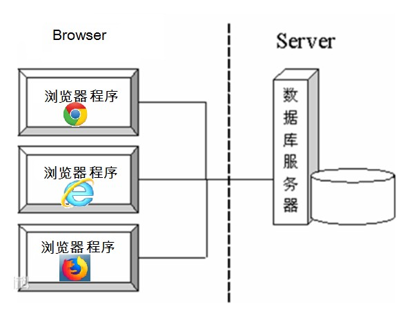

# 第一章 网络编程入门

## 1.1 网络通信协议

我们以前写的程序，都是在自己的计算机中，内存与硬盘、内存与内存之间进行数据的传输、交互。都是在本机。

并没有实现计算机之间的数据传输和交互。现在我们的目标是把自己本地的数据传输给其他的电脑。在2台电脑，或者多台终端设备之间要进行数据的传输。

首先要进行数据的传输，我们就必须先把多台设备之间连接起来。多台设备之间要进行连接，就必须通过计算机网络。

通过计算机网络可以使多台计算机实现连接，位于同一个网络中的计算机在进行连接和通信时需要遵守一定的规则，这就好比在道路中行驶的汽车一定要遵守交通规则一样。在计算机网络中，这些连接和通信的规则被称为网络通信协议，它对数据的传输格式、传输速率、传输步骤等做了统一规定，通信双方必须同时遵守才能完成数据交换。

网络通信协议有很多种，目前应用最广泛的是TCP/IP协议(Transmission Control Protocal/Internet Protocal传输控制协议/英特网互联协议)，它是一个包括TCP协议和IP协议。UDP（User Datagram Protocal）协议和其它一些协议的协议组。数据报包协议。

* **TCP/IP协议：** 传输控制协议/因特网互联协议( Transmission Control Protocol/Internet Protocol)，是Internet最基本、最广泛的协议。它定义了计算机如何连入因特网，以及数据如何在它们之间传输的标准。它的内部包含一系列的用于处理数据通信的协议，并采用了4层的分层模型，每一层都呼叫它的下一层所提供的协议来完成自己的需求。


## 1.2 协议分类

通信的协议还是比较复杂的，`java.net` 包中包含的类和接口，它们提供低层次的通信细节。我们可以直接使用这些类和接口，来专注于网络程序开发，而不用考虑通信的细节。

`java.net` 包中提供了两种常见的网络协议的支持：

- **TCP**：传输控制协议 (Transmission Control Protocol)。TCP协议是**面向连接**的通信协议，即传输数据之前，在发送端和接收端建立逻辑连接，然后再传输数据，它提供了两台计算机之间可靠无差错的数据传输。
  - 三次握手：TCP协议中，在发送数据的准备阶段，客户端与服务器之间的三次交互，以保证连接的可靠。
    - 第一次握手，客户端向服务器端发出连接请求，等待服务器确认。
    - 第二次握手，服务器端向客户端回送一个响应，通知客户端收到了连接请求。
    - 第三次握手，客户端再次向服务器端发送确认信息，确认连接。整个交互过程如下图所示。


​    完成三次握手，连接建立后，客户端和服务器就可以开始进行数据传输了。由于这种面向连接的特性，TCP协议可以保证传输数据的安全，所以应用十分广泛，例如下载文件、浏览网页等。

说明：TCP协议在通信的时候，要求通信的双方先建立起连接（面向有连接的协议），形成传输数据的通道，在连接中进行大数据量传输。

**总结**

TCP特点：

A：不限制数据的大小，大数据传输；

B：需要建立链接；我们称为客户端和服务端的连接为连接通道

C：安全可靠；

D：效率低；

举例：类似于打电话或者QQ视频。

- **UDP**：用户数据报包协议。UDP 是User Datagram Protocol的简称， 中文名是用户数据报包协议。

  说明：

  UDP协议表示将数据源和目的地封装成数据报包中，然后不需要建立连接。每个数据报的大小被限制在64K。发送一方，不用关心接收一方是否在线。就直接发送数据。如果对方在就可以接收数据，如果对方不在，这时数据就自动的被丢弃。所以，UDP协议不安全，不可靠，但是效率高。不能传输大数据。

  总结：

  UDP特点：

  A：把数据封装成数据报包；

  B：限制大小(限制在64K)；

  C：不需要建立链接；

  D：不安全，不可靠；

  E：速度快；

  举例：类似于对讲机。

## 1.4 网络编程三要素

### 协议

* **协议：**计算机网络通信必须遵守的规则，已经介绍过了，不再赘述。

### IP地址

要想使网络中的计算机能够进行通信，必须为每台计算机指定一个标识号，通过这个标识号来指定接受数据的计算机或者发送数据的计算机。

处于网络中的通信设备，它们都会分配一个IP地址。

IP：要想让网络中的计算机能够互相通信，必须为每台计算机指定一个标识号，通过这个标识号来指定要接受数据的计算机和识别发送的计算机，在TCP/IP协议中，这个标识号就是IP地址。

也可以理解为IP地址是对处于网络中的某个通信终端的标识。然后通信的另外一方，就可以根据这个IP地址找到对方，和对方进行通信。

 

对IP地址进行说明：

1、IPv4：IP协议的[版本号](http://baike.baidu.com/item/%E7%89%88%E6%9C%AC%E5%8F%B7)是4(简称为IPv4，v，version版本)，早期的IP地址方式。4*8共32位来表示IP，总共43亿(2的32次方)个IP地址。数量有限，所以就有了IPv6。

由于计算机只识别2进制数据，所以IP地址其实是二进制的：

举例：11000000 10101000 01010000 11000110

问题：那么为什么IP地址可以使用数字表示呢？

对于用户来讲，使用一些2进制数据来标识计算机，不容易记住。计算机提供了一种方式：”点分10进制”。 IP地址使用一些10进制数据表示，中间使用”.”来分隔。

每8个位作为一段，转为10进制如下：

​	192.168.80.198

例如上述的IPv4地址：192.168.100.107

 

2、IPv6：IPv6是Internet Protocol Version 6的缩写，其中Internet Protocol是“[互联网协议](http://baike.baidu.com/item/%E4%BA%92%E8%81%94%E7%BD%91%E5%8D%8F%E8%AE%AE)”。新的IP地址方式。用来替换IPv4协议。

解决了IPv4协议带来的网络地址资源有限的问题。

IPv6的地址长度为128，是IPv4地址长度的4倍。即采用 8*16 共128位来表示IP，根本用不完。

于是IPv4点分十进制格式不再适用，采用十六进制表示。

IPv6地址：每16位二进制位做1段，然后将每一段的二进制转为16进制。

 

补充(了解下即可)：

关于IPv6协议有一种表示法叫做：0位压缩表示法：

　　在某些情况下，一个IPv6地址中间可能包含很长的一段0，可以把连续的一段0压缩为“::”。但为保证地址解析的唯一性，地址中”::”只能出现一次，例如：

　　在某些情况下，一个IPv6地址中间可能包含很长的一段0，可以把连续的一段0压缩为“::”。但为保证地址解析的唯一性，地址中”::”只能出现一次，例如：
　　FF01:0:0:0:0:0:0:1101 → FF01::1101

例如：上述的 本地链接 IPv6 地址就是这种表示法  : fe80::c805:5e47:820f:174

**常用命令**

* 查看本机IP地址，在控制台输入：

```java
ipconfig
```

* 检查网络是否连通，在控制台输入：

```java
ping 空格 IP地址
ping 192.168.1.10
```

**特殊的IP地址**

* 本机IP地址：`127.0.0.1`、`localhost`   本地回环地址 ，就是本机地址。。

### 端口号

我们通过ip可以找到网络中具体的计算机。而具体需要访问计算机中的哪个资源信息，这时由于计算机中运行的进程肯定很多，这时每个进程必须再给一个唯一的编号（标识）。通过这个标识才能保证我们可以没有错误的访问到指定ip地址的具体的那个进程上。

上述所说的编号(标识)就是一台电脑上某个应用程序的端口。只有通过这个端口才能去访问运行中的这个程序。

端口号：

A：端口是进程的唯一标识，每个进程都至少有一个端口；

B：不同进程的端口不能重复；

C：端口号是用两个字节（16位的二进制数）表示的有效端口0~65535，0到1024之间的端口数字已经分配给本机的操作系统的应用程序占用，因此后期我们书写程序如果需要绑定端口，这时必须大于1024；

D:通过360可以查看每个进程的端口号；

接下来通过一个图例来描述IP地址和端口号的作用，如下图所示。


从上图中可以清楚地看到，位于网络中一台计算机可以通过IP地址去访问另一台计算机，并通过端口号访问目标计算机中的某个应用程序。

利用`协议`+`IP地址`+`端口号` 三元组合，就可以标识网络中的进程了，那么进程间的通信就可以利用这个标识与其它进程进行交互。

## **1.5** InetAddress类(理解)

在网络中需要连接另外一段的设备，然后才能进行通信。而处于网络中的设备都需要唯一的数字地址标识（IP）。

Java使用InetAddress类来描述IP这个事物：

 

说明：

1）网络编程中的类或接口都位于java.net包下；

2）InetAddress 类将IP地址进行了封装；

3）InetAddress 类的对象中一定包含IP地址，但是有可能包含相应的主机名(主要取决于创建对象时调用的函数)；

4）InetAddress类没有对外提供构造函数，其中提供静态的方法可以根据指定的主机（域名）找到对应的IP，然后把IP封装成InetAddress对象。

 

InetAddress 类的主要函数如下所示：

A:static InetAddress getByName(String host) 在给定主机名的情况下确定主机的 IP 地址。

说明：

1）通过这个函数获取的对象中肯定包含IP地址和主机名；

2）域名如：www.baidu.com也可以作为主机名，即这个函数的参数封装成对象来获取IP，或者主机名如：suoge也可以作为这个函数的参数；

3）同样也可以将一个字符串形式的IP地址作为此函数的参数来封装成对象，如192.168.71.100；

说明：如果参数为IP地址时，封装的对象中不一定包含主机名。有可能包含的情况是：在给IP地址时，有可能会反向解析，但是这种解析有可能会失败。解析不到，那么对象中就不会有主机名。

由于InetAddress类的对象中封装的是IP地址和主机名，所以通过以下函数可以获取对象中的IP和主机名：

​	B：String getHostAddress()返回 IP 地址字符串（以文本表现形式）。 

​	C：String getHostName()获取此 IP 地址的主机名。

 

上述函数代码演示如下所示：

分析和步骤：

1）创建测试类InetAddressDemo ，在测试类中定义一个main函数；

2）根据InetAddress调用getByName()函数获取InetAddress类的对象ia；

3）使用InetAddress类的对象ia调用 getHostAddress()函数获取指定主机的IP地址；

4）使用InetAddress类的对象ia调用getHostName()函数IP 地址的主机名；

5）输出上述获取的IP地址和主机名；

6）使用InetAddress类调用getAllByName获取InetAddress类的对象并放到数组中，遍历数组依次打印数组中的内容；

```java
/*
* 演示：InetAddress的基本使用
* 封装IP对象：
* 	static InetAddress getByName(String host) 在给定主机名的情况下确定主机的 IP 地址。
* 获取IP和主机信息：
* 	String getHostAddress()返回 IP 地址字符串（以文本表现形式）。 
* 	String getHostName()获取此 IP 地址的主机名。
*/
public class InetAddressDemo {
	public static void main(String[] args) throws Exception {
		// static InetAddress getByName(String host) 在给定主机名的情况下确定主机的 IP 地址。
		// suoge表示我的电脑主机名字
		InetAddress ia = InetAddress.getByName("suoge");// suoge/192.168.100.107
		// InetAddress ia = InetAddress.getByName("192.168.100.107");//
		// /192.168.100.107
		// System.out.println(ia);
		// String getHostAddress()返回 IP 地址字符串（以文本表现形式）。
		String ip = ia.getHostAddress();
		// String getHostName()获取此 IP 地址的主机名。
		String hostName = ia.getHostName();
		/*
		 * InetAddress ia = InetAddress.getByName("suoge"):
		 * 192.168.100.107=====suoge
		 * 说明当使用主机名作为函数参数时将计算机名和IP地址同时封装在该对象中，此时调用getHostName获取IP 地址的主机名时，就会获取到指定的计算机名suoge
		 * ================================================================
		 * InetAddress ia = InetAddress.getByName("192.168.100.107"):
		 * 192.168.100.107=====192.168.100.107
		 * 说明当ip地址作为函数参数时没有将计算机名封装在该对象中，此时调用getHostName获取IP 地址的主机名 时，就会获取到指定的IP
		 */
		System.out.println(ip + "=====" + hostName);
		System.out.println("-------------------------");
	}
}
```


# 第二章 TCP通信程序

## 2.1 概述

TCP通信是严格区分客户端与服务器端的，在通信时，必须先由客户端去连接服务器端才能实现通信，服务器端不可以主动连接客户端，并且服务器端程序需要事先启动，等待客户端的连接。

在JDK中提供了两个类用于实现TCP程序，一个是ServerSocket类，用于表示服务器端，一个是Socket类，用于表示客户端。

通信时，首先创建代表服务器端的ServerSocket对象，该对象相当于开启一个服务，并等待客户端的连接，然后创建代表客户端的Socket对象向服务器端发出连接请求，服务器端响应请求，两者建立连接开始通信。

 

回顾TCP协议的特点：

​	A：先建立连接通道

​	B：安全可靠

​	C：效率低

​	D：不限制大小

说明：

1）TCP协议套接字有客户端和服务端的区分。

2）使用TCP协议进行通信的时候，客户端和服务端之间必须先建立好连接通道（客户端和服务端的通信的桥梁），

客户端和服务端就可以在这个通道进行数据的传输。

也就是说在TCP协议中，要进行通信，必须建立连接通道，数据的传输都是依赖于通道。

注意：

​	A：客户端可以访问服务端，但是客户端与客户端之间不能连接。

​	B：一个服务端，可以接受多个客户端的访问连接。

 

举例：我们生活中经常访问的淘宝、京东都是服务端，而我们每个人使用浏览器访问就属于客户端。


## 2.2 Socket类  

`Socket` 类：该类实现客户端套接字，套接字指的是两台设备之间通讯的端点。

### 构造方法

Socket(String host, int port) 创建一个流套接字并将其连接到指定主机上的指定端口号

说明：

A:第一个参数host表示服务器端的主机名，也可以是服务器端的IP地址，只不过是String类型的。第二个参数port表示服务器端的端口；

B:对于客户端套接字，一旦创建对象，就会尝试与目标IP和端口的服务端建立连接通道；

**注意：客户端套接字，一旦创建，就会尝试与目标IP和端口的服务端建立连接通道。**

构造举例，代码如下：

```java
Socket client = new Socket("127.0.0.1", 6666);
```

## 2.3 ServerSocket类

说明：ServerSocket类用来描述服务器端的套接字，创建完这个类的对象之后，那么就会等待客户端来访问，客户端有请求之后，服务器端有可能会有返回结果，有可能也会没有，具体由我们书写的代码来决定。

### 构造方法

ServerSocket服务器端的套接字的构造函数如下所示：

ServerSocket(int port) 创建绑定到特定端口的服务器套接字。

说明：创建服务器端套接字对象时必须指定端口，只有这样，客户端访问服务器端的时候才能根据指定的端口来访问。

构造举例，代码如下：

```java
ServerSocket server = new ServerSocket(6666);
```

## 2.4如何发送和接收数据呢？

TCP协议，要进行通信，必须建立连接通道，数据的传输都是依赖于通道。

如果我们要发送数据：向通道中写数据

如果我们要接收数据：从通道中读取数据

任何Socket底层其实都是IO流。因此，

**如果我们要发送数据：我们就需要获取一个输出流，目的地是通道。**

**如果我们要接收数据：我们就需要获取一个输入流，数据源是通道。**

 

如何获取一个与通道关联的流呢？

使用Socket类中的以下两个函数来完成：

​		InputStream getInputStream()返回此套接字的输入流，数据源是通道。

​		OutputStream getOutputStream()返回此套接字的输出流，目的地是通道。

## 2.5 发送数据(客户端)

分析和步骤：

TCP客户端的使用步骤：

​	  A：创建客户端套接字对象；

  	B：获取输出流，关联通道；

 	 C：写数据；

  	D：释放资源；

1）定义一个客户端类ClientDemo ，在这个类中定义一个main函数；

2）创建客户端套接字对象s，指定一个服务器端IP地址：192.168.100.107，端口是10000；

3）使用客户端套接字对象s调用getOutputStream()函数获取输出流对象out，关联通道；

4）使用输出流对象out调用write函数写数据，一串字符串变为字节数据作为函数的参数；

5）使用客户端套接字对象s调用close()函数关闭系统资源；

```java
/*
 * 演示：TCP的客户端
 * 构造函数：
 * Socket(String host, int port) 创建一个流套接字并将其连接到指定主机上的指定端口号
 * 获取输出流：
 * OutputStream getOutputStream()返回此套接字的输出流，目的地是通道。
 * TCP客户端的使用步骤：
 *	A：创建客户端套接字对象；
 *  B：获取输出流，关联通道；
 *	C：写数据；
 *	D：释放资源；
 *注意：TCP需要先建立链接，因此，服务端必须先存在，客户端才能执行，否则会报如下异常：
 *Exception in thread "main" java.net.ConnectException: Connection refused: connect
 */
public class ClientDemo {
	public static void main(String[] args) throws Exception, IOException {
		// A：创建客户端套接字对象；
		Socket s = new Socket("192.168.100.107",10000);
		//B：获取输出流，关联通道；
		OutputStream os = s.getOutputStream();
		//C：写数据；
		os.write("hello，TCP,我来了".getBytes());
		//D：释放资源；
		//os.close();
		s.close();//在关闭客户端的同时，这个通道输出流也会被关闭
	}
}
```

说明：

1）在关闭客户端的同时，这个通道输出流，也会被关闭，所以不用在单独关闭输出流；

2）TCP需要先建立连接，因此，服务端必须先存在，客户端才能执行。否则会报如下异常：

 		java.net.ConnectException: Connection refused: connect

## 2.6 接收数据

分析：

  	我们发现在ServerSocket类中并没有获取输入流的方法。那么原因是什么呢？

  		假设ServerSocket真的给我们提供了getInputStream方法，那么与ServerSocket连接的客户端有很多个，通道也有很多个。这个时候，如果我们调用了getInputStream方法，也不知道获取的是哪个通道的输入流，这样很混乱。

 		解决办法：假如我们可以获取到一个具体的客户端Socket对象，然后从这个对象中获取输入或者输出流，这样拿到的就是具体某个通道的流了。

  	问题来了：如何获取到某个客户端Socket对象呢？

可以使用ServerSocket类中的 Socket accept() 函数，这个函数表示侦听并接受到此套接字的连接。 此方法在连接传入之前一直阻塞。

 

TCP服务端的使用步骤：

​	A：创建服务端套接字；

  	B：侦听并获取客户端套接字；

 	C：获取输入流，数据源是通道；

 	D：读取数据；

  	E：释放资源；

```java
/*
 * 演示：TCP的服务端
 * 构造函数：
 * ServerSocket(int port) 创建绑定到特定端口的服务器套接字。
 * 获取输入流:
 * InputStream getInputStream()返回此套接字的输入流，数据源是通道。
 * 获取某个客户端的Socket对象：
 *  Socket accept() 侦听并接受到此套接字的连接。 
 *  TCP服务端的使用步骤：
 *  A：创建服务端套接字；
 *  B：侦听并获取客户端套接字；
 *  C：获取输入流，数据源是通道；
 *  D：读取数据；
 *  E：释放资源；
 */
public class ServerDemo {
	public static void main(String[] args) throws Exception {
		// A：创建服务端套接字；
		ServerSocket serverSocket = new ServerSocket(10000);
		// B：侦听并获取客户端套接字；
		Socket socket = serverSocket.accept();
		//C：获取输入流，数据源是通道；
		InputStream is = socket.getInputStream();
		//D：读取数据；
		byte[] buf=new byte[1024];
		int len=0;
		while((len=is.read(buf))!=-1)
		{
			//输出数据
			System.out.println(new String(buf,0,len));
		}
		//关闭资源
		socket.close();
		serverSocket.close();
	}
}
```

## 2.7 TCP传输的简单图解


# 第三章 综合案例

## 3.1 文件上传案例(带反馈信息的文件的上传实现)

### 文件上传分析图解

1. 【客户端】输入流，从硬盘读取文件数据到程序中。数据源是客户端的本地硬盘文件。
2. 【客户端】输出流，写出文件数据到通道。目的地是通道。
3. 【服务端】输入流，从通道中读取数据到服务端程序。数据源是通道。
4. 【服务端】输出流，将读取的数据写出到服务器硬盘中。目的地是服务器硬盘。


    

#### 基本实现

**客户端代码：**

分析：

 	  数据源：文件，FileReader。关联项目下的bw.txt文件。一次读取一行。readLine()

  	  目的地：通道，getOutputStream,所以也需要转为字符流，OutputStreamWriter,然后需要换行，所以用BufferedWriter。

```java
/*
 * TCP的客户端 带反馈信息的文件的上传实现
 *  数据源：文件，FileReader。
 * 	目的地：通道，getOutputStream,所以也需要转为字符流，OutputStreamWriter,然后需要换行，所以用BufferedWriter。
 */
public class ClientDemo {
    public static void main(String[] args) throws Exception{
        // 创建客户端套接字对象
        Socket s = new Socket("127.0.0.1", 16888);
        //创建输入流关联数据源文件
        BufferedReader br = new BufferedReader(new FileReader("bw.txt"));
        //创建输出流关联通道
        BufferedWriter bw = new BufferedWriter(new OutputStreamWriter(s.getOutputStream()));
        //读写数据
        String line=null;
        //这里是读取数据，读取到文件末尾，有结束标识null，读取完毕循环结束
        while((line=br.readLine())!=null)
        {
            bw.write(line);
            bw.newLine();
            bw.flush();
        }
        //关闭资源
        br.close();//由于输入流直接关联的是文件，所以要单独关闭资源
        s.close();
    }
}
```


**服务端代码:**

分析：

  	数据源：通道，getInputStream，需要转为字符流。

  	目的地：工程下面的一个文件 copy.txt

```java
/*
 * TCP服务端代码：
 * 分析：
 * 	数据源：通道，getInputStream，需要转为字符流。
 * 	目的地：工程下面的一个文件 copy.txt
 */
public class ServerDemo {
    public static void main(String[] args) throws Exception{
        // 创建服务端套接字对象
        ServerSocket ss = new ServerSocket(16888);
        // 侦听并获取客户端套接字对象
        Socket s = ss.accept();
        // 获取输入流，关联通道
        BufferedReader br = new BufferedReader(new InputStreamReader(s.getInputStream()));
        // 创建输出流关联目的地文件
        BufferedWriter bw = new BufferedWriter(new FileWriter("copy.txt"));
        // 读取数据
        String line = null;
        while ((line = br.readLine()) != null) {
            // 将从客户端获取的数据写到目的地文件中
            bw.write(line);
            bw.newLine();
            bw.flush();
        }
        // 关闭资源
        s.close();
        ss.close();
        bw.close();//由于输出流直接关联的是文件，所以要单独关闭资源
    }
}
```

### 文件上传优化分析

**1.文件名称写死的问题**

服务端，保存文件的名称如果写死，那么最终导致服务器硬盘，只会保留一个文件，建议使用系统时间优化，保证文件名称唯一，代码如下：

```java
// 创建输出流关联目的地文件  
//System.currentTimeMillis()+".txt" 表示文件名称  例如：17161616156.txt
BufferedWriter bw = new BufferedWriter(new FileWriter(System.currentTimeMillis()+".txt"));
```

**2.循环接收的问题**

服务端，只保存一个文件就关闭了，之后的用户无法再上传，这是不符合实际的，使用循环改进，可以不断的接收不同用户的文件，代码如下：

```java
 // 1. 创建服务端套接字对象
 ServerSocket ss = new ServerSocket(16888);
// 每次接收新的连接,获取一个新的Socket
while（true）{
           // 侦听并获取客户端套接字对象
            Socket s = ss.accept();
            // 获取输入流，关联通道
            BufferedReader br = new BufferedReader(new InputStreamReader(s.getInputStream()));
            // 创建输出流关联目的地文件
            BufferedWriter bw = new BufferedWriter(new FileWriter("day11\\"+System.currentTimeMillis()+".txt"));
            // 读取数据
            String line = null;
            while ((line = br.readLine()) != null) {
                // 将从客户端获取的数据写到目的地文件中
                bw.write(line);
                bw.newLine();
                bw.flush();
            }
            // 关闭资源
            s.close();
//            ss.close();//此时要注意了，由于要一直使用服务端Socket对象ss,所以这里要关闭
            bw.close();//由于输出流直接关联的是文件，所以要单独关闭资源
}
```

**3.效率问题**

服务端，在接收大文件时，可能耗费几秒钟的时间，此时不能接收其他用户上传，所以，使用多线程技术优化，代码如下：

```java
public static void main(String[] args) throws Exception{
        // 创建服务端套接字对象
        ServerSocket ss = new ServerSocket(16888);
        while (true) {
            // 侦听并获取客户端套接字对象
            Socket s = ss.accept();
            //s交给子线程来处理
            new Thread(()->{
                try {
                    // 获取输入流，关联通道
                    BufferedReader br = new BufferedReader(new InputStreamReader(s.getInputStream()));
                    // 创建输出流关联目的地文件
                    BufferedWriter bw = new BufferedWriter(new FileWriter("day11\\"+System.currentTimeMillis()+".txt"));
                    // 读取数据
                    String line = null;
                    while ((line = br.readLine()) != null) {
                        // 将从客户端获取的数据写到目的地文件中
                        bw.write(line);
                        bw.newLine();
                        bw.flush();
                    }
                    // 关闭资源
                    s.close();
//            ss.close();
                    bw.close();//由于输出流直接关联的是文件，所以要单独关闭资源
                } catch (IOException e) {
                    e.printStackTrace();
                }

            }).start();

        }
    }
```

#### 优化实现

```java
public class ServerDemo {
    public static void main(String[] args) throws Exception {
        // 1. 创建服务端套接字对象
        ServerSocket ss = new ServerSocket(12306);
        // 2. 循环接收,建立连接
        while (true) {
            // 侦听并获取客户端套接字对象
            Socket s = ss.accept();
            /*
          	3. socket对象交给子线程处理,进行读写操作
               Runnable接口中,只有一个run方法,使用lambda表达式简化格式
            */
            new Thread(() -> {
                try (// 3.1 获取输入流，关联通道
                     BufferedReader br = new BufferedReader(new InputStreamReader(s.getInputStream()));
                     // 3.2 创建输出流关联目的地文件  System.currentTimeMillis()+".txt" 表示文件名称  例如：17161616156.txt
                     BufferedWriter bw = new BufferedWriter(new FileWriter("day11\\" + System.currentTimeMillis() + ".txt"));) {
                    // 3.3 读取数据
                    String line = null;
                    while ((line = br.readLine()) != null) {
                        // 将从客户端获取的数据写到目的地文件中
                        bw.write(line);
                        bw.newLine();
                        bw.flush();
                    }
                    s.close();
                    bw.close();//由于输出流直接关联的是文件，所以要单独关闭资源
//                    ss.close();//这里千万不要将服务端流进行关闭
                } catch (IOException e) {
                    e.printStackTrace();
                }
            }).start();
        }
    }
}
```

### 信息回写分析图解

前四步与基本文件上传一致.

1. 【服务端】获取输出流，向通道中给客户端回写数据。
2. 【客户端】获取输入流，从通道中读取回写数据。


#### 回写实现

**客户端代码：**

```java
/*
 * TCP的客户端 带反馈信息的文件的上传实现
 *  数据源：文件，FileReader。
 * 	目的地：通道，getOutputStream,所以也需要转为字符流，OutputStreamWriter,然后需要换行，所以用BufferedWriter。
 */
public class ClientDemo {
    public static void main(String[] args) throws Exception{
        // 创建客户端套接字对象
        Socket s = new Socket("127.0.0.1", 16888);
        //创建输入流关联数据源文件
        BufferedReader br = new BufferedReader(new FileReader("day11\\bw.txt"));//day11表示模块名
        //创建输出流关联通道
        BufferedWriter bw = new BufferedWriter(new OutputStreamWriter(s.getOutputStream()));
        //读写数据
        String line=null;
        //这里是读取数据，读取到文件末尾，有结束标识null，读取完毕循环结束
        while((line=br.readLine())!=null)
        {
            bw.write(line);
            bw.newLine();
            bw.flush();
        }
      /*
		 * 原因：客户端没有向通道中发结束标记
		 *  解决：发送结束标记。
		 *  	1)约定一个结束条件。
		 *  	但是，如果文件中本身内容包含了结束标记，就有可能出错。
		 *      举例：我们在bw.txt书写如下内容：
		 *      	你好吗
		 *      	over
		 *      	在吗
		 *      	我是锁哥
		 *      上传服务器成功之后，服务器文件中内容应该是：
		 *      	你好吗
		 *      	over
		 *      	在吗
		 *      	我是锁哥
		 *      但是结果只有：
		 *      你好吗
		 *    因为当服务器端读取数据的时候，遇到了over，那么就会停止服务端的while循环，就会结束上传，直接反馈，这样导致数据丢失。
		 *    2)API中提供了结束方法：void shutdownOutput() 终止输出流，发送结束标记
		 */
		//客户端发完数据后，发送结束标记。
		/*bw.write("over");
		bw.newLine();
		bw.flush();*/
		s.shutdownOutput();
		//接收反馈信息
		//获得输入流
		InputStream is = s.getInputStream();
		byte[] buf=new byte[1024];
		//客户端：读取文本文件，可以读取到结束标记，然后循环结束，等待服务端反馈信息，于是阻塞了。
		int len = is.read(buf);//这个read函数接收反馈信息是一个阻塞的方法，此时jvm停留在这里了
		System.out.println(new String(buf,0,len));
        //关闭资源
        br.close();//由于输入流直接关联的是文件，所以要单独关闭资源
        s.close();
    }
}
```

**服务端代码:**

```java
/*
 * TCP服务端代码：
 * 分析：
 * 	数据源：通道，getInputStream，需要转为字符流。
 * 	目的地：工程下面的一个文件 copy.txt
 * 分析：
 * 	客户端：读取文本文件，可以读取到结束标记，然后循环结束，等待服务端反馈信息，于是阻塞了。
 * 	服务端：读取通道数据，客户端并没有在通道写结束标记，服务端不知道客户端已经结束了。
 * 			于是，服务端还在等待客户端传递数据，肯定不会发反馈信息。于是服务端也阻塞。
 *  原因：客户端没有向通道中发结束标记
 *  解决：发送结束标记。
 *  	1)约定一个结束条件。
 *  		但是，如果文件中本身内容包含了结束标记，就有可能出错。
 *  	2)API中提供了结束方法：void shutdownOutput() 终止输出流，发送结束标记
 */
public class ServerDemo {
    public static void main(String[] args) throws Exception {
        // 1. 创建服务端套接字对象
        ServerSocket ss = new ServerSocket(12306);
        // 2. 循环接收,建立连接
        while (true) {
            // 侦听并获取客户端套接字对象
            Socket s = ss.accept();
            /*
          	3. socket对象交给子线程处理,进行读写操作
               Runnable接口中,只有一个run方法,使用lambda表达式简化格式
            */
            new Thread(() -> {
                try (// 3.1 获取输入流，关联通道
                     BufferedReader br = new BufferedReader(new InputStreamReader(s.getInputStream()));
                     // 3.2 创建输出流关联目的地文件  System.currentTimeMillis()+".txt" 表示文件名称  例如：17161616156.txt
                     BufferedWriter bw = new BufferedWriter(new FileWriter("day06\\" + System.currentTimeMillis() + ".txt"));) {
                    // 3.3 读取数据
                    String line = null;
                    while ((line = br.readLine()) != null) {
                        // 将从客户端获取的数据写到目的地文件中
                        bw.write(line);
                        bw.newLine();
                        bw.flush();
                    }
                      //写反馈信息
                    OutputStream os = s.getOutputStream();
                    os.write("上传成功".getBytes());
                    s.close();
                    bw.close();//由于输出流直接关联的是文件，所以要单独关闭资源
//                    ss.close();//这里千万不要将服务端流进行关闭
                } catch (IOException e) {
                    e.printStackTrace();
                }
            }).start();
        }
    }
}
```

说明：

查看上述代码反馈信息的效果办法：

1）运行服务端ServerDemo 类；

2）运行客户端ClientDemo 类；

运行结果：

客户端和服务端产生互相等待现象。程序卡住了。


说明：上述代码书写完反馈信息之后，运行出现了问题：

  程序运行时出现客户端和服务端互相等待的现象：文件已经完成了上传，但是客户端并没有接收到反馈信息。

分析出现上述客户端和服务端互相等待问题的原因：

客户端：读取文本文件，可以读取到结束标记，然后循环结束，等待服务端反馈信息，于是阻塞了。

阻塞在：int len = is.read(buf) 函数这里了，在等待服务端反馈信息。

服务端：读取通道数据，客户端并没有在通道写结束标记，服务端不知道客户端已经结束了。

于是，服务端还在等待客户端传递数据，肯定不会发反馈信息。于是服务端也阻塞。

阻塞在：while ((line = br.readLine()) != null) 。readLine函数阻塞。

产生的原因：客户端没有向通道中发结束标记。

   解决：发送结束标记。

   	1)约定一个结束条件。

        bw.write("over");

​		bw.newLine();

​		bw.flush();

   		但是，如果文件中本身内容包含了结束标记，就有可能出错。

  		举例：我们在bw.txt书写如下内容：

​		       	你好吗

​		       	over

​		       	在吗

​		       	我是锁哥

​		    上传服务器成功之后，服务器文件中内容应该是：

​		       	你好吗

​		       	over

​		       	在吗

​		       	我是锁哥

​		       但是结果只有：

​			  你好吗

 因为当服务器端读取数据的时候，遇到了over，那么就会停止服务端的while循环，就会结束上传，直接反馈，这样导致数据丢失。

   	2)在Socket类的API中提供了结束方法：void shutdownOutput() 终止输出流，发送结束标记，可以使用这个函数给服务端发送结束标记。

**注意：客户端Socket类中的shutdownOutput()函数表示向服务器端发送结束标记。**

## 3.2 模拟服务器(扩展)

模拟网站服务器，使用浏览器访问自己编写的服务端程序，查看网页效果。

### 案例分析

1. 准备页面数据，web文件夹。

   将今天下发的资料文件夹中的web整个文件夹复制到项目day11下面

   

2. 我们模拟服务器端，ServerSocket类监听端口，使用浏览器访问

模拟服务器代码如下所示：

```java
public static void main(String[] args) throws IOException {
         // 创建服务端套接字对象
		ServerSocket ss = new ServerSocket(10086);
		//侦听并获取客户端套接字
		Socket s = ss.accept();
		//创建输入流关联通道
		InputStream is = s.getInputStream();
		//读取数据
		byte[] buf=new byte[1024*100];
		int len = is.read(buf);
		//输出数据
	   System.out.println(new String(buf,0,len));
        s.close();
	   ss.close();
}
```

谷歌浏览器访问：

http://127.0.0.1:10086/web/index.html


浏览器的请求：


请求中的格式分成三部分：

1）请求行

```java
GET /web/index.html HTTP/1.1
```

请求行由三部分组成：

    A:请求方式：GET。GET是客户端向服务端发送请求时使用的请求方式。请求方式有8种，现在流行只有2种。GET、POST。

    B:请求资源路径：/web/index.html。也可以这么理解：/开始表示的是客户端请求服务端的资源信息。而这里web/index.html属于服务端项目下的资源信息

    C:请求协议：HTTP/1.1。HTTP/1.1是客户端请求服务端时使用的协议以及版本。

2）请求头

```java
Host: 127.0.0.1:10086
Connection: keep-alive
Cache-Control: max-age=0
Upgrade-Insecure-Requests: 1
User-Agent: Mozilla/5.0 (Windows NT 10.0; WOW64) AppleWebKit/537.36 (KHTML, like Gecko) Chrome/55.0.2883.87 Safari/537.36
Accept: text/html,application/xhtml+xml,application/xml;q=0.9,image/webp,*/*;q=0.8
Accept-Encoding: gzip, deflate, sdch, br
Accept-Language: zh-CN,zh;q=0.8
```

说明：请求头由key和value值组成，key和value之间使用冒号隔开。

3）请求体

在请求头下面，空行后，就是请求体。一般post请求才有请求体

用户发送的真实数据。	请求体需要和请求头之间用空格隔开。

只有请求方式是Post的时候，才有请求体，如果是get方式，是没有请求体数据的。

由于我们这里属于get请求，所以没有请求体的数据。

**总结：通过上述案例我们知道其实浏览器内部就是个套接字。**


根据以上分析，客户端想访问服务器端的web/index.html页面资源，我们可以使用字符串切割方式获取到请求的资源。在服务端进行读取并返回给客户端浏览器。

```java
//转换流,读取浏览器请求第一行
BufferedReader br = new BufferedReader(new InputStreamReader(s.getInputStream()));
//读取第一行数据   GET /web/index.html HTTP/1.1
String requst = br.readLine();
//取出请求资源的路径  按照空格进行切割，然后我们需要索引是1的资源路径
String[] strArr = requst.split(" ");
//strArr[1]--->/web/index.html
//去掉web前面的/
String path = strArr[1].substring(1);//path---->web/index.html
System.out.println(path);
```

### 案例实现

服务端实现：

说明：服务端再向浏览器通道中写数据之前，需要写入HTTP协议响应头,属于固定写法。

```java
 		/*
            响应头中包含响应的http协议版本HTTP/1.1
            服务器返回的状态码 200
            状态值:OK
         */
        os.write("HTTP/1.1 200 OK\r\n".getBytes());
        //Content-Type:text/html表示响应文本的类型
        os.write("Content-Type:text/html\r\n".getBytes());
        // 必须要写入空行,否则浏览器不解析
        os.write("\r\n".getBytes());

```

具体代码如下：

```java
public class ServerDemo {
    public static void main(String[] args) throws Exception{
        System.out.println("服务端  启动 , 等待连接 .... ");
        // 创建服务端套接字对象
        ServerSocket ss = new ServerSocket(10086);
        //侦听并获取客户端套接字
        Socket s = ss.accept();
        //创建输入流关联通道
        InputStream is = s.getInputStream();
        //将字节流变为字符缓冲流
        BufferedReader br = new BufferedReader(new InputStreamReader(is));
        //读取浏览器的请求信息 即请求行 GET /web/index.html HTTP/1.1
        String request = br.readLine();
        //按空格进行切割
        String[] arr = request.split(" ");
        //拿出请求资源路径，并将web前面的/去掉
        String path = arr[1].substring(1);
//        System.out.println(path);//web/index.html
        //创建字节输入流对象关联客户端请求服务器端的资源文件即web/index.html中的内容
        FileInputStream fis = new FileInputStream(path);//相对路径
        //定义数组
        byte[] buf = new byte[1024];
        //定义变量保存每次读取的字节个数
        int len=0;
        //获取向通道写数据的字节输出流
        OutputStream os = s.getOutputStream();
        // 写入HTTP协议响应头,固定写法
        /*
            响应头中包含响应的http协议版本HTTP/1.1
            服务器返回的状态码 200
            状态值:OK
         */
        os.write("HTTP/1.1 200 OK\r\n".getBytes());
        //Content-Type:text/html表示响应文本的类型
        os.write("Content-Type:text/html\r\n".getBytes());
        // 必须要写入空行,否则浏览器不解析
        os.write("\r\n".getBytes());
        //循环
        while ((len=fis.read(buf))!=-1) {
            //向通道中书写读取的数据
            os.write(buf,0,len);
        }

        s.close();
        ss.close();
    }
}
```

**访问效果**


> 小贴士：不同的浏览器，内核不一样，解析效果有可能不一样。

发现浏览器中出现很多的叉子,说明浏览器没有读取到图片信息导致。

浏览器工作原理是遇到图片会开启一个线程进行单独的访问,因此在服务器端加入线程技术。

```java
public class ServerDemo {
    public static void main(String[] args) throws Exception {
        System.out.println("服务端  启动 , 等待连接 .... ");
        // 创建服务端套接字对象
        ServerSocket ss = new ServerSocket(10086);
        while (true) {
            //侦听并获取客户端套接字
            Socket s = ss.accept();
            new Thread(new Runnable() {
                @Override
                public void run() {
                    try {
                        //创建输入流关联通道
                        InputStream is = s.getInputStream();
                        //将字节流变为字符缓冲流
                        BufferedReader br = new BufferedReader(new InputStreamReader(is));
                        //读取浏览器的请求信息 即请求行 GET /web/index.html HTTP/1.1
                        String request = br.readLine();
                        //按空格进行切割
                        String[] arr = request.split(" ");
                        //拿出请求资源路径，并将web前面的/去掉
                        String path = arr[1].substring(1);
//                  System.out.println(path);//web/index.html
                        //创建字节输入流对象关联客户端请求服务器端的资源文件即web/index.html中的内容
                        FileInputStream fis = new FileInputStream(path);//相对路径
                        //定义数组
                        byte[] buf = new byte[1024];
                        //定义变量保存每次读取的字节个数
                        int len = 0;
                        //获取向通道写数据的字节输出流
                        OutputStream os = s.getOutputStream();
                        // 写入HTTP协议响应头,固定写法
                    /*
                        响应头中包含响应的http协议版本HTTP/1.1
                        服务器返回的状态码 200
                        状态值:OK
                     */
                        os.write("HTTP/1.1 200 OK\r\n".getBytes());
                        //Content-Type:text/html表示响应文本的类型
                        os.write("Content-Type:text/html\r\n".getBytes());
                        // 必须要写入空行,否则浏览器不解析
                        os.write("\r\n".getBytes());
                        //循环
                        while ((len = fis.read(buf)) != -1) {
                            //向通道中书写读取的数据
                            os.write(buf, 0, len);
                        }
                        s.close();//关闭客户端
                    } catch (Exception e) {

                    }
                }
            }).start();
        }
    }
}
```

**访问效果：**


访问过程图解：


通过上述代码我们可以书写代码模拟服务端，其实在企业真实开发过程中我们是很少自己书写代码模拟服务器的，我们使用的是第三方服务器公司给我们提供好的服务器，

我们现在企业开发中比较主流的服务器有Tomcat、JBoss、Oracle WebLogic 等。其中最为流行的服务器就是Apache 公司的Tomcat服务器。


# 第四章 软件架构

软件架构：

CS：Client/Server  客户端/服务端。

特点：开发软件的时候，程序员需要开发2套软件，一个是给用户使用的客户端程序，一个是给服务器运行服务端程序。

好处：可以把一些运算放在客户端的电脑上运行。降低服务器的压力。

弊端：开发时，需要开发两个程序(软件)。这样会导致开发周期长，开发的成本高，后期维护不方便的问题。

BS：Browser / Server 浏览器/ 服务端（基于网页开发的）.

浏览器通常是由第三方公司提供。常用：IE、谷歌、火狐。



特点：程序员在开发的时候，只需要开发服务端的程序即可。

好处：因为只需要开发一端程序(软件)，开发成本降低、开发周期缩短、后期的维护也相对方便一些。

弊端：因为只有一端程序在运行，把以前可以在客户端运行的计算，全部转嫁到服务端，这样导致服务端压力比较大。

**结论：两种架构各有优势，但是无论哪种架构，都离不开网络的支持。**
