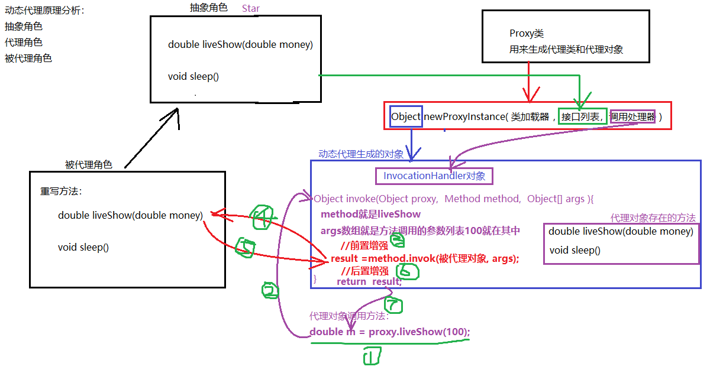
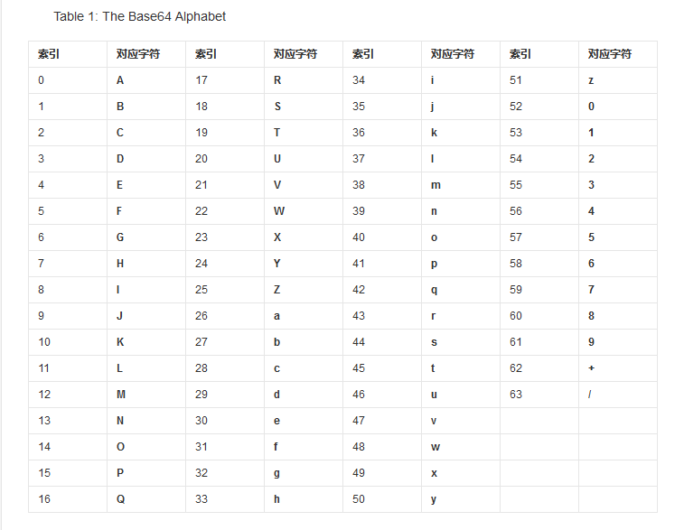

# 第一章 单例设计模式

自从秦始皇确立了皇帝这个位置以后，同一时期基本上就只有一个人孤零零地坐在这个位置。这种情况下臣民们也好处理，大家叩拜、谈论的时候只要提及皇帝，每个人都知道指的是谁，而不用在皇帝前面加上特定的称呼，如张皇帝、李皇帝。这一个过程反应到设计领域就是，要求一个类只能生成一个对象（皇帝），所有对象对它的依赖都是相同的。


正常情况下一个类可以创建多个对象

```java
public static void main(String[] args) {
	// 正常情况下一个类可以创建多个对象
	Emperor e1 = new Emperor();
	Emperor e2 = new Emperor();
	Emperor e3 = new Emperor();
}
```

## 1.1 单例设计模式的作用

单例模式（Singleton Pattern）是一个比较简单的模式，其定义如下：
Ensure a class has only one instance, and provide a global point of access to it.（确保某一个类只有一个实例，而且自行实例化并向整个系统提供这个实例。）

作用就是保证了类在系统中只有一个实例

优点：

由于单例模式在内存中只有一个实例，减少了内存开支，特别是一个对象需要频繁地创建、销毁时，而且创建或销毁时性能又无法优化，单例模式的优势就非常明显。


## 1.2 单例设计模式实现步骤

1. 将构造方法私有化，使其不能在类的外部通过new关键字实例化该类对象。
2. 在该类内部产生一个唯一的实例化对象，并且将其封装为private static类型的成员变量。
3. 定义一个静态方法返回这个唯一对象。


静态方法可以直接使用类名调用，非静态方法只能用对象访问。


## 1.3 单例设计模式的类型

根据实例化对象的时机单例设计模式又分为以下两种:

1. 饿汉单例设计模式
2. 懒汉单例设计模式


## 1.4 饿汉单例设计模式

饿汉单例设计模式就是使用类的时候已经将对象创建完毕，不管以后会不会使用到该实例化对象，先创建了再说。很着急的样子，故被称为“饿汉模式”。

代码如下：

```java
public class Singleton {
    // 1.将构造方法私有化，使其不能在类的外部通过new关键字实例化该类对象。
    private Singleton() {}

    // 2.在该类内部产生一个唯一的实例化对象，并且将其封装为private static类型的成员变量。
    private static final Singleton instance = new Singleton();
    
    // 3.定义一个静态方法返回这个唯一对象。
    public static Singleton getInstance() {
        return instance;
    }
}
```


【代码实践】

```java
public class Demo01 {
    public static void main(String[] args) {
        for (int i = 0; i < 10; i++) {
            Emperor emperor = Emperor.getInstance();
            System.out.println("emperor = " + emperor);
        }

    }
}

/*
皇帝类，让其只能产生一个对象
饿汉
 */
class Emperor {
    private String name;

    //1.私有化构造方法
    private Emperor(String name) {
        this.name = name;
    }

    //2.定义一个私有的静态变量【变量类型是当前类类型】
    private static final Emperor emperor = new Emperor("秦始皇");


    //3.定义一个静态方法用来获取该静态变量
    public static Emperor getInstance() {
        return emperor;
    }


    // @Override
    // public String toString() {
    //     return "当前的皇帝" + name;
    // }
}
```


## 1.5 懒汉单例设计模式

懒汉单例设计模式就是调用getInstance()方法时实例才被创建，先不急着实例化出对象，等要用的时候才实例化出对象。不着急，故称为“懒汉模式”。

代码如下：

```java
public class Singleton {

    // 2.在该类内部产生一个唯一的实例化对象，并且将其封装为private static类型的成员变量。
    private static Singleton instance;
    
    // 1.将构造方法私有化，使其不能在类的外部通过new关键字实例化该类对象。
    private Singleton() {}
    
    // 3.定义一个静态方法返回这个唯一对象。要用的时候才例化出对象
    public static synchronized Singleton getInstance() {
        if(instance == null) {
            instance = new Singleton();
        }
        return instance;
    }
}
```

> 注意：懒汉单例设计模式在多线程环境下可能会实例化出多个对象，不能保证单例的状态，所以加上关键字：synchronized，保证其同步安全。


【代码实践】

```java
public class Demo01 {
    public static void main(String[] args) {
        for (int i = 0; i < 5; i++) {
            System.out.println(Emperor.getInstance());
        }

    }
}

/*
懒汉单例设计模式
 */

class Emperor {
    //1.私有化构造方法
    private Emperor(){}

    //2.定义一个私有的静态成员变量【当前类类型】
    //懒汉特点：先不创建对象
    private static  Emperor emperor;

    //3.提供静态方法获取单例对象
    //懒汉特点：静态方法第一次调用的时候进行创建对象

    public static synchronized Emperor getInstance() {

        if (emperor == null) {

            emperor = new Emperor();
        }

        return emperor;
    }
}

```


## 1.6 小结

单例模式可以保证系统中一个类只有一个对象实例。

实现单例模式的步骤：

1. 将构造方法私有化，使其不能在类的外部通过new关键字实例化该类对象。
2. 在该类内部产生一个唯一的实例化对象，并且将其封装为private static类型的成员变量。
3. 定义一个静态方法返回这个唯一对象。


# 第二章 代理模式

## 2.1 代理模式【Proxy Pattern】

为什么要有“代理”？生活中就有很多例子，例如委托业务等等，**代理就是被代理者没有能力或者不愿意去完成某件事情，需要找个人代替自己去完成这件事**，这才是“代理”存在的原因。例如要找房子，自己不愿意花时间，就找中介，中介就是代理，而我自己就是被代理了。

代理模式主要就是让被代理对象的某个方法执行之前或者执行之后加入其他增强逻辑。


Java中代理模式存在两种实现方式：

1. 静态代理
2. 动态代理

不管什么代理存在三个角色：

1. 抽象角色：通过接口或抽象类声明真实角色实现的业务方法。
2. 代理角色：实现抽象角色，是真实角色的代理，通过真实角色的业务逻辑方法来实现抽象方法，并可以附加自己的操作。
3. 真实角色【被代理角色】：实现抽象角色，定义真实角色所要实现的业务逻辑，供代理角色调用

**==意味着真实角色和代理角色有着共同的父类型（既抽象角色）。==**


## 2.2 静态代理

静态代理是由程序员创建或工具生成代理类的源码，再编译代理类。在程序运行前就已经存在代理类的字节码文件，代理类和被代理类的关系在运行前就确定了。


代理的目的：代理模式主要就是让被代理对象的某个方法执行之前或者执行之后加入其他增强逻辑。


【案例实践】


以现实中经纪人代理明星

已知存在接口：

【抽象角色】

```java
public interface Star {
	//综艺节目
	double liveShow(double money);
	void sleep();  
}	
```

定义被代理类：

定义王宝强类，实现Star方法

```java
//被代理
class WangBaoQiang implements Star {

    @Override
    public double liveShow(double money) {
        System.out.println("宝强参加了节目，赚了" + money + "元");
        return money;
    }

    @Override
    public void sleep() {
        System.out.println("宝强很累，要睡觉了~~~");
    }
}


```

定义代理类：

定义宋喆经纪人类

```java
//代理
/*
代理的目的就是增强被代理的功能：
被代理方法执行的前或者后进行额外的增加其他需要的功能
 */
class SongZe implements Star {
    //被代理的对象
    private WangBaoQiang baoQiang;

    public SongZe(WangBaoQiang baoQiang) {
        this.baoQiang = baoQiang;
    }

    @Override
    public double liveShow(double money) {
        //执行前：日志记录，时间的记录，参数的修改..........
        System.out.println("前置增强：宋喆找了一个Running Man 综艺节目, 抽取佣金" + money * 0.8);
        double m = baoQiang.liveShow(money * 0.2);//干活
        System.out.println("后置增强~~~");
        //执行后:日志记录，时间的记录，参数的修改..........
        return m;
    }

    @Override
    public void sleep() {
        System.out.println("前置增强：找了一个6星级酒店~~~");
        baoQiang.sleep();
        System.out.println("后置增强：宋喆负责去打理房间，退房~~~~");
    }
}
```


定义测试类进行测试

```java
public class Demo01 {
    public static void main(String[] args) {
        //被代理对象
        WangBaoQiang wbq = new WangBaoQiang();


        //构建代理对象
        SongZe songZe = new SongZe(wbq);

        double money = songZe.liveShow(100);
        System.out.println("入账： " + money);
        System.out.println("=========");
        songZe.sleep();


    }
}
```


执行效果

```java
前置增强：宋喆找了一个Running Man 综艺节目, 抽取佣金80.0
宝强参加了节目，赚了20.0元
后置增强~~~
入账： 20.0
=========
前置增强：找了一个6星级酒店~~~
宝强很累，要睡觉了~~~
后置增强：宋喆负责去打理房间，退房~~~~
```


### 静态代理和装饰模式的对比

这两种模式的相似度极高，作用也类似，都是对已有的类进行包装，以添加新的控制（代理模式）和功能（装饰者模式），其实这两点也没有严格区分。

**主要区别**

原则上的区别，代理为了控制对某个函数前后的操作，而装饰着模式是为了添加某一操作（其实目标没差太远）


## 2.3  动态代理【重点】

### 2.3.1概述

在实际开发过程中往往我们自己不会去创建代理类而是通过JDK提供的`Proxy`类在程序运行时，运用反射机制动态创建而成，这就是我们所谓的动态代理。

虽然我们不需要自己定义类型创建对象，但是我们要定义对**真实对象直接访问方法的拦截，在真实对象访问方法的前后增强功能**。

动态代理技术都框架中使用居多，例如：很快要学到的数据库框架MyBatis框架等后期学的一些主流框架技术中都使用了动态代理技术。




### 2.3.2 相关API

#### Proxy类

 `java.lang.reflect.Proxy`类提供了用于创建动态代理类和实例的静态方法，它还是由这些方法创建的所有动态代理类的超类。 

```java
public static Object newProxyInstance(ClassLoader loader, Class<?>[] interfaces, InvocationHandler h) 
    生成代理对像
```

方法说明

- 返回值：该方法返回就是动态生成的代理对象
- 参数列表说明：
  1. ClassLoader loader - 定义代理类的类加载器
  2. Class<?>[] interfaces - 代理类要实现的接口列表，要求与被代理类的接口一样。
  3. InvocationHandler h - 就是具体实现代理逻辑的接口


#### InvocationHandler接口

`java.lang.reflect.InvocationHandler`是代对象的实际处理代理逻辑的接口，具体代理实现逻辑在其invoke方法中，如下

```java
public Object invoke(Object proxy, Method method, Object[] args) 
在代理对象上调用的所有方法最终都会到这里来执行，我们可以根据method得到方法名，判断选择我们需要的方法进行处理即可。 
```

方法说明

1. 返回值：方法被代理后执行的结果。
2. 参数列表：
   1. proxy - 就是代理对象
   2. method - 代理对象调用的方法
   3. args - 代理类调用方法传入参数值的对象数组，如果接口方法不使用参数，则为 null。基本类型的参数被包装在适当基本包装器类（如 java.lang.Integer 或 java.lang.Boolean ）的实例中。


### 2.3.3 代码实践

将经纪人代理明星的案例使用动态代理实现

```java
public class Demo01 {
    public static void main(String[] args) {
        //被代理对象
        WangBaoQiang baoQiang = new WangBaoQiang();
        //定义代理对象
        //获取类加载器
        ClassLoader loader = baoQiang.getClass().getClassLoader();
        //获取接口列表
        Class<?>[] interfaces = baoQiang.getClass().getInterfaces();

        //获取调用处理器【难点】  所有的代理逻辑都在这里
        InvocationHandler handler = new MyInvocationHandler(baoQiang);

        Object proxObj = Proxy.newProxyInstance(loader, interfaces, handler);
        //动态代理生成的类：与被代理类具有共同的接口，要去代理共同接口的方法，转换为接口的类型即可
        Star star = (Star) proxObj;
        //调用方法liveShow
        double m = star.liveShow(100);//代理对象调用方法了，触发调用处理器的invoke
        /*
        此时，调用处理器invoke方法中的参数：
        proxy ：就是star
        method： liveShow方法对象
        args :  里面就存在100
         */

        System.out.println("m = " + m);

        star.sleep();


    }
}

class MyInvocationHandler implements InvocationHandler {
    //被代理
    private WangBaoQiang baoQiang;

    public MyInvocationHandler(WangBaoQiang baoQiang) {
        this.baoQiang = baoQiang;
    }

    //代理对象调用的方法都会在这里完成
    @Override
    public Object invoke(Object proxy, Method method, Object[] args) throws Throwable {
        //所有的代理逻辑都在这个方法完成
        //代理liveShow方法
        String methodName = method.getName();
        if ("liveShow".equals(methodName)) {
            double money = (double) args[0];

            System.out.println("前置增强：宋喆找了个Running Man综艺节目，抽取佣金" + money * 0.8);

            Object result = method.invoke(baoQiang, money * 0.2);

            System.out.println("后置增强：~~~");

            return result;
        }


        if ("sleep".equals(methodName)) {
            System.out.println("前置增强：宋喆找酒店");
            Object result = method.invoke(baoQiang, args);
            System.out.println("后置增强：宋喆退房~~");

            return result;
        }

        //剩余方法不做增强
        Object result = method.invoke(baoQiang, args);//真实对象。被代理对象执行的方法
        return result;
    }
}

class MyInvocationHandler2 implements InvocationHandler {
    //被代理
    private WangBaoQiang baoQiang;

    public MyInvocationHandler2(WangBaoQiang baoQiang) {
        this.baoQiang = baoQiang;
    }

    //代理对象调用的方法都会在这里完成
    @Override
    public Object invoke(Object proxy, Method method, Object[] args) throws Throwable {
        //所有的代理逻辑都在这个方法完成
        //前置增强
        System.out.println("前置增强~~ 当前调用的方法：" + method.getName());
        Object result = method.invoke(baoQiang, args);//真实对象。被代理对象执行的方法
        //后置增强
        System.out.println("后置增强~~");

        return 10000.0;
    }
}


//抽象角色
interface Star {
    double liveShow(double money);

    void sleep();
}

//被代理
class WangBaoQiang implements Star {

    @Override
    public double liveShow(double money) {
        System.out.println("宝强参加了节目，赚了" + money + "元");
        return money;
    }

    @Override
    public void sleep() {
        System.out.println("宝强很累，要睡觉了~~~");
    }
}
```


动态代理好处：

可以不改变源代码的对某个类的方法进行增强

可以让增强的逻辑和被代理的逻辑进行松耦合

 

### 2.3.4 总结

1. 动态代理非常的灵活，可以为任意的接口实现类对象做代理

2. 动态代理可以为被代理对象的所有接口的所有方法做代理，动态代理可以在不改变方法源码的情况下，实现对方法功能的增强。

3. 动态代理类的字节码在程序运行时由Java反射机制动态生成，无需程序员手工编写它的源代码。 
4. 动态代理类不仅简化了编程工作，而且提高了软件系统的可扩展性，因为Java 反射机制可以生成任意类型的动态代理类。

5. 动态代理同时也提高了开发效率。

6. 缺点：只能针对接口的实现类做代理对象，普通类是不能做代理对象的。

cglib


# 第三章 工厂设计模式

## 3.1概述

​	工厂模式（Factory Pattern）是 Java 中最常用的设计模式之一。这种类型的设计模式属于创建型模式，它提供了一种创建对象的最佳方式。之前我们创建类对象时, 都是使用new 对象的形式创建, 除new 对象方式以外, 工厂模式也可以创建对象.


## 3.2作用

解决类与类之间的耦合问题


## 3.3实现步骤

1. 编写一个Car接口, 提供run方法
2. 编写一个Falali类实现Car接口,重写run方法
3. 编写一个Benchi类实现Car接口
4. 提供一个CarFactory(汽车工厂),用于生产汽车对象
5. 定义CarFactoryTest测试汽车工厂


## 3.4实现代码

1.编写一个Car接口, 提供run方法

```java
public interface Car {
    public void run();
}
```

2.编写一个Falali类实现Car接口,重写run方法

```java
public class Falali implements Car {
    @Override
    public void run() {
        System.out.println("法拉利以每小时500公里的速度在奔跑.....");
    }
}
```

3.编写一个Benchi类实现Car接口

```java
public class Benchi implements Car {
    @Override
    public void run() {
        System.out.println("奔驰汽车以每秒1米的速度在挪动.....");
    }
}
```

4.提供一个CarFactory(汽车工厂),用于生产汽车对象

```java
enum CarType{
    BENCHI,FALALI
}

class CarFactory {
    public Car getCar(CarType type) {
        switch (type) {
            case FALALI:
                return new Falali(100);
            case BENCHI:
                return new BenChi(10);

            default:
                return null;
        }
    }
}


```

5.定义CarFactoryTest测试汽车工厂

```java
public class Demo01 {
    public static void main(String[] args) {
        //5. 定义CarFactoryTest测试汽车工厂
        //先创建一个工厂
        CarFactory carFactory = new CarFactory();
        Car car = carFactory.getCar(CarType.FALALI);
        car.run();

        Car car2 = carFactory.getCar(CarType.BENCHI);
        car2.run();

    }
}

```


## 3.5小结

工厂模式的存在可以改变创建类的方式,解决类与类之间的耦合.

实现步骤:

1. 编写一个Car接口, 提供run方法
2. 编写一个Falali类实现Car接口,重写run方法
3. 编写一个Benchi类实现Car接口
4. 提供一个CarFactory(汽车工厂),用于生产汽车对象
5. 定义CarFactoryTest测试汽车工厂


# 第四章 Base64

## 1 Base64概述

BASE64 编码是一种常用的字符编码，在很多地方都会用到，他核心作用应该是保证传输数据的正确性，有些网关或系统只能使用ASCII字符。Base64就是用来将非ASCII字符的数据转换成ASCII字符的一种方法，而且base64特别适合在http，mime协议下快速传输数据。但base64不是安全领域下的加密解密算法。能起到安全作用的效果很差，而且很容易破解。


对Base64的详细介绍可参加百度百科： https://baike.baidu.com/item/base64#1_1 


在Java 8中，Base64编码已经成为Java类库的标准。

Java 8 内置了 Base64 编码的编码器和解码器。

Base64工具类提供了一套静态方法获取下面三种BASE64编解码器：

- **基本：**输出被映射到一组字符A-Za-z0-9+/，编码不添加任何行标，输出的解码仅支持A-Za-z0-9+/。
- **URL：**输出映射到一组字符A-Za-z0-9-_，输出是URL和文件。
- **MIME：**输出隐射到MIME友好格式。输出每行不超过76字符，并且使用'\r'并跟随'\n'作为分割。编码输出最后没有行分割。


 

## 2 Base64内嵌类和方法描述

**内嵌类**

| 序号 | 内嵌类 & 描述                                                |
| :--- | :----------------------------------------------------------- |
| 1    | **static class Base64.Decoder**该类实现一个解码器用于，使用 Base64 编码来解码字节数据。 |
| 2    | **static class Base64.Encoder**该类实现一个编码器，使用 Base64 编码来编码字节数据 |


Encoder常用的API

```
byte[] encode(byte[] src) 使用Base64编码方案将指定字节数组中的所有字节编码为新分配的字节数组。  
String encodeToString(byte[] src) 使用Base64编码方案将指定的字节数组编码为字符串。  
OutputStream wrap(OutputStream os) 使用Base64编码方案包装用于编码字节数据的输出流。  
```


Decode常用的API

```
byte[] decode(byte[] src) 使用Base64编码方案从输入字节数组中解码所有字节，将结果写入新分配的输出字节数组。  
byte[] decode(String src) 使用Base64编码方案将Base64编码的字符串解码为新分配的字节数组。  
InputStream wrap(InputStream is) 返回一个输入流，用于解码Base64编码字节流。  
```


**方法**

 该类提供了一套静态方法获取下面三种BASE64编解码器： 

**1. Basic编码：是标准的BASE64编码，用于处理常规的需求** 

```java
static Base64.Decoder getDecoder()
  返回一个 Base64.Decoder ，解码使用基本型 base64 编码方案。
  
static Base64.Encoder getEncoder()
  返回一个 Base64.Encoder ，编码使用基本型 base64 编码方案。
```

【代码实例】

需求：对一个字符串进行Base64编码，打印编码后的数据。再进行解码恢复原来的数据

步骤实现：

- 编码：
  1. 通过调用getEncode（）获取编码器
  2. 调用编码器的 encodeToString方法进行对字符串编码
  3. 打印编码结果
- 解码
  1. 通过调用getDecode()获取解码器
  2. 调用decode方法进行对Base64字符串进行解码得到原始数据
  3. 打印恢复的结果

```java
public class Demo01 {
    public static void main(String[] args) {
        String str1 = "小红，我爱你！！";
        //- 编码：
        //  1. 通过调用getEncode（）获取编码器
        Base64.Encoder encoder = Base64.getEncoder();
        //  2. 调用编码器的 encodeToString方法进行对字符串编码
        String baseStr = encoder.encodeToString(str1.getBytes());
        //  3. 打印编码结果
        System.out.println("baseStr = " + baseStr);
        //5bCP57qi77yM5oiR54ix5L2g77yB77yB

        //- 解码
        //  1. 通过调用getDecode()获取解码器
        Base64.Decoder decoder = Base64.getDecoder();
        //  2. 调用decode方法进行对Base64字符串进行解码得到原始数据
        byte[] decode = decoder.decode(baseStr);
        //  3. 打印恢复的结果
        System.out.println(new String(decode));
    }
}

```


**2. URL编码 专门对URL进行编解码** 

```java
static Base64.Decoder getUrlDecoder()
  返回一个 Base64.Decoder ，解码使用 URL 和文件名安全型 base64 编码方案。
static Base64.Encoder getUrlEncoder()
  返回一个 Base64.Encoder ，编码使用 URL 和文件名安全型 base64 编码方案。
```

【代码实例】

步骤：

- 编码：
  1. 通过调用getUrlEncoder（）获取编码器
  2. 调用编码器的 encodeToString方法进行对字符串网址编码
  3. 打印编码结果
- 解码
  1. 通过调用getUrlDecoder()获取解码器
  2. 调用decode方法进行对Base64字符串进行解码得到原始数据
  3. 打印恢复的结果


```java

public class Deno02 {
    public static void main(String[] args) {
        String strUrl = "http://www.hao123.com";
        //- 编码：
        //  1. 通过调用getUrlEncoder（）获取编码器
        Base64.Encoder urlEncoder = Base64.getUrlEncoder();
        //  2. 调用编码器的 encodeToString方法进行对字符串网址编码
        String base64Url = urlEncoder.encodeToString(strUrl.getBytes());
        //  3. 打印编码结果
        System.out.println("base64Url = " + base64Url);//aHR0cDovL3d3dy5oYW8xMjMuY29t


        //- 解码
        //  1. 通过调用getUrlDecoder()获取解码器
        Base64.Decoder urlDecoder = Base64.getUrlDecoder();
        //  2. 调用decode方法进行对Base64字符串进行解码得到原始数据
        byte[] decode = urlDecoder.decode(base64Url);
        //  3. 打印恢复的结果
        System.out.println(new String(decode));//http://www.hao123.com
    }
}

```


**3.MIME编码：使用基本的字母数字产生BASE64输出，而且对MIME格式友好：每一行输出不超过76个字符，而且每行以“\r\n”符结束。** 

```java
static Base64.Encoder getMimeEncoder() 
	返回一个Base64.Encoder编码使用MIME型base64编码方案。  
  
static Base64.Decoder getMimeDecoder() 
	返回一个Base64.Decoder解码使用MIME型BASE64解码方案。  
```

如果需要将字节流包装成为具有编码解码的能力，分别使用Encoder，Decoder的wrap方法，如下：

```java
Encoder：
  OutputStream wrap(OutputStream os) 使用Base64编码方案包装用于编码字节数据的输出流。  
  
Decoder：
	InputStream wrap(InputStream is) 返回一个输入流，用于解码Base64编码字节流。  
```

【代码实例】

需求：设计两个方法分别实现对文件的编码和解码

```java
/**
 *实现对文件进行Base64编码得到新文件
 */
	public static void encodeFile(String src, String dest, Base64.Encoder encoder) {

		try (FileInputStream fis = new FileInputStream(src);//普通输入流
		     OutputStream fos = encoder.wrap(new FileOutputStream(dest));) {//这个输出流是具备编码功能

			byte[] bytes = new byte[1024];
			int len;
			while ((len = fis.read(bytes)) != -1) {//读取原始数据
				fos.write(bytes, 0, len);//将原始数据编码成为Base64数据，写到文件中
			}
		} catch (IOException e) {
		}
	}
/**
 *实现对Base64编码文件解码得到源文件
 */
	public static void decodeFile(String src, String dest, Base64.Decoder decoder) {
		try (InputStream fis = decoder.wrap(new FileInputStream(src));
             //将输入流包装成为可以解码的输入流
		     OutputStream fos = new FileOutputStream(dest);) {
            

			byte[] bytes = new byte[1024];
			int len;
			while ((len = fis.read(bytes)) != -1) {//读取Base64数据，并解码成为原始字节数据
				fos.write(bytes, 0, len);//将原始的字节数据写到文件中
			}
		} catch (IOException e) {
		}
	}
```


