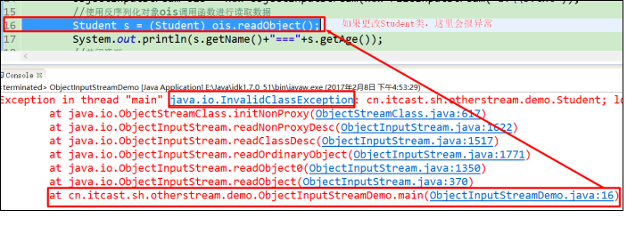
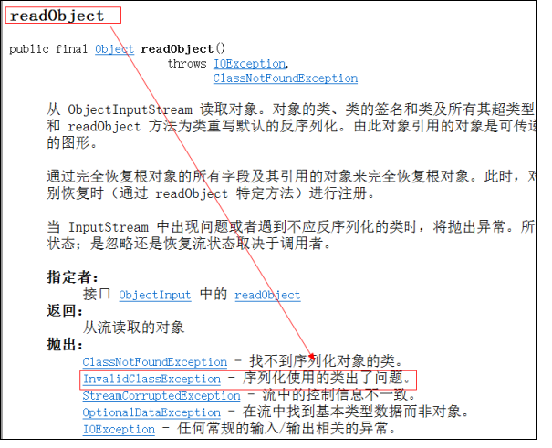
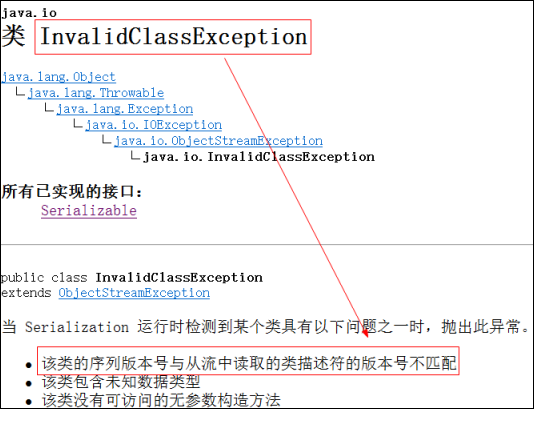
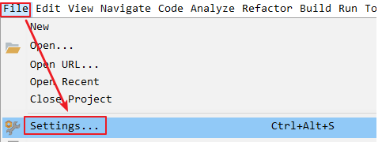
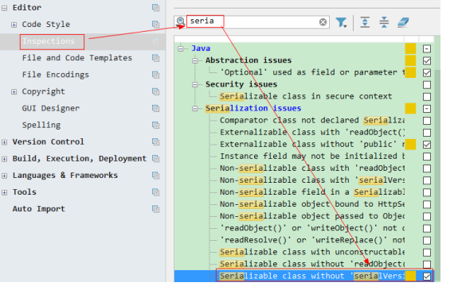
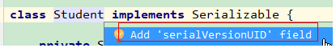

# 第一章 转换流

## 1.1 字符编码和字符集

### 字符编码

计算机中储存的信息都是用二进制数表示的，而我们在屏幕上看到的数字、英文、标点符号、汉字等字符是二进制数转换之后的结果。按照某种规则，将字符存储到计算机中，称为**编码** 。反之，将存储在计算机中的二进制数按照某种规则解析显示出来，称为**解码** 。比如说，按照A规则存储，同样按照A规则解析，那么就能显示正确的文本f符号。反之，按照A规则存储，再按照B规则解析，就会导致乱码现象。

- **字符编码`Character Encoding`** : 就是一套我们人类语言的字符与二进制数之间的对应规则。

### 字符集

- **字符集 `Charset`**：是一个系统支持的所有字符的集合，包括各国家文字、标点符号、数字等。

计算机要准确的存储和识别各种字符集符号，需要进行字符编码，一套字符集必然至少有一套字符编码。常见字符集有ASCII字符集、GBK字符集、Unicode字符集等。

可见，当指定了**编码**，它所对应的**字符集**自然就指定了，所以**编码**才是我们最终要关心的。

- **ASCII字符集** ：

  - ASCII（American Standard Code for Information Interchange，美国信息交换标准代码）是基于拉丁字母的一套电脑编码系统，用于显示现代英语，主要包括控制字符（回车键、退格、换行键等）和可显示字符（英文大小写字符、阿拉伯数字）。
  - 基本的ASCII字符集，使用7位（bits）表示一个字符，共128字符。ASCII的扩展字符集使用8位（bits）表示一个字符，共256字符，方便支持欧洲常用字符。

   ASCII码表1个字节表示一个字符。

  生活中的字符				十进制						二进制

​         A						           65							 01000001

​         B						           66							 01000010

  ……………..

  补充：(了解)

  在美式英语中使用的特殊[控制字符](http://baike.baidu.com/view/1112575.htm)。其中：

  0～31及127(共33个)是[控制字符](http://baike.baidu.com/view/1112575.htm)或通信专用字符（其余为可显示字符），如控制符：LF（换行）、CR（[回车](http://baike.baidu.com/view/377583.htm)）、FF（换页）、DEL（[删除](http://baike.baidu.com/subview/14787/12517941.htm)）、BS（退格)、BEL（响铃）等；通信专用字符：SOH（文头）、EOT（文尾）、ACK（确认）等；ASCII值为8、9、10 和13 分别转换为[退格](http://baike.baidu.com/view/10915366.htm)、制表、换行和回车字符。它们并没有特定的图形显示，但会依不同的应用程序，而对[文本](http://baike.baidu.com/view/300107.htm)显示有不同的影响。

32表示空格。

- **ISO-8859-1字符集**：

  - 拉丁码表，别名Latin-1，用于显示欧洲使用的语言，包括荷兰、丹麦、德语、意大利语、西班牙语等。

  - ISO-5559-1使用单字节编码，兼容ASCII编码。

  - ISO-8859-1编码表1个字节表示一个字符

  - ISO：International Standards Organization，国际标准化组织。

    

- **GBxxx字符集**：

  - GB就是国标的意思，是为了显示中文而设计的一套字符集。
  - **GB2312**：简体中文码表。叫做信息交换用汉字编码字符集。它识别六七千的文字，兼容ASCII编码表。2个字节表示一个汉字字符。
  - **GBK**：叫做汉字编码字符集，也可以叫做国标。是GB2312的升级版，识别2万多个中文字符。2个字节表示一个汉字字符。目前主流的编码表。
  - **GB18030**：是GBK的升级版，包含了大部分的中文（简体、繁体、甲骨文、象形文等等），还有少数民族的文字，识别更多。每个字可以由1个、2个 或4个字节组成。

- **Unicode字符集** ：

  因为世界上各个国家都开发了属于自己的编码表，造成编码表不统一，世界计算机协会就为编码统一，制定了一张国际通用的编码表：unicode码表

  - Unicode编码系统为表达任意语言的任意字符而设计，是业界的一种标准，也称为统一码。标准万国码。

  - 有三种编码方案，UTF-8、UTF-16和UTF-32。最为常用的UTF-8编码。

  - UTF-8编码，可以用来表示Unicode标准中任何字符，它是电子邮件、网页及其他存储或传送文字的应用中，优先采用的编码。互联网工程工作小组（IETF）要求所有互联网协议都必须支持UTF-8编码。所以，我们开发Web应用，也要使用UTF-8编码。它使用一至四个字节为每个字符编码，编码规则：

  - 1. 128个US-ASCII字符，只需一个字节编码。

    2. 拉丁文等字符，需要二个字节编码。

    3. 大部分常用字（含中文），使用三个字节编码。

    4. 其他极少使用的Unicode辅助字符，使用四字节编码。

```
可以识别汉字的编码表有哪些：

	GB2312、GBK、GB18030、unicode、UTF-8

  在开发中常用的码表：ISO-8859-1、GBK、UTF-8、ASCII。
```

```
文字--->(数字) ：编码： 就是把能看懂内容，转换成看不懂的内容。

A      65      01000001

(数字)--->文字  : 解码： 就是把看不懂的内容，转换成看懂的内容。

 01000001  65    A
 乱码：编码和解码使用的编码表不一致导致的。
```


## 1.2 编码引出的问题

在IDEA中，使用`FileReader` 读取项目中的文本文件。由于IDEA的设置，都是默认的`UTF-8`编码，所以没有任何问题。但是，当读取Windows系统中创建的文本文件时，由于Windows系统的默认是GBK编码，就会出现乱码。

需求：使用字符输入流读取E:\\1.txt文件中的数据，要求：1.txt使用GBK编码方式保存。

```java
public class ReaderDemo {
    public static void main(String[] args) throws IOException {
        FileReader fileReader = new FileReader("E:\\1.txt");
        int read;
        while ((read = fileReader.read()) != -1) {
            System.out.print((char)read);
        }
        fileReader.close();
    }
}
输出结果：
���
```

那么如何读取GBK编码的文件呢？ 

## 1.3 InputStreamReader类  

转换流`java.io.InputStreamReader`，是Reader的子类，是从字节流到字符流的桥梁。它读取字节，并使用指定的字符集将其解码为字符。它的字符集可以由名称指定，也可以接受平台的默认字符集。 

### 构造方法

- `InputStreamReader(InputStream in)`: 创建一个使用默认字符集的字符流。 
- `InputStreamReader(InputStream in, String charsetName)`: 创建一个指定字符集的字符流。

构造举例，代码如下： 

```java
InputStreamReader isr = new InputStreamReader(new FileInputStream("in.txt"));
InputStreamReader isr2 = new InputStreamReader(new FileInputStream("in.txt") , "GBK");
```

### 指定编码读取

```java
public class ReaderDemo2 {
    public static void main(String[] args) throws IOException {
      	// 定义文件路径,文件为gbk编码
        String FileName = "E:\\1.txt";
      	// 创建流对象,默认UTF8编码
        InputStreamReader isr = new InputStreamReader(new FileInputStream(FileName));
      	// 创建流对象,指定GBK编码
        InputStreamReader isr2 = new InputStreamReader(new FileInputStream(FileName) , "GBK");
		// 定义变量,保存字符
        int read=0;
      	// 使用默认编码字符流读取,乱码
        while ((read = isr.read()) != -1) {
            System.out.print((char)read); // ��
        }
        isr.close();
      
      	// 使用指定编码字符流读取,正常解析
        while ((read = isr2.read()) != -1) {
            System.out.print((char)read);// 你好
        }
        isr2.close();
    }
}
```

## 1.4 OutputStreamWriter类

转换流`java.io.OutputStreamWriter` ，是Writer的子类，是从字符流到字节流的桥梁。使用指定的字符集将字符编码转换为字节。它的字符集可以由名称指定，也可以接受平台的默认字符集。 

### 构造方法

- `OutputStreamWriter(OutputStream in)`: 创建一个使用默认字符集的字符流。 
- `OutputStreamWriter(OutputStream in, String charsetName)`: 创建一个指定字符集的字符流。

构造举例，代码如下： 

```java
OutputStreamWriter isr = new OutputStreamWriter(new FileOutputStream("day10\\out.txt"));
OutputStreamWriter isr2 = new OutputStreamWriter(new FileOutputStream("day10\\out.txt") , "GBK");
```

### 指定编码写出

```java
public class OutputDemo {
    public static void main(String[] args) throws IOException {
      	// 定义文件路径
        String FileName = "E:\\out.txt";
      	// 创建流对象,默认UTF8编码
        OutputStreamWriter osw = new OutputStreamWriter(new FileOutputStream(FileName));
        // 写出数据
      	osw.write("你好"); 
        osw.close();
      	
		// 定义文件路径
		String FileName2 = "E:\\out2.txt";
     	// 创建流对象,指定GBK编码
        OutputStreamWriter osw2 = new OutputStreamWriter(new FileOutputStream(FileName2),"GBK");
        // 写出数据
      	osw2.write("你好");
        osw2.close();
    }
}
```


### 转换流理解图解

**转换流是字节与字符间的桥梁！**


字节存在硬盘上。字符存在内存中。

总结

转换流有两个作用： 

​	 1. 指定读写的码表

​     2.可以把字节流对象变成字符流对象	

## 1.5.练习：把UTF-8文件转成GBK

需求：把D:\\out.txt以UTF-8编码的文件转换为 以GBK编码的文件

```java
/*
    需求：把D:\\out.txt以UTF-8编码的文件转换为 以GBK编码的文件
 */
public class Test01 {
    public static void main(String[] args) throws Exception {
        //把这个文件换成GBK编码  内容不变
        //创建输入流
        //默认按照UTF-8方式读取
        InputStreamReader isr = new InputStreamReader(new FileInputStream("D:\\out.txt"));
        //创建输出流
        OutputStreamWriter osw = new OutputStreamWriter(new FileOutputStream("D:\\123.txt"),"GBK");
        //循环读写
        int a;
        //每次读取一个字符
        while((a=isr.read()) != -1){
            //写出一个字符
            osw.write(a);
        }
        //关流
        osw.close();
        isr.close();
    }
}
```


# 第二章 序列化

## 2.1 概述

Java 提供了一种对象**序列化**的机制。用一个字节序列可以表示一个对象，该字节序列包含该`对象的数据`、`对象的类型`和`对象中存储的数据`等信息。字节序列写出到文件之后，相当于文件中**持久保存**了一个对象的信息。 

反之，该字节序列还可以从文件中读取回来，重构对象，对它进行**反序列化**。`对象的数据`、`对象的类型`和`对象中存储的数据`信息，都可以用来在内存中创建对象。看图理解序列化： 

## 2.2 ObjectOutputStream类

`java.io.ObjectOutputStream ` 类，将Java对象的原始数据类型写出到文件,实现对象的持久存储。

### 构造方法

- `public ObjectOutputStream(OutputStream out) `： 创建一个指定OutputStream的ObjectOutputStream。

构造举例，代码如下：  

```java
FileOutputStream fileOut = new FileOutputStream("E:\\s.txt");
ObjectOutputStream out = new ObjectOutputStream(fileOut);
```

### 序列化操作

1. 一个对象要想序列化，必须满足两个条件:

- 该类必须实现`java.io.Serializable ` 接口，`Serializable` 是一个标记接口，不实现此接口的类将不会使任何状态序列化或反序列化，会抛出`NotSerializableException` 。

  说明：Serializable：它是一个标记性接口。这个接口中没有任何的方法，这种接口称为标记型接口！它仅仅是一个标识。是一个标记接口为了启动一个序列化功能。只有具备了这个接口标识的类才能通过Java中的序列化和反序列化流操作这个对象。

  注意：只要一个类实现了Serializable接口，那么都会给每个实现类分配一个序列版本号作为唯一标识。

- 该类的所有属性必须是可序列化的。如果有一个属性不需要可序列化的，则该属性必须注明是瞬态的，使用`transient` 关键字修饰。

```java
//为了保证学生对象可以被序列化，我们让Student类来实现Serializable接口
public class Student implements Serializable {
	//属性
	private String name;
	private transient int age; // transient瞬态修饰成员,不会被序列化
	public Student(String name, int age) {
		this.name = name;
		this.age = age;
	}
	public String getName() {
		return name;
	}
	public void setName(String name) {
		this.name = name;
	}
	public int getAge() {
		return age;
	}
	public void setAge(int age) {
		this.age = age;
	}
}

```

2.写出对象方法

- `public final void writeObject (Object obj)` : 将指定的对象写出。

```java
public class SerializeDemo{
   	public static void main(String [] args)  throws IOException {
        //创建学生对象
		Student s = new Student("黑旋风",18);
		//把创建出来的学生对象持久化保存在硬盘中
		//创建序列化对象  创建输出流对象并关联目标文件
		ObjectOutputStream oos = new ObjectOutputStream(new FileOutputStream("E:\\s.txt"));
		//使用序列化对象中的方法持久化学生对象
		oos.writeObject(s);// 姓名被序列化，年龄没有被序列化。
		//关闭资源
		oos.close();
   	}
}

```

## 2.3 ObjectInputStream类

ObjectInputStream反序列化流，将之前使用ObjectOutputStream序列化的原始数据恢复为对象。 

这种操作叫做反序列化。

反序列化：可以把序列化后的对象(硬盘上的文件中的对象数据)，读取到内存中，然后就可以直接使用对象。这样做的好处是不用再一次创建对象了，直接反序列化就可以了。

### 构造方法

- `public ObjectInputStream(InputStream in) `： 创建一个指定InputStream的ObjectInputStream。

### 反序列化操作1

如果能找到一个对象的class文件，我们可以进行反序列化操作，调用`ObjectInputStream`读取对象的方法：

- `public final Object readObject ()` : 读取一个对象。

```java
public class DeserializeDemo {
   public static void main(String [] args)  throws IOException, ClassNotFoundException {
        //创建反序列化对象，指定一个字节输入流用来读取持久文件
		ObjectInputStream ois = new ObjectInputStream(new FileInputStream("E:\\s.txt"));
		//使用反序列化对象ois调用函数进行读取数据
		Student s = (Student) ois.readObject();
		System.out.println(s.getName()+"==="+s.getAge());
		//关闭资源
		ois.close();
    }
}
输出结果：
  黑旋风===0

```


### **反序列化操作2**

**当在反序列化对象之前，我们对Student类做了一些简单的修改，无关紧要的修改。例如给Student类添加一个属性字段或者函数都可以，再次反序列化，就出问题了，报如下图所示的异常:**



分析异常：

通过以上发生的异常我们发现是由于readObject()函数发生的异常，所以我们接下来会查看readObject()函数。



接下来查看[InvalidClassException](mk:@MSITStore:C:\javaee\开发资料\API\JDK_API_1_6_zh_CN.CHM::/java/io/../../java/io/InvalidClassException.html) 异常类：



问题一：什么是该类的序列版本号呢？

类要进行序列化操作时，需要实现Serializable接口。(Serializable接口也称为标记接口)，实现了标记接口的类，该类会存在一个标记值。这个标记值就是该类的序列版本号。这个版本号和该类相关联。

说明：也就是说只要一个类实现Serializable接口，那么在编译源文件时，生成的class文件中就会生成一个和该类相关联的序列版本号。

问题二：这个版本号有什么作用呢？

在序列化时，这个版本号会随着对象一起被序列化到本地文件中。在反序列化的时候，使用流从硬盘上会读取之前序列化的文件，那么jvm会拿着使用流读取到的序列化的版本号和本地硬盘上即class文件中的序列化版本号进行匹配，如果不匹配就会抛异常。Java.io.InvalidClassException。

所以可以理解这个序列化版本号serialVersionUID是用来验证的，防止反序列化的对象和本地的类不匹配。

问题三：这个序列化版本号是如何生成的呢？

由于实现类已经实现了Serializable接口，那么只要重新编译源文件的时候，编译器就会根据类的各个方面(如类的成员变量、成员函数、修饰符、函数返回值类型等)计算成为该类的默认 serialVersionUID 值（版本号）。

serialVersionUID 称为序列版本编号(标记值)。

上述代码如果在反序列化之前修改Student类时，会在报的异常中出现如下图所示的提示信息：

```java
cn.itcast.sh.otherstream.demo.Student; 
local class incompatible: stream classdesc serialVersionUID = -7620680200402190796, 
local class serialVersionUID = 6830451359866645744

```

stream classdesc serialVersionUID = -7620680200402190796, 表示从流中读取的版本号(反序列化时从硬盘文件中读取的)

local class serialVersionUID = 6830451359866645744 ，表示Student类的序列版本号(表示Student类实现Serializable接口时，编译后在生成的class文件中的序列化版本号)

上述两个版本号不一致，所以报异常。

通过以上分析，可以得到一个结论：

如果可以保证反序列化对象和序列化对象的标记值相同，就可以避免异常的发生。

那么我们如何做才能保证反序列化对象和序列化对象的标记值相同呢？

我们修改Student类是无关紧要的。在我们修改Student类的时候，我们不希望它抛异常。我们可以给类定义一个默认的版本号，即给Student类添加标记值也就是版本号serialVersionUID。这样一来，添加的标记值即版本号会随着对象的序列化持久保存。无论是序列化，还是反序列化，都不会再根据类的各个方面计算版本号了。序列化和反序列化的版本号会永远一致，所以不会抛出异常，这样就可以避免InvalidClassException异常的发生了。

 	但是，这样一来，类的安全问题，只能自己来维护。因为已经将类的对象序列化之后，由于类中已经显示定义了版本号，那么反序列化的时候即使修改了Student类，也不会报异常了。

在idea中给自定义类Student添加版本号方法如下所示：

1）File----->Settings



2）Editor-->inspections→serialization issues→选择图中的选项。勾上serializable class without ‘serialVersionUID’ 



3）点击确定，将光标放到实体类上，按alt+回车就可以出现生成序列版本ID了



**总结，记住**：

**1、当一个对象需要被序列化 或 反序列化的时候对象所属的类需要实现Serializable接口。**

**2、被序列化的类中需要添加一个serialVersionUID。**

## 2.4 练习：序列化集合

1. 将存有多个自定义对象的集合序列化操作，保存到`list.txt`文件中。
2. 反序列化`list.txt` ，并遍历集合，打印对象信息。

### 案例分析

1. 把若干学习对象 ，保存到集合中。
2. 把集合序列化。
3. 反序列化读取时，只需要读取一次，转换为集合类型。
4. 遍历集合，可以打印所有的学生信息

### 案例实现

```java
public class SerTest {
	public static void main(String[] args) throws Exception {
		// 创建 学生对象
		Student student = new Student("老王", "laow");
		Student student2 = new Student("老张", "laoz");
		Student student3 = new Student("老李", "laol");

		ArrayList<Student> arrayList = new ArrayList<>();
		arrayList.add(student);
		arrayList.add(student2);
		arrayList.add(student3);
		// 序列化操作
		 serializ(arrayList);
		
		// 反序列化  
		ObjectInputStream ois  = new ObjectInputStream(new FileInputStream("list.txt"));
		// 读取对象,强转为ArrayList类型
		ArrayList<Student> list  = (ArrayList<Student>)ois.readObject();
		
      	for (int i = 0; i < list.size(); i++ ){
          	Student s = list.get(i);
        	System.out.println(s.getName()+"--"+ s.getPwd());
      	}
	}

	private static void serializ(ArrayList<Student> arrayList) throws Exception {
		// 创建 序列化流 
		ObjectOutputStream oos = new ObjectOutputStream(new FileOutputStream("list.txt"));
		// 写出对象
		oos.writeObject(arrayList);
		// 释放资源
		oos.close();
	}
}

```

# 第三章 打印流(了解)

## 3.1 概述

平时我们在控制台打印输出，是调用`print`方法和`println`方法完成的，这两个方法都来自于`java.io.PrintStream`类，该类能够方便地打印各种数据类型的值，是一种便捷的输出方式。

## 3.2 PrintStream类

### 构造方法

- `public PrintStream(String fileName)  `： 使用指定的文件名创建一个新的打印流。

构造举例，代码如下：  

```java
PrintStream ps = new PrintStream("day10\\ps.txt")；

```

### 改变打印流向

`System.out`就是`PrintStream`类型的，只不过它的流向是系统规定的，打印在控制台上。

```java
public class Test01 {
    public static void main(String[] args) throws Exception {
        // 调用系统的打印流,控制台直接输出97
        System.out.println(97);

        // 创建打印流,指定文件的名称
        PrintStream ps = new PrintStream("ps.txt");
        //直接使用对象调用方法输出到指定文件中
        ps.println(100);

        //设置系统的打印流流向,输出到ps.txt
        System.setOut(ps);

        System.out.println("你爱我");

        //打印流是自动刷新
        System.out.println(1);
        System.out.println(true);
        System.out.println("哈哈哈");

        ps.close();
    }
}
```

说明：System类中的static void setOut(PrintStream out) 方法表示重新分配“标准”输出流。 改变流的输出方向。

# 第四章 属性集(掌握)

## 4.1 概述

`java.util.Properties ` 继承于` Hashtable` ，来表示一个持久的属性集。它使用键值结构存储数据，每个键及其对应值都是一个字符串。

## 4.2 Properties类

Properties类：在之前讲解Map集合时，提过一个集合类：Hashtable集合类，该类现已经被HashMap代替。而Hashtable集合类有一个子类对象：Properties。

​	1）该类是一个Map集合。之前学习的集合都是将数据存储到内存中，但是这个集合类它可以和IO流结合，直接把集合中的数据保存在硬盘的文件中，或者直接从硬盘的文件中加载数据保存在集合中；

​	2）这个集合中的键和值都是String类型的字符串；

​	3）这个集合类没有泛型；

### 构造方法

- `public Properties()` :创建一个空的属性列表。

### 基本的存储方法

- `public Object setProperty(String key, String value)` ： 保存一对属性。  等同于Map中的put功能

- `public String getProperty(String key) ` ：使用此属性列表中指定的键搜索属性值。等同于Map中的 get(Object key)

- `public Set<String> stringPropertyNames() ` ：所有键的名称的集合。等同于Map中的keySet方法

  

```java
public class ProDemo {
    public static void main(String[] args) throws FileNotFoundException {
        //创建集合对象
		Properties prop = new Properties();
		//向集合中添加数据
		prop.setProperty("张三","北京");
		prop.setProperty("李四","上海");
		prop.setProperty("王五","南京");
		prop.setProperty("田七","杭州");
		//使用对象调用stringPropertyNames()函数获取所有的键集合
		Set<String> keys = prop.stringPropertyNames();
		//遍历集合
		for (Iterator<String> it = keys.iterator(); it.hasNext();) {
			String key = it.next();
			//根据key获得value
			String value = prop.getProperty(key);
			System.out.println(key+"---"+value);
		}
    }
}

```

### 与流相关的方法

- `public void load(InputStream inStream)`： 从字节输入流中读取键值对。 

参数中使用了字节输入流，通过流对象，可以关联到某文件上，这样就能够加载文本中的数据了。文本数据格式要求必须是如下格式: key=value

```
张三=北京
李四=上海
王五=南京
田七=杭州

```

加载代码演示：

```java
public class ProDemo2 {
    public static void main(String[] args) throws FileNotFoundException {
        //创建集合对象
		Properties prop = new Properties();
		//使用集合对象prop调用load()函数从硬盘上加载数据
//		prop.load(new FileInputStream("D:\\person.txt"));
		prop.load(new FileReader("D:\\person.txt"));
		//遍历集合
		Set<String> keys = prop.stringPropertyNames();
		for (Iterator<String> it = keys.iterator(); it.hasNext();) {
			String key = it.next();
			//根据key键获得value
			String value = prop.getProperty(key);
			System.out.println(key+"---"+value);
          }
     }
}

```

> 小贴士：文本中的数据，必须是键值对形式。