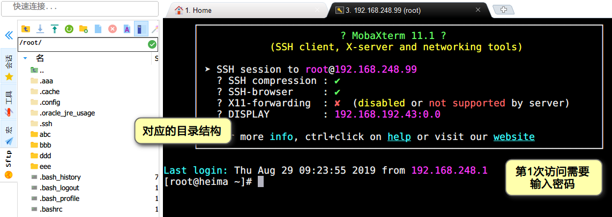
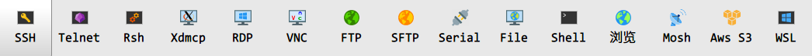
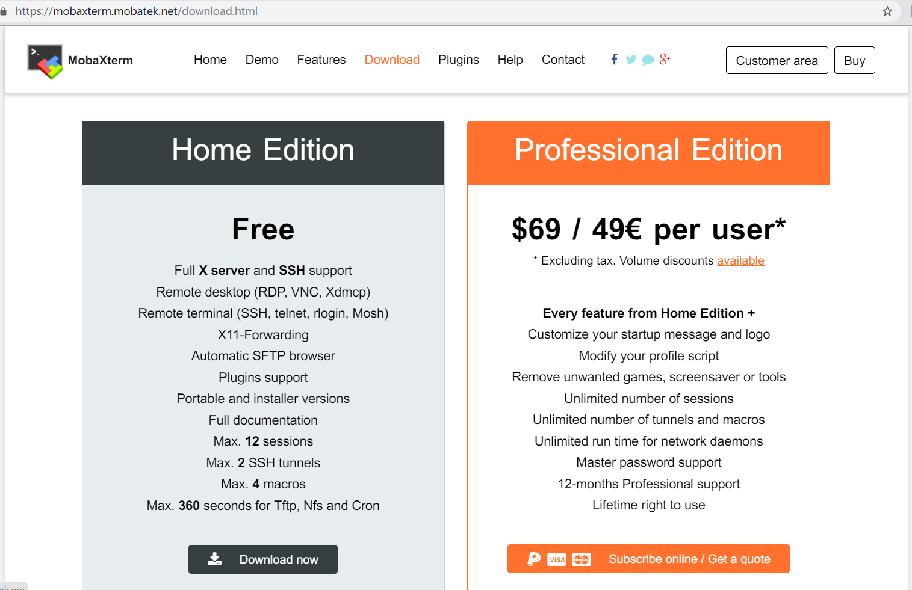
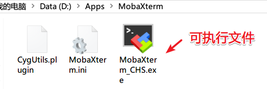
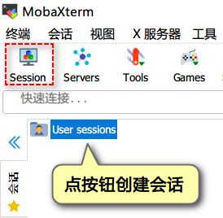
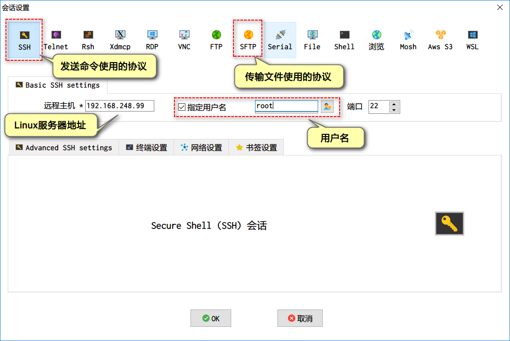
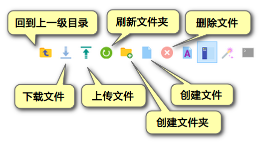

## 优化原因

1. 原来的客户端无论是XShell或是SecureCRT都需要破解或是收费，有版权问题。MobaXterm分为官方免费版的收费版，使用免费版即可以满足学习上的要求
2. 安装和使用简单，解压即可使用，绿色软件，支持中文操作界面，学生容易上手。
3. 软件本身功能强大，左边可以操作文件，右边输入命令


<figure class="thumbnails">
    
</figure>


4. 支持的传输协议非常多


<figure class="thumbnails">
    
</figure>


5. 支持宏和多种主题


## 客户端的安装和使用

### 目标

1. 安装客户端软件
2. 使用客户端软件操作Linux服务器

### 软件下载和安装

1. 官网免费下载 https://mobaxterm.mobatek.net

 

<figure class="thumbnails">
    
</figure>

   

2. 无需安装，直接解压就可以使用


<figure class="thumbnails">
    
</figure>


### 客户端连接服务器

1. 点左上角的Session创建一个会话连接


<figure class="thumbnails">
    
</figure>

   

2. 在如下窗体中进行会话的设置


<figure class="thumbnails">
    
</figure>

   

3. 第1次连接，需要输入密码


<figure class="thumbnails">
    
</figure>

   

### 使用客户端传输文件


<figure class="thumbnails">
    
</figure>


### 小结

发送命令和传输文件在Linux下分别使用什么协议？

```
命令：SSH
传输文件：SFTP
```

使用的客户端软件叫什么名字？

```
MobaXterm
```

