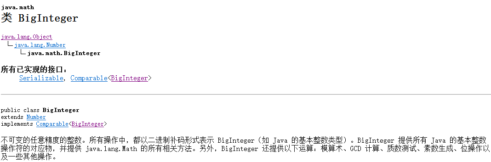
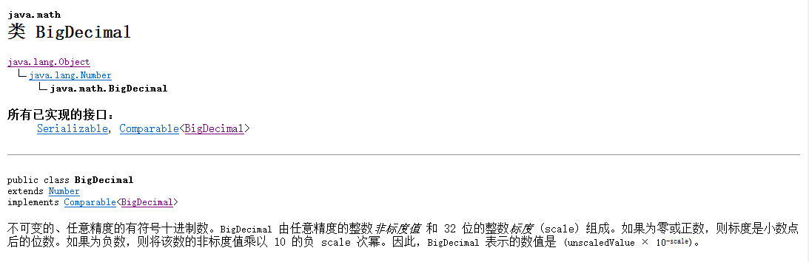
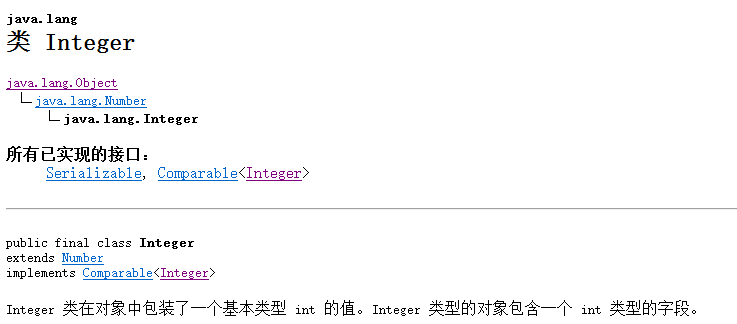
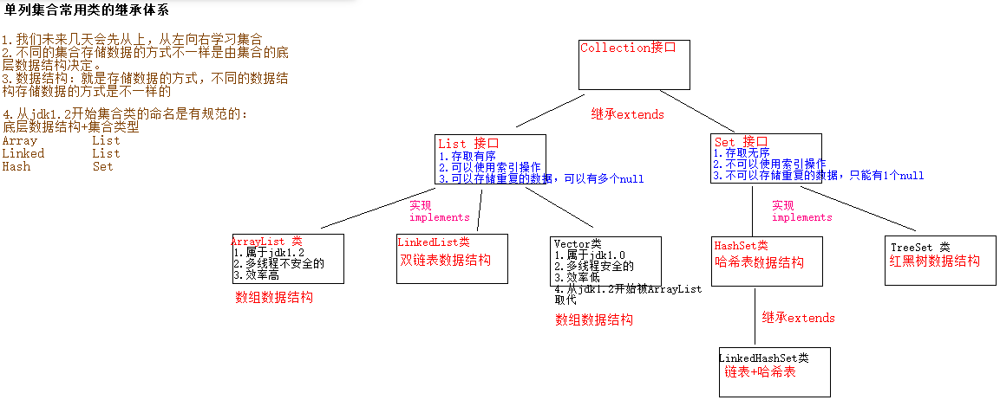
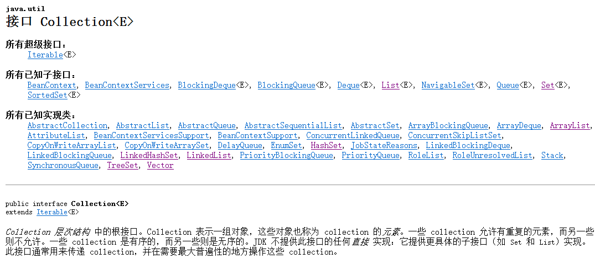
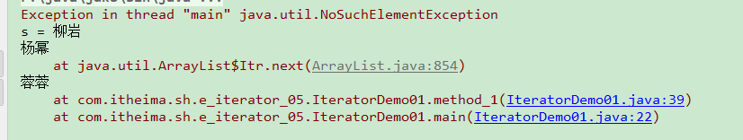
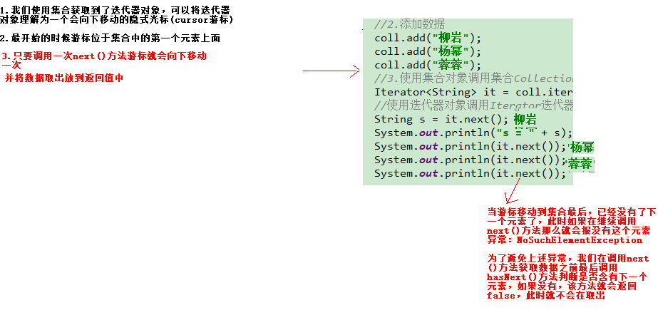
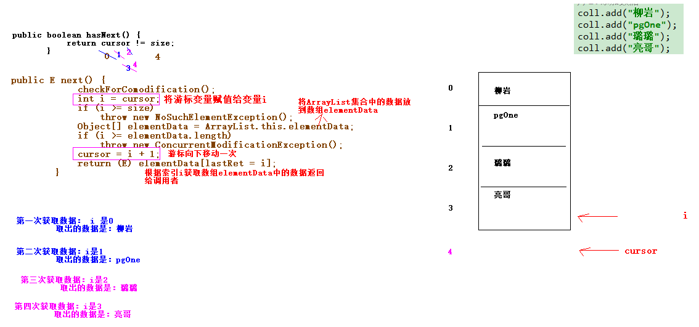

# 1.BigInteger类(了解)

1.在java中如果表示一个过大的整数，long占8个字节，超过8个字节long不能存储，这时可以使用大的整数类型BigInteger:

| 方法                     | 说明                     |
| ------------------------ | ------------------------ |
| BigInteger(String value) | 可以把字符串整数变成对象 |

2.方法:

| 方法声明                              | 描述                                                         |
| ------------------------------------- | ------------------------------------------------------------ |
| BigInteger add(BigInteger value)      | 返回其值为 (this + val) 的 BigInteger，超大整数加法运算      |
| BigInteger subtract(BigInteger value) | 返回其值为 (this - val) 的 BigInteger，超大整数减法运算      |
| BigInteger multiply(BigInteger value) | 返回其值为 (this * val) 的 BigInteger，超大整数乘法运算      |
| BigInteger divide(BigInteger value)   | 返回其值为 (this / val) 的 BigInteger，超大整数除法运算，除不尽取整数部分 |

3.代码演示：

~~~java
package com.itheima.sh.a_biginteger_01;

import java.math.BigInteger;

/*
    BigInteger类讲解：
        1.构造方法：
            BigInteger(String value)可以把字符串整数变成对象
        2.方法：
             BigInteger add(BigInteger value)返回其值为 (this + val) 的 BigInteger，超大整数加法运算
             BigInteger subtract(BigInteger value)返回其值为 (this - val) 的 BigInteger，超大整数减法运算
             BigInteger multiply(BigInteger value)返回其值为 (this * val) 的 BigInteger，超大整数乘法运算
             BigInteger divide(BigInteger value)返回其值为 (this / val) 的 BigInteger，超大整数除法运算，除不尽取整数部分
 */
public class BigIntegerDemo01 {
    public static void main(String[] args) {
        //定义一个long类型的整数
//        long l = 2928281919191984566222L;
        //创建大的整数类的对象
        BigInteger b1 = new BigInteger("2928281919191984566222");
        BigInteger b2 = new BigInteger("2928281919191984566221");
        //加法： BigInteger add(BigInteger value)返回其值为 (this + val) 的 BigInteger，超大整数加法运算
        System.out.println(b1.add(b2));
        //减法： BigInteger subtract(BigInteger value)返回其值为 (this - val) 的 BigInteger，超大整数减法运算
        System.out.println(b1.subtract(b2));
        //乘法：  BigInteger multiply(BigInteger value)返回其值为 (this * val) 的 BigInteger，超大整数乘法运算
        System.out.println(b1.multiply(b2));
        //除法： BigInteger divide(BigInteger value)返回其值为 (this / val) 的 BigInteger，超大整数除法运算，除不尽取整数部分
        System.out.println(b1.divide(b2));
    }
}

~~~

小结：

方法：

~~~java
 BigInteger add(BigInteger value)返回其值为 (this + val) 的 BigInteger，超大整数加法运算
 BigInteger subtract(BigInteger value)返回其值为 (this - val) 的 BigInteger，超大整数减法运算
 BigInteger multiply(BigInteger value)返回其值为 (this * val) 的 BigInteger，超大整数乘法运算
 BigInteger divide(BigInteger value)返回其值为 (this / val) 的 BigInteger，超大整数除法运算，除不尽取整数部分
~~~

原理：底层使用int类型数组存储的较大整数：

~~~java
2928281919191984566222---将数值拆分几部分：29282819 19191984 566222
2928281919191984566221---将数值拆分几部分：29282819 19191984 566221
~~~

# 2.BigDecimal类(理解)

1.在计算机中部分小数存在本身就是不精确的

~~~java
0.09-----在计算机中保存的是接近0.09 0.0888888888888888889
~~~

小数之间在进行运算导致最后的结果就不精确了。

2.在计算机中如果为了避免小数计算损失精度问题我们可以使用BigDecimal类

3.构造方法：

| 方法                       | 说明                                   |
| -------------------------- | -------------------------------------- |
| BigDecimal(double val)     | 把小数数值变成BigDecimal对象           |
| **BigDecimal(String val)** | 把字符串值变成BigDecimal对象(建议使用) |

4.方法

| 方法                                                         | 说明     |
| ------------------------------------------------------------ | -------- |
| BigDecimal add(BigDecimal value)                             | 加法运算 |
| BigDecimal subtract(BigDecimal value)                        | 减法运算 |
| BigDecimal multiply(BigDecimal value)                        | 乘法运算 |
| BigDecimal divide(BigDecimal value)                          | 除法运算 |
| BigDecimal divide(BigDecimal divisor, int scale, int roundingMode) | 除法运算 |

~~~java
最后一个方法：BigDecimal divide(BigDecimal divisor, int scale, int roundingMode)，对于除法运算使用BigDecimal divide(BigDecimal value)，如果除不尽那么会报异常ArithmeticException。此时为了避免异常我们可以使用另一个除法方法：
    BigDecimal divide(BigDecimal divisor, int scale, int roundingMode)
    			参数：
    				divisor：除数
    				scale：保留小数位数
    				roundingMode：舍入模式，一般是四舍五入，属于枚举类型ROUND_HALF_UP
~~~

5.代码演示：

~~~java
package com.itheima.sh.b_bigdecimal_02;

import java.math.BigDecimal;
import java.math.RoundingMode;

/*
    BigDecimal类讲解：表示小数的，避免损失精度
    1.构造方法：
        **BigDecimal(String val)**把字符串值变成BigDecimal对象(建议使用)
        *
    2.方法：
        BigDecimal add(BigDecimal value)加法运算
        BigDecimal subtract(BigDecimal value)减法运算
        BigDecimal multiply(BigDecimal value)乘法运算
        BigDecimal divide(BigDecimal value)除法运算
        BigDecimal divide(BigDecimal divisor, int scale, int roundingMode)除法运算
                参数：
    				divisor：除数
    				scale：保留小数位数
    				roundingMode：舍入模式，一般是四舍五入，属于枚举类型ROUND_HALF_UP
 */
public class BigDecimalDemo01 {
    public static void main(String[] args) {
        //小数计算损失精度
//        System.out.println(10/3.0);
//        System.out.println(0.09 + 0.01);//0.09999999999999999
//        System.out.println(1.2 + 1.3);//2.5
        //1.创建BigDecimal类的对象
        BigDecimal b1 = new BigDecimal("0.09");
        BigDecimal b2 = new BigDecimal("0.01");
        // BigDecimal add(BigDecimal value)加法运算
        System.out.println(b1.add(b2));//0.10
        //BigDecimal subtract(BigDecimal value)减法运算
        System.out.println(b1.subtract(b2));//0.08
        //BigDecimal multiply(BigDecimal value)乘法运算
        System.out.println(b1.multiply(b2));//0.0009
        //BigDecimal divide(BigDecimal value)除法运算
        System.out.println(b1.divide(b2));//9

        /*
             BigDecimal divide(BigDecimal divisor, int scale, int roundingMode)除法运算
                参数：
    				divisor：除数
    				scale：保留小数位数
    				roundingMode：舍入模式，一般是四舍五入，属于枚举类型BigDecimal.ROUND_HALF_UP或者RoundingMode.HALF_UP
    				            RoundingMode 表示枚举类
         */
        BigDecimal b3 = new BigDecimal("10");
        BigDecimal b4 = new BigDecimal("3.0");
//        System.out.println(b3.divide(b4));//如果小数除不尽此时该方法divide(BigDecimal value)就会报异常
        System.out.println(b3.divide(b4, 2, RoundingMode.HALF_UP));
    }
}

~~~

小结：

1.方法：

~~~java
     BigDecimal add(BigDecimal value)加法运算
     BigDecimal subtract(BigDecimal value)减法运算
     BigDecimal multiply(BigDecimal value)乘法运算
     BigDecimal divide(BigDecimal value)除法运算
     BigDecimal divide(BigDecimal divisor, int scale, int roundingMode)除法运算
                参数：
    				divisor：除数
    				scale：保留小数位数
    				roundingMode：舍入模式，一般是四舍五入，roundingMode：舍入模式，一般是四舍五入，属于枚举类型BigDecimal.ROUND_HALF_UP或者RoundingMode.HALF_UP.RoundingMode 表示枚举类
~~~

2.原理：BigDecimal底层对于小数变为**整数进行运算**。

0.09*100---9

0.01*100---1

将运算结果/100

#  3.包装类(掌握)

## 1.介绍

基本数据类型由八种对应的包装类也有八种。

~~~java
基本数据类型：byte  short  int      long  float  double  char      boolean
包装类：     Byte  Short  Integer  Long  Float  Double  Character Boolean
~~~

## 2.Integer类

​										

1.方法演示：

| 方法名                                  | 说明                                   |
| --------------------------------------- | -------------------------------------- |
| public Integer(int   value)             | 根据 int 值创建 Integer 对象(过时)     |
| public Integer(String s)                | 根据 String 值创建 Integer 对象(过时)  |
| public static Integer valueOf(int i)    | 返回表示指定的 int 值的 Integer   实例 |
| public static Integer valueOf(String s) | 返回保存指定String值的 Integer 对象    |

2.代码演示：

~~~java
package com.itheima.sh.c_integer_03;

/*
    public Integer(int value)根据 int 值创建 Integer 对象(过时)
    public Integer(String s)根据 String 值创建 Integer 对象(过时)
    public static Integer valueOf(int i)返回表示指定的 int 值的 Integer   实例 建议使用
    public static Integer valueOf(String s)返回保存指定String值的 Integer 对象 建议使用
 */
public class IntegerDemo01 {
    public static void main(String[] args) {
        //public Integer(int value)根据 int 值创建 Integer 对象(过时)
        int x = 10;//这里的x属于基本数据类型只能进行加减乘除运算
        Integer i = new Integer(x);//i保存的是地址值，不是10，属于引用类型，属于对象，可以调用Intger类的方法
        System.out.println("i = " + i);

        // public Integer(String s)根据 String 值创建 Integer 对象(过时)
        //如果字符串中含有非数字类型则会报异常：
        //Exception in thread "main" java.lang.NumberFormatException: For input string: "123a"
//        Integer i2 = new Integer("123a");//将字符串中的数值转换为整数
        Integer i2 = new Integer("123");//将字符串中的数值转换为整数
        System.out.println("i2 = " + i2);

        //public static Integer valueOf(int i)返回表示指定的 int 值的 Integer   实例

        Integer i3 = Integer.valueOf(x);
        System.out.println("i3 = " + i3);

        //public static Integer valueOf(String s)返回保存指定String值的 Integer 对象
        // 如果字符串中含有非数字类型则会报异常：
        //Exception in thread "main" java.lang.NumberFormatException: For input string: "345a"
        Integer i4 = Integer.valueOf("345a");
        System.out.println("i4 = " + i4);
    }
}

~~~

小结：

​    public static Integer valueOf(int i)返回表示指定的 int 值的 Integer   实例 建议使用
​    public static Integer valueOf(String s)返回保存指定String值的 Integer 对象 建议使用

​				参数字符串中不能含有非数字类型，否则报异常。

## 3.装箱与拆箱

装箱：就是将基本数据类型转换为对应的包装类

拆箱：就是将包装类转换为对应的基本数据类型

~~~java
package com.itheima.sh.c_integer_03;

public class IntegerDemo02 {
    public static void main(String[] args) {
        //装箱：就是将基本数据类型转换为对应的包装类
        //定义基本数据类型变量
        int x = 10;
        //将基本数据类型转换为包装类---装箱
        //1.构造方法
        Integer i = new Integer(x);//过时
        //2.valueOf方法
        Integer i2 = Integer.valueOf(x);//建议使用  保存地址值
        //拆箱：就是将包装类转换为对应的基本数据类型
        //使用Integer类的方法： int intValue() 以 int 类型返回该 Integer 的值。
        int y = i2.intValue();//保存常量数据10
        System.out.println("i2 = " + i2);
        System.out.println("y = " + y);
    }
}

~~~

小结：

1.装箱：就是将基本数据类型转换为对应的包装类

~~~java
 Integer i2 = Integer.valueOf(x);//建议使用  保存地址值
~~~

2.拆箱：就是将包装类转换为对应的基本数据类型

~~~java
使用Integer类的方法： int intValue() 以 int 类型返回该 Integer 的值。
~~~

## 4.自动装箱和拆箱(必须掌握)

在java中sun公司发现我们实现装箱和拆箱使用方法比较麻烦，从jdk5后引入了自动装箱和拆箱。不用我们程序员自己使用方法转换了，底层直接转换。

自动装箱:自动将基本数据类型转换为包装类。实现原理。使用的是Integer.valueOf(x);

~~~java
Integer i = 10;// 底层：Integer.valueOf(10);
ArrayList<Integer> list = new ArrayList<Integer>();//集合中保存不是常量是地址值
list.add(10);//发生了自动装箱 list.add(Integer.valueOf(10));
~~~

自动拆箱：自动的将包装类转换为基本数据类型。实现原理：底层调用了 int intValue()

~~~java
Integer i = 10;//i中保存的是地址值
int y = i;//将i对象中的数据10取出赋值给y 底层：int y = i.intValue();
~~~

代码演示：

~~~java
package com.itheima.sh.c_integer_03;

public class IntegerDemo03 {
    public static void main(String[] args) {
        //自动装箱
        Integer i = 10;
        //自动拆箱
        int y = i;
        System.out.println("i = " + i);
        System.out.println("y = " + y);
    }
}

~~~

## 5.基本类型与字符串之间的转换(必须掌握)

### 5.1基本类型转换为字符串

1.  **使用+。 开发中建议使用**
2. 使用String类的valueOf方法：static String valueOf(int i)返回 int 参数的字符串表示形式。

~~~java
       //1.基本类型转换为字符串
        //1.1使用+ 建议使用
        String s = 10+"";//"10"
        //1.2使用String类的valueOf方法：static String valueOf(int i)返回 int 参数的字符串表示形式。
        String s2 = String.valueOf(20);//"20"
        System.out.println("s = " + s);
        System.out.println("s2 = " + s2);
~~~

### 5.2 字符串转换为基本数据类型

使用包装类Integer类的方法：

~~~java
static int parseInt(String s) 就是将参数中的字符串数值转换为int类型，如果字符串中含有非数字则会异常NumberFormatException - 如果字符串不包含可解析的整数。
~~~

~~~java
package com.itheima.sh.c_integer_03;
/*
 */
public class IntegerDemo04 {
    public static void main(String[] args) {
        //static int parseInt(String s) 就是将参数中的字符串数值转换为int类型，
        // 如果字符串中含有非数字则会异常NumberFormatException - 如果字符串不包含可解析的整数。
//        int i = Integer.parseInt("123ab");// java.lang.NumberFormatException: For input string: "123ab"
        int i = Integer.parseInt("123");
        System.out.println("i = " + i);//123
        
        double d = Double.parseDouble("12.3");
        System.out.println("d = " + d);//12.3
    }
}

~~~

小结：

1.将基本数据类型转换为字符串：使用+

2.将字符串中的整数数值转换为基本数据类型：使用Integer类的方法：

~~~java
static int parseInt(String s)
~~~

# 4.Collection集合(掌握)

## 1.介绍

集合是一个容器，用来存储数据的。例如之前学习ArrayList就是集合的一种。Collection接口属于单列集合的父接口。单列集合一次只能添加一个数据，并且集合中的各个数据之间没有对应关系。

之前还学习一个容器即数组。

数组容器和集合容器区别：

1.数组容器：

​		1）长度固定不变

​		2）可以存储基本数据类型也可以存储引用数据类型 

​		3）数组存储数据类型单一 

2.集合容器：

​		1）长度可以改变

​		2)  集合只能存储引用数据类型	

​		3）集合存储数据，可以是任意的引用类型，前提是不加泛型  new ArrayList();

## 2.集合常用类的继承体系(掌握)

## 3.Collection接口集合(掌握)

1.在java中只要和集合有关的API都位于java.util包下，使用需要导包

2.Collection是所有单列集合的父接口

3.List集合存取是有序的，可以使用索引操作，数据可以重复;Set集合存取是无序的，不可以使用索引操作，数据不可以重复。只能有一个null

4.方法：

- `public boolean add(E e)`：  把给定的对象添加到当前集合中 。
- `public void clear()` :清空集合中所有的元素。
- `public boolean remove(E e)`: 把给定的对象在当前集合中删除。
- `public boolean contains(Object obj)`: 判断当前集合中是否包含给定的对象。
- `public boolean isEmpty()`: 判断当前集合是否为空。
- `public int size()`: 返回集合中元素的个数。
- `public Object[] toArray()`: 把集合中的元素，存储到数组中

代码演示：

~~~java
package com.itheima.sh.d_collection_04;

import java.util.ArrayList;
import java.util.Collection;

/*
    1.public boolean add(E e)`：  把给定的对象添加到当前集合中 。
    2.public void clear()` :清空集合中所有的元素。
    3.public boolean remove(E e)`: 把给定的对象在当前集合中删除。
    4.public boolean contains(Object obj)`: 判断当前集合中是否包含给定的对象。
    5.public boolean isEmpty()`: 判断当前集合是否为空。
    6.public int size()`: 返回集合中元素的个数。
    7.public Object[] toArray()`: 把集合中的元素，存储到数组中
 */
public class CollectionDemo01 {
    public static void main(String[] args) {
        //创建集合对象
        Collection<String> coll = new ArrayList<>();
        //添加数据
        coll.add("柳岩");
        coll.add("杨幂");
        coll.add(null);
        coll.add(null);
        coll.add("柳岩");
        //2.public void clear()` :清空集合中所有的元素。 集合还在，还可以继续使用
//        coll.clear();
//        System.out.println("coll = " + coll);//[]
//        coll.add("柳岩");
//        System.out.println("coll = " + coll);//"柳岩"

        //4.public boolean contains(Object obj)`: 判断当前集合中是否包含给定的对象。如果包含返回true，不包含返回false
//        boolean boo = coll.contains("柳岩");
//        System.out.println("boo = " + boo);
        // 5.public boolean isEmpty()`: 判断当前集合是否为空。如果为空返回true，不为空为false
//        System.out.println(coll.isEmpty());//false

        //System.out.println("coll = " + coll);//"[柳岩, 杨幂, null, null, 柳岩]"
        //对集合遍历
//        for (int i = 0; i < coll.size(); i++) {//i表示集合索引
            //获取coll中的数据 
//            coll.get(index)
//        }

         /*
                这里不能使用get(int index) 原因是我们这里是 Collection<String> coll = new ArrayList<>();
                多态，多态发生了，不能使用子类特有的方法，而get(int index)带索引操作的是List集合特有的，所以不能使用
                这里不能使用带索引方式遍历集合了，我们可以将Collection集合的数据存放到数组中，然后间接遍历数组
         */
        //7.public Object[] toArray()`: 把集合中的元素，存储到数组中
        Object[] arr = coll.toArray();
        //遍历数组
        for (int i = 0; i < arr.length; i++) {
            Object obj = arr[i];
            System.out.println("obj = " + obj);
        }
    }
}

~~~

小结：

~~~java
    1.public boolean add(E e)`：  把给定的对象添加到当前集合中 。
    2.public void clear()` :清空集合中所有的元素。
    3.public boolean remove(E e)`: 把给定的对象在当前集合中删除。
    4.public boolean contains(Object obj)`: 判断当前集合中是否包含给定的对象。
    5.public boolean isEmpty()`: 判断当前集合是否为空。
    6.public int size()`: 返回集合中元素的个数。
    7.public Object[] toArray()`: 把集合中的元素，存储到数组中
~~~

# 5.Iterator迭代器

## 1.介绍(理解)

我们上述发现对于Collection集合，不能使用之前的索引方式遍历了。只能将其集合中的数据先放到数组中，在间接达到对集合的遍历。那么在java中sun公司使用Iterator迭代器接口来迭代所有的单列集合(List Set).

**迭代：就是从容器中一个一个数据获取，获取之前先判断有没有数据，如果有数据则获取，没有数据则不获取。**

在java中迭代容器使用迭代器接口Iterator，该迭代器接口中的方法如下：

~~~java
1.boolean hasNext() 如果仍有元素可以迭代，则返回 true。 
2.E next() 返回迭代的下一个元素。 获取元素
3.void remove() 从迭代器指向的 collection 中移除迭代器返回的最后一个元素（可选操作）。 
~~~

## 2.使用迭代器(掌握)

步骤：

1.创建集合对象

2.添加数据

3.使用集合对象调用集合Collection中的方法获取迭代器Iterator接口的实现类对象：

~~~java
Iterator<E> iterator() 返回在此 collection 的元素上进行迭代的迭代器。 
    说明：正常元素(数据)位于集合中，只要我们使用集合对象调用iterator() 方法，会将集合中的数据存储到迭代器中一份
~~~

4.使用迭代器对象调用Iterator迭代器中的hasNext()方法判断是否有下一个数据

5.如果有下一个数据，即hasNext()方法返回true，则使用迭代器对象调用Iterator迭代器中的next()方法获取元素

代码演示1:

~~~java
private static void method_1() {
        //1.创建集合对象
        Collection<String> coll = new ArrayList<>();
        //2.添加数据
        coll.add("柳岩");
        coll.add("杨幂");
        coll.add("蓉蓉");
        //3.使用集合对象调用集合Collection中的方法获取迭代器Iterator接口的实现类对象：
        Iterator<String> it = coll.iterator();
        //使用迭代器对象调用Iterator迭代器中的next()方法获取元素
        String s = it.next();
        System.out.println("s = " + s);
        System.out.println(it.next());
        System.out.println(it.next());
        System.out.println(it.next());
    }
~~~

报异常：

报异常原因：

解决上述异常：

~~~java
 private static void method_2() {
        //1.创建集合对象
        Collection<String> coll = new ArrayList<>();
        //2.添加数据
        coll.add("柳岩");
        coll.add("杨幂");
        coll.add("蓉蓉");
        //3.使用集合对象调用集合Collection中的方法获取迭代器Iterator接口的实现类对象：
        Iterator<String> it = coll.iterator();//循环初始化
        /*if(it.hasNext()){
            //使用迭代器对象调用Iterator迭代器中的next()方法获取元素
            String s = it.next();
            System.out.println("s = " + s);
        }*/
        //上述如果使用if语句，那么获取多个元素数据导致代码严重重复了，我们使用循环迭代
       /* while(it.hasNext()){//it.hasNext() 表示循环条件
            //说明有数据
            String s = it.next();//修改循环条件
            //输出
            System.out.println("s = " + s);
        }*/

       //快捷键：itit
        while (it.hasNext()) {
            String s =  it.next();
            System.out.println(s);
        }
    }
~~~

小结：

1.使用while循环迭代集合快捷键是：itit

## 3.迭代器的原理(掌握)

ArrayList源码：

~~~java
public class ArrayList{

	//获取迭代器的方法
	public Iterator<E> iterator() {
        //创建成员内部类Itr的对象，将对象返回给iterator方法的调用者
		return new Itr();
	    }

	//成员内部类 由于Itr类实现了Iterator迭代器接口，所以Itr是迭代器实现类
	private class Itr implements Iterator<E> {
        //成员变量
        //cursor表示游标，当创建Itr类的对象时，该游标标量初始化值是0
        int cursor;       // index of next element to return
        int lastRet = -1; // index of last element returned; -1 if no such
        //modCount 表示记录着当前集合的修改次数(add remove) 修改一次那么该变量就会加一次1
        //expectedModCount 表示期望修改的次数，这里在创建内部类Itr的对象时直接将modCount修改集合的次数的值赋值给期望修改集合的次数expectedModCount
        int expectedModCount = modCount;
		//判断是否有下一个数据
        public boolean hasNext() {
            //size表示集合长度，添加4个元素，size就是4
            //这里判断游标是否等于集合长度
            return cursor != size;
        }

        @SuppressWarnings("unchecked")
        public E next() {
            checkForComodification();
            int i = cursor;
            if (i >= size)
                throw new NoSuchElementException();
            Object[] elementData = ArrayList.this.elementData;
            if (i >= elementData.length)
                throw new ConcurrentModificationException();
            cursor = i + 1;
            return (E) elementData[lastRet = i];
        }

        public void remove() {
            if (lastRet < 0)
                throw new IllegalStateException();
            checkForComodification();

            try {
                ArrayList.this.remove(lastRet);
                cursor = lastRet;
                lastRet = -1;
                expectedModCount = modCount;
            } catch (IndexOutOfBoundsException ex) {
                throw new ConcurrentModificationException();
            }
        }
}
~~~

图解：

## 4.迭代器的问题：并发修改异常(掌握)

需求：迭代集合时，遇到数据pgOne，就删除。

~~~java
public class ArrayList{

	//获取迭代器的方法
	public Iterator<E> iterator() {
        //创建成员内部类Itr的对象，将对象返回给iterator方法的调用者
		return new Itr();
	    }

	//成员内部类 由于Itr类实现了Iterator迭代器接口，所以Itr是迭代器实现类
	private class Itr implements Iterator<E> {
        //成员变量
        //cursor表示游标，当创建Itr类的对象时，该游标标量初始化值是0
        int cursor;       // index of next element to return
        int lastRet = -1; // index of last element returned; -1 if no such
        //modCount 表示记录着当前集合的修改次数(add remove) 修改一次那么该变量就会加一次1
        //expectedModCount 表示期望修改的次数，这里在创建内部类Itr的对象时直接将modCount修改集合的次数的值赋值给期望修改集合的次数expectedModCount
        int expectedModCount = modCount;
		//判断是否有下一个数据
        public boolean hasNext() {
            //size表示集合长度，添加4个元素，size就是4
            //这里判断游标是否等于集合长度
            return cursor != size;
        }

        @SuppressWarnings("unchecked")
        public E next() {
            //校验是否在迭代集合的时候使用集合方法修改集合的长度(add remove)
            checkForComodification();
            int i = cursor;
            if (i >= size)
                throw new NoSuchElementException();
            Object[] elementData = ArrayList.this.elementData;
            if (i >= elementData.length)
                throw new ConcurrentModificationException();
            cursor = i + 1;
            return (E) elementData[lastRet = i];
        }

        public void remove() {
            if (lastRet < 0)
                throw new IllegalStateException();
            checkForComodification();

            try {
                ArrayList.this.remove(lastRet);
                cursor = lastRet;
                lastRet = -1;
                expectedModCount = modCount;
            } catch (IndexOutOfBoundsException ex) {
                throw new ConcurrentModificationException();
            }
        }
}
~~~

代码：

~~~java
package com.itheima.sh.e_iterator_05;

import java.util.ArrayList;
import java.util.Collection;
import java.util.Iterator;
/*
    需求：迭代集合时，遇到数据pgOne，就删除。
 */

public class IteratorDemo03 {
    public static void main(String[] args) {
        //1.创建集合对象
        Collection<String> coll = new ArrayList<>();
        //2.添加数据
        coll.add("柳岩");
        coll.add("pgOne");
        coll.add("璐璐");
        coll.add("亮哥");
        //3.获取迭代器对象
        Iterator<String> it = coll.iterator();
        //4.使用循环迭代集合
        while (it.hasNext()) {
            //获取数据
            String s =  it.next();
            //判断s是否等于pgOne，是就删除
            if("pgOne".equals(s)){
                //说明s是pgOne，直接删除
                //使用集合中的删除方法删除
                coll.remove(s);
            }
        }

        System.out.println(coll);
    }
}

~~~

说明：上述我们在迭代集合的时候使用了集合的删除方法导致在next()方法体中的调用语句：

~~~java
 //校验是否在迭代集合的时候使用集合方法修改集合的长度(add remove)
     checkForComodification();
final void checkForComodification() {
    		//判断修改集合的次数是否等于期望修改集合次数的变量
            if (modCount != expectedModCount)
                throw new ConcurrentModificationException();
        }
~~~

当我们使用集合的删除方法删除数据的时候，源码：

~~~java
private void fastRemove(int index) {
       //修改集合的次数的变量+1 这里变为5 而期望修改集合次数的变量expectedModCount还是4
    //结果不一致，导致执行方法checkForComodification就会报并发修改异常new ConcurrentModificationException();
        modCount++;
        
    }
~~~

解决并发修改异常解决方案：

~~~java
package com.itheima.sh.e_iterator_05;

import java.util.ArrayList;
import java.util.Collection;
import java.util.Iterator;
/*
    需求：迭代集合时，遇到数据pgOne，就删除。
 */

public class IteratorDemo03 {
    public static void main(String[] args) {
        //1.创建集合对象
        Collection<String> coll = new ArrayList<>();
        //2.添加数据
        coll.add("柳岩");
        coll.add("pgOne");
        coll.add("璐璐");
        coll.add("亮哥");
        //3.获取迭代器对象
        Iterator<String> it = coll.iterator();
        //4.使用循环迭代集合
        while (it.hasNext()) {
            //获取数据
            String s =  it.next();
            //判断s是否等于pgOne，是就删除
            if("pgOne".equals(s)){
                //说明s是pgOne，直接删除
                //使用集合中的删除方法删除
//                coll.remove(s);
                //使用迭代器中的删除方法
                it.remove();
            }
        }

        System.out.println(coll);
    }
}

~~~

使用迭代器的删除方法。因为通过查看源码我们发现在迭代器中的remove方法体中将变量modCount的新值5重新赋值给expectedModCount

~~~java
 public void remove() {
          ........
                expectedModCount = modCount;
             .......  
        }
~~~

# 6.增强for循环(必须掌握)

## 1.介绍

增强for循环只能用来迭代集合和数组的，迭代的时候不能修改集合长度。因为增强for循环底层是Iterator，所以在修改集合长度的时候就会报并发修改异常。

格式：

~~~java
for(数组或者集合的数据类型 变量名 : 数组或者集合的名字){//变量名是容器中的数据
    
}
~~~

## 2.代码演示

~~~java
package com.itheima.sh.e_iterator_05;

import java.util.ArrayList;
import java.util.Collection;

/*
        for(数组或者集合的数据类型 变量名 : 数组或者集合的名字){//变量名是容器中的数据

    }
 */
public class ForeachDemo04 {
    public static void main(String[] args) {
        /*//定义数组
        int[] arr = {10,20,30};
        //使用增强for循环迭代上述数组
        for(int x : arr){//x就是数组中的数据
            System.out.println("x = " + x);
        }*/

        //创建集合
        Collection<String> coll = new ArrayList<>();
        //添加数据
        coll.add("aaa");
        coll.add("bbb");
        coll.add("ccc");
        coll.add("ddd");
        //使用增强for循环遍历集合快捷键：1）数组或者集合名.for  2)iter
       /* for (String s : coll) {
            System.out.println("s = " + s);
        }*/

        for (String s : coll) {
            System.out.println("s = " + s);
        }
    }
}

~~~

小结：

~~~java
 for(数组或者集合的数据类型 变量名 : 数组或者集合的名字){//变量名是容器中的数据

    }
~~~

注意：增强for循环只能遍历集合，不能修改。否则报并发修改异常。

【扩展】

如果迭代集合的时候向向集合中添加数据，不能使用迭代器Itr，可以使用子类：ListItr

~~~java
 public void add(E e) {}
~~~

