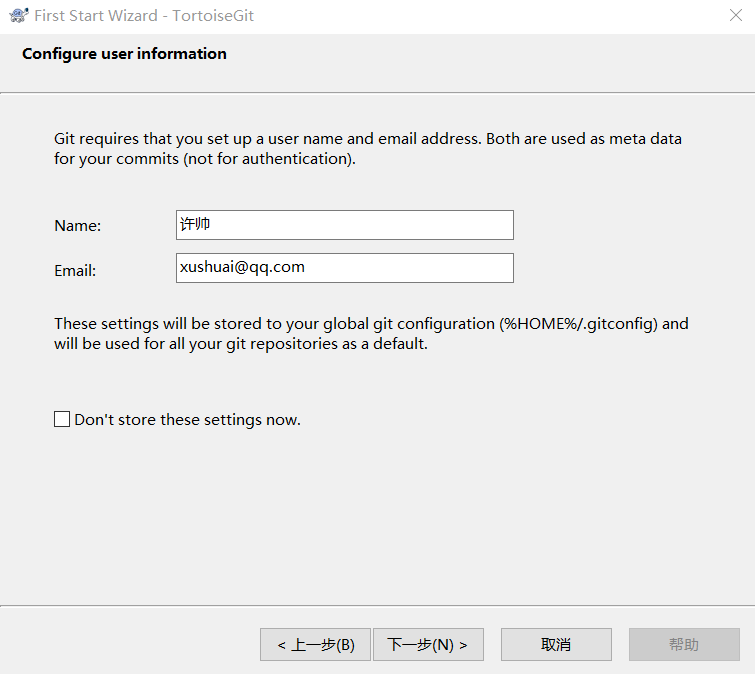

### 第一章  TortoiseGit安装过程

 

双击运行安装：

一路“Next”使用默认选项即可。

默认选项下会启动配置画面：

 

由于目前只有英文语言包，默认即可继续下一步。

配置git.exe，选择你系统git所以在此,找到git.exe所在的目录：

 

 配置开发者姓名及邮箱，每次提交代码时都会把此信息包含到提交的信息中:

使用默认配置，点击“完成”按钮完成配置:

 

完整完毕后在系统右键菜单中会出现git的菜单项。

 

### 第二章  安装中文语言包

安装中文语言包并不是必选项。可以根据个人情况来选择安装。

 

双击运行：

 

直接“下一步”完整完毕。 

鼠标右键选择Settings

 

语言包安装完毕后可以在TortoiseGit的设置中调整语言

